# IB 국제 바칼로레아 교육과정 완벽 가이드

> **목적**: 초등·중등·고등 과정별 IB 교육방법론과 AI 연계 수업 전략 제시  
> **대상**: 교육자, 학부모, 학생  
> **작성일**: 2026년 1월

---

## 📚 목차

1. [IB 교육이란?](#1-ib-교육이란)
2. [IB 프로그램 구조](#2-ib-프로그램-구조)
3. [학교급별 교육과정](#3-학교급별-교육과정)
4. [IB 학습자상 10가지](#4-ib-학습자상-10가지)
5. [교수학습 방법론](#5-교수학습-방법론)
6. [질문형·세미나 형식 수업](#6-질문형세미나-형식-수업)
7. [AI 연계 수업 전략](#7-ai-연계-수업-전략)
8. [실전 수업 예시](#8-실전-수업-예시)
9. [평가 체계](#9-평가-체계)
10. [한국 IB 학교 운영](#10-한국-ib-학교-운영)
11. [해외 대학 진학](#11-해외-대학-진학)
12. [교사 역량 개발](#12-교사-역량-개발)

---

## 1. IB 교육이란?

### 1.1 개요

**IB(International Baccalaureate, 국제 바칼로레아)**는 1968년 스위스 제네바에서 설립된 국제 교육과정입니다.

#### 핵심 특징
- ✅ **논술·서술형 평가**: 객관식 암기 평가 폐지
- ✅ **탐구 중심 학습**: 학생 주도적 질문과 문제 해결
- ✅ **국제적 인정**: 148개국 대학에서 공인
- ✅ **전인 교육**: 지식·감성·윤리의 균형 발달

### 1.2 IB 교육 철학

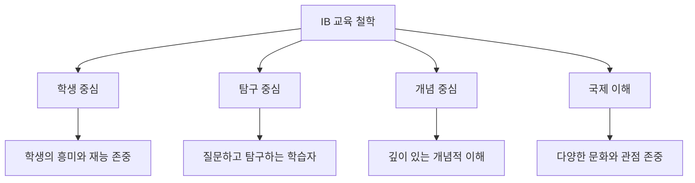

---

## 2. IB 프로그램 구조

### 2.1 전체 프로그램 체계

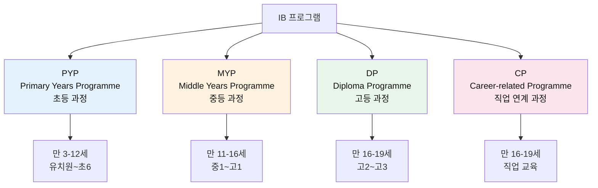

### 2.2 프로그램별 특징 비교

| 구분 | PYP (초등) | MYP (중등) | DP (고등) |
|------|-----------|-----------|----------|
| **연령** | 3-12세 | 11-16세 | 16-19세 |
| **교과 수** | 6개 | 8개 | 6개 과목군 |
| **학습 방식** | 간학문적 탐구 | 심화 탐구 + 프로젝트 | 논술 + 연구 |
| **평가** | 내부 평가 중심 | 내부 + 외부 평가 | 국제 표준 논술 시험 |
| **특별 요소** | 6개 초학문적 주제 | 개인 프로젝트, 봉사 | TOK, EE, CAS |
| **목표** | 평생학습 기초 | 학문적 토대 구축 | 대학 준비 + 학위 취득 |

---

## 3. 학교급별 교육과정

### 3.1 PYP (초등 과정)

#### 교과 구성 (6개 교과)

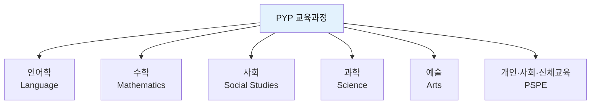

#### 6개 초학문적 주제 (Transdisciplinary Themes)

모든 교과를 통합하여 학습하는 핵심 주제:

1. **우리는 누구인가** (Who we are)
   - 자아 정체성, 가족, 공동체

2. **우리가 속한 공간과 시간** (Where we are in place and time)
   - 지리, 역사, 문화

3. **우리 자신을 표현하는 방법** (How we express ourselves)
   - 예술, 언어, 문화적 표현

4. **세상이 돌아가는 방식** (How the world works)
   - 과학적 탐구, 자연 현상

5. **우리 자신을 조직하는 방법** (How we organize ourselves)
   - 사회 시스템, 경제, 정치

6. **지구 공유하기** (Sharing the planet)
   - 환경, 지속 가능성, 공존

#### PYP 학습 프레임워크

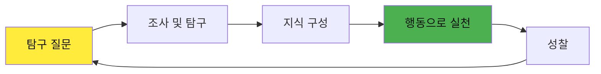

---

### 3.2 MYP (중등 과정)

#### 교과 구성 (8개 교과)

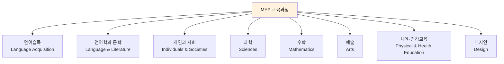

#### MYP 핵심 요소

1. **개인 프로젝트** (Personal Project)
   - 학생이 선택한 주제로 장기 프로젝트 수행
   - 자기주도 학습 능력 개발

2. **지역 봉사** (Community Service)
   - 실제 지역사회 문제 해결 참여
   - 사회적 책임감 함양

3. **STEAM 교육**
   - 과학, 기술, 공학, 예술, 수학 통합
   - 융합적 사고력 개발

#### MYP 평가 기준 (4가지)

| 기준 | 설명 |
|------|------|
| **A: 지식과 이해** | 교과 내용의 깊이 있는 이해 |
| **B: 탐구** | 질문하고 조사하는 능력 |
| **C: 소통** | 다양한 방식으로 표현하는 능력 |
| **D: 비판적 사고** | 분석하고 평가하는 능력 |

---

### 3.3 DP (고등 과정)

#### 교과 구성 (6개 과목군)

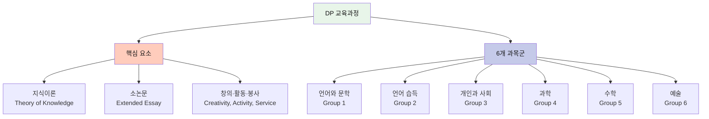

#### DP 핵심 3요소 (Core)

##### 1. TOK (지식이론, Theory of Knowledge)

**목적**: 지식의 본질을 탐구하고 비판적으로 사고하기

**학습 내용**:
- 우리는 무엇을 안다는 것인가?
- 지식은 어떻게 구성되는가?
- 다양한 지식 영역(과학, 역사, 예술 등)의 특성

**평가**:
- 에세이 1편 (1,200-1,600자)
- 구술 발표 10분

**이수 시간**: 2년간 100시간

##### 2. EE (소논문, Extended Essay)

**목적**: 독립적 연구 능력 개발

**학습 내용**:
- 학생이 선택한 주제로 심화 연구
- 학문적 글쓰기 기술 습득
- 연구 윤리와 인용 방법

**평가**:
- 4,000단어 이하의 논문
- 연구 과정 성찰 기록

**이수 시간**: 2년간 40시간

##### 3. CAS (창의·활동·봉사)

**목적**: 교실 밖 경험을 통한 전인적 성장

**구성**:
- **Creativity (창의)**: 예술, 음악, 창작 활동
- **Activity (활동)**: 스포츠, 신체 활동
- **Service (봉사)**: 지역사회 기여 활동

**평가**:
- 18개월 이상 지속적 참여
- 성찰 포트폴리오 작성

#### DP 과목 선택 방식

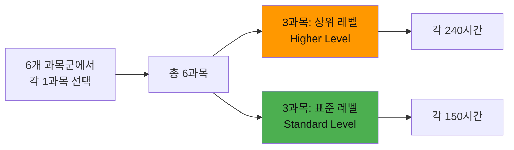

**예시 과목 선택**:
- Group 1: 한국어 문학 (HL)
- Group 2: 영어 (HL)
- Group 3: 경제학 (SL)
- Group 4: 화학 (HL)
- Group 5: 수학 (SL)
- Group 6: 시각예술 (SL)

---

## 4. IB 학습자상 10가지

IB는 학생들이 갖추어야 할 10가지 인재상을 제시합니다.

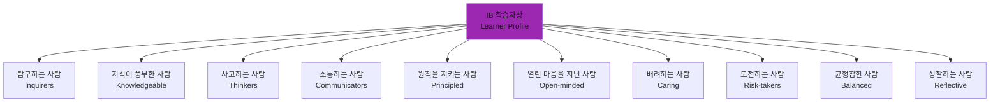

### 학습자상 상세 설명

| 학습자상 | 영문 | 설명 |
|---------|------|------|
| **탐구하는 사람** | Inquirers | 호기심을 기르고 탐구 기능을 습득하며 평생 학습을 즐김 |
| **지식이 풍부한 사람** | Knowledgeable | 개념적 이해와 폭넓은 학문 지식을 갖춤 |
| **사고하는 사람** | Thinkers | 비판적·창의적 사고로 복잡한 문제를 분석하고 해결함 |
| **소통하는 사람** | Communicators | 다양한 방법으로 자신감 있게 창의적으로 자기표현을 함 |
| **원칙을 지키는 사람** | Principled | 성실성, 정직성, 공정성, 책임감을 가지고 행동함 |
| **열린 마음을 지닌 사람** | Open-minded | 다양한 관점과 문화를 추구하고 평가함 |
| **배려하는 사람** | Caring | 공감, 인정, 존중의 정신으로 타인을 대함 |
| **도전하는 사람** | Risk-takers | 불확실성에 맞서 새로운 아이디어와 전략을 탐구함 |
| **균형잡힌 사람** | Balanced | 지성, 신체, 정서적 균형을 이룸 |
| **성찰하는 사람** | Reflective | 깊이 있는 사고와 자기평가를 통해 성장함 |

---

## 5. 교수학습 방법론

### 5.1 IB 교수학습 핵심 원칙

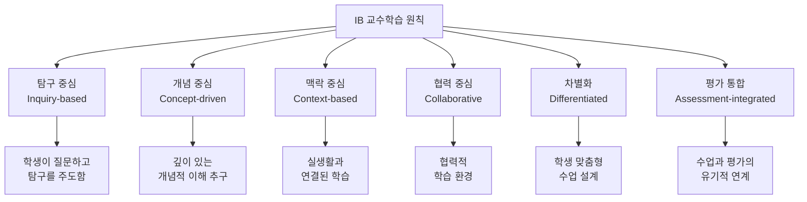

### 5.2 탐구 중심 학습 (Inquiry-based Learning)

#### 탐구 사이클

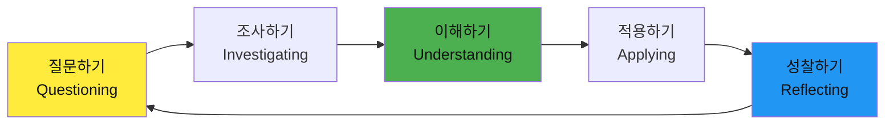

#### 탐구 질문의 3가지 유형

1. **사실적 질문** (Factual Questions)
   - "무엇인가?", "언제인가?", "어디인가?"
   - 기본 지식 확인

2. **개념적 질문** (Conceptual Questions)
   - "왜 그런가?", "어떻게 작동하는가?"
   - 깊이 있는 이해 유도

3. **논쟁적 질문** (Debatable Questions)
   - "어떻게 평가할 것인가?", "무엇이 최선인가?"
   - 비판적 사고와 토론 유발

### 5.3 개념 중심 학습 (Concept-driven Learning)

#### 주요 개념 (Key Concepts)

IB에서 강조하는 16개 핵심 개념:

| 개념 | 영문 | 설명 |
|------|------|------|
| **변화** | Change | 시간에 따른 변화와 발전 |
| **연결** | Connection | 관계와 상호작용 |
| **관점** | Perspective | 다양한 시각과 입장 |
| **책임** | Responsibility | 의무와 윤리적 행동 |
| **형태** | Form | 구조와 패턴 |
| **기능** | Function | 목적과 작동 방식 |
| **원인** | Causation | 원인과 결과 |
| **반성** | Reflection | 성찰과 자기평가 |

#### 개념 중심 수업 설계

```
[예시: 과학 수업]

주제: 기후 변화
핵심 개념: 변화, 연결, 책임

수업 질문:
- 기후는 어떻게 변화하는가? (변화)
- 인간 활동과 기후 변화는 어떻게 연결되는가? (연결)
- 우리는 기후 변화에 어떤 책임이 있는가? (책임)
```

### 5.4 차별화 수업 (Differentiated Instruction)

학생의 준비도, 흥미, 학습 스타일에 따라 수업을 차별화합니다.

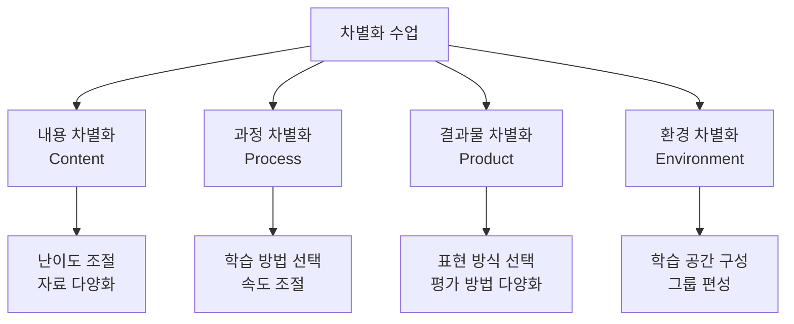

---

## 6. 질문형·세미나 형식 수업

### 6.1 질문형 수업 구조

#### 효과적인 질문 설계

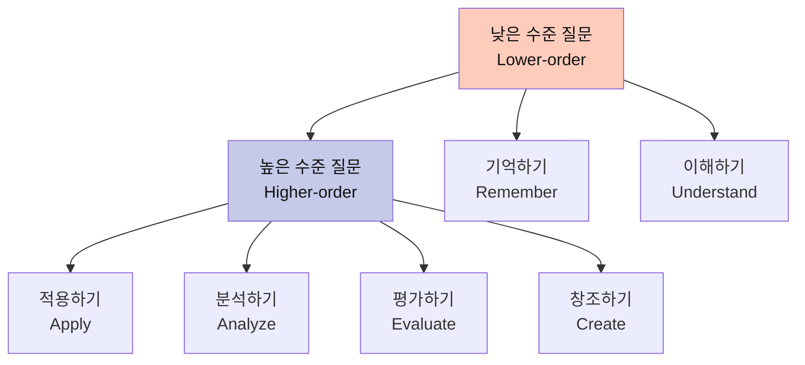

#### 질문형 수업 진행 단계

```
1단계: 도발적 질문 제시 (5분)
   ↓
   예: "인공지능이 인간보다 창의적일 수 있을까?"

2단계: 개인 사고 시간 (5분)
   ↓
   학생들이 각자 생각을 정리

3단계: 소그룹 토론 (15분)
   ↓
   4-5명이 의견을 나누고 근거 제시

4단계: 전체 토론 (15분)
   ↓
   각 그룹의 의견을 공유하고 토론

5단계: 성찰 및 정리 (5분)
   ↓
   배운 점과 새로운 질문 기록
```

### 6.2 세미나 형식 수업

#### 소크라테스식 세미나 (Socratic Seminar)

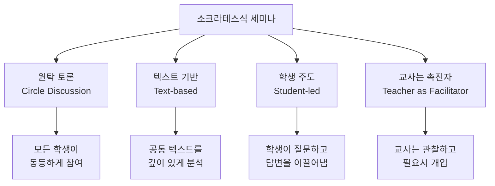

#### 세미나 진행 규칙

1. **경청**: 타인의 의견을 존중하며 듣기
2. **근거 제시**: 주장에는 반드시 근거 제시
3. **질문하기**: 이해를 돕는 질문 적극 활용
4. **연결하기**: 이전 발언과 자신의 의견 연결
5. **성찰하기**: 토론 후 배운 점 정리

#### 세미나 좌석 배치

```
[교사는 뒤에서 관찰]

    학생1
학생8      학생2
학생7      학생3
    학생6
학생5      학생4

[원형 배치로 모든 학생이 서로를 볼 수 있음]
```

### 6.3 하크니스 테이블 (Harkness Table)

**특징**:
- 타원형 테이블에 둘러앉아 토론
- 교사도 학생과 같은 위치에 앉음
- 완전한 학생 주도 토론

**진행 방식**:
1. 사전에 읽기 자료 제공
2. 학생들이 토론 주제와 질문 준비
3. 수업 시간에 자유롭게 토론
4. 교사는 필요시에만 개입

---

## 7. AI 연계 수업 전략

### 7.1 AI 활용 교육 프레임워크

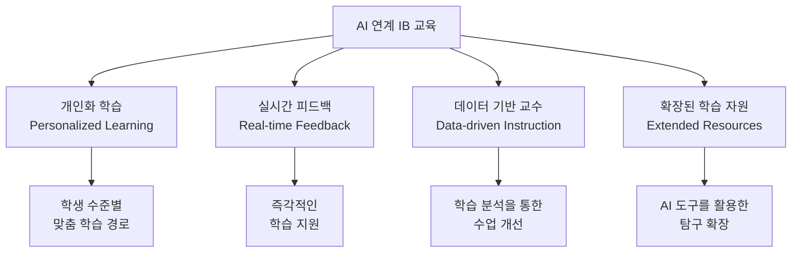

### 7.2 학교급별 AI 연계 전략

#### PYP (초등) - AI와 탐구 학습

```
주제: "우리가 속한 공간과 시간"
탐구 질문: "우리 동네는 어떻게 변했을까?"

1단계: AI 진단 (학습 준비도 파악)
   ↓
   - AI가 학생의 배경지식 테스트
   - 개별 학습 출발점 설정

2단계: AI 자료 제공 (맞춤형 학습 자원)
   ↓
   - 학생 수준에 맞는 읽기 자료
   - 과거와 현재 사진 비교 자료
   - 관련 영상 추천

3단계: AI 챗봇 대화 (탐구 지원)
   ↓
   학생: "왜 우리 동네에 아파트가 많아졌어요?"
   AI: "좋은 질문이네요! 인구 변화와 관련이 있을까요?
        어떤 자료를 찾아보면 좋을까요?"

4단계: AI 도구 활용 (창의적 표현)
   ↓
   - AI 그림 도구로 미래 동네 상상하기
   - AI 음성 도구로 인터뷰 기록하기

5단계: AI 피드백 (성찰 지원)
   ↓
   - 학습 과정 정리
   - 성장 포인트 시각화
```

#### MYP (중등) - AI와 프로젝트 학습

```
주제: "지속 가능한 도시 설계"
개인 프로젝트 예시

1단계: 문제 정의 (AI 데이터 분석)
   ↓
   - AI가 현재 도시 문제 통계 제공
   - 세계 도시 사례 데이터 분석
   - 학생이 집중할 문제 선택

2단계: 아이디어 발상 (AI 브레인스토밍)
   ↓
   학생: "교통 혼잡을 줄이는 방법은?"
   AI: "다음과 같은 접근이 가능합니다:
        1. 대중교통 개선
        2. 자전거 도로 확충
        3. 스마트 신호 시스템
        각 방법의 장단점을 비교해볼까요?"

3단계: 설계 (AI 시뮬레이션)
   ↓
   - AI 3D 모델링 도구로 도시 설계
   - AI 시뮬레이션으로 효과 예측
   - 데이터 기반 설계 개선

4단계: 연구 (AI 자료 검색)
   ↓
   - AI가 신뢰할 수 있는 학술 자료 추천
   - 자동 요약 및 핵심 내용 추출
   - 인용 형식 자동 생성

5단계: 발표 (AI 프레젠테이션 지원)
   ↓
   - AI가 발표 구조 제안
   - 시각 자료 자동 생성
   - 발표 연습 피드백
```

#### DP (고등) - AI와 논술·연구

##### TOK (지식이론) 에세이

```
주제: "인공지능 시대, 인간만의 지식은 무엇인가?"

1단계: 자료 수집 (AI 검색 및 큐레이션)
   ↓
   - AI가 관련 논문 검색 및 요약
   - 다양한 관점의 자료 제공
   - 신뢰도 평가 (학생이 최종 판단)

2단계: 논리 구성 (AI 구조화 지원)
   ↓
   학생: "이 주제로 어떻게 논증을 전개할까요?"
   AI: "다음과 같은 구조를 제안합니다:
        1. 서론: 문제 제기
        2. 본론1: 인간 지식의 특성
        3. 본론2: AI 지식의 한계
        4. 본론3: 상호보완 가능성
        5. 결론: 종합 및 시사점"

3단계: 작성 (학생 주도)
   ↓
   - 학생이 독립적으로 에세이 작성
   - AI는 참고 도구로만 사용

4단계: 첨삭 (AI 피드백)
   ↓
   AI 피드백 예시:
   - "3문단의 논리 전개가 명확하지 않습니다"
   - "이 주장에 대한 근거가 부족합니다"
   - "반대 입장도 고려해보세요"

5단계: 재검토 (비판적 성찰)
   ↓
   - AI 피드백을 참고하되 학생이 최종 결정
   - 자신의 목소리와 논리 유지
   - 표절 검사 및 인용 확인
```

##### EE (소논문) 연구

```
주제: "기후 변화가 한국 농업에 미치는 영향"

1단계: 연구 설계 (AI 방법론 지원)
   ↓
   - AI가 연구 방법론 제안
   - 데이터 수집 방법 안내
   - 연구 윤리 가이드 제공

2단계: 데이터 수집 (AI 도구 활용)
   ↓
   - AI가 통계 데이터 수집 및 정리
   - 그래프 자동 생성
   - 패턴 분석 지원

3단계: 문헌 검토 (AI 자료 분석)
   ↓
   - 관련 논문 자동 검색
   - 핵심 내용 요약
   - 연구 갭(gap) 파악

4단계: 논문 작성 (AI 글쓰기 지원)
   ↓
   - 학술적 글쓰기 스타일 제안
   - 문법 및 표현 개선
   - 인용 형식 자동 적용

5단계: 동료 검토 (AI 품질 검증)
   ↓
   - 논리적 일관성 검사
   - 데이터 해석의 적절성 평가
   - 개선 사항 제안
```

### 7.3 AI 활용 시 주의사항

#### 윤리적 고려사항

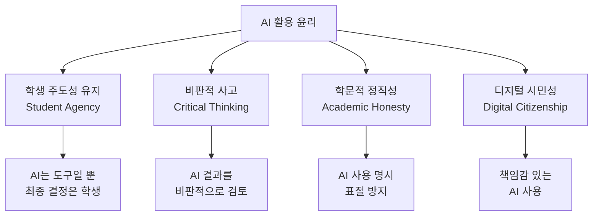

#### AI 사용 가이드라인

| 허용되는 사용 | 허용되지 않는 사용 |
|-------------|-----------------|
| ✅ 아이디어 브레인스토밍 | ❌ AI가 작성한 글을 그대로 제출 |
| ✅ 자료 검색 및 요약 | ❌ AI로 시험 문제 풀기 |
| ✅ 문법 및 표현 개선 | ❌ AI 결과를 비판 없이 수용 |
| ✅ 데이터 분석 지원 | ❌ AI 사용 사실 숨기기 |
| ✅ 학습 피드백 받기 | ❌ 타인의 AI 결과물 도용 |

---

## 8. 실전 수업 예시

### 8.1 PYP 수업 예시

#### 주제: "우리가 속한 공간과 시간"

**학년**: 초등 4학년  
**기간**: 6주  
**통합 교과**: 사회, 과학, 언어, 수학, 예술

#### 수업 설계

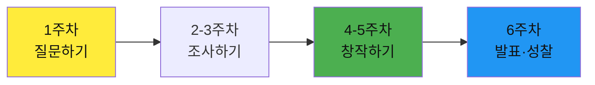

#### 주차별 활동

**1주차: 탐구 질문 만들기**
```
교사: "우리 동네는 어떻게 변했을까요?"

학생 질문 예시:
- "왜 옛날 사진에는 아파트가 없어요?"
- "우리 학교는 언제 지어졌어요?"
- "할머니 할아버지 때는 어떻게 다녔어요?"

활동:
- 옛날과 지금 사진 비교
- 질문 목록 작성
- 조사 계획 세우기
```

**2-3주차: 다학문적 조사**
```
[사회]
- 지역 역사 자료 조사
- 지도 변화 비교

[과학]
- 환경 변화 관찰
- 나무 나이테 조사

[언어]
- 어르신 인터뷰
- 조사 내용 기록

[수학]
- 인구 변화 그래프
- 건물 수 통계

[예술]
- 과거 풍경 그리기
- 사진 콜라주 만들기

[AI 활용]
- AI 챗봇과 질문 대화
- 과거 사진 복원 체험
- 미래 모습 상상하기
```

**4-5주차: 창작 프로젝트**
```
모둠별 프로젝트:
1. 타임캡슐 만들기
2. 동네 역사 책 제작
3. 과거-현재-미래 전시회
4. 다큐멘터리 영상 제작

AI 도구 활용:
- 영상 편집
- 음성 내레이션
- 디자인 작업
```

**6주차: 발표 및 성찰**
```
발표회:
- 학부모 초청 전시회
- 지역 주민 초대
- 프로젝트 발표

성찰:
- "무엇을 배웠나요?"
- "어떤 점이 어려웠나요?"
- "새로 궁금한 것은?"
```

---

### 8.2 MYP 수업 예시

#### 주제: "공정성과 발전"

**학년**: 중등 2학년  
**기간**: 8주  
**통합 교과**: 사회, 과학, 수학, 언어, 디자인

#### 수업 설계

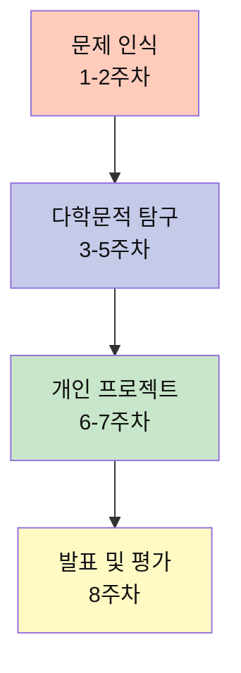

#### 주차별 활동

**1-2주차: 문제 인식**
```
핵심 질문: "세계 빈부격차는 왜 커지는가?"

도입 활동:
- 세계 소득 분포 데이터 분석
- 다양한 국가의 생활 수준 비교
- 뉴스 기사 비판적 읽기

AI 활용:
- 세계 경제 데이터 시각화
- 통계 분석 도구
- 다양한 관점의 자료 수집
```

**3-5주차: 다학문적 탐구**
```
[사회]
주제: 경제 시스템과 불평등
- 자본주의, 사회주의 비교
- 복지 정책 연구
- 역사적 사례 분석

[과학]
주제: 자원 분배와 기술
- 식량 생산과 분배
- 재생 에너지 접근성
- 기술 격차

[수학]
주제: 불평등 지표
- 지니 계수 계산
- 통계 그래프 해석
- 데이터 기반 예측

[언어]
주제: 설득적 글쓰기
- 논증 구조 학습
- 에세이 작성
- 토론 준비

[디자인]
주제: 해결책 디자인
- 문제 해결 디자인 씽킹
- 프로토타입 제작
- 사용자 테스트

AI 활용:
- 데이터 분석 및 시각화
- 시뮬레이션 모델링
- 자료 검색 및 요약
```

**6-7주차: 개인 프로젝트**
```
학생 선택 주제 예시:
1. "우리 지역의 빈곤 문제 해결 방안"
2. "공정 무역이 세계 경제에 미치는 영향"
3. "교육 기회 불평등 개선 프로젝트"

프로젝트 요소:
- 문제 분석 (연구)
- 해결책 제안 (창의성)
- 실행 가능성 평가 (비판적 사고)
- 지역사회 봉사 연계 (실천)

AI 활용:
- 연구 방법론 지원
- 데이터 수집 및 분석
- 프레젠테이션 제작
- 피드백 받기
```

**8주차: 발표 및 평가**
```
발표 형식:
- 10분 프레젠테이션
- 5분 질의응답
- 동료 평가

평가 기준 (MYP 4가지 기준):
A. 지식과 이해 (25%)
B. 탐구 (25%)
C. 소통 (25%)
D. 비판적 사고 (25%)

성찰:
- 프로젝트 일지 검토
- 배운 점과 성장 포인트
- 다음 학습 목표 설정
```

---

### 8.3 DP 수업 예시

#### 과목: 화학 (Higher Level)

**주제**: 기후 변화와 화학  
**학년**: 고등 2학년  
**기간**: 4주

#### 수업 설계

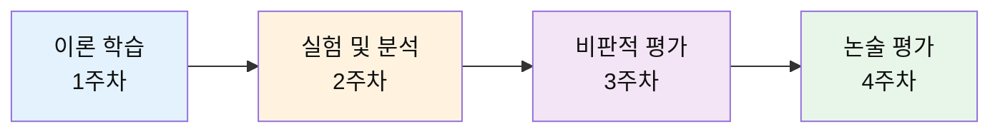

#### 주차별 활동

**1주차: 이론 학습**
```
주제: 온실가스와 화학 반응

학습 내용:
- CO2, CH4, N2O의 분자 구조
- 온실 효과의 화학적 메커니즘
- 화석 연료 연소 반응식

수업 방식:
- 개념 중심 질문: "왜 CO2는 온실가스인가?"
- 소그룹 토론
- 분자 모델링 (AI 도구 활용)

TOK 연계:
- "과학적 지식은 어떻게 구성되는가?"
- "기후 변화 과학의 신뢰성은?"
```

**2주차: 실험 및 분석**
```
실험: CO2 포집 및 측정

실험 과정:
1. 다양한 연료 연소 시 CO2 발생량 측정
2. CO2 포집 방법 실험
3. 데이터 수집 및 분석

AI 활용:
- 실험 데이터 자동 분석
- 그래프 생성 및 해석
- 오차 분석

보고서 작성:
- 실험 목적 및 가설
- 방법 및 결과
- 논의 및 결론
```

**3주차: 비판적 평가**
```
주제: 기후 변화 대응 기술 평가

활동:
1. 자료 조사
   - 탄소 포집 기술 (CCS)
   - 재생 에너지 (수소, 태양광)
   - 바이오 연료

2. 세미나 토론
   질문: "각 기술의 장단점은 무엇인가?"
   - 효율성
   - 경제성
   - 환경 영향
   - 실현 가능성

3. AI 활용
   - 다양한 자료 수집
   - 신뢰도 평가
   - 데이터 비교 분석

4. 비판적 사고
   - 상충하는 주장 비교
   - 이해관계 분석
   - 증거 기반 판단
```

**4주차: 논술 평가**
```
평가 문제:
"화석 연료 사용의 화학적 영향을 평가하고,
지속 가능한 대안을 제시하시오."

평가 요소:
1. 지식과 이해 (30%)
   - 화학 개념의 정확성
   - 반응식의 정확성

2. 적용과 분석 (30%)
   - 실제 상황에 개념 적용
   - 데이터 해석

3. 종합과 평가 (25%)
   - 다양한 관점 통합
   - 비판적 평가

4. 소통 (15%)
   - 논리적 구조
   - 명확한 표현

답안 작성 시간: 90분
분량: 1,500-2,000자

AI 활용 (준비 단계):
- 자료 검색 및 정리
- 논리 구조 브레인스토밍
- 초안 피드백 (평가 전)

⚠️ 주의: 실제 평가에서는 AI 사용 불가
```

#### DP 핵심 요소 연계

**TOK (지식이론) 연계**
```
질문:
- "과학적 지식은 절대적인가?"
- "기후 변화 논쟁에서 과학의 역할은?"
- "윤리적 고려는 과학적 판단에 어떤 영향을 미치는가?"

활동:
- TOK 에세이 주제로 발전
- 다양한 지식 영역 비교 (과학, 윤리, 경제)
```

**EE (소논문) 연계**
```
가능한 연구 주제:
- "한국의 재생 에너지 정책 평가"
- "바이오 연료의 환경 영향 분석"
- "탄소 포집 기술의 경제성 연구"

연구 방법:
- 문헌 검토
- 실험 또는 설문 조사
- 데이터 분석
- AI 도구 활용
```

**CAS (창의·활동·봉사) 연계**
```
활동 예시:
- 창의: 환경 캠페인 포스터 제작
- 활동: 자전거 타기 챌린지
- 봉사: 지역 환경 정화 활동

성찰:
- 화학 지식이 실생활에 어떻게 적용되는가?
- 개인의 행동이 환경에 미치는 영향은?
```

---

## 9. 평가 체계

### 9.1 IB 평가 철학

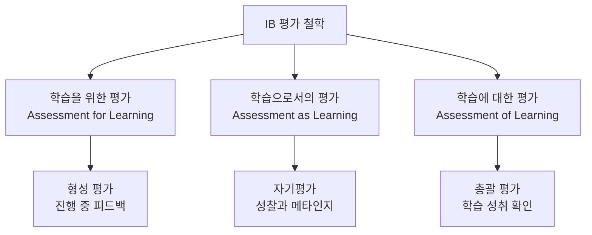

### 9.2 평가 유형

#### 내부 평가 (Internal Assessment)

**특징**:
- 교사가 설계하고 평가
- IBO 가이드라인 준수
- 외부 검증 (Moderation)

**예시**:
- 실험 보고서
- 구술 발표
- 프로젝트
- 포트폴리오

#### 외부 평가 (External Assessment)

**특징**:
- IBO에서 출제
- 국제 표준 평가
- 논술형 시험

**DP 평가 예시**:
```
Paper 1: 단답형 + 논술형 (1시간)
Paper 2: 심화 논술형 (2시간)
Paper 3: 데이터 기반 문제 (1시간)
```

### 9.3 DP 점수 체계

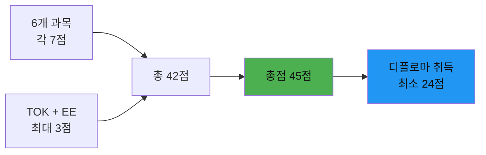

#### 점수 기준

| 점수 | 수준 | 설명 |
|------|------|------|
| **7** | Excellent | 탁월한 이해와 적용 |
| **6** | Very Good | 매우 우수한 수준 |
| **5** | Good | 우수한 이해 |
| **4** | Satisfactory | 만족스러운 수준 |
| **3** | Mediocre | 보통 수준 |
| **2** | Poor | 미흡한 수준 |
| **1** | Very Poor | 매우 미흡 |

#### 디플로마 취득 조건

1. ✅ 총점 24점 이상
2. ✅ TOK + EE에서 최소 2점
3. ✅ 3점 이하 과목이 3개 이하
4. ✅ CAS 요건 충족
5. ✅ 학문적 정직성 준수

### 9.4 루브릭 (Rubric) 예시

#### MYP 과학 실험 보고서 루브릭

| 기준 | 1-2점 (미흡) | 3-4점 (보통) | 5-6점 (우수) | 7-8점 (탁월) |
|------|------------|------------|------------|------------|
| **A: 지식과 이해** | 개념 이해 부족 | 기본 개념 이해 | 개념을 정확히 이해 | 깊이 있는 이해와 연결 |
| **B: 탐구** | 절차 불명확 | 기본 절차 수행 | 체계적 탐구 | 독창적이고 정교한 탐구 |
| **C: 소통** | 표현 불명확 | 기본적 표현 | 명확한 표현 | 효과적이고 설득력 있는 표현 |
| **D: 비판적 사고** | 분석 부족 | 기본적 분석 | 비판적 분석 | 깊이 있는 평가와 성찰 |

---

## 10. 한국 IB 학교 운영

### 10.1 한국 IB 도입 역사

```mermaid
timeline
    title 한국 IB 교육 도입 타임라인
    2017 : 대구·제주 교육청 IB 도입 시작
    2018 : IB 한국어화 작업 착수
    2019 : IB 한국어 번역 확정
    2021 : 첫 국공립 IB 월드스쿨 인증
    2023 : 첫 IB 졸업생 배출
    2024 : 7개 시도 교육청 MOU 체결
    2026 : 전국 확대 추진 중
```

### 10.2 IB 인증 절차

```mermaid
graph TB
    A[관심학교<br/>Interested School] --> B[후보학교<br/>Candidate School]
    B --> C[인증학교<br/>Authorized School]
    C --> D[5년 주기 재인증]
    D --> C
    
    A --> A1[1-2년<br/>IB 이해 및 준비]
    B --> B1[1-2년<br/>교사 연수 및 시범 운영]
    C --> C1[정식 IB 월드스쿨]
    
    style A fill:#ffccbc,color:#111
    style B fill:#fff9c4,color:#111
    style C fill:#c8e6c9,color:#111
```

#### 단계별 주요 활동

**1단계: 관심학교 (Interested School)**
```
학교 활동:
- IB 안내서 구입 및 연구
- IB 학교 방문 및 벤치마킹
- 워크숍 참가
- 구성원 공감대 형성

교육청 지원:
- 정책 안내
- 예산 지원 계획
- 네트워크 구축

기간: 1-2년
```

**2단계: 후보학교 (Candidate School)**
```
학교 활동:
- Application for Candidacy 제출
- 교사 연수 이수 (필수)
- 교육과정 설계
- 시범 수업 운영
- 자체평가보고서 작성
- IBO 검증 방문 (Verification Visit) 준비

교육청 지원:
- 교사 연수 지원
- 예산 지원
- 행정 협조

기간: 1-2년
비용: 약 1,000만원 (후보학교 등록비)
```

**3단계: 인증학교 (Authorized School)**
```
학교 활동:
- IB 월드스쿨 공식 운영
- 지속적 품질 관리
- 5년 주기 재인증 준비
- 교사 전문성 개발

교육청 지원:
- 지속적 예산 지원
- 정책적 지원
- 네트워크 운영

연회비: 약 500만원
```

### 10.3 한국 IB 학교 현황 (2026년 기준)

#### 지역별 IB 학교

```mermaid
graph TB
    A[한국 IB 학교] --> B[서울]
    A --> C[경기]
    A --> D[대구]
    A --> E[제주]
    A --> F[기타 지역]
    
    B --> B1[확대 추진 중]
    C --> C1[확대 추진 중]
    D --> D1[경북대학교사범대학부설고<br/>첫 졸업생 배출]
    E --> E1[표선고등학교<br/>선도 학교]
    F --> F1[인천, 충남, 전남, 전북]
```

#### 주요 IB 학교 사례

**1. 제주 표선고등학교**
- 2021년: DP 인증
- 2023년: 첫 졸업생 배출
- 성과: 국내외 명문대 합격

**2. 대구 경북대학교사범대학부설고등학교**
- 2021년: DP 인증
- 2023년: 첫 졸업생 배출
- 성과: 서울대, 연세대, 고려대 등 합격

**3. 서울·경기 지역**
- 2024년: MOU 체결
- 확대 추진 중

### 10.4 한국 IB 학교 운영 방식

#### 교육과정 편성

```
[일반 고등학교 + IB DP 통합 모델]

1학년 (고1):
- 한국 교육과정 (공통 과목)
- IB 준비 과정

2-3학년 (고2-3):
- IB DP 과정
- 한국 교육과정 일부 병행
- 수능 선택 가능
```

#### 평가 방식

```mermaid
graph LR
    A[학생 평가] --> B[IB 평가<br/>논술형]
    A --> C[학교 내신<br/>병행]
    
    B --> D[IB 디플로마]
    C --> E[한국 졸업장]
    
    D --> F[해외 대학 진학]
    E --> G[국내 대학 진학]
    
    style D fill:#4caf50,color:#111
    style E fill:#2196f3,color:#111
```

### 10.5 교육청별 지원 정책

| 교육청 | 주요 정책 | 특징 |
|--------|---------|------|
| **대구교육청** | 공교육 IB 도입 선도 | 보수·진보 초당적 지지 |
| **제주교육청** | 국제화 교육 특화 | 영어 교육 강점 활용 |
| **서울시교육청** | 확대 추진 중 | 다수 학교 관심 표명 |
| **경기도교육청** | 지역 학교 중심 확대 | 공립학교 중심 |

---

## 11. 해외 대학 진학

### 11.1 IB와 대학 입시

```mermaid
graph TB
    A[IB DP 디플로마] --> B[국제적 인정]
    
    B --> C[미국 대학]
    B --> D[영국 대학]
    B --> E[캐나다 대학]
    B --> F[유럽 대학]
    B --> G[아시아 대학]
    B --> H[한국 대학]
    
    C --> C1[Ivy League 포함<br/>대부분의 대학 인정]
    D --> D1[Russell Group 포함<br/>높은 선호도]
    E --> E1[토론토대, UBC 등<br/>학점 인정]
    F --> F1[옥스브리지 등<br/>입학 자격 인정]
    G --> G1[싱가포르, 홍콩 등<br/>우대]
    H --> H1[수시 전형<br/>학생부 종합 전형]
    
    style A fill:#4caf50,color:#fff,color:#111
```

### 11.2 미국 대학 진학

#### IB의 강점

1. **커리큘럼 강도 인정**
   - NACAC 조사: 60%의 대학이 커리큘럼 강도를 중요하게 평가
   - IB DP는 가장 엄격한 고교 과정으로 인정

2. **학점 인정 (AP Credit)**
   - HL 과목에서 5점 이상 시 대학 학점 인정
   - 학교별로 1-4학점 인정

3. **입학 우대**
   - 많은 대학이 IB 학생을 선호
   - 대학 준비도가 높다고 평가

#### 학점 인정 예시

| 대학 | IB 점수 요구 | 인정 학점 |
|------|------------|---------|
| **하버드** | HL 7점 | 과목당 학점 인정 |
| **스탠포드** | HL 5점 이상 | 최대 45학점 |
| **MIT** | HL 6-7점 | 과목별 상이 |
| **UC 버클리** | HL 5점 이상 | 과목당 2.7-5.3학점 |

#### 입시 성과

```
IB DP 졸업생:
- 고등교육 등록률: 일반 학생 대비 35% 높음
- 4년제 대학 졸업률: 40% 높음
- 2학년 계속 진학률: 높은 편
```

### 11.3 영국 대학 진학

#### UCAS 점수 환산

IB 점수를 UCAS 점수로 환산하여 입학 심사:

| IB 총점 | UCAS 점수 |
|---------|----------|
| 45점 | 최고 점수 |
| 42점 | 옥스브리지 지원 가능 |
| 38점 | Russell Group 지원 가능 |
| 35점 | 일반 대학 지원 가능 |

#### 주요 대학 IB 요구 점수

| 대학 | IB 요구 점수 |
|------|------------|
| **옥스퍼드** | 38-40점 |
| **케임브리지** | 40-42점 |
| **임페리얼 칼리지** | 38-41점 |
| **LSE** | 37-38점 |
| **UCL** | 38-40점 |

### 11.4 한국 대학 진학

#### 입시 전형

```mermaid
graph LR
    A[IB 학생] --> B[수시 전형]
    A --> C[정시 전형]
    
    B --> B1[학생부 종합 전형<br/>IB 성적 활용]
    C --> C1[수능 응시<br/>정시 지원]
    
    style B1 fill:#4caf50,color:#111
```

#### 수시 전형 활용

**학생부 종합 전형**:
- IB 교육과정 이수 사실 기재
- IB 성적 제출 (학교별 상이)
- TOK, EE, CAS 활동 기록
- 자기소개서에 IB 경험 서술

**주요 대학 IB 학생 선발**:
- 서울대, 연세대, 고려대 등
- 국제화 전형, 학생부 종합 전형
- IB 교육과정의 차별성 인정

### 11.5 대학 진학 전략

#### 진학 준비 타임라인

```
고1 (DP 1년차):
- 과목 선택 신중히
- TOK, CAS 시작
- 대학 정보 수집

고2 (DP 2년차 전반기):
- EE 주제 선정 및 연구
- 내부 평가 준비
- 대학 방문 및 상담

고2 후반 - 고3 초반:
- 외부 평가 (시험)
- 대학 지원서 작성
- 추천서 준비

고3 (졸업):
- IB 최종 시험 (5월)
- 결과 발표 (7월)
- 대학 입학 (9월)
```

#### 성공적인 진학을 위한 팁

1. **과목 선택**
   - 진로와 연계된 과목 선택
   - HL/SL 균형 있게 배치
   - 자신의 강점 과목 HL로 선택

2. **EE 주제**
   - 대학 전공과 연계
   - 독창성과 학문적 깊이
   - 연구 가능한 범위로 설정

3. **CAS 활동**
   - 진로와 연관된 활동
   - 지속성과 리더십 보여주기
   - 성찰 기록 충실히

4. **추천서**
   - IB 교사에게 요청
   - IB 과정의 도전과 성장 강조
   - 구체적 사례 포함 요청

---

## 12. 교사 역량 개발

### 12.1 IB 교사 자격

#### 필수 요건

```mermaid
graph TB
    A[IB 교사 자격] --> B[교원 자격증<br/>기본 요건]
    A --> C[IB 연수 이수<br/>필수]
    A --> D[지속적 전문성 개발<br/>권장]
    
    B --> B1[해당 교과 교원 자격증]
    C --> C1[IB 공식 워크숍<br/>Category 1, 2, 3]
    D --> D1[IB 컨퍼런스 참가<br/>온라인 연수]
```

### 12.2 한국교원대학교 IBEC 프로그램

#### 프로그램 구조

```mermaid
graph TB
    A[한국교원대학교<br/>글로벌교사교육전공] --> B[석사 학위 과정<br/>5학기, 30학점]
    A --> C[비학위 과정<br/>2학기, 12학점]
    
    B --> B1[IB 교사 양성<br/>+ 석사 학위]
    C --> C1[IB 교사 자격<br/>단기 취득]
```

#### 필수 교과목 (Core Courses)

| 교과목 | 내용 | 학점 |
|--------|------|------|
| **IB 교육과정 이해** | PYP/MYP/DP 구조와 철학 | 3 |
| **IB 교수학습론** | 탐구 중심 교수법 | 3 |
| **PLC 기반 교육과정 설계** | 협력적 교육과정 개발 | 3 |
| **IB 평가론** | 논술형 평가 설계 | 3 |

#### 선택 교과목

| 교과목 | 내용 |
|--------|------|
| **AI·디지털 교육 이해** | AI 시대 교육 변화 |
| **인공지능과 맞춤형 수업설계** | AI 활용 개인화 학습 |
| **과학과 AI 융합 프로젝트** | STEAM 교육 |
| **뇌기반학습과학** | 학습 과학 이론 |
| **융합교육 연구방법론** | 교육 연구 방법 |

### 12.3 IB 공식 워크숍

#### 워크숍 카테고리

```mermaid
graph LR
    A[IB 워크숍] --> B[Category 1<br/>입문]
    A --> C[Category 2<br/>심화]
    A --> D[Category 3<br/>전문가]
    
    B --> B1[IB 교사 시작<br/>필수 과정]
    C --> C1[경험 교사<br/>심화 학습]
    D --> D1[워크숍 리더<br/>전문가 양성]
    
    style B fill:#ffccbc,color:#111
    style C fill:#fff9c4,color:#111
    style D fill:#c8e6c9,color:#111
```

#### Category 1 (입문 워크숍)

**대상**: IB를 처음 가르치는 교사

**내용**:
- IB 철학과 학습자상
- 교육과정 구조와 내용
- 교수학습 전략
- 평가 방법

**기간**: 3-5일 (집중 과정)

**비용**: 약 100-150만원

#### Category 2 (심화 워크숍)

**대상**: IB 경험이 있는 교사

**내용**:
- 심화 교수법
- 평가 루브릭 개발
- 내부 평가 채점
- 교육과정 개선

#### Category 3 (전문가 워크숍)

**대상**: IB 워크숍 리더 희망자

**내용**:
- 성인 학습 이론
- 워크숍 설계 및 진행
- IB 품질 관리

### 12.4 교사 전문학습공동체 (PLC)

#### PLC 운영 구조

```mermaid
graph TB
    A[IB 교사 PLC] --> B[교과별 PLC]
    A --> C[학년별 PLC]
    A --> D[주제별 PLC]
    
    B --> B1[교과 교육과정 협의<br/>평가 기준 개발]
    C --> C1[학년 교육과정 통합<br/>프로젝트 설계]
    D --> D1[TOK, CAS 등<br/>특정 주제 연구]
```

#### PLC 활동 예시

**정기 모임**:
- 주 1회, 2시간
- 교육과정 협의
- 수업 사례 공유
- 평가 기준 개발

**협력 활동**:
- 공동 수업 설계
- 동료 수업 관찰
- 학생 작품 공동 채점
- 피드백 나눔

### 12.5 교사 역량 개발 로드맵

```mermaid
graph LR
    A[1단계<br/>입문] --> B[2단계<br/>발전]
    B --> C[3단계<br/>숙련]
    C --> D[4단계<br/>전문가]
    
    A --> A1[IB 이해<br/>Category 1 워크숍]
    B --> B1[수업 실천<br/>PLC 참여]
    C --> C1[평가 전문성<br/>Category 2 워크숍]
    D --> D1[리더십<br/>워크숍 리더]
    
    style A fill:#ffccbc,color:#111
    style B fill:#fff9c4,color:#111
    style C fill:#c8e6c9,color:#111
    style D fill:#81c784,color:#111
```

---

## 13. IB 교육의 장점과 도전

### 13.1 IB 교육의 장점

```mermaid
graph TB
    A[IB 교육의 장점] --> B[학생 측면]
    A --> C[교사 측면]
    A --> D[사회 측면]
    
    B --> B1[비판적 사고력 향상]
    B --> B2[국제적 시야 확대]
    B --> B3[자기주도 학습 능력]
    B --> B4[대학 준비도 향상]
    
    C --> C1[전문성 개발 기회]
    C --> C2[협력적 문화 조성]
    C --> C3[교육 철학 재정립]
    
    D --> D1[교육 혁신 촉진]
    D --> D2[국제 경쟁력 강화]
    D --> D3[미래 인재 양성]
```

#### 학생 측면

1. **비판적 사고력**
   - 질문하고 탐구하는 습관
   - 다양한 관점 고려
   - 증거 기반 판단

2. **국제적 시야**
   - 다문화 이해
   - 글로벌 이슈 인식
   - 국제 시민 의식

3. **자기주도 학습**
   - 스스로 학습 목표 설정
   - 학습 과정 관리
   - 성찰과 개선

4. **대학 준비도**
   - 학문적 글쓰기 능력
   - 연구 능력
   - 시간 관리 능력

#### 교사 측면

1. **전문성 개발**
   - 국제적 교육 네트워크
   - 지속적 연수 기회
   - 교수법 혁신

2. **협력적 문화**
   - PLC 활동
   - 동료 교사와 협력
   - 지식 공유

3. **교육 철학**
   - 학생 중심 교육 실천
   - 평가 철학 재정립
   - 교육의 본질 탐구

### 13.2 IB 교육의 도전

```mermaid
graph TB
    A[IB 교육의 도전] --> B[학생 측면]
    A --> C[교사 측면]
    A --> D[학교 측면]
    
    B --> B1[높은 학업 부담]
    B --> B2[언어 장벽]
    B --> B3[적응 기간 필요]
    
    C --> C1[연수 시간 확보]
    C --> C2[평가 부담]
    C --> C3[교육과정 설계 어려움]
    
    D --> D1[높은 비용]
    D --> D2[시설 및 자원]
    D --> D3[학부모 이해 필요]
```

#### 극복 방안

1. **학생 지원**
   - 단계적 적응 프로그램
   - 언어 지원 (영어, 한국어)
   - 학습 상담 강화

2. **교사 지원**
   - 충분한 연수 시간 확보
   - 행정 업무 경감
   - PLC 활동 지원

3. **학교 지원**
   - 교육청 예산 지원
   - 시설 및 자원 확충
   - 학부모 교육 프로그램

---

## 14. 결론: IB 교육의 미래

### 14.1 한국 교육에서의 의미

IB 교육은 한국 교육의 **패러다임 전환**을 상징합니다:

```mermaid
graph LR
    A[전통 교육] --> B[IB 교육]
    
    A --> A1[암기 중심]
    A --> A2[객관식 평가]
    A --> A3[교사 중심]
    A --> A4[입시 중심]
    
    B --> B1[탐구 중심]
    B --> B2[논술형 평가]
    B --> B3[학생 중심]
    B --> B4[역량 중심]
    
    style A fill:#ffccbc,color:#111
    style B fill:#c8e6c9,color:#111
```

### 14.2 AI 시대와 IB 교육

AI 시대에 IB 교육이 더욱 중요한 이유:

1. **비판적 사고**
   - AI 정보를 비판적으로 평가
   - 인간만의 판단력 유지

2. **창의성**
   - AI가 모방할 수 없는 창의적 사고
   - 새로운 질문을 만드는 능력

3. **윤리적 판단**
   - AI 활용의 윤리적 고려
   - 인간 중심 가치 유지

4. **협력과 소통**
   - AI와 협력하는 능력
   - 인간 간 소통의 중요성

### 14.3 향후 전망

```
2026년: 전국 확대 추진
2028년: 고교학점제와 연계 본격화
2030년: IB 교육의 대중화
```

IB 교육은 단순히 해외 대학 진학을 위한 수단이 아니라, **21세기 역량을 갖춘 인재를 양성하는 교육 철학**입니다. AI와 결합된 IB 교육은 **개인화된 학습**과 **깊이 있는 사고**를 동시에 실현할 수 있는 미래 교육의 모델이 될 것입니다.

---

## 📚 참고 자료

### 공식 자료
- IBO 공식 웹사이트: [www.ibo.org](https://www.ibo.org)
- 한국교원대학교 IBEC: [www.knue.ac.kr/ibibec](https://www.knue.ac.kr/ibibec)
- 서울시교육청 IB 정보: [www.sen.go.kr](https://www.sen.go.kr)
- 대구광역시교육청 IB: [www.cbe.go.kr/ib](https://www.cbe.go.kr/ib)

### 추천 도서
- 『IB를 말하다』 (대구광역시교육청)
- 『국제 바칼로레아 교육과정』 (IBO)
- 『탐구하는 학습자』 (IBO)

### 온라인 자료
- IB 공식 유튜브 채널
- 한국 IB 교사 네트워크
- IB 학부모 커뮤니티

---

## 부록: 용어 정리

| 용어 | 영문 | 설명 |
|------|------|------|
| **IB** | International Baccalaureate | 국제 바칼로레아 |
| **IBO** | International Baccalaureate Organization | 국제 바칼로레아 기구 |
| **PYP** | Primary Years Programme | 초등 과정 (3-12세) |
| **MYP** | Middle Years Programme | 중등 과정 (11-16세) |
| **DP** | Diploma Programme | 고등 과정 (16-19세) |
| **CP** | Career-related Programme | 직업 연계 과정 |
| **TOK** | Theory of Knowledge | 지식이론 |
| **EE** | Extended Essay | 소논문 |
| **CAS** | Creativity, Activity, Service | 창의·활동·봉사 |
| **HL** | Higher Level | 상위 레벨 (240시간) |
| **SL** | Standard Level | 표준 레벨 (150시간) |
| **PLC** | Professional Learning Community | 전문학습공동체 |
| **IBEC** | IB Educator Certificate | IB 교육자 자격증 |

---

## 15. 자주 묻는 질문 (FAQ)

### 📌 기본 이해

#### Q1. IB 교육과 일반 교육의 가장 큰 차이는 무엇인가요?

**A**: IB는 **논술형 평가**와 **탐구 중심 학습**이 핵심입니다. 일반 교육이 객관식 시험과 암기 중심이라면, IB는 "왜?"라는 질문을 통해 깊이 있게 사고하고, 논술로 자신의 생각을 표현합니다.

```mermaid
graph LR
    A[일반 교육] --> A1[암기 중심]
    A --> A2[객관식 평가]
    A --> A3[교사 주도]
    
    B[IB 교육] --> B1[탐구 중심]
    B --> B2[논술형 평가]
    B --> B3[학생 주도]
    
    style A fill:#ffccbc
    style B fill:#c8e6c9
```

---

#### Q2. IB 디플로마를 받으면 어떤 이점이 있나요?

**A**: 
1. **국제적 인정**: 148개국 대학에서 공인
2. **학점 인정**: 미국 대학에서 HL 과목 학점 인정
3. **입학 우대**: 많은 명문대가 IB 학생 선호
4. **대학 준비도**: 논술, 연구 능력이 뛰어나 대학 적응 빠름
5. **한국 대학**: 수시 전형에서 차별화된 스토리

---

#### Q3. IB는 영어로만 수업하나요?

**A**: **아닙니다**. 한국에서는 **한국어 IB**가 가능합니다.
- 2019년부터 IB 한국어 번역 완료
- 국어, 사회 등은 한국어로 수업
- 영어는 '언어 습득' 과목으로 학습
- 수학, 과학은 한국어 또는 영어 선택 가능

---

#### Q4. IB는 언제부터 시작할 수 있나요?

**A**: 
- **PYP**: 만 3세 (유치원)부터 가능
- **MYP**: 중학교 1학년부터 시작 권장
- **DP**: 고등학교 2학년부터 2년 과정 (필수)

**중요**: DP만 받아도 되지만, PYP-MYP를 거치면 탐구 중심 학습에 익숙해져 더 유리합니다.

---

#### Q5. IB 학교는 어떻게 찾나요?

**A**: 
1. **IBO 공식 웹사이트**: [www.ibo.org](https://www.ibo.org) → School Search
2. **한국 IB 학교**:
   - 대구: 경북대학교사범대학부설고등학교
   - 제주: 표선고등학교
   - 서울·경기: 확대 추진 중 (2026년 기준)
3. **교육청 문의**: 각 지역 교육청 IB 담당 부서

---

### 📚 교육과정

#### Q6. PYP, MYP, DP의 차이는 무엇인가요?

**A**:

| 구분 | PYP | MYP | DP |
|------|-----|-----|-----|
| **연령** | 3-12세 | 11-16세 | 16-19세 |
| **특징** | 놀이·탐구 중심 | 프로젝트 중심 | 논술·연구 중심 |
| **평가** | 내부 평가 | 내부+외부 평가 | 국제 표준 시험 |
| **학위** | 없음 | 없음 | **IB 디플로마** |

---

#### Q7. DP에서 과목은 어떻게 선택하나요?

**A**: 
1. **6개 과목군**에서 각 1과목씩 선택
2. **3과목 HL** (Higher Level, 240시간)
3. **3과목 SL** (Standard Level, 150시간)
4. **진로 연계** 선택 권장

**예시 (이공계)**:
- Group 1: 한국어 문학 (HL)
- Group 2: 영어 (HL)
- Group 3: 경제학 (SL)
- Group 4: 화학 (HL)
- Group 5: 수학 (HL)
- Group 6: 물리 (SL)

---

#### Q8. TOK, EE, CAS는 무엇인가요?

**A**: DP의 **핵심 3요소**입니다.

**TOK (지식이론)**:
- 지식의 본질 탐구
- 에세이 1,600자 + 구술 발표
- 100시간 이수

**EE (소논문)**:
- 관심 주제 심화 연구
- 4,000단어 논문
- 40시간 이수

**CAS (창의·활동·봉사)**:
- 교실 밖 경험
- 창의(예술), 활동(스포츠), 봉사(사회 기여)
- 18개월 이상, 150시간

---

#### Q9. IB 점수는 어떻게 계산되나요?

**A**:
```
6개 과목 × 7점 = 42점
TOK + EE = 최대 3점
─────────────────
총점 = 45점

디플로마 취득 최소 점수: 24점
```

**점수 기준**:
- 7점: 탁월 (Excellent)
- 6점: 매우 우수 (Very Good)
- 5점: 우수 (Good)
- 4점: 만족 (Satisfactory)

---

#### Q10. IB 시험은 언제 보나요?

**A**: 
- **5월 시험**: 북반구 학생 (한국 포함)
- **11월 시험**: 남반구 학생
- **DP 2년차 5월**에 최종 시험
- **결과 발표**: 7월 초
- **대학 입학**: 9월 (해외) 또는 3월 (한국)

---

### 🎓 학습 방법

#### Q11. IB는 공부량이 많나요?

**A**: **네, 많습니다.**

**주당 학습 시간**:
- **PYP**: 25시간 (수업 15 + 과제 10)
- **MYP**: 47시간 (수업 32 + 과제 15)
- **DP**: 56시간 (수업 36 + 과제 20)

하지만 **암기가 아닌 탐구**이므로, 흥미를 느끼면 부담이 덜합니다.

---

#### Q12. 수업은 어떻게 진행되나요?

**A**: 
1. **질문으로 시작**: 교사가 도발적 질문 제시
2. **탐구**: 학생이 자료 조사, 실험 수행
3. **토론**: 소그룹 또는 전체 세미나
4. **프로젝트**: 창작물 제작
5. **발표 및 평가**: 논술 시험 또는 프레젠테이션
6. **성찰**: 배운 점 정리

**교사 역할**: 강의보다는 **촉진자(Facilitator)**

---

#### Q13. 과제는 어떤 형태인가요?

**A**: 

| 과제 유형 | 예시 | 시간 |
|---------|------|------|
| **읽기** | 교과서, 논문, 기사 | 1-2시간 |
| **조사** | 자료 수집 및 분석 | 2-3시간 |
| **쓰기** | 에세이, 보고서, 성찰 일지 | 2-4시간 |
| **문제 풀이** | 수학, 과학 문제 | 1-2시간 |
| **프로젝트** | 창작물 제작 | 3-5시간 |

**특징**: 단순 반복이 아닌 **탐구 확장**

---

#### Q14. 토론은 어떻게 하나요?

**A**: **소크라테스식 세미나** 방식:

1. **원탁 배치**: 모든 학생이 서로를 봄
2. **텍스트 기반**: 공통 자료를 미리 읽음
3. **학생 주도**: 학생이 질문하고 답변
4. **교사는 관찰**: 필요시에만 개입
5. **근거 제시**: 주장에는 반드시 증거 제시

**규칙**:
- 경청하기
- 타인 존중
- 질문 적극 활용
- 이전 발언과 연결

---

#### Q15. 프로젝트는 어떻게 진행하나요?

**A**: 

```
1단계: 주제 선정 (1주)
   ↓
2단계: 계획 수립 (1주)
   - 목표, 방법, 일정, 자원
   ↓
3단계: 조사 및 연구 (2-4주)
   - 자료 수집, 실험, 인터뷰
   ↓
4단계: 창작 및 실행 (2-4주)
   - 결과물 제작
   ↓
5단계: 발표 및 평가 (1주)
   - 프레젠테이션, 동료 평가
   ↓
6단계: 성찰 (1주)
   - 배운 점, 개선점 정리
```

---

### 💡 AI 연계

#### Q16. IB에서 AI를 어떻게 활용하나요?

**A**: 

**허용되는 사용**:
- ✅ 아이디어 브레인스토밍
- ✅ 자료 검색 및 요약
- ✅ 문법 및 표현 개선
- ✅ 데이터 분석 지원
- ✅ 학습 피드백 받기

**허용되지 않는 사용**:
- ❌ AI가 작성한 글을 그대로 제출
- ❌ AI로 시험 문제 풀기
- ❌ AI 결과를 비판 없이 수용
- ❌ AI 사용 사실 숨기기

**핵심**: AI는 **도구**일 뿐, 최종 결정은 **학생**

---

#### Q17. AI 시대에 IB 교육이 왜 중요한가요?

**A**: 

1. **비판적 사고**: AI 정보를 비판적으로 평가
2. **창의성**: AI가 모방할 수 없는 창의적 질문
3. **윤리적 판단**: AI 활용의 윤리적 고려
4. **협력과 소통**: 인간 간 소통의 중요성

IB는 **인간만의 역량**을 키웁니다.

---

### 🌍 대학 진학

#### Q18. IB로 미국 대학에 갈 수 있나요?

**A**: **네, 매우 유리합니다.**

**이점**:
1. **커리큘럼 강도 인정**: 60%의 대학이 중요하게 평가
2. **학점 인정**: HL 5점 이상 시 대학 학점 인정
3. **입학 우대**: 많은 명문대가 IB 학생 선호

**주요 대학 학점 인정**:
- 하버드: HL 7점
- 스탠포드: HL 5점 이상 (최대 45학점)
- MIT: HL 6-7점
- UC 버클리: HL 5점 이상

---

#### Q19. IB로 영국 대학에 갈 수 있나요?

**A**: **네, 영국 대학은 IB를 매우 선호합니다.**

**UCAS 점수 환산**:
- 45점: 최고 점수
- 42점: 옥스브리지 지원 가능
- 38점: Russell Group 지원 가능

**주요 대학 요구 점수**:
- 옥스퍼드: 38-40점
- 케임브리지: 40-42점
- 임페리얼 칼리지: 38-41점
- LSE: 37-38점

---

#### Q20. IB로 한국 대학에 갈 수 있나요?

**A**: **네, 수시 전형으로 가능합니다.**

**방법**:
1. **학생부 종합 전형**
   - IB 교육과정 이수 사실 기재
   - IB 성적 제출 (학교별 상이)
   - TOK, EE, CAS 활동 기록
   - 자기소개서에 IB 경험 서술

2. **정시 전형**
   - 수능 응시 후 정시 지원 가능

**주요 대학**: 서울대, 연세대, 고려대 등

---

#### Q21. IB 점수가 낮으면 대학에 못 가나요?

**A**: **아닙니다.**

- **디플로마 취득**: 최소 24점
- **명문대**: 35-42점 권장
- **일반 대학**: 28-35점으로 충분

**중요**: 점수보다 **학습 과정**과 **성장**이 더 중요합니다. 많은 대학이 IB 경험 자체를 높이 평가합니다.

---

### 👨‍👩‍👧‍👦 학부모 관심사

#### Q22. IB는 비용이 많이 드나요?

**A**: 

**공립 IB 학교** (한국):
- 학비: 일반 공립학교와 동일 (무료)
- 추가 비용:
  - 후보학교 등록비: 약 1,000만원 (학교 부담)
  - 연회비: 약 500만원 (학교 부담)
  - 시험 응시료: 학생당 약 100만원

**사립 IB 학교**:
- 학비: 연간 2,000-4,000만원

**국제학교**:
- 학비: 연간 3,000-5,000만원

---

#### Q23. 우리 아이가 IB를 따라갈 수 있을까요?

**A**: **IB는 능력보다 '태도'가 중요합니다.**

**적합한 학생**:
- ✅ 호기심이 많은 학생
- ✅ 질문하기를 좋아하는 학생
- ✅ 읽기와 쓰기를 즐기는 학생
- ✅ 토론에 적극적인 학생
- ✅ 시간 관리를 잘하는 학생

**부적합한 학생**:
- ❌ 암기만 잘하는 학생
- ❌ 수동적인 학생
- ❌ 단기 성과만 추구하는 학생

**중요**: 처음에는 어려워도 **성장 마인드셋**이 있다면 충분히 가능합니다.

---

#### Q24. IB 학생은 스트레스가 많지 않나요?

**A**: **네, 학업 부담은 있습니다.**

**스트레스 요인**:
- 많은 과제량
- 논술형 평가의 어려움
- 프로젝트 마감 압박
- 영어 사용 (일부 과목)

**극복 방안**:
1. **시간 관리**: 계획적 학습
2. **교사 상담**: 정기적 피드백
3. **동료 협력**: 스터디 그룹
4. **학부모 지원**: 정서적 지지
5. **성찰 습관**: 스트레스 관리

**긍정적 측면**: 대학 가서는 오히려 여유롭다는 평가

---

#### Q25. 학부모는 어떻게 도와줄 수 있나요?

**A**: 

**DO (해야 할 것)**:
- ✅ 과정을 격려하세요 (결과만 보지 말고)
- ✅ 질문을 존중하세요
- ✅ 독립성을 지원하세요
- ✅ 실패를 학습 기회로 보세요
- ✅ 교사와 소통하세요

**DON'T (하지 말아야 할 것)**:
- ❌ 과제를 대신 해주지 마세요
- ❌ 점수만 강조하지 마세요
- ❌ 다른 아이와 비교하지 마세요
- ❌ 과도한 압박을 주지 마세요

---

### 🏫 학교 운영

#### Q26. 한국에 IB 학교가 많나요?

**A**: **아직 확대 중입니다** (2026년 기준).

**현황**:
- 대구: 경북대학교사범대학부설고등학교 (DP 인증)
- 제주: 표선고등학교 (DP 인증)
- 서울·경기: MOU 체결, 확대 추진 중
- 인천·충남·전남·전북: 관심 표명

**전망**: 2028년 고교학점제 시행과 연계하여 전국 확대 예상

---

#### Q27. IB 학교 인증은 어떻게 받나요?

**A**: 

```
1단계: 관심학교 (1-2년)
   - IB 이해 및 준비
   ↓
2단계: 후보학교 (1-2년)
   - 교사 연수 (필수)
   - 시범 수업 운영
   - 자체평가보고서 작성
   - IBO 검증 방문
   ↓
3단계: 인증학교
   - IB 월드스쿨 공식 운영
   - 5년 주기 재인증
```

**비용**: 후보학교 등록비 약 1,000만원, 연회비 약 500만원

---

#### Q28. IB 교사가 되려면 어떻게 해야 하나요?

**A**: 

**필수 요건**:
1. **교원 자격증**: 해당 교과 교원 자격증
2. **IB 연수 이수**: Category 1 워크숍 (필수)

**연수 과정**:
- **한국교원대학교 IBEC 프로그램**
  - 석사 학위 과정: 5학기, 30학점
  - 비학위 과정: 2학기, 12학점
- **IB 공식 워크숍**
  - Category 1 (입문): 3-5일, 100-150만원
  - Category 2 (심화): 경험 교사 대상
  - Category 3 (전문가): 워크숍 리더 양성

---

### 🔄 전환 및 적응

#### Q29. 일반 학교에서 IB 학교로 전학 가능한가요?

**A**: **가능하지만 적응 기간이 필요합니다.**

**전학 시기**:
- **PYP**: 언제든 가능 (초등)
- **MYP**: 중1-중2 권장 (중3은 어려움)
- **DP**: 고1 말까지 (고2부터는 불가)

**준비 사항**:
1. 탐구 중심 학습 방식 이해
2. 논술 쓰기 연습
3. 영어 실력 (필요시)
4. 자기주도 학습 습관

**적응 기간**: 보통 6개월-1년

---

#### Q30. IB를 중간에 그만둘 수 있나요?

**A**: **가능하지만 신중해야 합니다.**

**그만두는 경우**:
- 학업 부담 과다
- 학습 방식 부적응
- 진로 변경
- 가정 사정

**대안**:
1. **일반 학교로 전학**: 학점 인정 여부 확인 필요
2. **DP Certificate**: 디플로마 대신 개별 과목 Certificate 취득
3. **휴학 후 복귀**: 1년 휴식 후 재도전

**중요**: 교사, 학부모와 충분히 상담 후 결정

---

## 📞 추가 문의

### 더 궁금한 점이 있다면?

**공식 자료**:
- IBO 공식 웹사이트: [www.ibo.org](https://www.ibo.org)
- 한국교원대학교 IBEC: [www.knue.ac.kr/ibibec](https://www.knue.ac.kr/ibibec)
- 서울시교육청 IB 정보: [www.sen.go.kr](https://www.sen.go.kr)
- 대구광역시교육청 IB: [www.cbe.go.kr/ib](https://www.cbe.go.kr/ib)

**문의처**:
- 각 지역 교육청 IB 담당 부서
- IB 학교 입학 상담실
- 한국 IB 교사 네트워크

---

**문서 끝**

> 이 문서는 IB 교육에 관심 있는 교육자, 학부모, 학생을 위한 종합 가이드입니다.  
> IB 교육과 AI를 연계한 미래 교육의 방향을 제시하고자 작성되었습니다.  
> 
> **작성**: 2026년 1월  
> **업데이트**: 지속적으로 업데이트 예정

