# IB 학년별 과목·주제·실전 커리큘럼 가이드

> **목적**: IB 학년별 구체적 과목, 주제, 결과물, 수업 진행 방식 상세 안내  
> **대상**: IB 교육 실무자, 학부모, 학생  
> **작성일**: 2026년 1월

---

## 📚 목차

1. [IB 수업 운영 방식 개요](#1-ib-수업-운영-방식-개요)
2. [PYP 초등 과정 상세](#2-pyp-초등-과정-상세)
3. [MYP 중등 과정 상세](#3-myp-중등-과정-상세)
4. [DP 고등 과정 상세](#4-dp-고등-과정-상세)
5. [과제 중심 vs 수업 중심](#5-과제-중심-vs-수업-중심)
6. [학생·교사 역할 분담](#6-학생교사-역할-분담)
7. [연간 커리큘럼 예시](#7-연간-커리큘럼-예시)

---

## 1. IB 수업 운영 방식 개요

### 1.1 IB 수업의 핵심 구조

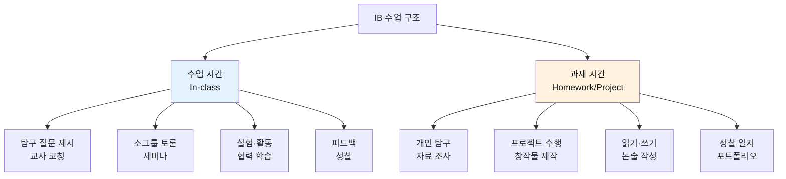

### 1.2 학생 vs 교사 역할

| 구분 | 학생 역할 | 교사 역할 |
|------|---------|---------|
| **수업 중** | 질문하기, 토론 주도, 탐구 수행 | 질문 설계, 촉진자(Facilitator), 관찰 |
| **과제** | 독립적 연구, 프로젝트 수행, 성찰 | 피드백 제공, 개별 코칭, 평가 |
| **비율** | 70% 학생 주도 | 30% 교사 안내 |
| **평가** | 자기평가, 동료평가 참여 | 루브릭 기반 평가, 피드백 |

### 1.3 과제 중심 학습의 비중

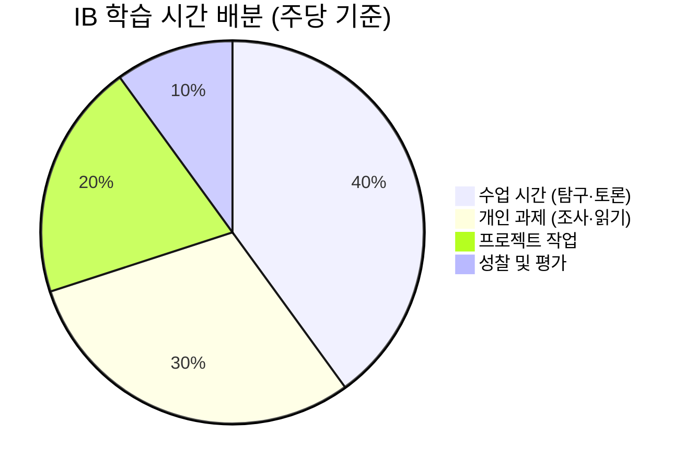

**핵심**: 
- ✅ 수업은 **질문 제시, 토론, 실험**에 집중
- ✅ 과제는 **개인 탐구, 프로젝트, 논술**에 집중
- ✅ 교사는 **코칭과 피드백**에 집중

---

## 2. PYP 초등 과정 상세

### 2.1 PYP 학년별 과목 구성

#### 전체 교과 프레임워크

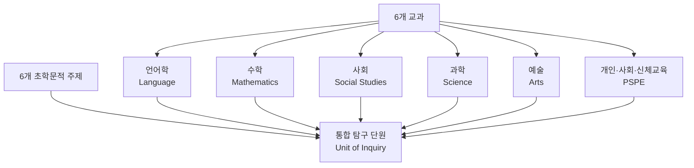

### 2.2 학년별 주제 예시

#### 초등 1학년 (만 6-7세)

| 초학문적 주제 | 탐구 질문 | 통합 교과 | 기간 |
|------------|---------|---------|------|
| **우리는 누구인가** | "나는 누구일까?" | 언어, 예술, PSPE | 6주 |
| **우리가 속한 공간과 시간** | "우리 가족은 어떻게 살아왔을까?" | 사회, 언어, 수학 | 6주 |
| **세상이 돌아가는 방식** | "식물은 어떻게 자랄까?" | 과학, 수학, 예술 | 6주 |
| **지구 공유하기** | "동물들은 어디에 살까?" | 과학, 사회, 예술 | 6주 |

#### 초등 3학년 (만 8-9세)

| 초학문적 주제 | 탐구 질문 | 통합 교과 | 기간 |
|------------|---------|---------|------|
| **우리 자신을 조직하는 방법** | "우리 지역은 어떻게 운영될까?" | 사회, 수학, 언어 | 8주 |
| **우리가 속한 공간과 시간** | "과거 사람들은 어떻게 살았을까?" | 사회, 언어, 예술 | 8주 |
| **세상이 돌아가는 방식** | "물은 어떻게 순환할까?" | 과학, 수학, 사회 | 8주 |
| **지구 공유하기** | "우리는 환경을 어떻게 보호할까?" | 과학, 사회, 언어 | 8주 |

#### 초등 5학년 (만 10-11세)

| 초학문적 주제 | 탐구 질문 | 통합 교과 | 기간 |
|------------|---------|---------|------|
| **우리 자신을 표현하는 방법** | "예술은 사회를 어떻게 반영할까?" | 예술, 언어, 사회 | 8주 |
| **우리 자신을 조직하는 방법** | "경제 시스템은 어떻게 작동할까?" | 사회, 수학, 언어 | 8주 |
| **세상이 돌아가는 방식** | "에너지는 어떻게 변환될까?" | 과학, 수학, 사회 | 8주 |
| **지구 공유하기** | "지속 가능한 미래를 위해 무엇을 해야 할까?" | 과학, 사회, 언어 | 8주 |

### 2.3 PYP 실전 수업 커리큘럼 (8주 단원 예시)

#### 주제: "우리가 속한 공간과 시간" (초등 4학년)

**중심 아이디어**: 지역사회는 시간에 따라 변화하며, 이는 사람들의 삶에 영향을 미친다.

**탐구 질문**:
- 사실적: "우리 동네에는 어떤 건물들이 있나?"
- 개념적: "왜 동네가 변화하는가?"
- 논쟁적: "동네 개발은 항상 좋은 것일까?"

#### 주차별 커리큘럼

**1주차: 탐구 시작 (Tuning In)**

```
[수업 활동 - 3시간]
- 옛날과 지금 사진 비교 (30분)
- 브레인스토밍: "무엇이 궁금한가?" (30분)
- 소그룹 토론: 질문 만들기 (40분)
- 탐구 계획 세우기 (40분)
- 성찰: 오늘 배운 점 (20분)

[과제 - 주당 2시간]
- 집 주변 사진 찍기 (30분)
- 가족 인터뷰: "옛날 우리 동네는?" (1시간)
- 탐구 일지 작성 (30분)

[교사 역할]
- 도발적 질문 제시
- 학생 질문 정리 및 분류
- 개별 탐구 방향 코칭
```

**2-3주차: 조사 및 탐구 (Finding Out)**

```
[수업 활동 - 주당 3시간]
[사회]
- 옛날 지도와 현재 지도 비교 (40분)
- 지역 역사 자료 분석 (40분)

[과학]
- 환경 변화 관찰 (나무, 공기, 물) (40분)
- 데이터 수집 방법 배우기 (40분)

[수학]
- 인구 변화 그래프 그리기 (40분)
- 건물 수 통계 내기 (40분)

[언어]
- 인터뷰 기술 배우기 (40분)
- 어르신 인터뷰 실시 (학교 방문) (40분)

[예술]
- 과거 풍경 상상하여 그리기 (40분)

[과제 - 주당 3시간]
- 도서관에서 자료 찾기 (1시간)
- 인터뷰 내용 정리 (1시간)
- 조사 내용 기록 (1시간)

[교사 역할]
- 자료 조사 방법 안내
- 인터뷰 기술 코칭
- 개별 피드백 제공
```

**4-5주차: 정리 및 창작 (Sorting Out & Going Further)**

```
[수업 활동 - 주당 3시간]
- 조사 내용 공유 (모둠별) (40분)
- 패턴 찾기: "무엇이 변했나?" (40분)
- 프로젝트 선택 (40분)
  1. 동네 역사 책 만들기
  2. 타임캡슐 제작
  3. 과거-현재-미래 전시회
  4. 다큐멘터리 영상
- 프로젝트 작업 시간 (모둠별) (120분)

[과제 - 주당 4시간]
- 프로젝트 자료 준비 (2시간)
- 창작 작업 (2시간)

[교사 역할]
- 프로젝트 선택 조언
- 작업 진행 모니터링
- 기술적 지원 (영상 편집 등)
```

**6주차: 행동 및 성찰 (Taking Action & Reflecting)**

```
[수업 활동 - 3시간]
- 프로젝트 마무리 (40분)
- 발표 준비 및 리허설 (40분)
- 발표회 (학부모 초청) (80분)
- 동료 피드백 (20분)
- 성찰: "무엇을 배웠나?" (20분)

[과제 - 2시간]
- 성찰 일지 작성 (1시간)
- 포트폴리오 정리 (1시간)

[교사 역할]
- 발표 코칭
- 평가 (루브릭 기반)
- 개별 성찰 피드백
```

### 2.4 PYP 결과물 예시

#### 학생 결과물 유형

| 결과물 유형 | 설명 | 평가 요소 |
|----------|------|---------|
| **탐구 일지** | 주간 질문, 발견, 성찰 기록 | 질문의 질, 탐구 과정, 성찰 깊이 |
| **프로젝트** | 모둠별 창작물 (책, 전시, 영상 등) | 창의성, 협력, 내용의 정확성 |
| **발표** | 학습 내용 공유 | 소통 능력, 자신감, 내용 이해 |
| **포트폴리오** | 학습 과정 전체 기록 | 성장 과정, 다양성, 성찰 |

#### 구체적 결과물 예시

**1. 탐구 일지 (개인)**
```
[1주차 일지 예시]
날짜: 2026년 3월 5일

오늘의 질문:
- 왜 우리 동네에 아파트가 많아졌을까?
- 옛날에는 어떤 집에 살았을까?

오늘 발견한 것:
- 1980년대 사진에는 논밭이 많았다
- 지금은 아파트가 20개 이상 있다

다음에 알아보고 싶은 것:
- 할머니께 옛날 이야기 들어보기
- 도서관에서 우리 동네 역사 책 찾기

오늘의 느낌:
- 우리 동네가 이렇게 많이 변했다니 놀라웠다
```

**2. 동네 역사 책 (모둠 프로젝트)**
```
구성:
- 표지: 동네 이름과 팀 이름
- 1장: 과거 (1970-1990년)
  - 옛날 사진
  - 어르신 인터뷰 내용
  - 그 시절 생활 모습
- 2장: 현재 (2020-2026년)
  - 현재 사진
  - 변화 통계 (인구, 건물 수)
  - 우리가 좋아하는 곳
- 3장: 미래 (2050년)
  - 상상 그림
  - 우리의 제안
- 마무리: 배운 점과 느낀 점
```

**3. 발표 (10분)**
```
구성:
- 도입 (2분): 탐구 질문 소개
- 본론 (6분): 
  - 과거 모습 (2분)
  - 현재 모습 (2분)
  - 변화 이유 (2분)
- 결론 (2분): 배운 점, 미래 제안
- 질의응답 (5분)
```

---

## 3. MYP 중등 과정 상세

### 3.1 MYP 학년별 과목 구성

#### 8개 교과 시수 배분 (주당 기준)

| 교과 | 중1 | 중2 | 중3 | 고1 |
|------|-----|-----|-----|-----|
| **언어습득 (영어)** | 5시간 | 5시간 | 4시간 | 4시간 |
| **언어학과 문학 (국어)** | 5시간 | 5시간 | 4시간 | 4시간 |
| **개인과 사회** | 4시간 | 4시간 | 4시간 | 4시간 |
| **과학** | 4시간 | 4시간 | 5시간 | 5시간 |
| **수학** | 5시간 | 5시간 | 5시간 | 5시간 |
| **예술** | 3시간 | 3시간 | 2시간 | 2시간 |
| **체육·건강교육** | 3시간 | 3시간 | 3시간 | 3시간 |
| **디자인** | 3시간 | 3시간 | 3시간 | 3시간 |
| **총 시수** | 32시간 | 32시간 | 30시간 | 30시간 |

### 3.2 MYP 학년별 주제 및 내용

#### 중학교 1학년 (만 12-13세)

**개인과 사회 (역사/지리)**

| 단원 | 주제 | 핵심 개념 | 탐구 질문 | 기간 |
|------|------|---------|---------|------|
| 1단원 | 문명의 발생 | 변화, 시스템 | "문명은 왜 강 주변에서 시작했을까?" | 8주 |
| 2단원 | 세계 지리 | 관점, 연결 | "지리는 문화에 어떤 영향을 미칠까?" | 8주 |
| 3단원 | 중세 사회 | 권력, 관계 | "봉건제는 공정한 시스템이었을까?" | 8주 |
| 4단원 | 지속가능성 | 책임, 변화 | "우리는 지구를 어떻게 보호할까?" | 8주 |

**과학**

| 단원 | 주제 | 핵심 개념 | 탐구 질문 | 기간 |
|------|------|---------|---------|------|
| 1단원 | 세포와 생명 | 시스템, 기능 | "세포는 어떻게 생명을 유지할까?" | 8주 |
| 2단원 | 물질의 성질 | 형태, 변화 | "물질의 성질은 무엇으로 결정될까?" | 8주 |
| 3단원 | 힘과 운동 | 관계, 원인 | "힘은 운동에 어떤 영향을 미칠까?" | 8주 |
| 4단원 | 생태계 | 연결, 균형 | "생태계는 어떻게 균형을 유지할까?" | 8주 |

#### 중학교 2학년 (만 13-14세)

**언어학과 문학 (국어)**

| 단원 | 주제 | 핵심 개념 | 탐구 질문 | 기간 |
|------|------|---------|---------|------|
| 1단원 | 서사 문학 | 관점, 정체성 | "이야기는 우리에게 무엇을 말하는가?" | 8주 |
| 2단원 | 시와 표현 | 창의성, 소통 | "시는 어떻게 감정을 전달하는가?" | 8주 |
| 3단원 | 논증과 설득 | 논리, 관점 | "효과적인 논증이란 무엇인가?" | 8주 |
| 4단원 | 매체와 문화 | 소통, 변화 | "매체는 문화를 어떻게 형성하는가?" | 8주 |

**수학**

| 단원 | 주제 | 핵심 개념 | 탐구 질문 | 기간 |
|------|------|---------|---------|------|
| 1단원 | 대수와 패턴 | 패턴, 일반화 | "패턴은 어떻게 예측을 가능하게 하는가?" | 8주 |
| 2단원 | 기하와 측정 | 공간, 형태 | "기하학은 실생활에 어떻게 적용되는가?" | 8주 |
| 3단원 | 통계와 확률 | 논리, 표현 | "데이터는 어떻게 의사결정을 돕는가?" | 8주 |
| 4단원 | 함수와 관계 | 관계, 변화 | "함수는 어떻게 변화를 설명하는가?" | 8주 |

#### 중학교 3학년 (만 14-15세) - 개인 프로젝트 포함

**개인 프로젝트 (Personal Project)**

| 단계 | 활동 | 기간 | 시수 |
|------|------|------|------|
| 1단계 | 주제 선정 및 계획 | 3월-4월 | 10시간 |
| 2단계 | 조사 및 연구 | 5월-7월 | 20시간 |
| 3단계 | 창작 및 실행 | 9월-11월 | 30시간 |
| 4단계 | 평가 및 발표 | 12월 | 10시간 |
| **총** | | **9개월** | **70시간** |

### 3.3 MYP 실전 수업 커리큘럼 (8주 단원 예시)

#### 과목: 과학 (중2) - "기후 변화와 에너지"

**핵심 개념**: 변화, 시스템, 책임  
**관련 개념**: 에너지 전환, 지속가능성, 환경  
**글로벌 맥락**: 세계화와 지속가능성

**탐구 질문**:
- 사실적: "온실가스란 무엇인가?"
- 개념적: "에너지 사용은 기후에 어떤 영향을 미치는가?"
- 논쟁적: "경제 발전과 환경 보호는 양립할 수 있는가?"

#### 주차별 커리큘럼

**1주차: 도입 및 문제 인식**

```
[수업 활동 - 4시간]
월요일 (1시간):
- 도발적 영상: 북극곰과 빙하 (10분)
- 브레인스토밍: "기후 변화의 원인은?" (20분)
- 탐구 질문 만들기 (30분)

수요일 (1시간):
- 온실가스 개념 학습 (30분)
- 분자 모델 만들기 (CO2, CH4) (30분)

금요일 (2시간):
- 데이터 분석: 지구 온도 변화 그래프 (40분)
- 소그룹 토론: "왜 온도가 올라갈까?" (40분)
- 가설 세우기 (40분)

[과제 - 주당 2시간]
- 읽기 자료: "온실 효과의 과학" (1시간)
- 탐구 일지 작성 (30분)
- 가정의 에너지 사용 조사 (30분)

[교사 역할]
- 도발적 질문 제시
- 과학 개념 설명
- 가설 설정 코칭
```

**2-3주차: 실험 및 데이터 수집**

```
[수업 활동 - 주당 4시간]
실험 1: 온실 효과 시뮬레이션 (2시간)
- 실험 설계 및 준비 (30분)
- 실험 수행 (CO2 농도별 온도 측정) (60분)
- 데이터 기록 및 분석 (30분)

실험 2: 에너지 전환 효율 (2시간)
- 다양한 에너지원 비교 (화석, 태양광, 풍력) (60분)
- 효율성 계산 (30분)
- 그래프 작성 (30분)

[과제 - 주당 3시간]
- 실험 보고서 작성 (2시간)
  - 목적, 가설, 방법, 결과, 논의
- 추가 자료 조사 (1시간)

[교사 역할]
- 실험 안전 지도
- 데이터 분석 방법 안내
- 보고서 피드백
```

**4-5주차: 비판적 분석 및 토론**

```
[수업 활동 - 주당 4시간]
월요일 (1시간):
- 자료 조사 발표 (각 모둠 10분)
- 동료 피드백

수요일 (2시간):
- 세미나: "재생 에너지 vs 화석 연료"
- 찬반 토론 (소크라테스식)
- 증거 기반 논증 연습

금요일 (1시간):
- 이해관계자 분석
  - 정부, 기업, 시민, 과학자
- 다양한 관점 이해

[과제 - 주당 4시간]
- 논증 에세이 작성 (3시간)
  - 주제: "우리나라는 어떤 에너지 정책을 선택해야 하는가?"
  - 분량: 1,000자
- 동료 에세이 검토 (1시간)

[교사 역할]
- 토론 촉진
- 논증 구조 코칭
- 에세이 첨삭
```

**6-7주차: 프로젝트 수행**

```
[수업 활동 - 주당 4시간]
프로젝트 선택:
1. 학교 에너지 절약 캠페인 기획
2. 재생 에너지 모델 제작
3. 기후 변화 다큐멘터리 제작
4. 정책 제안서 작성

모둠별 작업 시간 (4시간)
- 계획 수립 (1시간)
- 자료 수집 및 제작 (2시간)
- 중간 점검 및 피드백 (1시간)

[과제 - 주당 5시간]
- 프로젝트 작업 (4시간)
- 진행 일지 작성 (1시간)

[교사 역할]
- 프로젝트 진행 모니터링
- 기술적 지원
- 개별 코칭
```

**8주차: 발표 및 평가**

```
[수업 활동 - 4시간]
월요일 (1시간):
- 프로젝트 마무리
- 발표 리허설

수요일 (2시간):
- 모둠별 발표 (각 15분)
- 질의응답 (5분)
- 동료 평가

금요일 (1시간):
- 자기평가 및 성찰
- 단원 정리
- 다음 학습 연결

[과제 - 2시간]
- 성찰 에세이 (1시간)
  - "이 단원에서 배운 것"
  - "나의 성장"
  - "실생활 적용 계획"
- 포트폴리오 정리 (1시간)

[교사 역할]
- 루브릭 기반 평가
- 개별 피드백 제공
- 성장 포인트 안내
```

### 3.4 MYP 결과물 예시

#### 1. 실험 보고서 (개인)

```
[구조]
1. 제목: 온실 효과 시뮬레이션 실험

2. 목적 (100자)
   - CO2 농도가 온도에 미치는 영향 확인

3. 가설 (50자)
   - CO2 농도가 높을수록 온도가 상승할 것이다

4. 방법 (300자)
   - 실험 장치 설명
   - 변인 통제 방법
   - 측정 절차

5. 결과 (200자 + 그래프)
   - 데이터 표
   - 그래프 (CO2 농도 vs 온도)
   - 관찰 내용

6. 논의 (400자)
   - 결과 해석
   - 가설 검증
   - 오차 분석
   - 실생활 적용

7. 결론 (100자)
   - 핵심 발견
   - 한계점
   - 추가 연구 제안

8. 참고문헌
```

#### 2. 논증 에세이 (개인)

```
[주제] 우리나라는 어떤 에너지 정책을 선택해야 하는가?

[구조 - 1,000자]
1. 서론 (150자)
   - 문제 제기
   - 논제 명확화
   - 논지 제시

2. 본론 1 (250자)
   - 주장 1: 재생 에너지 확대 필요
   - 근거: 환경 보호, 지속가능성
   - 증거: 데이터, 사례

3. 본론 2 (250자)
   - 반론: 경제성 문제
   - 반박: 장기적 비용 절감
   - 증거: 해외 사례

4. 본론 3 (250자)
   - 주장 2: 단계적 전환 전략
   - 근거: 현실적 접근
   - 증거: 정책 사례

5. 결론 (100자)
   - 논지 재확인
   - 제안 및 시사점
```

#### 3. 개인 프로젝트 (중3)

```
[예시: 학교 에너지 절약 캠페인]

1. 프로젝트 계획서
   - 목표: 학교 전기 사용량 20% 감소
   - 기간: 3개월
   - 방법: 인식 개선 캠페인
   - 예산: 10만원

2. 조사 보고서
   - 현재 학교 에너지 사용 현황
   - 문제점 분석
   - 해결 방안 연구

3. 캠페인 자료
   - 포스터 10장
   - 홍보 영상 1편 (3분)
   - SNS 콘텐츠 20개

4. 실행 기록
   - 주간 활동 일지
   - 사진 및 영상 기록
   - 참여자 피드백

5. 결과 보고서
   - 전후 비교 데이터
   - 성과 분석
   - 개선점

6. 성찰 에세이
   - 배운 점
   - 어려웠던 점
   - 성장한 부분
   - 미래 계획
```

---

## 4. DP 고등 과정 상세

### 4.1 DP 과목 구성 및 시수

#### 6개 과목군 선택 예시

**예시 1: 이공계 진로**

| 과목군 | 과목 | 레벨 | 주당 시수 | 2년 총 시수 |
|--------|------|------|----------|-----------|
| Group 1 | 한국어 문학 | HL | 6시간 | 240시간 |
| Group 2 | 영어 B | HL | 6시간 | 240시간 |
| Group 3 | 경제학 | SL | 4시간 | 150시간 |
| Group 4 | 화학 | HL | 6시간 | 240시간 |
| Group 5 | 수학 AA | HL | 6시간 | 240시간 |
| Group 6 | 물리 | SL | 4시간 | 150시간 |
| **Core** | TOK | - | 2시간 | 100시간 |
| **Core** | EE | - | 1시간 | 40시간 |
| **Core** | CAS | - | 1시간 | 150시간 |
| **총** | | | **36시간** | |

**예시 2: 인문사회계 진로**

| 과목군 | 과목 | 레벨 | 주당 시수 | 2년 총 시수 |
|--------|------|------|----------|-----------|
| Group 1 | 한국어 문학 | HL | 6시간 | 240시간 |
| Group 2 | 영어 A | HL | 6시간 | 240시간 |
| Group 3 | 역사 | HL | 6시간 | 240시간 |
| Group 4 | 생물 | SL | 4시간 | 150시간 |
| Group 5 | 수학 AI | SL | 4시간 | 150시간 |
| Group 6 | 시각예술 | SL | 4시간 | 150시간 |
| **Core** | TOK | - | 2시간 | 100시간 |
| **Core** | EE | - | 1시간 | 40시간 |
| **Core** | CAS | - | 1시간 | 150시간 |
| **총** | | | **36시간** | |

### 4.2 DP 과목별 주제 및 내용

#### 화학 HL (Higher Level)

**전체 구조**

| 구분 | 주제 | 시수 | 내용 |
|------|------|------|------|
| **Core** | 1. 화학량론 | 15시간 | 물질의 양, 화학 반응식 |
| | 2. 원자 구조 | 15시간 | 전자 배치, 주기율표 |
| | 3. 주기성 | 15시간 | 주기적 경향, 원소 성질 |
| | 4. 화학 결합 | 20시간 | 이온, 공유, 금속 결합 |
| | 5. 에너지학 | 20시간 | 엔탈피, 엔트로피 |
| | 6. 화학 반응 속도론 | 15시간 | 반응 속도, 촉매 |
| | 7. 평형 | 15시간 | 화학 평형, 르샤틀리에 |
| | 8. 산과 염기 | 15시간 | pH, 적정, 완충 용액 |
| | 9. 산화 환원 | 15시간 | 산화수, 전기화학 |
| | 10. 유기화학 | 20시간 | 탄화수소, 작용기 |
| | 11. 측정과 분석 | 15시간 | 분광학, 크로마토그래피 |
| **HL 추가** | 12. 원자 구조 심화 | 10시간 | 양자역학, 오비탈 |
| | 13. 주기성 심화 | 10시간 | 전이 금속, 착화합물 |
| | 14. 화학 결합 심화 | 10시간 | 혼성 오비탈, 분자 궤도 |
| | 15. 에너지학 심화 | 10시간 | 엔트로피, 자유 에너지 |
| | 16. 화학 반응 속도론 심화 | 10시간 | 반응 메커니즘 |
| | 17. 평형 심화 | 10시간 | 평형 상수 계산 |
| | 18. 산과 염기 심화 | 10시간 | 완충 용액 계산 |
| | 19. 산화 환원 심화 | 10시간 | 전기화학 셀 |
| | 20. 유기화학 심화 | 15시간 | 반응 메커니즘, 합성 |
| | 21. 측정과 분석 심화 | 15시간 | NMR, 질량분석 |
| **선택** | A. 재료 화학 | 25시간 | 나노 기술, 고분자 |
| | 또는 B. 생화학 | 25시간 | 단백질, DNA, 효소 |
| | 또는 C. 에너지 | 25시간 | 재생 에너지, 연료 |
| | 또는 D. 의약 화학 | 25시간 | 약물 작용, 합성 |
| **총** | | **240시간** | |

#### 역사 HL (Higher Level)

**전체 구조**

| 구분 | 주제 | 시수 | 내용 |
|------|------|------|------|
| **Paper 1** | 20세기 세계사 | 40시간 | 냉전, 독립 운동 등 (2개 주제 선택) |
| **Paper 2** | 세계사 주제 | 80시간 | 전쟁의 원인과 결과, 권위주의 국가 등 (2개 주제) |
| **Paper 3** | 지역사 심화 | 60시간 | 동아시아 근현대사 또는 유럽사 (3개 주제) |
| **IA** | 역사 조사 | 20시간 | 2,200자 역사 탐구 |
| **수업** | 토론 및 세미나 | 40시간 | 사료 분석, 역사가 관점 비교 |
| **총** | | **240시간** | |

### 4.3 DP 실전 수업 커리큘럼 (4주 단원 예시)

#### 과목: 화학 HL - "산화 환원과 전기화학"

**학습 목표**:
- 산화수 개념 이해 및 계산
- 산화 환원 반응식 완성
- 전기화학 셀 작동 원리 이해
- 실생활 응용 (배터리, 부식) 분석

#### 주차별 커리큘럼

**1주차: 개념 학습**

```
[월요일 - 2시간]
수업 활동:
- 도입 질문: "배터리는 어떻게 작동할까?" (10분)
- 산화수 개념 강의 (30분)
- 연습 문제 (개인) (30분)
- 소그룹 문제 풀이 (30분)
- 정리 및 질문 (20분)

과제 (2시간):
- 교과서 읽기: 산화 환원 반응 (1시간)
- 연습 문제 20개 (1시간)

교사 역할:
- 개념 강의
- 문제 풀이 시범
- 개별 질문 답변
```

```
[수요일 - 2시간]
수업 활동:
- 과제 검토 및 질문 (20분)
- 산화 환원 반응식 쓰기 (강의) (30분)
- 짝 활동: 반응식 완성 (40분)
- 전체 공유 및 피드백 (30분)

과제 (2시간):
- 반응식 연습 (1시간)
- 실험 예습: 전기화학 셀 (1시간)

교사 역할:
- 반응식 작성 방법 안내
- 짝 활동 모니터링
- 피드백 제공
```

```
[금요일 - 2시간]
수업 활동:
- 실험: 다니엘 셀 만들기 (90분)
  - 실험 설계 (20분)
  - 실험 수행 (50분)
  - 데이터 분석 (20분)
- 정리 및 성찰 (30분)

과제 (3시간):
- 실험 보고서 작성 (2시간)
- 추가 자료 조사 (1시간)

교사 역할:
- 실험 안전 지도
- 실험 과정 관찰
- 데이터 분석 지원
```

**2주차: 심화 학습 및 응용**

```
[월요일 - 2시간]
수업 활동:
- 실험 보고서 발표 (각 5분) (40분)
- 동료 피드백 (20분)
- 전기화학 셀 계산 (강의) (30분)
- 연습 문제 (30분)

과제 (2시간):
- 계산 문제 풀이 (1시간)
- 배터리 기술 조사 (1시간)

교사 역할:
- 발표 평가
- 계산 방법 설명
- 개별 지도
```

```
[수요일 - 2시간]
수업 활동:
- 세미나: "배터리 기술의 미래"
  - 학생 발표 (리튬 이온, 수소 연료 전지 등) (40분)
  - 소크라테스식 토론 (60분)
  - 정리 (20분)

과제 (3시간):
- 논술 준비: 과거 기출문제 분석 (2시간)
- 개념 정리 노트 (1시간)

교사 역할:
- 토론 촉진
- 과학적 정확성 확인
- 비판적 사고 유도
```

```
[금요일 - 2시간]
수업 활동:
- TOK 연계: "과학 지식의 한계"
  - 질문: "전기화학 이론은 완벽한가?" (30분)
  - 소그룹 토론 (40분)
  - 전체 공유 (30분)
- 다음 주 안내 (20분)

과제 (2시간):
- TOK 성찰 일지 (1시간)
- 논술 문제 풀이 (1시간)

교사 역할:
- TOK 질문 제시
- 토론 관찰
- 성찰 피드백
```

**3주차: 실생활 응용 및 프로젝트**

```
[월요일 - 2시간]
수업 활동:
- 부식 현상 학습 (강의) (30분)
- 실험: 금속 부식 속도 비교 (60분)
- 데이터 분석 (30분)

과제 (2시간):
- 부식 방지 방법 조사 (1시간)
- 실험 데이터 정리 (1시간)

교사 역할:
- 실험 설계 지원
- 안전 관리
```

```
[수요일 - 2시간]
수업 활동:
- 프로젝트 안내: "전기화학 응용 제안"
  - 주제 선택 (배터리 개선, 부식 방지, 전기분해 등) (30분)
  - 계획 수립 (60분)
  - 중간 발표 (30분)

과제 (4시간):
- 프로젝트 조사 및 설계 (3시간)
- 진행 일지 (1시간)

교사 역할:
- 프로젝트 주제 조언
- 계획 검토
- 개별 코칭
```

```
[금요일 - 2시간]
수업 활동:
- 프로젝트 작업 시간 (개인/모둠) (90분)
- 교사 개별 상담 (30분)

과제 (4시간):
- 프로젝트 완성 (3시간)
- 발표 준비 (1시간)

교사 역할:
- 작업 모니터링
- 기술적 지원
- 개별 피드백
```

**4주차: 평가 및 성찰**

```
[월요일 - 2시간]
수업 활동:
- 프로젝트 발표 (각 10분) (80분)
- 질의응답 (40분)

과제 (2시간):
- 동료 평가서 작성 (1시간)
- 자기평가 (1시간)

교사 역할:
- 발표 평가 (루브릭)
- 질문 유도
```

```
[수요일 - 2시간]
수업 활동:
- 논술 모의고사 (IB 스타일) (90분)
  - 문제: "전기화학 셀의 작동 원리를 설명하고,
           지속 가능한 에너지 저장 방법을 평가하시오."
- 자기 채점 (30분)

과제 (3시간):
- 오답 정리 (1시간)
- 단원 총정리 노트 (2시간)

교사 역할:
- 시험 감독
- 채점 기준 안내
```

```
[금요일 - 2시간]
수업 활동:
- 모의고사 해설 (40분)
- 성찰 활동: "이 단원에서 배운 것" (30분)
- 다음 단원 연결 (20분)
- 개별 피드백 면담 (30분)

과제 (2시간):
- 성찰 에세이 (1시간)
- 포트폴리오 정리 (1시간)

교사 역할:
- 해설 강의
- 개별 면담
- 성장 포인트 안내
```

### 4.4 DP 결과물 예시

#### 1. 화학 HL 실험 보고서 (IA - Internal Assessment)

```
[구조 - 6-12페이지]

1. 연구 질문 (Research Question)
   "구리 농도가 아연-구리 전기화학 셀의 전압에 미치는 영향은?"

2. 배경 및 이론 (Background)
   - 전기화학 셀 원리 (500자)
   - 네른스트 방정식 (300자)
   - 선행 연구 (200자)

3. 가설 (Hypothesis)
   "구리 이온 농도가 증가하면 셀 전압이 증가할 것이다."

4. 변인 (Variables)
   - 독립 변인: 구리 이온 농도 (0.1M ~ 1.0M)
   - 종속 변인: 셀 전압 (V)
   - 통제 변인: 온도, 아연 농도, 전극 면적

5. 재료 및 방법 (Materials & Method)
   - 재료 목록
   - 실험 장치 도식
   - 절차 (단계별 상세 설명)
   - 안전 주의사항

6. 원시 데이터 (Raw Data)
   - 측정값 표 (5회 반복)
   - 불확실도 계산

7. 처리된 데이터 (Processed Data)
   - 평균값 계산
   - 그래프 (농도 vs 전압)
   - 추세선 및 방정식

8. 분석 (Analysis)
   - 결과 해석 (500자)
   - 이론값과 비교
   - 오차율 계산
   - 패턴 및 경향 설명

9. 결론 (Conclusion)
   - 가설 검증 (200자)
   - 연구 질문 답변
   - 화학적 설명

10. 평가 (Evaluation)
    - 강점 (200자)
    - 약점 및 한계 (300자)
    - 개선 방안 (200자)
    - 확장 연구 제안 (200자)

11. 참고문헌 (Bibliography)
    - 최소 5개 이상
    - IB 인용 형식

[평가 기준 - 총 24점]
- 탐구 설계 (6점)
- 데이터 수집 및 처리 (6점)
- 결론 및 평가 (6점)
- 소통 (6점)
```

#### 2. TOK 에세이

```
[주제 예시]
"과학적 지식은 윤리적 고려에 의해 제한되어야 하는가?"

[구조 - 1,600자]

1. 서론 (200자)
   - 핵심 용어 정의 (과학적 지식, 윤리적 고려)
   - 지식 질문 명확화
   - 논지 제시: "과학적 지식은 윤리적 고려와 균형을 이루어야 한다"

2. 본론 1: 과학 지식 영역 (400자)
   - 주장: 과학은 객관적 진리 추구
   - 실제 세계 상황 (RLS): 유전자 편집 기술 (CRISPR)
   - 분석: 과학적 발전 vs 윤리적 우려
   - 지식의 방법 (WOK): 이성, 감정
   - 연결: 과학의 자율성과 한계

3. 본론 2: 윤리 지식 영역 (400자)
   - 주장: 윤리는 과학 연구의 방향 제시
   - RLS: 나치 인체 실험
   - 분석: 윤리 부재의 결과
   - WOK: 감정, 직관
   - 반론: 과학 발전 저해 가능성

4. 본론 3: 균형과 통합 (400자)
   - 주장: 과학과 윤리의 대화 필요
   - RLS: IRB (연구윤리위원회) 제도
   - 분석: 실용적 해결책
   - 다른 지식 영역 연결: 역사, 예술
   - 개인적 성찰

5. 결론 (200자)
   - 논지 재확인
   - 핵심 통찰
   - 열린 질문: "누가 윤리적 경계를 결정하는가?"

[평가 기준 - 10점]
- 지식 질문 이해 (2점)
- 지식 주장 질 (4점)
- 지식 영역 분석 (2점)
- 예시 및 논증 (2점)
```

#### 3. EE (소논문)

```
[주제 예시 - 화학]
"온도가 아스피린 합성 수율에 미치는 영향"

[구조 - 4,000단어]

1. 서론 (500단어)
   - 연구 배경
   - 연구 질문
   - 연구 의의

2. 문헌 검토 (800단어)
   - 아스피린 합성 반응 메커니즘
   - 온도와 반응 속도 관계
   - 선행 연구 분석
   - 연구 갭 확인

3. 연구 방법 (600단어)
   - 실험 설계
   - 재료 및 장비
   - 실험 절차 (상세)
   - 데이터 수집 방법
   - 윤리적 고려사항

4. 결과 (800단어)
   - 원시 데이터 제시
   - 데이터 처리 및 분석
   - 그래프 및 표
   - 통계 분석
   - 패턴 및 경향

5. 논의 (1,000단어)
   - 결과 해석
   - 이론과의 비교
   - 예상 밖의 결과 설명
   - 다른 연구와 비교
   - 화학적 메커니즘 설명
   - 실생활 적용 가능성

6. 결론 (200단어)
   - 연구 질문 답변
   - 핵심 발견
   - 연구의 한계
   - 향후 연구 제안

7. 참고문헌 (100단어)
   - 최소 10개 이상
   - 학술 논문, 책, 신뢰할 수 있는 웹사이트

8. 부록
   - 원시 데이터 전체
   - 계산 과정
   - 추가 그래프

[평가 기준 - 34점]
- 초점과 방법 (6점)
- 지식과 이해 (6점)
- 비판적 사고 (12점)
- 발표 (4점)
- 참여 (6점)
```

#### 4. CAS 포트폴리오

```
[구조]

1. CAS 프로필
   - 목표 설정
   - 학습 결과 (7가지)

2. CAS 경험 기록 (최소 10개)

경험 1: 환경 봉사 (Service)
- 활동: 지역 하천 정화 활동
- 기간: 2025년 3월 - 6월 (매주 토요일, 총 15회)
- 역할: 팀 리더
- 학습 결과: LO 1, 2, 5, 6
- 증거: 사진, 활동 일지, 참여 확인서
- 성찰:
  "처음에는 단순한 쓰레기 줍기라고 생각했지만,
   지속적으로 참여하면서 환경 문제의 심각성을 깨달았다.
   팀을 이끌면서 리더십도 배웠고,
   지역 주민들과 협력하는 방법도 알게 되었다.
   화학 수업에서 배운 수질 오염 지식을 실제로 적용하여
   하천 수질을 측정하고 개선 방안을 제안했다."

경험 2: 음악 활동 (Creativity)
- 활동: 학교 오케스트라 바이올린 연주
- 기간: 2년간 지속
- 역할: 제1바이올린
- 학습 결과: LO 2, 3, 4
- 증거: 공연 영상, 프로그램북
- 성찰: (200자)

경험 3: 마라톤 (Activity)
- 활동: 하프 마라톤 완주
- 기간: 6개월 훈련
- 학습 결과: LO 1, 2, 4
- 증거: 완주 메달, 훈련 일지
- 성찰: (200자)

3. CAS 프로젝트 (필수 1개 이상)
- 프로젝트명: "학교 텃밭 가꾸기"
- 기간: 1년
- 팀: 5명
- 활동: Creativity (텃밭 디자인), Activity (농작업), Service (수확물 기부)
- 학습 결과: 7가지 모두
- 상세 기록: 계획서, 진행 일지, 결과 보고서
- 성찰: (500자)

4. CAS 인터뷰
- 교사와 최종 면담
- 학습 결과 달성 확인
- 전체 성찰

[7가지 학습 결과 (Learning Outcomes)]
LO 1: 강점과 약점 파악
LO 2: 도전 과제 수행
LO 3: 활동 계획 및 실행
LO 4: 헌신과 인내
LO 5: 협력 기술
LO 6: 글로벌 이슈 참여
LO 7: 윤리적 고려
```

---

## 5. 과제 중심 vs 수업 중심

### 5.1 IB 학습 시간 배분

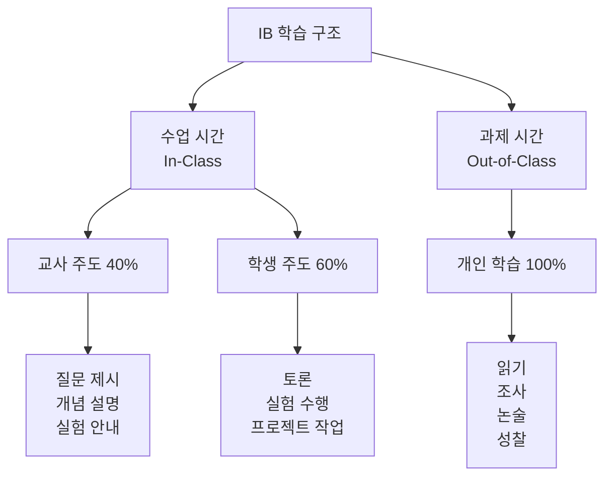

### 5.2 학습 활동별 비중

#### PYP (초등)

| 활동 유형 | 수업 시간 | 과제 시간 | 주당 총 시간 |
|---------|---------|---------|-----------|
| **교사 강의** | 20% (3시간) | - | 3시간 |
| **탐구 활동** | 30% (4.5시간) | 20% (2시간) | 6.5시간 |
| **프로젝트 작업** | 20% (3시간) | 30% (3시간) | 6시간 |
| **토론·발표** | 20% (3시간) | - | 3시간 |
| **성찰·평가** | 10% (1.5시간) | 50% (5시간) | 6.5시간 |
| **총** | 15시간 | 10시간 | **25시간** |

#### MYP (중등)

| 활동 유형 | 수업 시간 | 과제 시간 | 주당 총 시간 |
|---------|---------|---------|-----------|
| **교사 강의** | 30% (9.6시간) | - | 9.6시간 |
| **실험·실습** | 20% (6.4시간) | 10% (1.5시간) | 7.9시간 |
| **토론·세미나** | 20% (6.4시간) | - | 6.4시간 |
| **프로젝트** | 15% (4.8시간) | 40% (6시간) | 10.8시간 |
| **읽기·쓰기** | 5% (1.6시간) | 30% (4.5시간) | 6.1시간 |
| **평가·성찰** | 10% (3.2시간) | 20% (3시간) | 6.2시간 |
| **총** | 32시간 | 15시간 | **47시간** |

#### DP (고등)

| 활동 유형 | 수업 시간 | 과제 시간 | 주당 총 시간 |
|---------|---------|---------|-----------|
| **교사 강의** | 30% (10.8시간) | - | 10.8시간 |
| **실험·실습** | 15% (5.4시간) | 10% (2시간) | 7.4시간 |
| **세미나·토론** | 20% (7.2시간) | - | 7.2시간 |
| **독립 연구** | 5% (1.8시간) | 40% (8시간) | 9.8시간 |
| **논술 작성** | 10% (3.6시간) | 30% (6시간) | 9.6시간 |
| **평가 준비** | 20% (7.2시간) | 20% (4시간) | 11.2시간 |
| **총** | 36시간 | 20시간 | **56시간** |

### 5.3 과제의 특징

#### 과제는 단순 반복이 아닌 "탐구 확장"

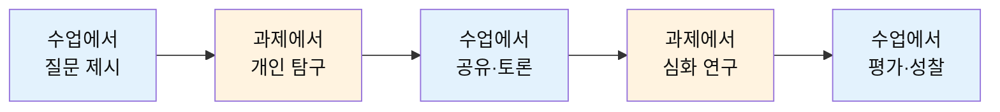

#### 과제 유형별 목적

| 과제 유형 | 목적 | 예시 | 시간 |
|---------|------|------|------|
| **읽기** | 배경지식 구축 | 교과서, 논문, 기사 읽기 | 1-2시간 |
| **조사** | 자료 수집 및 분석 | 인터넷, 도서관 자료 조사 | 2-3시간 |
| **쓰기** | 논리적 사고 정리 | 에세이, 보고서, 성찰 일지 | 2-4시간 |
| **문제 풀이** | 개념 적용 연습 | 수학, 과학 문제 | 1-2시간 |
| **프로젝트** | 창의적 종합 | 창작물 제작, 실험 설계 | 3-5시간 |
| **성찰** | 메타인지 개발 | 학습 일지, 자기평가 | 30분-1시간 |

---

## 6. 학생·교사 역할 분담

### 6.1 수업 중 역할

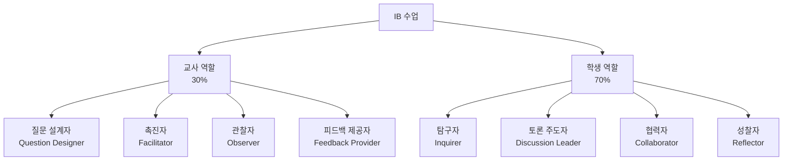

### 6.2 구체적 역할 분담

#### 수업 단계별 역할

| 단계 | 교사 역할 | 학생 역할 |
|------|---------|---------|
| **도입** | - 도발적 질문 제시<br/>- 학습 목표 안내<br/>- 호기심 자극 | - 질문에 반응<br/>- 자신의 질문 만들기<br/>- 탐구 방향 설정 |
| **탐구** | - 자료 제공<br/>- 탐구 방법 안내<br/>- 안전 관리 (실험) | - 자료 조사<br/>- 실험 수행<br/>- 데이터 수집 및 분석 |
| **토론** | - 토론 규칙 안내<br/>- 촉진 질문 제시<br/>- 관찰 및 기록 | - 의견 제시<br/>- 근거 제공<br/>- 동료 질문 및 답변 |
| **창작** | - 프로젝트 가이드<br/>- 기술적 지원<br/>- 진행 모니터링 | - 프로젝트 설계<br/>- 창작물 제작<br/>- 팀 협력 |
| **발표** | - 평가 기준 안내<br/>- 질문 유도<br/>- 루브릭 평가 | - 발표 준비 및 실행<br/>- 동료 평가<br/>- 질의응답 |
| **성찰** | - 성찰 질문 제시<br/>- 개별 피드백<br/>- 성장 포인트 안내 | - 학습 과정 돌아보기<br/>- 자기평가<br/>- 다음 목표 설정 |

### 6.3 교사의 코칭 방식

#### 1. 질문을 통한 코칭

```
[학생이 막혔을 때]

❌ 나쁜 예: "답은 이거야. 이렇게 하면 돼."

✅ 좋은 예:
교사: "어디까지 이해했니?"
학생: "산화수는 알겠는데, 반응식을 못 쓰겠어요."
교사: "반응식을 쓸 때 가장 먼저 해야 할 일은 뭘까?"
학생: "산화되는 물질과 환원되는 물질을 찾는 거요."
교사: "맞아. 그럼 이 반응에서는?"
학생: "아, 이게 산화되고 이게 환원되네요!"
교사: "좋아. 그 다음은?"
```

#### 2. 비계 설정 (Scaffolding)

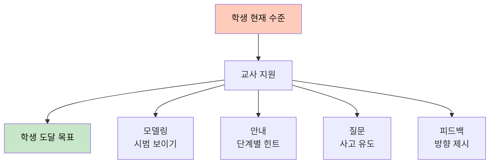

#### 3. 개별 코칭 시간

| 과정 | 개별 코칭 빈도 | 시간 | 방식 |
|------|-------------|------|------|
| **PYP** | 주 1회 | 10분 | 탐구 진행 확인, 격려 |
| **MYP** | 2주 1회 | 15분 | 프로젝트 점검, 피드백 |
| **DP** | 월 1회 | 30분 | 심화 상담, 진로 연계 |

### 6.4 학생의 자기주도 학습

#### 학생이 스스로 해야 할 것

```
1. 질문 만들기
   - "왜?", "어떻게?", "만약에?" 질문
   - 호기심을 학습 동기로 전환

2. 계획 세우기
   - 탐구 계획서 작성
   - 시간 관리
   - 자원 확보

3. 자료 찾기
   - 도서관, 인터넷 활용
   - 신뢰할 수 있는 출처 선별
   - 다양한 관점 수집

4. 분석하기
   - 데이터 해석
   - 패턴 찾기
   - 비판적 평가

5. 창작하기
   - 독창적 아이디어
   - 실행 및 수정
   - 결과물 완성

6. 성찰하기
   - 배운 점 정리
   - 어려웠던 점 분석
   - 개선 방안 모색
```

#### 자기주도 학습 도구

| 도구 | 목적 | 사용 방법 |
|------|------|---------|
| **학습 일지** | 과정 기록 | 매일 10분 작성 |
| **질문 노트** | 호기심 관리 | 질문 수집 및 탐구 |
| **개념 지도** | 지식 구조화 | 마인드맵, 개념도 |
| **체크리스트** | 진행 관리 | 할 일 목록, 마감일 |
| **포트폴리오** | 성장 기록 | 결과물 모음, 성찰 |

---

## 7. 연간 커리큘럼 예시

### 7.1 PYP 초등 4학년 연간 계획

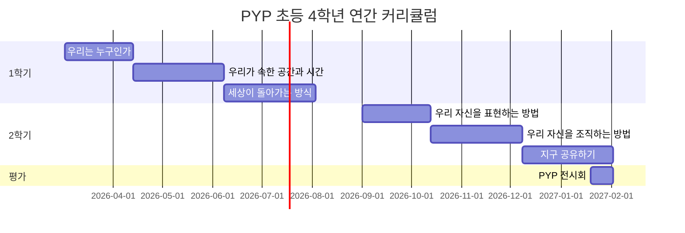

#### 학기별 상세 계획

**1학기**

| 주차 | 단원 1: 우리는 누구인가 (6주) | 활동 |
|------|---------------------------|------|
| 1주 | 탐구 시작: "나는 누구인가?" | 자기소개, 질문 만들기 |
| 2-3주 | 조사: 나의 정체성 탐구 | 가족 인터뷰, 문화 조사 |
| 4-5주 | 창작: 나를 표현하는 프로젝트 | 자서전, 포트레이트 |
| 6주 | 발표 및 성찰 | 전시회, 동료 피드백 |

| 주차 | 단원 2: 우리가 속한 공간과 시간 (8주) | 활동 |
|------|--------------------------------|------|
| 1주 | 탐구 시작: "우리 동네의 변화" | 사진 비교, 질문 |
| 2-4주 | 조사: 다학문적 탐구 | 역사, 과학, 수학 통합 |
| 5-7주 | 창작: 동네 역사 프로젝트 | 책, 영상, 전시회 |
| 8주 | 발표 및 성찰 | 지역 주민 초청 발표 |

**2학기**

| 주차 | 단원 5: 우리 자신을 조직하는 방법 (8주) | 활동 |
|------|-----------------------------------|------|
| 1-2주 | 탐구: "사회는 어떻게 운영되는가?" | 정부, 경제 기초 |
| 3-5주 | 조사: 우리 학교/지역 시스템 | 인터뷰, 견학 |
| 6-7주 | 창작: 이상적인 사회 설계 | 모형, 발표 |
| 8주 | 평가 및 성찰 | 자기평가, 포트폴리오 |

**PYP 전시회 (2주)**
- 2년간 학습 종합
- 개인 또는 모둠 프로젝트
- 학부모 및 지역사회 초청

### 7.2 MYP 중학교 2학년 연간 계획 (과학 과목)

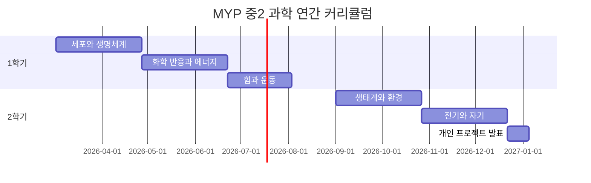

#### 단원별 상세 계획

**단원 1: 세포와 생명체계 (8주)**

| 주차 | 주제 | 수업 활동 | 과제 | 평가 |
|------|------|---------|------|------|
| 1주 | 세포 구조 | 현미경 관찰 | 세포 그리기 | - |
| 2주 | 세포 기능 | 실험: 삼투 현상 | 실험 보고서 | - |
| 3주 | 조직과 기관 | 해부 실습 (식물) | 구조 분석 | - |
| 4주 | 신체 시스템 | 세미나: 소화계 | 에세이 (500자) | - |
| 5-6주 | 프로젝트 | 신체 시스템 모형 제작 | 프로젝트 작업 | - |
| 7주 | 발표 | 모둠 발표 | 동료 평가 | 프로젝트 평가 |
| 8주 | 평가 | 논술 시험 | 성찰 일지 | 단원 평가 |

**단원 2: 화학 반응과 에너지 (8주)**

| 주차 | 주제 | 수업 활동 | 과제 | 평가 |
|------|------|---------|------|------|
| 1주 | 화학 반응 | 실험: 연소 반응 | 반응식 연습 | - |
| 2주 | 반응 속도 | 실험: 농도와 속도 | 실험 보고서 | - |
| 3주 | 발열/흡열 | 온도 측정 실험 | 데이터 분석 | - |
| 4주 | 에너지 전환 | 세미나: 재생 에너지 | 조사 보고서 | - |
| 5-6주 | 프로젝트 | 화학 에너지 응용 | 프로젝트 작업 | - |
| 7주 | 발표 | 개인 발표 | 자기평가 | 프로젝트 평가 |
| 8주 | 평가 | 실험 실기 + 논술 | 포트폴리오 | 단원 평가 |

### 7.3 DP 고등 2학년 연간 계획 (화학 HL)

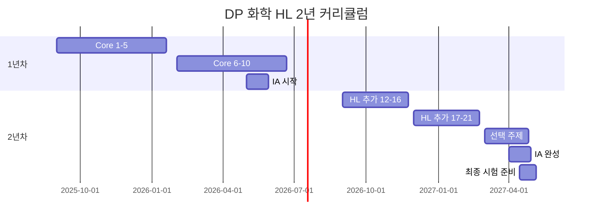

#### 1년차 상세 계획

**9-12월 (Core 1-5)**

| 월 | 주제 | 시수 | 주요 활동 |
|-----|------|------|---------|
| 9월 | 1. 화학량론 | 15시간 | 강의, 문제 풀이, 실험 |
| 10월 | 2. 원자 구조 | 15시간 | 양자 모델, 스펙트럼 실험 |
| 11월 | 3. 주기성 | 15시간 | 주기율표 탐구, 경향 분석 |
| 12월 | 4. 화학 결합 (1/2) | 10시간 | 결합 이론, 분자 모형 |

**1-6월 (Core 6-10 + IA 시작)**

| 월 | 주제 | 시수 | 주요 활동 |
|-----|------|------|---------|
| 1월 | 4. 화학 결합 (2/2) | 10시간 | VSEPR, 극성 |
| 2월 | 5. 에너지학 | 20시간 | 엔탈피 실험, 헤스 법칙 |
| 3월 | 6. 반응 속도론 | 15시간 | 속도 실험, 메커니즘 |
| 4월 | 7. 평형 | 15시간 | 평형 실험, 계산 |
| 5월 | 8. 산과 염기 | 15시간 | 적정 실험, pH 계산 |
| 6월 | IA 시작 | 10시간 | 주제 선정, 실험 설계 |

#### 2년차 상세 계획

**9-12월 (HL 추가 12-16)**

| 월 | 주제 | 시수 | 주요 활동 |
|-----|------|------|---------|
| 9월 | 9-10. 산화환원, 유기 | 35시간 | 전기화학, 유기 반응 |
| 10월 | 11. 측정과 분석 | 15시간 | 분광학, 크로마토그래피 |
| 11월 | HL 12-14 | 30시간 | 양자역학, 전이금속 |
| 12월 | HL 15-16 | 20시간 | 엔트로피, 반응 메커니즘 |

**1-5월 (HL 추가 17-21 + 선택 + IA 완성 + 시험)**

| 월 | 주제 | 시수 | 주요 활동 |
|-----|------|------|---------|
| 1월 | HL 17-19 | 35시간 | 평형 심화, 전기화학 |
| 2월 | HL 20-21 | 30시간 | 유기 메커니즘, 분석 |
| 3월 | 선택: 생화학 | 25시간 | 단백질, DNA, 효소 |
| 4월 | IA 완성 | 10시간 | 보고서 작성, 제출 |
| 4-5월 | 시험 준비 | 30시간 | 기출문제, 모의고사 |
| 5월 | **IB 최종 시험** | - | Paper 1, 2, 3 |

### 7.4 주간 시간표 예시

#### MYP 중2 학생 주간 시간표V

| 시간 | 월 | 화 | 수 | 목 | 금 |
|------|----|----|----|----|-----|
| 1교시 | 영어 | 수학 | 국어 | 과학 | 사회 |
| 2교시 | 수학 | 국어 | 영어 | 수학 | 과학 |
| 3교시 | 과학 | 사회 | 수학 | 영어 | 국어 |
| 4교시 | 국어 | 영어 | 과학 | 디자인 | 수학 |
| 점심 | | | | | |
| 5교시 | 사회 | 체육 | 디자인 | 국어 | 예술 |
| 6교시 | 디자인 | 예술 | 사회 | 체육 | 영어 |
| 7교시 | 예술 | 과학 | 체육 | 사회 | PLC/상담 |
| 방과후 | 개인 프로젝트 | 동아리 | 개인 학습 | 봉사 활동 | 개인 학습 |

**방과 후 과제 시간 (예상)**
- 월: 3시간 (읽기 2시간, 수학 문제 1시간)
- 화: 2시간 (과학 보고서 2시간)
- 수: 3시간 (에세이 작성 2시간, 조사 1시간)
- 목: 2시간 (문제 풀이 1시간, 성찰 일지 1시간)
- 금: 4시간 (프로젝트 작업 3시간, 정리 1시간)
- 주말: 6시간 (프로젝트 4시간, 읽기 2시간)

**주당 총 학습 시간**: 32시간 (수업) + 20시간 (과제) = **52시간**

---

## 결론

### IB 교육의 핵심 특징 요약

1. **과제 중심이면서도 수업 중심**
   - 수업: 질문 제시, 토론, 실험, 피드백
   - 과제: 개인 탐구, 프로젝트, 논술, 성찰
   - 비율: 수업 60% + 과제 40% = 완전한 학습

2. **학생 주도이면서도 교사 코칭**
   - 학생: 70% 주도 (질문, 탐구, 창작)
   - 교사: 30% 안내 (질문 설계, 촉진, 피드백)

3. **개인 학습이면서도 협력 학습**
   - 개인: 독립적 연구, 자기주도
   - 협력: 소그룹 토론, 모둠 프로젝트

4. **과정 중심이면서도 결과 중심**
   - 과정: 탐구 일지, 성찰, 포트폴리오
   - 결과: 프로젝트, 논술, 발표, 시험

### 학부모·학생을 위한 조언

**학생에게**:
- ✅ 질문하는 습관을 기르세요
- ✅ 시간 관리를 철저히 하세요
- ✅ 실패를 두려워하지 마세요
- ✅ 성찰을 통해 성장하세요

**학부모에게**:
- ✅ 과정을 격려하세요 (결과만 보지 말고)
- ✅ 자기주도성을 존중하세요
- ✅ 호기심을 지원하세요
- ✅ 교사와 소통하세요

---

## 8. 자주 묻는 질문 (FAQ) - 실전 편

### 📖 컨텐츠 관련 (Q1-Q10)

#### Q1. IB 교과서는 따로 있나요?

**A**: **IB 공식 교과서는 없습니다.** 대신:

**교사가 선택하는 자료**:
- 다양한 출판사의 IB 추천 도서
- 학술 논문, 기사, 영상
- 실제 세계 자료 (뉴스, 다큐멘터리)
- 온라인 리소스

**주요 출판사**:
- Oxford IB Diploma Programme
- Cambridge IB
- Pearson Baccalaureate
- Hodder Education

**특징**: 교과서는 **참고 자료**일 뿐, 핵심은 **탐구 활동**

---

#### Q2. 수업에서 어떤 자료를 주로 사용하나요?

**A**: 

| 자료 유형 | 예시 | 사용 목적 |
|---------|------|---------|
| **1차 자료** | 역사 문서, 실험 데이터, 인터뷰 | 직접 분석 및 해석 |
| **2차 자료** | 학술 논문, 교과서, 분석 기사 | 배경지식 구축 |
| **멀티미디어** | 다큐멘터리, TED 강연, 영화 | 흥미 유발, 다양한 관점 |
| **실물** | 실험 도구, 예술 작품, 표본 | 직접 경험 |
| **디지털** | 시뮬레이션, 데이터베이스, AI 도구 | 탐구 확장 |

---

#### Q3. PYP에서 교과서 없이 어떻게 공부하나요?

**A**: 

**대신 사용하는 것**:
```
1. 탐구 질문 중심
   - "우리 동네는 왜 변했을까?"
   
2. 실제 경험
   - 현장 견학, 인터뷰, 관찰
   
3. 다양한 자료
   - 그림책, 영상, 웹사이트
   - 박물관, 도서관 방문
   
4. 창작 활동
   - 그리기, 만들기, 글쓰기
   
5. 교사 제작 자료
   - 워크시트, 활동지
```

**장점**: 암기가 아닌 **이해와 경험** 중심

---

#### Q4. MYP/DP에서 교과서는 어떻게 사용하나요?

**A**: 

**MYP (중등)**:
- 교과서: 배경지식 읽기 자료 (과제)
- 수업: 토론, 실험, 프로젝트
- 비중: 교과서 30% + 기타 자료 70%

**DP (고등)**:
- 교과서: 개념 학습 참고서
- 추가 자료: 논문, 기출문제, 사례 연구
- 비중: 교과서 40% + 심화 자료 60%

**예시 (화학 HL)**:
```
교과서: 개념 이해 (집에서 읽기)
수업: 실험, 토론, 문제 풀이
추가 자료: 
- 학술 논문 (최신 연구)
- 과학 저널 (Nature, Science)
- 기출문제 (IB 공식)
```

---

#### Q5. IB 학생이 꼭 읽어야 할 필독서는?

**A**: 

#### 📚 PYP (초등) 추천 도서

**탐구 마인드 기르기**:
- 『질문하는 아이가 똑똑한 아이다』
- 『생각이 크는 인문학』 시리즈
- 『세계를 바꾼 위대한 실수들』

**초학문적 주제별**:
- 우리는 누구인가: 『나는 누구일까?』
- 공간과 시간: 『역사 속으로 떠나는 여행』
- 세상의 작동: 『과학이 쉬워지는 그림책』

---

#### 📚 MYP (중등) 추천 도서

**비판적 사고**:
- 『생각의 탄생』 (로버트 루트번스타인)
- 『이기적 유전자』 (리처드 도킨스)
- 『총, 균, 쇠』 (재레드 다이아몬드)

**글쓰기**:
- 『논증의 탄생』
- 『글쓰기의 최전선』

**교과별**:
- 과학: 『코스모스』 (칼 세이건)
- 역사: 『사피엔스』 (유발 하라리)
- 문학: 『1984』 (조지 오웰)

---

#### 📚 DP (고등) 추천 도서

**TOK (지식이론) 필독서**:
- 『지식의 고고학』 (미셸 푸코)
- 『과학혁명의 구조』 (토마스 쿤)
- 『생각에 관한 생각』 (대니얼 카너먼)

**교과별 심화**:

**화학**:
- 『주기율표』 (프리모 레비)
- 『엔트로피』 (제레미 리프킨)

**역사**:
- 『역사란 무엇인가』 (E.H. 카)
- 『문명의 충돌』 (새뮤얼 헌팅턴)

**문학**:
- 『위대한 개츠비』 (F. 스콧 피츠제럴드)
- 『변신』 (프란츠 카프카)

**철학/윤리**:
- 『정의란 무엇인가』 (마이클 샌델)
- 『국가』 (플라톤)

---

#### Q6. 온라인 학습 자료는 어디서 구하나요?

**A**: 

**IB 공식 자료**:
- IB 공식 웹사이트: [www.ibo.org](https://www.ibo.org)
- My IB: 학생 포털 (과거 시험 문제)
- IB 출판물: 교과별 가이드

**무료 학습 자원**:
```
1. Khan Academy
   - 수학, 과학 기초

2. Coursera / edX
   - 대학 수준 강의

3. TED-Ed
   - 교육용 영상

4. Google Scholar
   - 학술 논문 검색

5. IB 커뮤니티
   - Reddit r/IBO
   - IB Survival
   - The Student Room
```

**유료 자원** (추천):
- OSC IB Revision Guides
- Kognity (온라인 교과서)
- IB Documents (기출문제 모음)

---

#### Q7. 각 과목별로 어떤 컨텐츠를 배우나요?

**A**: 

#### 화학 HL 컨텐츠 구조

```
Core (모든 학생):
1. 화학량론 → 몰 개념, 반응식
2. 원자 구조 → 양자역학 기초
3. 주기성 → 주기율표 경향
4. 화학 결합 → 이온, 공유, 금속
5. 에너지학 → 엔탈피, 엔트로피
6. 반응 속도론 → 속도 법칙, 메커니즘
7. 평형 → 르샤틀리에, 평형 상수
8. 산과 염기 → pH, 적정, 완충
9. 산화 환원 → 전기화학
10. 유기화학 → 탄화수소, 작용기
11. 측정과 분석 → 분광학

HL 추가 (심화):
12-21. 각 주제 심화 (양자역학, 반응 메커니즘 등)

선택 주제 (1개):
A. 재료 화학 (나노, 고분자)
B. 생화학 (단백질, DNA)
C. 에너지 (재생 에너지)
D. 의약 화학 (약물 설계)
```

---

#### Q8. 역사 HL은 어떤 내용을 배우나요?

**A**: 

```
Paper 1 (20세기 세계사):
- 냉전
- 독립 운동
- 민권 운동
→ 2개 주제 선택

Paper 2 (세계사 주제):
- 전쟁의 원인과 결과
- 권위주의 국가
- 민주주의 국가
- 평화 구축
→ 2개 주제 선택

Paper 3 (지역사 심화):
선택 1: 동아시아 근현대사
- 일본 메이지 유신
- 중국 혁명
- 한국 근현대사

선택 2: 유럽사
- 이탈리아/독일 통일
- 제1차 세계대전
- 유럽 통합

→ 3개 주제 학습

IA (역사 조사):
- 자신이 선택한 주제로 2,200자 탐구
```

---

#### Q9. 수학은 어떤 종류가 있나요?

**A**: 

**DP 수학 2가지 코스**:

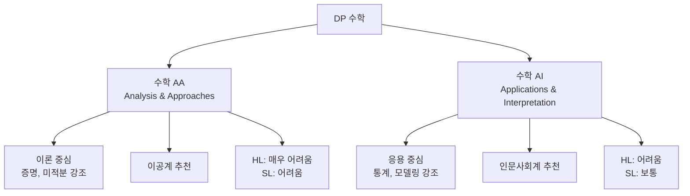

**수학 AA (Analysis & Approaches)**:
- 대수, 함수, 삼각함수
- 미적분 (심화)
- 벡터, 복소수
- 추천: 공학, 물리, 수학 전공

**수학 AI (Applications & Interpretation)**:
- 통계, 확률
- 수학적 모델링
- 미적분 (기초)
- 추천: 경제, 심리, 생물 전공

---

#### Q10. 예술 과목은 어떻게 진행되나요?

**A**: 

**시각예술 SL/HL**:

```
1. 비교 연구 (Comparative Study)
   - 예술가 3명 이상 비교
   - 문화적 맥락 분석
   - 10-15페이지 (SL), 10-15페이지 (HL)

2. 과정 포트폴리오 (Process Portfolio)
   - 작품 제작 과정 기록
   - 실험, 스케치, 성찰
   - 9-18페이지 (SL), 9-18페이지 (HL)

3. 전시회 (Exhibition)
   - 완성 작품 4-7점 (SL)
   - 완성 작품 8-11점 (HL)
   - 큐레이터 설명문 (400자)
```

**평가 비중**:
- 비교 연구: 20%
- 과정 포트폴리오: 40%
- 전시회: 40%

---

### 🎯 교육방식 관련 (Q11-Q20)

#### Q11. 하루 일과는 어떻게 되나요?

**A**: 

**MYP 중2 학생의 하루**:

```
06:30 - 기상, 아침 식사
07:30 - 등교
08:00 - 1교시: 영어 (토론)
09:00 - 2교시: 수학 (문제 풀이)
10:00 - 3교시: 과학 (실험)
11:00 - 4교시: 국어 (문학 분석)
12:00 - 점심 시간
13:00 - 5교시: 사회 (세미나)
14:00 - 6교시: 디자인 (프로젝트)
15:00 - 7교시: 예술 (창작)
16:00 - 하교
16:30 - 휴식, 간식
17:00 - 과제 시작
     - 영어 읽기 (1시간)
     - 수학 문제 (1시간)
19:00 - 저녁 식사
20:00 - 과제 계속
     - 과학 보고서 (1시간)
     - 프로젝트 작업 (1시간)
22:00 - 성찰 일지 작성 (30분)
22:30 - 자유 시간
23:00 - 취침
```

**주말**:
- 토요일: 프로젝트 작업 4시간, 독서 2시간
- 일요일: 복습 2시간, 다음 주 준비 2시간

---

#### Q12. 시험은 어떻게 보나요?

**A**: 

**PYP (초등)**: 
- ❌ 정기 시험 없음
- ✅ 프로젝트, 발표, 포트폴리오로 평가

**MYP (중등)**:
- 단원 평가 (8주마다)
- 논술형 + 실기 평가
- 개인 프로젝트 (중3)

**DP (고등)**:
- 내부 평가 (IA): 교사 채점
- 외부 평가: IBO 채점
- 최종 시험: 2년차 5월

**DP 시험 예시 (화학 HL)**:
```
Paper 1 (1시간):
- 40문제 객관식
- 계산기 사용 불가

Paper 2 (2시간 15분):
- 단답형 + 논술형
- 계산기 사용 가능
- 예: "전기화학 셀의 작동 원리를 설명하고,
      지속 가능한 에너지 저장 방법을 평가하시오."

Paper 3 (1시간 15분):
- 데이터 기반 문제
- 선택 주제 (A, B, C, D 중 1개)
```

---

#### Q13. 암기는 전혀 안 하나요?

**A**: **암기는 하지만, 방식이 다릅니다.**

**전통 교육 vs IB**:

| 구분 | 전통 교육 | IB 교육 |
|------|---------|--------|
| **무엇을** | 사실, 공식, 정의 | 개념, 원리, 연결 |
| **어떻게** | 반복 암기 | 이해 후 적용 |
| **평가** | 그대로 재현 | 새로운 상황에 적용 |

**예시 (화학)**:

**전통 교육**:
```
Q: 산화수 규칙을 쓰시오.
A: (규칙 7개 암기)
```

**IB 교육**:
```
Q: 다음 화합물에서 각 원소의 산화수를 구하고,
   이것이 화합물의 성질에 어떤 영향을 미치는지 설명하시오.
   
→ 산화수 규칙을 이해하고 적용
→ 화학적 의미 해석
→ 실생활 연결
```

**암기해야 할 것**:
- ✅ 기본 개념, 공식
- ✅ 핵심 용어
- ✅ 역사적 사실, 날짜

**암기하지 않아도 되는 것**:
- ❌ 세세한 디테일 (시험에 자료 제공)
- ❌ 단순 나열
- ❌ 맥락 없는 사실

---

#### Q14. 그룹 활동이 많은가요? 개인 활동이 많은가요?

**A**: **둘 다 중요합니다.**

**비율**:
```
PYP (초등): 그룹 60% + 개인 40%
MYP (중등): 그룹 50% + 개인 50%
DP (고등): 그룹 40% + 개인 60%
```

**그룹 활동**:
- 소그룹 토론 (4-5명)
- 프로젝트 (2-4명)
- 세미나 (전체)
- 실험 (짝 또는 모둠)

**개인 활동**:
- 읽기, 쓰기
- 개인 연구
- 시험
- 성찰 일지

**그룹 활동의 목적**:
1. 협력 기술 개발
2. 다양한 관점 배우기
3. 소통 능력 향상
4. 리더십 경험

**개인 활동의 목적**:
1. 자기주도 학습
2. 깊이 있는 사고
3. 독립적 연구 능력
4. 개인 책임감

---

#### Q15. 발표를 자주 하나요? 발표를 못하면 어떻게 하나요?

**A**: **네, 발표는 필수입니다.**

**발표 빈도**:
- PYP: 주 1-2회 (짧은 발표)
- MYP: 주 1회 (10-15분)
- DP: 2주 1회 (15-20분)

**발표 유형**:
```
1. 개인 발표
   - 조사 내용 공유
   - 프로젝트 결과

2. 모둠 발표
   - 협력 프로젝트
   - 토론 결과

3. 즉석 발표
   - 수업 중 의견 공유
   - 질문에 답변

4. 공식 발표
   - 학부모 초청
   - 평가 대상
```

**발표를 못하는 학생을 위한 지원**:

```
1단계: 작은 그룹에서 시작
   - 짝에게 발표 (1:1)
   - 소그룹 (4명)
   - 점차 확대

2단계: 준비 시간 충분히
   - 대본 작성
   - 리허설 여러 번
   - 교사 피드백

3단계: 다양한 방식 허용
   - PPT 활용
   - 영상 제작
   - 포스터 발표

4단계: 긍정적 환경
   - 실수 허용
   - 동료 격려
   - 성장 중심 평가
```

**발표 평가 기준**:
- 내용의 정확성 (40%)
- 소통 능력 (30%)
- 자신감 (15%)
- 시각 자료 (15%)

---

#### Q16. 실험은 얼마나 자주 하나요?

**A**: 

**과학 과목 기준**:

**MYP (중등)**:
- 주 1-2회 (각 1-2시간)
- 학기당 약 15-20회

**DP (고등)**:
- 주 1회 (2-3시간)
- 2년간 총 60시간 (SL), 80시간 (HL)

**실험 유형**:

```
1. 확인 실험 (Verification)
   - 이론 확인
   - 기본 기술 습득

2. 탐구 실험 (Inquiry)
   - 학생이 설계
   - 변인 통제
   - 데이터 분석

3. 개방 탐구 (Open Inquiry)
   - 연구 질문 설정
   - 방법 선택
   - IA (내부 평가)에 활용
```

**실험 과정**:
```
수업 전 (30분):
- 실험 예습
- 안전 수칙 확인

수업 중 (2시간):
- 실험 설계 (20분)
- 실험 수행 (60분)
- 데이터 분석 (30분)
- 정리 및 토론 (10분)

수업 후 (2시간):
- 실험 보고서 작성
```

---

#### Q17. 컴퓨터/AI 도구를 수업에서 사용하나요?

**A**: **네, 적극 활용합니다.**

**사용 도구**:

```
1. 데이터 분석
   - Excel, Google Sheets
   - Python (DP 수학, 과학)
   - Desmos (그래프)

2. 시뮬레이션
   - PhET (과학 시뮬레이션)
   - GeoGebra (수학)
   - Molecular modeling (화학)

3. 연구 도구
   - Google Scholar (논문 검색)
   - Zotero (참고문헌 관리)
   - Grammarly (글쓰기)

4. AI 도구
   - ChatGPT (브레인스토밍)
   - Perplexity (자료 조사)
   - Notion AI (정리)

5. 협업 도구
   - Google Workspace
   - Padlet (아이디어 공유)
   - Miro (마인드맵)

6. 프레젠테이션
   - Canva
   - Prezi
   - PowerPoint
```

**사용 규칙**:
- ✅ 탐구 도구로 활용
- ✅ 데이터 분석 지원
- ✅ 시각화
- ❌ 과제 대신 작성
- ❌ 시험에서 사용

---

#### Q18. 현장 학습이나 견학은 자주 가나요?

**A**: 

**PYP (초등)**:
- 학기당 3-4회
- 박물관, 과학관, 지역 탐방
- 탐구 단원과 연계

**MYP (중등)**:
- 학기당 2-3회
- 대학, 기업, 연구소 방문
- 교과 연계 (과학관, 역사 유적지)

**DP (고등)**:
- 학기당 1-2회
- 대학 탐방, 전문가 강연
- CAS 활동 (봉사 기관 방문)

**현장 학습 예시**:

```
[MYP 과학 - 환경 단원]

사전 활동 (1주):
- 탐구 질문: "우리 지역 하천의 수질은?"
- 조사 방법 학습
- 측정 도구 연습

현장 학습 (1일):
- 하천 방문
- 수질 측정 (pH, DO, 탁도)
- 생물 관찰
- 사진 및 영상 기록

사후 활동 (1주):
- 데이터 분석
- 보고서 작성
- 개선 방안 제안
- 발표
```

---

#### Q19. 방학 때도 과제가 있나요?

**A**: **네, 있습니다.**

**여름 방학 (2개월)**:

**PYP**:
- 독서 (5-10권)
- 탐구 프로젝트 1개
- 성찰 일지

**MYP**:
- 독서 (10-15권)
- 교과별 과제 (에세이, 문제 풀이)
- 개인 프로젝트 준비 (중3)

**DP**:
- 독서 (15-20권, 교과 관련)
- EE 연구 (고2 여름)
- CAS 활동
- 교과 심화 학습

**겨울 방학 (1개월)**:
- 여름 방학의 50% 수준

**방학 과제의 목적**:
- 학습 연속성 유지
- 자기주도 학습 습관
- 심화 탐구 기회

---

#### Q20. 학교 밖 활동(CAS, 봉사)은 어떻게 하나요?

**A**: 

**CAS (DP 필수)**:

```
Creativity (창의):
- 예술 활동 (음악, 미술, 연극)
- 창작 활동 (글쓰기, 영상 제작)
- 주 2-3시간

Activity (활동):
- 스포츠 (축구, 농구, 수영)
- 신체 활동 (등산, 요가)
- 주 2-3시간

Service (봉사):
- 지역 봉사 (복지관, 도서관)
- 환경 활동 (정화, 캠페인)
- 교육 봉사 (멘토링)
- 주 2-3시간
```

**CAS 프로젝트 예시**:

```
프로젝트: "초등학생 과학 멘토링"

Creativity:
- 과학 실험 교재 제작
- 실험 영상 제작

Activity:
- 실험 준비 및 진행
- 야외 과학 활동

Service:
- 지역 초등학교 방문
- 무료 과학 수업 진행

기간: 6개월
시간: 주 3시간, 총 70시간
```

**학교의 지원**:
- CAS 코디네이터 배정
- 활동 기회 제공
- 성찰 피드백
- 안전 관리

---

### 💪 역량 관련 (Q21-Q30)

#### Q21. IB를 통해 어떤 역량이 길러지나요?

**A**: 

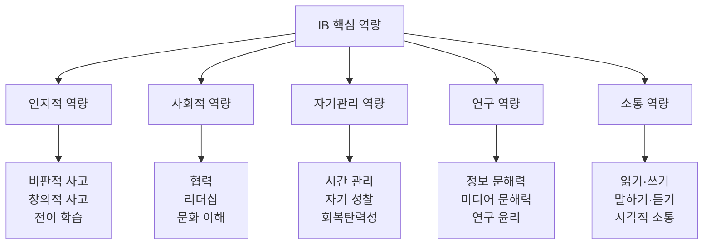

---

#### Q22. 비판적 사고는 어떻게 기르나요?

**A**: 

**수업에서**:
```
1단계: 질문하기
   - "왜 그럴까?"
   - "다른 관점은?"
   - "증거는 무엇인가?"

2단계: 분석하기
   - 주장과 근거 구분
   - 논리적 오류 찾기
   - 가정 확인

3단계: 평가하기
   - 출처의 신뢰성
   - 증거의 타당성
   - 결론의 적절성

4단계: 종합하기
   - 다양한 관점 통합
   - 새로운 통찰 도출
```

**실전 예시 (역사)**:
```
주제: "제2차 세계대전의 원인"

비판적 사고 과정:
1. 다양한 역사가의 주장 비교
   - A: 경제적 원인 강조
   - B: 정치적 원인 강조
   - C: 문화적 원인 강조

2. 각 주장의 근거 평가
   - 1차 자료 vs 2차 자료
   - 편향성 확인
   - 맥락 고려

3. 자신의 입장 정립
   - 증거 기반 논증
   - 반대 입장 고려
   - 한계 인정

4. 에세이 작성
   - 논리적 구조
   - 균형 잡힌 시각
```

---

#### Q23. 창의성은 어떻게 개발하나요?

**A**: 

**IB의 창의성 개발 방법**:

```
1. 개방형 질문
   - "만약 ~라면?"
   - "다른 방법은?"
   - "새로운 관점은?"

2. 브레인스토밍
   - 판단 보류
   - 양 중시
   - 연결 찾기

3. 프로젝트 기반 학습
   - 학생이 주제 선택
   - 다양한 표현 방식
   - 실패 허용

4. 간학문적 접근
   - 교과 통합
   - 다양한 관점
   - 융합적 사고
```

**창의성 평가 기준**:
- 독창성 (Originality)
- 유창성 (Fluency)
- 융통성 (Flexibility)
- 정교성 (Elaboration)

---

#### Q24. 시간 관리 능력은 어떻게 기르나요?

**A**: 

**IB 학생의 시간 관리 필수 기술**:

```
1. 우선순위 설정
   긴급-중요 매트릭스:
   
   긴급O 중요O → 즉시 처리
   (내일 제출 과제, 시험)
   
   긴급X 중요O → 계획적 처리
   (EE 연구, 장기 프로젝트)
   
   긴급O 중요X → 최소화
   (갑작스러운 요청)
   
   긴급X 중요X → 제거
   (SNS, 게임)

2. 주간 계획
   일요일 저녁:
   - 다음 주 일정 확인
   - 과제 목록 작성
   - 시간 배분

3. 일일 계획
   - 아침: 오늘 할 일 3가지
   - 저녁: 성찰 및 내일 준비

4. 루틴 만들기
   - 고정 시간대 (수업, 식사, 수면)
   - 과제 시간 (매일 17:00-22:00)
   - 휴식 시간 (주말 오전)
```

**도구**:
- 플래너 (종이 또는 디지털)
- 구글 캘린더
- Notion (과제 관리)
- Pomodoro 타이머 (25분 집중)

---

#### Q25. 글쓰기 실력은 어떻게 늘리나요?

**A**: 

**IB 글쓰기의 특징**:
- 논리적 구조
- 증거 기반
- 비판적 분석
- 명확한 표현

**단계별 글쓰기 연습**:

```
PYP (초등):
- 문장 쓰기 → 문단 쓰기
- 일기, 탐구 일지
- 그림과 글 결합

MYP (중등):
- 에세이 구조 (서론-본론-결론)
- 논증 에세이 (500-1,000자)
- 다양한 장르 (설명, 논증, 서사)

DP (고등):
- 학술적 글쓰기
- 긴 에세이 (1,500-4,000자)
- 연구 논문 (EE)
```

**글쓰기 향상 방법**:

```
1. 많이 읽기
   - 다양한 장르
   - 좋은 글의 구조 분석

2. 자주 쓰기
   - 매일 일지 (10분)
   - 주 1회 에세이

3. 피드백 받기
   - 교사 첨삭
   - 동료 검토
   - 자기 수정

4. 도구 활용
   - Grammarly (문법)
   - Hemingway (명확성)
   - 한글 맞춤법 검사기
```

---

#### Q26. 발표/프레젠테이션 능력은 어떻게 기르나요?

**A**: 

**효과적인 발표 기술**:

```
1. 준비 (70%)
   내용:
   - 명확한 메시지
   - 논리적 구조
   - 증거와 예시
   
   연습:
   - 리허설 5회 이상
   - 시간 맞추기
   - 질문 예상

2. 전달 (20%)
   목소리:
   - 크고 명확하게
   - 속도 조절
   - 강조와 쉼
   
   몸짓:
   - 눈 맞춤
   - 자연스러운 제스처
   - 자신감 있는 자세

3. 시각 자료 (10%)
   - 간결한 슬라이드
   - 핵심만 표시
   - 이미지, 그래프 활용
```

**발표 구조 (10분 기준)**:
```
도입 (2분):
- 주의 끌기 (질문, 사실, 이야기)
- 주제 소개
- 발표 개요

본론 (6분):
- 핵심 포인트 3가지
- 각 포인트당 2분
- 증거와 예시

결론 (2분):
- 요약
- 핵심 메시지 재강조
- 질문 유도
```

---

#### Q27. 협력 능력은 어떻게 개발하나요?

**A**: 

**IB의 협력 학습**:

```
1. 역할 분담
   - 리더: 전체 조율
   - 연구원: 자료 조사
   - 작가: 문서 작성
   - 발표자: 프레젠테이션
   
   → 역할 순환 (공정성)

2. 의사소통
   - 정기 회의 (주 2회)
   - 진행 상황 공유
   - 문제 해결 논의

3. 갈등 관리
   - 경청하기
   - 타협점 찾기
   - 중재자 활용 (교사)

4. 상호 책임
   - 개인 기여도 평가
   - 동료 평가
   - 집단 성과
```

**협력 프로젝트 평가**:
- 개인 기여 (40%)
- 팀 협력 (30%)
- 최종 결과물 (30%)

---

#### Q28. 리더십은 어떻게 기르나요?

**A**: 

**IB에서의 리더십 기회**:

```
1. 학급 활동
   - 모둠 리더
   - 프로젝트 팀장
   - 토론 진행자

2. 학교 활동
   - 학생회
   - 동아리 회장
   - 행사 기획

3. CAS 활동
   - 봉사 프로젝트 리더
   - 캠페인 조직
   - 멘토링

4. 학습 리더십
   - 동료 튜터링
   - 스터디 그룹 운영
```

**리더십 유형**:
- 서번트 리더십 (섬김)
- 민주적 리더십 (참여)
- 변혁적 리더십 (변화)

---

#### Q29. 문제 해결 능력은 어떻게 키우나요?

**A**: 

**문제 해결 프로세스**:

```
1. 문제 정의
   - 무엇이 문제인가?
   - 왜 문제인가?
   - 누구의 문제인가?

2. 정보 수집
   - 관련 자료 조사
   - 전문가 의견
   - 유사 사례

3. 해결책 생성
   - 브레인스토밍
   - 다양한 대안
   - 창의적 접근

4. 평가 및 선택
   - 장단점 분석
   - 실현 가능성
   - 최선의 선택

5. 실행
   - 계획 수립
   - 단계별 실행
   - 모니터링

6. 성찰
   - 결과 평가
   - 배운 점
   - 개선 방안
```

**실전 예시 (MYP 디자인)**:
```
문제: "학교 쓰레기 분리수거율 향상"

1. 문제 분석
   - 현재 분리수거율 30%
   - 원인: 인식 부족, 불편한 위치

2. 조사
   - 설문 조사 (학생 200명)
   - 타 학교 사례
   - 전문가 인터뷰

3. 해결책
   - 안내 포스터
   - 쓰레기통 재배치
   - 캠페인 진행

4. 실행
   - 3개월 프로젝트
   - 주간 모니터링

5. 결과
   - 분리수거율 70%로 향상
   - 성공 요인 분석
```

---

#### Q30. 자기 성찰 능력은 어떻게 기르나요?

**A**: 

**성찰의 중요성**:
- 메타인지 개발
- 학습 전략 개선
- 자기 이해 증진

**성찰 방법**:

```
1. 성찰 일지 (매일 10분)
   질문:
   - 오늘 무엇을 배웠나?
   - 어떤 점이 어려웠나?
   - 어떻게 극복했나?
   - 내일은 무엇을 할 것인가?

2. 학습 포트폴리오
   - 작품 모음
   - 성장 과정 기록
   - 자기 평가

3. 동료/교사 피드백
   - 다른 시각 듣기
   - 강점과 약점 파악
   - 개선 방향 설정

4. 목표 설정 및 점검
   - 단기 목표 (주간)
   - 중기 목표 (학기)
   - 장기 목표 (연간)
```

**성찰 질문 (IB 학습자상 기반)**:

```
탐구하는 사람:
- 나는 충분히 질문했는가?
- 호기심을 따라갔는가?

사고하는 사람:
- 비판적으로 생각했는가?
- 다양한 관점을 고려했는가?

소통하는 사람:
- 명확하게 표현했는가?
- 타인의 의견을 경청했는가?

성찰하는 사람:
- 나의 학습 과정을 돌아봤는가?
- 무엇을 개선할 수 있는가?
```

---

### 📖 필독서 및 자료 (Q31-Q35)

#### Q31. IB 학생을 위한 학습 가이드북은?

**A**: 

**공식 가이드**:
- 『IB Learner Profile』 (IBO)
- 『Theory of Knowledge Guide』 (IBO)
- 『Extended Essay Guide』 (IBO)

**학습 전략**:
- 『How to Study』 (Ron Fry)
- 『Make It Stick』 (Peter Brown) - 효과적 학습법
- 『Deep Work』 (Cal Newport) - 집중력

**시간 관리**:
- 『Getting Things Done』 (David Allen)
- 『Atomic Habits』 (James Clear)

**글쓰기**:
- 『On Writing Well』 (William Zinsser)
- 『The Elements of Style』 (Strunk & White)

---

#### Q32. 교과별 추천 참고서는?

**A**: 

**화학**:
- 『Pearson Baccalaureate Chemistry HL』
- 『Oxford IB Chemistry Study Guide』
- 『Chemistry for the IB Diploma』 (Bylikin)

**수학**:
- 『Mathematics for the IB Diploma: Analysis and Approaches HL』 (Fannon)
- 『Haese Mathematics』 시리즈

**역사**:
- 『History for the IB Diploma: 20th Century World』
- 『Access to History』 시리즈

**영어**:
- 『IB English A: Language and Literature』 (Titley)
- 『IB English B Course Book』 (Kawther Saa'd Aldin)

---

#### Q33. 온라인 강의는 어디서 들을 수 있나요?

**A**: 

**IB 전문 플랫폼**:
```
1. Kognity
   - 전 과목 온라인 교과서
   - 인터랙티브 학습
   - 유료 (학교 구독)

2. OSC IB
   - 과목별 강의
   - 기출문제 해설
   - 유료

3. IB Documents
   - 기출문제 모음
   - 학습 자료
   - 무료/유료
```

**일반 학습 플랫폼**:
```
1. Khan Academy
   - 수학, 과학 기초
   - 무료

2. Coursera
   - 대학 수준 강의
   - 무료 (수료증 유료)

3. edX
   - MIT, Harvard 강의
   - 무료

4. YouTube
   - IB 전문 채널:
     - Bioninja (생물)
     - MSJChem (화학)
     - History with Mr. Green
```

---

#### Q34. 기출문제는 어디서 구하나요?

**A**: 

**공식 경로**:
```
1. My IB (IB 학생 포털)
   - 최근 3년 기출문제
   - 무료 (학교 계정)

2. IB Follett (IB 서점)
   - 과거 시험지 구매
   - 유료
```

**비공식 경로**:
```
1. IB Documents
   - 다양한 연도 기출
   - 유료 구독

2. IB Questionbank
   - 주제별 문제 모음
   - 유료

3. 학교 자료실
   - 과거 학생들의 기출
   - 무료
```

**활용 방법**:
```
1. 단원 학습 후
   - 해당 주제 문제 풀이
   - 약점 파악

2. 시험 2-3개월 전
   - 전체 모의고사
   - 시간 맞춰 연습

3. 시험 1개월 전
   - 최근 3년 기출 반복
   - 채점 기준 숙지
```

---

#### Q35. 부모가 읽으면 좋은 책은?

**A**: 

**IB 이해**:
- 『IB를 말하다』 (대구교육청)
- 『국제 바칼로레아 교육과정 이해』

**교육 철학**:
- 『아이의 미래를 바꾸는 학습 혁명』 (켄 로빈슨)
- 『그릿』 (앤절라 더크워스) - 끈기의 중요성
- 『마인드셋』 (캐럴 드웩) - 성장 마인드셋

**자녀 교육**:
- 『어떻게 질문할 것인가』
- 『하버드 새벽 4시 반』
- 『공부머리 독서법』

**AI 시대 교육**:
- 『AI 시대, 어떻게 가르칠 것인가』
- 『미래 교육이 온다』

---

### 🎯 기타 실전 (Q36-Q40)

#### Q36. IB 점수를 올리는 비법은?

**A**: 

**단기 전략 (시험 3개월 전)**:
```
1. 기출문제 분석
   - 최근 5년 기출
   - 출제 경향 파악
   - 자주 나오는 주제

2. 채점 기준 숙지
   - Markscheme 연구
   - 만점 답안 분석
   - 부분 점수 전략

3. 약점 집중 공략
   - 틀린 문제 분석
   - 개념 재학습
   - 반복 연습

4. 시간 관리 연습
   - 모의고사 시간 맞춤
   - 문제별 시간 배분
```

**장기 전략 (2년간)**:
```
1. 개념 완벽 이해
   - 암기보다 이해
   - 연결 고리 찾기
   - 실생활 적용

2. 꾸준한 연습
   - 매일 조금씩
   - 다양한 문제 유형
   - 피드백 반영

3. 교사와 소통
   - 질문 적극적으로
   - 피드백 요청
   - 개별 상담

4. 건강 관리
   - 충분한 수면
   - 규칙적 운동
   - 스트레스 관리
```

---

#### Q37. 내부 평가(IA)를 잘하는 방법은?

**A**: 

**IA 성공 전략**:

```
1. 주제 선정 (가장 중요)
   좋은 주제:
   - 흥미로운 주제
   - 적절한 범위
   - 실험 가능
   - 자료 접근 가능
   
   나쁜 주제:
   - 너무 광범위
   - 실험 불가능
   - 자료 부족

2. 연구 질문
   명확하고 구체적:
   ✅ "구리 농도가 전기화학 셀 전압에 미치는 영향"
   ❌ "전기화학 셀 연구"

3. 실험 설계
   - 변인 통제 철저
   - 반복 실험 (최소 5회)
   - 데이터 충분히

4. 분석 및 평가
   - 오차 분석
   - 한계점 인정
   - 개선 방안 제시

5. 시간 관리
   - 6개월 전 시작
   - 단계별 마감일
   - 여유 있게
```

**IA 체크리스트**:
```
□ 연구 질문 명확
□ 배경 이론 충분
□ 방법 상세 설명
□ 원시 데이터 포함
□ 그래프/표 적절
□ 분석 깊이 있음
□ 결론 논리적
□ 평가 비판적
□ 참고문헌 정확
□ 분량 적절 (6-12페이지)
```

---

#### Q38. TOK 에세이를 잘 쓰는 방법은?

**A**: 

**TOK 에세이 전략**:

```
1. 지식 질문 (KQ) 이해
   - 핵심 용어 정의
   - 질문의 범위 파악
   - 가정 확인

2. 구조 설계
   서론:
   - KQ 명확화
   - 논지 제시
   
   본론 (3-4문단):
   - 주장 1 + RLS + 분석
   - 반론 + RLS + 반박
   - 주장 2 + RLS + 분석
   - 다른 지식 영역 연결
   
   결론:
   - 논지 재확인
   - 통찰
   - 열린 질문

3. RLS (실제 세계 상황)
   - 구체적이고 최신
   - 다양한 출처
   - 깊이 있는 분석

4. WOK/AOK 활용
   - 지식의 방법 (이성, 감정, 언어 등)
   - 지식 영역 (과학, 역사, 예술 등)
   - 유기적 연결
```

**피해야 할 것**:
- ❌ 단순 의견 나열
- ❌ 일반적 예시
- ❌ 한 관점만 제시
- ❌ 개인적 일화만 사용

---

#### Q39. EE (소논문)를 잘 쓰는 방법은?

**A**: 

**EE 성공 로드맵**:

```
[고2 3월-6월] 주제 탐색
- 관심 분야 브레인스토밍
- 교사 상담
- 예비 조사
- 연구 질문 초안

[고2 7-8월] 여름 방학 집중
- 문헌 검토
- 연구 방법 확정
- 데이터 수집 시작
- 개요 작성

[고2 9-12월] 초안 작성
- 서론, 문헌 검토
- 방법, 결과
- 교사 피드백 (3회)
- 수정

[고3 1-3월] 완성
- 논의, 결론
- 전체 수정
- 참고문헌 정리
- 최종 제출 (3월)
```

**EE 평가 포인트**:
```
A. 초점과 방법 (6점)
   - 명확한 연구 질문
   - 적절한 방법론

B. 지식과 이해 (6점)
   - 교과 지식 활용
   - 문헌 검토 충실

C. 비판적 사고 (12점)
   - 깊이 있는 분석
   - 논리적 논증
   - 다양한 관점

D. 발표 (4점)
   - 구조, 레이아웃
   - 인용 형식

E. 참여 (6점)
   - 연구 과정 성찰
   - 의사결정 기록
```

---

#### Q40. IB에서 성공하는 학생의 특징은?

**A**: 

**성공하는 IB 학생의 10가지 습관**:

```
1. 호기심
   - 질문을 멈추지 않음
   - 깊이 파고듦
   - 연결 고리 찾기

2. 시간 관리
   - 계획적
   - 마감일 준수
   - 여유 있게 시작

3. 자기주도
   - 스스로 학습
   - 도움 요청 (필요시)
   - 책임감

4. 성찰
   - 매일 돌아봄
   - 실수에서 배움
   - 개선 노력

5. 균형
   - 공부 + 휴식
   - 학업 + 활동
   - 신체 + 정신

6. 협력
   - 팀워크
   - 경청
   - 기여

7. 회복탄력성
   - 실패 극복
   - 포기하지 않음
   - 긍정적 태도

8. 비판적 사고
   - 의심하고 검증
   - 다양한 관점
   - 증거 기반

9. 소통
   - 명확한 표현
   - 적극적 참여
   - 피드백 수용

10. 열정
    - 배움의 즐거움
    - 목표 의식
    - 끈기
```

**학부모의 역할**:
```
✅ 지지하기
   - 과정 격려
   - 정서적 지원

✅ 환경 만들기
   - 학습 공간
   - 시간 보장

✅ 소통하기
   - 교사와 연락
   - 자녀와 대화

❌ 하지 말아야 할 것
   - 과도한 압박
   - 결과만 강조
   - 과제 대신 하기
```

---

## 마무리

### IB 교육의 핵심 메시지

```
"IB는 단순히 좋은 점수를 받는 것이 아니라,
 평생 학습자로 성장하는 과정입니다."
```

**기억해야 할 것**:
1. 과정이 결과보다 중요
2. 질문이 답보다 중요
3. 이해가 암기보다 중요
4. 성장이 완벽보다 중요

**IB 학생에게**:
- 호기심을 잃지 마세요
- 실패를 두려워하지 마세요
- 도움을 요청하세요
- 자신을 믿으세요

**학부모에게**:
- 자녀를 믿으세요
- 과정을 존중하세요
- 함께 성장하세요

---

**문서 끝**

> 이 문서는 IB 교육의 실제 운영 방식을 상세히 안내합니다.  
> 학년별 과목, 주제, 결과물, 커리큘럼을 구체적으로 제시하여  
> IB 교육을 이해하고 실천하는 데 도움을 드리고자 작성되었습니다.
> 
> **작성**: 2026년 1월  
> **참고**: IB_국제바칼로레아_교육과정_완벽가이드.md
> 
> **FAQ 추가**: 컨텐츠, 교육방식, 필독서, 역량 등 40개 질문 상세 답변

