# IB 한일 비교 및 한국형 IB 도입 완벽 가이드

> **목적**: 일본과 한국의 IB 교육 비교, 최종 평가 체계, 한국형 IB 공교육 도입 현황 및 입시제도 연계 분석  
> **대상**: 교육 정책 담당자, 학교 관계자, 학부모, 학생  
> **작성일**: 2026년 1월

---

## 📚 목차

1. [일본과 한국의 IB 교육 비교](#1-일본과-한국의-ib-교육-비교)
2. [IB 최종 시험 및 평가 체계](#2-ib-최종-시험-및-평가-체계)
3. [IB 교육의 핵심 방향](#3-ib-교육의-핵심-방향)
4. [한국형 IB 공교육 도입 현황](#4-한국형-ib-공교육-도입-현황)
5. [입시제도와의 연계](#5-입시제도와의-연계)
6. [기대 효과 및 과제](#6-기대-효과-및-과제)

---

## 1. 일본과 한국의 IB 교육 비교

### 1.1 도입 시기 및 규모

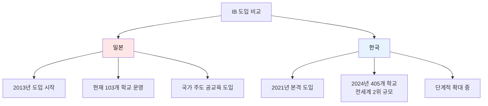

#### 일본의 IB 현황

| 구분 | 내용 |
|------|------|
| **도입 연도** | 2013년 |
| **학교 수** | 약 103개 (2024년 기준) |
| **도입 방식** | 국가 주도 공교육 도입 |
| **언어** | 일본어 DP 개발 완료 |
| **정부 지원** | 문부과학성 적극 지원 |

#### 한국의 IB 현황

| 구분 | 내용 |
|------|------|
| **도입 연도** | 2021년 (정식 인증교) |
| **학교 수** | 405개 (전세계 2위, 2024년 기준) |
| **도입 방식** | 시도교육청 주도 단계적 도입 |
| **언어** | 한국어 DP 번역 완료 (2019년) |
| **정부 지원** | 교육청별 예산 지원 |

**핵심 차이점**:
- **일본**: 중앙정부 주도, 교육격차 해소 중점
- **한국**: 지역교육청 주도, 빠른 확산 속도

---

### 1.2 도입 배경 및 목적

#### 일본의 도입 배경

```
1. 교육격차 해소
   - 고치현 등 소외 지역 인재 육성
   - 인구 감소 및 고령화 지역 활성화
   
2. 국제 경쟁력 강화
   - 글로벌 인재 양성
   - 일본어 DP 개발로 접근성 향상
   
3. 교육 혁신
   - 암기식 교육 탈피
   - 사고력 중심 교육
```

**사례: 고치현**
- 일본에서 학력이 낮고 경제적으로 소외된 지역
- IB 도입으로 지역 교육 활성화 추진
- 공교육 차원의 체계적 지원

#### 한국의 도입 배경

```
1. 교육 패러다임 전환
   - 암기 위주 → 창의·비판적 사고력 중심
   - 입시 중심 → 역량 중심
   
2. 4차 산업혁명 대응
   - 미래형 글로컬 인재 양성
   - AI 시대 핵심 역량 개발
   
3. 지역 교육 격차 해소
   - 공교육 차원의 질적 향상
   - 계층·지역별 교육 기회 확대
   
4. 2028 대입 개편 연계
   - 서논술형 평가 확산
   - 수능 중심에서 종합 평가로 전환
```

---

### 1.3 운영 방식 비교

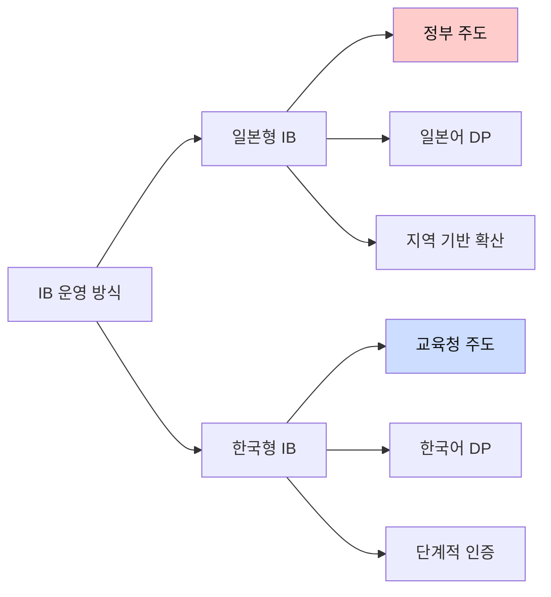

#### 일본

**특징**:
- 중앙정부(문부과학성) 주도 정책
- 일본어 DP 개발로 언어 장벽 해소
- 지역사회와 연계한 통합적 접근

**장점**:
- ✅ 체계적인 정부 지원
- ✅ 예산 안정적 확보
- ✅ 전국적 표준화

**단점**:
- ❌ 상대적으로 느린 확산 속도
- ❌ 지역별 자율성 제한

#### 한국

**특징**:
- 시도교육청별 독자적 추진
- 한국어 DP 활용 (2019년 번역 완료)
- 기초→관심→후보→인증 단계적 확대

**장점**:
- ✅ 빠른 확산 속도 (405개교)
- ✅ 지역별 특성 반영
- ✅ 다양한 실험 가능

**단점**:
- ❌ 교육청별 격차 발생 가능
- ❌ 예산 및 지원 차이

---

## 2. IB 최종 시험 및 평가 체계

### 2.1 DP (고등학교 과정) 구조

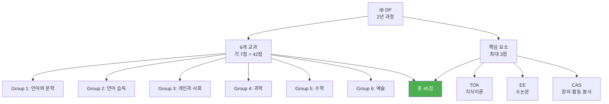

### 2.2 최종 평가 체계

#### 점수 구성 (총 45점)

```
6개 교과 (각 7점 만점)
├─ 상위 레벨(HL) 3과목: 각 240시간
├─ 표준 레벨(SL) 3과목: 각 150시간
└─ 소계: 42점

핵심 요소 (최대 3점)
├─ TOK (지식이론): A~E 등급
├─ EE (소논문): A~E 등급
└─ TOK + EE 조합으로 0~3점 환산

CAS (창의·활동·봉사)
└─ 만족/불만족 (필수 이수, 점수 없음)

─────────────────
총점: 45점
```

#### TOK + EE 점수 환산표

| TOK | EE | 점수 |
|-----|-----|-----|
| A | A | 3점 |
| A | B | 3점 |
| B | A | 3점 |
| B | B | 2점 |
| A | C | 2점 |
| C | A | 2점 |
| B | C | 2점 |
| C | B | 2점 |
| C | C | 1점 |
| D | D | 1점 |
| E | E | 0점 |

---

### 2.3 평가 방식

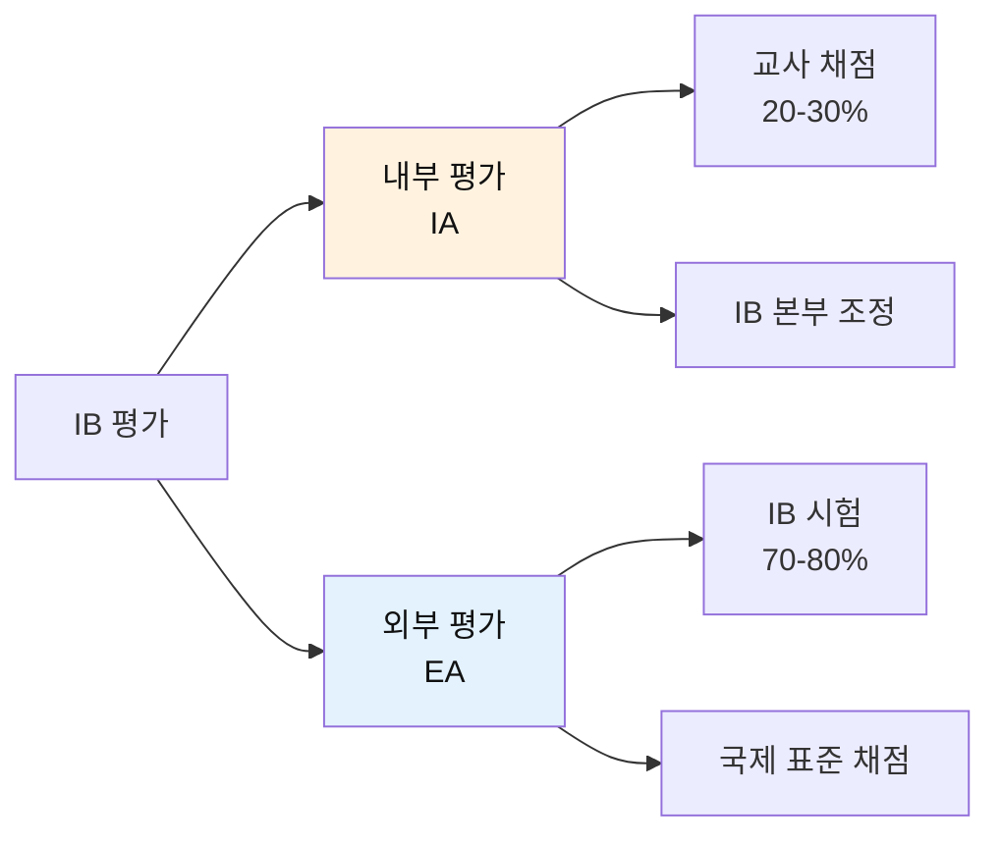

#### 내부 평가 (Internal Assessment, IA)

**특징**:
- 교과 교사가 채점
- 학생 수행 과정 평가
- 전체 성적의 20-30%

**평가 유형**:
```
과학:
- 실험 보고서 (10-12페이지)
- 연구 질문 설정
- 데이터 수집 및 분석
- 비판적 평가

인문·사회:
- 구술 시험
- 연구 프로젝트
- 사례 분석

예술:
- 작품 포트폴리오
- 창작 과정 기록
- 작가 노트
```

**공정성 확보**:
1. 교사 채점 후 IB 본부 제출
2. IB 심사관이 무작위 선별 검토
3. 학교별 표준화 조정 (Moderation)
4. 최종 점수 확정

#### 외부 평가 (External Assessment, EA)

**시험 시기**:
- **북반구**: 5월 (한국 포함)
- **남반구**: 11월

**시험 구조** (과목별 차이):
```
Paper 1:
- 객관식 또는 단답형
- 계산기 사용 불가 (과학/수학)
- 1시간

Paper 2:
- 논술형 (장문)
- 계산기 사용 가능
- 2-2.5시간

Paper 3 (HL만):
- 데이터 기반 문제
- 선택 주제
- 1-1.5시간
```

**예시: 화학 HL**

| 평가 요소 | 비중 | 시간 | 내용 |
|---------|------|------|------|
| Paper 1 | 20% | 1시간 | 40문제 객관식 |
| Paper 2 | 36% | 2시간 15분 | 단답형 + 논술형 |
| Paper 3 | 24% | 1시간 15분 | 선택 주제 (생화학 등) |
| IA (내부) | 20% | - | 실험 보고서 |
| **총** | **100%** | | |

**채점 방식**:
```
1단계: 전문 채점관 배정
   - IB 본부 양성 채점관 (전세계)
   - 교차 채점 (Double Marking)

2단계: 표준화
   - 국가별, 학교별 표준화
   - 공정성 확보

3단계: 점수 확정
   - 1-7점 등급 부여
   - 통계적 조정
```

---

### 2.4 등급 및 디플로마 취득 조건

#### 점수별 등급 기준

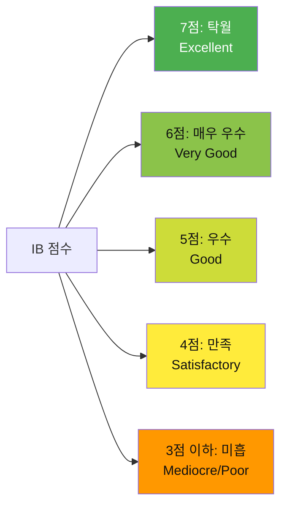

#### 디플로마 취득 조건

**필수 조건** (모두 충족):
```
✅ 총점 24점 이상 (45점 만점)
✅ TOK + EE에서 최소 D 이상 (E 받으면 탈락)
✅ CAS 요건 만족 (150시간 이상)
✅ 3점 이하 과목이 3개 이하
✅ HL 과목 중 2점 이하 없음
✅ SL 과목 중 1점 없음
✅ 학문적 정직성 준수 (표절 적발 시 탈락)
```

**디플로마 미취득 시**:
- 개별 과목 Certificate 수여
- 재응시 가능 (다음 시험 기간)

---

### 2.5 점수대별 대학 진학 기준

#### 국제 대학 기준

```
45점 (만점)
└─ 세계 최상위 0.5%
   - 하버드, 스탠포드, MIT 등
   - 옥스브리지 (경쟁 학과)

43-44점
└─ 아이비리그, 옥스브리지
   - 상위 3% 수준
   - 경쟁 전공 합격선

40-42점
└─ 러셀 그룹, 캐나다 명문대
   - 토론토대 전액 장학금 (42점)
   - 홍콩 과기대 장학생 (40점)
   - 상위 10% 수준

38-39점
└─ 우수 대학
   - 대부분의 해외 대학 진학 가능

35-37점
└─ 일반 대학
   - 안정적 진학

24-34점
└─ 디플로마 취득
   - 진학 가능하나 경쟁력 낮음
```

#### 한국 대학 기준 (참고)

```
42점 이상
└─ 서울대, 연세대, 고려대 등 최상위권
   - 학생부종합전형 (수능 최저 없음)
   - IB 성적 + 활동 종합 평가

38-41점
└─ 성균관대, 한양대 등 상위권
   - 학종 전형 유리

35-37점
└─ 중위권 대학
   - 안정적 합격

* 주의: 한국 대학은 IB 점수만으로 합격이 결정되지 않음
  학생부, TOK, EE, CAS 등 종합 평가
```

---

### 2.6 최종 결과물

#### 학생이 제출하는 결과물

```
1. 교과별 평가 (6개)
   └─ 내부 평가 (IA) 각 1개
      - 과학: 실험 보고서
      - 인문: 구술 또는 에세이
      - 수학: 탐구 프로젝트
   
2. TOK (지식이론)
   ├─ 에세이: 1,600자
   └─ 전시회 (Exhibition): 3개 오브젝트 + 설명
   
3. EE (소논문)
   └─ 4,000단어 연구 논문
      - 주제 선정
      - 문헌 검토
      - 연구 수행
      - 논문 작성
   
4. CAS (창의·활동·봉사)
   └─ 포트폴리오
      - 최소 7개 경험
      - 1개 CAS 프로젝트 (필수)
      - 성찰 기록
```

#### 최종 시험 응시

```
5월 시험 (북반구)
├─ 3주간 집중 시험 기간
├─ 과목당 2-3개 Paper
├─ 하루 최대 2-3과목
└─ 총 15-18개 시험

결과 발표
└─ 7월 초 (시험 후 2개월)
   - 온라인 발표
   - 디플로마 수여 여부
   - 과목별 점수 (1-7점)
   - 총점 (/45)
```

---

## 3. IB 교육의 핵심 방향

### 3.1 IB 학습자상 (10가지)

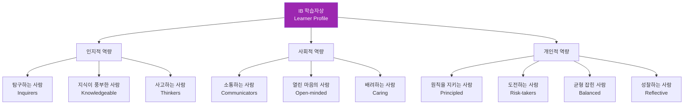

| 학습자상 | 영문 | 핵심 내용 | 교육 방법 |
|---------|------|---------|---------|
| **탐구하는 사람** | Inquirers | 호기심, 질문하는 습관 | 개방형 질문, 프로젝트 학습 |
| **지식이 풍부한 사람** | Knowledgeable | 개념적 이해, 폭넓은 지식 | 간학문적 학습, 교과 통합 |
| **사고하는 사람** | Thinkers | 비판적·창의적 사고 | 토론, 논술, 문제 해결 |
| **소통하는 사람** | Communicators | 효과적 의사소통 | 발표, 협력 학습, 다양한 언어 |
| **원칙을 지키는 사람** | Principled | 윤리, 정직, 책임감 | 학문적 정직성, CAS 활동 |
| **열린 마음의 사람** | Open-minded | 다양한 관점 존중 | 국제 이해, 문화 탐구 |
| **배려하는 사람** | Caring | 공감, 타인 존중 | 봉사 활동, 협력 프로젝트 |
| **도전하는 사람** | Risk-takers | 새로운 시도, 회복탄력성 | 실험, 실패 허용 문화 |
| **균형 잡힌 사람** | Balanced | 지성·신체·정서 균형 | CAS, 전인 교육 |
| **성찰하는 사람** | Reflective | 자기평가, 메타인지 | 성찰 일지, 포트폴리오 |

---

### 3.2 교수학습 핵심 원칙

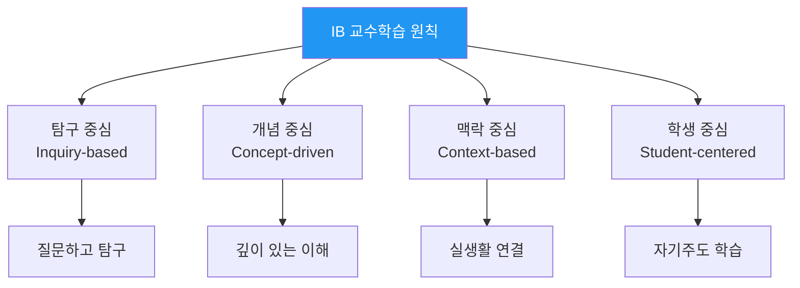

#### 1. 탐구 중심 학습

**특징**:
```
전통 교육 vs IB 교육

전통:
교사: "이것이 답이다"
학생: 암기

IB:
교사: "왜 그럴까?"
학생: 탐구 → 발견 → 이해
```

**탐구 사이클**:
```
1단계: 질문하기 (Tuning In)
   - 호기심 유발
   - 탐구 질문 만들기

2단계: 조사하기 (Finding Out)
   - 자료 수집
   - 실험 수행

3단계: 정리하기 (Sorting Out)
   - 패턴 찾기
   - 연결 짓기

4단계: 심화하기 (Going Further)
   - 새로운 질문
   - 적용 및 확장

5단계: 성찰하기 (Reflecting)
   - 배운 점 정리
   - 자기평가
```

#### 2. 개념 중심 학습

**16개 핵심 개념**:

| 개념 | 영문 | 의미 |
|------|------|------|
| 변화 | Change | 시간에 따른 변화와 발전 |
| 연결 | Connection | 관계와 상호작용 |
| 관점 | Perspective | 다양한 시각과 입장 |
| 책임 | Responsibility | 의무와 윤리적 행동 |
| 형태 | Form | 구조와 패턴 |
| 기능 | Function | 목적과 작동 방식 |
| 원인 | Causation | 원인과 결과 |
| 반성 | Reflection | 성찰과 자기평가 |

**개념 중심 수업 예시**:
```
주제: 기후 변화 (MYP 과학)

핵심 개념:
- 변화: 기후는 어떻게 변화하는가?
- 연결: 인간 활동과 기후의 연결
- 책임: 우리의 책임은 무엇인가?

수업 설계:
1. 개념 탐구
2. 실제 데이터 분석
3. 다양한 관점 토론
4. 해결책 제안
5. 실천 및 성찰
```

#### 3. 논술형 평가

**특징**:
- 객관식 최소화
- 서술형·논술형 중심
- 과정과 결과 모두 평가

**평가 유형**:

```
단답형 (Short Answer)
└─ 간단한 설명 (50-100자)

서술형 (Extended Response)
└─ 개념 설명 및 분석 (200-500자)

논술형 (Essay)
└─ 논리적 논증 (1,000-2,000자)
   - 주장
   - 근거
   - 반론
   - 결론
```

---

### 3.3 교육과정 특징

#### 간학문적 접근 (Interdisciplinary)

```
예시: PYP 초학문적 주제
"우리가 속한 공간과 시간"

통합 교과:
├─ 사회: 지역 역사
├─ 과학: 환경 변화
├─ 수학: 인구 통계
├─ 언어: 인터뷰, 글쓰기
└─ 예술: 과거 풍경 그리기

결과물:
└─ 동네 역사책 제작
```

#### 탐구-실행-성찰 사이클

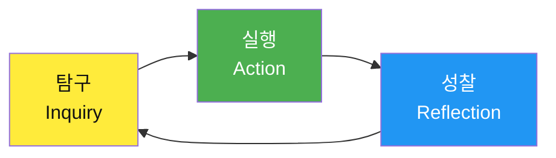

**탐구**:
- 질문하기
- 조사하기
- 분석하기

**실행**:
- 프로젝트 수행
- 창작 활동
- 봉사 참여

**성찰**:
- 배운 점 정리
- 자기평가
- 개선 방향 설정

---

## 4. 한국형 IB 공교육 도입 현황

### 4.1 도입 단계 및 현황 (2024-2026년)

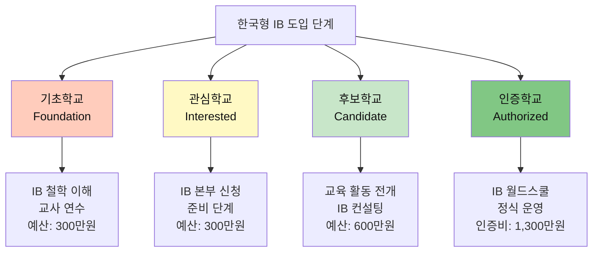

#### 단계별 상세

**1단계: 기초학교**
```
목적: IB 철학 이해 및 공감대 형성

활동:
- IB 워크숍 참가
- 교사 연수 (기초)
- 학부모 설명회
- 수업 사례 연구

기간: 1년

예산: 약 300만원 (교육청 지원)

선정: 교육청 자체 선정
```

**2단계: 관심학교**
```
목적: IB 본부 신청 및 준비

활동:
- IB 본부에 관심학교 신청
- 교사 필수 연수 이수
- 교육과정 설계 시작
- IB 철학 공유

기간: 1-2년

예산: 약 300만원

조건: IB 본부 승인 필요
```

**3단계: 후보학교**
```
목적: 인증에 필요한 교육 활동 전개

활동:
- IB 교육과정 본격 운영
- IB 컨설턴트 방문 및 지도
- 시범 수업 및 평가
- 자체평가보고서 작성

기간: 1-2년

예산: 약 600만원 (후보학교 등록비)

조건: 
- 교사 필수 연수 완료
- 교육과정 설계 완료
- IB 본부 검증 통과
```

**4단계: 인증학교**
```
목적: IB 월드스쿨 정식 인증

활동:
- IB 교육과정 정식 운영
- IB 시험 응시
- 5년 주기 재인증

기간: 영구 (5년 주기 갱신)

예산: 
- 인증비: 약 1,300만원
- 연회비: 약 500만원
- 학생 시험비: 인당 약 100만원

조건:
- IB 본부 최종 평가 통과
- 교사 역량 인증
- 시설 및 자원 확보
```

---

### 4.2 전국 IB 학교 현황

#### 인증학교 (DP 운영 중)

| 학교명 | 지역 | 인증 연도 | 특징 |
|--------|------|----------|------|
| **경북대학교사범대학부설고** | 대구 | 2021년 | 첫 졸업생 배출 (2023년) |
| **표선고등학교** | 제주 | 2021년 | 공립 IB 선도학교 |
| **대구외국어고등학교** | 대구 | 2022년 | 외국어고 IB 도입 |
| **경기외국어고등학교** | 경기 | 2023년 | 경기도 IB 확산 |
| **충남삼성고등학교** | 충남 | 2023년 | 사립 IB 학교 |
| **포산고등학교** | 제주 | 2024년 | 제주 2번째 공립 |

#### 확대 계획 (2024-2026년)

```
서울시교육청
└─ 관심학교: 10개 이상
   - 2026년까지 후보학교 전환 목표

경기도교육청
└─ 기초학교: 30개
   - 단계적 확대 로드맵

인천시교육청
└─ 관심학교: 17개
   - 2-3년 내 본격 도입

대구시교육청
└─ 인증학교: 2개
   - 선도적 확산

제주도교육청
└─ 인증학교: 2개
   - 국제화 교육 특화
```

---

### 4.3 한국형 IB 특징

#### 1. 한국어 DP

```
2019년 IBO와 한국교육과정평가원 협력
└─ IB DP 한국어 번역 완료

장점:
✅ 언어 장벽 해소
✅ 학생 접근성 향상
✅ 공교육 확산 가능

교과 운영:
- 국어: 한국어로 수업
- 영어: 영어로 수업 (언어 습득)
- 기타: 학교 선택 (한국어 또는 영어)
```

#### 2. 한국 교육과정과의 연계

```
고1 (DP 준비 과정)
├─ 한국 교육과정 (공통 과목)
├─ IB 준비 (기초)
└─ 내신 성적 반영

고2-고3 (DP 정식 과정)
├─ IB 교육과정 (6과목 + Core)
├─ IB 7점 체계
└─ 한국 내신 미반영 (일부 학교)

졸업
├─ 한국 고등학교 졸업장
└─ IB Diploma (조건 충족 시)
```

#### 3. 이중 학위 가능

**학생 선택**:
```
Option 1: IB Diploma만 추구
- IB 6과목 + Core 집중
- 해외 대학 진학 준비

Option 2: 이중 학위
- IB Diploma + 한국 졸업장
- 국내외 대학 모두 지원 가능

Option 3: 일부 과목만 이수
- IB Certificate (과목별)
- 한국 졸업장 (필수)
```

---

### 4.4 서논술형 평가 확산

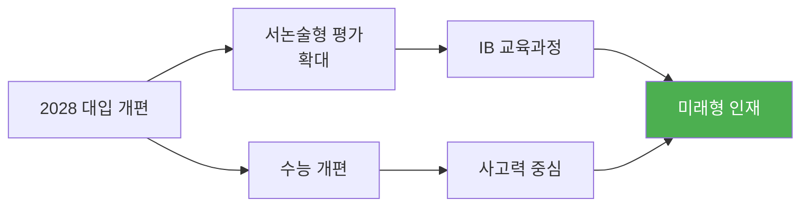

#### 배경

**기존 문제점**:
- 암기 위주 객관식 평가
- 창의력·사고력 평가 미흡
- 입시 중심 교육

**2028 대입 개편 방향**:
```
1. 서논술형 평가 확대
   - 고교 내신: 서술형 비중 증가
   - 수능: 서술형 도입 검토
   
2. 학생부종합전형 강화
   - 과정 중심 평가
   - 역량 중심 평가
   
3. IB와의 시너지
   - 논술형 평가 노하우 공유
   - 교사 연수 연계
   - 평가 기준 개발
```

#### 서논술형 평가 유형

| 유형 | 설명 | 예시 |
|------|------|------|
| **단답형** | 간단한 서술 (1-2문장) | "광합성의 원리를 설명하시오" |
| **서술형** | 개념 설명 및 분석 (3-5문장) | "산업혁명이 사회에 미친 영향을 3가지 서술하시오" |
| **논술형** | 논리적 논증 (200자 이상) | "AI 시대의 교육은 어떻게 변화해야 하는가?" |

#### 교사 역량 강화

**과제**:
```
1. 공정한 채점 기준 마련
   - 루브릭 개발
   - 채점 가이드
   
2. 채점 일관성 확보
   - 교사 연수
   - 교차 채점
   - 표준화
   
3. 피드백 체계
   - 과정 중심 피드백
   - 학생 성장 지원
```

---

## 5. 입시제도와의 연계

### 5.1 한국 대학 입시 전형

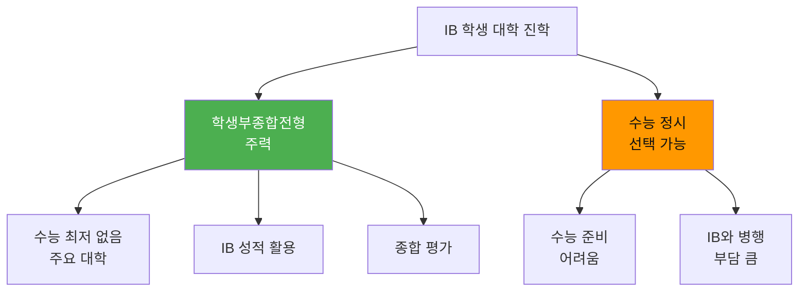

#### 학생부종합전형 (주력)

**특징**:
```
수능 최저학력기준 없음
└─ 서울대, 연세대, 고려대, 성균관대, 한양대 등

평가 요소:
├─ 학생부 (고1 내신)
├─ IB 성적 (고2-3)
├─ 자기소개서
├─ 추천서
├─ TOK, EE, CAS 활동
└─ 면접

강점:
✅ IB 교육과정과 부합
✅ 수능 부담 없음
✅ 종합적 평가
```

**제출 서류**:
```
1. 학교생활기록부
   - 고1 내신 (한국 교육과정)
   - 고2-3 IB 성적 (7점 체계)

2. IB 관련 서류
   - IB Predicted Grades (예상 점수)
   - IB Transcript (최종 점수)
   - TOK 에세이
   - EE 소논문
   - CAS 포트폴리오

3. 자기소개서
   - IB 경험
   - 탐구 과정
   - 성장 스토리

4. 추천서
   - IB 교사 추천서
   - 교과 담당 교사 추천서
```

#### 정시 전형 (선택 가능)

**어려움**:
```
문제점:
❌ IB는 7점 체계, 수능은 9등급
❌ 고2-3 IB 수업으로 수능 준비 어려움
❌ 논술형 평가 vs 객관식 수능

가능한 경우:
✅ 고1 때 수능 기초 확립
✅ IB와 병행 (매우 부담)
✅ 재수 후 수능 준비
```

---

### 5.2 주요 대학별 IB 활용

#### 서울대학교

**전형**:
- 지역균형전형 (학종)
- 일반전형 (학종)

**평가**:
```
1단계: 서류 평가
- 학생부
- IB 성적
- 자기소개서
- 추천서

2단계: 면접
- IB 경험 질문
- 탐구 과정
- 학업 역량
```

**합격 사례** (제주 표선고):
- 서울대 자유전공학부
- 서울대 생명과학부
- IB 점수: 40점 이상

#### 연세대·고려대

**전형**:
- 학생부종합전형 (수능 최저 없음)

**IB 강점**:
```
✅ TOK: 지식이론 → 철학적 사고
✅ EE: 소논문 → 연구 역량
✅ CAS: 활동 → 리더십·봉사
✅ IA: 탐구 → 전공 적합성
```

#### 성균관대·한양대

**국제화 전형**:
- IB 학생 특화 전형
- 수능 최저 없음
- 영어 능력 우대

---

### 5.3 해외 대학 진학

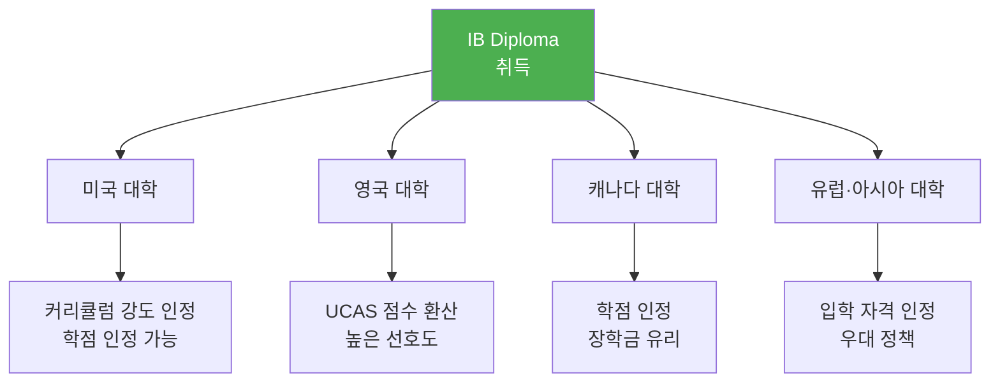

#### 미국 대학

**입학 우대**:
```
장점:
✅ IB DP는 가장 엄격한 고교 과정으로 인정
✅ 대학 준비도 높음
✅ HL 과목 학점 인정 (5점 이상)

주요 대학 요구 점수:
- 하버드: 42-45점
- 스탠포드: 42-45점
- MIT: 40-45점
- UC 버클리: 38-42점
```

#### 영국 대학

**UCAS 점수 환산**:

| IB 점수 | UCAS 점수 | 진학 가능 대학 |
|---------|----------|-------------|
| 45점 | 최고 점수 | 옥스브리지 (경쟁 전공) |
| 42-44점 | 매우 우수 | 옥스브리지, 러셀 그룹 |
| 38-41점 | 우수 | 러셀 그룹, 우수 대학 |
| 35-37점 | 양호 | 일반 대학 |

**주요 대학 요구 점수**:
```
옥스퍼드: 38-40점 (전공별 상이)
케임브리지: 40-42점
임페리얼 칼리지: 38-41점
LSE: 37-38점
UCL: 38-40점
```

---

### 5.4 IB vs 수능 비교

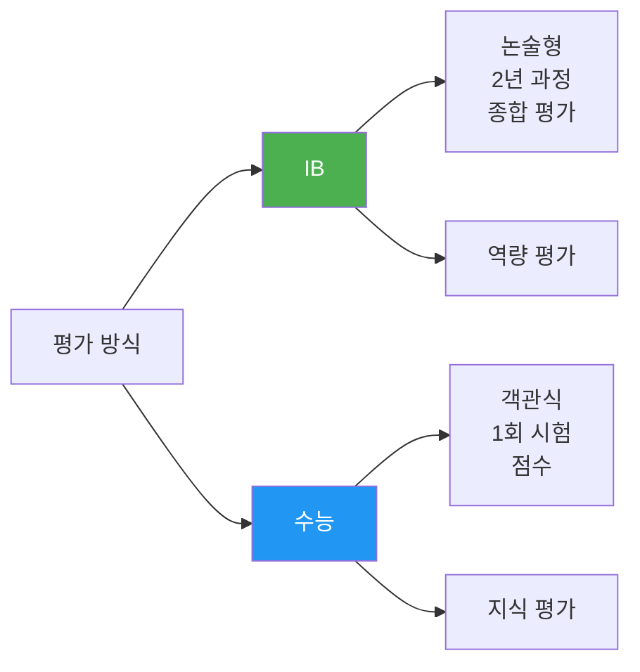

| 구분 | IB | 수능 |
|------|-------|------|
| **평가 기간** | 2년 (고2-3) | 1일 (고3 11월) |
| **평가 방식** | 논술형 + 과정 평가 | 객관식 + 일부 서술형 |
| **평가 내용** | 사고력, 창의력, 탐구력 | 지식, 이해, 적용 |
| **준비 방식** | 지속적 학습, 프로젝트 | 문제 풀이, 암기 |
| **재시험** | 가능 (다음 기간) | 가능 (다음 해) |
| **대학 인정** | 국내외 대학 | 주로 국내 대학 |

---

## 6. 기대 효과 및 과제

### 6.1 기대 효과

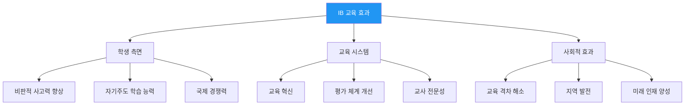

#### 학생 측면

**1. 역량 향상**
```
비판적 사고력
└─ 질문하고 탐구하는 습관
└─ 다양한 관점 고려
└─ 증거 기반 판단

창의력
└─ 문제 해결 능력
└─ 독창적 아이디어
└─ 융합적 사고

의사소통 능력
└─ 논리적 글쓰기
└─ 효과적 발표
└─ 협력 능력
```

**2. 대학 준비도**
```
국내 대학:
✅ 학종 전형 유리
✅ 심화 학습 경험
✅ 연구 능력

해외 대학:
✅ 국제적 인정
✅ 학점 인정
✅ 입학 우대
```

**3. 실제 성과**

**미국 시카고 사례** (공교육 IB 도입):
```
일반 학생:
- 대학 진학률: 66% → 82% (16%p↑)

저소득층 학생:
- 대학 진학률: 46% → 79% (33%p↑)

결론: 
교육 격차 해소에 더 큰 효과
```

**한국 사례** (제주 표선고, 2023년 첫 졸업):
```
진학 실적:
- 서울대 2명
- 고려대 3명
- UNIST 전액 장학금
- 해외 대학 합격

IB 평균 점수: 38점
```

#### 교육 시스템 측면

**1. 패러다임 전환**
```
Before (전통 교육)
├─ 암기 중심
├─ 객관식 평가
├─ 교사 주도
└─ 입시 중심

After (IB 교육)
├─ 사고력 중심
├─ 논술형 평가
├─ 학생 주도
└─ 역량 중심
```

**2. 평가 체계 개선**
```
서논술형 평가 확산
├─ 공정한 채점 기준 개발
├─ 교사 평가 역량 향상
├─ 과정 중심 평가
└─ 다양한 평가 방법
```

**3. 교사 전문성 개발**
```
IB 연수 이수
├─ 탐구 중심 수업 설계
├─ 질문 기술
├─ 평가 전문성
└─ 국제적 네트워크
```

#### 사회적 효과

**1. 교육 격차 해소**
```
공교육 차원 도입
└─ 사교육 의존도 감소
└─ 지역·계층 격차 완화
└─ 교육 기회 균등
```

**2. 지역 발전**
```
일본 고치현 사례:
- 소외 지역에 IB 도입
- 우수 학생 유입
- 지역 교육 활성화
- 인구 유지 효과
```

**3. 미래 인재 양성**
```
4차 산업혁명 시대
├─ 창의력
├─ 문제 해결 능력
├─ 협력 능력
├─ 글로벌 역량
└─ 윤리적 판단력
```

---

### 6.2 주요 과제

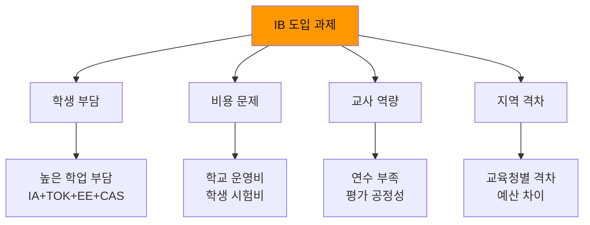

#### 1. 학생 부담

**문제**:
```
동시 수행 과제:
├─ 6개 교과 IA (내부 평가)
├─ TOK 에세이 및 전시회
├─ EE 소논문 (4,000단어)
├─ CAS 활동 (150시간)
├─ 외부 시험 준비 (6과목)
└─ 학교 수행평가

시간 관리:
- 주당 56시간 (수업 36 + 과제 20)
- 방학 중에도 과제
- 스트레스 높음
```

**해결 방안**:
```
1. 단계적 적응
   - 고1: IB 준비 (기초)
   - 고2-3: 본격 수행
   
2. 시간 관리 교육
   - 플래너 활용
   - 우선순위 설정
   - 교사 상담
   
3. 학생 지원
   - 멘토링 프로그램
   - 심리 상담
   - 건강 관리
```

#### 2. 비용 문제

**학교 운영 비용**:
```
후보학교 등록: 600만원
인증학교 등록: 1,300만원
연회비: 500만원
교사 연수비: 인당 200-300만원
──────────────────
학교당 연간: 약 2,000-3,000만원
```

**학생 부담 비용**:
```
시험 응시료: 인당 약 100만원 (DP 최종 시험)
추가 수강료: 연간 150-250만원 (일부 학교)
교재비: 약 50만원
──────────────────
학생당 총: 약 200-400만원
```

**해결 방안**:
```
1. 공교육 예산 지원
   - 교육청 전액 지원
   - 학생 부담 최소화
   
2. 장학금 제도
   - 저소득층 지원
   - 성적 우수 장학금
   
3. 비용 절감
   - 한국어 DP 활용
   - 온라인 자원 활용
```

#### 3. 교사 역량

**문제**:
```
1. 연수 부족
   - IB 워크숍 비용
   - 연수 시간 확보
   
2. 평가 전문성
   - 논술형 채점 기준
   - 일관성 확보
   - 공정성 문제
   
3. 수업 설계
   - 탐구 중심 수업
   - 질문 기술
   - 프로젝트 관리
```

**해결 방안**:
```
1. 체계적 연수
   - 교육청 지원 연수
   - IB 공식 워크숍
   - 온라인 연수
   
2. PLC (전문학습공동체)
   - 교사 협력
   - 사례 공유
   - 공동 평가
   
3. 멘토링
   - 선배 교사 지원
   - IB 학교 교사 교류
   - 컨설팅
```

#### 4. 지역·학교별 격차

**문제**:
```
교육청별:
- 서울/경기: 적극 추진
- 지방: 상대적 소극적
- 예산 차이

학교별:
- 외국어고/자사고: 유리
- 일반고: 인프라 부족
- 도시 vs 농어촌
```

**해결 방안**:
```
1. 국가 차원 지원
   - 중앙정부 예산 배정
   - 지역별 균형 배분
   
2. 공교육 우선
   - 일반고 중심 확대
   - 농어촌 학교 지원
   
3. 온라인 지원
   - 원격 연수
   - 디지털 자원 공유
   - 학교 간 협력
```

---

### 6.3 향후 전망

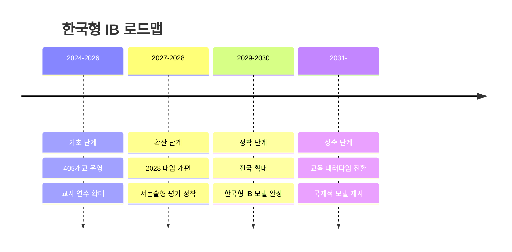

#### 단기 목표 (2024-2026)

```
1. 인증학교 확대
   - 목표: 10개 → 30개
   - 지역별 균형 배치
   
2. 관심학교 육성
   - 목표: 100개
   - 후보학교 전환 지원
   
3. 교사 연수
   - 목표: 1,000명
   - 체계적 연수 프로그램
```

#### 중기 목표 (2027-2028)

```
1. 2028 대입 개편 연계
   - 서논술형 평가 정착
   - IB 노하우 공교육 확산
   
2. 한국형 IB 모델
   - K-IB 프로그램 개발
   - 한국 맥락에 맞는 조정
   
3. 평가 체계 구축
   - 공정한 채점 기준
   - 교사 평가 역량 표준화
```

#### 장기 목표 (2029-)

```
1. 교육 패러다임 전환
   - 암기 → 사고력
   - 입시 → 역량
   - 객관식 → 논술형
   
2. 교육 격차 해소
   - 공교육 질 향상
   - 지역·계층 격차 완화
   
3. 국제적 모델
   - 한국형 IB 수출
   - 아시아 허브 역할
```

---

## 7. 결론

### 7.1 핵심 요약

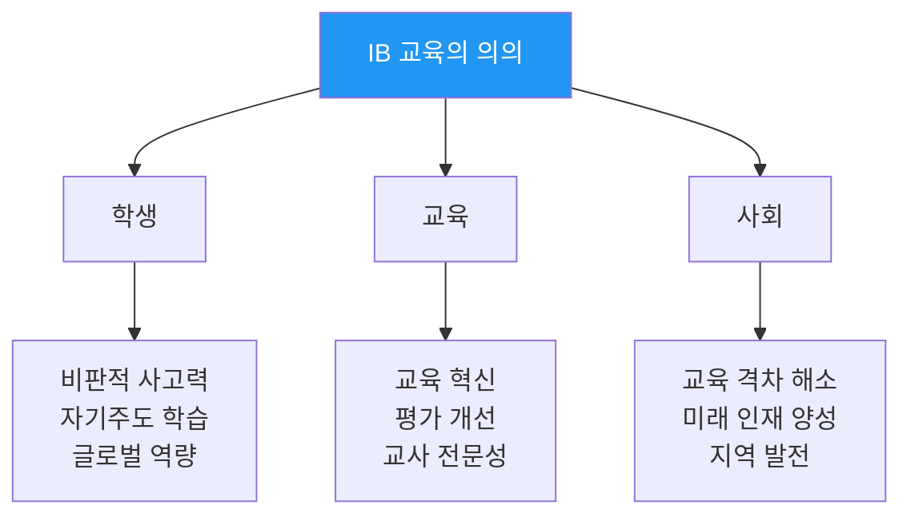

#### 일본 vs 한국

| 구분 | 일본 | 한국 |
|------|------|------|
| **도입 시기** | 2013년 (선발) | 2021년 (후발) |
| **학교 수** | 103개 (2024) | 405개 (전세계 2위) |
| **특징** | 정부 주도, 안정적 | 교육청 주도, 빠른 확산 |
| **목적** | 교육격차 해소 | 교육 패러다임 전환 |
| **언어** | 일본어 DP | 한국어 DP |

#### 평가 체계

```
총 45점 만점
├─ 6개 교과: 각 7점 (총 42점)
├─ TOK + EE: 최대 3점
└─ CAS: 필수 이수 (점수 없음)

시험:
├─ 내부 평가 (20-30%): 교사 채점
└─ 외부 평가 (70-80%): IB 본부 시험

디플로마 취득:
└─ 최소 24점 + 조건 충족
```

#### 입시 연계

```
국내 대학:
└─ 학생부종합전형 (수능 최저 없음)
   - 서울대, 연세대, 고려대 등

해외 대학:
└─ 국제적 인정
   - 148개국 대학 공인
   - 학점 인정 (미국)
   - UCAS 환산 (영국)
```

---

### 7.2 성공을 위한 제언

#### 정책 담당자에게

```
1. 체계적 지원
   ✅ 안정적 예산 확보
   ✅ 교사 연수 강화
   ✅ 학교 인프라 지원
   
2. 공정성 확보
   ✅ 지역별 균형 배치
   ✅ 저소득층 지원
   ✅ 공교육 우선
   
3. 장기적 비전
   ✅ 단계적 확대
   ✅ 질 관리
   ✅ 지속 가능성
```

#### 학교 관계자에게

```
1. 철저한 준비
   ✅ IB 철학 이해
   ✅ 교사 공감대 형성
   ✅ 학부모 소통
   
2. 역량 개발
   ✅ 교사 연수 이수
   ✅ PLC 활동
   ✅ 수업 개선
   
3. 학생 지원
   ✅ 단계적 적응
   ✅ 상담 체계
   ✅ 건강 관리
```

#### 학부모에게

```
1. 이해와 지지
   ✅ IB 철학 이해
   ✅ 과정 중심 사고
   ✅ 자녀 신뢰
   
2. 적절한 지원
   ✅ 정서적 지지
   ✅ 학습 환경 조성
   ✅ 시간 관리 지원
   
3. 주의사항
   ❌ 과도한 압박
   ❌ 결과만 강조
   ❌ 과제 대신하기
```

#### 학생에게

```
1. 마음가짐
   ✅ 호기심 유지
   ✅ 질문하기
   ✅ 도전 정신
   
2. 학습 습관
   ✅ 시간 관리
   ✅ 자기주도 학습
   ✅ 성찰
   
3. 균형 유지
   ✅ 건강 관리
   ✅ 휴식
   ✅ 여가 활동
```

---

### 7.3 최종 메시지

```
"IB는 단순히 좋은 대학에 가기 위한 수단이 아니라,
 평생 학습자로 성장하는 과정입니다."
```

**핵심 가치**:
1. **과정 > 결과**: 점수보다 배움의 과정이 중요
2. **질문 > 답**: 정답보다 좋은 질문이 중요
3. **이해 > 암기**: 암기보다 깊이 있는 이해가 중요
4. **성장 > 완벽**: 완벽보다 지속적인 성장이 중요

**한국형 IB의 비전**:
```
2030년까지
├─ 교육 패러다임 완전 전환
├─ 사고력 중심 교육 정착
├─ 교육 격차 대폭 해소
└─ 세계적 교육 모델 제시
```

**기대 효과**:
```
학생:
└─ 미래 역량 갖춘 인재

교사:
└─ 전문성 높은 교육자

사회:
└─ 교육 선진국
```

---

## 📚 참고 자료

### 공식 자료
- IBO 공식 웹사이트: [www.ibo.org](https://www.ibo.org)
- 대구시교육청 IB 정보: [www.cbe.go.kr/ib](https://www.cbe.go.kr/ib)
- 제주도교육청 IB 정보: [www.jje.go.kr](https://www.jje.go.kr)
- 경기도교육청 IB 정보: [www.goe.go.kr](https://www.goe.go.kr)
- 한국교육개발원: [www.kedi.re.kr](https://www.kedi.re.kr)

### 연구 자료
- 『일본의 IB 교육과정 도입 사례 연구』 (한국교육개발원, 2021)
- 『한국형 IB 도입 방안 연구』 (교육부, 2022)
- 『IB와 서논술형 평가』 (경기도교육청, 2023)
- 『IB 학생의 대학 적응 연구』 (서울대 교육연구소, 2024)

### 추천 도서
- 『IB를 말하다』 (대구광역시교육청)
- 『국제 바칼로레아의 이해』 (IBO)
- 『한국 교육의 미래, IB』 (교육비평, 2023)

---

**문서 끝**

> **작성**: 2026년 1월  
> **참고**: IB_국제바칼로레아_교육과정_완벽가이드.md, IB_학년별_과목_주제_실전_커리큘럼_가이드.md  
> **출처**: 한국교육개발원, 대구/제주/경기 교육청, IBO 공식 자료, 최신 웹 검색 (2024-2026)
> 
> 이 문서는 일본과 한국의 IB 교육 비교, 최종 평가 체계, 한국형 IB 공교육 도입 현황 및 입시제도 연계를 종합적으로 분석한 완벽 가이드입니다.