# 🚀 AI 메이커스 독서 클럽 (AI Makers Reading Club)

> **"읽고, 성찰하고, 만들고, 비즈니스를 창조하는 메이커 공동체"**
> 
> 단순히 책을 읽는 것이 아니라, **진짜 문제 발견**과 **깊이 있는 성찰**을 통해  
> **AI와 협업하여 실제 솔루션을 만들고**, **비즈니스 모델**까지 구상하는  
> **미래 인재 양성 플랫폼**입니다.
> 
> 💡 **핵심**: AI가 코드를 짜는 시대, 우리는 **문제를 발견하고 해결책을 기획**합니다!

---

## 📌 프로젝트 개요

### 🎯 핵심 철학: 미래 인재의 4대 역량

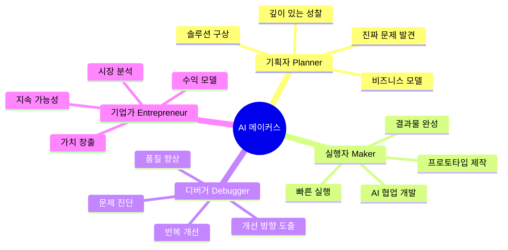

### 🌟 왜 AI 메이커스인가?

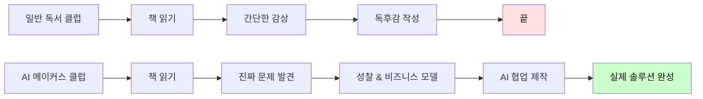

| 구분 | 일반 독서 클럽 | AI 메이커스 독서 클럽 | 혁신 포인트 |
|------|--------------|---------------------|-----------|
| **읽기 방식** | 수동적 읽기 | **문제 중심 탐구** | 진짜 문제 발견 |
| **활동 방식** | 간단한 토론 | **AI 협업 제작** | 실제 솔루션 개발 |
| **성장 방향** | 지식 축적 | **기획자+실행자+기업가** | 미래 역량 |
| **결과물** | 독후감 | **프로토타입+비즈니스 모델** | 포트폴리오 |
| **평가 방식** | 완독 여부 | **문제 해결 능력+창작물** | 실전 중심 |
| **AI 활용** | 없음 | **전 과정 AI 협업** | 효율성 극대화 |
| **비즈니스** | 없음 | **수익 모델 구상** | 기업가 정신 |

---

## 🎓 대상별 프로그램 구조

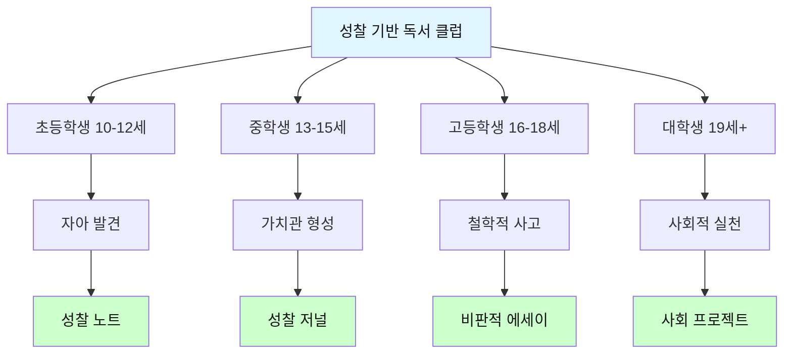

### 📊 대상별 프로그램: 5대 관심 영역 통합 접근

> **모든 연령, 모든 관심사가 메이커 프로젝트로 연결됩니다**
> 
> 독서를 통해 발견한 문제를 **감정·돈·만남·성찰·여가** 5대 영역에서 탐구하고,
> 자신의 전문성과 관심사를 결합하여 실제 솔루션을 만듭니다.

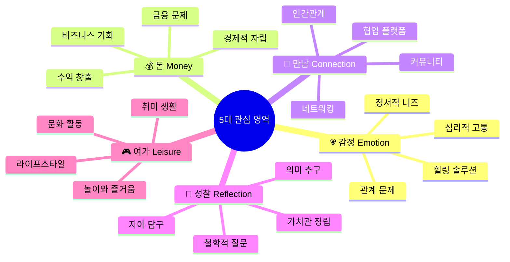

#### 레벨별 × 5대 영역 프로젝트 매트릭스

| 레벨 | 💗 감정 프로젝트 | 💰 돈 프로젝트 | 🤝 만남 프로젝트 | 🧘 성찰 프로젝트 | 🎮 여가 프로젝트 |
|------|---------------|-------------|---------------|---------------|---------------|
| **초등학생<br/>10-12세** | **감정 일기장 앱**<br/>• 기분 추적 게임<br/>• 감정 캐릭터 만들기<br/>• AI 위로봇 제작<br/>💡 *"슬플 때 도움이 되는 친구"* | **용돈 관리 게임**<br/>• 저축 챌린지 앱<br/>• 수제 굿즈 판매<br/>• 재능 마켓 플레이스<br/>💡 *"내 손으로 번 첫 수익"* | **친구 찾기 서비스**<br/>• 취미 매칭 앱<br/>• 동네 친구 플랫폼<br/>• 협동 게임 제작<br/>💡 *"외로운 친구들을 연결"* | **꿈 탐험 노트**<br/>• 질문 생성기<br/>• 성장 기록 앱<br/>• 나만의 철학 책 만들기<br/>💡 *"나는 누구일까?"* | **놀이 발명가**<br/>• 보드게임 제작<br/>• 스토리 게임 앱<br/>• 창작 동화 플랫폼<br/>💡 *"재밌는 걸 만들자"* |
| **중학생<br/>13-15세** | **또래 상담 플랫폼**<br/>• 익명 고민 공유<br/>• AI 심리 분석<br/>• 감정 추적 대시보드<br/>💡 *"우리 세대의 고민 해결"* | **틴 비즈니스 런처**<br/>• 중고거래 플랫폼<br/>• 학생 재능 마켓<br/>• 크리에이터 수익화<br/>💡 *"경제적 자립의 첫걸음"* | **스터디/취미 매칭**<br/>• 온·오프 모임 앱<br/>• 관심사 기반 네트워킹<br/>• 협업 프로젝트 허브<br/>💡 *"함께 성장하는 커뮤니티"* | **정체성 탐구 저널**<br/>• 가치관 진단 도구<br/>• 철학 토론 플랫폼<br/>• 인생 질문 아카이브<br/>💡 *"나다움을 찾는 여정"* | **청소년 문화 플랫폼**<br/>• 취미 공유 앱<br/>• 챌린지 커뮤니티<br/>• 영상 콘텐츠 제작<br/>💡 *"우리만의 문화 만들기"* |
| **고등학생<br/>16-18세** | **멘탈헬스 케어 서비스**<br/>• 입시 스트레스 관리<br/>• AI 심리 상담<br/>• 번아웃 예방 앱<br/>💡 *"청년 정신건강 솔루션"* | **청년 경제 플랫폼**<br/>• 대학생 재테크 앱<br/>• 프리랜서 마켓<br/>• 스타트업 인큐베이터<br/>💡 *"경제적 독립 준비"* | **진로·멘토링 네트워크**<br/>• 선배-후배 연결<br/>• 업계 전문가 매칭<br/>• 프로젝트 협업 플랫폼<br/>💡 *"꿈을 현실로 만드는 연결"* | **철학적 사유 플랫폼**<br/>• 인생 질문 토론<br/>• 가치관 워크숍<br/>• 사회 비평 미디어<br/>💡 *"깊이 생각하는 힘"* | **라이프스타일 큐레이션**<br/>• 대학 생활 가이드<br/>• 문화 체험 플랫폼<br/>• 하비 커뮤니티<br/>💡 *"나만의 삶의 방식"* |
| **대학생<br/>19세+** | **정신건강 스타트업**<br/>• 상담 매칭 플랫폼<br/>• AI 감정 분석 서비스<br/>• 기업 웰빙 프로그램<br/>💡 *"사회적 임팩트 비즈니스"* | **핀테크·경제 혁신**<br/>• 투자 플랫폼<br/>• 수익 자동화 도구<br/>• 청년 금융 서비스<br/>💡 *"실제 수익 창출"* | **소셜 네트워킹 혁신**<br/>• 전문가 네트워크<br/>• 협업 플랫폼<br/>• 글로벌 커뮤니티<br/>💡 *"세상을 연결하는 힘"* | **지식·연구 플랫폼**<br/>• 학술 토론 공간<br/>• 성찰 기록 도구<br/>• 사회 비평 미디어<br/>💡 *"세상을 바꾸는 통찰"* | **문화·콘텐츠 산업**<br/>• OTT 플랫폼<br/>• 크리에이터 이코노미<br/>• 여행·라이프 서비스<br/>💡 *"산업을 만들다"* |

#### 5대 영역별 핵심 질문 & 비즈니스 기회

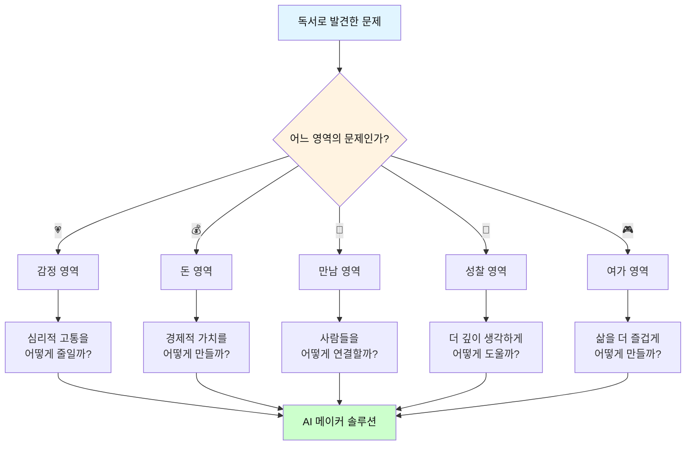

| 영역 | 탐구 질문 | 문제 예시 | 솔루션 방향 | 수익 모델 |
|------|----------|----------|-----------|----------|
| **💗 감정<br/>Emotion** | • 사람들은 왜 힘들어하는가?<br/>• 어떻게 위로할 수 있을까?<br/>• 감정을 어떻게 다룰까? | • 외로움, 우울, 불안<br/>• 관계 갈등<br/>• 자존감 문제 | AI 상담, 감정 추적,<br/>힐링 콘텐츠,<br/>커뮤니티 지원 | 구독, 상담 수수료,<br/>프리미엄 콘텐츠 |
| **💰 돈<br/>Money** | • 어떻게 수익을 낼까?<br/>• 경제적 자립은?<br/>• 가치는 어떻게 창출? | • 용돈/생활비 부족<br/>• 재테크 필요<br/>• 창업 기회 탐색 | 재능 마켓, 재테크 앱,<br/>비즈니스 플랫폼,<br/>수익 자동화 | 거래 수수료,<br/>구독 모델,<br/>광고 수익 |
| **🤝 만남<br/>Connection** | • 어떻게 연결할까?<br/>• 좋은 관계란?<br/>• 협업은 어떻게? | • 외로움, 고립<br/>• 네트워킹 필요<br/>• 협업 파트너 찾기 | 매칭 플랫폼,<br/>커뮤니티 빌딩,<br/>협업 도구 | 매칭 수수료,<br/>프리미엄 기능,<br/>이벤트 수익 |
| **🧘 성찰<br/>Reflection** | • 나는 누구인가?<br/>• 무엇이 중요한가?<br/>• 어떻게 살 것인가? | • 정체성 혼란<br/>• 가치관 부재<br/>• 의미 상실 | 성찰 도구, 질문 생성,<br/>철학 플랫폼,<br/>기록 시스템 | 프리미엄 콘텐츠,<br/>워크숍 판매,<br/>출판 수익 |
| **🎮 여가<br/>Leisure** | • 어떻게 즐길까?<br/>• 취미를 발전시키려면?<br/>• 삶의 질 향상은? | • 무료함, 단조로움<br/>• 취미 부족<br/>• 문화 접근성 | 게임, 콘텐츠 제작,<br/>취미 플랫폼,<br/>문화 큐레이션 | 콘텐츠 판매,<br/>구독, 광고,<br/>커뮤니티 수익 |

#### 융합 프로젝트: 5대 영역을 넘나들기

**실제 혁신은 영역의 경계에서 일어납니다!**

| 융합 영역 | 프로젝트 예시 | 대상 | 비즈니스 모델 |
|----------|-------------|------|-------------|
| **💗×💰<br/>감정+돈** | • **"힐링 이코노미"**<br/>• 감정 노동자를 위한 멘탈케어 구독<br/>• AI 심리 상담 플랫폼 (B2B) | 직장인<br/>프리랜서 | 월 구독 9,900원<br/>기업 패키지 |
| **🤝×💰<br/>만남+돈** | • **"프리랜서 협업 마켓"**<br/>• 재능 거래 + 프로젝트 매칭<br/>• 수익 쉐어링 시스템 | 대학생<br/>청년 | 거래 수수료 15%<br/>프리미엄 3만원/월 |
| **🧘×🎮<br/>성찰+여가** | • **"철학 게임 플랫폼"**<br/>• 인생 질문을 게임화<br/>• 성찰 기록 + 커뮤니티 | 고등학생<br/>대학생 | 프리미엄 콘텐츠<br/>워크숍 판매 |
| **💗×🤝<br/>감정+만남** | • **"공감 커뮤니티"**<br/>• 같은 고민을 가진 사람들 연결<br/>• 익명 지지 그룹 | 전체 | 기부 모델<br/>프리미엄 기능 |
| **💰×🎮<br/>돈+여가** | • **"게임파이 재테크"**<br/>• 재테크 학습을 게임으로<br/>• 실제 투자 포트폴리오 연동 | 청년<br/>직장인 | 구독 + 광고<br/>제휴 수수료 |

#### 학년별 활동 주기 & 도구

| 레벨 | 주기 | 영역별 시간 AI 도 배분 |구 | 비고 |
|------|------|---------------|---------|------|
| **초등학생** | 주 1회<br/>90분 | 💗25% 💰20% 🤝25% 🧘15% 🎮15% | ChatGPT<br/>Canva<br/>Scratch | 감정·만남 중심<br/>놀이 요소 강조 |
| **중학생** | 주 1회<br/>120분 | 💗20% 💰25% 🤝20% 🧘20% 🎮15% | ChatGPT<br/>Cursor<br/>CapCut | 돈·관계 탐구<br/>실제 수익 도전 |
| **고등학생** | 주 1회<br/>150분 | 💗20% 💰30% 🤝15% 🧘25% 🎮10% | Cursor<br/>Figma<br/>Notion | 비즈니스 중심<br/>철학적 깊이 |
| **대학생** | 격주 1회<br/>180분 | 💗15% 💰35% 🤝20% 🧘20% 🎮10% | Full Stack<br/>AI Tools<br/>DevOps | 실제 창업<br/>산업 혁신 |

---

## 🔄 AI 메이커스 6단계 사이클 + 미네르바 세미나

### 두 가지 학습 모드

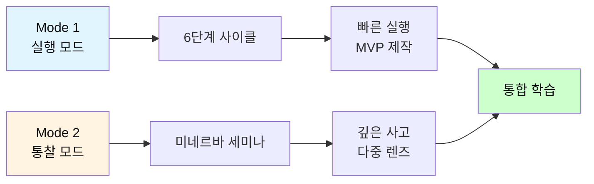

**Mode 1: 6단계 사이클 (실행 중심)**

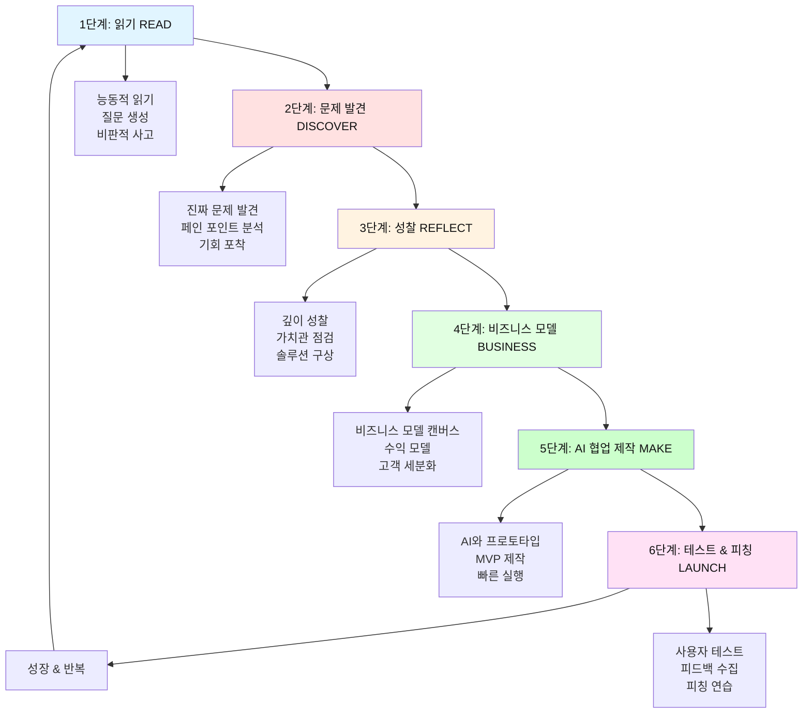

**Mode 2: 미네르바 세미나 (통찰 중심)**

> **"하나의 아이디어를 10가지 렌즈로 보는 통찰력"**
> 
> 미네르바 스쿨의 Active Learning 방식으로  
> **보고 → 느끼고 → 사용하고 → 만들고 → 수정하는** 완전 학습

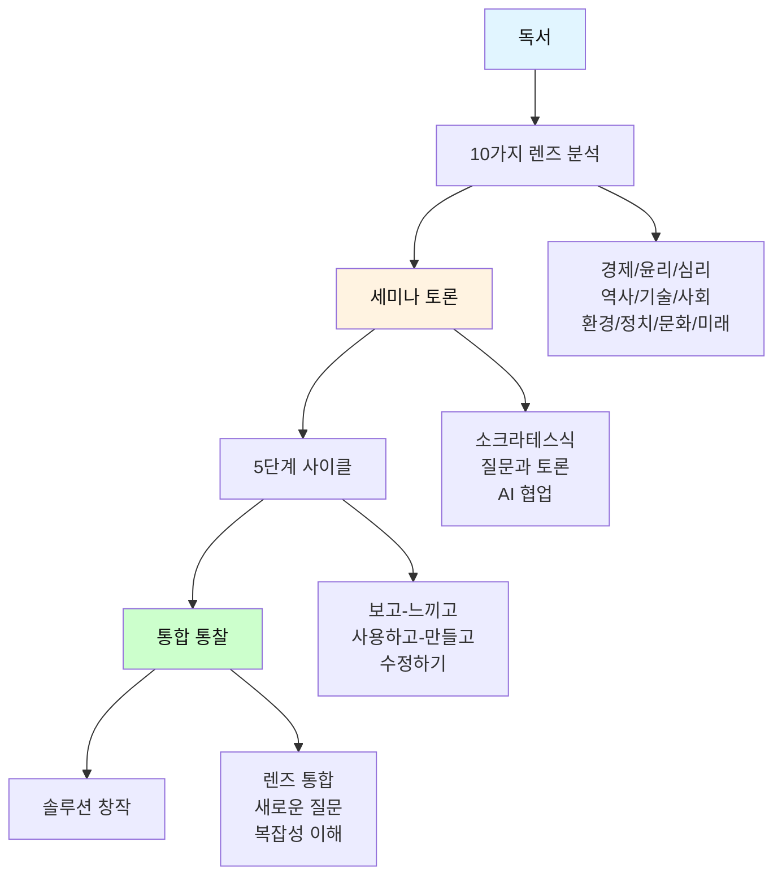

### 10가지 사고 렌즈 프레임워크

| 렌즈 | 핵심 질문 | AI 시대 중요성 |
|------|----------|--------------|
| **💰 경제** | 비용과 수익은? | 비즈니스 모델 설계 |
| **⚖️ 윤리** | 옳은가? 피해는? | 사회적 책임 |
| **🧠 심리** | 사람들은 어떻게 느끼나? | 사용자 경험 |
| **📜 역사** | 과거 사례는? | 패턴 인식 |
| **🔧 기술** | 어떻게 작동? | AI 활용 전략 |
| **👥 사회** | 사회 구조 변화는? | 임팩트 측정 |
| **🌍 환경** | 환경 영향은? | 지속가능성 |
| **🏛️ 정치** | 권력 관계는? | 규제 대응 |
| **🎨 문화** | 문화적 의미는? | 브랜딩 전략 |
| **🔮 미래** | 10년 후는? | 장기 비전 |

**→ 자세한 내용: [미네르바_세미나_가이드.md](미네르바_세미나_가이드.md)**

### 5단계 완전 학습 사이클

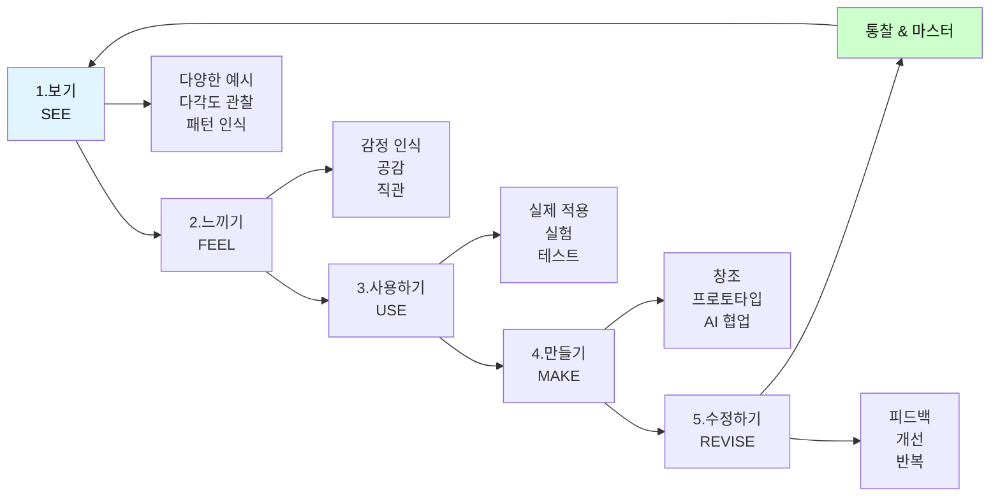

| 단계 | 활동 | AI 활용 | 결과 |
|------|------|---------|------|
| **보기** | 경쟁 분석, 사례 연구 | "10가지 사례를 렌즈별로" | 패턴 발견 |
| **느끼기** | 공감 인터뷰, 감정 맵 | "사용자 심리 분석" | 진짜 니즈 |
| **사용하기** | 직접 사용, 관찰 | "사용 시나리오 10개" | 문제 발견 |
| **만들기** | MVP 제작 | Cursor, Figma, AI | 프로토타입 |
| **수정하기** | 피드백 반영, 개선 | "우선순위 분석" | 완성도 UP |

### 두 모드의 시너지

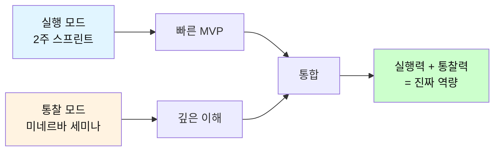

**활용 방법**:
- **Week 1-2**: 미네르바 세미나 (다중 렌즈로 깊이 사고)
- **Week 3-4**: 실행 모드 (2주 MVP 제작)
- **Week 5-6**: 미네르바 세미나 (피드백 분석 & 개선 방향)
- **Week 7-8**: 실행 모드 (v2.0 런칭)

---

### 📝 단계별 상세 가이드

#### 1단계: 읽기 (READ) - 문제 중심 독서

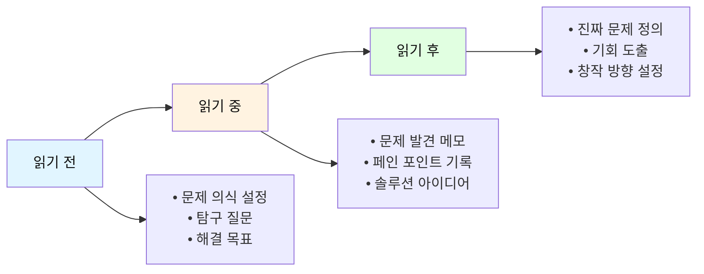

| 활동 | 초등학생 | 중학생 | 고등학생 | 대학생 |
|------|---------|--------|----------|--------|
| **읽기 전<br/>준비** | • 불편한 점 떠올리기<br/>• 문제 질문 3가지<br/>• 해결 상상하기 | • 사회 문제 연결<br/>• 페인 포인트 리스트<br/>• 기회 발견 목표 | • 산업 트렌드 조사<br/>• 문제 정의 프레임<br/>• 시장 기회 분석 | • 학술/산업 갭 분석<br/>• 연구 문제 도출<br/>• 혁신 기회 탐색 |
| **읽기 중<br/>활동** | • 문제 상황 표시<br/>• 해결 아이디어 메모<br/>• "만약에?" 질문 | • 문제 원인 분석<br/>• 솔루션 아이디어<br/>• 비즈니스 힌트 | • 비즈니스 모델 힌트<br/>• 경쟁 솔루션 비교<br/>• 차별화 포인트 | • 이론-실전 갭 분석<br/>• 혁신 포인트 도출<br/>• MVP 아이디어 |
| **읽기 후<br/>정리** | • 문제-해결 그림<br/>• 만들고 싶은 것<br/>• 첫 단계 계획 | • 문제 정의서 작성<br/>• 솔루션 스케치<br/>• 타겟 고객 설정 | • 비즈니스 모델 초안<br/>• 시장 조사 계획<br/>• MVP 기획 | • 사업 계획 프레임<br/>• 기술 스택 선정<br/>• 실행 로드맵 |

#### 2단계: 문제 발견 (DISCOVER) - 진짜 문제를 찾아라!

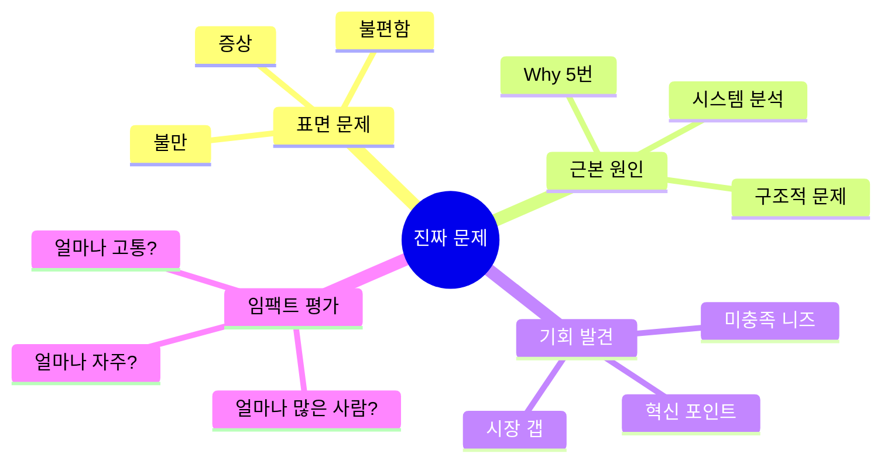

**문제 발견 프레임워크: "5W1H + So What?"**

| 질문 | 초등학생 | 중학생 | 고등학생 | 대학생 |
|------|---------|--------|----------|--------|
| **What<br/>(무엇이 문제?)** | 친구들이 불편해하는 것은? | 학교/사회에서 불합리한 것은? | 청년들이 겪는 구조적 문제는? | 산업/사회가 직면한 과제는? |
| **Who<br/>(누가 겪나?)** | 우리 반 친구들? 가족? | 같은 학년? 지역 사회? | 우리 세대? 특정 그룹? | 특정 산업? 전 사회? |
| **When<br/>(언제?)** | 어떤 상황에서 자주? | 어느 시기에 심각? | 어떤 생애 단계에서? | 어떤 시장 상황에서? |
| **Where<br/>(어디서?)** | 학교? 집? 놀이터? | 온라인? 오프라인? | 한국? 글로벌? | 특정 시장? 플랫폼? |
| **Why<br/>(왜?)** | 왜 이런 문제가 생겼을까? | 근본 원인은 무엇? (5 Whys) | 시스템적 원인은? | 구조적/경제적 원인은? |
| **How<br/>(어떻게?)** | 어떻게 해결할 수 있을까? | 어떤 솔루션이 가능? | 어떤 비즈니스 모델? | 어떤 혁신 전략? |
| **So What?<br/>(그래서?)** | 해결하면 친구들이 행복? | 해결하면 사회가 나아질까? | 시장 가치는? 수익은? | 사회적 임팩트는? |

**문제 발견 활동 예시:**

```markdown
📋 진짜 문제 발견 워크시트

[1단계: 표면 문제 수집]
━━━━━━━━━━━━━━━━━━━━━━━━
책을 읽으며 발견한 불편함/문제점을 모두 나열하세요:
1. _____________________________________
2. _____________________________________
3. _____________________________________
...

[2단계: Why 5번 (근본 원인 찾기)]
━━━━━━━━━━━━━━━━━━━━━━━━
가장 중요한 문제 1개를 선택하여 "왜?"를 5번 물어보세요:

문제: _____________________________________
→ Why 1: _____________________________________
  → Why 2: _____________________________________
    → Why 3: _____________________________________
      → Why 4: _____________________________________
        → Why 5: _____________________________________

💡 진짜 문제 (Root Cause):
_____________________________________

[3단계: 페인 포인트 분석]
━━━━━━━━━━━━━━━━━━━━━━━━
• 누가 겪는가? (타겟 고객)
_____________________________________

• 얼마나 자주 겪는가? (빈도)
□ 매일  □ 매주  □ 매월  □ 가끔

• 얼마나 고통스러운가? (강도)
□□□□□ (1~5점)

• 현재 어떻게 해결하고 있나? (대안)
_____________________________________

• 현재 솔루션의 한계는?
_____________________________________

[4단계: 기회 평가]
━━━━━━━━━━━━━━━━━━━━━━━━
• 시장 크기: 이 문제를 겪는 사람은 얼마나 많은가?
_____________________________________

• 해결 의지: 사람들이 돈을 낼 의향이 있는가?
_____________________________________

• 차별화: 기존 솔루션과 다른 점은?
_____________________________________

💰 비즈니스 기회: (상/중/하)
```

#### 3단계: 성찰 (REFLECT) - 솔루션과 가치 탐구

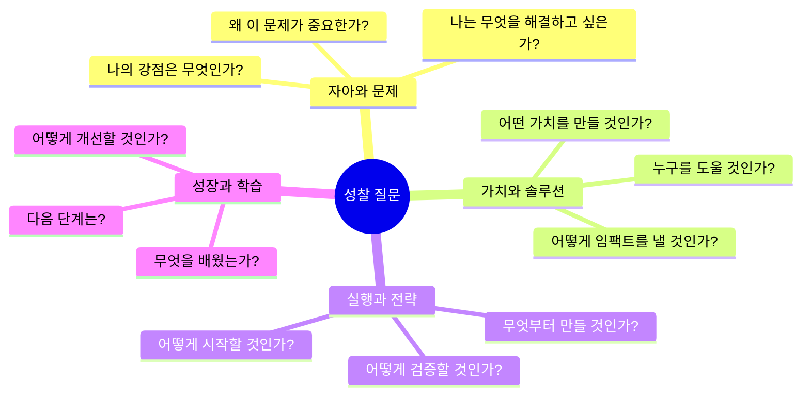

**레벨별 성찰 질문 프레임워크 (메이커 중심)**

| 레벨 | 성찰 영역 | 핵심 질문 | 솔루션 방향 | 깊이 |
|------|----------|----------|-----------|------|
| **초등** | 문제와 해결 | • 이 문제를 어떻게 해결할 수 있을까?<br/>• 무엇을 만들면 도움이 될까?<br/>• 친구들도 좋아할까? | 그림 + 아이디어 스케치<br/>간단한 프로토타입 | ⭐⭐ |
| **중등** | 가치와 솔루션 | • 이 솔루션이 누구에게 도움이 될까?<br/>• 어떻게 만들 수 있을까?<br/>• 사람들이 돈을 낼까? | 솔루션 기획서<br/>MVP 계획 | ⭐⭐⭐ |
| **고등** | 시장과 전략 | • 시장 크기는 얼마나 될까?<br/>• 경쟁자는 누구이고 차별점은?<br/>• 어떻게 수익을 낼 것인가? | 비즈니스 모델 캔버스<br/>시장 조사 | ⭐⭐⭐⭐ |
| **대학** | 혁신과 임팩트 | • 이 솔루션의 사회적 가치는?<br/>• 확장 가능성은?<br/>• 투자 가치가 있는가? | 사업 계획서<br/>피칭 덱 | ⭐⭐⭐⭐⭐ |

#### 4단계: 비즈니스 모델 (BUSINESS) - 수익과 가치 창출

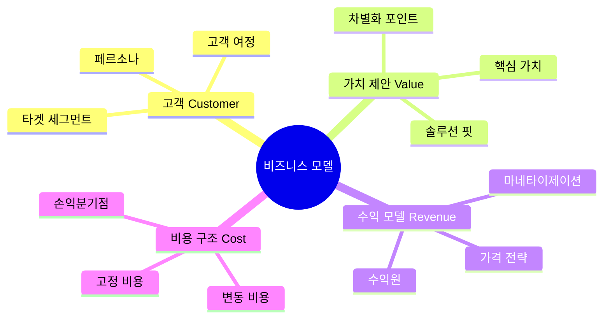

**레벨별 비즈니스 모델링**

| 레벨 | 프레임워크 | 활동 | 결과물 |
|------|----------|------|--------|
| **초등학생** | 간단한 비즈니스 모델 | • 누가 살까? (고객)<br/>• 얼마에 팔까? (가격)<br/>• 어떻게 만들까? (제작)<br/>• 친구들 설문 조사 | 아이디어 포스터<br/>간단한 설문 결과 |
| **중학생** | 린 캔버스 (Lean Canvas) | • 문제 정의<br/>• 솔루션 아이디어<br/>• 고객 세그먼트<br/>• 수익 모델<br/>• 핵심 지표 | 린 캔버스 1장<br/>MVP 계획 |
| **고등학생** | 비즈니스 모델 캔버스 (BMC) | • 9개 블록 작성<br/>• 시장 조사<br/>• 경쟁 분석<br/>• 재무 계획<br/>• 피칭 연습 | BMC + 시장 조사<br/>피칭 덱 10장 |
| **대학생** | 사업 계획서 + 린 스타트업 | • 전체 사업 계획서<br/>• 재무 모델<br/>• Go-to-Market 전략<br/>• 투자 유치 준비 | 완전한 사업 계획서<br/>투자 피칭 자료 |

**린 캔버스 템플릿 (중학생 이상)**

```markdown
┌─────────────────────────────────────────────────┐
│          📊 린 캔버스 (Lean Canvas)             │
└─────────────────────────────────────────────────┘

[1] 문제 (Problem)
━━━━━━━━━━━━━━━━━━━━━━━━
고객이 겪는 상위 3가지 문제:
1. _____________________________________
2. _____________________________________
3. _____________________________________

기존 대안:
_____________________________________

[2] 고객 세그먼트 (Customer Segments)
━━━━━━━━━━━━━━━━━━━━━━━━
타겟 고객:
_____________________________________

얼리 어답터 (첫 고객):
_____________________________________

[3] 고유한 가치 제안 (UVP)
━━━━━━━━━━━━━━━━━━━━━━━━
한 문장 핵심 가치:
_____________________________________

왜 우리가 다른가?
_____________________________________

[4] 솔루션 (Solution)
━━━━━━━━━━━━━━━━━━━━━━━━
각 문제에 대한 해결책:
1. _____________________________________
2. _____________________________________
3. _____________________________________

[5] 채널 (Channels)
━━━━━━━━━━━━━━━━━━━━━━━━
고객에게 도달하는 방법:
_____________________________________

[6] 수익원 (Revenue Streams)
━━━━━━━━━━━━━━━━━━━━━━━━
수익 모델:
□ 판매  □ 구독  □ 광고  □ 수수료  □ 기타

가격:
_____________________________________

[7] 비용 구조 (Cost Structure)
━━━━━━━━━━━━━━━━━━━━━━━━
주요 비용:
• 개발: _____________________
• 마케팅: ___________________
• 운영: _____________________

[8] 핵심 지표 (Key Metrics)
━━━━━━━━━━━━━━━━━━━━━━━━
성공을 측정하는 지표:
_____________________________________

[9] 경쟁 우위 (Unfair Advantage)
━━━━━━━━━━━━━━━━━━━━━━━━
쉽게 복제할 수 없는 우리만의 강점:
_____________________________________
```

**비즈니스 모델 캔버스 (고등학생 이상)**

```markdown
┌─────────────────────────────────────────────────┐
│      🎯 비즈니스 모델 캔버스 (BMC)              │
└─────────────────────────────────────────────────┘

┌──────────────┬──────────────┬──────────────┬──────────────┐
│ 핵심 파트너  │  핵심 활동   │  가치 제안   │  고객 관계   │
│              │              │              │              │
│ Key Partners │Key Activities│Value Propose │Customer      │
│              │              │              │Relationships │
│              ├──────────────┤              ├──────────────┤
│              │  핵심 자원   │              │    채널      │
│              │              │              │              │
│              │ Key Resources│              │   Channels   │
├──────────────┴──────────────┴──────────────┴──────────────┤
│                      비용 구조                             │
│                   Cost Structure                          │
└────────────────────────────────────────────────────────────┘
└────────────────────────────────────────────────────────────┘
│                      수익원                                │
│                  Revenue Streams                          │
└────────────────────────────────────────────────────────────┘

**각 블록 작성 가이드:**

1. 고객 세그먼트: 누구를 위한 가치를 창출하는가?
2. 가치 제안: 어떤 가치를 전달하는가?
3. 채널: 어떻게 고객에게 도달하는가?
4. 고객 관계: 어떤 관계를 구축하는가?
5. 수익원: 어떻게 수익을 창출하는가?
6. 핵심 자원: 어떤 자원이 필요한가?
7. 핵심 활동: 무엇을 해야 하는가?
8. 핵심 파트너: 누구와 협력하는가?
9. 비용 구조: 주요 비용은 무엇인가?
```

**수익 모델 아이디어 (레벨별)**

| 레벨 | 수익 모델 예시 | 실현 가능성 |
|------|-------------|-----------|
| **초등** | • 작품 판매 (그림책, 굿즈)<br/>• 친구들에게 서비스 제공<br/>• 용돈벌이 프로젝트 | 부모/선생님 도움으로 가능 |
| **중등** | • 앱 내 광고<br/>• 유료 콘텐츠<br/>• 크라우드펀딩<br/>• 학교 내 서비스 | 실제 수익 가능 |
| **고등** | • SaaS 구독 모델<br/>• 커미션 모델<br/>• 프리미엄 모델<br/>• B2B 판매 | 스타트업 수준 가능 |
| **대학** | • 시리즈 투자<br/>• 대기업 파트너십<br/>• 라이선싱<br/>• M&A | 실제 비즈니스 |

#### 5단계: AI 협업 제작 (MAKE) - 빠르게 만들고 테스트하기

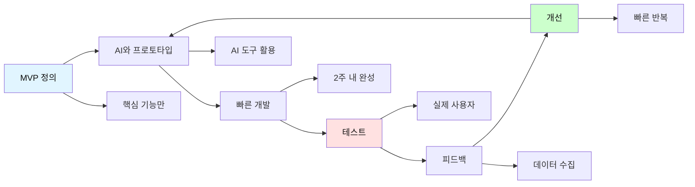

**AI 도구별 활용 가이드**

| 개발 단계 | AI 도구 | 활용 방법 | 레벨 |
|----------|---------|----------|------|
| **기획 & 디자인** | ChatGPT<br/>Claude<br/>Figma AI | • 아이디어 브레인스토밍<br/>• 기능 명세서 작성<br/>• 와이어프레임 제작<br/>• UI/UX 디자인 | 전체 |
| **개발 (웹/앱)** | Cursor<br/>GitHub Copilot<br/>v0.dev | • 코드 자동 생성<br/>• 버그 수정<br/>• 기능 구현<br/>• 풀스택 개발 | 중등↑ |
| **콘텐츠 제작** | Midjourney<br/>DALL-E<br/>Canva AI | • 이미지 생성<br/>• 일러스트<br/>• 마케팅 자료<br/>• 브랜딩 | 전체 |
| **영상 제작** | Runway<br/>CapCut<br/>Descript | • 영상 편집<br/>• 자막 생성<br/>• 특수 효과<br/>• 내레이션 | 전체 |
| **게임 개발** | ChatGPT + Unity<br/>Roblox Studio<br/>Scratch | • 게임 로직<br/>• 스토리 작성<br/>• 캐릭터 디자인 | 초등↑ |

**MVP(Minimum Viable Product) 제작 원칙**

1. **핵심 기능만**: 가장 중요한 1-3개 기능만 구현
2. **2주 룰**: 2주 안에 만들 수 있는 범위로 축소
3. **80% 완성도**: 완벽하지 않아도 OK, 테스트 가능하면 됨
4. **AI 최대 활용**: 코딩은 AI에게, 기획은 내가
5. **빠른 반복**: 만들고 → 테스트하고 → 개선하고 → 반복

#### 6단계: 테스트 & 피칭 (LAUNCH) - 세상에 내놓기

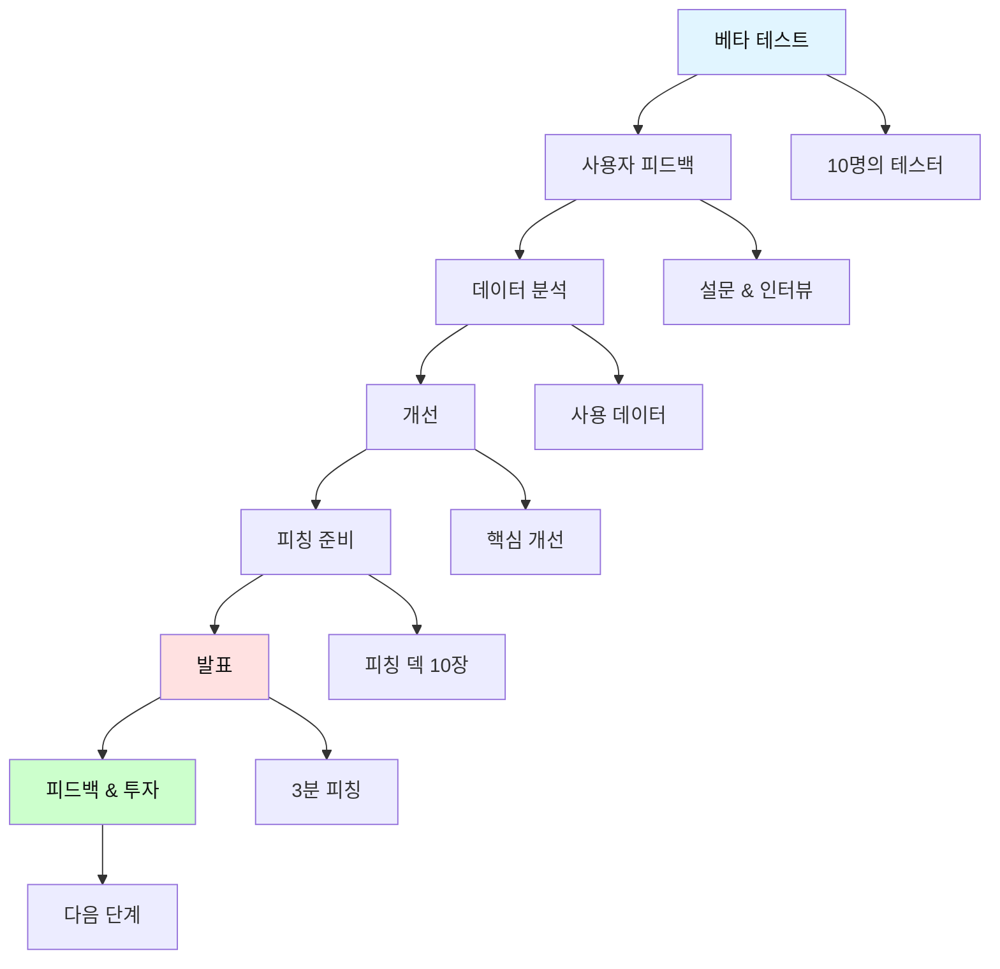

**피칭 덱 구조 (10 Slides)**

| 슬라이드 | 내용 | 시간 |
|---------|------|------|
| 1. 문제 | 진짜 문제가 무엇인가? | 30초 |
| 2. 솔루션 | 우리의 해결책은? | 30초 |
| 3. 시연 | 실제 작동하는 모습 (데모) | 60초 |
| 4. 시장 | 시장 크기와 기회 | 20초 |
| 5. 비즈니스 모델 | 어떻게 수익을 내는가? | 20초 |
| 6. 경쟁 | 경쟁자와 차별점 | 15초 |
| 7. 팀 | 우리는 누구인가? | 10초 |
| 8. 트랙션 | 지금까지의 성과 | 10초 |
| 9. 로드맵 | 다음 계획 | 10초 |
| 10. Ask | 우리에게 필요한 것 | 15초 |

**3분 피칭 스크립트 템플릿**

```markdown
🎤 3분 피칭 스크립트

[오프닝 - 15초]
"안녕하세요, 저는 [이름]입니다.
여러분은 [문제 상황]을 겪어본 적 있으신가요?"

[문제 제시 - 30초]
"현재 [숫자]명의 사람들이 [문제]로 고통받고 있습니다.
예를 들어, [구체적 예시]...
기존 솔루션들은 [한계]가 있었습니다."

[솔루션 - 30초]
"그래서 우리는 [솔루션 이름]을 만들었습니다.
[솔루션]은 [핵심 가치]를 제공합니다.
[차별점]이 다른 솔루션과 다릅니다."

[데모 - 60초]
"실제로 보여드리겠습니다.
[화면 시연하며]
이렇게 [기능1], [기능2]를 통해
[결과]를 달성할 수 있습니다."

[비즈니스 모델 - 20초]
"수익 모델은 [모델 이름]입니다.
고객당 [가격]을 받으면,
[시장 크기] × [전환율] = [예상 수익]입니다."

[트랙션 - 10초]
"현재 [숫자]명의 베타 사용자가 있으며,
[성과 지표]를 달성했습니다."

[클로징 - 15초]
"다음 단계는 [계획]입니다.
이를 위해 [필요한 것]이 필요합니다.
감사합니다. 질문 있으신가요?"
```

#### 7단계: 대화와 협업 (DIALOGUE)

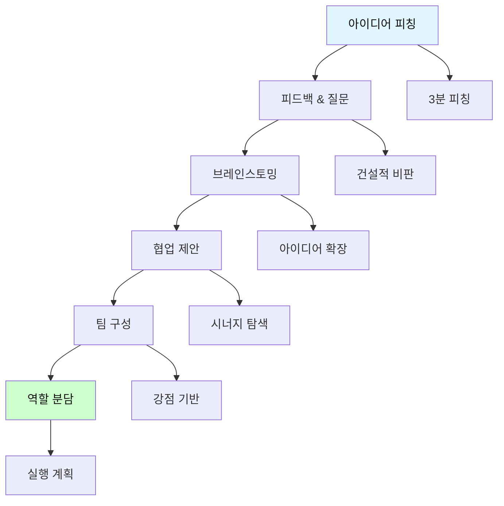

**아이디어 피칭 & 협업 세션 구조**

| 단계 | 시간 | 활동 내용 | 퍼실리테이터 역할 | 참여자 역할 |
|------|------|----------|----------------|-----------|
| **워밍업<br/>(10%)** | 초등: 9분<br/>중등: 12분<br/>고등: 15분<br/>대학: 18분 | • 아이스브레이킹<br/>• 오늘의 미션 공유<br/>• 아이디어 뱅크 확인 | 분위기 조성<br/>목표 제시 | 에너지 업<br/>오픈 마인드 |
| **아이디어 피칭<br/>(30%)** | 초등: 27분<br/>중등: 36분<br/>고등: 45분<br/>대학: 54분 | • 3분 피칭 (각자)<br/>• 발견한 문제<br/>• 솔루션 아이디어<br/>• 비즈니스 모델 초안 | 시간 관리<br/>질문 유도 | 명확한 피칭<br/>경청 |
| **피드백 & 브레인스토밍<br/>(35%)** | 초등: 32분<br/>중등: 42분<br/>고등: 53분<br/>대학: 63분 | • 건설적 피드백<br/>• 아이디어 확장<br/>• 협업 가능성 탐색<br/>• 리소스 공유 | 건설적 분위기<br/>아이디어 연결 | 적극적 피드백<br/>협업 제안 |
| **팀 빌딩 & 계획<br/>(25%)** | 초등: 23분<br/>중등: 30분<br/>고등: 38분<br/>대학: 45분 | • 팀 구성 (솔로/협업)<br/>• 역할 분담<br/>• 2주 실행 계획<br/>• 다음 마일스톤 | 팀 매칭 지원<br/>실행 가능성 점검 | 팀워크<br/>커밋먼트 |

**메이커 프로젝트: 5대 영역 × 레벨별 실전 예시**

#### 💗 감정(Emotion) 영역 프로젝트

| 레벨 | 문제 발견 | 프로젝트명 | 솔루션 | AI 도구 | 비즈니스 모델 | 목표 |
|------|----------|----------|--------|---------|-------------|------|
| **초등** | 친구가 슬퍼 보여요 | **"마음 친구" 챗봇** | 기분을 물어보고 위로하는 AI 친구 | ChatGPT API | 무료 (경험) | 학급 30명 사용 |
| **중등** | 시험 스트레스로 힘들어요 | **"마인드 케어" 앱** | 감정 추적 + 명상 가이드 + 또래 커뮤니티 | Cursor, Notion AI | 프리미엄 월 3천원 | 100명 가입, 10명 유료 |
| **고등** | 입시 우울증이 심각해요 | **"멘탈 서포트" 플랫폼** | AI 심리 상담 + 전문가 매칭 + 학교 제휴 | Full Stack, AI | B2B 학교 패키지 | 5개 학교 계약 |
| **대학** | 청년 정신건강 위기 | **"마음 클리닉" 스타트업** | 온라인 상담 플랫폼 + 보험 연동 | Enterprise AI | 상담 수수료 30% | 시리즈 A 투자 |

#### 💰 돈(Money) 영역 프로젝트

| 레벨 | 문제 발견 | 프로젝트명 | 솔루션 | AI 도구 | 비즈니스 모델 | 목표 |
|------|----------|----------|--------|---------|-------------|------|
| **초등** | 용돈이 항상 부족해요 | **"꼬마 장터" 플랫폼** | 학생 간 물건·재능 거래 (선생님 승인) | Canva, ChatGPT | 거래 중개 | 첫 수익 10만원 |
| **중등** | 알바는 힘들고 시간 없어요 | **"틴 프리랜서" 마켓** | 디자인·영상·과외 재능 판매 플랫폼 | Cursor, Figma | 거래 수수료 15% | 월 수익 50만원 |
| **고등** | 대학 등록금을 모아야 해요 | **"학생 크리에이터" 플랫폼** | 콘텐츠 제작 + 수익화 도구 + 교육 | Full Stack, AI | 구독 월 1만원 | 500명 구독자 |
| **대학** | 청년 경제적 자립이 어려워요 | **"핀테크 청년" 스타트업** | 소액 투자 앱 + AI 재테크 조언 | AI API, 금융 연동 | 수수료 0.5% | 1만 MAU |

#### 🤝 만남(Connection) 영역 프로젝트

| 레벨 | 문제 발견 | 프로젝트명 | 솔루션 | AI 도구 | 비즈니스 모델 | 목표 |
|------|----------|----------|--------|---------|-------------|------|
| **초등** | 같은 취미 친구가 없어요 | **"취미 친구 찾기"** | 관심사 기반 친구 매칭 (동네 중심) | ChatGPT, Canva | 무료 (경험) | 50명 매칭 성공 |
| **중등** | 스터디 메이트를 못 찾겠어요 | **"스터디 메이트" 앱** | 과목·목표별 스터디 그룹 매칭 + 일정 관리 | Cursor, Notion | 프리미엄 월 5천원 | 200명 가입 |
| **고등** | 진로 멘토가 필요해요 | **"커리어 커넥트"** | 대학생·직장인 멘토 매칭 플랫폼 | Full Stack | 멘토링 수수료 20% | 100건 매칭 |
| **대학** | 업계 네트워킹이 어려워요 | **"프로 네트워크" 플랫폼** | 산업별 전문가 네트워킹 + 협업 프로젝트 | AI 매칭, 추천 | 구독 월 3만원 | 1000명 회원 |

#### 🧘 성찰(Reflection) 영역 프로젝트

| 레벨 | 문제 발견 | 프로젝트명 | 솔루션 | AI 도구 | 비즈니스 모델 | 목표 |
|------|----------|----------|--------|---------|-------------|------|
| **초등** | "나는 누구지?" 궁금해요 | **"나 알아가기" 게임** | 질문 카드 게임 + 성장 기록 노트 | ChatGPT, Canva | 게임 판매 5천원 | 100개 판매 |
| **중등** | 가치관이 혼란스러워요 | **"가치관 탐험" 앱** | 철학적 질문 + 토론 커뮤니티 + 저널 | Cursor, ChatGPT | 프리미엄 콘텐츠 | 300명 사용자 |
| **고등** | 인생의 의미를 모르겠어요 | **"철학 살롱" 플랫폼** | 온라인 철학 세미나 + 성찰 워크숍 | Zoom 통합, AI | 워크숍 3만원 | 월 10회 개최 |
| **대학** | 사회적 가치를 찾고 싶어요 | **"임팩트 씽킹" 미디어** | 사회 비평 + 연구 플랫폼 + 액션 프로젝트 | AI 분석, CMS | 구독 + 후원 | 1만 구독자 |

#### 🎮 여가(Leisure) 영역 프로젝트

| 레벨 | 문제 발견 | 프로젝트명 | 솔루션 | AI 도구 | 비즈니스 모델 | 목표 |
|------|----------|----------|--------|---------|-------------|------|
| **초등** | 재미있는 게임이 없어요 | **"나만의 게임 월드"** | Scratch 게임 + 스토리 제작 + 공유 | Scratch, ChatGPT | 무료 공유 (경험) | 게임 3개 완성 |
| **중등** | 취미를 공유할 곳이 없어요 | **"하비 커뮤니티" 앱** | 취미별 커뮤니티 + 챌린지 + 전시 | Cursor, Figma | 광고 수익 | 500명 MAU |
| **고등** | 문화 콘텐츠를 만들고 싶어요 | **"크리에이터 스튜디오"** | 영상 제작 툴 + 유통 플랫폼 + 수익화 | CapCut, AI | 광고 + 프리미엄 | 유튜브 1만 구독 |
| **대학** | 문화 산업에 진입하고 싶어요 | **"인디 콘텐츠 플랫폼"** | 독립 크리에이터 지원 + OTT 유통 | Full Stack, CDN | 수익 쉐어 30% | 100명 창작자 |

#### 🌟 융합 프로젝트: 영역을 넘나드는 혁신

**실제 혁신은 경계를 허무는 데서 시작됩니다!**

| 융합 | 프로젝트명 | 문제 | 솔루션 | 대상 | 비즈니스 | 혁신 포인트 |
|------|----------|------|--------|------|----------|----------|
| **💗×💰** | **"힐링 이코노미"** | 힐링이 필요한데 비용 부담 | 무료 AI 상담 + 프리미엄 전문가 연결 | 직장인 | 프리미엄 구독 | 접근성 ↑ 수익화 ○ |
| **🤝×💰** | **"재능 네트워크"** | 재능은 있는데 시장이 없음 | 스킬 매칭 + 프로젝트 협업 + 수익 쉐어 | 프리랜서 | 거래 수수료 | 협업 → 수익 |
| **🧘×🎮** | **"철학 게이미피케이션"** | 철학은 지루하다는 편견 | 인생 질문을 게임으로 + 성찰 기록 | 청소년 | 프리미엄 콘텐츠 | 재미 + 깊이 |
| **💗×🤝** | **"공감 커뮤니티"** | 같은 고민을 나눌 곳이 없음 | 익명 지지 그룹 + AI 매칭 + 전문가 자문 | 전체 | 기부 + 프리미엄 | 안전한 연결 |
| **💰×🎮** | **"게임파이 재테크"** | 재테크는 어렵고 지루함 | 투자 시뮬레이션 게임 + 실제 계좌 연동 | 청년 | 구독 + 제휴 | 학습 → 실전 |
| **🧘×🤝** | **"성찰 살롱"** | 혼자 생각하면 한계 | 소크라테스식 토론 + AI 퍼실리테이터 | 대학생 | 세션 판매 | 집단 통찰 |
| **💗×🎮** | **"감정 놀이터"** | 감정 표현이 어려움 | 감정 표현 게임 + 예술 치료 | 초중등 | 학교 라이센스 | 놀이 → 치유 |
| **💰×🧘** | **"의미 있는 부"** | 돈 vs 의미의 갈등 | 가치관 기반 재테크 + 임팩트 투자 | 청년 | 자산관리 수수료 | 가치 + 수익 |

**메이커 포트폴리오 시스템**

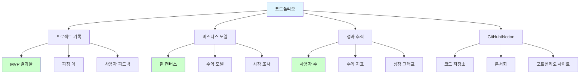

**메이커 포트폴리오 구성**

| 항목 | 내용 | 도구 | 중요도 |
|------|------|------|--------|
| **프로젝트 결과물** | • 실제 작동하는 MVP<br/>• GitHub 저장소<br/>• 라이브 데모 링크<br/>• 사용 가이드 | GitHub<br/>Vercel<br/>Netlify | ⭐⭐⭐⭐⭐ |
| **비즈니스 모델** | • 린 캔버스<br/>• 피칭 덱<br/>• 시장 조사<br/>• 수익 모델 | Notion<br/>Figma<br/>Google Slides | ⭐⭐⭐⭐⭐ |
| **사용자 데이터** | • 사용자 수<br/>• 피드백<br/>• 사용 통계<br/>• 개선 이력 | Google Analytics<br/>Typeform<br/>Notion | ⭐⭐⭐⭐ |
| **개발 과정** | • 개발 일지<br/>• 문제 해결 과정<br/>• 배운 점<br/>• 기술 스택 | Notion<br/>GitHub Issues<br/>블로그 | ⭐⭐⭐ |
| **미디어 & 발표** | • 피칭 영상<br/>• 데모 영상<br/>• 발표 자료<br/>• 수상/인증 | YouTube<br/>Vimeo<br/>LinkedIn | ⭐⭐⭐⭐ |

---

## 📚 필수 기록 장치 및 도구

### 🎯 기록 시스템 전체 구조

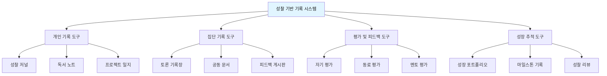

### 📊 레벨별 메이커 포트폴리오 도구

| 기록 유형 | 초등학생 | 중학생 | 고등학생 | 대학생 | 플랫폼 |
|----------|---------|--------|----------|--------|--------|
| **문제 발견<br/>일지** | 그림 + 문제 설명<br/>해결 아이디어 | 문제 정의서<br/>5 Whys 분석 | 시장 조사<br/>페인 포인트 분석 | 산업 분석<br/>GAP 분석 | Notion<br/>FigJam |
| **비즈니스<br/>모델** | 간단한 수익 계산<br/>고객 그림 | 린 캔버스<br/>고객 인터뷰 | BMC 전체<br/>재무 계획 | 사업 계획서<br/>투자 자료 | Miro<br/>Notion |
| **개발 일지<br/>(GitHub)** | 스크래치 프로젝트<br/>스크린샷 | GitHub 저장소<br/>README 작성 | 풀스택 프로젝트<br/>문서화 완료 | 오픈소스 기여<br/>CI/CD | GitHub<br/>GitLab |
| **피칭 자료** | 발표 포스터<br/>3분 발표 | 피칭 덱 5장<br/>데모 영상 | 피칭 덱 10장<br/>투자 제안서 | VC 피칭<br/>IR 자료 | Canva<br/>Figma |
| **성과 추적** | 친구 반응<br/>판매 개수 | 사용자 수<br/>피드백 모음 | MAU/DAU<br/>수익 지표 | MRR/ARR<br/>성장률 | Notion<br/>Analytics |

### 📝 핵심 기록 도구 템플릿

#### 1. 성찰 저널 템플릿

**초등학생용: 성찰 노트**

```markdown
┌─────────────────────────────────┐
│   🌱 나의 성찰 노트                │
├─────────────────────────────────┤
│ 날짜: ___________                │
│ 책 제목: ___________              │
│ 오늘 읽은 쪽: ____~____          │
└─────────────────────────────────┘

📖 오늘 읽은 내용 (그림으로 표현)
[                                ]
[      그림 그리는 공간            ]
[                                ]

💭 어떤 생각이 들었나요?
_____________________________________

❤️ 어떤 감정이 들었나요?
□ 기쁨  □ 슬픔  □ 화남  □ 놀람  □ 궁금함

🤔 궁금한 점이 있나요?
_____________________________________

🌟 오늘 배운 점
_____________________________________
```

**중학생용: 성찰 저널**

```markdown
┌─────────────────────────────────┐
│   📚 성찰 저널                    │
├─────────────────────────────────┤
│ 날짜: ___________                │
│ 책: _________________            │
│ 진도: ____%                      │
└─────────────────────────────────┘

[1] 핵심 내용 요약 (3-5문장)
_____________________________________
_____________________________________
_____________________________________

[2] 인상 깊은 구절
"_____________________________________"
→ 왜 인상 깊었나요?
_____________________________________

[3] 성찰 질문에 답하기
Q1. 이 부분이 나의 가치관과 어떻게 연결되나요?
_____________________________________

Q2. 등장인물의 선택에 동의하나요? 왜?
_____________________________________

Q3. 나라면 어떻게 했을까요?
_____________________________________

[4] 일상과의 연결
비슷한 경험이나 생각:
_____________________________________

[5] 다음 토론에서 나누고 싶은 질문
_____________________________________
```

**고등학생용: 비판적 성찰 저널**

```markdown
┌─────────────────────────────────┐
│   🎓 비판적 성찰 저널              │
├─────────────────────────────────┤
│ 날짜: ___________                │
│ 도서: _________________          │
│ 성찰 주제: _____________         │
└─────────────────────────────────┘

[1] 텍스트 분석
• 저자의 핵심 주장:
_____________________________________

• 논거 구조:
① _____________________________________
② _____________________________________
③ _____________________________________

• 문제의식:
_____________________________________

[2] 비판적 사고
• 타당한 부분:
_____________________________________

• 의문스러운 부분:
_____________________________________

• 대안적 관점:
_____________________________________

[3] 철학적 성찰
• 이 책이 다루는 근본적 질문:
_____________________________________

• 나의 답변:
_____________________________________

• 그 이유:
_____________________________________

[4] 자기 성찰
• 나의 생각이 어떻게 변화했나요?
이전: _____________________________________
이후: _____________________________________

• 나의 삶에 어떻게 적용할 수 있나요?
_____________________________________

[5] 연구 질문
다음 단계로 탐구하고 싶은 질문:
_____________________________________
```

**대학생용: 학술적 성찰 저널**

```markdown
┌─────────────────────────────────┐
│   📖 학술적 성찰 저널              │
├─────────────────────────────────┤
│ 날짜: ___________                │
│ 문헌: _________________          │
│ 이론적 프레임워크: _________     │
└─────────────────────────────────┘

[1] 문헌 요약
• 핵심 논지:
• 방법론:
• 주요 발견:
• 한계:

[2] 이론적 분석
• 적용된 이론:
• 선행 연구와의 관계:
• 학문적 기여:

[3] 비판적 검토
• 강점:
• 약점:
• 방법론적 한계:
• 대안적 해석:

[4] 성찰적 통찰
• 나의 연구 질문과의 연결:
• 적용 가능한 개념:
• 추가 탐구 필요 영역:

[5] 실천적 함의
• 사회적 의미:
• 실천 가능한 아이디어:
• 후속 연구 방향:
```

#### 2. 프로젝트 기획 및 실행 일지

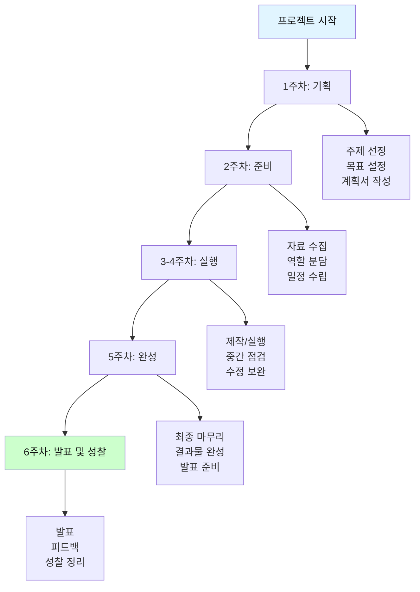

**프로젝트 일지 템플릿**

| 항목 | 내용 | 담당자 | 완료 여부 |
|------|------|--------|----------|
| **프로젝트명** | | | |
| **기간** | 시작일: _____ 종료일: _____ | | |
| **목표** | | | |
| **주요 활동** | Week 1:<br/>Week 2:<br/>Week 3:<br/>Week 4: | | □□□□ |
| **결과물** | | | □ |
| **성찰** | • 잘된 점:<br/>• 어려웠던 점:<br/>• 배운 점:<br/>• 다음에 개선할 점: | | |

#### 3. 토론 기록 시스템

**토론 기록 템플릿**

```markdown
┌─────────────────────────────────┐
│   💬 토론 기록장                  │
├─────────────────────────────────┤
│ 날짜: ___________                │
│ 도서: _________________          │
│ 참여자: __________________       │
│ 퍼실리테이터: ___________        │
└─────────────────────────────────┘

[토론 주제]
_____________________________________

[주요 논점]
논점 1: _____________________________________
  - 찬성 의견:
  - 반대 의견:

논점 2: _____________________________________
  - 찬성 의견:
  - 반대 의견:

[인상 깊었던 의견]
• 누가: ________
  무엇을: _____________________________________
  
• 누가: ________
  무엇을: _____________________________________

[집단 통찰]
우리가 함께 발견한 것:
_____________________________________

[나의 생각 변화]
토론 전: _____________________________________
토론 후: _____________________________________

[다음 토론 주제 제안]
_____________________________________
```

#### 4. 성장 추적 도구

```mermaid
graph LR
    A[월별 체크] --> B[학기별 리뷰]
    B --> C[연간 포트폴리오]
    
    A --> A1[완독 권수<br/>성찰 깊이<br/>토론 참여도]
    B --> B1[베스트 성찰<br/>프로젝트 결과<br/>성장 스토리]
    C --> C1[연간 성장 그래프<br/>대표 작품<br/>미래 계획]
    
    style C fill:#ccffcc,color:#111
```

**성장 추적표**

| 월 | 읽은 책 | 성찰 저널 | 토론 참여 | 프로젝트 | 성장 키워드 | 자기 평가 |
|----|---------|----------|----------|----------|------------|----------|
| 3월 | 2권 | 8편 | 4회 | 1개 | 호기심 | ⭐⭐⭐ |
| 4월 | 3권 | 12편 | 4회 | 1개 | 공감 | ⭐⭐⭐⭐ |
| 5월 | 2권 | 8편 | 4회 | 1개 | 비판적 사고 | ⭐⭐⭐⭐ |
| ... | | | | | | |

---

## 🏗️ 프로젝트 구조 및 파일 시스템

### 📁 디렉토리 구조

```
ReadingClubProject/
│
├── 📂 docs/                          # 문서 및 가이드
│   ├── 운영_가이드.md
│   ├── 퍼실리테이터_매뉴얼.md
│   └── 학부모_안내서.md
│
├── 📂 templates/                     # 템플릿 모음
│   ├── 📂 초등학생/
│   │   ├── 성찰노트_초등.md
│   │   ├── 독서기록장_초등.md
│   │   └── 프로젝트계획서_초등.md
│   │
│   ├── 📂 중학생/
│   │   ├── 성찰저널_중등.md
│   │   ├── 토론준비서_중등.md
│   │   └── 프로젝트일지_중등.md
│   │
│   ├── 📂 고등학생/
│   │   ├── 비판적성찰저널_고등.md
│   │   ├── 논술에세이_템플릿_고등.md
│   │   └── 연구계획서_고등.md
│   │
│   └── 📂 대학생/
│       ├── 학술저널_대학.md
│       ├── 연구프로젝트_템플릿_대학.md
│       └── 실천일지_대학.md
│
├── 📂 programs/                      # 프로그램별 커리큘럼
│   ├── 📂 레벨1_초등/
│   │   ├── 1학기_프로그램.md
│   │   ├── 2학기_프로그램.md
│   │   └── 추천도서목록_초등.md
│   │
│   ├── 📂 레벨2_중등/
│   ├── 📂 레벨3_고등/
│   └── 📂 레벨4_대학/
│
├── 📂 activities/                    # 활동 및 프로젝트 예시
│   ├── 📂 토론_가이드/
│   ├── 📂 프로젝트_예시/
│   └── 📂 성찰_활동/
│
├── 📂 assessments/                   # 평가 도구
│   ├── 자기평가표.md
│   ├── 동료평가표.md
│   └── 성장포트폴리오_평가기준.md
│
├── 📂 아이디어/                      # 🆕 프로젝트 아이디어 200선
│   ├── 📄 학년별_프로젝트_아이디어_100선.md  # Part 1: 페르소나 기반 100개
│   ├── 📄 융합형_프로젝트_100선.md          # Part 2: 영역 융합 100개
│   └── 📄 학년별_페르소나_생활패턴_가이드.md # 페르소나 & 생활 패턴
│
└── 📂 resources/                     # 참고 자료
    ├── 추천도서_종합목록.md
    ├── 성찰질문_모음.md
    └── 프로젝트아이디어_뱅크.md
```

### 🆕 프로젝트 아이디어 200선 (신규!)

**총 200개 실전 프로젝트 = 기본 100개 + 융합 100개**

```mermaid
mindmap
  root((200개<br/>프로젝트))
    Part 1: 기본 100개
      페르소나 생활 기반
        초등 25개
        중등 25개
        고등 25개
        대학 25개
      특징
        실제 학생 하루 패턴
        문제 발견 → 솔루션
        5대 영역 분류
    Part 2: 융합 100개
      영역 융합 혁신
        감정×돈 20개
        감정×만남 20개
        돈×만남 20개
        성찰×여가 20개
        5개 통합 20개
      특징
        차별화 포인트
        비즈니스 모델
        확장 가능성
```

**📁 파일 안내:**

| 파일명 | 설명 | 특징 | 추천 대상 |
|--------|------|------|-----------|
| **[학년별_프로젝트_아이디어_100선.md](./아이디어/학년별_프로젝트_아이디어_100선.md)** | 페르소나 생활 기반<br/>기본 100개 | • 실제 학생 하루 Journey<br/>• 문제 발견 순간 포착<br/>• 감정 기반 솔루션 | 생활 밀착형<br/>프로젝트 원하는 분 |
| **[융합형_프로젝트_100선.md](./아이디어/융합형_프로젝트_100선.md)** | 영역 융합<br/>혁신 100개 | • 2개 이상 영역 결합<br/>• 차별화된 비즈니스<br/>• 수익 모델 명확 | 혁신적·창업<br/>프로젝트 원하는 분 |
| **[학년별_페르소나_생활패턴_가이드.md](./아이디어/학년별_페르소나_생활패턴_가이드.md)** | 12명 페르소나<br/>상세 가이드 | • 학년별 3명 페르소나<br/>• 시간대별 생활 패턴<br/>• 고민·관심사 분석 | 페르소나 이해<br/>필요한 분 |

**🎯 프로젝트 선택 가이드:**

```mermaid
flowchart TD
    A[어떤 프로젝트를 선택할까?] --> B{나는 어떤 유형?}
    
    B -->|실생활 문제 해결| C[기본 100개]
    B -->|혁신적 차별화| D[융합 100개]
    
    C --> C1[비슷한 페르소나 찾기]
    C1 --> C2[공감되는 문제 선택]
    C2 --> C3[바로 실행 가능]
    
    D --> D1[관심 영역 2개 선택]
    D1 --> D2[융합 포인트 발견]
    D2 --> D3[차별화 전략 수립]
    
    style A fill:#e3f2fd,color:#111
    style C3 fill:#c8e6c9,color:#111
    style D3 fill:#fff9c4,color:#111
```

---

## 🎯 운영 방법 및 프로세스

### 📅 학기별 운영 계획

```mermaid
gantt
    title 한 학기 운영 타임라인 (16주)
    dateFormat  YYYY-MM-DD
    section 준비기
    오리엔테이션           :2024-03-01, 1w
    팀 빌딩               :2024-03-08, 1w
    section 실행기
    1차 독서 사이클        :2024-03-15, 4w
    2차 독서 사이클        :2024-04-12, 4w
    3차 독서 사이클        :2024-05-10, 4w
    section 마무리기
    프로젝트 발표회        :2024-06-07, 1w
    학기 성찰 및 평가      :2024-06-14, 1w
```

### 🔄 독서 사이클 (4주 단위)

```mermaid
flowchart LR
    A[Week 1<br/>읽기] --> B[Week 2<br/>성찰 + 토론]
    B --> C[Week 3<br/>프로젝트]
    C --> D[Week 4<br/>발표 + 정리]
    D --> E[다음 사이클]
    
    A --> A1[개인 독서<br/>성찰 저널]
    B --> B1[토론 모임<br/>집단 성찰]
    C --> C1[프로젝트 실행<br/>제작/연구]
    D --> D1[결과 공유<br/>피드백]
    
    style A fill:#e1f5ff,color:#111
    style D fill:#ccffcc,color:#111
```

**4주 사이클 상세 일정**

| 주차 | 활동 | 개인 과제 | 모임 활동 | 시간 투자 |
|------|------|----------|----------|----------|
| **Week 1<br/>읽기** | • 책 읽기<br/>• 성찰 저널 작성<br/>• 질문 생성 | • 완독 목표<br/>• 매일 성찰 메모<br/>• 토론 질문 3개 준비 | • 킥오프 미팅 (30분)<br/>• 독서 목표 공유 | 개인: 5-10시간<br/>모임: 0.5시간 |
| **Week 2<br/>성찰+토론** | • 성찰 심화<br/>• 토론 준비<br/>• 관점 정리 | • 성찰 저널 완성<br/>• 토론 준비서 작성 | • 토론 모임<br/>• 집단 성찰<br/>• 프로젝트 기획 | 개인: 2-3시간<br/>모임: 2-2.5시간 |
| **Week 3<br/>프로젝트** | • 프로젝트 실행<br/>• 제작/연구<br/>• 일지 작성 | • 프로젝트 진행<br/>• 중간 점검 | • 중간 공유 (선택)<br/>• 동료 피드백 | 개인: 3-5시간<br/>모임: 1시간 |
| **Week 4<br/>발표+정리** | • 프로젝트 완성<br/>• 발표 준비<br/>• 학기 성찰 | • 최종 마무리<br/>• 발표 자료 | • 발표회<br/>• 피드백<br/>• 성장 리뷰 | 개인: 2-3시간<br/>모임: 2-2.5시간 |

---

## 📊 평가 및 성장 측정

### 🎯 평가 철학: 결과물 중심 평가

```mermaid
mindmap
  root((메이커 평가))
    실행력
      MVP 완성
      런칭 여부
      사용자 수
    기획력
      문제 발견
      비즈니스 모델
      차별화 전략
    학습력
      디버깅 능력
      개선 속도
      기술 습득
    임팩트
      사용자 만족도
      사회적 가치
      수익 창출
```

### 📈 메이커 평가 기준표

| 영역 | 평가 항목 | 초등 | 중등 | 고등 | 대학 | 평가 방법 |
|------|----------|------|------|------|------|-----------|
| **문제 발견<br/>(20%)** | • 진짜 문제 도출<br/>• 페인 포인트 분석<br/>• 기회 포착 | ⭐⭐⭐ | ⭐⭐⭐⭐ | ⭐⭐⭐⭐⭐ | ⭐⭐⭐⭐⭐ | 문제 정의서<br/>시장 조사 |
| **비즈니스 모델<br/>(20%)** | • 수익 모델<br/>• 고객 세그먼트<br/>• 실현 가능성 | ⭐⭐ | ⭐⭐⭐⭐ | ⭐⭐⭐⭐⭐ | ⭐⭐⭐⭐⭐ | 린 캔버스<br/>BMC |
| **실행력<br/>(30%)** | • MVP 완성도<br/>• 런칭 여부<br/>• 사용자 확보 | ⭐⭐⭐⭐⭐ | ⭐⭐⭐⭐⭐ | ⭐⭐⭐⭐⭐ | ⭐⭐⭐⭐⭐ | 작동하는 제품<br/>사용자 수 |
| **디버깅<br/>(15%)** | • 문제 해결<br/>• 개선 반복<br/>• 학습 속도 | ⭐⭐⭐ | ⭐⭐⭐⭐ | ⭐⭐⭐⭐ | ⭐⭐⭐⭐⭐ | 개발 로그<br/>버전 이력 |
| **피칭<br/>(15%)** | • 발표력<br/>• 스토리텔링<br/>• 설득력 | ⭐⭐⭐⭐ | ⭐⭐⭐⭐ | ⭐⭐⭐⭐⭐ | ⭐⭐⭐⭐⭐ | 3분 피칭<br/>피칭 덱 |

### 🌱 메이커 성장 지표

```mermaid
graph TD
    A[성장 측정] --> B[정량 지표]
    A --> C[정성 지표]
    
    B --> B1[MVP 개수]
    B --> B2[사용자 수]
    B --> B3[GitHub 커밋]
    B --> B4[수익/투자]
    
    C --> C1[기획력]
    C --> C2[실행력]
    C --> C3[디버깅 능력]
    C --> C4[기업가 정신]
    
    style A fill:#e1f5ff,color:#111
    style C1 fill:#ccffcc,color:#111
    style C2 fill:#ccffcc,color:#111
    style C3 fill:#ccffcc,color:#111
    style C4 fill:#ccffcc,color:#111
```

**성과 지표 예시**

| 레벨 | 정량 지표 | 목표 | 우수 사례 |
|------|----------|------|----------|
| **초등** | • 완성 작품 수<br/>• 친구 반응<br/>• 판매 개수 | 1학기 2-3개 작품<br/>10명 이상 사용 | 100개 판매<br/>학교 전시 |
| **중등** | • 런칭 앱/웹<br/>• 사용자 수<br/>• GitHub stars | 1학기 1-2개 런칭<br/>100명+ 사용자 | 1000명+ 사용자<br/>언론 보도 |
| **고등** | • 스타트업 런칭<br/>• MAU<br/>• 초기 수익 | 1학기 1개 런칭<br/>500명+ MAU<br/>첫 수익 | 크라우드펀딩 성공<br/>투자 유치 |
| **대학** | • 시리즈 투자<br/>• MRR/ARR<br/>• 팀 규모 | 실제 창업<br/>MRR $1000+<br/>3명+ 팀 | 시리즈 A<br/>$10K+ MRR |

---

## 🌟 실전 사례: 5대 영역 프로젝트 스토리

### 사례 1: 💗 감정 영역 - "마음 친구" 챗봇 (중학생 팀)

```markdown
📚 독서: 《멋진 신세계》 → 감정을 억압하는 사회

[문제 발견]
"우리 반 친구들이 시험 스트레스로 너무 힘들어해요.
특히 혼자 고민을 안고 있는 친구들이 많아요."

[솔루션]
• AI 챗봇이 고민을 들어주고 공감
• 감정을 기록하고 추적
• 비슷한 고민을 가진 친구 익명 연결

[개발 과정 (2주)]
Week 1: ChatGPT API로 공감 대화 프로토타입
Week 2: 웹앱 제작 (Cursor 사용) + 베타 테스트 10명

[결과]
✅ 학급 30명 중 15명 사용
✅ 평균 대화 시간 8분
✅ "도움이 됐다" 80%
✅ 프리미엄 전환 3명 (월 3,000원)

💡 배운 점: "기술보다 공감이 중요했어요. AI가 완벽하지 않아도
             진심으로 들어주는 것만으로도 힘이 됐어요."
```

### 사례 2: 💰 돈 영역 - "틴 프리랜서" 마켓 (고등학생 팀)

```markdown
📚 독서: 《부의 추월차선》 → 시간을 파는 것의 한계

[문제 발견]
"저는 디자인을 잘하는데 용돈을 벌 방법이 없어요.
알바는 시간이 너무 많이 들고, 재능을 활용하고 싶어요."

[솔루션]
• 학생 간 재능 거래 플랫폼
• 포트폴리오 자동 생성
• 안전 결제 시스템

[개발 과정 (4주)]
Week 1-2: MVP 개발 (프로필 + 의뢰 시스템)
Week 3: 학교 홍보 + 50명 모집
Week 4: 첫 거래 발생

[결과]
✅ 3개월간 100건 거래
✅ 총 거래액 200만원
✅ 플랫폼 수수료 30만원
✅ 5개 학교로 확장

💡 배운 점: "학생들에게도 가치 있는 스킬이 있어요.
             플랫폼만 있으면 경제적 자립이 가능해요!"
```

### 사례 3: 🤝 만남 영역 - "스터디 메이트" (대학생 팀)

```markdown
📚 독서: 《아웃라이어》 → 함께 성장하는 동료의 힘

[문제 발견]
"혼자 공부하면 지속이 안 돼요. 
같은 목표를 가진 사람을 찾기도 어렵고요."

[솔루션]
• AI 기반 스터디 메이트 매칭
• 목표·과목·시간대별 매칭
• 공부 시간 공유 & 격려

[개발 과정 (6주)]
Week 1-2: 매칭 알고리즘 설계
Week 3-4: 앱 개발 (React Native)
Week 5-6: 런칭 + 마케팅

[결과]
✅ 런칭 1개월 500명 가입
✅ 200건 매칭 성공
✅ 프리미엄 전환율 5% (월 5,000원)
✅ 스터디카페 제휴로 추가 수익

💡 배운 점: "AI 매칭 알고리즘이 핵심이었어요.
             단순히 연결만 해주는 게 아니라
             성공적인 매칭을 만드는 게 중요했어요."
```

### 사례 4: 🧘 성찰 영역 - "인생 질문 생성기" (고등학생 개인)

```markdown
📚 독서: 《사피엔스》 → 인간의 근본 질문들

[문제 발견]
"공부만 하다 보니 내가 누구인지 모르겠어요.
깊이 생각할 시간도, 방법도 없어요."

[솔루션]
• 매일 하나씩 철학적 질문 제공
• AI가 답변을 분석하고 통찰 제공
• 성찰 기록 아카이브

[개발 과정 (3주)]
Week 1: ChatGPT API로 질문 DB 구축 (1000개)
Week 2: 모바일 앱 개발 (알림 기능)
Week 3: 베타 테스트 & 론칭

[결과]
✅ 런칭 2주만에 100명 다운로드
✅ 평균 답변 작성률 70%
✅ 프리미엄 전환 10명 (월 3,000원)
✅ 철학 워크숍 개최 (1회 3만원, 10명)

💡 배운 점: "사람들은 좋은 질문을 원해요.
             혼자 생각하는 것보다 질문이 주어지면
             훨씬 깊이 사고할 수 있어요."
```

### 사례 5: 🎮 여가 영역 - "인생 시뮬레이션 게임" (대학생 팀)

```markdown
📚 독서: 《어린 왕자》 → 어른들이 잃어버린 놀이

[문제 발견]
"공부와 일만 하면서 살아요.
재미는 없고, 의미도 없고, 그냥 버티는 느낌이에요."

[솔루션]
• 인생 선택을 시뮬레이션하는 게임
• 재미 + 성찰 결합
• 친구들과 결과 공유

[개발 과정 (8주)]
Week 1-3: 게임 스토리 & 선택지 설계 (AI 협업)
Week 4-6: Unity 개발 (ChatGPT로 코드 생성)
Week 7-8: 베타 테스트 & 마케팅

[결과]
✅ Steam 출시 2주만에 1000 다운로드
✅ 평균 플레이 시간 2시간
✅ 긍정 리뷰 85%
✅ 확장팩 판매 (9,900원) 100건

💡 배운 점: "게임은 단순한 오락이 아니에요.
             삶을 성찰하고, 다른 선택을 시도해보고,
             재미있게 배우는 최고의 도구예요."
```

### 🌟 융합 프로젝트: "힐링 게임파이" (💗×🎮)

```markdown
📚 독서: 《죽고 싶지만 떡볶이는 먹고 싶어》 → 일상의 작은 행복

[문제]
우울함을 느끼는데 상담은 부담스럽고, 
게임은 중독만 될 것 같고...

[솔루션]
• 감정 회복을 게임으로 (게임파이케이션)
• 미션: 산책하기, 친구에게 연락하기, 감사 일기 쓰기
• 포인트로 캐릭터 성장
• 커뮤니티에서 서로 응원

[결과]
✅ 런칭 1개월 3000명
✅ MAU 1500명
✅ 프리미엄 (월 4,900원) 전환율 8%
✅ 정신건강 개선 자가 평가 75%

💡 혁신 포인트: "힐링 × 게임"이라는 새로운 카테고리 창출
```

---

## 🚀 시작하기

### 1단계: 나는 어떤 영역에 관심이 있나?

**자가 진단 체크리스트**

```markdown
□ 💗 감정: 사람들의 고통을 덜어주고 싶다
□ 💰 돈: 경제적 가치를 만들고 수익을 내고 싶다
□ 🤝 만남: 사람들을 연결하고 커뮤니티를 만들고 싶다
□ 🧘 성찰: 깊이 생각하고 의미를 탐구하고 싶다
□ 🎮 여가: 재미있는 것을 만들고 즐거움을 주고 싶다

→ 여러 개 선택 가능! 융합 프로젝트도 환영!
```

### 2단계: 준비하기

```mermaid
flowchart LR
    A[관심 영역 확인] --> B[레벨 선택]
    B --> C[팀 구성]
    C --> D[오리엔테이션]
    D --> E[시작!]
    
    style A fill:#e1f5ff,color:#111
    style E fill:#ccffcc,color:#111
```

**체크리스트**

- [ ] 5대 영역 중 관심 영역 확인
- [ ] 독서 클럽 소개 자료 읽기
- [ ] 본인에게 맞는 레벨 확인
- [ ] 필요한 도구 준비 (노트, 필기구, 독서 저널)
- [ ] 첫 책 선정
- [ ] 오리엔테이션 참석

### 2단계: 첫 모임 준비

| 준비물 | 설명 | 필수 여부 |
|--------|------|-----------|
| **선정 도서** | 모임에서 정한 책 | ✅ 필수 |
| **성찰 저널** | 개인 기록 노트 | ✅ 필수 |
| **필기구** | 펜, 형광펜, 포스트잇 | ✅ 필수 |
| **열린 마음** | 경청하고 공감하는 자세 | ✅ 필수 |
| **질문 목록** | 궁금한 점 3-5개 | ⭕ 권장 |

---

## 💡 FAQ (자주 묻는 질문)

> **근본적인 질문에 답합니다**
> 
> 단순한 운영 방법이 아니라, **왜 이런 방식으로 배우는가?**  
> **기존 교육과 어떻게 다른가?** **정말 효과가 있는가?**에 대한  
> 본질적인 답변을 제공합니다.

### 📚 Part 1: 철학 & 본질 - "왜 이 방식인가?"

<details>
<summary><b>Q1. 왜 단순히 책만 읽지 않고 '문제 발견 → 제작 → 비즈니스'까지 하나요?</b></summary>

**A: AI 시대, 지식은 더 이상 경쟁력이 아니기 때문입니다.**

```
❌ 과거: 지식 축적 = 경쟁력
   → 많이 아는 사람이 성공

✅ 현재: 문제 발견 + 실행력 = 경쟁력
   → AI를 활용해 빠르게 만드는 사람이 성공
```

**핵심 이유 3가지:**

1. **지식은 ChatGPT가 더 많이 안다**
   - 1만 권의 책을 읽어도 AI만큼 알 수 없습니다
   - 중요한 건 "무엇을 알고 있는가?"가 아니라 "무엇을 물어야 하는가?"

2. **문제 발견이 진짜 능력이다**
   - 독서는 "문제를 발견하는 렌즈"를 얻는 과정
   - 5대 영역(감정·돈·만남·성찰·여가)으로 세상의 문제를 보는 눈

3. **실행하지 않으면 의미가 없다**
   - 생각만 하는 사람 vs 만드는 사람
   - 포트폴리오 = 대학/기업이 원하는 증명

💡 **결론**: 독서는 시작일 뿐, 진짜 배움은 **만들면서** 일어납니다.
</details>

<details>
<summary><b>Q2. 5대 영역(💗감정·💰돈·🤝만남·🧘성찰·🎮여가)이 왜 중요한가요?</b></summary>

**A: 모든 비즈니스와 혁신은 이 5가지 중 하나에서 시작됩니다.**

**5대 영역 = 인간의 근본 욕구**

```mermaid
mindmap
  root((인간))
    💗 감정
      고통을 줄이고 싶다
      → 심리 상담, 힐링 앱
    💰 돈
      경제적으로 자립하고 싶다
      → 재테크, 수익 플랫폼
    🤝 만남
      외롭지 않고 싶다
      → 소셜 네트워크, 커뮤니티
    🧘 성찰
      의미를 찾고 싶다
      → 철학 콘텐츠, 성장 프로그램
    🎮 여가
      즐겁게 살고 싶다
      → 게임, 엔터테인먼트
```

**실제 사례:**

| 기업 | 영역 | 해결한 문제 |
|------|------|----------|
| **카카오톡** | 🤝 만남 | "친구와 쉽게 연락하고 싶다" |
| **토스** | 💰 돈 | "복잡한 금융을 쉽게" |
| **마음의숲** | 💗 감정 | "힐링이 필요해" |
| **넷플릭스** | 🎮 여가 | "재미있는 걸 보고 싶어" |
| **클래스101** | 🧘 성찰 | "새로운 걸 배우고 성장하고 싶어" |

💡 **핵심**: 하나의 책을 읽어도 5가지 렌즈로 보면 **최소 5개의 비즈니스 아이디어**가 나옵니다.
</details>

<details>
<summary><b>Q3. 왜 '성찰'과 '실행'을 함께 하나요? 하나만 하면 안 되나요?</b></summary>

**A: 성찰 없는 실행은 방향을 잃고, 실행 없는 성찰은 공허합니다.**

**균형의 중요성:**

```
❌ 성찰만 하는 사람
   → 깊이 생각은 하지만 아무것도 만들지 못함
   → "언젠가 하겠지..." → 평생 시작 못 함

❌ 실행만 하는 사람
   → 빠르게 만들지만 의미 없는 것들
   → 번아웃, 방향 상실, "이게 왜 중요한가?" 의문

✅ 성찰 + 실행 = 지속가능한 임팩트
   → 깊이 생각하고 빠르게 실행
   → 의미 있는 일을 효과적으로 완성
```

**우리의 2가지 모드:**

1. **통찰 모드 (미네르바 세미나)**
   - 10가지 렌즈로 깊이 사고
   - 복잡성 이해
   - "왜?"를 5번 묻기

2. **실행 모드 (6단계 사이클)**
   - 2주 내 MVP 제작
   - AI 협업으로 빠른 구현
   - "일단 만들고 개선"

💡 **결론**: 두 모드를 번갈아 사용하면 **생각의 깊이 + 실행의 속도** 둘 다 얻습니다.
</details>

<details>
<summary><b>Q4. 왜 '메이커'이면서 동시에 '기업가'를 양성하나요?</b></summary>

**A: 만들 줄만 알고 비즈니스를 모르면 취미로 끝나기 때문입니다.**

**3단계 진화:**

```
Level 1: 소비자 (Consumer)
└─ 남이 만든 것을 사용만 함

Level 2: 메이커 (Maker)
└─ 직접 만들지만 취미 수준
└─ 수익 없음 → 지속 불가능

Level 3: 기업가 메이커 (Entrepreneur Maker) ⭐
└─ 만들기 + 비즈니스 모델
└─ 실제 사용자 확보 + 수익
└─ 지속가능한 임팩트
```

**왜 비즈니스가 중요한가?**

1. **지속가능성**
   - 취미: 열정만으로는 오래 못 감
   - 비즈니스: 수익이 있어야 계속할 수 있음

2. **진짜 가치 검증**
   - "사람들이 돈을 낸다" = 진짜 필요한 것
   - 무료는 아무나 쓰지만, 유료는 진심 있는 사람만

3. **실전 경험**
   - 대학/기업이 원하는 건 "이론"이 아니라 "실전 경험"
   - "실제 수익을 냈다" = 최고의 포트폴리오

💡 **우리의 목표**: 단순히 만드는 사람이 아니라, **가치를 창출하고 수익을 내는 메이커**
</details>

<details>
<summary><b>Q5. AI가 다 해주는데 왜 우리가 배워야 하나요?</b></summary>

**A: AI는 도구일 뿐, '무엇을 만들지' 결정하는 건 인간입니다.**

**AI가 하는 것 vs 우리가 하는 것:**

```mermaid
graph LR
    A[AI의 영역] --> A1[코딩<br/>디자인<br/>문서 작성<br/>반복 작업]
    
    B[인간의 영역] --> B1[문제 발견<br/>가치 판단<br/>방향 설정<br/>공감과 통찰]
    
    A1 --> C[효율적 실행]
    B1 --> C
    
    C --> D[차별화된 창작물]
    
    style A1 fill:#e1f5ff,color:#111
    style B1 fill:#ccffcc,color:#111
    style D fill:#ffe1f5,color:#111
```

**AI 시대의 핵심 역량:**

| AI가 대체할 수 없는 것 | 우리가 개발해야 할 능력 |
|-------------------|-------------------|
| 💗 **공감** | 사용자의 고통을 느끼기 |
| 🎯 **문제 발견** | 5대 영역으로 문제 보기 |
| 🧘 **가치 판단** | "이게 정말 중요한가?" |
| 🤝 **관계** | 팀 구성, 네트워킹 |
| 🔮 **비전** | 10년 후를 상상하기 |

**실제 프로세스:**

```
1. 독서하며 문제 발견 (인간) ⭐
   ↓
2. "이 문제를 해결하려면?" AI에게 질문 (인간+AI)
   ↓
3. AI가 코드/디자인 생성 (AI)
   ↓
4. 사용자 테스트하며 공감 (인간) ⭐
   ↓
5. 방향 수정 결정 (인간) ⭐
   ↓
6. AI로 빠르게 개선 (AI)
```

💡 **결론**: AI를 쓸수록 **인간만이 할 수 있는 것**이 더 중요해집니다.
</details>

---

### 🔍 Part 2: 방법론 & 차별점 - "어떻게 다른가?"

<details>
<summary><b>Q6. 일반 독서 클럽과 어떻게 다른가요?</b></summary>

**A: 읽고 끝이 아니라, 문제 발견 → 솔루션 제작 → 런칭까지 갑니다.**

**비교표:**

| 구분 | 일반 독서 클럽 | AI 메이커스 독서 클럽 |
|------|--------------|---------------------|
| **목적** | 책 완독, 교양 쌓기 | 문제 발견 & 솔루션 제작 |
| **활동** | 읽기 → 독후감 | 읽기 → 문제 발견 → 성찰 → 비즈니스 모델 → AI 제작 → 런칭 |
| **결과물** | 독후감, 감상문 | 실제 작동하는 앱/웹/게임 + 사용자 |
| **기간** | 한 달에 1권 | 4주: 1권 읽기 + MVP 제작 |
| **역량** | 독해력, 문해력 | 문제 발견력 + AI 협업 능력 + 실행력 + 기업가 정신 |
| **평가** | 완독 여부, 감상 | 문제의 질 + MVP 완성도 + 실제 사용자 수 |
| **AI 활용** | 없음 | 전 과정 AI 협업 (Cursor, ChatGPT 등) |
| **포트폴리오** | 독후감 모음 | GitHub + 런칭 사례 + 피칭 덱 |

**실제 프로세스 차이:**

```
[일반 독서 클럽]
Week 1-3: 책 읽기
Week 4: 토론 + 독후감 작성
→ 끝

[AI 메이커스 독서 클럽]
Week 1: 책 읽기 + 5대 영역으로 문제 발견
Week 2: 미네르바 세미나 (10가지 렌즈 분석)
Week 3: AI 협업으로 MVP 제작
Week 4: 베타 테스트 + 피칭
→ 포트폴리오 + 실제 사용자
```

💡 **핵심**: 책은 **문제를 발견하는 도구**일 뿐, 진짜 목표는 **솔루션을 만드는 것**입니다.
</details>

<details>
<summary><b>Q7. 미네르바 세미나가 왜 필요한가요? 그냥 만들면 안 되나요?</b></summary>

**A: 깊이 생각하지 않고 만들면 '쓸모없는 것'을 만들게 됩니다.**

**문제:**

```
❌ 바로 만들기 시작하면...
   → 표면적인 문제만 본다
   → 이미 있는 솔루션을 재발명
   → 실제 니즈와 동떨어진 제품
   → "왜 아무도 안 쓰지?" 좌절
```

**미네르바 세미나의 힘:**

```mermaid
graph TD
    A[하나의 문제] --> B[10가지 렌즈로 분석]
    
    B --> B1[💰 경제: 시장 크기는?]
    B --> B2[⚖️ 윤리: 누가 피해 보나?]
    B --> B3[🧠 심리: 사용자 감정은?]
    B --> B4[📜 역사: 과거 사례는?]
    B --> B5[🔧 기술: 실현 가능한가?]
    
    B1 --> C[복잡성 이해]
    B2 --> C
    B3 --> C
    B4 --> C
    B5 --> C
    
    C --> D[진짜 솔루션]
    
    style A fill:#e1f5ff,color:#111
    style C fill:#fff3e1,color:#111
    style D fill:#ccffcc,color:#111
```

**실제 사례:**

**주제: "학생 과외 매칭 앱"**

- **바로 만들기**: "학생과 튜터를 연결하는 앱" → 이미 수십 개 존재

- **미네르바 세미나 후**:
  - 💰 경제: 수수료 구조는? → 학생 부담 vs 튜터 부담?
  - ⚖️ 윤리: 저소득층은? → 무료 프로그램 필요
  - 🧠 심리: 왜 과외가 필요? → 실은 "자존감" 문제
  - 📜 역사: 과거 실패 사례는? → 신뢰 문제가 핵심
  - 🔧 기술: AI로 자동 매칭? → 개인화 알고리즘
  
  **→ 최종 솔루션**: "AI 기반 학습 스타일 매칭 + 첫 수업 무료 + 학습 동기 부여 게임"
  (차별화 완성!)

💡 **결론**: 미네르바 세미나 없이는 **평범한 것**, 세미나 후에는 **차별화된 것**을 만듭니다.
</details>

<details>
<summary><b>Q8. 왜 꼭 10가지 렌즈인가요? 3-4개로 줄이면 안 되나요?</b></summary>

**A: 적을수록 놓치는 게 많아집니다. 10개는 '최소한'입니다.**

**렌즈가 적을 때의 문제:**

```
[예시: "배달 앱" 아이디어]

❌ 1-2개 렌즈만 보면:
   💰 경제: "돈 많이 벌겠다!"
   → 만들기 시작 → 1년 후 망함
   
   왜? 놓친 것들:
   • ⚖️ 윤리: 라이더 노동 문제 (사회적 비난)
   • 🌍 환경: 일회용품 폐기물 (규제)
   • 🧠 심리: 사용자 죄책감 (이탈)
   • 🏛️ 정치: 플랫폼 규제 법안 (사업 중단)
```

**10가지 렌즈의 효과:**

| 렌즈 수 | 발견하는 것 | 놓치는 리스크 | 성공 확률 |
|--------|----------|------------|----------|
| 1-2개 | 표면 문제 | 90% | ⭐ 10% |
| 3-5개 | 주요 이슈 | 60% | ⭐⭐ 30% |
| 6-8개 | 복잡성 | 30% | ⭐⭐⭐ 60% |
| 10개 | 전체 그림 | 10% | ⭐⭐⭐⭐⭐ 80%+ |

**실전 효과:**

```
미네르바 스쿨 졸업생들이
실리콘밸리 취업률 90%+인 이유:

→ 하나의 문제를 10가지 관점에서 보는 훈련
→ "복잡성을 이해하는 능력" = 최고의 경쟁력
```

💡 **핵심**: 10개가 많아 보이지만, **실제로는 세상의 복잡성을 이해하는 최소 단위**입니다.
</details>

<details>
<summary><b>Q9. 5단계 사이클(보기-느끼기-사용하기-만들기-수정하기)이 왜 중요한가요?</b></summary>

**A: 한 가지만 하면 '불완전한 학습'입니다. 5단계를 거쳐야 진짜 배웁니다.**

**학습 깊이 비교:**

```mermaid
graph TD
    A[보기만 함] --> A1[표면 이해 20%]
    B[보기+느끼기] --> B1[감정 이해 40%]
    C[보기+느끼기+사용] --> C1[경험 이해 60%]
    D[보기+느끼기+사용+만들기] --> D1[실전 이해 80%]
    E[5단계 완료] --> E1[마스터 100%]
    
    style A1 fill:#ffe1e1,color:#111
    style E1 fill:#ccffcc,color:#111
```

**각 단계의 역할:**

| 단계 | 학습 내용 | 놓치면 생기는 문제 | 소요 시간 |
|------|----------|----------------|----------|
| **1. 보기** | 다양한 사례, 패턴 인식 | "세상에 뭐가 있는지 모름" | 2-3일 |
| **2. 느끼기** | 감정, 공감, 직관 | "사용자 마음을 모름" | 2일 |
| **3. 사용하기** | 직접 경험, 문제 발견 | "실제로 어떤지 모름" | 1주 |
| **4. 만들기** | 구현, 창작 | "만들어보지 않으면 이해 못 함" | 2주 |
| **5. 수정하기** | 개선, 반복 | "첫 시도는 항상 부족함" | 1주 |

**실제 사례:**

**주제: "명상 앱 만들기"**

```
[보기만 한 학생]
"명상 앱이 있구나" → 끝
→ 아무것도 못 만듦

[5단계 완료한 학생]
1. 보기: 헤드스페이스, 캄 등 10개 앱 분석
2. 느끼기: "왜 사람들이 명상을 포기할까?" 인터뷰
3. 사용하기: 1주일 매일 명상 → "5분도 길다" 발견
4. 만들기: "1분 초단위 명상" 앱 제작
5. 수정하기: 사용자 피드백 → "소리 추가" 개선
→ 실제 사용자 200명 확보
```

💡 **핵심**: 보는 것(20%)과 만드는 것(80%)의 차이 = **진짜 배움**
</details>

<details>
<summary><b>Q10. AI를 '협업 파트너'로 본다는 게 무슨 의미인가요?</b></summary>

**A: AI를 단순 도구가 아니라 '함께 생각하는 동료'로 대하는 것입니다.**

**3단계 AI 활용 수준:**

```
Level 1: 검색 엔진 (초보) ❌
└─ "Python 코드 알려줘"
└─ 일방적 요청, 단순 복붙
└─ AI의 10%만 활용

Level 2: 도구 (중급) 🔶
└─ "이 기능 구현해줘"
└─ 명령과 실행
└─ AI의 40% 활용

Level 3: 협업 파트너 (고급) ✅
└─ "우리 함께 이 문제를 풀어보자"
└─ 대화, 질문, 반복, 개선
└─ AI의 100% 활용
```

**협업 파트너로서 AI 활용법:**

| 역할 | 프롬프트 예시 | 효과 |
|------|------------|------|
| **소크라테스** (질문자) | "내 아이디어에 '왜?'를 5번 물어봐" | 사고 확장 |
| **악마의 변호인** | "내 아이디어의 문제점을 모두 찾아봐" | 리스크 발견 |
| **멘토** | "다음 단계는 뭘 해야 할까?" | 방향 제시 |
| **공동 창작자** | "내 아이디어를 10가지로 변형해봐" | 창의성 극대화 |

**실전 대화 예시:**

```
[일반적인 사용]
학생: "배달 앱 코드 짜줘"
AI: [코드 출력]
학생: "고마워" → 끝

[협업 파트너 사용]
학생: "배달 앱 아이디어가 있어. 먼저 이 시장을
      10가지 렌즈로 분석해줄래?"
AI: [경제, 윤리, 기술 등 분석]
학생: "환경 문제가 심각하네. 이걸 해결하는
      배달 앱은 어떻게 만들 수 있을까?"
AI: [친환경 배달 아이디어 5가지]
학생: "3번이 좋은데, 실현 가능성은?"
AI: [기술적 난이도, 비용 분석]
학생: "그럼 MVP는 어떻게 만들지?"
AI: [2주 개발 계획]
...
→ 함께 발전시킨 차별화된 솔루션
```

💡 **핵심**: AI를 명령하는 게 아니라 **함께 생각하는 동료**로 대할 때 진짜 가치가 나옵니다.
</details>

---

### 🚀 Part 3: 실전 & 효과 - "정말 가능한가?"

<details>
<summary><b>Q11. 정말 2주 만에 MVP를 만들 수 있나요? 코딩 경험이 없는데도요?</b></summary>

**A: 네, AI 시대에는 가능합니다. 코딩보다 '무엇을 만들지'가 중요합니다.**

**과거 vs 현재:**

| 구분 | 2020년 이전 | 2024년 (AI 시대) |
|------|-----------|---------------|
| **코딩 필요성** | 필수 (1-2년 학습) | 선택 (AI가 대신) |
| **개발 시간** | 3-6개월 | 1-2주 |
| **핵심 역량** | 프로그래밍 문법 | 문제 정의 + AI 협업 |
| **병목 지점** | 기술 부족 | 아이디어 부족 |

**실제 2주 프로세스:**

```
[Week 1: 기획 + 기본 구현]
Day 1-2: 문제 정의 + 핵심 기능 3개 선정
Day 3-4: Cursor로 기본 틀 생성 (AI가 80% 작성)
Day 5-6: ChatGPT로 기능 추가
Day 7: 내부 테스트

[Week 2: 개선 + 런칭]
Day 8-10: 베타 테스터 10명 모집 + 피드백
Day 11-12: AI로 빠르게 수정
Day 13: 배포 (Vercel/Netlify - 무료)
Day 14: 피칭 자료 제작
```

**실제 초보자 사례:**

```
[중학생 김OO, 코딩 경험 0일]
• 아이디어: "친구들 시험 스트레스 앱"
• Day 1-2: ChatGPT와 기획 대화
• Day 3-7: Cursor로 웹앱 제작 (AI가 코드 생성)
• Day 8-14: 베타 테스트 + 개선
• 결과: 학급 30명 중 15명 사용
• 사용 기술: HTML/CSS (AI 생성), ChatGPT API
• 본인이 작성한 코드: 20% 미만
• 핵심 역량: "문제 발견 + AI 소통"
```

💡 **핵심**: AI가 코드를 짜니까, 우리는 **"무엇을 만들지"**에 집중하면 됩니다.
</details>

<details>
<summary><b>Q12. 학생들이 정말 수익을 낼 수 있나요? 현실적인가요?</b></summary>

**A: 네, 가능합니다. 실제 사례가 많습니다. 단, 수익이 '목적'은 아닙니다.**

**레벨별 현실적인 수익 목표:**

| 레벨 | 목표 | 실제 사례 | 달성 시기 |
|------|------|----------|----------|
| **초등** | 첫 수익 10만원 | 굿즈 판매, 재능 기부 | 3-6개월 |
| **중등** | 월 50만원 | 재능 마켓, 앱 광고 | 6개월-1년 |
| **고등** | 월 100만원+ | 프리랜서, SaaS 구독 | 1-2년 |
| **대학** | 시리즈 투자 | 스타트업 창업 | 2-3년 |

**실제 수익 사례:**

```
[초등학생 박OO - 10만원]
• 프로젝트: 수제 스티커 + 온라인 판매
• 기간: 4개월
• 매출: 스티커 100장 × 1,000원 = 10만원
• 배운 것: "내가 만든 걸 누군가 사다니!"

[중학생 이OO - 월 30만원]
• 프로젝트: 학생 과외 매칭 플랫폼
• 기간: 8개월
• 수익: 거래 수수료 15% (월 거래액 200만원)
• 배운 것: "진짜 필요한 걸 만들면 돈을 낸다"

[고등학생 최OO - 월 80만원]
• 프로젝트: 디자인 템플릿 판매
• 기간: 1년
• 수익: Gumroad 판매 (템플릿 당 9,900원)
• 배운 것: "자동화된 수익 = 시간 자유"

[대학생 정OO - 투자 5000만원]
• 프로젝트: 학생 재테크 앱
• 기간: 2년
• 성과: 엔젤 투자 + MAU 5000명
• 배운 것: "문제가 크면 투자자가 온다"
```

**중요한 것:**

```
❌ 수익이 목적이면:
   → 단기 수익에 집착
   → 의미 없는 것 만들기
   → 번아웃

✅ 가치 창출이 목적이면:
   → 진짜 문제 해결
   → 사용자가 자연스럽게 모임
   → 수익은 결과로 따라옴
```

💡 **핵심**: 수익은 **"이게 진짜 가치 있다"는 증명**일 뿐, 목적이 아닙니다.
</details>

<details>
<summary><b>Q13. 코딩을 전혀 모르는데도 정말 가능한가요?</b></summary>

**A: 네, 오히려 코딩을 모르는 게 장점일 수 있습니다.**

**놀라운 사실:**

```
🎯 AI 시대의 역설

코딩 고수 (10년 경력)
→ 완벽한 코드에 집착
→ 3개월 개발
→ 출시 시 시장 변화
→ 실패

코딩 초보 (경험 0일)  
→ AI에게 맡김
→ 2주 MVP 완성
→ 빠르게 테스트
→ 성공
```

**필요한 것 vs 불필요한 것:**

| 필요한 것 | 불필요한 것 |
|----------|-----------|
| ✅ 문제 발견 능력 | ❌ 프로그래밍 문법 |
| ✅ AI와 대화 능력 | ❌ 알고리즘 지식 |
| ✅ 사용자 공감 능력 | ❌ 자료구조 |
| ✅ 빠른 실행력 | ❌ 디자인 패턴 |
| ✅ 피드백 반영 능력 | ❌ DB 설계 |

**실제 코딩 제로 성공 사례:**

```
[50대 주부 → 앱 창업가]
• 배경: 코딩 경험 0, 컴퓨터 기초만
• 문제 발견: "육아맘들 정보 공유 어려움"
• 도구: ChatGPT + Bubble(노코드)
• 기간: 3개월
• 결과: MAU 3000명, 광고 수익

[고등학생 → 게임 크리에이터]
• 배경: 게임은 좋아하지만 코딩 0
• 도구: ChatGPT + Unity (AI가 스크립트 작성)
• 기간: 2개월
• 결과: Steam 출시, 1000 다운로드
```

**AI가 해주는 것:**

```
당신: "할 일 관리 앱을 만들고 싶어"

ChatGPT: "어떤 기능이 필요하죠?"

당신: "할 일 추가, 완료, 삭제"

ChatGPT: "React로 만들어드릴게요"
[완전한 코드 제공]

당신: "색상을 파란색으로 바꿔줘"

ChatGPT: [수정된 코드]

→ 코딩 지식 0%로 앱 완성!
```

💡 **핵심**: AI 시대에는 **"무엇을 만들지 아는 것"**이 **"어떻게 만드는지 아는 것"**보다 중요합니다.
</details>

<details>
<summary><b>Q14. 만든 작품이 입시나 취업에 정말 도움이 되나요?</b></summary>

**A: 네, 특히 AI 시대에는 '실제 만든 것'이 최고의 증명입니다.**

**입시에서 원하는 것:**

```mermaid
graph LR
    A[과거 입시] --> A1[스펙<br/>수상<br/>자격증]
    B[현재 입시] --> B1[포트폴리오<br/>실제 프로젝트<br/>문제 해결 과정]
    
    A1 --> A2[형식적]
    B1 --> B2[실질적]
    
    style A2 fill:#ffe1e1,color:#111
    style B2 fill:#ccffcc,color:#111
```

**실제 활용 사례:**

| 상황 | 기존 방식 | 메이커 방식 | 결과 |
|------|----------|----------|------|
| **학생부** | "독서 활동: 10권 읽음" | "독서 → 앱 제작 → 100명 사용" | 차별화 10배 |
| **자소서** | "리더십이 있습니다" | "팀 구성해 앱 만들고 500명 사용자 확보" | 구체적 증명 |
| **면접** | "관심사는 IT입니다" | "실제 GitHub 포트폴리오 + 데모" | 압도적 임팩트 |
| **포트폴리오** | 없음 or 학교 과제 | 실제 서비스 + 사용자 피드백 | 실전 경험 증명 |

**대학이 보는 것:**

```
❌ "책 100권 읽었습니다"
   → "그래서 뭐 했는데?"

✅ "책에서 문제를 발견하고
    AI로 솔루션을 만들어
    실제 100명이 사용합니다"
   → "이 학생은 실행력이 있구나!"

❌ "코딩 공부를 3년 했습니다"
   → "만든 건 있어?"

✅ "코딩은 2주 배웠지만
    GitHub에 프로젝트 5개
    그중 1개는 1000명 사용"
   → "이 학생은 결과를 내는구나!"
```

**실제 입시 성공 사례:**

```
[서울대 합격 - 컴퓨터공학]
• 포트폴리오: 
  - 지역 상권 분석 앱 (사용자 200명)
  - GitHub 스타 50개
  - 해커톤 수상
• 면접 질문: "어떻게 만들었나?"
• 답변: "ChatGPT와 협업했지만,
         문제 발견은 제가 했습니다"
• 합격 이유: 실전 문제 해결 능력

[연세대 합격 - 경영학]
• 포트폴리오:
  - 학생 재능 마켓 플랫폼
  - 실제 거래액 300만원
  - 린 캔버스 + 피칭 경험
• 자소서 핵심: "비즈니스 모델 실험"
• 합격 이유: 기업가 정신
```

💡 **핵심**: "했다"고 말하는 것 < **실제 만든 것을 보여주는 것**
</details>

<details>
<summary><b>Q15. 프로젝트가 실패하면 어떻게 하나요?</b></summary>

**A: 실패가 목표입니다. 빨리 실패할수록 빨리 배웁니다.**

**실패에 대한 관점 전환:**

```
❌ 전통 교육의 실패
   → 0점, 재시험, 수치심
   → "실패 = 나쁜 것"

✅ 메이커 교육의 실패
   → 학습, 개선, 성장
   → "실패 = 배움의 기회"
```

**실패 유형과 학습:**

| 실패 유형 | 배우는 것 | 다음 행동 |
|----------|----------|----------|
| **사용자 0명** | 문제가 가짜였다 | 진짜 문제 다시 찾기 |
| **사용했다가 이탈** | 솔루션이 부족하다 | 5단계 사이클 다시 |
| **기술적 한계** | 실현 불가능하다 | AI에게 다른 방법 물어보기 |
| **경쟁자가 더 좋음** | 차별화 부족 | 10가지 렌즈로 재분석 |

**실패 → 성공 사례:**

```
[실패 1차: 명상 앱]
• 아이디어: "명상 타이머"
• 결과: 사용자 3명 (친구들만)
• 이유: 이미 수십 개 존재
• 배운 것: 차별화 없으면 안 됨

[실패 2차: 게임형 명상 앱]
• 아이디어: "명상하면 포인트"
• 결과: 10명 사용 후 이탈
• 이유: 게임이 명상 본질 해침
• 배운 것: 형식보다 본질이 중요

[성공 3차: 1분 명상 앱]
• 아이디어: "초단위 초간단 명상"
• 과정: 5단계 사이클 + 10가지 렌즈
• 결과: 200명 사용, 지속률 60%
• 배운 것: 진짜 문제 = "시간 부족"
```

**우리의 실패 문화:**

```
🎉 실패 축하 시스템

"Fail Fast, Learn Faster"

매 세미나마다:
1. 실패 사례 공유 세션
2. "무엇을 배웠나?" 토론
3. 다음 시도 격려
4. 실패 배지 수여

→ 실패가 부끄러운 게 아니라
   시도하지 않는 게 부끄러운 문화
```

**실패의 가치:**

```
[10번 실패한 메이커]
→ 10가지 배움
→ 11번째에 성공
→ 포트폴리오: "10번의 실험 과정"

vs

[안전하게 1번 성공한 학생]
→ 1가지 배움
→ 다음에 막막함
→ 포트폴리오: "운이 좋았나?"
```

💡 **핵심**: 실패는 나쁜 게 아니라 **성공으로 가는 과정**입니다. 오히려 **빨리 많이 실패하세요!**
</details>

---

### 👥 Part 4: 대상 & 적용 - "나에게 맞을까?"

<details>
<summary><b>Q16. 우리 아이가 책을 안 읽는데도 참여할 수 있나요?</b></summary>

**A: 네, 오히려 책을 싫어하는 아이에게 더 효과적일 수 있습니다.**

**왜 책을 안 읽을까?**

```
❌ 기존 방식: "그냥 읽어라"
   → 재미없음
   → 목적 불명확
   → 강제로 느껴짐

✅ 우리 방식: "이 책에서 아이디어 찾아서 만들자"
   → 목적이 명확
   → 만드는 재미
   → 자발적 몰입
```

**독서 동기 변화:**

| 단계 | 기존 독서 | AI 메이커스 독서 |
|------|----------|----------------|
| **동기** | 숙제, 강제 | 아이디어 발견 |
| **과정** | 혼자 읽기 | AI와 대화하며 읽기 |
| **결과** | 독후감 | 실제 작품 제작 |
| **보상** | 칭찬 (?) | 사용자 반응 |

**실제 변화 사례:**

```
[초등 5학년 김OO - 책 싫어함]

Before:
• 1년에 2-3권 겨우 읽음
• "읽으라"고 하면 반항
• 독후감 스트레스

After (AI 메이커스 참여):
• 3개월에 5권 읽음 (자발적)
• 이유: "게임 아이디어 찾으려고"
• 결과: 실제 Scratch 게임 3개 제작

비결:
"책 = 아이디어 보물 창고"로 인식 전환
→ 필요해서 읽게 됨
→ 읽는 게 즐거움
```

**단계별 접근:**

```
Week 1: 영상/웹툰으로 시작
   → "꼭 책이 아니어도 OK"
   → 관심사 중심 (게임, 유튜브 등)

Week 2-3: 짧은 글 읽기
   → 블로그, 기사, 에세이
   → "이 문제 재밌다!" 발견

Week 4: 책으로 확장
   → 관심 주제의 책 선택
   → 만들고 싶은 것 생김
   → 자발적 독서 시작
```

💡 **핵심**: 독서를 **목적**이 아닌 **수단**으로 바꾸면, 아이가 알아서 읽기 시작합니다.
</details>

<details>
<summary><b>Q17. 혼자서도 할 수 있나요? 꼭 그룹이어야 하나요?</b></summary>

**A: 혼자도 가능하지만, 그룹이 10배 더 효과적입니다.**

**혼자 vs 그룹 비교:**

```mermaid
graph TD
    A[혼자] --> A1[자기 주도<br/>자유로운 속도]
    A --> A2[외로움<br/>동기 부여 어려움<br/>시야 좁음]
    
    B[그룹] --> B1[동료 학습<br/>다양한 시각<br/>동기 부여]
    B --> B2[일정 맞추기<br/>의견 조율]
    
    style A2 fill:#ffe1e1,color:#111
    style B1 fill:#ccffcc,color:#111
```

**혼자 할 때 장단점:**

| 장점 | 단점 | 해결책 |
|------|------|--------|
| ✅ 내 속도로 진행 | ❌ 동기 부여 어려움 | 온라인 커뮤니티 참여 |
| ✅ 관심 주제 자유 선택 | ❌ 시야가 좁아짐 | AI와 다양한 관점 토론 |
| ✅ 시간 유연성 | ❌ 피드백 없음 | 온라인 베타 테스터 모집 |
| ✅ 부담 없음 | ❌ 네트워킹 기회 없음 | 발표회만 참여 |

**그룹의 힘:**

```
[혼자 만든 프로젝트]
• 아이디어: 내 시각 1개
• 피드백: 없음
• 완성률: 30%
• 동기: 낮음

[그룹으로 만든 프로젝트]
• 아이디어: 5명의 시각 = 5배 확장
• 피드백: 실시간 + 다양한 관점
• 완성률: 80%
• 동기: 서로 자극
• 보너스: 평생 네트워크
```

**혼자 하는 분을 위한 가이드:**

```markdown
✅ 혼자서도 성공하는 방법

[1단계: AI를 동료로]
• ChatGPT: 브레인스토밍 파트너
• Claude: 비판적 검토자
• Gemini: 다른 관점 제공
→ 혼자지만 3명과 토론하는 효과

[2단계: 온라인 연결]
• GitHub: 코드 공유 → 글로벌 피드백
• Discord: 관심사 커뮤니티
• Reddit: 특정 주제 서브레딧
→ 물리적으로는 혼자, 정신적으로는 함께

[3단계: 주기적 발표]
• 매달 온라인 피칭
• 부모님/친구에게 시연
• YouTube에 개발 과정 기록
→ 책임감 + 피드백

[4단계: 오프라인 이벤트]
• 분기별 발표회 참여
• 해커톤 참가
• 전시회/데모데이
→ 네트워킹 기회 확보
```

💡 **핵심**: 혼자서도 가능하지만, **전략적으로 연결**하면 그룹 효과를 얻을 수 있습니다.
</details>

<details>
<summary><b>Q18. 학교 공부와 병행이 가능한가요? 시간이 너무 많이 걸리지 않나요?</b></summary>

**A: 효율적으로 하면 주 5-7시간으로 충분합니다. 오히려 학교 공부에도 도움이 됩니다.**

**시간 투자 가이드:**

| 활동 | 초등 | 중등 | 고등 | 대학 |
|------|------|------|------|------|
| **독서** | 주 2시간 | 주 3시간 | 주 4시간 | 주 5시간 |
| **성찰/기록** | 주 1시간 | 주 1시간 | 주 2시간 | 주 2시간 |
| **제작** | 주 2시간 | 주 3시간 | 주 4시간 | 주 6시간 |
| **세미나** | 주 1.5시간 | 주 2시간 | 주 2.5시간 | 주 3시간 |
| **합계** | **주 6.5시간** | **주 9시간** | **주 12.5시간** | **주 16시간** |
| **일평균** | **1시간** | **1.3시간** | **1.8시간** | **2.3시간** |

**학교 공부와의 시너지:**

```
🎯 오히려 학교 성적이 오르는 이유

1. 문해력 향상
   → 독서량 증가
   → 모든 과목 이해도 UP

2. 사고력 향상
   → 10가지 렌즈 훈련
   → 논술, 수학 문제 해결력 UP

3. 자기 주도 학습
   → 프로젝트 하며 배운 습관
   → 공부도 스스로 계획/실행

4. 동기 부여
   → "내가 만든 것" 성취감
   → 학습 전반적 동기 상승
```

**효율적 시간 관리:**

```markdown
[비효율적 vs 효율적]

❌ 비효율:
• 완벽주의: "책 100% 읽어야"
• 시간 낭비: "어떻게 시작하지?" 고민만 2시간
• 혼자 해결: "이거 어떻게 하지?" 며칠 막힘

✅ 효율:
• 80% 법칙: "핵심만 읽기"
• AI 협업: "ChatGPT, 이거 어떻게 해?" 즉답
• 빠른 실행: "일단 만들고 개선"

시간 차이: 3배!
```

**실제 학생 스케줄:**

```
[고2 수험생 박OO의 하루]

평일:
06:00-07:00 등교 준비
07:00-16:00 학교
16:00-18:00 학원
18:00-19:00 저녁
19:00-22:00 학교 공부 ← 집중!
22:00-23:00 AI 메이커스 (1시간) ← 여기!
23:00-24:00 휴식/취침 준비

주말:
토요일 오전: 학교 공부
토요일 오후: AI 메이커스 (3시간)
일요일: 쉼 + 가족

💡 평일 1시간 + 주말 3시간 = 주 8시간
→ 4주 후 MVP 완성
→ 입시 포트폴리오 확보
→ 학교 생기부 특기 사항
```

💡 **핵심**: 많은 시간이 아니라 **효율적인 시간**이 중요합니다. AI가 3배 빠르게 만들어줍니다.
</details>

<details>
<summary><b>Q19. 5대 영역 중 어느 것을 선택해야 하나요? 어떻게 결정하나요?</b></summary>

**A: 자신이 겪은 고통이나 궁금증에서 시작하세요. 그게 가장 진실합니다.**

**영역 선택 가이드:**

```mermaid
graph TD
    A[나의 경험] --> B{어떤 영역?}
    
    B -->|고통/외로움| C[💗 감정]
    B -->|돈 고민| D[💰 돈]
    B -->|관계 고민| E[🤝 만남]
    B -->|의미 고민| F[🧘 성찰]
    B -->|재미 고민| G[🎮 여가]
    
    C --> H[힐링 솔루션]
    D --> H
    E --> H
    F --> H
    G --> H
    
    style A fill:#e1f5ff,color:#111
    style H fill:#ccffcc,color:#111
```

**자가 진단 질문:**

| 질문 | 영역 | 프로젝트 방향 |
|------|------|------------|
| "나는 요즘 ___가 힘들다" | 💗 감정 | 같은 고통을 겪는 사람을 위한 솔루션 |
| "나는 ___로 돈을 벌고 싶다" | 💰 돈 | 수익 창출 플랫폼/도구 |
| "나는 ___한 사람을 만나고 싶다" | 🤝 만남 | 매칭/커뮤니티 플랫폼 |
| "나는 ___에 대해 알고 싶다" | 🧘 성찰 | 학습/성장 콘텐츠 |
| "나는 ___하면 즐겁다" | 🎮 여가 | 게임/엔터테인먼트 |

**실제 선택 사례:**

```
[중학생 김OO - 💗 감정 선택]
경험: "시험 스트레스로 불안장애"
→ 문제 발견: "친구들도 비슷한 고통"
→ 프로젝트: "또래 공감 챗봇"
→ 결과: 학급 20명 사용
→ 배운 것: "내 고통이 다른 사람을 도울 수 있다"

[고등학생 이OO - 💰 돈 선택]
경험: "용돈 부족, 알바 시간 없음"
→ 문제 발견: "재능은 있는데 시장이 없음"
→ 프로젝트: "학생 재능 마켓"
→ 결과: 월 50만원 수수료
→ 배운 것: "문제가 있으면 기회가 있다"

[대학생 박OO - 🧘 성찰 선택]
경험: "취업 vs 하고 싶은 일 고민"
→ 문제 발견: "다들 비슷한 혼란"
→ 프로젝트: "진로 성찰 워크숍"
→ 결과: 100명 참여, 워크숍 수익화
→ 배운 것: "깊이 고민한 것은 가치가 있다"
```

**영역 변경도 가능:**

```
📌 영역은 고정이 아닙니다!

1차 프로젝트 (💗 감정)
→ "감정 일기 앱"
→ 배움: 사용자 심리 이해

2차 프로젝트 (💰 돈)
→ "감정 일기 프리미엄 구독"
→ 배움: 비즈니스 모델

3차 프로젝트 (🤝 만남)
→ "감정 공유 커뮤니티"
→ 배움: 네트워크 효과

→ 3개 영역을 자연스럽게 경험!
```

💡 **핵심**: **내가 겪은 문제 = 남도 겪는 문제**입니다. 자신의 경험에서 시작하세요.
</details>

<details>
<summary><b>Q20. 한 영역만 해야 하나요? 나중에 다른 영역으로 바꿀 수 있나요?</b></summary>

**A: 자유롭게 바꾸고 융합하세요! 오히려 여러 영역을 경험하는 게 좋습니다.**

**단일 영역 vs 융합의 힘:**

```
단일 영역: ⭐⭐⭐
융합 영역: ⭐⭐⭐⭐⭐ (혁신!)

예시:
💗 감정 앱 → 흔함
💰 재테크 앱 → 흔함

💗×💰 "힐링 이코노미" → 독특!
→ 감정 노동자를 위한 유료 멘탈케어
→ 차별화 성공!
```

**영역 전환 로드맵:**

```mermaid
graph LR
    A[프로젝트 1<br/>💗 감정] --> B[프로젝트 2<br/>💰 돈]
    B --> C[프로젝트 3<br/>💗×💰 융합]
    C --> D[프로젝트 4<br/>💗×💰×🤝<br/>다중 융합]
    
    A --> A1[기초 경험]
    B --> B1[다른 시각]
    C --> C1[혁신 시작]
    D --> D1[마스터]
    
    style A1 fill:#e1f5ff,color:#111
    style D1 fill:#ccffcc,color:#111
```

**추천 학습 경로:**

| 기간 | 활동 | 영역 | 목표 |
|------|------|------|------|
| **1-2개월** | 첫 프로젝트 | 관심 있는 1개 영역 | 기초 익히기 |
| **3-4개월** | 두 번째 프로젝트 | 다른 1개 영역 | 시야 확장 |
| **5-6개월** | 융합 프로젝트 | 2개 영역 결합 | 차별화 경험 |
| **7-12개월** | 마스터 프로젝트 | 3개+ 영역 통합 | 독창적 혁신 |

**융합 프로젝트 예시:**

```
[2개 영역 융합]
💗×💰 "감정+돈"
→ 힐링 구독 서비스
→ 심리 상담 마켓플레이스

🤝×💰 "만남+돈"
→ 프리랜서 협업 플랫폼
→ 재능 거래 + 수익 쉐어링

🧘×🎮 "성찰+여가"
→ 철학 게임
→ 재미있게 생각하는 앱

[3개 영역 융합]
💗×💰×🤝 "감정+돈+만남"
→ 정신건강 스타트업
→ 상담 매칭 + 커뮤니티 + 구독 수익

[5개 영역 통합] ⭐
💗💰🤝🧘🎮 "완전체"
→ 지속가능한 임팩트 비즈니스
→ 모든 인간 니즈를 충족하는 플랫폼
```

**영역 변경 실제 사례:**

```
[대학생 최OO의 1년 여정]

3월 (💗 감정):
• "스트레스 관리 앱"
• 배움: 사용자 심리

6월 (🤝 만남):
• "스터디 그룹 매칭"
• 배움: 네트워크 효과

9월 (💗×🤝 융합):
• "감정 공유 커뮤니티"
• 배움: 융합의 시너지

12월 (💗×🤝×💰 융합):
• "멘탈 케어 구독 커뮤니티"
• 결과: 300명 유료 회원, 월 90만원
• 배움: "융합할수록 차별화된다"
```

**자유롭게 탐험하세요:**

```
🗺️ 5대 영역 탐험 마인드셋

1. 첫 영역은 "관심사"로
2. 두 번째는 "호기심"으로
3. 세 번째부터는 "융합"으로
4. 모든 경험이 자산이 됩니다
5. 정답은 없습니다

→ 여정 자체가 포트폴리오!
```

💡 **핵심**: 한 영역에 갇히지 마세요. **경계를 넘나들 때 진짜 혁신**이 일어납니다!
</details>

---

## 🎯 더 궁금한 점이 있다면?

**이 FAQ에서 답을 찾지 못했나요?**

```markdown
📬 문의 방법

1. GitHub Issues에 질문 등록
2. 커뮤니티 Discord 참여
3. 월간 온라인 Q&A 세션 참석
4. 이메일 문의

💡 "멍청한 질문은 없습니다. 
   질문하지 않는 것만이 멍청합니다."
```

**자주 추가되는 질문들은 계속 업데이트됩니다!**

---

## 🤝 기여 및 커뮤니티

### 함께 만들어가는 독서 클럽

```mermaid
graph LR
    A[참여자] --> B[피드백]
    B --> C[개선]
    C --> D[발전]
    D --> A
    
    A --> A1[경험 공유]
    B --> B1[건의 사항]
    C --> C1[업데이트]
    D --> D1[더 나은 프로그램]
    
    style A fill:#e1f5ff,color:#111
    style D fill:#ccffcc,color:#111
```

### 📬 연락처 및 리소스

- **프로젝트 저장소**: [GitHub Repository]
- **커뮤니티**: [온라인 포럼]
- **질문/건의**: [이메일 또는 이슈 트래커]

---

## 📄 라이선스

이 프로젝트는 교육 목적으로 자유롭게 사용 가능합니다.  
단, 상업적 사용 시 별도 문의 바랍니다.

---

## 🌟 마무리하며: AI 시대의 메이커로

> **"독서는 문제를 발견하는 것이고,  
> 5대 영역(감정·돈·만남·성찰·여가)은 세상을 보는 렌즈이며,  
> 메이킹은 솔루션을 만드는 것이고,  
> 비즈니스는 가치를 전달하는 것입니다."**

### 🌈 5대 영역으로 세상을 바꾸다

```mermaid
graph TD
    A[독서로 발견한 문제] --> B[5대 영역 렌즈]
    
    B --> C[💗 감정: 고통 해소]
    B --> D[💰 돈: 가치 창출]
    B --> E[🤝 만남: 연결의 힘]
    B --> F[🧘 성찰: 의미 탐구]
    B --> G[🎮 여가: 즐거움]
    
    C --> H[AI 메이커 솔루션]
    D --> H
    E --> H
    F --> H
    G --> H
    
    H --> I[세상을 바꾸는 임팩트]
    
    style A fill:#e1f5ff,color:#111
    style B fill:#fff3e1,color:#111
    style H fill:#ccffcc,color:#111
    style I fill:#ffe1f5,color:#111
```

### 💡 AI 시대, 우리가 집중해야 할 것

```mermaid
graph LR
    A[AI가 하는 것] --> A1[코딩<br/>디자인<br/>반복 작업]
    B[우리가 하는 것] --> B1[5대 영역 문제 발견<br/>본질적 성찰<br/>비즈니스 모델]
    
    A1 --> C[AI 도구 활용]
    B1 --> D[핵심 역량]
    
    C --> E[효율적 실행]
    D --> E
    E --> F[차별화된 메이커]
    
    style A1 fill:#e1f5ff,color:#111
    style B1 fill:#ccffcc,color:#111
    style F fill:#ffe1f5,color:#111
```

### 🎯 메이커스 클럽의 핵심 가치 (5대 영역 통합)

1. **5대 영역으로 문제 발견** 
   → 하나의 책에서 최소 5가지 비즈니스 아이디어
   → 💗💰🤝🧘🎮 각 영역이 모두 기회다

2. **성찰의 깊이** 
   → 표면(감정)부터 본질(성찰)까지
   → 돈(현실성)과 의미(가치)를 모두 고려

3. **융합의 힘**
   → 영역을 넘나드는 혁신
   → 감정×게임, 돈×성찰, 만남×여가 등

4. **빠른 실행** 
   → 생각만 하지 말고, 2주 안에 MVP
   → AI가 실행을 돕는다

5. **지속 가능성**
   → 취미(여가) + 수익(돈) + 의미(성찰)
   → 모두를 통합하는 비즈니스

### 🌟 당신의 관심사가 비즈니스가 된다

```mermaid
mindmap
  root((당신의 삶))
    💗 감정
      내가 느낀 고통
      → 누군가의 고통 해소
      → 힐링 비즈니스
    💰 돈
      내가 겪은 경제 문제
      → 같은 문제를 가진 사람들
      → 핀테크 비즈니스
    🤝 만남
      내가 필요한 연결
      → 비슷한 니즈를 가진 사람들
      → 플랫폼 비즈니스
    🧘 성찰
      내가 고민한 질문
      → 같은 질문을 하는 사람들
      → 콘텐츠 비즈니스
    🎮 여가
      내가 원하는 즐거움
      → 같은 취향을 가진 사람들
      → 엔터테인먼트 비즈니스
```

### ✅ 5대 영역 메이커의 10가지 원칙

1. **모든 문제는 5대 영역 중 하나다**
   → 감정·돈·만남·성찰·여가로 분해하라

2. **한 영역에 갇히지 마라**
   → 융합이 혁신을 만든다

3. **나의 고민이 남의 고민이다**
   → 내가 겪은 문제는 시장이다

4. **감정이 먼저, 비즈니스는 다음**
   → 공감이 수익보다 앞선다

5. **돈이 없으면 지속할 수 없다**
   → 의미만으로는 부족하다, 수익 모델을 만들어라

6. **혼자보다 함께**
   → 만남(연결)이 성장을 만든다

7. **깊이 생각해야 오래간다**
   → 성찰 없는 사업은 번아웃된다

8. **재미가 없으면 지속할 수 없다**
   → 여가(즐거움)를 잃지 마라

9. **5가지를 모두 충족하면 완벽하다**
   → 💗💰🤝🧘🎮 = 지속가능한 임팩트 비즈니스

10. **AI는 도구, 주인공은 나**
    → 5대 영역을 보는 눈은 AI가 대체할 수 없다

### 🚀 지금 바로 시작하세요!

```markdown
[Step 1] 당신이 가장 관심 있는 영역은?
□ 💗 감정  □ 💰 돈  □ 🤝 만남  □ 🧘 성찰  □ 🎮 여가

[Step 2] 그 영역에서 당신이 겪은 문제는?
_____________________________________________

[Step 3] 같은 문제를 겪는 사람은 얼마나 될까?
_____________________________________________

[Step 4] AI와 2주 안에 MVP를 만들어보세요!
💡 당신의 아이디어를 현실로 만들겠습니다. 🚀
```

**모든 영역이 열려 있습니다.**  
**당신의 전문성과 관심사를 자유롭게 결합하세요.**  
**5대 영역으로 세상을 바꾸는 메이커가 되세요!**

---

<div align="center">

**🚀 5대 영역(💗💰🤝🧘🎮)으로 세상을 바꾸는 AI 메이커 공동체 🚀**

**감정을 이해하고, 가치를 창출하고, 사람을 연결하고, 의미를 탐구하고, 삶을 즐기는**

**From Readers to Thinkers to Makers to Entrepreneurs**

**읽고 → 5가지 렌즈로 보고 → 만들고 → 런칭한다**

---

### 🌟 당신의 관심사가 곧 비즈니스입니다

**💗 감정에 관심?** → 힐링 앱, 상담 플랫폼, 감정 도구  
**💰 돈에 관심?** → 재테크 앱, 재능 마켓, 수익 자동화  
**🤝 만남에 관심?** → 매칭 플랫폼, 커뮤니티, 협업 도구  
**🧘 성찰에 관심?** → 질문 생성기, 철학 콘텐츠, 성찰 저널  
**🎮 여가에 관심?** → 게임, 영상, 문화 플랫폼  

**모든 영역이 열려 있습니다. 당신의 전문성을 자유롭게 펼치세요!**

---

Made with 🤖 AI Tools, ❤️ Passion, and 🌈 5 Lenses for Future Makers

</div>
