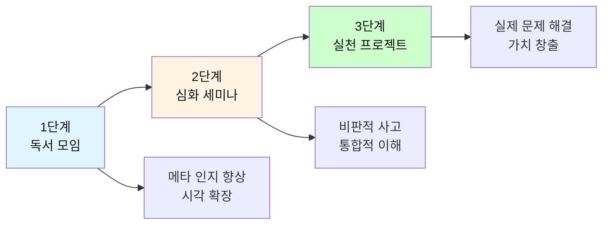
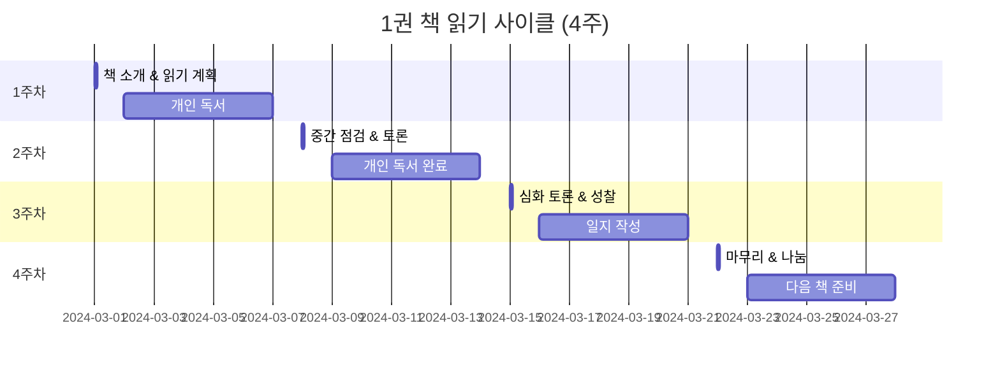

# 📖 단계별 독서 모임 실전 운영 가이드

> **핵심 철학**: 먼저 깊이 읽고 → 함께 생각하고 → 시각을 넓히고 → 그 다음에 실천한다
> 
> **목표**: 메타 인지 향상 + 시각 확장 → 이것이 독서 모임의 전부다

---

## 🎯 운영 철학: 작게 시작해서 깊게 성장하기

### 핵심 원칙



### 왜 단계별로 나누는가?

| 단계 | 기간 | 핵심 목표 | 왜 중요한가 |
|------|------|----------|-----------|
| **1단계<br/>독서 모임** | 12-16주 | • 메타 인지 향상<br/>• 시각 확장<br/>• 독서 습관 형성 | **기초 체력**을 만든다.<br/>생각하는 근육을 키운다. |
| **2단계<br/>심화 세미나** | 8-12주 | • 비판적 사고<br/>• 다양한 관점<br/>• 통합적 이해 | **깊이**를 만든다.<br/>표면을 넘어 본질을 본다. |
| **3단계<br/>실천 프로젝트** | 4-8주 | • 문제 발견<br/>• 솔루션 설계<br/>• 실제 실행 | **가치**를 만든다.<br/>생각을 현실로 바꾼다. |

**중요**: 1단계 없이 2단계로 가지 마세요. 2단계 없이 3단계로 가지 마세요.

---

## 📅 1단계: 독서 모임 (주 1회, 2시간, 12-16주)

### 1.1 목표 및 성과

```markdown
🎯 이 단계가 끝나면:

[학생이]
✅ 책을 읽으며 자신의 생각을 인식할 수 있다 (메타 인지)
✅ 같은 내용을 여러 관점에서 볼 수 있다 (시각 확장)
✅ 질문하는 습관이 생긴다
✅ 독서가 즐거워진다
✅ 성찰 일지를 자연스럽게 쓴다

[운영자가]
✅ 안정적인 모임 루틴을 만든다
✅ 참여자의 수준을 파악한다
✅ 신뢰와 안전감을 구축한다
✅ 2단계 진행 가능 여부를 판단한다
```

### 1.2 모집 및 준비

#### 적정 인원 (현실적)

| 학년 | 인원 | 이유 |
|------|------|------|
| 초등 3-4학년 | 4-5명 | 집중력 짧음, 소수로 밀착 관리 |
| 초등 5-6학년 | 5-6명 | 토론 가능, 하지만 여전히 작은 그룹 |
| 중학생 | 6-8명 | 사춘기, 침묵 많음, 중간 규모 |
| 고등학생 | 8-10명 | 학업 부담, 결석 대비 여유 |
| 대학생/성인 | 10-12명 | 자기 주도적, 큰 그룹 가능 |

#### 모집 공고 (단순 버전)

```markdown
📚 [○○ 독서 모임] 멤버 모집

함께 읽고, 생각을 나누는 모임입니다.

▶ 대상: ○○학년 (또는 ○○세 이상)
▶ 일정: 매주 ○요일 오후 ○시~○시 (2시간)
▶ 기간: ○월 ○일 ~ ○월 ○일 (총 12주)
▶ 장소: ○○○
▶ 인원: ○명 (선착순)

▶ 준비물: 없음 (책은 제공)
▶ 비용: 무료 (또는 ○만원)

▶ 활동:
  • 매주 책 읽기 (30-80페이지)
  • 함께 이야기 나누기
  • 간단한 일지 쓰기

▶ 신청: [링크] 또는 [연락처]
▶ 마감: ○월 ○일

※ 책을 좋아하지 않아도 괜찮습니다.
※ 말을 잘 못해도 괜찮습니다.
※ 편하게 오세요 :)
```

#### 신청서 (단순 버전)

```markdown
[독서 모임 신청서]

1. 이름: _______________
2. 학년 (또는 나이): _______________
3. 연락처: _______________

4. 최근에 읽은 책이 있나요? (없어도 됩니다)
   _______________________________________________

5. 독서 모임에 참여하고 싶은 이유는?
   _______________________________________________

6. 매주 ○요일 ○시에 참석 가능한가요?  □ 예  □ 아니오

7. 궁금한 점이나 하고 싶은 말:
   _______________________________________________
```

---

## 📘 1.3 책 선정 기준 (매우 중요)

### 1단계 책 선정 원칙

```markdown
✅ 해야 할 것:
━━━━━━━━━━━━━━━━━━
1. 난이도를 낮춰라 (참여자 수준보다 한 단계 아래)
2. 얇은 책을 선택하라 (200페이지 이하)
3. 생각할 거리가 많은 책 (정답이 없는)
4. 재미있는 책 (지루하면 실패)
5. 대화 소재가 풍부한 책

❌ 하지 말아야 할 것:
━━━━━━━━━━━━━━━━━━
1. 너무 어려운 책 (좌절감)
2. 너무 긴 책 (부담감)
3. 교훈적인 책 (재미없음)
4. 유명하지만 지루한 고전 (흥미 잃음)
5. 전문 서적 (1단계에는 부적합)
```

### 난이도별 책 선정 가이드

#### 초등 3-4학년 (12주 기준)

| 주차 | 책 제목 | 분량 | 선정 이유 | 핵심 질문 |
|------|---------|------|----------|----------|
| **1-3주** | 《마당을 나온 암탉》 | 150p | • 쉬운 동화<br/>• 공감 쉬움<br/>• 대화 풍부 | "자유란 뭘까?"<br/>"잎싹은 왜 그랬을까?" |
| **4-6주** | 《꽃들에게 희망을》 | 200p | • 짧은 글 모음<br/>• 일상적 주제<br/>• 감동적 | "가장 기억에 남는 이야기는?"<br/>"나에게 희망은?" |
| **7-9주** | 《불편해도 괜찮아》 | 180p | • 환경 주제<br/>• 실천 가능<br/>• 생각할 거리 | "내가 바꿀 수 있는 건?"<br/>"불편하면 안 되나?" |
| **10-12주** | 《아몬드》 | 280p | • 감정 탐구<br/>• 공감 연습<br/>• 깊이 있음 | "감정이 없으면?"<br/>"진짜 친구란?" |

#### 초등 5-6학년 (12주 기준)

| 주차 | 책 제목 | 분량 | 선정 이유 | 핵심 질문 |
|------|---------|------|----------|----------|
| **1-3주** | 《미움받을 용기》<br/>(청소년판) | 200p | • 대화 형식<br/>• 자존감<br/>• 철학적 | "나는 누구인가?"<br/>"남의 시선?" |
| **4-6주** | 《모모》 | 300p | • 시간의 의미<br/>• 현대 사회<br/>• 상상력 | "진짜 중요한 건?"<br/>"시간 도둑은?" |
| **7-9주** | 《나는 말랄라》 | 250p | • 실화<br/>• 교육의 가치<br/>• 용기 | "배움이란?"<br/>"나의 용기는?" |
| **10-12주** | 《긴긴밤》 | 160p | • 짧고 깊음<br/>• 우정<br/>• 성장 | "진짜 친구란?"<br/>"나의 긴긴밤은?" |

#### 중학생 (16주 기준)

| 주차 | 책 제목 | 분량 | 선정 이유 | 핵심 질문 |
|------|---------|------|----------|----------|
| **1-4주** | 《어린 왕자》 | 120p | • 쉬운 시작<br/>• 상징 풍부<br/>• 토론 좋음 | "어른이란?"<br/>"길들인다는 건?" |
| **5-8주** | 《난중일기》<br/>(발췌) | 150p | • 역사<br/>• 리더십<br/>• 인간미 | "리더란?"<br/>"어려움 극복?" |
| **9-12주** | 《총균쇠》<br/>(청소년판) | 250p | • 거시적 시각<br/>• 인류사<br/>• 통찰 | "왜 차이가?"<br/>"운명 vs 노력?" |
| **13-16주** | 《이기적 유전자》<br/>(발췌) | 200p | • 과학적 사고<br/>• 인간 이해<br/>• 깊이 | "이기심이란?"<br/>"인간 본성?" |

#### 고등학생 (16주 기준)

| 주차 | 책 제목 | 분량 | 선정 이유 | 핵심 질문 |
|------|---------|------|----------|----------|
| **1-4주** | 《죽음이란 무엇인가》<br/>(1-3장) | 150p | • 철학 입문<br/>• 삶의 의미<br/>• 논리적 | "죽음을 안다면?"<br/>"의미 있는 삶?" |
| **5-8주** | 《사피엔스》<br/>(1부) | 180p | • 인류사<br/>• 거시적 관점<br/>• 통찰 | "인간이란?"<br/>"허구의 힘?" |
| **9-12주** | 《정의란 무엇인가》<br/>(사례 중심) | 200p | • 윤리<br/>• 토론 활발<br/>• 실제 사례 | "정의란?"<br/>"나의 기준은?" |
| **13-16주** | 《생각에 관한 생각》<br/>(발췌) | 180p | • 메타 인지<br/>• 의사결정<br/>• 심리학 | "어떻게 생각하나?"<br/>"편향이란?" |

#### 대학생/성인 (16주 기준)

| 주차 | 책 제목 | 분량 | 선정 이유 | 핵심 질문 |
|------|---------|------|----------|----------|
| **1-4주** | 《마음의 법칙》 | 250p | • 동양 철학<br/>• 실용적<br/>• 깊이 | "마음이란?"<br/>"나를 어떻게?" |
| **5-8주** | 《넛지》 | 300p | • 행동 경제학<br/>• 실생활 적용<br/>• 통찰 | "선택이란?"<br/>"어떻게 유도?" |
| **9-12주** | 《총균쇠》 | 500p | • 거시적 역사<br/>• 통합적 시각<br/>• 깊이 | "문명의 차이?"<br/>"필연 vs 우연?" |
| **13-16주** | 《코스모스》 | 400p | • 우주적 관점<br/>• 겸손<br/>• 경이감 | "우주에서 인간?"<br/>"의미는?" |

### 책 선정 체크리스트

```markdown
□ 참여자 수준보다 약간 쉽다
□ 2-4주 안에 읽을 수 있다 (부담 없음)
□ 정답이 없는 질문을 던진다
□ 다양한 해석이 가능하다
□ 일상과 연결할 수 있다
□ 재미있다 (지루하지 않다)
□ 구하기 쉽다 (절판 아님)
□ 가격이 적당하다

선정 회의 시:
□ 3명 이상이 읽어봤다
□ 2명 이상이 "재미있다"고 평가
□ 1명 이상이 "토론 잘 될 것 같다"고 평가
```

---

## ⏰ 1.4 주차별 운영 계획 (매우 구체적)

### 표준 4주 사이클 (1권의 책)



---

## 📋 1.5 모임별 타임테이블 (2시간, 분 단위)

### 1주차: 책 소개 및 읽기 계획 (120분)

```markdown
🕐 타임테이블

00:00-00:15 (15분) | 체크인 & 웜업
━━━━━━━━━━━━━━━━━━━━━━━━
목표: 긴장 풀기, 관계 형성

활동:
• 간단한 근황 (돌아가며 1분씩)
• 질문: "요즘 뭐 재미있어요?"
• 분위기: 편안하게, 음악 활용

준비물:
• 간식, 음료
• 편안한 음악


00:15-00:35 (20분) | 책 소개
━━━━━━━━━━━━━━━━━━━━━━━━
목표: 책에 대한 흥미 유발

진행:
1. 퍼실리테이터가 책 간단 소개 (5분)
   - "이 책은 ○○에 관한 이야기예요"
   - "우리는 ○○에 대해 생각해볼 거예요"
   - 정보만 주고, 스포 금지

2. 책 표지 살펴보기 (5분)
   - "제목을 보고 무슨 내용일 것 같아요?"
   - "표지에서 뭐가 보여요?"
   - 자유롭게 추측하기

3. 목차 훑어보기 (5분)
   - 함께 목차 읽기
   - "어떤 장이 궁금해요?"
   - 기대감 형성

4. 저자 소개 (5분)
   - 저자가 누군지, 왜 이 책을 썼는지

준비물:
• 책 (인원수만큼)
• 목차 확대 인쇄물


00:35-00:50 (15분) | 읽기 계획 세우기
━━━━━━━━━━━━━━━━━━━━━━━━
목표: 스스로 계획 세우기 (메타 인지 시작)

활동:
1. 워크시트 작성 (10분)
   
   [독서 계획 워크시트]
   
   책 제목: ___________________
   전체 페이지: _______ 페이지
   
   Q. 다음 주까지 어디까지 읽을까요?
   → _______ 페이지까지 (목표는 낮게!)
   
   Q. 언제 읽을까요?
   □ 월요일 ___시  □ 화요일 ___시
   □ 수요일 ___시  □ 목요일 ___시
   □ 금요일 ___시  □ 토요일 ___시
   □ 일요일 ___시
   
   Q. 어디서 읽을까요?
   ___________________________
   
   Q. 읽으면서 하고 싶은 것?
   □ 메모하기  □ 포스트잇 붙이기
   □ 그냥 읽기  □ 소리 내어 읽기

2. 계획 공유 (5분)
   - 돌아가며 간단히 발표
   - "저는 매일 자기 전에 10페이지씩 읽을 거예요"

준비물:
• 독서 계획 워크시트


00:50-01:10 (20분) | 함께 읽기 체험
━━━━━━━━━━━━━━━━━━━━━━━━
목표: 읽는 방법 알려주기

활동:
1. 첫 부분 함께 읽기 (10분)
   - 한 명씩 돌아가며 소리 내어 읽기
   - 또는 조용히 각자 읽기
   - 5-10페이지 정도

2. 읽으며 생각 나누기 (10분)
   - "지금까지 읽고 어떤 생각이 들어요?"
   - "궁금한 게 있어요?"
   - "재미있어요? 지루해요?"
   
   → 정답 없음, 솔직한 반응 환영


01:10-01:40 (30분) | 메타 인지 연습
━━━━━━━━━━━━━━━━━━━━━━━━
목표: "내가 어떻게 생각하는지" 알아차리기

활동:
1. 설명 (5분)
   퍼실리테이터:
   "메타 인지라는 말 들어봤어요?
   이건 '내 생각을 생각하는 것'이에요.
   
   예를 들어,
   - 책을 읽으면서 '아, 나 지금 딴생각하네' → 이게 메타 인지
   - '이 부분이 이해 안 돼' → 이것도 메타 인지
   - '아, 나는 이런 내용이 재미없구나' → 이것도 메타 인지
   
   자기 생각을 알아차리는 거예요."

2. 실습: 5분간 조용히 읽기 (5분)
   - 타이머 5분 설정
   - 각자 조용히 읽기
   - 읽으면서 자신을 관찰하기

3. 메타 인지 나누기 (15분)
   
   질문 (쉬운 것만):
   • "5분 동안 딴생각한 사람?"
   • "어떤 딴생각했어요?"
   • "이해 안 되는 부분 있었어요?"
   • "재미있었어요? 지루했어요?"
   • "읽는 속도가 빨랐어요? 느렸어요?"
   • "읽으면서 무슨 느낌이 들었어요?"
   
   → 자기 관찰이 메타 인지의 시작

4. 정리 (5분)
   "앞으로 책 읽을 때, 가끔 멈춰서
   '나 지금 뭘 생각하지?'
   이렇게 자신에게 물어보세요.
   
   이게 메타 인지 연습이에요!"

준비물:
• 타이머
• 메타 인지 설명 카드


01:40-01:55 (15분) | 독서 일지 쓰기 안내
━━━━━━━━━━━━━━━━━━━━━━━━
목표: 간단한 일지 작성법 알려주기

활동:
1. 독서 일지 양식 소개 (5분)
   
   [초급 버전 - 초등 저학년]
   
   날짜: __________
   읽은 페이지: _____ ~ _____
   
   그림 그리기:
   (가장 기억에 남는 장면을 그려요)
   
   한 줄 쓰기:
   _____________________________

   
   [중급 버전 - 초등 고학년, 중학생]
   
   날짜: __________
   읽은 페이지: _____ ~ _____
   
   기억에 남는 문장:
   "_____________________________"
   
   내 생각:
   _____________________________
   _____________________________
   
   궁금한 점:
   _____________________________

   
   [고급 버전 - 고등학생 이상]
   
   날짜: __________
   읽은 페이지: _____ ~ _____
   
   핵심 내용 요약:
   _____________________________
   
   새로운 관점 / 통찰:
   _____________________________
   
   나의 경험과 연결:
   _____________________________
   
   질문:
   _____________________________

2. 실습 (5분)
   - 방금 읽은 부분에 대해 간단히 쓰기

3. 공유 (5분)
   - 2-3명 발표

준비물:
• 독서 일지 양식 (인쇄물 또는 노트)
• 필기구, 색연필


01:55-02:00 (5분) | 체크아웃
━━━━━━━━━━━━━━━━━━━━━━━━
목표: 기분 좋게 마무리

활동:
• 한 단어로 오늘 표현하기
• 다음 주 일정 확인
• 단체 사진

퍼실리테이터:
"다음 주까지 ___페이지까지 읽어오세요!
독서 일지도 간단하게라도 써보세요.
다음 주에 만나요!" 👋
```

---

### 2주차: 중간 점검 및 토론 (120분)

```markdown
🕐 타임테이블

00:00-00:10 (10분) | 체크인
━━━━━━━━━━━━━━━━━━━━━━━━
• 출석 체크
• 독서 진행 상황 간단히 공유
• "어디까지 읽었어요?"


00:10-00:30 (20분) | 독서 경험 나누기
━━━━━━━━━━━━━━━━━━━━━━━━
목표: 메타 인지 실천 확인

질문 (쉬운 것부터):
━━━━━━━━━━━━━━━━━━
1. "계획대로 읽었어요?" (솔직하게!)
   • 예 → "어떻게 했어요?"
   • 아니오 → "왜 못 읽었어요?"
   
2. "읽으면서 어땠어요?"
   • 재미있었어요? 지루했어요?
   • 쉬웠어요? 어려웠어요?
   • 이해됐어요? 헷갈렸어요?

3. "딴생각 많이 했어요?" (메타 인지)
   • 무슨 생각했어요?
   • 왜 딴생각했을까요?

4. "독서 일지 썼어요?"
   • 쓰면서 어떤 느낌이었어요?
   • 쓰기 어려웠어요?

→ 비판 금지, 솔직함 환영
→ 못 읽은 사람도 괜찮음


00:30-00:50 (20분) | 내용 이해 확인
━━━━━━━━━━━━━━━━━━━━━━━━
목표: 같은 내용을 읽었는지 확인

활동:
1. 줄거리 함께 정리 (10분)
   - 화이트보드에 타임라인 그리기
   - "어떤 일이 일어났죠?"
   - 함께 기억 맞춰가기

2. 중요 장면 공유 (10분)
   - "어떤 장면이 기억에 남아요?"
   - 포스트잇에 적어서 붙이기
   - 비슷한 장면끼리 묶기


00:50-01:30 (40분) | 쉬운 질문으로 대화하기
━━━━━━━━━━━━━━━━━━━━━━━━
목표: 시각 확장 (여러 관점 듣기)

⚠️ 중요: 질문은 매우 쉽게!

[레벨 1: 사실 질문] (10분)
━━━━━━━━━━━━━━━━━━
• "주인공은 누구예요?"
• "어디서 일어난 일이에요?"
• "무슨 일이 일어났어요?"
• "언제 일어났어요?"

→ 정답 있음, 틀려도 괜찮음


[레벨 2: 감정 질문] (15분)
━━━━━━━━━━━━━━━━━━
• "주인공은 어떤 기분이었을까요?"
• "여러분이 주인공이면 어떤 기분일 것 같아요?"
• "어떤 장면에서 기분이 좋았어요? 안 좋았어요?"

→ 정답 없음, 느낌 중요


[레벨 3: 이유 질문] (15분)
━━━━━━━━━━━━━━━━━━
• "주인공은 왜 그랬을까요?"
• "왜 그런 일이 일어났을까요?"

퍼실리테이터 스킬:
→ 한 명이 답하면: "다른 분은 어떻게 생각해요?"
→ 다양한 의견: "오, 의견이 다르네요. 재미있어요!"
→ 침묵: "저는 이렇게 생각하는데, 여러분은요?"


01:30-01:50 (20분) | 시각 확장 연습
━━━━━━━━━━━━━━━━━━━━━━━━
목표: 다른 관점 경험하기

활동: "관점 바꿔 생각하기"

1. 인물 카드 나눠주기
   예: 《마당을 나온 암탉》
   - 잎싹 카드
   - 나그네 카드
   - 초록이 카드
   - 족제비 카드
   - 양계장 주인 카드

2. 각자 맡은 인물 관점에서 생각하기 (5분)
   질문: "이 인물은 이 상황을 어떻게 봤을까요?"

3. 돌아가며 발표 (10분)
   "저는 ○○○ 관점에서는..."

4. 정리 (5분)
   "같은 상황인데 관점이 다 다르죠?
   이게 시각 확장이에요!"


01:50-02:00 (10분) | 정리 & 과제
━━━━━━━━━━━━━━━━━━━━━━━━
• 오늘 배운 점 한 줄씩
• 다음 주 과제: 책 끝까지 읽기
• 독서 일지 계속 쓰기
```

---

### 3주차: 심화 토론 및 성찰 (120분)

```markdown
🕐 타임테이블

00:00-00:10 (10분) | 체크인
━━━━━━━━━━━━━━━━━━━━━━━━
• 책 다 읽었는지 확인
• 전체적인 느낌 한 줄씩


00:10-00:30 (20분) | 전체 정리
━━━━━━━━━━━━━━━━━━━━━━━━
• 처음부터 끝까지 흐름 정리
• 중요 사건 타임라인
• 혹시 이해 안 되는 부분?


00:30-01:20 (50분) | 심화 질문 토론
━━━━━━━━━━━━━━━━━━━━━━━━
⚠️ 여전히 쉬운 질문부터!

[1라운드: 해석 질문] (15분)
━━━━━━━━━━━━━━━━━━
• "이 책은 무엇에 관한 이야기인가요?"
• "작가가 하고 싶은 말은 뭘까요?"
• "제목은 무슨 의미일까요?"

[2라운드: 적용 질문] (20분)
━━━━━━━━━━━━━━━━━━
• "나와 비슷한 경험이 있나요?"
• "내 주변에 이런 사람 있나요?"
• "나라면 어떻게 했을까요?"

→ 이때 시각 확장!
→ "다른 분은 다르게 했을 것 같나요?"


[3라운드: 평가 질문] (15분)
━━━━━━━━━━━━━━━━━━
• "주인공의 선택이 좋았나요?"
• "이 결말이 좋은가요?"
• "다른 결말이 가능했을까요?"

→ 옳고 그름이 아니라 근거 중요
→ "왜 그렇게 생각해요?"


01:20-01:50 (30분) | 성찰 활동
━━━━━━━━━━━━━━━━━━━━━━━━
목표: 책에서 나로

활동: "나에게 묻기"

1. 개인 워크 (15분)
   
   [성찰 워크시트]
   
   이 책을 읽고 나는...
   
   Q1. 무엇을 새롭게 알았나요?
   _____________________________
   
   Q2. 어떤 생각이 바뀌었나요?
       (바뀌지 않았어도 괜찮음)
   _____________________________
   
   Q3. 나에게 이 책은 무슨 의미인가요?
   _____________________________
   
   Q4. 이 책을 읽기 전의 나 vs 읽은 후의 나
       뭐가 달라졌나요?
       (안 달라졌어도 괜찮음)
   _____________________________

2. 소그룹 나눔 (15분)
   - 3-4명씩 그룹
   - 각자 워크시트 공유
   - 경청만, 조언 금지


01:50-02:00 (10분) | 마무리
━━━━━━━━━━━━━━━━━━━━━━━━
• 이 책에 별점 주기 (⭐⭐⭐⭐⭐)
• 다음 주 안내: 마지막 모임, 자유 발표
• 과제: 최종 독서 일지 작성
```

---

### 4주차: 마무리 및 나눔 (120분)

```markdown
🕐 타임테이블

00:00-00:10 (10분) | 체크인
━━━━━━━━━━━━━━━━━━━━━━━━
• 4주간의 여정 돌아보기
• 소감 한 줄씩


00:10-01:00 (50분) | 자유 발표
━━━━━━━━━━━━━━━━━━━━━━━━
목표: 자기 방식으로 표현하기

각자 준비한 것 발표 (5분씩)

발표 주제 (자유 선택):
━━━━━━━━━━━━━━━━━━
□ 가장 인상 깊은 장면 소개
□ 책 리뷰
□ 등장인물 분석
□ 그림으로 표현
□ 편지 쓰기 (등장인물에게)
□ 속편 상상하기
□ 나의 독서 일지 발표
□ 기타 창의적 표현

→ 부담 없이, 형식 자유
→ 못 준비했어도 괜찮음 (즉석 발표 OK)


01:00-01:30 (30분) | 메타 인지 점검
━━━━━━━━━━━━━━━━━━━━━━━━
목표: 4주간 나의 변화 인식

활동: "4주 전 나 vs 지금 나"

1. 개인 워크 (15분)
   
   [메타 인지 체크리스트]
   
   4주 전 나는...
   
   독서:
   □ 책 읽기 싫었다  □ 그저 그랬다  □ 좋아했다
   
   지금 나는...
   □ 책 읽기 싫다  □ 그저 그렇다  □ 좋아한다
   
   ━━━━━━━━━━━━━━━━━━━━━━━━
   
   4주 전 나는... 책을 읽을 때
   □ 그냥 읽었다
   □ 딴생각을 알아차리지 못했다
   □ 이해 안 돼도 그냥 넘어갔다
   
   지금 나는... 책을 읽을 때
   □ 생각하며 읽는다
   □ 딴생각을 알아차린다
   □ 이해 안 되면 다시 읽거나 물어본다
   
   ━━━━━━━━━━━━━━━━━━━━━━━━
   
   4주 전 나는...
   □ 내 의견이 정답이라고 생각했다
   □ 다른 의견은 별로 관심 없었다
   
   지금 나는...
   □ 여러 관점이 있다는 걸 안다
   □ 다른 의견이 궁금하다
   
   ━━━━━━━━━━━━━━━━━━━━━━━━
   
   가장 크게 변한 것:
   _____________________________

2. 전체 나눔 (15분)
   - 돌아가며 발표
   - 변화 축하하기


01:30-01:50 (20분) | 다음 책 선정
━━━━━━━━━━━━━━━━━━━━━━━━
• 다음 책 후보 3권 소개
• 투표로 선정
• 다음 4주 일정 안내


01:50-02:00 (10분) | 체크아웃
━━━━━━━━━━━━━━━━━━━━━━━━
• 4주를 한 단어로 표현
• 단체 사진
• 간단한 간식 나눔
```

---

## 💬 1.6 퍼실리테이터 스크립트 모음

### 자주 쓰는 질문 (난이도별)

#### 레벨 1: 매우 쉬운 질문 (초등 저학년, 독서 초보)

```markdown
[사실 질문]
━━━━━━━━━━━━━━━━━━
• "누가 나왔어요?"
• "어디에서 일어난 일이에요?"
• "무슨 일이 일어났어요?"
• "언제 일어났어요?"
• "어떻게 되었어요?"

[느낌 질문]
━━━━━━━━━━━━━━━━━━
• "재미있었어요? 지루했어요?"
• "어떤 장면이 기억에 남아요?"
• "슬펐어요? 기뻤어요?"
• "주인공이 불쌍했어요? 멋있었어요?"

[선택 질문]
━━━━━━━━━━━━━━━━━━
• "A와 B 중 어떤 게 더 좋아요?"
• "이 결말이 좋아요? 저 결말이 좋아요?"
• "주인공이 잘했어요? 못했어요?"
```

#### 레벨 2: 쉬운 질문 (초등 고학년, 중학생)

```markdown
[이유 질문]
━━━━━━━━━━━━━━━━━━
• "왜 그랬을까요?"
• "왜 그런 일이 일어났을까요?"
• "왜 그렇게 생각해요?"

[비교 질문]
━━━━━━━━━━━━━━━━━━
• "A와 B는 어떻게 다른가요?"
• "처음과 끝이 어떻게 달라졌나요?"
• "나와 주인공은 어떻게 다른가요?"

[상상 질문]
━━━━━━━━━━━━━━━━━━
• "만약 내가 주인공이라면?"
• "만약 결말이 달랐다면?"
• "만약 이 상황이 지금 일어난다면?"
```

#### 레벨 3: 중간 질문 (고등학생)

```markdown
[해석 질문]
━━━━━━━━━━━━━━━━━━
• "이 이야기는 무엇에 관한 것일까요?"
• "작가가 전하고 싶은 메시지는?"
• "이 상징은 무엇을 의미할까요?"

[평가 질문]
━━━━━━━━━━━━━━━━━━
• "이 선택이 옳았나요?"
• "이 방법이 최선이었나요?"
• "다른 방법은 없었을까요?"

[연결 질문]
━━━━━━━━━━━━━━━━━━
• "이것이 현실에서는 어떻게 나타나나요?"
• "역사적 사건과 어떻게 연결되나요?"
• "다른 책과 어떻게 비슷한가요?"
```

#### 레벨 4: 어려운 질문 (대학생, 성인)

```markdown
[본질 질문]
━━━━━━━━━━━━━━━━━━
• "근본적으로 이것은 무엇에 관한 것인가?"
• "이 문제의 본질은 무엇인가?"
• "우리는 무엇을 놓치고 있는가?"

[메타 질문]
━━━━━━━━━━━━━━━━━━
• "왜 우리는 이렇게 생각하는가?"
• "우리의 전제는 무엇인가?"
• "이 질문 자체가 적절한가?"

[통합 질문]
━━━━━━━━━━━━━━━━━━
• "이것이 더 큰 맥락에서 어떤 의미인가?"
• "여러 관점을 통합하면?"
• "이것이 우리 삶에 어떤 시사점을 주는가?"
```

### 상황별 대응 스크립트

#### 상황 1: 아무도 말이 없을 때

```markdown
❌ 나쁜 대응:
"왜 아무도 대답 안 해요? 책 안 읽었어요?"

✅ 좋은 대응:

[옵션 A: 질문 쉽게 바꾸기]
"제 질문이 어려웠나 봐요. 
다시 물어볼게요. 
이 장면에서 주인공이 슬펐을까요, 화났을까요?"

[옵션 B: 먼저 답하기]
"어려운 질문이죠? 
저는 이렇게 생각하는데요...
여러분은 어떻게 생각해요?"

[옵션 C: 개인 지목]
"○○아, 너는 어떻게 생각해?
틀려도 괜찮아, 그냥 느낀 대로 말해봐."

[옵션 D: 글로 먼저 쓰기]
"말하기 어려우면, 
먼저 포스트잇에 써볼까요?
그 다음에 붙이면서 얘기해요."
```

#### 상황 2: 한 명만 계속 말할 때

```markdown
❌ 나쁜 대응:
"○○만 계속 말하지 말고 다른 사람도 시켜주세요."

✅ 좋은 대응:

[부드러운 리디렉션]
"○○ 의견 고마워요. 정말 좋은 생각이네요.
다른 분들은 어떻게 생각하세요?
특히 △△씨는 어떻게 생각하세요?"

[돌아가며 말하기 제안]
"좋아요, 이번에는 돌아가며 
한 명씩 말해볼까요?
○○부터 시작해서 시계 방향으로."

[글로 먼저 쓰기]
"모두의 생각을 듣고 싶으니까,
일단 각자 포스트잇에 써볼까요?
그 다음에 한 명씩 발표해요."
```

#### 상황 3: "모르겠어요" 라고 할 때

```markdown
❌ 나쁜 대응:
"책을 안 읽었구나. 다음에는 꼭 읽어와."

✅ 좋은 대응:

[구체화하기]
"괜찮아요. 어떤 부분이 모르겠어요?
내용이 이해 안 돼요?
아니면 질문이 어려워요?"

[선택지 주기]
"그럼 이렇게 물어볼게요.
A였을까요, B였을까요?"

[느낌으로 접근]
"그럼 내용은 제쳐두고,
읽으면서 어떤 느낌이었어요?
재미있었어요? 지루했어요?"

[경험으로 연결]
"책 내용 말고, 
혹시 비슷한 경험 있어요?"
```

#### 상황 4: 책을 안 읽어왔을 때

```markdown
❌ 나쁜 대응:
"왜 안 읽었어요? 약속 안 지키면 어떡해요?"

✅ 좋은 대응:

[이유 파악]
"무슨 일 있었어요? 
바빴어요? 
아니면 책이 재미없었어요?"

[메타 인지로 전환]
"왜 못 읽었는지 생각해봤어요?
다음에는 어떻게 하면 읽을 수 있을까요?"

[부담 줄이기]
"괜찮아요. 
다음 주에는 분량을 좀 줄여볼까요?
몇 페이지면 읽을 수 있을 것 같아요?"

[참여 방법 변경]
"안 읽었어도 괜찮아요.
대신 다른 사람들 이야기 들으면서
질문해주세요.
듣는 것도 참여예요."
```

#### 상황 5: 엉뚱한 대답을 할 때

```markdown
❌ 나쁜 대응:
"그건 아닌 것 같은데요. 다시 생각해보세요."

✅ 좋은 대응:

[일단 인정]
"오, 그렇게 생각했구나. 흥미로운데?
왜 그렇게 생각했어요?"

[연결 찾기]
"책 내용이랑은 좀 다른데,
혹시 어떤 부분에서 그런 생각이 들었어요?"

[다른 의견 묻기]
"○○은 이렇게 생각했어요.
다른 분들은 어떻게 생각하세요?
비슷해요? 달라요?"

[배움의 기회로]
"왜 다른 생각을 했을까요?
우리 함께 다시 그 부분 읽어볼까요?"
```

---

## 📊 1.7 평가 및 피드백 (간소화)

### 평가하지 마세요 (1단계에서는)

```markdown
🚫 1단계에서 평가하지 말 것:
━━━━━━━━━━━━━━━━━━━━━━━━
• 독서 능력
• 이해 수준
• 발표 실력
• 글쓰기 실력
• 참여도를 점수로 환산

✅ 1단계에서 관찰할 것:
━━━━━━━━━━━━━━━━━━━━━━━━
• 즐거워하는가?
• 자발적으로 참여하는가?
• 조금씩 변화하는가?
• 안전하다고 느끼는가?
• 계속 오고 싶어 하는가?
```

### 대신, 이렇게 피드백하세요

```markdown
[개인 피드백 (4주마다)]
━━━━━━━━━━━━━━━━━━━━━━━━

○○에게

4주 동안 함께해서 즐거웠어요!

제가 본 ○○의 모습:
• _____________________ (구체적 관찰)
• _____________________ (긍정적 변화)
• _____________________ (특별한 순간)

다음 4주는:
• _____________________ (응원 메시지)

- 퍼실리테이터 △△
```

### 학기말 간단 성찰

```markdown
[12-16주 마지막 날]

함께 돌아보기:

Q1. 처음과 지금, 뭐가 달라졌나요?
Q2. 가장 기억에 남는 순간은?
Q3. 가장 좋았던 책은?
Q4. 내가 성장한 부분은?
Q5. 다음 학기에도 할래요?

→ 이것만으로 충분합니다.
```

---

## 🎓 1.8 1단계 종료 및 2단계 전환

### 2단계로 가기 전 체크리스트

```markdown
✅ 다음 항목을 80% 이상 달성했나요?

[참여자]
━━━━━━━━━━━━━━━━━━━━━━━━
□ 12-16주 중 80% 이상 출석
□ 책 읽기를 즐거워함 (또는 싫어하지 않음)
□ 자기 생각을 말할 수 있음 (조금이라도)
□ 다른 의견을 듣는 태도가 생김
□ 독서 일지를 쓸 수 있음 (아주 간단하게라도)

[모임]
━━━━━━━━━━━━━━━━━━━━━━━━
□ 안전하고 존중하는 분위기
□ 참여자 간 신뢰 형성
□ 토론이 자연스럽게 이루어짐
□ 퍼실리테이터 개입이 줄어듦
□ 참여자가 계속하기를 원함

→ 이 조건이 충족되면 2단계로!
→ 아니면 1단계를 더 반복하세요.
```

### 2단계 예고

```markdown
[1단계 마지막 날 안내]

퍼실리테이터:
"여러분, 12주 동안 정말 많이 성장했어요!

1단계에서 우리는:
• 함께 책 읽는 법을 배웠어요
• 자기 생각을 알아차리는 법을 배웠어요 (메타 인지)
• 여러 관점으로 보는 법을 배웠어요 (시각 확장)

2단계에서는:
• 더 깊이 생각해볼 거예요
• 책과 책을 연결해볼 거예요
• 비판적으로 생각하는 법을 배울 거예요
• 세미나 형식으로 진행돼요

관심 있는 분은 신청해주세요!

※ 1단계만 하고 싶은 분도 괜찮아요.
  여러분은 이미 충분히 성장했어요!"
```

---

## 📚 2단계: 심화 세미나 (8-12주) - 간략 소개

### 2.1 1단계와의 차이점

| 구분 | 1단계 독서 모임 | 2단계 심화 세미나 |
|------|---------------|-----------------|
| **목표** | 메타 인지, 시각 확장 | 비판적 사고, 통합적 이해 |
| **책** | 쉽고 재미있는 책 | 어렵고 깊은 책 |
| **진행** | 퍼실리테이터 주도 | 참여자 주도 |
| **활동** | 질문 답하기 | 질문 만들기 |
| **시간** | 2시간 | 2-3시간 |
| **부담** | 낮음 | 중간 |
| **결과** | 독서 습관, 생각하는 근육 | 깊이 있는 통찰, 비판적 분석 |

### 2.2 책 선정 예시

```markdown
[고등학생 2단계]
━━━━━━━━━━━━━━━━━━
• 《사피엔스》 전체
• 《정의란 무엇인가》 전체
• 《총균쇠》 전체
• 《코스모스》 선택 장

[대학생 2단계]
━━━━━━━━━━━━━━━━━━
• 《국부론》 발췌
• 《종의 기원》 발췌
• 《순수이성비판》 입문서
• 《자본론》 입문서
```

### 2.3 세미나 방식

```markdown
[주차별 운영]
━━━━━━━━━━━━━━━━━━
• 1주차: 개인 독서 + 발제자 선정
• 2주차: 발제 + 전체 토론
• 3주차: 소그룹 심화 토론
• 4주차: 통합 세미나 + 논평

[발제자 역할]
━━━━━━━━━━━━━━━━━━
• 핵심 내용 요약 (10분)
• 논점 제시 (3-5개)
• 토론 질문 준비
• 참고 자료 제공

※ 자세한 내용은 별도 매뉴얼 참조
```

---

## 🛠️ 3단계: 실천 프로젝트 (4-8주) - 간략 소개

### 3.1 2단계와의 차이점

| 구분 | 2단계 심화 세미나 | 3단계 실천 프로젝트 |
|------|----------------|------------------|
| **목표** | 깊이 이해하기 | 문제 해결하기 |
| **활동** | 토론, 분석 | 기획, 실행 |
| **결과물** | 발제문, 논평 | MVP, 솔루션 |
| **기간** | 8-12주 | 4-8주 |
| **강도** | 중간 | 높음 |

### 3.2 진행 개요

```markdown
[4주 프로세스]
━━━━━━━━━━━━━━━━━━
• 1주차: 문제 발견 (책에서 출발)
• 2주차: 솔루션 설계 (아이디어)
• 3주차: MVP 제작 (빠르게)
• 4주차: 발표 & 피드백

※ 자세한 내용은 "운영_매뉴얼.md" 참조
```

---

## ⚠️ 운영 시 주의사항

### 하지 말아야 할 것

```markdown
❌ 너무 어려운 책 선정
   → 좌절하고 떠남

❌ 완벽한 답 요구
   → 말하기 두려워짐

❌ 참여 강요
   → 반감 생김

❌ 비교 평가
   → 경쟁 구도, 신뢰 깨짐

❌ 1단계를 건너뛰기
   → 기초 없이 무너짐

❌ 과도한 과제
   → 부담, 이탈
```

### 꼭 해야 할 것

```markdown
✅ 안전한 분위기 만들기
   → "틀려도 괜찮아요"
   → "말 안 해도 괜찮아요"
   → "책 안 읽어와도 괜찮아요 (하지만 다음엔 읽어오기)"

✅ 퍼실리테이터가 먼저 취약성 보이기
   → "저도 이 부분 이해 안 됐어요"
   → "저도 책 읽다가 딴생각 많이 했어요"

✅ 작은 변화 축하하기
   → "오, 지난주보다 더 깊은 생각이네요!"
   → "처음으로 질문했네요, 멋져요!"

✅ 천천히 가기
   → 급하게 진도 나가지 않기
   → 이해 안 되면 다시 설명
   → 속도는 가장 느린 사람 기준

✅ 재미 우선
   → 지루하면 과감히 활동 변경
   → 게임, 역할극 등 활용
   → 간식, 음악 등 분위기 조성
```

---

## 📋 부록: 핵심 양식 모음

### A. 독서 계획 워크시트

```markdown
[독서 계획 워크시트]

이름: _______________
책 제목: _______________
전체 페이지: _______ 페이지

Q1. 다음 주까지 어디까지 읽을까요?
    → _______ 페이지까지
    
    (tip: 목표는 낮게! 달성 가능하게!)

Q2. 언제 읽을까요? (구체적으로)
    □ 월요일 ___시 (___분)
    □ 화요일 ___시 (___분)
    □ 수요일 ___시 (___분)
    □ 목요일 ___시 (___분)
    □ 금요일 ___시 (___분)
    □ 토요일 ___시 (___분)
    □ 일요일 ___시 (___분)

Q3. 어디서 읽을까요?
    ______________________________

Q4. 읽으면서 하고 싶은 것은?
    □ 중요한 부분에 밑줄 그기
    □ 포스트잇에 메모하기
    □ 독서 일지에 바로 쓰기
    □ 그냥 읽기
    □ 소리 내어 읽기
```

### B. 독서 일지 (레벨별)

```markdown
[초급: 초등 저학년]
━━━━━━━━━━━━━━━━━━━━━━━━

날짜: __________
읽은 페이지: _____ ~ _____

그림 그리기:
(가장 기억에 남는 장면을 그려요)


한 줄 쓰기:
_____________________________________


─────────────────────────

[중급: 초등 고학년, 중학생]
━━━━━━━━━━━━━━━━━━━━━━━━

날짜: __________
읽은 페이지: _____ ~ _____

기억에 남는 문장:
"____________________________________"

왜 이 문장이 기억에 남았나요?
_____________________________________

내 생각:
_____________________________________
_____________________________________

궁금한 점:
_____________________________________


─────────────────────────

[고급: 고등학생 이상]
━━━━━━━━━━━━━━━━━━━━━━━━

날짜: __________
읽은 페이지: _____ ~ _____

[내용 요약]
_____________________________________
_____________________________________

[새로운 관점 / 통찰]
_____________________________________
_____________________________________

[나의 경험과 연결]
_____________________________________
_____________________________________

[질문]
_____________________________________
_____________________________________

[메타 인지 체크]
읽으면서:
□ 집중했다  □ 딴생각 많이 했다
□ 이해됐다  □ 이해 안 됐다
□ 재미있었다  □ 지루했다
```

### C. 메타 인지 체크리스트

```markdown
[메타 인지 자가 점검]

이름: _______________
날짜: _______________

책을 읽을 때, 나는...

[1. 주의 알아차리기]
□ 딴생각하는 것을 알아차렸다
□ 집중력이 떨어지는 것을 느꼈다
□ 다시 집중하려고 노력했다

[2. 이해 점검하기]
□ 이해 안 되는 부분을 알아차렸다
□ 다시 읽었다
□ 질문을 적어두었다

[3. 전략 사용하기]
□ 중요한 부분에 표시했다
□ 메모하며 읽었다
□ 요약하며 읽었다

[4. 자기 반응 인식하기]
□ 감정 변화를 느꼈다 (슬픔, 기쁨 등)
□ 내 경험과 연결했다
□ 새로운 생각이 들었다

→ 체크가 많을수록 메타 인지가 잘 되고 있어요!
```

### D. 4주 마무리 성찰 시트

```markdown
[4주 성찰하기]

이름: _______________
책 제목: _______________

Q1. 이 책을 한 문장으로 표현하면?
_____________________________________

Q2. 가장 인상 깊었던 부분은?
_____________________________________

Q3. 이 책을 읽고 새롭게 알게 된 것은?
_____________________________________

Q4. 이 책을 읽고 달라진 생각이 있나요?
_____________________________________

Q5. 이 책에 별점을 준다면? (⭐⭐⭐⭐⭐)
    ★★★★★ (5점 만점)
    
    이유: _____________________________

Q6. 이 책을 누구에게 추천하고 싶나요?
_____________________________________

Q7. 이 책을 읽은 나에게 한 마디:
_____________________________________
```

---

## 🎯 마무리: 성공의 핵심

### 1단계에서 가장 중요한 것

```markdown
1. 즐거움
   → 재미있어야 계속한다

2. 안전함
   → 안전해야 말한다

3. 작은 성장
   → 조금씩이라도 변화한다

4. 관계
   → 사람 때문에 온다

5. 습관
   → 루틴이 만들어진다

━━━━━━━━━━━━━━━━━━━━━━━━

이 5가지만 지키면
1단계는 성공입니다.

나머지는 2단계, 3단계에서!
```

### 퍼실리테이터에게

```markdown
당신은 교사가 아닙니다.
당신은 평가자가 아닙니다.
당신은 전문가가 아닙니다.

당신은:
• 함께 배우는 동료입니다
• 안전한 공간을 만드는 사람입니다
• 성장을 응원하는 사람입니다

완벽하지 않아도 괜찮습니다.
실수해도 괜찮습니다.
모르는 것이 있어도 괜찮습니다.

참여자들과 함께
천천히, 즐겁게
성장하면 됩니다.

화이팅! 📚
```

---

**이 가이드는 실전 경험을 바탕으로 계속 업데이트됩니다.**
**운영하며 배운 것들을 추가해주세요!**
