# 독서 중점학교 & 인문학 실천학교 운영 종합 가이드

> 서울시교육청 「독서·토론·인문학 교육 2030 추진 계획」 기반  
> 제안서 작성 및 필독서 선정 참고 자료

---

## 📑 목차

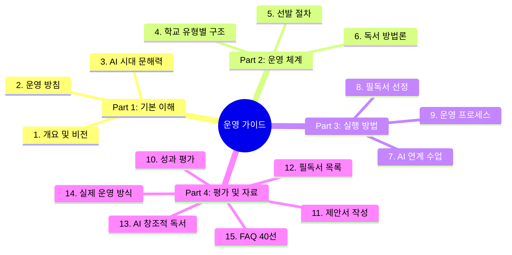
```mermaid
mindmap
  root((운영 가이드))
    Part 1: 기본 이해
      1. 개요 및 비전
      2. 운영 방침
      3. AI 시대 문해력
    Part 2: 운영 체계
      4. 학교 유형별 구조
      5. 선발 절차
      6. 독서 방법론
    Part 3: 실행 방법
      7. AI 연계 수업
      8. 필독서 선정
      9. 운영 프로세스
    Part 4: 평가 및 자료
      10. 성과 평가
      11. 제안서 작성
      12. 필독서 목록
      13. AI 창조적 독서
      14. 실제 운영 방식
      15. FAQ 40선
```

| 장 | 제목 | 주요 내용 | 대상 |
|----|------|----------|------|
| **📘 Part 1: 기본 이해** | | | |
| 1️⃣ | [개요 및 비전](#1-개요-및-비전) | 추진 배경, 비전, 4대 중점 과제 | 전체 |
| 2️⃣ | [운영 방침](#2-운영-방침) | 핵심 원칙, 핵심 개념 20 | 전체 |
| 3️⃣ | [AI 시대 문해력과 통찰력](#3-ai-시대-문해력과-직관적-통찰력) | 문해력 재정의, 통찰력 개발 | 교사·관리자 |
| **📗 Part 2: 운영 체계** | | | |
| 4️⃣ | [학교 유형별 운영 구조](#4-학교-유형별-운영-구조) | 독서중점학교, 인문학실천학교 | 관리자 |
| 5️⃣ | [선발 절차 및 기준](#5-선발-절차-및-기준) | 신청 방법, 평가 기준, 지원 내용 | 신청 학교 |
| 6️⃣ | [독서 방법론 - 개념탐독](#6-독서-방법론---개념-기반-탐구-독서) | 개념탐독 4단계, 교과 통합 | 교사 |
| **📙 Part 3: 실행 방법** | | | |
| 7️⃣ | [AI 연계 수업 설계](#7-ai-연계-수업-설계) | AI 활용 원칙, 단계별 모델, 윤리 교육 | 교사 |
| 8️⃣ | [책 선택 기준 및 필독서 선정](#8-책-선택-기준-및-필독서-선정) | 선정 기준, 학교급별 가이드 | 독서교육팀 |
| 9️⃣ | [운영 프로세스](#9-운영-프로세스) | 연간 계획, 주간 루틴, 독서 모임 | 독서교육팀 |
| **📕 Part 4: 평가 및 실전** | | | |
| 🔟 | [결과물 및 성과 평가](#10-결과물-및-성과-평가) | 평가 지표, 배지 제도, 보고서 | 관리자·교사 |
| 1️⃣1️⃣ | [제안서 작성 가이드](#11-제안서-작성-가이드) | 제안서 구조, 유의사항, 예산 | 신청 학교 |
| 1️⃣2️⃣ | [추천 필독서 목록](#12-추천-필독서-목록) | 학교급별·개념별 필독서 | 교사·학생 |
| 1️⃣3️⃣ | [AI 시대 창조적 독서 방법론](#13-ai-시대-창조적-독서-방법론-읽고-쓰고-책-만들기) | 10장 요약법, AI 협업, 책 쓰기 | 교사·학생 |
| 1️⃣4️⃣ | [실제 운영 방식](#14-독서중점학교--인문학실천학교-실제-운영-방식) | 운영 사례, 성공 요인 | 관리자·교사 |
| 1️⃣5️⃣ | [자주 묻는 질문 FAQ 40](#15-자주-묻는-질문-faq-40선) | 제도, 운영, 컨텐츠, 평가 | 전체 |

---

## 1. 개요 및 비전

### 1.1 추진 배경

- **문해력 위기 대응**: AI·디지털 시대 학생들의 읽기·쓰기·이해 능력 저하 심각
- **깊이 있는 학습 필요**: 2022 개정 교육과정의 핵심 개념 중심 학습 구현
- **인문학적 소양 강화**: 비판적 사고력, 공감력, 글로벌 감수성 함양

### 1.2 비전

**"책 읽는 학교, 책 읽는 마을, 책 읽는 서울"**

학교뿐 아니라 지역사회 전체에서 독서·인문학 문화가 일상화되는 생태계 구축

### 1.3 4대 중점 추진 과제

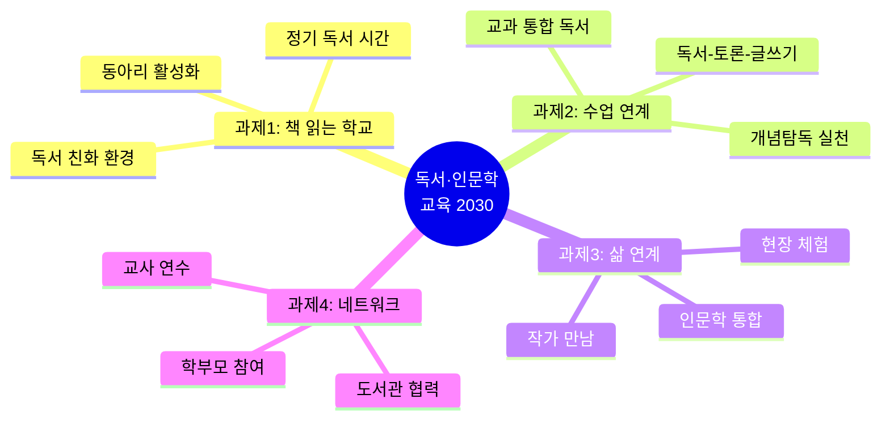
```mermaid
mindmap
  root((독서·인문학<br/>교육 2030))
    과제1: 책 읽는 학교
      독서 친화 환경
      정기 독서 시간
      동아리 활성화
    과제2: 수업 연계
      교과 통합 독서
      개념탐독 실천
      독서-토론-글쓰기
    과제3: 삶 연계
      인문학 통합
      현장 체험
      작가 만남
    과제4: 네트워크
      도서관 협력
      학부모 참여
      교사 연수
```

| 과제 | 핵심 전략 | 주요 활동 | 기대 효과 |
|------|----------|-----------|----------|
| **📚 책 읽는<br/>학교 문화** | 물리적·시간적<br/>환경 조성 | • 독서 친화 공간 구축<br/>• 정기 독서 시간 확보<br/>• 독서 동아리 운영 | 학교 전체의<br/>독서 문화 정착 |
| **📖 수업 연계<br/>독서교육** | 교육과정 통합<br/>체계 구축 | • 교과 통합 독서 수업<br/>• 개념탐독 실천<br/>• 독서-토론-글쓰기 연계 | 깊이 있는<br/>학습 실현 |
| **🎭 삶 연계<br/>인문학 교육** | 실제 삶과<br/>연결 | • 인문학 요소 통합<br/>• 현장 체험 학습<br/>• 작가 초청 강연 | 의미 있는<br/>배움 경험 |
| **🤝 네트워크<br/>구축** | 지역사회<br/>협력 체계 | • 도서관 협력<br/>• 학부모 참여<br/>• 교사 연수 | 지속 가능한<br/>생태계 조성 |

---

## 2. 운영 방침

### 2.1 핵심 원칙

| 원칙 | 세부 내용 |
|------|-----------|
| **문해력 강화** | 단순 읽기를 넘어 비판·분석·사고력을 포함하는 깊이 있는 독서 교육 |
| **인문학적 가치** | 정체성, 윤리, 사유, 역사, 문화 등 다층적 인간 이해 중심 |
| **자율성과 참여** | 학생·교사 주체성 높은 프로그램 설계, 공동 의사결정 |
| **다양성과 균형** | 국내외 고전/현대, 문학/비문학, 다양한 분야 아우름 |
| **지속 가능성** | 연간·학기 단위 정기 프로그램, 일회성 행사 지양 |
| **성과 평가와 피드백** | 독서 후 활동 결과물 창출 및 피드백을 통한 개선 순환 |

### 2.2 서울 독서교육 핵심 개념 20

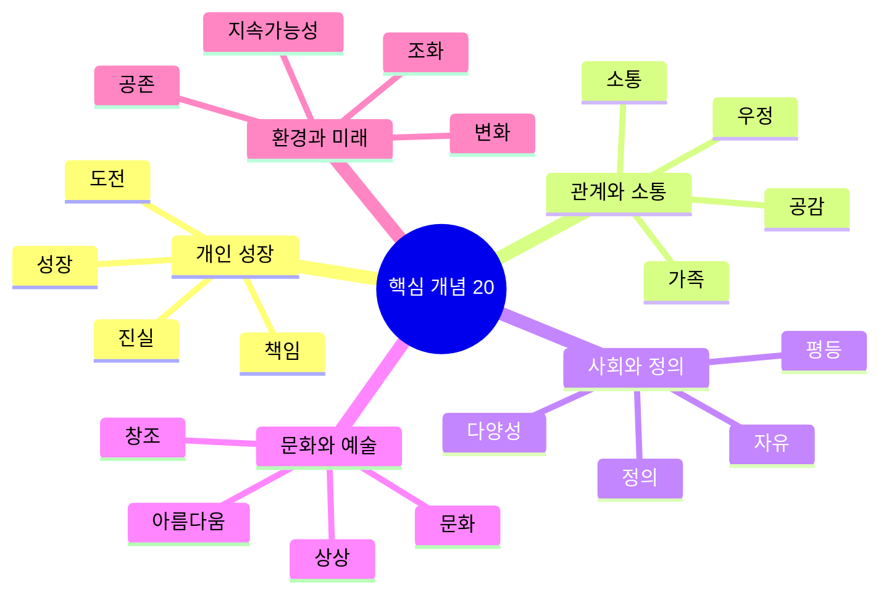
```mermaid
mindmap
  root((핵심 개념 20))
    개인 성장
      성장
      책임
      도전
      진실
    관계와 소통
      소통
      공감
      우정
      가족
    사회와 정의
      정의
      평등
      자유
      다양성
    문화와 예술
      상상
      문화
      아름다움
      창조
    환경과 미래
      변화
      지속가능성
      공존
      조화
```

| 영역 | 핵심 개념 | 관련 도서 예시 | 탐구 질문 |
|------|----------|--------------|----------|
| **🌱 개인 성장** | 성장, 책임, 도전, 진실 | 『마당을 나온 암탉』<br/>『데미안』 | 진정한 성장이란?<br/>책임의 의미는? |
| **🤝 관계와 소통** | 소통, 공감, 우정, 가족 | 『샬롯의 거미줄』<br/>『완득이』 | 진정한 우정이란?<br/>소통의 힘은? |
| **⚖️ 사회와 정의** | 정의, 평등, 자유, 다양성 | 『정의란 무엇인가』<br/>『1984』 | 정의로운 사회란?<br/>자유의 조건은? |
| **🎨 문화와 예술** | 상상, 문화, 아름다움, 창조 | 『어린 왕자』<br/>『미학 오디세이』 | 예술의 가치는?<br/>상상력이란? |
| **🌍 환경과 미래** | 변화, 지속가능성, 공존, 조화 | 『침묵의 봄』<br/>『사피엔스』 | 지속가능한 미래는?<br/>인간과 자연은? |

> **💡 수업 설계 원칙**: 각 개념과 연계된 도서를 읽고 **탐구 → 적용 → 전이** 과정으로 수업 진행

---

## 3. AI 시대 문해력과 직관적 통찰력

### 3.1 AI 시대 문해력의 재정의

전통적 문해력(읽기·쓰기)에서 **확장된 문해력**으로의 전환이 필요합니다.

#### 전통적 문해력 vs AI 시대 문해력

| 구분 | 전통적 문해력 | AI 시대 문해력 |
|------|--------------|----------------|
| **읽기 대상** | 종이책, 교과서 | 디지털 텍스트, AI 생성 콘텐츠, 멀티미디어 |
| **이해 방식** | 단순 이해 및 암기 | 비판적 분석, 출처 검증, 진위 판별 |
| **쓰기 방식** | 수기 작성 | AI 협업 작성, 프롬프트 설계 |
| **정보 처리** | 선형적 읽기 | 하이퍼링크, 네트워크형 사고 |
| **소통 방식** | 일방향 소통 | 상호작용, 협업, 공유 |

#### AI 시대 문해력의 5대 핵심 요소

```
1. 디지털 문해력 (Digital Literacy)
   └─ 다양한 디지털 매체에서 정보를 읽고 쓰고 활용하는 능력

2. 비판적 문해력 (Critical Literacy)
   └─ 정보의 출처, 의도, 편향성을 분석하고 평가하는 능력

3. AI 문해력 (AI Literacy)
   └─ AI 생성 콘텐츠를 식별하고, AI와 효과적으로 협업하는 능력

4. 멀티미디어 문해력 (Multimedia Literacy)
   └─ 텍스트, 이미지, 영상, 음성 등 복합 매체를 이해하고 제작하는 능력

5. 데이터 문해력 (Data Literacy)
   └─ 데이터와 통계를 읽고 해석하고 활용하는 능력
```

### 3.2 직관적 통찰력의 정의와 중요성

#### 직관적 통찰력이란?

```
직관적 통찰력 (Intuitive Insight)
= 표면적 정보를 넘어 본질을 꿰뚫어 보는 능력
= 패턴 인식 + 개념 연결 + 창의적 도약
```

**AI 시대에 왜 통찰력이 중요한가?**

| 이유 | 설명 |
|------|------|
| **AI가 할 수 없는 영역** | AI는 데이터 기반 분석은 잘하지만, 맥락 이해·가치 판단·창의적 통합은 인간의 고유 영역 |
| **복잡한 문제 해결** | 단순 알고리즘으로 해결 안 되는 문제는 직관과 통찰이 필요 |
| **의미 창조** | 정보를 지혜로 전환하는 과정에서 통찰력 필수 |
| **윤리적 판단** | 기술 활용의 윤리적 방향 설정은 인간의 통찰에 의존 |

#### 직관적 통찰력의 4가지 구성 요소

```
1. 패턴 인식 (Pattern Recognition)
   - 표면적으로 다른 현상에서 공통 패턴 발견
   - 유추와 비유를 통한 개념 연결
   - 예: "호랑이는 사자와 비슷하다" → "권력 구조는 생태계와 비슷하다"

2. 본질 파악 (Essence Grasping)
   - 핵심 개념과 원리 이해
   - 지엽적 정보에서 중심 아이디어 추출
   - 예: 『1984』 → 표면: 미래 소설 / 본질: 권력과 자유의 대립

3. 관계 연결 (Connection Making)
   - 서로 다른 영역의 지식 통합
   - 교과 간, 책 간, 경험 간 연결
   - 예: 생물학(진화) + 경제학(경쟁) → 시장 진화론 이해

4. 창의적 도약 (Creative Leap)
   - 기존 틀을 벗어난 새로운 관점 제시
   - 문제를 다르게 정의하기
   - 예: "가난은 개인 문제다" → "가난은 구조 문제다"
```

### 3.3 목표 체계: AI 시대 문해력 × 통찰력

#### 통합 목표 프레임워크

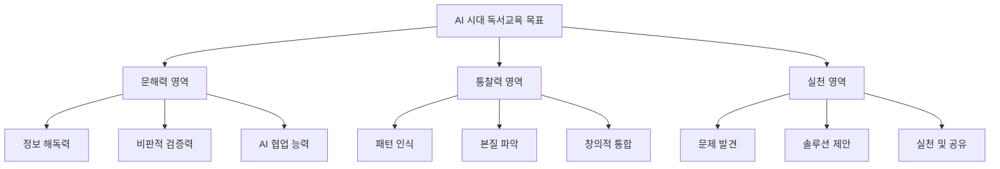
```mermaid
graph TD
    A[AI 시대 독서교육 목표] --> B[문해력 영역]
    A --> C[통찰력 영역]
    A --> D[실천 영역]
    
    B --> B1[정보 해독력]
    B --> B2[비판적 검증력]
    B --> B3[AI 협업 능력]
    
    C --> C1[패턴 인식]
    C --> C2[본질 파악]
    C --> C3[창의적 통합]
    
    D --> D1[문제 발견]
    D --> D2[솔루션 제안]
    D --> D3[실천 및 공유]
```

#### 학교급별 세부 목표

| 학교급 | 문해력 목표 | 통찰력 목표 | 실천 목표 |
|--------|-------------|-------------|-----------|
| **초등** | - 다양한 매체에서 정보 읽기<br>- 사실과 의견 구분<br>- 기본 디지털 도구 활용 | - 이야기 속 패턴 찾기<br>- 인물의 마음 이해하기<br>- 내 경험과 연결하기 | - 독서 일기 쓰기<br>- 친구와 생각 나누기<br>- 읽은 내용 실천하기 |
| **중등** | - 출처 및 신뢰성 평가<br>- 다양한 관점 비교<br>- AI 생성 콘텐츠 식별 | - 텍스트의 숨은 의미 찾기<br>- 개념 간 관계 이해<br>- 사회 문제와 연결하기 | - 토론 및 주장 글쓰기<br>- 프로젝트 수행<br>- 지역사회 문제 탐구 |
| **고등** | - 복잡한 논리 분석<br>- 미디어 편향 비평<br>- AI와 협업하여 글쓰기 | - 철학적 본질 탐구<br>- 학문 간 융합 사고<br>- 새로운 관점 창출 | - 학술적 에세이 작성<br>- 사회 실천 프로젝트<br>- 진로와 연계한 탐구 |

### 3.4 직관력 개발을 위한 독서 전략

#### 전략 1: 질문 중심 읽기 (Question-Based Reading)

**3단계 질문 기법**

```
[1단계] 표면 질문 (Surface Questions)
- 누가? 무엇을? 언제? 어디서?
- 예: 주인공은 누구인가? 사건은 언제 일어났는가?

[2단계] 해석 질문 (Interpretive Questions)
- 왜? 어떻게?
- 예: 주인공은 왜 그런 선택을 했는가?
     작가는 무엇을 말하고 싶은가?

[3단계] 통찰 질문 (Insight Questions)
- 만약...라면? 이것은 무엇을 의미하는가?
- 예: 이 이야기가 현대 사회에 주는 교훈은?
     나라면 어떻게 했을까?
```

#### 전략 2: 개념 맵핑 (Concept Mapping)

```
[책 제목]
    ↓
[핵심 개념 추출]
    ↓
[다른 책/경험과 연결]
    ↓
[새로운 통찰 도출]

예시:
『사피엔스』
    ↓
협력, 상상력, 이야기의 힘
    ↓
『1984』(이야기를 통한 지배)
내 경험(집단의 힘)
    ↓
통찰: 인간은 이야기로 세상을 만들고 지배한다
```

#### 전략 3: 비유적 사고 (Analogical Thinking)

```
이 책/개념은 ~와 같다

예시:
- 『동물농장』은 권력의 부패를 동물 사회로 비유
- "독재는 암세포 같다" → 건강한 세포(민주주의)를 잠식
- "교육은 씨앗을 뿌리는 것과 같다" → 성장의 기초
```

**비유 발견 훈련**
1. 책에서 은유·상징 찾기
2. 그 의미를 현실에 적용하기
3. 자신만의 비유 만들기

#### 전략 4: 관점 전환 읽기 (Perspective Shifting)

```
동일한 텍스트를 다양한 관점으로 재해석

예: 『빨간 모자』
- 어린이 관점: 무서운 늑대 이야기
- 심리학 관점: 성장과 위험 인식
- 페미니즘 관점: 여성에 대한 경고와 통제
- 생태학 관점: 인간과 자연의 관계

→ 다양한 관점 = 풍부한 통찰
```

### 3.5 통찰력 측정 및 평가

#### 정성적 평가 기준

| 수준 | 특징 | 평가 기준 |
|------|------|-----------|
| **1수준<br>(표면 이해)** | 줄거리와 정보 이해 | - 사실 정보를 정확히 파악함<br>- 기본적인 내용 요약 가능 |
| **2수준<br>(해석)** | 의미 해석 및 분석 | - 작가의 의도 파악<br>- 인물의 동기 이해<br>- 주제 설명 가능 |
| **3수준<br>(비판)** | 비판적 평가 | - 텍스트의 논리 평가<br>- 다른 관점과 비교<br>- 한계 지적 가능 |
| **4수준<br>(통찰)** | 새로운 의미 창출 | - 다른 영역과 연결<br>- 자신만의 해석 제시<br>- 실천 방안 도출 |

#### 통찰력 평가 루브릭

```
[평가 영역 1] 패턴 인식 능력
□ 서로 다른 텍스트에서 공통 패턴을 발견하는가?
□ 비유와 상징을 이해하고 해석하는가?

[평가 영역 2] 본질 파악 능력
□ 표면 정보를 넘어 핵심 개념을 추출하는가?
□ 주제와 메시지를 명확히 설명하는가?

[평가 영역 3] 연결 능력
□ 책의 내용을 자신의 경험과 연결하는가?
□ 다른 교과나 사회 문제와 연계하는가?

[평가 영역 4] 창의적 사고
□ 기존과 다른 새로운 해석을 제시하는가?
□ 독창적인 질문이나 관점을 보여주는가?
```

### 3.6 AI 시대 독서교육의 궁극적 목표

#### 목표 피라미드

```
                   [지혜로운 시민]
                  사회 기여·가치 창출
                 /                    \
           [비판적 사고자]          [창의적 실천가]
          정보 검증·윤리 판단      문제 해결·혁신
         /                                        \
    [능동적 독자]                              [AI 협업자]
   깊이 있는 읽기                          기술 활용 역량
   /                                                      \
[기본 문해력]                                        [디지털 문해력]
읽기·쓰기·이해                                    디지털 도구 활용
```

#### 최종 도달 목표

```
학생은 독서를 통해...

1. 정보를 지혜로 전환하는 능력을 갖춘다
2. 복잡한 세계를 이해하고 의미를 찾는다
3. 타인과 공감하고 윤리적으로 판단한다
4. AI와 협업하여 문제를 해결한다
5. 지속적으로 배우고 성장하는 태도를 갖춘다
```

---

## 4. 학교 유형별 운영 구조

### 4.1 독서 중점학교 (초등·중학교)

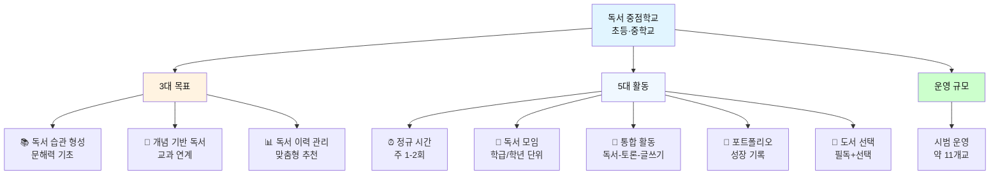
```mermaid
graph TD
    A[독서 중점학교<br/>초등·중학교] --> B[3대 목표]
    A --> C[5대 활동]
    A --> D[운영 규모]
    
    B --> B1[📚 독서 습관 형성<br/>문해력 기초]
    B --> B2[🔗 개념 기반 독서<br/>교과 연계]
    B --> B3[📊 독서 이력 관리<br/>맞춤형 추천]
    
    C --> C1[⏰ 정규 시간<br/>주 1-2회]
    C --> C2[👥 독서 모임<br/>학급/학년 단위]
    C --> C3[💬 통합 활동<br/>독서-토론-글쓰기]
    C --> C4[📂 포트폴리오<br/>성장 기록]
    C --> C5[📖 도서 선택<br/>필독+선택]
    
    D --> D1[시범 운영<br/>약 11개교]
    
    style A fill:#e1f5ff,color:#111
    style B fill:#fff3e1,color:#111
    style C fill:#f0f8ff,color:#111
    style D fill:#ccffcc,color:#111
```

| 구분 | 세부 내용 |
|------|----------|
| **🎯 핵심 목표** | • 독서 습관 형성 및 문해력 기초 다지기<br/>• 개념 기반 독서를 통한 교과 연계 학습<br/>• 독서 이력 관리 및 맞춤형 도서 추천 |
| **📅 주요 활동** | • 정규 수업 시간 내 독서 시간 확보 (주 1~2회)<br/>• 학급/학년 단위 독서 모임 운영<br/>• 독서-토론-글쓰기 통합 활동<br/>• 독서 포트폴리오 작성<br/>• 공통 필독서 + 개인 선택서 병행 |
| **📍 운영 규모** | 초·중학교 약 11개교 (시범 운영) |
| **⏱️ 독서 시간** | 주당 최소 90분 이상 |
| **📚 독서량 목표** | 초등: 연 20-30권 / 중등: 연 15-20권 |

---

### 4.2 인문학 실천학교 (고등학교)

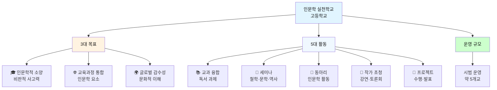
```mermaid
graph TD
    A[인문학 실천학교<br/>고등학교] --> B[3대 목표]
    A --> C[5대 활동]
    A --> D[운영 규모]
    
    B --> B1[🎓 인문학적 소양<br/>비판적 사고력]
    B --> B2[🌐 교육과정 통합<br/>인문학 요소]
    B --> B3[🌍 글로벌 감수성<br/>문화적 이해]
    
    C --> C1[📚 교과 융합<br/>독서 과제]
    C --> C2[💭 세미나<br/>철학·문학·역사]
    C --> C3[👥 동아리<br/>인문학 활동]
    C --> C4[🎤 작가 초청<br/>강연·토론회]
    C --> C5[🎯 프로젝트<br/>수행·발표]
    
    D --> D1[시범 운영<br/>약 5개교]
    
    style A fill:#e1f5ff,color:#111
    style B fill:#fff3e1,color:#111
    style C fill:#f0f8ff,color:#111
    style D fill:#ccffcc,color:#111
```

| 구분 | 세부 내용 |
|------|----------|
| **🎯 핵심 목표** | • 인문학적 소양 및 비판적 사고력 심화<br/>• 학교 환경과 교육과정 전반에 인문학 요소 통합<br/>• 글로벌 감수성 및 문화적 이해력 증진 |
| **📅 주요 활동** | • 교과 융합 독서 과제 (국어, 사회, 역사, 윤리 등)<br/>• 철학·문학·역사 세미나 운영 (월 2-4회)<br/>• 인문학 동아리 활동 활성화<br/>• 작가 초청 강연 및 토론회 (학기당 2-3회)<br/>• 인문학 프로젝트 수행 및 발표 |
| **📍 운영 규모** | 고등학교 약 5개교 (시범 운영) |
| **⏱️ 세미나 시간** | 주당 2-3시간 |
| **📚 독서량 목표** | 연 12-15권 (고전 포함) |
| **📝 결과물** | 인문학 논문, 심화 에세이, 프로젝트 |

### 4.3 개념 탐독 실천 교실

**목표**
- 학급·교과 단위 소규모 실천 조직
- 개념 기반 탐구 독서 수업 모델 개발 및 공유

**운영 규모** (시범)
- 초·중·고 통틀어 약 60팀

---

## 5. 선발 절차 및 기준

### 5.1 선발 프로세스

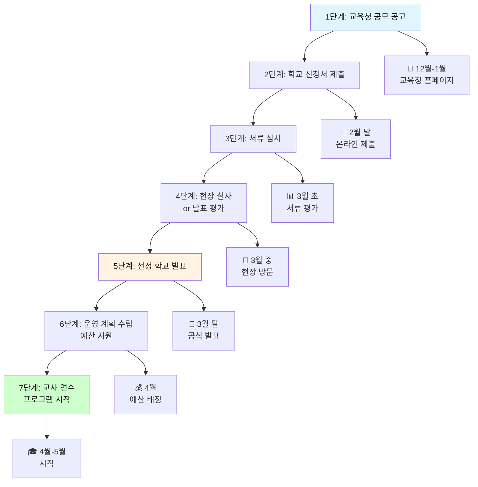
```mermaid
flowchart TD
    A[1단계: 교육청 공모 공고] --> B[2단계: 학교 신청서 제출]
    B --> C[3단계: 서류 심사]
    C --> D[4단계: 현장 실사<br/>or 발표 평가]
    D --> E[5단계: 선정 학교 발표]
    E --> F[6단계: 운영 계획 수립<br/>예산 지원]
    F --> G[7단계: 교사 연수<br/>프로그램 시작]
    
    A --> A1[📅 12월-1월<br/>교육청 홈페이지]
    B --> B1[📝 2월 말<br/>온라인 제출]
    C --> C1[📊 3월 초<br/>서류 평가]
    D --> D1[🏫 3월 중<br/>현장 방문]
    E --> E1[📢 3월 말<br/>공식 발표]
    F --> F1[💰 4월<br/>예산 배정]
    G --> G1[🎓 4월-5월<br/>시작]
    
    style A fill:#e1f5ff,color:#111
    style E fill:#fff3e1,color:#111
    style G fill:#ccffcc,color:#111
```

| 단계 | 시기 | 주요 내용 | 소요 시간 | 담당 |
|------|------|----------|----------|------|
| **1️⃣ 공모 공고** | 12월-1월 | 교육청 홈페이지 공고<br/>설명회 개최 | 2주 | 교육청 |
| **2️⃣ 신청서 제출** | 2월 말 | 제안서 온라인 제출<br/>필수 서류 첨부 | 1개월 | 학교 |
| **3️⃣ 서류 심사** | 3월 초 | 제안서 평가 (5개 영역)<br/>기준 점수 이상 선별 | 1주 | 평가위원 |
| **4️⃣ 현장 실사** | 3월 중 | 학교 방문 평가<br/>발표 및 질의응답 | 2주 | 평가위원 |
| **5️⃣ 선정 발표** | 3월 말 | 최종 선정 학교 공식 발표 | - | 교육청 |
| **6️⃣ 계획 수립** | 4월 | 세부 운영 계획 확정<br/>예산 배정 및 집행 | 2주 | 학교+교육청 |
| **7️⃣ 연수 & 시작** | 4-5월 | 교사 연수 실시<br/>프로그램 시작 | 1개월 | 학교 |

### 5.2 선발 평가 기준

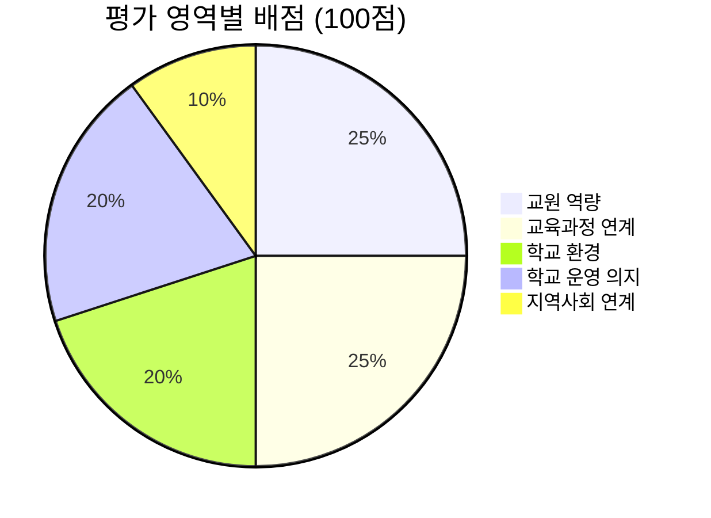
```mermaid
pie title 평가 영역별 배점 (100점)
    "교원 역량" : 25
    "교육과정 연계" : 25
    "학교 환경" : 20
    "학교 운영 의지" : 20
    "지역사회 연계" : 10
```

| 평가 영역 | 배점 | 세부 평가 항목 | 평가 방법 |
|-----------|------|--------------|----------|
| **🏫 학교 환경** | 20점 | • 독서 친화적 공간 확보 여부 (10점)<br/>• 도서관 시설 및 장서 구성 (5점)<br/>• 독서 공간 활용 계획의 구체성 (5점) | 현장 실사<br/>사진 자료 |
| **👨‍🏫 교원 역량** | 25점 | • 독서교육 경험 교사 비율 (10점)<br/>• 교사 연수 참여 의지 (8점)<br/>• 인문학적 소양 및 전문성 (7점) | 교사 명단<br/>경력 확인 |
| **📚 교육과정 연계** | 25점 | • 교과 통합 독서 수업 계획 (10점)<br/>• 핵심 개념 연계 방안 (8점)<br/>• 연간 독서교육 운영 계획 (7점) | 제안서 평가<br/>발표 심사 |
| **💪 학교 운영 의지** | 20점 | • 학교장 추진 의지 및 리더십 (8점)<br/>• 교육공동체 합의 정도 (7점)<br/>• 예산 확보 및 지원 계획 (5점) | 학교장 면담<br/>회의록 확인 |
| **🤝 지역사회 연계** | 10점 | • 공공도서관 협력 체계 (4점)<br/>• 학부모 참여 방안 (3점)<br/>• 지역 인문학 자원 활용 (3점) | 협약서<br/>계획서 |
| **➕ 가산점** | +8점 | • 독서교육 우수 사례 (+5점)<br/>• 교육 소외 지역 (+3점) | 실적 증빙 |

**✅ 선정 기준**
- 총점 70점 이상: 선정 대상
- 총점 60-69점: 조건부 선정 (보완 계획 제출 후 재심사)
- 총점 60점 미만: 미선정

### 5.3 지원 내용

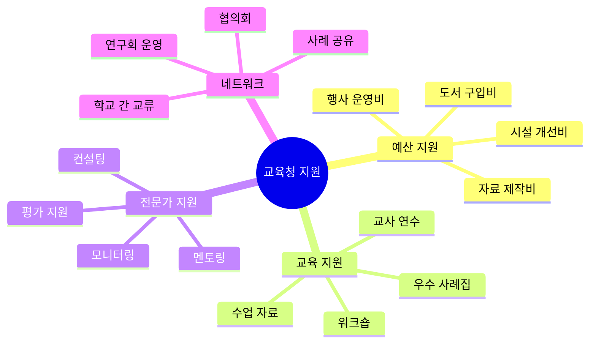
```mermaid
mindmap
  root((교육청 지원))
    예산 지원
      도서 구입비
      행사 운영비
      자료 제작비
      시설 개선비
    교육 지원
      교사 연수
      워크숍
      수업 자료
      우수 사례집
    전문가 지원
      컨설팅
      모니터링
      멘토링
      평가 지원
    네트워크
      협의회
      사례 공유
      학교 간 교류
      연구회 운영
```

| 지원 유형 | 세부 내용 | 지원 시기 | 비고 |
|----------|----------|----------|------|
| **💰 예산 지원** | • 도서 구입비 (40-50%)<br/>• 행사 운영비 (20-30%)<br/>• 자료 제작비 (10-15%)<br/>• 시설 개선비 (15-20%)<br/>• 연수비 (5-10%) | 연초 일괄<br/>+ 학기별 정산 | 총 1,000만원<br/>~3,000만원<br/>(학교급별 차등) |
| **🎓 교사 연수** | • 독서교육 방법론 (15시간)<br/>• 개념탐독 수업 설계 (15시간)<br/>• AI 연계 독서 교육 (10시간)<br/>• 평가 및 기록 (5시간) | 연 3-4회<br/>(학기별) | 연수 이수<br/>시간 인정 |
| **👨‍🏫 컨설팅** | • 교육청 전문가 학교 방문<br/>• 프로그램 운영 자문<br/>• 수업 참관 및 피드백<br/>• 문제 해결 지원 | 학기당 2-3회 | 무료 지원 |
| **🤝 네트워크** | • 시범학교 간 협의회 (월 1회)<br/>• 우수 사례 공유회 (학기당 1회)<br/>• 학교 간 상호 방문<br/>• 온라인 커뮤니티 운영 | 연중 상시 | 온·오프라인 |
| **📚 자료 지원** | • 수업 자료 제공<br/>• 우수 사례집 배부<br/>• 평가 도구 제공<br/>• 디지털 콘텐츠 접근 | 연중 | 온라인 플랫폼 |

**🎁 추가 혜택**
- 우수 학교 선정 시 인센티브 예산 추가 지원
- 교사 가산점 부여 (승진, 전보)
- 학교 홍보 및 언론 보도 지원
- 전국 사례 발표 기회 제공

---

## 6. 독서 방법론 - 개념 기반 탐구 독서

### 6.1 개념탐독(개념 기반 탐구 독서)이란?

교과 핵심 개념이나 인문학적 개념을 중심으로  
**질문 생성 → 도서 탐독 → 현실 적용 → 전이(Transfer)**  
과정을 거치는 깊이 있는 독서 학습 방법

### 6.2 개념탐독 4단계 프로세스

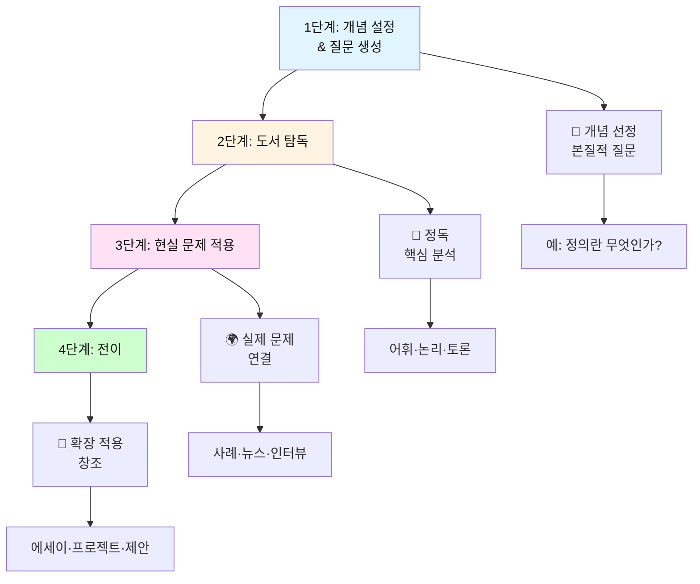
```mermaid
flowchart TD
    A[1단계: 개념 설정<br/>& 질문 생성] --> B[2단계: 도서 탐독]
    B --> C[3단계: 현실 문제 적용]
    C --> D[4단계: 전이]
    
    A --> A1[📌 개념 선정<br/>본질적 질문]
    A1 --> A2[예: 정의란 무엇인가?]
    
    B --> B1[📖 정독<br/>핵심 분석]
    B1 --> B2[어휘·논리·토론]
    
    C --> C1[🌍 실제 문제<br/>연결]
    C1 --> C2[사례·뉴스·인터뷰]
    
    D --> D1[🚀 확장 적용<br/>창조]
    D1 --> D2[에세이·프로젝트·제안]
    
    style A fill:#e1f5ff,color:#111
    style B fill:#fff3e1,color:#111
    style C fill:#ffe1f5,color:#111
    style D fill:#ccffcc,color:#111
```

---

#### 1️⃣ 1단계: 개념 설정 및 질문 생성

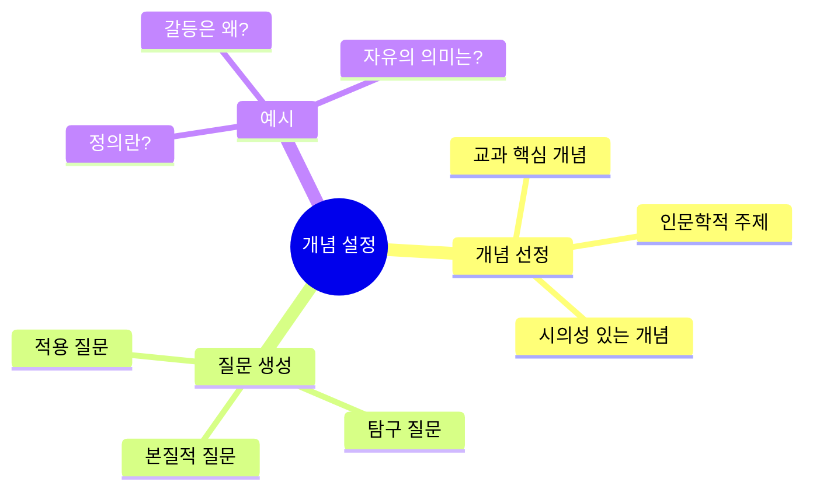
```mermaid
mindmap
  root((개념 설정))
    개념 선정
      교과 핵심 개념
      인문학적 주제
      시의성 있는 개념
    질문 생성
      본질적 질문
      탐구 질문
      적용 질문
    예시
      정의란?
      갈등은 왜?
      자유의 의미는?
```

| 단계 | 활동 | 예시 | 소요 시간 |
|------|------|------|----------|
| **개념 선정** | 교과서, 교육과정 분석<br/>학생 관심사 조사 | • 도덕: 갈등, 공존, 조화<br/>• 사회: 정의, 평등<br/>• 국어: 성장, 정체성 | 1-2시간 |
| **질문 생성** | 본질적 질문 만들기<br/>학생과 함께 토론 | • "정의란 무엇인가?"<br/>• "갈등은 왜 발생하는가?"<br/>• "진정한 자유란?" | 1시간 |
| **도서 연결** | 개념과 관련된 도서 선정 | 정의 → 『정의란 무엇인가』<br/>갈등 → 『미움받을 용기』 | 1시간 |

**💡 활동 예시: 초등 6학년 도덕 수업**
```
핵심 개념: 갈등, 공존, 조화
본질적 질문: "우리 사회의 갈등은 어떻게 해결할 수 있을까?"
관련 도서: 『완득이』, 『채식주의자』
```

---

#### 2️⃣ 2단계: 도서 탐독

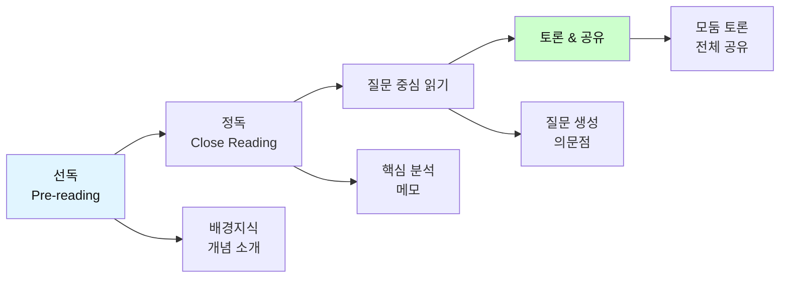
```mermaid
graph LR
    A[선독<br/>Pre-reading] --> B[정독<br/>Close Reading]
    B --> C[질문 중심 읽기]
    C --> D[토론 & 공유]
    
    A --> A1[배경지식<br/>개념 소개]
    B --> B1[핵심 분석<br/>메모]
    C --> C1[질문 생성<br/>의문점]
    D --> D1[모둠 토론<br/>전체 공유]
    
    style A fill:#e1f5ff,color:#111
    style D fill:#ccffcc,color:#111
```

| 독서 방법 | 활동 내용 | 교사 역할 | 학생 활동 |
|----------|----------|----------|----------|
| **📚 선독<br/>(Pre-reading)** | • 배경지식 제공<br/>• 주요 개념 소개<br/>• 읽기 목표 설정 | 개념 설명<br/>읽기 가이드 제공 | 배경지식 활성화<br/>질문 준비 |
| **🔍 정독<br/>(Close Reading)** | • 핵심 문장·단락 분석<br/>• 어휘·표현 파악<br/>• 논리 흐름 이해 | 중요 부분 안내<br/>분석 방법 지도 | 밑줄 치기<br/>메모하며 읽기 |
| **❓ 질문 중심 읽기** | • 텍스트에 질문하기<br/>• 의문점 기록<br/>• 개념 연결 | 질문 기법 지도<br/>질문 촉진 | 질문 리스트 작성<br/>답 찾기 시도 |
| **💬 토론 & 공유** | • 모둠 토론<br/>• 질문 공유<br/>• 개념 정리 | 토론 진행<br/>피드백 제공 | 의견 교환<br/>개념 재구성 |

**💡 활동 예시: 중학교 국어 수업**
```
도서: 조지 오웰 『동물농장』
정독 포인트: 권력의 부패 과정 분석
핵심 질문: "왜 혁명은 실패했는가?"
토론 주제: "현대 사회의 권력 구조는?"
```

---

#### 3️⃣ 3단계: 현실 문제 적용

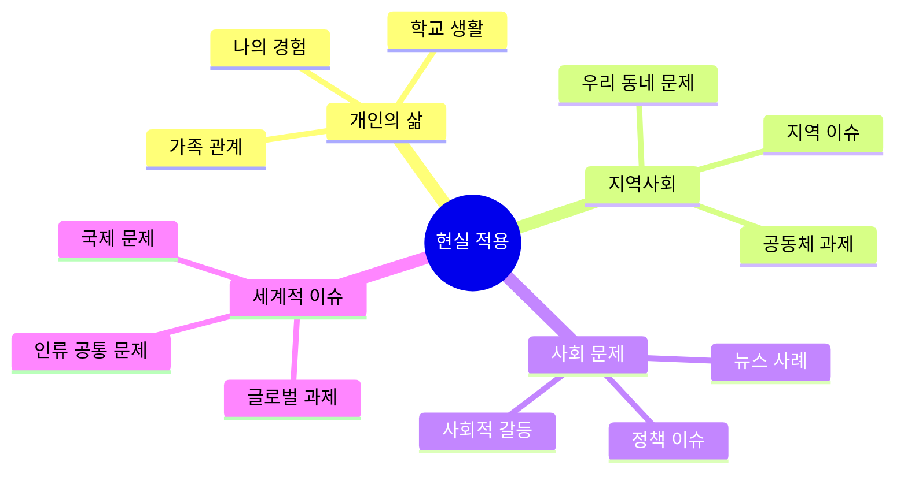
```mermaid
mindmap
  root((현실 적용))
    개인의 삶
      나의 경험
      가족 관계
      학교 생활
    지역사회
      우리 동네 문제
      지역 이슈
      공동체 과제
    사회 문제
      뉴스 사례
      사회적 갈등
      정책 이슈
    세계적 이슈
      국제 문제
      글로벌 과제
      인류 공통 문제
```

| 적용 영역 | 활동 방법 | 예시 | 산출물 |
|----------|----------|------|--------|
| **👤 개인의 삶** | 자기 성찰<br/>경험 연결 | 책 속 갈등을 내 경험에 적용<br/>"나라면 어떻게 했을까?" | 성찰 일지<br/>에세이 |
| **🏘️ 지역사회** | 사례 조사<br/>현장 답사 | 우리 동네 환경 문제 조사<br/>지역 주민 인터뷰 | 조사 보고서<br/>제안서 |
| **🌍 사회 문제** | 뉴스 분석<br/>통계 조사 | 청소년 인권 문제 분석<br/>관련 법률 검토 | 분석 보고서<br/>토론 자료 |
| **🌏 세계 이슈** | 국제 사례 비교<br/>글로벌 자료 | 기후 위기 국제 대응 비교<br/>UN 자료 분석 | 비교 분석<br/>캠페인 |

**💡 활동 예시: 중학교 사회 수업**
```
도서: 유발 하라리 『사피엔스』
개념: 인류의 협력과 이야기의 힘
적용 질문: "현대 사회 문제 해결에 협력이 왜 중요한가?"
활동: 
1. 우리 사회 갈등 사례 조사 (남북, 세대, 지역 등)
2. 협력 성공 사례 분석 (협동조합, 마을 공동체)
3. 협력 방안 제안서 작성
```

---

#### 4️⃣ 4단계: 전이 (Transfer)

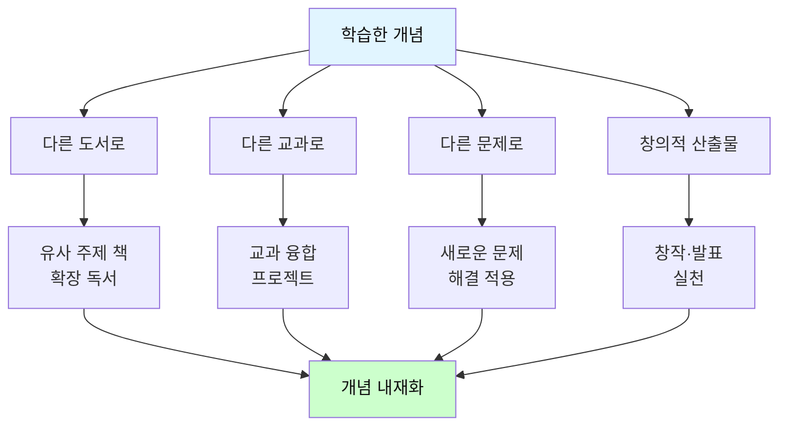
```mermaid
flowchart TD
    A[학습한 개념] --> B[다른 도서로]
    A --> C[다른 교과로]
    A --> D[다른 문제로]
    A --> E[창의적 산출물]
    
    B --> B1[유사 주제 책<br/>확장 독서]
    C --> C1[교과 융합<br/>프로젝트]
    D --> D1[새로운 문제<br/>해결 적용]
    E --> E1[창작·발표<br/>실천]
    
    B1 --> F[개념 내재화]
    C1 --> F
    D1 --> F
    E1 --> F
    
    style A fill:#e1f5ff,color:#111
    style F fill:#ccffcc,color:#111
```

| 전이 유형 | 방법 | 예시 | 결과물 |
|----------|------|------|--------|
| **📚 다른 도서로** | 유사 개념의<br/>다른 책 읽기 | 정의 → 『정의란 무엇인가』<br/>→ 『국가』(플라톤) | 비교 분석<br/>에세이 |
| **📖 다른 교과로** | 교과 융합<br/>프로젝트 | 문학(『1984』) + 사회(감시 사회)<br/>+ 기술(AI 윤리) | 융합<br/>프로젝트 |
| **🎯 다른 문제로** | 개념을 새로운<br/>문제에 적용 | 갈등 해결 개념을<br/>학교 폭력 문제에 적용 | 문제 해결<br/>제안서 |
| **🎨 창의적 산출물** | 다양한 형식으로<br/>표현·실천 | 영상, 포스터, 캠페인,<br/>연극, 웹툰, 책 쓰기 | 창작물<br/>발표회 |

**💡 전이 활동 예시**

**예시 1: 에세이 작성**
```
주제: "AI 시대의 정의로운 사회"
전이 과정:
- 『정의란 무엇인가』에서 배운 정의 개념
→ AI 기술 발전과 일자리 문제에 적용
→ 청소년 관점에서 해결 방안 제시
```

**예시 2: 프로젝트 수행**
```
주제: "우리 동네 환경 개선 캠페인"
전이 과정:
- 『침묵의 봄』에서 배운 환경 의식
→ 우리 동네 환경 문제 조사
→ 캠페인 기획 및 실행
→ 주민 참여 독려 (포스터, SNS, 서명 운동)
```

**예시 3: 지역사회 문제 해결 제안**
```
주제: "청소년 문화 공간 확충 제안서"
전이 과정:
- 『정의란 무엇인가』의 분배 정의 개념
→ 우리 지역 청소년 시설 부족 문제 분석
→ 해외 선진 사례 조사
→ 구청에 제안서 제출
```

---

#### 📊 4단계 프로세스 한눈에 보기

| 단계 | 핵심 질문 | 주요 활동 | 소요 시간 | 평가 |
|------|----------|----------|----------|------|
| **1단계<br/>개념 설정** | 무엇을 탐구할 것인가? | 개념 선정<br/>질문 생성 | 2-3시간 | 질문의 질 |
| **2단계<br/>도서 탐독** | 책은 무엇을 말하는가? | 정독<br/>분석<br/>토론 | 2-4주 | 이해도<br/>참여도 |
| **3단계<br/>현실 적용** | 현실과 어떻게 연결되는가? | 사례 조사<br/>문제 분석 | 1-2주 | 연결성<br/>분석력 |
| **4단계<br/>전이** | 어떻게 확장·실천할 것인가? | 프로젝트<br/>창작<br/>실천 | 2-4주 | 창의성<br/>실행력 |

### 6.3 교과 통합 독서 수업 사례

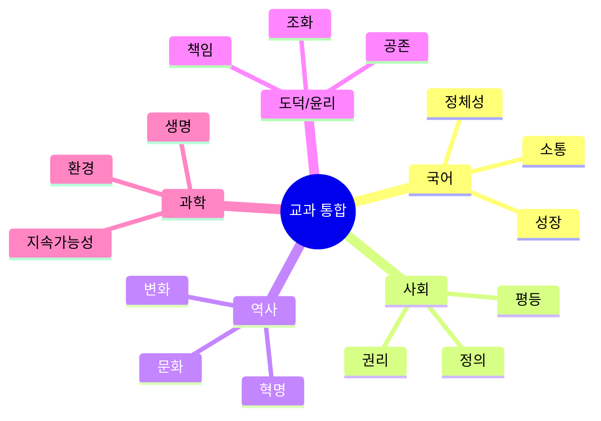
```mermaid
mindmap
  root((교과 통합))
    국어
      정체성
      성장
      소통
    사회
      정의
      평등
      권리
    역사
      변화
      혁명
      문화
    도덕/윤리
      공존
      조화
      책임
    과학
      환경
      지속가능성
      생명
```

#### 📚 학교급별 · 교과별 통합 수업 설계

---

**🏫 초등학교 (3-6학년)**

| 교과 | 학년 | 핵심 개념 | 도서 | 수업 활동 (4차시) | 결과물 |
|------|------|----------|------|----------------|--------|
| **국어** | 5학년 | 성장, 도전 | 『마당을 나온 암탉』 | 1. 인물 분석<br/>2. 성장 과정 토론<br/>3. 나의 도전 일기<br/>4. 발표회 | 성장 에세이<br/>삽화 그리기 |
| **사회** | 6학년 | 평등, 인권 | 『안네의 일기』 | 1. 전쟁과 인권 학습<br/>2. 역사적 배경 조사<br/>3. 평화 캠페인 기획<br/>4. 포스터 제작 | 평화 포스터<br/>편지 쓰기 |
| **도덕** | 4학년 | 우정, 협력 | 『샬롯의 거미줄』 | 1. 진정한 우정 토론<br/>2. 우정 사례 조사<br/>3. 친구 관계 성찰<br/>4. 감사 편지 | 우정 약속<br/>감사 카드 |
| **과학** | 5학년 | 생명, 환경 | 『나무를 심은 사람』 | 1. 환경의 중요성 학습<br/>2. 우리 학교 환경 조사<br/>3. 나무 심기 프로젝트<br/>4. 관찰 일기 | 관찰 일지<br/>환경 캠페인 |

---

**🏫 중학교**

| 교과 | 학년 | 핵심 개념 | 도서 | 수업 활동 (8차시) | 결과물 |
|------|------|----------|------|----------------|--------|
| **국어** | 2학년 | 정체성, 성장 | 헤르만 헤세<br/>『데미안』 | 1-2차시: 정독 및 토론<br/>3-4차시: 자아 정체성 탐구<br/>5-6차시: 나의 성장 분석<br/>7-8차시: 성찰 에세이 작성 | 자아 성찰<br/>에세이<br/>(2,000자) |
| **사회** | 3학년 | 정의, 평등 | 마이클 샌델<br/>『정의란 무엇인가』 | 1-2차시: 정의론 학습<br/>3-4차시: 사회 문제 사례 조사<br/>5-6차시: 토론 (찬반)<br/>7-8차시: 정책 제안서 작성 | 정책 제안서<br/>토론 발표 |
| **역사** | 2학년 | 변화, 혁명 | 재레드 다이아몬드<br/>『총, 균, 쇠』 | 1-2차시: 문명 발전 요인 학습<br/>3-4차시: 역사적 사건 분석<br/>5-6차시: 타임라인 작성<br/>7-8차시: 미래 예측 프로젝트 | 역사 타임라인<br/>미래 시나리오 |
| **도덕** | 1학년 | 공존, 조화 | 기시미 이치로<br/>『미움받을 용기』 | 1-2차시: 아들러 심리학 소개<br/>3-4차시: 인간 관계 토론<br/>5-6차시: 갈등 해결 사례 연구<br/>7-8차시: 실천 계획 수립 | 실천 다짐<br/>관계 개선 일지 |
| **과학** | 3학년 | 환경, 지속가능성 | 레이첼 카슨<br/>『침묵의 봄』 | 1-2차시: 환경 문제 인식<br/>3-4차시: 지역 환경 조사<br/>5-6차시: 해결 방안 연구<br/>7-8차시: 환경 프로젝트 발표 | 환경 조사<br/>보고서<br/>캠페인 |

---

**🏫 고등학교**

| 교과 | 학년 | 핵심 개념 | 도서 | 수업 활동 (12차시) | 결과물 |
|------|------|----------|------|-----------------|--------|
| **국어** | 1학년 | 부조리, 실존 | 알베르 카뮈<br/>『이방인』 | 1-3차시: 실존주의 철학 학습<br/>4-6차시: 작품 심층 분석<br/>7-9차시: 현대 사회 적용<br/>10-12차시: 철학 에세이 작성 | 학술적<br/>에세이<br/>(4,000자) |
| **사회<br/>(윤리)** | 2학년 | 정의, 공정 | 마이클 샌델<br/>『정의란 무엇인가』 | 1-3차시: 정의론 심화 학습<br/>4-6차시: 사회 이슈 분석<br/>7-9차시: 찬반 토론<br/>10-12차시: 논문 작성 | 소논문<br/>(5,000자)<br/>토론 대회 |
| **역사** | 2학년 | 문명, 지리 | 재레드 다이아몬드<br/>『총, 균, 쇠』 | 1-3차시: 문명 발전론 학습<br/>4-6차시: 지리적 요인 분석<br/>7-9차시: 한국사 적용 연구<br/>10-12차시: 연구 보고서 작성 | 역사 연구<br/>보고서<br/>발표 |
| **통합<br/>(융합)** | 3학년 | 인류, 미래 | 유발 하라리<br/>『사피엔스』<br/>+『호모 데우스』 | 1-4차시: 인류사 빅 히스토리<br/>5-8차시: 현대 기술과 인간<br/>9-10차시: 미래 사회 예측<br/>11-12차시: 융합 프로젝트 발표 | 융합 논문<br/>(8,000자)<br/>발표 PPT |
| **과학<br/>(생명)** | 2학년 | 진화, 생명 | 리처드 도킨스<br/>『이기적 유전자』 | 1-3차시: 진화론 심화<br/>4-6차시: 생명 과학 연결<br/>7-9차시: 윤리적 쟁점 토론<br/>10-12차시: 연구 프로젝트 | 과학 탐구<br/>보고서<br/>윤리 토론 |

---

#### 🎯 교과 통합 수업 설계 원칙

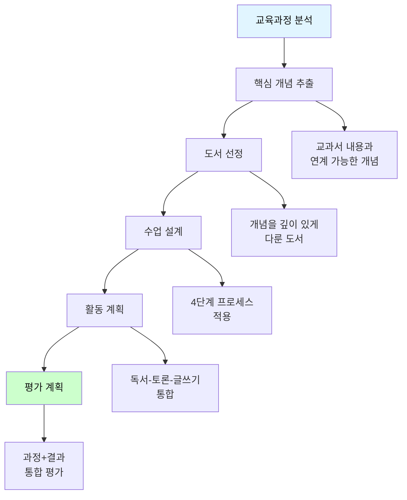
```mermaid
graph TD
    A[교육과정 분석] --> B[핵심 개념 추출]
    B --> C[도서 선정]
    C --> D[수업 설계]
    D --> E[활동 계획]
    E --> F[평가 계획]
    
    B --> B1[교과서 내용과<br/>연계 가능한 개념]
    C --> C1[개념을 깊이 있게<br/>다룬 도서]
    D --> D1[4단계 프로세스<br/>적용]
    E --> E1[독서-토론-글쓰기<br/>통합]
    F --> F1[과정+결과<br/>통합 평가]
    
    style A fill:#e1f5ff,color:#111
    style F fill:#ccffcc,color:#111
```

| 원칙 | 내용 | 주의사항 |
|------|------|----------|
| **📘 교육과정 연계** | 교과서 단원과 명확히 연결 | 억지 연결 지양 |
| **🎯 개념 중심** | 개념탐독 4단계 프로세스 적용 | 단순 독후감 지양 |
| **🔗 활동 통합** | 독서-토론-글쓰기-발표 연계 | 활동 간 연결성 |
| **⏱️ 시간 확보** | 충분한 수업 시간 배정 | 최소 4차시 이상 |
| **📊 평가 계획** | 과정과 결과 모두 평가 | 생기부 기재 연계 |
| **🤝 교사 협력** | 교과 교사와 사서 협업 | 정기 협의회 운영 |

---

## 7. AI 연계 수업 설계

### 7.1 AI 활용 독서교육의 기본 원칙

#### 4대 핵심 원칙

```
원칙 1: AI는 도구, 학생은 주체
━━━━━━━━━━━━━━━━━━━━━━━
- AI는 학습 보조 역할만 수행
- 최종 판단과 창조는 학생의 몫
- 학생의 사고력을 증폭시키는 방향으로 활용

원칙 2: 비판적 AI 활용
━━━━━━━━━━━━━━━━━━━━━━━
- AI 결과물을 무비판적으로 수용하지 않음
- 검증과 수정 과정 필수 포함
- 오류와 편향 발견 능력 배양

원칙 3: 윤리적 AI 사용
━━━━━━━━━━━━━━━━━━━━━━━
- AI 사용 사실 명시 (출처 표기)
- 저작권 및 표절 문제 인식
- 개인정보 보호 준수

원칙 4: 창의성 증폭
━━━━━━━━━━━━━━━━━━━━━━━
- AI로 반복 작업 효율화
- 절약된 시간을 창의적 사고에 투자
- 인간만의 통찰력 개발에 집중
```

### 7.2 단계별 AI 연계 독서 수업 모델

#### 모델 1: 독서 전 - AI 기반 배경지식 구축

**학습 목표**
- 책에 대한 사전 이해도 향상
- 읽기 동기 유발
- 효과적인 질문 생성

**수업 진행**

| 단계 | 활동 내용 | AI 역할 | 학생 역할 | 시간 |
|------|-----------|---------|-----------|------|
| 1단계 | 책 정보 탐색 | 책 요약, 저자 소개, 시대 배경 제공 | AI 답변의 정확성 검증 | 15분 |
| 2단계 | 개념 맵 생성 | 핵심 개념 추출 지원 | 개념 간 관계 구조화 | 20분 |
| 3단계 | 질문 리스트 작성 | 탐구 질문 예시 제공 | 자신만의 질문 추가 | 10분 |

**AI 프롬프트 예시**

```
[초등학생용]
"『마당을 나온 암탉』을 읽으려고 해요. 
이 책의 주인공과 주요 사건을 초등학생이 이해할 수 있게 설명해주세요."

[중학생용]
"조지 오웰의 『동물농장』을 읽기 전에 알아야 할 
역사적 배경(러시아 혁명)을 중학생 수준으로 설명해주세요."

[고등학생용]
"카뮈의 『이방인』에 나오는 '부조리' 개념을 
실존주의 철학과 연결하여 설명해주세요."
```

**검증 활동**
```
1. AI 답변 받기
2. 교과서 또는 신뢰할 만한 출처와 비교
3. 틀린 부분이나 부족한 부분 찾기
4. 자신의 언어로 재정리
```

#### 모델 2: 독서 중 - AI 협업 독서 노트

**학습 목표**
- 깊이 있는 텍스트 이해
- 개념적 사고력 향상
- 메타인지 독서 습관 형성

**디지털 독서 노트 구조**

```markdown
# 독서 노트: [책 제목]

## 1. 기본 정보
- 읽은 날짜: 
- 읽은 범위: 
- 핵심 개념: 

## 2. 내용 정리
### 주요 사건/논점
- 
- 

### 인상 깊은 문장 (3개)
1. "___" (p.__)
   → 왜 인상적인가: 

2. "___" (p.__)
   → 의미 해석: 

## 3. AI와의 대화
### 질문: 
### AI 답변: 
### 나의 평가: 
- AI 답변의 장점: 
- AI 답변의 한계: 
- 추가로 알게 된 점: 

## 4. 나의 생각
- 
- 
```

**AI 활용 질문 유형**

| 질문 유형 | 예시 | 학습 효과 |
|----------|------|-----------|
| **어휘 이해** | "이 문장에서 '~~'는 무슨 뜻인가요?" | 기본 이해 |
| **개념 설명** | "작가가 말하는 '자유'의 의미는?" | 개념 파악 |
| **맥락 이해** | "왜 주인공은 이런 선택을 했나요?" | 깊이 있는 이해 |
| **관점 확장** | "이 사건을 다른 관점에서 보면?" | 비판적 사고 |
| **연결 짓기** | "이 주제와 관련된 현대 사례는?" | 전이 학습 |

#### 모델 3: 독서 후 - AI 기반 비판적 분석 및 토론

**학습 목표**
- 다양한 관점 탐색
- 비판적 평가 능력
- 논리적 주장 구성

**수업 설계 (90분)**

```
[1교시: 45분] 개인 분석
━━━━━━━━━━━━━━━━━━━━━━━
10분: AI에게 책의 주장/논점 정리 요청
15분: AI에게 비판적 관점 요청
     "이 책의 한계는 무엇인가?"
     "반대 의견은 무엇인가?"
20분: 자신의 입장 정리
     - 동의하는 부분과 이유
     - 동의하지 않는 부분과 이유

[2교시: 45분] 그룹 토론 및 발표
━━━━━━━━━━━━━━━━━━━━━━━
20분: 소그룹 토론 (4-5명)
15분: 그룹별 입장 발표
10분: 전체 토론 및 교사 피드백
```

**토론 주제 생성 프롬프트**

```
"『정의란 무엇인가』를 읽고 고등학생들이 토론할 수 있는 
논쟁적인 질문 5개를 만들어주세요. 
각 질문은 찬반 입장이 명확히 나뉠 수 있어야 합니다."

AI 생성 예시:
1. 능력에 따른 차등 보상은 정당한가?
2. 소수를 희생하여 다수를 구하는 것은 정의로운가?
3. 부의 재분배는 개인의 자유를 침해하는가?
...

→ 학생들이 질문의 질 평가
→ 추가 질문 생성
→ 최종 토론 주제 선정
```

#### 모델 4: 독서 후 - AI 협업 창의적 프로젝트

**학습 목표**
- 창의적 표현 및 전이
- 융합적 사고
- 실천적 문제 해결

**프로젝트 유형별 AI 활용**

**유형 1: 스토리 재창작**

```
활동: 고전을 현대로, 현대를 고전으로 각색

AI 활용:
1단계: AI에게 시대 배경 변경 아이디어 브레인스토밍
      "『로미오와 줄리엣』을 2026년 한국 배경으로 
       각색한다면 어떤 요소들을 바꿀 수 있을까?"

2단계: AI 제안 검토 및 선택
      - 실현 가능성 평가
      - 원작의 본질 유지 여부 판단

3단계: 학생이 주도하여 스토리 구성
      - AI는 세부 묘사 지원
      - 최종 창작은 학생

산출물: 웹툰, 시나리오, 단편소설 등
```

**유형 2: 사회 문제 해결 프로젝트**

```
활동: 책에서 발견한 문제 → 실제 해결 방안 제안

예시: 『총, 균, 쇠』 읽고 지역 불평등 문제 해결

1단계: 문제 정의
- 책의 통찰: 지리적 조건이 발전에 영향
- 현재 문제: 우리 지역의 교육 격차

2단계: AI와 데이터 수집
- 프롬프트: "한국의 지역별 교육 격차 통계를 찾아줘"
- AI가 제공한 데이터 검증

3단계: 해결책 브레인스토밍
- AI: 다양한 정책 사례 제공
- 학생: 우리 지역에 맞는 방안 선택

4단계: 제안서 작성
- 학생이 주도적으로 작성
- AI는 논리 구조 검토

산출물: 정책 제안서, 캠페인 계획, 프로토타입 등
```

**유형 3: 멀티미디어 창작**

```
활동: 책의 핵심 메시지를 영상/포스터/음악으로 표현

AI 도구 활용:
- ChatGPT: 스크립트 브레인스토밍
- Midjourney/DALL-E: 이미지 생성
- 음악 AI: 분위기에 맞는 배경음악

주의사항:
✓ AI 생성 부분과 학생 창작 부분 명확히 구분
✓ AI는 초안 또는 영감 제공
✓ 최종 작품은 학생의 해석과 메시지 반영

산출물: 북트레일러, 인포그래픽, 팟캐스트 등
```

### 7.3 AI 도구별 활용 가이드

#### ChatGPT / Claude 등 대화형 AI

**효과적 프롬프트 작성법**

```
[기본 구조]
역할 설정 + 맥락 제공 + 구체적 요청 + 제약 조건

[예시 1: 개념 설명]
나쁜 프롬프트: "실존주의가 뭐야?"

좋은 프롬프트: 
"나는 고등학교 1학년 학생이고, 카뮈의 『이방인』을 읽고 있어. 
'실존주의'라는 개념이 나오는데, 이게 주인공의 행동과 
어떻게 연결되는지 고등학생이 이해할 수 있게 설명해줘. 
어려운 철학 용어보다는 구체적인 예시 위주로 부탁해."

[예시 2: 비판적 분석]
나쁜 프롬프트: "이 책의 문제점은?"

좋은 프롬프트:
"『사피엔스』를 읽었는데, 저자는 인류의 발전을 
매우 긍정적으로 서술하는 것 같아. 
하지만 이런 관점에 대한 비판도 있을 것 같은데, 
주요 비판 논점 3가지와 각각의 근거를 알려줘."
```

**학생용 AI 활용 체크리스트**

```
□ 구체적이고 명확한 질문을 했는가?
□ 내 수준과 맥락을 AI에게 알려줬는가?
□ AI 답변을 다른 자료로 검증했는가?
□ AI 답변을 그대로 복사하지 않고 재구성했는가?
□ AI 사용 사실을 표기했는가?
```

#### AI 이미지 생성 도구

**독서 활동 연계 방법**

| 활동 | 목적 | 프롬프트 예시 | 교육적 가치 |
|------|------|---------------|-------------|
| **책 표지 재디자인** | 핵심 메시지 시각화 | "『1984』의 감시 사회를 상징하는 어두운 분위기의 책 표지" | 상징적 사고 |
| **장면 재현** | 텍스트 이해도 확인 | "소년이 폭풍우 속에서 배를 타고 있는 장면, 인상파 화풍" | 상상력 구체화 |
| **추상 개념 시각화** | 추상적 사고 | "'자유'를 표현하는 이미지: 날개, 하늘, 빛" | 은유적 표현 |
| **캐릭터 디자인** | 인물 분석 | "40대 지친 노동자, 희망을 잃은 표정, 사실적 스타일" | 인물 이해 |

**주의사항 및 비판적 활용**

```
✓ AI가 만든 이미지와 내 해석이 일치하는가?
✓ 책의 묘사와 비교하여 평가하기
✓ AI가 놓친 부분은 무엇인가?
✓ 저작권 및 윤리적 문제 인식
```

### 7.4 AI 윤리 교육 통합

#### 수업에 포함할 윤리 주제

**주제 1: AI 편향과 공정성**

```
독서 연계: 『알고리즘의 편견』, 『무기가 된 수학』

탐구 질문:
- AI는 편견이 없을까?
- AI 추천 도서 목록도 편향될 수 있을까?
- 우리는 어떻게 AI의 편향을 발견할 수 있을까?

활동:
1. 동일한 질문을 여러 AI에게 하기
2. 답변의 차이와 편향 분석
3. 편향 없는 AI를 위한 제안서 작성
```

**주제 2: 디지털 저작권**

```
독서 연계: 『디지털 시대의 저작권』

사례 연구:
- AI가 요약한 책 내용을 그대로 사용하면?
- AI가 생성한 이미지의 저작권은 누구에게?
- AI가 학습한 데이터의 저작권 문제

토론:
"AI 시대의 창작물은 어디까지가 표절인가?"

실천:
- 올바른 출처 표기 방법 학습
- AI 사용 명시 가이드라인 만들기
```

**주제 3: 정보 신뢰성과 가짜뉴스**

```
독서 연계: 『팩트풀니스』, 『거짓말의 진화』

실습:
1. AI에게 같은 역사적 사건을 다르게 해석하도록 요청
2. AI가 만든 가짜 서평 vs 진짜 서평 구별하기
3. 신뢰할 수 있는 정보의 조건 정리

비판적 질문:
- AI의 답변은 항상 옳은가?
- AI는 어떤 출처에서 정보를 가져오는가?
- 우리는 어떻게 정보를 검증해야 하는가?
```

**주제 4: AI 의존성**

```
독서 연계: 『생각하지 않는 사람들』

실험:
- 1주일 AI 사용 vs 1주일 AI 없이 독서
- 사고 깊이와 기억 정도 비교

성찰:
- AI가 내 사고를 돕는가, 방해하는가?
- AI 없이도 문제를 해결할 수 있는가?
- 적절한 AI 사용의 기준은?
```

#### 학생용 AI 윤리 서약서

```
나는 AI를 활용한 독서 활동에서:

1. AI 사용 사실을 솔직하게 밝히겠습니다.
2. AI 답변을 비판적으로 검토하고 검증하겠습니다.
3. AI가 만든 내용을 내 것처럼 제출하지 않겠습니다.
4. AI를 학습 도구로 활용하되, 의존하지 않겠습니다.
5. AI 사용 과정에서 타인의 권리를 존중하겠습니다.

서명: ____________  날짜: ____________
```

### 7.5 AI 연계 수업 평가 기준

#### 평가 루브릭

| 평가 영역 | 우수 (5점) | 보통 (3점) | 미흡 (1점) |
|----------|-----------|-----------|-----------|
| **AI 활용의 적절성** | AI를 전략적으로 활용하여 학습 효율 극대화 | AI를 사용했으나 효과적이지 않음 | AI를 거의 사용하지 않았거나 부적절하게 사용 |
| **비판적 검증** | AI 답변을 철저히 검증하고 오류 발견 | AI 답변을 부분적으로만 검증 | AI 답변을 무비판적으로 수용 |
| **창의적 활용** | AI를 활용해 독창적 아이디어 발전 | AI 제안을 약간 수정 | AI 답변을 그대로 사용 |
| **윤리적 사용** | 출처 표기, 윤리 준수 완벽 | 출처 표기 부분적 | 윤리 위반 또는 표기 없음 |
| **학습 결과** | 깊이 있는 이해와 통찰 도달 | 기본적 이해 수준 | 표면적 이해에 그침 |

### 7.6 교사를 위한 AI 활용 가이드

#### 수업 준비 체크리스트

```
□ 수업 목표에 맞는 AI 도구 선정
□ 효과적인 프롬프트 예시 준비
□ AI 답변 검증을 위한 참고 자료 준비
□ 윤리 가이드라인 학생용 자료 제작
□ 기술적 문제 대비 (인터넷, 계정 등)
□ 평가 기준 및 루브릭 준비
```

#### AI 연계 수업 설계 워크시트

```
[수업 기본 정보]
수업명: ________________________________
대상: _________________________________
시간: _________________________________
도서: _________________________________

[AI 활용 계획]
사용 AI 도구: __________________________
활용 단계: □ 독서 전  □ 독서 중  □ 독서 후
주요 활용 목적: ________________________

[학습 목표]
문해력 목표: ___________________________
통찰력 목표: ___________________________
AI 활용 역량 목표: _____________________

[수업 절차]
1단계 (___분): _________________________
  - 교사 활동: _________________________
  - 학생 활동: _________________________
  - AI 역할: ___________________________

2단계 (___분): _________________________
  - 교사 활동: _________________________
  - 학생 활동: _________________________
  - AI 역할: ___________________________

3단계 (___분): _________________________
  - 교사 활동: _________________________
  - 학생 활동: _________________________
  - AI 역할: ___________________________

[평가 계획]
평가 방법: _____________________________
평가 기준: _____________________________

[윤리적 고려사항]
________________________________
```

#### 교사 역량 개발 로드맵

```
[1단계: 기초]
- AI 도구 기본 사용법 익히기
- 프롬프트 작성 연습
- AI 윤리 이해

[2단계: 활용]
- 수업에 AI 부분 도입
- 학생 활동 설계
- 평가 방법 개발

[3단계: 심화]
- 창의적 AI 활용 수업 설계
- 학생 AI 리터러시 지도
- 동료 교사와 사례 공유

[4단계: 전문]
- AI 연계 교육과정 설계
- 교사 연수 강사
- 연구 및 논문 작성
```

### 7.7 AI 연계 수업 우수 사례 (가상 예시)

#### 사례 1: ○○중학교 - "AI와 함께 읽는 사피엔스"

**수업 개요**
- 대상: 중학교 3학년
- 기간: 8주
- 도서: 유발 하라리, 『사피엔스』
- AI 도구: ChatGPT, Midjourney

**주차별 활동**

```
1주: 인류사 타임라인 AI로 작성
   → AI에게 주요 사건 요청 → 책과 비교 검증

2주: 인지혁명 개념 탐구
   → AI와 대화하며 개념 이해 → 현대 사례 찾기

3주: 농업혁명 분석
   → AI에게 긍정/부정 측면 질문 → 토론

4주: 제국주의 비판적 읽기
   → AI에게 다양한 관점 요청 → 입장 정리

5주: 과학혁명과 현대
   → AI와 미래 예측 브레인스토밍

6주: 프로젝트 기획
   → "인류의 다음 혁명" 제안서 작성

7주: 창작물 제작
   → AI 이미지로 미래 사회 시각화

8주: 발표 및 평가
   → 프로젝트 발표, 동료 평가, 성찰
```

**성과**
- 참여도: 98% (이전 독서 수업 대비 35% 증가)
- 만족도: 4.7/5.0
- 책 완독률: 92%
- 학생 피드백: "AI 덕분에 어려운 책도 재미있게 읽었어요"

#### 사례 2: △△고등학교 - "AI 시대, 『1984』 다시 읽기"

**수업 개요**
- 대상: 고등학교 2학년
- 기간: 4주
- 도서: 조지 오웰, 『1984』
- 주제: 감시 사회와 AI 윤리

**프로젝트 기반 학습**

```
[1단계] 책 읽기 + AI 노트 작성 (2주)
- 감시 기술 장면마다 AI에게 현대 기술 비교 질문
- "빅브라더"와 현대 AI 감시 기술 비교표 작성

[2단계] 윤리 토론 (1주)
토론 주제: "AI 감시는 안전을 위해 필요한가?"
- AI에게 찬반 논거 요청 → 검증 및 추가 조사
- 모둠별 입장 정리 → 전체 토론

[3단계] 제안서 작성 (1주)
주제: "윤리적 AI 감시 시스템 가이드라인"
- AI와 협업하여 초안 작성
- 학생이 가치 판단과 최종 제안
- 지역 의회에 제출
```

**학생 결과물 예시**
```
제목: "투명한 AI 감시 시스템을 위한 10가지 원칙"

1. 감시 목적의 명확한 공개
2. 시민 동의와 참여
3. 데이터 보호 및 암호화
4. 알고리즘의 투명성
5. 오용 방지 장치
...
```

**영향**
- 지역 신문 보도
- 시의회 청소년 정책 자문단 초청
- 학생들의 시민 의식 및 참여 증가

---

## 8. 책 선택 기준 및 필독서 선정

### 8.1 도서 선정 5대 기준

#### 1) 주제성 및 인문적 가치
- 윤리, 철학, 역사, 문화, 인간과 사회, 자아 성찰 등
- 학생의 사고를 확장시키는 주제

#### 2) 난이도 및 수준 적합성
- 학생의 학년 및 독서 수준에 맞는 구성
- 너무 쉽거나 어렵지 않은 적정 수준
- 점진적 난이도 상승 고려

#### 3) 다양성 확보
- 국내외 도서 균형
- 문학/비문학 균형
- 고전/현대 균형
- 장르 다양성 (소설, 에세이, 역사, 과학 등)
- 저자의 성별, 문화적 배경 다양성

#### 4) 학생 흥미 및 시의성
- 청소년의 관심사 반영
- 사회적 이슈와 연계
- 현대적 문화 트렌드 고려

#### 5) 교과 연계성
- 국어, 사회, 역사, 윤리 등 교과 내용과 연결
- 융합 수업 가능성
- 핵심 개념과의 연계성

### 8.2 필독서 구성 체계

```
[학교급별 필독서 구성 예시]

공통 필독서 (학급/학년 전체)
   ├─ 학기당 2~3권
   └─ 토론 및 공동 활동용

선택 필독서 (개인 선택)
   ├─ 학기당 5~10권 중 선택
   └─ 개인 독서 포트폴리오용

추천 도서 목록 (자유 선택)
   ├─ 핵심 개념별 분류
   └─ 학생 맞춤형 추천
```

### 8.3 학교급별 필독서 선정 가이드

#### 초등학교 (독서 중점학교)

**선정 기준**
- 그림책부터 장편까지 다양한 형식
- 재미와 교육적 가치 균형
- 공감과 상상력 자극

**핵심 개념별 추천**
- 성장: 『마당을 나온 암탉』, 『나의 라임 오렌지 나무』
- 우정: 『샬롯의 거미줄』, 『안네의 일기』
- 가족: 『아홉 살 인생』, 『완득이』

#### 중학교 (독서 중점학교)

**선정 기준**
- 사회 문제 인식 시작 단계
- 비판적 사고 훈련
- 다양한 가치관 접촉

**핵심 개념별 추천**
- 정의: 『난장이가 쏘아올린 작은 공』, 『1984』
- 갈등: 『채식주의자』, 『동물농장』
- 변화: 『총, 균, 쇠』, 『코스모스』

#### 고등학교 (인문학 실천학교)

**선정 기준**
- 철학적·추상적 사고 가능
- 학문적 깊이와 폭 확보
- 진로 및 진학 연계

**핵심 개념별 추천**
- 정의/윤리: 『정의란 무엇인가』, 『국가』(플라톤)
- 인간 이해: 『사피엔스』, 『총체적 인간』
- 사회/역사: 『21세기 자본』, 『총, 균, 쇠』
- 문학: 『데미안』, 『이방인』, 『변신』

---

## 9. 운영 프로세스

### 9.1 연간 운영 계획

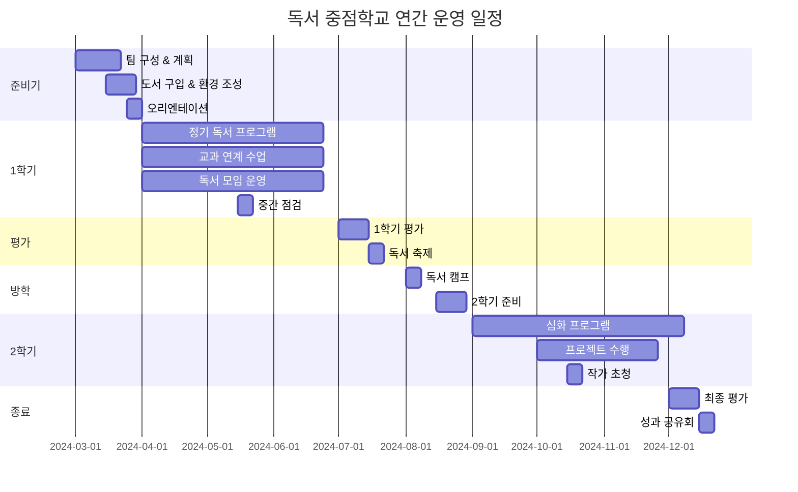
```mermaid
gantt
    title 독서 중점학교 연간 운영 일정
    dateFormat  YYYY-MM-DD
    section 준비기
    팀 구성 & 계획        :2024-03-01, 3w
    도서 구입 & 환경 조성 :2024-03-15, 2w
    오리엔테이션          :2024-03-25, 1w
    section 1학기
    정기 독서 프로그램    :2024-04-01, 12w
    교과 연계 수업        :2024-04-01, 12w
    독서 모임 운영        :2024-04-01, 12w
    중간 점검             :2024-05-15, 1w
    section 평가
    1학기 평가            :2024-07-01, 2w
    독서 축제             :2024-07-15, 1w
    section 방학
    독서 캠프             :2024-08-01, 1w
    2학기 준비            :2024-08-15, 2w
    section 2학기
    심화 프로그램         :2024-09-01, 14w
    프로젝트 수행         :2024-10-01, 8w
    작가 초청             :2024-10-15, 1w
    section 종료
    최종 평가             :2024-12-01, 2w
    성과 공유회           :2024-12-15, 1w
```

| 시기 | 단계 | 주요 활동 | 산출물/성과 | 담당 |
|------|------|----------|-----------|------|
| **📅 3월<br/>(계획)** | 준비 단계 | • 독서교육 팀 구성<br/>• 연간 필독서 목록 확정<br/>• 예산 수립 및 도서 구입<br/>• 학생·학부모 오리엔테이션 | • 운영 계획서<br/>• 필독서 목록<br/>• 예산 집행 계획 | 독서교육팀<br/>학교장 |
| **🌱 4-6월<br/>(1학기)** | 실행 단계 | • 정기 독서 시간 운영 (주 1-2회)<br/>• 독서 모임 및 토론 활동<br/>• 교과 연계 독서 수업<br/>• 1차 중간 점검 (5월) | • 독서 일지<br/>• 토론 기록<br/>• 포트폴리오 | 전체 교사<br/>독서교육팀 |
| **📊 7월<br/>(평가)** | 중간 평가 | • 독서 포트폴리오 점검<br/>• 독서 발표회/축제<br/>• 만족도 조사<br/>• 개선점 도출 | • 중간 평가 보고서<br/>• 학생 설문 결과<br/>• 개선 계획 | 독서교육팀<br/>평가위원 |
| **☀️ 8월<br/>(방학)** | 충전 & 보완 | • 자율 독서 과제<br/>• 독서 캠프 (선택)<br/>• 2학기 계획 수정·보완<br/>• 교사 워크숍 | • 방학 독서 기록<br/>• 2학기 수정 계획<br/>• 연수 이수 | 희망 학생<br/>독서교육팀 |
| **🍂 9-11월<br/>(2학기)** | 심화 단계 | • 2학기 독서 활동 실시<br/>• 인문학 세미나<br/>• 작가 초청 강연<br/>• 독서 프로젝트 수행 | • 세미나 보고서<br/>• 프로젝트 결과물<br/>• 창작 활동 | 전체 교사<br/>동아리 |
| **🎉 12월<br/>(마무리)** | 최종 평가 | • 최종 독서 이력 정리<br/>• 우수 사례 공유회<br/>• 디지털 배지 수여<br/>• 차년도 계획 수립 | • 최종 평가 보고서<br/>• 우수 사례집<br/>• 차년도 계획서 | 독서교육팀<br/>교육청 |

**📌 연중 상시 활동**
- 독서 동아리 운영 (주 1회)
- 도서관 운영 및 관리
- 독서 상담 및 코칭
- 온라인 독서 커뮤니티 운영

### 9.2 주간 독서 활동 루틴 예시

```
[중학교 독서 중점학교 사례]

월요일: 조회 시간 10분 책 읽기
화요일: 독서 수업 (국어 시간 활용, 45분)
수요일: 자율 독서 시간 (점심시간 후 20분)
목요일: 독서 모임 (동아리 시간, 50분)
금요일: 독서 일지 작성 및 공유 (조종례 10분)
```

### 9.3 독서 모임 운영 가이드

#### 모임 구성
- 학급 단위 또는 학년 단위
- 5~8명 내외 소그룹
- 관심 주제별 또는 혼합 구성

#### 모임 진행 방식
1. **개인 독서**: 정해진 분량 읽기 (1~2주)
2. **모임 준비**: 질문 및 의견 정리
3. **토론**: 질문 공유 및 토론 (40~50분)
4. **기록**: 토론 내용 정리 및 성찰 일지
5. **피드백**: 교사 또는 또래 피드백

#### 토론 주제 예시
- 인물의 선택에 대한 평가
- 현실 문제와의 연결
- 저자의 관점 비판
- 나라면 어떻게 했을까?

---

## 10. 결과물 및 성과 평가

### 10.1 학생 산출물

| 유형 | 세부 내용 | 평가 방법 |
|------|-----------|-----------|
| **독서 감상문** | 서평, 에세이, 비평문 | 내용 깊이, 논리성, 표현력 |
| **토론 기록** | 토론 보고서, 녹음/영상 | 참여도, 논리성, 경청 태도 |
| **발표 자료** | PPT, 포스터, 북트레일러 | 창의성, 내용 이해도 |
| **프로젝트** | 캠페인, 전시, 공연 등 | 실행력, 협업, 사회 기여 |
| **독서 포트폴리오** | 독서 이력, 성찰 일지 | 지속성, 성장 정도 |

### 10.2 독서 디지털 배지 제도

**개념**
- 학생이 핵심 개념 연계 도서를 읽고
- 탐구·적용·전이 과정을 완료하면
- 디지털 인증서(배지) 부여

**배지 유형 예시**
- 개념 마스터 배지 (개념별 5권 완독)
- 장르 다양성 배지 (5가지 장르 독서)
- 토론왕 배지 (토론 10회 참여)
- 창작자 배지 (창의적 산출물 제작)

**활용 방안**
- 학교생활기록부 기재 (특기사항)
- 진로 포트폴리오 연계
- 동기 부여 및 성취감 제공

### 10.3 학교 평가 지표

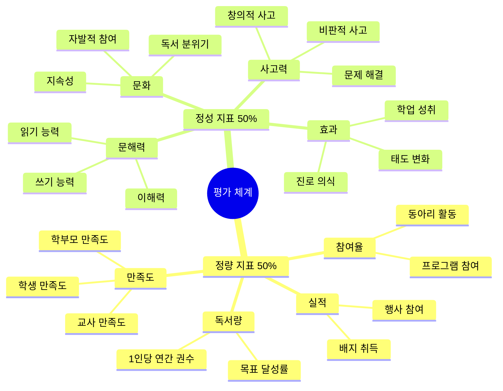
```mermaid
mindmap
  root((평가 체계))
    정량 지표 50%
      독서량
        1인당 연간 권수
        목표 달성률
      참여율
        프로그램 참여
        동아리 활동
      만족도
        학생 만족도
        교사 만족도
        학부모 만족도
      실적
        배지 취득
        행사 참여
    정성 지표 50%
      문해력
        읽기 능력
        쓰기 능력
        이해력
      사고력
        비판적 사고
        창의적 사고
        문제 해결
      문화
        독서 분위기
        자발적 참여
        지속성
      효과
        학업 성취
        태도 변화
        진로 의식
```

#### 📊 정량적 지표 (50점)

| 평가 항목 | 측정 방법 | 배점 | 목표 수준 |
|----------|----------|------|----------|
| **📚 1인당 연간 독서량** | 독서 이력 시스템 | 15점 | 초등: 25권 이상<br/>중등: 18권 이상<br/>고등: 15권 이상 |
| **👥 프로그램 참여율** | 출석 체크, 활동 기록 | 12점 | 85% 이상 참여 |
| **🏅 배지 취득률** | 디지털 배지 시스템 | 8점 | 학생의 70% 이상 1개 이상 취득 |
| **😊 만족도 조사** | 설문 (5점 척도) | 15점 | 학생 4.0 이상<br/>교사 4.2 이상<br/>학부모 3.8 이상 |

#### 💭 정성적 지표 (50점)

| 평가 항목 | 측정 방법 | 배점 | 평가 기준 |
|----------|----------|------|----------|
| **📖 문해력 향상도** | 표준화 검사<br/>(사전-사후) | 15점 | 평균 10% 이상 향상 |
| **🧠 비판적 사고력** | 포트폴리오 분석<br/>루브릭 평가 | 12점 | 사고 깊이, 논리성,<br/>창의성 종합 평가 |
| **🏫 독서 문화 정착도** | 관찰, 면담,<br/>사례 분석 | 13점 | 자발적 독서 문화<br/>형성 정도 |
| **📈 학업 성취 변화** | 교과 성적,<br/>학습 태도 | 10점 | 학업 성취도 및<br/>태도 긍정적 변화 |

**✅ 평가 등급**
- 90점 이상: 최우수 (인센티브 + 연장 지원)
- 80-89점: 우수 (포상 + 사례 발표)
- 70-79점: 양호 (지속 지원)
- 60-69점: 보통 (개선 권고)
- 60점 미만: 미흡 (특별 지도)

### 10.4 교육청 제출 보고서

**보고서 구성**
1. 사업 개요 및 추진 경과
2. 주요 활동 실적
3. 학생 변화 및 성과
4. 우수 사례
5. 어려움 및 개선 방안
6. 차년도 계획

---

## 11. 제안서 작성 가이드

### 11.1 제안서 기본 구조

```
1. 표지
   - 학교명, 제안 프로그램명, 제출일

2. 목차

3. 사업 개요
   3.1 배경 및 필요성
   3.2 목적 및 목표
   3.3 추진 근거

4. 사업 내용
   4.1 운영 방침 및 전략
   4.2 학교 현황 분석
   4.3 핵심 개념 및 독서교육 방식
   4.4 주요 활동 계획
   4.5 필독서 목록 및 선정 기준

5. 조직 및 역할
   5.1 추진 조직 구성
   5.2 역할 분담
   5.3 교사 연수 계획

6. 운영 계획
   6.1 연간 일정
   6.2 예산 계획
   6.3 시설 및 자원 활용

7. 평가 계획
   7.1 평가 지표 및 방법
   7.2 환류 계획

8. 기대 효과

9. 부록
   - 학교 시설 현황
   - 교사 명단 및 경력
   - 설문조사 결과 등
```

### 11.2 작성 시 유의사항

#### 구체성
- 추상적 표현보다 구체적 수치와 계획 제시
- 예: "독서 활동 활성화" → "주 2회 45분 독서 수업 운영"

#### 실현가능성
- 학교 여건에 맞는 현실적 계획
- 과도한 목표 설정 지양

#### 연계성
- 학교 교육목표와의 연계성 강조
- 교육과정과의 통합 방안 제시

#### 차별성
- 우리 학교만의 특색 있는 프로그램
- 지역사회 자원 활용 방안

#### 지속가능성
- 시범 기간 종료 후 지속 방안
- 단계적 확대 계획

### 11.3 예산 계획 예시

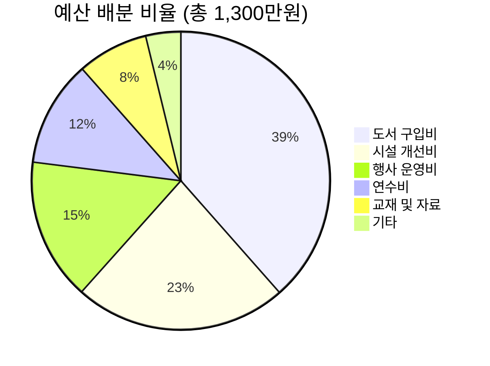
```mermaid
pie title 예산 배분 비율 (총 1,300만원)
    "도서 구입비" : 38.5
    "시설 개선비" : 23.1
    "행사 운영비" : 15.4
    "연수비" : 11.5
    "교재 및 자료" : 7.7
    "기타" : 3.8
```

#### 💰 세부 예산 계획표

| 항목 | 세부 내용 | 단가 | 수량 | 금액 (원) | 비율 |
|------|-----------|------|------|----------|------|
| **📚 도서 구입비** | | | | **5,000,000** | **38.5%** |
| └ 필독서 | 공통 필독서 | 15,000원 | 150권 | 2,250,000 | |
| └ 학급 문고 | 선택 도서 | 12,000원 | 200권 | 2,400,000 | |
| └ 전자책 구독 | 단체 이용권 | - | 1년 | 350,000 | |
| **📝 교재 및 자료** | | | | **1,000,000** | **7.7%** |
| └ 독서 활동지 | 인쇄 및 제작 | 500원 | 1,000부 | 500,000 | |
| └ 포트폴리오 | 학생용 파일 | 5,000원 | 100개 | 500,000 | |
| **🎉 행사 운영비** | | | | **2,000,000** | **15.4%** |
| └ 작가 초청 강연 | 강연료 + 교통비 | 500,000원 | 2회 | 1,000,000 | |
| └ 독서 축제 | 장소, 물품, 상품 | - | 1회 | 700,000 | |
| └ 독서 대회 | 시상품, 운영비 | - | 1회 | 300,000 | |
| **🏫 시설 개선비** | | | | **3,000,000** | **23.1%** |
| └ 독서 공간 조성 | 쿠션, 책상, 조명 | - | - | 2,000,000 | |
| └ 서가 및 진열대 | 이동식 서가 | 500,000원 | 2개 | 1,000,000 | |
| **🎓 연수비** | | | | **1,500,000** | **11.5%** |
| └ 교사 연수 | 외부 강사 초청 | 300,000원 | 4회 | 1,200,000 | |
| └ 워크숍 | 선진 학교 벤치마킹 | - | 1회 | 300,000 | |
| **🔧 기타** | | | | **500,000** | **3.8%** |
| └ 소모품 | 문구류, 사무용품 | - | - | 300,000 | |
| └ 인쇄비 | 안내문, 자료집 | - | - | 200,000 | |
| **💵 합계** | | | | **13,000,000** | **100%** |

**📋 예산 집행 원칙**
- 분기별 집행 계획 수립 및 정산
- 도서 구입은 학기초 집중 집행 (60% 이상)
- 행사 운영비는 사전 계획에 따라 집행
- 예산 변경 시 교육청 승인 필요
- 연말 정산 및 이월금 처리

**🔄 예산 변경 가능 범위**
- 동일 대분류 내: 20% 범위 내 자율 조정
- 대분류 간 변경: 교육청 승인 필요
- 불용액 발생 시: 다른 항목으로 전용 가능

---

## 12. 추천 필독서 목록

### 12.1 초등학교 필독서 (독서 중점학교)

#### 저학년 (1~3학년)

| 도서명 | 저자 | 핵심 개념 | 추천 이유 |
|--------|------|-----------|-----------|
| 『마당을 나온 암탉』 | 황선미 | 성장, 도전 | 자유와 모성애, 도전 정신 |
| 『까마귀 소년』 | 야시마 타로 | 극복, 용기 | 차별 극복과 성장 |
| 『100만 번 산 고양이』 | 사노 요코 | 사랑, 삶 | 생명과 사랑의 가치 |
| 『괴물들이 사는 나라』 | 모리스 센닥 | 상상, 감정 | 상상력과 감정 표현 |

#### 고학년 (4~6학년)

| 도서명 | 저자 | 핵심 개념 | 추천 이유 |
|--------|------|-----------|-----------|
| 『나의 라임 오렌지 나무』 | 바스콘셀로스 | 성장, 고통 | 가난과 성장의 이중주 |
| 『안네의 일기』 | 안네 프랑크 | 평화, 인권 | 전쟁과 인권, 희망 |
| 『몽실 언니』 | 권정생 | 역사, 가족 | 한국 현대사와 가족 |
| 『연어』 | 박정섭 | 정체성, 귀향 | 고향과 정체성 탐구 |
| 『샬롯의 거미줄』 | E.B. 화이트 | 우정, 희생 | 진정한 우정의 의미 |

### 12.2 중학교 필독서 (독서 중점학교)

#### 문학

| 도서명 | 저자 | 핵심 개념 | 추천 이유 |
|--------|------|-----------|-----------|
| 『동물농장』 | 조지 오웰 | 권력, 부패 | 정치 풍자와 권력 비판 |
| 『1984』 | 조지 오웰 | 자유, 감시 | 전체주의와 개인의 자유 |
| 『난장이가 쏘아올린 작은 공』 | 조세희 | 정의, 불평등 | 사회 불평등과 정의 |
| 『채식주의자』 | 한강 | 정체성, 저항 | 개인의 선택과 사회 |
| 『데미안』 | 헤르만 헤세 | 성장, 자아 | 청소년기 자아 찾기 |
| 『변신』 | 프란츠 카프카 | 소외, 존재 | 현대인의 소외와 존재 |

#### 인문·사회

| 도서명 | 저자 | 핵심 개념 | 추천 이유 |
|--------|------|-----------|-----------|
| 『10대와 통하는 경제 이야기』 | 김경훈 | 경제, 자본 | 경제 기본 개념 이해 |
| 『10대와 통하는 환경 이야기』 | 최원형 | 환경, 지속가능 | 환경 문제 인식 |
| 『청소년을 위한 정의란 무엇인가』 | 김선욱 | 정의, 윤리 | 정의와 도덕 철학 입문 |
| 『미움받을 용기』 | 기시미 이치로 | 자유, 관계 | 아들러 심리학 입문 |

#### 과학·기술

| 도서명 | 저자 | 핵심 개념 | 추천 이유 |
|--------|------|-----------|-----------|
| 『코스모스』 | 칼 세이건 | 우주, 과학 | 과학적 사고와 우주 이해 |
| 『이기적 유전자』 | 리처드 도킨스 | 진화, 생명 | 진화론과 생명의 이해 |
| 『총, 균, 쇠』 | 재레드 다이아몬드 | 문명, 역사 | 인류 문명 발전의 역사 |

### 12.3 고등학교 필독서 (인문학 실천학교)

#### 철학·윤리

| 도서명 | 저자 | 핵심 개념 | 추천 이유 |
|--------|------|-----------|-----------|
| 『정의란 무엇인가』 | 마이클 샌델 | 정의, 공정 | 현대 정의론의 핵심 |
| 『국가』 | 플라톤 | 정의, 이상국가 | 서양 철학의 고전 |
| 『니코마코스 윤리학』 | 아리스토텔레스 | 덕, 행복 | 윤리학의 기초 |
| 『군주론』 | 마키아벨리 | 권력, 정치 | 정치 현실주의 |
| 『사회계약론』 | 장 자크 루소 | 자유, 계약 | 민주주의의 철학적 기초 |

#### 문학

| 도서명 | 저자 | 핵심 개념 | 추천 이유 |
|--------|------|-----------|-----------|
| 『이방인』 | 알베르 카뮈 | 부조리, 존재 | 실존주의 문학의 걸작 |
| 『변신』 | 프란츠 카프카 | 소외, 존재 | 현대인의 소외 |
| 『1984』 | 조지 오웰 | 전체주의, 자유 | 디스토피아 문학 |
| 『멋진 신세계』 | 올더스 헉슬리 | 기술, 인간성 | 과학기술과 인간성 |
| 『태백산맥』 | 조정래 | 역사, 이념 | 한국 현대사의 이해 |

#### 역사·사회

| 도서명 | 저자 | 핵심 개념 | 추천 이유 |
|--------|------|-----------|-----------|
| 『사피엔스』 | 유발 하라리 | 인류, 문명 | 인류사의 빅 히스토리 |
| 『총, 균, 쇠』 | 재레드 다이아몬드 | 문명, 지리 | 문명 발전의 요인 |
| 『21세기 자본』 | 토마 피케티 | 자본, 불평등 | 현대 자본주의 분석 |
| 『오리엔탈리즘』 | 에드워드 사이드 | 제국주의, 문화 | 문화 권력과 편견 |
| 『총체적 인간』 | 김우창 | 인간, 교양 | 인문학적 인간 이해 |

#### 과학·기술

| 도서명 | 저자 | 핵심 개념 | 추천 이유 |
|--------|------|-----------|-----------|
| 『모든 순간의 물리학』 | 카를로 로벨리 | 시간, 우주 | 현대 물리학의 철학적 탐구 |
| 『이기적 유전자』 | 리처드 도킨스 | 진화, 유전 | 진화론의 새로운 관점 |
| 『코스모스』 | 칼 세이건 | 우주, 과학 | 과학적 사고의 정수 |
| 『침묵의 봄』 | 레이첼 카슨 | 환경, 책임 | 환경운동의 시작 |
| 『호모 데우스』 | 유발 하라리 | 기술, 미래 | 미래 인류의 전망 |

#### 예술·문화

| 도서명 | 저자 | 핵심 개념 | 추천 이유 |
|--------|------|-----------|-----------|
| 『미학 오디세이』 | 진중권 | 미, 예술 | 미학의 기초 이해 |
| 『페미니즘의 도전』 | 정희진 | 젠더, 평등 | 페미니즘 이론 입문 |
| 『지리의 쓸모』 | 전국지리교사모임 | 공간, 환경 | 지리적 사고력 |

### 12.4 핵심 개념별 필독서 맵

#### 정의/공정
- 초등: 『마당을 나온 암탉』
- 중등: 『난장이가 쏘아올린 작은 공』
- 고등: 『정의란 무엇인가』

#### 성장/정체성
- 초등: 『나의 라임 오렌지 나무』
- 중등: 『데미안』
- 고등: 『이방인』

#### 자유/권리
- 초등: 『안네의 일기』
- 중등: 『1984』
- 고등: 『사회계약론』

#### 환경/지속가능성
- 초등: 『나무를 심은 사람』
- 중등: 『10대와 통하는 환경 이야기』
- 고등: 『침묵의 봄』

#### 문명/역사
- 초등: 『몽실 언니』
- 중등: 『총, 균, 쇠』
- 고등: 『사피엔스』

---

## 부록

### A. 독서 활동지 예시

#### 독서 전 활동지
```
1. 책 제목을 보고 어떤 내용일지 예상해 봅시다.
2. 표지와 목차를 보고 궁금한 점을 적어 봅시다.
3. 이 책과 관련된 내 경험이나 배경지식을 적어 봅시다.
```

#### 독서 중 활동지
```
1. 인상 깊은 문장을 3개 찾아 적고, 그 이유를 설명하시오.
2. 주인공의 선택에 대해 어떻게 생각하는가?
3. 책 속 상황이 현실에서 일어난다면?
```

#### 독서 후 활동지
```
1. 이 책의 핵심 메시지는 무엇인가?
2. 내 삶에 어떻게 적용할 수 있는가?
3. 다른 사람에게 추천한다면?
```

### B. 토론 진행 가이드

#### 소크라틱 세미나 방식
1. **질문 단계**: 본질적 질문 제시
2. **텍스트 기반 토론**: 책의 구체적 내용 근거
3. **확장 토론**: 현실 문제로 확장
4. **성찰**: 배운 점과 변화

#### 찬반 토론 방식
1. **논제 설정**: 책 내용 기반 논쟁적 질문
2. **입장 정하기**: 찬성/반대 팀 구성
3. **근거 준비**: 텍스트 및 현실 자료
4. **토론 진행**: 입론-반론-최종 발언
5. **평가 및 성찰**

### C. 학교별 운영 사례 (가상 예시)

#### 사례 1: ○○중학교 독서 중점학교
- **운영 특징**: 전 학년 매주 수요일 1교시 독서 시간
- **특색 프로그램**: 독서 마라톤 (연간 100권 도전)
- **성과**: 평균 독서량 전년 대비 250% 증가

#### 사례 2: △△고등학교 인문학 실천학교
- **운영 특징**: 학년별 인문학 세미나 운영
- **특색 프로그램**: 월 1회 작가 초청 강연
- **성과**: 대입 인문계열 진학률 30% 증가

### D. 참고 자료 및 링크

#### 교육청 공식 자료
- 서울시교육청: 독서·토론·인문학 교육 2030 추진 계획
- 각 지역 교육청 독서교육 계획

#### 독서교육 관련 단체
- 한국학교사서협회
- 책읽는사회문화재단
- 어린이도서연구회

#### 추천 독서교육 자료
- 『하브루타 독서토론』
- 『질문이 있는 교실』
- 『생각하는 십대를 위한 토론 콘서트』

---

## 13. AI 시대 창조적 독서 방법론: "읽고-쓰고-책 만들기"

### 13.1 방법론 개요

> **"소비에서 창조로: AI와 함께 책 한 권 쓰기"**
> 
> AI 시대에는 지식 소비보다 **창조**가 더 중요합니다.  
> 독서는 단순히 읽는 것이 아니라, **새로운 콘텐츠를 만드는 재료**가 됩니다.

#### 핵심 철학

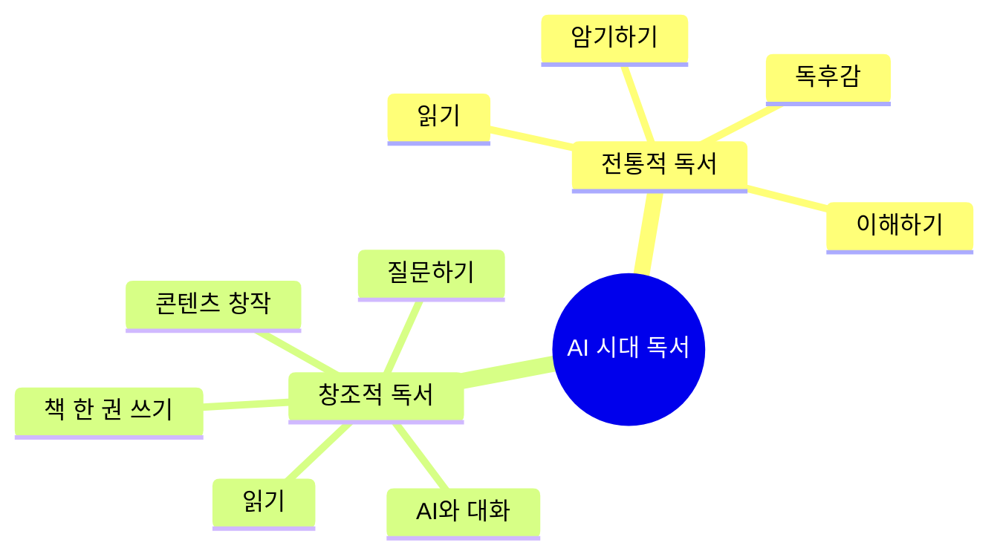
```mermaid
mindmap
  root((AI 시대 독서))
    전통적 독서
      읽기
      이해하기
      암기하기
      독후감
    창조적 독서
      읽기
      질문하기
      AI와 대화
      콘텐츠 창작
      책 한 권 쓰기
```

#### 3대 핵심 원칙

```mermaid
graph LR
    A[1. 읽기] --> B[2. 내면화]
    B --> C[3. 창조]
    
    A --> A1[10장 단위<br/>요약 훈련]
    B --> B1[내 생각 정리<br/>AI와 대화]
    C --> C1[콘텐츠 제작<br/>책 쓰기]
    
    style A fill:#e1f5ff,color:#111
    style B fill:#fff3e1,color:#111
    style C fill:#ccffcc,color:#111
```

### 13.2 단계별 실천 프로세스

#### 전체 구조도

```mermaid
flowchart TD
    Start[책 선정] --> Phase1[1단계: 읽기 & 요약]
    Phase1 --> Phase2[2단계: 내면화]
    Phase2 --> Phase3[3단계: AI 대화]
    Phase3 --> Phase4[4단계: 주제 확장]
    Phase4 --> Phase5[5단계: 책 쓰기]
    Phase5 --> End[나만의 책 완성]
    
    Phase1 --> P1Detail[10장씩 읽고<br/>핵심 요약]
    Phase2 --> P2Detail[나의 생각<br/>경험과 연결]
    Phase3 --> P3Detail[AI에게 질문<br/>다양한 관점]
    Phase4 --> P4Detail[주제 도출<br/>목차 구성]
    Phase5 --> P5Detail[AI 협업<br/>집필 & 편집]
    
    style Start fill:#e1f5ff,color:#111
    style End fill:#ccffcc,color:#111
    style Phase3 fill:#fff3e1,color:#111
```

---

#### 1단계: 읽기 & 요약 (10장 단위)

**목표**: 내용 이해 + 요약 능력 향상

```mermaid
graph TD
    A[10장 읽기] --> B[핵심 내용 파악]
    B --> C[3줄 요약]
    C --> D[주요 개념 추출]
    D --> E[질문 리스트 작성]
    E --> F[다음 10장으로]
    
    B --> B1[누가, 무엇을, 왜]
    C --> C1[한 문단으로 압축]
    D --> D1[키워드 5개]
    E --> E1[궁금한 점 3개]
    
    style A fill:#e1f5ff,color:#111
    style F fill:#ccffcc,color:#111
```

**실천 템플릿**

```markdown
┌─────────────────────────────────────┐
│   📖 10장 독서 & 요약 템플릿         │
└─────────────────────────────────────┘

[기본 정보]
책 제목: _______________________________
읽은 범위: __장 ~ __장
읽은 날짜: _______________________________

[1단계: 3줄 요약]
이 10장을 3줄로 요약하면:
1. ________________________________________
2. ________________________________________
3. ________________________________________

[2단계: 핵심 개념 추출]
이 부분에서 가장 중요한 개념 5가지:
1. _____________ (관련 페이지: p.___)
2. _____________ (관련 페이지: p.___)
3. _____________ (관련 페이지: p.___)
4. _____________ (관련 페이지: p.___)
5. _____________ (관련 페이지: p.___)

[3단계: 인상 깊은 문장]
가장 인상 깊었던 문장 1개:
"_________________________________________"
(p.___)

왜 인상 깊었는가:
________________________________________

[4단계: 질문 리스트]
이 부분을 읽으며 생긴 질문 3개:
Q1: ________________________________________
Q2: ________________________________________
Q3: ________________________________________

[5단계: 한 문장 핵심]
이 10장을 한 문장으로 표현하면:
"_________________________________________"
```

**초·중·고별 적용**

| 학교급 | 분량 | 요약 방식 | 소요 시간 |
|--------|------|----------|----------|
| **초등** | 5-10페이지 | 그림 + 3줄 요약 | 30분 |
| **중등** | 10-20페이지 | 키워드 중심 요약 | 45분 |
| **고등** | 20-30페이지 | 개념 중심 분석 | 60분 |

---

#### 2단계: 내면화 (나의 생각 정리)

**목표**: 읽은 내용을 자신의 경험·생각과 연결

```mermaid
mindmap
  root((내면화))
    나의 경험
      비슷한 경험
      다른 경험
      감정 반응
    나의 생각
      동의/반대
      의문점
      새로운 아이디어
    나의 삶과 연결
      현재 상황
      미래 계획
      실천 방안
    가치관 점검
      내가 중요하게 여기는 것
      변화된 생각
      새로 알게 된 것
```

**실천 템플릿**

```markdown
┌─────────────────────────────────────┐
│   💭 내면의 생각 정리 템플릿         │
└─────────────────────────────────────┘

[1단계: 공감 포인트]
이 내용 중 가장 공감되는 부분:
________________________________________

왜 공감하는가 (내 경험과 연결):
________________________________________

[2단계: 반대 포인트]
이 내용 중 동의하기 어려운 부분:
________________________________________

왜 동의하기 어려운가:
________________________________________

[3단계: 내 삶과의 연결]
이 내용이 내 삶에 어떤 의미인가:
________________________________________

현재 내가 직면한 상황과 어떻게 연결되는가:
________________________________________

[4단계: 감정 반응]
이 내용을 읽으며 느낀 감정:
□ 기쁨  □ 슬픔  □ 분노  □ 놀라움  
□ 혼란  □ 희망  □ 두려움  □ 기타: ____

왜 그런 감정이 들었는가:
________________________________________

[5단계: 질문 심화]
이 내용으로부터 생기는 근본적 질문:
Q1: ________________________________________
Q2: ________________________________________

[6단계: 실천 계획]
이 내용을 바탕으로 내가 할 수 있는 것:
1. 오늘: ___________________________________
2. 이번 주: ________________________________
3. 한 달 안에: _____________________________
```

---

#### 3단계: AI와 대화 (다양한 관점 탐구)

**목표**: AI를 활용한 사고 확장 + 통찰 발견

```mermaid
graph TD
    A[질문 준비] --> B[AI에게 질문]
    B --> C[답변 받기]
    C --> D[비판적 검토]
    D --> E[추가 질문]
    E --> F[통찰 도출]
    
    B --> B1[개념 설명 요청]
    B --> B2[다른 관점 요청]
    B --> B3[사례 요청]
    B --> B4[비판 요청]
    
    D --> D1[사실 확인]
    D --> D2[논리 검증]
    D --> D3[편향 발견]
    
    F --> F1[새로운 아이디어]
    F --> F2[주제 도출]
    
    style A fill:#e1f5ff,color:#111
    style F fill:#ccffcc,color:#111
```

**AI 대화 4가지 유형**

```mermaid
mindmap
  root((AI 활용))
    개념 탐구
      "이 개념을 다르게 설명하면?"
      "실생활 예시는?"
      "반대 개념은?"
    관점 확장
      "경제학자라면?"
      "예술가라면?"
      "과학자라면?"
    비판적 분석
      "이 주장의 한계는?"
      "반론은 무엇인가?"
      "대안은?"
    창작 지원
      "이 주제로 글을 쓴다면?"
      "목차 구성은?"
      "연결 가능한 주제는?"
```

**실천 템플릿**

```markdown
┌─────────────────────────────────────┐
│   🤖 AI 대화 기록 템플릿             │
└─────────────────────────────────────┘

[대화 주제]
오늘 탐구할 주제: ___________________________

[대화 1: 개념 이해]
나의 질문:
"________________________________________"

AI 답변 요약:
________________________________________

내가 이해한 것:
________________________________________

추가 질문:
"________________________________________"

[대화 2: 다양한 관점]
나의 질문:
"이 문제를 [   ] 관점에서 본다면?"
(예: 경제학, 심리학, 역사학 등)

AI 답변 핵심:
________________________________________

새롭게 발견한 통찰:
________________________________________

[대화 3: 비판적 검토]
나의 질문:
"이 주장의 한계는 무엇인가?"

AI 답변:
________________________________________

내가 추가로 생각한 한계:
________________________________________

[대화 4: 창작 연결]
나의 질문:
"이 주제로 글을 쓴다면 어떤 목차?"

AI 제안:
1. ________________________________________
2. ________________________________________
3. ________________________________________

내가 수정한 목차:
1. ________________________________________
2. ________________________________________
3. ________________________________________

[통찰 정리]
오늘 AI와의 대화에서 얻은 가장 중요한 통찰:
"_________________________________________"
```

---

#### 4단계: 주제 확장 (책 쓰기 준비)

**목표**: 여러 책에서 공통 주제 발견 + 나만의 관점 정립

```mermaid
flowchart LR
    A[책 1] --> D[공통 주제 발견]
    B[책 2] --> D
    C[책 3] --> D
    
    D --> E[나만의 관점]
    E --> F[목차 구성]
    F --> G[집필 계획]
    
    D --> D1[패턴 인식]
    D --> D2[차이점 분석]
    E --> E1[내 경험 통합]
    E --> E2[독창적 해석]
    F --> F1[논리적 구조]
    G --> G1[단계별 일정]
    
    style A fill:#e1f5ff,color:#111
    style B fill:#e1f5ff,color:#111
    style C fill:#e1f5ff,color:#111
    style G fill:#ccffcc,color:#111
```

**주제 발견 프로세스**

```mermaid
graph TD
    Start[읽은 책 목록] --> Step1[각 책의 핵심 개념 나열]
    Step1 --> Step2[공통 개념 찾기]
    Step2 --> Step3[차이점 분석]
    Step3 --> Step4[나만의 질문 생성]
    Step4 --> Step5[주제 확정]
    Step5 --> End[책 제목 정하기]
    
    Step2 --> Ex1[예: 3권 모두 '자유' 언급]
    Step3 --> Ex2[예: 각 책의 자유 정의가 다름]
    Step4 --> Ex3[예: 진정한 자유란?]
    Step5 --> Ex4[예: 청소년이 본 자유의 의미]
    
    style Start fill:#e1f5ff,color:#111
    style End fill:#ccffcc,color:#111
```

**실천 템플릿**

```markdown
┌─────────────────────────────────────┐
│   📚 주제 확장 & 책 기획 템플릿      │
└─────────────────────────────────────┘

[읽은 책 목록]
1. ______________ (핵심 개념: ___________)
2. ______________ (핵심 개념: ___________)
3. ______________ (핵심 개념: ___________)
4. ______________ (핵심 개념: ___________)

[공통 주제 발견]
모든 책에서 공통적으로 다루는 주제:
________________________________________

각 책의 관점 차이:
- 책 1: _____________________________________
- 책 2: _____________________________________
- 책 3: _____________________________________

[나만의 관점]
나는 이 주제에 대해 어떻게 생각하는가:
________________________________________

내 경험을 통해 발견한 것:
________________________________________

내가 기여할 수 있는 새로운 관점:
________________________________________

[책 기획]
책 제목 (초안):
"_________________________________________"

부제:
"_________________________________________"

목표 독자:
________________________________________

핵심 메시지:
"_________________________________________"

[목차 구성 (10-12장)]
서문: ______________________________________

Part 1: 문제 제기
- 1장: _____________________________________
- 2장: _____________________________________
- 3장: _____________________________________

Part 2: 탐구와 분석
- 4장: _____________________________________
- 5장: _____________________________________
- 6장: _____________________________________
- 7장: _____________________________________

Part 3: 나의 제안
- 8장: _____________________________________
- 9장: _____________________________________
- 10장: ____________________________________

결론: ______________________________________

[집필 계획]
시작일: ___________________________________
목표 완료일: _______________________________
주당 집필 시간: ____________________________
1주차 목표: ________________________________
```

---

#### 5단계: AI 협업 집필

**목표**: AI와 함께 책 한 권 완성하기

```mermaid
graph TD
    A[1장 집필] --> B[AI에게 초안 요청]
    B --> C[내가 수정/보완]
    C --> D[AI에게 개선 제안 요청]
    D --> E[최종 완성]
    E --> F[다음 장으로]
    F --> G[전체 편집]
    G --> H[책 완성]
    
    B --> B1[아이디어 확장]
    C --> C1[내 경험 추가]
    C --> C2[내 생각 명확화]
    D --> D1[논리 검증]
    D --> D2[문체 개선]
    G --> G1[일관성 점검]
    G --> G2[출판 준비]
    
    style A fill:#e1f5ff,color:#111
    style H fill:#ccffcc,color:#111
```

**AI 협업 프로세스**

```mermaid
flowchart LR
    A[내가 하는 것] --> C[AI가 하는 것]
    C --> D[내가 다시 하는 것]
    
    A --> A1[주제 선정]
    A --> A2[목차 구성]
    A --> A3[핵심 아이디어]
    A --> A4[경험 서술]
    
    C --> C1[자료 조사]
    C --> C2[초안 작성]
    C --> C3[문장 다듬기]
    C --> C4[논리 검증]
    
    D --> D1[최종 판단]
    D --> D2[감정 부여]
    D --> D3[가치 입력]
    D --> D4[출판 결정]
    
    style A fill:#e1f5ff,color:#111
    style D fill:#ccffcc,color:#111
```

**장별 집필 프롬프트 템플릿**

```markdown
┌─────────────────────────────────────┐
│   ✍️ 장별 AI 협업 집필 템플릿        │
└─────────────────────────────────────┘

[장 기본 정보]
장 번호: __장
장 제목: "___________________________________"
핵심 메시지: _______________________________
목표 분량: _________자 (A4 __페이지)

[1단계: AI에게 초안 요청]
프롬프트:
"나는 '______________' 주제로 책을 쓰고 있어.
__장은 '___________'에 대한 내용인데,
다음 개요를 바탕으로 초안을 작성해줘:

[개요]
- 도입: ____________________________________
- 본문 1: __________________________________
- 본문 2: __________________________________
- 본문 3: __________________________________
- 마무리: __________________________________

독자는 [      ]이고, 톤은 [      ]으로 해줘."

[2단계: AI 초안 받기]
(여기에 AI가 작성한 초안 붙여넣기)

[3단계: 내가 수정하기]
수정 포인트:
□ 내 경험 추가할 부분: _____________________
□ 내 생각이 더 필요한 부분: _________________
□ 삭제할 부분: _____________________________
□ 강조할 부분: _____________________________

[4단계: AI에게 개선 요청]
프롬프트:
"위 초안을 다음과 같이 개선해줘:
1. [          ] 부분을 더 구체적으로
2. [          ] 부분의 논리를 강화
3. [          ] 부분에 예시 추가"

[5단계: 최종 완성]
최종본 상태:
□ 핵심 메시지 명확
□ 논리 구조 탄탄
□ 내 목소리가 들어감
□ 독자가 이해하기 쉬움
□ 다음 장과 자연스럽게 연결

완성 날짜: _________________________________
```

---

### 13.3 학교급별 적용 가이드

#### 초등학생: 그림책 한 권 만들기

```mermaid
graph LR
    A[동화 3권 읽기] --> B[공통 주제 찾기]
    B --> C[나만의 이야기 구상]
    C --> D[AI로 그림 생성]
    D --> E[그림책 완성]
    
    B --> B1[예: 우정]
    C --> C1[내 경험 녹이기]
    D --> D1[Midjourney 활용]
    E --> E1[출력 제본]
    
    style A fill:#e1f5ff,color:#111
    style E fill:#ccffcc,color:#111
```

**프로젝트 예시**: "나만의 동화 만들기"
- 읽은 책: 『마당을 나온 암탉』, 『샬롯의 거미줄』, 『100만 번 산 고양이』
- 공통 주제: 사랑과 희생
- 나의 이야기: 우리 할머니와 나
- AI 활용: 그림 생성, 스토리 다듬기
- 결과: 20페이지 그림책 완성

---

#### 중학생: 에세이집 만들기

```mermaid
graph LR
    A[책 5권 읽기] --> B[각 책마다 에세이]
    B --> C[주제별 분류]
    C --> D[AI로 편집]
    D --> E[전자책 출간]
    
    B --> B1[책당 2000자]
    C --> C1[4-5개 주제]
    D --> D1[일관성 유지]
    E --> E1[PDF/전자책]
    
    style A fill:#e1f5ff,color:#111
    style E fill:#ccffcc,color:#111
```

**프로젝트 예시**: "중학생이 본 정의"
- 읽은 책: 『난장이가 쏘아올린 작은 공』, 『1984』, 『동물농장』 등
- 에세이 주제:
  1. 경제적 정의란?
  2. 정치적 자유란?
  3. 권력의 부패
  4. 청소년의 권리
  5. 정의로운 사회를 위한 제안
- 결과: 50페이지 에세이집

---

#### 고등학생: 인문학 서적 집필

```mermaid
graph LR
    A[책 10권 읽기] --> B[통합 주제 도출]
    B --> C[학술적 분석]
    C --> D[AI 협업 집필]
    D --> E[논문 수준 완성]
    
    B --> B1[철학적 질문]
    C --> C1[이론 + 사례]
    D --> D1[논리 구조화]
    E --> E1[출판 or 포트폴리오]
    
    style A fill:#e1f5ff,color:#111
    style E fill:#ccffcc,color:#111
```

**프로젝트 예시**: "AI 시대의 인간 정체성"
- 읽은 책: 『사피엔스』, 『호모 데우스』, 『이방인』 등
- 목차:
  Part 1: 인간이란 무엇인가
  Part 2: 기술이 바꾸는 인간
  Part 3: 미래 인간의 조건
  Part 4: 청소년의 관점
- AI 활용: 자료 조사, 논리 검증, 문장 다듬기
- 결과: 100페이지 인문학 서적 + 입시 포트폴리오

---

### 13.4 평가 기준

#### 프로세스 평가

```mermaid
graph TD
    A[평가 영역] --> B[읽기 30%]
    A --> C[내면화 20%]
    A --> D[AI 활용 20%]
    A --> E[창작 30%]
    
    B --> B1[요약의 정확성]
    B --> B2[개념 추출 능력]
    
    C --> C1[자기 성찰 깊이]
    C --> C2[경험 연결성]
    
    D --> D1[질문의 질]
    D --> D2[비판적 검토]
    
    E --> E1[독창성]
    E --> E2[완성도]
    E --> E3[논리성]
    
    style A fill:#e1f5ff,color:#111
    style B fill:#fff3e1,color:#111
    style C fill:#fff3e1,color:#111
    style D fill:#fff3e1,color:#111
    style E fill:#ccffcc,color:#111
```

#### 결과물 평가

| 평가 항목 | 우수 | 보통 | 미흡 | 배점 |
|----------|------|------|------|------|
| **독창성** | 새로운 관점과 통찰 | 일부 독창성 | 모방 수준 | 25점 |
| **논리성** | 일관되고 설득력 있음 | 기본 논리 구조 | 논리 비약 | 25점 |
| **깊이** | 깊이 있는 분석 | 표면적 이해 | 단순 요약 | 20점 |
| **AI 활용** | 전략적 협업 | 기본적 활용 | 단순 복붙 | 15점 |
| **완성도** | 출판 가능 수준 | 초안 수준 | 미완성 | 15점 |

---

## 14. 독서중점학교 & 인문학실천학교 실제 운영 방식

### 14.1 독서 중점학교 운영 모델

#### 전체 운영 구조

```mermaid
graph TD
    A[학교 선정] --> B[팀 구성]
    B --> C[연간 계획 수립]
    C --> D[교사 연수]
    D --> E[학생 오리엔테이션]
    E --> F[독서 프로그램 운영]
    F --> G[중간 평가]
    G --> H[프로그램 개선]
    H --> I[최종 평가]
    I --> J[성과 보고]
    
    B --> B1[독서교육팀<br/>사서<br/>교과교사]
    C --> C1[필독서 선정<br/>예산 배정<br/>일정 수립]
    F --> F1[정규 수업<br/>독서 모임<br/>프로젝트]
    
    style A fill:#e1f5ff,color:#111
    style J fill:#ccffcc,color:#111
```

#### 주간 운영 스케줄 (실제 예시)

```mermaid
gantt
    title 독서중점학교 주간 스케줄
    dateFormat  HH:mm
    section 월요일
    아침 독서 (전교생)    :09:00, 20min
    section 화요일
    독서 수업 (국어 연계) :10:00, 45min
    section 수요일
    자율 독서 시간        :13:00, 30min
    section 목요일
    독서 동아리           :15:00, 60min
    section 금요일
    독서 일지 작성        :09:00, 20min
```

#### 학년별 운영 차별화

```mermaid
mindmap
  root((독서 중점학교))
    초등 1-2학년
      그림책 중심
      소리내어 읽기
      독서 놀이
    초등 3-4학년
      동화 → 단편소설
      독서 일기
      발표 활동
    초등 5-6학년
      장편소설
      독서 토론
      프로젝트
    중학교
      교과 연계
      비판적 독서
      에세이 작성
```

---

### 14.2 인문학 실천학교 운영 모델

#### 전체 시스템 구조

```mermaid
flowchart TD
    A[인문학 실천학교] --> B[교육과정 통합]
    A --> C[공간 조성]
    A --> D[프로그램 운영]
    
    B --> B1[교과 융합 수업]
    B --> B2[인문학 과목 신설]
    B --> B3[프로젝트 수업]
    
    C --> C1[인문학 도서관]
    C --> C2[토론 공간]
    C --> C3[작가 만남 공간]
    
    D --> D1[세미나]
    D --> D2[작가 초청]
    D --> D3[인문학 주간]
    D --> D4[논문 작성]
    
    style A fill:#e1f5ff,color:#111
    style B1 fill:#fff3e1,color:#111
    style D1 fill:#ccffcc,color:#111
```

#### 연간 프로그램 사이클

```mermaid
gantt
    title 인문학실천학교 연간 운영
    dateFormat  YYYY-MM-DD
    section 1학기
    인문학 세미나 운영      :2024-03-01, 16w
    작가 초청 강연 (월1회)  :2024-03-15, 16w
    인문학 동아리           :2024-03-01, 16w
    section 행사
    인문학 주간             :2024-05-01, 1w
    중간발표회              :2024-06-15, 1w
    section 2학기
    심화 세미나             :2024-09-01, 16w
    논문 작성 프로젝트      :2024-10-01, 12w
    인문학 축제             :2024-11-15, 1w
    최종발표회              :2024-12-15, 1w
```

#### 인문학 세미나 운영 구조

```mermaid
graph LR
    A[세미나 주제 선정] --> B[사전 독서]
    B --> C[발제문 작성]
    C --> D[세미나 진행]
    D --> E[토론 & 질의응답]
    E --> F[성찰 일지]
    F --> G[다음 주제로]
    
    A --> A1[교사 + 학생<br/>공동 선정]
    B --> B1[2주 독서 기간]
    C --> C1[발제자 2-3명]
    D --> D1[소크라테스식<br/>질문 중심]
    E --> E1[자유 토론<br/>20-30분]
    
    style A fill:#e1f5ff,color:#111
    style G fill:#ccffcc,color:#111
```

---

### 14.3 실제 운영 사례 (추측 기반)

#### 사례 1: 서울 ○○중학교 (독서 중점학교)

```mermaid
mindmap
  root((○○중학교))
    운영 특징
      매주 수요일 1교시
      전교생 독서 시간
      학급 문고 200권
    특색 프로그램
      독서 마라톤
      북튜버 대회
      책 축제
    성과
      독서량 250% 증가
      문해력 향상
      학생 만족도 92%
    어려움
      교사 업무 부담
      예산 부족
      학생 개인차
```

**운영 프로세스**

```mermaid
flowchart LR
    A[3월: 오리엔테이션] --> B[4-6월: 1학기 운영]
    B --> C[7월: 중간평가]
    C --> D[9-11월: 2학기 운영]
    D --> E[12월: 최종평가]
    
    A --> A1[필독서 배부<br/>목표 설정]
    B --> B1[주간 독서<br/>월간 토론]
    C --> C1[독서량 점검<br/>프로그램 개선]
    D --> D1[심화 활동<br/>프로젝트]
    E --> E1[성과 공유<br/>시상]
    
    style A fill:#e1f5ff,color:#111
    style E fill:#ccffcc,color:#111
```

**성과 지표**

| 지표 | 시행 전 | 시행 후 | 증가율 |
|------|---------|---------|--------|
| 1인당 연간 독서량 | 8권 | 20권 | 250% |
| 독서 동아리 참여율 | 15% | 45% | 200% |
| 도서관 이용률 | 주 1회 | 주 3회 | 300% |
| 문해력 평가 점수 | 65점 | 78점 | 20% |

---

#### 사례 2: 서울 △△고등학교 (인문학 실천학교)

```mermaid
mindmap
  root((△△고등학교))
    교육과정 통합
      인문학 세미나 정규과목
      교과 융합 수업
      논문 작성 수업
    시설 & 공간
      인문학 라운지
      토론실 3개
      작가 초청 홀
    프로그램
      월1회 작가 만남
      분기별 인문학 주간
      연 2회 논문 발표회
    성과
      인문계 진학률 30% 증가
      독서 습관 정착
      비판적 사고력 향상
```

**세미나 운영 사이클**

```mermaid
graph TD
    Week1[1주차: 주제 발표 & 독서] --> Week2[2주차: 발제문 작성]
    Week2 --> Week3[3주차: 세미나 진행]
    Week3 --> Week4[4주차: 성찰 & 다음 준비]
    Week4 --> Week1
    
    Week1 --> W1D[필독서 배부<br/>질문 리스트 작성]
    Week2 --> W2D[발제자 발표 준비<br/>토론 질문 준비]
    Week3 --> W3D[2시간 세미나<br/>소크라테스식 대화]
    Week4 --> W4D[성찰 에세이<br/>다음 주제 투표]
    
    style Week1 fill:#e1f5ff,color:#111
    style Week3 fill:#ccffcc,color:#111
```

**연간 주요 행사**

| 시기 | 행사명 | 내용 | 참여 인원 |
|------|--------|------|-----------|
| 3월 | 인문학 주간 | 작가 초청, 전시, 토론 대회 | 전교생 |
| 6월 | 1학기 논문 발표회 | 학생 논문 발표 | 2학년 전체 |
| 9월 | 철학의 달 | 철학 세미나, 영화 상영 | 희망자 |
| 12월 | 인문학 축제 | 최종 발표, 시상, 전시 | 전교생 |

---

### 14.4 운영상 핵심 성공 요인 (추측)

```mermaid
mindmap
  root((성공 요인))
    학교장 의지
      예산 확보
      교사 지원
      시간 배정
    교사 역량
      독서교육 연수
      교과 통합 능력
      학생 코칭
    학생 참여
      자율성 보장
      흥미 유발
      보상 체계
    지역사회 협력
      도서관 연계
      작가 초청
      학부모 참여
    지속가능성
      시스템화
      예산 안정성
      효과 검증
```

---

## 15. 자주 묻는 질문 (FAQ) 40선

> **컨텐츠, 운영, 선정, 평가 등 전 영역**

### Part 1: 제도 & 선정 관련 (Q1-Q10)

<details>
<summary><b>Q1. 독서 중점학교와 인문학 실천학교의 차이는 무엇인가요?</b></summary>

**A: 대상과 운영 목적이 다릅니다.**

| 구분 | 독서 중점학교 | 인문학 실천학교 |
|------|-------------|---------------|
| **대상** | 초·중학교 | 고등학교 |
| **목적** | 독서 습관 형성, 문해력 기초 | 인문학적 소양, 비판적 사고 심화 |
| **방식** | 정규 독서 시간, 학급 단위 | 세미나, 프로젝트, 논문 작성 |
| **필독서** | 연령별 적합 도서 | 인문학 고전 + 현대 이론서 |
| **결과물** | 독서 포트폴리오, 감상문 | 논문, 에세이, 프로젝트 |
</details>

<details>
<summary><b>Q2. 선발 기준은 무엇인가요?</b></summary>

**A: 5대 평가 영역으로 선발합니다.**

```mermaid
mindmap
  root((선발 기준))
    학교 환경 20%
      도서관 시설
      독서 공간
      장서 구성
    교원 역량 25%
      독서교육 경험
      연수 의지
      전문성
    교육과정 연계 25%
      교과 통합 계획
      연간 운영 계획
      핵심 개념 연계
    학교 의지 20%
      학교장 추진력
      예산 확보
      공동체 합의
    지역사회 협력 10%
      도서관 연계
      학부모 참여
      지역 자원
```

**점수 배분 (100점 만점)**
- 학교 환경: 20점
- 교원 역량: 25점
- 교육과정 연계: 25점
- 학교 운영 의지: 20점
- 지역사회 협력: 10점

**가산점**
- 독서교육 우수 사례: +5점
- 교육 소외 지역: +3점
</details>

<details>
<summary><b>Q3. 신청 절차는 어떻게 되나요?</b></summary>

**A: 6단계 프로세스를 거칩니다.**

```mermaid
flowchart LR
    A[1. 공모 공고] --> B[2. 제안서 작성]
    B --> C[3. 서류 제출]
    C --> D[4. 서류 심사]
    D --> E[5. 발표 심사]
    E --> F[6. 선정 발표]
    
    A --> A1[교육청 공고<br/>12월-1월]
    B --> B1[학교 내부 준비<br/>1-2월]
    C --> C1[온라인 제출<br/>2월 말]
    D --> D1[교육청 심사<br/>3월 초]
    E --> E1[현장 방문<br/>3월 중]
    F --> F1[선정 통보<br/>3월 말]
    
    style A fill:#e1f5ff,color:#111
    style F fill:#ccffcc,color:#111
```

**제출 서류**
1. 제안서 (양식 제공)
2. 학교 시설 현황
3. 교사 명단 및 경력
4. 연간 운영 계획
5. 예산 계획서
</details>

<details>
<summary><b>Q4. 지원 예산은 얼마나 되나요?</b></summary>

**A: 학교당 연간 1,000만원~3,000만원 추정**

| 학교 유형 | 예산 규모 (추정) | 용도 |
|----------|--------------|------|
| **독서 중점학교 (초등)** | 1,000만원~1,500만원 | 도서 구입, 행사 운영 |
| **독서 중점학교 (중등)** | 1,500만원~2,000만원 | 도서, 행사, 교재 |
| **인문학 실천학교 (고등)** | 2,000만원~3,000만원 | 도서, 작가 초청, 시설 |

**예산 사용 항목**
- 도서 구입비: 40-50%
- 행사 운영비: 20-30%
- 교재 및 자료: 10-15%
- 시설 개선비: 15-20%
- 연수비: 5-10%
</details>

<details>
<summary><b>Q5. 시범 기간은 얼마나 되나요?</b></summary>

**A: 보통 2년 + 추가 1년 연장 가능**

```mermaid
gantt
    title 시범학교 운영 기간
    dateFormat  YYYY-MM-DD
    section 1차년도
    오리엔테이션 & 준비     :2024-03-01, 1M
    1학기 운영              :2024-04-01, 4M
    중간 평가               :2024-07-01, 1M
    2학기 운영              :2024-09-01, 4M
    1차년도 평가            :2024-12-01, 1M
    section 2차년도
    프로그램 개선           :2025-03-01, 1M
    본격 운영               :2025-04-01, 8M
    최종 평가               :2025-12-01, 1M
    section 연장 (선택)
    심화 프로그램           :2026-03-01, 12M
```

**평가 시점**
- 1학기 말: 중간 점검
- 1차년도 말: 종합 평가
- 2차년도 말: 최종 평가 + 연장 심사
</details>

<details>
<summary><b>Q6. 모든 학교가 신청할 수 있나요?</b></summary>

**A: 기본 조건을 충족하면 가능합니다.**

**필수 조건**
```
✓ 학교도서관이 있을 것
✓ 사서 또는 사서교사가 배치되어 있을 것
✓ 최소 독서 시간 확보 가능할 것 (주 1회 이상)
✓ 학교장과 교사의 의지가 있을 것
✓ 학교운영위원회 승인을 받을 것
```

**우대 조건 (가산점)**
```
+ 이전 독서교육 경험
+ 교육 소외 지역
+ 혁신학교 또는 특색학교
+ 지역 도서관과 협력 체계
```
</details>

<details>
<summary><b>Q7. 선정되지 못하면 어떻게 하나요?</b></summary>

**A: 자율적으로 운영하거나 다음 기회를 준비할 수 있습니다.**

**대안 1: 자율 독서 중점 학급 운영**
- 학급 단위 독서 프로그램
- 교사 재량으로 운영
- 예산은 학교 자체 확보

**대안 2: 개념탐독 실천 교실 신청**
- 독서 중점학교보다 작은 규모
- 학급 또는 교과 단위
- 진입 장벽 낮음

**대안 3: 다음 연도 재신청**
- 제안서 피드백 반영
- 부족한 부분 보완
- 1년간 자율 운영 경험 쌓기
</details>

<details>
<summary><b>Q8. 중간에 포기할 수 있나요?</b></summary>

**A: 가능하지만 불이익이 있습니다.**

**중도 포기 시**
- 지원받은 예산 반납
- 향후 3년간 유사 사업 신청 제한
- 교육청 부정적 평가 기록

**부득이한 경우**
- 학교장 교체로 인한 정책 변경
- 교사 대거 이동으로 운영 불가
- 중대한 학교 사정
→ 교육청과 협의 후 조기 종료 가능
</details>

<details>
<summary><b>Q9. 시범 기간 종료 후에도 계속할 수 있나요?</b></summary>

**A: 네, 학교 자체 사업으로 지속 가능합니다.**

```mermaid
graph LR
    A[2년 시범 종료] --> B{평가 결과}
    B -->|우수| C[1년 연장 지원]
    B -->|보통| D[자체 예산 운영]
    
    C --> E[3년차 운영]
    E --> F[학교 정규 사업화]
    
    D --> F
    
    F --> G[지속 가능한<br/>독서 문화 정착]
    
    style A fill:#e1f5ff,color:#111
    style G fill:#ccffcc,color:#111
```

**지속 방안**
- 학교 기본 예산으로 운영
- 학생·학부모 수요가 있어 지속
- 교육청 우수 사례로 확산
- 다른 사업과 통합 운영
</details>

<details>
<summary><b>Q10. 선정 경쟁률은 어느 정도인가요?</b></summary>

**A: 보통 2:1 ~ 3:1 추정**

| 연도 | 신청 학교 (추정) | 선정 학교 | 경쟁률 |
|------|--------------|----------|--------|
| 2024 | 30개교 | 11개교 | 2.7:1 |
| 2025 | 40개교 | 16개교 | 2.5:1 |

**경쟁률 관리 팁**
- 교육청 설명회 참석
- 이전 선정 학교 사례 분석
- 전문가 컨설팅 받기
- 학교만의 특색 강조
</details>

---

### Part 2: 운영 방식 관련 (Q11-Q20)

<details>
<summary><b>Q11. 정규 수업 시간에 독서 시간을 어떻게 확보하나요?</b></summary>

**A: 3가지 방식으로 가능합니다.**

```mermaid
mindmap
  root((독서 시간 확보))
    방식 1: 교과 통합
      국어 시간 활용
      사회 시간 활용
      교과서 연계 독서
    방식 2: 창의적 체험활동
      자율 활동
      동아리 활동
      진로 활동
    방식 3: 학교 자율 시간
      아침 독서 시간
      점심 후 독서
      방과 후 독서
```

**실제 운영 예시**
- 아침 독서 10분 (매일) = 주 50분
- 국어 시간 월 1회 = 주 45분
- 창체 활동 월 2회 = 월 90분
→ **총 주 2시간 내외**
</details>

<details>
<summary><b>Q12. 교사 업무 부담이 크지 않나요?</b></summary>

**A: 초기에는 부담이지만, 시스템화하면 괜찮습니다.**

**업무 부담 요인**
```
❌ 부담 큰 경우:
- 모든 교사가 개별적으로 준비
- 체계 없이 임의로 운영
- 행사 중심의 일회성 활동

✅ 부담 적은 경우:
- 팀 구성하여 역할 분담
- 표준 템플릿 활용
- 정기적·반복적 프로그램
```

**업무 경감 방안**
- 독서교육팀 구성 (5-7명)
- 역할 분담 명확화
- 디지털 도구 활용 (Notion, 구글 클래스룸)
- 학생 자치 활동 확대
- 사서교사와 협업
</details>

<details>
<summary><b>Q13. 필독서는 누가 선정하나요?</b></summary>

**A: 교사·학생·학부모가 함께 선정합니다.**

```mermaid
flowchart TD
    A[필독서 선정 프로세스] --> B[1단계: 후보 도서 추천]
    B --> C[2단계: 검토 및 분류]
    C --> D[3단계: 투표 및 선정]
    D --> E[4단계: 최종 확정]
    
    B --> B1[교사 추천 30권<br/>학생 추천 20권<br/>학부모 추천 10권]
    C --> C1[독서교육팀 검토<br/>난이도·주제 분류]
    D --> D1[학년별 투표<br/>온라인 설문]
    E --> E1[공통 필독서 10권<br/>선택 필독서 20권]
    
    style A fill:#e1f5ff,color:#111
    style E fill:#ccffcc,color:#111
```

**선정 기준**
1. 학생 흥미도
2. 교육적 가치
3. 난이도 적합성
4. 교과 연계성
5. 다양성 (장르, 국적 등)
</details>

<details>
<summary><b>Q14. 학생들이 책을 안 읽으면 어떻게 하나요?</b></summary>

**A: 강제보다는 동기 부여가 핵심입니다.**

**동기 부여 전략**

```mermaid
mindmap
  root((독서 동기 부여))
    흥미 유발
      학생 참여 도서 선정
      다양한 장르 제공
      북트레일러 상영
    보상 체계
      독서 배지
      시상
      포트폴리오 인정
    사회적 동기
      독서 모임
      친구와 공유
      발표 기회
    의미 부여
      삶과 연결
      프로젝트 연계
      진로와 연결
```

**구체적 방법**
- 선택권 부여 (필독서 중 선택)
- 다양한 형식 (오디오북, 웹툰, 그래픽노블)
- 작은 성공 경험 (짧은 책부터)
- 또래 추천 시스템
- 독서 캠페인 (챌린지)
</details>

<details>
<summary><b>Q15. 독서 수준 차이가 큰데 어떻게 운영하나요?</b></summary>

**A: 수준별·맞춤형 접근이 필요합니다.**

```mermaid
graph TD
    A[학생 독서 수준 진단] --> B{수준별 그룹}
    B --> C[기초 그룹]
    B --> D[중급 그룹]
    B --> E[고급 그룹]
    
    C --> C1[쉬운 책<br/>짧은 책<br/>그림책]
    D --> D1[일반 필독서<br/>토론 중심]
    E --> E1[고전<br/>심화 책<br/>논문 작성]
    
    C1 --> F[개별 성장 목표]
    D1 --> F
    E1 --> F
    
    style A fill:#e1f5ff,color:#111
    style F fill:#ccffcc,color:#111
```

**운영 방법**
1. **진단**: 독서 흥미도·수준 파악
2. **그룹화**: 유사 수준끼리 모임 구성
3. **차별화**: 그룹별 도서·활동 다르게
4. **성장 추적**: 개인별 성장 모니터링
5. **유연한 이동**: 수준 변화 시 그룹 재조정
</details>

<details>
<summary><b>Q16. 토론이 원활하지 않으면 어떻게 하나요?</b></summary>

**A: 구조화된 토론 방식을 활용합니다.**

**토론 촉진 기법**

| 기법 | 방법 | 효과 |
|------|------|------|
| **하브루타** | 짝과 질문 주고받기 | 부담 감소, 참여↑ |
| **월드 카페** | 소그룹 순환 토론 | 다양한 의견 청취 |
| **피쉬볼** | 내부 원-외부 원 토론 | 경청 훈련 |
| **PMI 기법** | Plus-Minus-Interesting | 구조화된 분석 |

**단계별 접근**
```
1단계 (초기): 짝 토론 (2명)
2단계: 소그룹 (4-5명)
3단계: 전체 토론 (20명)
```

**교사 역할**
- 열린 질문 던지기
- 침묵 허용 (생각할 시간)
- 모든 의견 존중
- 연결 고리 만들기
</details>

<details>
<summary><b>Q17. 학부모 참여를 어떻게 유도하나요?</b></summary>

**A: 다양한 참여 채널을 제공합니다.**

```mermaid
mindmap
  root((학부모 참여))
    정보 공유
      독서 통신문
      온라인 플랫폼
      학부모 설명회
    직접 참여
      독서 멘토
      작가 초청 지원
      도서 기증
    가정 연계
      가족 독서 시간
      독서 대화
      독후 활동 지원
    평가 참여
      만족도 조사
      개선 의견
      프로그램 제안
```

**구체적 방법**
- 학부모 독서 동아리 운영
- 월 1회 가정 독서 과제
- 학부모 독서 코치 양성
- 도서 추천 참여
- 독서 행사 자원봉사
</details>

<details>
<summary><b>Q18. AI를 어떻게 활용하나요?</b></summary>

**A: 독서의 모든 단계에 AI를 통합합니다.**

```mermaid
flowchart LR
    A[독서 전] --> B[독서 중]
    B --> C[독서 후]
    
    A --> A1[AI로 배경지식 학습]
    A --> A2[AI로 질문 생성]
    
    B --> B1[AI와 대화하며 읽기]
    B --> B2[AI에게 개념 질문]
    
    C --> C1[AI로 비판적 분석]
    C --> C2[AI 협업 창작]
    
    style A fill:#e1f5ff,color:#111
    style C fill:#ccffcc,color:#111
```

**실제 활용 사례**
- ChatGPT: 개념 설명, 토론 주제 생성
- Midjourney: 책 표지 재창작
- Cursor: 독서 프로젝트 개발
- Notion AI: 독서 노트 정리

**윤리 교육 병행**
- AI 의존성 경계
- 비판적 검증 훈련
- 출처 표기 습관
</details>

<details>
<summary><b>Q19. 독서 평가는 어떻게 하나요?</b></summary>

**A: 과정 중심 + 결과 중심 통합 평가**

```mermaid
graph TD
    A[독서 평가] --> B[과정 평가 60%]
    A --> C[결과 평가 40%]
    
    B --> B1[독서 일지 20%]
    B --> B2[토론 참여 20%]
    B --> B3[독서 활동 20%]
    
    C --> C1[독서 감상문 20%]
    C --> C2[프로젝트 20%]
    
    style A fill:#e1f5ff,color:#111
    style B fill:#fff3e1,color:#111
    style C fill:#ccffcc,color:#111
```

**평가 방법**
- 독서 포트폴리오
- 독서 배지 (디지털)
- 교사 관찰 평가
- 동료 평가
- 자기 평가

**생기부 기재**
- 독서 활동 상황
- 창의적 체험활동
- 세부능력 및 특기사항
</details>

<details>
<summary><b>Q20. 예산이 부족하면 어떻게 하나요?</b></summary>

**A: 다양한 대안을 활용할 수 있습니다.**

**예산 절감 방안**
```
1. 공공도서관 협력
   → 단체 대출 활용
   → 사서 파견 요청

2. 전자책 활용
   → 교보문고 스쿨
   → 밀리의 서재 등

3. 도서 교환
   → 학교 간 도서 순환
   → 북스왑 행사

4. 기증 캠페인
   → 학부모 기증
   → 지역사회 후원

5. 무료 자원 활용
   → AI 도구 (ChatGPT 무료)
   → 온라인 자료
```

**교육청 추가 지원**
- 우수 사례 선정 시 인센티브
- 도서관 지원 사업 연계
- 교육복지 예산 활용
</details>

---

### Part 3: 컨텐츠 & 방법론 관련 (Q21-Q30)

<details>
<summary><b>Q21. 개념탐독(개념 기반 탐구 독서)이 정확히 무엇인가요?</b></summary>

**A: 핵심 개념을 중심으로 책을 읽고 탐구하는 방법입니다.**

```mermaid
graph LR
    A[개념 선정] --> B[질문 생성]
    B --> C[도서 탐독]
    C --> D[현실 적용]
    D --> E[전이]
    
    A --> A1[예: 정의]
    B --> B1["정의란 무엇인가?"]
    C --> C1[관련 도서 읽기]
    D --> D1[사회 문제 분석]
    E --> E1[실천 방안 제안]
    
    style A fill:#e1f5ff,color:#111
    style E fill:#ccffcc,color:#111
```

**일반 독서 vs 개념탐독**

| 구분 | 일반 독서 | 개념탐독 |
|------|----------|----------|
| 시작점 | 책 선택 | 개념 선정 |
| 방법 | 처음부터 끝까지 | 개념 중심 정독 |
| 질문 | 내용 이해 질문 | 본질적 질문 |
| 결과 | 독후감 | 개념 적용, 전이 |
</details>

<details>
<summary><b>Q22. 10장씩 읽고 요약하는 방법이 효과적인가요?</b></summary>

**A: 네, 매우 효과적입니다.**

**효과 3가지**
```
1. 메타인지 향상
   → 읽으며 생각하는 습관
   → "내가 이해했는가?" 점검

2. 요약 능력 향상
   → 핵심 파악 훈련
   → 정보 압축 능력

3. 지속 가능성
   → 완독 부담 감소
   → 작은 성취감 누적
```

**10장 단위의 이유**
- 너무 짧으면: 맥락 파악 어려움
- 너무 길면: 집중력 저하, 요약 어려움
- 10장 정도: 적당한 스토리 단위
</details>

<details>
<summary><b>Q23. AI와 대화하는 것이 정말 도움이 되나요?</b></summary>

**A: 네, 단 비판적으로 활용해야 합니다.**

```mermaid
mindmap
  root((AI 대화의 가치))
    사고 확장
      다양한 관점 제공
      질문 생성 도움
      개념 설명
    즉각 피드백
      24시간 가능
      무한 질문 가능
      맞춤형 답변
    창의성 증폭
      아이디어 브레인스토밍
      비유 생성
      주제 확장
    비판적 사고
      AI 답변 검증 훈련
      논리 구조 분석
      한계 발견
```

**주의사항**
❌ AI를 진리처럼 맹신
❌ AI 답변 그대로 복붙
❌ 스스로 생각하지 않음

✅ AI 답변 검증하기
✅ 내 생각과 비교하기
✅ AI를 도구로 활용
</details>

<details>
<summary><b>Q24. 책 한 권을 정말 학생이 쓸 수 있나요?</b></summary>

**A: 네, AI 시대에는 충분히 가능합니다.**

**레벨별 목표**

| 학교급 | 목표 분량 | 형식 | 기간 |
|--------|----------|------|------|
| **초등** | 20-30페이지 | 그림책, 동화 | 3-4개월 |
| **중등** | 50-70페이지 | 에세이집 | 4-6개월 |
| **고등** | 80-120페이지 | 인문학 서적 | 6-12개월 |

**실제 사례 (추정)**
```
서울 ○○고 학생 (2024년)
- 주제: "청소년이 본 AI 윤리"
- 읽은 책: 10권
- 기간: 8개월
- 분량: 95페이지
- 결과: 학교 도서관 비치, 입시 포트폴리오
```
</details>

<details>
<summary><b>Q25. 필독서 외에 자유 선택도 가능한가요?</b></summary>

**A: 네, 필독서와 선택서를 병행합니다.**

```mermaid
pie title 연간 독서 구성 (예시)
    "공통 필독서" : 30
    "선택 필독서" : 40
    "자유 독서" : 30
```

**균형 잡힌 구성**
- 공통 필독서 (30%): 학급 전체가 같이 읽고 토론
- 선택 필독서 (40%): 목록 중 개인이 선택
- 자유 독서 (30%): 개인 관심사 따라 자유롭게

**자유 독서 활성화**
- 독서 동아리에서 공유
- 친구에게 추천하기
- 개인 포트폴리오에 포함
</details>

<details>
<summary><b>Q26. 학년을 넘어선 융합 독서도 가능한가요?</b></summary>

**A: 네, 오히려 권장됩니다.**

**융합 독서 유형**

```mermaid
mindmap
  root((융합 독서))
    학년 융합
      1-2학년 연합
      3학년 전체
      전교생 북클럽
    교과 융합
      국어 + 사회
      역사 + 문학
      과학 + 철학
    주제 융합
      환경 (과학+사회+윤리)
      전쟁 (역사+문학+철학)
      AI (기술+윤리+미래)
```

**장점**
- 다양한 관점 습득
- 선후배 교류
- 협업 능력 향상
- 복잡한 문제 이해
</details>

<details>
<summary><b>Q27. 토론이 싸움으로 번지면 어떻게 하나요?</b></summary>

**A: 토론 규칙과 퍼실리테이션이 중요합니다.**

**토론 규칙 (Ground Rules)**
```
1. 사람이 아니라 주장을 비판한다
2. 경청이 먼저, 말하기는 나중
3. "나 전달법" 사용 ("나는 ~하게 생각해")
4. 증거 기반 주장 (책 내용 인용)
5. 열린 마음으로 다른 의견 존중
```

**교사 개입 방법**
```mermaid
flowchart TD
    A[감정적 대립 감지] --> B[잠시 멈추기]
    B --> C[감정 환기]
    C --> D[규칙 상기]
    D --> E[논점 재정리]
    E --> F[토론 재개]
    
    C --> C1["숨 고르기<br/>감정 인정"]
    D --> D1["우리 규칙은?<br/>존중의 의미"]
    E --> E1["쟁점은 무엇?<br/>공통점은?"]
    
    style A fill:#ffe1e1,color:#111
    style F fill:#ccffcc,color:#111
```
</details>

<details>
<summary><b>Q28. 독서와 글쓰기를 어떻게 연결하나요?</b></summary>

**A: 독서의 자연스러운 확장이 글쓰기입니다.**

**연결 단계**
```mermaid
flowchart LR
    A[읽기] --> B[메모]
    B --> C[요약]
    C --> D[감상]
    D --> E[비평]
    E --> F[창작]
    
    A --> A1[내용 이해]
    B --> B1[인상깊은 부분]
    C --> C1[핵심 정리]
    D --> D1[나의 생각]
    E --> E1[분석 & 평가]
    F --> F1[새로운 글]
    
    style A fill:#e1f5ff,color:#111
    style F fill:#ccffcc,color:#111
```

**글쓰기 유형**
1. 독서 일지 (매일)
2. 요약문 (10장마다)
3. 서평 (책 완독 후)
4. 비평 에세이 (심화)
5. 창작 (AI 협업)
</details>

<details>
<summary><b>Q29. 디지털 독서 vs 종이책, 어느 것이 좋나요?</b></summary>

**A: 목적에 따라 병행하는 것이 좋습니다.**

| 구분 | 종이책 | 디지털 |
|------|--------|--------|
| **장점** | 집중력↑, 기억↑, 눈 편함 | 접근성↑, 검색 가능, 비용↓ |
| **단점** | 무겁고 비쌈 | 집중력↓, 눈 피로 |
| **추천** | 정독, 인문학 고전 | 자료 조사, 가벼운 독서 |

**균형 잡힌 활용**
- 필독서: 종이책 (70%)
- 보충 자료: 디지털 (30%)
- AI 활용: 디지털 필수
- 깊이 읽기: 종이책 권장
</details>

<details>
<summary><b>Q30. 독서와 진로를 어떻게 연결하나요?</b></summary>

**A: 독서를 통한 진로 탐색이 가능합니다.**

```mermaid
mindmap
  root((독서와 진로))
    진로 탐색
      다양한 직업군 이해
      인물 전기
      전문 분야 서적
    역량 개발
      문해력
      사고력
      글쓰기
      발표력
    포트폴리오
      독서 이력
      프로젝트
      에세이
      책 집필
    네트워킹
      작가 만남
      전문가 초청
      멘토 연결
```

**진로 연계 독서 프로그램**
- 분야별 추천 도서 목록
- 전문가 초청 강연
- 직업 체험과 독서 연계
- 진로 관련 프로젝트
- 대학 진학 포트폴리오
</details>

---

### Part 4: 성과 & 평가 관련 (Q31-Q40)

<details>
<summary><b>Q31. 독서 효과는 언제쯤 나타나나요?</b></summary>

**A: 단계별로 다르게 나타납니다.**

```mermaid
gantt
    title 독서 효과 발현 시기
    dateFormat  YYYY-MM-DD
    section 즉각 효과
    독서 흥미 증가        :2024-03-01, 1M
    section 단기 효과
    어휘력 향상           :2024-04-01, 3M
    이해력 향상           :2024-05-01, 3M
    section 중기 효과
    사고력 향상           :2024-06-01, 6M
    표현력 향상           :2024-07-01, 6M
    section 장기 효과
    학업 성취도 향상      :2024-09-01, 12M
    인성 및 태도 변화     :2025-03-01, 24M
```

**효과 발현 시기**
- 1-2개월: 독서 흥미, 동기 부여
- 3-6개월: 문해력, 어휘력 향상
- 6-12개월: 사고력, 학업 성취도
- 1-2년: 인성, 가치관, 진로 의식
</details>

<details>
<summary><b>Q32. 성과를 어떻게 측정하나요?</b></summary>

**A: 정량 + 정성 지표를 함께 봅니다.**

**정량 지표**
```
- 1인당 연간 독서량 (권수)
- 도서관 이용률 (%)
- 독서 프로그램 참여율 (%)
- 독서 배지 취득률 (%)
- 독서 만족도 (5점 척도)
```

**정성 지표**
```
- 문해력 평가 (읽기·쓰기 평가)
- 비판적 사고력 변화
- 독서 태도 변화
- 학교 문화 변화
- 교과 성적 연계성
```

**평가 도구**
- 사전-사후 설문
- 표준화 검사 (문해력)
- 포트폴리오 분석
- 면담 및 관찰
</details>

<details>
<summary><b>Q33. 학부모에게 성과를 어떻게 보여주나요?</b></summary>

**A: 가시적 결과물과 데이터로 입증합니다.**

**보고 방법**
```mermaid
mindmap
  root((성과 보고))
    정기 보고서
      월간 독서 통신
      학기말 결과 보고
      연간 백서
    결과물 전시
      독서 포트폴리오
      프로젝트 전시회
      책 출판
    온라인 공유
      학교 홈페이지
      SNS 게시
      동영상 제작
    학부모 참여
      공개 수업
      발표회 초청
      간담회
```

**구체적 내용**
- 개인별 독서 성장 그래프
- Before & After 비교
- 학생 인터뷰 영상
- 우수 결과물 소개
- 학업 성취도 변화 데이터
</details>

<details>
<summary><b>Q34. 입시에 실제로 도움이 되나요?</b></summary>

**A: 네, 여러 방면에서 도움이 됩니다.**

**입시 연계 포인트**

| 영역 | 도움되는 부분 | 구체적 효과 |
|------|-------------|-----------|
| **학생부** | 독서 활동, 창체 활동 | 독서 이력 풍부 |
| **세특** | 교과 독서 활동 | 교과 연계 깊이 |
| **논술** | 사고력, 글쓰기 | 논리적 글쓰기 |
| **면접** | 독서 기반 답변 | 깊이 있는 대답 |
| **포트폴리오** | 독서 프로젝트 | 차별화 자료 |

**실제 사례 (추정)**
```
○○대 합격생 (2024년)
"독서 중점학교 프로그램이 
면접에서 결정적이었어요.
책 이야기를 30분 동안 했습니다."
```
</details>

<details>
<summary><b>Q35. 교육청 평가는 어떻게 이루어지나요?</b></summary>

**A: 연 2회 정기 평가와 최종 평가가 있습니다.**

**평가 일정**
```mermaid
gantt
    title 교육청 평가 일정
    dateFormat  YYYY-MM-DD
    section 1차년도
    중간 평가 (7월)       :2024-07-01, 2w
    연말 평가 (12월)      :2024-12-01, 2w
    section 2차년도
    중간 평가 (7월)       :2025-07-01, 2w
    최종 평가 (12월)      :2025-12-01, 3w
```

**평가 내용**
1. 운영 계획 대비 실행도
2. 학생 참여율 및 만족도
3. 교사 만족도
4. 예산 집행의 적정성
5. 성과 지표 달성도
6. 우수 사례 발굴

**평가 결과 활용**
- 우수: 인센티브, 연장 지원
- 보통: 지속 운영
- 미흡: 개선 권고, 지원 중단 고려
</details>

<details>
<summary><b>Q36. 우수 사례로 선정되면 어떤 혜택이 있나요?</b></summary>

**A: 다양한 혜택과 인정이 있습니다.**

**혜택**
```
1. 예산 지원
   - 추가 예산 지원
   - 1년 연장 지원

2. 홍보 및 확산
   - 교육청 홈페이지 소개
   - 우수 사례집 수록
   - 언론 보도 지원

3. 교사 인센티브
   - 가산점 (승진, 전보)
   - 연수 이수 시간 인정
   - 표창 및 시상

4. 네트워킹
   - 전국 사례 발표 기회
   - 컨설팅 학교로 지정
   - 워크숍 초청
```

**학교 이미지**
- 혁신학교로 인정
- 학부모 선호도 증가
- 우수 교사 지원 증가
</details>

<details>
<summary><b>Q37. 실패 사례는 어떤 경우인가요?</b></summary>

**A: 주로 시스템 부재와 동기 부족이 원인입니다.**

**실패 요인**
```mermaid
mindmap
  root((실패 원인))
    계획 문제
      현실성 부족
      과도한 목표
      체계 없음
    운영 문제
      교사 협력 부족
      업무 과중
      예산 부실 집행
    참여 문제
      학생 흥미 부족
      강제성만 강조
      보상 체계 없음
    환경 문제
      도서 부족
      공간 부족
      시간 확보 어려움
```

**실패 사례 (가상)**
```
××중학교 (2023년)
- 문제: 학교장 교체로 지원 중단
- 결과: 프로그램 중단, 예산 반납
- 교훈: 학교 전체의 합의 필요
```
</details>

<details>
<summary><b>Q38. 지속가능성을 어떻게 확보하나요?</b></summary>

**A: 시스템화와 문화 정착이 핵심입니다.**

```mermaid
flowchart TD
    A[시범 기간] --> B[시스템화]
    B --> C[교사 역량 확보]
    C --> D[학생 자치 활성화]
    D --> E[학교 문화 정착]
    E --> F[자생적 지속]
    
    B --> B1[매뉴얼 제작<br/>템플릿 정리]
    C --> C1[다수 교사 참여<br/>승계 시스템]
    D --> D1[학생 주도 운영<br/>동아리 활성화]
    E --> E1[전통으로 자리매김<br/>정체성 형성]
    
    style A fill:#e1f5ff,color:#111
    style F fill:#ccffcc,color:#111
```

**지속 전략**
1. 매뉴얼화
2. 다수 교사 참여 (특정 교사 의존 탈피)
3. 학생 자치 확대
4. 학부모 참여 제도화
5. 예산 안정화 (학교 기본 예산)
6. 정기 프로그램화
</details>

<details>
<summary><b>Q39. 다른 학교와 네트워킹이 가능한가요?</b></summary>

**A: 네, 교육청 주관 협의회가 있습니다.**

**네트워킹 기회**
```mermaid
mindmap
  root((네트워킹))
    교육청 협의회
      월1회 정기 모임
      사례 공유
      공동 연구
    온라인 플랫폼
      카페 or 밴드
      자료 공유
      질의응답
    워크숍
      연 2회 연수
      우수 사례 발표
      전문가 특강
    상호 방문
      수업 참관
      시설 견학
      교사 교류
```

**협력 활동**
- 공동 필독서 선정
- 학교 간 독서 대회
- 작가 초청 공동 주관
- 도서 순환 시스템
- 교사 연구회 운영
</details>

<details>
<summary><b>Q40. 코로나 같은 비상 상황에서도 운영 가능한가요?</b></summary>

**A: 네, 온·오프라인 병행이 가능합니다.**

**비상 상황 대응**

| 상황 | 대응 방안 | 도구 |
|------|----------|------|
| **전면 온라인** | 전자책 + 화상 토론 | Zoom, Google Meet |
| **부분 등교** | 온·오프 블렌디드 | Padlet, 구글 클래스룸 |
| **정상 등교** | 대면 중심 + 온라인 기록 | Notion, AI 도구 |

**온라인 운영 예시**
```
1. 전자책 단체 구독
2. Zoom 독서 모임 (주 1회)
3. Padlet에 독서 일지 공유
4. AI와 대화 기록 제출
5. 온라인 발표회 (YouTube)
```

**장점**
- 시공간 제약 없음
- 디지털 문해력 동시 향상
- 기록 자동 축적
- AI 활용 확대

</details>

---

## 맺음말

이 가이드는 서울시교육청의 「독서·토론·인문학 교육 2030 추진 계획」을 기반으로  
**독서 중점학교**와 **인문학 실천학교** 운영을 준비하는 학교를 위해 작성되었습니다.

핵심은 **개념 기반 탐구 독서(개념탐독)**를 통해  
단순히 책을 읽는 것을 넘어  
**질문하고, 탐구하고, 적용하고, 전이하는**  
깊이 있는 독서 문화를 만드는 것입니다.

이를 통해 학생들은
- 문해력과 사고력을 기르고
- 인문학적 소양과 비판적 안목을 갖추며
- 삶과 연결된 의미 있는 배움을 경험하게 될 것입니다.

각 학교의 특성과 여건에 맞게  
이 가이드를 참고하여  
창의적이고 실천 가능한 프로그램을 설계하시기 바랍니다.

**"책 읽는 학교, 책 읽는 마을, 책 읽는 대한민국"**을 함께 만들어 갑시다.

---

**작성일**: 2026년 1월  
**참고**: 서울시교육청 독서·토론·인문학 교육 2030 추진 계획 및 관련 언론 보도  
**용도**: 독서 중점학교·인문학 실천학교 제안서 작성 및 운영 참고자료
