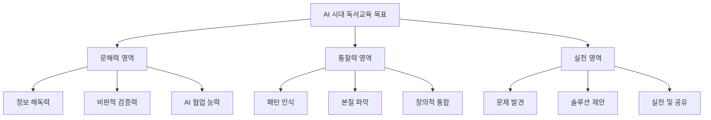

# 독서 중점학교 & 인문학 실천학교 운영 종합 가이드

> 서울시교육청 「독서·토론·인문학 교육 2030 추진 계획」 기반  
> 제안서 작성 및 필독서 선정 참고 자료

---

## 목차

1. [개요 및 비전](#1-개요-및-비전)
2. [운영 방침](#2-운영-방침)
3. [AI 시대 문해력과 직관적 통찰력](#3-ai-시대-문해력과-직관적-통찰력)
4. [학교 유형별 운영 구조](#4-학교-유형별-운영-구조)
5. [선발 절차 및 기준](#5-선발-절차-및-기준)
6. [독서 방법론 - 개념 기반 탐구 독서](#6-독서-방법론---개념-기반-탐구-독서)
7. [AI 연계 수업 설계](#7-ai-연계-수업-설계)
8. [책 선택 기준 및 필독서 선정](#8-책-선택-기준-및-필독서-선정)
9. [운영 프로세스](#9-운영-프로세스)
10. [결과물 및 성과 평가](#10-결과물-및-성과-평가)
11. [제안서 작성 가이드](#11-제안서-작성-가이드)
12. [추천 필독서 목록](#12-추천-필독서-목록)

---

## 1. 개요 및 비전

### 1.1 추진 배경

- **문해력 위기 대응**: AI·디지털 시대 학생들의 읽기·쓰기·이해 능력 저하 심각
- **깊이 있는 학습 필요**: 2022 개정 교육과정의 핵심 개념 중심 학습 구현
- **인문학적 소양 강화**: 비판적 사고력, 공감력, 글로벌 감수성 함양

### 1.2 비전

**"책 읽는 학교, 책 읽는 마을, 책 읽는 서울"**

학교뿐 아니라 지역사회 전체에서 독서·인문학 문화가 일상화되는 생태계 구축

### 1.3 4대 중점 추진 과제

1. **책 읽는 학교 문화 조성**
   - 독서 친화적 물리적 환경 구축
   - 정기적 독서 시간 확보
   - 독서 동아리 및 모임 활성화

2. **수업과 연계한 독서교육**
   - 교과 통합 독서 수업 설계
   - 개념 기반 탐구 독서(개념탐독) 실천
   - 독서-토론-글쓰기-발표 연계 활동

3. **삶과 연계한 인문학 교육**
   - 문학·문화·역사 등 인문학 요소 교육과정 통합
   - 현장 체험 학습 연계(박물관, 작가 초청 등)
   - 글로벌 작가 광장 운영

4. **함께하는 독서·인문학 네트워크 구축**
   - 학교도서관-공공도서관 협력체계
   - 학부모 및 지역사회 참여
   - 교사 역량 강화 연수 프로그램

---

## 2. 운영 방침

### 2.1 핵심 원칙

| 원칙 | 세부 내용 |
|------|-----------|
| **문해력 강화** | 단순 읽기를 넘어 비판·분석·사고력을 포함하는 깊이 있는 독서 교육 |
| **인문학적 가치** | 정체성, 윤리, 사유, 역사, 문화 등 다층적 인간 이해 중심 |
| **자율성과 참여** | 학생·교사 주체성 높은 프로그램 설계, 공동 의사결정 |
| **다양성과 균형** | 국내외 고전/현대, 문학/비문학, 다양한 분야 아우름 |
| **지속 가능성** | 연간·학기 단위 정기 프로그램, 일회성 행사 지양 |
| **성과 평가와 피드백** | 독서 후 활동 결과물 창출 및 피드백을 통한 개선 순환 |

### 2.2 서울 독서교육 핵심 개념 20

모든 학교급에서 공통으로 적용되는 핵심 개념 체계:

**주요 개념 예시**
- 성장, 책임, 도전, 소통, 진실, 변화
- 상상, 문화, 갈등, 공존, 조화, 정의
- 자유, 평등, 다양성, 지속가능성 등

> 각 개념과 연계된 도서를 읽고 탐구·적용·전이하는 방식으로 수업 설계

---

## 3. AI 시대 문해력과 직관적 통찰력

### 3.1 AI 시대 문해력의 재정의

전통적 문해력(읽기·쓰기)에서 **확장된 문해력**으로의 전환이 필요합니다.

#### 전통적 문해력 vs AI 시대 문해력

| 구분 | 전통적 문해력 | AI 시대 문해력 |
|------|--------------|----------------|
| **읽기 대상** | 종이책, 교과서 | 디지털 텍스트, AI 생성 콘텐츠, 멀티미디어 |
| **이해 방식** | 단순 이해 및 암기 | 비판적 분석, 출처 검증, 진위 판별 |
| **쓰기 방식** | 수기 작성 | AI 협업 작성, 프롬프트 설계 |
| **정보 처리** | 선형적 읽기 | 하이퍼링크, 네트워크형 사고 |
| **소통 방식** | 일방향 소통 | 상호작용, 협업, 공유 |

#### AI 시대 문해력의 5대 핵심 요소

```
1. 디지털 문해력 (Digital Literacy)
   └─ 다양한 디지털 매체에서 정보를 읽고 쓰고 활용하는 능력

2. 비판적 문해력 (Critical Literacy)
   └─ 정보의 출처, 의도, 편향성을 분석하고 평가하는 능력

3. AI 문해력 (AI Literacy)
   └─ AI 생성 콘텐츠를 식별하고, AI와 효과적으로 협업하는 능력

4. 멀티미디어 문해력 (Multimedia Literacy)
   └─ 텍스트, 이미지, 영상, 음성 등 복합 매체를 이해하고 제작하는 능력

5. 데이터 문해력 (Data Literacy)
   └─ 데이터와 통계를 읽고 해석하고 활용하는 능력
```

### 3.2 직관적 통찰력의 정의와 중요성

#### 직관적 통찰력이란?

```
직관적 통찰력 (Intuitive Insight)
= 표면적 정보를 넘어 본질을 꿰뚫어 보는 능력
= 패턴 인식 + 개념 연결 + 창의적 도약
```

**AI 시대에 왜 통찰력이 중요한가?**

| 이유 | 설명 |
|------|------|
| **AI가 할 수 없는 영역** | AI는 데이터 기반 분석은 잘하지만, 맥락 이해·가치 판단·창의적 통합은 인간의 고유 영역 |
| **복잡한 문제 해결** | 단순 알고리즘으로 해결 안 되는 문제는 직관과 통찰이 필요 |
| **의미 창조** | 정보를 지혜로 전환하는 과정에서 통찰력 필수 |
| **윤리적 판단** | 기술 활용의 윤리적 방향 설정은 인간의 통찰에 의존 |

#### 직관적 통찰력의 4가지 구성 요소

```
1. 패턴 인식 (Pattern Recognition)
   - 표면적으로 다른 현상에서 공통 패턴 발견
   - 유추와 비유를 통한 개념 연결
   - 예: "호랑이는 사자와 비슷하다" → "권력 구조는 생태계와 비슷하다"

2. 본질 파악 (Essence Grasping)
   - 핵심 개념과 원리 이해
   - 지엽적 정보에서 중심 아이디어 추출
   - 예: 『1984』 → 표면: 미래 소설 / 본질: 권력과 자유의 대립

3. 관계 연결 (Connection Making)
   - 서로 다른 영역의 지식 통합
   - 교과 간, 책 간, 경험 간 연결
   - 예: 생물학(진화) + 경제학(경쟁) → 시장 진화론 이해

4. 창의적 도약 (Creative Leap)
   - 기존 틀을 벗어난 새로운 관점 제시
   - 문제를 다르게 정의하기
   - 예: "가난은 개인 문제다" → "가난은 구조 문제다"
```

### 3.3 목표 체계: AI 시대 문해력 × 통찰력

#### 통합 목표 프레임워크



#### 학교급별 세부 목표

| 학교급 | 문해력 목표 | 통찰력 목표 | 실천 목표 |
|--------|-------------|-------------|-----------|
| **초등** | - 다양한 매체에서 정보 읽기<br>- 사실과 의견 구분<br>- 기본 디지털 도구 활용 | - 이야기 속 패턴 찾기<br>- 인물의 마음 이해하기<br>- 내 경험과 연결하기 | - 독서 일기 쓰기<br>- 친구와 생각 나누기<br>- 읽은 내용 실천하기 |
| **중등** | - 출처 및 신뢰성 평가<br>- 다양한 관점 비교<br>- AI 생성 콘텐츠 식별 | - 텍스트의 숨은 의미 찾기<br>- 개념 간 관계 이해<br>- 사회 문제와 연결하기 | - 토론 및 주장 글쓰기<br>- 프로젝트 수행<br>- 지역사회 문제 탐구 |
| **고등** | - 복잡한 논리 분석<br>- 미디어 편향 비평<br>- AI와 협업하여 글쓰기 | - 철학적 본질 탐구<br>- 학문 간 융합 사고<br>- 새로운 관점 창출 | - 학술적 에세이 작성<br>- 사회 실천 프로젝트<br>- 진로와 연계한 탐구 |

### 3.4 직관력 개발을 위한 독서 전략

#### 전략 1: 질문 중심 읽기 (Question-Based Reading)

**3단계 질문 기법**

```
[1단계] 표면 질문 (Surface Questions)
- 누가? 무엇을? 언제? 어디서?
- 예: 주인공은 누구인가? 사건은 언제 일어났는가?

[2단계] 해석 질문 (Interpretive Questions)
- 왜? 어떻게?
- 예: 주인공은 왜 그런 선택을 했는가?
     작가는 무엇을 말하고 싶은가?

[3단계] 통찰 질문 (Insight Questions)
- 만약...라면? 이것은 무엇을 의미하는가?
- 예: 이 이야기가 현대 사회에 주는 교훈은?
     나라면 어떻게 했을까?
```

#### 전략 2: 개념 맵핑 (Concept Mapping)

```
[책 제목]
    ↓
[핵심 개념 추출]
    ↓
[다른 책/경험과 연결]
    ↓
[새로운 통찰 도출]

예시:
『사피엔스』
    ↓
협력, 상상력, 이야기의 힘
    ↓
『1984』(이야기를 통한 지배)
내 경험(집단의 힘)
    ↓
통찰: 인간은 이야기로 세상을 만들고 지배한다
```

#### 전략 3: 비유적 사고 (Analogical Thinking)

```
이 책/개념은 ~와 같다

예시:
- 『동물농장』은 권력의 부패를 동물 사회로 비유
- "독재는 암세포 같다" → 건강한 세포(민주주의)를 잠식
- "교육은 씨앗을 뿌리는 것과 같다" → 성장의 기초
```

**비유 발견 훈련**
1. 책에서 은유·상징 찾기
2. 그 의미를 현실에 적용하기
3. 자신만의 비유 만들기

#### 전략 4: 관점 전환 읽기 (Perspective Shifting)

```
동일한 텍스트를 다양한 관점으로 재해석

예: 『빨간 모자』
- 어린이 관점: 무서운 늑대 이야기
- 심리학 관점: 성장과 위험 인식
- 페미니즘 관점: 여성에 대한 경고와 통제
- 생태학 관점: 인간과 자연의 관계

→ 다양한 관점 = 풍부한 통찰
```

### 3.5 통찰력 측정 및 평가

#### 정성적 평가 기준

| 수준 | 특징 | 평가 기준 |
|------|------|-----------|
| **1수준<br>(표면 이해)** | 줄거리와 정보 이해 | - 사실 정보를 정확히 파악함<br>- 기본적인 내용 요약 가능 |
| **2수준<br>(해석)** | 의미 해석 및 분석 | - 작가의 의도 파악<br>- 인물의 동기 이해<br>- 주제 설명 가능 |
| **3수준<br>(비판)** | 비판적 평가 | - 텍스트의 논리 평가<br>- 다른 관점과 비교<br>- 한계 지적 가능 |
| **4수준<br>(통찰)** | 새로운 의미 창출 | - 다른 영역과 연결<br>- 자신만의 해석 제시<br>- 실천 방안 도출 |

#### 통찰력 평가 루브릭

```
[평가 영역 1] 패턴 인식 능력
□ 서로 다른 텍스트에서 공통 패턴을 발견하는가?
□ 비유와 상징을 이해하고 해석하는가?

[평가 영역 2] 본질 파악 능력
□ 표면 정보를 넘어 핵심 개념을 추출하는가?
□ 주제와 메시지를 명확히 설명하는가?

[평가 영역 3] 연결 능력
□ 책의 내용을 자신의 경험과 연결하는가?
□ 다른 교과나 사회 문제와 연계하는가?

[평가 영역 4] 창의적 사고
□ 기존과 다른 새로운 해석을 제시하는가?
□ 독창적인 질문이나 관점을 보여주는가?
```

### 3.6 AI 시대 독서교육의 궁극적 목표

#### 목표 피라미드

```
                   [지혜로운 시민]
                  사회 기여·가치 창출
                 /                    \
           [비판적 사고자]          [창의적 실천가]
          정보 검증·윤리 판단      문제 해결·혁신
         /                                        \
    [능동적 독자]                              [AI 협업자]
   깊이 있는 읽기                          기술 활용 역량
   /                                                      \
[기본 문해력]                                        [디지털 문해력]
읽기·쓰기·이해                                    디지털 도구 활용
```

#### 최종 도달 목표

```
학생은 독서를 통해...

1. 정보를 지혜로 전환하는 능력을 갖춘다
2. 복잡한 세계를 이해하고 의미를 찾는다
3. 타인과 공감하고 윤리적으로 판단한다
4. AI와 협업하여 문제를 해결한다
5. 지속적으로 배우고 성장하는 태도를 갖춘다
```

---

## 4. 학교 유형별 운영 구조

### 4.1 독서 중점학교 (초등·중학교)

**목표**
- 독서 습관 형성 및 문해력 기초 다지기
- 개념 기반 독서를 통한 교과 연계 학습
- 독서 이력 관리 및 맞춤형 도서 추천

**주요 활동**
- 정규 수업 시간 내 독서 시간 확보 (주 1~2회)
- 학급/학년 단위 독서 모임 운영
- 독서-토론-글쓰기 통합 활동
- 독서 포트폴리오 작성
- 공통 필독서 + 개인 선택서 병행

**운영 규모** (시범)
- 초·중학교 약 11개교

### 4.2 인문학 실천학교 (고등학교)

**목표**
- 인문학적 소양 및 비판적 사고력 심화
- 학교 환경과 교육과정 전반에 인문학 요소 통합
- 글로벌 감수성 및 문화적 이해력 증진

**주요 활동**
- 교과 융합 독서 과제 (국어, 사회, 역사, 윤리 등)
- 철학·문학·역사 세미나 운영
- 인문학 동아리 활동 활성화
- 작가 초청 강연 및 토론회
- 인문학 프로젝트 수행 및 발표

**운영 규모** (시범)
- 고등학교 약 5개교

### 4.3 개념 탐독 실천 교실

**목표**
- 학급·교과 단위 소규모 실천 조직
- 개념 기반 탐구 독서 수업 모델 개발 및 공유

**운영 규모** (시범)
- 초·중·고 통틀어 약 60팀

---

## 5. 선발 절차 및 기준

### 4.1 선발 프로세스

```
1단계: 교육청 공모 공고 발표
   ↓
2단계: 학교 신청서 제출
   ↓
3단계: 서류 심사 및 평가
   ↓
4단계: 현장 실사 또는 발표 평가 (필요시)
   ↓
5단계: 선정 학교 발표
   ↓
6단계: 운영 계획 수립 및 예산 지원
   ↓
7단계: 교사 연수 및 프로그램 시작
```

### 4.2 선발 평가 기준 (예상)

| 평가 영역 | 세부 평가 항목 |
|-----------|----------------|
| **학교 환경** | - 독서 친화적 공간 확보 여부<br>- 도서관 시설 및 장서 구성<br>- 독서 공간 활용 계획 |
| **교원 역량** | - 독서교육 경험 교사 비율<br>- 교사 연수 참여 의지<br>- 인문학적 소양 및 전문성 |
| **교육과정 연계** | - 교과 통합 독서 수업 계획<br>- 핵심 개념 연계 방안<br>- 연간 독서교육 운영 계획 |
| **학교 운영 의지** | - 학교장 추진 의지<br>- 교육공동체 합의<br>- 예산 확보 및 지원 계획 |
| **지역사회 연계** | - 공공도서관 협력 체계<br>- 학부모 참여 방안<br>- 지역 인문학 자원 활용 계획 |

### 4.3 지원 내용

- **예산 지원**: 도서 구입비, 행사 운영비, 자료 제작비 등
- **교사 연수**: 독서교육 방법론, 개념탐독 수업 설계 등
- **컨설팅**: 교육청 전문가 지원 및 모니터링
- **네트워크**: 시범학교 간 협의회 및 사례 공유

---

## 6. 독서 방법론 - 개념 기반 탐구 독서

### 6.1 개념탐독(개념 기반 탐구 독서)이란?

교과 핵심 개념이나 인문학적 개념을 중심으로  
**질문 생성 → 도서 탐독 → 현실 적용 → 전이(Transfer)**  
과정을 거치는 깊이 있는 독서 학습 방법

### 6.2 개념탐독 4단계 프로세스

#### 1단계: 개념 설정 및 질문 생성
- 교과 핵심 개념 또는 인문학적 주제 선정
- 개념에 대한 본질적 질문(Essential Question) 만들기
- 예: "정의란 무엇인가?", "갈등은 왜 발생하는가?"

**활동 예시**
```
[초등 6학년 도덕 수업]
핵심 개념: 갈등, 공존, 조화
질문: "우리 사회의 갈등은 어떻게 해결할 수 있을까?"
```

#### 2단계: 도서 탐독
- 선정된 개념과 관련된 도서 읽기
- 정독(Close Reading): 핵심 문장·단락 분석
- 어휘·표현·논리 흐름 파악
- 토론 및 질문 공유

**독서 방법**
- **선독(Pre-reading)**: 배경지식 제공, 주요 개념 소개
- **정독(Close Reading)**: 핵심 내용 분석, 메모하며 읽기
- **질문 중심 읽기**: 텍스트에 대한 질문 만들기

#### 3단계: 현실 문제 적용
- 책의 내용을 실제 사회 문제와 연결
- 학생의 삶, 지역사회, 세계적 이슈와 연계
- 사례 조사, 뉴스 분석, 인터뷰 등

**활동 예시**
```
[중학교 사회 수업]
도서: 『사피엔스』
적용: 인류의 협력 방식이 현대 사회 문제 해결에 주는 시사점 탐구
```

#### 4단계: 전이(Transfer)
- 학습한 개념과 방법을 새로운 상황에 적용
- 다른 도서, 다른 교과, 다른 문제로 확장
- 창의적 산출물 제작

**전이 활동 예시**
- 에세이 작성
- 프로젝트 수행 (영상, 포스터, 캠페인 등)
- 토론회 개최
- 지역사회 문제 해결 제안

### 6.3 교과 통합 독서 수업 사례

| 교과 | 핵심 개념 | 추천 도서 | 수업 활동 |
|------|-----------|-----------|-----------|
| **국어** | 정체성, 성장 | 『연어』, 『완득이』 | 인물 분석, 자아 성찰 에세이 |
| **사회** | 정의, 평등 | 『정의란 무엇인가』 | 사회 문제 토론, 정책 제안 |
| **역사** | 변화, 혁명 | 『총, 균, 쇠』 | 역사적 사건 분석, 타임라인 작성 |
| **도덕** | 공존, 조화 | 『미움받을 용기』 | 갈등 해결 방안 토론 |
| **과학** | 변화, 지속가능성 | 『침묵의 봄』 | 환경 문제 프로젝트 |

---

## 7. AI 연계 수업 설계

### 7.1 AI 활용 독서교육의 기본 원칙

#### 4대 핵심 원칙

```
원칙 1: AI는 도구, 학생은 주체
━━━━━━━━━━━━━━━━━━━━━━━
- AI는 학습 보조 역할만 수행
- 최종 판단과 창조는 학생의 몫
- 학생의 사고력을 증폭시키는 방향으로 활용

원칙 2: 비판적 AI 활용
━━━━━━━━━━━━━━━━━━━━━━━
- AI 결과물을 무비판적으로 수용하지 않음
- 검증과 수정 과정 필수 포함
- 오류와 편향 발견 능력 배양

원칙 3: 윤리적 AI 사용
━━━━━━━━━━━━━━━━━━━━━━━
- AI 사용 사실 명시 (출처 표기)
- 저작권 및 표절 문제 인식
- 개인정보 보호 준수

원칙 4: 창의성 증폭
━━━━━━━━━━━━━━━━━━━━━━━
- AI로 반복 작업 효율화
- 절약된 시간을 창의적 사고에 투자
- 인간만의 통찰력 개발에 집중
```

### 7.2 단계별 AI 연계 독서 수업 모델

#### 모델 1: 독서 전 - AI 기반 배경지식 구축

**학습 목표**
- 책에 대한 사전 이해도 향상
- 읽기 동기 유발
- 효과적인 질문 생성

**수업 진행**

| 단계 | 활동 내용 | AI 역할 | 학생 역할 | 시간 |
|------|-----------|---------|-----------|------|
| 1단계 | 책 정보 탐색 | 책 요약, 저자 소개, 시대 배경 제공 | AI 답변의 정확성 검증 | 15분 |
| 2단계 | 개념 맵 생성 | 핵심 개념 추출 지원 | 개념 간 관계 구조화 | 20분 |
| 3단계 | 질문 리스트 작성 | 탐구 질문 예시 제공 | 자신만의 질문 추가 | 10분 |

**AI 프롬프트 예시**

```
[초등학생용]
"『마당을 나온 암탉』을 읽으려고 해요. 
이 책의 주인공과 주요 사건을 초등학생이 이해할 수 있게 설명해주세요."

[중학생용]
"조지 오웰의 『동물농장』을 읽기 전에 알아야 할 
역사적 배경(러시아 혁명)을 중학생 수준으로 설명해주세요."

[고등학생용]
"카뮈의 『이방인』에 나오는 '부조리' 개념을 
실존주의 철학과 연결하여 설명해주세요."
```

**검증 활동**
```
1. AI 답변 받기
2. 교과서 또는 신뢰할 만한 출처와 비교
3. 틀린 부분이나 부족한 부분 찾기
4. 자신의 언어로 재정리
```

#### 모델 2: 독서 중 - AI 협업 독서 노트

**학습 목표**
- 깊이 있는 텍스트 이해
- 개념적 사고력 향상
- 메타인지 독서 습관 형성

**디지털 독서 노트 구조**

```markdown
# 독서 노트: [책 제목]

## 1. 기본 정보
- 읽은 날짜: 
- 읽은 범위: 
- 핵심 개념: 

## 2. 내용 정리
### 주요 사건/논점
- 
- 

### 인상 깊은 문장 (3개)
1. "___" (p.__)
   → 왜 인상적인가: 

2. "___" (p.__)
   → 의미 해석: 

## 3. AI와의 대화
### 질문: 
### AI 답변: 
### 나의 평가: 
- AI 답변의 장점: 
- AI 답변의 한계: 
- 추가로 알게 된 점: 

## 4. 나의 생각
- 
- 
```

**AI 활용 질문 유형**

| 질문 유형 | 예시 | 학습 효과 |
|----------|------|-----------|
| **어휘 이해** | "이 문장에서 '~~'는 무슨 뜻인가요?" | 기본 이해 |
| **개념 설명** | "작가가 말하는 '자유'의 의미는?" | 개념 파악 |
| **맥락 이해** | "왜 주인공은 이런 선택을 했나요?" | 깊이 있는 이해 |
| **관점 확장** | "이 사건을 다른 관점에서 보면?" | 비판적 사고 |
| **연결 짓기** | "이 주제와 관련된 현대 사례는?" | 전이 학습 |

#### 모델 3: 독서 후 - AI 기반 비판적 분석 및 토론

**학습 목표**
- 다양한 관점 탐색
- 비판적 평가 능력
- 논리적 주장 구성

**수업 설계 (90분)**

```
[1교시: 45분] 개인 분석
━━━━━━━━━━━━━━━━━━━━━━━
10분: AI에게 책의 주장/논점 정리 요청
15분: AI에게 비판적 관점 요청
     "이 책의 한계는 무엇인가?"
     "반대 의견은 무엇인가?"
20분: 자신의 입장 정리
     - 동의하는 부분과 이유
     - 동의하지 않는 부분과 이유

[2교시: 45분] 그룹 토론 및 발표
━━━━━━━━━━━━━━━━━━━━━━━
20분: 소그룹 토론 (4-5명)
15분: 그룹별 입장 발표
10분: 전체 토론 및 교사 피드백
```

**토론 주제 생성 프롬프트**

```
"『정의란 무엇인가』를 읽고 고등학생들이 토론할 수 있는 
논쟁적인 질문 5개를 만들어주세요. 
각 질문은 찬반 입장이 명확히 나뉠 수 있어야 합니다."

AI 생성 예시:
1. 능력에 따른 차등 보상은 정당한가?
2. 소수를 희생하여 다수를 구하는 것은 정의로운가?
3. 부의 재분배는 개인의 자유를 침해하는가?
...

→ 학생들이 질문의 질 평가
→ 추가 질문 생성
→ 최종 토론 주제 선정
```

#### 모델 4: 독서 후 - AI 협업 창의적 프로젝트

**학습 목표**
- 창의적 표현 및 전이
- 융합적 사고
- 실천적 문제 해결

**프로젝트 유형별 AI 활용**

**유형 1: 스토리 재창작**

```
활동: 고전을 현대로, 현대를 고전으로 각색

AI 활용:
1단계: AI에게 시대 배경 변경 아이디어 브레인스토밍
      "『로미오와 줄리엣』을 2026년 한국 배경으로 
       각색한다면 어떤 요소들을 바꿀 수 있을까?"

2단계: AI 제안 검토 및 선택
      - 실현 가능성 평가
      - 원작의 본질 유지 여부 판단

3단계: 학생이 주도하여 스토리 구성
      - AI는 세부 묘사 지원
      - 최종 창작은 학생

산출물: 웹툰, 시나리오, 단편소설 등
```

**유형 2: 사회 문제 해결 프로젝트**

```
활동: 책에서 발견한 문제 → 실제 해결 방안 제안

예시: 『총, 균, 쇠』 읽고 지역 불평등 문제 해결

1단계: 문제 정의
- 책의 통찰: 지리적 조건이 발전에 영향
- 현재 문제: 우리 지역의 교육 격차

2단계: AI와 데이터 수집
- 프롬프트: "한국의 지역별 교육 격차 통계를 찾아줘"
- AI가 제공한 데이터 검증

3단계: 해결책 브레인스토밍
- AI: 다양한 정책 사례 제공
- 학생: 우리 지역에 맞는 방안 선택

4단계: 제안서 작성
- 학생이 주도적으로 작성
- AI는 논리 구조 검토

산출물: 정책 제안서, 캠페인 계획, 프로토타입 등
```

**유형 3: 멀티미디어 창작**

```
활동: 책의 핵심 메시지를 영상/포스터/음악으로 표현

AI 도구 활용:
- ChatGPT: 스크립트 브레인스토밍
- Midjourney/DALL-E: 이미지 생성
- 음악 AI: 분위기에 맞는 배경음악

주의사항:
✓ AI 생성 부분과 학생 창작 부분 명확히 구분
✓ AI는 초안 또는 영감 제공
✓ 최종 작품은 학생의 해석과 메시지 반영

산출물: 북트레일러, 인포그래픽, 팟캐스트 등
```

### 7.3 AI 도구별 활용 가이드

#### ChatGPT / Claude 등 대화형 AI

**효과적 프롬프트 작성법**

```
[기본 구조]
역할 설정 + 맥락 제공 + 구체적 요청 + 제약 조건

[예시 1: 개념 설명]
나쁜 프롬프트: "실존주의가 뭐야?"

좋은 프롬프트: 
"나는 고등학교 1학년 학생이고, 카뮈의 『이방인』을 읽고 있어. 
'실존주의'라는 개념이 나오는데, 이게 주인공의 행동과 
어떻게 연결되는지 고등학생이 이해할 수 있게 설명해줘. 
어려운 철학 용어보다는 구체적인 예시 위주로 부탁해."

[예시 2: 비판적 분석]
나쁜 프롬프트: "이 책의 문제점은?"

좋은 프롬프트:
"『사피엔스』를 읽었는데, 저자는 인류의 발전을 
매우 긍정적으로 서술하는 것 같아. 
하지만 이런 관점에 대한 비판도 있을 것 같은데, 
주요 비판 논점 3가지와 각각의 근거를 알려줘."
```

**학생용 AI 활용 체크리스트**

```
□ 구체적이고 명확한 질문을 했는가?
□ 내 수준과 맥락을 AI에게 알려줬는가?
□ AI 답변을 다른 자료로 검증했는가?
□ AI 답변을 그대로 복사하지 않고 재구성했는가?
□ AI 사용 사실을 표기했는가?
```

#### AI 이미지 생성 도구

**독서 활동 연계 방법**

| 활동 | 목적 | 프롬프트 예시 | 교육적 가치 |
|------|------|---------------|-------------|
| **책 표지 재디자인** | 핵심 메시지 시각화 | "『1984』의 감시 사회를 상징하는 어두운 분위기의 책 표지" | 상징적 사고 |
| **장면 재현** | 텍스트 이해도 확인 | "소년이 폭풍우 속에서 배를 타고 있는 장면, 인상파 화풍" | 상상력 구체화 |
| **추상 개념 시각화** | 추상적 사고 | "'자유'를 표현하는 이미지: 날개, 하늘, 빛" | 은유적 표현 |
| **캐릭터 디자인** | 인물 분석 | "40대 지친 노동자, 희망을 잃은 표정, 사실적 스타일" | 인물 이해 |

**주의사항 및 비판적 활용**

```
✓ AI가 만든 이미지와 내 해석이 일치하는가?
✓ 책의 묘사와 비교하여 평가하기
✓ AI가 놓친 부분은 무엇인가?
✓ 저작권 및 윤리적 문제 인식
```

### 7.4 AI 윤리 교육 통합

#### 수업에 포함할 윤리 주제

**주제 1: AI 편향과 공정성**

```
독서 연계: 『알고리즘의 편견』, 『무기가 된 수학』

탐구 질문:
- AI는 편견이 없을까?
- AI 추천 도서 목록도 편향될 수 있을까?
- 우리는 어떻게 AI의 편향을 발견할 수 있을까?

활동:
1. 동일한 질문을 여러 AI에게 하기
2. 답변의 차이와 편향 분석
3. 편향 없는 AI를 위한 제안서 작성
```

**주제 2: 디지털 저작권**

```
독서 연계: 『디지털 시대의 저작권』

사례 연구:
- AI가 요약한 책 내용을 그대로 사용하면?
- AI가 생성한 이미지의 저작권은 누구에게?
- AI가 학습한 데이터의 저작권 문제

토론:
"AI 시대의 창작물은 어디까지가 표절인가?"

실천:
- 올바른 출처 표기 방법 학습
- AI 사용 명시 가이드라인 만들기
```

**주제 3: 정보 신뢰성과 가짜뉴스**

```
독서 연계: 『팩트풀니스』, 『거짓말의 진화』

실습:
1. AI에게 같은 역사적 사건을 다르게 해석하도록 요청
2. AI가 만든 가짜 서평 vs 진짜 서평 구별하기
3. 신뢰할 수 있는 정보의 조건 정리

비판적 질문:
- AI의 답변은 항상 옳은가?
- AI는 어떤 출처에서 정보를 가져오는가?
- 우리는 어떻게 정보를 검증해야 하는가?
```

**주제 4: AI 의존성**

```
독서 연계: 『생각하지 않는 사람들』

실험:
- 1주일 AI 사용 vs 1주일 AI 없이 독서
- 사고 깊이와 기억 정도 비교

성찰:
- AI가 내 사고를 돕는가, 방해하는가?
- AI 없이도 문제를 해결할 수 있는가?
- 적절한 AI 사용의 기준은?
```

#### 학생용 AI 윤리 서약서

```
나는 AI를 활용한 독서 활동에서:

1. AI 사용 사실을 솔직하게 밝히겠습니다.
2. AI 답변을 비판적으로 검토하고 검증하겠습니다.
3. AI가 만든 내용을 내 것처럼 제출하지 않겠습니다.
4. AI를 학습 도구로 활용하되, 의존하지 않겠습니다.
5. AI 사용 과정에서 타인의 권리를 존중하겠습니다.

서명: ____________  날짜: ____________
```

### 7.5 AI 연계 수업 평가 기준

#### 평가 루브릭

| 평가 영역 | 우수 (5점) | 보통 (3점) | 미흡 (1점) |
|----------|-----------|-----------|-----------|
| **AI 활용의 적절성** | AI를 전략적으로 활용하여 학습 효율 극대화 | AI를 사용했으나 효과적이지 않음 | AI를 거의 사용하지 않았거나 부적절하게 사용 |
| **비판적 검증** | AI 답변을 철저히 검증하고 오류 발견 | AI 답변을 부분적으로만 검증 | AI 답변을 무비판적으로 수용 |
| **창의적 활용** | AI를 활용해 독창적 아이디어 발전 | AI 제안을 약간 수정 | AI 답변을 그대로 사용 |
| **윤리적 사용** | 출처 표기, 윤리 준수 완벽 | 출처 표기 부분적 | 윤리 위반 또는 표기 없음 |
| **학습 결과** | 깊이 있는 이해와 통찰 도달 | 기본적 이해 수준 | 표면적 이해에 그침 |

### 7.6 교사를 위한 AI 활용 가이드

#### 수업 준비 체크리스트

```
□ 수업 목표에 맞는 AI 도구 선정
□ 효과적인 프롬프트 예시 준비
□ AI 답변 검증을 위한 참고 자료 준비
□ 윤리 가이드라인 학생용 자료 제작
□ 기술적 문제 대비 (인터넷, 계정 등)
□ 평가 기준 및 루브릭 준비
```

#### AI 연계 수업 설계 워크시트

```
[수업 기본 정보]
수업명: ________________________________
대상: _________________________________
시간: _________________________________
도서: _________________________________

[AI 활용 계획]
사용 AI 도구: __________________________
활용 단계: □ 독서 전  □ 독서 중  □ 독서 후
주요 활용 목적: ________________________

[학습 목표]
문해력 목표: ___________________________
통찰력 목표: ___________________________
AI 활용 역량 목표: _____________________

[수업 절차]
1단계 (___분): _________________________
  - 교사 활동: _________________________
  - 학생 활동: _________________________
  - AI 역할: ___________________________

2단계 (___분): _________________________
  - 교사 활동: _________________________
  - 학생 활동: _________________________
  - AI 역할: ___________________________

3단계 (___분): _________________________
  - 교사 활동: _________________________
  - 학생 활동: _________________________
  - AI 역할: ___________________________

[평가 계획]
평가 방법: _____________________________
평가 기준: _____________________________

[윤리적 고려사항]
________________________________
```

#### 교사 역량 개발 로드맵

```
[1단계: 기초]
- AI 도구 기본 사용법 익히기
- 프롬프트 작성 연습
- AI 윤리 이해

[2단계: 활용]
- 수업에 AI 부분 도입
- 학생 활동 설계
- 평가 방법 개발

[3단계: 심화]
- 창의적 AI 활용 수업 설계
- 학생 AI 리터러시 지도
- 동료 교사와 사례 공유

[4단계: 전문]
- AI 연계 교육과정 설계
- 교사 연수 강사
- 연구 및 논문 작성
```

### 7.7 AI 연계 수업 우수 사례 (가상 예시)

#### 사례 1: ○○중학교 - "AI와 함께 읽는 사피엔스"

**수업 개요**
- 대상: 중학교 3학년
- 기간: 8주
- 도서: 유발 하라리, 『사피엔스』
- AI 도구: ChatGPT, Midjourney

**주차별 활동**

```
1주: 인류사 타임라인 AI로 작성
   → AI에게 주요 사건 요청 → 책과 비교 검증

2주: 인지혁명 개념 탐구
   → AI와 대화하며 개념 이해 → 현대 사례 찾기

3주: 농업혁명 분석
   → AI에게 긍정/부정 측면 질문 → 토론

4주: 제국주의 비판적 읽기
   → AI에게 다양한 관점 요청 → 입장 정리

5주: 과학혁명과 현대
   → AI와 미래 예측 브레인스토밍

6주: 프로젝트 기획
   → "인류의 다음 혁명" 제안서 작성

7주: 창작물 제작
   → AI 이미지로 미래 사회 시각화

8주: 발표 및 평가
   → 프로젝트 발표, 동료 평가, 성찰
```

**성과**
- 참여도: 98% (이전 독서 수업 대비 35% 증가)
- 만족도: 4.7/5.0
- 책 완독률: 92%
- 학생 피드백: "AI 덕분에 어려운 책도 재미있게 읽었어요"

#### 사례 2: △△고등학교 - "AI 시대, 『1984』 다시 읽기"

**수업 개요**
- 대상: 고등학교 2학년
- 기간: 4주
- 도서: 조지 오웰, 『1984』
- 주제: 감시 사회와 AI 윤리

**프로젝트 기반 학습**

```
[1단계] 책 읽기 + AI 노트 작성 (2주)
- 감시 기술 장면마다 AI에게 현대 기술 비교 질문
- "빅브라더"와 현대 AI 감시 기술 비교표 작성

[2단계] 윤리 토론 (1주)
토론 주제: "AI 감시는 안전을 위해 필요한가?"
- AI에게 찬반 논거 요청 → 검증 및 추가 조사
- 모둠별 입장 정리 → 전체 토론

[3단계] 제안서 작성 (1주)
주제: "윤리적 AI 감시 시스템 가이드라인"
- AI와 협업하여 초안 작성
- 학생이 가치 판단과 최종 제안
- 지역 의회에 제출
```

**학생 결과물 예시**
```
제목: "투명한 AI 감시 시스템을 위한 10가지 원칙"

1. 감시 목적의 명확한 공개
2. 시민 동의와 참여
3. 데이터 보호 및 암호화
4. 알고리즘의 투명성
5. 오용 방지 장치
...
```

**영향**
- 지역 신문 보도
- 시의회 청소년 정책 자문단 초청
- 학생들의 시민 의식 및 참여 증가

---

## 8. 책 선택 기준 및 필독서 선정

### 8.1 도서 선정 5대 기준

#### 1) 주제성 및 인문적 가치
- 윤리, 철학, 역사, 문화, 인간과 사회, 자아 성찰 등
- 학생의 사고를 확장시키는 주제

#### 2) 난이도 및 수준 적합성
- 학생의 학년 및 독서 수준에 맞는 구성
- 너무 쉽거나 어렵지 않은 적정 수준
- 점진적 난이도 상승 고려

#### 3) 다양성 확보
- 국내외 도서 균형
- 문학/비문학 균형
- 고전/현대 균형
- 장르 다양성 (소설, 에세이, 역사, 과학 등)
- 저자의 성별, 문화적 배경 다양성

#### 4) 학생 흥미 및 시의성
- 청소년의 관심사 반영
- 사회적 이슈와 연계
- 현대적 문화 트렌드 고려

#### 5) 교과 연계성
- 국어, 사회, 역사, 윤리 등 교과 내용과 연결
- 융합 수업 가능성
- 핵심 개념과의 연계성

### 8.2 필독서 구성 체계

```
[학교급별 필독서 구성 예시]

공통 필독서 (학급/학년 전체)
   ├─ 학기당 2~3권
   └─ 토론 및 공동 활동용

선택 필독서 (개인 선택)
   ├─ 학기당 5~10권 중 선택
   └─ 개인 독서 포트폴리오용

추천 도서 목록 (자유 선택)
   ├─ 핵심 개념별 분류
   └─ 학생 맞춤형 추천
```

### 8.3 학교급별 필독서 선정 가이드

#### 초등학교 (독서 중점학교)

**선정 기준**
- 그림책부터 장편까지 다양한 형식
- 재미와 교육적 가치 균형
- 공감과 상상력 자극

**핵심 개념별 추천**
- 성장: 『마당을 나온 암탉』, 『나의 라임 오렌지 나무』
- 우정: 『샬롯의 거미줄』, 『안네의 일기』
- 가족: 『아홉 살 인생』, 『완득이』

#### 중학교 (독서 중점학교)

**선정 기준**
- 사회 문제 인식 시작 단계
- 비판적 사고 훈련
- 다양한 가치관 접촉

**핵심 개념별 추천**
- 정의: 『난장이가 쏘아올린 작은 공』, 『1984』
- 갈등: 『채식주의자』, 『동물농장』
- 변화: 『총, 균, 쇠』, 『코스모스』

#### 고등학교 (인문학 실천학교)

**선정 기준**
- 철학적·추상적 사고 가능
- 학문적 깊이와 폭 확보
- 진로 및 진학 연계

**핵심 개념별 추천**
- 정의/윤리: 『정의란 무엇인가』, 『국가』(플라톤)
- 인간 이해: 『사피엔스』, 『총체적 인간』
- 사회/역사: 『21세기 자본』, 『총, 균, 쇠』
- 문학: 『데미안』, 『이방인』, 『변신』

---

## 9. 운영 프로세스

### 9.1 연간 운영 계획 수립

#### 3월 (계획 단계)
- 독서교육 팀 구성 (교사, 사서, 학생 대표)
- 연간 필독서 목록 확정
- 예산 수립 및 도서 구입
- 학생·학부모 대상 오리엔테이션

#### 4~6월 (1학기 운영)
- 정기 독서 시간 운영 (주 1~2회)
- 독서 모임 및 토론 활동
- 교과 연계 독서 수업 실시
- 1차 중간 점검 및 피드백

#### 7월 (1학기 평가)
- 독서 포트폴리오 점검
- 독서 발표회 또는 축제
- 만족도 조사 및 개선점 도출

#### 8월 (여름방학)
- 자율 독서 과제
- 독서 캠프 운영 (선택)
- 2학기 계획 수정·보완

#### 9~11월 (2학기 운영)
- 2학기 독서 활동 실시
- 인문학 세미나 및 작가 초청
- 독서 프로젝트 수행

#### 12월 (연말 평가)
- 최종 독서 이력 정리
- 우수 사례 공유회
- 디지털 배지 수여
- 차년도 계획 수립

### 9.2 주간 독서 활동 루틴 예시

```
[중학교 독서 중점학교 사례]

월요일: 조회 시간 10분 책 읽기
화요일: 독서 수업 (국어 시간 활용, 45분)
수요일: 자율 독서 시간 (점심시간 후 20분)
목요일: 독서 모임 (동아리 시간, 50분)
금요일: 독서 일지 작성 및 공유 (조종례 10분)
```

### 9.3 독서 모임 운영 가이드

#### 모임 구성
- 학급 단위 또는 학년 단위
- 5~8명 내외 소그룹
- 관심 주제별 또는 혼합 구성

#### 모임 진행 방식
1. **개인 독서**: 정해진 분량 읽기 (1~2주)
2. **모임 준비**: 질문 및 의견 정리
3. **토론**: 질문 공유 및 토론 (40~50분)
4. **기록**: 토론 내용 정리 및 성찰 일지
5. **피드백**: 교사 또는 또래 피드백

#### 토론 주제 예시
- 인물의 선택에 대한 평가
- 현실 문제와의 연결
- 저자의 관점 비판
- 나라면 어떻게 했을까?

---

## 10. 결과물 및 성과 평가

### 10.1 학생 산출물

| 유형 | 세부 내용 | 평가 방법 |
|------|-----------|-----------|
| **독서 감상문** | 서평, 에세이, 비평문 | 내용 깊이, 논리성, 표현력 |
| **토론 기록** | 토론 보고서, 녹음/영상 | 참여도, 논리성, 경청 태도 |
| **발표 자료** | PPT, 포스터, 북트레일러 | 창의성, 내용 이해도 |
| **프로젝트** | 캠페인, 전시, 공연 등 | 실행력, 협업, 사회 기여 |
| **독서 포트폴리오** | 독서 이력, 성찰 일지 | 지속성, 성장 정도 |

### 10.2 독서 디지털 배지 제도

**개념**
- 학생이 핵심 개념 연계 도서를 읽고
- 탐구·적용·전이 과정을 완료하면
- 디지털 인증서(배지) 부여

**배지 유형 예시**
- 개념 마스터 배지 (개념별 5권 완독)
- 장르 다양성 배지 (5가지 장르 독서)
- 토론왕 배지 (토론 10회 참여)
- 창작자 배지 (창의적 산출물 제작)

**활용 방안**
- 학교생활기록부 기재 (특기사항)
- 진로 포트폴리오 연계
- 동기 부여 및 성취감 제공

### 10.3 학교 평가 지표

#### 정량적 지표
- 학생 1인당 연간 독서량
- 독서 프로그램 참여율
- 독서 디지털 배지 취득률
- 독서 만족도 (학생, 교사, 학부모)

#### 정성적 지표
- 문해력 향상도 (읽기/쓰기 평가)
- 비판적 사고력 변화
- 학교 독서 문화 정착도
- 교과 성적 및 학습 태도 변화

### 10.4 교육청 제출 보고서

**보고서 구성**
1. 사업 개요 및 추진 경과
2. 주요 활동 실적
3. 학생 변화 및 성과
4. 우수 사례
5. 어려움 및 개선 방안
6. 차년도 계획

---

## 11. 제안서 작성 가이드

### 11.1 제안서 기본 구조

```
1. 표지
   - 학교명, 제안 프로그램명, 제출일

2. 목차

3. 사업 개요
   3.1 배경 및 필요성
   3.2 목적 및 목표
   3.3 추진 근거

4. 사업 내용
   4.1 운영 방침 및 전략
   4.2 학교 현황 분석
   4.3 핵심 개념 및 독서교육 방식
   4.4 주요 활동 계획
   4.5 필독서 목록 및 선정 기준

5. 조직 및 역할
   5.1 추진 조직 구성
   5.2 역할 분담
   5.3 교사 연수 계획

6. 운영 계획
   6.1 연간 일정
   6.2 예산 계획
   6.3 시설 및 자원 활용

7. 평가 계획
   7.1 평가 지표 및 방법
   7.2 환류 계획

8. 기대 효과

9. 부록
   - 학교 시설 현황
   - 교사 명단 및 경력
   - 설문조사 결과 등
```

### 11.2 작성 시 유의사항

#### 구체성
- 추상적 표현보다 구체적 수치와 계획 제시
- 예: "독서 활동 활성화" → "주 2회 45분 독서 수업 운영"

#### 실현가능성
- 학교 여건에 맞는 현실적 계획
- 과도한 목표 설정 지양

#### 연계성
- 학교 교육목표와의 연계성 강조
- 교육과정과의 통합 방안 제시

#### 차별성
- 우리 학교만의 특색 있는 프로그램
- 지역사회 자원 활용 방안

#### 지속가능성
- 시범 기간 종료 후 지속 방안
- 단계적 확대 계획

### 11.3 예산 계획 예시

| 항목 | 세부 내용 | 금액 (원) |
|------|-----------|-----------|
| **도서 구입비** | 필독서 및 학급 문고 | 5,000,000 |
| **교재 및 자료** | 독서 활동지, 포트폴리오 | 1,000,000 |
| **행사 운영비** | 작가 초청, 독서 축제 | 2,000,000 |
| **시설 개선비** | 독서 공간 조성 | 3,000,000 |
| **연수비** | 교사 연수 및 워크숍 | 1,500,000 |
| **기타** | 소모품, 인쇄비 등 | 500,000 |
| **합계** | | 13,000,000 |

---

## 12. 추천 필독서 목록

### 12.1 초등학교 필독서 (독서 중점학교)

#### 저학년 (1~3학년)

| 도서명 | 저자 | 핵심 개념 | 추천 이유 |
|--------|------|-----------|-----------|
| 『마당을 나온 암탉』 | 황선미 | 성장, 도전 | 자유와 모성애, 도전 정신 |
| 『까마귀 소년』 | 야시마 타로 | 극복, 용기 | 차별 극복과 성장 |
| 『100만 번 산 고양이』 | 사노 요코 | 사랑, 삶 | 생명과 사랑의 가치 |
| 『괴물들이 사는 나라』 | 모리스 센닥 | 상상, 감정 | 상상력과 감정 표현 |

#### 고학년 (4~6학년)

| 도서명 | 저자 | 핵심 개념 | 추천 이유 |
|--------|------|-----------|-----------|
| 『나의 라임 오렌지 나무』 | 바스콘셀로스 | 성장, 고통 | 가난과 성장의 이중주 |
| 『안네의 일기』 | 안네 프랑크 | 평화, 인권 | 전쟁과 인권, 희망 |
| 『몽실 언니』 | 권정생 | 역사, 가족 | 한국 현대사와 가족 |
| 『연어』 | 박정섭 | 정체성, 귀향 | 고향과 정체성 탐구 |
| 『샬롯의 거미줄』 | E.B. 화이트 | 우정, 희생 | 진정한 우정의 의미 |

### 12.2 중학교 필독서 (독서 중점학교)

#### 문학

| 도서명 | 저자 | 핵심 개념 | 추천 이유 |
|--------|------|-----------|-----------|
| 『동물농장』 | 조지 오웰 | 권력, 부패 | 정치 풍자와 권력 비판 |
| 『1984』 | 조지 오웰 | 자유, 감시 | 전체주의와 개인의 자유 |
| 『난장이가 쏘아올린 작은 공』 | 조세희 | 정의, 불평등 | 사회 불평등과 정의 |
| 『채식주의자』 | 한강 | 정체성, 저항 | 개인의 선택과 사회 |
| 『데미안』 | 헤르만 헤세 | 성장, 자아 | 청소년기 자아 찾기 |
| 『변신』 | 프란츠 카프카 | 소외, 존재 | 현대인의 소외와 존재 |

#### 인문·사회

| 도서명 | 저자 | 핵심 개념 | 추천 이유 |
|--------|------|-----------|-----------|
| 『10대와 통하는 경제 이야기』 | 김경훈 | 경제, 자본 | 경제 기본 개념 이해 |
| 『10대와 통하는 환경 이야기』 | 최원형 | 환경, 지속가능 | 환경 문제 인식 |
| 『청소년을 위한 정의란 무엇인가』 | 김선욱 | 정의, 윤리 | 정의와 도덕 철학 입문 |
| 『미움받을 용기』 | 기시미 이치로 | 자유, 관계 | 아들러 심리학 입문 |

#### 과학·기술

| 도서명 | 저자 | 핵심 개념 | 추천 이유 |
|--------|------|-----------|-----------|
| 『코스모스』 | 칼 세이건 | 우주, 과학 | 과학적 사고와 우주 이해 |
| 『이기적 유전자』 | 리처드 도킨스 | 진화, 생명 | 진화론과 생명의 이해 |
| 『총, 균, 쇠』 | 재레드 다이아몬드 | 문명, 역사 | 인류 문명 발전의 역사 |

### 12.3 고등학교 필독서 (인문학 실천학교)

#### 철학·윤리

| 도서명 | 저자 | 핵심 개념 | 추천 이유 |
|--------|------|-----------|-----------|
| 『정의란 무엇인가』 | 마이클 샌델 | 정의, 공정 | 현대 정의론의 핵심 |
| 『국가』 | 플라톤 | 정의, 이상국가 | 서양 철학의 고전 |
| 『니코마코스 윤리학』 | 아리스토텔레스 | 덕, 행복 | 윤리학의 기초 |
| 『군주론』 | 마키아벨리 | 권력, 정치 | 정치 현실주의 |
| 『사회계약론』 | 장 자크 루소 | 자유, 계약 | 민주주의의 철학적 기초 |

#### 문학

| 도서명 | 저자 | 핵심 개념 | 추천 이유 |
|--------|------|-----------|-----------|
| 『이방인』 | 알베르 카뮈 | 부조리, 존재 | 실존주의 문학의 걸작 |
| 『변신』 | 프란츠 카프카 | 소외, 존재 | 현대인의 소외 |
| 『1984』 | 조지 오웰 | 전체주의, 자유 | 디스토피아 문학 |
| 『멋진 신세계』 | 올더스 헉슬리 | 기술, 인간성 | 과학기술과 인간성 |
| 『태백산맥』 | 조정래 | 역사, 이념 | 한국 현대사의 이해 |

#### 역사·사회

| 도서명 | 저자 | 핵심 개념 | 추천 이유 |
|--------|------|-----------|-----------|
| 『사피엔스』 | 유발 하라리 | 인류, 문명 | 인류사의 빅 히스토리 |
| 『총, 균, 쇠』 | 재레드 다이아몬드 | 문명, 지리 | 문명 발전의 요인 |
| 『21세기 자본』 | 토마 피케티 | 자본, 불평등 | 현대 자본주의 분석 |
| 『오리엔탈리즘』 | 에드워드 사이드 | 제국주의, 문화 | 문화 권력과 편견 |
| 『총체적 인간』 | 김우창 | 인간, 교양 | 인문학적 인간 이해 |

#### 과학·기술

| 도서명 | 저자 | 핵심 개념 | 추천 이유 |
|--------|------|-----------|-----------|
| 『모든 순간의 물리학』 | 카를로 로벨리 | 시간, 우주 | 현대 물리학의 철학적 탐구 |
| 『이기적 유전자』 | 리처드 도킨스 | 진화, 유전 | 진화론의 새로운 관점 |
| 『코스모스』 | 칼 세이건 | 우주, 과학 | 과학적 사고의 정수 |
| 『침묵의 봄』 | 레이첼 카슨 | 환경, 책임 | 환경운동의 시작 |
| 『호모 데우스』 | 유발 하라리 | 기술, 미래 | 미래 인류의 전망 |

#### 예술·문화

| 도서명 | 저자 | 핵심 개념 | 추천 이유 |
|--------|------|-----------|-----------|
| 『미학 오디세이』 | 진중권 | 미, 예술 | 미학의 기초 이해 |
| 『페미니즘의 도전』 | 정희진 | 젠더, 평등 | 페미니즘 이론 입문 |
| 『지리의 쓸모』 | 전국지리교사모임 | 공간, 환경 | 지리적 사고력 |

### 12.4 핵심 개념별 필독서 맵

#### 정의/공정
- 초등: 『마당을 나온 암탉』
- 중등: 『난장이가 쏘아올린 작은 공』
- 고등: 『정의란 무엇인가』

#### 성장/정체성
- 초등: 『나의 라임 오렌지 나무』
- 중등: 『데미안』
- 고등: 『이방인』

#### 자유/권리
- 초등: 『안네의 일기』
- 중등: 『1984』
- 고등: 『사회계약론』

#### 환경/지속가능성
- 초등: 『나무를 심은 사람』
- 중등: 『10대와 통하는 환경 이야기』
- 고등: 『침묵의 봄』

#### 문명/역사
- 초등: 『몽실 언니』
- 중등: 『총, 균, 쇠』
- 고등: 『사피엔스』

---

## 부록

### A. 독서 활동지 예시

#### 독서 전 활동지
```
1. 책 제목을 보고 어떤 내용일지 예상해 봅시다.
2. 표지와 목차를 보고 궁금한 점을 적어 봅시다.
3. 이 책과 관련된 내 경험이나 배경지식을 적어 봅시다.
```

#### 독서 중 활동지
```
1. 인상 깊은 문장을 3개 찾아 적고, 그 이유를 설명하시오.
2. 주인공의 선택에 대해 어떻게 생각하는가?
3. 책 속 상황이 현실에서 일어난다면?
```

#### 독서 후 활동지
```
1. 이 책의 핵심 메시지는 무엇인가?
2. 내 삶에 어떻게 적용할 수 있는가?
3. 다른 사람에게 추천한다면?
```

### B. 토론 진행 가이드

#### 소크라틱 세미나 방식
1. **질문 단계**: 본질적 질문 제시
2. **텍스트 기반 토론**: 책의 구체적 내용 근거
3. **확장 토론**: 현실 문제로 확장
4. **성찰**: 배운 점과 변화

#### 찬반 토론 방식
1. **논제 설정**: 책 내용 기반 논쟁적 질문
2. **입장 정하기**: 찬성/반대 팀 구성
3. **근거 준비**: 텍스트 및 현실 자료
4. **토론 진행**: 입론-반론-최종 발언
5. **평가 및 성찰**

### C. 학교별 운영 사례 (가상 예시)

#### 사례 1: ○○중학교 독서 중점학교
- **운영 특징**: 전 학년 매주 수요일 1교시 독서 시간
- **특색 프로그램**: 독서 마라톤 (연간 100권 도전)
- **성과**: 평균 독서량 전년 대비 250% 증가

#### 사례 2: △△고등학교 인문학 실천학교
- **운영 특징**: 학년별 인문학 세미나 운영
- **특색 프로그램**: 월 1회 작가 초청 강연
- **성과**: 대입 인문계열 진학률 30% 증가

### D. 참고 자료 및 링크

#### 교육청 공식 자료
- 서울시교육청: 독서·토론·인문학 교육 2030 추진 계획
- 각 지역 교육청 독서교육 계획

#### 독서교육 관련 단체
- 한국학교사서협회
- 책읽는사회문화재단
- 어린이도서연구회

#### 추천 독서교육 자료
- 『하브루타 독서토론』
- 『질문이 있는 교실』
- 『생각하는 십대를 위한 토론 콘서트』

---

## 맺음말

이 가이드는 서울시교육청의 「독서·토론·인문학 교육 2030 추진 계획」을 기반으로  
**독서 중점학교**와 **인문학 실천학교** 운영을 준비하는 학교를 위해 작성되었습니다.

핵심은 **개념 기반 탐구 독서(개념탐독)**를 통해  
단순히 책을 읽는 것을 넘어  
**질문하고, 탐구하고, 적용하고, 전이하는**  
깊이 있는 독서 문화를 만드는 것입니다.

이를 통해 학생들은
- 문해력과 사고력을 기르고
- 인문학적 소양과 비판적 안목을 갖추며
- 삶과 연결된 의미 있는 배움을 경험하게 될 것입니다.

각 학교의 특성과 여건에 맞게  
이 가이드를 참고하여  
창의적이고 실천 가능한 프로그램을 설계하시기 바랍니다.

**"책 읽는 학교, 책 읽는 마을, 책 읽는 대한민국"**을 함께 만들어 갑시다.

---

**작성일**: 2026년 1월  
**참고**: 서울시교육청 독서·토론·인문학 교육 2030 추진 계획 및 관련 언론 보도  
**용도**: 독서 중점학교·인문학 실천학교 제안서 작성 및 운영 참고자료
