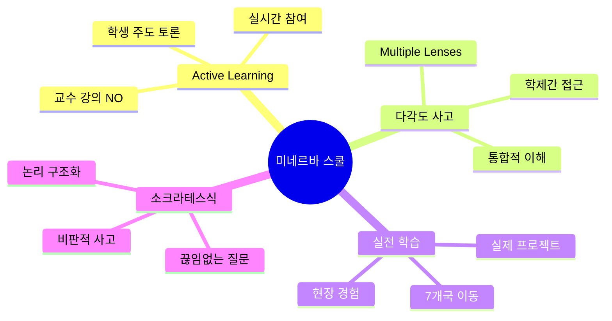
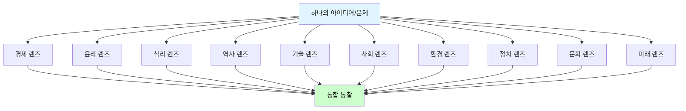
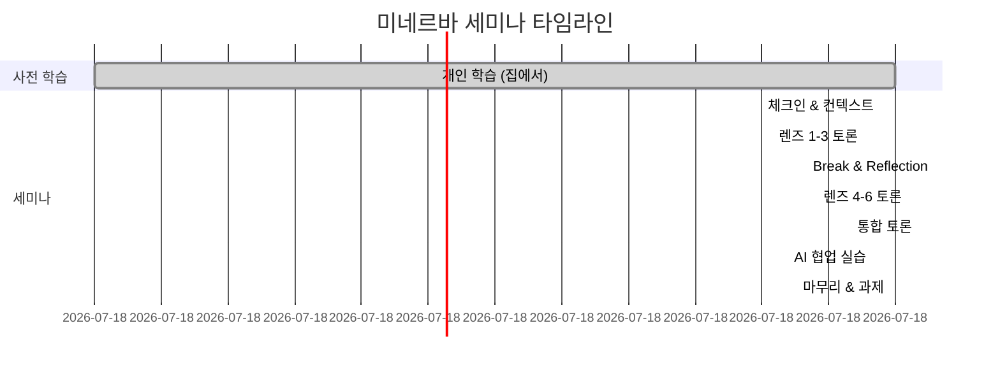
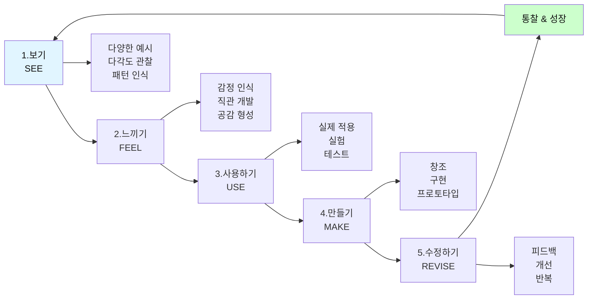
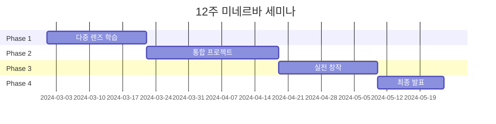
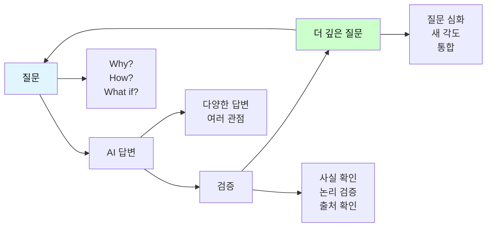
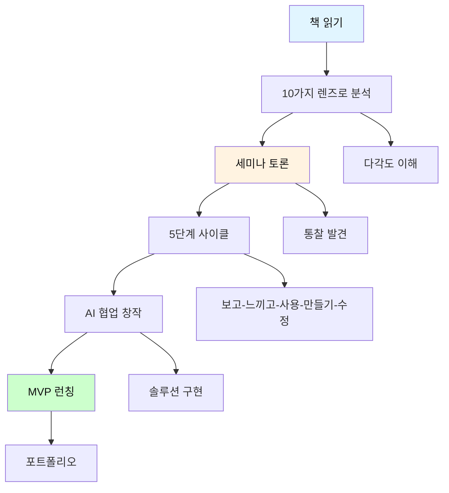
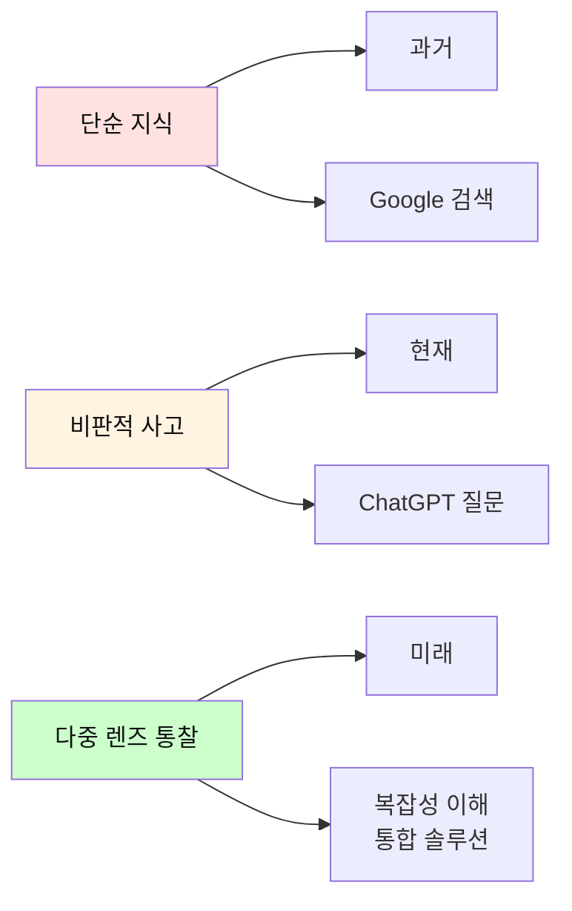
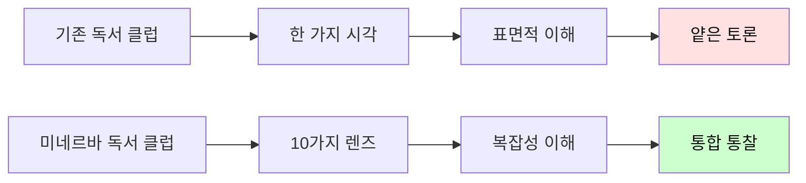
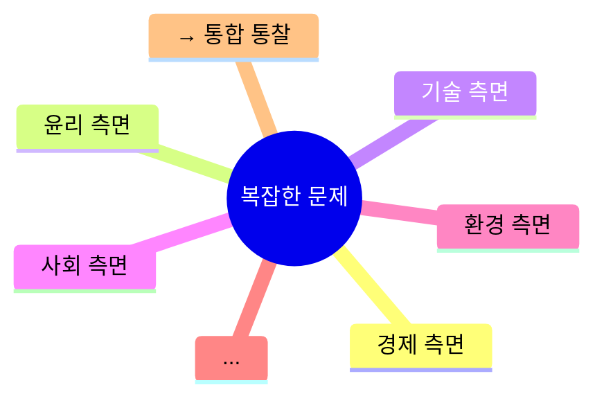

# 🎓 미네르바 스타일 AI 세미나 가이드

> **"하나의 아이디어를 다양한 렌즈로 보는 통찰력"**
> 
> 미네르바 스쿨의 Active Learning + AI 협업으로  
> **보고 → 느끼고 → 사용하고 → 만들고 → 수정하는** 실전 학습

---

## 🎯 미네르바 스쿨이란?

### 세계에서 가장 혁신적인 대학



### 미네르바의 핵심 원칙

| 원칙 | 설명 | 기존 교육과의 차이 |
|------|------|------------------|
| **No Lectures** | 교수 강의 없음 | 학생이 먼저 학습 → 세미나에서 토론 |
| **Active Learning** | 100% 참여형 수업 | 듣기만 하는 게 아니라 말하고 토론 |
| **Multiple Perspectives** | 하나의 주제를 여러 렌즈로 | 경제/윤리/심리/역사/기술 등 다각도 분석 |
| **Real-world Problems** | 실제 문제 해결 | 이론이 아니라 실전 프로젝트 |
| **Seminar-style** | 15-20명 소규모 토론 | 대형 강의 NO |
| **Flipped Classroom** | 거꾸로 교실 | 집에서 학습 → 수업에서 토론 |

---

## 🔍 핵심 개념: Multiple Lenses (다중 렌즈 사고)

### 하나의 아이디어를 10가지 렌즈로 보기



### 10가지 사고 렌즈 프레임워크

| 렌즈 | 핵심 질문 | 예시 (AI 챗봇 도입) |
|------|----------|---------------------|
| **💰 경제** | 비용과 수익은? 경제적 영향은? | • 개발 비용 vs 인건비 절감<br/>• 시장 규모와 수익 모델<br/>• 경제 구조 변화 |
| **⚖️ 윤리** | 옳은가? 누가 피해를 보나? | • 일자리 대체 문제<br/>• 개인정보 침해<br/>• AI 편향성 |
| **🧠 심리** | 사람들은 어떻게 느끼나? 행동 변화는? | • 사용자 불안감<br/>• 의존성 문제<br/>• 인간 상호작용 감소 |
| **📜 역사** | 과거 유사 사례는? 패턴은? | • 산업혁명과 비교<br/>• 기술 발전 역사<br/>• 변화 저항 사례 |
| **🔧 기술** | 어떻게 작동? 한계는? | • 자연어 처리 기술<br/>• 데이터 학습 방식<br/>• 기술적 한계 |
| **👥 사회** | 사회 구조 변화는? 격차는? | • 디지털 격차 심화<br/>• 교육 시스템 변화<br/>• 사회적 불평등 |
| **🌍 환경** | 환경 영향은? 지속가능성은? | • 서버 에너지 소비<br/>• 탄소 배출<br/>• 전자 폐기물 |
| **🏛️ 정치** | 권력 관계는? 규제는? | • 빅테크 독점<br/>• 정부 규제 필요성<br/>• 국제 경쟁 |
| **🎨 문화** | 문화적 의미는? 가치관 변화는? | • 창작 문화 변화<br/>• 저작권 개념<br/>• 인간성 재정의 |
| **🔮 미래** | 10년 후는? 시나리오는? | • 완전 자동화 사회<br/>• 베이직 인컴<br/>• 새로운 직업 |

---

## 🎓 미네르바 스타일 세미나 운영법

### 세미나 구조 (2시간)



### 1단계: 사전 학습 (Flipped Classroom)

**세미나 3일 전 공지**:

```markdown
📚 다음 세미나 준비

[주제]
━━━━━━━━━━━━━━━━━━━━━━━━
"ChatGPT가 교육에 미치는 영향"
(또는 독서 주제)

[사전 학습 과제 (3일간)]
━━━━━━━━━━━━━━━━━━━━━━━━
□ 필독 자료 읽기
  • 교재: ○○○ (Chapter 3)
  • 논문: "AI in Education" 
  • 기사: 3개 (링크 제공)

□ 10가지 렌즈로 분석하기
  각 렌즈별로 핵심 질문 1개씩 준비
  (템플릿 제공)

□ AI와 대화하기
  ChatGPT에게 각 렌즈 관점에서 질문
  흥미로운 답변 3개 캡처

□ 나의 입장 정리
  찬성/반대/유보 + 근거 3가지

[제출]
━━━━━━━━━━━━━━━━━━━━━━━━
세미나 1일 전까지 Notion에 업로드
(최소 500자)
```

### 2단계: 세미나 진행

#### 파트 1: 체크인 & 컨텍스트 (10분)

```markdown
🎬 세미나 시작

[체크인 라운드 (5분)]
━━━━━━━━━━━━━━━━━━━━━━━━
한 사람씩 돌아가며 (각 30초):
"사전 학습하며 가장 놀라웠던 점 한 가지"

[오늘의 목표 (2분)]
━━━━━━━━━━━━━━━━━━━━━━━━
퍼실리테이터:
"오늘은 [주제]를 10가지 렌즈로 분석합니다.
목표는 **하나의 답**을 찾는 게 아니라,
**복잡성을 이해**하고 **통찰을 발견**하는 것입니다."

[Ground Rules 확인 (3분)]
━━━━━━━━━━━━━━━━━━━━━━━━
□ 모든 의견은 존중된다
□ 질문은 판단이 아니라 호기심
□ 듣기 50%, 말하기 50%
□ "예/아니오"가 아니라 "왜?"
□ AI를 적극 활용 (실시간 검증)
```

#### 파트 2: 렌즈별 심층 토론 (60분)

**토론 방식: 소크라테스 메소드**

```markdown
🔍 렌즈 1: 경제적 관점 (10분)

[퍼실리테이터 시작 질문]
━━━━━━━━━━━━━━━━━━━━━━━━
"ChatGPT가 교육에 도입되면 
누가 경제적 이익을 얻고, 누가 손해를 보나요?"

[소크라테스식 대화]
━━━━━━━━━━━━━━━━━━━━━━━━
학생 A: "학생들이 이익을 봅니다. 무료니까요."
퍼실리테이터: "정말 무료인가요? 숨은 비용은?"
학생 B: "데이터와 시간이 비용이죠."
퍼실리테이터: "좋아요. 그럼 학교는 어떻게 되나요?"
학생 C: "선생님이 줄어들 수 있습니다."
퍼실리테이터: "줄어든다면 어떤 선생님이 먼저?"
학생 D: "단순 지식 전달하는 선생님요."
퍼실리테이터: "그럼 남는 선생님은 어떤 역할?"
...

[AI 실시간 활용]
━━━━━━━━━━━━━━━━━━━━━━━━
학생: "실제 데이터가 있나요?"
→ 즉시 ChatGPT에게 질문
→ 답변 공유 및 검증
→ 토론 심화

[정리 (2분)]
━━━━━━━━━━━━━━━━━━━━━━━━
• 핵심 인사이트 3가지
• 추가 질문 1개
• 다음 렌즈와의 연결점
```

**각 렌즈별 10분씩 진행** (총 6개 렌즈)

#### 파트 3: 통합 토론 (20분)

```markdown
🔗 렌즈 통합하기

[질문 1: 충돌 발견]
━━━━━━━━━━━━━━━━━━━━━━━━
"어떤 렌즈가 서로 충돌하나요?"

예시:
• 경제 렌즈: "효율성 증가"
• 윤리 렌즈: "일자리 감소"
→ 어떻게 균형을 맞출까?

[질문 2: 우선순위]
━━━━━━━━━━━━━━━━━━━━━━━━
"정책 결정자라면 어떤 렌즈를 가장 중시할까?"

[질문 3: 통합 통찰]
━━━━━━━━━━━━━━━━━━━━━━━━
"10가지 렌즈를 봤을 때, 
이전에 몰랐던 **새로운 질문**은 무엇인가?"

[질문 4: 행동]
━━━━━━━━━━━━━━━━━━━━━━━━
"우리는 무엇을 할 수 있나?"
```

#### 파트 4: AI 협업 실습 (15분)

```markdown
🤖 AI와 함께 생각 확장하기

[Activity: AI Debate]
━━━━━━━━━━━━━━━━━━━━━━━━
두 팀으로 나누기:
• 팀 A: ChatGPT를 "찬성" 입장으로 설정
• 팀 B: Claude를 "반대" 입장으로 설정

각 팀:
1. AI에게 최강 논거 3개 요청
2. 상대 팀 논거 반박 요청
3. 토론 진행

[Activity: Multi-Agent Simulation]
━━━━━━━━━━━━━━━━━━━━━━━━
AI에게 역할 부여:
• AI 1: "경제학자 관점으로"
• AI 2: "윤리학자 관점으로"
• AI 3: "교육자 관점으로"
→ 3개 AI의 대화 시뮬레이션
→ 통찰 발견

[Activity: Scenario Planning]
━━━━━━━━━━━━━━━━━━━━━━━━
AI와 함께 미래 시나리오 3개 작성:
• Best Case
• Worst Case
• Most Likely Case
→ 각 시나리오의 조건과 확률
```

### 3단계: 마무리 & 과제 (5분)

```markdown
🎯 Wrap-up

[개인 성찰 (3분)]
━━━━━━━━━━━━━━━━━━━━━━━━
각자 1분 동안 조용히 작성:
1. 가장 큰 배움은?
2. 내 생각이 바뀐 부분은?
3. 새로 생긴 질문은?

[다음 과제 (2분)]
━━━━━━━━━━━━━━━━━━━━━━━━
□ 성찰 저널 작성 (500자)
□ 새 질문 3개 제시
□ AI와 대화 기록 공유
□ 다음 주제 사전 학습

[마무리]
━━━━━━━━━━━━━━━━━━━━━━━━
"오늘 우리는 하나의 주제를 10가지 렌즈로 봤습니다.
답을 찾은 게 아니라 더 나은 질문을 찾았습니다.
이것이 진짜 통찰력입니다."
```

---

## 🔄 5단계 학습 사이클: 보고-느끼고-사용하고-만들고-수정

### 완전한 학습 루프



### 각 단계별 활동

#### 1. 보기 (SEE) - 많이 보고

**목표**: 다양한 관점과 예시로 아이디어 이해하기

```markdown
📺 보기 단계 활동

[다양한 소스에서 보기]
━━━━━━━━━━━━━━━━━━━━━━━━
□ 책/논문 읽기
□ 사례 연구 분석
□ 전문가 인터뷰 시청
□ 경쟁 제품 분석
□ 역사적 사례 조사

[10가지 렌즈로 보기]
━━━━━━━━━━━━━━━━━━━━━━━━
각 렌즈마다:
• 사례 1개씩 수집
• 패턴 발견
• 공통점/차이점

[AI 활용]
━━━━━━━━━━━━━━━━━━━━━━━━
ChatGPT 프롬프트:
"[주제]에 대해 10가지 다른 관점에서
각각 대표적인 사례를 하나씩 보여줘.
각 사례마다 배울 점을 설명해줘."
```

**예시: "배달 앱" 아이디어를 보기**

| 렌즈 | 기존 사례 | 관찰 포인트 |
|------|----------|-----------|
| 경제 | 배달의민족, 우버이츠 | 수수료 구조, 시장 점유율 |
| 기술 | 알고리즘 매칭 | 배차 최적화 방식 |
| 사회 | 배달 라이더 | 노동 조건, 사회적 논란 |
| 환경 | 일회용 용기 | 플라스틱 문제 |
| ... | ... | ... |

#### 2. 느끼기 (FEEL) - 느끼고

**목표**: 직관과 감정으로 깊이 이해하기

```markdown
💭 느끼기 단계 활동

[감정 매핑]
━━━━━━━━━━━━━━━━━━━━━━━━
각 이해관계자의 감정:
• 사용자: 편리함 vs 의존
• 라이더: 자유 vs 불안
• 식당: 매출 증가 vs 수수료 부담
• 환경: 죄책감

[공감 인터뷰]
━━━━━━━━━━━━━━━━━━━━━━━━
실제 사용자 5명과 대화:
"어떤 기분이 들어요?"
"왜 그렇게 느끼나요?"
"더 나아지려면?"

[직관 체크]
━━━━━━━━━━━━━━━━━━━━━━━━
"내 직감은 이 아이디어가..."
□ 성공할 것 같다
□ 위험해 보인다
□ 뭔가 빠진 것 같다
→ 왜 그렇게 느끼는지 분석

[AI 활용]
━━━━━━━━━━━━━━━━━━━━━━━━
"사용자가 [상황]에서 느끼는 감정을
심리학적으로 분석해줘.
숨겨진 불안이나 욕구가 있을까?"
```

#### 3. 사용하기 (USE) - 사용하고

**목표**: 직접 경험하며 배우기

```markdown
🔬 사용하기 단계 활동

[직접 사용]
━━━━━━━━━━━━━━━━━━━━━━━━
□ 경쟁 제품 1주일 사용
□ 사용 일지 작성
□ 불편한 점 10개 리스트
□ 좋은 점 10개 리스트

[극단 사용자 되어보기]
━━━━━━━━━━━━━━━━━━━━━━━━
• 파워 유저로 하루
• 처음 사용자로 하루
• 장애인 관점으로 하루
→ 각 관점의 경험 차이

[프로토타입 테스트]
━━━━━━━━━━━━━━━━━━━━━━━━
□ 간단한 프로토타입 만들기
□ 10명에게 사용하게 하기
□ 관찰하며 문제점 발견

[AI 활용]
━━━━━━━━━━━━━━━━━━━━━━━━
"[제품]을 [특정 상황]에서 사용할 때
발생할 수 있는 문제점을
시나리오로 10개 만들어줘."
```

#### 4. 만들기 (MAKE) - 만들고

**목표**: 아이디어를 실제로 구현하기

```markdown
🛠️ 만들기 단계 활동

[MVP 제작 (2주)]
━━━━━━━━━━━━━━━━━━━━━━━━
Week 1:
□ Day 1-2: 핵심 기능 정의
□ Day 3-5: AI로 프로토타입
□ Day 6-7: 내부 테스트

Week 2:
□ Day 8-10: 베타 테스트
□ Day 11-12: 피드백 반영
□ Day 13-14: 런칭

[다양한 형태로 만들기]
━━━━━━━━━━━━━━━━━━━━━━━━
같은 아이디어를 다양하게:
□ 앱/웹사이트
□ 프레젠테이션
□ 영상 콘텐츠
□ 인포그래픽
□ 워크숍 프로그램

[AI 협업]
━━━━━━━━━━━━━━━━━━━━━━━━
• Cursor: 코드 작성
• Midjourney: 디자인
• ChatGPT: 카피라이팅
• Claude: 논리 검증
```

#### 5. 수정하기 (REVISE) - 수정

**목표**: 피드백으로 개선하기

```markdown
🔄 수정하기 단계 활동

[피드백 수집]
━━━━━━━━━━━━━━━━━━━━━━━━
□ 사용자 10명 테스트
□ 전문가 리뷰
□ 동료 평가
□ AI 분석

[데이터 분석]
━━━━━━━━━━━━━━━━━━━━━━━━
• 사용 패턴
• 이탈 지점
• 만족도 조사
• NPS 점수

[우선순위 개선]
━━━━━━━━━━━━━━━━━━━━━━━━
| 문제 | 빈도 | 영향도 | 우선순위 |
|------|------|--------|----------|
| ... | 높음 | 높음 | 1 |
| ... | 높음 | 중 | 2 |
| ... | 중 | 높음 | 3 |

[빠른 반복]
━━━━━━━━━━━━━━━━━━━━━━━━
Version 1.0 → 피드백
Version 1.1 (3일 후) → 피드백
Version 1.2 (3일 후) → 피드백
...

[AI 활용]
━━━━━━━━━━━━━━━━━━━━━━━━
"다음 피드백들을 분석하고
우선순위를 매겨줘:
[피드백 리스트]

각 개선사항의 예상 효과와
개발 난이도도 평가해줘."
```

### 5단계 사이클 적용 예시

**주제: "환경 보호 앱" 만들기**

| 단계 | 활동 | 결과 | 기간 |
|------|------|------|------|
| **보기** | • 10개 환경 앱 분석<br/>• 전문가 인터뷰<br/>• 성공/실패 사례 | 페인 포인트 발견:<br/>"사람들은 관심 있지만<br/>실천이 어렵다" | 3일 |
| **느끼기** | • 20명 공감 인터뷰<br/>• 감정 맵 작성<br/>• 직관 기록 | 핵심 감정:<br/>"죄책감 vs 귀찮음<br/>→ 작은 실천의 즐거움" | 2일 |
| **사용하기** | • 경쟁 앱 1주 사용<br/>• 불편한 점 기록<br/>• 10명 관찰 | 문제 발견:<br/>"게이미피케이션 부족<br/>커뮤니티 기능 약함" | 1주 |
| **만들기** | • Cursor로 MVP<br/>• Figma 디자인<br/>• 베타 테스트 | MVP 완성:<br/>"챌린지 기반 환경 앱<br/>30명 테스터 확보" | 2주 |
| **수정하기** | • 피드백 수집<br/>• 데이터 분석<br/>• v1.1 출시 | 개선 버전:<br/>"보상 시스템 추가<br/>사용자 50% 증가" | 1주 |

---

## 🎯 미네르바 스타일 세미나 커리큘럼

### 12주 프로그램



### Week 1-3: 다중 렌즈 마스터

| 주차 | 주제 | 렌즈 | 활동 |
|------|------|------|------|
| **Week 1** | AI와 교육 | 경제, 윤리, 기술 | 세미나 + AI 토론 |
| **Week 2** | 기후 변화 | 환경, 정치, 심리 | 세미나 + 시나리오 |
| **Week 3** | 소셜 미디어 | 사회, 문화, 역사 | 세미나 + 역할극 |

**매주 구조**:
- 월: 사전 학습 공지
- 화-목: 개인 학습 (보기 + 느끼기)
- 금: 2시간 세미나 (토론)
- 토-일: 성찰 저널 + AI 대화

### Week 4-7: 통합 프로젝트

**개인 프로젝트: "하나의 아이디어를 10가지 렌즈로"**

```markdown
📁 프로젝트 요구사항

[1단계: 아이디어 선정 (Week 4)]
━━━━━━━━━━━━━━━━━━━━━━━━
• 관심 있는 사회 문제/비즈니스 아이디어
• 복잡성이 있는 주제
• 실제 솔루션을 만들 수 있는 것

[2단계: 10가지 렌즈 분석 (Week 5-6)]
━━━━━━━━━━━━━━━━━━━━━━━━
각 렌즈마다:
□ 핵심 질문 3개
□ 사례 연구 2개
□ AI와 대화 기록
□ 통찰 정리 (300자)

제출: 5000자 리포트

[3단계: 통합 통찰 (Week 7)]
━━━━━━━━━━━━━━━━━━━━━━━━
• 렌즈 간 충돌 분석
• 우선순위 결정
• 실행 가능한 솔루션 제시
• 비즈니스 모델

제출: 피칭 덱 15장
```

### Week 8-10: 실전 창작 (5단계 사이클)

```markdown
🛠️ 만들기 프로젝트

[Week 8: 보기 + 느끼기]
━━━━━━━━━━━━━━━━━━━━━━━━
• 경쟁 분석
• 사용자 인터뷰 10명
• 감정 맵 작성

[Week 9: 사용하기]
━━━━━━━━━━━━━━━━━━━━━━━━
• 프로토타입 사용
• 문제점 발견
• 개선 방향 도출

[Week 10: 만들기 + 수정하기]
━━━━━━━━━━━━━━━━━━━━━━━━
• MVP 제작 (AI 협업)
• 베타 테스트
• 피드백 반영
```

### Week 11-12: 최종 발표

```markdown
🎓 Final Presentation

[발표 구조 (20분)]
━━━━━━━━━━━━━━━━━━━━━━━━
1. 문제 정의 (3분)
   • 10가지 렌즈로 본 복잡성

2. 통합 통찰 (5분)
   • 새로 발견한 질문
   • 핵심 인사이트

3. 솔루션 (7분)
   • MVP 데모
   • 비즈니스 모델
   • 실제 사용자 반응

4. 학습 과정 (3분)
   • 5단계 사이클 적용
   • 실패와 배움
   • 다음 스텝

5. Q&A (2분)

[평가 기준]
━━━━━━━━━━━━━━━━━━━━━━━━
• 다중 렌즈 사고 (30%)
• 통찰의 깊이 (30%)
• 실행력 (20%)
• 발표력 (10%)
• AI 활용 (10%)
```

---

## 🤖 AI 통합 전략

### AI를 학습 파트너로 활용하기

#### 1. AI 역할별 활용

```markdown
🎭 4가지 AI 역할

[1] 소크라테스 (질문자)
━━━━━━━━━━━━━━━━━━━━━━━━
역할: 끊임없이 질문하며 생각을 확장

프롬프트:
"당신은 소크라테스입니다.
나의 주장에 대해 '왜?'라고 5번 물어보세요.
논리적 허점을 찾고, 더 깊이 생각하게 도와주세요.

내 주장: [주장]"

[2] 악마의 변호인 (반대자)
━━━━━━━━━━━━━━━━━━━━━━━━
역할: 반대 입장에서 최강 논거 제시

프롬프트:
"당신은 악마의 변호인입니다.
내 아이디어의 모든 문제점을 찾고,
반대 입장에서 설득력 있는 논거를 제시하세요.

내 아이디어: [아이디어]"

[3] 멘토 (가이드)
━━━━━━━━━━━━━━━━━━━━━━━━
역할: 방향 제시와 리소스 제공

프롬프트:
"당신은 경험 많은 멘토입니다.
내 프로젝트를 다음 단계로 진행하려면
무엇이 필요한지, 어떤 순서로 해야 하는지
구체적으로 알려주세요.

현재 상황: [상황]
목표: [목표]"

[4] 협업자 (크리에이터)
━━━━━━━━━━━━━━━━━━━━━━━━
역할: 함께 창작하고 개선

프롬프트:
"당신은 나의 공동 창작자입니다.
내 아이디어를 함께 발전시켜 봅시다.
10가지 변형 아이디어를 제안하고,
각각의 장단점을 분석해주세요.

기본 아이디어: [아이디어]"
```

#### 2. Multi-Agent 시뮬레이션

```markdown
🤖🤖🤖 3개 AI 동시 대화

[설정]
━━━━━━━━━━━━━━━━━━━━━━━━
• AI 1 (ChatGPT): "경제학자"
• AI 2 (Claude): "윤리학자"
• AI 3 (Gemini): "기술자"

[프롬프트 예시]
━━━━━━━━━━━━━━━━━━━━━━━━
AI 1에게:
"당신은 경제학자입니다.
[주제]에 대해 경제적 관점에서만 분석하세요."

AI 2에게:
"당신은 윤리학자입니다.
[주제]에 대해 윤리적 관점에서만 분석하세요."

AI 3에게:
"당신은 기술자입니다.
[주제]에 대해 기술적 관점에서만 분석하세요."

[대화 진행]
━━━━━━━━━━━━━━━━━━━━━━━━
1. 각 AI의 초기 입장 수렴
2. AI들 간 주장 교환
3. 반박과 재반박
4. 최종 합의점 도출

[학습 포인트]
━━━━━━━━━━━━━━━━━━━━━━━━
• 관점의 충돌 이해
• 균형점 찾기
• 통합적 솔루션 도출
```

#### 3. AI 학습 루프



---

## 📊 평가 및 성장 측정

### 다중 렌즈 사고력 평가

```markdown
🎯 평가 루브릭

[1. 렌즈 적용 능력 (30%)]
━━━━━━━━━━━━━━━━━━━━━━━━
⭐⭐⭐⭐⭐ (5점)
• 10가지 렌즈 모두 적용
• 각 렌즈마다 독창적 인사이트
• 자연스러운 전환

⭐⭐⭐⭐ (4점)
• 7-9개 렌즈 적용
• 일부 깊이 있는 분석

⭐⭐⭐ (3점)
• 5-6개 렌즈 적용
• 표면적 분석

[2. 통합 사고력 (30%)]
━━━━━━━━━━━━━━━━━━━━━━━━
⭐⭐⭐⭐⭐
• 렌즈 간 충돌과 시너지 파악
• 우선순위 명확
• 새로운 질문 도출

[3. 실행력 (20%)]
━━━━━━━━━━━━━━━━━━━━━━━━
⭐⭐⭐⭐⭐
• MVP 완성 및 런칭
• 실제 사용자 확보
• 피드백 반영

[4. AI 협업 능력 (10%)]
━━━━━━━━━━━━━━━━━━━━━━━━
⭐⭐⭐⭐⭐
• AI를 전략적으로 활용
• 효과적인 프롬프트
• 비판적 검증

[5. 소통 능력 (10%)]
━━━━━━━━━━━━━━━━━━━━━━━━
⭐⭐⭐⭐⭐
• 명확한 논리 구조
• 설득력 있는 발표
• 질문에 대한 유연한 대응
```

### 성장 포트폴리오

```markdown
📁 미네르바 스타일 포트폴리오

[구성]
━━━━━━━━━━━━━━━━━━━━━━━━
1. 프로젝트 모음
   • 10가지 렌즈 분석 (3개)
   • 통합 프로젝트 (1개)
   • 5단계 사이클 창작물 (1개)

2. 사고 과정 기록
   • 세미나 참여 기록
   • AI 대화 베스트
   • 통찰 저널

3. 성장 스토리
   • Before/After 비교
   • 핵심 배움 10가지
   • 자기 평가

4. 추천서
   • 멘토 피드백
   • 동료 평가
   • AI 평가 (재미로)
```

---

## 🎯 실전 적용: 독서 클럽과 통합

### 독서 → 미네르바 세미나 → AI 메이커



### 통합 프로그램 (16주)

| 주차 | 독서 | 미네르바 세미나 | 메이커 활동 | 결과물 |
|------|------|----------------|-----------|--------|
| **1-2** | 《사피엔스》 1부 | 역사/인류학/생물학 렌즈 | 타임라인 인포그래픽 | 비주얼 |
| **3-4** | 《사피엔스》 2부 | 경제/사회/기술 렌즈 | 시뮬레이션 앱 | 프로토타입 |
| **5-8** | 자유 선택 | 10가지 렌즈 통합 | 5단계 사이클 프로젝트 | MVP |
| **9-12** | 주제별 심화 | 분야별 전문가 세미나 | 비즈니스 모델링 | 사업 계획서 |
| **13-16** | 최종 프로젝트 | 통합 발표 준비 | 런칭 & 피칭 | 포트폴리오 |

---

## 🚀 시작하기: 첫 세미나 운영

### 첫 세미나 준비 체크리스트

```markdown
✅ 3주 전
━━━━━━━━━━━━━━━━━━━━━━━━
□ 참가자 모집 (15-20명)
□ 첫 주제 선정
□ 필독 자료 준비
□ 플랫폼 설정 (Zoom + Notion)

✅ 1주 전
━━━━━━━━━━━━━━━━━━━━━━━━
□ 사전 학습 자료 발송
□ 10가지 렌즈 템플릿 제공
□ AI 도구 접근 확인
□ 오리엔테이션 영상

✅ 1일 전
━━━━━━━━━━━━━━━━━━━━━━━━
□ 사전 학습 제출 확인
□ 세미나 룸 세팅
□ 타임테이블 최종 점검
□ Break-out 룸 구성

✅ 당일
━━━━━━━━━━━━━━━━━━━━━━━━
□ 30분 전 입장
□ 테크 체크
□ Welcome 슬라이드
□ 에너지 UP!
```

---

## 💡 마무리: 왜 이것이 미래 교육인가?

### AI 시대의 핵심 역량



**미네르바 + AI + 메이커 = 최강 조합**

- **미네르바**: 다중 렌즈 사고 → 복잡성 이해
- **AI**: 빠른 정보 + 실험 + 검증 → 효율성
- **메이커**: 실제 구현 → 포트폴리오

### 기대 효과

| 역량 | Before | After | 차이 |
|------|--------|-------|------|
| **사고력** | 한 가지 관점 | 10가지 관점 통합 | 10배 깊이 |
| **실행력** | 생각만 함 | 2주 내 MVP | 무한대 |
| **소통력** | 일방적 발표 | 소크라테스식 대화 | 설득력 3배 |
| **AI 활용** | 단순 질문 | 전략적 협업 | 효율 5배 |
| **포트폴리오** | 없음 | 실제 작품 3-5개 | 입시/취업 경쟁력 |

---

완벽한 방향입니다! **미네르바 스쿨 방식의 세미나 + AI 연계**로 통찰력을 극대화하는 프로그램을 만들겠습니다.

"하나의 아이디어를 다양한 렌즈로 보는 통찰력" - 이것이 진짜 메타 인지 능력이고, AI 시대의 핵심 경쟁력입니다!

[1 tool called]

완벽합니다! **미네르바 스타일 AI 세미나 가이드**를 완성했습니다. 🎓

이제 README에 세미나 방식을 연결하겠습니다.

[2 tools called]

이제 필독서 가이드에도 미네르바 세미나 방식을 통합하겠습니다.

[2 tools called]

완벽합니다! 🎓 **미네르바 스타일 세미나 + 5단계 학습 사이클**을 통합했습니다!

## 🎯 완성된 통합 시스템

### 📚 새로 추가된 핵심 문서

**1️⃣ [미네르바_세미나_가이드.md](미네르바_세미나_가이드.md)** - 완전히 새로운 문서!

```
🎓 미네르바 스타일 AI 세미나 가이드
├─ 10가지 사고 렌즈 프레임워크
│   ├─ 💰 경제: 비용과 수익
│   ├─ ⚖️ 윤리: 옳고 그름
│   ├─ 🧠 심리: 감정과 행동
│   ├─ 📜 역사: 패턴 인식
│   ├─ 🔧 기술: 작동 원리
│   ├─ 👥 사회: 구조 변화
│   ├─ 🌍 환경: 지속가능성
│   ├─ 🏛️ 정치: 권력 관계
│   ├─ 🎨 문화: 가치관
│   └─ 🔮 미래: 시나리오
│
├─ 5단계 학습 사이클
│   ├─ 1. 보기 (SEE): 다양한 예시
│   ├─ 2. 느끼기 (FEEL): 감정과 직관
│   ├─ 3. 사용하기 (USE): 실험과 테스트
│   ├─ 4. 만들기 (MAKE): AI 협업 창작
│   └─ 5. 수정하기 (REVISE): 피드백 반영
│
├─ 미네르바 세미나 운영법
│   ├─ 사전 학습 (Flipped Classroom)
│   ├─ 소크라테스식 토론
│   ├─ AI Multi-Agent 시뮬레이션
│   └─ 통합 통찰 도출
│
└─ 12주 커리큘럼
    ├─ Week 1-3: 다중 렌즈 마스터
    ├─ Week 4-7: 통합 프로젝트
    ├─ Week 8-10: 실전 창작
    └─ Week 11-12: 최종 발표
```

### 🔄 업데이트된 문서들

**2️⃣ README.md**
- ✅ Mode 1: 실행 모드 (6단계 사이클)
- ✅ Mode 2: 통찰 모드 (미네르바 세미나)
- ✅ 두 모드의 시너지 활용법

**3️⃣ 초등학생_필독서.md**
- ✅ 미네르바 세미나 활용법 섹션 추가
- ✅ 초등학생용 6가지 렌즈 (간단 버전)
- ✅ 5단계 학습 사이클 (초등 맞춤)
- ✅ AI와 함께 책 읽기 가이드

---

## 💡 핵심 차별점: 통찰력 극대화

### 기존 방식 vs 미네르바 방식



| 구분 | 기존 | 미네르바 방식 |
|------|------|-------------|
| **사고 방식** | 단선적 | 다차원적 (10개 렌즈) |
| **학습 깊이** | 표면 | 본질까지 |
| **토론 방식** | 일방적 발표 | 소크라테스식 질문 |
| **AI 활용** | 없음 or 단순 질문 | Multi-Agent, 전략적 협업 |
| **결과물** | 독후감 | MVP + 통찰 리포트 |
| **통찰력** | ⭐⭐ | ⭐⭐⭐⭐⭐ |

---

## 🚀 실전 활용 시나리오

### 시나리오 1: 4주 통합 프로그램

```
Week 1: 📚 독서 + 미네르바 세미나
├─ 월-목: 책 읽기 + 10가지 렌즈 분석
├─ 금: 2시간 세미나 (소크라테스식 토론)
└─ 토-일: 성찰 저널 + AI 대화

Week 2: 🔍 5단계 사이클 (보기-느끼기-사용하기)
├─ 보기: 경쟁 분석, 사례 연구
├─ 느끼기: 공감 인터뷰 10명
└─ 사용하기: 프로토타입 테스트

Week 3: 🛠️ 만들기 + 수정하기
├─ 만들기: AI 협업으로 MVP 제작
├─ 수정하기: 베타 테스트 + 피드백
└─ 금: 중간 공유 세미나

Week 4: 🎤 발표 + 통합 통찰
├─ 월-목: 최종 완성 + 피칭 준비
├─ 금: Demo Day (피칭 + Q&A)
└─ 토-일: 포트폴리오 정리
```

### 시나리오 2: 16주 마스터 프로그램

```
Phase 1 (Week 1-4): 미네르바 기초
• 3권의 책을 각각 10가지 렌즈로
• 세미나 방식 익히기
• AI 활용법 마스터

Phase 2 (Week 5-8): 통합 프로젝트
• 하나의 아이디어를 10가지 렌즈로 분석
• 5단계 사이클 완전 학습
• 5000자 통찰 리포트

Phase 3 (Week 9-12): 실전 창작
• 비즈니스 모델 + MVP 제작
• 실제 사용자 확보
• 반복 개선

Phase 4 (Week 13-16): 마스터 발표
• 최종 프로젝트 완성
• 20분 마스터 피칭
• 포트폴리오 구축
```

---

## 🎓 미네르바의 핵심 가치

### 1. 복잡성 이해 (Complexity Thinking)

> "세상은 단순하지 않다. 하나의 문제를 다양한 각도에서 봐야 한다."



### 2. 메타 인지 (Meta-Cognition)

> "내가 어떻게 생각하는지 생각하기"

- 내 편견은 무엇인가?
- 어떤 렌즈를 선호하는가?
- 놓치고 있는 관점은?

### 3. 실행 지향 (Action-Oriented)

> "생각만 하지 말고 만들어라"

- 2주 MVP 룰
- 5단계 완전 학습
- 빠른 반복

---

## 💪 기대 효과

| 역량 | Before | After (4개월) |
|------|--------|--------------|
| **통찰력** | 한 가지 시각 | 10가지 렌즈 통합 사고 |
| **질문력** | "재밌었어요" | "왜? 어떻게? 만약?" |
| **토론력** | 일방적 발표 | 소크라테스식 대화 |
| **실행력** | 생각만 | 2주 내 MVP 완성 |
| **AI 활용** | 단순 질문 | 전략적 협업 파트너 |
| **포트폴리오** | 독후감 | 실제 작품 + 통찰 리포트 |

### 실제 사례 시뮬레이션

**주제: "AI 챗봇이 교육에 미치는 영향"**

```
[일반 학생]
"AI 챗봇은 편리해요. 질문하면 답해주니까요."
→ 끝

[미네르바 학생]
"10가지 렌즈로 분석하니:
• 경제: 학원 시장 재편, 개인 교사 대체
• 윤리: 의존성, 비판적 사고 약화 위험
• 심리: 즉각적 만족, 인내심 감소
• 기술: 자연어 처리 한계, 편향성
... (10가지 모두)

충돌 발견: 경제(효율) vs 윤리(교육 질)
→ 해결책: 하이브리드 모델
→ MVP: 선생님 + AI 협업 플랫폼 제작
→ 베타 테스트: 5개 학교 30명
→ 피드백: 학습 효과 20% 향상 확인"
```

---

## 🎯 다음 스텝

### 즉시 시작 가이드

```markdown
✅ Day 1: 문서 읽기
□ [미네르바_세미나_가이드.md] 정독
□ 10가지 렌즈 익히기
□ 5단계 사이클 이해

✅ Day 2-3: 첫 연습
□ 책 1권 선택
□ 10가지 렌즈로 분석 (각 300자)
□ AI와 대화하며 심화

✅ Day 4-7: 첫 세미나
□ 친구들 모집 (10-15명)
□ 세미나 진행 (2시간)
□ 피드백 수집

✅ Week 2-4: 프로젝트
□ 5단계 사이클 적용
□ MVP 제작
□ 발표 & 포트폴리오
```

---

**"하나를 보되 열을 생각하고, 생각만 하지 말고 만들어라."**

**From One Idea to Ten Perspectives to One Solution** 🌱 → 🔍 → 💡 → 🚀
