# 10단계 — 리딩클루 : 웹 화면설계서 · 페이지별 유저 시나리오
## aicareerpath.co.kr 구조 이식 → 웹 우선 → 앱 확장

> **한 줄 정의**
> aicareerpath.co.kr의 **5단계 여정 + 그룹 스페이스** 구조를 독서에 그대로 이식하여,
> **웹으로 먼저 출시하고 앱으로 확장**하는 화면 설계서다.
>
> 이 문서는 **그리면 바로 개발할 수 있는 수준**의 화면 명세와
> **페이지별 유저 시나리오 · 단계도**를 담는다.

---

> ⚠️ **이 문서는 배경 설계서입니다. 최종 확정 범위·시나리오는 [11단계 최종 기획안](11단계-리딩클루_최종_기획안_유저시나리오.md)을 따릅니다.**

### 문서 계보

| 단계 | 문서 | 다루는 것 |
|:-:|---|---|
| 6 | SMILE형 유저 시나리오 | 개인 독서 5단계 |
| 7 | 관심사50 · 클루패스 | 개인 파이프라인 (템플릿 24 · 루브릭 6) |
| 8 | 미래 도서관 커뮤니티 | 오프라인 커뮤니티 · 세션 프로토콜 12종 |
| 9 | 독서 지도자 온라인 실행 | 온라인 전환 전략 · 그룹 시스템 |
| **10** | **웹 화면설계서 (이 문서)** | **IA · 화면 설계 · 페이지별 시나리오 · 단계도** |

---

## 목차

**PART 0 — 요약**
- [0. 설계 원칙과 한 장 요약](#0-설계-원칙과-한-장-요약)

**PART I — 정보 구조**
1. [aicareerpath 구조 대응표](#1-aicareerpath-구조-대응표)
2. [사이트맵 · 정보 구조(IA)](#2-사이트맵--정보-구조ia)
3. [글로벌 네비게이션 설계](#3-글로벌-네비게이션-설계)

**PART II — 전체 유저 시나리오**
4. [3대 페르소나와 여정 지도](#4-3대-페르소나와-여정-지도)
5. [전체 플로우 — 첫 방문에서 프로젝트까지](#5-전체-플로우--첫-방문에서-프로젝트까지)

**PART III — 화면 설계도**
6. [전체 화면 맵 (24화면)](#6-전체-화면-맵-24화면)
7. [공통 컴포넌트 · 디자인 규칙](#7-공통-컴포넌트--디자인-규칙)

**PART IV — 페이지별 상세 명세**
8. [A그룹 · 진입 페이지 (P01~P04)](#8-a그룹--진입-페이지-p01p04)
9. [B그룹 · 진단 페이지 (P05~P07)](#9-b그룹--진단-페이지-p05p07)
10. [C그룹 · 독서 스페이스 (P08~P14)](#10-c그룹--독서-스페이스-p08p14)
11. [D그룹 · 실행 페이지 (P15~P20)](#11-d그룹--실행-페이지-p15p20)
12. [E그룹 · 기록·공개 (P21~P24)](#12-e그룹--기록공개-p21p24)

**PART V — 상태 설계**
13. [상태·엣지케이스·빈 화면](#13-상태엣지케이스빈-화면)

**PART VI — 웹→앱 전환**
14. [웹 우선 · 앱 확장 전략](#14-웹-우선--앱-확장-전략)
15. [개발 순서와 마일스톤](#15-개발-순서와-마일스톤)

---

# PART 0 — 요약

## 0. 설계 원칙과 한 장 요약

### 0.1 5개 설계 원칙

```
원칙 1 — aicareerpath의 뼈대를 그대로 쓴다.
         5단계 여정 + 그룹 스페이스 + 탭 구조. 검증된 구조를 다시 만들지 않는다.

원칙 2 — 웹이 먼저다. 앱은 웹의 확장이다.
         모든 기능은 웹에서 완결되고, 앱은 알림과 빠른 작성만 더한다.

원칙 3 — 로그인 전에도 볼 것이 있어야 한다.
         공개 갤러리와 데모 진단은 로그인 없이 접근 가능하다.

원칙 4 — 독서 지도자는 3클릭 안에 그룹을 만든다.
         홈 → 그룹 만들기 → 완료. 그 사이 어떤 학습도 요구하지 않는다.

원칙 5 — 학생은 한 화면에서 이번 주 할 일을 안다.
         로그인 직후 "이번 주 미션"이 첫 화면 최상단에 있다.
```

### 0.2 한 장 요약

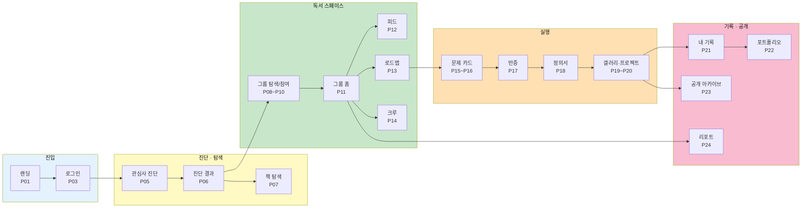
```mermaid
flowchart LR
    subgraph ENTRY["진입"]
        E1["랜딩<br/>P01"]
        E2["로그인<br/>P03"]
    end

    subgraph DIAG["진단 · 탐색"]
        D1["관심사 진단<br/>P05"]
        D2["진단 결과<br/>P06"]
        D3["책 탐색<br/>P07"]
    end

    subgraph SPACE["독서 스페이스"]
        S1["그룹 탐색/참여<br/>P08~P10"]
        S2["그룹 홈<br/>P11"]
        S3["피드<br/>P12"]
        S4["로드맵<br/>P13"]
        S5["크루<br/>P14"]
    end

    subgraph EXEC["실행"]
        X1["문제 카드<br/>P15~P16"]
        X2["반증<br/>P17"]
        X3["정의서<br/>P18"]
        X4["갤러리·프로젝트<br/>P19~P20"]
    end

    subgraph REC["기록 · 공개"]
        R1["내 기록<br/>P21"]
        R2["포트폴리오<br/>P22"]
        R3["공개 아카이브<br/>P23"]
        R4["리포트<br/>P24"]
    end

    E1 --> E2 --> D1 --> D2 --> D3
    D2 --> S1 --> S2
    S2 --> S3 & S4 & S5
    S4 --> X1 --> X2 --> X3 --> X4
    X4 --> R1 --> R2
    X4 --> R3
    S2 --> R4

    style ENTRY fill:#e3f2fd,color:#111
    style DIAG fill:#fff9c4,color:#111
    style SPACE fill:#c8e6c9,color:#111
    style EXEC fill:#ffe0b2,color:#111
    style REC fill:#f8bbd0,color:#111
```

---

# PART I — 정보 구조

## 1. aicareerpath 구조 대응표

### 1.1 글로벌 네비게이션 1:1 대응

| # | aicareerpath | URL | → | **리딩클루** | URL |
|:-:|---|---|:-:|---|---|
| 1 | 적성 검사 | `/quiz` | → | **관심사 진단** | `/quiz` |
| 2 | 커리어 탐색 | `/jobs/explore` | → | **책·주제 탐색** | `/books/explore` |
| 3 | 커리어 패스 | `/career` | → | **독서 패스** | `/path` |
| 4 | 커리어 실행 | `/dreammate` | → | **독서 실행** | `/readmate` |
| 5 | About | `/about` | → | **About** | `/about` |

### 1.2 "독서 실행" 내부 탭 대응

aicareerpath의 `/dreammate`는 5개 탭을 가진다. 이를 그대로 이식한다.

| aicareerpath 탭 | → | **리딩클루 탭** | 담는 것 |
|---|:-:|---|---|
| 피드 | → | **피드** | 문제 카드 · 반응 · 크루 활동 타임라인 |
| **커뮤니티** (커리어 스페이스) | → | **커뮤니티** (독서 스페이스) | **그룹 목록 · 생성 · 참여** ★핵심 |
| 내 기록 | → | **내 기록** | 내 카드 · 정의서 · 미션 이력 |
| 포트폴리오 | → | **포트폴리오** | 완주 인증 · 프로젝트 산출물 |
| 자료실 | → | **자료실** | 인쇄 양식 · 가이드 · 지도자 자료 |

### 1.3 그룹(스페이스) 기능 대응

| aicareerpath | → | **리딩클루** |
|---|:-:|---|
| "커리어 스페이스" | → | **"독서 스페이스"** |
| 초대 코드 (`SCI-2026`) | → | 초대 코드 (`READ-HB2-26`) |
| 카테고리: 스터디/프로젝트/멘토링/동아리/기타 | → | **독서반/동아리/프로젝트/자율/기타** |
| 진행: 온라인/오프라인/온오프 병행 | → | **온라인/교실 병행/자율** |
| 최대 인원 2~200 (기본 30) | → | **최대 인원 4~40 (기본 30)** |
| 아이콘 12종 | → | **관심사 아이콘 12종** |
| 태그 최대 20개 | → | 태그 최대 20개 |
| 목록 공개 토글 | → | 목록 공개 토글 |
| 그룹 내 **로드맵(WBS)** | → | 그룹 내 **12주 독서 로드맵** |

---

## 2. 사이트맵 · 정보 구조(IA)

```
리딩클루 (readingclue.kr)
│
├── / ······················· P01 랜딩
├── /about ·················· P02 소개
├── /login ·················· P03 로그인
├── /guide ·················· P04 독서 지도자 가이드
│
├── /quiz ··················· P05 관심사 진단 (CIP)
│   └── /quiz/result ········ P06 진단 결과
│
├── /books/explore ·········· P07 책·주제 탐색
│
├── /readmate ··············· 독서 실행 (탭 컨테이너)
│   ├── ?tab=feed ··········· P12 피드
│   ├── ?tab=community ······ P08 독서 스페이스 (그룹 목록)
│   ├── ?tab=records ········ P21 내 기록
│   ├── ?tab=portfolio ······ P22 포트폴리오
│   └── ?tab=resources ······ P23-1 자료실
│
├── /groups
│   ├── /new ················ P09 그룹 만들기
│   ├── /join ··············· P10 초대 코드 참여
│   └── /:id ················ P11 그룹 홈 (대시보드)
│       ├── /feed ··········· P12 그룹 피드
│       ├── /roadmap ········ P13 로드맵
│       ├── /crews ·········· P14 크루 목록
│       ├── /crews/:cid ····· P14-1 크루 상세
│       ├── /gallery ········ P19 정의서 갤러리
│       ├── /projects ······· P20 프로젝트
│       ├── /report ········· P24 시즌 리포트
│       └── /settings ······· P11-1 그룹 설정
│
├── /cards
│   ├── /new ················ P15 문제 카드 작성
│   └── /:id ················ P16 문제 카드 상세
│
├── /rebuttal/:id ··········· P17 반증 세션
├── /definitions/:id ········ P18 문제 정의서
├── /projects/:id ··········· P20-1 프로젝트 상세
│
├── /explore ················ P23 공개 문제 아카이브
└── /my ····················· P21 내 기록 (단독 진입)
```

---

## 3. 글로벌 네비게이션 설계

### 3.1 상단 GNB (데스크톱)

```
┌──────────────────────────────────────────────────────────────────────┐
│  📖 리딩클루   관심사 진단  책 탐색  독서 패스  독서 실행  About  [로그인] │
└──────────────────────────────────────────────────────────────────────┘
                                              ↑
                                    로그인 후 → [👤 내 프로필 ▼]
                                               ├ 내 기록
                                               ├ 포트폴리오
                                               ├ 내 그룹 (목록)
                                               ├ 설정
                                               └ 로그아웃
```

### 3.2 모바일 웹 하단 탭 (앱 전환 대비)

```
┌───────────────────────────────────────────┐
│                                           │
│              (콘텐츠 영역)                  │
│                                           │
├───────────────────────────────────────────┤
│  🏠     📖      ✏️      👥      👤        │
│  홈    로드맵   작성    그룹    내정보      │
└───────────────────────────────────────────┘
```

> 이 하단 탭 구조를 웹 모바일에서 먼저 쓰면, 앱 전환 시 그대로 재사용된다.

### 3.3 네비게이션 상태별 노출

| 상태 | GNB 노출 | 기본 진입 |
|---|---|---|
| **비로그인** | 진단 · 탐색 · About · 공개 아카이브 · [로그인] | `/` 랜딩 |
| **로그인 · 진단 전** | 전체 + [진단하기] 강조 배지 | `/quiz` 유도 |
| **로그인 · 그룹 없음** | 전체 + [그룹 참여하기] 강조 | `/groups/join` 유도 |
| **로그인 · 그룹 있음(멤버)** | 전체 + 내 그룹 바로가기 | `/groups/:id` |
| **로그인 · 지도자** | 전체 + [내 그룹 관리] | `/groups/:id` 대시보드 |

---

# PART II — 전체 유저 시나리오

## 4. 3대 페르소나와 여정 지도

### 4.1 페르소나 요약

| 코드 | 이름 | 역할 | 핵심 목표 | 성공 판단 기준 |
|---|---|---|---|---|
| **U1** | 이지현 (34) | 중학교 사서교사 · **독서 지도자** | 학생 24명이 12주간 스스로 읽고 문제를 발견 | 시즌 리포트를 교감에게 제출 |
| **U2** | 박서준 (15) | 중2 학생 · **멤버** | 독후감이 아닌 "내 질문"을 만들기 | 정의서 완성 + 프로젝트 발표 |
| **U3** | 최민아 (17) | 고2 학생 · **크루장** | 학생부에 쓸 탐구 활동 확보 | 반증 통과 + 프로젝트 트랙 완주 |

### 4.2 U1 독서 지도자 여정


```mermaid
journey
    title U1 이지현 · 독서 지도자 12주 여정
    section 1주차 준비
      리딩클루 검색·랜딩 방문: 3: 지도자
      가이드 페이지 정독: 4: 지도자
      카카오 로그인: 5: 지도자
      그룹 만들기 (5분): 5: 지도자
      초대 코드 학급 공유: 5: 지도자
    section 2~3주차 시작
      학생 24명 합류 확인: 5: 지도자
      크루 4개 자동 생성 확인: 4: 지도자
      첫 미션 진행률 확인: 4: 지도자
    section 4~8주차 운영
      주간 10분 대시보드 확인: 4: 지도자
      미제출자 독려 알림: 3: 지도자
      우수 카드 하이라이트: 5: 지도자
      반증 주차 모니터링: 4: 지도자
    section 9~12주차 마무리
      프로젝트 팀 구성 확인: 5: 지도자
      갤러리 발표 진행: 5: 지도자
      리포트 PDF 다운로드: 5: 지도자
      교감 보고: 5: 지도자
```

### 4.3 U2 학생 멤버 여정

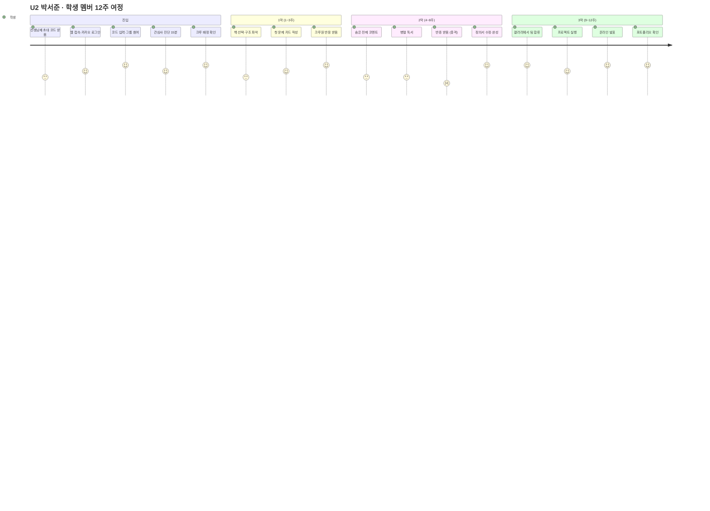
```mermaid
journey
    title U2 박서준 · 학생 멤버 12주 여정
    section 진입
      선생님께 초대 코드 받음: 3: 학생
      웹 접속·카카오 로그인: 4: 학생
      코드 입력·그룹 참여: 5: 학생
      관심사 진단 15분: 4: 학생
      크루 배정 확인: 5: 학생
    section 1막 (1~3주)
      책 선택·구조 파악: 3: 학생
      첫 문제 카드 작성: 4: 학생
      크루원 반응 받음: 5: 학생
    section 2막 (4~8주)
      숨은 전제 코멘트: 3: 학생
      병렬 독서: 3: 학생
      반증 받음 (충격): 2: 학생
      정의서 수정·완성: 5: 학생
    section 3막 (9~12주)
      갤러리에서 팀 합류: 5: 학생
      프로젝트 실행: 4: 학생
      온라인 발표: 5: 학생
      포트폴리오 확인: 5: 학생
```

---

## 5. 전체 플로우 — 첫 방문에서 프로젝트까지

### 5.1 통합 플로우차트

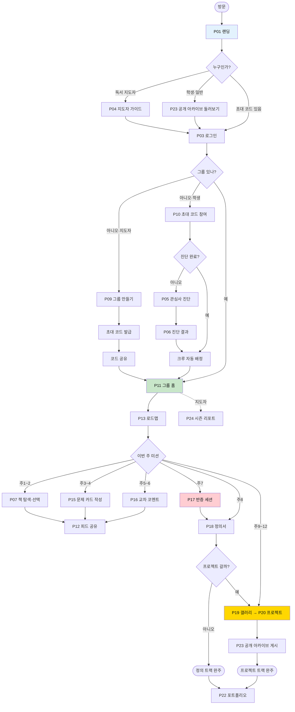
```mermaid
flowchart TD
    START([방문]) --> LAND[P01 랜딩]
    LAND --> WHO{누구인가?}

    WHO -->|독서 지도자| GUIDE[P04 지도자 가이드]
    WHO -->|학생·일반| EXPLORE[P23 공개 아카이브 둘러보기]
    WHO -->|초대 코드 있음| LOGIN

    GUIDE --> LOGIN[P03 로그인]
    EXPLORE --> LOGIN

    LOGIN --> HASGROUP{그룹 있나?}

    HASGROUP -->|아니오·지도자| NEWG[P09 그룹 만들기]
    HASGROUP -->|아니오·학생| JOING[P10 초대 코드 참여]
    HASGROUP -->|예| GHOME[P11 그룹 홈]

    NEWG --> CODE[초대 코드 발급]
    CODE --> SHARE[코드 공유]
    SHARE --> GHOME

    JOING --> CIP{진단 완료?}
    CIP -->|아니오| QUIZ[P05 관심사 진단]
    QUIZ --> RESULT[P06 진단 결과]
    RESULT --> ASSIGN[크루 자동 배정]
    CIP -->|예| ASSIGN
    ASSIGN --> GHOME

    GHOME --> ROAD[P13 로드맵]
    ROAD --> MISSION{이번 주 미션}

    MISSION -->|주1~2| BOOK[P07 책 탐색·선택]
    MISSION -->|주3~4| CARD[P15 문제 카드 작성]
    MISSION -->|주5~6| CROSS[P16 교차 코멘트]
    MISSION -->|주7| REB[P17 반증 세션]
    MISSION -->|주8| DEF[P18 정의서]
    MISSION -->|주9~12| PROJ[P19 갤러리 → P20 프로젝트]

    BOOK --> FEED[P12 피드 공유]
    CARD --> FEED
    CROSS --> FEED
    REB --> DEF
    DEF --> BRANCH{프로젝트 갈까?}
    BRANCH -->|아니오| DONE1([정의 트랙 완주])
    BRANCH -->|예| PROJ
    PROJ --> PUB[P23 공개 아카이브 게시]
    PUB --> DONE2([프로젝트 트랙 완주])

    DONE1 --> PORT[P22 포트폴리오]
    DONE2 --> PORT
    GHOME -.지도자.-> REPORT[P24 시즌 리포트]

    style LAND fill:#e3f2fd,color:#111
    style GHOME fill:#c8e6c9,color:#111
    style REB fill:#ffcdd2,color:#111
    style PROJ fill:#FFD700,color:#111
```

### 5.2 3가지 진입 경로

| 경로 | 시작점 | 단계 | 소요 |
|---|---|---|:-:|
| **A. 지도자 경로** | 검색/추천 → 랜딩 | 랜딩 → 가이드 → 로그인 → 그룹 생성 → 코드 공유 | **8분** |
| **B. 학생 초대 경로** | 카톡으로 받은 코드 | 로그인 → 코드 입력 → 진단 → 크루 배정 | **20분** |
| **C. 자발적 탐색 경로** | 공개 아카이브 → 흥미 | 아카이브 → 진단 체험 → 로그인 → 공개 그룹 참여 | **25분** |

---

# PART III — 화면 설계도

## 6. 전체 화면 맵 (24화면)

### 6.1 화면 목록

| # | 코드 | 화면명 | URL | 권한 | 우선순위 |
|:-:|---|---|---|---|:-:|
| 1 | **P01** | 랜딩 | `/` | 전체 | P0 |
| 2 | **P02** | 소개 (About) | `/about` | 전체 | P1 |
| 3 | **P03** | 로그인 | `/login` | 전체 | P0 |
| 4 | **P04** | 독서 지도자 가이드 | `/guide` | 전체 | P1 |
| 5 | **P05** | 관심사 진단 | `/quiz` | 전체 | P0 |
| 6 | **P06** | 진단 결과 | `/quiz/result` | 로그인 | P0 |
| 7 | **P07** | 책·주제 탐색 | `/books/explore` | 전체 | P1 |
| 8 | **P08** | 독서 스페이스 (그룹 목록) | `/readmate?tab=community` | 로그인 | P0 |
| 9 | **P09** | 그룹 만들기 | `/groups/new` | 로그인 | P0 |
| 10 | **P10** | 초대 코드 참여 | `/groups/join` | 로그인 | P0 |
| 11 | **P11** | 그룹 홈 (대시보드) | `/groups/:id` | 멤버 | P0 |
| 12 | **P12** | 그룹 피드 | `/groups/:id/feed` | 멤버 | P1 |
| 13 | **P13** | 로드맵 | `/groups/:id/roadmap` | 멤버 | P1 |
| 14 | **P14** | 크루 목록·상세 | `/groups/:id/crews` | 멤버 | P1 |
| 15 | **P15** | 문제 카드 작성 | `/cards/new` | 멤버 | P0 |
| 16 | **P16** | 문제 카드 상세 | `/cards/:id` | 멤버·공개 | P0 |
| 17 | **P17** | 반증 세션 | `/rebuttal/:id` | 배정자 | P1 |
| 18 | **P18** | 문제 정의서 | `/definitions/:id` | 멤버 | P1 |
| 19 | **P19** | 정의서 갤러리 (문제 시장) | `/groups/:id/gallery` | 멤버 | P2 |
| 20 | **P20** | 프로젝트 | `/groups/:id/projects` | 멤버 | P2 |
| 21 | **P21** | 내 기록 | `/my` | 로그인 | P1 |
| 22 | **P22** | 포트폴리오 | `/readmate?tab=portfolio` | 로그인 | P2 |
| 23 | **P23** | 공개 문제 아카이브 | `/explore` | 전체 | P2 |
| 24 | **P24** | 시즌 리포트 | `/groups/:id/report` | 지도자 | P2 |

### 6.2 화면 간 연결 다이어그램

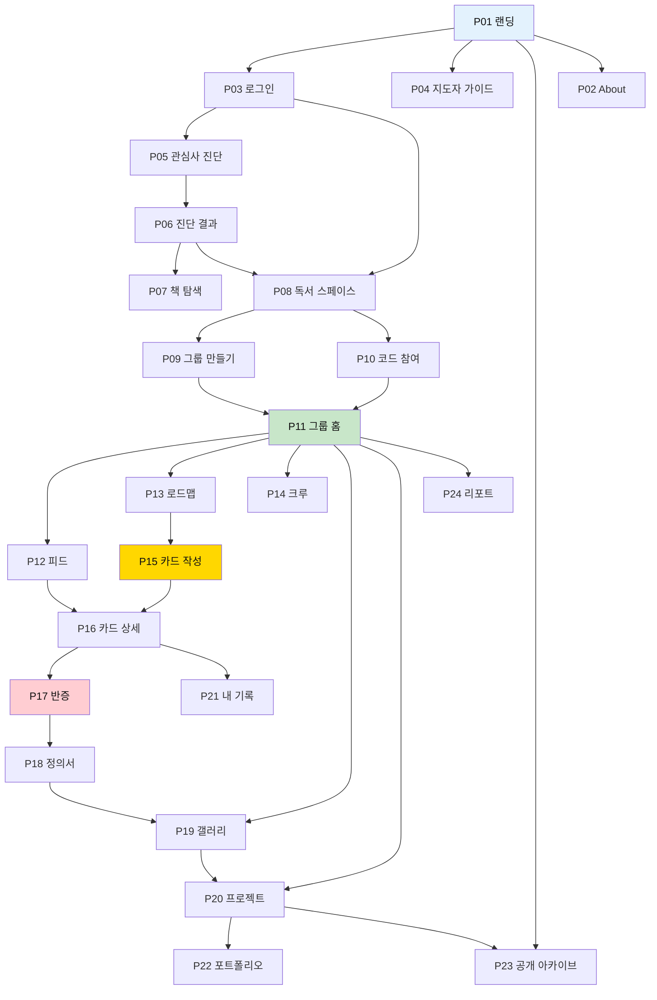
```mermaid
graph TB
    P01[P01 랜딩] --> P03[P03 로그인]
    P01 --> P04[P04 지도자 가이드]
    P01 --> P23[P23 공개 아카이브]
    P01 --> P02[P02 About]

    P03 --> P05[P05 관심사 진단]
    P03 --> P08[P08 독서 스페이스]

    P05 --> P06[P06 진단 결과]
    P06 --> P07[P07 책 탐색]
    P06 --> P08

    P08 --> P09[P09 그룹 만들기]
    P08 --> P10[P10 코드 참여]
    P09 --> P11[P11 그룹 홈]
    P10 --> P11

    P11 --> P12[P12 피드]
    P11 --> P13[P13 로드맵]
    P11 --> P14[P14 크루]
    P11 --> P19[P19 갤러리]
    P11 --> P20[P20 프로젝트]
    P11 --> P24[P24 리포트]

    P13 --> P15[P15 카드 작성]
    P15 --> P16[P16 카드 상세]
    P12 --> P16
    P16 --> P17[P17 반증]
    P17 --> P18[P18 정의서]
    P18 --> P19
    P19 --> P20

    P20 --> P22[P22 포트폴리오]
    P16 --> P21[P21 내 기록]
    P20 --> P23

    style P01 fill:#e3f2fd,color:#111
    style P11 fill:#c8e6c9,color:#111
    style P15 fill:#FFD700,color:#111
    style P17 fill:#ffcdd2,color:#111
```

---

## 7. 공통 컴포넌트 · 디자인 규칙

### 7.1 공통 컴포넌트 목록

| 코드 | 컴포넌트 | 사용처 | 설명 |
|---|---|---|---|
| **C01** | GNB (상단 네비) | 전 페이지 | 로고 · 메뉴 5 · 프로필 |
| **C02** | 하단 탭 (모바일) | 로그인 후 전 페이지 | 홈/로드맵/작성/그룹/내정보 |
| **C03** | 그룹 카드 | P08, P23 | 아이콘·이름·설명·멤버수·태그 |
| **C04** | 문제 카드 | P12, P16, P19, P23 | 5칸 양식 · 반응 3종 |
| **C05** | 반응 버튼 (🤝🔍⚔️) | P12, P16, P23 | 클릭 → 20자 코멘트 모달 |
| **C06** | 진행률 바 | P11, P13 | 미션 완료율 시각화 |
| **C07** | 미션 카드 | P11, P13 | 주차·제목·마감·상태 |
| **C08** | 크루 배지 | P11, P12, P14 | 관심사 코드 + 색상 |
| **C09** | 빈 상태 (Empty State) | 전 페이지 | 일러스트 + 안내 + CTA |
| **C10** | 초대 코드 박스 | P09, P11 | 코드 표시 · 복사 · 카톡공유 · QR |
| **C11** | 타임라인 아이템 | P12, P21 | 활동 이력 표시 |
| **C12** | 토스트 알림 | 전 페이지 | 저장/완료/오류 |

### 7.2 반응 3종 규격

| 아이콘 | 이름 | 색상 | 의미 | 조건 |
|:-:|---|---|---|---|
| 🤝 | 공감 | `#4CAF50` 초록 | "나도 이 문제를 느낀다" | 코멘트 선택 |
| 🔍 | 증상 | `#FFC107` 노랑 | "이 부분은 증상 같다" | **20자 이상 필수** |
| ⚔️ | 반론 | `#F44336` 빨강 | "반대편에서 보면" | **20자 이상 필수** |

> **핵심 규칙**: 🔍과 ⚔️는 코멘트 없이 누를 수 없다. "좋아요만 누르는 문화"를 구조적으로 차단한다.

### 7.3 색상 · 타이포 규칙

| 용도 | 값 |
|---|---|
| 브랜드 메인 | `#4ECDC4` (청록) |
| 강조 / CTA | `#FFD700` (골드) |
| 경고 / 반증 | `#FF6B6B` (코랄) |
| 성공 | `#4CAF50` |
| 배경 | `#FFFFFF` / 다크 `#1A1A1A` |
| 본문 폰트 | Pretendard 16px / 행간 1.7 |
| 제목 | Pretendard Bold 24~32px |

---

# PART IV — 페이지별 상세 명세

> **각 페이지 명세 형식**
> ① 목적 ② 진입 경로 ③ 화면 구성(와이어프레임) ④ 유저 시나리오 ⑤ 단계도 ⑥ 상태·예외 ⑦ CTA

---

## 8. A그룹 · 진입 페이지 (P01~P04)

### P01 · 랜딩 페이지 `/`

#### ① 목적
방문자를 **3가지 유형(지도자/학생/일반)**으로 분기시켜, 각자의 다음 행동으로 보낸다.

#### ② 진입 경로
검색 · 추천 링크 · 카카오 공유 · QR 코드

#### ③ 화면 구성

```
┌──────────────────────────────────────────────────────────────┐
│ 📖 리딩클루  관심사진단 책탐색 독서패스 독서실행 About  [로그인] │
├──────────────────────────────────────────────────────────────┤
│                                                              │
│              읽는 것에서 끝내지 마세요                          │
│           책에서 시작해 나만의 문제를 발견하고                    │
│              프로젝트까지 밀고 갑니다                           │
│                                                              │
│        [관심사 진단 시작 →]   [초대 코드가 있어요]              │
│                                                              │
│              ▼ 스크롤                                         │
├──────────────────────────────────────────────────────────────┤
│  SMILE + P — 6단계 독서 여정                                   │
│  ┌────┐ ┌────┐ ┌────┐ ┌────┐ ┌────┐ ┌────┐                  │
│  │ S  │→│ M  │→│ I  │→│ L  │→│ E  │→│ P  │                  │
│  │선택 │ │구조 │ │질문 │ │연결 │ │표현 │ │실행 │                  │
│  └────┘ └────┘ └────┘ └────┘ └────┘ └────┘                  │
├──────────────────────────────────────────────────────────────┤
│  이번 주 전국 학생들이 던진 질문                                 │
│  ┌────────┐ ┌────────┐ ┌────────┐    [전체 보기 →]           │
│  │AI가 교사│ │공정한  │ │기후변화│                              │
│  │를 대체할│ │입시는  │ │에 학생 │                              │
│  │수 있는가│ │존재하나│ │이 할일 │                              │
│  │🤝12⚔️14│ │🤝9 ⚔️7 │ │🤝15⚔️11│                             │
│  └────────┘ └────────┘ └────────┘                            │
├──────────────────────────────────────────────────────────────┤
│  👩‍🏫 독서 지도자이신가요?                                       │
│  초대 코드 하나로 5분 만에 학교 독서 그룹을 만드세요.              │
│                       [지도자 가이드 보기 →]                    │
├──────────────────────────────────────────────────────────────┤
│  숫자로 보는 리딩클루                                           │
│  그룹 128개 · 학생 2,847명 · 문제 카드 12,391장 · 프로젝트 264건 │
└──────────────────────────────────────────────────────────────┘
```

#### ④ 유저 시나리오

| 유저 | 행동 | 화면 반응 | 다음 |
|---|---|---|---|
| U1 지도자 | "독서 지도자이신가요?" 섹션 클릭 | 가이드 페이지 이동 | P04 |
| U2 학생 (코드 보유) | [초대 코드가 있어요] 클릭 | 로그인 요구 → 코드 입력 | P03 → P10 |
| U3 일반 방문자 | 전국 질문 카드 클릭 | 공개 아카이브 이동 | P23 |
| 재방문자 (로그인) | 자동 리다이렉트 | 내 그룹 홈으로 | P11 |

#### ⑤ 단계도

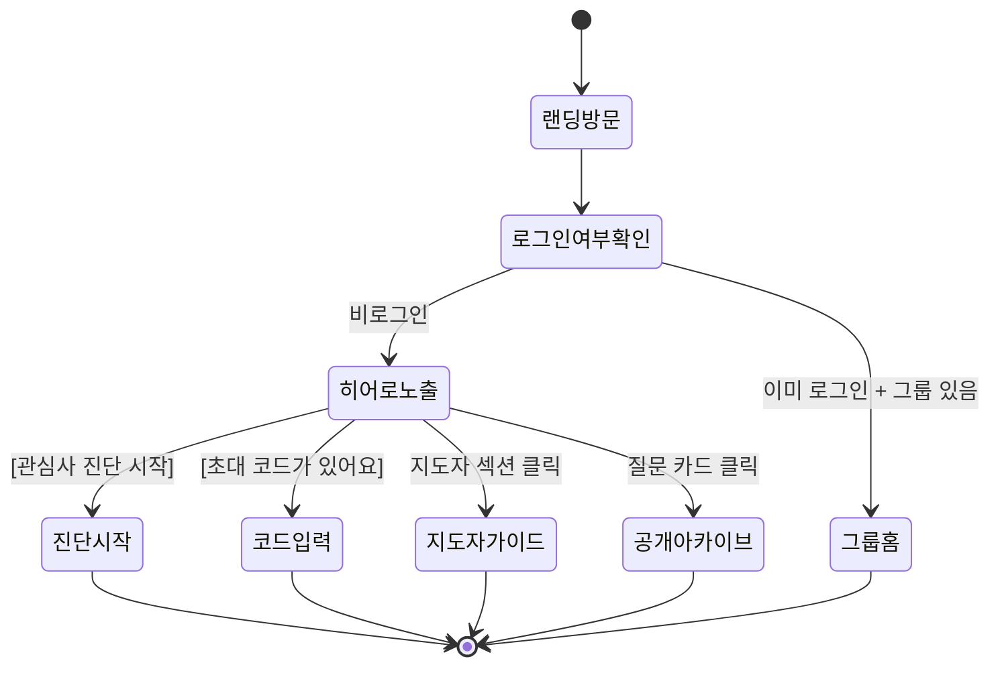
```mermaid
stateDiagram-v2
    [*] --> 랜딩방문
    랜딩방문 --> 로그인여부확인
    로그인여부확인 --> 그룹홈: 이미 로그인 + 그룹 있음
    로그인여부확인 --> 히어로노출: 비로그인
    히어로노출 --> 진단시작: [관심사 진단 시작]
    히어로노출 --> 코드입력: [초대 코드가 있어요]
    히어로노출 --> 지도자가이드: 지도자 섹션 클릭
    히어로노출 --> 공개아카이브: 질문 카드 클릭
    진단시작 --> [*]
    코드입력 --> [*]
    지도자가이드 --> [*]
    공개아카이브 --> [*]
    그룹홈 --> [*]
```

#### ⑥ 상태·예외
- 로그인 상태 + 그룹 있음 → `/groups/:id`로 자동 리다이렉트
- 로그인 상태 + 그룹 없음 → 히어로에 "[그룹 참여하기]" 강조
- 통계 데이터 로딩 실패 → 통계 섹션 숨김 (에러 미노출)

#### ⑦ CTA 우선순위
1. **[관심사 진단 시작]** (골드, 최대)
2. [초대 코드가 있어요] (아웃라인)
3. [지도자 가이드 보기] (섹션 내 텍스트 링크)

---

### P03 · 로그인 `/login`

#### ① 목적
**최소 마찰**로 인증. 소셜 로그인만 지원 (이메일/비밀번호 없음).

#### ③ 화면 구성

```
┌──────────────────────────────────────┐
│                                      │
│            📖 리딩클루                 │
│                                      │
│      3초 만에 시작하세요               │
│                                      │
│   ┌────────────────────────────┐     │
│   │  💬  카카오로 시작하기       │     │
│   └────────────────────────────┘     │
│   ┌────────────────────────────┐     │
│   │  G   구글로 시작하기         │     │
│   └────────────────────────────┘     │
│                                      │
│   가입 시 이용약관·개인정보처리방침에    │
│   동의하는 것으로 간주됩니다.           │
│                                      │
│   14세 미만은 보호자 동의가 필요합니다.  │
│                                      │
└──────────────────────────────────────┘
```

#### ④ 유저 시나리오

```
1. 학생이 [카카오로 시작하기] 클릭
2. 카카오 OAuth 팝업 → 동의
3. 첫 로그인인가?
   YES → 온보딩 분기 화면 ("지도자입니다" / "학생입니다")
   NO  → 이전 위치 또는 그룹 홈으로 복귀
4. 학생 선택 시 → 초대 코드 입력 화면 (P10)
5. 지도자 선택 시 → 그룹 만들기 (P09)
```

#### ⑤ 단계도

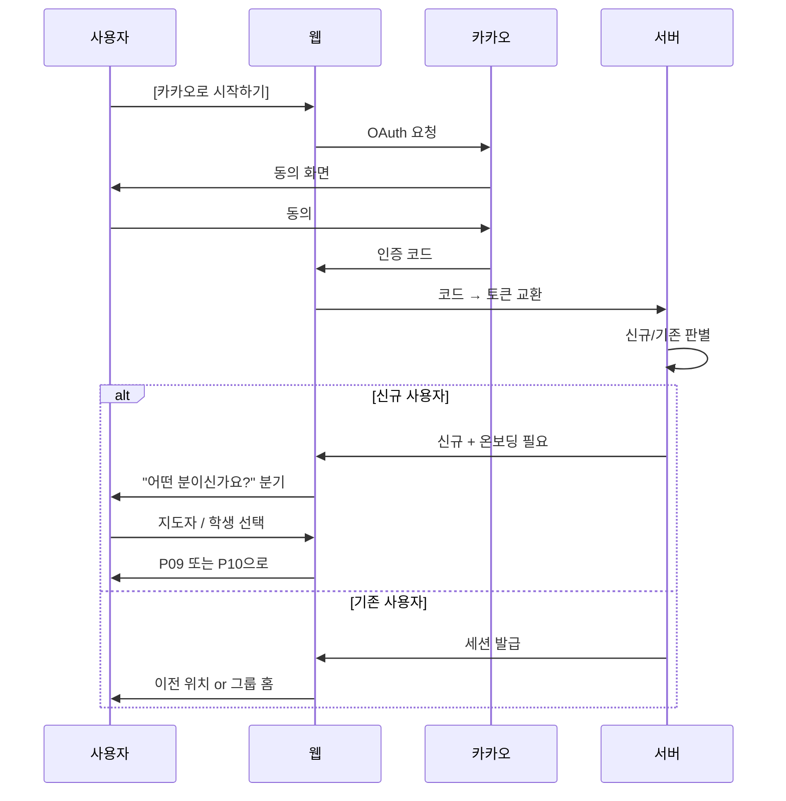
```mermaid
sequenceDiagram
    participant U as 사용자
    participant W as 웹
    participant K as 카카오
    participant S as 서버

    U->>W: [카카오로 시작하기]
    W->>K: OAuth 요청
    K->>U: 동의 화면
    U->>K: 동의
    K->>W: 인증 코드
    W->>S: 코드 → 토큰 교환
    S->>S: 신규/기존 판별
    alt 신규 사용자
        S->>W: 신규 + 온보딩 필요
        W->>U: "어떤 분이신가요?" 분기
        U->>W: 지도자 / 학생 선택
        W->>U: P09 또는 P10으로
    else 기존 사용자
        S->>W: 세션 발급
        W->>U: 이전 위치 or 그룹 홈
    end
```

#### ⑥ 상태·예외
- OAuth 취소 → 로그인 화면 유지 + 토스트 "로그인이 취소되었습니다"
- 14세 미만 → 보호자 동의 안내 모달 (진행 차단은 하지 않되 안내)
- 이미 로그인 → `/`로 리다이렉트

---

### P04 · 독서 지도자 가이드 `/guide`

#### ① 목적
지도자가 **"내가 할 수 있겠다"**고 판단하게 만든다. 부담을 제거하는 것이 유일한 목적.

#### ③ 화면 구성

```
┌──────────────────────────────────────────────────────┐
│  👩‍🏫 독서 지도자 가이드                                │
├──────────────────────────────────────────────────────┤
│                                                      │
│  준비물은 초대 코드 하나입니다.                          │
│  전문 지식도, 8시간 연수도 필요 없습니다.                 │
│                                                      │
│  ┌── 5분 안에 시작하는 3단계 ──────────────────┐       │
│  │                                            │       │
│  │  ① 그룹 만들기 (2분)                        │       │
│  │     이름·인원·로드맵만 고르면 끝              │       │
│  │                                            │       │
│  │  ② 초대 코드 공유 (1분)                     │       │
│  │     카톡에 코드 붙여넣기                     │       │
│  │                                            │       │
│  │  ③ 대시보드 확인 (2분)                      │       │
│  │     학생이 알아서 진행합니다                  │       │
│  │                                            │       │
│  └────────────────────────────────────────────┘       │
│                                                      │
│  ┌── 매주 지도자가 할 일: 10분 ────────────────┐       │
│  │  · 진행률 확인          2분                 │       │
│  │  · 미제출자 독려 알림     3분                 │       │
│  │  · 우수 카드 하이라이트   2분                 │       │
│  │  · 다음 주 미션 확인     1분                 │       │
│  │  · 질문·신고 처리        2분                 │       │
│  └────────────────────────────────────────────┘       │
│                                                      │
│  ┌── 12주 로드맵 미리보기 ─────────────────────┐       │
│  │  1막 문제 제기 (1~3주)                      │       │
│  │  2막 심화·검증 (4~8주)   ← 여기까지만 해도 완주│       │
│  │  3막 프로젝트 (9~12주)   ← 선택               │       │
│  └────────────────────────────────────────────┘       │
│                                                      │
│  ▶ 온보딩 영상 (8분)                                  │
│                                                      │
│  자주 묻는 질문 (5개) ▼                                │
│                                                      │
│              [ 지금 그룹 만들기 → ]                     │
└──────────────────────────────────────────────────────┘
```

#### ④ 유저 시나리오

```
U1 이지현(사서교사)의 실제 흐름:

1. 랜딩에서 "독서 지도자이신가요?" 클릭 → 가이드 진입
2. "5분 안에 시작하는 3단계" 읽음 → "이 정도면 할 만하다"
3. "매주 10분" 섹션 확인 → "업무 부담이 크지 않겠다"
4. FAQ에서 "프로젝트까지 안 가면 실패인가?" 확인
   → "8주만 해도 완주 인정" → 안심
5. [지금 그룹 만들기] 클릭 → 로그인 → P09
```

#### ⑦ CTA
- **[지금 그룹 만들기]** — 페이지 하단 고정 (스크롤 시 sticky)

---

## 9. B그룹 · 진단 페이지 (P05~P07)

### P05 · 관심사 진단 (CIP) `/quiz`

#### ① 목적
15분 안에 **관심사 Top3**를 산출하여 크루 배정의 근거를 만든다.

#### ③ 화면 구성

```
┌──────────────────────────────────────────────────────┐
│  관심사 진단                          [저장하고 나가기] │
│  ████████████░░░░░░░░░░░░  12 / 30                   │
├──────────────────────────────────────────────────────┤
│                                                      │
│   Q12.                                               │
│   요즘 뉴스에서 가장 오래 눈이 머무는 주제는?              │
│                                                      │
│   ┌────────────────────────────────────────┐         │
│   │ ○  AI·기술이 사회를 바꾸는 이야기          │         │
│   ├────────────────────────────────────────┤         │
│   │ ○  교육 제도와 입시 이야기                │         │
│   ├────────────────────────────────────────┤         │
│   │ ○  기후·환경 이야기                      │         │
│   ├────────────────────────────────────────┤         │
│   │ ○  사람들의 마음·관계 이야기              │         │
│   ├────────────────────────────────────────┤         │
│   │ ○  잘 모르겠다 / 관심 없다                │         │
│   └────────────────────────────────────────┘         │
│                                                      │
│            [← 이전]        [다음 →]                   │
│                                                      │
│   💡 정답은 없습니다. 지금 떠오르는 대로 고르세요.        │
└──────────────────────────────────────────────────────┘
```

#### ④ 유저 시나리오

| 상황 | 행동 | 시스템 반응 |
|---|---|---|
| 정상 진행 | 30문항 순차 응답 | 문항당 자동 저장, 진행률 갱신 |
| 중간 이탈 | 브라우저 닫음 | 응답 저장됨 → 재접속 시 "이어서 하기" |
| 되돌아가기 | [← 이전] 클릭 | 이전 응답 유지 상태로 표시 |
| 비로그인 체험 | 5문항까지 진행 | 6문항째 "결과를 보려면 로그인" 게이트 |
| 완료 | 30문항 응답 | 결과 계산 (3초 로딩) → P06 |

#### ⑤ 단계도

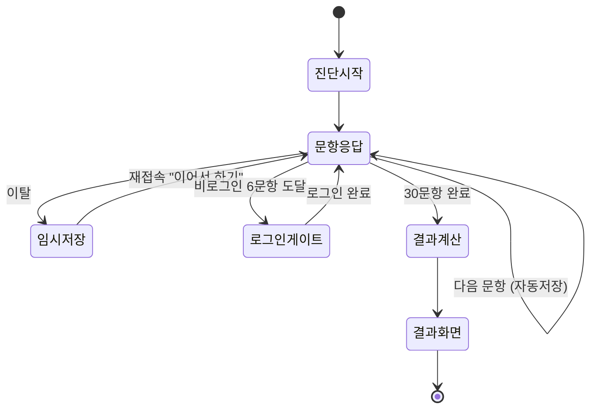
```mermaid
stateDiagram-v2
    [*] --> 진단시작
    진단시작 --> 문항응답
    문항응답 --> 문항응답: 다음 문항 (자동저장)
    문항응답 --> 임시저장: 이탈
    임시저장 --> 문항응답: 재접속 "이어서 하기"
    문항응답 --> 로그인게이트: 비로그인 6문항 도달
    로그인게이트 --> 문항응답: 로그인 완료
    문항응답 --> 결과계산: 30문항 완료
    결과계산 --> 결과화면
    결과화면 --> [*]
```

#### ⑥ 상태·예외
- 진행 중 이탈 → localStorage + 서버 임시 저장 (양쪽)
- 재진단 요청 → "기존 결과를 덮어씁니다" 확인 모달
- 응답 편중 (한 선택지만 반복) → 결과에 "탐색 필요" 안내 추가

---

### P06 · 진단 결과 `/quiz/result`

#### ③ 화면 구성

```
┌──────────────────────────────────────────────────────┐
│  🎯 박서준님의 관심사                                   │
├──────────────────────────────────────────────────────┤
│                                                      │
│  ┌── Top 1 ────────────────────────────────┐         │
│  │  #43  기술과 인간          ████████ 87%  │         │
│  │  "기술이 사람을 어떻게 바꾸는가"             │         │
│  └──────────────────────────────────────────┘         │
│  ┌── Top 2 ────────────────────────────────┐         │
│  │  #33  교육과 학습          ██████ 71%    │         │
│  └──────────────────────────────────────────┘         │
│  ┌── Top 3 ────────────────────────────────┐         │
│  │  #26  번아웃과 무기력       █████ 64%     │         │
│  └──────────────────────────────────────────┘         │
│                                                      │
│  ┌── 영역 분포 ─────────────────────────────┐         │
│  │  (레이더 차트: A~F 6영역)                  │         │
│  └──────────────────────────────────────────┘         │
│                                                      │
│  ── 다음 단계 ──                                      │
│                                                      │
│  ✅ 크루 배정 완료                                     │
│     "#43 기술과 인간 크루" (6명)                        │
│     [크루 보러 가기 →]                                 │
│                                                      │
│  📚 이 관심사로 읽을 만한 책 12권                        │
│     [책 탐색 →]                                       │
│                                                      │
│  [결과 공유]  [다시 진단]                              │
└──────────────────────────────────────────────────────┘
```

#### ④ 유저 시나리오

```
케이스 A · 그룹에 이미 참여한 학생
1. 진단 완료 → 결과 화면
2. "크루 배정 완료" 확인 → 같은 관심사 5명이 있음을 봄
3. [크루 보러 가기] → P14 크루 상세
4. 크루원 이름·아바타 확인 → 소속감 형성

케이스 B · 그룹 없는 개인 사용자
1. 진단 완료 → 결과 화면
2. "크루 배정" 대신 "이 관심사의 공개 그룹 3개" 노출
3. [그룹 둘러보기] → P08

케이스 C · 지도자
1. 진단 완료 (본인도 체험)
2. "학생들에게도 진단을 받게 하세요" 안내
3. [그룹 만들기] → P09
```

#### ⑤ 단계도

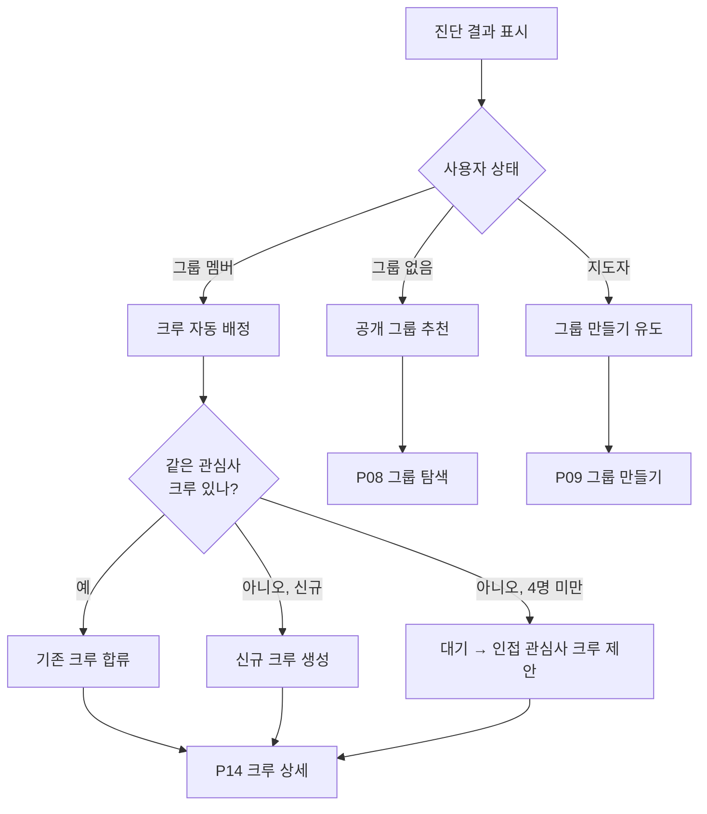
```mermaid
flowchart TD
    RESULT[진단 결과 표시] --> STATE{사용자 상태}
    STATE -->|그룹 멤버| ASSIGN[크루 자동 배정]
    STATE -->|그룹 없음| SUGGEST[공개 그룹 추천]
    STATE -->|지도자| CREATE[그룹 만들기 유도]

    ASSIGN --> CREWEXIST{같은 관심사<br/>크루 있나?}
    CREWEXIST -->|예| JOIN[기존 크루 합류]
    CREWEXIST -->|아니오, 4명 미만| WAIT[대기 → 인접 관심사 크루 제안]
    CREWEXIST -->|아니오, 신규| NEWCREW[신규 크루 생성]

    JOIN --> CREWPAGE[P14 크루 상세]
    NEWCREW --> CREWPAGE
    WAIT --> CREWPAGE
    SUGGEST --> P08[P08 그룹 탐색]
    CREATE --> P09[P09 그룹 만들기]
```

---

### P07 · 책·주제 탐색 `/books/explore`

#### ① 목적
관심사 코드 기반으로 **읽을 책을 고른다.** (S 단계)

#### ③ 화면 구성

```
┌──────────────────────────────────────────────────────┐
│  📚 책·주제 탐색                                       │
│  [관심사 ▼ #43 기술과 인간] [학교급 ▼] [난이도 ▼]        │
├──────────────────────────────────────────────────────┤
│                                                      │
│  #43 기술과 인간 — 추천 도서 12권                       │
│                                                      │
│  ┌──────────┐ ┌──────────┐ ┌──────────┐              │
│  │ [표지]    │ │ [표지]    │ │ [표지]    │              │
│  │          │ │          │ │          │              │
│  │에듀테크의 │ │클릭 하지 │ │나는 앞으로│              │
│  │미래      │ │않습니다  │ │몇 번의   │              │
│  │          │ │          │ │봄을...   │              │
│  │중등·보통  │ │고등·어려움│ │중등·쉬움 │              │
│  │읽은 사람 │ │읽은 사람 │ │읽은 사람 │              │
│  │  47명    │ │  23명    │ │  61명    │              │
│  │[이 책 선택]│ │[이 책 선택]│ │[이 책 선택]│              │
│  └──────────┘ └──────────┘ └──────────┘              │
│                                                      │
│  ┌── 이 책에서 나온 질문들 ─────────────────┐          │
│  │ "AI가 교사를 대체할 수 있는가?" 🤝12 ⚔️14 │          │
│  │ "에듀테크는 격차를 줄이나 늘리나?" 🤝8 ⚔️9 │          │
│  └───────────────────────────────────────┘          │
│                                                      │
│  📖 우리 학교 도서관에 있나요?                          │
│  [소장 여부 확인] (도서관 연동 시)                       │
└──────────────────────────────────────────────────────┘
```

#### ④ 유저 시나리오

```
1. 진단 결과에서 [책 탐색] 클릭 → 자동으로 Top1 관심사 필터 적용
2. 카드 12개 훑어봄 → "읽은 사람 61명"이 많은 책에 눈길
3. 카드 클릭 → 상세 (책 소개 + 이 책에서 나온 질문 5개)
4. "이 책에서 나온 질문"을 보고 흥미 생김
5. [이 책 선택] → 내 서재에 추가 → 주2 미션 자동 완료 처리
```

#### ⑥ 상태·예외
- 관심사에 등록 도서 0권 → "아직 이 관심사의 추천 도서가 없습니다. 직접 등록해 보세요" + [책 직접 등록]
- 직접 등록 → 제목·저자·ISBN 입력 (관리자 검수 후 공개 목록 반영)

---

## 10. C그룹 · 독서 스페이스 (P08~P14)

### P08 · 독서 스페이스 (그룹 목록) `/readmate?tab=community`

> aicareerpath의 "커리어 스페이스"를 그대로 이식한 화면.

#### ③ 화면 구성

```
┌──────────────────────────────────────────────────────┐
│  📖 독서 실행                                          │
│  [피드] [커뮤니티] [내 기록] [포트폴리오] [자료실]        │
├──────────────────────────────────────────────────────┤
│  📚 독서 스페이스                                      │
│  함께 읽는 그룹 공간                                    │
│  학교 독서반·동아리를 만들고 12주 로드맵을 함께 진행하세요.  │
│  초대 코드로 멤버를 모으고 문제를 발견해요.                │
│                                                      │
│  전체 그룹 128개 · 참여중 1개 · 공유 문제 카드 12,391장    │
│                                                      │
│  [+ 새 그룹 만들기]   [초대 코드로 참여]                 │
├──────────────────────────────────────────────────────┤
│  내 그룹                                              │
│  ┌──────────────────────────────────────────┐        │
│  │ 📖 한빛중 2학년 독서반          [멤버]      │        │
│  │ 함께 읽고 문제를 발견합시다                 │        │
│  │ 👥 24명 · 📋 5주차 · #독서반 #중등          │        │
│  │ 이번 주 미션: 병렬 독서 (D-3)  ⬜ 미제출    │        │
│  │                          [들어가기 →]     │        │
│  └──────────────────────────────────────────┘        │
├──────────────────────────────────────────────────────┤
│  공개 그룹 둘러보기        [카테고리 ▼] [지역 ▼]         │
│  ┌────────────┐ ┌────────────┐ ┌────────────┐        │
│  │🔬 과학 독서반│ │📝 논술 준비반│ │🌍 환경 크루 │        │
│  │탐구 보고서와│ │비문학 읽기와│ │기후 문제를 │        │
│  │독서 연결   │ │논증 훈련   │ │직접 조사   │        │
│  │👥 8명 · 3주차│ │👥 6명 · 1주차│ │👥 12명·7주차│       │
│  │[참여 요청] │ │[참여 요청] │ │[참여 요청] │        │
│  └────────────┘ └────────────┘ └────────────┘        │
└──────────────────────────────────────────────────────┘
```

#### ④ 유저 시나리오

| 유저 상태 | 보이는 것 | 행동 |
|---|---|---|
| 그룹 0개 | 빈 상태 + "초대 코드가 있나요?" 강조 | 코드 입력 or 공개 그룹 참여 요청 |
| 그룹 1개 (멤버) | 내 그룹 카드 + 이번 주 미션 상태 | [들어가기] → P11 |
| 그룹 여러 개 | 그룹 카드 목록 (최근 활동순) | 선택 |
| 지도자 | 내 그룹에 [관리] 배지 + 미제출자 수 표시 | [들어가기] → 대시보드 |

#### ⑤ 단계도

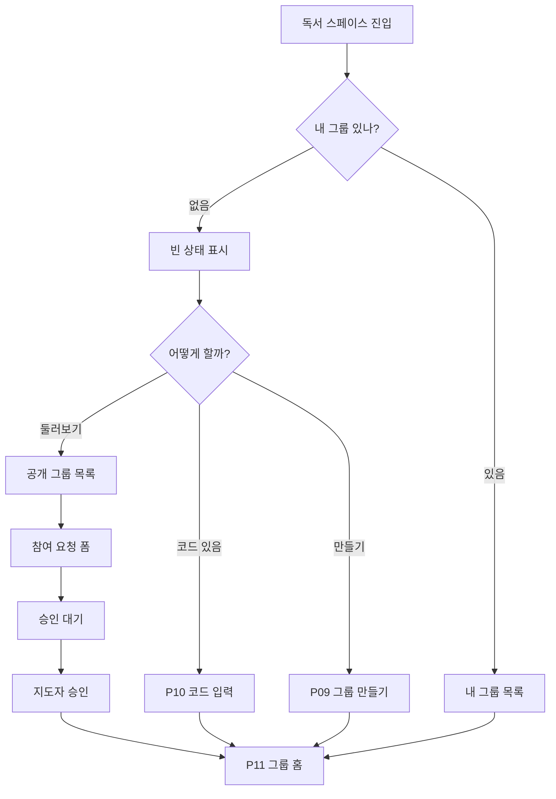
```mermaid
flowchart TD
    P08[독서 스페이스 진입] --> HAS{내 그룹 있나?}
    HAS -->|없음| EMPTY[빈 상태 표시]
    HAS -->|있음| LIST[내 그룹 목록]

    EMPTY --> OPT{어떻게 할까?}
    OPT -->|코드 있음| JOIN[P10 코드 입력]
    OPT -->|만들기| NEW[P09 그룹 만들기]
    OPT -->|둘러보기| PUBLIC[공개 그룹 목록]

    PUBLIC --> REQ[참여 요청 폼]
    REQ --> PEND[승인 대기]
    PEND --> APPROVED[지도자 승인]
    APPROVED --> HOME[P11 그룹 홈]

    JOIN --> HOME
    NEW --> HOME
    LIST --> HOME
```

---

### P09 · 그룹 만들기 `/groups/new`

#### ① 목적
독서 지도자가 **2분 안에** 그룹을 생성한다.

#### ③ 화면 구성

```
┌──────────────────────────────────────────────────────┐
│  📖 새 독서 그룹 만들기                     [X 닫기]    │
├──────────────────────────────────────────────────────┤
│                                                      │
│  그룹 아이콘                                          │
│  [📖][🔬][🎨][💻][🌍][⚖️][🧠][🎭][🏛][🌱][📊][🚀]      │
│   ●                                                  │
│                                                      │
│  그룹 이름 *                                          │
│  ┌──────────────────────────────────────────┐        │
│  │ 한빛중 2학년 독서반                        │        │
│  └──────────────────────────────────────────┘        │
│                                                      │
│  설명                                                │
│  ┌──────────────────────────────────────────┐        │
│  │ 함께 읽고 문제를 발견합시다                 │        │
│  └──────────────────────────────────────────┘        │
│                                                      │
│  카테고리 *          진행 방식 *                       │
│  [독서반      ▼]     ● 온라인  ○ 교실 병행  ○ 자율     │
│                                                      │
│  로드맵 *                                            │
│  ● 12주 표준 (SMILE + 프로젝트)                        │
│  ○ 8주 압축 (SMILE 중심)                              │
│  ○ 자율 (미션 직접 설정)                               │
│                                                      │
│  최대 인원                                            │
│  4 ●────────────────────── 40      [ 30 ]명           │
│                                                      │
│  크루 배정 방식                                        │
│  ● 관심사 진단 자동  ○ 지도자 수동  ○ 자율             │
│                                                      │
│  태그 (최대 20개)                                     │
│  [#중등 ×] [#독서반 ×] [+ 태그 추가]                   │
│                                                      │
│  목록에 공개                                          │
│  [ ○───● ] 끄면 초대 코드로만 참여할 수 있어요           │
│                                                      │
│                  [ 그룹 만들기 ]                       │
└──────────────────────────────────────────────────────┘
```

#### ④ 완료 화면

```
┌──────────────────────────────────────────────────────┐
│              🎉 그룹이 만들어졌습니다!                  │
│                                                      │
│         한빛중 2학년 독서반                            │
│                                                      │
│   ┌────────────────────────────────────────┐         │
│   │        초대 코드                        │         │
│   │                                        │         │
│   │      R E A D - H B 2 - 2 6             │         │
│   │                                        │         │
│   │  [📋 복사]  [💬 카톡 공유]  [📱 QR]     │         │
│   └────────────────────────────────────────┘         │
│                                                      │
│   학생에게 이 코드를 알려주세요.                        │
│   코드를 입력하면 바로 참여됩니다.                      │
│                                                      │
│   ┌── 다음에 할 일 ─────────────────────────┐         │
│   │ ① 학급 단톡방에 코드 공유                │         │
│   │ ② 학생 4명 이상 합류 대기               │         │
│   │ ③ 1주차 미션 자동 시작 (관심사 진단)      │         │
│   └────────────────────────────────────────┘         │
│                                                      │
│            [ 그룹으로 이동 → ]                         │
└──────────────────────────────────────────────────────┘
```

#### ⑤ 단계도

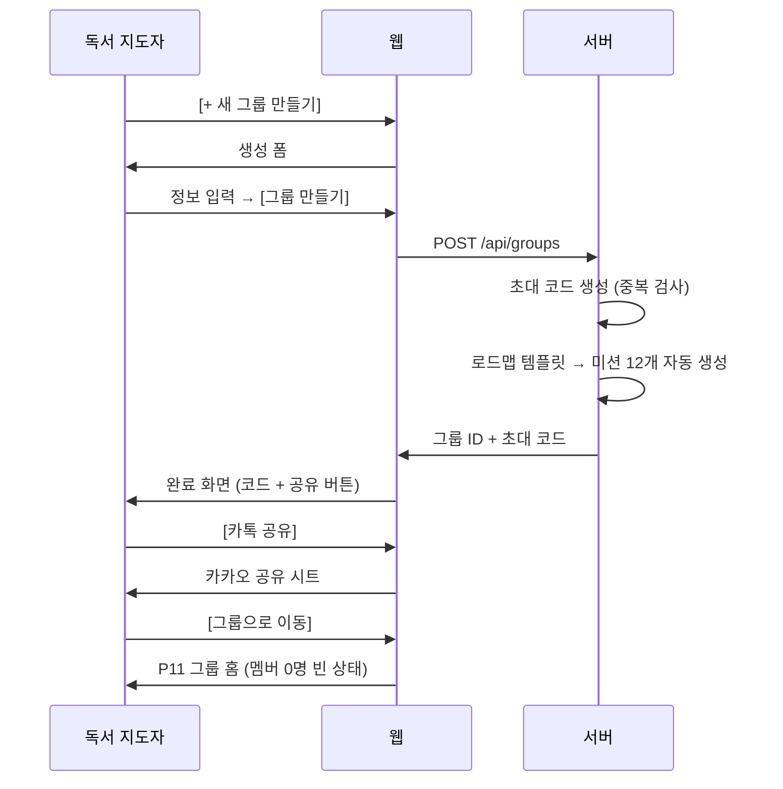
```mermaid
sequenceDiagram
    participant T as 독서 지도자
    participant W as 웹
    participant S as 서버

    T->>W: [+ 새 그룹 만들기]
    W->>T: 생성 폼
    T->>W: 정보 입력 → [그룹 만들기]
    W->>S: POST /api/groups
    S->>S: 초대 코드 생성 (중복 검사)
    S->>S: 로드맵 템플릿 → 미션 12개 자동 생성
    S->>W: 그룹 ID + 초대 코드
    W->>T: 완료 화면 (코드 + 공유 버튼)
    T->>W: [카톡 공유]
    W->>T: 카카오 공유 시트
    T->>W: [그룹으로 이동]
    W->>T: P11 그룹 홈 (멤버 0명 빈 상태)
```

#### ⑥ 상태·예외

| 예외 | 처리 |
|---|---|
| 그룹 이름 중복 | 허용 (초대 코드가 고유하므로) |
| 초대 코드 충돌 | 서버에서 재생성 (최대 5회 시도) |
| 로드맵 "자율" 선택 | 미션 자동 생성 생략 → 그룹 홈에서 직접 추가 안내 |
| 생성 실패 | 입력값 유지 + 토스트 "일시적 오류입니다. 다시 시도해 주세요" |

---

### P10 · 초대 코드 참여 `/groups/join`

#### ③ 화면 구성

```
┌──────────────────────────────────────────────────────┐
│  🔑 그룹 참여하기                                      │
├──────────────────────────────────────────────────────┤
│                                                      │
│  선생님께 받은 초대 코드를 입력하세요                     │
│                                                      │
│   ┌────┐ ┌────┐ ┌────┐ ┌────┐                        │
│   │ R  │ │ E  │ │ A  │ │ D  │  -                     │
│   └────┘ └────┘ └────┘ └────┘                        │
│   ┌────┐ ┌────┐ ┌────┐   -   ┌────┐ ┌────┐           │
│   │ H  │ │ B  │ │ 2  │       │ 2  │ │ 6  │           │
│   └────┘ └────┘ └────┘       └────┘ └────┘           │
│                                                      │
│              [ 참여하기 ]                             │
│                                                      │
│  ─────────────  또는  ─────────────                  │
│                                                      │
│  코드가 없나요?                                       │
│  [공개 그룹 둘러보기 →]                                │
│                                                      │
└──────────────────────────────────────────────────────┘

→ 코드 입력 성공 시:

┌──────────────────────────────────────────────────────┐
│  📖 한빛중 2학년 독서반                                 │
│  함께 읽고 문제를 발견합시다                             │
│  👥 18명 · 📋 5주차 · 지도자: 이지현 선생님              │
│                                                      │
│  이 그룹에 참여할까요?                                  │
│                                                      │
│  참여하면:                                            │
│  · 관심사 진단(15분)을 받고                            │
│  · 같은 관심사 친구들과 크루가 되고                      │
│  · 매주 미션을 함께 진행합니다                          │
│                                                      │
│         [취소]          [참여하기]                     │
└──────────────────────────────────────────────────────┘
```

#### ④ 유저 시나리오

```
U2 박서준(중2)의 흐름:

1. 카톡으로 "READ-HB2-26" 코드 받음
2. 링크 클릭 → 리딩클루 → 로그인 (카카오, 3초)
3. 코드 자동 입력됨 (딥링크 파라미터) 또는 직접 입력
4. 그룹 미리보기 확인 → "우리 반 맞네" → [참여하기]
5. "관심사 진단을 시작할까요?" → [시작] → P05
6. 15분 진단 → P06 결과 → 크루 자동 배정
7. P11 그룹 홈 → "이번 주 미션: 관심사 발견 ✅ 완료"
```

#### ⑤ 단계도

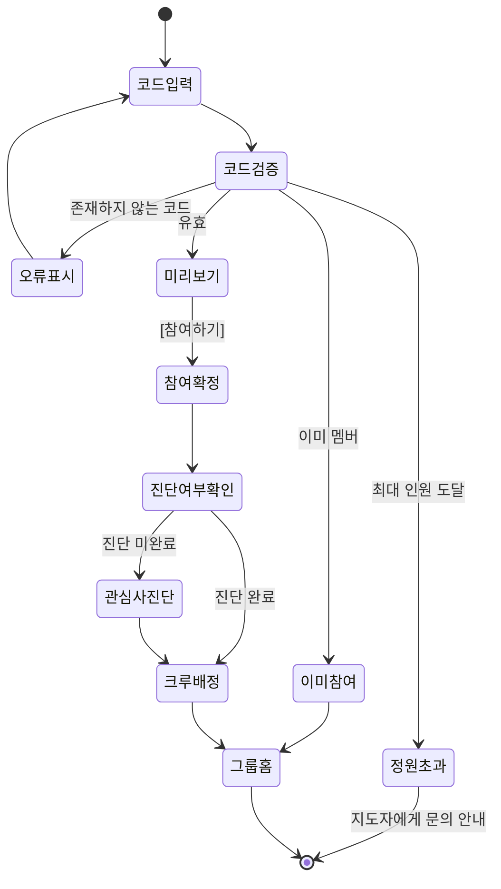
```mermaid
stateDiagram-v2
    [*] --> 코드입력
    코드입력 --> 코드검증
    코드검증 --> 오류표시: 존재하지 않는 코드
    코드검증 --> 정원초과: 최대 인원 도달
    코드검증 --> 이미참여: 이미 멤버
    코드검증 --> 미리보기: 유효
    오류표시 --> 코드입력
    정원초과 --> [*]: 지도자에게 문의 안내
    이미참여 --> 그룹홈
    미리보기 --> 참여확정: [참여하기]
    참여확정 --> 진단여부확인
    진단여부확인 --> 관심사진단: 진단 미완료
    진단여부확인 --> 크루배정: 진단 완료
    관심사진단 --> 크루배정
    크루배정 --> 그룹홈
    그룹홈 --> [*]
```

#### ⑥ 상태·예외

| 예외 | 메시지 |
|---|---|
| 코드 없음 | "이 코드를 찾을 수 없어요. 대소문자와 하이픈을 확인해 주세요." |
| 정원 초과 | "이 그룹은 정원이 찼습니다. 선생님께 문의해 주세요." |
| 이미 참여 | 자동으로 그룹 홈 이동 |
| 그룹 종료됨 | "이 그룹은 시즌이 종료되었습니다." |
| 승인 필요 그룹 | 참여 요청 폼 (이름·관심 분야·참여 목적) → 대기 |

---

### P11 · 그룹 홈 (대시보드) `/groups/:id`

#### ① 목적
- **학생**: 이번 주 할 일을 3초 안에 안다
- **지도자**: 전체 진행 상황을 10초 안에 파악한다

#### ③ 화면 구성 — 학생 뷰

```
┌──────────────────────────────────────────────────────┐
│  📖 한빛중 2학년 독서반         5주차 · 시즌 1          │
│  [홈] [피드] [로드맵] [크루] [갤러리]                   │
├──────────────────────────────────────────────────────┤
│  ┌── 🔔 이번 주 미션 ─────────────────────────┐        │
│  │  주 5 · 병렬 독서                          │        │
│  │  크루 내 다른 친구가 읽은 책 1권을 읽고        │        │
│  │  독서 노트를 작성하세요.                     │        │
│  │                                           │        │
│  │  마감: 12월 8일 (일) 23:59 · D-3            │        │
│  │  상태: ⬜ 미제출                            │        │
│  │                    [미션 시작하기 →]        │        │
│  └───────────────────────────────────────────┘        │
│                                                      │
│  ┌── 내 크루 ─────────────────────────────────┐       │
│  │  💻 #43 기술과 인간 크루 · 6명               │       │
│  │  👤👤👤👤👤👤                               │       │
│  │  이번 주 완료 4/6                            │       │
│  │                       [크루 보기 →]         │       │
│  └────────────────────────────────────────────┘       │
│                                                      │
│  ┌── 내 진행 상황 ─────────────────────────────┐       │
│  │  전체 진행률  ████████░░░░░░░░  4/12주       │       │
│  │  문제 카드 2장 · 받은 반응 11개 · 정의서 0건   │       │
│  └────────────────────────────────────────────┘       │
│                                                      │
│  ┌── 크루 최근 활동 ───────────────────────────┐       │
│  │  · 김민준님이 문제 카드를 올렸어요 (2시간 전)   │       │
│  │  · 이수아님이 내 카드에 ⚔️ 반응 (5시간 전)     │       │
│  │  · 박지호님이 미션 5를 완료했어요 (어제)        │       │
│  │                          [피드 전체 →]      │       │
│  └────────────────────────────────────────────┘       │
└──────────────────────────────────────────────────────┘
```

#### ③-2 화면 구성 — 지도자 뷰

```
┌──────────────────────────────────────────────────────┐
│  📖 한빛중 2학년 독서반    [관리] 5주차 · 시즌 1  [⚙️]  │
│  초대 코드: READ-HB2-26  [📋 복사]                     │
│  [홈] [피드] [로드맵] [크루] [갤러리] [리포트]           │
├──────────────────────────────────────────────────────┤
│  ┌── 이번 주 현황 ─────────────────────────────┐      │
│  │  주 5 · 병렬 독서 · 마감 D-3                  │      │
│  │  완료 18/24 (75%)  ██████████████████░░░░░░  │      │
│  │                                             │      │
│  │  미제출 6명:                                 │      │
│  │  김○○  이○○  박○○  최○○  정○○  강○○         │      │
│  │                    [일괄 독려 알림 보내기]     │      │
│  └─────────────────────────────────────────────┘      │
│                                                      │
│  ┌── 크루별 현황 ──────────────────────────────┐      │
│  │  💻 #43 기술과 인간 (6명) ████████░░  83%    │      │
│  │  📚 #33 교육과 학습 (7명) ██████░░░░  57% ⚠️ │      │
│  │  🧠 #26 번아웃    (5명) ██████████ 100%     │      │
│  │  ⚖️ #41 정의와 공정 (6명) ████████░░  83%    │      │
│  │                          [크루 관리 →]      │      │
│  └─────────────────────────────────────────────┘      │
│                                                      │
│  ┌── 이번 주 주목할 카드 ───────────────────────┐      │
│  │  "AI가 교사를 대체할 수 있는가?"               │      │
│  │  김민준 · 🤝3 🔍2 ⚔️4                        │      │
│  │              [⭐ 하이라이트 지정]              │      │
│  └─────────────────────────────────────────────┘      │
│                                                      │
│  ┌── 시즌 누적 ────────────────────────────────┐      │
│  │  문제 카드 47 · 반응 312 · 정의서 0 · 프로젝트 0│      │
│  │                        [리포트 보기 →]       │      │
│  └─────────────────────────────────────────────┘      │
└──────────────────────────────────────────────────────┘
```

#### ④ 유저 시나리오

```
【학생 U2】 매주 반복 흐름 (3분)
1. 푸시/카톡 알림 "이번 주 미션이 열렸어요" → 클릭
2. 그룹 홈 진입 → 최상단에 이번 주 미션
3. [미션 시작하기] → 해당 작업 화면으로 (P15/P16/P17...)
4. 작업 완료 → 자동으로 그룹 홈 복귀 → "✅ 완료" 표시
5. 크루 최근 활동에서 친구들 활동 확인

【지도자 U1】 매주 10분 흐름
1. 그룹 홈 진입 → "완료 18/24" 즉시 파악
2. 미제출 6명 확인 → [일괄 독려 알림 보내기] 클릭 (3초)
3. 크루별 현황에서 ⚠️ 표시된 #33 크루 확인 (57%)
   → 크루 관리 → 크루장에게 개별 메시지
4. "이번 주 주목할 카드" 확인 → [⭐ 하이라이트] 지정
   → 그룹 전체 피드 상단에 노출됨
5. 종료 (총 8분)
```

#### ⑤ 단계도

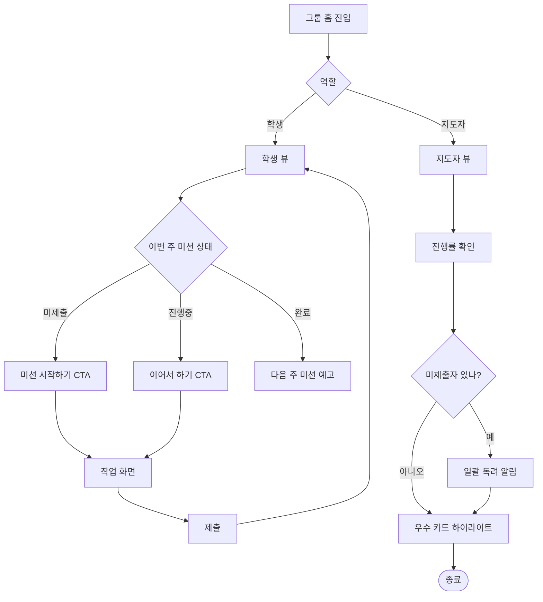
```mermaid
flowchart TD
    ENTER[그룹 홈 진입] --> ROLE{역할}

    ROLE -->|학생| SVIEW[학생 뷰]
    ROLE -->|지도자| TVIEW[지도자 뷰]

    SVIEW --> MSTATE{이번 주 미션 상태}
    MSTATE -->|미제출| START[미션 시작하기 CTA]
    MSTATE -->|진행중| CONT[이어서 하기 CTA]
    MSTATE -->|완료| NEXT[다음 주 미션 예고]

    START --> WORK[작업 화면]
    CONT --> WORK
    WORK --> SUBMIT[제출]
    SUBMIT --> SVIEW

    TVIEW --> CHECK[진행률 확인]
    CHECK --> LOW{미제출자 있나?}
    LOW -->|예| NUDGE[일괄 독려 알림]
    LOW -->|아니오| HIGHLIGHT[우수 카드 하이라이트]
    NUDGE --> HIGHLIGHT
    HIGHLIGHT --> END([종료])
```

#### ⑥ 상태·예외

| 상태 | 화면 |
|---|---|
| 멤버 0명 (방금 생성) | "학생을 초대해 주세요" + 초대 코드 크게 + 공유 버튼 |
| 멤버 1~3명 (정족수 미달) | "4명 이상 모이면 크루가 만들어져요" + 현재 인원 |
| 시즌 종료 | "시즌이 종료되었습니다" + [리포트 보기] + [다음 시즌 시작] |
| 미션 마감 지남 | 미션 카드 회색 + "마감됨" + [늦게라도 제출] (지도자 설정 시) |

---

### P12 · 그룹 피드 `/groups/:id/feed`

#### ③ 화면 구성

```
┌──────────────────────────────────────────────────────┐
│  피드         [전체 ▼] [내 크루 ▼] [유형 ▼] [최신순 ▼]  │
├──────────────────────────────────────────────────────┤
│  ⭐ 이번 주 하이라이트                                  │
│  ┌──────────────────────────────────────────┐        │
│  │ 💻 #43 · 김민준 · 3시간 전                 │        │
│  │                                          │        │
│  │ 🔍 AI가 교사를 대체할 수 있는가?            │        │
│  │                                          │        │
│  │ 느낀 순간: 챗GPT로 숙제하는 친구를 보면서   │        │
│  │ 선생님의 역할이 뭔지 의문이 들었다.          │        │
│  │                                          │        │
│  │ 📖 《에듀테크의 미래》                      │        │
│  │ 이 책이 준 질문: "기술이 교육을 바꾸는가,   │        │
│  │ 교육이 기술을 선택하는가?"                  │        │
│  │                                          │        │
│  │ [🤝 3]  [🔍 2]  [⚔️ 4]      💬 5          │        │
│  └──────────────────────────────────────────┘        │
├──────────────────────────────────────────────────────┤
│  ┌──────────────────────────────────────────┐        │
│  │ 📚 #33 · 이수아 · 5시간 전                 │        │
│  │ ⚔️ 김민준님의 카드에 반론                   │        │
│  │                                          │        │
│  │ "대체"라는 전제가 문제인 것 같아요.          │        │
│  │ 교사의 역할을 "지식 전달"로만 보면 대체      │        │
│  │ 가능하지만, "관계"로 보면 불가능하잖아요.     │        │
│  │ 그럼 질문은 "무엇이 대체되는가"가 아닐까요?   │        │
│  │                                          │        │
│  │                            💬 답글 2      │        │
│  └──────────────────────────────────────────┘        │
├──────────────────────────────────────────────────────┤
│  ┌──────────────────────────────────────────┐        │
│  │ 🧠 #26 · 박지호 · 어제                     │        │
│  │ ✅ 미션 5 완료 — 병렬 독서                  │        │
│  │ 《아무튼, 피로》 독서 노트 작성 완료          │        │
│  │                            [노트 보기 →]  │        │
│  └──────────────────────────────────────────┘        │
└──────────────────────────────────────────────────────┘
```

#### ④ 유저 시나리오

```
1. 학생이 피드 진입 → 하이라이트 카드 먼저 봄
2. 흥미로운 카드에 [⚔️] 클릭
3. 모달: "왜 그렇게 생각했나요? (20자 이상)"
   → 20자 미만이면 [등록] 버튼 비활성
4. 코멘트 작성 후 등록 → 원작자에게 알림
5. 원작자가 답글 → 대화 시작
6. 반응 3개 이상 받으면 카드에 🔥 배지
```

#### ⑤ 반응 등록 단계도

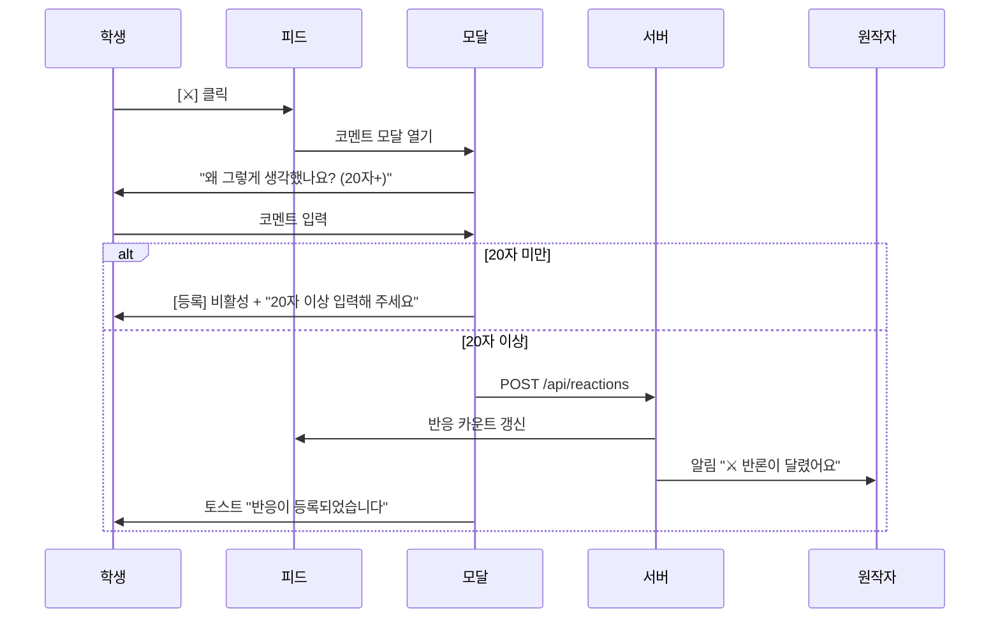
```mermaid
sequenceDiagram
    participant S as 학생
    participant F as 피드
    participant M as 모달
    participant SRV as 서버
    participant O as 원작자

    S->>F: [⚔️] 클릭
    F->>M: 코멘트 모달 열기
    M->>S: "왜 그렇게 생각했나요? (20자+)"
    S->>M: 코멘트 입력
    alt 20자 미만
        M->>S: [등록] 비활성 + "20자 이상 입력해 주세요"
    else 20자 이상
        M->>SRV: POST /api/reactions
        SRV->>F: 반응 카운트 갱신
        SRV->>O: 알림 "⚔️ 반론이 달렸어요"
        M->>S: 토스트 "반응이 등록되었습니다"
    end
```

---

### P13 · 로드맵 `/groups/:id/roadmap`

#### ③ 화면 구성

```
┌──────────────────────────────────────────────────────┐
│  📋 12주 로드맵                     [✏️ 커스터마이징]   │
│  한빛중 2학년 독서반 · 시즌 1                           │
├──────────────────────────────────────────────────────┤
│  ┌─ 1막 문제 제기 ─── SMILE: S·M·I ────────────┐      │
│  │                                             │      │
│  │ ✅ 주1  관심사 발견          24/24  [보기]    │      │
│  │ ✅ 주2  책 선택·구조 파악     24/24  [보기]    │      │
│  │ ✅ 주3  문제 카드 작성       22/24  [보기]    │      │
│  └─────────────────────────────────────────────┘      │
│                                                      │
│  ┌─ 2막 심화·검증 ─── SMILE: I·L·E ─────────────┐     │
│  │                                             │      │
│  │ ✅ 주4  숨은 전제·근거 수집   21/24  [보기]    │      │
│  │ 🔵 주5  병렬 독서   ← 지금   18/24  [진행]    │      │
│  │ ⬜ 주6  교차 코멘트·함의                       │      │
│  │ ⬜ 주7  반증 ★                                │      │
│  │ ⬜ 주8  문제 정의서 완성                       │      │
│  └─────────────────────────────────────────────┘      │
│                                                      │
│  ┈┈┈┈┈┈ 분기점: 여기까지도 완주 인정 ┈┈┈┈┈┈           │
│                                                      │
│  ┌─ 3막 프로젝트 ─── SMILE+: P ─── (선택) ─────┐      │
│  │                                             │      │
│  │ ⬜ 주9  팀 구성·트랙 선택                      │      │
│  │ ⬜ 주10 프로젝트 실행 ①                        │      │
│  │ ⬜ 주11 실행 ② · 리허설                        │      │
│  │ ⬜ 주12 갤러리 발표 · 회고                      │      │
│  └─────────────────────────────────────────────┘      │
└──────────────────────────────────────────────────────┘

미션 상세 (클릭 시 확장):
┌──────────────────────────────────────────────────────┐
│  주 5 · 병렬 독서                          [닫기 ×]   │
├──────────────────────────────────────────────────────┤
│  📌 무엇을 하나요                                     │
│  크루 안에서 서로 다른 책을 읽고, 같은 문제를 다른       │
│  각도에서 봅니다.                                     │
│                                                      │
│  ✅ 해야 할 일                                        │
│  1. 크루원이 읽은 책 중 1권 선택                        │
│  2. 그 책을 읽기 (완독 아니어도 됨, 3장 이상)            │
│  3. 3층 독서 노트 작성                                 │
│     · 1층: 책이 말하는 것                              │
│     · 2층: 내 문제와 연결되는 것                        │
│     · 3층: 이 책이 내게 던진 질문 3개                   │
│                                                      │
│  ⏱ 예상 소요: 60분 (읽기 제외)                         │
│  📅 마감: 12월 8일(일) 23:59                          │
│                                                      │
│           [ 미션 시작하기 → ]                          │
└──────────────────────────────────────────────────────┘
```

#### ④ 유저 시나리오

| 유저 | 시나리오 |
|---|---|
| **학생** | 로드맵 진입 → 현재 주차(🔵) 확인 → 미션 클릭 → 상세 확인 → [미션 시작하기] |
| **학생(궁금)** | 주7 "반증 ★" 클릭 → "어떤 걸 하는지" 미리 봄 → 마음의 준비 |
| **지도자** | [✏️ 커스터마이징] → 미션 제목·설명·마감일 수정 → 저장 |
| **지도자(압축)** | 주10·11을 하나로 병합 → 11주 시즌으로 변경 |

#### ⑤ 단계도

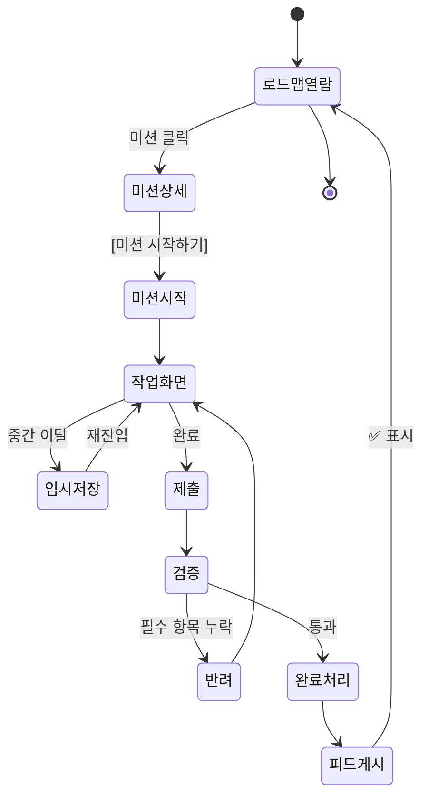
```mermaid
stateDiagram-v2
    [*] --> 로드맵열람
    로드맵열람 --> 미션상세: 미션 클릭
    미션상세 --> 미션시작: [미션 시작하기]
    미션시작 --> 작업화면
    작업화면 --> 임시저장: 중간 이탈
    임시저장 --> 작업화면: 재진입
    작업화면 --> 제출: 완료
    제출 --> 검증
    검증 --> 반려: 필수 항목 누락
    반려 --> 작업화면
    검증 --> 완료처리: 통과
    완료처리 --> 피드게시
    피드게시 --> 로드맵열람: ✅ 표시
    로드맵열람 --> [*]
```

---

### P14 · 크루 목록·상세 `/groups/:id/crews`

#### ③ 화면 구성

```
┌──────────────────────────────────────────────────────┐
│  👥 크루                                [+ 크루 추가]  │
├──────────────────────────────────────────────────────┤
│  ┌──────────────────────────────────────────┐        │
│  │ 💻 #43 기술과 인간               [내 크루] │        │
│  │ 👤김민준(장) 👤박서준 👤이수아 👤정하늘      │        │
│  │ 👤최윤서 👤강도윤                          │        │
│  │ 6명 · 이번 주 4/6 완료  ████████░░         │        │
│  │ 카드 12장 · 정의서 0건       [상세 →]      │        │
│  └──────────────────────────────────────────┘        │
│  ┌──────────────────────────────────────────┐        │
│  │ 📚 #33 교육과 학습                        │        │
│  │ 7명 · 이번 주 4/7 완료  ██████░░░░  ⚠️     │        │
│  │ 카드 15장 · 정의서 0건       [상세 →]      │        │
│  └──────────────────────────────────────────┘        │
└──────────────────────────────────────────────────────┘

크루 상세:
┌──────────────────────────────────────────────────────┐
│  💻 #43 기술과 인간 크루                               │
│  "기술이 사람을 어떻게 바꾸는가"                         │
├──────────────────────────────────────────────────────┤
│  멤버 6명                                             │
│  ┌────┬──────────┬────────┬──────┬──────┐            │
│  │    │ 이름      │ 역할    │ 카드  │ 이번주│            │
│  ├────┼──────────┼────────┼──────┼──────┤            │
│  │ 👤 │ 김민준    │ 크루장  │  3   │  ✅  │            │
│  │ 👤 │ 박서준    │ 멤버    │  2   │  ⬜  │            │
│  │ 👤 │ 이수아    │ 멤버    │  2   │  ✅  │            │
│  │ 👤 │ 정하늘    │ 멤버    │  2   │  ✅  │            │
│  │ 👤 │ 최윤서    │ 멤버    │  2   │  ✅  │            │
│  │ 👤 │ 강도윤    │ 멤버    │  1   │  ⬜  │            │
│  └────┴──────────┴────────┴──────┴──────┘            │
│                                                      │
│  ┌── 셀 배정 (주 5) ───────────────────────┐         │
│  │  셀 A: 김민준 · 박서준 · 이수아            │         │
│  │  셀 B: 정하늘 · 최윤서 · 강도윤            │         │
│  │                        [셀 재배정]       │         │
│  └─────────────────────────────────────────┘         │
│                                                      │
│  ┌── 크루 문제 카드 12장 ──────────────────┐          │
│  │  (카드 그리드)                          │          │
│  └────────────────────────────────────────┘          │
└──────────────────────────────────────────────────────┘
```

#### ④ 유저 시나리오

```
【학생】
1. 크루 상세 진입 → 크루원 6명 확인
2. "박서준(나) 이번 주 ⬜" → 아직 안 했음을 자각
3. 셀 배정 확인 → "나는 셀 A, 김민준·이수아와 함께"
4. 셀 A 멤버의 카드 클릭 → 교차 코멘트 작성

【크루장】
1. 크루원 중 ⬜ 2명 확인
2. [독려 메시지] → 개별 알림 발송
3. 셀 배정 확인 → 이번 주 반증 페어 확인

【지도자】
1. 크루 목록에서 ⚠️ 표시 크루 확인 (57%)
2. 상세 진입 → 미완료 3명 파악
3. [셀 재배정] → 활발한 멤버와 소극적 멤버를 섞음
```

---

## 11. D그룹 · 실행 페이지 (P15~P20)

### P15 · 문제 카드 작성 `/cards/new`

#### ① 목적
**독후감이 아닌 "문제"**를 쓰게 만든다. 양식이 사고를 강제한다.

#### ③ 화면 구성

```
┌──────────────────────────────────────────────────────┐
│  🔍 문제 카드 작성                    [임시저장 · 자동]  │
├──────────────────────────────────────────────────────┤
│  관심사  [💻 #43 기술과 인간 ▼]                        │
│                                                      │
│  ┌─ ① 이 문제를 한 문장으로 ─────────────────┐        │
│  │ AI가 교사를 대체할 수 있는가?               │        │
│  │                                  24/100자 │        │
│  │ 💡 "~는 무엇인가?" 보다 "~는 왜 ~한가?"가   │        │
│  │    더 좋은 문제입니다.                     │        │
│  └───────────────────────────────────────────┘        │
│                                                      │
│  ┌─ ② 이 문제를 느낀 순간 ──────────────────┐         │
│  │ 챗GPT로 숙제를 하는 친구를 보면서 선생님의  │         │
│  │ 역할이 뭔지 의문이 들었다.                 │         │
│  │                                 42/300자 │         │
│  │ 💡 추상적인 생각보다 구체적인 장면을 쓰세요. │         │
│  └──────────────────────────────────────────┘         │
│                                                      │
│  ┌─ ③ 관련된 책 ────────────────────────────┐        │
│  │ 책 제목  [에듀테크의 미래          ] 🔍검색 │        │
│  │ 이 책이 준 질문                            │        │
│  │ [기술이 교육을 바꾸는 것인가, 교육이     ]  │        │
│  │ [기술을 선택하는 것인가?              ]  │        │
│  └───────────────────────────────────────────┘        │
│                                                      │
│  ┌─ ④ 반대편에서 보면 ★ ───────────────────┐         │
│  │ "이건 문제가 아니다"라고 말할 사람          │         │
│  │ [에듀테크 회사 개발자                  ]  │         │
│  │ 그 사람의 논리                            │         │
│  │ [AI는 교사를 돕는 도구일 뿐, 대체가     ]  │         │
│  │ [목적이 아니다.                       ]  │         │
│  │ 💡 이 칸이 가장 중요합니다. 반대 입장을    │         │
│  │    쓸 수 없다면 아직 문제가 아닙니다.      │         │
│  └───────────────────────────────────────────┘        │
│                                                      │
│  ┌─ ⑤ 이 문제가 중요한 이유 (한 문장) ────────┐        │
│  │ [지금 결정하지 않으면 10년 뒤 교육이     ]  │        │
│  │ [어떻게 될지 아무도 모르기 때문이다.     ]  │        │
│  └───────────────────────────────────────────┘        │
│                                                      │
│  공개 범위  ● 내 크루  ○ 그룹 전체  ○ 전국 공개         │
│                                                      │
│      [임시 저장]              [게시하기 →]             │
└──────────────────────────────────────────────────────┘
```

#### ④ 유저 시나리오

```
【첫 카드 작성 · U2 박서준】
1. 로드맵 주3 → [미션 시작하기] → 작성 화면
2. ① 한 문장 입력 → "AI는 좋은가?" (너무 막연)
   → 힌트 표시: "~는 왜 ~한가?" 형태 제안
   → 수정: "AI가 교사를 대체할 수 있는가?"
3. ② 느낀 순간 → 처음엔 "요즘 AI가 발전해서"
   → 힌트: "구체적인 장면을 쓰세요"
   → 수정: "챗GPT로 숙제하는 친구를 보면서"
4. ③ 책 검색 → 내 서재에서 선택 (주2에 고른 책 자동 제안)
5. ④ 반대편 — 여기서 5분 막힘. 가장 어려운 칸.
   → "반대 입장을 쓸 수 없다면 아직 문제가 아닙니다" 문구 읽음
   → 다시 생각 → "에듀테크 회사 개발자" 관점 작성
6. ⑤ 중요한 이유 작성
7. [게시하기] → 크루 피드에 등록 → 알림 발송
```

#### ⑤ 단계도

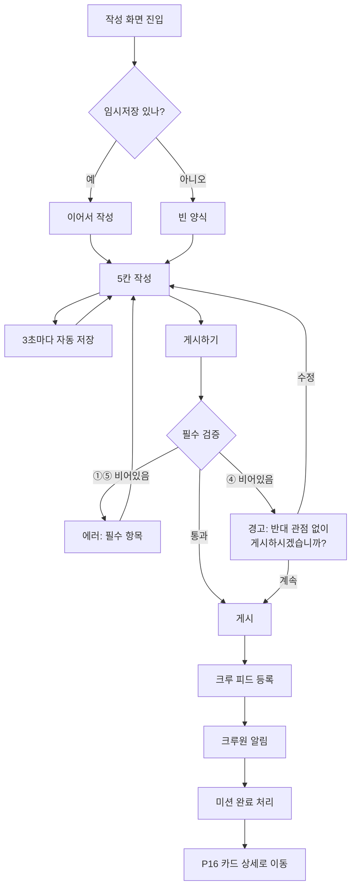
```mermaid
flowchart TD
    START[작성 화면 진입] --> DRAFT{임시저장 있나?}
    DRAFT -->|예| RESTORE[이어서 작성]
    DRAFT -->|아니오| BLANK[빈 양식]

    RESTORE --> FILL
    BLANK --> FILL[5칸 작성]

    FILL --> AUTO[3초마다 자동 저장]
    AUTO --> FILL

    FILL --> SUBMIT[게시하기]
    SUBMIT --> VALIDATE{필수 검증}

    VALIDATE -->|①⑤ 비어있음| ERR1[에러: 필수 항목]
    VALIDATE -->|④ 비어있음| ERR2[경고: 반대 관점 없이<br/>게시하시겠습니까?]
    VALIDATE -->|통과| POST[게시]

    ERR1 --> FILL
    ERR2 -->|계속| POST
    ERR2 -->|수정| FILL

    POST --> FEED[크루 피드 등록]
    FEED --> NOTIFY[크루원 알림]
    NOTIFY --> MISSION[미션 완료 처리]
    MISSION --> DETAIL[P16 카드 상세로 이동]
```

#### ⑥ 상태·예외

| 항목 | 규칙 |
|---|---|
| ① 한 문장 | **필수** · 10~100자 |
| ② 느낀 순간 | 권장 · 최대 300자 |
| ③ 관련 책 | 권장 · 미입력 시 "책 없이 쓴 카드" 배지 |
| ④ 반대편 | **강력 권장** · 미입력 시 경고 모달 (게시는 가능) |
| ⑤ 중요한 이유 | **필수** · 10~100자 |
| 자동 저장 | 3초 디바운스 · localStorage + 서버 |
| 편집 | 게시 후에도 수정 가능 (수정 이력 표시) |

---

### P16 · 문제 카드 상세 `/cards/:id`

#### ③ 화면 구성

```
┌──────────────────────────────────────────────────────┐
│  ← 피드로                              [⋯ 더보기]     │
├──────────────────────────────────────────────────────┤
│  💻 #43 기술과 인간 · 김민준 · 12월 3일                 │
│  🔥 반응 9개                                          │
│                                                      │
│  ┌──────────────────────────────────────────┐        │
│  │ 🔍 AI가 교사를 대체할 수 있는가?            │        │
│  └──────────────────────────────────────────┘        │
│                                                      │
│  ② 이 문제를 느낀 순간                                 │
│  챗GPT로 숙제를 하는 친구를 보면서 선생님의             │
│  역할이 뭔지 의문이 들었다.                            │
│                                                      │
│  ③ 관련된 책                                          │
│  📖 《에듀테크의 미래》                                 │
│  이 책이 준 질문: "기술이 교육을 바꾸는 것인가,          │
│  교육이 기술을 선택하는 것인가?"                        │
│                                                      │
│  ④ 반대편에서 보면                                     │
│  에듀테크 회사 개발자 → "AI는 교사를 돕는              │
│  도구일 뿐, 대체가 목적이 아니다."                      │
│                                                      │
│  ⑤ 중요한 이유                                        │
│  지금 결정하지 않으면 10년 뒤 교육이 어떻게             │
│  될지 아무도 모르기 때문이다.                          │
│                                                      │
├──────────────────────────────────────────────────────┤
│  [🤝 3]      [🔍 2]      [⚔️ 4]                       │
├──────────────────────────────────────────────────────┤
│  반응 9개                              [최신순 ▼]     │
│                                                      │
│  ⚔️ 이수아 · 5시간 전                                  │
│  "대체"라는 전제가 문제인 것 같아요. 교사의             │
│  역할을 "지식 전달"로만 보면 대체 가능하지만,           │
│  "관계"로 보면 불가능하잖아요.                          │
│      └ 💬 김민준: 맞아요. 질문을 바꿔야 할 것 같아요.    │
│                                                      │
│  🔍 정하늘 · 8시간 전                                  │
│  "대체"보다 "역할 변화"가 진짜 문제 아닐까요?           │
│  대체는 결과고, 변화가 과정인 것 같아요.                │
│                                                      │
│  🤝 최윤서 · 어제                                      │
│  저도 똑같은 생각했어요. 특히 국어 수업에서.            │
│                                                      │
├──────────────────────────────────────────────────────┤
│  이 카드로 정의서 쓰기                                  │
│  반응을 3개 이상 받았습니다. 정의서로 발전시켜 보세요.    │
│                       [정의서 작성 →]                  │
└──────────────────────────────────────────────────────┘
```

#### ④ 유저 시나리오

```
【반응 남기는 사람】
1. 피드에서 카드 클릭 → 상세 진입
2. 전문 읽음 → ④ 반대편 칸에서 "이 전제가 이상한데?"
3. [⚔️] 클릭 → 모달 → 20자 이상 코멘트 작성
4. 등록 → 원작자에게 알림

【카드 작성자】
1. 알림 "⚔️ 반론이 달렸어요" → 클릭
2. 이수아의 반론 읽음 → "대체가 아니라 역할 변화"
3. 💬 답글 작성 → 대화
4. 반응 3개 이상 → 하단에 [정의서 작성] CTA 활성
5. 클릭 → P18 정의서 작성 (카드 내용 자동 프리필)
```

#### ⑥ 상태·예외

| 상태 | 표시 |
|---|---|
| 반응 0개 | "아직 반응이 없어요. 크루원에게 알려볼까요?" + [크루에 알리기] |
| 반응 3개+ | [정의서 작성] CTA 활성화 |
| ⚔️ 반응 0개 | "아직 반론이 없습니다. 반론이 있어야 좋은 문제입니다" 안내 |
| 본인 카드 | [수정] [삭제] 메뉴 노출 |
| 신고된 카드 | 지도자에게만 표시 + 처리 UI |

---

### P17 · 반증 세션 `/rebuttal/:id`

#### ① 목적
8단계의 대면 SP-07(120분)을 **비동기 텍스트 반증**으로 전환한다. 시즌의 핵심 장면.

#### ③ 화면 구성 — 반증 파트너 뷰

```
┌──────────────────────────────────────────────────────┐
│  ⚔️ 반증 세션 · 주 7                                   │
│  발표자 김민준  ↔  반증 파트너 나(정하늘)               │
│  마감: 12월 15일 23:59 · D-2                          │
├──────────────────────────────────────────────────────┤
│  ┌── 반증 규칙 5가지 (반드시 읽어주세요) ────────┐      │
│  │ 1. 인격이 아니라 논증을 반박합니다.            │      │
│  │ 2. "틀렸다"가 아니라 "이 경우에는?"으로 씁니다.  │      │
│  │ 3. 반박에는 반드시 대안 질문이 따라야 합니다.    │      │
│  │ 4. 발표자는 즉시 수용하지 않아도 됩니다.        │      │
│  │ 5. 최소 질문 3개 + 대안 1개 · 200자 이상        │      │
│  └───────────────────────────────────────────┘        │
│                                                      │
│  ┌── 발표자의 정의서 초안 ────────────────────┐       │
│  │ 📌 문제 정의                               │       │
│  │ "고교생 번아웃은 시간 부족 때문이다"          │       │
│  │                                           │       │
│  │ 근거 1: 설문 조사 12명 중 9명이 "시간이     │       │
│  │        없다"고 응답                        │       │
│  │ 근거 2: 주당 학습 시간 평균 62시간          │       │
│  │ 근거 3: 《쉬어도 피곤한 사람들》 인용        │       │
│  │                                           │       │
│  │ 숨은 전제: 번아웃은 양(量)의 문제다          │       │
│  │                          [전문 보기 →]    │       │
│  └───────────────────────────────────────────┘        │
│                                                      │
│  ┌── 반증 작성 ──────────────────────────────┐       │
│  │ 질문 1                                     │       │
│  │ [방학에도 번아웃인 학생은 어떻게 설명하나요?] │       │
│  │                                           │       │
│  │ 질문 2                                     │       │
│  │ [시간이 많은데도 무기력한 경우는요?        ] │       │
│  │                                           │       │
│  │ 질문 3                                     │       │
│  │ [설문 12명은 표본으로 충분한가요?         ] │       │
│  │                                           │       │
│  │ 대안 제시 (이 경우에는?)                    │       │
│  │ [시간이 부족한 게 아니라 '선택권이 없는'    ] │       │
│  │ [것 아닐까요? 무엇을 할지 스스로 정하지    ] │       │
│  │ [못하는 상태가 진짜 원인 같습니다.         ] │       │
│  │                                           │       │
│  │                              218 / 200자 ✅ │       │
│  └───────────────────────────────────────────┘        │
│                                                      │
│       [임시 저장]           [반증 제출 →]              │
└──────────────────────────────────────────────────────┘
```

#### ③-2 화면 구성 — 발표자 뷰 (반증 받은 후)

```
┌──────────────────────────────────────────────────────┐
│  ⚔️ 받은 반증                                          │
│  반증 파트너: 정하늘 · 12월 14일                        │
├──────────────────────────────────────────────────────┤
│  ┌── 정하늘님의 반증 ────────────────────────┐        │
│  │ Q1. 방학에도 번아웃인 학생은 어떻게 설명?   │        │
│  │ Q2. 시간이 많은데도 무기력한 경우는?        │        │
│  │ Q3. 설문 12명은 표본으로 충분한가?          │        │
│  │                                           │        │
│  │ 💡 대안                                    │        │
│  │ 시간이 부족한 게 아니라 '선택권이 없는'      │        │
│  │ 것 아닐까요? 무엇을 할지 스스로 정하지       │        │
│  │ 못하는 상태가 진짜 원인 같습니다.            │        │
│  └───────────────────────────────────────────┘        │
│                                                      │
│  ⚠️ 지금 바로 수용하지 않아도 됩니다.                   │
│     기록만 하고 일주일 뒤에 다시 생각해도 좋습니다.       │
│                                                      │
│  ┌── 내 응답 ────────────────────────────────┐       │
│  │ ○ 수용합니다 — 정의서를 수정하겠습니다        │       │
│  │ ○ 부분 수용 — 일부만 반영합니다              │       │
│  │ ● 기록만 합니다 — 더 생각해 보겠습니다        │       │
│  │                                           │       │
│  │ 메모 (선택)                                │       │
│  │ [Q1이 가장 아팠다. 방학 때도 힘들었던      ] │       │
│  │ [기억이 있다. 다시 생각해 봐야겠다.        ] │       │
│  └───────────────────────────────────────────┘        │
│                                                      │
│              [ 응답 저장 ]                            │
│                                                      │
│  다음 단계: 주 8에 정의서를 수정하거나 그대로 확정합니다.  │
└──────────────────────────────────────────────────────┘
```

#### ⑤ 단계도

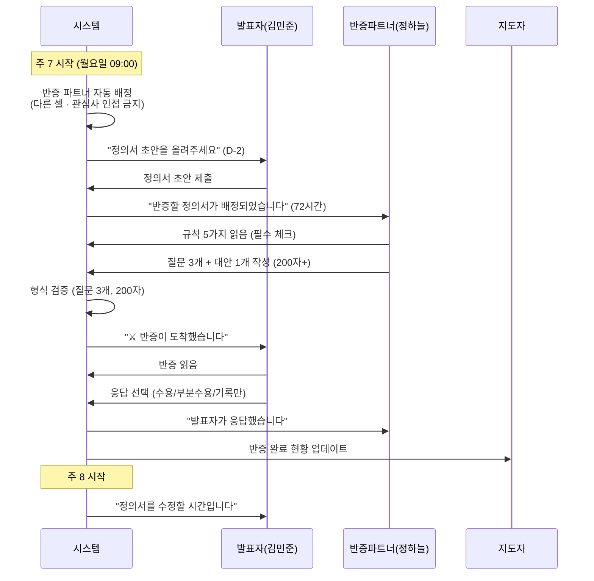
```mermaid
sequenceDiagram
    participant SYS as 시스템
    participant A as 발표자(김민준)
    participant B as 반증파트너(정하늘)
    participant T as 지도자

    Note over SYS: 주 7 시작 (월요일 09:00)
    SYS->>SYS: 반증 파트너 자동 배정<br/>(다른 셀 · 관심사 인접 금지)
    SYS->>A: "정의서 초안을 올려주세요" (D-2)
    A->>SYS: 정의서 초안 제출
    SYS->>B: "반증할 정의서가 배정되었습니다" (72시간)

    B->>SYS: 규칙 5가지 읽음 (필수 체크)
    B->>SYS: 질문 3개 + 대안 1개 작성 (200자+)
    SYS->>SYS: 형식 검증 (질문 3개, 200자)
    SYS->>A: "⚔️ 반증이 도착했습니다"

    A->>SYS: 반증 읽음
    A->>SYS: 응답 선택 (수용/부분수용/기록만)
    SYS->>B: "발표자가 응답했습니다"
    SYS->>T: 반증 완료 현황 업데이트

    Note over SYS: 주 8 시작
    SYS->>A: "정의서를 수정할 시간입니다"
```

#### ⑥ 상태·예외

| 예외 | 처리 |
|---|---|
| 발표자 정의서 미제출 | 반증 파트너에게 "발표자가 아직 제출하지 않았습니다" + 대기 |
| 반증 파트너 미제출 (72h 초과) | 시스템이 대체 파트너 자동 재배정 + 지도자 알림 |
| 200자 미만 | [제출] 비활성 + "200자 이상 작성해 주세요 (현재 143자)" |
| 질문 3개 미만 | [제출] 비활성 + "질문을 3개 이상 작성해 주세요" |
| 인신공격성 표현 감지 | 제출 전 경고 모달 + 규칙 1 재표시 |
| 발표자 무응답 | 주 8 시작 시 자동으로 "기록만" 처리 |

---

### P18 · 문제 정의서 `/definitions/:id`

#### ③ 화면 구성 (작성 모드)

```
┌──────────────────────────────────────────────────────┐
│  📄 문제 정의서 작성                    [자동 저장 중]  │
│  기반 카드: "AI가 교사를 대체할 수 있는가?"              │
├──────────────────────────────────────────────────────┤
│  ① 문제 정의 (한 문장) *                               │
│  [AI 시대의 문제는 교사의 대체가 아니라           ]     │
│  [역할 재정의의 부재다.                        ]     │
│                                                      │
│  ② 문제의 범위                                        │
│  대상: [중·고등학교 공교육 현장          ]             │
│  기간: [2023~현재                     ]             │
│  제외: [사교육·대학은 다루지 않음         ]             │
│                                                      │
│  ③ 숨은 전제 (반증에서 드러난 것) *                     │
│  [기존 정의는 "대체"를 전제했으나, 반증 후    ]        │
│  ["역할 변화"로 전제를 수정함              ]        │
│                                                      │
│  ④ 근거 3건 이상 *                                    │
│  1. [교사 5명 인터뷰: 4명이 "역할이 바뀌었다"] 🔗      │
│  2. [《에듀테크의 미래》 p.87 인용         ] 📖      │
│  3. [교육부 AI 활용 지침 2024           ] 🔗      │
│  [+ 근거 추가]                                        │
│                                                      │
│  ⑤ 반대 입장과 그 논리 *                               │
│  [에듀테크 업계: "AI는 도구일 뿐" — 그러나  ]        │
│  [도구가 역할을 바꾼 사례가 이미 많다      ]        │
│                                                      │
│  ⑥ 받은 반증과 내 응답 (자동 연결)                      │
│  ┌────────────────────────────────────────┐          │
│  │ 정하늘 Q: "대체"라는 전제가 문제 아닌가?   │          │
│  │ 내 응답: 수용 → 정의를 "역할 재정의"로 수정│          │
│  └────────────────────────────────────────┘          │
│                                                      │
│  ⑦ 이 문제가 해결되면 (함의)                           │
│  [교사 양성 과정이 바뀌어야 하고, 평가       ]        │
│  [방식도 재설계되어야 한다.                ]        │
│                                                      │
│  ── 자기 점검 (R-02 루브릭) ──                        │
│  ☑ 한 문장으로 정의했다                                │
│  ☑ 근거가 3건 이상이다                                │
│  ☑ 반대 입장을 썼다                                   │
│  ☑ 반증을 최소 1건 받았다                             │
│  ☐ 1차 데이터(직접 수집)가 있다                        │
│                                        4/5 충족       │
│                                                      │
│      [임시 저장]        [정의서 제출 →]                │
└──────────────────────────────────────────────────────┘
```

#### ④ 유저 시나리오

```
1. 주 8 미션 → [미션 시작하기] → 정의서 작성
2. ① 문제 정의 — 반증 결과가 반영된 새 정의를 씀
   (기존: "대체할 수 있는가" → 신규: "역할 재정의의 부재")
3. ③ 숨은 전제 — 반증에서 드러난 것을 명시
4. ④ 근거 3건 — 인터뷰·책·문서 (링크 첨부 가능)
5. ⑥ 자동 연결 — 주 7에 받은 반증이 자동으로 표시됨
6. 자기 점검 4/5 확인 → "1차 데이터 없음" 인지
7. [정의서 제출] → 크루 투표 → 승급 여부 결정
8. 승급 시 → P19 갤러리에 게시
```

#### ⑤ 승급 판정 단계도

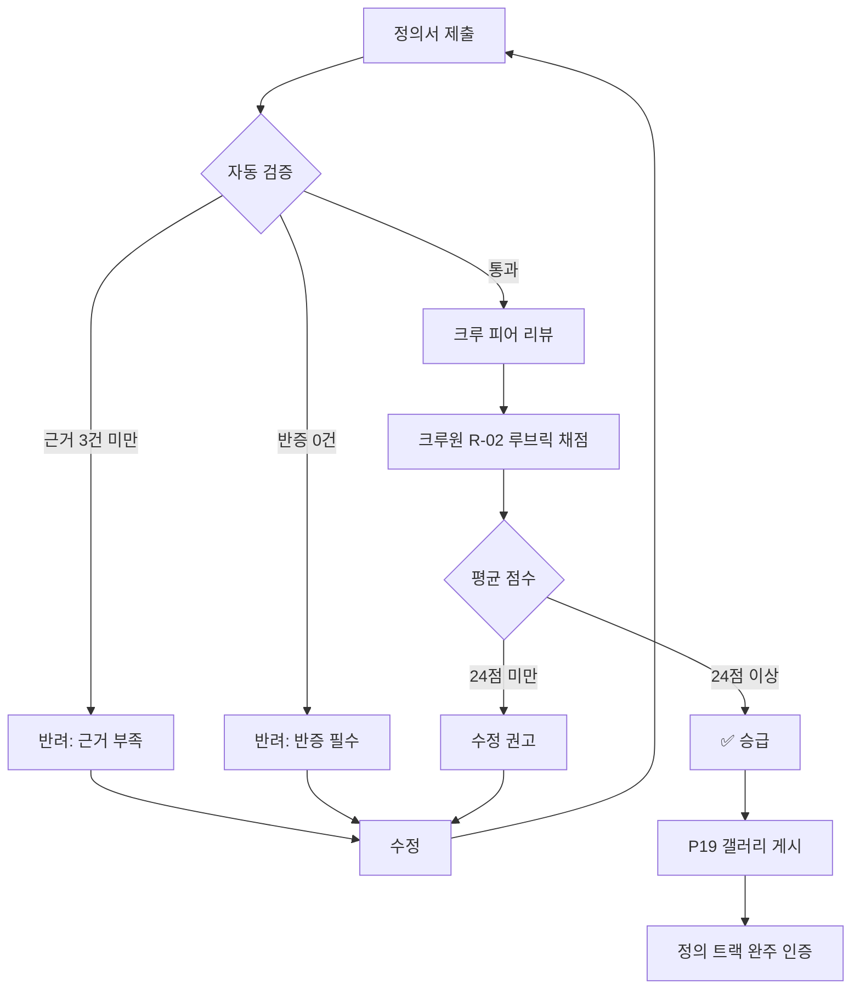
```mermaid
flowchart TD
    SUBMIT[정의서 제출] --> AUTO{자동 검증}
    AUTO -->|근거 3건 미만| REJ1[반려: 근거 부족]
    AUTO -->|반증 0건| REJ2[반려: 반증 필수]
    AUTO -->|통과| PEER[크루 피어 리뷰]

    REJ1 --> EDIT[수정]
    REJ2 --> EDIT
    EDIT --> SUBMIT

    PEER --> VOTE[크루원 R-02 루브릭 채점]
    VOTE --> SCORE{평균 점수}
    SCORE -->|24점 미만| REVISE[수정 권고]
    SCORE -->|24점 이상| APPROVE[✅ 승급]

    REVISE --> EDIT
    APPROVE --> GALLERY[P19 갤러리 게시]
    GALLERY --> BADGE[정의 트랙 완주 인증]
```

> **핵심 규칙 (8단계 F3 실패 조건 반영)**: ⚔️ 반증 **1건 이상** 없이는 정의서 승급 불가. 시스템이 차단한다.

---

### P19 · 정의서 갤러리 (문제 시장) `/groups/:id/gallery`

#### ① 목적
주 9에 **팀이 자연 결성**되게 한다. 강제 배정하지 않는다.

#### ③ 화면 구성

```
┌──────────────────────────────────────────────────────┐
│  🏛 정의서 갤러리 (문제 시장)              주 9 · D-4   │
│  마음에 드는 문제에 "합류" 스티커를 붙여주세요.           │
├──────────────────────────────────────────────────────┤
│  📌 규칙                                              │
│  · 내 정의서에는 붙일 수 없습니다                       │
│  · 최대 2개까지 합류할 수 있습니다                      │
│  · 2명 이상 모이면 팀이 됩니다                          │
│                                                      │
│  내 합류: 1 / 2                                       │
├──────────────────────────────────────────────────────┤
│  ┌──────────────┐ ┌──────────────┐                   │
│  │ 💻 #43       │ │ 🧠 #26       │                   │
│  │ AI 시대의    │ │ 고교생       │                   │
│  │ 문제는 교사의│ │ 번아웃은     │                   │
│  │ 대체가 아니라│ │ 선택 부재에서│                   │
│  │ 역할 재정의의│ │ 온다         │                   │
│  │ 부재다       │ │              │                   │
│  │              │ │              │                   │
│  │ 김민준        │ │ 최민아        │                   │
│  │ R-02: 32/40  │ │ R-02: 35/40  │                   │
│  │              │ │              │                   │
│  │ 합류 👤👤👤 3명│ │ 합류 👤 1명   │                   │
│  │              │ │              │                   │
│  │ [✅ 합류함]   │ │ [+ 합류하기]  │                   │
│  └──────────────┘ └──────────────┘                   │
│                                                      │
│  ┌──────────────┐ ┌──────────────┐                   │
│  │ 📚 #33       │ │ ⚖️ #41       │                   │
│  │ ...          │ │ ...          │                   │
│  │ 합류 👤👤 2명 │ │ 합류 0명 ⚠️   │                   │
│  │ [+ 합류하기]  │ │ [+ 합류하기]  │                   │
│  └──────────────┘ └──────────────┘                   │
├──────────────────────────────────────────────────────┤
│  ⏰ 마감 후 자동 처리                                   │
│  · 2명 이상 → 팀 성립 → 트랙 선택 화면으로               │
│  · 1명 이하 → 다른 팀 합류 또는 개인 트랙 선택           │
└──────────────────────────────────────────────────────┘
```

#### ⑤ 단계도

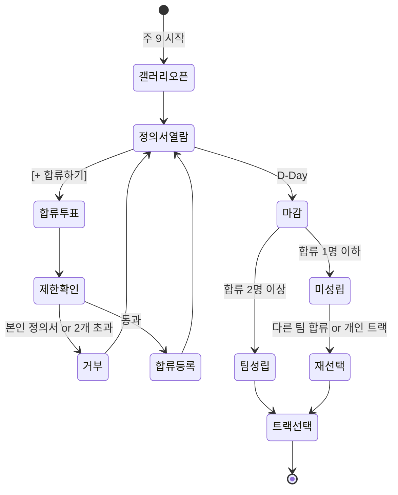
```mermaid
stateDiagram-v2
    [*] --> 갤러리오픈: 주 9 시작
    갤러리오픈 --> 정의서열람
    정의서열람 --> 합류투표: [+ 합류하기]
    합류투표 --> 제한확인
    제한확인 --> 거부: 본인 정의서 or 2개 초과
    제한확인 --> 합류등록: 통과
    거부 --> 정의서열람
    합류등록 --> 정의서열람
    정의서열람 --> 마감: D-Day
    마감 --> 팀성립: 합류 2명 이상
    마감 --> 미성립: 합류 1명 이하
    팀성립 --> 트랙선택
    미성립 --> 재선택: 다른 팀 합류 or 개인 트랙
    재선택 --> 트랙선택
    트랙선택 --> [*]
```

---

### P20 · 프로젝트 `/groups/:id/projects`

#### ③ 화면 구성 — 트랙 선택

```
┌──────────────────────────────────────────────────────┐
│  🚀 프로젝트 트랙 선택                                  │
│  팀: 김민준 · 박서준 · 이수아 · 정하늘 (4명)             │
│  문제: "AI 시대의 문제는 역할 재정의의 부재다"            │
├──────────────────────────────────────────────────────┤
│  ┌────────────────┐  ┌────────────────┐              │
│  │ 📊 조사 트랙    │  │ 🔧 시제품 트랙  │              │
│  │                │  │                │              │
│  │ 인터뷰·설문·문헌│  │ 프로토타입을    │              │
│  │ 으로 문제를 깊게│  │ 만들어 검증한다 │              │
│  │ 파고든다        │  │                │              │
│  │                │  │                │              │
│  │ 산출: 심층보고서│  │ 산출: 데모/링크 │              │
│  │ 난이도: ★★☆    │  │ 난이도: ★★★   │              │
│  │        [선택]  │  │        [선택]  │              │
│  └────────────────┘  └────────────────┘              │
│  ┌────────────────┐  ┌────────────────┐              │
│  │ 📢 캠페인 트랙  │  │ 🔄 재정의 트랙  │              │
│  │                │  │                │              │
│  │ 사람들의 인식을 │  │ 문제 자체를 다시│              │
│  │ 바꾸는 행동     │  │ 정의한다        │              │
│  │                │  │                │              │
│  │ 산출: 캠페인결과│  │ 산출: 갱신 정의서│             │
│  │ 난이도: ★★☆    │  │ 난이도: ★☆☆   │              │
│  │        [선택]  │  │        [선택]  │              │
│  └────────────────┘  └────────────────┘              │
└──────────────────────────────────────────────────────┘
```

#### ③-2 프로젝트 진행 화면 (주 10~11)

```
┌──────────────────────────────────────────────────────┐
│  📊 조사 트랙 · 주 10                                  │
│  "AI 시대 교사 역할 재정의" 팀 (4명)                    │
├──────────────────────────────────────────────────────┤
│  ┌── 이번 주 체크인 ────────────────────────┐         │
│  │ 진척 (이번 주 한 것)                       │         │
│  │ [교사 3명 인터뷰 완료. 녹취 정리 중.     ] │         │
│  │                                          │         │
│  │ 막힌 점                                   │         │
│  │ [인터뷰 대상을 더 구하기 어렵다.         ] │         │
│  │                                          │         │
│  │ 도움 요청                                 │         │
│  │ [다른 학교 선생님 소개받을 수 있을까요?  ] │         │
│  │                                          │         │
│  │ ⭐ 이번 주 실패한 것 1가지 (필수)          │         │
│  │ [설문 링크를 잘못 만들어 응답 12개를    ] │         │
│  │ [날렸다. 백업 안 함.                  ] │         │
│  │                                          │         │
│  │              [체크인 제출]                │         │
│  └──────────────────────────────────────────┘         │
│                                                      │
│  ┌── 팀 진행 상황 ─────────────────────────┐          │
│  │ 주 9  ✅ 조사 계획서                      │          │
│  │ 주 10 🔵 인터뷰·설문 (진행 중)             │          │
│  │ 주 11 ⬜ 자료 정리·발표 준비               │          │
│  │ 주 12 ⬜ 최종 발표                        │          │
│  └─────────────────────────────────────────┘          │
│                                                      │
│  ┌── 팀 파일 ──────────────────────────────┐          │
│  │ 📄 인터뷰_녹취_1.txt        김민준         │          │
│  │ 📊 설문결과.xlsx            이수아         │          │
│  │ 📝 조사계획서.pdf           팀 공동        │          │
│  │                        [+ 파일 업로드]   │          │
│  └─────────────────────────────────────────┘          │
└──────────────────────────────────────────────────────┘
```

#### ④ 유저 시나리오

```
【주 9】팀 결성 직후
1. 갤러리에서 4명 합류 → 팀 자동 생성
2. 트랙 선택 화면 → 팀원 투표 (과반) → "조사 트랙"
3. 팀 협약서 작성 (역할 분담·연락 방법·마감 약속)
4. 조사 계획서 초안 업로드

【주 10~11】매주 체크인
1. 알림 "이번 주 체크인을 작성해 주세요"
2. 진척·막힌 점·도움 요청 작성
3. ⭐ "실패한 것 1가지" — 필수 (성공만 쓰는 문화 차단)
4. 제출 → 그룹 피드에 공유 → 다른 팀이 도움 제안 가능

【주 12】최종 발표
1. 최종 보고서 업로드 (PDF/영상/링크)
2. 갤러리에 공개 → 그룹 전체 열람
3. "시즌 최고 질문상" 투표
4. [전국 공개] 선택 시 → P23 공개 아카이브 게시
```

---

## 12. E그룹 · 기록·공개 (P21~P24)

### P21 · 내 기록 `/my`

#### ③ 화면 구성

```
┌──────────────────────────────────────────────────────┐
│  📒 내 기록                                            │
│  [피드] [커뮤니티] [내 기록] [포트폴리오] [자료실]        │
├──────────────────────────────────────────────────────┤
│  ┌── 내 관심사 ────────────────────────────┐          │
│  │ #43 기술과 인간 · #33 교육과 학습 ·        │          │
│  │ #26 번아웃과 무기력        [다시 진단]     │          │
│  └────────────────────────────────────────┘          │
│                                                      │
│  ┌── 활동 요약 ────────────────────────────┐          │
│  │ 문제 카드 3장 · 받은 반응 24개            │          │
│  │ 남긴 반응 18개 (🤝7 🔍5 ⚔️6)             │          │
│  │ 정의서 1건 · 반증 2회 · 프로젝트 1건       │          │
│  └────────────────────────────────────────┘          │
│                                                      │
│  [문제 카드] [정의서] [반증] [미션 이력]                │
│  ─────────                                           │
│                                                      │
│  ┌────────────────────────────────────────┐          │
│  │ 🔍 AI가 교사를 대체할 수 있는가?           │          │
│  │ 💻 #43 · 12월 3일 · 🤝3 🔍2 ⚔️4          │          │
│  │ → 정의서로 발전됨 ✅                       │          │
│  └────────────────────────────────────────┘          │
│  ┌────────────────────────────────────────┐          │
│  │ 🔍 온라인 수업은 왜 집중이 안 되는가?       │          │
│  │ 📚 #33 · 11월 26일 · 🤝2 🔍1 ⚔️1         │          │
│  └────────────────────────────────────────┘          │
│                                                      │
│  ┌── 성장 그래프 ──────────────────────────┐          │
│  │ (주차별 활동량 라인 차트)                  │          │
│  └────────────────────────────────────────┘          │
└──────────────────────────────────────────────────────┘
```

---

### P22 · 포트폴리오 `/readmate?tab=portfolio`

#### ① 목적
학생부·자소서·상급학교 지원에 **바로 쓸 수 있는 형태**로 산출물을 정리한다.

#### ③ 화면 구성

```
┌──────────────────────────────────────────────────────┐
│  🏆 포트폴리오                        [PDF 내보내기]   │
├──────────────────────────────────────────────────────┤
│  박서준 · 한빛중 2학년                                  │
│                                                      │
│  ┌── 완주 인증 ────────────────────────────┐          │
│  │  🎖 SMILE+P 프로젝트 트랙 완주            │          │
│  │     한빛중 2학년 독서반 · 시즌 1           │          │
│  │     2026.09.01 ~ 2026.11.24 (12주)       │          │
│  │     지도: 이지현 사서교사                  │          │
│  │                        [인증서 보기]      │          │
│  └────────────────────────────────────────┘          │
│                                                      │
│  ┌── 대표 문제 정의서 ──────────────────────┐          │
│  │ "AI 시대의 문제는 교사의 대체가 아니라      │          │
│  │  역할 재정의의 부재다"                     │          │
│  │                                          │          │
│  │ 근거 3건 · 반증 2회 수용 · R-02 32/40      │          │
│  │                          [전문 보기]      │          │
│  └────────────────────────────────────────┘          │
│                                                      │
│  ┌── 프로젝트 ─────────────────────────────┐          │
│  │ 📊 조사 트랙                              │          │
│  │ "AI 시대 교사 역할 재정의" (팀 4명)         │          │
│  │ 교사 5명 인터뷰 · 학생 87명 설문            │          │
│  │ 산출: 심층 보고서 24p                      │          │
│  │                    [보고서 보기]          │          │
│  └────────────────────────────────────────┘          │
│                                                      │
│  ┌── 학생부 기재용 요약 (복사해서 쓰세요) ────┐          │
│  │ "독서반 활동에서 《에듀테크의 미래》를 읽고  │          │
│  │  'AI가 교사를 대체할 수 있는가'라는 문제를  │          │
│  │  제기함. 동료의 반증을 통해 '대체'라는 전제 │          │
│  │  의 한계를 인식하고 '역할 재정의의 부재'로  │          │
│  │  문제를 재정의함. 교사 5명 인터뷰와 학생    │          │
│  │  87명 설문을 직접 수행하여 근거를 수집하고  │          │
│  │  24쪽 분량의 심층 보고서를 작성함."         │          │
│  │                            [📋 복사]      │          │
│  └────────────────────────────────────────┘          │
│                                                      │
│  ┌── 역량 태그 ────────────────────────────┐          │
│  │ #문제발견 #비판적사고 #전제분석 #논증       │          │
│  │ #반증수용 #데이터리터러시 #협업 #공개발표   │          │
│  └────────────────────────────────────────┘          │
└──────────────────────────────────────────────────────┘
```

> **차별 포인트**: "학생부 기재용 요약"을 **자동 생성**한다. 교사가 그대로 복사해 쓸 수 있다.

---

### P23 · 공개 문제 아카이브 `/explore`

#### ① 목적
학교를 넘어 **전국 학생의 질문**을 연결한다. 비로그인도 열람 가능 → 유입 채널.

#### ③ 화면 구성

```
┌──────────────────────────────────────────────────────┐
│  🌐 전국 문제 아카이브                                  │
│  전국의 학생들이 던진 12,391개의 질문                    │
├──────────────────────────────────────────────────────┤
│  [관심사 ▼] [지역 ▼] [학교급 ▼] [시즌 ▼]  [인기순 ▼]   │
│  🔍 [질문 검색                                    ]   │
├──────────────────────────────────────────────────────┤
│  ┌── 이번 시즌 TOP 질문 ─────────────────────┐        │
│  │ 🥇 "AI가 교사를 대체할 수 있는가?"           │        │
│  │    서울 한빛중 · 🤝142 ⚔️98                 │        │
│  │ 🥈 "공정한 입시는 존재하는가?"               │        │
│  │    부산 해운대고 · 🤝118 ⚔️87               │        │
│  │ 🥉 "기후변화에 학생이 할 수 있는 것은?"       │        │
│  │    대전 둔산중 · 🤝96 ⚔️52                  │        │
│  └───────────────────────────────────────────┘        │
├──────────────────────────────────────────────────────┤
│  ┌──────────┐ ┌──────────┐ ┌──────────┐              │
│  │💻 #43    │ │📚 #33    │ │🧠 #26    │              │
│  │AI가 교사를│ │학교는 왜 │ │고교생    │              │
│  │대체할 수 │ │행복을    │ │번아웃은  │              │
│  │있는가?   │ │가르치지  │ │선택 부재 │              │
│  │          │ │않는가?   │ │에서 온다 │              │
│  │📖에듀테크│ │📖행복의 │ │📖쉬어도 │              │
│  │  의 미래 │ │  기원   │ │  피곤한 │              │
│  │          │ │          │ │          │              │
│  │🤝142⚔️98 │ │🤝89 ⚔️64│ │🤝96 ⚔️71│              │
│  │서울·중2  │ │부산·고1  │ │대전·고2  │              │
│  │📄정의서✅│ │          │ │📊프로젝트│              │
│  └──────────┘ └──────────┘ └──────────┘              │
│                                                      │
│              [ 더 보기 ]                              │
├──────────────────────────────────────────────────────┤
│  ┌── 남은 질문 인계 ───────────────────────┐          │
│  │ 이전 시즌이 다 풀지 못한 질문들입니다.       │          │
│  │ 다음 시즌에 이어받을 수 있어요.             │          │
│  │                                          │          │
│  │ · "대안학교 졸업생 진로 추적이 왜 없나?"    │          │
│  │   서초 시즌3 → [이어받기]                  │          │
│  │ · "청소년 정치 참여의 실질적 통로는?"       │          │
│  │   분당 시즌2 → [이어받기]                  │          │
│  └─────────────────────────────────────────┘          │
├──────────────────────────────────────────────────────┤
│  💡 나도 질문을 던지고 싶다면                           │
│              [관심사 진단 시작 →]                      │
└──────────────────────────────────────────────────────┘
```

#### ④ 유저 시나리오

```
【비로그인 방문자 유입】
1. 검색으로 "AI가 교사를 대체" 검색 → 아카이브 페이지 도달 (SEO)
2. 카드 상세 열람 (전문 공개)
3. "🤝 나도 이 문제를 느낀다" 클릭 시도
   → "로그인하면 반응을 남길 수 있어요"
4. 로그인 → 반응 남김 → 진단 유도

【교차 반증 신청】
1. 지도자가 다른 학교의 같은 관심사 크루 발견
2. [교차 반증 신청] → 상대 지도자에게 알림
3. 승인 → 주 7에 양쪽 크루 학생이 서로 반증 파트너로 배정
```

---

### P24 · 시즌 리포트 `/groups/:id/report`

#### ① 목적
지도자가 **학교에 제출할 성과 보고서**를 클릭 한 번으로 얻는다.

#### ③ 화면 구성

```
┌──────────────────────────────────────────────────────┐
│  📊 시즌 리포트           [📄 PDF] [📊 엑셀] [🔗 공유] │
│  한빛중 2학년 독서반 · 시즌 1 · 2026.09.01~11.24       │
├──────────────────────────────────────────────────────┤
│  ┌── 핵심 지표 ───────────────────────────┐           │
│  │ 참여 학생        24명                    │           │
│  │ 완주 (8주+)      20명 (83%)              │           │
│  │ 프로젝트 완주    12명 (50%)               │           │
│  │ 문제 카드        52장                    │           │
│  │ 문제 정의서      14건                    │           │
│  │ 반증 교환        38회                    │           │
│  │ 반증 수용        12건 (32%)               │           │
│  │ 프로젝트         5건                     │           │
│  │ 총 반응          487개 (🤝201 🔍142 ⚔️144)│          │
│  └────────────────────────────────────────┘           │
│                                                      │
│  ┌── 주차별 참여 추이 ─────────────────────┐          │
│  │ (라인 차트: 주 1~12 제출률)               │          │
│  │ 100% ●─●─●─●─●                          │          │
│  │  75%          ●─●─●                     │          │
│  │  50%                ●─●─●─●             │          │
│  │       1 2 3 4 5 6 7 8 9 10 11 12        │          │
│  └────────────────────────────────────────┘          │
│                                                      │
│  ┌── 크루별 성과 ─────────────────────────┐           │
│  │ 크루        카드  정의서  프로젝트  완주율 │           │
│  │ #43 기술     12     4       2      100% │           │
│  │ #33 교육     15     5       1       71% │           │
│  │ #26 번아웃   11     2       1       80% │           │
│  │ #41 정의     14     3       1       83% │           │
│  └────────────────────────────────────────┘           │
│                                                      │
│  ┌── 시즌 베스트 ─────────────────────────┐           │
│  │ 🏆 최고 질문상                            │           │
│  │    "AI가 교사를 대체할 수 있는가?" 김민준   │           │
│  │ 🏆 최고 반증상                            │           │
│  │    정하늘 (가장 날카로운 반박 3회)          │           │
│  │ 🏆 최고 전환상                            │           │
│  │    박서준 (반증 수용 후 정의서 대폭 개선)    │           │
│  └────────────────────────────────────────┘           │
│                                                      │
│  ┌── 학교 보고용 서술 (자동 생성) ───────────┐          │
│  │ "본교 2학년 독서반은 2026년 9월부터 11월까지│          │
│  │  12주간 SMILE+P 독서 프로그램을 운영하였다. │          │
│  │  참여 학생 24명 중 20명(83%)이 8주 과정을   │          │
│  │  완주하였으며, 문제 카드 52장과 문제 정의서 │          │
│  │  14건을 산출하였다. 특히 학생 간 반증 교환  │          │
│  │  38회 중 12건(32%)이 실제 정의서 수정으로   │          │
│  │  이어져, 비판적 사고와 반증 수용 역량의     │          │
│  │  성장이 관찰되었다. 12명은 프로젝트 트랙에  │          │
│  │  진입하여 5건의 프로젝트를 완성하였다."     │          │
│  │                              [📋 복사]    │          │
│  └────────────────────────────────────────┘           │
│                                                      │
│  ┌── 다음 시즌 씨앗 (남은 질문) ────────────┐          │
│  │ · "학교 급식 잔반은 왜 줄지 않는가?"        │          │
│  │ · "학생 자치는 왜 형식적인가?"              │          │
│  │              [전국 아카이브에 인계]         │          │
│  └────────────────────────────────────────┘           │
│                                                      │
│              [다음 시즌 시작하기 →]                    │
└──────────────────────────────────────────────────────┘
```

---

# PART V — 상태 설계

## 13. 상태·엣지케이스·빈 화면

### 13.1 빈 상태(Empty State) 설계

| 화면 | 빈 상태 조건 | 메시지 | CTA |
|---|---|---|---|
| P08 독서 스페이스 | 그룹 0개 | "아직 참여한 그룹이 없어요" | [초대 코드 입력] / [그룹 만들기] |
| P11 그룹 홈 | 멤버 0명 | "학생을 초대해 주세요" | 초대 코드 크게 + [카톡 공유] |
| P11 그룹 홈 | 멤버 1~3명 | "4명이 모이면 크루가 만들어져요 (현재 2명)" | [초대 코드 다시 공유] |
| P12 피드 | 활동 0건 | "첫 문제 카드를 올려보세요" | [문제 카드 작성] |
| P14 크루 | 크루 0개 | "관심사 진단을 받으면 크루가 만들어져요" | [진단 시작] |
| P16 카드 상세 | 반응 0개 | "아직 반응이 없어요" | [크루에 알리기] |
| P19 갤러리 | 정의서 0건 | "주 8이 지나면 정의서가 모입니다" | — |
| P21 내 기록 | 활동 0건 | "활동을 시작하면 여기에 쌓입니다" | [로드맵 보기] |
| P23 공개 아카이브 | 검색 결과 0건 | "검색 결과가 없어요. 다른 키워드를 써보세요" | 인기 질문 추천 |

### 13.2 오류 처리

| 오류 | 처리 방식 |
|---|---|
| 네트워크 끊김 | 상단 배너 "오프라인입니다. 작성 내용은 저장됩니다" + localStorage |
| 저장 실패 | 토스트 + [다시 시도] + 로컬 백업 유지 |
| 권한 없음 | "이 페이지에 접근할 권한이 없습니다" + [내 그룹으로] |
| 404 | "페이지를 찾을 수 없어요" + [홈으로] |
| 세션 만료 | 로그인 모달 (현재 위치 유지, 로그인 후 복귀) |

### 13.3 알림 설계

| 시점 | 대상 | 내용 | 채널 |
|---|---|---|---|
| 월 09:00 | 전체 멤버 | "이번 주 미션이 열렸어요" | 푸시 + 카톡 |
| 수 18:00 | 미제출자 | "미션 마감 D-4" | 푸시 |
| 금 18:00 | 미제출자 | "미션 마감 D-2" | 푸시 + 카톡 |
| 금 18:00 | 지도자 | "미제출 6명" | 이메일 + 푸시 |
| 즉시 | 카드 작성자 | "⚔️ 반론이 달렸어요" | 푸시 |
| 즉시 | 반증 파트너 | "반증할 정의서가 배정되었어요" | 푸시 + 카톡 |
| 즉시 | 발표자 | "반증이 도착했어요" | 푸시 |
| 주 12 종료 | 지도자 | "시즌 리포트가 준비되었어요" | 이메일 |

---

# PART VI — 웹→앱 전환

## 14. 웹 우선 · 앱 확장 전략

### 14.1 단계별 전략


```mermaid
gantt
    title 웹 우선 → 앱 확장 로드맵
    dateFormat  X
    axisFormat  %s개월

    section Phase 1 웹 MVP
    반응형 웹 개발              :a1, 0, 2
    학교 2곳 파일럿             :a2, 2, 1

    section Phase 2 웹 확장
    프로젝트·갤러리·리포트       :b1, 3, 2
    학교 10곳 확대              :b2, 5, 1

    section Phase 3 PWA
    PWA 전환 (설치·푸시·오프라인) :c1, 6, 1

    section Phase 4 네이티브 앱
    Expo 앱 개발                :d1, 7, 2
    스토어 출시                 :d2, 9, 1
```

### 14.2 왜 웹 먼저인가

| 이유 | 설명 |
|---|---|
| **학교 환경** | 학교 PC·크롬북에서 즉시 사용. 앱 설치 불가한 환경 다수 |
| **초대 링크** | 카톡 링크 → 바로 열림. 앱은 설치 마찰 |
| **SEO** | 공개 아카이브가 검색에 노출 → 유입 채널 |
| **개발 속도** | 하나의 코드베이스로 데스크톱·모바일 모두 대응 |
| **심사 없음** | 스토어 심사 대기 없이 즉시 배포·수정 |

### 14.3 앱이 추가로 주는 것

| 기능 | 웹 | 앱 |
|---|:-:|:-:|
| 전체 기능 사용 | ✅ | ✅ |
| 푸시 알림 | △ (PWA) | ✅ |
| 오프라인 작성 | △ | ✅ |
| 사진 촬영 (책 표지·독서 노트) | △ | ✅ |
| 홈 화면 아이콘 | △ (PWA) | ✅ |
| 위젯 (이번 주 미션) | ❌ | ✅ |

### 14.4 웹→앱 코드 재사용 설계

```
공유 계층 (재사용 가능)
├── API 클라이언트         ← 100% 재사용
├── 타입 정의 (TypeScript) ← 100% 재사용
├── 비즈니스 로직          ← 100% 재사용
├── 상태 관리             ← 100% 재사용
└── 디자인 토큰 (색·간격)  ← 100% 재사용

플랫폼별 계층
├── 웹: Next.js + React    ← HTML/CSS
└── 앱: Expo + RN          ← RN 컴포넌트

→ 모바일 웹의 하단 탭 구조를 앱과 동일하게 설계하여
  UX 학습 비용 제로.
```

---

## 15. 개발 순서와 마일스톤

### 15.1 Phase 1 — 웹 MVP (8주)

| 주 | 작업 | 화면 |
|:-:|---|---|
| 1 | 프로젝트 셋업 · 디자인 시스템 · GNB | C01, C02 |
| 2 | 소셜 로그인 · 온보딩 분기 | P03 |
| 3 | **그룹 생성 + 초대 코드 + 참여** ★ | P09, P10 |
| 4 | 관심사 진단 · 결과 · 크루 배정 | P05, P06 |
| 5 | **문제 카드 작성·상세·반응** ★ | P15, P16 |
| 6 | 그룹 홈 대시보드 (학생·지도자 뷰) | P11 |
| 7 | 로드맵 · 미션 시스템 · 피드 | P13, P12 |
| 8 | 랜딩 · 가이드 · 테스트 · 파일럿 배포 | P01, P04 |

**Phase 1 완료 판정 기준**
> 독서 지도자 1명이 그룹을 만들고, 학생 10명이 참여해서, 3주차까지 문제 카드를 쓰고 반응을 주고받을 수 있다.

### 15.2 Phase 2 — 웹 확장 (8주)

| 주 | 작업 | 화면 |
|:-:|---|---|
| 9~10 | **반증 세션** ★ | P17 |
| 11~12 | 정의서 · 승급 판정 | P18 |
| 13 | 갤러리 (문제 시장) | P19 |
| 14~15 | 프로젝트 (트랙·체크인·산출물) | P20 |
| 16 | 내 기록 · 포트폴리오 · 리포트 | P21, P22, P24 |

### 15.3 Phase 3 — 공개·PWA (4주)

| 주 | 작업 |
|:-:|---|
| 17 | 공개 아카이브 (P23) + SEO |
| 18 | 교차 반증 (그룹 간) |
| 19 | PWA 전환 (설치·푸시·오프라인 캐시) |
| 20 | 성능 최적화 · 접근성 점검 |

### 15.4 Phase 4 — 네이티브 앱 (8주)

| 주 | 작업 |
|:-:|---|
| 21~24 | Expo 앱 — 핵심 화면 이식 (하단 탭 5개) |
| 25~26 | 푸시 알림 · 카메라 · 오프라인 |
| 27~28 | 스토어 심사 · 출시 |

### 15.5 기술 스택

| 영역 | 선택 | 비고 |
|---|---|---|
| 웹 | **Next.js 15 (App Router)** | SSR로 SEO 확보 (공개 아카이브) |
| 스타일 | Tailwind CSS | 빠른 반응형 |
| 앱 | **Expo (React Native)** | 기존 프로젝트 스택과 동일 |
| 백엔드 | Next.js API Routes + **Supabase** | MVP 속도 우선 |
| DB | PostgreSQL (Supabase) | 실시간 구독으로 피드 갱신 |
| 인증 | 카카오 · 구글 OAuth | 한국 사용자 기본 |
| 스토리지 | Supabase Storage | 프로젝트 파일·이미지 |
| 알림 | FCM + 카카오 알림톡 | — |
| 배포 | Vercel (웹) · EAS (앱) | — |

---

# 마무리 — 이 문서 한 장 요약

```
┌────────────────────────────────────────────────────────────┐
│        10단계 — 리딩클루 웹 화면설계서 · 페이지별 시나리오       │
├────────────────────────────────────────────────────────────┤
│                                                            │
│  aicareerpath.co.kr의 검증된 구조를 독서에 이식한다.           │
│  웹으로 먼저 출시하고, 앱으로 확장한다.                        │
│                                                            │
│  ┌──────────┐  ┌──────────┐  ┌──────────┐                  │
│  │ 진단     │→│ 그룹      │→│ 실행      │                  │
│  │ 관심사50 │  │ 초대코드  │  │ 카드·반증 │                  │
│  │ 크루배정 │  │ 12주로드맵│  │ 정의서·PJT│                  │
│  └──────────┘  └──────────┘  └──────────┘                  │
│                                                            │
│  화면: 24개 (P01~P24)                                       │
│  IA: aicareerpath 5메뉴 + 5탭 구조 이식                      │
│  핵심 3화면: P09 그룹생성 · P15 카드작성 · P17 반증            │
│  개발: 웹 MVP 8주 → 확장 8주 → PWA 4주 → 앱 8주              │
│                                                            │
│  검증 기준 (Phase 1):                                       │
│  "지도자 1명이 그룹을 만들고, 학생 10명이 참여해서,            │
│   3주차까지 문제 카드를 쓰고 반응을 주고받는다."               │
│                                                            │
│  기억할 것 하나:                                             │
│  "🔍과 ⚔️는 코멘트 없이 누를 수 없다.                        │
│   좋아요만 누르는 문화를 구조로 차단한다."                     │
│                                                            │
└────────────────────────────────────────────────────────────┘
```

---

*이 문서는 [9단계-리딩클루_독서지도자_온라인실행_설계서.md](./9단계-리딩클루_독서지도자_온라인실행_설계서.md)의 화면 구현 명세다.*
*9단계가 "무엇을 만들 것인가"라면, 10단계는 "어떤 화면으로 만들 것인가"다.*
*이 문서를 들고 바로 개발에 착수할 수 있다.*
