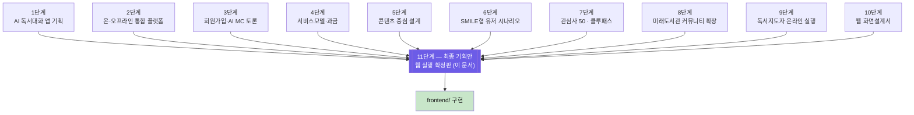
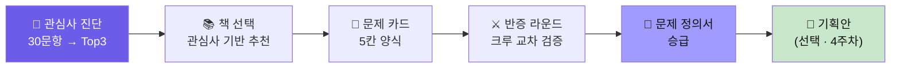
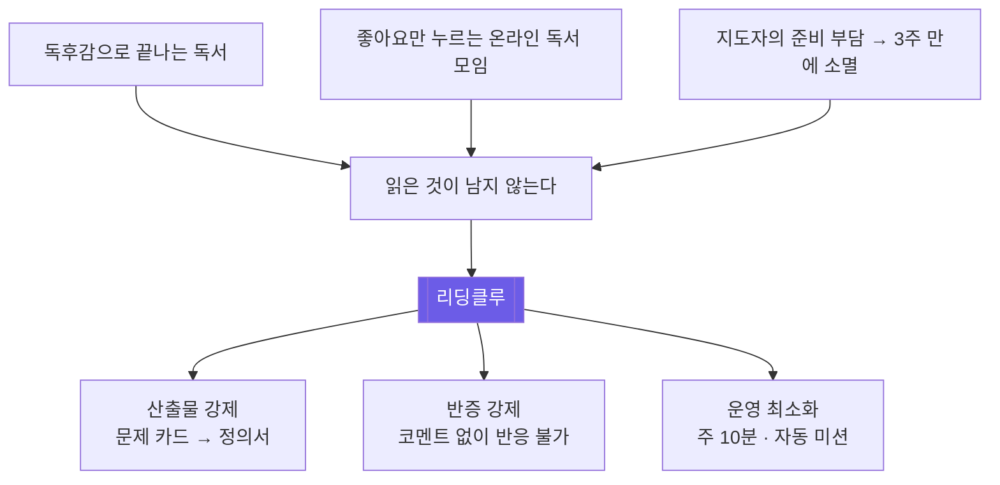
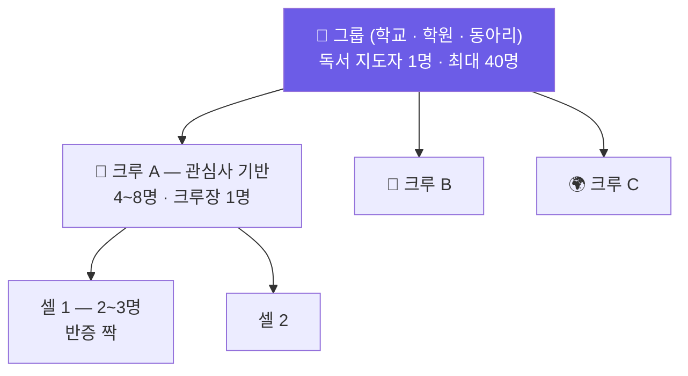
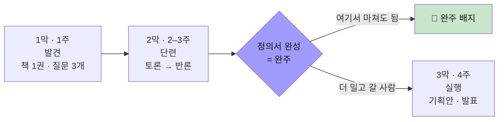
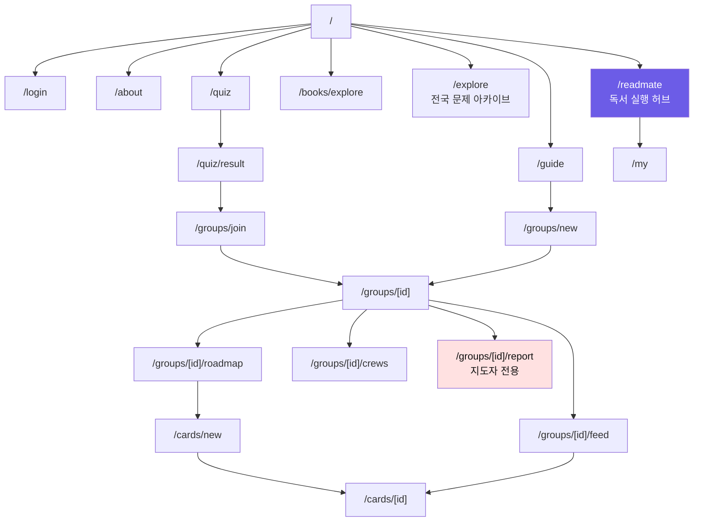
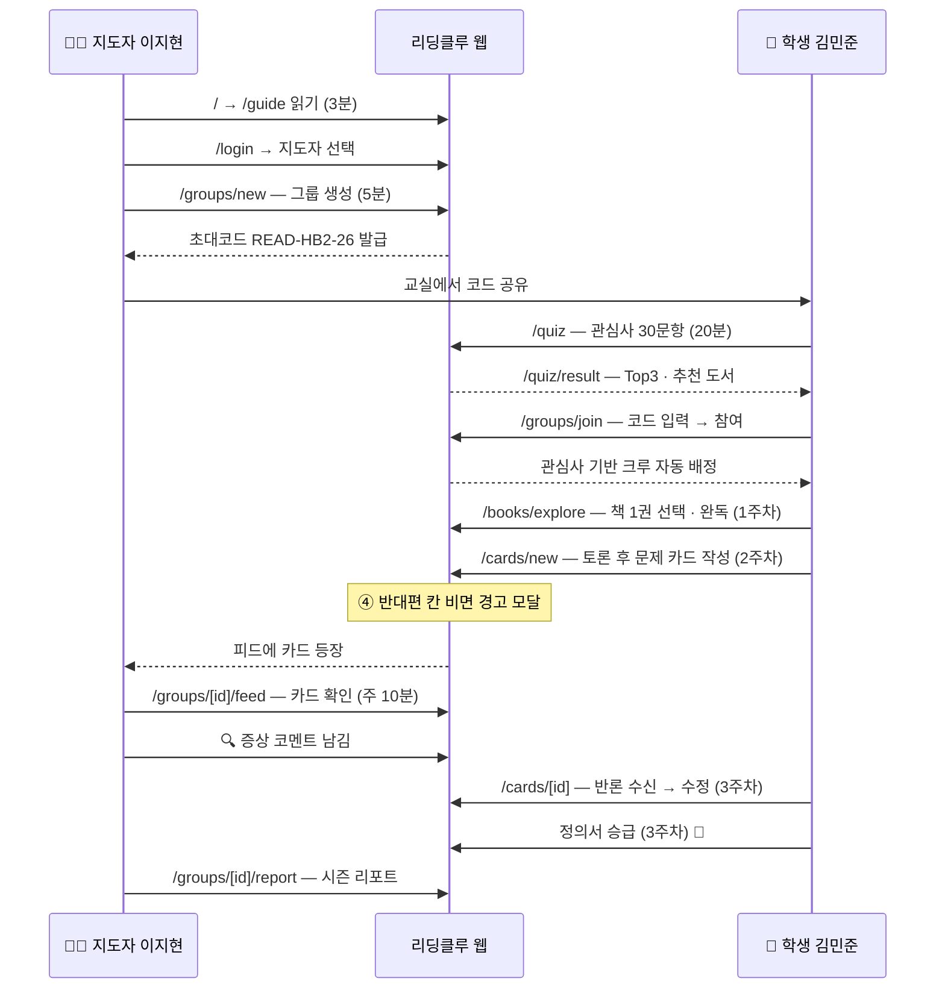
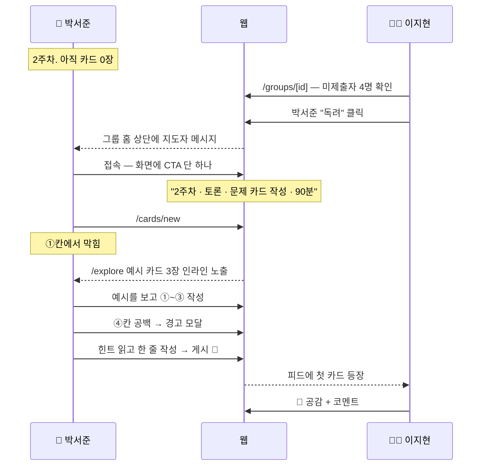
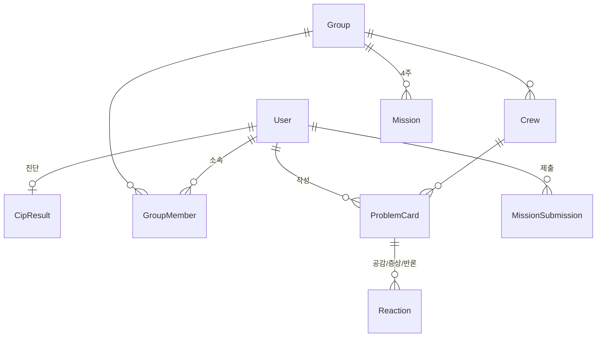
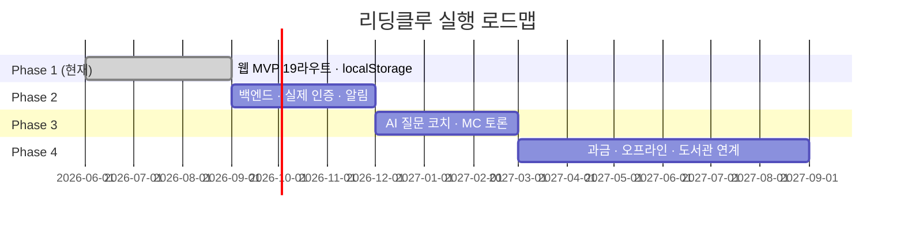

# 11단계 — 리딩클루 : 최종 기획안 · 유저 시나리오 (웹 실행 확정판)

> **이 문서 하나로 프로젝트가 확정된다.**
> 1~10단계에서 흩어져 있던 철학 · 서비스 모델 · 화면 설계를
> **지금 이 웹(`frontend/`, Next.js)에서 실제로 돌아가는 범위**로 잘라내어 확정한 최종 기획안입니다.

| 항목 | 값 |
|---|---|
| 문서 버전 | v1.1 (4주 집중판) |
| 확정일 | 2026-08-21 · 4주 개편 반영 |
| 실행 코드 | `frontend/` — Next.js 16 · React 19 · Tailwind 4 |
| 실행 범위 | **Phase 1 웹 MVP · 19개 라우트 · 백엔드 없음(localStorage)** |
| 빌드 상태 | ✅ `npm run build` 통과 (19 라우트) |
| 상위 문서 | 1~10단계 기획서 (아래 계보 참조) |

---

## 문서 계보 — 무엇을 확정했는가



**확정 원칙 3가지**

1. **문서가 아니라 화면이 기준이다.** 이 문서의 모든 시나리오는 실제 라우트(`/quiz`, `/cards/new` …)에 1:1로 매핑된다.
2. **Phase 1에 없는 것은 "없다"고 적는다.** AI MC · 결제 · 오프라인 운영은 §11 로드맵으로 유보한다.
3. **한 사람의 4주가 완결된다.** 랜딩 → 진단 → 그룹 → 책 1권 → 토론 → 카드 → 반론 → 정의서 → (선택) 기획안까지 끊기는 지점이 없어야 한다.

---

## 목차

- **PART 0 — 최종 확정 요약** (§1 한 장 요약 · **최종 목표** · §2 범위 확정)
- **PART I — 서비스 정의** (§3 문제와 해답 · §4 핵심 규칙 3)
- **PART II — 구조** (§5 3계층 · §6 SMILE+P 4주 · §7 정보구조)
- **PART III — 유저 시나리오** (§8 페르소나 · §9 전체 여정 · §10 화면별 시나리오)
- **PART IV — 실행** (§11 데이터·기술 · §12 로드맵 · §13 KPI · §14 체크리스트)

---

# PART 0 — 최종 확정 요약

## 1. 한 장 요약

### 1.1 30초 피치

> **리딩클루는 책 1권으로 4주 만에 "읽은 것"을 "내 기획안"으로 바꾸는 온라인 독서 실행 플랫폼입니다.**
> 책 1권을 읽고 → 피 터지게 토론해 **문제 카드**를 만들고 → **반론**을 견뎌 **문제 정의서**로,
> 마지막 주에는 **기획안**까지 씁니다.
> 독서 지도자는 **주 10분**, 시즌 전체 **40분**으로 운영합니다.

### 1.2 전체 구조



### 1.3 최종 목표 — 이 프로젝트가 도달해야 하는 한 지점

> **4주 뒤, 학생은 내 이름이 붙은 「프로젝트 기획안」 1부를 손에 쥔다.**
> 유저 시나리오는 그 기획안의 한 챕터(③번)다.

| 주차 | 산출물 | 다음 단계의 재료 |
|---|---|---|
| 1주 | 📚 책 1권 · 질문 3개 | → 토론 재료 |
| 2주 | 🧩 문제 카드 | → 반론 대상 |
| 3주 | 📄 **문제 정의서** (완주선) | → 기획안 ①번 |
| 4주 | 🧭 유저 시나리오 · 직접 모은 자료 | → 기획안 ②③번 |
| 4주 | 🚀 **프로젝트 기획안** | → 팀원 모집 · 출품 · 포트폴리오 |

**독서 이후에 실제로 일어나는 일** — 기획안은 끝이 아니라 사람이 붙는 시작점이다.

1. 🤝 갤러리 발표에서 기획안을 본 크루원이 합류 → 실제 제작
2. 🏆 1차 데이터 + 실행 계획이 있으므로 대회·전시·공모전 출품 서류로 직행
3. 🎓 "책을 읽었다"가 아니라 "이 문제를 정의하고 여기까지 검증했다"는 포트폴리오
4. 🌱 공개 기획안이 문제 아카이브에 남아 다음 시즌 후배의 씨앗 질문이 됨

### 1.4 세 주체가 얻는 것

| 주체 | 4주 뒤에 손에 남는 것 |
|---|---|
| 🧑 **학생** | 내 이름이 붙은 **문제 정의서 1장** + 반증을 견딘 근거 + (선택) 프로젝트 산출물 |
| 👩‍🏫 **독서 지도자** | 학생별 사고 성장 **시즌 리포트** + 재사용 가능한 4주 커리큘럼 |
| 🌐 **커뮤니티** | 전국 학생의 **문제 아카이브** — 다음 시즌의 씨앗 질문 |

---

## 2. 범위 확정 — 무엇을 만들고 무엇을 미루는가

### 2.1 Phase 1 웹 MVP에 **있다** (구현 완료)

| 영역 | 기능 | 라우트 |
|---|---|---|
| 진입 | 랜딩 · 로그인(데모 계정) · 지도자 가이드 · 소개 | `/` `/login` `/guide` `/about` |
| 진단 | 관심사 30문항 · Top3 결과 · 크루 배정 제안 | `/quiz` `/quiz/result` |
| 탐색 | 관심사 기반 책 20권 · 전국 문제 아카이브 | `/books/explore` `/explore` |
| 그룹 | 생성 · 초대코드 참여 · 그룹 홈(역할 분기) | `/groups/new` `/groups/join` `/groups/[id]` |
| 운영 | 피드 · 4주 로드맵 · 크루/셀 · 시즌 리포트 | `/groups/[id]/{feed,roadmap,crews,report}` |
| 실행 | 문제 카드 작성/상세 · 반응 3종 · 내 기록 | `/cards/new` `/cards/[id]` `/my` |
| 통합 | 독서 실행 허브(피드/커뮤니티/내 기록/포트폴리오/자료실) | `/readmate` |

**총 19개 라우트.** 이 문서의 §10 화면별 시나리오는 이 19개를 전부 다룬다.

### 2.2 Phase 1에 **없다** (의도적 유보)

| 유보 항목 | 이유 | 언제 |
|---|---|---|
| 실제 회원가입 · 소셜 로그인 | 백엔드 없음. 데모 계정으로 흐름 검증 | Phase 2 |
| AI MC 토론 진행 (3단계 문서) | 대화 품질 검증 전. 규칙 UI가 먼저 | Phase 3 |
| 결제 · 구독 (4단계 문서) | 무료 파일럿으로 리텐션 먼저 확인 | Phase 4 |
| 오프라인 모임 · 도서관 연계 (8단계) | 온라인에서 4주 완주가 증명된 뒤 | Phase 4 |
| 푸시 알림 · 이메일 독려 | 지도자 수동 독려 UI로 대체 | Phase 2 |

> ⚠️ **원칙**: 유보 항목은 화면에 "준비 중"으로 노출하지 않는다. 아예 보이지 않게 한다.

---

# PART I — 서비스 정의

## 3. 문제와 해답

### 3.1 우리가 푸는 문제



### 3.2 세 문장 정의

1. 리딩클루는 **독서 감상 서비스가 아니라 문제 발견 훈련 도구**다.
2. 리딩클루의 단위는 책이 아니라 **문제 카드**다.
3. 리딩클루의 성공 지표는 독서량이 아니라 **반증을 견딘 정의서 수**다.

---

## 4. 절대 어기지 않는 3가지 규칙

이 3가지는 **UI 구조로 강제**되어 있으며, 어떤 개선 요구에도 유지한다.

### 규칙 ① 코멘트 없는 반응은 없다

| 반응 | 코멘트 | 구현 |
|---|---|---|
| 🤝 공감 | 선택 | `components/ReactionBar.tsx` |
| 🔍 증상 | **20자 이상 필수** | 버튼 비활성 |
| ⚔️ 반론 | **20자 이상 필수** | 버튼 비활성 |

> 이유: "좋아요 문화"는 사고를 멈추게 한다. 누르려면 생각해야 한다.

### 규칙 ② 문제 카드 ④번 칸이 가장 중요하다

문제 카드 5칸 중 **④ "반대편에서 보면"**이 비어 있으면 게시 전 경고 모달을 띄운다.

> **"반대 입장을 쓸 수 없다면, 그건 아직 문제가 아니라 확신입니다."**

### 규칙 ③ 3주차 정의서까지만 해도 완주다

기획안(4주차)은 **선택**이다. 로드맵 2막과 3막 사이에 분기점을 명시한다.
"기획안을 못 쓰면 실패"라는 압박이 3주 완주자마저 잃게 만든다.

---

# PART II — 구조

## 5. 3계층 조직 구조



| 계층 | 크기 | 역할 | 배정 |
|---|---|---|---|
| **그룹** | ~40명 | 시즌 단위 운영 · 초대코드 발급 | 지도자가 생성 |
| **크루** | 4~8명 | 같은 관심사 · 피드 공유 | 진단 자동 / 지도자 수동 |
| **셀** | 2~3명 | 반증 짝 · 교차 코멘트 | 크루 내 자동 분할 |

---

## 6. SMILE + P — 4주 로드맵 (확정)

> **책 1권 · 4주.** 길게 끄는 대신 한 권을 깊게 판다.
> 읽고 → 피 터지게 토론하고 → 반론으로 단단히 하고 → 기획안으로 옮긴다.

### 6.1 단계 정의

| 코드 | 이름 | 뜻 |
|---|---|---|
| **S** | Spark | 관심사에 불을 붙인다 |
| **M** | Map | 책의 구조를 지도로 그린다 |
| **I** | Inquiry | 내 문제를 세운다 |
| **L** | Link | 다른 책·사람과 잇는다 |
| **E** | Evidence | 반론을 견딘 근거로 만든다 |
| **P** | Project | 기획안으로 옮긴다 |

### 6.2 4주 미션표 — `frontend/data/roadmap.json` 과 일치

| 주 | 막 | SMILE | 미션 | 액션 | 시간 | AI는 여기까지 |
|---|---|---|---|---|---|---|
| **1** | 1막 | S·M | **책 1권 완독 · 질문 3개 뽑기** | book | 150분 | 핵심 주장 요약 → 내가 읽은 것과 대조 (질문은 직접) |
| **2** | 2막 | I·L | **토론 라운드 · 문제 카드 작성** | card | 90분 | 반대 입장 3가지 요청 → ④번 칸 재료로 (내 말로 다시 씀) |
| **3** | 2막 | E | **반론 라운드 · 문제 정의서 완성** | definition | 90분 | 가장 약한 고리 점검 (반론은 사람이 먼저) |
| — | — | — | ⬇ **여기까지 완주 인정 · 4주차는 선택** | — | — | — |
| **4** | 3막 | P | **기획안 작성 · 발표** | present | 120분 | 초안의 빠진 항목 점검 (자료·시나리오는 직접) |

**총 학생 투입 시간: 약 7.5시간 / 4주 (주 평균 1시간 50분)**
**지도자 투입 시간: 준비 5분 + 주 10분 = 시즌 총 40분**

### 6.3 3막 구조



### 6.4 왜 4주인가

| 이유 | 내용 |
|---|---|
| **책 1권이면 충분** | 여러 권을 얕게 읽는 것보다 한 권을 놓고 붙는 편이 질문이 깊다 |
| **학교 일정에 맞는다** | 한 달 단위 · 시험 사이 · 방학 특강에 그대로 들어간다 |
| **끝까지 간다** | 12주짜리는 중간에 흐지부지된다. 4주는 끝이 보여서 완주한다 |
| **반복할 수 있다** | 한 학기에 시즌 2~3회. 반복이 실력을 만든다 |
| **AI가 시간을 줄여 준다** | 요약·반론 후보·초안 점검을 AI가 맡아 사람은 문제와 시나리오에 집중한다 |

### 6.5 AI 분업 — 무엇을 맡기고 무엇을 직접 하는가

| 비중 | 담당 | 하는 일 |
|---|---|---|
| **70%** | 🧑 **사람** | 문제 정하기 · 직접 자료 모으기(설문·인터뷰·관찰) · **유저 시나리오** · 왜 만드는지 설명 |
| 20% | 🤖 AI | 책 요약 · 배경 조사 · 반론 후보 뽑기 · 기획안 초안 점검 |
| 10% | 🤝 함께 | 시나리오 검토 · 일정 짜기 |

> **AI는 기획안을 대신 써 주지 못한다.**
> 무엇을 문제로 볼지, 그 문제를 겪는 사람이 실제로 어떻게 움직이는지는 사람만 안다.

## 7. 정보 구조 · 네비게이션

### 7.1 사이트맵 (구현 기준)



### 7.2 글로벌 네비게이션

**데스크톱 GNB** — `components/Gnb.tsx`

`🎯 관심사 진단` · `📚 책 탐색` · `🌐 문제 아카이브` · `🚀 독서 실행` · `✨ About`

**모바일 하단 탭** — `components/MobileTabBar.tsx` (앱 전환 대비)

`🏠 홈` · `🗺 로드맵` · `✏️ 작성` · `👥 그룹` · `📒 내정보`

### 7.3 로그인 상태별 노출

| 화면 | 비로그인 | 학생 | 지도자 |
|---|---|---|---|
| `/` `/about` `/guide` `/explore` | ✅ | ✅ | ✅ |
| `/quiz` | ✅ 응시 가능 · 결과 저장 시 로그인 게이트 | ✅ | ✅ |
| `/books/explore` | ✅ 열람 | ✅ 선택 저장 | ✅ |
| `/readmate` `/my` `/cards/*` | 🔒 로그인 | ✅ | ✅ |
| `/groups/new` | 🔒 | ❌ 숨김 | ✅ |
| `/groups/[id]/report` | 🔒 | ❌ 숨김 | ✅ |

---

# PART III — 유저 시나리오

## 8. 페르소나 (데모 계정과 1:1)

| | 👩‍🏫 이지현 | 🧑 김민준 | 👦 박서준 |
|---|---|---|---|
| 역할 | 독서 지도자 | 학생 (활발) | 학생 (미제출) |
| 소속 | 한빛중 국어교사 | 한빛중 2학년 | 한빛중 2학년 |
| 상황 | 독서반 담당 3년차. 준비 시간 없음 | 관심사 뚜렷. 완독 후 질문 3개 제출 | 책은 읽었지만 카드를 못 씀 |
| 두려움 | "또 한 달 만에 흐지부지될까" | "내 질문이 시시하면 어쩌지" | "뭘 써야 할지 모르겠어" |
| 성공 | 시즌 총 40분으로 4주 완주 | 정의서 승급 + 기획안 | **2주차에 첫 카드 제출** |
| 데모 계정 | `/login` 하단 | 〃 | 〃 |

> 💡 **박서준이 이 서비스의 진짜 시험대다.** 활발한 학생은 어떤 도구로도 한다.
> 미제출자를 2주차 안에 첫 카드까지 데려오는가 — 그것이 §13 핵심 KPI다.

---

## 9. 전체 여정

### 9.1 통합 플로우 — 지도자 · 학생



### 9.2 3가지 진입 경로

| 경로 | 첫 화면 | 다음 | 특징 |
|---|---|---|---|
| **A. 지도자 주도** (주력) | `/guide` | 그룹 생성 → 코드 배포 | 학교/학원 단위. 완주율 최고 |
| **B. 학생 자발** | `/quiz` | 결과 → 코드로 참여 | 진단이 훅. 그룹 없으면 이탈 |
| **C. 커뮤니티 유입** | `/explore` | 문제 아카이브 열람 → 진단 | 비로그인 열람 허용. SEO 진입 |

---

## 10. 화면별 유저 시나리오 (19개 전부)

> 각 화면은 **① 목적 · ② 진입 · ③ 화면 · ④ 시나리오 · ⑤ 예외** 5칸으로 확정한다.

### A그룹 · 진입 (4)

#### P01 `/` 랜딩 — **최종 결과물을 먼저 선언한다**

- **① 목적**: 3초 안에 "이건 독후감 사이트가 아니다" + **"도착지는 기획안이다"**를 각인
- **② 진입**: 검색 · 지도자 공유 링크 · 직접 방문
- **③ 화면 순서** (`app/page.tsx`)

| # | 섹션 | 역할 |
|---|---|---|
| 1 | **히어로** | "책을 읽으면 **질문**을 → "질문을 하면 **기획안**을" → "기획안을 쓰면 **프로젝트**가" (이어지는 3문장 회전) + 단계별 **목표 배너**(1차 목표 = 질문) |
| 2 | **최종 결과물** `#outcome` | 이 여정의 도착지를 못 박는 섹션 — §10.2 |
| 3 | 생태계 · 문제 퍼널 | 왜 지금 이게 필요한가 |
| 4 | 3단계 동작 · SMILE+P 여정 | 어떻게 도착하는가 |
| 5 | 원칙 · 비교 · 페르소나 · 아카이브 | 신뢰 형성 |
| 6 | 지도자 섹션 · 최종 CTA | "도착지는 기획안 한 부, 시작은 15분 진단" |

- **④ 시나리오**
  1. 이지현이 히어로에서 **"책을 읽으면 질문 → 기획안 → 프로젝트"**로 이어지는 3문장을 본다
  2. 바로 아래 **최종 목표 배너**("내 이름이 붙은 프로젝트 기획안 1부") 클릭 → `#outcome` 이동
  3. 최종 결과물 섹션에서 **기획안 목차 5개**와 **독서 이후에 일어나는 일**을 확인한다 → "우리 학교 대회 출품까지 되겠네"
  4. SMILE+P 여정으로 4주 구조를 파악 → **"독서 지도자로 시작하기"** → `/guide`
- **⑤ 예외**: 로그인 + 그룹 보유 시 `/groups/[id]`로 자동 리다이렉트

#### P01-2 `#outcome` 최종 결과물 섹션 — **기획 최상위 목표**

> `components/landing/OutcomeSection.tsx` · 카피는 `data/landing.json`의 `outcome` 블록에서만 관리

- **① 목적**: **"독서가 끝나는 곳은 독후감이 아니라 기획안이다"**를 한 화면에서 증명
- **③ 화면 — 5블록**

| 블록 | 내용 |
|---|---|
| **결과물 사슬** | 📚 책 1권·질문 3개(1주) → 🧩 토론·문제 카드(2주) → 📄 문제 정의서(3주) → 🧭 유저 시나리오·직접 모은 자료(4주) → 🚀 **기획안(4주)** |
| **기획안 목차** | ① 문제 정의 ② 1차 데이터 ③ **유저 시나리오** ④ 산출물 설계 ⑤ 실행 계획 |
| **트랙별 결과물** | 📄 논문→소논문 초록+데이터셋 · 💻 웹/앱→화면 설계서+프로토타입 · 🤖 피지컬 AI→작동 프로토타입+회로도 · 📣 캠페인→실행안+전시물 |
| **독서 이후** | 🤝 팀원 모집·실제 제작 · 🏆 대회/전시/공모전 출품 · 🎓 포트폴리오·진학 자료 · 🌱 다음 시즌 씨앗 질문 |
| **남는 것 대비** | ✕ 독후감·별점·감상 / ✓ 정의서·1차 데이터·기획안·팀원 |

- **④ 시나리오**: 학부모·결재자가 이 한 섹션만 읽어도 "4주 뒤 아이 손에 무엇이 남는지" 답할 수 있다
- **⑤ 예외**: 하단에 **"8주차 정의서까지만 해도 완주"** 문구를 반드시 유지한다 (규칙 ③과 충돌 방지)

#### P02 `/login` 로그인

- **① 목적**: 마찰 없는 진입 + 역할 확정
- **③ 화면**: 소셜 버튼 → **역할 선택 (지도자 / 학생)** → 데모 계정 3종
- **④ 시나리오**: 소셜 클릭 → 역할 선택 → 지도자면 `/groups/new`, 학생이면 `/quiz`로 자동 분기
- **⑤ 예외**: Phase 1은 백엔드가 없으므로 **데모 계정 3종**이 실제 진입 수단. 하단에 명시

#### P03 `/guide` 독서 지도자 가이드

- **① 목적**: "주 10분이면 된다"를 증명해 그룹 생성까지 밀어붙인다
- **③ 화면**: 3단계 안내(그룹 만들기 → 코드 배포 → 주 10분 확인) · 주차별 지도자 할 일 · FAQ 8개
- **④ 시나리오**
  1. "정말 10분?"을 확인하려 주차별 할 일 표를 본다
  2. FAQ에서 "학생이 안 쓰면?" → 미제출자 독려 기능 확인
  3. **"그룹 만들기"** → `/groups/new`
- **⑤ 예외**: 비로그인 클릭 시 `/login?next=/groups/new`

#### P04 `/about` 소개

- **① 목적**: 철학 검증 — 학교 도입 결재자·학부모용
- **③ 화면**: 6개 명제 · SMILE+P 상세 · 반응 3종 규격 설명

---

### B그룹 · 진단 · 탐색 (4)

#### P05 `/quiz` 관심사 진단

- **① 목적**: 20분 안에 "내가 뭘 궁금해하는지" 언어화
- **③ 화면**: 30문항 · 진행 바 · 이전/다음 · 자동 저장
- **④ 시나리오**
  1. 민준이 1문항씩 답한다 (문항당 20~30초)
  2. 15문항쯤에서 이탈 → 다음 날 재접속 시 **이어서 진행** (localStorage)
  3. 30문항 완료 → 결과 계산
- **⑤ 예외**: 비로그인 완료 시 결과 저장 직전 로그인 게이트. 답안은 보존된다

#### P06 `/quiz/result` 진단 결과

- **③ 화면**: **Top3 관심사** · 6영역 분포 그래프 · 추천 크루 · 추천 도서 5권
- **④ 시나리오**
  1. 민준이 Top3에서 "🌍 기후·환경"을 본다 → "맞아, 나 이거 관심 있었어"
  2. 추천 도서 5권 중 1권을 담는다
  3. **"그룹 참여하기"** → `/groups/join`
- **⑤ 예외**: 초대코드가 없으면 "선생님께 코드를 받으세요" 안내 + `/explore`로 유도

#### P07 `/books/explore` 책·주제 탐색

- **③ 화면**: 관심사 필터 · 학년 필터 · 난이도 · 책 카드 20권 · **"이 책에서 나온 질문"**
- **④ 시나리오**: 관심사 필터 → 책 카드 → 이 책에서 나온 질문 3개 확인 → "이 책으로 카드 쓰기" → `/cards/new` (책 자동 입력)

#### P08 `/explore` 전국 문제 아카이브

- **① 목적**: 비로그인 유입 · "이 정도 질문이면 나도 쓸 수 있겠다"
- **③ 화면**: 공개 문제 카드 12장 · 지역/관심사 필터 · 반응 수
- **④ 시나리오**: 카드를 읽다 "나도 써보고 싶다" → `/quiz` 유입
- **⑤ 예외**: 비로그인은 열람만. 반응 시도 시 로그인 게이트

---

### C그룹 · 그룹 (5)

#### P09 `/groups/new` 그룹 만들기 — **지도자 전용**

- **① 목적**: 5분 안에 시즌 개설
- **③ 화면**: 이름 · 설명 · 아이콘 · 카테고리(독서반/동아리/프로젝트/자율) · 운영 방식(온라인/교실 병행/자율) · 로드맵(4주 집중/자율) · 정원 · 크루 배정 방식 · 공개 여부
- **④ 시나리오**: 기본값을 그대로 두고 이름만 입력 → 생성 → **초대코드 발급 화면** → 복사해 교실 공유
- **⑤ 예외**: 모든 필드에 안전한 기본값. 이름 1개만 필수

#### P10 `/groups/join` 그룹 참여

- **③ 화면**: 코드 입력 → **그룹 미리보기(이름·지도자·현재 주차·멤버 수)** → 참여
- **④ 시나리오**: `READ-HB2-26` 입력 → 미리보기 확인 → 참여 → 진단 Top3 기준 크루 자동 배정
- **⑤ 예외**: 잘못된 코드 / 정원 초과 / 이미 참여 — 각각 별도 메시지. 진단 미완료 시 `/quiz` 선유도

#### P11 `/groups/[id]` 그룹 홈 — **역할 분기**

**학생 뷰**

- 이번 주 미션 카드(가장 크게) · 내 진행률 · 크루 멤버 · 최근 피드 3개
- **④ 시나리오**: 서준이 접속 → "2주차: 토론 · 문제 카드 작성" 단 하나의 CTA를 본다 → 다른 선택지가 없어서 누른다

**지도자 뷰**

- 이번 주 제출 현황(12/16) · **미제출자 목록 + 독려 버튼** · 크루별 활동량 · 최근 카드
- **④ 시나리오**: 이지현이 주 1회 접속 → 미제출 4명 확인 → 독려 → 크루별 카드 훑기 → **10분 종료**

#### P12 `/groups/[id]/feed` 피드

- **③ 화면**: 카드/반응/미션/참여 이벤트 타임라인 · 크루 필터 · 반응 바
- **④ 시나리오**: 민준이 크루원 카드에 🔍증상 20자 이상 작성 → 게시 → 상대에게 알림 표시
- **⑤ 예외**: 20자 미만이면 버튼 비활성 + "무엇이 증상인지 구체적으로 적어주세요"

#### P13 `/groups/[id]/roadmap` 4주 로드맵

- **③ 화면**: 3막 구조 · 4주 미션 · 상태(완료/진행/예정/잠김) · 3주차 분기점 배너 · 미션별 **AI는 여기까지** 안내
- **④ 시나리오**: 민준이 8주차 완료 후 "여기서 마쳐도 완주입니다" 배너를 본다 → 스스로 3막 선택

#### P14 `/groups/[id]/crews` 크루 · 셀

- **③ 화면**: 크루 목록 · 관심사 · 멤버 · 크루장 · 셀 배정
- **④ 시나리오**: 이지현이 3주차 반론 라운드 전에 셀(반증 짝)을 확인/조정

#### P15 `/groups/[id]/report` 시즌 리포트 — **지도자 전용**

- **③ 화면**: 그룹 요약 · 학생별 카드 수/반응 수/정의서 승급 여부 · 크루별 활동량 · 대표 문제 카드
- **④ 시나리오**: 4주 종료 후 이지현이 리포트를 열어 학교 보고용으로 캡처. 다음 시즌 근거로 사용

---

### D그룹 · 실행 (4)

#### P16 `/cards/new` 문제 카드 작성 — **서비스의 심장**

- **③ 화면 — 5칸 양식**

| 칸 | 질문 | 예시 |
|---|---|---|
| ① | 한 문장으로 | "왜 우리 학교 급식 잔반은 줄지 않을까?" |
| ② | 이 문제를 느낀 순간 | "잔반통 앞에서 3일 연속 본 장면" |
| ③ | 관련 책 · 그 책의 질문 | 『침묵의 봄』 — "편리함의 비용은 누가 내는가" |
| ④ | **반대편에서 보면** | "잔반은 개인이 아니라 배식량 설계 문제다" |
| ⑤ | 왜 중요한가 | "매일 반복되고, 아무도 책임지지 않아서" |

- **④ 시나리오**
  1. 민준이 ①~③을 쉽게 채운다
  2. ④에서 막힌다 → 힌트 "이 문제가 문제가 아니라고 말할 사람은 누구일까?"
  3. 5분 고민 후 작성 → 공개 범위(크루/그룹/전체) 선택 → 게시
- **⑤ 예외**: ④가 비면 **경고 모달** — *"반대 입장을 쓸 수 없다면 아직 문제가 아니라 확신입니다."* (그래도 게시는 가능하되 한 번 더 묻는다) · 작성 중 자동 저장

#### P17 `/cards/[id]` 카드 상세

- **③ 화면**: 5칸 전문 · 반응 목록(공감/증상/반론) · 반응 바 · **정의서 승급 버튼**
- **④ 시나리오**
  1. 3주차, 민준의 카드에 ⚔️반론 2건이 달린다
  2. 민준이 ④번 칸을 수정해 반론을 흡수한다
  3. 3주차 끝, **"문제 정의서로 승급"** → 🏅
- **⑤ 예외**: 반증(⚔️) 1건 이상 없이는 승급 불가 — 반증을 통과한 것만 정의서다

#### P18 `/my` 내 기록

- **③ 화면**: 내 카드 · 내가 남긴 반응 · 미션 이력 · 진단 결과
- **④ 시나리오**: 민준이 4주 뒤 자기 카드 3장의 변화를 되돌아본다 → 회고 자료

#### P19 `/readmate` 독서 실행 허브

- **③ 화면 — 5탭**: 피드 / 커뮤니티 / 내 기록 / 포트폴리오 / 자료실
- **④ 시나리오**: 로그인 후 기본 착지점. 그룹이 여러 개인 사용자의 통합 진입

---

### 10.1 결정적 시나리오 — 미제출자 박서준

> 이 시나리오를 통과하지 못하면 다른 모든 화면은 의미가 없다.



**설계 장치 4가지**

1. 미제출자에게는 **선택지를 하나만** 보여준다
2. 막히는 지점(①칸·④칸)에 **예시와 힌트를 인라인**으로 붙인다
3. 지도자에게 **미제출자 목록 + 독려 버튼**을 대시보드 최상단에 둔다
4. 첫 카드에는 **반론(⚔️)보다 공감(🤝) 먼저** 오도록 지도자 가이드에 명시
5. 막히면 **AI에게 반대 입장 3가지**를 물어 ④번 칸 재료로 쓰게 한다 (그대로 붙여넣지 않고 내 말로)

---

# PART IV — 실행

## 11. 데이터 · 기술 (Phase 1 확정)

### 11.1 스택

| 항목 | 값 |
|---|---|
| 프레임워크 | Next.js 16 (App Router) · React 19 |
| 스타일 | Tailwind CSS 4 · Pretendard Variable |
| 상태 | **localStorage 단일 소스** (`readingclue:v3`) · `lib/store.ts` |
| 시드 | `data/*.json` (interests 50 · quiz 30문항 · books 20권 · roadmap 4주 · seed 사용자13/그룹5/카드8/반응12) |
| 백엔드 | **없음** |

### 11.2 핵심 엔티티 — `lib/types.ts`



| 엔티티 | 핵심 필드 |
|---|---|
| `ProblemCard` | title · moment · bookTitle/bookQuestion · **opponent/opponentLogic** · why · visibility |
| `Reaction` | type(`agree`\|`symptom`\|`rebut`) · **comment (증상/반론은 20자 이상)** |
| `Mission` | week · act · smile[] · action · estimatedMin |
| `Crew` | interestId · leadUserId · memberIds · cells[] |

### 11.3 디자인 시스템

| 항목 | 값 |
|---|---|
| 테마 | 다크 (`bg-black`) |
| 브랜드 | `#6c5ce7` → `#a29bfe` (135°) |
| 랜딩 톤 | 둥근 모서리 · 우주 테마 |
| 앱 톤 | 각진 대시보드 (`border-radius: 0`) |
| depth | 그림자 대신 흰색 알파 계층 (0.02 → 0.03 → 0.06 → 0.1) |

유틸: `shell` · `panel` · `card-soft` · `grad-brand` · `grad-tab` · `btn-primary` · `input-rc` (`app/globals.css`)

---

## 12. 단계 로드맵



| Phase | 목표 | 완료 조건 |
|---|---|---|
| **1 (현재)** | 화면·흐름 검증 | 파일럿 그룹 3곳이 4주 시나리오를 화면으로 완주 |
| **2** | 실서비스 | 인증 · DB · 미제출 알림 · 다중 시즌 |
| **3** | AI 지원 | ④번 칸 힌트 AI · 반증 제안 · 요약 리포트 |
| **4** | 확장 | 구독 과금 · 오프라인 모임 · 도서관/학교 연계 (8단계 문서) |

---

## 13. KPI — 무엇으로 성공을 판정하는가

| 순위 | 지표 | 목표 | 왜 |
|---|---|---|---|
| **1** | **2주차 첫 카드 제출률** | **80%** | 여기서 무너지면 나머지 2주는 없다 |
| 2 | 3주차 완주율(정의서) | 60% | 기획안이 아니라 정의서가 완주선 |
| 3 | 카드당 평균 반론(⚔️) 수 | 1.5건 | 사고가 실제로 부딪혔는가 |
| 4 | 지도자 시즌 총 소요 시간 | ≤ 40분 | 운영 지속 가능성 |
| 5 | 시즌 재개설률(지도자) | 70% | 최종 리텐션 |
| — | 독서 권수 | *측정하지 않음* | 우리가 파는 것이 아니다 |

---

## 14. 실행 체크리스트

### 14.1 지금 이 웹에서 확인할 것 (파일럿 전)

```bash
cd frontend && npm install && npm run dev
```

- [ ] `/login` → 👩‍🏫 이지현 → `/groups/new` → 초대코드 발급까지 5분 내
- [ ] `/login` → 🧑 김민준 → `/quiz` 30문항 → `/quiz/result` Top3
- [ ] `READ-HB2-26` 으로 `/groups/join` → 크루 자동 배정
- [ ] `/cards/new` — ④번 칸 비우고 게시 시 경고 모달 뜨는지
- [ ] `/cards/[id]` — 🔍증상 19자에서 버튼 비활성인지
- [ ] `/cards/[id]` — 반증 없이 정의서 승급이 막히는지
- [ ] `/login` → 👦 박서준 → 그룹 홈에 **CTA가 하나뿐인지** (§10.1)
- [ ] `/groups/[id]/roadmap` — 미션 상세에 **🤖 AI는 여기까지** 안내가 뜨는지
- [ ] `/groups/[id]` 지도자 뷰 — 미제출자 목록이 최상단인지
- [ ] `/groups/[id]/report` — 학생별 성장이 한 화면에 보이는지
- [ ] 모바일 375px — 하단 탭 5개 정상 동작
- [ ] 프로필 → 🔄 데모 데이터 초기화 후 재현

### 14.2 파일럿 운영 (4주 · 한 시즌)

| 시기 | 할 일 |
|---|---|
| D-7 | 지도자 3명 온보딩 · `/guide` 함께 읽기 · 크루별 책 1권 확정 |
| **1주** | 완독률 + 질문 3개 제출률 확인 |
| **2주** | **첫 문제 카드 제출률 측정 — 80% 미달 시 §10.1 장치 재점검** |
| 3주 | 반론 라운드 관찰 · 정의서 승급률 = 완주율 |
| 4주 | 기획안 발표 · 팀 결성 여부 · 지도자 인터뷰 |
| 종료 후 | 시즌 리포트 · 다음 시즌 재개설 (한 학기 2~3시즌) |

## 부록 A — 라우트 ↔ 시나리오 대조표

| # | 라우트 | 시나리오 | 주 사용자 | 관련 주차 |
|---|---|---|---|---|
| 1 | `/` | P01 | 전체 | — |
| 2 | `/login` | P02 | 전체 | — |
| 3 | `/guide` | P03 | 지도자 | D-7 |
| 4 | `/about` | P04 | 결재자 | — |
| 5 | `/quiz` | P05 | 학생 | 사전·1주 |
| 6 | `/quiz/result` | P06 | 학생 | 1주 |
| 7 | `/books/explore` | P07 | 학생 | 1주 |
| 8 | `/explore` | P08 | 비로그인·학생 | 상시 |
| 9 | `/groups/new` | P09 | 지도자 | D-7 |
| 10 | `/groups/join` | P10 | 학생 | 1주 |
| 11 | `/groups/[id]` | P11 | 전체 | 매주 |
| 12 | `/groups/[id]/feed` | P12 | 전체 | 매주 |
| 13 | `/groups/[id]/roadmap` | P13 | 학생 | 매주 |
| 14 | `/groups/[id]/crews` | P14 | 지도자 | 1·3주 |
| 15 | `/groups/[id]/report` | P15 | 지도자 | 4주 |
| 16 | `/cards/new` | P16 | 학생 | 2주 |
| 17 | `/cards/[id]` | P17 | 전체 | 2~3주 |
| 18 | `/my` | P18 | 학생 | 4주 |
| 19 | `/readmate` | P19 | 전체 | 상시 |

## 부록 B — 데모 계정 · 초대 코드

| 계정 | 역할 | 확인 포인트 |
|---|---|---|
| 👩‍🏫 이지현 | 지도자 | 대시보드 · 미제출자 독려 · 시즌 리포트 |
| 🧑 김민준 | 학생(활발) | 이번 주 미션 · 크루 · 하이라이트 카드 |
| 👦 박서준 | 학생(미제출) | §10.1 결정적 시나리오 |

**초대 코드**: `READ-HB2-26` (한빛중 2학년 독서반) · `READ-SCI-01` (과학 독서반)

---

> **한 문장으로**
> *리딩클루는 학생이 4주 뒤 "내가 쓴 기획안 한 부"를 손에 쥐고 나가게 하는 웹이다.*
> 이 문서의 19개 화면은 그 한 장을 위해서만 존재한다.
