# AI 독서 대화 앱 기획 가이드: "리딩클루 (ReadingClue)"

> **"혼자 읽는 독서는 지식, 함께 나누는 독서는 지혜가 된다"**
> 
> 책을 읽고, AI와 대화하고, 사람들과 관점을 나누고, 그 모든 여정을 기록하는 앱

---

## 📑 목차

### Part 1: 앱 개요와 비전
1. [앱 컨셉과 핵심 가치](#1-앱-컨셉과-핵심-가치)
2. [왜 이 앱이 필요한가?](#2-왜-이-앱이-필요한가)
3. [기존 독서 앱과의 차별점](#3-기존-독서-앱과의-차별점)

### Part 2: 핵심 기능 설계
4. [회원 시스템과 독서 모임 운영](#4-회원-시스템과-독서-모임-운영)
5. [AI 독서 대화 시스템](#5-ai-독서-대화-시스템)
6. [관점 공유 및 토론 시스템](#6-관점-공유-및-토론-시스템)
7. [독서 기록 및 성장 추적](#7-독서-기록-및-성장-추적)

### Part 3: 사용자 흐름과 화면 설계
8. [사용자 여정 (User Journey)](#8-사용자-여정-user-journey)
9. [주요 화면 구성](#9-주요-화면-구성)

### Part 4: 기술 아키텍처와 로드맵
10. [기술 스택과 아키텍처](#10-기술-스택과-아키텍처)
11. [개발 로드맵](#11-개발-로드맵)
12. [수익 모델과 운영 전략](#12-수익-모델과-운영-전략)

---

## 1. 앱 컨셉과 핵심 가치

### 1.1 앱 정의

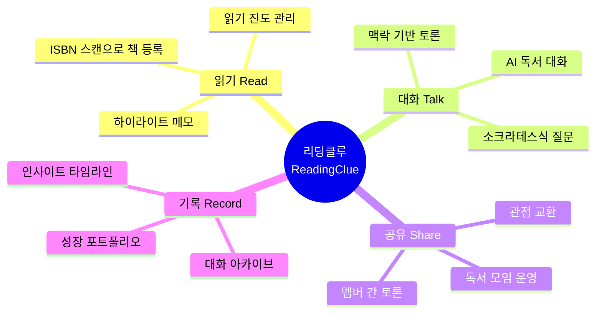
```mermaid
mindmap
  root((리딩클루<br/>ReadingClue))
    읽기 Read
      ISBN 스캔으로 책 등록
      읽기 진도 관리
      하이라이트 메모
    대화 Talk
      AI 독서 대화
      소크라테스식 질문
      맥락 기반 토론
    공유 Share
      관점 교환
      독서 모임 운영
      멤버 간 토론
    기록 Record
      대화 아카이브
      성장 포트폴리오
      인사이트 타임라인
```

### 1.2 한 줄 정의

> **리딩클루 = 독서 기록 + AI 대화 파트너 + 독서 모임 커뮤니티 + 관점 아카이브**
>
> ※ 전자책 리더가 아닌, **"읽은 후의 사고 확장"**에 특화된 독서 컴패니언 앱

### 1.3 핵심 가치

| 핵심 가치 | 설명 | 기존 앱과의 차이 |
|-----------|------|----------------|
| **함께 읽는 경험** | 혼자가 아닌 모임 기반 독서 | 기존: 개인 독서 기록 중심 |
| **AI 대화 파트너** | 책 내용에 대해 AI와 깊이 있는 대화 | 기존: 단순 요약/추천만 제공 |
| **관점의 교차** | 같은 책, 다른 시각을 발견 | 기존: 별점/리뷰만 있음 |
| **성장 기록** | 사고의 변화를 시간순 추적 | 기존: 읽은 책 목록만 관리 |
| **소크라테스식 토론** | 답이 아닌 질문으로 생각을 확장 | 기존: 정보 전달 위주 |

---

## 2. 왜 이 앱이 필요한가?

### 2.1 현재 독서 환경의 문제점

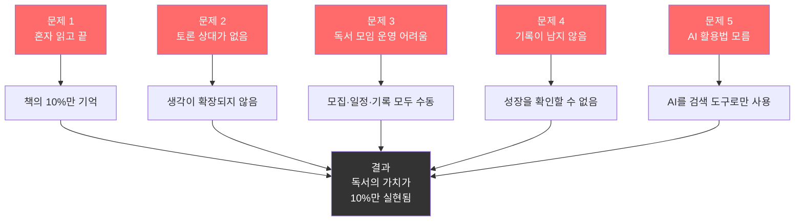
```mermaid
graph TD
    P1[문제 1<br/>혼자 읽고 끝] --> S1[책의 10%만 기억]
    P2[문제 2<br/>토론 상대가 없음] --> S2[생각이 확장되지 않음]
    P3[문제 3<br/>독서 모임 운영 어려움] --> S3[모집·일정·기록 모두 수동]
    P4[문제 4<br/>기록이 남지 않음] --> S4[성장을 확인할 수 없음]
    P5[문제 5<br/>AI 활용법 모름] --> S5[AI를 검색 도구로만 사용]
    
    S1 --> R[결과<br/>독서의 가치가<br/>10%만 실현됨]
    S2 --> R
    S3 --> R
    S4 --> R
    S5 --> R
    
    style P1 fill:#ff6b6b,color:#fff
    style P2 fill:#ff6b6b,color:#fff
    style P3 fill:#ff6b6b,color:#fff
    style P4 fill:#ff6b6b,color:#fff
    style P5 fill:#ff6b6b,color:#fff
    style R fill:#333,color:#fff
```

### 2.2 리딩클루가 해결하는 것

| 문제 | 리딩클루의 해법 | 기대 효과 |
|------|---------------|----------|
| 혼자 읽고 끝 | 모임 기반 함께 읽기 + AI 대화 | 기억 3배, 이해 5배 향상 |
| 토론 상대 없음 | AI가 24시간 대화 파트너 역할 | 언제든 깊이 있는 토론 가능 |
| 모임 운영 어려움 | 모집·일정·진도·기록 자동화 | 운영 부담 80% 감소 |
| 기록 안 남음 | 모든 대화와 인사이트 자동 저장 | 나의 사고 성장 추적 가능 |
| AI 활용법 모름 | 독서 맥락에 최적화된 AI 대화 | AI를 사고 확장 도구로 활용 |

---

## 3. 기존 독서 앱과의 차별점

### 3.1 경쟁 앱 비교 분석

| 기능 | 밀리의 서재 | 리디북스 | 북클럽 | 트레바리 | **리딩클루** |
|------|-----------|---------|--------|---------|------------|
| 핵심 가치 | 전자책 구독 | 전자책 구독 | 소셜 독서 | 오프라인 모임 | **AI 독서 대화** |
| 독서 기록 | △ | △ | O | △ | **O (심화)** |
| AI 대화 | X | X | X | X | **O (핵심)** |
| 독서 모임 | X | X | △ | O (오프라인) | **O (온·오프)** |
| 관점 공유 | X | X | △ | O (오프라인) | **O (시스템화)** |
| 토론 기록 | X | X | X | X | **O (자동)** |
| 성장 추적 | X | X | △ | X | **O (AI 분석)** |
| 회원 모집 | X | X | X | O (플랫폼) | **O (인앱)** |
| 가격 | 월 9,900원 | 월 7,900원 | 무료 | 회당 2~5만원 | **프리미엄** |

> **참고**: 리딩클루는 전자책 제공 플랫폼이 아닙니다. 전자책/오디오북은 기존 서비스(밀리의 서재, 리디북스 등)를 이용하고, 리딩클루는 **"읽은 후의 경험"** — 대화, 토론, 관점 공유, 성장 추적에 집중합니다. 책은 종이책이든 전자책이든 어디서든 읽고, 리딩클루에서 생각을 확장합니다.

### 3.2 포지셔닝 맵

| 앱 이름 | 개인/커뮤니티 | 콘텐츠 소비/사고 확장 | 포지셔닝 |
|---------|---------------|----------------------|----------|
| 밀리의 서재 | 개인 중심 | 콘텐츠 소비 | 전자책 구독 서비스 |
| 리디북스 | 개인 중심 | 콘텐츠 소비 | 전자책 구독 서비스 |
| 북클럽 | 중간 | 중간 | 소셜 독서 |
| 트레바리 | 커뮤니티 중심 | 사고 확장 | 학습 도구 |
| **리딩클루** | **커뮤니티 중심** | **사고 확장** | **목표 영역** |

**포지셔닝 요약**:
- **X축 (개인 ← → 커뮤니티)**: 리딩클루는 커뮤니티 중심 (0.8)
- **Y축 (콘텐츠 소비 ← → 사고 확장)**: 리딩클루는 사고 확장 중심 (0.85)
- **결론**: 리딩클루는 "커뮤니티 기반 사고 확장" 영역에서 독보적 위치

### 3.3 리딩클루만의 핵심 차별점 (USP)

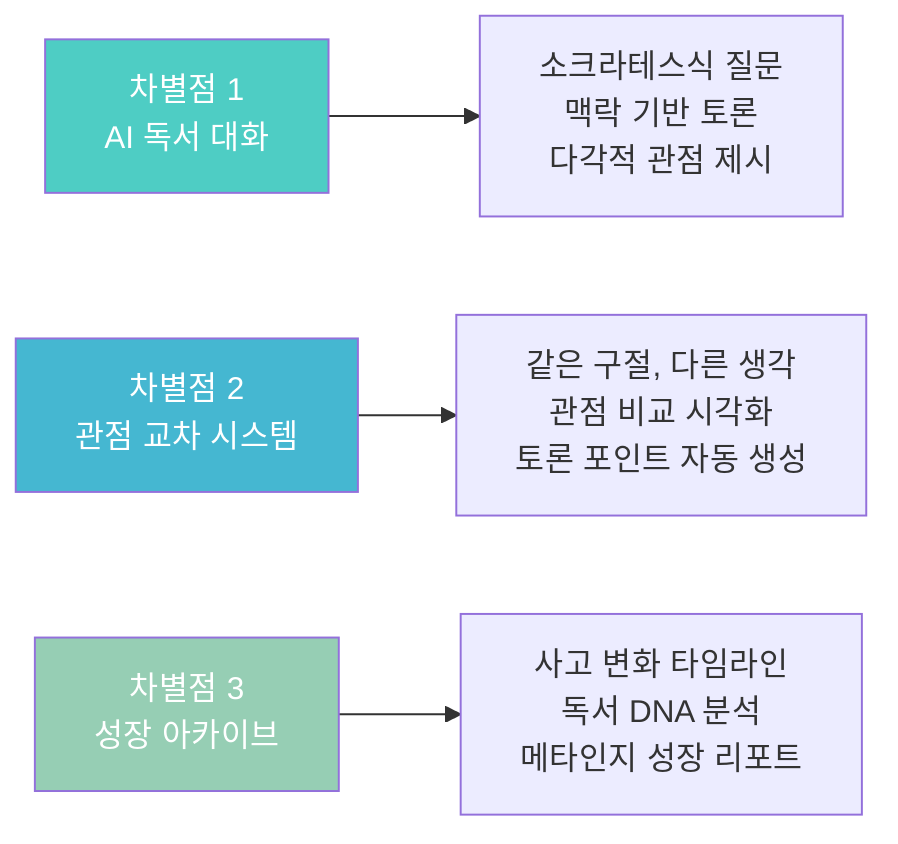
```mermaid
graph LR
    A[차별점 1<br/>AI 독서 대화] --> D[소크라테스식 질문<br/>맥락 기반 토론<br/>다각적 관점 제시]
    B[차별점 2<br/>관점 교차 시스템] --> E[같은 구절, 다른 생각<br/>관점 비교 시각화<br/>토론 포인트 자동 생성]
    C[차별점 3<br/>성장 아카이브] --> F[사고 변화 타임라인<br/>독서 DNA 분석<br/>메타인지 성장 리포트]
    
    style A fill:#4ECDC4,color:#fff
    style B fill:#45B7D1,color:#fff
    style C fill:#96CEB4,color:#fff
```

---

## 4. 회원 시스템과 독서 모임 운영

### 4.1 회원 체계

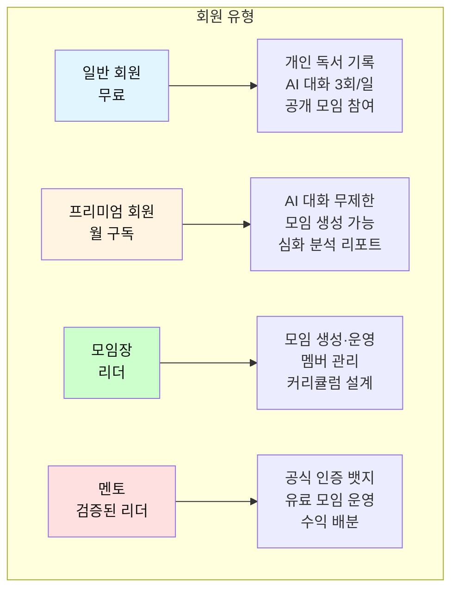
```mermaid
graph TD
    subgraph "회원 유형"
        A[일반 회원<br/>무료] --> A1[개인 독서 기록<br/>AI 대화 3회/일<br/>공개 모임 참여]
        B[프리미엄 회원<br/>월 구독] --> B1[AI 대화 무제한<br/>모임 생성 가능<br/>심화 분석 리포트]
        C[모임장<br/>리더] --> C1[모임 생성·운영<br/>멤버 관리<br/>커리큘럼 설계]
        D[멘토<br/>검증된 리더] --> D1[공식 인증 뱃지<br/>유료 모임 운영<br/>수익 배분]
    end
    
    style A fill:#e1f5ff,color:#111
    style B fill:#fff3e1,color:#111
    style C fill:#ccffcc,color:#111
    style D fill:#ffe0e0,color:#111
```

### 4.2 독서 모임 유형

| 모임 유형 | 설명 | 인원 | 기간 | 특징 |
|-----------|------|------|------|------|
| **자유 모임** | 누구나 만들 수 있는 열린 모임 | 3~12명 | 자유 | 가볍게 시작, 자유로운 운영 |
| **주제 모임** | 특정 주제/분야 중심 모임 | 5~15명 | 4~16주 | 주제별 큐레이션 도서 목록 제공 |
| **챌린지 모임** | 목표 달성형 단기 모임 | 5~30명 | 2~4주 | 매일 읽기 챌린지, 미션 수행 |
| **세미나 모임** | 소크라테스식 심화 토론 | 4~8명 | 8~12주 | 미네르바식 운영, 진행자 필수 |
| **프로젝트 모임** | 책 기반 프로젝트 수행 | 3~6명 | 4~8주 | 독서 → 기획 → 실행 → 발표 |

### 4.3 모임 생성 ~ 운영 흐름

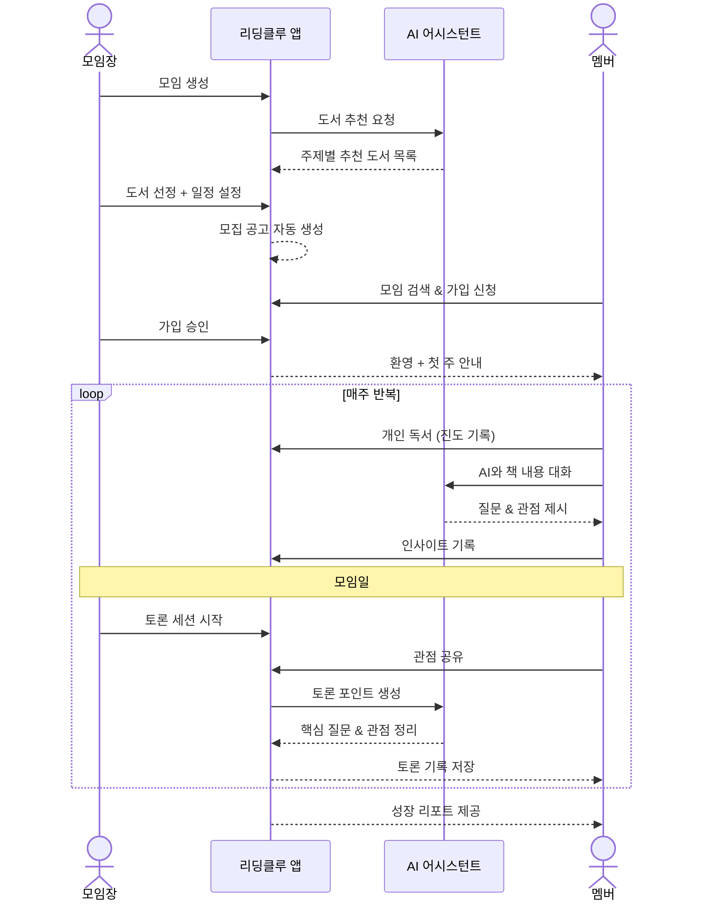
```mermaid
sequenceDiagram
    actor 모임장
    participant 앱 as 리딩클루 앱
    participant AI as AI 어시스턴트
    actor 멤버
    
    모임장->>앱: 모임 생성
    앱->>AI: 도서 추천 요청
    AI-->>앱: 주제별 추천 도서 목록
    모임장->>앱: 도서 선정 + 일정 설정
    앱-->>앱: 모집 공고 자동 생성
    
    멤버->>앱: 모임 검색 & 가입 신청
    모임장->>앱: 가입 승인
    앱-->>멤버: 환영 + 첫 주 안내
    
    loop 매주 반복
        멤버->>앱: 개인 독서 (진도 기록)
        멤버->>AI: AI와 책 내용 대화
        AI-->>멤버: 질문 & 관점 제시
        멤버->>앱: 인사이트 기록
        
        Note over 모임장,멤버: 모임일
        모임장->>앱: 토론 세션 시작
        멤버->>앱: 관점 공유
        앱->>AI: 토론 포인트 생성
        AI-->>앱: 핵심 질문 & 관점 정리
        앱-->>멤버: 토론 기록 저장
    end
    
    앱-->>멤버: 성장 리포트 제공
```

### 4.4 모임 모집 기능

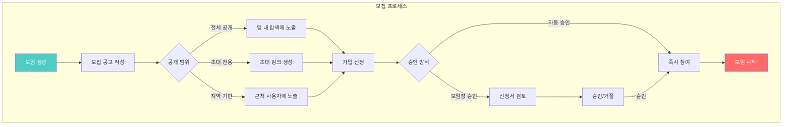
```mermaid
graph TD
    subgraph "모집 프로세스"
        A[모임 생성] --> B[모집 공고 작성]
        B --> C{공개 범위}
        C -->|전체 공개| D[앱 내 탐색에 노출]
        C -->|초대 전용| E[초대 링크 생성]
        C -->|지역 기반| F[근처 사용자에 노출]
        
        D --> G[가입 신청]
        E --> G
        F --> G
        
        G --> H{승인 방식}
        H -->|자동 승인| I[즉시 참여]
        H -->|모임장 승인| J[신청서 검토]
        J --> K[승인/거절]
        K -->|승인| I
        
        I --> L[모임 시작!]
    end
    
    style A fill:#4ECDC4,color:#fff
    style L fill:#FF6B6B,color:#fff
```

#### 모집 공고에 포함되는 정보

| 항목 | 내용 | 필수 여부 |
|------|------|----------|
| 모임 이름 | 모임의 제목 | 필수 |
| 선정 도서 | 함께 읽을 책 | 필수 |
| 모임 유형 | 자유/주제/세미나 등 | 필수 |
| 일정 | 시작일, 종료일, 요일, 시간 | 필수 |
| 인원 | 최소~최대 인원 | 필수 |
| 방식 | 온라인/오프라인/혼합 | 필수 |
| 장소 | 오프라인 시 장소 정보 | 선택 |
| 모임 소개 | 모임의 목적과 분위기 | 선택 |
| 대상 | 추천 대상 (학생/성인/직장인 등) | 선택 |
| 모임장 소개 | 운영자 프로필과 경력 | 선택 |
| 참여 비용 | 무료/유료 (가격) | 필수 |

---

## 5. AI 독서 대화 시스템

### 5.1 AI 대화의 3가지 모드

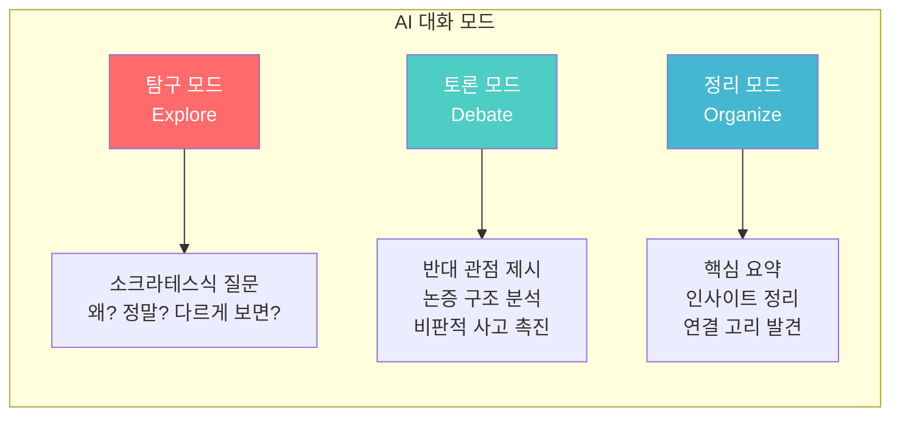
```mermaid
graph LR
    subgraph "AI 대화 모드"
        A[탐구 모드<br/>Explore] --> A1[소크라테스식 질문<br/>왜? 정말? 다르게 보면?]
        B[토론 모드<br/>Debate] --> B1[반대 관점 제시<br/>논증 구조 분석<br/>비판적 사고 촉진]
        C[정리 모드<br/>Organize] --> C1[핵심 요약<br/>인사이트 정리<br/>연결 고리 발견]
    end
    
    style A fill:#FF6B6B,color:#fff
    style B fill:#4ECDC4,color:#fff
    style C fill:#45B7D1,color:#fff
```

### 5.2 AI 대화 상세 기능

| 기능 | 설명 | 예시 |
|------|------|------|
| **맥락 인식 대화** | 현재 읽고 있는 책의 내용을 AI가 이해하고 대화 | "3장에서 저자가 말한 '공정'의 의미가 뭘까요?" |
| **소크라테스 질문** | 답을 주지 않고 질문으로 사고를 확장 | "그렇다면 '정의'는 누구의 관점에서 정의되는 걸까요?" |
| **다각적 관점 제시** | 하나의 주제에 대해 여러 관점을 보여줌 | "이 주제를 경제학자, 철학자, 사회학자는 어떻게 볼까요?" |
| **반대 논증** | 사용자의 의견에 건설적 반론을 제시 | "좋은 관점입니다. 하지만 반대 입장에서 보면..." |
| **연결 짓기** | 다른 책, 개념, 현실 사례와 연결 | "이 개념은 카뮈의 '이방인'에서도 나타나는데요..." |
| **대화 요약** | 대화의 핵심 인사이트를 자동 정리 | 대화 후 "오늘의 핵심 인사이트 3가지" 제공 |

### 5.3 AI 대화 흐름 예시

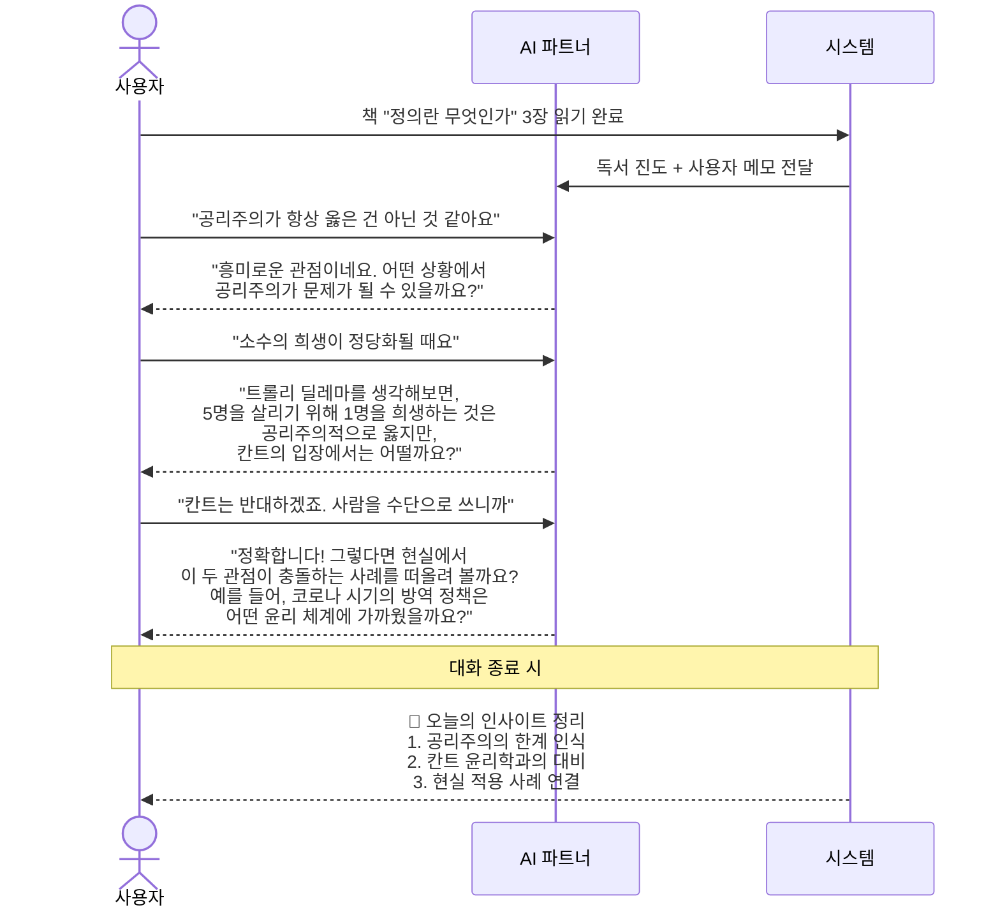
```mermaid
sequenceDiagram
    actor 사용자
    participant AI as AI 파트너
    participant 시스템 as 시스템
    
    사용자->>시스템: 책 "정의란 무엇인가" 3장 읽기 완료
    시스템->>AI: 독서 진도 + 사용자 메모 전달
    
    사용자->>AI: "공리주의가 항상 옳은 건 아닌 것 같아요"
    AI-->>사용자: "흥미로운 관점이네요. 어떤 상황에서<br/>공리주의가 문제가 될 수 있을까요?"
    
    사용자->>AI: "소수의 희생이 정당화될 때요"
    AI-->>사용자: "트롤리 딜레마를 생각해보면,<br/>5명을 살리기 위해 1명을 희생하는 것은<br/>공리주의적으로 옳지만,<br/>칸트의 입장에서는 어떨까요?"
    
    사용자->>AI: "칸트는 반대하겠죠. 사람을 수단으로 쓰니까"
    AI-->>사용자: "정확합니다! 그렇다면 현실에서<br/>이 두 관점이 충돌하는 사례를 떠올려 볼까요?<br/>예를 들어, 코로나 시기의 방역 정책은<br/>어떤 윤리 체계에 가까웠을까요?"
    
    Note over 사용자,시스템: 대화 종료 시
    시스템-->>사용자: 📝 오늘의 인사이트 정리<br/>1. 공리주의의 한계 인식<br/>2. 칸트 윤리학과의 대비<br/>3. 현실 적용 사례 연결
```

### 5.4 AI 대화 품질 관리

| 원칙 | 설명 | 구현 방법 |
|------|------|----------|
| **답 주지 않기** | AI는 정답이 아닌 질문을 제공 | 소크라테스식 프롬프트 설계 |
| **편향 방지** | 특정 입장을 강요하지 않음 | 다각적 관점 균형 제시 |
| **수준 조절** | 사용자 수준에 맞는 대화 | 대화 이력 기반 난이도 조정 |
| **맥락 유지** | 이전 대화와 독서 이력 연결 | 컨텍스트 윈도우 + 요약 메모리 |
| **출처 명시** | 인용이나 주장에 근거 제시 | 책 페이지, 학자, 이론 명시 |

### 5.5 AI Agent 구현 상세 아키텍처

#### AI Agent 역할 분리

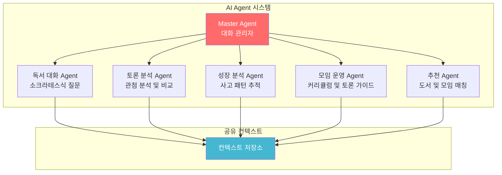
```mermaid
graph TD
    subgraph "AI Agent 시스템"
        MA[Master Agent<br/>대화 관리자]
        
        MA --> A1[독서 대화 Agent<br/>소크라테스식 질문]
        MA --> A2[토론 분석 Agent<br/>관점 분석 및 비교]
        MA --> A3[성장 분석 Agent<br/>사고 패턴 추적]
        MA --> A4[모임 운영 Agent<br/>커리큘럼 및 토론 가이드]
        MA --> A5[추천 Agent<br/>도서 및 모임 매칭]
    end

    subgraph "공유 컨텍스트"
        CTX[컨텍스트 저장소]
        A1 --> CTX
        A2 --> CTX
        A3 --> CTX
        A4 --> CTX
        A5 --> CTX
    end

    style MA fill:#FF6B6B,color:#fff
    style CTX fill:#45B7D1,color:#fff
```

#### Agent별 상세 기능 및 프롬프트 전략

| Agent | 역할 | 핵심 프롬프트 전략 | 입력 데이터 | 출력 |
|-------|------|------------------|-----------|------|
| **독서 대화 Agent** | 사용자와 1:1 독서 대화 | System: "당신은 소크라테스식 독서 파트너입니다. 절대 답을 직접 주지 말고, 질문으로 사용자의 사고를 확장하세요." | 책 메타데이터, 진도, 메모, 대화 이력 | 질문, 관점 제시, 연결 제안 |
| **토론 분석 Agent** | 멤버 관점 비교 분석 | System: "여러 독자의 관점을 분석하여 핵심 대립 포인트를 찾고, 생산적 토론을 위한 질문을 만드세요." | 멤버별 관점 텍스트, 공유 메모 | 토론 포인트, 관점 비교표, 핵심 질문 |
| **성장 분석 Agent** | 사고 패턴 변화 추적 | System: "사용자의 독서 기록과 대화 이력을 분석하여 사고의 성장을 측정하고 피드백하세요." | 전체 대화 이력, 인사이트 로그, 독서 기록 | 성장 리포트, DNA 분석, 추천 |
| **모임 운영 Agent** | 모임장 지원 | System: "독서 모임의 효과적인 운영을 지원합니다. 책 내용 기반의 토론 가이드와 커리큘럼을 생성하세요." | 선정 도서, 모임 설정, 멤버 프로필 | 커리큘럼, 토론 가이드, 진도 리포트 |
| **추천 Agent** | 도서/모임 매칭 | System: "사용자의 독서 이력, 관심 분야, 사고 패턴을 분석하여 최적의 도서와 모임을 추천하세요." | 독서 DNA, 관심 분야, 활동 이력 | 도서 추천, 모임 매칭, 학습 경로 |

#### 독서 대화 Agent 상세 워크플로우

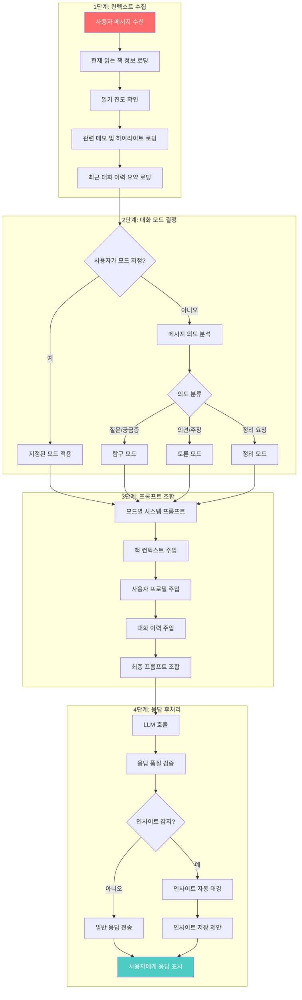
```mermaid
graph TD
    subgraph "1단계: 컨텍스트 수집"
        I1[사용자 메시지 수신]
        I1 --> I2[현재 읽는 책 정보 로딩]
        I2 --> I3[읽기 진도 확인]
        I3 --> I4[관련 메모 및 하이라이트 로딩]
        I4 --> I5[최근 대화 이력 요약 로딩]
    end

    subgraph "2단계: 대화 모드 결정"
        I5 --> M1{사용자가 모드 지정?}
        M1 -->|예| M2[지정된 모드 적용]
        M1 -->|아니오| M3[메시지 의도 분석]
        M3 --> M4{의도 분류}
        M4 -->|질문/궁금증| M5[탐구 모드]
        M4 -->|의견/주장| M6[토론 모드]
        M4 -->|정리 요청| M7[정리 모드]
    end

    subgraph "3단계: 프롬프트 조합"
        M2 --> P1[모드별 시스템 프롬프트]
        M5 --> P1
        M6 --> P1
        M7 --> P1
        P1 --> P2[책 컨텍스트 주입]
        P2 --> P3[사용자 프로필 주입]
        P3 --> P4[대화 이력 주입]
        P4 --> P5[최종 프롬프트 조합]
    end

    subgraph "4단계: 응답 후처리"
        P5 --> R1[LLM 호출]
        R1 --> R2[응답 품질 검증]
        R2 --> R3{인사이트 감지?}
        R3 -->|예| R4[인사이트 자동 태깅]
        R3 -->|아니오| R5[일반 응답 전송]
        R4 --> R6[인사이트 저장 제안]
        R5 --> R7[사용자에게 응답 표시]
        R6 --> R7
    end

    style I1 fill:#FF6B6B,color:#fff
    style R7 fill:#4ECDC4,color:#fff
```

#### 대화 모드별 프롬프트 템플릿

**탐구 모드 (Explore)**:
```
[System Prompt]
당신은 소크라테스식 독서 대화 파트너 '리딩클루 AI'입니다.

핵심 원칙:
1. 절대 답을 직접 제공하지 않습니다
2. 질문으로 사용자의 사고를 확장합니다
3. "왜?", "정말?", "다르게 보면?" 패턴을 사용합니다
4. 사용자의 수준에 맞춰 질문 난이도를 조절합니다

현재 컨텍스트:
- 책: {book_title} by {author}
- 진도: {chapter}/{total_chapters} ({progress}%)
- 최근 메모: {recent_notes}
- 대화 깊이 레벨: {depth_level}/10
- 사용자 관심 키워드: {interest_keywords}

응답 형식:
- 2~3문장의 공감 또는 인정
- 1개의 핵심 탐구 질문
- (선택) 관련 개념이나 다른 책과의 연결 힌트
```

**토론 모드 (Debate)**:
```
[System Prompt]
당신은 건설적 토론 파트너 '리딩클루 AI'입니다.

핵심 원칙:
1. 사용자의 주장에 대한 건설적 반론을 제시합니다
2. 논증 구조(주장-근거-예시)를 분석합니다
3. 다양한 학자/사상가의 관점을 인용합니다
4. 감정이 아닌 논리 중심으로 대화합니다

현재 컨텍스트:
- 책: {book_title} - {current_chapter}
- 사용자 입장: {user_stance}
- 관련 이론/학자: {related_theories}

응답 형식:
- 사용자 주장 요약 (1문장)
- 반대 관점 또는 보완 관점 (2~3문장)
- 구체적 사례 또는 인용 (1~2문장)
- 사고를 더 깊게 하는 후속 질문 (1문장)
```

**정리 모드 (Organize)**:
```
[System Prompt]
당신은 독서 인사이트 정리 도우미 '리딩클루 AI'입니다.

핵심 원칙:
1. 대화에서 핵심 인사이트를 추출합니다
2. 인사이트를 구조화하여 정리합니다
3. 다른 책/개념과의 연결 고리를 제안합니다
4. 다음 탐구 방향을 제안합니다

입력: 이전 대화 전체 로그
출력 형식:
- 핵심 인사이트 (최대 5개, 번호 매기기)
- 사고 성장 포인트 (이전 대비 어떤 점이 발전했는지)
- 관련 연결 (다른 책, 개념, 현실 사례)
- 다음에 탐구할 질문 (1~2개)
```

#### AI Agent 컨텍스트 관리 전략

| 컨텍스트 계층 | 포함 데이터 | 저장 방식 | 활용 시점 |
|--------------|-----------|----------|----------|
| **즉시 컨텍스트** | 현재 대화 메시지 (최근 20턴) | 메모리 (Redis) | 매 대화 턴 |
| **세션 컨텍스트** | 현재 책의 진도, 메모, 하이라이트 | 세션 캐시 | 대화 시작 시 |
| **장기 컨텍스트** | 사용자의 전체 독서 이력, 관심사 프로필, 대화 요약 | DB (PostgreSQL) | 요약 형태로 주입 |
| **모임 컨텍스트** | 같은 모임 멤버들의 관점, 토론 기록 | DB + 벡터 검색 | 토론 관련 대화 시 |
| **책 컨텍스트** | 책의 목차, 주요 개념, 저자 정보, 서평 | 벡터 DB (Pinecone) | RAG로 검색하여 주입 |

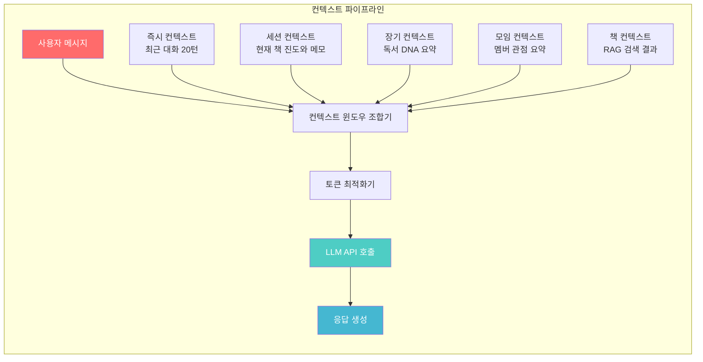
```mermaid
graph LR
    subgraph "컨텍스트 파이프라인"
        U[사용자 메시지] --> CW[컨텍스트 윈도우 조합기]
        
        IC[즉시 컨텍스트<br/>최근 대화 20턴] --> CW
        SC[세션 컨텍스트<br/>현재 책 진도와 메모] --> CW
        LC[장기 컨텍스트<br/>독서 DNA 요약] --> CW
        MC[모임 컨텍스트<br/>멤버 관점 요약] --> CW
        BC[책 컨텍스트<br/>RAG 검색 결과] --> CW
        
        CW --> TP[토큰 최적화기]
        TP --> LLM[LLM API 호출]
        LLM --> RS[응답 생성]
    end

    style U fill:#FF6B6B,color:#fff
    style LLM fill:#4ECDC4,color:#fff
    style RS fill:#45B7D1,color:#fff
```

#### AI 토론 중재 Agent 상세

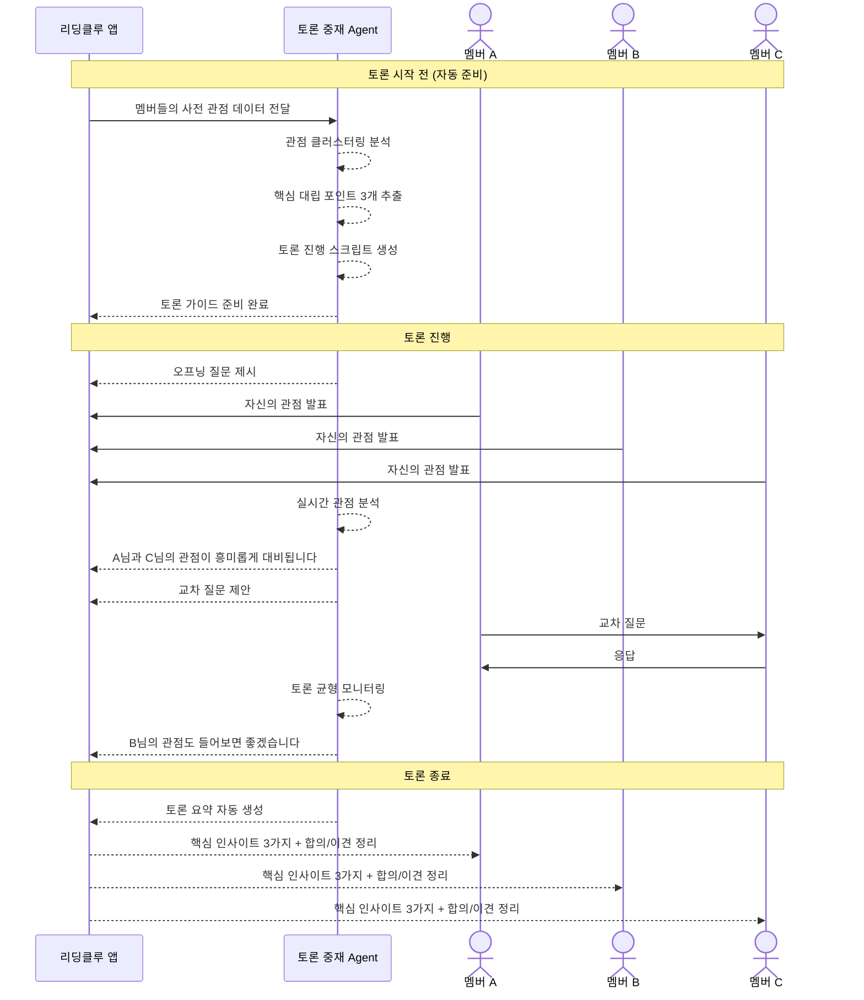
```mermaid
sequenceDiagram
    participant 앱 as 리딩클루 앱
    participant AI as 토론 중재 Agent
    actor M1 as 멤버 A
    actor M2 as 멤버 B
    actor M3 as 멤버 C

    Note over 앱,M3: 토론 시작 전 (자동 준비)
    앱->>AI: 멤버들의 사전 관점 데이터 전달
    AI-->>AI: 관점 클러스터링 분석
    AI-->>AI: 핵심 대립 포인트 3개 추출
    AI-->>AI: 토론 진행 스크립트 생성
    AI-->>앱: 토론 가이드 준비 완료

    Note over 앱,M3: 토론 진행
    AI-->>앱: 오프닝 질문 제시
    M1->>앱: 자신의 관점 발표
    M2->>앱: 자신의 관점 발표
    M3->>앱: 자신의 관점 발표
    
    AI-->>AI: 실시간 관점 분석
    AI-->>앱: A님과 C님의 관점이 흥미롭게 대비됩니다
    AI-->>앱: 교차 질문 제안
    
    M1->>M3: 교차 질문
    M3->>M1: 응답

    AI-->>AI: 토론 균형 모니터링
    AI-->>앱: B님의 관점도 들어보면 좋겠습니다

    Note over 앱,M3: 토론 종료
    AI-->>앱: 토론 요약 자동 생성
    앱-->>M1: 핵심 인사이트 3가지 + 합의/이견 정리
    앱-->>M2: 핵심 인사이트 3가지 + 합의/이견 정리
    앱-->>M3: 핵심 인사이트 3가지 + 합의/이견 정리
```

#### AI 성장 분석 Agent 지표 산출 방법

| 성장 지표 | 측정 방법 | AI 분석 로직 | 시각화 |
|-----------|----------|-------------|--------|
| **사고 깊이** | AI 대화에서 질문/응답의 추상화 수준 분석 | 블룸 택소노미 6단계 기준 분류 (기억→이해→적용→분석→평가→창조) | 레이더 차트 |
| **관점 다양성** | 하나의 주제에 대해 제시한 관점 수 | 관점 벡터의 다양성 계산 (코사인 유사도 역수) | 관점 분포 맵 |
| **비판적 사고** | 반론 제시, 근거 요구, 가정 검증 빈도 | 대화 텍스트에서 비판적 사고 패턴 추출 | 월별 추세선 |
| **연결력** | 책 간, 개념 간 연결 짓기 횟수와 질 | 크로스 레퍼런스 분석, 유사도 기반 연결 적절성 평가 | 지식 그래프 |
| **메타인지** | 자기 생각에 대한 인식/반성 빈도 | "나는 ~라고 생각했는데", "다시 생각해보면" 패턴 감지 | 성찰 타임라인 |

---

## 6. 관점 공유 및 토론 시스템

### 6.1 관점 공유 구조

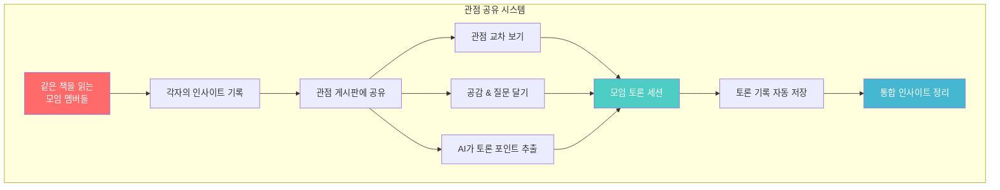
```mermaid
graph TD
    subgraph "관점 공유 시스템"
        A[같은 책을 읽는<br/>모임 멤버들] --> B[각자의 인사이트 기록]
        B --> C[관점 게시판에 공유]
        
        C --> D[관점 교차 보기]
        C --> E[공감 & 질문 달기]
        C --> F[AI가 토론 포인트 추출]
        
        D --> G[모임 토론 세션]
        E --> G
        F --> G
        
        G --> H[토론 기록 자동 저장]
        H --> I[통합 인사이트 정리]
    end
    
    style A fill:#FF6B6B,color:#fff
    style G fill:#4ECDC4,color:#fff
    style I fill:#45B7D1,color:#fff
```

### 6.2 관점 교차 보기 (핵심 기능)

> **같은 구절에 대한 서로 다른 생각을 한눈에 비교**

```
┌─────────────────────────────────────────────────┐
│  📖 "정의란 무엇인가" - 3장, p.87                  │
│  "최대 다수의 최대 행복이 곧 정의다"                  │
├─────────────────────────────────────────────────┤
│                                                  │
│  👤 김민수의 관점                                   │
│  "현실에서 가장 실용적인 원칙이라고 생각합니다.         │
│   모든 정책은 결국 다수의 행복을 목표로 해야..."        │
│  💬 댓글 3개  ❤️ 5  🤔 2                           │
│                                                  │
│  ─ ─ ─ ─ ─ ─ ─ ─ ─ ─ ─ ─ ─ ─ ─ ─              │
│                                                  │
│  👤 이서연의 관점                                   │
│  "소수의 권리가 무시될 수 있다는 점에서 위험합니다.     │
│   다수결이 항상 정의는 아니라고 봅니다..."              │
│  💬 댓글 5개  ❤️ 8  🤔 4                           │
│                                                  │
│  ─ ─ ─ ─ ─ ─ ─ ─ ─ ─ ─ ─ ─ ─ ─ ─              │
│                                                  │
│  🤖 AI 토론 포인트                                  │
│  "두 관점의 핵심 대립: 실용성 vs 개인의 권리           │
│   벤담과 밀의 관점 차이를 비교해 보면..."              │
│                                                  │
└─────────────────────────────────────────────────┘
```

### 6.3 토론 방식

| 토론 방식 | 설명 | 적합한 상황 | 인원 |
|-----------|------|------------|------|
| **비동기 관점 공유** | 각자 시간에 인사이트를 올리고 댓글로 반응 | 바쁜 직장인, 시간이 다른 멤버 | 제한 없음 |
| **실시간 텍스트 토론** | 채팅 형태의 실시간 토론 | 가벼운 의견 교환 | 3~15명 |
| **음성 토론방** | 클럽하우스 형태의 음성 토론 | 깊이 있는 실시간 토론 | 4~8명 |
| **화상 세미나** | 영상 통화 기반 소크라테스 세미나 | 미네르바식 심화 토론 | 4~8명 |
| **AI 중재 토론** | AI가 진행을 맡는 구조화된 토론 | 진행자 없을 때, 공정한 토론 | 3~12명 |

### 6.4 AI 중재 토론 흐름

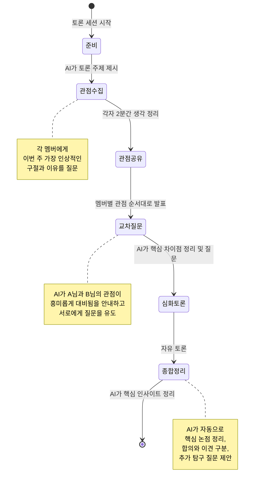
```mermaid
stateDiagram-v2
    [*] --> 준비: 토론 세션 시작
    준비 --> 관점수집: AI가 토론 주제 제시
    관점수집 --> 관점공유: 각자 2분간 생각 정리
    관점공유 --> 교차질문: 멤버별 관점 순서대로 발표
    교차질문 --> 심화토론: AI가 핵심 차이점 정리 및 질문
    심화토론 --> 종합정리: 자유 토론
    종합정리 --> [*]: AI가 핵심 인사이트 정리

    note right of 관점수집
        각 멤버에게
        이번 주 가장 인상적인
        구절과 이유를 질문
    end note

    note right of 교차질문
        AI가 A님과 B님의 관점이
        흥미롭게 대비됨을 안내하고
        서로에게 질문을 유도
    end note

    note right of 종합정리
        AI가 자동으로
        핵심 논점 정리,
        합의와 이견 구분,
        추가 탐구 질문 제안
    end note
```

---

## 7. 독서 기록 및 성장 추적

### 7.1 기록 시스템 구성

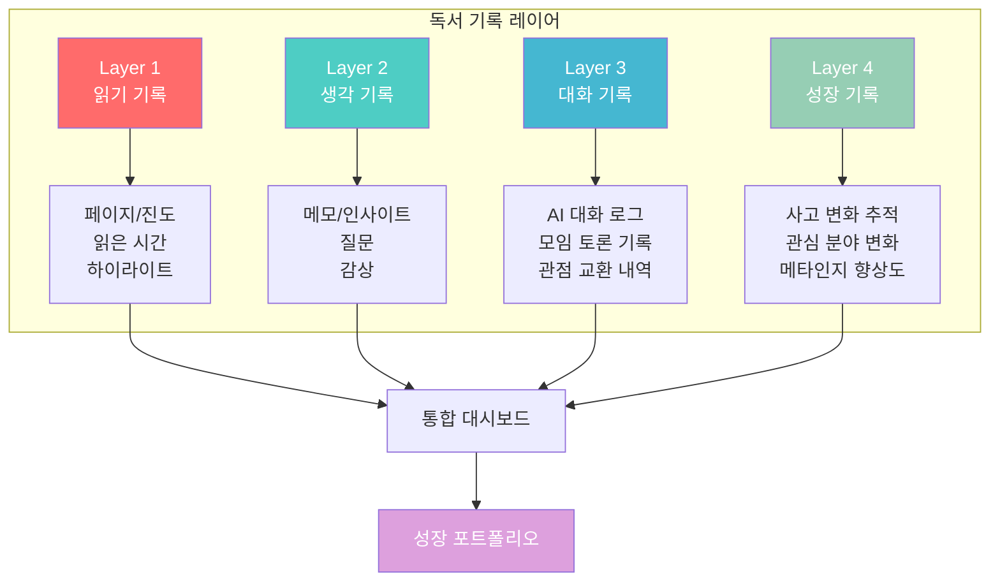
```mermaid
graph TD
    subgraph "독서 기록 레이어"
        A[Layer 1<br/>읽기 기록] --> A1[페이지/진도<br/>읽은 시간<br/>하이라이트]
        B[Layer 2<br/>생각 기록] --> B1[메모/인사이트<br/>질문<br/>감상]
        C[Layer 3<br/>대화 기록] --> C1[AI 대화 로그<br/>모임 토론 기록<br/>관점 교환 내역]
        D[Layer 4<br/>성장 기록] --> D1[사고 변화 추적<br/>관심 분야 변화<br/>메타인지 향상도]
    end
    
    A1 --> E[통합 대시보드]
    B1 --> E
    C1 --> E
    D1 --> E
    
    E --> F[성장 포트폴리오]
    
    style A fill:#FF6B6B,color:#fff
    style B fill:#4ECDC4,color:#fff
    style C fill:#45B7D1,color:#fff
    style D fill:#96CEB4,color:#fff
    style F fill:#DDA0DD,color:#fff
```

### 7.2 성장 추적 지표

| 지표 | 측정 방법 | 시각화 |
|------|----------|--------|
| **독서량** | 읽은 책 수, 페이지 수, 시간 | 월별 그래프 |
| **사고 깊이** | AI 대화의 깊이 레벨 (질문 수준) | 레이더 차트 |
| **관점 다양성** | 다른 멤버와의 관점 차이 인식 횟수 | 관점 맵 |
| **토론 참여도** | 토론 횟수, 발언량, 질문 수 | 참여 히트맵 |
| **연결력** | 책 간, 개념 간 연결 짓기 횟수 | 지식 그래프 |
| **메타인지** | 자기 생각을 인식하고 반성하는 빈도 | 성찰 타임라인 |

### 7.3 독서 DNA 프로필

```
┌─────────────────────────────────────────────────┐
│  📊 나의 독서 DNA                                 │
│                                                   │
│  🏷️ 독서 성향: 비판적 탐구자                        │
│                                                   │
│  ◆ 관심 분야 Top 5                                │
│    1. 철학/윤리 ████████████████ 35%              │
│    2. 사회과학  ██████████████   28%              │
│    3. 심리학    ████████         16%              │
│    4. 경제학    ██████           12%              │
│    5. 문학      ████              9%              │
│                                                   │
│  ◆ 사고 유형                                       │
│         분석적 ◉─────○ 직관적                      │
│         비판적 ◉───○── 수용적                      │
│         개인적 ○───◉── 사회적                      │
│         이론적 ○─────◉ 실천적                      │
│                                                   │
│  ◆ 이번 달 성장                                    │
│    📖 읽은 책: 3권                                 │
│    💬 AI 대화: 24회                                │
│    🗣️ 토론 참여: 8회                               │
│    💡 인사이트: 15개                                │
│    🔗 연결 짓기: 7회                                │
│                                                   │
│  ◆ AI 분석 코멘트                                  │
│  "지난달 대비 비판적 사고 능력이 15% 향상되었습니다.   │
│   특히 다양한 관점에서 문제를 바라보는 능력이           │
│   크게 성장했습니다."                                │
└─────────────────────────────────────────────────┘
```

---

## 8. 사용자 여정 (User Journey)

### 8.1 신규 사용자 온보딩

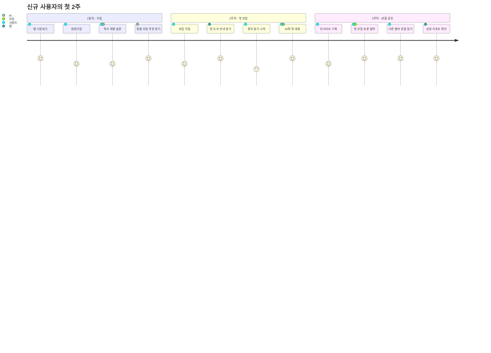
```mermaid
journey
    title 신규 사용자의 첫 2주
    section 1일차 - 가입
      앱 다운로드: 5: 사용자
      회원가입: 4: 사용자
      독서 취향 설문: 4: 사용자, AI
      맞춤 모임 추천 받기: 5: AI
    section 1주차 - 첫 모임
      모임 가입: 4: 사용자
      첫 도서 안내 받기: 5: 앱
      혼자 읽기 시작: 3: 사용자
      AI와 첫 대화: 5: 사용자, AI
    section 2주차 - 관점 공유
      인사이트 기록: 4: 사용자
      첫 모임 토론 참여: 5: 사용자, 모임
      다른 멤버 관점 읽기: 5: 사용자
      성장 리포트 확인: 5: 앱
```

### 8.2 핵심 사용 시나리오 개요


```mermaid
graph TD
    subgraph "시나리오 1: 개인 독서 + AI 대화"
        S1A[책 읽기] --> S1B[궁금한 부분 AI에게 질문]
        S1B --> S1C[AI가 질문으로 사고 확장]
        S1C --> S1D[인사이트 메모]
        S1D --> S1E[관점 게시판에 공유]
    end
    
    subgraph "시나리오 2: 모임 토론"
        S2A[주간 읽기 완료] --> S2B[토론 전 관점 정리]
        S2B --> S2C[모임 토론 참여]
        S2C --> S2D[다른 관점 발견]
        S2D --> S2E[AI가 토론 정리]
    end
    
    subgraph "시나리오 3: 독서 모임 운영"
        S3A[모임 생성] --> S3B[멤버 모집]
        S3B --> S3C[커리큘럼 설정]
        S3C --> S3D[주간 진도 관리]
        S3D --> S3E[토론 운영]
        S3E --> S3F[멤버 성장 리포트]
    end
    
    style S1A fill:#FF6B6B,color:#fff
    style S2A fill:#4ECDC4,color:#fff
    style S3A fill:#45B7D1,color:#fff
```

### 8.3 상세 유저 시나리오 1: 신규 가입 및 첫 독서

> **페르소나**: 김지현 (28세, 직장인, 독서 입문자)
> **목표**: 혼자 읽던 책을 AI와 대화하며 더 깊이 이해하고 싶다

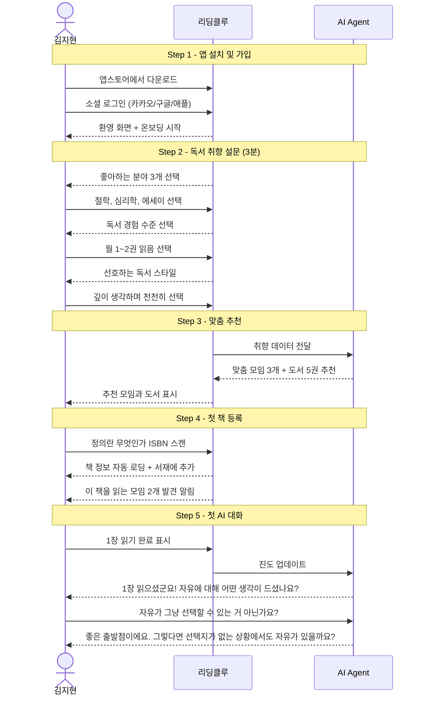
```mermaid
sequenceDiagram
    actor 지현 as 김지현
    participant 앱 as 리딩클루
    participant AI as AI Agent
    
    Note over 지현,AI: Step 1 - 앱 설치 및 가입
    지현->>앱: 앱스토어에서 다운로드
    지현->>앱: 소셜 로그인 (카카오/구글/애플)
    앱-->>지현: 환영 화면 + 온보딩 시작
    
    Note over 지현,AI: Step 2 - 독서 취향 설문 (3분)
    앱-->>지현: 좋아하는 분야 3개 선택
    지현->>앱: 철학, 심리학, 에세이 선택
    앱-->>지현: 독서 경험 수준 선택
    지현->>앱: 월 1~2권 읽음 선택
    앱-->>지현: 선호하는 독서 스타일
    지현->>앱: 깊이 생각하며 천천히 선택
    
    Note over 지현,AI: Step 3 - 맞춤 추천
    앱->>AI: 취향 데이터 전달
    AI-->>앱: 맞춤 모임 3개 + 도서 5권 추천
    앱-->>지현: 추천 모임과 도서 표시
    
    Note over 지현,AI: Step 4 - 첫 책 등록
    지현->>앱: 정의란 무엇인가 ISBN 스캔
    앱-->>지현: 책 정보 자동 로딩 + 서재에 추가
    앱-->>지현: 이 책을 읽는 모임 2개 발견 알림
    
    Note over 지현,AI: Step 5 - 첫 AI 대화
    지현->>앱: 1장 읽기 완료 표시
    앱->>AI: 진도 업데이트
    AI-->>지현: 1장 읽으셨군요! 자유에 대해 어떤 생각이 드셨나요?
    지현->>AI: 자유가 그냥 선택할 수 있는 거 아닌가요?
    AI-->>지현: 좋은 출발점이에요. 그렇다면 선택지가 없는 상황에서도 자유가 있을까요?
```

**시나리오 1 단계별 화면 전환**:

| 단계 | 화면 | 사용자 액션 | 시스템 반응 | 소요 시간 |
|------|------|-----------|-----------|----------|
| 1 | 스플래시 → 로그인 | 소셜 로그인 탭 | 계정 생성, 프로필 초기화 | 10초 |
| 2 | 온보딩 설문 (3단계) | 분야/수준/스타일 선택 | AI가 독서 프로필 생성 | 2~3분 |
| 3 | 추천 결과 화면 | 모임/도서 탐색 | 개인화된 피드 구성 | 1분 |
| 4 | 서재 → 책 등록 | ISBN 스캔 또는 검색 | 책 정보 자동 입력 | 30초 |
| 5 | 독서 기록 → AI 대화 | 진도 표시 후 대화 시작 | AI가 맥락 인식 대화 시작 | 5~10분 |

### 8.4 상세 유저 시나리오 2: 독서 모임 참여 및 토론

> **페르소나**: 이서연 (32세, 교사, 독서 모임 경험 있음)
> **목표**: 온라인 독서 모임에서 다양한 관점을 만나고 싶다

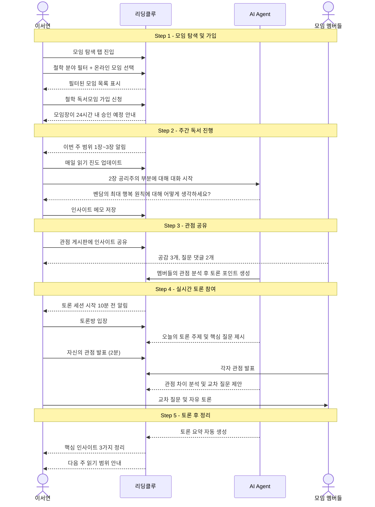
```mermaid
sequenceDiagram
    actor 서연 as 이서연
    participant 앱 as 리딩클루
    participant AI as AI Agent
    actor 멤버 as 모임 멤버들
    
    Note over 서연,멤버: Step 1 - 모임 탐색 및 가입
    서연->>앱: 모임 탐색 탭 진입
    서연->>앱: 철학 분야 필터 + 온라인 모임 선택
    앱-->>서연: 필터된 모임 목록 표시
    서연->>앱: 철학 독서모임 가입 신청
    앱-->>서연: 모임장이 24시간 내 승인 예정 안내
    
    Note over 서연,멤버: Step 2 - 주간 독서 진행
    앱-->>서연: 이번 주 범위 1장~3장 알림
    서연->>앱: 매일 읽기 진도 업데이트
    서연->>AI: 2장 공리주의 부분에 대해 대화 시작
    AI-->>서연: 벤담의 최대 행복 원칙에 대해 어떻게 생각하세요?
    서연->>앱: 인사이트 메모 저장
    
    Note over 서연,멤버: Step 3 - 관점 공유
    서연->>앱: 관점 게시판에 인사이트 공유
    멤버-->>서연: 공감 3개, 질문 댓글 2개
    AI->>앱: 멤버들의 관점 분석 후 토론 포인트 생성
    
    Note over 서연,멤버: Step 4 - 실시간 토론 참여
    앱-->>서연: 토론 세션 시작 10분 전 알림
    서연->>앱: 토론방 입장
    AI-->>앱: 오늘의 토론 주제 및 핵심 질문 제시
    서연->>앱: 자신의 관점 발표 (2분)
    멤버->>앱: 각자 관점 발표
    AI-->>앱: 관점 차이 분석 및 교차 질문 제안
    서연->>멤버: 교차 질문 및 자유 토론
    
    Note over 서연,멤버: Step 5 - 토론 후 정리
    AI-->>앱: 토론 요약 자동 생성
    앱-->>서연: 핵심 인사이트 3가지 정리
    앱-->>서연: 다음 주 읽기 범위 안내
```

**시나리오 2 주간 타임라인**:

| 요일 | 활동 | 앱 기능 사용 | AI Agent 역할 |
|------|------|------------|--------------|
| 월 | 이번 주 범위 읽기 시작 | 진도 기록, 하이라이트 | 읽기 속도에 맞춘 리마인더 |
| 화~수 | 개인 독서 + AI 대화 | AI 대화방 (탐구 모드) | 소크라테스식 질문으로 사고 확장 |
| 목 | 인사이트 정리 | 메모 작성, 관점 공유 | 핵심 키워드 자동 태깅 |
| 금 | 다른 멤버 관점 읽기 | 관점 게시판, 댓글 | 관점 차이 하이라이트 |
| 토 | 모임 토론 참여 | 실시간 토론방 | 토론 중재, 질문 생성 |
| 일 | 토론 리뷰 및 정리 | 성장 기록, 리포트 | 주간 인사이트 자동 요약 |

### 8.5 상세 유저 시나리오 3: 독서 모임장 운영

> **페르소나**: 박현우 (35세, 도서관 사서, 독서 모임 5년 운영 경험)
> **목표**: 오프라인 독서 모임을 온라인으로 확장하고 AI로 운영 효율화

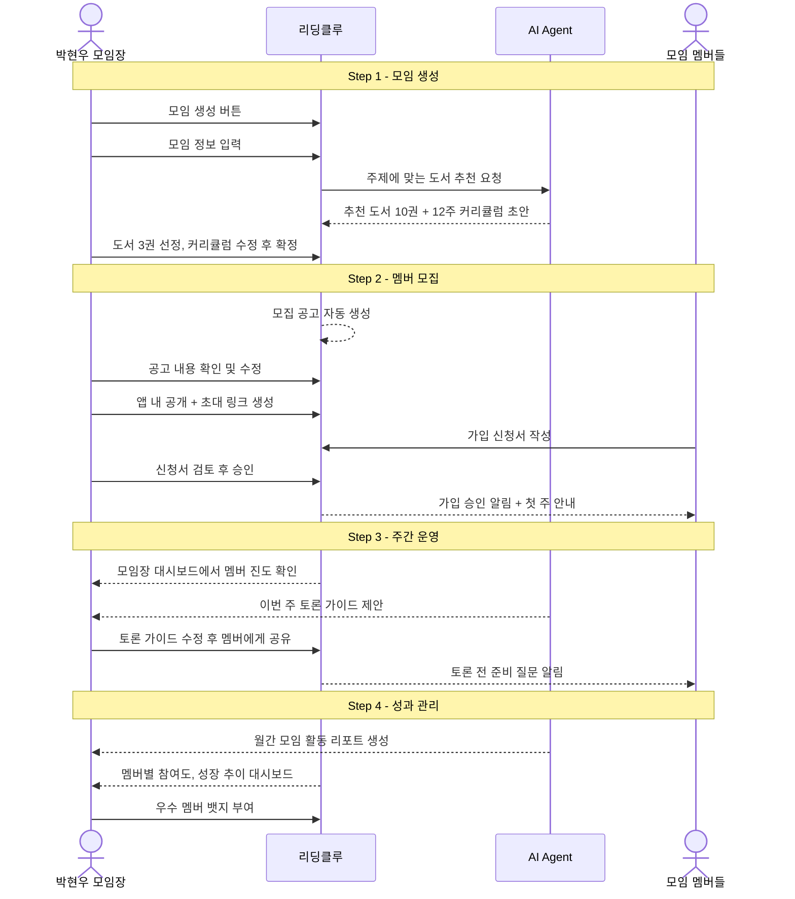
```mermaid
sequenceDiagram
    actor 현우 as 박현우 모임장
    participant 앱 as 리딩클루
    participant AI as AI Agent
    actor 멤버 as 모임 멤버들
    
    Note over 현우,멤버: Step 1 - 모임 생성
    현우->>앱: 모임 생성 버튼
    현우->>앱: 모임 정보 입력
    앱->>AI: 주제에 맞는 도서 추천 요청
    AI-->>앱: 추천 도서 10권 + 12주 커리큘럼 초안
    현우->>앱: 도서 3권 선정, 커리큘럼 수정 후 확정
    
    Note over 현우,멤버: Step 2 - 멤버 모집
    앱-->>앱: 모집 공고 자동 생성
    현우->>앱: 공고 내용 확인 및 수정
    현우->>앱: 앱 내 공개 + 초대 링크 생성
    멤버->>앱: 가입 신청서 작성
    현우->>앱: 신청서 검토 후 승인
    앱-->>멤버: 가입 승인 알림 + 첫 주 안내
    
    Note over 현우,멤버: Step 3 - 주간 운영
    앱-->>현우: 모임장 대시보드에서 멤버 진도 확인
    AI-->>현우: 이번 주 토론 가이드 제안
    현우->>앱: 토론 가이드 수정 후 멤버에게 공유
    앱-->>멤버: 토론 전 준비 질문 알림
    
    Note over 현우,멤버: Step 4 - 성과 관리
    AI-->>현우: 월간 모임 활동 리포트 생성
    앱-->>현우: 멤버별 참여도, 성장 추이 대시보드
    현우->>앱: 우수 멤버 뱃지 부여
```

**모임장 대시보드 핵심 기능**:

| 기능 | 설명 | AI Agent 지원 |
|------|------|-------------|
| **멤버 진도 현황** | 전체 멤버의 읽기 진도를 한눈에 | 진도 부진 멤버에게 자동 독려 메시지 |
| **토론 가이드 생성** | 이번 주 토론 주제와 질문 목록 | AI가 책 내용 기반 토론 가이드 초안 생성 |
| **관점 분석 대시보드** | 멤버들의 관점 분포 시각화 | 의견 대립 포인트 자동 추출 |
| **참여도 히트맵** | 일별/주별 멤버 활동량 시각화 | 참여 저조 시 모임장에게 알림 |
| **모임 성과 리포트** | 월간/분기 모임 활동 요약 | AI가 자동 생성, PDF 내보내기 가능 |

### 8.6 상세 유저 시나리오 4: AI 대화 심화 플로우

> **페르소나**: 최민준 (24세, 대학생, 철학 전공)
> **목표**: AI와 깊이 있는 철학적 토론을 하고 싶다

```
┌─────────────────────────────────────────────────────┐
│  AI 대화 심화 플로우 (탐구 모드 → 토론 모드 → 정리 모드)│
├─────────────────────────────────────────────────────┤
│                                                      │
│  ① 탐구 모드 진입 (사용자가 3장 읽기 완료 후)          │
│  ┌────────────────────────────────────┐              │
│  │ 🤖 AI: 3장의 공리주의 내용 중        │              │
│  │ 가장 동의하기 어려운 부분이 있나요?   │              │
│  │                                    │              │
│  │ 👤 민준: 소수 희생이 정당화되는       │              │
│  │ 부분이요. 1명을 희생해서 5명을        │              │
│  │ 살리는 게 정말 옳은 건지...           │              │
│  │                                    │              │
│  │ 🤖 AI: 흥미로운 고민이에요.          │              │
│  │ 그렇다면 그 1명이 당신의 가족이라면   │              │
│  │ 판단이 달라질까요?                   │              │
│  └────────────────────────────────────┘              │
│                                                      │
│  ② 토론 모드 전환 (사용자가 모드 변경 또는 AI 제안)     │
│  ┌────────────────────────────────────┐              │
│  │ 🤖 AI: 좋습니다. 제가 공리주의를      │              │
│  │ 옹호하는 입장에서 반론을 제시할게요.   │              │
│  │                                    │              │
│  │ 벤담은 이렇게 말했습니다...           │              │
│  │ 하지만 밀은 질적 공리주의로           │              │
│  │ 이 문제를 보완하려 했는데요,          │              │
│  │ 이 접근은 어떻게 보시나요?            │              │
│  │                                    │              │
│  │ 👤 민준: 밀의 구분도 결국            │              │
│  │ 누가 질적 차이를 판단하느냐의         │              │
│  │ 문제가 있지 않나요?                  │              │
│  │                                    │              │
│  │ 🤖 AI: 정확한 지적입니다!            │              │
│  │ [💡 인사이트 감지] 이 관점을          │              │
│  │ 저장하시겠습니까?                    │              │
│  └────────────────────────────────────┘              │
│                                                      │
│  ③ 정리 모드 (대화 종료 시 자동 제안)                   │
│  ┌────────────────────────────────────┐              │
│  │ 📝 오늘의 대화 인사이트 정리          │              │
│  │                                    │              │
│  │ 핵심 논점:                          │              │
│  │ 1. 양적 vs 질적 공리주의의 한계       │              │
│  │ 2. 판단 주체의 권위 문제             │              │
│  │ 3. 개인 윤리와 사회 윤리의 충돌       │              │
│  │                                    │              │
│  │ 사고 성장 포인트:                    │              │
│  │ ✅ 단순 공리주의 비판에서             │              │
│  │    질적 공리주의까지 사고 확장         │              │
│  │ ✅ 메타윤리적 질문으로 발전           │              │
│  │                                    │              │
│  │ 다음에 탐구해볼 질문:                │              │
│  │ → 롤스의 정의론은 이 문제를           │              │
│  │   어떻게 해결하려 했을까?             │              │
│  │                                    │              │
│  │ [📤 모임에 공유] [📁 저장] [🔗 연결] │              │
│  └────────────────────────────────────┘              │
│                                                      │
└─────────────────────────────────────────────────────┘
```

### 8.7 에지 케이스 및 예외 시나리오

| 상황 | 사용자 행동 | 앱 대응 | AI Agent 대응 |
|------|-----------|---------|--------------|
| 책을 등록하지 않고 AI 대화 시도 | 대화 탭 진입 | 책 등록 유도 팝업 | 일반 독서 관련 대화 제공 (책 미지정 모드) |
| 모임 토론 시간에 참석 못함 | 토론방 미접속 | 비동기 관점 공유로 대체 안내 | 토론 요약본 자동 제공 |
| AI 대화가 자신의 수준보다 어려움 | 대화 중 이해 안 됨 표시 | 난이도 조정 옵션 표시 | 쉬운 용어와 예시로 재설명 |
| 모임 멤버 간 갈등 발생 | 부적절한 댓글 신고 | 신고 접수 + 모임장 알림 | 감정 분석으로 갈등 조기 감지 |
| 장기간 비활성 (2주 이상) | 앱 미접속 | 부드러운 복귀 알림 발송 | 지난 활동 요약 + 가벼운 시작점 제안 |
| ISBN 스캔 실패 | 바코드 인식 안 됨 | 수동 검색 대체 UI | 제목/저자 키워드로 자동 검색 |

---

## 9. 주요 화면 구성

### 9.1 화면 맵 (Screen Map)

```mermaid
graph TD
    subgraph "메인 탭"
        H[홈<br/>Home] --> H1[오늘의 독서 현황<br/>모임 알림<br/>추천 인사이트]
        L[내 서재<br/>Library] --> L1[읽고 있는 책<br/>읽은 책<br/>위시리스트]
        M[모임<br/>Clubs] --> M1[내 모임 목록<br/>모임 탐색<br/>모임 생성]
        T[대화<br/>Talk] --> T1[AI 대화방<br/>모임 토론방<br/>관점 게시판]
        P[나<br/>Profile] --> P1[독서 DNA<br/>성장 리포트<br/>설정]
    end
    
    style H fill:#FF6B6B,color:#fff
    style L fill:#4ECDC4,color:#fff
    style M fill:#45B7D1,color:#fff
    style T fill:#96CEB4,color:#fff
    style P fill:#DDA0DD,color:#fff
```

### 9.2 디자인 시스템

#### 컬러 팔레트

| 용도 | 색상명 | HEX 코드 | 사용처 |
|------|--------|----------|--------|
| **Primary** | Clue Blue | `#2B6CB0` | 주요 버튼, 네비게이션 활성 탭, 링크 |
| **Secondary** | Warm Coral | `#E53E3E` | 강조, 알림 뱃지, 중요 액션 |
| **Accent 1** | Insight Green | `#38A169` | AI 대화 관련, 인사이트 태그, 성장 지표 |
| **Accent 2** | Discussion Purple | `#805AD5` | 토론/관점 공유 관련, 모임 뱃지 |
| **Background** | Warm White | `#FFFBF5` | 메인 배경 (따뜻한 독서 분위기) |
| **Surface** | Soft Beige | `#FFF5EB` | 카드 배경, 입력 필드 배경 |
| **Text Primary** | Deep Charcoal | `#1A202C` | 본문 텍스트 |
| **Text Secondary** | Warm Gray | `#718096` | 부가 정보, 힌트 텍스트 |

#### 타이포그래피

| 용도 | 서체 | 크기 | 무게 | 사용처 |
|------|------|------|------|--------|
| 제목 H1 | Pretendard | 24px | Bold | 화면 제목 |
| 제목 H2 | Pretendard | 20px | SemiBold | 섹션 제목 |
| 본문 Large | Pretendard | 17px | Regular | 본문, AI 대화 텍스트 |
| 본문 Regular | Pretendard | 15px | Regular | 일반 텍스트, 리스트 |
| 캡션 | Pretendard | 13px | Regular | 날짜, 메타 정보 |
| 버튼 | Pretendard | 15px | SemiBold | CTA 버튼 |
| **독서 인용문** | KoPub Batang | 17px | Regular | 책 구절 인용, 관점 카드 |

#### 핵심 컴포넌트

| 컴포넌트 | 설명 | 주요 속성 |
|----------|------|----------|
| **BookCard** | 책 표지 + 진도 바 + 제목 | 진도율 표시, 탭하면 책 상세로 이동 |
| **InsightCard** | 관점/인사이트 카드 | 작성자 아바타, 관련 구절, 공감/댓글 수 |
| **ChatBubble** | AI 대화 말풍선 | 사용자(오른쪽 파랑), AI(왼쪽 초록) 구분 |
| **ModeSelector** | 대화 모드 탭 (탐구/토론/정리) | 가로 탭 바, 활성 상태 하이라이트 |
| **ProgressRing** | 원형 진도 표시 | 퍼센트 숫자 + 원형 게이지 |
| **ClubCard** | 모임 카드 | 모임명, 멤버 수, 현재 도서, 다음 모임 일정 |
| **GrowthChart** | 성장 지표 차트 | 레이더/라인 차트, AI 코멘트 연동 |
| **ActionChip** | 액션 칩 버튼 | 인사이트 저장, 공유, 연결 등 빠른 액션 |

### 9.3 주요 화면 상세

| 화면 | 핵심 구성 요소 | 주요 액션 | 네비게이션 |
|------|--------------|----------|-----------|
| **홈** | 오늘의 독서 진도, 모임 일정, 새 인사이트 알림, AI 추천 질문 | 바로 읽기, 대화 시작 | 하단 탭 1번 |
| **내 서재** | 책 목록 (진도 바 포함), 하이라이트 모아보기, 메모 노트 | 읽기 기록, 메모, 하이라이트 | 하단 탭 2번 |
| **책 상세** | 책 정보, 내 메모, 관련 AI 대화, 모임 멤버들의 관점 | AI 대화, 관점 보기, 메모 | 서재에서 진입 |
| **AI 대화방** | 채팅 인터페이스, 모드 선택 (탐구/토론/정리), 대화 히스토리 | 대화, 인사이트 저장 | 하단 탭 4번 또는 책 상세에서 진입 |
| **모임 메인** | 모임 정보, 멤버 목록, 주간 진도, 관점 게시판, 토론 일정 | 관점 공유, 토론 참여 | 모임 탭에서 진입 |
| **모임 탐색** | 필터 (주제, 도서, 지역, 일정), 인기 모임, 새 모임 | 모임 가입, 모임 생성 | 하단 탭 3번 |
| **토론방** | 실시간 채팅, AI 중재, 토론 타이머, 기록 | 발언, 질문, 공감 | 모임 메인에서 진입 |
| **관점 게시판** | 구절별 관점 나열, 관점 비교 뷰, AI 분석 | 관점 작성, 댓글, 공감 | 모임 메인에서 진입 |
| **성장 리포트** | 독서 DNA, 월간 통계, 사고 변화 그래프, AI 코멘트 | 리포트 공유, 목표 설정 | 프로필 탭에서 진입 |
| **독서 DNA** | 관심 분야 차트, 사고 유형, 독서 성향, 추천 도서 | 프로필 공유 | 프로필 탭에서 진입 |

### 9.4 화면 전환 플로우 (Navigation Map)

```mermaid
graph TD
    subgraph "하단 탭 네비게이션"
        T1[홈 탭]
        T2[서재 탭]
        T3[모임 탭]
        T4[대화 탭]
        T5[프로필 탭]
    end

    subgraph "홈 탭 플로우"
        T1 --> H1[오늘의 독서 카드]
        T1 --> H2[모임 일정 카드]
        T1 --> H3[인사이트 피드]
        T1 --> H4[AI 추천 질문]
        H1 --> BD[책 상세]
        H2 --> CM[모임 메인]
        H3 --> IP[관점 상세]
        H4 --> AC[AI 대화방]
    end

    subgraph "서재 탭 플로우"
        T2 --> BL[책 목록]
        BL --> BD
        BD --> AC
        BD --> IP
        BL --> BA[책 등록]
        BA --> BS[ISBN 스캔]
        BA --> BM[수동 검색]
    end

    subgraph "모임 탭 플로우"
        T3 --> CE[모임 탐색]
        T3 --> MC[내 모임 목록]
        CE --> CJ[모임 가입]
        MC --> CM
        CM --> DR[토론방]
        CM --> PB[관점 게시판]
        CM --> ML[멤버 목록]
    end

    subgraph "프로필 탭 플로우"
        T5 --> GR[성장 리포트]
        T5 --> DN[독서 DNA]
        T5 --> ST[설정]
    end

    style T1 fill:#FF6B6B,color:#fff
    style T2 fill:#4ECDC4,color:#fff
    style T3 fill:#45B7D1,color:#fff
    style T4 fill:#96CEB4,color:#fff
    style T5 fill:#DDA0DD,color:#fff
```

### 9.5 화면 와이어프레임 (상세)

#### 홈 화면

```
┌────────────────────────────────┐
│  리딩클루          🔔  👤       │
├────────────────────────────────┤
│                                │
│  📖 오늘의 독서                │
│  ┌──────────────────────────┐  │
│  │ 정의란 무엇인가            │  │
│  │ █████████░░░░  67% (3장)  │  │
│  │ [이어 읽기]  [AI 대화]     │  │
│  └──────────────────────────┘  │
│                                │
│  🗓️ 오늘의 모임 일정           │
│  ┌──────────────────────────┐  │
│  │ 📚 철학 독서 모임           │  │
│  │ 오후 7:00 | 3장 토론       │  │
│  │ 멤버 6/8명 읽기 완료       │  │
│  │ [입장하기]                 │  │
│  └──────────────────────────┘  │
│                                │
│  💡 새로운 인사이트             │
│  ┌──────────────────────────┐  │
│  │ 이서연님이 3장에 관점을 남김 │  │
│  │ "공리주의의 한계..."       │  │
│  │ [보러가기]                 │  │
│  └──────────────────────────┘  │
│                                │
│  🤖 AI 추천 질문               │
│  "3장의 트롤리 딜레마에서       │
│   당신이라면 어떤 선택을?"      │
│  [대화 시작]                   │
│                                │
├────────────────────────────────┤
│  🏠   📚   👥   💬   👤      │
│  홈   서재  모임  대화  나      │
└────────────────────────────────┘
```

#### AI 대화 화면

```
┌────────────────────────────────┐
│  ← AI 독서 대화    ⚙️         │
│  📖 정의란 무엇인가 · 3장      │
├────────────────────────────────┤
│  [탐구] [토론] [정리]   모드    │
├────────────────────────────────┤
│                                │
│  🤖 AI                        │
│  ┌──────────────────────────┐  │
│  │ 3장까지 읽으셨군요!       │  │
│  │ 공리주의에 대해 어떤      │  │
│  │ 생각이 드셨나요?          │  │
│  └──────────────────────────┘  │
│                                │
│              ┌──────────────┐  │
│              │ 최대 다수의   │  │
│              │ 행복이 항상   │  │
│              │ 옳지는 않은   │  │
│              │ 것 같아요     │ 👤│
│              └──────────────┘  │
│                                │
│  🤖 AI                        │
│  ┌──────────────────────────┐  │
│  │ 흥미로운 관점이네요!      │  │
│  │ 어떤 상황에서 공리주의가   │  │
│  │ 문제가 될 수 있을까요?    │  │
│  │                          │  │
│  │ 💡 힌트: 트롤리 딜레마를   │  │
│  │ 생각해보세요              │  │
│  └──────────────────────────┘  │
│                                │
│  ┌──────────────────────┐ 📎  │
│  │ 메시지 입력...         │ ➤  │
│  └──────────────────────┘     │
│  [💾 인사이트 저장] [📤 공유]  │
└────────────────────────────────┘
```

#### 내 서재 화면

```
┌────────────────────────────────┐
│  내 서재            🔍  ＋     │
├────────────────────────────────┤
│  [읽는 중 3] [완독 12] [위시 5] │
├────────────────────────────────┤
│                                │
│  📖 읽는 중인 책                │
│  ┌──────────────────────────┐  │
│  │ 🖼️     정의란 무엇인가      │  │
│  │ 표지    마이클 샌델          │  │
│  │        ████████░░ 67%      │  │
│  │        마지막: 오늘 오후 3시 │  │
│  │        [이어 읽기] [AI 대화] │  │
│  └──────────────────────────┘  │
│                                │
│  ┌──────────────────────────┐  │
│  │ 🖼️     사피엔스             │  │
│  │ 표지    유발 하라리          │  │
│  │        ████░░░░░░ 35%      │  │
│  │        마지막: 어제          │  │
│  │        [이어 읽기] [AI 대화] │  │
│  └──────────────────────────┘  │
│                                │
│  ┌──────────────────────────┐  │
│  │ 🖼️     이기적 유전자        │  │
│  │ 표지    리처드 도킨스        │  │
│  │        ██░░░░░░░░ 12%      │  │
│  │        마지막: 3일 전        │  │
│  │        [이어 읽기] [AI 대화] │  │
│  └──────────────────────────┘  │
│                                │
│  ＋ 새 책 추가                  │
│  [📷 ISBN 스캔]  [🔍 검색 등록] │
│                                │
├────────────────────────────────┤
│  🏠   📚   👥   💬   👤      │
│  홈   서재  모임  대화  나      │
└────────────────────────────────┘
```

#### 모임 탐색 화면

```
┌────────────────────────────────┐
│  독서 모임 탐색     🔍         │
├────────────────────────────────┤
│  [전체] [철학] [심리] [경영]   │
│  [문학] [과학] [역사] [더보기]  │
├────────────────────────────────┤
│  🔥 인기 모임                  │
│                                │
│  ┌──────────────────────────┐  │
│  │ 📚 철학으로 세상 읽기       │  │
│  │ 👥 8/12명 | 📅 매주 토 7PM  │  │
│  │ 📖 정의란 무엇인가 (3주차)  │  │
│  │ 🏷️ #철학 #윤리 #온라인      │  │
│  │ ⭐ 4.8 | 💬 활발함          │  │
│  │ [상세보기]  [가입신청]      │  │
│  └──────────────────────────┘  │
│                                │
│  ┌──────────────────────────┐  │
│  │ 📚 심리학 북클럽            │  │
│  │ 👥 5/8명 | 📅 매주 수 8PM   │  │
│  │ 📖 생각에 관한 생각 (1주차)  │  │
│  │ 🏷️ #심리학 #행동경제 #온라인│  │
│  │ ⭐ 4.6 | 💬 보통            │  │
│  │ [상세보기]  [가입신청]      │  │
│  └──────────────────────────┘  │
│                                │
│  ＋ 새 모임 만들기              │
│                                │
├────────────────────────────────┤
│  🏠   📚   👥   💬   👤      │
│  홈   서재  모임  대화  나      │
└────────────────────────────────┘
```

#### 관점 게시판 화면

```
┌────────────────────────────────┐
│  ← 관점 게시판                  │
│  📖 정의란 무엇인가 · 3장       │
├────────────────────────────────┤
│  [구절별] [최신순] [공감순]      │
├────────────────────────────────┤
│                                │
│  📌 구절 p.87                   │
│  "최대 다수의 최대 행복이        │
│   곧 정의다"                    │
│                                │
│  ── 멤버 관점 ─────────────── │
│                                │
│  👤 김민수                      │
│  "현실에서 가장 실용적인 원칙.   │
│   모든 정책은 결국 다수의        │
│   행복을 목표로 해야..."         │
│  🏷️ #실용주의 #정책              │
│  ❤️ 5  💬 3  🤔 2              │
│                                │
│  👤 이서연                      │
│  "소수의 권리가 무시될 수 있다는  │
│   점에서 위험합니다."            │
│  🏷️ #소수자권리 #비판            │
│  ❤️ 8  💬 5  🤔 4              │
│                                │
│  ── AI 분석 ──────────────── │
│                                │
│  🤖 관점 분석                   │
│  ┌──────────────────────────┐  │
│  │ 핵심 대립: 실용성 vs 권리    │  │
│  │                            │  │
│  │ 토론 포인트:                │  │
│  │ 1. 다수결이 정의인 조건은?  │  │
│  │ 2. 소수 보호의 한계선은?    │  │
│  │                            │  │
│  │ [이 주제로 AI 대화 시작]    │  │
│  └──────────────────────────┘  │
│                                │
│  [✏️ 내 관점 작성하기]          │
│                                │
└────────────────────────────────┘
```

#### 성장 리포트 화면

```
┌────────────────────────────────┐
│  ← 2월 성장 리포트    📤       │
├────────────────────────────────┤
│                                │
│  📊 이번 달 요약                │
│  ┌──────────────────────────┐  │
│  │  📖 3권   💬 24회  🗣️ 8회  │  │
│  │  읽은 책  AI 대화  토론참여  │  │
│  │                            │  │
│  │  💡 15개  🔗 7회   📈 +15%  │  │
│  │ 인사이트  연결짓기  성장률   │  │
│  └──────────────────────────┘  │
│                                │
│  🧬 독서 DNA 변화               │
│  ┌──────────────────────────┐  │
│  │      분석적 사고            │  │
│  │         ◆                  │  │
│  │  비판적 ◆     ◆ 창의적     │  │
│  │         ◆                  │  │
│  │      공감적 사고            │  │
│  │                            │  │
│  │  ─── 이번 달  --- 지난달    │  │
│  └──────────────────────────┘  │
│                                │
│  🤖 AI 코멘트                   │
│  ┌──────────────────────────┐  │
│  │ "지난달 대비 비판적 사고     │  │
│  │  능력이 15% 향상되었습니다.  │  │
│  │  특히 다양한 관점에서 문제를  │  │
│  │  바라보는 능력이 크게        │  │
│  │  성장했습니다.               │  │
│  │                            │  │
│  │  추천: 다음 달에는 자신과    │  │
│  │  다른 관점의 책을 읽어보세요 │  │
│  │  → 이기적 유전자 (추천)"    │  │
│  └──────────────────────────┘  │
│                                │
│  📈 월별 독서량 추이             │
│  │      ■                     │
│  │    ■ ■                     │
│  │  ■ ■ ■ ■                   │
│  │  ■ ■ ■ ■                   │
│  └──────────────────          │
│  11월 12월 1월 2월              │
│                                │
├────────────────────────────────┤
│  🏠   📚   👥   💬   👤      │
│  홈   서재  모임  대화  나      │
└────────────────────────────────┘
```

### 9.6 인터랙션 패턴

| 인터랙션 | 패턴 | 설명 |
|----------|------|------|
| **책 등록** | ISBN 스캔 → 자동 인식 → 확인 → 서재 추가 | 카메라로 바코드 스캔, 1초 내 인식 |
| **진도 업데이트** | 슬라이더 드래그 또는 페이지 번호 입력 | 진도 변경 시 AI가 해당 부분 관련 질문 제안 |
| **AI 대화 시작** | 책 선택 → 모드 선택 → 대화 시작 | 이전 대화 이어하기 옵션 제공 |
| **인사이트 저장** | AI 대화 중 롱프레스 → 인사이트 저장 | 관련 구절 자동 태깅 |
| **관점 공유** | 인사이트 카드 → 공유 버튼 → 모임 선택 | 해시태그 자동 제안 |
| **토론 참여** | 알림 탭 → 토론방 입장 → 발언 | 발언 타이머, 순서 관리 AI |
| **Pull to Refresh** | 아래로 당기기 → 새 데이터 로드 | 홈, 서재, 모임 탭 공통 |
| **스와이프 액션** | 책 카드 좌 스와이프 → 빠른 액션 | 삭제, 완독 처리, 모임에 추천 |

---

## 10. 기술 스택과 아키텍처

### 10.1 시스템 아키텍처

```mermaid
graph TB
    subgraph "클라이언트"
        A[iOS App<br/>Swift/SwiftUI]
        B[Android App<br/>Kotlin/Compose]
        C[Web App<br/>React/Next.js]
    end
    
    subgraph "API Gateway"
        D[API Gateway<br/>인증/라우팅/제한]
    end
    
    subgraph "백엔드 서비스"
        E[사용자 서비스<br/>회원/인증]
        F[독서 서비스<br/>책/기록/진도]
        G[모임 서비스<br/>모임/일정/멤버]
        H[대화 서비스<br/>AI 대화/토론]
        I[분석 서비스<br/>성장/통계/추천]
    end
    
    subgraph "AI 엔진"
        J[LLM API<br/>GPT/Claude]
        K[프롬프트 관리<br/>모드별 프롬프트]
        L[컨텍스트 관리<br/>책 내용/대화 이력]
    end
    
    subgraph "데이터 저장"
        M[(PostgreSQL<br/>관계형 데이터)]
        N[(Redis<br/>캐시/세션)]
        O[(S3<br/>미디어 저장)]
        P[(Elasticsearch<br/>검색 엔진)]
    end
    
    subgraph "실시간 통신"
        Q[WebSocket<br/>채팅/토론]
        R[WebRTC<br/>음성/화상]
    end
    
    A --> D
    B --> D
    C --> D
    D --> E
    D --> F
    D --> G
    D --> H
    D --> I
    H --> J
    H --> K
    H --> L
    E --> M
    F --> M
    G --> M
    H --> M
    I --> M
    E --> N
    F --> N
    G --> N
    H --> N
    I --> N
    I --> P
    Q --> H
    Q --> G
    R --> G
    
    style J fill:#FF6B6B,color:#fff
    style K fill:#FF6B6B,color:#fff
    style L fill:#FF6B6B,color:#fff
```

### 10.2 기술 스택 비교표

| 영역 | 옵션 A | 옵션 B | 추천 | 이유 |
|------|--------|--------|------|------|
| **모바일 앱** | React Native | Flutter | **Flutter** | 성능 우수, 단일 코드베이스 |
| **웹 프론트** | React + Next.js | Vue + Nuxt | **Next.js** | SSR 지원, 생태계 풍부 |
| **백엔드** | Node.js (NestJS) | Python (FastAPI) | **NestJS** | 타입 안전성, 구조화 |
| **AI API** | OpenAI GPT | Anthropic Claude | **Claude** | 긴 맥락 처리, 안전성 |
| **DB** | PostgreSQL | MySQL | **PostgreSQL** | JSON 지원, 확장성 |
| **실시간** | Socket.IO | Ably | **Socket.IO** | 자유도 높음, 무료 |
| **음성/화상** | WebRTC + Twilio | Agora | **Agora** | 구현 용이, 안정적 |
| **검색** | Elasticsearch | Algolia | **Algolia** | 관리 편의, 속도 |
| **배포** | AWS | GCP | **AWS** | 서비스 다양성, 한국 리전 |
| **CI/CD** | GitHub Actions | GitLab CI | **GitHub Actions** | GitHub 통합 |

### 10.3 AI 엔진 상세 아키텍처

```mermaid
graph LR
    subgraph "입력"
        A[사용자 메시지]
        B[현재 읽는 책 정보]
        C[읽기 진도 & 메모]
        D[대화 히스토리]
        E[사용자 프로필]
    end
    
    subgraph "AI 파이프라인"
        F[컨텍스트 조합기] --> G[모드 선택기]
        G --> H{대화 모드}
        H -->|탐구| I[소크라테스 프롬프트]
        H -->|토론| J[반론 프롬프트]
        H -->|정리| K[요약 프롬프트]
        I --> L[LLM 호출]
        J --> L
        K --> L
        L --> M[응답 후처리]
        M --> N[인사이트 추출기]
    end
    
    subgraph "출력"
        O[AI 응답]
        P[추출된 인사이트]
        Q[토론 포인트]
    end
    
    A --> F
    B --> F
    C --> F
    D --> F
    E --> F
    M --> O
    N --> P
    N --> Q
    
    style L fill:#FF6B6B,color:#fff
```

---

## 11. 개발 로드맵

### 11.1 전체 로드맵

```mermaid
gantt
    title 리딩클루 개발 로드맵
    dateFormat YYYY-MM-DD

    section Phase 1 MVP
    시장 조사 및 기획          :a1, 2026-03-01, 30d
    UI UX 디자인              :a2, 2026-04-01, 30d
    핵심 기능 개발             :a3, 2026-04-01, 90d
    AI 대화 엔진 개발          :a4, 2026-05-01, 60d
    내부 테스트 알파            :a5, 2026-07-01, 30d

    section Phase 2 베타
    모임 시스템 개발            :b1, 2026-07-01, 60d
    관점 공유 시스템 개발        :b2, 2026-08-01, 60d
    베타 테스트 50명            :b3, 2026-09-01, 60d
    피드백 반영 및 개선          :b4, 2026-10-01, 30d

    section Phase 3 정식출시
    성장 분석 시스템 개발        :c1, 2026-10-01, 60d
    실시간 토론 기능             :c2, 2026-11-01, 60d
    앱스토어 출시               :c3, 2026-12-01, 30d
    마케팅 캠페인               :c4, 2026-12-01, 60d

    section Phase 4 확장
    음성 화상 토론               :d1, 2027-02-01, 60d
    멘토 시스템                  :d2, 2027-03-01, 60d
    프로젝트 모임                :d3, 2027-04-01, 60d
    글로벌 확장                  :d4, 2027-06-01, 90d
```

### 11.2 Phase별 상세

| Phase | 기간 | 핵심 기능 | 목표 | KPI |
|-------|------|----------|------|-----|
| **Phase 1<br/>MVP** | 3개월 | 개인 독서 기록<br/>AI 대화 (기본)<br/>회원 가입/프로필 | 핵심 가치 검증 | DAU 100명<br/>AI 대화 만족도 4.0/5.0 |
| **Phase 2<br/>베타** | 3개월 | 모임 생성/운영<br/>관점 공유<br/>비동기 토론 | 커뮤니티 검증 | 모임 30개<br/>관점 공유 500개/월 |
| **Phase 3<br/>출시** | 3개월 | 성장 분석<br/>실시간 토론<br/>앱스토어 출시 | 시장 진입 | DAU 1,000명<br/>유료 전환 5% |
| **Phase 4<br/>확장** | 6개월 | 음성/화상<br/>멘토 시스템<br/>프로젝트 모임 | 성장 & 확장 | DAU 10,000명<br/>모임 500개 |

### 11.3 MVP 핵심 기능 (반드시 먼저 만들 것)

```mermaid
graph TD
    subgraph "MVP 필수 (Phase 1)"
        A[회원가입/로그인]
        B[책 등록 & 독서 기록]
        C[AI 독서 대화<br/>탐구 모드]
        D[인사이트 메모]
    end
    
    subgraph "핵심 확장 (Phase 2)"
        E[모임 생성/가입]
        F[관점 공유 게시판]
        G[비동기 댓글 토론]
        H[주간 진도 관리]
    end
    
    subgraph "완성 (Phase 3)"
        I[성장 리포트]
        J[실시간 채팅 토론]
        K[독서 DNA]
        L[알림 시스템]
    end
    
    subgraph "확장 (Phase 4)"
        M[음성/화상 토론]
        N[멘토 시스템]
        O[프로젝트 모임]
        P[글로벌/다국어]
    end
    
    A --> E --> I --> M
    B --> F --> J --> N
    C --> G --> K --> O
    D --> H --> L --> P
    
    style A fill:#FF6B6B,color:#fff
    style B fill:#FF6B6B,color:#fff
    style C fill:#FF6B6B,color:#fff
    style D fill:#FF6B6B,color:#fff
```

---

## 12. 수익 모델과 운영 전략

### 12.1 수익 모델

```mermaid
graph TD
    subgraph "수익원"
        A[프리미엄 구독<br/>월 9,900원] --> A1[AI 대화 무제한<br/>모임 생성<br/>심화 분석]
        B[모임 수수료<br/>유료 모임의 10%] --> B1[멘토 운영 유료 모임<br/>특별 세미나]
        C[B2B 교육 라이선스<br/>기관별 협의] --> C1[학교/도서관/기업<br/>단체 구독]
        D[프리미엄 콘텐츠<br/>건당 과금] --> D1[전문가 큐레이션<br/>독서 가이드]
    end
    
    style A fill:#4ECDC4,color:#fff
    style B fill:#45B7D1,color:#fff
    style C fill:#96CEB4,color:#fff
    style D fill:#DDA0DD,color:#fff
```

### 12.2 요금제 비교

| 항목 | 무료 (Free) | 프리미엄 (Premium) | 교육기관 (Edu) |
|------|------------|-------------------|---------------|
| **가격** | 0원 | 월 9,900원 (연 99,000원) | 협의 |
| **AI 대화** | 3회/일 | 무제한 | 무제한 |
| **독서 기록** | O | O | O |
| **모임 참여** | 1개 | 무제한 | 무제한 |
| **모임 생성** | X | O (5개까지) | O (무제한) |
| **관점 공유** | O | O | O |
| **성장 리포트** | 기본 | 심화 + AI 분석 | 심화 + 관리 대시보드 |
| **독서 DNA** | X | O | O |
| **실시간 토론** | 텍스트만 | 음성 + 화상 | 음성 + 화상 |
| **토론 기록** | 최근 30일 | 무제한 보관 | 무제한 + 내보내기 |
| **운영 도구** | X | X | O (학생 관리, 과제) |
| **광고** | 최소 | 없음 | 없음 |

### 12.3 운영 전략

| 전략 | 내용 | 시기 |
|------|------|------|
| **씨앗 커뮤니티** | 독서 모임 리더 50명 선발, 무료 프리미엄 제공 | 베타 전 |
| **도서관 파트너십** | 공공도서관 10곳과 시범 운영 | 출시 직후 |
| **인플루언서 협업** | 북튜버, 독서 인플루언서와 콘텐츠 제작 | 출시 1개월 |
| **학교 시범사업** | 독서중점학교 5곳 무료 지원 | 출시 3개월 |
| **독서 챌린지** | 월간 독서 챌린지 이벤트 | 매월 |
| **작가 초청** | 작가와 함께하는 특별 독서 모임 | 분기 1회 |

### 12.4 성장 시나리오

```mermaid
graph LR
    subgraph "Year 1"
        Y1[출시 6개월<br/>DAU 1,000<br/>모임 50개<br/>수익 500만/월]
    end
    
    subgraph "Year 2"
        Y2[12개월<br/>DAU 10,000<br/>모임 500개<br/>수익 3,000만/월]
    end
    
    subgraph "Year 3"
        Y3[24개월<br/>DAU 50,000<br/>모임 2,000개<br/>수익 1.5억/월]
    end
    
    Y1 --> Y2 --> Y3
    
    style Y1 fill:#e1f5ff,color:#111
    style Y2 fill:#fff3e1,color:#111
    style Y3 fill:#ccffcc,color:#111
```

---

## 부록: 추가 아이디어

### A. 독서 게이미피케이션

| 요소 | 설명 | 목적 |
|------|------|------|
| **독서 레벨** | Lv.1 초보 독서가 → Lv.50 마스터 | 장기 동기 부여 |
| **뱃지 시스템** | "연속 7일 독서", "첫 토론 참여" 등 | 행동 유도 |
| **독서 스트릭** | 연속 독서 일수 카운트 | 습관 형성 |
| **모임 랭킹** | 활발한 모임 Top 10 | 모임 활성화 |
| **인사이트 좋아요** | 좋은 관점에 공감 표시 | 양질의 콘텐츠 |

### B. 확장 가능 기능

| 기능 | 설명 | 우선순위 |
|------|------|---------|
| **독서 매칭** | 비슷한 취향의 독서 파트너 매칭 | 중 |
| **책 추천 AI** | 독서 이력 기반 맞춤 추천 | 높음 |
| **독서 타이머** | 뽀모도로 기반 집중 읽기 | 낮음 |
| **외부 서비스 연동** | 밀리의 서재, 리디북스 독서 기록 가져오기 | 중 |
| **독서 일기** | 매일의 독서 감상을 일기로 | 중 |
| **글쓰기 워크숍** | 독서 기반 글쓰기 프로젝트 | 낮음 |
| **번역 독서** | 원서와 번역서 동시 읽기 | 낮음 |
| **AR 독서** | 종이책 위에 디지털 메모 증강현실 | 낮음 (미래) |

### C. 핵심 성공 지표 (KPI)

| 카테고리 | 지표 | 목표 (출시 6개월) |
|----------|------|-----------------|
| **사용자** | DAU / MAU | 1,000 / 5,000 |
| **리텐션** | D7 리텐션 | 40% 이상 |
| **AI 대화** | 일 평균 대화 횟수 | 3회/사용자 |
| **모임** | 활성 모임 수 | 50개 이상 |
| **관점 공유** | 월 관점 게시 수 | 500개 이상 |
| **토론** | 주간 토론 세션 수 | 30회 이상 |
| **수익** | 유료 전환율 | 5% 이상 |
| **만족도** | 앱스토어 평점 | 4.5 이상 |

---

## 정리: 리딩클루가 만들고 싶은 세상

```mermaid
mindmap
  root((리딩클루의<br/>비전))
    혼자 읽지 않는 세상
      모든 독서가 대화가 되고
      모든 대화가 성장이 되는
    AI가 동반자인 세상
      24시간 토론 파트너
      사고를 확장하는 질문
      편향 없는 다각적 관점
    관점이 만나는 세상
      같은 책 다른 생각
      서로의 시각에서 배우기
      더 넓은 세계관
    기록이 남는 세상
      모든 인사이트가 축적
      사고의 성장을 추적
      나만의 지적 여정
```

> **"책 한 권을 혼자 읽으면 지식이 되고,**
> **함께 읽고 대화하면 지혜가 되며,**
> **AI와 함께 탐구하면 통찰이 된다."**
>
> — 리딩클루의 철학

---

*이 문서는 리딩클루(ReadingClue) 앱의 아이디어 기획 단계 문서입니다.*
*실제 개발 시 시장 조사, 사용자 인터뷰, 기술 검증을 추가로 진행해야 합니다.*
