# 🔭 2032 융합인재 설계서 — 미네르바 렌즈로 '진짜 질문' 찾기

> **교체 대상**: `학년별_프로젝트_아이디어_100선.md`, `융합형_프로젝트_100선.md`, `학년별_페르소나_생활패턴_가이드.md`의 **설계 철학**
> **핵심 전환**: "좋은 아이디어 200개를 고른다" → **"내 앞의 상황에서 진짜 문제를 스스로 정의한다"**
> **방법론**: 미네르바 스쿨 HC(Habits of Mind & Foundational Concepts) 렌즈 + 문제 재정의 프로토콜
> **기준 연도**: 2032년 (AI가 '실행'을 대부분 대신하는 시대)
> **대입 연계**: 이 설계서의 모든 프로젝트는 **2032 대학 입시 포트폴리오**로 직결된다

---

## 0. 왜 다시 쓰는가 — 기존 문서의 3가지 한계

| 기존 방식 | 2032년에 무너지는 이유 | 새 방식 |
|---|---|---|
| **아이디어 200개 목록 제공** | AI가 아이디어를 무한 생성. 목록의 희소가치 = 0 | 아이디어를 **주지 않고**, 아이디어를 *걸러내는 렌즈*를 준다 |
| **"문제 → 솔루션 → 수익" 3줄 요약** | 문제 정의가 이미 완료된 상태로 주어짐. 가장 중요한 근육을 건너뜀 | **문제 정의 자체를 과제화**. 솔루션은 마지막 10% |
| **"월 수익 300만원" 식 성과 지표** | 실행 비용이 0에 수렴 → 수익 예측은 학습 지표로 무의미 | **판단의 질**로 평가: 문제 정의력, 반증 견딤, 근거 강도 |

> **한 문장**: 2032년의 희소 자원은 답도, 실행력도 아니고 **"무엇을 물을 것인가"** 다.

---

## 0-1. 2032 대학 입시가 원하는 인재상 — 왜 '진짜 질문'이 합격을 결정하는가

### 입시 환경의 구조적 변화

2032년 대학은 더 이상 **"무엇을 아는 학생"**을 뽑지 않는다. AI가 모든 지식을 즉시 검색하고 합성하는 시대에, 대학이 원하는 건 **"무엇을 물어야 하는지 아는 학생"**이다.

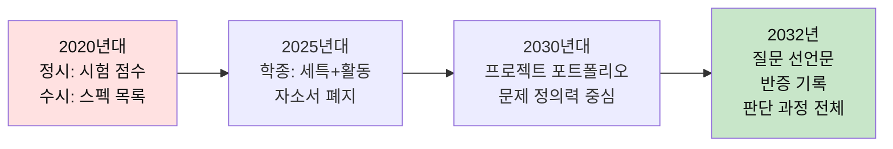

### 2032 대입에서 평가하는 것 vs 평가하지 않는 것

| 평가하는 것 (= 이 설계서가 훈련하는 것) | 평가하지 않는 것 (= AI가 대신하는 것) |
|---|---|
| **문제를 정의하는 과정** | 문제의 답 |
| **가설이 죽은 기록** | 성공한 결과물 |
| **1차 데이터를 직접 만든 증거** | AI로 요약한 2차 자료 |
| **렌즈 교차에서 나온 새 관점** | 단일 분야 깊이 |
| **반대편을 만나본 기록** | 한쪽 입장 완성도 |
| **AI에 맡기지 않은 이유의 논증** | AI 활용 능력 자체 |
| **실패에서 배운 것의 정확한 서술** | 성공 스토리 포장 |

### 대입 포트폴리오 = 이 설계서의 최종 산출물

이 설계서를 따라 프로젝트를 완성하면, 최종 산출물 자체가 대입 포트폴리오가 된다.

```
📁 나의 프로젝트 포트폴리오
├── 질문 선언문 (왜 이 문제를 골랐는가)
├── 마찰 로그 원본 (20건의 관찰 기록)
├── 렌즈 교차 분석서 (최소 3개 렌즈 충돌 기록)
├── 1차 데이터 (직접 측정·인터뷰·실험)
├── 반대편 인터뷰 기록 (실존 인물)
├── 반증 실험 로그 (가설이 죽은 날짜와 이유)
├── 3층 독서 기록 (정의서·도구서·반증서)
├── AI 사용 로그 ("내가 버린 것과 이유")
├── 프로토타입 (최소 실험 결과)
└── 최종 보고서 (실패 포함)
```

> **핵심**: 이 포트폴리오는 **만들어서 제출하는 것**이 아니라, **프로젝트를 하면 자연스럽게 쌓이는 것**이다.
> 제출용으로 따로 만드는 순간 가짜가 된다. 이 설계서를 따르면 과정 자체가 증거다.

---

## 0-2. 인간 관심사 20개 — 프로젝트의 출발점

프로젝트 주제를 고를 때 가장 흔한 실수는 **"핫한 분야"**를 찾는 것이다.
AI, 블록체인, 메타버스 — 유행은 3년이면 바뀐다. 하지만 인간이 평생 붙잡고 사는 문제는 **20개 남짓**이다.

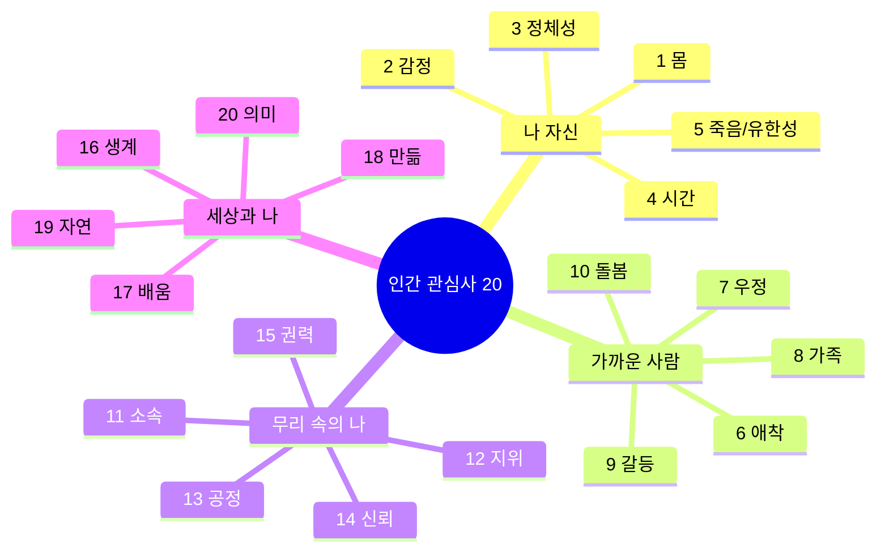

**왜 이 20개인가?**
- 이 20개는 **초4도, 고2도, 대3도, 80세도** 똑같이 붙잡고 있다
- 달라지는 것은 주제가 아니라 **질문의 해상도**다
- 유행 주제는 3년이면 사라지지만, "나는 왜 외로운가"는 **평생 기억된다**
- 대학은 "AI 전문가"를 원하는 게 아니라 **"인간 문제에 깊이 파고든 사람"**을 원한다

### 융합의 진짜 의미

**융합 ≠ 두 분야를 섞는 것**
**융합 = 같은 문제를 다른 렌즈로 보는 것**

예: "청소년 외로움" 프로젝트
- ❌ 잘못된 융합: 심리학 + IT = 외로움 측정 앱 (분야 결합)
- ⭕ 진짜 융합: L7(분석수준) + L6(시스템역학) + L12(반대편) = "외로움은 개인 문제인가 구조 문제인가? 혼자 있고 싶은 사람에게 '연결'은 폭력인가?" (렌즈 충돌)

---

## 1. 전체 구조

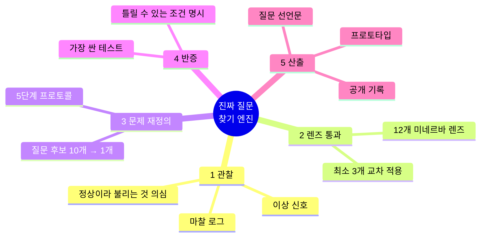

### 전체 흐름: 관심사 → 질문 → 프로젝트 → 포트폴리오

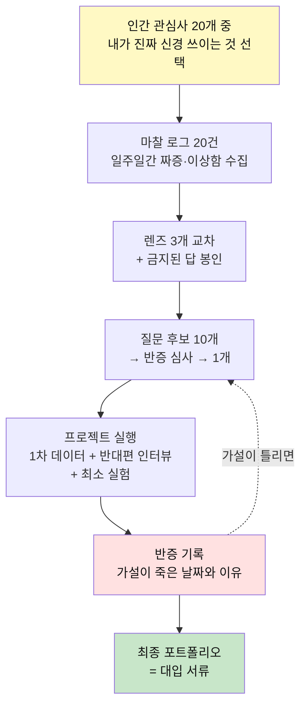

---

## 2. 핵심 12 렌즈 (미네르바 HC 기반, 학생용 번역)

각 렌즈는 **"이 렌즈를 끼면 보이는 것"**과 **"학생이 실제로 던지는 질문"** 한 쌍으로 구성한다.
프로젝트 하나에 **최소 3개 렌즈를 교차**시키는 것이 규칙이다. (1개만 쓰면 그냥 감상문이 된다)

### A. 문제를 세우는 렌즈 (4개)

| # | 렌즈 | 보이는 것 | 학생이 던지는 질문 |
|---|---|---|---|
| **L1** | **#진짜문제**<br/>(rightproblem) | 눈에 보이는 불편은 대개 *증상*이다 | "이건 문제인가, 아니면 다른 문제의 그림자인가?" |
| **L2** | **#분해**<br/>(breakitdown) | 큰 덩어리는 판단 불가. 쪼개야 손에 잡힘 | "이 문제를 서로 겹치지 않는 3조각으로 자르면?" |
| **L3** | **#제약조건**<br/>(constraints) | 제약이 없으면 설계도 없다 | "돈·시간·권한 중 진짜로 못 넘는 벽은 무엇인가?" |
| **L4** | **#격차분석**<br/>(gapanalysis) | 문제 = 현재 상태와 목표 상태의 거리 | "지금 A인데 B이길 원한다. 그 사이 정확히 무엇이 비어 있나?" |

#### L1 상세 — 진짜 문제 찾기의 기술

**증상과 문제를 구분하는 5가지 테스트**

| 테스트 | 질문 | 증상이면 | 문제이면 |
|---|---|---|---|
| **반복 테스트** | 이걸 고쳐도 비슷한 일이 반복되는가? | 반복된다 → 증상 | 반복 안 된다 → 문제일 가능성 |
| **층위 테스트** | 이건 개인/규칙/문화 중 어디에 있나? | 개인 탓이면 대개 증상 | 규칙·문화 탓이면 문제에 가까움 |
| **주인 테스트** | 이 문제의 주인은 누구인가? | 주인이 안 보인다 → 증상 | 주인을 지목할 수 있다 → 문제 |
| **5분 테스트** | 5분 만에 해결책이 떠오르는가? | 떠오른다 → 증상 (너무 쉬움) | 안 떠오른다 → 문제 |
| **AI 테스트** | AI에게 물어보면 답이 나오는가? | 나온다 → 이미 알려진 것 | 안 나온다 → 진짜 미해결 |

**대입에서 이게 왜 중요한가:**
면접관이 "왜 이 문제를 골랐나요?"라고 물었을 때, "관심이 있어서요"는 1점이고
"처음엔 X가 문제라고 생각했는데, 파고 보니 X는 Y의 증상이었고, 진짜 문제는 Z였습니다"가 5점이다.

#### L2 상세 — MECE 분해법

**MECE = Mutually Exclusive, Collectively Exhaustive (겹치지 않고, 빠짐없이)**

```
❌ 나쁜 분해:
  "학교 급식이 맛없다"
  → 메뉴가 별로 / 조리법이 별로 / 재료가 별로
  (전부 겹친다. "메뉴"와 "재료"는 같은 얘기)

⭕ 좋은 분해 (MECE):
  "학교 급식이 맛없다"
  → 1. 입맛 문제 (개인 선호와 메뉴 사이 격차)
  → 2. 조리 환경 문제 (시간·인력·장비 제약)
  → 3. 구조 문제 (급식비·납품 구조·영양 기준)
  (서로 겹치지 않고, 합치면 전체를 덮는다)
```

#### L3 상세 — 제약 조건 삼각형

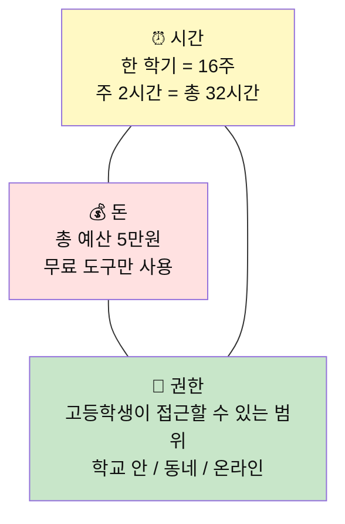

**제약은 적이 아니라 설계의 시작이다.**
"돈이 없어서 못 하겠다"는 1점.
"돈이 없기 때문에, 돈으로 풀 수 없는 문제만 남았고, 그게 진짜 문제다"가 5점.

#### L4 상세 — 격차 지도 그리기

```
현재 상태 (As-Is):
  우리 학교 학생 80%가 진로를 "아직 모르겠다"고 답한다.

목표 상태 (To-Be):
  "모르겠다"가 "이걸 더 알아보고 싶다"로 바뀐다.
  (주의: "진로를 정한다"가 아니다. 그건 다른 문제다)

격차 (Gap):
  1. 정보 격차? → AI가 정보를 다 줌 → 이건 격차가 아님
  2. 경험 격차? → 해본 적이 없어서 → 이건 격차일 수 있음
  3. 질문 격차? → 뭘 물어야 할지 모름 → 이게 진짜 격차
```

### B. 원인을 파는 렌즈 (4개)

| # | 렌즈 | 보이는 것 | 학생이 던지는 질문 |
|---|---|---|---|
| **L5** | **#다중원인**<br/>(multiplecauses) | 원인 하나짜리 문제는 거의 없다 | "범인을 3명 더 대보라면 누구인가?" |
| **L6** | **#시스템역학**<br/>(systemdynamics) | 눌렀더니 다른 데가 튀어나온다 | "이걸 고치면 **어디가 나빠지는가**?" |
| **L7** | **#분석수준**<br/>(levelsofanalysis) | 개인 탓인지, 구조 탓인지 | "이건 그 사람 문제인가, 규칙 문제인가, 문화 문제인가?" |
| **L8** | **#맥락**<br/>(context) | 같은 행동도 상황이 바뀌면 뜻이 달라짐 | "이 문제는 다른 학교/나라/시대에도 문제인가?" |

#### L5 상세 — 원인 지도 그리기 실전

**규칙: 원인 최소 5개, 갈래 3개 이상**

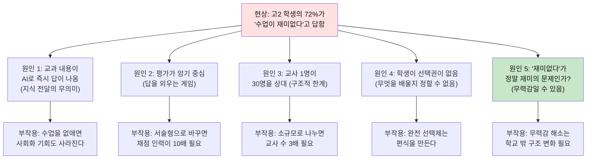

> **핵심**: 원인 5번이 가장 깊다. "재미없다"는 증상이고 진짜는 "무력감"일 수 있다.
> 이걸 발견하려면 **원인을 5개 이상 써봐야** 한다. 3개에서 멈추면 뻔한 데서 끝난다.

#### L6 상세 — 2차 효과 시뮬레이션

**내가 제안한 해결책이 성공했을 때 나빠지는 것을 3개 이상 쓴다.**

이것이 대입 면접에서 결정적이다. "저는 이걸 해결했습니다"보다
"이걸 해결하면 이런 부작용이 생긴다는 걸 미리 발견했고, 그래서 설계를 이렇게 바꿨습니다"가 압도적으로 강하다.

```
해결책: 수업 중 학생이 질문을 자유롭게 하게 한다
2차 효과:
  1. 소수 학생이 시간을 독점한다 → 다수가 피해
  2. 교사의 수업 진도가 무너진다 → 평가 범위 문제
  3. 질문 자체가 평가 대상이 되면 → 자발성이 죽는다

→ 재설계: 질문을 '하는 것'이 아니라 '쓰는 것'으로 바꾸면?
  (시간 독점 없이, 진도에 영향 없이, 평가 부담 없이)
```

#### L7 상세 — 분석 수준 3층 모델

```
모든 사회 문제는 3개 층에 동시에 존재한다.
학생은 보통 '개인 층'에서만 본다. 그래서 "사람 탓"으로 끝난다.

층 1 (개인): "그 사람이 게을러서" / "내가 부족해서"
층 2 (규칙): "인센티브가 잘못 설계되어서" / "벌칙만 있고 보상이 없어서"
층 3 (문화): "다들 그런 거라고 생각해서" / "말하면 이상한 사람 취급받아서"

💡 규칙:
- 층 1에서 멈추면 감상문
- 층 2까지 가면 분석
- 층 3까지 가면 통찰

대입에서:
- "개인의 노력이 부족하다" → 누구나 하는 말
- "구조가 노력을 방해한다" → 분석
- "이걸 문제로 보지 않는 문화가 구조를 유지한다" → 이 학생은 다르다
```

#### L8 상세 — 맥락 이동 실험

```
같은 문제를 4가지 맥락으로 이동시킨다:

맥락 1 (다른 학교): "이 문제는 다른 학교에도 있는가?"
맥락 2 (다른 나라): "이 문제는 핀란드/일본/미국에도 있는가?"
맥락 3 (다른 시대): "이 문제는 20년 전에도 있었는가?"
맥락 4 (극단 조건): "이 문제가 100배 심해지면 어떤 모습인가?"

→ 4가지 맥락에서 모두 존재하면: 인간의 보편적 문제
→ 특정 맥락에서만 존재하면: 그 맥락의 구조적 문제
→ 어디에도 없으면: 내가 문제를 잘못 정의한 것
```

### C. 판단을 검증하는 렌즈 (4개)

| # | 렌즈 | 보이는 것 | 학생이 던지는 질문 |
|---|---|---|---|
| **L9** | **#근거의질**<br/>(sourcequality) | 출처가 약하면 결론도 약하다 | "이 숫자는 누가, 왜, 어떻게 만들었는가?" |
| **L10** | **#반증가능성**<br/>(testability) | 틀릴 수 없는 주장은 쓸모없다 | "내가 틀렸다면 **무엇이 관찰**되어야 하는가?" |
| **L11** | **#편향점검**<br/>(biasmitigation) | 나·AI 모두 치우쳐 있다 | "이 결론이 나에게 유리해서 마음에 드는 건 아닌가?" |
| **L12** | **#해석렌즈**<br/>(interpretivelens) | 같은 사실도 입장에 따라 다르게 읽힌다 | "가장 강하게 반대할 사람은 뭐라고 말할까?" |

#### L9 상세 — 근거의 질 판정표

| 근거 등급 | 설명 | 예시 | 대입 점수 |
|---|---|---|---|
| **S등급** | 내가 직접 만든 1차 데이터 | 2주간 측정한 수면 기록, 30명 인터뷰 | 5점 |
| **A등급** | 원논문·원통계에서 직접 확인 | 통계청 원자료 열어서 직접 분석 | 4점 |
| **B등급** | 신뢰할 수 있는 2차 자료 | 학술지 리뷰 논문, 공인 기관 보고서 | 3점 |
| **C등급** | 언론 기사, 블로그 | "~라고 한다"식 인용 | 2점 |
| **F등급** | AI 요약, 출처 불명 | ChatGPT가 알려줬다 | 0점 |

> **대입 핵심**: S등급 근거 1개가 B등급 10개보다 강하다.
> "직접 만든 데이터가 있다"는 것은 이 학생이 **현장에 갔다**는 증거다.

#### L10 상세 — 반증 가능성 체크

```
나의 주장: "익명으로 질문할 수 있게 하면 참여율이 올라간다"

반증 조건 (이렇게 되면 내가 틀린 것):
  1. 익명 채널을 열었는데 참여율이 오르지 않는다
  2. 참여율은 올랐지만 질문의 질이 떨어진다
  3. 익명이라 무책임한 질문이 늘어난다

가장 싼 테스트:
  → 1주일간 익명 질문함을 교실에 놓고, 참여율과 질문 내용을 측정한다
  → 비용: 종이함 1개 = 0원 / 시간: 1주일
```

> **반증 조건을 못 쓰면 그 주장은 쓸모없다.**
> "세계 평화가 중요하다"는 맞는 말이지만, 반증할 수 없으므로 프로젝트가 될 수 없다.

#### L11 상세 — 편향 자가진단 7문항

프로젝트 중간에 반드시 이 7문항을 거친다:

1. **확증 편향**: 내 생각을 지지하는 자료만 모으고 있지 않은가?
2. **가용성 편향**: 최근에 본 사례가 대표적이라고 착각하고 있지 않은가?
3. **생존자 편향**: 성공 사례만 보고, 실패 사례를 무시하고 있지 않은가?
4. **앵커링**: 처음 세운 가설에 집착하고 있지 않은가?
5. **밴드왜건**: 남들이 다 하니까 따라가고 있지 않은가?
6. **감정 편향**: 이 결론이 나에게 유리하거나, 기분이 좋아서 선택한 건 아닌가?
7. **AI 편향**: AI가 준 프레임을 그대로 쓰고 있지 않은가?

#### L12 상세 — 반대편 대변인 프로토콜

```
STEP 1: 내 결론을 한 문장으로 쓴다
STEP 2: 이 결론으로 가장 손해 보는 사람을 지목한다
STEP 3: 그 사람의 입장에서 반론 3개를 직접 쓴다
STEP 4: 가능하면 실제로 그 입장의 사람을 만나 인터뷰한다
STEP 5: 인터뷰 후 내 결론이 바뀌었는지 기록한다
```

> 📌 **2032 추가 규칙 — L11의 AI 확장**
> AI가 준 답에는 항상 이 세 질문을 붙인다: ① 이 답의 **훈련 데이터는 언제·누구의 것**인가 ② 이 답이 **가정하고 있는 것**은 무엇인가 ③ 이 답을 **내가 검증할 수 있는 최소 실험**은 무엇인가.

---

## 3. '진짜 질문 찾기' 5단계 프로토콜

기존 문서의 "WHY 5번"을 대체한다. WHY 5번은 **한 줄기로만 파고들어** 첫 가설에 갇히는 결함이 있다.

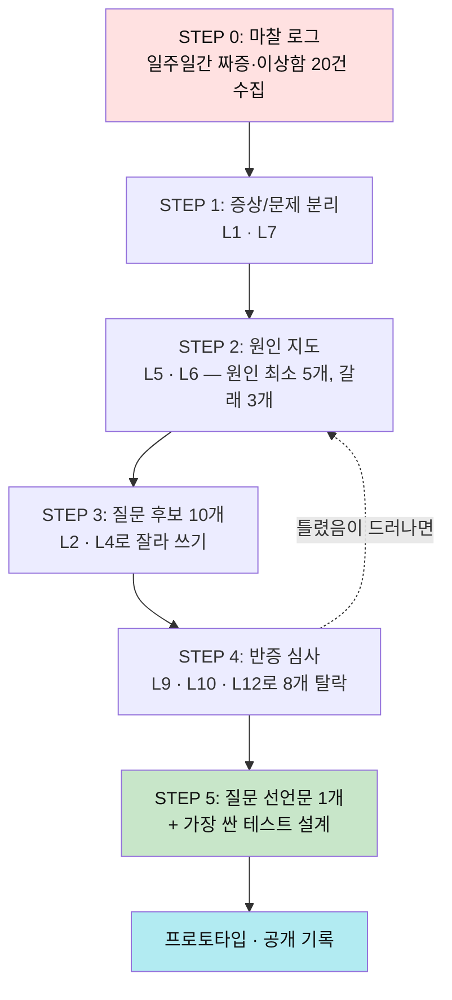

### STEP 0 — 마찰 로그 (7일)
하루 3건, 총 20건. 형식은 딱 한 줄.
```
[시각] [상황] [내 반응] → "원래 이런 거야"라고 넘긴 부분은?
```
> 💡 핵심은 마지막 칸이다. **"원래 그런 것"이라고 학습된 지점이 문제의 서식지**다.

**마찰 로그 작성 예시 (대입용 프로젝트 수준)**

```
Day 1
  07:30 | 등교 시 정문 앞 신호등 대기 3분 | "매일 그런데 뭐" → 왜 이 길만 3분인가?
  12:10 | 급식 잔반 많음, 특히 나물 | "원래 나물은 안 먹지" → 정말 '맛' 때문인가?
  16:00 | 자습 시간에 다들 자는 중 | "원래 그렇지" → 자습의 의미가 뭔가?

Day 2
  08:20 | 조회 시간에 아무도 안 듣는 공지 | "형식적인 거니까" → 이 형식은 누구를 위한 것인가?
  13:30 | 도서관 자리가 늘 같은 사람이 차지 | "빨리 온 사람 것" → 공유 자원의 배분이 공정한가?
  19:00 | 학원 끝나고 편의점 앞에서 쉼 | "집 가기 싫어서" → 집과 학교 사이 제3의 공간이 왜 필요한가?

Day 3
  09:00 | 수학 수업에서 "이거 시험에 나와" | "원래 그렇게 가르치지" → 시험에 안 나오면 배울 이유가 없나?
  ...
```

> **20건을 다 쓰면 패턴이 보인다.** "학교의 형식적 시스템"이 반복적으로 나타나면,
> 그게 프로젝트의 출발점이다.

### STEP 1 — 증상 vs 문제 (L1 · L7)

```
관찰: 우리 반 발표 때 아무도 손을 안 든다
증상인가? → 그렇다
분석 수준 이동:
  개인: 애들이 소극적이다        → 약함 (사람 탓)
  규칙: 발표는 감점만 있고 이득이 없다  → 강함
  문화: 틀린 말 하면 놀림받는다      → 강함
→ 문제 후보는 "규칙"과 "문화" 층에 있다
```

**STEP 1 심화 — 대입용 증상/문제 분리 매트릭스**

| 관찰된 현상 | 1차 해석 (증상) | L7 층위 이동 | 재정의된 문제 |
|---|---|---|---|
| 학생들이 진로를 모르겠다고 함 | 정보 부족 | 개인→규칙: 진로 탐색 시간이 주어지지 않음 / 규칙→문화: "안정적 직업"만 진로로 인정 | **진로 탐색의 기회 구조** |
| 교실에서 질문이 없음 | 학생이 소극적 | 개인→규칙: 질문에 보상이 없음 / 규칙→문화: 모르는 걸 드러내면 약점 | **질문의 비용 구조** |
| 학교 행사에 참여율 저조 | 관심 없음 | 개인→규칙: 참여와 비참여의 결과가 같음 / 문화: "억지로 하는 것"이라는 인식 | **참여의 의미 구조** |
| 학생들이 AI로 숙제를 제출 | 부정행위 | 개인→규칙: 과제의 목적이 '제출'이지 '학습'이 아님 | **과제-학습 불일치** |

### STEP 2 — 원인 지도 (L5 · L6)
원인 최소 5개, 서로 다른 갈래 3개 이상. 그리고 반드시 한 줄 추가:
> **"이 원인을 없애면 무엇이 나빠지는가?"** (L6)
> 예: 발표 감점을 없앤다 → 아무도 준비를 안 해온다

**원인 지도 심화 예시: "고등학생의 수면 부족"**

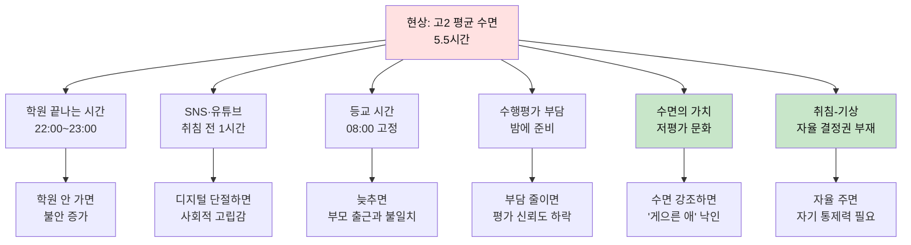

> C5와 C6이 가장 깊다. 수면 부족은 시간 문제가 아니라 **가치 문제**이고 **권한 문제**다.

### STEP 3 — 질문 후보 10개
아이디어가 아니라 **질문**을 10개 쓴다. 형식 강제:
```
"어떻게 하면 [누가] [어떤 제약 안에서] [무엇을] 할 수 있을까?"
```
❌ "발표 앱을 만들자" (솔루션 — 금지)
⭕ "어떻게 하면 **틀릴 위험을 지지 않고도** 의견을 남길 수 있을까?"

**질문 후보 10개 작성 실전 예시 (수면 부족 프로젝트)**

```
Q1. 어떻게 하면 고등학생이 학원 없이도 불안하지 않을 수 있을까?
Q2. 어떻게 하면 등교 시간을 학생이 선택할 수 있을까?
Q3. 어떻게 하면 수면 시간이 성과와 무관하다는 것을 증명할 수 있을까?
Q4. 어떻게 하면 수면을 '게으름'이 아닌 '투자'로 인식하게 할 수 있을까?
Q5. 어떻게 하면 수행평가를 밤에 안 해도 되는 구조를 만들 수 있을까?
Q6. 어떻게 하면 취침 전 1시간의 SNS를 자발적으로 줄일 수 있을까?
Q7. 어떻게 하면 부모의 '일찍 자라'가 효과를 낼 수 있을까?
Q8. 어떻게 하면 수면 부족이 만드는 실제 비용을 학생이 직접 측정할 수 있을까?
Q9. 어떻게 하면 5시간 자는 문화를 바꾸지 않고도 수면의 질을 올릴 수 있을까?
Q10. 어떻게 하면 수면에 대한 결정권을 학생에게 돌려줄 수 있을까?
```

### STEP 4 — 반증 심사 (L9 · L10 · L12)
각 후보에 3점 채점, 하위 8개 탈락.

| 심사 항목 | 통과 기준 |
|---|---|
| **반증 가능한가** (L10) | "이렇게 되면 내 생각이 틀린 것"을 한 문장으로 쓸 수 있다 |
| **근거가 있는가** (L9) | 내가 직접 관찰·측정한 데이터가 1개 이상 있다 (AI 요약 ❌) |
| **반대편이 있는가** (L12) | 이 질문에 손해 보는 사람을 지목할 수 있다 |

**반증 심사 실전 예시**

| 질문 | 반증 가능? | 1차 근거? | 반대편? | 합계 | 통과? |
|---|---|---|---|---|---|
| Q1 (학원 없이 불안 안 하려면) | ✗ "불안"은 측정 어려움 | ✗ | ✓ 학원 업계 | 1 | ❌ |
| Q4 (수면=투자 인식 전환) | △ 인식 변화 측정 가능 | ✗ 아직 없음 | ✓ "노력=시간" 신봉자 | 1.5 | ❌ |
| Q8 (수면 부족 비용 자가 측정) | ✓ 측정 후 비교 가능 | ✓ 내 수면 로그 있음 | ✓ "5시간이면 충분" 주장자 | 3 | ⭕ |
| Q10 (수면 결정권 학생에게) | ✓ 자율 실험 후 변화 측정 | ✓ 현재 수면 데이터 | ✓ 부모·학교 | 3 | ⭕ |

→ **Q8과 Q10이 살아남는다.** 둘 중 제약 조건(L3) 내에서 실험 가능한 쪽을 선택.

### STEP 5 — 질문 선언문
```
나는 [ 대상 ]이(가) [ 상황 ]에서 [ 진짜 문제 ] 때문에
[ 결과 ]를 겪고 있다고 본다.

내가 틀렸다면: [ 반증 조건 ]이 관찰될 것이다.
가장 싸게 확인하는 방법: [ 24시간·1만원 이내 테스트 ]
```

**질문 선언문 실전 예시**

```
나는 [우리 학교 고2 학생]이 [수면이 학습에 미치는 실제 비용을 모르는 상황]에서
[수면을 '아끼는 자원'이 아니라 '포기해도 되는 자원'으로 분류하는 판단 오류] 때문에
[매일 1~2시간의 수면을 '공부 시간'으로 전환하지만 실제 학습 효율은 하락하는] 결과를
겪고 있다고 본다.

내가 틀렸다면:
  수면 시간을 1시간 늘린 학생 그룹의 시험 성적이 오르지 않을 것이다.
  또는 5시간 수면 학생과 7시간 수면 학생의 수업 집중도 차이가 통계적으로 유의하지 않을 것이다.

가장 싸게 확인하는 방법:
  우리 반에서 자발적 참여자 10명을 모아, 2주간 수면 시간+다음 날 자습 집중도(자기 보고+객관 측정)를
  기록한다. 비용: 0원. 시간: 2주.
```

---

## 4. 학년별 렌즈 사다리 (초→대)

같은 12렌즈를 **깊이만 다르게** 쓴다. 도구가 아니라 **판단의 해상도**가 학년 차이다.

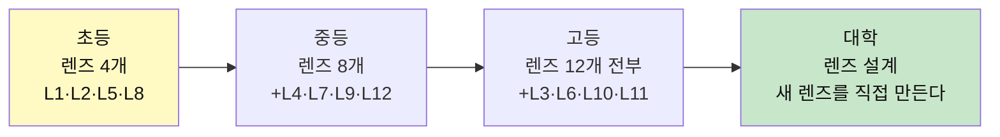

| 학년 | 주력 렌즈 | 훈련 단위 | 산출물 | 통과 기준 |
|---|---|---|---|---|
| **초등 (3~6)** | L1 진짜문제 / L2 분해 / L5 다중원인 / L8 맥락 | **"왜 원래 그런 거야?" 주 1회** | 질문 카드 20장, 손으로 만든 시제품 | 증상과 문제를 **말로 구분**할 수 있다 |
| **중등** | +L4 격차 / L7 분석수준 / L9 근거 / L12 반대편 | **"반대편 대변인" 토론 격주** | 문제 정의서 1장 + 현장 데이터 | 자기 주장에 **반대 논거를 스스로** 만든다 |
| **고등** | 12개 전부 | **반증 세미나 (내 가설 부수기)** | 질문 선언문 + 반증 실험 로그 | 자기 가설을 **스스로 폐기한 기록**이 있다 |
| **대학** | 렌즈 자체를 설계 | **새 렌즈 제안 + 동료 검증** | 렌즈 매뉴얼 + 타인이 재현한 사례 | 남이 그 렌즈로 **다른 문제를 풀어냈다** |

---

## 5. 기존 200개 아이디어를 '질문형'으로 되살리는 법

기존 문서를 버리지 않는다. **정답이 적힌 카드를 질문 카드로 뒤집는다.**

### 변환 규칙
```
기존 카드:   문제 + 솔루션 + 수익모델   (← 다 알려줌)
질문 카드:   상황 + 관찰 데이터 + 금지된 답
```
**금지된 답** = 원래 문서에 적혀 있던 솔루션. 학생은 그걸 **쓸 수 없다.**
가장 뻔한 답을 막아야 두 번째 생각이 시작된다.

### 변환 예시 3

**① 기존 #2 친구 칭찬 쿠폰북 → 질문 카드**
```
상황: 친구가 울고 있다. 나는 내성적이라 말이 안 나온다.
관찰해야 할 것: 이번 주 교실에서 '위로 시도'가 몇 번, 어떤 형태로 일어났는가
🚫 금지된 답: 쿠폰북, 칭찬 스티커, 메시지 벽

렌즈 적용
  L1 진짜문제: 문제는 '위로 방법'인가, '위로해도 되는지 몰라서'인가?
  L7 분석수준: 내 성격 문제인가, 우리 반이 감정 표현을 놀리는 문화인가?
  L12 반대편: 위로받기 싫어하는 아이에게 이 시스템은 무엇인가?

질문 선언문 예시:
  "우리 반은 위로 방법이 없는 게 아니라, 위로하는 사람이
   오지랖으로 보일 위험을 지기 때문에 아무도 나서지 않는다.
   틀렸다면: 익명 채널을 열어도 참여율이 오르지 않을 것이다."
```

**② 기존 #35 학급 민주주의 플랫폼 → 질문 카드**
```
상황: 학급 안건이 자꾸 묻힌다.
🚫 금지된 답: 투표 앱, 익명 게시판, 블록체인

  L6 시스템역학: 안건이 다 통과되면 무엇이 망가지는가? (실행할 사람이 없다)
  L4 격차: '의견이 없는 것'과 '의견을 말할 통로가 없는 것' 중 어느 쪽인가?
  L10 반증: 통로를 열었는데도 안건이 0건이면 내 가설은 죽는다

재정의된 진짜 질문:
  "문제는 의견 수집이 아니라 **결정 이후 아무도 책임지지 않는 구조**다.
   어떻게 하면 결정에 실행 담당이 자동으로 붙게 할 수 있을까?"
```

**③ 기존 #111 정신건강 케어 플랫폼 → 질문 카드**
```
상황: 청소년 상담 문턱이 높다.
🚫 금지된 답: 자가진단 앱, 상담 매칭, B2B 학교 패키지

  L9 근거의질: '문턱이 높다'는 내 관찰인가, 기사 헤드라인인가?
  L6 시스템역학: 진단을 쉽게 만들면 → 과잉 라벨링이 생기지 않는가?
  L11 편향: 나는 '앱으로 풀 수 있는 문제'만 문제로 보고 있지 않은가?

재정의된 진짜 질문:
  "접근성이 아니라 **기록이 남는 것에 대한 두려움**이 장벽이라면,
   어떻게 하면 기록 없이도 도움에 닿을 수 있을까?"
```

> 🔁 **적용법**: 기존 200개 전부를 위 3단계(상황 / 금지된 답 / 렌즈 3개)로 다시 쓰면
> **아이디어 카드 200장 → 질문 훈련 카드 200장**이 된다. 내용은 그대로, 방향만 뒤집는다.

---

## 6. 2032 페르소나 — '도구'가 아니라 '판단'으로 다시 씀

기존 페르소나는 *어떤 AI 도구를 쓰는가*로 구별했다. 2032년엔 모두가 같은 도구를 쓴다.
**무엇을 AI에 맡기지 않기로 결정했는가**로 구별한다.

| 페르소나 | 학년 | AI에 맡기는 것 | **끝까지 내가 하는 것** | 붙잡고 있는 진짜 질문 |
|---|---|---|---|---|
| **관찰자 지우** | 초4 | 그림 채색, 자료 찾기 | **무엇을 이상하다고 느낄지** | "어른들이 '원래 그래'라고 하는 것 중 진짜 이상한 건 뭘까?" |
| **분해자 민준** | 초5 | 코드 작성, 조립 순서 | **문제를 어디서 자를지** | "이 고장은 부품 탓인가, 내 설계 탓인가?" |
| **반대편 서연** | 중2 | 설문 집계, 시각화 | **누가 손해 보는지 찾기** | "다수가 좋아하는 이 결정에서 밀려나는 사람은 누구지?" |
| **의심가 재현** | 중3 | 초안·배경 생성 | **무엇이 내 감정인지 판별** | "이 감동은 내 것인가, 잘 만들어진 자극인가?" |
| **제약 설계자 현우** | 고2 | 개발 전체, 마케팅 문구 | **풀지 않을 문제를 고르기** | "만들 수 있다는 이유로 만들고 있는 건 아닌가?" |
| **반증가 수진** | 고3 | 논문 요약, 반론 생성 | **자기 결론을 폐기하는 판단** | "내 생각이 틀렸다는 증거를 나는 어디서 찾을 수 있나?" |
| **시스템 사고자 동현** | 대2 | 실행 전부 | **2차 효과 예측** | "이게 성공하면 누구의 삶이 나빠지는가?" |
| **렌즈 제작자 예은** | 대3 | 제작·편집·유통 | **새로운 보는 방식 발명** | "지금 아무도 안 쓰는 관점은 무엇인가?" |

> **공통 원칙**: 실행 속도는 페르소나를 구별하지 못한다. 2032년엔 전부 빠르다.
> 구별되는 건 **"안 하기로 한 것"의 목록**이다.

---

## 7. 평가 루브릭 — 결과물이 아니라 판단을 채점한다

| 항목 | 1점 | 3점 | 5점 |
|---|---|---|---|
| **문제 정의** | 남이 준 문제를 그대로 씀 | 증상과 원인을 구분함 | 원래 문제를 **폐기하고 재정의**함 |
| **렌즈 교차** | 렌즈 1개 | 렌즈 3개 적용 | 렌즈끼리 **충돌**시키고 그 충돌을 다룸 |
| **근거** | AI 요약 인용 | 2차 자료 + 약간의 관찰 | **본인이 만든 1차 데이터** |
| **반증** | 반증 조건 없음 | 반증 조건 명시 | **실제로 반증되어 가설을 바꾼 기록** |
| **2차 효과** | 언급 없음 | 부작용 1개 예상 | 부작용 대응까지 설계 |
| **AI 경계** | 어디까지 AI인지 불명 | 사용 범위 표기 | **AI에 맡기지 않은 이유**를 논증 |

> ⭐ **가장 높은 점수를 받는 산출물은 "실패한 프로젝트 + 왜 틀렸는지의 정확한 기록"이다.**
> 성공한 프로젝트보다 반증된 프로젝트가 학습 밀도가 높다. 이걸 명시적으로 보상해야
> 학생이 안전한 질문(=뻔한 질문)만 고르는 걸 막을 수 있다.

---

## 8. 12주 운영 커리큘럼

| 주차 | 활동 | 렌즈 | 산출 |
|---|---|---|---|
| 1 | 마찰 로그 20건 | — | 관찰 노트 |
| 2 | 증상/문제 분리 | L1 L7 | 문제 후보 5개 |
| 3 | 원인 지도 그리기 | L5 L6 | 원인 5개 + 부작용 |
| 4 | 맥락 이동 실험 | L8 | "다른 데선 문제인가" 조사 |
| 5 | 질문 후보 10개 | L2 L4 | 질문 리스트 |
| 6 | **반대편 대변인 토론** | L12 | 반대 논거 3개 |
| 7 | 근거 수집 (현장) | L9 | 1차 데이터 |
| 8 | **반증 심사 — 8개 탈락** | L10 L11 | 질문 선언문 1개 |
| 9 | 제약 설계 | L3 | 안 할 것 목록 |
| 10 | 최소 테스트 실행 | L10 | 실험 로그 |
| 11 | 결과 해석 / 가설 수정 | L11 L12 | 수정된 선언문 |
| 12 | 공개 발표 + 동료 반증 | 전부 | 최종 기록 |

> **8주차가 이 커리큘럼의 심장**이다. 여기서 자기 질문 9개를 스스로 죽여본 학생만
> 12주차에 남의 반박을 견딜 수 있다.

---

## 9. 세 문서의 새 역할

| 문서 | 기존 역할 | 새 역할 |
|---|---|---|
| `학년별_프로젝트_아이디어_100선.md` | 아이디어 카탈로그 | **질문 카드 100장** (§5 변환 규칙 적용) |
| `융합형_프로젝트_100선.md` | 융합 사업 아이템 | **렌즈 교차 사례집** — 융합 = 영역 결합이 아니라 **렌즈 충돌** |
| `학년별_페르소나_생활패턴_가이드.md` | 도구 사용 패턴 | **판단 유형 가이드** (§6로 대체) |

---

## 10. 대입 연계 — 인간 관심사 20개 × 렌즈 교차 프로젝트 설계

### 10-0. 프로젝트 선택의 원칙

**한 학기 = 관심사 2~3개 교차.** 단일 관심사는 깊이가 나오지만 융합이 없다.
2~3개를 교차시키면 **렌즈 충돌**이 자연스럽게 발생한다.

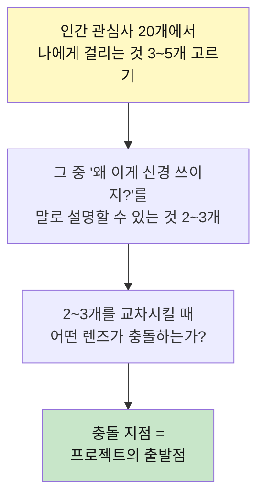

**교차 조합 예시**

| 조합 | 충돌 렌즈 | 프로젝트 질문 |
|---|---|---|
| ⑦우정 × ⑪소속 | L1(진짜문제) vs L6(시스템역학) | "소속감을 위해 포기한 우정은 진짜 우정이었는가?" |
| ②감정 × ⑱만듦 | L7(분석수준) vs L12(반대편) | "AI가 만든 감동적 콘텐츠를 보고 운다면, 그 감정은 조작된 것인가?" |
| ④시간 × ⑰배움 | L4(격차) vs L10(반증) | "AI가 시간을 벌어줬는데 왜 더 바쁜가? 효율화가 학습을 돕는다는 가설은 참인가?" |
| ⑬공정 × ⑮권력 | L7(분석수준) vs L6(시스템역학) | "학교 규칙은 누구에게 유리한가? 공정한 규칙이 오히려 불평등을 만드는 구조는?" |
| ①몸 × ⑫지위 | L5(다중원인) vs L11(편향) | "외모 관리는 자기 돌봄인가, 지위 경쟁의 일부인가?" |
| ⑯생계 × ⑱만듦 | L4(격차) vs L1(진짜문제) | "만드는 비용이 0이면 가치는 어디서 오는가?" |
| ③정체성 × ⑭신뢰 | L8(맥락) vs L9(근거의질) | "AI가 나를 나보다 잘 아는 시대에, '나'를 어떻게 증명하는가?" |
| ⑥애착 × ⑤죽음 | L12(반대편) vs L8(맥락) | "디지털 기록이 영원히 남으면, 애도(哀悼)의 과정은 어떻게 바뀌는가?" |
| ⑨갈등 × ⑬공정 | L12(반대편) vs L6(시스템역학) | "합의는 왜 약자에게 불리한가? 갈등을 없앤 조직이 왜 더 빨리 망하는가?" |
| ⑩돌봄 × ⑳의미 | L7(분석수준) vs L10(반증) | "돌봄에 값을 매기면 존엄이 훼손되는가? 보이지 않는 노동이 의미를 갖는 조건은?" |

---

### 10-1. 대입용 풀 프로젝트 예시 A — 고2 · ④시간 × ⑰배움

#### "AI가 시간을 벌어줬는데 왜 더 바쁜가 — 효율의 역설 프로젝트"

**관심사 교차**: ④ 시간 + ⑰ 배움
**주력 렌즈**: L4(격차) + L6(시스템역학) + L10(반증)
**핵심 긴장**: 효율화가 여유를 만든다는 상식 vs 현실에서는 효율화할수록 더 바빠지는 역설

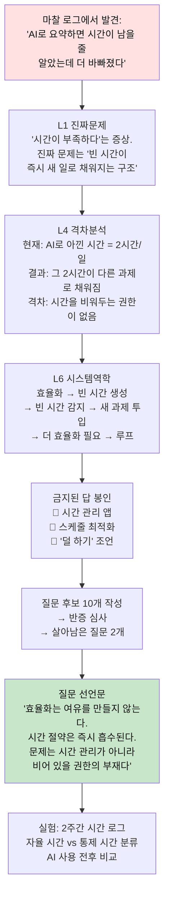

**프로젝트 타임라인 (16주)**

| 주 | 활동 | 산출물 |
|---|---|---|
| 1 | 마찰 로그: "시간이 모자라다"는 순간 20건 기록 | 관찰 노트 |
| 2 | L1: "바쁘다"는 증상인가 문제인가? / L7: 개인 습관 vs 구조 | 증상/문제 분리표 |
| 3-4 | **1층 독서**: 시간에 대한 사회학적 관점의 책 → 문제 재정의 | "시간은 자원이 아니라 관계다" |
| 5 | 시간 로그 7일 — **자율 시간 vs 통제 시간** 분류 (1차 데이터) | 시간 분류 스프레드시트 |
| 6 | L6 시스템역학: 효율화 → 빈 시간 → 흡수의 루프 발견 | 시스템 다이어그램 |
| 7-8 | **2층 독서**: 시간 측정 방법론 / 설문 설계 | 측정 도구 설계 |
| 9 | 반대편 인터뷰: "효율화는 무조건 좋다"고 믿는 사람 (교사 or 부모) | 인터뷰 기록 |
| 10-11 | **실험**: AI 사용 전후 시간 사용 비교 (학급 10명 자발 참여) | 비교 데이터 |
| 12 | L10 반증: "효율화하면 여유가 늘어난다" 가설 → 데이터로 검증 | 반증 기록 |
| 13 | **3층 독서**: 효율화 찬성론 (내 결론의 반대) | 반증서 독서 기록 |
| 14 | 가설 수정: "효율화가 여유를 만드는 조건은 무엇인가?" 로 재정의 | 수정된 질문 선언문 |
| 15 | 최소 실험: "빈 시간 보호 규칙" 1주일 적용 → 결과 측정 | 실험 로그 |
| 16 | 공개 발표 + 동료 반증 | 최종 포트폴리오 |

**대입 포트폴리오로서의 강점:**
- **직접 만든 1차 데이터** (시간 로그, 비교 실험)
- **가설이 죽은 기록** ("효율화=여유"가 틀렸음을 발견)
- **반대편 인터뷰** (실존 인물)
- **렌즈 충돌** (L4 격차 vs L6 시스템역학의 충돌이 "효율화의 역설"을 드러냄)
- **AI 경계 명시** (AI를 시간 절약 도구로 쓴 것 자체가 실험 대상)

---

### 10-2. 대입용 풀 프로젝트 예시 B — 고2 · ⑭신뢰 × ⑱만듦

#### "AI가 만든 글과 사람이 쓴 글을 구별할 수 있는가 — 신뢰의 재정의 프로젝트"

**관심사 교차**: ⑭ 신뢰 + ⑱ 만듦
**주력 렌즈**: L9(근거의질) + L10(반증) + L11(편향)
**핵심 긴장**: 결과물의 질이 같으면 만든 사람이 중요한가?

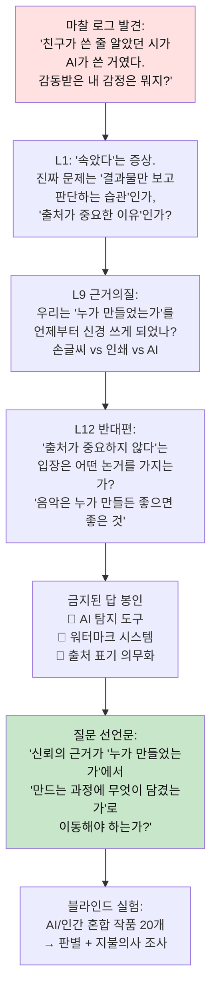

**실험 설계 상세**

```
블라인드 테스트 설계:
  - 대상: 학급 학생 30명 + 교사 5명 + 학부모 10명 = 45명
  - 자극물: 시 10편 (AI 5편 + 인간 5편, 블라인드)
  - 측정 1: 판별 정확도 (AI인지 인간인지 맞추기)
  - 측정 2: 감동 점수 (1~10점, 판별 전)
  - 측정 3: 감동 점수 (판별 후 재평가)
  - 측정 4: 지불의사 (이 작품에 얼마를 내겠는가, 판별 전후)

  핵심 관찰점:
  → 판별 전 감동 점수와 판별 후 감동 점수가 다르면
     우리의 감동은 '내용'이 아니라 '출처'에 의존한다는 것
  → 지불의사가 판별 후 달라지면
     가치는 결과물이 아니라 '만든 사람의 맥락'에 붙는다는 것
```

**3층 독서 설계**

| 층 | 책 | 읽는 이유 | 산출 |
|---|---|---|---|
| 1층 정의서 | 진정성과 신뢰에 대한 철학서 | "신뢰"를 재정의하기 위해 | 신뢰의 정의 3개 후보 |
| 2층 도구서 | 블라인드 테스트 설계 방법론 | 실험을 제대로 설계하기 위해 | 실험 프로토콜 |
| 3층 반증서 | "AI 창작물의 가치" 옹호 논문 | 내 전제("출처가 중요하다")를 흔들기 | 반론 3개 |

**대입 포트폴리오로서의 강점:**
- **독창적 실험** (이 실험을 한 고등학생은 거의 없다)
- **철학적 깊이** (신뢰, 진정성, 가치라는 근본 질문)
- **정량 데이터** (판별 정확도, 감동 점수, 지불의사 — 모두 숫자)
- **가설 수정 기록** (판별 전후 데이터가 보여주는 인간 심리)
- **2032 시대 적합성** (AI 시대의 핵심 질문을 직접 실험)

---

### 10-3. 대입용 풀 프로젝트 예시 C — 고2 · ⑬공정 × ⑮권력

#### "학교 규칙은 누구에게 유리한가 — 공정의 해부 프로젝트"

**관심사 교차**: ⑬ 공정 + ⑮ 권력
**주력 렌즈**: L7(분석수준) + L6(시스템역학) + L12(반대편)
**핵심 긴장**: 모두에게 같은 규칙 = 공정한가?

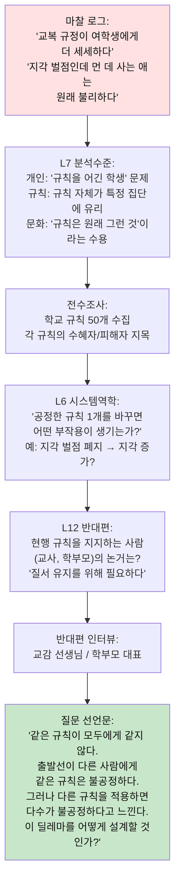

**1차 데이터 수집 상세**

```
학교 규칙 전수조사 양식:

| # | 규칙 내용 | 누가 만들었나 | 수혜자 | 피해자 | 위반 시 벌칙 | 바꾼 적 있나 |
|---|---|---|---|---|---|---|
| 1 | 등교 08:00 | 학교 | 가까이 사는 학생 | 원거리 통학생 | 벌점 | 없음 |
| 2 | 교복 착용 | 교육청 | 경제적 여유 학생 | 교복 불편한 체형 | 반성문 | 없음 |
| 3 | 휴대폰 수거 | 학교 | (의도) 전체 | (실제) 필요한 학생 | 1주 압수 | 없음 |
| ... | ... | ... | ... | ... | ... | ... |

→ 50개 규칙 중 "바꾼 적 있나" = "없음"이 45개
→ 발견: 규칙은 만들어진 후 거의 수정되지 않는다
→ 진짜 문제: 공정 자체보다 "규칙을 바꿀 수 있는 통로의 부재"
```

**대입 포트폴리오로서의 강점:**
- **사회적 감수성** (구조적 불평등을 직접 데이터로 드러냄)
- **딜레마 인식** (정답이 없는 문제를 정답 없이 다룸 — 이게 5점)
- **실존 인물 인터뷰** (교감, 학부모 — 반대편의 실제 목소리)
- **정량 분석** (규칙 50개 전수조사)
- **시스템 사고** (규칙 변경의 부작용까지 설계)

---

### 10-4. 대입용 풀 프로젝트 예시 D — 고2 · ②감정 × ③정체성

#### "나는 진짜 슬픈 걸까, 슬퍼야 할 것 같아서 슬픈 걸까 — 감정의 출처 프로젝트"

**관심사 교차**: ② 감정 + ③ 정체성
**주력 렌즈**: L1(진짜문제) + L7(분석수준) + L12(해석렌즈)
**핵심 긴장**: 감정은 내 것인가, 사회가 학습시킨 것인가?

**마찰 로그에서 발견된 패턴:**
```
Day 2: 친구가 우는 영상을 보고 나도 울었다 → 진짜 슬픈 건가?
Day 4: 시험 결과가 나쁜데 별로 안 슬프다 → 슬퍼야 하는 건 아닌가?
Day 5: SNS에서 다들 행복해 보인다 → 나만 불행한 건가?
Day 7: AI가 위로 메시지를 보냈다 → 위로가 되긴 하는데, 이게 맞나?
```

**렌즈 교차 분석:**
```
L1 진짜문제:
  증상: "감정 조절이 안 된다"
  → 진짜 문제: 감정이 내 것인지 확인하는 방법이 없다

L7 분석수준:
  개인: 나의 감정 인식 부족 → 약함
  규칙: 감정을 표현할 공간이 없음 → 중간
  문화: "이럴 때는 이렇게 느끼는 것"이라는 감정 각본 → 강함

L12 반대편:
  "감정에 출처가 중요한가? 느끼면 그게 내 감정이다"
  → 이 반론은 강하다. 그래서 실험이 필요하다.
```

**실험 설계:**
```
감정 어휘 확장 실험 (4주):
  1주: 감정 어휘 목록 수집 — 학급에서 쓰는 감정 단어 조사
       → 대부분 "짜증", "슬픔", "기분 좋음" 등 10개 미만
  2주: 감정 어휘 30개로 확장 훈련 — 매일 감정 일기에 정확한 단어 사용
       → "짜증"을 "답답함 / 억울함 / 무력감 / 당혹감"으로 분해
  3주: 확장 후 갈등 빈도 측정 — 같은 학급 내 갈등 사건 수 비교
  4주: 결과 분석 — 감정 어휘가 늘면 갈등이 줄었는가?

반증 조건:
  → 감정 어휘가 늘어도 갈등 빈도가 줄지 않으면, 가설이 틀린 것
  → 갈등 빈도는 줄었지만 감정 어휘와 무관하면, 다른 변수
```

**이 프로젝트가 보여주는 역량:**
- 철학적 사고 (감정의 본질에 대한 근본 질문)
- 실험 설계 능력 (감정 어휘 → 갈등의 인과 관계 검증)
- 인문학적 통찰 + 사회과학적 방법론 (진짜 융합)

---

### 10-5. 대입용 풀 프로젝트 예시 E — 고2 · ⑩돌봄 × ⑳의미

#### "보이지 않는 노동은 왜 보이지 않는가 — 돌봄의 가치 프로젝트"

**관심사 교차**: ⑩ 돌봄 + ⑳ 의미
**주력 렌즈**: L7(분석수준) + L9(근거의질) + L12(반대편)
**핵심 긴장**: 돌봄에 값을 매기면 존엄이 훼손되는가?

**1차 데이터 수집:**
```
가정 내 돌봄 시간 측정 (1주):
  대상: 우리 가족 4명의 '돌봄 행위' 전수 기록
  방법: 각 행위의 시작-종료 시간, 내용, 수행자 기록

  결과 예시:
  | 행위 | 수행자 | 주간 시간 | 시급 환산 |
  |---|---|---|---|
  | 식사 준비+정리 | 엄마 | 14시간 | 140,000원 |
  | 빨래+청소 | 엄마 | 7시간 | 70,000원 |
  | 등하교 픽업 | 아빠 | 5시간 | 50,000원 |
  | 숙제 봐주기 | 엄마 | 4시간 | 40,000원 |
  | 감정 돌봄 (대화) | 엄마 | 3시간 | ??? |

  → 발견: "감정 돌봄"은 시간도, 금액도 측정이 안 된다.
  → 질문: 측정 불가능한 것은 가치가 없는 건가?
```

**렌즈 충돌의 핵심:**
```
L7 (분석수준):
  개인 탓: "엄마가 안 시켜서 안 도와줬다" → 약함
  규칙 탓: "돌봄에 대한 보상/인정 시스템이 없다" → 강함
  문화 탓: "원래 엄마가 하는 것" → 가장 강함

L12 (반대편 — 두 방향의 반대편이 있다):
  반대편 A: "돌봄에 값을 매기는 건 가족 사랑을 상품화하는 것"
  반대편 B: "값을 안 매기니까 계속 무시당하는 것"
  → 이 두 반대편이 충돌한다 = 프로젝트의 핵심

L9 (근거의질):
  "보이지 않는 노동"이라는 개념은 어디서 왔는가?
  → 원논문 추적 → 누구의 데이터인가 → 한국 맥락에 적용 가능한가?
```

---

### 10-6. 대입용 풀 프로젝트 예시 F — 고3 · ⑯생계 × ⑱만듦

#### "만드는 비용이 0이면 가치는 어디서 오는가"

**관심사 교차**: ⑯ 생계 + ⑱ 만듦
**주력 렌즈**: L4(격차) + L1(진짜문제) + L6(시스템역학)

> **융합 = 영역 결합이 아니라 렌즈 충돌.** ⑯의 L4(격차)와 ⑱의 L1(진짜문제)이 부딪힌다.

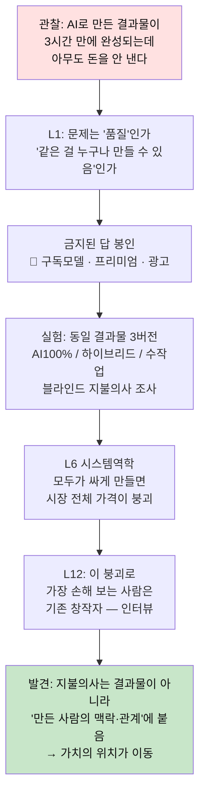

- **1층 독서**: 가격과 가치의 분리를 다룬 경제서 → "내 문제는 수익모델이 아니라 **희소성의 이동**"
- **2층 독서**: 지불의사(WTP) 조사 설계, 블라인드 실험 방법
- **3층 반증서**: "AI는 창작 가치를 오히려 높인다"는 **낙관론** → 내 비관 가설 타격
- **AI 역할**: R1로 기존 창작자 입장 대변 / R4로 "이 결론이 6개월 뒤 틀릴 조건"
- **최종 산출**: 지불의사 데이터 + 「가치는 어디로 이동했는가」 보고서 + 창작자 인터뷰 3건
- **📌 여기서 학생이 배우는 것**: 기존 문서의 "월 수익 500만원"보다, **가치의 발생 지점이 이동했다는 발견**이 훨씬 오래 쓰인다.

---

## 11. 프로젝트를 위한 독서 — 3층 독서법

> 교양 독서는 "읽고 나서 느낀 점"으로 끝난다. 프로젝트 독서는 **문제 정의가 바뀌어야 성공**이다.

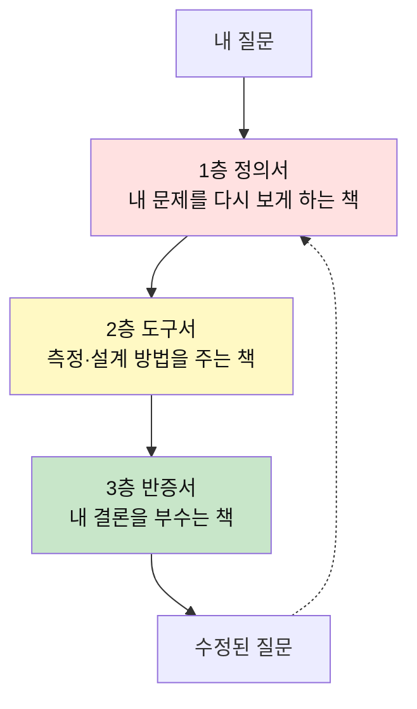

| 층 | 목적 | 읽는 법 | 산출 |
|---|---|---|---|
| **1층 정의서** | 문제를 **다시 정의**하기 | 목차만 먼저. "이 책은 내 문제를 뭐라고 부르는가?" | 문제 이름 3개 후보 |
| **2층 도구서** | **측정·설계** 방법 | 필요한 챕터만 발췌. 통독 금지 | 측정 지표 1개, 실험 설계 1개 |
| **3층 반증서** | 내 결론 **부수기** | 나와 **반대 입장**의 책을 의도적으로 | 내 주장의 약점 3개 |

### ⭐ 3층 독서의 핵심 = **반증서를 반드시 넣는다**
학생들은 자기 생각을 지지하는 책만 읽는다. 그래서 독서량이 늘수록 **확신만 강해지고 판단은 나빠진다.**
**규칙: 1층·2층 각 1권을 읽었으면, 3층 1권은 의무.**

### 독서 기록 양식 (한 장)
```
📖 [책] / [층: 1·2·3층]
이 책이 내 문제를 부르는 이름: ______________
내 정의와 다른 점: ______________
내가 쓸 수 있는 도구 1개: ______________
🔥 이 책이 내 주장을 공격한다면 어디를? ______________
→ 그래서 내 질문은 이렇게 바뀌었다: ______________
```
> 마지막 줄이 비면 **그 책은 읽은 게 아니다.**

### 프로젝트별 3층 도서 추천

| 프로젝트 주제 | 1층 정의서 | 2층 도구서 | 3층 반증서 |
|---|---|---|---|
| 시간×배움 (효율의 역설) | 시간에 관한 사회학적 관점의 책 | 시간 추적·분석 방법론 | 효율화 찬성론, 생산성 도구 옹호론 |
| 신뢰×만듦 (AI 판별) | 진정성에 관한 철학서 | 실험 설계·통계 입문 | AI 창작 옹호론, 포스트모던 저자론 |
| 공정×권력 (규칙 해부) | 공정에 관한 정치철학서 | 사회조사·설문 설계 | 규칙 기반 질서의 옹호, 능력주의 찬성론 |
| 감정×정체성 (감정 출처) | 감정 구성 이론서 | 감정 어휘·측정 척도 | 감정 표현 회의론, 감정 본질주의 |
| 돌봄×의미 (보이지 않는 노동) | 돌봄 노동론 | 시간 사용 조사 방법 | 가족주의 옹호론, 돌봄의 시장화 비판 |
| 생계×만듦 (가치의 이동) | 가격과 가치의 관계론 | 지불의사 조사 설계 | AI 시대 가치 증가론 |

> 📌 **책 목록은 고정이 아니다.** 학생이 3층 구조에 맞춰 **직접 고르는 것**이 훈련의 일부다.

---

## 12. AI 연계 — 4개 역할로만 쓴다

AI를 "도우미"라고 두면 대신 생각하게 된다. **역할을 4개로 못 박고, 그 밖의 용도는 금지**한다.

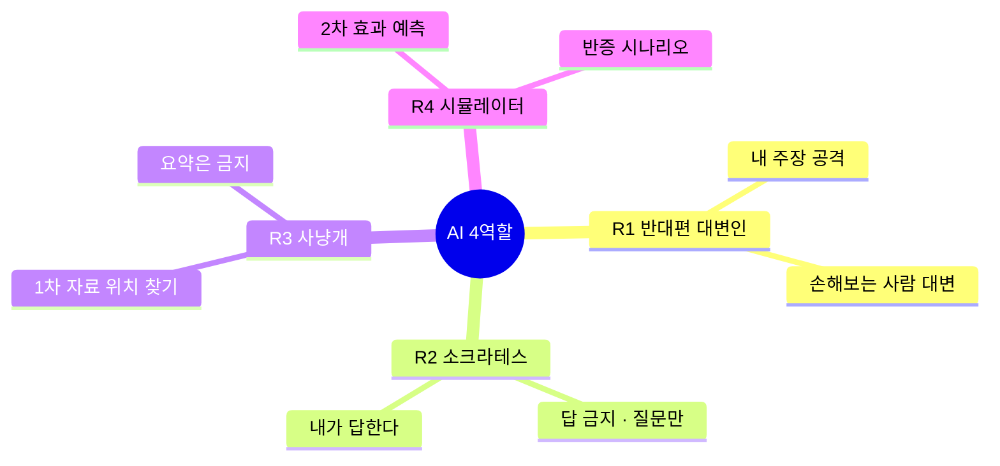

### R1. 반대편 대변인 (L12)
```
너는 내 결론으로 가장 손해를 보는 사람이다.
내 주장: "____________"
그 입장에서 가장 아픈 반론 3개를 대라.
위로하거나 균형 잡지 마라. 나를 설득하려 하지 말고 공격하라.
```

**R1 사용 예시 — 효율의 역설 프로젝트:**
```
너는 내 결론으로 가장 손해를 보는 사람이다.
내 주장: "효율화는 여유를 만들지 않는다. 아낀 시간은 즉시 새 일로 흡수된다."

너의 입장: 너는 생산성 도구 회사의 교육 담당자다.
학교에 시간 관리 교육을 팔아야 한다.
내 주장이 맞으면 너의 사업 모델이 무너진다.

가장 아픈 반론 3개를 대라.
위로하거나 균형 잡지 마라.
```

### R2. 소크라테스 (문제 정의 단계)
```
지금부터 어떤 답도 주지 마라. 질문만 하라.
내 문제 정의: "____________"
이 정의가 증상을 문제로 착각하고 있는지 알아내도록,
한 번에 질문 하나씩만 던져라. 내가 답하면 다음 질문으로.
```
> ⚠️ 이 역할이 가장 중요하다. **답을 막는 프롬프트**가 사고를 살린다.

**R2 대화 예시:**
```
학생: 내 문제 정의 — "학생들이 수업에 집중을 못 한다"

AI(R2): 집중을 못 하는 순간, 그 학생은 대신 무엇을 하고 있나요?
학생: 핸드폰을 보거나, 잠을 자거나, 멍하니 있어요.
AI(R2): 핸드폰을 볼 때와 잠잘 때와 멍할 때, 그 세 학생의 문제는 같은 문제인가요?
학생: 아... 다른 것 같아요. 핸드폰은 자극 추구, 잠은 수면 부족, 멍은 무력감?
AI(R2): 그 세 가지 중 수업을 바꿔서 해결할 수 있는 것은 어느 것인가요?
학생: 무력감... 수업이 의미 없다고 느끼는 것만 수업으로 바꿀 수 있겠네요.
AI(R2): 그러면 원래 문제 정의를 다시 써볼 수 있겠나요?
학생: "수업에서 학생이 무력감을 느끼는 구조적 원인은 무엇인가"
```

> 이 10분의 대화가 **문제 정의를 완전히 바꿨다.** AI가 답을 준 게 아니라, 질문만 했다.

### R3. 1차 자료 사냥개 (L9)
```
이 주제의 원자료(원논문·통계 원표·1차 기록)가 어디 있는지
'위치와 접근법'만 알려줘라. 내용 요약은 하지 마라.
각 자료에 대해: 누가 만들었나 / 목적은 / 어떤 한계가 있나
```
> **요약 금지가 핵심.** 요약을 받는 순간 근거는 내 것이 아니게 된다.

### R4. 반증 시뮬레이터 (L6 · L10)
```
내 해결책: "____________"
① 이게 성공했을 때 나빠지는 것 5가지
② 6개월 뒤 실패했다면 가장 가능성 높은 원인 3가지
③ 내가 틀렸음을 가장 싸게 확인할 실험 1개 (24시간·1만원 이내)
```

**R4 사용 예시 — 공정×권력 프로젝트:**
```
내 해결책: "학생이 학교 규칙 개정 제안서를 낼 수 있는 공식 통로를 만든다"

① 이게 성공했을 때 나빠지는 것 5가지:
  1. 제안이 너무 많아져서 처리 불가 → 시스템 과부하
  2. 학생 간 규칙 개정 갈등 → 다수결로 소수 의견 묵살
  3. 교사의 권위 약화 → 수업 운영 어려움
  4. 형식적 참여에 그침 → 참여 환멸
  5. "왜 우리 학교만 이래" → 다른 학교와의 갈등

② 6개월 뒤 실패 원인:
  1. 제안서를 내도 실제로 바뀌는 게 없어서 → 학습된 무력감
  2. 초기 열정 후 참여율 급감 → 지속 가능성 부재
  3. 기존 권력 구조(교장-교사)가 실질적 변화를 막음

③ 가장 싼 확인:
  1주일간 "규칙 변경 제안 포스트잇 벽"을 복도에 설치.
  제안 수, 중복율, 실행 가능성을 측정.
  비용: 포스트잇 1팩 = 3,000원
```

### 🚫 AI 사용 금지 구역
| 금지 | 이유 |
|---|---|
| 문제 정의를 대신 쓰게 하기 | 훈련의 본체를 통째로 넘기는 것 |
| 책 요약으로 3층 독서 대체 | 반증서는 **읽고 아파야** 효과가 있다 |
| 인터뷰 답변 생성 | 반대편은 **실제 사람**이어야 한다 |
| 최종 결론 작성 | 판단은 아웃소싱 대상이 아니다 |
| 1차 데이터 생성 | 현장에 안 가면 프로젝트가 아니다 |
| 감정·가치 판단 | "이게 옳은가"는 AI가 답할 수 없다 |

### AI 사용 로그 (제출 필수)
```
| 단계 | 역할(R1~R4) | 프롬프트 요지 | AI가 준 것 | 내가 버린 것과 이유 |
```
> **"내가 버린 것"** 칸이 채점 대상이다. AI 답을 다 받아썼다면 그 프로젝트는 0점.

**AI 사용 로그 예시:**
```
| 단계 | 역할 | 프롬프트 | AI 산출 | 버린 것과 이유 |
|---|---|---|---|---|
| 문제 정의 | R2 | "수업이 재미없다" 문제 분해 요청 | 5개 질문으로 유도 | 3번째 질문의 전제가 내 상황과 안 맞아서 무시. 대신 내가 재구성 |
| 원인 분석 | R4 | 해결책의 부작용 예측 요청 | 5개 부작용 | 2번(교사 부담 증가)만 채택. 나머지는 우리 학교 상황에 안 맞음 |
| 반대편 | R1 | 내 결론 공격 요청 | 반론 3개 | 1번 반론이 강해서 가설 수정에 반영. 나머지 2개는 논리 약함 |
| 자료 찾기 | R3 | 원논문 위치 요청 | 논문 3편 위치 | 2편만 접근 가능. 1편은 유료라 포기, 대신 저자의 다른 공개 자료 사용 |
```

---

## 13. 대입 면접 대비 — 이 프로젝트로 대답할 수 있는 질문들

이 설계서를 따라 프로젝트를 완성한 학생은 다음 면접 질문에 **자기 경험에서** 대답할 수 있다.

### 면접관이 반드시 묻는 5가지 유형과 대답 전략

**유형 1: "왜 이 주제를 선택했나요?"**
```
❌ 약한 답: "관심이 있어서요" / "사회 문제에 관심이 많아서요"
⭕ 강한 답 (이 설계서로 훈련한 학생):
  "마찰 로그를 쓰면서 '왜 효율적으로 공부하는데 더 바빠지지?'라는
   의문이 일주일 동안 7번 반복되었습니다. 처음엔 시간 관리의 문제라고
   생각했는데, L7 분석수준을 적용하니 개인 습관이 아니라
   '빈 시간이 즉시 채워지는 구조'가 문제라는 걸 발견했습니다."
```

**유형 2: "이 프로젝트에서 가장 어려웠던 점은?"**
```
❌ 약한 답: "시간이 부족했어요" / "자료 찾기가 힘들었어요"
⭕ 강한 답:
  "가장 어려웠던 건 8주차에 내 가설이 틀렸다는 걸 인정하는 순간이었습니다.
   '효율화하면 여유가 생긴다'는 가설로 3주를 투자했는데,
   실험 데이터를 보니 아낀 시간이 100% 새 일로 흡수되고 있었습니다.
   그때 가설을 폐기하고 '빈 시간 보호의 조건'으로 질문을 재정의했습니다."
```

**유형 3: "AI를 어떻게 활용했나요?"**
```
❌ 약한 답: "자료 정리에 도움을 받았어요" / "초안을 쓸 때 썼어요"
⭕ 강한 답:
  "AI를 4가지 역할로만 제한했습니다. 가장 유용했던 건 R1(반대편 대변인)으로,
   제 결론에 반대하는 입장을 공격적으로 대변하게 했습니다.
   그중 '생산성 도구 회사 입장'의 반론이 너무 강해서 가설을 수정했습니다.
   다만 AI가 생성한 반론 3개 중 1개만 채택하고 2개는 버렸는데,
   버린 이유는 우리 학교 맥락에 맞지 않았기 때문입니다."
```

**유형 4: "실패한 경험이 있나요?"**
```
❌ 약한 답: "처음에 계획이 틀어져서 고생했어요"
⭕ 강한 답 (이 설계서에서 실패는 가산점):
  "네, 가설이 죽었습니다. 12주 프로젝트 중 3번 가설을 폐기했습니다.
   1차: '정보 부족이 문제다' → 정보를 줘도 안 바뀜 → 폐기
   2차: '동기 부여가 문제다' → 동기가 있어도 구조가 막음 → 폐기
   3차: '시간 관리가 문제다' → 시간을 아끼면 더 바빠짐 → 폐기 후 재정의
   이 세 번의 폐기가 최종 결론보다 더 중요한 배움이었습니다."
```

**유형 5: "이 프로젝트의 한계는 무엇인가요?"**
```
❌ 약한 답: "시간과 자원이 부족했어요"
⭕ 강한 답:
  "세 가지 한계가 있습니다.
   1. 표본이 우리 반 30명으로 일반화 불가 (L9 근거의 질 한계)
   2. 2주 실험으로는 장기 효과를 알 수 없음 (시간적 제약)
   3. 자기 보고식 데이터라 객관성 부족
   이 한계를 넘으려면 다학교 비교 연구와 종단 연구가 필요하고,
   그건 제가 대학에서 하고 싶은 연구 주제이기도 합니다."
```

---

## 14. 관심사별 대입 프로젝트 시드 40개

다음은 인간 관심사 20개를 2~3개씩 교차시킨 프로젝트 시드 40개다.
**시드일 뿐이다.** 학생이 이걸 그대로 쓰면 0점이고, 여기서 출발해 자기 마찰 로그와 만나야 한다.

### 🫀 나 자신 영역 (관심사 ①~⑤)

**시드 1: ①몸 × ④시간** — "수면 2시간을 공부로 바꾸면 성적이 오르는가?"
```
핵심 렌즈: L5(다중원인) + L10(반증)
실험: 수면 시간별 다음 날 학습 효율 자가 측정 2주
금지된 답: 수면 앱, 카페인 관리, 시간 관리 플래너
진짜 질문의 방향: 수면 부족은 시간의 문제가 아니라 가치 판단의 문제
```

**시드 2: ②감정 × ⑦우정** — "친구 관계가 끊어질 때의 감정에 이름이 있는가?"
```
핵심 렌즈: L1(진짜문제) + L8(맥락)
실험: "관계 종료 감정" 어휘 수집 → 기존 감정 어휘와 비교
금지된 답: 상담 앱, 감정 일기, 친구 매칭
진짜 질문의 방향: 감정에 이름이 없으면 처리도 못 한다
```

**시드 3: ③정체성 × ⑱만듦** — "AI가 만든 내 포트폴리오는 나의 것인가?"
```
핵심 렌즈: L1(진짜문제) + L12(반대편) + L11(편향)
실험: AI 100% / 하이브리드 / 수작업 포트폴리오 블라인드 평가
금지된 답: AI 워터마크, 출처 표기, 원본 증명 시스템
진짜 질문의 방향: "나의 것"의 기준은 결과물이 아니라 과정
```

**시드 4: ④시간 × ⑰배움** — "AI가 시간을 벌어줬는데 왜 더 바쁜가?"
```
→ §10-1 풀 프로젝트 예시 A 참조
```

**시드 5: ⑤죽음 × ⑥애착** — "디지털에 남은 고인의 흔적, 지우는 게 맞는가?"
```
핵심 렌즈: L8(맥락) + L12(해석렌즈)
실험: "디지털 유산"에 대한 세대별 인식 조사 (학생/부모/조부모)
금지된 답: 추모 앱, 디지털 유산 관리 서비스
진짜 질문의 방향: 기록이 영원히 남는 시대에 잊힘의 가치
```

**시드 6: ①몸 × ⑫지위** — "외모 관리는 자기 돌봄인가, 지위 경쟁인가?"
```
핵심 렌즈: L5(다중원인) + L11(편향) + L7(분석수준)
실험: 외모 관리 행동 로그 → 동기 분류 (자기만족 vs 타인 의식)
금지된 답: 뷰티 앱, 자존감 프로그램
진짜 질문의 방향: 개인 선택이라고 믿는 것이 구조적 압력일 수 있다
```

**시드 7: ②감정 × ⑭신뢰** — "AI의 위로는 위로인가?"
```
핵심 렌즈: L1(진짜문제) + L12(반대편)
실험: AI 위로 vs 친구 위로 vs 전문가 위로 → 효과 비교
금지된 답: 감정 AI, 디지털 치료제
진짜 질문의 방향: 위로의 본질은 내용이 아니라 관계
```

**시드 8: ③정체성 × ⑪소속** — "SNS 속 나는 가짜인가, 그것도 나인가?"
```
핵심 렌즈: L8(맥락) + L12(해석렌즈) + L11(편향)
실험: SNS 프로필 vs 자기 인식 vs 타인 인식 삼각 비교
금지된 답: SNS 디톡스, 진정성 캠페인
진짜 질문의 방향: 다중 정체성은 문제가 아니라 생존 전략일 수 있다
```

### 🤝 가까운 사람 영역 (관심사 ⑥~⑩)

**시드 9: ⑥애착 × ⑧가족** — "부모의 걱정은 사랑인가 통제인가?"
```
핵심 렌즈: L7(분석수준) + L6(시스템역학)
실험: 가족 대화 패턴 분석 → "걱정" 발언의 실제 기능 분류
금지된 답: 소통 매뉴얼, 가족 상담
진짜 질문의 방향: 걱정은 사랑의 형식인 동시에 통제의 형식
```

**시드 10: ⑦우정 × ⑪소속** — "무리에서 빠지면 왜 그렇게 무섭지?"
```
핵심 렌즈: L1(진짜문제) + L6(시스템역학) + L12(반대편)
실험: 학급 관계망 + 주변부 학생 인터뷰
금지된 답: 친구 매칭, 팀빌딩 캠프
진짜 질문의 방향: 소속 욕구는 보호인가 순응인가
```

**시드 11: ⑧가족 × ⑩돌봄** — "가족 안에서 돌봄은 왜 한 사람에게 집중되는가?"
```
→ §10-5 풀 프로젝트 예시 E의 변형
```

**시드 12: ⑨갈등 × ⑬공정** — "사과했는데 왜 안 풀리지? — 갈등 해결의 구조"
```
핵심 렌즈: L12(반대편) + L6(시스템역학)
실험: 학급 갈등 사례 20건 → 해결 시도와 결과 매핑
금지된 답: 중재 앱, 갈등 해결 매뉴얼
진짜 질문의 방향: 사과가 효과 없는 건 형식의 문제가 아니라 권력의 문제
```

**시드 13: ⑩돌봄 × ⑯생계** — "돌봄에 값을 매기면 무엇이 변하는가?"
```
핵심 렌즈: L7(분석수준) + L9(근거의질) + L12(반대편)
실험: 가정 내 돌봄 시간 화폐 환산 + "환산해야 하나?" 토론
금지된 답: 돌봄 크레딧 시스템, 가사 분담 앱
진짜 질문의 방향: 보이지 않는 노동을 보이게 하면 존엄이 훼손되는가
```

**시드 14: ⑥애착 × ⑤죽음** — "반려동물이 죽었을 때 왜 이렇게 슬프지?"
```
핵심 렌즈: L8(맥락) + L12(해석렌즈) + L7(분석수준)
실험: 상실 경험 인터뷰 (초·중·고·성인) + 애도 과정 비교
금지된 답: 추모 서비스, 펫로스 상담
진짜 질문의 방향: 상실의 크기는 관계의 길이가 아니라 의존의 구조
```

**시드 15: ⑦우정 × ⑨갈등** — "친한 친구와의 갈등이 왜 남보다 더 아프지?"
```
핵심 렌즈: L1(진짜문제) + L5(다중원인)
실험: 갈등 강도와 관계 친밀도의 상관 조사
금지된 답: 관계 회복 프로그램
진짜 질문의 방향: 가까운 관계의 갈등은 감정 문제가 아니라 기대 격차
```

**시드 16: ⑧가족 × ④시간** — "가족과 보내는 시간의 질은 양에 비례하는가?"
```
핵심 렌즈: L4(격차) + L10(반증)
실험: 가족 시간 로그 → 질적 평가 → 양과 질의 상관 분석
금지된 답: 가족 일정 관리 앱
진짜 질문의 방향: 시간의 양보다 결정권이 질을 좌우한다
```

### 🏛 무리 속의 나 영역 (관심사 ⑪~⑮)

**시드 17: ⑪소속 × ⑬공정** — "포용이 늘면 무엇이 나빠지는가?"
```
핵심 렌즈: L6(시스템역학) + L12(반대편)
실험: 학급 포용 규칙 4주 실험 → 부작용 기록
금지된 답: 다양성 캠페인, 포용 교육
진짜 질문의 방향: 포용은 기존 소속감을 약화시킬 수 있다
```

**시드 18: ⑫지위 × ⑰배움** — "등수가 없으면 나는 나를 뭐라고 설명하지?"
```
핵심 렌즈: L7(분석수준) + L9(근거의질) + L11(편향)
실험: 비교 순간 로그 → 비교 대상 출처 분류 → 비교 차단 2주 실험
금지된 답: 자존감 교육, 성장형 마인드셋
진짜 질문의 방향: 비교는 악습이 아니라 자기 인식의 유일한 도구일 수 있다
```

**시드 19: ⑬공정 × ⑮권력** — "학교 규칙은 누구에게 유리한가?"
```
→ §10-3 풀 프로젝트 예시 C 참조
```

**시드 20: ⑭신뢰 × ⑱만듦** — "AI가 만든 것을 진짜와 구별할 수 있는가?"
```
→ §10-2 풀 프로젝트 예시 B 참조
```

**시드 21: ⑮권력 × ⑨갈등** — "학생회는 권력인가, 봉사인가?"
```
핵심 렌즈: L7(분석수준) + L6(시스템역학) + L12(반대편)
실험: 학생회 의사결정 흐름도 + 실제 결정권 추적
금지된 답: 학생 자치 플랫폼, 민주주의 교육
진짜 질문의 방향: 구조를 바꾸지 않는 참여는 무엇을 하는가
```

**시드 22: ⑪소속 × ③정체성** — "맞추려고 포기한 것은 뭐지?"
```
핵심 렌즈: L6(시스템역학) + L12(반대편) + L11(편향)
실험: 소속을 위해 포기한 것 목록 수집 → 패턴 분석
금지된 답: 자기 정체성 탐구 워크숍
진짜 질문의 방향: 순응은 비용이지만, 그 비용은 보이지 않는다
```

**시드 23: ⑫지위 × ⑯생계** — "능력주의는 왜 패자에게 더 잔인한가?"
```
핵심 렌즈: L7 + L9 + L12
실험: "노력하면 성공한다"는 신념의 세대별·계층별 차이 조사
금지된 답: 평등 교육, 기회 균등 정책
진짜 질문의 방향: 능력주의는 패배의 책임까지 개인에게 돌린다
```

**시드 24: ⑭신뢰 × ⑮권력** — "많은 사람이 믿으면 사실이 되는가?"
```
핵심 렌즈: L9(근거의질) + L10(반증) + L11(편향)
실험: 학급 내 "확신하지만 근거 없는 정보" 30개 수집 → 출처 추적
금지된 답: 팩트체크 앱, 미디어 리터러시 캠페인
진짜 질문의 방향: 확신의 강도와 근거의 강도는 비례하지 않는다
```

### 🌍 세상과 나 영역 (관심사 ⑯~⑳)

**시드 25: ⑯생계 × ⑱만듦** — "만드는 비용이 0이면 가치는 어디서 오는가?"
```
→ §10-6 풀 프로젝트 예시 F 참조
```

**시드 26: ⑰배움 × ②감정** — "AI가 답을 아는 걸 왜 내가 알아야 하나?"
```
핵심 렌즈: L1(진짜문제) + L10(반증) + L11(편향)
실험: 같은 내용을 AI 요약 vs 직접 정리 → 2주 후 설명 테스트
금지된 답: "AI 쓰면 안 된다" 훈계, AI 사용 가이드라인
진짜 질문의 방향: 아웃소싱하면 안 되는 것의 목록은 무엇인가
📌 반드시 직접 실험해야 한다. 자기 데이터로 확인한 망각률은 평생 간다.
```

**시드 27: ⑲자연 × ⑯생계** — "친환경 제품은 정말 환경에 좋은가?"
```
핵심 렌즈: L6(시스템역학) + L9(근거의질) + L12(반대편)
실험: 하루 쓰레기 전수 기록 → 친환경 대안의 실제 탄소 비교
금지된 답: 분리수거 캠페인, 에코백, 텀블러
진짜 질문의 방향: 개인 실천 강조가 생산 책임을 가려주는 기능을 한다
```

**시드 28: ⑳의미 × ④시간** — "바쁘면 의미 있는 삶인가?"
```
핵심 렌즈: L12(해석렌즈) + L8(맥락) + L10(반증)
실험: 뿌듯했던 순간 20개 → 공통 조건 추출 → 가설 검증
금지된 답: 마인드풀니스, 감사 일기, 목표 설정
진짜 질문의 방향: 의미는 난이도×타인 기여의 함수일 수 있다
```

**시드 29: ⑱만듦 × ③정체성** — "모두가 잘 만드는 시대에 무엇이 차이를 만드는가?"
```
핵심 렌즈: L1(진짜문제) + L3(제약) + L12(반대편)
실험: AI 100% / 하이브리드 / 수작업 3버전 블라인드 평가
금지된 답: 개인 브랜딩, 차별화 전략
진짜 질문의 방향: 차이는 결과물이 아니라 만드는 과정의 맥락에 있다
```

**시드 30: ⑲자연 × ⑤죽음** — "우리 동네에 원래 살던 것들은 뭐였지?"
```
핵심 렌즈: L8(맥락) + L6(시스템역학) + L9(근거의질)
실험: 동네 생태 변화 50년 기록 추적 + 주민 인터뷰
금지된 답: 생태 복원 앱, 환경 모니터링
진짜 질문의 방향: 소멸의 기록이 보존보다 먼저 와야 한다
```

**시드 31: ⑰배움 × ⑮권력** — "교육과정은 누가 정하는가?"
```
핵심 렌즈: L7(분석수준) + L6(시스템역학) + L12(반대편)
실험: 교육과정 결정 과정 추적 (교육부→교육청→학교→교사→학생)
금지된 답: 학생 참여형 교육과정
진짜 질문의 방향: 학습자에게 선택권이 없는 학습은 학습인가
```

**시드 32: ⑳의미 × ⑩돌봄** — "고통 없는 삶이 좋은 삶인가?"
```
핵심 렌즈: L12(해석렌즈) + L8(맥락) + L10(반증)
실험: 의미 있는 경험과 고통의 상관 조사 → 편안한 경험과 비교
금지된 답: 마인드풀니스, 행복 추구 프로그램
진짜 질문의 방향: 의미는 고통 속에서, 쾌락은 편안함 속에서
```

### 🔀 3개 교차 (심화 시드)

**시드 33: ②감정 × ⑭신뢰 × ⑱만듦** — "AI가 만든 감동적 콘텐츠를 보고 운다면, 그 눈물은 조작된 것인가?"
```
핵심 렌즈: L1 + L12 + L9
3중 교차가 만드는 질문: 감정의 진정성 × 출처의 신뢰 × 창작의 의미
```

**시드 34: ④시간 × ⑬공정 × ⑮권력** — "학생의 시간은 누가 관리하는가?"
```
핵심 렌즈: L7 + L6 + L3
3중 교차: 시간 자원의 배분 공정성 × 시간 통제의 권력 구조
```

**시드 35: ①몸 × ⑰배움 × ⑫지위** — "체육 시간의 서열은 왜 교실과 다른가?"
```
핵심 렌즈: L7 + L8 + L12
3중 교차: 신체 능력 × 학습 환경 × 지위 형성의 맥락 의존성
```

**시드 36: ⑧가족 × ⑯생계 × ⑩돌봄** — "부모의 노동 시간이 아이의 돌봄 질을 결정하는가?"
```
핵심 렌즈: L6 + L7 + L4
3중 교차: 가족 구조 × 경제 구조 × 돌봄 구조의 시스템적 연결
```

**시드 37: ③정체성 × ⑪소속 × ⑮권력** — "학교라는 공간에서 '나다움'은 허용되는가?"
```
핵심 렌즈: L7 + L6 + L12
3중 교차: 자기 표현 × 소속 압력 × 제도적 규범의 삼각 갈등
```

**시드 38: ⑨갈등 × ⑬공정 × ⑳의미** — "정의로운 세상은 갈등이 없는 세상인가?"
```
핵심 렌즈: L6 + L12 + L10
3중 교차: 갈등의 기능 × 공정의 정의 × 의미의 조건
```

**시드 39: ⑦우정 × ④시간 × ⑱만듦** — "같이 만든 것이 우정을 만드는가, 우정이 있어야 같이 만드는가?"
```
핵심 렌즈: L1 + L8 + L10
3중 교차: 관계의 조건 × 시간 투자 × 공동 창작의 의미
```

**시드 40: ⑤죽음 × ⑭신뢰 × ⑲자연** — "기후 위기는 '미래의 죽음'을 현재에 신뢰하게 만들 수 있는가?"
```
핵심 렌즈: L10 + L9 + L8
3중 교차: 유한성 인식 × 미래 예측의 신뢰 × 자연과의 관계
```

---

## 15. 한 학기 운영표 (16주) — 대입용 강화판

| 주 | 활동 | 독서층 | AI 역할 | 대입 산출물 |
|---|---|---|---|---|
| 1 | 인간 관심사 20개 중 2~3개 선택 · 마찰 로그 시작 | — | — | 관찰 노트 |
| 2 | 내 학년 질문 선택 · **금지된 답 봉인** | — | R2 소크라테스 | 금지된 답 목록 + 소크라테스 대화 로그 |
| 3–4 | 1층 정의서 → 문제 재정의 | 1층 | R2 | 1층 독서 기록 + 문제 재정의문 |
| 5 | 렌즈 3개 교차 · 원인 지도 | — | R4 시뮬레이터 | 원인 지도 + 2차 효과 분석 |
| 6–7 | 2층 도구서 → 측정 설계 | 2층 | R3 사냥개 | 실험 프로토콜 + 측정 도구 |
| 8 | **1차 데이터 수집 (현장)** | — | **사용 금지** | **1차 데이터 (직접 측정·관찰)** |
| 9 | **반대편 인터뷰 (실제 사람)** | — | **사용 금지** | **인터뷰 기록 (실존 인물)** |
| 10–11 | 3층 반증서 → 내 주장 부수기 | 3층 | R1 반대편 대변인 | 3층 독서 기록 + 반론 3개 |
| 12 | **가설 수정 또는 폐기** | — | R4 | **가설 폐기 기록 (날짜+이유)** |
| 13–14 | 최소 실험 실행 | — | — | 실험 로그 |
| 15 | 결과 해석 · 2차 효과 기록 | — | R4 | 수정된 질문 선언문 |
| 16 | 공개 발표 + 동료 반증 | — | — | 최종 포트폴리오 |

> **8·9주차는 AI 사용 전면 금지.** 1차 데이터와 실제 사람은 **대체 불가 자원**이다.
> 이 2주가 프로젝트 전체의 신뢰도를 결정하고, **대입에서 가장 강한 근거**가 된다.

---

## 16. 최종 제출물 7종 — 대입 포트폴리오 완성본

1. **질문 선언문** — 진짜 문제 + 반증 조건 + 가장 싼 테스트
2. **마찰 로그 원본** — 20건의 관찰 기록 (프로젝트의 출발점 증거)
3. **렌즈 교차 분석서** — 최소 3개 렌즈의 충돌과 그 처리 과정
4. **1차 데이터** — 본인이 직접 만든 것 (AI 요약 불가, S등급 근거)
5. **반대편 인터뷰 기록** — 실명 아닌 실존 인물 1명 이상
6. **3층 독서 기록** — 반증서 포함 필수, "질문이 어떻게 바뀌었나" 칸 필수
7. **AI 사용 로그** — **"내가 버린 것과 이유"** 칸이 핵심 채점 대상

> ⭐ **가산점**: 가설이 죽은 기록. 언제, 무엇 때문에, 어떻게 바꿨는가.
> 가설 폐기 횟수가 많을수록 이 학생의 사고가 깊다는 증거.

### 포트폴리오 체크리스트

```
□ 마찰 로그 20건이 실제 관찰인가? (날짜·시각·장소가 구체적인가?)
□ 증상과 문제를 분리했는가? (L1 적용 기록이 있는가?)
□ 원인이 5개 이상이고 3갈래 이상인가? (L5 적용)
□ 각 원인의 부작용을 썼는가? (L6 적용)
□ 질문 후보 10개가 "어떻게 하면 ~할 수 있을까" 형식인가?
□ 반증 심사에서 8개를 탈락시켰는가? (탈락 이유가 명확한가?)
□ 질문 선언문에 반증 조건이 있는가?
□ 1차 데이터를 직접 만들었는가? (AI 생성 ❌)
□ 반대편 인터뷰를 실제 사람과 했는가?
□ 3층 독서에서 반증서를 읽었는가?
□ AI 사용 로그에서 "버린 것과 이유"를 썼는가?
□ 가설이 죽은 기록이 1건 이상 있는가?
□ 2차 효과(부작용)를 예측하고 대응까지 설계했는가?
```

---

## 17. 대입 전형별 연결 가이드

### 17-1. 학생부종합전형 (학종) 연결

```
세특 (세부능력 및 특기사항):
  → 이 프로젝트 과정 전체가 세특에 기록된다
  → 핵심: "문제를 정의하는 과정"이 세특의 차별화 포인트
  → 교사가 기록할 때: "학생이 처음 정의한 문제를 스스로 폐기하고
     재정의한 과정이 인상적이었다" — 이 한 줄이 합격을 결정

동아리 활동:
  → 이 프로젝트를 동아리 주제로 운영 가능
  → 동아리원 전원이 같은 관심사에서 시작하되
     각자 다른 렌즈로 교차 → 다른 질문에 도달
  → 학기 말 동아리 내부 반증 세미나 = 가장 강한 활동 증거

봉사 활동:
  → 프로젝트 결과를 지역사회에 환원하면 봉사
  → 단, 결과물 전달이 아니라 "과정 공유"가 더 의미 있음
  → 예: 중학생에게 렌즈 사용법 워크숍 → 교육 봉사

자율 활동:
  → 마찰 로그 → 학교 개선 제안서 = 자율활동 기록
  → 규칙 전수조사 프로젝트 = 자치 활동 증거
```

### 17-2. 논술전형 연결

```
이 설계서로 훈련한 학생이 논술에서 강한 이유:

1. 문제 정의 능력:
   논술 제시문의 "진짜 질문"을 파악하는 눈이 생김
   → 대부분의 학생이 표면 질문에 답할 때, 이 학생은 숨은 전제를 파악

2. 다층적 분석:
   L7(분석수준)을 훈련했으므로 개인-규칙-문화 3층으로 분석
   → "이것은 개인의 문제이기도 하지만 동시에 구조적 문제이며,
      그 구조를 유지하는 문화적 맥락이 있다"

3. 반대편 논증:
   L12(반대편)를 훈련했으므로 자기 주장의 반론을 스스로 제시
   → "이 주장에 대해 ~라는 반론이 가능하나, 이는 ~때문에
      핵심 논지를 훼손하지 않는다"

4. 2차 효과 예측:
   L6(시스템역학)으로 "이 정책이 시행되면 ~가 나빠진다"를 논증
   → 단순 찬반이 아닌 시스템 사고
```

### 17-3. 면접 연결

```
이 설계서의 모든 과정이 면접 답변의 소재:

"가장 의미 있었던 활동" → 프로젝트 전체
"팀워크 경험" → 동료 반증 세미나
"갈등 해결" → 반대편 인터뷰
"리더십" → 프로젝트 설계와 운영
"학업 역량" → 3층 독서 + 실험 설계
"자기 주도성" → 마찰 로그에서 시작한 자발적 탐구
"비판적 사고" → 가설 폐기 기록
"AI 활용 능력" → 4역할 제한 + 사용 로그
"윤리적 판단" → L11 편향 점검 + L12 반대편 고려
```

---

## 18. 실패 사례 분석 — 이렇게 하면 안 된다

### 실패 유형 1: "문제를 AI에게 정의받은 프로젝트"

```
❌ 학생 A의 프로젝트:
  "AI에게 '고등학생의 문제'를 물어보니 '정신건강'이 나왔다.
   그래서 정신건강 앱을 만들기로 했다."

왜 실패인가:
  - 문제 정의를 건너뛴: 설계서의 핵심 근육을 안 쓴 것
  - 마찰 로그 없음: 이 학생의 실제 관찰이 아님
  - 금지된 답에 직행: "앱"이 이미 솔루션
  - 1차 데이터 없음: "정신건강이 문제다"는 AI의 요약이지 관찰이 아님

이 학생이 해야 했던 것:
  1. 마찰 로그에서 "정신건강"과 관련된 자기 관찰을 찾기
  2. "정신건강"이 증상인지 문제인지 L1으로 분리
  3. "정신건강 앱"을 금지된 답으로 봉인
  4. "왜 상담을 안 가는가?"를 현장에서 직접 조사
```

### 실패 유형 2: "렌즈를 형식적으로만 쓴 프로젝트"

```
❌ 학생 B의 프로젝트:
  "L1 적용: 진짜 문제를 찾았다. L5 적용: 원인을 여러 개 찾았다.
   L12 적용: 반대편을 생각해봤다."

왜 실패인가:
  - 렌즈를 체크리스트처럼 사용: "적용했다"만 쓰고 충돌이 없음
  - 렌즈끼리 부딪힌 기록이 없음: 충돌 없이 나란히 놓으면 3점, 충돌시키면 5점
  - 발견의 기록이 없음: "L1을 적용하니 이렇게 달라졌다"가 빠짐

이 학생이 해야 했던 것:
  L1으로 증상을 벗겨내니 → 문제가 A로 보였다
  그런데 L12로 반대편을 보니 → A가 아니라 B가 진짜 문제일 수 있었다
  L1과 L12가 충돌했다 → 이 충돌을 해소하기 위해 L10으로 반증 실험을 설계했다
  → 이 충돌의 과정 자체가 프로젝트의 핵심
```

### 실패 유형 3: "성공 스토리로 포장한 프로젝트"

```
❌ 학생 C의 프로젝트:
  "문제를 정의하고, 해결책을 만들고, 좋은 결과를 얻었다."

왜 실패인가:
  - 가설 폐기 기록이 없음: 한 번도 틀리지 않은 프로젝트는 안전한 질문만 골랐다는 증거
  - 반증 조건이 없음: "좋은 결과"만 있고 "어떻게 되면 틀린 것인지"가 없음
  - 실패를 숨김: 이 설계서에서 실패 기록은 가산점

이 학생이 해야 했던 것:
  "처음에는 A가 문제라고 생각했다. 실험 결과 A는 문제가 아니었다.
   그래서 B로 재정의했다. B에 대한 실험 결과, 일부는 맞았지만
   예상치 못한 부작용 C가 발견되었다. 최종적으로 D로 다시 정의했다."
  → 이 궤적 전체가 학습의 증거
```

---

## 19. 프로젝트 품질 자가진단표

프로젝트를 제출하기 전에 이 표로 자가진단한다.

| 항목 | 질문 | 예 | 아니오 → 조치 |
|---|---|---|---|
| **관찰** | 마찰 로그 20건이 실제 내 경험인가? | ✓ | → 다시 쓴다 |
| **문제 정의** | 처음 정의와 최종 정의가 다른가? | ✓ | → 재정의를 안 했다면 충분히 파지 않은 것 |
| **렌즈** | 렌즈 3개가 서로 충돌한 기록이 있는가? | ✓ | → 나란히 놓지 말고 부딪힌다 |
| **근거** | 1차 데이터가 1개 이상인가? (내가 직접 만든 것) | ✓ | → 현장에 간다 |
| **반증** | 가설이 죽은 기록이 있는가? | ✓ | → 안전한 질문만 골랐을 가능성 |
| **반대편** | 실제 사람을 만나 인터뷰했는가? | ✓ | → AI 대변인은 대체 불가 |
| **독서** | 반증서(3층)를 읽었는가? | ✓ | → 지지하는 책만 읽으면 확신만 강해진다 |
| **AI** | "버린 것과 이유"가 기록되었는가? | ✓ | → 다 받아쓰면 0점 |
| **2차 효과** | 내 해결책의 부작용을 예측했는가? | ✓ | → L6 시뮬레이션 |
| **제약** | 제약 조건 안에서 설계했는가? | ✓ | → 무한 자원 가정은 비현실적 |

---

## 20. 부록 — 프로젝트 기록 양식 템플릿

### A. 마찰 로그 양식

```
📋 마찰 로그 — [이름] / [기간]

Day ___  /  ___월 ___일 (___요일)

[시각] | [상황] | [내 반응] | "원래 이런 거야"라고 넘긴 부분은?
-------|--------|----------|------------------------------------------
       |        |          |
       |        |          |
       |        |          |

일주일 후 패턴 발견:
  반복된 주제: _______________
  가장 강하게 걸린 것: _______________
  → 프로젝트 후보: _______________
```

### B. 질문 선언문 양식

```
📋 질문 선언문 — [이름] / [날짜]

나는 [             ]이(가)
     [             ] 상황에서
     [             ] 때문에
     [             ]를 겪고 있다고 본다.

관심사 교차: [관심사 A] × [관심사 B] (× [관심사 C])
적용 렌즈: L__ × L__ × L__

내가 틀렸다면:
  [                              ]이 관찰될 것이다.

가장 싸게 확인하는 방법:
  시간: [      ] / 비용: [      ]
  방법: [                              ]
```

### C. 렌즈 교차 분석 양식

```
📋 렌즈 교차 분석 — [이름] / [날짜]

렌즈 1: L__ [렌즈명]
  이 렌즈로 보면: _______________
  발견한 것: _______________

렌즈 2: L__ [렌즈명]
  이 렌즈로 보면: _______________
  발견한 것: _______________

렌즈 3: L__ [렌즈명]
  이 렌즈로 보면: _______________
  발견한 것: _______________

충돌 지점:
  렌즈 __과 렌즈 __이 부딪힌 곳: _______________
  렌즈 __은 "___"이라 하는데, 렌즈 __은 "___"이라 한다.
  이 충돌을 어떻게 다뤘는가: _______________
```

### D. 반대편 인터뷰 양식

```
📋 반대편 인터뷰 기록 — [이름] / [날짜]

인터뷰 대상: [역할/입장] (실명 불필요, 실존 인물 필수)
내 결론: _______________
이 사람이 손해 보는 이유: _______________

질문 1: _______________
답변: _______________

질문 2: _______________
답변: _______________

질문 3: _______________
답변: _______________

인터뷰 후 내 결론이 바뀐 점:
  바뀌었다 / 바뀌지 않았다
  바뀐 부분: _______________
  바뀐 이유: _______________
```

### E. 가설 폐기 기록 양식

```
📋 가설 폐기 기록 — [이름]

| # | 가설 | 세운 날짜 | 폐기 날짜 | 폐기 이유 | 대체 가설 |
|---|------|----------|----------|----------|----------|
| 1 |      |          |          |          |          |
| 2 |      |          |          |          |          |
| 3 |      |          |          |          |          |

💡 가설이 한 번도 안 죽었다면:
  → 너무 안전한 질문을 골랐을 가능성
  → 반증 실험을 안 했을 가능성
  → 데이터를 자기에게 유리하게 해석했을 가능성 (L11)
```

### F. AI 사용 로그 양식

```
📋 AI 사용 로그 — [이름]

| 날짜 | 단계 | 역할 | 프롬프트 요지 | AI 산출물 요약 | 채택한 것 | 버린 것과 이유 |
|------|------|------|-------------|--------------|----------|-------------|
|      |      |      |             |              |          |             |

🚫 사용 금지 구역 위반 여부:
  □ 문제 정의를 AI가 대신 썼는가? → 위반
  □ 1차 데이터를 AI가 생성했는가? → 위반
  □ 인터뷰 답변을 AI가 만들었는가? → 위반
  □ 최종 결론을 AI가 작성했는가? → 위반
  □ 책 요약으로 독서를 대체했는가? → 위반
```

### G. 3층 독서 기록 양식

```
📋 3층 독서 기록 — [이름]

📖 1층 정의서: [책 제목]
  이 책이 내 문제를 부르는 이름: _______________
  내 정의와 다른 점: _______________
  → 문제 재정의: _______________

📖 2층 도구서: [책 제목]
  내가 쓸 수 있는 도구/방법 1개: _______________
  → 실험 설계에 반영한 것: _______________

📖 3층 반증서: [책 제목]
  이 책이 내 주장을 공격하는 지점: _______________
  가장 아팠던 반론: _______________
  이 반론에 내가 대응할 수 있는가: _______________
  → 그래서 내 질문은 이렇게 바뀌었다: _______________

⚠️ 마지막 줄("질문이 바뀌었다")이 비면 그 책은 읽은 게 아니다.
```

---

## 21. 학부모·교사 가이드

### 학부모에게

```
이 프로젝트에서 부모의 역할:

⭕ 하셔야 하는 것:
  - 마찰 로그를 같이 보고 "정말 그러네" 공감하기
  - 반대편 인터뷰 대상으로 참여하기 (부모 입장 대변)
  - 가설이 죽었을 때 "잘 찾았네" 격려하기
  - 3층 독서의 반증서를 같이 고르기

❌ 하지 말아야 하는 것:
  - "이 주제 말고 다른 거 해" (주제 선택은 학생의 것)
  - "AI로 빨리 하면 되잖아" (AI 제한이 핵심)
  - "좀 더 성공적인 결과를 보여줘" (실패 기록이 가산점)
  - "이렇게 하면 대입에 불리하지 않아?" (이 과정 자체가 대입 준비)
```

### 교사에게

```
이 프로젝트에서 교사의 역할:

⭕ 하셔야 하는 것:
  - 렌즈 사용법을 가르치되, 어떤 렌즈를 쓸지는 학생이 결정
  - 반증 세미나를 주관하되, 반증은 학생이 서로에게
  - 세특에 "과정"을 기록 (결과보다 재정의·폐기·충돌 기록이 중요)
  - AI 사용 로그를 점검 ("버린 것" 칸이 채워져 있는지)

❌ 하지 말아야 하는 것:
  - 문제를 대신 정의해주기 (R2 소크라테스처럼 질문만)
  - 성공 사례만 평가하기 (실패 기록에 가산점)
  - 렌즈를 체크리스트로 만들기 (충돌이 핵심이지, 적용 자체가 아님)
  - AI 사용을 전면 금지하기 (4역할 제한이 전면 금지보다 강하다)

세특 기록 예시 (이 설계서 기반):
  "학생은 '학교 규칙의 공정성' 프로젝트에서 처음 '규칙이 불공정하다'는
   가설로 출발했으나, 규칙 50개 전수조사와 교감 인터뷰를 거쳐
   '규칙을 바꿀 수 있는 통로의 부재'가 진짜 문제임을 발견하고
   원래 가설을 폐기했다. 이 과정에서 L6(시스템역학)을 적용해
   '지각 벌점 폐지의 부작용'까지 예측하여 대안을 제안한 점이
   비판적 사고력과 시스템적 분석 능력을 보여준다."
```

---

## 22. 프로젝트 일정 관리 — 주차별 체크포인트

### 조기 경보 시스템

| 주차 | 체크포인트 | 정상 신호 | 위험 신호 |
|---|---|---|---|
| 1~2 | 마찰 로그 완성 | 20건 중 3~5건이 비슷한 패턴 | 20건이 전부 다른 주제 (패턴 없음) |
| 3~4 | 문제 재정의 | "처음 생각과 달라졌다" | "처음 생각 그대로다" (안 파고들었다) |
| 5~6 | 원인 지도 | 원인 5개 이상, 부작용 기록 | 원인 1~2개, "당연한" 원인만 (얕다) |
| 7~8 | 1차 데이터 | 직접 측정/인터뷰 완료 | AI 검색으로 대체 (현장 안 감) |
| 9~10 | 반대편 인터뷰 | 예상과 다른 답 발견 | 예상과 같은 답 (진짜 반대편이 아님) |
| 11~12 | 가설 수정 | 원래 가설이 부분/전체 폐기 | 가설이 한 번도 안 변함 (반증 안 함) |
| 13~14 | 실험 실행 | 예상과 다른 결과 일부 발견 | 모든 결과가 예상대로 (확증 편향) |
| 15~16 | 최종 발표 | "이게 한계다"를 말할 수 있음 | "완벽하다"를 주장 (자기비판 없음) |

### 위험 신호가 나타났을 때

```
"가설이 한 번도 안 변했다":
  → 반증 실험을 설계하지 않았을 가능성
  → 조치: L10으로 "이렇게 되면 내가 틀린 것" 조건을 쓰고, 그 조건을 실제로 테스트

"현장에 안 갔다":
  → 1차 데이터가 없으면 프로젝트가 아니라 보고서
  → 조치: 가장 작은 현장이라도 가기 (우리 반, 우리 학교, 동네 가게)

"AI 답을 다 받아썼다":
  → AI 사용 로그의 "버린 것" 칸이 비어 있으면 경고
  → 조치: AI 답 중 최소 50%를 버리고, 왜 버렸는지 쓰기

"성공 스토리만 있다":
  → 실패 기록이 없으면 안전한 질문만 골랐다는 증거
  → 조치: 일부러 자기 가설을 부수는 실험을 1개 추가
```

---

## 23. 고급 렌즈 기법 — 렌즈 충돌 패턴 7가지

단일 렌즈 적용은 3점이다. 5점을 받으려면 **렌즈끼리 충돌**시켜야 한다.
다음은 자주 발생하는 충돌 패턴 7가지다.

### 패턴 1: "진짜 문제(L1) vs 반대편(L12) 충돌"
```
L1이 발견한 진짜 문제를 L12로 보면 "그건 문제가 아니다"라는 사람이 있다.
→ 양쪽 모두에 일리가 있을 때, 문제의 경계가 명확해진다.

예: "학교 급식이 남는다"
  L1: 진짜 문제는 "맛"이 아니라 "선택권 부재"
  L12: 급식 조리사 입장에서는 "선택권을 주면 잔반이 더 늘어난다"
  → 충돌 해소: 선택권과 잔반은 trade-off. 그 최적점은 어디인가?
```

### 패턴 2: "분석수준(L7) vs 시스템역학(L6) 충돌"
```
L7은 "이건 구조 문제다"라고 하는데, L6은 "구조를 바꾸면 더 나빠진다"고 한다.
→ 구조가 문제인 건 맞지만, 구조를 바꾸는 게 답은 아닌 경우.

예: "수업이 재미없다"
  L7: 교사 탓이 아니라 교육 시스템의 문제 (구조)
  L6: 시스템을 바꾸면 (예: 선택제) → 편식, 교사 과부하 발생
  → 충돌 해소: 시스템은 바꾸되, 부작용 최소화 조건을 설계
```

### 패턴 3: "근거의 질(L9) vs 편향(L11) 충돌"
```
L9로 강한 근거를 찾았는데, L11로 보니 그 근거를 찾은 이유 자체가 편향이다.
→ 근거가 강해도 그걸 선택한 내 눈이 치우쳐 있을 수 있다.

예: "수면 부족이 성적을 떨어뜨린다" — 논문 근거 3편
  L9: 근거 A등급 (학술 논문)
  L11: 왜 나는 "수면=성적" 연관만 찾았나? "수면 부족이지만 성적이 좋은 사례"는?
  → 충돌 해소: 반대 방향 근거도 같은 강도로 탐색
```

### 패턴 4: "격차(L4) vs 제약(L3) 충돌"
```
L4가 발견한 격차를 L3의 제약 때문에 메울 수 없다.
→ 이때 "메울 수 없는 격차"를 인정하는 것이 오히려 발견.

예: "학생에게 진로 탐색 시간이 없다"
  L4: 격차 = 현재 0시간, 필요 5시간/주
  L3: 제약 = 교육과정에 빈 시간이 없음
  → 충돌 해소: 시간을 만들 수 없다면, "시간 없이 탐색하는 방법"으로 전환
```

### 패턴 5: "다중원인(L5) vs 반증(L10) 충돌"
```
L5로 원인 5개를 찾았는데, L10으로 보면 어떤 원인이 진짜인지 구별할 수 없다.
→ 이때 "가장 싼 실험"으로 원인을 하나씩 제거하는 것이 설계력.
```

### 패턴 6: "맥락(L8) vs 분석수준(L7) 충돌"
```
L7은 "이건 문화 문제"라고 하는데, L8로 보면 "다른 문화에서는 문제가 아니다".
→ "문화 문제"라는 결론이 맥락 의존적이라는 발견.
→ 우리 문화에서만 문제인 이유를 파야 한다.
```

### 패턴 7: "반증(L10) vs 해석렌즈(L12) 충돌"
```
L10으로 반증 실험을 설계했는데, L12로 보면 "이 실험 결과를 반대편은 다르게 해석한다".
→ 같은 데이터를 두고 결론이 갈리는 순간 = 가장 깊은 프로젝트.
```

---

## 24. 프로젝트 확장 경로 — 고등학교 → 대학교

이 설계서로 훈련한 학생이 대학에서 할 수 있는 것:

### 대학 1학년: 프로젝트 심화
```
고등학교 프로젝트의 한계를 넘는다:
  - 표본 확대: 30명 → 300명
  - 기간 확대: 2주 → 1학기
  - 도구 확대: 자기 보고 → 객관 측정 (생체 데이터, 행동 추적)
  - 맥락 확대: 우리 학교 → 타학교 비교 → 국제 비교
```

### 대학 2학년: 렌즈 설계
```
기존 12렌즈로는 안 보이는 것이 있다.
새로운 렌즈를 설계한다:
  - L13: #알고리즘편향 — "이 추천은 누구의 이익을 반영하는가?"
  - L14: #세대격차 — "같은 문제를 부모 세대는 뭐라고 부르는가?"
  - L15: #보이지않는비용 — "무료로 보이는 것의 진짜 값은?"
  - 새 렌즈를 다른 학생에게 주고, 그 렌즈로 문제를 발견하면 검증 완료
```

### 대학 3~4학년: 연구 전환
```
프로젝트 → 학부 논문 전환:
  - 질문 선언문 → 연구 문제
  - 1차 데이터 → 연구 데이터
  - 반증 실험 → 연구 방법론
  - 3층 독서 → 문헌 리뷰
  - 렌즈 교차 → 학제간 연구 프레임워크
```

---

## 25. 핵심 정리 — 이 설계서의 10가지 원칙

```
1. 아이디어를 주지 않는다. 아이디어를 걸러내는 렌즈를 준다.
2. 문제 정의가 프로젝트의 90%다. 솔루션은 마지막 10%.
3. 인간 관심사 20개에서 출발한다. 유행 주제에서 출발하지 않는다.
4. 2~3개 관심사를 교차시킨다. 렌즈 충돌이 융합이다.
5. 금지된 답을 먼저 봉인한다. 뻔한 답을 막아야 두 번째 생각이 시작된다.
6. 1차 데이터를 직접 만든다. AI 요약은 근거가 아니다.
7. 반대편을 실제 사람으로 만난다. AI 대변인은 대체 불가.
8. 가설이 죽은 기록이 가장 강한 증거다. 실패 = 가산점.
9. AI는 4역할로만 쓴다. 나머지는 금지.
10. 과정이 포트폴리오다. 따로 만들면 가짜가 된다.
```

---

**"AI가 답을 다 가진 시대에, 교육의 유일한 과업은 답이 없는 지점을 정확히 짚는 능력이다.
그리고 그 능력은 진짜 문제 앞에서 자기 가설이 죽는 경험을 통해서만 길러진다."** 🔭
