# 🧭 인간 관심사 20 × 생애주기 항해도 — 실전 워크북

> **짝 문서**: [2032_미네르바렌즈_진짜질문_설계서.md](./2032_미네르바렌즈_진짜질문_설계서.md)
> **이 문서의 역할**: 렌즈를 **어디에 겨눌 것인가** — 주제를 던지고, 바로 쓸 수 있는 워크시트까지
> **원칙**: 주제는 20개. 아이디어는 AI가 무한 생성하지만, **인간이 평생 붙잡고 사는 문제는 20개 남짓**이다.
> **독서관**: 교양 독서 ❌ → **문제 정의를 바꾸는 무기로서의 독서** ⭕
> **AI관**: 도우미 ❌ → **4개 역할만 허가, 나머지 금지** ⭕

---

## 0. 왜 '20개 관심사'인가

### 기존 문서의 문제

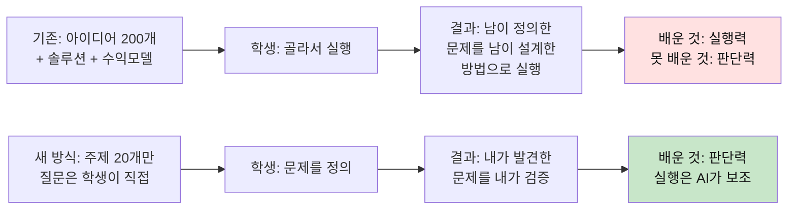

### 20개의 선정 기준

| 기준 | 설명 |
|---|---|
| **보편성** | 초4도, 대3도, 80세도 이 주제 안에 있다 |
| **긴장** | 답이 하나가 아니다. 양쪽 다 일리 있다 |
| **측정 가능** | 관찰·인터뷰·실험으로 데이터를 만들 수 있다 |
| **AI 불가** | AI가 답을 줄 수 없다. 판단이 필요하다 |

---

## 0-1. 전체 지도

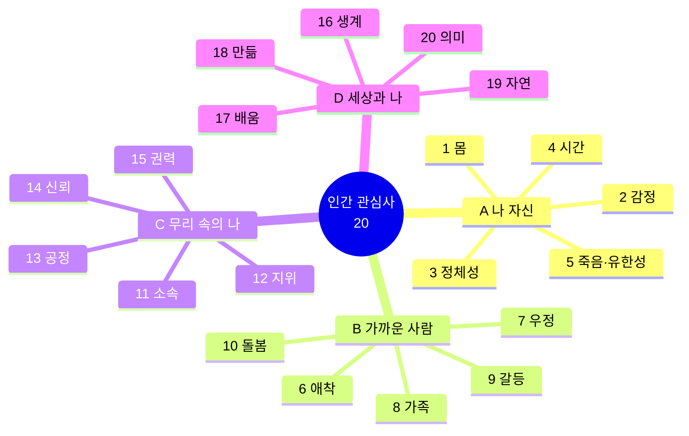

### 생애주기별 해상도 차이

같은 주제인데 **질문의 깊이만 다르다.** 학년별로 주제를 나누지 않는 이유다.

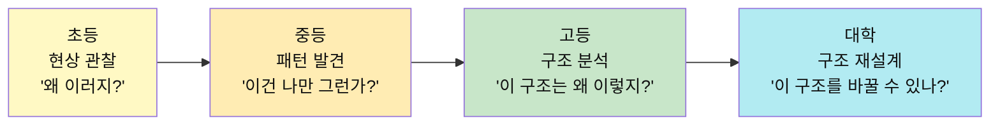

---

## 0-2. 항해 규칙 — 주제에서 프로젝트로 가는 흐름

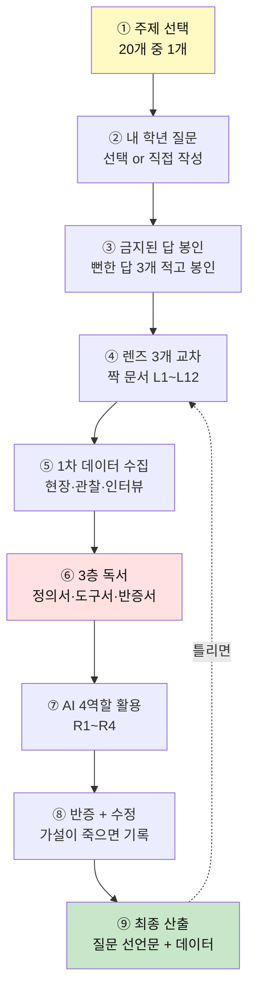

**절대 규칙 4가지**

| # | 규칙 | 이유 |
|---|---|---|
| 1 | 한 학기 = **주제 1개** | 20개 훑기 = 아무것도 안 하기 |
| 2 | **금지된 답**을 먼저 쓴다 | 뻔한 답을 봉인해야 두 번째 생각 시작 |
| 3 | **반대편 인터뷰** 필수 | 내 결론으로 손해 보는 사람 1명 만남 |
| 4 | **실패 기록**이 산출물 | 가설이 죽은 날짜·이유가 최고점 |

---

# 🫀 영역 A. 나 자신 (1~5)

---

## 관심사 ① 몸 — 나는 내 몸의 주인인가, 세입자인가

### 핵심 긴장
> 몸은 내 것인데 내 말을 안 듣는다. 졸려도 못 자고, 배불러도 먹는다.

### 학년별 질문 사다리

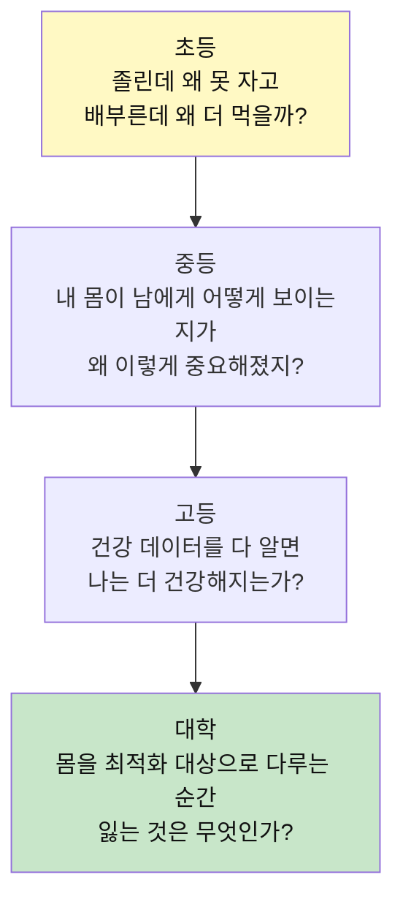

### 주력 렌즈

| 렌즈 | 이 주제에서 보이는 것 |
|---|---|
| L5 다중원인 | 수면 부족의 원인이 게임만이 아님 (학원·불안·사회적 압력) |
| L6 시스템역학 | "일찍 자라" → 숙제 미완 → 감점 → 불안 → 못 잠 → 악순환 |
| L11 편향 | "나는 건강하다"는 확신이 데이터를 무시하게 만듦 |

### 금지된 답 예시
```
🚫 건강 앱 (이미 3만 개), 수면 챌린지 캠페인, 운동 습관 앱
→ 진짜 질문: "왜 알면서도 안 하는가" — 이건 앱이 아니라 동기·환경의 문제
```

### 프로젝트 경로 (단계별)

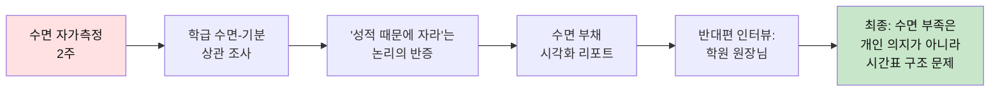

### 📋 실천 워크시트 — 수면 마찰 로그

> 7일간 아래 표를 매일 채운다. AI 사용 금지. 본인 체감만 기록.

| 날짜 | 잠든 시각 | 일어난 시각 | 자기 전 한 일 | 기분 (1~10) | "원래 이런 거야"라고 넘긴 것 |
|---|---|---|---|---|---|
| 월 | | | | | |
| 화 | | | | | |
| 수 | | | | | |
| 목 | | | | | |
| 금 | | | | | |
| 토 | | | | | |
| 일 | | | | | |

**분석 질문** (마지막 칸이 핵심):
1. "원래 이런 거야"로 넘긴 것 중, 사실은 **바뀔 수 있는 것**은?
2. 수면 시간과 기분의 관계는 내 데이터에서 보이는가?
3. 자기 전 한 일 중, **내가 고른 것 vs 해야 해서 한 것**의 비율은?

### 3층 독서 가이드

| 층 | 역할 | 예시 자료 | 읽는 법 |
|---|---|---|---|
| **1층 정의서** | 수면을 다시 정의 | 수면과학 입문서 | "수면은 __이다"를 3개 후보로 |
| **2층 도구서** | 측정법 | 수면 다이어리 양식, 액티그래피 원리 | 필요한 챕터만 |
| **3층 반증서** | 내 주장 부수기 | "수면 8시간은 신화" 류 반론 | 내 결론의 약점 3개 찾기 |

### AI 역할 배정

| 역할 | 프롬프트 예시 | 산출물 |
|---|---|---|
| R2 소크라테스 | "수면 부족이 왜 문제인지 내가 답할 테니 질문만 던져라" | 문제 재정의 |
| R4 시뮬레이터 | "학교 시작 시간을 1시간 늦추면 어디가 나빠지는가" | 2차 효과 5개 |
| R1 반대편 | "학원 원장 입장에서 등교 시간 연기를 반박하라" | 반론 3개 |

### 최종 산출물 예시

```
질문 선언문:
나는 우리 반 학생이 주중 평균 6시간 미만 수면하는 것은
개인의 자기관리 부족이 아니라 [학원 시간표 + 학교 0교시]가
만드는 구조적 시간 부족 때문이라고 본다.

내가 틀렸다면:
학원을 안 다니는 학생도 같은 수면 시간이어야 한다.
→ 조사 결과: 학원 미수강 학생 평균 7.2시간 ← 차이 있음 → 가설 유지

가장 싼 테스트:
학원 없는 날과 있는 날의 수면 시간 비교 (비용 0원, 7일)
```

---

## 관심사 ② 감정 — 감정은 신호인가, 소음인가

### 핵심 긴장
> 감정을 없애고 싶은데, 없애면 판단도 못 한다.

### 학년별 질문 사다리

| 학년 | 질문 | 관찰 대상 |
|---|---|---|
| 초 | "화가 났을 때 내 몸에서는 무슨 일이 일어나지?" | 화난 순간의 몸 반응 3개 기록 |
| 중 | "나는 진짜 슬픈 걸까, 슬퍼야 할 것 같아서 슬픈 걸까?" | 감정과 상황의 일치도 |
| 고 | "감정을 데이터로 기록하면 감정이 관리 대상이 되는가?" | 기록이 감정 체험을 바꾸는지 |
| 대 | "AI가 내 감정을 나보다 잘 알 때, 내 감정은 누구 것인가?" | AI 감정 분석과 자기 보고의 불일치 |

### 금지된 답
```
🚫 감정 일기 앱 (포화), 힐링 콘텐츠, 명상 앱
→ 진짜 빈 곳: "감정에 이름이 없어서 못 말하는 상태"
```

### 프로젝트 경로

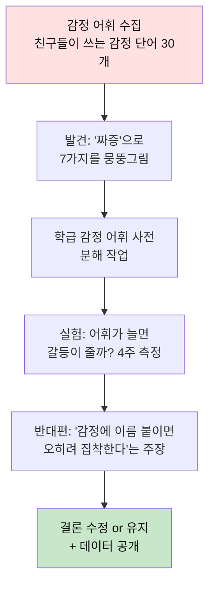

### 📋 실천 워크시트 — 감정 어휘 분해표

| "짜증"이라고 했던 순간 | 실제로는 뭐였을까? | 그때 몸은? | 비슷한 단어 3개 |
|---|---|---|---|
| 수업 중 지명 | 당황 + 분노 | 얼굴 빨개짐 | 창피, 억울, 놀람 |
| 동생이 물건 만짐 | 영역 침범 | 주먹 쥐어짐 | 불쾌, 방어, 분노 |
| 숙제 많을 때 | 무력감 | 축 처짐 | 지침, 포기, 답답 |
| | | | |

**분석 질문:**
1. "짜증" 안에 몇 종류의 다른 감정이 있었는가?
2. 감정의 종류에 따라 몸 반응이 달랐는가?
3. 정확한 단어가 있었으면 상대에게 다르게 말할 수 있었을 순간은?

### 3층 독서

| 층 | 예시 | 읽기 목표 |
|---|---|---|
| 1층 | 감정 구성 이론 입문 | "감정은 발견이 아니라 구성이다"로 재정의 |
| 2층 | 감정 어휘 분류 체계(러셀의 감정 원형) | 분류 도구 확보 |
| 3층 | "감정 표현이 오히려 갈등을 키운다"는 반론 | 내 전제 타격 |

### AI 역할

| 역할 | 용도 |
|---|---|
| R2 소크라테스 | "감정에 이름이 필요한 이유를 설명해봐라" — 질문만 |
| R3 사냥개 | 감정 어휘 연구 원논문 위치 (요약 금지) |
| R1 반대편 | "언어화하면 과몰입한다"는 입장에서 공격 |

---

## 관심사 ③ 정체성 — 나는 발견되는가, 만들어지는가

### 핵심 긴장
> "진짜 나를 찾아라" 하면서, 동시에 "바뀌어라"고 한다.

### 학년별 질문 사다리

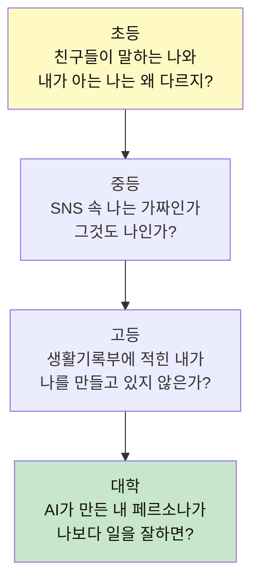

### 금지된 답
```
🚫 MBTI 유형화, 자기소개서 작성, 나 찾기 워크숍
→ 이것들은 답을 닫는다.
→ 진짜 질문: 맥락별로 다른 나가 전부 나라면, '나'라는 것의 단위는 무엇인가?
```

### 📋 실천 워크시트 — 나를 아는 사람 인터뷰

나를 아는 10명에게 "나를 한 단어로" 수집. 그 불일치가 데이터다.

| 사람 | 관계 | 한 단어 | 내 예상과 일치? | 그 맥락에서 내가 보여주는 나 |
|---|---|---|---|---|
| 엄마 | 가족 | | ⭕/❌ | |
| 단짝 | 친구 | | ⭕/❌ | |
| 담임 | 교사 | | ⭕/❌ | |
| 같은 반 A | 반 친구 | | ⭕/❌ | |
| 온라인 친구 | 게임 | | ⭕/❌ | |
| | | | | |

**분석 질문:**
1. 불일치가 가장 큰 두 사람 사이에 공통점은?
2. **맥락별로 다른 나**를 그려보면 어떤 패턴이 나오는가?
3. "이건 진짜 내가 아니야"라고 느낀 순간, 그 판단의 근거는 무엇이었나?

### 프로젝트 경로

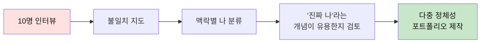

---

## 관심사 ④ 시간 — 시간은 자원인가, 삶 그 자체인가

### 핵심 긴장
> 아껴 쓰라는데, 아끼는 순간 즐기지 못한다.

### 학년별 질문

| 학년 | 질문 |
|---|---|
| 초 | "재미있으면 왜 시간이 빨리 가지?" |
| 중 | "내 하루 중 **진짜 내가 고른 시간**은 몇 분일까?" |
| 고 | "효율을 높인 만큼 여유가 생겼는가, 일이 늘었는가?" |
| 대 | "AI가 시간을 벌어줬는데 왜 더 바쁜가?" |

### 금지된 답
```
🚫 시간 관리 앱, 투두리스트, 뽀모도로
→ 진짜 발견: 효율화로 번 시간은 즉시 새 일로 채워진다
→ 이 역설을 직접 데이터로 확인하면 시간관리 책 10권보다 강하다
```

### 📋 실천 워크시트 — 시간 주권 조사

7일간 **30분 단위로 기록**. 핵심은 "내가 골랐는가" 칸.

| 시간 | 한 일 | 내가 골랐나? (Y/N) | 이걸 안 하면 생기는 결과 | 기분 |
|---|---|---|---|---|
| 07:00 | 기상 | N | 지각 | 3 |
| 07:30 | 등교 | N | 결석 | 4 |
| ... | | | | |
| 22:00 | 유튜브 | Y | 없음 | 7 |
| 22:30 | 숙제 | N | 감점 | 2 |

**7일 후 분석:**

| 항목 | 시간 | 비율 |
|---|---|---|
| 내가 고른 시간 (Y) | ___시간 | ___% |
| 시스템이 정한 시간 (N) | ___시간 | ___% |
| 기분 평균 (Y 시간) | ___ | |
| 기분 평균 (N 시간) | ___ | |

**핵심 질문:**
> "내가 고른 시간의 비율은 학년이 올라갈수록 늘어나는가, 줄어드는가?"
> (대부분 줄어든다. 이 발견이 프로젝트의 시작점)

### 프로젝트 경로

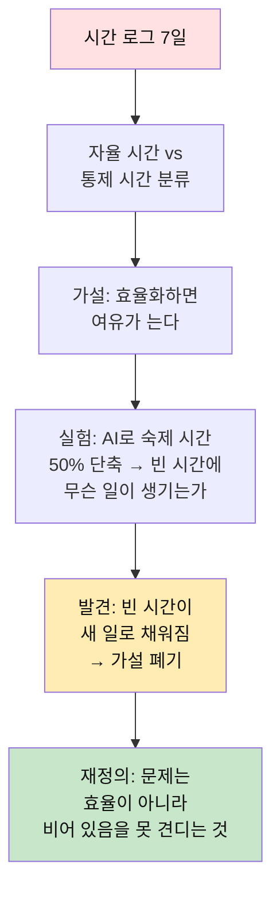

---

## 관심사 ⑤ 죽음·유한성 — 끝이 있다는 걸 알면 무엇이 달라지나

### 핵심 긴장
> 유한하다는 걸 알지만, 무한한 것처럼 산다.

### 학년별 질문

| 학년 | 질문 | 진입점 |
|---|---|---|
| 초 | "키우던 것이 죽었을 때 왜 이렇게 슬프지?" | 반려동물, 식물 |
| 중 | "사라지는 것과 잊히는 것 중 뭐가 더 무섭지?" | 졸업, 이사 |
| 고 | "남은 시간이 정해져 있다면 지금 계획은 바뀌는가?" | 입시 카운트다운 |
| 대 | "기록이 영원히 남는 시대에 죽음의 의미는 바뀌었는가?" | 디지털 유산 |

### 금지된 답
```
🚫 추모 앱, 타임캡슐, 버킷리스트
→ 📌 함정: 무겁다고 피하는 것.
→ 초등도 반려동물 죽음으로 이미 이 주제 안에 있다.
→ 진짜 질문은 "유한성이 행동을 바꾸는가"에 있다.
```

### 📋 실천 워크시트 — 사라진 것 목록

| 사라진 것 | 언제 | 나의 반응 | 지금 생각하면 | 기록이 남아 있는가 |
|---|---|---|---|---|
| 금붕어 | 초2 | 울었음 | 첫 상실 경험 | 사진 1장 |
| 옛 친구 | 이사 | 아쉬움 | 연락 끊김 | 카톡 대화 |
| 할머니댁 | 재개발 | 무감각 | 나중에 슬펐음 | 없음 |
| | | | | |

**분석 질문:**
1. 기록이 없는 사라짐은 어떻게 기억되는가?
2. 기록이 영원히 남으면 "잊힘"은 사라지는가?
3. 잊히는 것이 때로는 필요한 경우는?

---

# 🤝 영역 B. 가까운 사람 (6~10)

---

## 관심사 ⑥ 애착 — 왜 어떤 사람은 못 놓는가

### 학년별 질문

| 학년 | 질문 |
|---|---|
| 초 | "엄마랑 떨어지면 왜 불안하지?" |
| 중 | "좋아하는 마음과 인정받고 싶은 마음은 다른가?" |
| 고 | "의존은 나쁜 건가, 인간의 기본값인가?" |
| 대 | "AI에게 애착을 느끼는 것은 문제인가?" |

### 금지된 답
```
🚫 관계 상담 앱, 애착유형 테스트, 자존감 워크숍
→ 진짜 질문: "건강한 관계" 기준은 누가 정했는가?
```

### 📋 실천 워크시트 — 애착 대상 지도

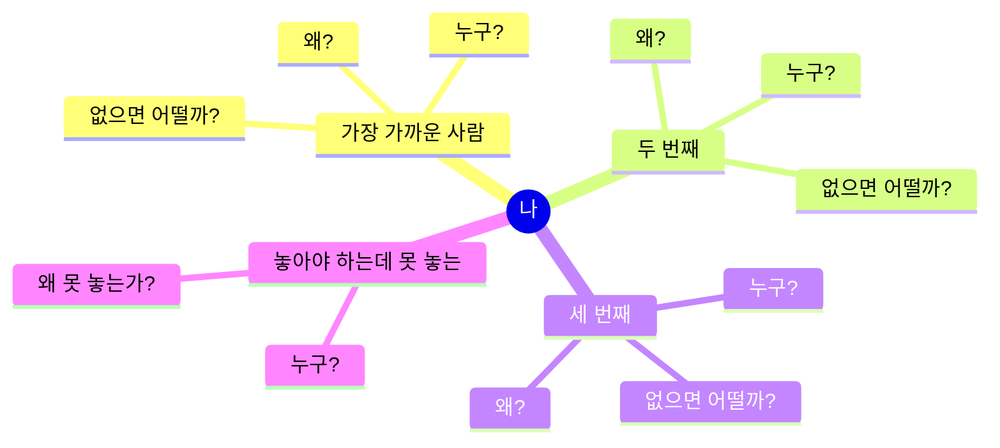

| 대상 | 애착의 방향 (나→그/그→나) | 의존인가 선택인가 | 없으면 실질적으로 못 하는 것 |
|---|---|---|---|
| | | | |
| | | | |

---

## 관심사 ⑦ 우정 — 친구는 선택인가, 상황인가

### 핵심 긴장
> 친구를 "골랐다"고 생각하지만, 대부분 옆에 앉아서 친해졌다.

### 학년별 질문

| 학년 | 질문 | 데이터 수집법 |
|---|---|---|
| 초 | "짝꿍이 되면 왜 친해지지?" | 짝 변경 전후 관계 변화 |
| 중 | "무리에서 빠지면 왜 그렇게 무섭지?" | 소속 포기 비용 조사 |
| 고 | "이 관계는 우정인가, 서로의 필요인가?" | 관계의 기능 분석 |
| 대 | "옮겨 다닐수록 관계는 왜 얕아지는가?" | 관계 수명 추적 |

### 금지된 답
```
🚫 친구 매칭 앱, 우정 캠페인, 1인1친구 제도
→ 관찰하면: 선택이 아니라 배치가 관계를 만든다
```

### 📋 실천 워크시트 — "친해진 계기" 수집

20건을 수집하고 **계기의 유형을 분류**한다.

| # | 친구 | 친해진 계기 | 유형 분류 |
|---|---|---|---|
| 1 | | | ⬜ 근접성 (옆자리) ⬜ 공통 관심 ⬜ 사건 공유 ⬜ 의도적 선택 |
| 2 | | | ⬜ 근접성 ⬜ 공통 관심 ⬜ 사건 공유 ⬜ 의도적 선택 |
| 3 | | | ⬜ 근접성 ⬜ 공통 관심 ⬜ 사건 공유 ⬜ 의도적 선택 |
| ... | | | |
| 20 | | | |

**집계:**

| 유형 | 건수 | 비율 |
|---|---|---|
| 근접성 (옆자리, 같은 반) | | |
| 공통 관심 | | |
| 사건 공유 (힘든 일, 여행) | | |
| 의도적 선택 | | |

> **대부분의 학생에게서 근접성이 50% 이상.** 이 발견 하나가 "우정은 의지"라는 통념을 흔든다.

### 프로젝트 경로 (심화 예시)

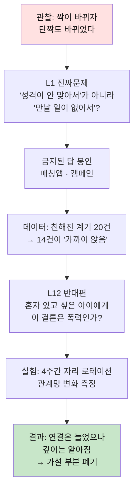

**3층 독서:**
- 1층: 관계와 우정의 정의를 다룬 책 → "친함"을 3개 후보로
- 2층: 소시오그램 그리기 방법 (관계망 도구)
- 3층: **혼자 있는 시간의 가치** 옹호 → "연결 = 좋은 것" 전제 타격

**최종 산출:**
- 「우리 반 자리 배치 제안서」 + **실패 기록** ("연결 수는 늘었지만 친밀도는 떨어졌다")
- 📌 **앱을 하나도 안 만들었는데** 인간관계의 구조적 원인을 데이터로 만졌다.

---

## 관심사 ⑧ 가족 — 가장 가까운데 왜 가장 어려운가

### 학년별 질문

| 학년 | 질문 |
|---|---|
| 초 | "가족한테는 왜 더 심하게 말하지?" |
| 중 | "부모님의 걱정은 사랑인가 통제인가?" |
| 고 | "나는 부모의 미완성 계획을 대신 사는가?" |
| 대 | "돌봄의 책임은 어떻게 분배되어야 하는가?" |

### 📋 실천 워크시트 — 가족 대화 패턴 분석

3일간 가족 대화를 **양과 유형만** 기록 (내용 기록 아님).

| 시간 | 상대 | 대화 유형 | 누가 시작? | 끝 분위기 |
|---|---|---|---|---|
| | | ⬜ 지시 ⬜ 정보교환 ⬜ 감정 공유 ⬜ 잡담 | 나/상대 | 좋음/보통/나쁨 |
| | | | | |

**분석:**
1. "지시" 비율은 몇 %인가?
2. "감정 공유" 비율은 몇 %인가?
3. 규칙 하나를 바꿀 수 있다면? (예: 식사 중 폰 금지 → 대화량 변화 측정)

---

## 관심사 ⑨ 갈등 — 싸움은 실패인가, 필수 과정인가

### 학년별 질문

| 학년 | 질문 |
|---|---|
| 초 | "왜 사과했는데도 안 풀리지?" |
| 중 | "중립은 정말 공정한가?" |
| 고 | "합의는 왜 대체로 약자에게 불리한가?" |
| 대 | "갈등을 없앤 조직이 왜 더 빨리 망하는가?" |

### 금지된 답
```
🚫 갈등 중재 앱, 평화 캠페인
→ L6 적용: 갈등을 제거하면 → 불만이 누적 → 폭발 → 더 큰 갈등
→ 진짜 질문: "어떤 갈등이 건강하고 어떤 갈등이 독인가"의 기준
```

### 📋 실천 워크시트 — 갈등 분류표

최근 1달 갈등 사례 5건 수집.

| 갈등 | 표면 이유 | 숨겨진 이유 (L1) | 분석수준 (L7) | 결과 | 남은 찌꺼기 |
|---|---|---|---|---|---|
| 친구와 다툼 | 장난이 심함 | 인정 경쟁 | 개인 관계 | 사과 | 약간 남음 |
| 부모님 충돌 | 게임 시간 | 자율권 vs 보호 | 가족 규칙 | 타협 | 많이 남음 |
| | | | | | |

---

## 관심사 ⑩ 돌봄 — 돌봄은 왜 보이지 않는 노동인가

### 학년별 질문

| 학년 | 질문 |
|---|---|
| 초 | "우리 집 일은 누가 제일 많이 하지?" |
| 중 | "왜 돌보는 일은 티가 안 날까?" |
| 고 | "돌봄에 값을 매기면 존엄이 훼손되는가?" |
| 대 | "AI 돌봄은 돌봄인가, 관리인가?" |

### 📋 실천 워크시트 — 가정 돌봄 시간 측정

1주일간 가족 구성원별 돌봄 행위 시간을 **관찰로** 측정.

| 행위 | 엄마 | 아빠 | 나 | 기타 |
|---|---|---|---|---|
| 식사 준비 | ___분 | ___분 | ___분 | |
| 설거지 | | | | |
| 청소 | | | | |
| 빨래 | | | | |
| 돌봄(동생, 어르신) | | | | |
| 감정 돌봄(위로, 걱정) | | | | |
| **합계** | | | | |
| **시급 환산 (×최저시급)** | | | | |

> 마지막 줄이 충격이다. 그리고 **그 환산이 옳은지** 토론하는 것이 3층 독서의 역할.

---

# 🏛 영역 C. 무리 속의 나 (11~15)

---

## 관심사 ⑪ 소속 — 끼는 것과 나답게 있는 것의 충돌

### 학년별 질문

| 학년 | 질문 |
|---|---|
| 초 | "왜 나만 빼고 노는 것 같지?" |
| 중 | "무리에 맞추려고 포기한 건 뭐지?" |
| 고 | "소속감은 어디까지가 안전이고 어디부터 순응인가?" |
| 대 | "커뮤니티는 왜 결국 배제로 유지되는가?" |

### 📋 실천 워크시트 — 소속 비용 계산

| 내가 속한 무리 | 들어가기 위해 포기한 것 | 유지하기 위해 맞추는 것 | 이탈하면 잃는 것 |
|---|---|---|---|
| 반 그룹 | | | |
| 온라인 커뮤니티 | | | |
| 동아리 | | | |
| 가족 | | | |

**질문**: "포기한 것"과 "잃는 것" 중 어느 쪽이 더 큰가?

---

## 관심사 ⑫ 지위 — 비교는 왜 멈추지 않는가

### 학년별 질문

| 학년 | 질문 |
|---|---|
| 초 | "1등이 왜 그렇게 좋지?" |
| 중 | "등수가 없으면 나는 나를 뭐라고 설명하지?" |
| 고 | "노력의 대가인가, 출발선의 차이인가?" |
| 대 | "능력주의는 왜 패자에게 더 잔인한가?" |

### 📋 실천 워크시트 — 비교 순간 로그

3일간 "비교한 순간"을 모두 기록.

| 시각 | 비교 대상 | 비교 기준 | 출처(SNS/성적/외모/기타) | 비교 후 감정 | 행동 변화 |
|---|---|---|---|---|---|
| | | | | | |

**집계:**

| 비교 기준 | 건수 | 비율 |
|---|---|---|
| 성적/등수 | | |
| 외모/신체 | | |
| 소유물/경제 | | |
| 인기/관계 | | |
| 능력/재능 | | |

**실험**: 비교 출처(SNS 등) 차단 2주 → 비교 빈도 변화 측정 → 뭐가 좋아지고 뭐가 무너지는지

---

## 관심사 ⑬ 공정 — 같게 주는 것과 필요만큼 주는 것

### 학년별 질문

| 학년 | 질문 |
|---|---|
| 초 | "똑같이 나누는 게 항상 공평한가?" |
| 중 | "우리 반 규칙은 누구에게 유리한가?" |
| 고 | "기회의 평등과 결과의 평등 중 무엇을 택할 것인가?" |
| 대 | "알고리즘의 공정 기준은 누가 정하는가?" |

### 📋 실천 워크시트 — 학급 규칙 감사(audit)

학급 규칙을 **전수 조사**하여 수혜자/피해자를 지목한다.

| 규칙 | 목적 | 수혜자 | 피해자 | 바꾸면 좋아지는 것 | 바꾸면 나빠지는 것 |
|---|---|---|---|---|---|
| 발표 가산점 | 참여 독려 | 말 잘하는 학생 | 내성적 학생 | 다양한 참여 인정 | 발표 동기 감소 |
| 지각 벌점 | 질서 유지 | 가까운 학생 | 먼 학생 | 형평 | 규율 이완 |
| | | | | | |

**프로젝트**: 규칙 1개 개정안 작성 + 시범 적용 + **부작용 추적**

---

## 관심사 ⑭ 신뢰 — 무엇을 믿을지 어떻게 정하는가

### 핵심 긴장
> 2032년, AI 생성물이 기본값인 시대의 **최상위 시민 역량.**

### 학년별 질문

| 학년 | 질문 |
|---|---|
| 초 | "이 말이 진짜인지 어떻게 알아?" |
| 중 | "많은 사람이 믿으면 사실이 되나?" |
| 고 | "출처가 확실해도 틀릴 수 있는 이유는?" |
| 대 | "AI가 생성한 근거를 어떻게 검증하는가?" |

### 📋 실천 워크시트 — 반 친구들의 확신 지도

**목표**: 친구들이 믿는 정보 20개 수집 → 출처 추적

| # | 정보 (친구가 확신하는 것) | 출처 물어봄 | 원출처 도달? | 결론 |
|---|---|---|---|---|
| 1 | "물 2리터 마셔야 해" | "그냥 다들 그래" | ❌ | 근거 없는 확신 |
| 2 | | | | |
| 3 | | | | |
| ... | | | | |
| 20 | | | | |

**집계:**

| 구분 | 건수 | 비율 |
|---|---|---|
| 원출처 도달 | | |
| 2차 자료만 | | |
| 출처 없음 ("다들 그래") | | |

### 심화 예시 (중3)

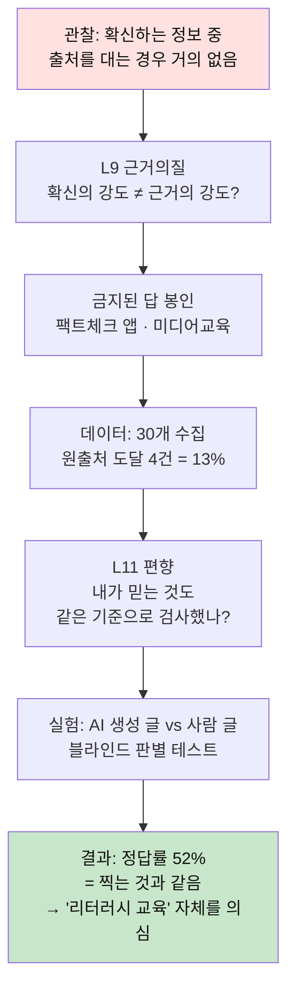

**만점 포인트**: 자기 프로젝트의 전제(=교육하면 나아진다)를 스스로 반증.

---

## 관심사 ⑮ 권력 — 누가 정하고, 왜 그 사람이 정하는가

### 학년별 질문

| 학년 | 질문 |
|---|---|
| 초 | "왜 어른 말은 들어야 하지?" |
| 중 | "학교 규칙은 누가 만들었지?" |
| 고 | "우리가 참여했다고 하는 결정은 실제로 무엇을 바꿨나?" |
| 대 | "구조를 바꾸지 않는 참여는 무엇을 하는가?" |

### 📋 실천 워크시트 — 의사결정 추적

학교에서 일어나는 결정 5건의 **실제 결정권자**를 추적한다.

| 결정 사항 | 공식 결정권자 | 실제 결정자 | 학생 의견 반영? | 반영된 양 (0~100%) |
|---|---|---|---|---|
| 교복 변경 | 학교운영위 | 교장 | "설문함" | 10% |
| 축제 프로그램 | 학생회 | 담당 교사 | 형식적 | 30% |
| 시험 범위 | 교과부장 | 교과부장 | 없음 | 0% |
| | | | | |

**질문**: "참여"라고 불리지만 실제로 바뀐 것이 없는 결정은 몇 건인가?

---

# 🌍 영역 D. 세상과 나 (16~20)

---

## 관심사 ⑯ 생계 — 돈은 목적인가, 자유의 조건인가

### 핵심 긴장
> 2032년 만드는 비용이 0에 수렴. 배워야 할 것은 수익모델이 아니라 **가치가 어디서 생기는가.**

### 학년별 질문

| 학년 | 질문 |
|---|---|
| 초 | "용돈은 왜 주는 걸까? 일한 대가인가 사랑인가?" |
| 중 | "내 시간을 팔 때 값은 누가 정하지?" |
| 고 | "가격은 가치를 반영하는가?" |
| 대 | "AI가 실행을 다 하면 인간 노동의 값은 무엇으로 매겨지는가?" |

### 금지된 답
```
🚫 수익모델 설계, 용돈벌이 프로젝트, 창업 시뮬레이션
→ 진짜 질문: "왜 같은 물건이 가게마다 가격이 다른가"를 파면
  원가·노동·브랜드·위치가 분해되고, 이게 경제 이해의 진입점
```

### 📋 실천 워크시트 — 동네 가격 추적

같은 물건을 **3곳에서 가격 조사 + 차이의 이유를 추정**.

| 물건 | 편의점 | 마트 | 온라인 | 가격 차이 이유 추정 |
|---|---|---|---|---|
| 물 500ml | ₩1,200 | ₩700 | ₩500 | 편의점=편리성, 마트=유통, 온라인=대량 |
| 삼각김밥 | | | | |
| 볼펜 | | | | |
| | | | | |

**분석:**
1. 가격 차이 중 **물건 자체의 차이**는 몇 %이고 **상황의 차이**는 몇 %인가?
2. "비싼 걸 아는데 편의점에서 사는 이유"는 무엇인가? (→ 이것이 행동경제학의 진입점)

---

## 관심사 ⑰ 배움 — 왜 배우는가, AI가 다 아는데 왜 내가 알아야 하는가

### 핵심 긴장
> 2032년의 가장 뜨거운 질문. AI에 아웃소싱하면 안 되는 영역은 어디인가.

### 학년별 질문

| 학년 | 질문 |
|---|---|
| 초 | "외운 건 왜 금방 까먹지?" |
| 중 | "이해했다는 걸 어떻게 확인하지?" |
| 고 | "AI가 답을 아는 걸 나는 왜 알아야 하나?" |
| 대 | "무엇을 아웃소싱하면 안 되는가?" |

### 📋 실천 워크시트 — AI vs 직접 학습 비교 실험

**이건 반드시 직접 실험해야 한다.** "AI 쓰면 안 된다"는 훈계는 안 먹히지만, **자기 데이터로 확인한 망각률**은 평생 간다.

| 항목 | A조: AI 요약으로 학습 | B조: 직접 정리로 학습 |
|---|---|---|
| 학습 내용 | (같은 내용) | (같은 내용) |
| 학습 시간 | ___분 | ___분 |
| 직후 테스트 | ___/10 | ___/10 |
| **2주 후 테스트** | ___/10 | ___/10 |
| 남에게 설명 가능? | ⭕/❌ | ⭕/❌ |
| 응용 문제 적용? | ⭕/❌ | ⭕/❌ |

**핵심 발견 예상**: 직후 테스트는 비슷하지만, 2주 후 격차가 벌어진다.
→ **이 데이터를 갖고 있는 학생**은 "왜 내가 해야 하나"에 스스로 답할 수 있다.

### 프로젝트 경로

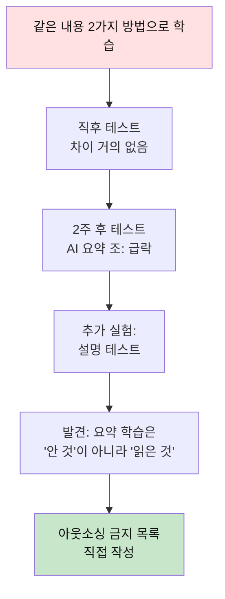

---

## 관심사 ⑱ 만듦 — 무엇이 나의 창작인가

### 핵심 긴장
> 모두가 잘 만드는 시대에, 차이를 만드는 것은 무엇인가.

### 학년별 질문

| 학년 | 질문 |
|---|---|
| 초 | "AI가 그려준 그림은 내 그림인가?" |
| 중 | "따라 그리기와 배우기의 경계는?" |
| 고 | "AI 결과물에서 내 기여는 어디인가?" |
| 대 | "모두가 잘 만드는 시대에 무엇이 차이를 만드는가?" |

### 📋 실천 워크시트 — 3버전 블라인드 실험

같은 주제를 3가지 방법으로 만들고 **블라인드 평가**.

| 항목 | A: AI 100% | B: AI + 수정 | C: 손 100% |
|---|---|---|---|
| 제작 시간 | ___분 | ___분 | ___분 |
| 완성도 (타인 평가) | ___/10 | ___/10 | ___/10 |
| "마음에 드는가" (본인) | ___/10 | ___/10 | ___/10 |
| "누가 만든 것 같나" (블라인드) | | | |

**블라인드 평가자 반응:**

| 평가자 | A 선택 | B 선택 | C 선택 | "차이를 느낀 곳" |
|---|---|---|---|---|
| 친구 1 | | | | |
| 친구 2 | | | | |
| 부모님 | | | | |
| 선생님 | | | | |

**핵심 질문**: 사람들이 차이를 느낀 곳은 **완성도**인가 **맥락/의도**인가?

### 심화 예시 (고2 · ⑯생계 + ⑱만듦 융합)

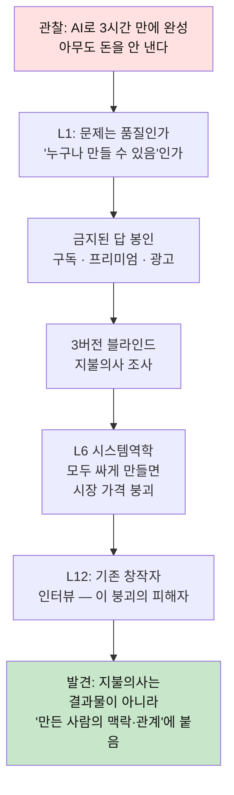

---

## 관심사 ⑲ 자연 — 나는 자연의 일부인가, 사용자인가

### 학년별 질문

| 학년 | 질문 |
|---|---|
| 초 | "우리 동네에 원래 살던 것들은 뭐였지?" |
| 중 | "편리함의 값은 누가 내고 있지?" |
| 고 | "친환경 제품은 정말 환경에 좋은가?" |
| 대 | "'지속가능성'은 누구의 삶을 지속시키는가?" |

### 금지된 답
```
🚫 분리수거 캠페인, 텀블러 사용, 플로깅
→ L6 적용: 개인 실천 강조는 생산 책임을 가려주는 기능을 한다
→ 진짜 질문: "내 실천이 구조를 바꾸는가, 면죄부인가"
```

### 📋 실천 워크시트 — 하루 쓰레기 전수 기록

하루 동안 버린 것 **전부** 기록.

| # | 품목 | 소재 | 재활용 가능? | 어디서 왔나 (원산지) | 대안 있나? | 대안의 실제 환경 효과 |
|---|---|---|---|---|---|---|
| 1 | 페트병 | PET | O | 제주 → 서울 | 텀블러 | 텀블러 제작 탄소? |
| 2 | 과자 봉지 | 복합필름 | X | 충남 공장 | 벌크숍 | 접근성? |
| 3 | | | | | | |
| ... | | | | | | |

**핵심 발견**: "대안의 실제 환경 효과" 칸에서 **상당수 대안이 생각만큼 좋지 않음**을 발견하는 것이 프로젝트의 출발점.

---

## 관심사 ⑳ 의미 — 무엇을 위해 사는가

### 학년별 질문

| 학년 | 질문 |
|---|---|
| 초 | "재미있는 것과 뿌듯한 것은 뭐가 다르지?" |
| 중 | "남들이 좋다는 걸 원하는 건 내 마음인가?" |
| 고 | "의미는 발견하는 것인가 부여하는 것인가?" |
| 대 | "고통 없는 삶이 좋은 삶인가?" |

### 📋 실천 워크시트 — 뿌듯함 분석

최근 1년 뿌듯했던 순간 10개 수집 → 공통 조건 추출.

| # | 순간 | 난이도 (1~10) | 타인 기여도 (1~10) | 선택 여부 (내 선택/시킨 것) | 뿌듯함 (1~10) |
|---|---|---|---|---|---|
| 1 | | | | | |
| 2 | | | | | |
| ... | | | | | |

**가설 검증:**
> "뿌듯함 = 난이도 × 타인 기여"인가?
> 4주간 의도적으로 난이도·기여도가 다른 활동 → 뿌듯함 측정 → 공식 확인

---

# 📚 3층 독서법 — 상세 매뉴얼

---

## 왜 3층인가

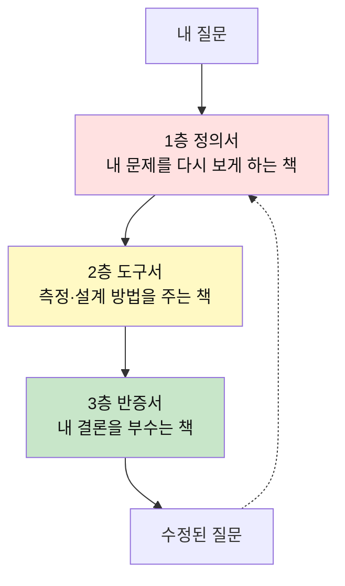

### 교양 독서 vs 프로젝트 독서

| 교양 독서 | 프로젝트 독서 |
|---|---|
| "읽고 느낀 점" | "읽고 **질문이 바뀐 점**" |
| 통독 | 발췌 + 구조 독해 |
| 많이 읽기 | **정확히 3권** (1층·2층·3층) |
| 공감 중심 | **반증 중심** |

### 각 층의 상세 읽기법

#### 1층 정의서 — "이 책은 내 문제를 뭐라고 부르는가"

| 단계 | 행동 | 시간 |
|---|---|---|
| 1 | **목차만 읽기** — 이 책의 전체 논리 구조 파악 | 15분 |
| 2 | 내 문제와 관련된 **챕터 3개만** 선택 | 5분 |
| 3 | 그 3개를 읽으며 "이 책이 문제를 부르는 이름" 추출 | 1시간 |
| 4 | 내 정의와 책의 정의를 비교표로 | 15분 |

**산출물:**
```
이 책이 부르는 이름: ____________
내가 부르던 이름: ____________
다른 점: ____________
→ 재정의: ____________
```

#### 2층 도구서 — "측정법·실험 설계를 훔친다"

| 단계 | 행동 | 시간 |
|---|---|---|
| 1 | "이 책에서 **방법론** 챕터만" 찾기 | 10분 |
| 2 | 내 프로젝트에 쓸 수 있는 **도구 1개** 추출 | 30분 |
| 3 | 그 도구를 **내 상황에 맞게 변형** | 30분 |

**⚠️ 통독 금지.** 2층은 참고서다. 필요한 부분만 뜯어 쓴다.

#### 3층 반증서 — ⭐ "내 결론을 가장 아프게 때리는 책"

| 단계 | 행동 | 시간 |
|---|---|---|
| 1 | 내 입장과 **반대되는** 책을 **의도적으로** 고른다 | 검색 |
| 2 | "이 책이 내 주장을 공격한다면 어디를?" 적으며 읽기 | 1.5시간 |
| 3 | 내 주장의 **약점 3개** 리스트 작성 | 30분 |
| 4 | 그 약점에 대한 대응: 수정 or 폐기 | 30분 |

> **핵심 규칙: 1층·2층 각 1권을 읽었으면, 3층 1권은 의무.**
> 학생들은 자기 생각을 지지하는 책만 읽는다. 그래서 독서량이 늘수록
> **확신만 강해지고 판단은 나빠진다.** 3층이 이걸 막는다.

### 독서 기록 양식 (한 장)

```
📖 [책 제목] / [층: 1·2·3]
이 책이 내 문제를 부르는 이름: ______________
내 정의와 다른 점: ______________
내가 쓸 수 있는 도구 1개: ______________
🔥 이 책이 내 주장을 공격한다면 어디를? ______________
→ 그래서 내 질문은 이렇게 바뀌었다: ______________
```
> **마지막 줄이 비면 그 책은 읽은 게 아니다.**

### 주제별 3층 도서 가이드

| 주제 | 1층 정의서 | 2층 도구서 | 3층 반증서 |
|---|---|---|---|
| ① 몸 | 수면 과학 입문 | 수면 다이어리/액티그래피 | "수면 8시간 신화" 반론 |
| ② 감정 | 감정 구성 이론 | 감정 어휘 분류 체계 | 감정 표현 회의론 |
| ③ 정체성 | 다중자아 심리학 | 인터뷰/질적연구 방법 | 일관된 자아 옹호론 |
| ④ 시간 | 시간 철학 입문 | 시간 로그 양식 | 효율성 찬양론 |
| ⑤ 죽음 | 상실과 애도 | 구술사 인터뷰법 | 불멸 기술 낙관론 |
| ⑥ 애착 | 애착 이론 | 관계 패턴 분석 | 독립성 옹호론 |
| ⑦ 우정 | 우정의 사회학 | 소시오그램 방법 | 고독의 미학 |
| ⑧ 가족 | 가족 체계 이론 | 대화 분석법 | 탈가족 담론 |
| ⑨ 갈등 | 갈등 해결론 | 중재 프로세스 | 건설적 갈등 옹호론 |
| ⑩ 돌봄 | 돌봄 노동론 | 시간 측정법 | 돌봄의 화폐화 반대론 |
| ⑪ 소속 | 소속감 심리학 | 관계망 분석 | 주변부의 자유 |
| ⑫ 지위 | 능력주의 비판 | 비교 로그 양식 | 능력주의 옹호론 |
| ⑬ 공정 | 정의론 입문 | 규칙 감사 양식 | 자유지상주의 입문 |
| ⑭ 신뢰 | 인지편향 입문 | 출처 추적법 | 가짜뉴스 과장론 |
| ⑮ 권력 | 권력 구조 분석 | 의사결정 추적법 | 질서의 필요성 옹호 |
| ⑯ 생계 | 가치와 가격 | 원가 분석법 | 시장 자유주의 입문 |
| ⑰ 배움 | 학습 과학 | 파지율 측정법 | AI 학습 찬성론 |
| ⑱ 만듦 | 창작의 의미 | 블라인드 평가 설계 | AI 창작 긍정론 |
| ⑲ 자연 | 환경 위기론 | 탄소발자국 계산 | 기술낙관 환경론 |
| ⑳ 의미 | 의미 치료 | 행복 측정 척도 | 쾌락주의 옹호 |

> 📌 **이 표는 출발점이지 정답이 아니다.** 학생이 3층 구조에 맞춰 **직접 고르는 것**이 훈련의 일부.

---

# 🤖 AI 연계 — 4개 역할 상세 매뉴얼

---

## 왜 4개로 제한하는가

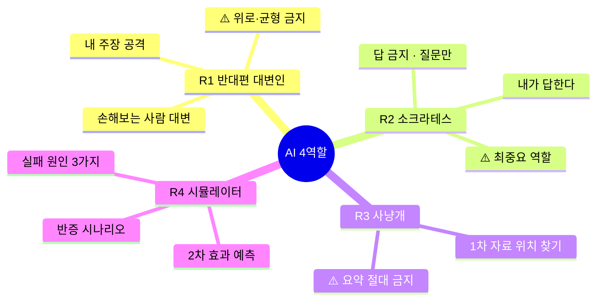

> AI를 "도우미"라 하면 대신 생각하게 된다.
> **역할을 4개로 못 박고 그 밖의 용도는 금지**한다.

---

### R1. 반대편 대변인 (L12)

**프롬프트 템플릿:**
```
너는 내 결론으로 가장 손해를 보는 사람이다.
내 주장: "[여기에 내 결론]"
그 입장에서 가장 아픈 반론 3개를 대라.
위로하거나 균형 잡지 마라.
나를 설득하려 하지 말고 공격하라.
```

**사용 시점:**
- 질문 선언문 작성 후
- 반대편 인터뷰 준비할 때

**예시 — 주제 ⑦ 우정:**
```
내 주장: "자리 배치가 우정을 만드므로 로테이션을 해야 한다"

AI (R1): 너 혼자 있고 싶은 아이에게 이건 폭력이다.
모든 만남을 강제하는 것은 외향적 규범의 지배.
'연결 = 좋은 것'이라는 전제 자체가 치우쳐 있다.
로테이션 거부권 없으면 이건 사교 강제 프로그램.
```

---

### R2. 소크라테스 (문제 정의 단계)

**프롬프트 템플릿:**
```
지금부터 어떤 답도 주지 마라. 질문만 하라.
내 문제 정의: "[여기]"
이 정의가 증상을 문제로 착각하고 있는지 알아내도록,
한 번에 질문 하나씩만 던져라.
내가 답하면 다음 질문으로.
```

> ⚠️ **이 역할이 가장 중요하다.** 답을 막는 프롬프트가 사고를 살린다.

**사용 시점:**
- 프로젝트 시작 시 문제 정의를 다듬을 때
- 가설이 흔들릴 때

**예시 대화 — 주제 ② 감정:**
```
나: "우리 반 친구들이 감정 표현을 못해서 갈등이 생긴다"
AI: 감정 표현을 못 하는 건 어떻게 확인했어?
나: 싸울 때 말 대신 삐지거나 무시해
AI: 삐지는 것은 감정 표현이 아닌가?
나: ... (멈춤) ... 표현을 못 하는 게 아니라 특정 방식으로만 하는 건가?
AI: 그렇다면 문제는 "표현 부족"인가 "표현 레퍼토리 부족"인가?
나: 레퍼토리 부족이다. 문제 재정의!
```

---

### R3. 1차 자료 사냥개 (L9)

**프롬프트 템플릿:**
```
이 주제의 원자료(원논문·통계 원표·1차 기록)가
어디 있는지 '위치와 접근법'만 알려줘라.
내용 요약은 하지 마라.
각 자료에 대해:
- 누가 만들었나
- 목적은
- 어떤 한계가 있나
```

> **요약 금지가 핵심.** 요약을 받는 순간 근거는 내 것이 아니게 된다.

**사용 시점:**
- 1차 데이터 수집 전 선행연구 찾을 때

---

### R4. 반증 시뮬레이터 (L6 · L10)

**프롬프트 템플릿:**
```
내 해결책: "[여기]"
① 이게 성공했을 때 나빠지는 것 5가지
② 6개월 뒤 실패했다면 가장 가능성 높은 원인 3가지
③ 내가 틀렸음을 가장 싸게 확인할 실험 1개
   (24시간·1만원 이내)
```

**사용 시점:**
- 솔루션 설계 후
- 실험 전 체크

---

### 🚫 AI 사용 금지 구역

| 금지 항목 | 이유 |
|---|---|
| 문제 정의를 대신 쓰게 하기 | 훈련의 본체를 통째로 넘기는 것 |
| 책 요약으로 3층 독서 대체 | 반증서는 읽고 아파야 효과가 있다 |
| 인터뷰 답변 생성 | 반대편은 **실제 사람**이어야 한다 |
| 최종 결론 작성 | 판단은 아웃소싱 대상이 아니다 |
| 데이터 생성/시뮬레이션 | 1차 데이터는 현장에서만 나온다 |

---

### AI 사용 로그 (제출 필수)

| 단계 | 역할(R1~R4) | 프롬프트 요지 | AI가 준 것 | **내가 버린 것과 이유** |
|---|---|---|---|---|
| 문제 정의 | R2 | "내 문제를 재정의해줘"→❌ "질문만 해줘"→⭕ | 질문 5개 | 질문 3은 관련 없음: 이유___ |
| 반증 | R1 | 반대편 입장에서 공격 | 반론 3개 | 반론 1은 실증 불가: 이유___ |
| | | | | |

> **"내가 버린 것" 칸이 채점 대상이다.** AI 답을 다 받아썼다면 0점.

---

# 📅 한 학기 운영표 (16주 상세)

---

| 주 | 활동 | 독서층 | AI 역할 | 산출물 |
|---|---|---|---|---|
| **1** | 20주제 중 1개 선택 / 마찰 로그 시작 | — | — | 마찰 로그 양식 작성 시작 |
| **2** | 마찰 로그 20건 완성 / 내 학년 질문 선택 | — | — | 마찰 로그 + 질문 후보 3개 |
| **3** | **금지된 답 봉인** + 렌즈 3개 교차 | — | R2 소크라테스 | 금지 목록 + 렌즈 적용 메모 |
| **4** | 1층 정의서 독서 | 1층 | R2 | 문제 재정의 |
| **5** | 원인 지도 + 질문 후보 10개 | — | R4 시뮬레이터 | 원인 지도 + 질문 리스트 |
| **6** | 2층 도구서 독서 + 측정 설계 | 2층 | R3 사냥개 | 측정 지표 1개 + 실험 설계 |
| **7** | **중간 점검**: 질문 심사 (8개 탈락, 2개 유지) | — | R1 반대편 | 심사 기록 |
| **8** | **1차 데이터 수집 (현장)** | — | **🚫 금지** | 관찰/측정 원본 데이터 |
| **9** | **반대편 인터뷰 (실제 사람)** | — | **🚫 금지** | 인터뷰 기록 |
| **10** | 3층 반증서 독서 | 3층 | R1 | 내 주장 약점 3개 |
| **11** | **가설 수정 또는 폐기** | — | R4 | 수정 선언문 or 폐기 기록 |
| **12** | 최소 실험 설계 확정 | — | R4 | 실험 프로토콜 |
| **13** | 최소 실험 실행 (Week 1) | — | — | 실험 로그 |
| **14** | 최소 실험 실행 (Week 2) + 결과 해석 | — | — | 결과 데이터 |
| **15** | 2차 효과 기록 + 최종 정리 | — | R4 | 산출물 5종 완성 |
| **16** | **공개 발표 + 동료 반증** | — | — | 발표 + 동료 피드백 |

> **8·9주차는 AI 사용 전면 금지.** 1차 데이터와 실제 사람은 대체 불가 자원.
> 이 2주가 프로젝트 전체의 신뢰도를 결정한다.

---

# 🏆 평가 루브릭

---

| 항목 | 1점 | 3점 | 5점 |
|---|---|---|---|
| **문제 정의** | 남이 준 문제를 그대로 씀 | 증상과 원인을 구분함 | 원래 문제를 **폐기하고 재정의**함 |
| **렌즈 교차** | 렌즈 1개 | 렌즈 3개 적용 | 렌즈끼리 **충돌**시키고 그 충돌을 다룸 |
| **근거** | AI 요약 인용 | 2차 자료 + 약간의 관찰 | **본인이 만든 1차 데이터** |
| **3층 독서** | 지지 자료만 | 정의서+도구서 | **반증서 포함**, 질문 변화 기록 |
| **반증** | 반증 조건 없음 | 반증 조건 명시 | **실제로 반증되어 가설을 바꾼 기록** |
| **반대편** | 언급 없음 | AI R1로 반론 생성 | **실제 사람** 인터뷰 |
| **2차 효과** | 언급 없음 | 부작용 1개 예상 | 부작용 대응까지 설계 |
| **AI 경계** | 어디까지 AI인지 불명 | 사용 범위 표기 | **AI에 맡기지 않은 이유** 논증 |

> ⭐ **가장 높은 점수를 받는 산출물**: "실패한 프로젝트 + 왜 틀렸는지의 정확한 기록"
> 성공한 프로젝트보다 반증된 프로젝트가 학습 밀도가 높다.

---

# 📝 최종 제출물 5종 상세

---

### ① 질문 선언문 (템플릿)

```
프로젝트 제목: ____________
선택한 주제: [20개 중] ____________
내 학년 질문: ____________

나는 [ 대상 ]이(가) [ 상황 ]에서 [ 진짜 문제 ] 때문에
[ 결과 ]를 겪고 있다고 본다.

봉인한 금지된 답:
1. ____________ (왜 금지했나: ____________)
2. ____________ (왜 금지했나: ____________)
3. ____________ (왜 금지했나: ____________)

적용한 렌즈 3개:
- L__ : 이 렌즈로 보니 ____________
- L__ : 이 렌즈로 보니 ____________
- L__ : 렌즈끼리 충돌한 지점: ____________

내가 틀렸다면: [ 반증 조건 ]이 관찰될 것이다.
가장 싸게 확인하는 방법: [ 24시간·1만원 이내 테스트 ]
```

### ② 1차 데이터 (AI 요약 불가)

```
데이터 유형: ⬜ 관찰 ⬜ 측정 ⬜ 인터뷰 ⬜ 실험
수집 기간: ___월 ___일 ~ ___월 ___일
수집 방법: ____________
표본 크기: ___명/___건
한계점: ____________

[원본 데이터 첨부 — AI 요약이나 정제 없이]
```

### ③ 반대편 인터뷰 기록

```
인터뷰 대상: ____________ (실명 불필요, 관계만)
이 사람이 내 결론으로 손해 보는 이유: ____________
인터뷰 날짜: ____________

핵심 반론 3가지:
1. ____________
2. ____________
3. ____________

이 반론 중 내 가설을 바꾼 것: ____________
바뀐 내용: ____________
```

### ④ 3층 독서 기록 (3장)

(각 층별로 위의 독서 기록 양식 1장씩)
> 3층 반증서의 마지막 줄 "질문이 이렇게 바뀌었다"가 핵심 채점 대상.

### ⑤ AI 사용 로그

(위의 AI 사용 로그 양식)
> "내가 버린 것과 이유" 칸이 핵심 채점 대상.

---

# 🧩 20주제 요약 비교표

---

| # | 주제 | 핵심 긴장 | 초등 질문 키워드 | 대학 질문 키워드 | 금지된 답 |
|---|---|---|---|---|---|
| 1 | 몸 | 주인 vs 세입자 | 졸린데 왜 못 자 | 최적화의 대가 | 건강앱 |
| 2 | 감정 | 신호 vs 소음 | 화나면 몸에서 뭐가 | AI가 감정을 더 잘 안다면 | 감정일기앱 |
| 3 | 정체성 | 발견 vs 구성 | 친구가 보는 나 | AI 페르소나 | MBTI |
| 4 | 시간 | 자원 vs 삶 자체 | 왜 빨리 가지 | 더 바쁜 이유 | 시간관리앱 |
| 5 | 죽음 | 유한 vs 무한처럼 | 키우던 게 죽으면 | 디지털 유산 | 타임캡슐 |
| 6 | 애착 | 의존 vs 기본값 | 떨어지면 불안 | AI 애착 | 관계상담앱 |
| 7 | 우정 | 선택 vs 상황 | 짝꿍이면 친해 | 옮기면 얕아짐 | 매칭앱 |
| 8 | 가족 | 가깝다 vs 어렵다 | 왜 더 심하게 말해 | 돌봄 분배 | 대화앱 |
| 9 | 갈등 | 실패 vs 필수 | 사과했는데 왜 | 갈등 없는 조직 | 중재앱 |
| 10 | 돌봄 | 보이는 vs 안 보이는 | 누가 제일 많이 해 | AI 돌봄 | 돌봄앱 |
| 11 | 소속 | 끼기 vs 나답기 | 나만 빼고 | 배제로 유지 | 커뮤니티앱 |
| 12 | 지위 | 비교 vs 정지 | 1등이 좋은 이유 | 능력주의 잔인함 | 랭킹시스템 |
| 13 | 공정 | 같게 vs 필요만큼 | 똑같이 = 공평? | 알고리즘 공정 | 투표앱 |
| 14 | 신뢰 | 믿기 vs 검증 | 진짜인지 어떻게 | AI 근거 검증 | 팩트체크앱 |
| 15 | 권력 | 순응 vs 참여 | 왜 어른 말 | 구조 안 바뀌는 참여 | 학생회앱 |
| 16 | 생계 | 목적 vs 조건 | 용돈 = 대가 or 사랑 | 인간 노동 가치 | 수익모델 |
| 17 | 배움 | 내가 vs AI가 | 왜 까먹지 | 아웃소싱 금지선 | AI학습앱 |
| 18 | 만듦 | 내 것 vs AI 것 | AI 그림 = 내 그림? | 차이의 원천 | 창작앱 |
| 19 | 자연 | 일부 vs 사용자 | 원래 살던 것 | 지속가능성 for 누구 | 분리수거캠페인 |
| 20 | 의미 | 발견 vs 부여 | 재미 vs 뿌듯함 | 고통 없는 삶 = 좋은 삶? | 버킷리스트 |

---

# 🔗 주제 간 연결 지도

---

20개는 독립이 아니다. 융합 프로젝트는 **주제 2개 이상을 교차**시키는 것이다.

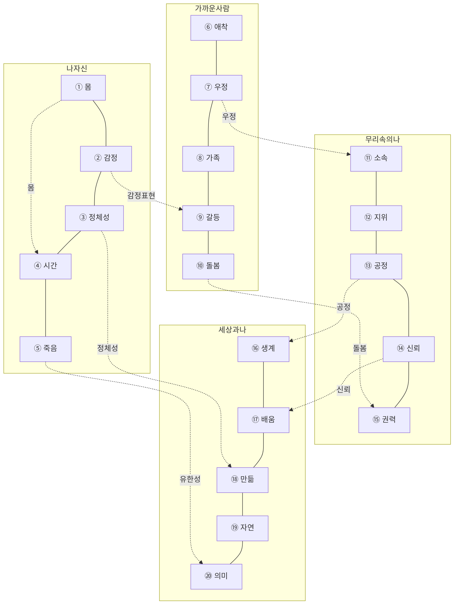

### 융합 프로젝트 예시

| 조합 | 질문 | 충돌 |
|---|---|---|
| ② + ⑨ | "감정 어휘가 늘면 갈등이 줄까?" | 표현이 늘면 갈등도 표면화 |
| ⑦ + ⑪ | "소속을 위해 우정을 소비하는가?" | 소속감 vs 진짜 친밀감 |
| ⑬ + ⑯ | "가격이 공정한지 판단하는 기준은?" | 시장 가격 vs 노동 가치 |
| ⑭ + ⑰ | "AI 요약을 믿을 수 있는가?" | 효율 vs 검증 비용 |
| ⑯ + ⑱ | "만드는 비용이 0이면 가치는 어디에?" | 희소성 이동 |
| ③ + ⑱ | "AI 결과물에서 '나'는 어디에?" | 정체성의 범위 |
| ① + ④ | "수면이 줄면 자유 시간이 느는가?" | 시간 확보 vs 건강 |
| ⑩ + ⑮ | "돌봄이 보이지 않으면 권력은 어디에?" | 돌봄의 정치성 |

---

# 🗂 부록: 빈 워크시트 모음 (복사해서 사용)

---

### A. 마찰 로그 (7일)

| 날짜 | 시각 | 상황 | 내 반응 | "원래 이런 거야"라고 넘긴 것 |
|---|---|---|---|---|
| | | | | |
| | | | | |
| | | | | |
| | | | | |
| | | | | |
| | | | | |
| | | | | |

### B. 질문 후보 10개

> 형식: "어떻게 하면 [누가] [어떤 제약 안에서] [무엇을] 할 수 있을까?"
> ❌ 솔루션 금지 / ⭕ 질문만

| # | 질문 | 반증 가능? | 근거 있음? | 반대편 있음? | 점수 |
|---|---|---|---|---|---|
| 1 | | ⭕❌ | ⭕❌ | ⭕❌ | /3 |
| 2 | | | | | |
| 3 | | | | | |
| 4 | | | | | |
| 5 | | | | | |
| 6 | | | | | |
| 7 | | | | | |
| 8 | | | | | |
| 9 | | | | | |
| 10 | | | | | |

→ 상위 2개만 남기고 8개 탈락

### C. 질문 선언문

```
나는 ____________이(가) ____________에서
____________ 때문에 ____________를 겪고 있다고 본다.

내가 틀렸다면: ____________이 관찰될 것이다.
가장 싼 테스트: ____________ (24시간·1만원 이내)
```

### D. 독서 기록 (3장 — 층별 1장씩)

```
📖 [ ] / 층: ⬜1층 ⬜2층 ⬜3층
이 책이 내 문제를 부르는 이름: ____________
내 정의와 다른 점: ____________
내가 쓸 수 있는 도구 1개: ____________
🔥 이 책이 내 주장을 공격한다면 어디를? ____________
→ 질문이 이렇게 바뀌었다: ____________
```

### E. AI 사용 로그

| 날짜 | 역할 | 프롬프트 요지 | AI가 준 것 | 내가 버린 것 | 이유 |
|---|---|---|---|---|---|
| | R__ | | | | |
| | R__ | | | | |
| | R__ | | | | |

### F. 반대편 인터뷰 기록

```
대상: ____________ (관계: ____________)
내 결론으로 손해 보는 이유: ____________
날짜: ____________

반론 1: ____________
반론 2: ____________
반론 3: ____________

내 가설을 바꾼 것: ____________
바뀐 내용: ____________
```

### G. 실험 로그

```
실험 제목: ____________
가설: ____________
반증 조건: ____________
실험 기간: ___일
대상: ___명

실험 전 예측: ____________
실제 결과: ____________
예측과 다른 점: ____________
→ 가설: ⬜ 유지 ⬜ 수정 ⬜ 폐기
수정/폐기 이유: ____________
```

---

---

# 🚀 End-to-End 프로젝트 3개 — 처음부터 끝까지

---

## E2E ① 중2 · 주제 ⑭ 신뢰 — "우리 반은 뭘 근거 없이 믿는가"

### 타임라인

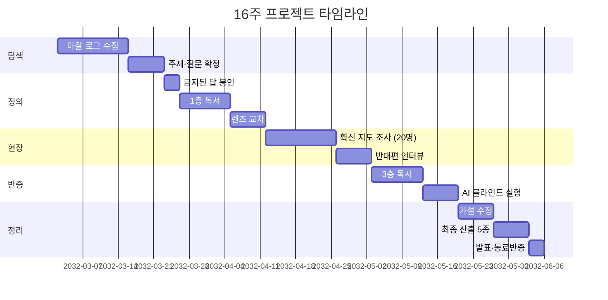

### 주차별 상세

| 주 | 활동 | AI 역할 | 산출물 |
|---|---|---|---|
| 1~2 | 마찰 로그: "당연하다고 넘긴 것" 20건 | 🚫 | 마찰 로그 |
| 3 | 발견: "친구들이 확신하는데 출처 없는 정보가 많다" → 주제 ⑭ 선택 | 🚫 | 질문: "우리 반은 뭘 근거 없이 믿나" |
| 4 | 금지된 답: 팩트체크 앱, 미디어교육 캠페인, 가짜뉴스 퀴즈 | R2 | 금지 목록 + 문제 재정의 |
| 5 | 1층 독서: 인지편향 입문 → "확신의 강도 ≠ 근거의 강도" 발견 | R3 | 독서기록 1장 |
| 6 | 2층 독서: 출처 추적법 + 설문 설계법 습득 | R3 | 조사 설계서 |
| 7 | 렌즈 교차: L9(근거의질) + L11(편향) + L12(반대편) | R2 | 렌즈 메모 |
| 8 | **현장**: 반 친구 20명의 "확신하는 정보" 수집 → 출처 추적 | 🚫 | 원본 데이터 30건 |
| 9 | **반대편 인터뷰**: "확실히 아는 것까지 의심하면 행동이 마비된다"는 친구 | 🚫 | 인터뷰 기록 |
| 10 | 3층 독서: "가짜뉴스 위기는 과장됐다" 반론서 → 내 전제 타격 | R1 | 약점 3개 |
| 11 | 추가 실험: AI 생성 글 vs 사람 글 블라인드 판별 | R4 | 실험 결과 |
| 12 | 가설 수정: "교육하면 나아진다"는 전제 자체가 의심 → 재정의 | R4 | 수정 선언문 |
| 13~14 | 최소 실험: "출처 물어보기" 루틴 2주 도입 → 행동 변화 측정 | 🚫 | 실험 로그 |
| 15 | 결과: 출처 질문은 늘었으나 **사회적 비용**(분위기 깨짐) 발견 | R4 | 2차 효과 기록 |
| 16 | 발표: "근거 없는 확신의 13%는 행동에 영향 없고, 나머지 87%를 잡으려면 출처 질문의 사회적 비용을 해결해야 한다" | 🚫 | 5종 제출 |

### 최종 질문 선언문 (실제 예시)

```
나는 우리 반 학생 20명이 확신하는 정보 30건 중
원출처에 도달한 것은 4건(13%)이었고,
이 중 행동(건강·대인관계)에 영향을 주는 것은 22건(73%)이었다.

"교육하면 판별력이 오른다"는 내 초기 가설은
AI 블라인드 테스트(정답률 52%) 결과로 약화되었다.

내가 틀렸다면:
출처 질문 루틴 도입 후 판별 정답률이 유의미하게 올라야 한다.
→ 2주 실험 결과: 출처 질문 빈도는 ↑, 판별 정답률은 변화 없음.
→ 가설 수정: 문제는 판별 능력이 아니라 "물어보는 것이 눈치 보이는 분위기"

가장 싼 테스트:
"이거 어디서 봤어?"를 하루 3번 말하기 (비용 0원, 7일)
→ 사회적 비용이 드러남
```

> **이 학생은 앱을 하나도 만들지 않았다. 하지만 판단력 훈련의 핵심을 겪었다.**

---

## E2E ② 초5 · 주제 ① 몸 — "우리 반은 왜 6시간도 못 자나"

### 주차별 상세

| 주 | 활동 | 산출물 |
|---|---|---|
| 1~2 | 수면 마찰 로그 7일 작성 | 로그 완성 |
| 3 | 발견: "졸린데 왜 못 자지?" → 주제 ① 선택. 금지된 답: 수면 앱, 일찍 자기 캠페인, 수면 교육 | 금지 목록 |
| 4 | 1층 독서: 수면 과학 아동용 → "수면은 회복이 아니라 정리"로 재정의 | 독서기록 |
| 5 | 렌즈: L5(다중원인) + L6(시스템역학) → 원인 지도 그리기 | 원인 지도 |
| 6 | 2층 독서: 수면 다이어리 양식 습득 + 학급 조사 설계 | 설계서 |
| 7 | 중간점검: 질문 10개 → 2개로 | 심사 기록 |
| 8 | **현장 조사**: 반 23명 수면 시간·학원 시간표 수집 | 원본 데이터 |
| 9 | **인터뷰**: 학원 원장님 ("늦은 시간 수업은 수요가 있어서") | 인터뷰 기록 |
| 10 | 3층 독서: "수면 8시간은 개인차가 크다" → 약점 발견 | 약점 리스트 |
| 11 | 가설 수정: "전원 8시간이 아니라, 본인 필요량 대비 부족률이 핵심" | 수정 선언문 |
| 12~14 | 실험: 학원 없는 날 vs 있는 날 수면 비교 (자기 데이터 2주) | 실험 로그 |
| 15 | 결과: 학원 있는 날 평균 5.8h, 없는 날 7.4h → 차이 1.6h | 데이터 정리 |
| 16 | 발표 + 동료 반증 | 5종 제출 |

### 핵심 학습

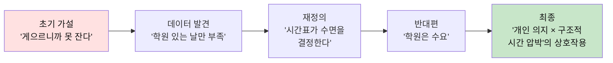

---

## E2E ③ 고1 · 주제 ⑱+⑯ 융합 — "AI가 다 만드는 시대에 값은 어디에 붙는가"

### 주차별 상세

| 주 | 활동 | AI 역할 | 산출물 |
|---|---|---|---|
| 1~2 | 마찰 로그 → "AI로 3시간 만에 만든 걸 아무도 안 사요" | 🚫 | 마찰 로그 |
| 3 | 주제 ⑱만듦 + ⑯생계 융합. 금지: 구독모델, 프리미엄, 광고 | R2 | 금지 목록 |
| 4 | 1층: 가치와 가격 입문 → "가격 ≠ 가치" 발견 | R3 | 독서기록 |
| 5 | 1층 추가: 창작의 의미 → "과정 vs 결과" 구분 | R2 | 재정의 |
| 6 | 렌즈: L6(시스템역학) + L10(트레이드오프) + L12(반대편) | R2 | 렌즈 메모 |
| 7 | 2층: 블라인드 평가 실험 설계법 + 지불의사(WTP) 조사법 | R3 | 실험 설계서 |
| 8 | **실험**: 같은 주제 일러스트를 A(AI 100%), B(AI+수정), C(손) 3버전 제작 | 🚫 | 3버전 파일 |
| 9 | **현장**: 친구 15명 블라인드 평가 + "얼마까지 낼 의향?" 조사 | 🚫 | 원본 데이터 |
| 10 | **반대편 인터뷰**: 실제 일러스트레이터 ("AI 때문에 의뢰가 50% 줄었다") | 🚫 | 인터뷰 기록 |
| 11 | 3층: AI 창작 긍정론 → "접근성 민주화" 논리 → 내 주장 타격 | R1 | 약점 3개 |
| 12 | 발견 정리: 블라인드 상태 → 선호 차이 없음. **만든 사람 공개 후** → C에 WTP ↑↑ | R4 | 데이터 해석 |
| 13 | 가설 수정: "지불의사는 결과물이 아니라 관계·맥락에 붙는다" | R4 | 수정 선언문 |
| 14 | 추가 실험: "이걸 제가 직접 그렸어요" 한 마디의 WTP 변화 측정 | 🚫 | 실험2 결과 |
| 15 | 2차 효과: "맥락이 값이면, 맥락을 위조할 수 있다" → 윤리 문제 기록 | R4 | 2차 효과 3개 |
| 16 | 발표: 결론 + 윤리적 한계 + 실패 기록 | 🚫 | 5종 제출 |

### 최종 선언문

```
나는 AI 생성 일러스트와 손 그림 사이의 지불의사(WTP) 차이가
블라인드 상태에서는 거의 없었으나(₩500 vs ₩600),
만든 사람 정보 공개 후에는 3배 차이(₩500 vs ₩1,800)가 발생하는 것을 확인했다.

가치는 결과물 품질이 아니라 '누가, 왜, 어떤 과정으로'에 붙는다.

내가 틀렸다면:
전문가 작품도 블라인드 시 WTP가 떨어져야 한다.
→ 검증 미완 (전문가 작품 구하지 못함) → 한계로 기록

윤리적 위험:
"맥락이 값이면, 맥락을 위조하면 된다"는 치트가 가능하다.
이건 해결하지 못했다. 다음 프로젝트의 질문이다.
```

---

# 🧮 주제별 최소 실험 설계 템플릿

---

> 프로젝트마다 실험이 다르지만, **공통 구조**는 있다.

| 항목 | 작성 |
|---|---|
| **가설** | ____________ |
| **반증 조건** | 이것이 참이면 가설은 죽는다: ____________ |
| **측정 대상** | ____________ |
| **측정 방법** | ⬜ 관찰 ⬜ 설문 ⬜ 인터뷰 ⬜ A/B비교 ⬜ 시간측정 |
| **표본** | ___명/___건 (최소 15) |
| **기간** | ___일 (최소 7일) |
| **비용** | ₩_____ (최대 1만원) |
| **AI 사용** | ⬜ R1 ⬜ R2 ⬜ R3 ⬜ R4 ⬜ 금지 |
| **통제 변인** | ____________ |
| **윤리 검토** | 참여자 동의? ⭕❌ / 익명 보장? ⭕❌ |

### 주제별 추천 실험 유형

| 주제 | 실험 유형 | 예시 |
|---|---|---|
| ① 몸 | 자기관찰 + 비교 | 학원 있는 날 vs 없는 날 수면 |
| ② 감정 | 어휘 개입 전후 비교 | 감정 단어 늘린 후 갈등 빈도 |
| ③ 정체성 | 다중 인터뷰 비교 | 10명이 말하는 '나' 불일치 |
| ④ 시간 | 시간 로그 + 분류 | 자율 시간 vs 통제 시간 비율 |
| ⑤ 죽음 | 구술사 인터뷰 | 상실 경험자 3명의 기록 방식 |
| ⑥ 애착 | 관계 지도 비교 | 6개월 전 vs 현재 |
| ⑦ 우정 | 자연 관찰 | 짝 변경 전후 관계 변화 |
| ⑧ 가족 | 대화 유형 분류 | 3일간 가족 대화 패턴 |
| ⑨ 갈등 | 사례 분류 | 5건의 표면/숨겨진 이유 비교 |
| ⑩ 돌봄 | 시간 측정 | 가족별 돌봄 시간 1주 |
| ⑪ 소속 | 비용 분석 | 소속 유지 위해 포기한 것 목록 |
| ⑫ 지위 | 비교 로그 | 3일간 비교 순간 전수 기록 |
| ⑬ 공정 | 규칙 감사 | 학급 규칙 수혜자/피해자 분석 |
| ⑭ 신뢰 | 출처 추적 | 확신 30건의 원출처 도달률 |
| ⑮ 권력 | 의사결정 추적 | 결정 5건의 실제 결정자 |
| ⑯ 생계 | 가격 비교 | 같은 물건 3곳 가격 + 이유 |
| ⑰ 배움 | A/B 비교 | AI 요약 vs 직접 정리 파지율 |
| ⑱ 만듦 | 블라인드 평가 | 3버전 제작물 + WTP 조사 |
| ⑲ 자연 | 전수 기록 | 하루 쓰레기 품목·소재·원산지 |
| ⑳ 의미 | 뿌듯함 분석 | 10건의 난이도·기여도·뿌듯함 상관 |

---

# ❓ FAQ — 교사·학부모·학생 공통

---

| 질문 | 답변 |
|---|---|
| "20개 중 여러 개 하면 안 돼요?" | ❌ 한 학기 1개. 20개 훑기 = 아무것도 안 하기. 깊이가 핵심. |
| "금지된 답이 정답일 수도 있잖아요" | 맞다. 하지만 **두 번째 생각을 하려면 첫 번째를 봉인해야** 한다. |
| "반대편 인터뷰 거절당하면?" | 거절 자체가 데이터다. "왜 거절했는가"를 기록하면 된다. |
| "AI 4역할 외에 더 쓰면?" | 사용 로그에 기록하고, **왜 규칙을 깼는지** 논증하면 가산점. |
| "실패하면 점수가 떨어지나요?" | ⭐ **반대다.** 가설이 폐기된 기록이 가장 높은 점수를 받는다. |
| "독서 3권이 너무 많아요" | 통독이 아니다. 정의서 목차+3챕터, 도구서 방법론만, 반증서 핵심 논지만. 총 10시간 이내. |
| "초등 저학년도 가능한가요?" | 주제 ①②⑦은 초3도 진입 가능. 워크시트를 같이 채우는 것부터 시작. |
| "결국 교사가 주제를 정해주는 거 아닌가요?" | 20개 안에서 **학생이 고르는 것**. 교사는 렌즈와 워크시트를 제공할 뿐. |
| "앱이나 제품을 안 만들어도 되나요?" | ⭕ 오히려 만들지 않는 것이 이 프로그램의 핵심. 산출물은 판단이지 실행이 아니다. |

---

---

# 👩‍🏫 교사용 퍼실리테이션 가이드

---

## 수업 모델: 주 2시간 블록 × 16주

```mermaid
flowchart LR
    A["1교시<br/>워크시트 작업<br/>(개인·모둠)"] --> B["쉬는 시간<br/>10분"]
    B --> C["2교시<br/>공유·반증<br/>(전체·짝)"]

    style A fill:#fff9c4,color:#111
    style C fill:#c8e6c9,color:#111
```

### 교사의 3가지 역할

| 역할 | 하는 것 | 하지 않는 것 |
|---|---|---|
| **워크시트 배부자** | 양식 제공, 기록 독려 | 내용 지시 |
| **반증 촉진자** | "반대편은?", "근거는?", "틀리면?" 질문 | 답 제시, 방향 유도 |
| **실패 기록 관리자** | 가설 폐기를 축하, 기록 양식 제공 | "다시 해봐", "포기하지 마" |

### 주차별 교사 행동 체크리스트

| 주 | 교사 행동 | ⬜ 체크 |
|---|---|---|
| 1 | 20주제 소개 + 마찰 로그 양식 배부 | ⬜ |
| 2 | 마찰 로그 20건 확인 (내용 아닌 양만) | ⬜ |
| 3 | 금지된 답 작성 지도 ("뻔한 답 3개 먼저") | ⬜ |
| 4 | 1층 독서 도서 추천 (주제별 가이드표 활용) | ⬜ |
| 5 | 렌즈 카드 3장 뽑기 → 교차 적용 워크숍 | ⬜ |
| 6 | 2층 독서 + 측정 도구 선택 지도 | ⬜ |
| 7 | **중간 점검**: 질문 심사 (학생 간 교차 반증) | ⬜ |
| 8 | **현장 주간**: 교실 밖 데이터 수집 허가 + 안전 점검 | ⬜ |
| 9 | **인터뷰 주간**: 인터뷰 대상 섭외 도움 | ⬜ |
| 10 | 3층 반증서 추천 + "약점 3개" 작성 독려 | ⬜ |
| 11 | 가설 수정/폐기 세레모니 (폐기 = 축하) | ⬜ |
| 12 | 실험 프로토콜 윤리 검토 (동의서, 익명화) | ⬜ |
| 13~14 | 실험 진행 모니터링 (개입 최소) | ⬜ |
| 15 | 2차 효과 기록 + 산출물 5종 완성 독려 | ⬜ |
| 16 | **발표 + 동료 반증** 진행 | ⬜ |

### 발표 날 진행 방식

```mermaid
flowchart TD
    P["발표자<br/>5분"] --> Q1["동료 반증 1<br/>'네 근거 중<br/>가장 약한 것은?'"]
    Q1 --> Q2["동료 반증 2<br/>'반대편 인터뷰에서<br/>답 못한 건?'"]
    Q2 --> Q3["교사 반증<br/>'이 결론으로<br/>손해 보는 사람은?'"]
    Q3 --> R["발표자 응답<br/>+ 기록"]

    style P fill:#fff9c4,color:#111
    style Q1 fill:#ffe1e1,color:#111
    style Q2 fill:#ffe1e1,color:#111
    style Q3 fill:#ffe1e1,color:#111
    style R fill:#c8e6c9,color:#111
```

> ⚠️ **"잘했다"로 끝나는 발표는 이 프로그램에서 실패다.**
> 반증 질문이 발표보다 중요하다.

### 동료 반증 질문 카드 (10장 — 발표 때 무작위 배부)

| # | 질문 |
|---|---|
| 1 | "네 데이터 중 가장 신뢰도가 낮은 것은?" |
| 2 | "반대편 인터뷰에서 네가 답 못 한 반론은?" |
| 3 | "이 결론이 틀리려면 뭐가 관찰돼야 해?" |
| 4 | "AI에 맡긴 부분 중 직접 했어야 할 건?" |
| 5 | "금지된 답이 실은 맞을 가능성은?" |
| 6 | "네 실험의 표본이 15명 미만이면 왜?" |
| 7 | "3층 독서에서 질문이 안 바뀌었으면 왜 안 바뀐 거야?" |
| 8 | "이 결론으로 가장 손해 보는 사람은 누구야?" |
| 9 | "2차 효과 중 가장 위험한 건 뭐야?" |
| 10 | "이 프로젝트에서 네가 가장 **틀렸던 순간**은?" |

### 학부모 안내문 (복사용)

```
[프로젝트 기반 탐구 학습 안내]

자녀가 이번 학기에 "인간 관심사 20" 중 하나를 선택하여
프로젝트를 진행합니다.

🔹 앱이나 제품을 만들지 않습니다.
🔹 "진짜 질문 찾기"와 "판단력 훈련"이 목표입니다.
🔹 실패한 가설 기록이 가장 높은 점수를 받습니다.
🔹 AI는 4가지 역할로만 사용하며, 사용 로그를 제출합니다.

가정에서 도움을 주시려면:
✅ 자녀의 인터뷰 요청에 응해 주세요 (가족 주제일 때)
✅ "왜 그렇게 생각해?"라고 물어봐 주세요
❌ 답이나 방향을 알려주지 마세요
❌ "좋은 결과"를 기대하지 마세요 — 좋은 "과정 기록"이 목표입니다
```

---

# 📊 학기 말 프로그램 평가표 (교사용)

---

| 평가 항목 | 측정 방법 | 목표치 |
|---|---|---|
| 질문 재정의 횟수 | 학생별 질문 변화 기록 | 평균 2회 이상 |
| 금지된 답 충실도 | 금지 목록의 구체성 | 3개 + 이유 |
| 1차 데이터 보유율 | 본인 수집 데이터 존재 여부 | 100% |
| 반대편 인터뷰 실시율 | 인터뷰 기록 제출 | 80% 이상 |
| 3층 독서 완료율 | 독서 기록 3장 제출 | 70% 이상 |
| 가설 수정/폐기 비율 | 초기 가설 ≠ 최종 결론 | 60% 이상이면 성공 |
| AI 사용 로그 충실도 | "내가 버린 것" 칸 기재 | 80% 이상 |
| 반증 조건 명시율 | "틀리면 이것이 관찰된다" 기재 | 90% 이상 |

> **가설 수정/폐기 비율 60% 이상 = 프로그램 성공.**
> 학생들이 처음 생각을 끝까지 유지했다면, 렌즈와 반증이 작동하지 않은 것이다.

---

# 🔄 다음 학기 연계 — 20주제 순환 설계

---

```mermaid
graph TD
    S1["1학기<br/>영역 A (나 자신)<br/>에서 1개"] --> S2["2학기<br/>영역 B (가까운 사람)<br/>에서 1개"]
    S2 --> S3["3학기<br/>영역 C (무리 속의 나)<br/>에서 1개"]
    S3 --> S4["4학기<br/>영역 D (세상과 나)<br/>에서 1개"]
    S4 --> S5["5학기<br/>자유 선택<br/>+ 영역 2개 융합"]
    S5 --> S6["6학기<br/>후배 멘토링<br/>+ 자기 프로젝트"]

    style S1 fill:#fff9c4,color:#111
    style S5 fill:#c8e6c9,color:#111
    style S6 fill:#b2ebf2,color:#111
```

| 학기 | 권장 영역 | 해상도 목표 | 특징 |
|---|---|---|---|
| 1 | A (나 자신) | 현상 관찰 | 가장 가까운 주제로 시작 |
| 2 | B (가까운 사람) | 패턴 발견 | 인터뷰 스킬 성장 |
| 3 | C (무리 속의 나) | 구조 분석 | 데이터 수집 본격화 |
| 4 | D (세상과 나) | 구조 재설계 | 외부 기관 연계 가능 |
| 5 | 자유 (영역 2개 융합) | 융합 사고 | 주제 간 연결 지도 활용 |
| 6 | 멘토링 + 심화 | 전수 + 재귀 | 후배에게 렌즈 가르치기 = 최고의 학습 |

> 6학기 = 3년. 초5에 시작하면 중1까지. 중1에 시작하면 중3까지.
> **20개 주제 중 6개를 깊이 파면 나머지 14개도 혼자 다룰 수 있다.**

---

---

# 📖 용어 사전

---

| 용어 | 정의 | 처음 등장 |
|---|---|---|
| **마찰 로그** | "원래 이런 거야"라고 넘긴 일상의 불편을 기록하는 일지 | 워크시트 A |
| **금지된 답** | 뻔한 솔루션 3개를 적고 봉인하는 기법. 두 번째 생각을 강제 | 항해 규칙 |
| **렌즈** | 미네르바 HC에서 파생한 12개 사고 도구 (L1~L12) | 짝 문서 |
| **3층 독서** | 정의서→도구서→반증서 순서로 읽는 프로젝트 독서법 | 독서 매뉴얼 |
| **반증 조건** | "이것이 관찰되면 내 가설은 죽는다"는 사전 선언 | 질문 선언문 |
| **반대편 인터뷰** | 내 결론으로 손해 보는 실제 사람을 만나는 필수 과정 | 항해 규칙 |
| **AI 4역할** | R1 반대편, R2 소크라테스, R3 사냥개, R4 시뮬레이터 | AI 매뉴얼 |
| **질문 선언문** | 프로젝트의 최종 질문+반증조건+최소실험을 선언하는 양식 | 제출물 ① |
| **2차 효과** | 해결책이 성공했을 때 발생하는 예상 밖의 부작용 | R4 역할 |
| **WTP** | Willingness To Pay, 지불의사. 가치 측정의 행동경제학 도구 | E2E ③ |
| **해상도** | 같은 주제에 대한 질문의 깊이 수준 (초→중→고→대) | 질문 사다리 |
| **가설 폐기** | 데이터로 가설이 틀렸음을 확인하고 기록하는 것. 최고점 대상 | 평가 루브릭 |
| **소시오그램** | 관계망을 시각화하는 사회학적 도구 | 주제 ⑦ |
| **블라인드 평가** | 제작자 정보 없이 결과물만 보고 평가하는 실험 설계 | 주제 ⑱ |
| **규칙 감사(audit)** | 기존 규칙의 수혜자/피해자를 전수 분석하는 기법 | 주제 ⑬ |
| **마찰** | 일상에서 무의식적으로 넘기는 불편·위화감·의문 | 마찰 로그 |
| **원출처** | 정보의 최초 생산지 (원논문, 원통계, 1차 기록) | 주제 ⑭ |

---

**"20개 주제는 평생 바뀌지 않는다. 바뀌는 것은 그 주제 앞에 선 나의 해상도다."** 🧭

---

*짝 문서: [미네르바 렌즈 12개 + 5단계 프로토콜](./2032_미네르바렌즈_진짜질문_설계서.md)*
*기반: 미네르바 스쿨 HC 프레임워크, 디자인 씽킹, 과학적 방법론*
*기준 연도: 2032*
