# 리딩리듬 온·오프라인 통합 플랫폼 기획서

> **"같은 시간, 같은 책, 다른 공간에서도 하나의 리듬으로"**
>
> 도서관에서 만나든, 화면 너머에서 만나든
> 함께 읽고, 대화하고, 기록하고, 결국 함께 만들어가는 독서 플랫폼

---

## 목차

### Part 1: 벤치마킹과 방향 설정
1. [벤치마킹: 기존 서비스 비교 분석](#1-벤치마킹-기존-서비스-비교-분석)
2. [리딩리듬 플랫폼의 방향성](#2-리딩리듬-플랫폼의-방향성)

### Part 2: 주요 고객 페르소나
3. [페르소나 정의](#3-페르소나-정의)
4. [페르소나별 니즈와 pain point](#4-페르소나별-니즈와-pain-point)

### Part 3: 모임 운영 설계
5. [모임 유형과 주제 구조](#5-모임-유형과-주제-구조)
6. [온라인과 오프라인 통합 운영](#6-온라인과-오프라인-통합-운영)
7. [대화 상대 설정과 매칭](#7-대화-상대-설정과-매칭)

### Part 4: 기록과 아카이브 시스템
8. [기록 시스템 설계](#8-기록-시스템-설계)
9. [AI 기반 기록 자동화](#9-ai-기반-기록-자동화)

### Part 5: 유저 시나리오
10. [핵심 유저 시나리오 6가지](#10-핵심-유저-시나리오-6가지)

### Part 6: 목표와 비전
11. [단계별 목표](#11-단계별-목표)
12. [프로젝트와 저서 활동으로의 확장](#12-프로젝트와-저서-활동으로의-확장)

---

## 1. 벤치마킹: 기존 서비스 비교 분석

### 1.1 핵심 벤치마킹 대상

| 서비스 | 유형 | 핵심 특징 | 강점 | 한계 |
|--------|------|----------|------|------|
| **키즈노트** | 알림장 앱 | 교사-학부모 소통, 일일 기록, 사진 공유 | 기록의 일상화, 부모 안심 | 독서/토론 기능 없음 |
| **트레바리** | 독서모임 | 오프라인 세미나, 유료 모임, 큐레이션 | 고품질 토론, 브랜딩 강력 | 높은 가격(회당 3~5만), 기록 없음 |
| **클럽하우스** | 음성 소셜 | 실시간 음성 대화, 자유 입장 | 즉흥적, 접근 쉬움 | 기록 안 됨, 지속성 없음 |
| **네이버 카페** | 커뮤니티 | 게시판 기반, 자유 운영 | 무료, 자유도 높음 | 체계 없음, 기록 파편화 |
| **북클럽 앱** | 독서 기록 | 읽은 책 관리, 독서 통계 | 개인 기록 편리 | 모임 기능 없음, AI 없음 |
| **디스코드** | 커뮤니티 | 채널 기반 소통, 음성/텍스트 | 실시간 소통, 무료 | 독서 특화 아님, 어렵게 느낌 |
| **노션** | 문서 협업 | 공동 편집, 템플릿, 데이터베이스 | 기록 체계화, 협업 | 독서/모임 특화 아님 |

### 1.2 서비스 유형별 비교 매트릭스

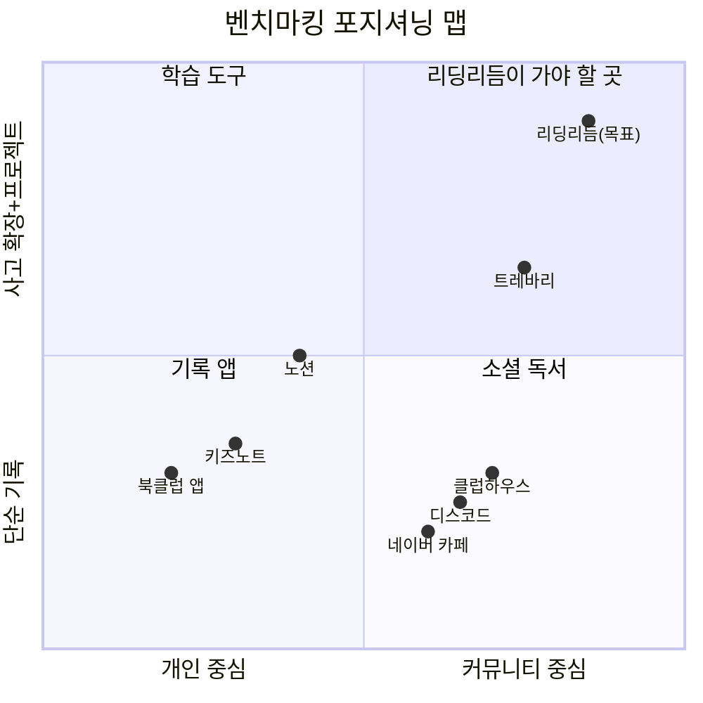

### 1.3 벤치마킹에서 가져올 것

| 서비스 | 가져올 핵심 요소 | 리딩리듬에 적용 |
|--------|----------------|---------------|
| **키즈노트** | 일일 기록의 일상화, 사진+텍스트 알림 | 모임 후 자동 기록 알림, 인사이트 카드 공유 |
| **트레바리** | 큐레이션된 모임, 퍼실리테이터 역할 | 주제별 모임 큐레이션, AI+인간 퍼실리테이터 |
| **클럽하우스** | 즉흥 참여, 음성 대화의 편안함 | 자유 주제 열린 토론방, 음성 기록 |
| **노션** | 구조화된 기록, 협업 문서 | 모임별 공유 노트, 프로젝트 문서 협업 |
| **디스코드** | 채널 구조, 비동기 소통 | 모임별 채널, 주중 비동기 대화 |

### 1.4 리딩리듬만의 차별점 (가져오지 않을 것 + 새로 만들 것)

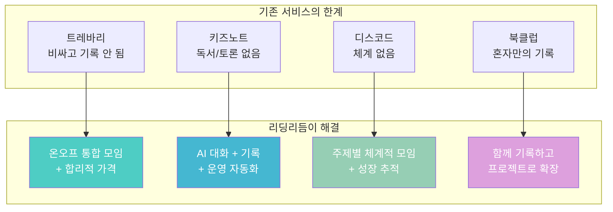

---

## 2. 리딩리듬 플랫폼의 방향성

### 2.1 핵심 컨셉: 키즈노트 X 트레바리 X 프로젝트

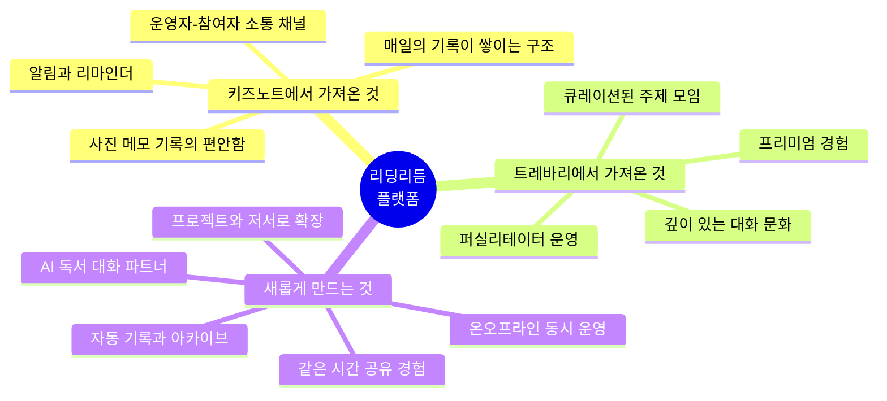

### 2.2 플랫폼 운영 철학

> **"하나의 주제, 같은 시간, 다른 공간에서도 함께"**

| 원칙 | 설명 | 구현 방식 |
|------|------|----------|
| **같은 시간 공유** | 온라인이든 오프라인이든 같은 시간대에 모임 | 동시 접속 + 도서관 모임 연동 |
| **주제 단위 운영** | 하나의 주제로 모집하고 끝까지 운영 | 기수제 운영 (4~16주 단위) |
| **기록이 자산** | 모든 대화와 인사이트가 기록으로 남음 | AI 자동 기록 + 구조화 |
| **대화가 핵심** | 강의가 아니라 대화와 토론 | 소크라테스식 질문 중심 |
| **결국 만들기** | 대화에서 끝나지 않고 결과물로 연결 | 프로젝트 / 공동 저서 / 발표 |

---

## 3. 페르소나 정의

### 3.1 핵심 페르소나 5유형

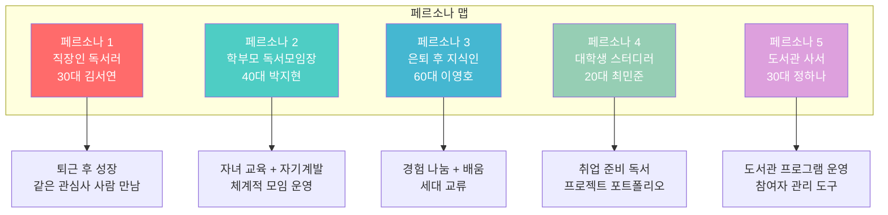

### 3.2 페르소나 상세 프로필

#### 페르소나 1: 직장인 독서러 - 김서연 (32세)

```
이름: 김서연
나이: 32세 / 직업: IT 회사 마케터
독서량: 월 2~3권 / 관심 분야: 심리학, 경영, 에세이

하루 일과:
07:00 기상 → 08:30 출근 → 18:30 퇴근 → 19:30 귀가
→ 20:00~22:00 자유시간 → 23:00 취침

독서 습관:
- 출퇴근 전철에서 전자책 읽기
- 주말에 카페에서 집중 독서
- 읽고 나면 인스타에 짧은 감상 올림

Pain Point:
- "읽고 나면 금방 잊어버려요"
- "같이 이야기 나눌 사람이 없어요"
- "독서 모임 가고 싶은데 시간 맞추기 어려워요"
- "트레바리 가보고 싶은데 너무 비싸요"

원하는 것:
- 퇴근 후 온라인으로 참여할 수 있는 모임
- 내 생각을 정리하고 기록으로 남기고 싶음
- 다양한 관점을 가진 사람들과 대화
- 부담 없는 가격
```

#### 페르소나 2: 학부모 독서모임장 - 박지현 (43세)

```
이름: 박지현
나이: 43세 / 직업: 프리랜서 번역가
자녀: 중2 아들, 초5 딸
독서량: 월 1~2권 / 관심 분야: 교육, 인문학

하루 일과:
06:30 기상 → 아이들 등교 → 09:00~15:00 번역 작업
→ 15:30 아이 픽업 → 저녁 준비 → 21:00 이후 자유시간

현재 활동:
- 동네 엄마 독서모임 운영 (6명, 월 2회)
- 동네 도서관 프로그램 참여
- 카카오톡 단톡방으로 소통

Pain Point:
- "모임 일정 잡는 게 가장 힘들어요"
- "누가 읽었는지 확인이 안 돼요"
- "토론 내용이 기록으로 안 남아요"
- "모임 끝나면 뭘 했는지 금방 잊어요"
- "아이들에게도 이런 경험 시켜주고 싶어요"

원하는 것:
- 모임 운영을 도와주는 도구
- 일정, 진도, 토론 기록 자동 관리
- 온라인으로도 참여 가능하게
- 아이들 독서 모임도 같이 운영
```

#### 페르소나 3: 은퇴 후 지식인 - 이영호 (62세)

```
이름: 이영호
나이: 62세 / 전직: 고교 국어 교사 (35년)
독서량: 월 4~5권 / 관심 분야: 역사, 철학, 문학

하루 일과:
06:00 기상 → 산책 → 08:00 독서 → 점심
→ 14:00 도서관 → 저녁 → 20:00 독서/글쓰기

현재 활동:
- 동네 도서관 독서 토론회 참여 (월 1회)
- 블로그에 서평 작성
- 은퇴 교사 모임

Pain Point:
- "젊은 사람들 생각도 듣고 싶어요"
- "내 경험을 나눌 곳이 마땅치 않아요"
- "앱이 너무 복잡하면 못 써요"
- "글을 쓰고 싶은데 혼자 쓰면 동기가 없어요"

원하는 것:
- 세대를 넘나드는 깊이 있는 토론
- 자기 경험과 지식을 정리해서 남기고 싶음
- 함께 책을 쓰는 프로젝트 참여
- 쉽고 직관적인 인터페이스
```

#### 페르소나 4: 대학생 스터디러 - 최민준 (24세)

```
이름: 최민준
나이: 24세 / 대학교 3학년 경영학과
독서량: 월 1권 (시험 기간 0권) / 관심 분야: 경제, 자기계발

하루 일과:
09:00 수업 → 점심 → 14:00~18:00 도서관
→ 저녁 → 20:00 아르바이트 → 23:00 귀가

Pain Point:
- "책 읽어야 하는 건 아는데 시간이 없어요"
- "혼자 읽으면 동기가 안 생겨요"
- "취업에 도움되는 독서를 하고 싶어요"
- "프로젝트 경험이 필요한데 팀원을 못 구해요"

원하는 것:
- 짧은 시간에 효율적으로 읽고 토론
- 취업 포트폴리오로 쓸 수 있는 프로젝트
- 같은 관심사 학생들과 네트워킹
- 멘토 역할의 선배/직장인 연결
```

#### 페르소나 5: 도서관 사서 - 정하나 (35세)

```
이름: 정하나
나이: 35세 / 직업: 공공도서관 사서
관심 분야: 독서 문화 프로그램 기획

현재 활동:
- 월 2회 성인 독서 토론회 운영
- 분기 1회 독서 캠프 기획
- 도서관 프로그램 참여자 관리

Pain Point:
- "참여자 모집이 매번 어려워요"
- "프로그램 끝나면 흩어져요, 지속이 안 돼요"
- "토론 기록을 수기로 작성하는 게 힘들어요"
- "온라인 확장을 하고 싶은데 도구가 없어요"
- "성과 보고서 쓸 때 데이터가 부족해요"

원하는 것:
- 도서관 프로그램과 연동되는 플랫폼
- 참여자 모집-운영-기록-보고 일원화
- 오프라인 모임을 온라인으로 확장
- 프로그램 성과 자동 리포트
```

---

## 4. 페르소나별 니즈와 pain point 종합

### 4.1 니즈 교차 분석

| 니즈 | 김서연<br/>(직장인) | 박지현<br/>(학부모) | 이영호<br/>(은퇴자) | 최민준<br/>(대학생) | 정하나<br/>(사서) |
|------|:---:|:---:|:---:|:---:|:---:|
| **온라인 참여** | ★★★ | ★★☆ | ★☆☆ | ★★★ | ★★☆ |
| **오프라인 참여** | ★☆☆ | ★★★ | ★★★ | ★★☆ | ★★★ |
| **자동 기록** | ★★★ | ★★★ | ★★☆ | ★★☆ | ★★★ |
| **AI 대화** | ★★★ | ★★☆ | ★☆☆ | ★★★ | ★★☆ |
| **모임 운영 도구** | ★☆☆ | ★★★ | ★☆☆ | ★☆☆ | ★★★ |
| **프로젝트 확장** | ★★☆ | ★☆☆ | ★★★ | ★★★ | ★★☆ |
| **세대 교류** | ★★☆ | ★★☆ | ★★★ | ★★☆ | ★★★ |
| **성장 추적** | ★★★ | ★★☆ | ★☆☆ | ★★★ | ★★★ |
| **합리적 가격** | ★★★ | ★★★ | ★★☆ | ★★★ | - |

### 4.2 공통 핵심 니즈 (우선순위)

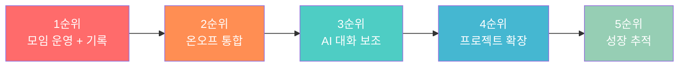

---

## 5. 모임 유형과 주제 구조

### 5.1 모임 유형 분류

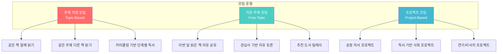

### 5.2 주제 지정 모임 상세

| 모임 형태 | 설명 | 운영 방식 | 예시 |
|-----------|------|----------|------|
| **같은 책 함께 읽기** | 한 권의 책을 정해서 함께 읽고 토론 | 4주 1권, 주 1회 모임 | "정의란 무엇인가" 4주 완독 |
| **같은 주제 다른 책** | 하나의 주제를 잡고 각자 다른 책 읽기 | 4주 주제 탐구, 관점 교차 | "AI 시대 인간이란?" 각자 1권 선택 |
| **커리큘럼 독서** | 단계별로 설계된 독서 로드맵 | 12~16주, 3~4권 순서대로 | "철학 입문: 소크라테스→칸트→공리주의" |
| **저자 탐구** | 한 저자의 작품을 집중 탐구 | 8주, 2~3권 | "유발 하라리 3부작 완독" |
| **시사 연결 독서** | 현재 이슈와 연결된 책 읽기 | 4주 단위 갱신 | "기후위기 - 관련 도서 3권" |

### 5.3 자유 주제 모임 상세

| 모임 형태 | 설명 | 운영 방식 | 분위기 |
|-----------|------|----------|--------|
| **이달의 책 나눔** | 각자 최근 읽은 책 1권 소개 | 월 1~2회, 자유롭게 | 편안한 북카페 느낌 |
| **관심사 수다** | 독서 경험 기반 자유 토론 | 격주 1회, 주제 자유 | 동네 사랑방 느낌 |
| **추천 릴레이** | 멤버가 돌아가며 책 추천+발표 | 매주 1명씩 추천 | 서점 큐레이터 느낌 |
| **독서+산책** | 함께 걷고 이야기하는 모임 | 월 1회, 야외 | 산책하며 수다 느낌 |

### 5.4 프로젝트 모임 상세 (최종 목표)

| 프로젝트 유형 | 설명 | 기간 | 결과물 |
|-------------|------|------|--------|
| **공동 저서** | 모임 멤버들이 함께 한 권의 책 집필 | 6~12개월 | 전자책 또는 POD 출판 |
| **독서 에세이집** | 각자의 독서 에세이를 모아 한 권으로 | 3~6개월 | 에세이 모음집 |
| **주제 리서치** | 특정 주제를 깊이 탐구하여 보고서 작성 | 2~4개월 | 연구 리포트 |
| **독서 팟캐스트** | 독서 토론을 녹음하여 콘텐츠화 | 진행형 | 팟캐스트 에피소드 |
| **사회 프로젝트** | 독서에서 발견한 문제를 실제로 해결 | 3~6개월 | 사회적 영향력 |

### 5.5 모임의 시간 구조: "같은 시간 공유"

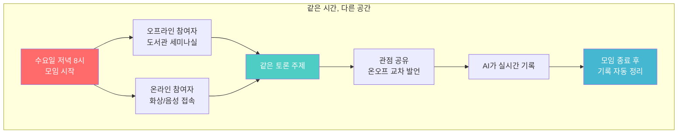

---

## 6. 온라인과 오프라인 통합 운영

### 6.1 운영 모델 비교

| 항목 | 순수 온라인 | 순수 오프라인 | 리딩리듬 (하이브리드) |
|------|-----------|-------------|-------------------|
| **접근성** | 어디서든 참여 | 지역 한정 | 선택 가능 |
| **몰입도** | 낮음 (산만) | 높음 (대면) | 온라인도 높이는 설계 |
| **기록** | 자동 가능 | 수기 (힘듬) | 양쪽 모두 자동화 |
| **관계 형성** | 얕음 | 깊음 | 온라인 시작 → 오프라인 심화 |
| **확장성** | 무제한 | 공간 제한 | 온라인 무제한 + 거점 오프라인 |
| **비용** | 낮음 | 높음 (장소비) | 중간 (도서관 무료 활용) |

### 6.2 하이브리드 운영 구조

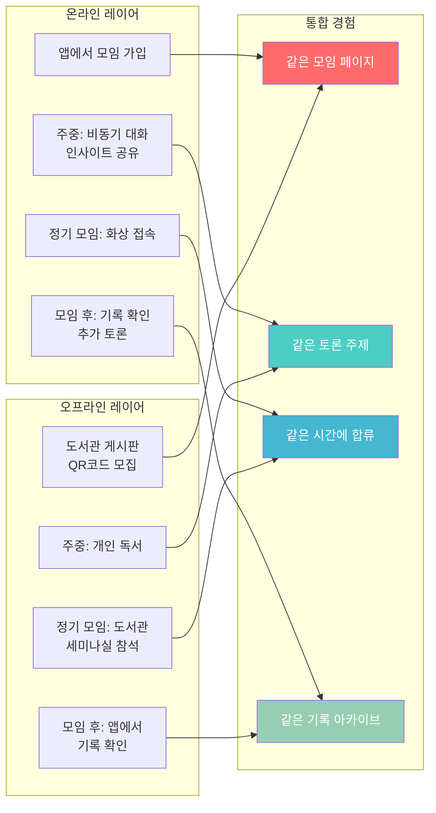

### 6.3 도서관 연계 운영 모델

| 연계 방식 | 설명 | 도서관의 역할 | 리딩리듬의 역할 |
|-----------|------|-------------|---------------|
| **거점 도서관** | 정기 오프라인 모임 장소 제공 | 세미나실 무료 대여, 도서 비치 | 모집, 운영, 기록 |
| **사서 협업** | 도서관 사서가 퍼실리테이터 | 주제 큐레이션, 현장 진행 | 플랫폼 도구, AI 지원 |
| **프로그램 연동** | 도서관 기존 프로그램과 통합 | 기존 독서회 온라인 확장 | 온라인 인프라, 기록 |
| **성과 공유** | 활동 데이터 도서관에 제공 | 성과 보고서 활용 | 자동 리포트 생성 |

### 6.4 주간 운영 타임라인 (예시: 4주 1권 모임)

```mermaid
gantt
    title 1주차 운영 타임라인
    dateFormat  HH:mm

    section 월요일
    모임장이 주간 안내 발송          :a1, 09:00, 30m
    멤버 읽기 시작                   :a2, 09:30, 8h

    section 화~목 (비동기)
    개인 독서 + 메모                 :b1, 09:00, 36h
    앱에서 인사이트 카드 작성         :b2, 20:00, 1h
    멤버 간 댓글로 반응              :b3, 21:00, 1h

    section 금요일
    AI가 주간 토론 포인트 정리        :c1, 10:00, 30m

    section 토요일 (정기 모임)
    온오프 동시 모임 시작             :d1, 10:00, 2h
    토론 + 관점 공유                 :d2, 10:00, 1h30m
    마무리 + 다음 주 안내            :d3, 11:30, 30m

    section 일요일
    AI가 모임 기록 자동 정리          :e1, 09:00, 30m
    멤버에게 기록 카드 발송           :e2, 10:00, 30m
```

---

## 7. 대화 상대 설정과 매칭

### 7.1 대화 상대 유형

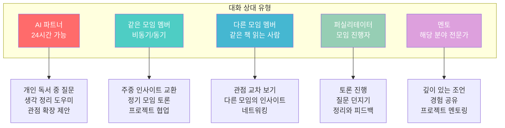

### 7.2 매칭 원칙

| 매칭 기준 | 설명 | 예시 |
|-----------|------|------|
| **관심 분야** | 비슷한 분야에 관심 있는 사람끼리 | 철학 관심 → 철학 모임 |
| **독서 수준** | 비슷한 독서 경험을 가진 사람끼리 | 입문 / 중급 / 심화 구분 |
| **목적** | 비슷한 목적을 가진 사람끼리 | 교양 / 취업 / 프로젝트 |
| **시간대** | 같은 시간에 참여 가능한 사람끼리 | 평일 저녁 / 주말 오전 |
| **지역** | 오프라인 참여 시 같은 지역 | 강남구 / 마포구 도서관 |
| **다양성** | 의도적으로 다른 배경의 사람 포함 | 세대 혼합, 직업 혼합 |

### 7.3 소크라테스식 대화 구조

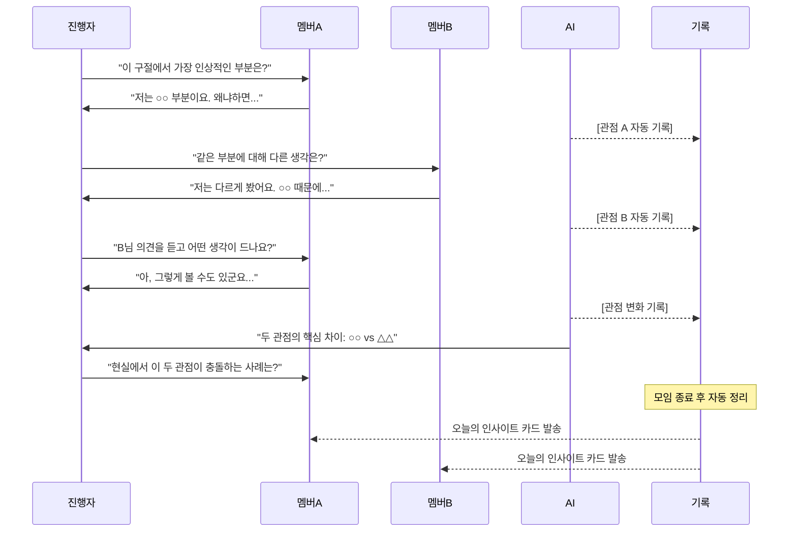

---

## 8. 기록 시스템 설계

### 8.1 기록의 4단계 구조

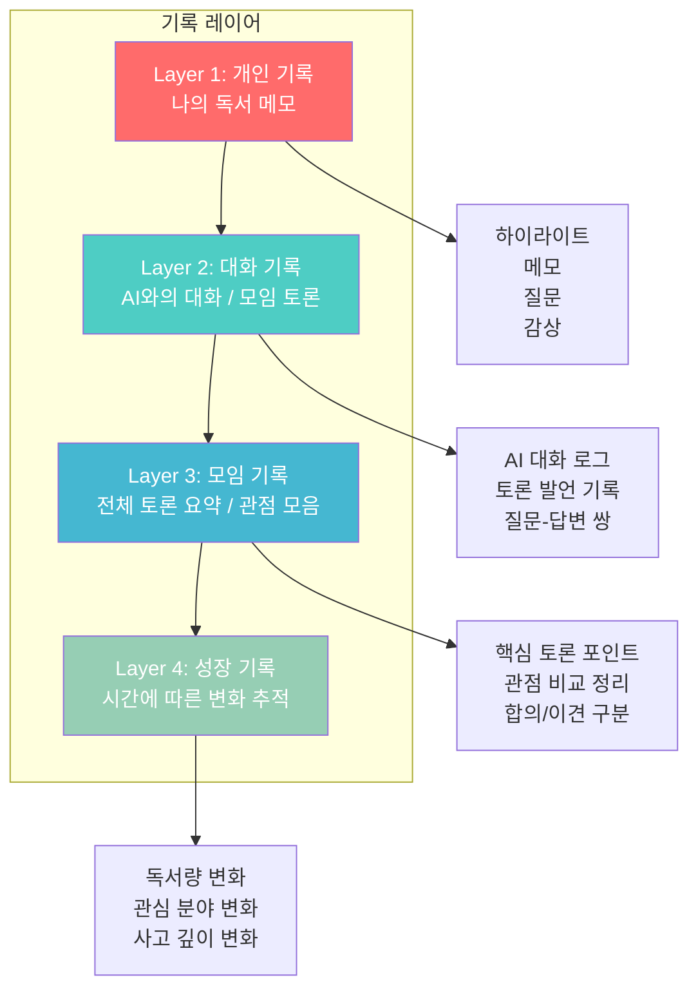

### 8.2 기록 방식 비교

| 기록 방식 | 언제 | 어떻게 | 누가 | 결과물 |
|-----------|------|--------|------|--------|
| **읽기 메모** | 개인 독서 중 | 하이라이트 + 짧은 메모 | 개인 | 메모 카드 |
| **인사이트 카드** | 주중 비동기 | 핵심 생각 1~3문장 작성 | 개인 | 카드 피드 |
| **음성 녹음** | 오프라인 모임 중 | 앱으로 녹음 → AI 자동 전사 | 자동 | 텍스트 전사본 |
| **실시간 전사** | 온라인 모임 중 | 화상/음성 자동 기록 | 자동 | 대화 로그 |
| **AI 요약** | 모임 직후 | AI가 토론 내용 구조화 | AI | 모임 리포트 |
| **성찰 일지** | 모임 후 24시간 | 개인이 배운 점 정리 | 개인 | 성찰 기록 |

### 8.3 키즈노트 스타일 "모임 알림장"

> 키즈노트처럼 매 모임 후 자동으로 정리된 기록이 발송되는 구조

```
┌──────────────────────────────────────────┐
│  📖 모임 알림장                            │
│  ━━━━━━━━━━━━━━━━━━━━━━━━━━━━━━━━━━━━━━  │
│  📚 철학 입문 모임 | 3주차                  │
│  📅 2026.03.14 (토) 10:00~12:00           │
│  📍 마포중앙도서관 + 온라인                  │
│  👥 참석 7명 (오프 4 / 온 3)               │
│                                           │
│  ─────────────────────────────────────── │
│  📕 이번 주 책: 정의란 무엇인가 (3장)        │
│                                           │
│  💬 오늘의 핵심 토론                        │
│  ┌───────────────────────────────────┐    │
│  │ 주제: "공리주의는 정의로운가?"      │    │
│  │                                   │    │
│  │ 📌 핵심 관점 A (김서연 외 3명)      │    │
│  │ "최대 다수의 행복이 현실적 기준"    │    │
│  │                                   │    │
│  │ 📌 핵심 관점 B (이영호 외 2명)      │    │
│  │ "소수의 희생을 정당화하는 위험"     │    │
│  │                                   │    │
│  │ 🤖 AI 정리                         │    │
│  │ "실용성 vs 인권의 근본적 대립.      │    │
│  │  벤담과 밀의 차이도 여기서 출발"    │    │
│  └───────────────────────────────────┘    │
│                                           │
│  💡 오늘의 인사이트 Top 3                   │
│  1. "정의는 관점에 따라 달라진다"           │
│  2. "숫자로 행복을 측정할 수 있는가?"       │
│  3. "트롤리 딜레마는 현실에서도 매일 일어남" │
│                                           │
│  📸 모임 사진 (3장)                        │
│  [사진1] [사진2] [사진3]                   │
│                                           │
│  ✏️ 다음 주 안내                           │
│  • 4장 읽어오기 (p.95~130)                 │
│  • 질문 1개 준비해오기                     │
│  • 인사이트 카드 1개 이상 작성              │
│                                           │
│  [성찰 일지 쓰기] [다음 주 참석 확인]       │
└──────────────────────────────────────────┘
```

### 8.4 기록의 축적: 개인 → 모임 → 프로젝트

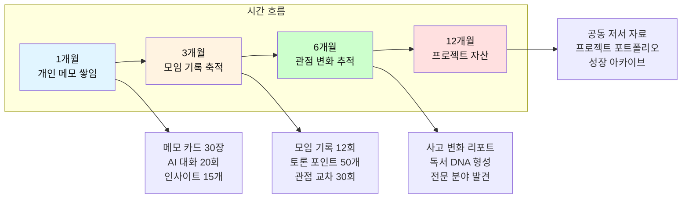

---

## 9. AI 기반 기록 자동화

### 9.1 AI가 자동으로 하는 것

| AI 기능 | 입력 | 출력 | 시점 |
|---------|------|------|------|
| **음성 전사** | 오프라인 모임 녹음 | 텍스트 전사본 | 모임 중 |
| **화자 구분** | 음성 녹음 | 누가 무슨 말 했는지 | 모임 중 |
| **토론 요약** | 전체 대화 로그 | 핵심 3~5 포인트 | 모임 직후 |
| **관점 분류** | 멤버별 발언 | 관점 A vs B vs C 정리 | 모임 직후 |
| **인사이트 추출** | 전체 기록 | 핵심 인사이트 카드 | 모임 직후 |
| **성찰 질문 생성** | 토론 내용 | 개인 성찰 질문 3개 | 모임 직후 |
| **다음 주 안내** | 커리큘럼 + 진도 | 다음 주 읽기 범위 + 질문 | 모임 다음날 |
| **월간 리포트** | 한 달 기록 | 참여도, 성장, 핵심 인사이트 | 매월 말 |

### 9.2 기록 자동화 흐름

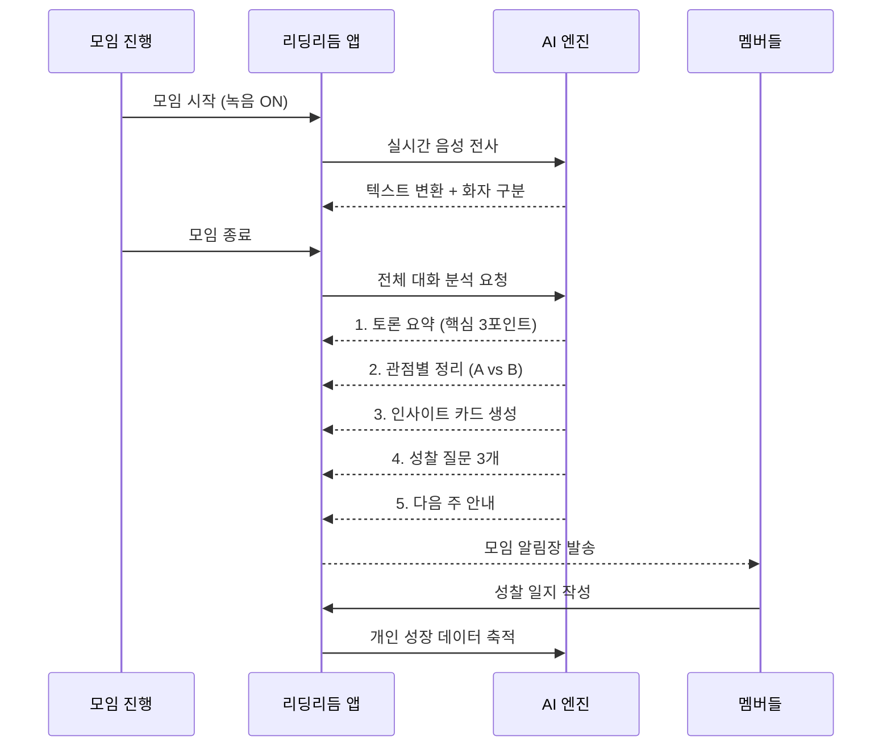

---

## 10. 핵심 유저 시나리오 6가지

### 시나리오 1: 직장인 김서연 - 퇴근 후 온라인 모임 참여

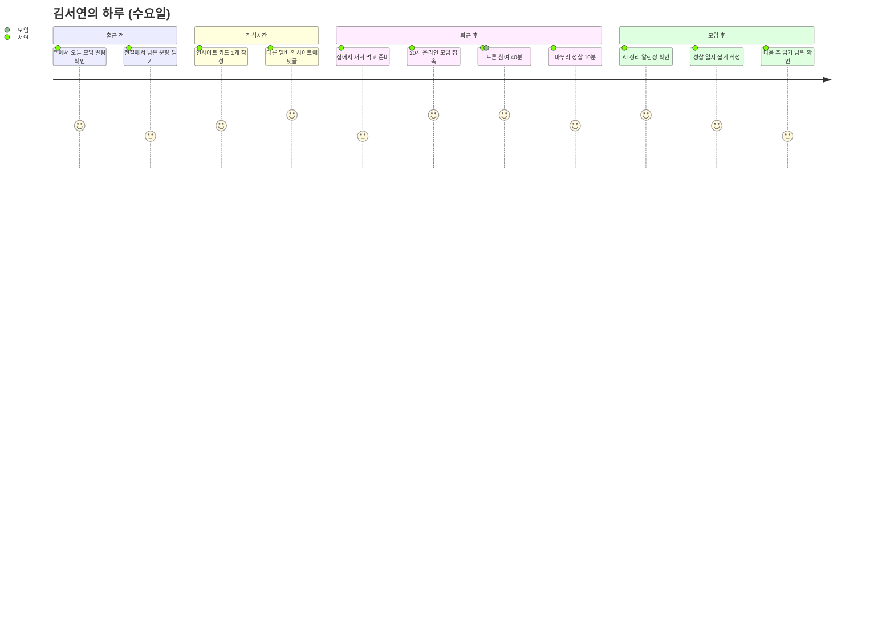

**핵심 경험**: "퇴근하고 집에서 편하게 참여했는데, 다른 사람들 관점이 정말 새로웠어요. 기록도 자동으로 되니까 나중에 다시 보기 좋아요."

---

### 시나리오 2: 학부모 박지현 - 오프라인 모임 운영

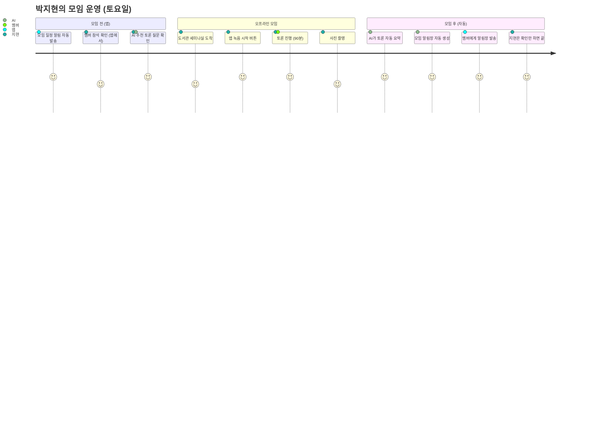

**핵심 경험**: "예전엔 모임 끝나고 정리하는 데 2시간 걸렸는데, 이제 녹음만 켜두면 AI가 다 정리해줘요. 운영이 정말 편해졌어요."

---

### 시나리오 3: 은퇴 교사 이영호 - 세대 교류 토론

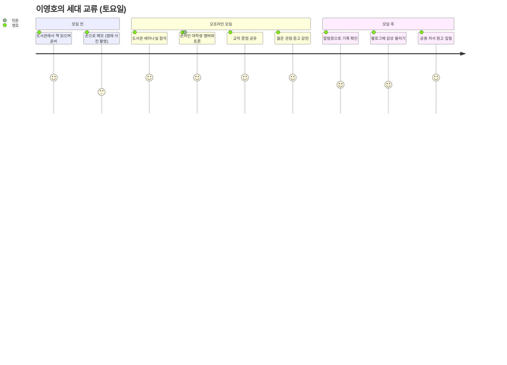

**핵심 경험**: "대학생 친구가 같은 책을 완전히 다르게 읽더라고요. 35년 가르치면서 못 본 관점이었어요. 함께 책을 쓰자는 제안이 왔는데, 정말 해보고 싶습니다."

---

### 시나리오 4: 대학생 최민준 - 프로젝트 포트폴리오 구축

```mermaid
journey
    title 최민준의 프로젝트형 독서 (16주)
    section 1-4주: 독서 모임
      경영 관련 책 4권 읽기: 4: 민준
      온라인 모임 참여: 4: 민준
      AI와 심화 대화: 5: 민준, AI
    section 5-8주: 관점 확장
      다른 분야 멤버와 토론: 5: 민준
      다각적 관점 수집: 5: 민준
      이영호 멘토와 대화: 5: 민준, 영호
    section 9-12주: 프로젝트
      독서 기반 리서치 보고서: 4: 민준
      팀 프로젝트 협업: 5: 민준, 팀
      중간 발표 및 피드백: 4: 민준
    section 13-16주: 결과물
      최종 보고서 완성: 5: 민준
      포트폴리오 등록: 5: 민준
      면접에서 활용: 5: 민준
```

**핵심 경험**: "독서 모임에서 시작했는데, 결국 프로젝트 보고서까지 만들었어요. 면접에서 이 경험을 이야기하니까 면접관이 정말 인상 깊어했어요."

---

### 시나리오 5: 사서 정하나 - 도서관 프로그램 운영


**핵심 경험**: "성과 보고서 쓸 때마다 데이터 모으느라 고생했는데, 이제 앱에서 자동으로 나와요. 참여자들도 기록이 남으니까 만족도가 훨씬 높아요."

---

### 시나리오 6: 공동 저서 프로젝트 (모임에서 책 만들기)

```mermaid
journey
    title 공동 저서 프로젝트 (6개월)
    section 1-2개월: 씨앗
      독서 모임에서 공통 관심사 발견: 5: 모임
      프로젝트 모임으로 전환: 4: 모임
      집필 주제와 목차 합의: 4: 모임
    section 3-4개월: 집필
      각자 담당 챕터 집필: 4: 멤버
      주간 모임에서 상호 피드백: 5: 모임
      AI가 초고 검토 및 피드백: 5: AI
    section 5-6개월: 완성
      원고 통합 및 교정: 4: 모임
      전자책 출판: 5: 모임
      출판 기념 발표회: 5: 모임
      도서관에 기증: 5: 모임
```

---

## 11. 단계별 목표

### 11.1 전체 로드맵

```mermaid
graph LR
    subgraph "Phase 1 (3개월)"
        A[씨앗 심기<br/>핵심 기능 MVP]
    end
    subgraph "Phase 2 (6개월)"
        B[뿌리 내리기<br/>도서관 연계]
    end
    subgraph "Phase 3 (12개월)"
        C[가지 뻗기<br/>프로젝트 확장]
    end
    subgraph "Phase 4 (24개월)"
        D[열매 맺기<br/>자립 생태계]
    end

    A --> B --> C --> D

    style A fill:#FF6B6B,color:#fff
    style B fill:#4ECDC4,color:#fff
    style C fill:#45B7D1,color:#fff
    style D fill:#96CEB4,color:#fff
```

### 11.2 Phase별 상세 목표

| Phase | 기간 | 핵심 목표 | 기능 | 성과 지표 |
|-------|------|----------|------|----------|
| **1. 씨앗 심기** | 3개월 | MVP 출시, 초기 모임 운영 | 모임 생성, 기록, 비동기 대화 | 모임 10개, 참여자 100명 |
| **2. 뿌리 내리기** | 6개월 | 도서관 5곳 연계, 하이브리드 안정화 | 온오프 통합, AI 기록, 음성 전사 | 모임 50개, 참여자 500명 |
| **3. 가지 뻗기** | 12개월 | 프로젝트 모임 시작, 성장 추적 | 프로젝트 기능, 성장 리포트 | 프로젝트 20개, 공동 저서 3권 |
| **4. 열매 맺기** | 24개월 | 자립 생태계, 전국 도서관 확대 | 멘토 시스템, 수익화 | 도서관 50곳, MAU 10,000명 |

### 11.3 핵심 성과 지표 (KPI)

| 카테고리 | 지표 | Phase 1 | Phase 2 | Phase 3 | Phase 4 |
|----------|------|---------|---------|---------|---------|
| **모임** | 활성 모임 수 | 10개 | 50개 | 200개 | 1,000개 |
| **참여자** | MAU | 100명 | 500명 | 3,000명 | 10,000명 |
| **기록** | 월 인사이트 수 | 200개 | 2,000개 | 15,000개 | 50,000개 |
| **도서관** | 연계 도서관 | 2곳 | 5곳 | 20곳 | 50곳 |
| **프로젝트** | 프로젝트 모임 | - | 5개 | 20개 | 100개 |
| **저서** | 공동 출판물 | - | - | 3권 | 20권 |
| **리텐션** | 3개월 지속률 | 30% | 40% | 50% | 60% |

---

## 12. 프로젝트와 저서 활동으로의 확장

### 12.1 독서 → 대화 → 프로젝트 → 저서의 자연스러운 흐름

```mermaid
graph TD
    A[1단계: 함께 읽기<br/>4~8주] --> B[2단계: 깊이 있는 대화<br/>8~12주]
    B --> C[3단계: 공통 관심사 발견<br/>자연 발생]
    C --> D{확장 선택}

    D --> E[프로젝트 모임<br/>사회 문제 해결]
    D --> F[공동 저서<br/>함께 책 쓰기]
    D --> G[발표/강연<br/>인사이트 공유]
    D --> H[다음 모임<br/>새로운 주제로]

    E --> I[실행 + 기록]
    F --> J[집필 + 편집]
    G --> K[발표 + 피드백]

    I --> L[성과물 아카이브]
    J --> L
    K --> L

    L --> M[포트폴리오<br/>성장 기록<br/>사회적 가치]

    style A fill:#e1f5ff,color:#111
    style B fill:#fff3e1,color:#111
    style C fill:#ccffcc,color:#111
    style E fill:#FF6B6B,color:#fff
    style F fill:#4ECDC4,color:#fff
    style G fill:#45B7D1,color:#fff
```

### 12.2 공동 저서 프로젝트 상세 프로세스

| 단계 | 기간 | 활동 | AI의 역할 | 산출물 |
|------|------|------|----------|--------|
| **기획** | 2주 | 주제 선정, 목차 구성, 역할 분담 | 유사 도서 분석, 목차 제안 | 기획서 |
| **리서치** | 4주 | 관련 독서, 자료 수집, 인터뷰 | 자료 검색, 요약, 분류 | 리서치 노트 |
| **초고 집필** | 8주 | 각자 담당 챕터 집필 | 문장 다듬기, 구조 제안 | 초고 원고 |
| **상호 피드백** | 4주 | 교차 리뷰, 모임에서 토론 | 피드백 포인트 추출 | 수정 원고 |
| **편집 통합** | 2주 | 원고 통합, 전체 톤 맞춤 | 문체 통일, 교정 | 최종 원고 |
| **출판** | 2주 | 전자책 또는 POD 출판 | 표지 디자인 보조 | 출판물 |
| **공유** | 이후 | 발표회, 도서관 기증, SNS 공유 | 홍보 문구 생성 | 사회적 영향 |

### 12.3 프로젝트 유형별 예시

| 프로젝트 | 참여 모임 | 기간 | 결과물 | 사회적 가치 |
|---------|----------|------|--------|-----------|
| "우리 동네 역사 탐구" | 역사 독서 모임 | 6개월 | 동네 역사 책자 + 지도 | 지역 문화 보존 |
| "AI 시대 인문학 에세이" | 인문학 모임 | 4개월 | 에세이 모음집 | 시대적 통찰 공유 |
| "청소년 추천 도서 가이드" | 교육 독서 모임 | 3개월 | 추천 도서 가이드북 | 청소년 독서 문화 |
| "은퇴 교사의 교실 이야기" | 세대 교류 모임 | 8개월 | 교육 경험 에세이집 | 교육 경험 전수 |
| "독서로 시작하는 창업" | 경영 독서 모임 | 6개월 | 비즈니스 플랜 + 리포트 | 창업 생태계 기여 |

### 12.4 리딩리듬이 바라보는 미래

```mermaid
mindmap
  root((리딩리듬의<br/>비전))
    도서관이 살아나는 세상
      도서관 = 만남의 공간
      사서 = 커뮤니티 매니저
      책 = 대화의 시작점
    세대가 연결되는 세상
      은퇴자의 경험 + 청년의 열정
      학부모의 관심 + 학생의 성장
      다양한 관점이 만나는 곳
    기록이 자산이 되는 세상
      모든 대화가 기록으로
      기록이 프로젝트로
      프로젝트가 사회적 가치로
    함께 만드는 세상
      혼자 읽고 끝 X
      함께 읽고 대화하고 만들기
      독서 모임에서 시작된 책이
      다시 누군가의 독서가 되는 순환
```

---

## 부록 A: 모임 유형별 운영 체크리스트

### 주제 지정 모임 체크리스트

```
모임 생성 시:
□ 주제 선정 (AI 추천 활용)
□ 도서 1~4권 선정
□ 기간 설정 (4/8/12/16주)
□ 모임 방식 (온라인/오프라인/하이브리드)
□ 시간대 설정
□ 인원 설정 (4~12명)
□ 모집 공고 작성 (AI 보조)

매주 운영:
□ 주간 안내 발송 (월요일)
□ 멤버 읽기 진도 확인 (수요일)
□ 정기 모임 진행 (토/일)
□ 녹음/기록 시작 (모임 시)
□ 모임 알림장 확인 (모임 후)
□ 다음 주 안내 확인 (일요일)

기수 종료 시:
□ 전체 기록 아카이브
□ 멤버 성장 리포트
□ 다음 기수 안내
□ 프로젝트 모임 전환 여부 결정
```

### 자유 주제 모임 체크리스트

```
모임 생성 시:
□ 모임 성격 설정 (나눔/수다/릴레이)
□ 모임 주기 설정 (주/격주/월)
□ 규칙 최소화 (자유로움 유지)

매회 운영:
□ 이번 회 발표자 확인 (릴레이 시)
□ 모임 진행 (구조 유연하게)
□ 기록 켜두기
□ 간단 정리 (AI 자동)

꾸준히:
□ 새 멤버 환영
□ 비활성 멤버 안부
□ 분위기 유지 (가볍고 즐겁게)
```

---

## 부록 B: 플랫폼 형태 비교 (최종 결정 참고)

| 형태 | 장점 | 단점 | 적합도 |
|------|------|------|--------|
| **전용 앱 (iOS+Android)** | 푸시알림, 녹음, 카메라 연동 | 개발비 높음, 다운로드 허들 | ★★★ (최종 목표) |
| **웹앱 (PWA)** | 설치 없음, 빠른 개발, 크로스플랫폼 | 푸시 제한, 네이티브 기능 제한 | ★★★ (MVP 적합) |
| **카카오톡 미니앱** | 접근성 최고, 별도 설치 불필요 | 기능 제한, 종속성 | ★★☆ |
| **노션+자동화** | 무료, 빠른 시작 | 확장성 한계, 비개발자 어려움 | ★★☆ (초기 테스트) |
| **디스코드+봇** | 무료, 음성 내장, 커뮤니티 | 독서 특화 아님, 어르신 진입장벽 | ★☆☆ |

**추천 경로**: 노션+자동화로 검증 → 웹앱(PWA)으로 MVP → 전용 앱으로 확장

---

> **"책을 읽는 것으로 시작하지만,**
> **함께 대화하고, 기록하고, 결국 함께 만들어가는 것.**
> **그것이 리딩리듬이 꿈꾸는 독서의 미래입니다."**

---

*이 문서는 리딩리듬 온오프라인 통합 플랫폼의 기획 단계 문서입니다.*
*실제 개발 시 사용자 인터뷰, 도서관 현장 조사, MVP 테스트를 추가로 진행해야 합니다.*
