# 리딩리듬 실전 운영 가이드: 회원가입부터 AI MC 토론까지

> **"AI가 MC, 사람이 주인공. 미네르바처럼 8인 화상 토론을 모든 도서관에서."**
>
> 회원 가입 → 모임 참여 → AI가 진행하는 토론 → 자동 기록
> 이 모든 흐름을 구체적으로 설계합니다

---

## 목차

### Part 1: 회원 가입부터 모임 참여까지
1. [회원 가입 플로우](#1-회원-가입-플로우)
2. [모임 탐색과 가입](#2-모임-탐색과-가입)
3. [모임 전 준비 과정](#3-모임-전-준비-과정)

### Part 2: 온라인 모임 - AI MC 화상 토론
4. [미네르바식 AI MC 토론 구조](#4-미네르바식-ai-mc-토론-구조)
5. [AI MC의 역할과 동작 방식](#5-ai-mc의-역할과-동작-방식)
6. [토론 세션 전체 흐름 (분 단위)](#6-토론-세션-전체-흐름-분-단위)
7. [화면 구성과 인터랙션](#7-화면-구성과-인터랙션)

### Part 3: 오프라인 모임 운영
8. [도서관 오프라인 모임 운영](#8-도서관-오프라인-모임-운영)
9. [하이브리드 (온+오프 동시) 운영](#9-하이브리드-온오프-동시-운영)

### Part 4: AI 자동 기록과 정리
10. [모임 후 자동 기록 프로세스](#10-모임-후-자동-기록-프로세스)

### Part 5: 기술 난이도 분석
11. [기술 스택과 난이도 평가](#11-기술-스택과-난이도-평가)
12. [단계별 개발 전략](#12-단계별-개발-전략)

---

## 1. 회원 가입 플로우

### 1.1 가입 단계 (3분 이내 완료)

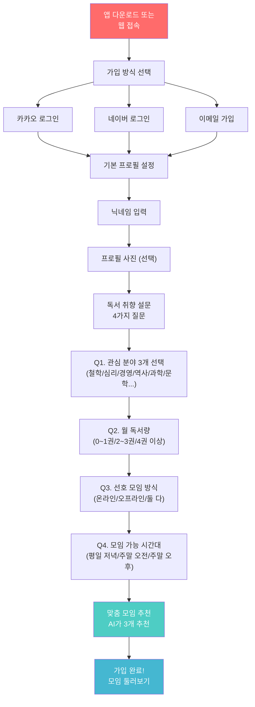

### 1.2 가입 후 첫 화면

```
+------------------------------------------+
|  반갑습니다, 서연님!                       |
|                                          |
|  서연님에게 맞는 모임을 찾아봤어요          |
|                                          |
|  +--------------------------------------+|
|  | 추천 1                                ||
|  | 철학 입문: 정의란 무엇인가 함께 읽기    ||
|  | 온라인 | 수 20시 | 6/8명 | 4주        ||
|  | [자세히 보기]                          ||
|  +--------------------------------------+|
|                                          |
|  +--------------------------------------+|
|  | 추천 2                                ||
|  | 심리학 북클럽: 생각에 관한 생각         ||
|  | 하이브리드 | 토 10시 | 5/8명 | 8주    ||
|  | [자세히 보기]                          ||
|  +--------------------------------------+|
|                                          |
|  +--------------------------------------+|
|  | 추천 3                                ||
|  | 자유 독서 모임: 이달의 책 나눔          ||
|  | 온라인 | 금 21시 | 3/8명 | 상시       ||
|  | [자세히 보기]                          ||
|  +--------------------------------------+|
|                                          |
|  [모든 모임 둘러보기]  [모임 직접 만들기]   |
+------------------------------------------+
```

---

## 2. 모임 탐색과 가입

### 2.1 모임 상세 페이지

```
+------------------------------------------+
|  <- 모임 상세                             |
|                                          |
|  철학 입문: 정의란 무엇인가 함께 읽기       |
|  =========================================|
|                                          |
|  모임 소개                                |
|  "마이클 샌델의 <정의란 무엇인가>를         |
|   4주에 걸쳐 함께 읽고 토론합니다.          |
|   AI MC가 토론을 진행하며, 깊이 있는        |
|   소크라테스식 대화를 경험할 수 있습니다."   |
|                                          |
|  +--------------------------------------+|
|  | 책: 정의란 무엇인가 (마이클 샌델)      ||
|  | 방식: 온라인 화상 토론                 ||
|  | 일정: 매주 수요일 20:00~21:30         ||
|  | 기간: 4주 (3/5~3/26)                 ||
|  | 인원: 6/8명 (2자리 남음)              ||
|  | 진행: AI MC + 모임장 보조              ||
|  | 가격: 무료 (프리미엄 기능은 구독)       ||
|  +--------------------------------------+|
|                                          |
|  현재 멤버                                |
|  [이영호] [박지현] [김서연] [+3명]         |
|                                          |
|  모임장: 정하나 (마포도서관 사서)           |
|  "도서관에서 10년간 독서모임을              |
|   운영해온 경험을 가지고 있습니다"          |
|                                          |
|  [가입 신청하기]                           |
+------------------------------------------+
```

### 2.2 가입 후 모임 준비 과정

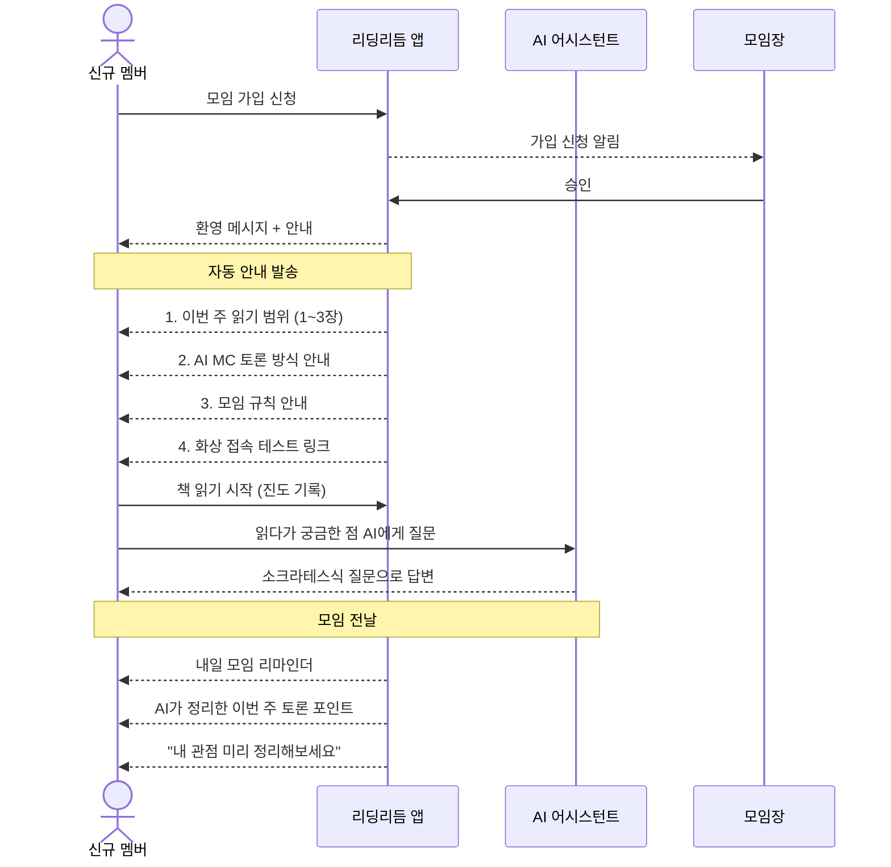

---

## 3. 모임 전 준비 과정

### 3.1 모임 전 1주일 타임라인

| 시점 | 앱이 하는 것 | 멤버가 하는 것 | AI가 하는 것 |
|------|------------|-------------|------------|
| **모임 직후** | 다음 주 읽기 범위 안내 | - | 읽기 가이드 질문 3개 생성 |
| **주중** | 진도 리마인더 (수, 금) | 책 읽기 + 메모 | 개인 질문 응답 |
| **모임 3일 전** | 인사이트 카드 작성 안내 | 핵심 생각 1~3문장 작성 | 멤버 인사이트 분석 |
| **모임 1일 전** | 토론 포인트 공개 | 내 관점 정리 | 토론 시나리오 준비 |
| **모임 당일** | 접속 안내 (30분 전) | 접속 및 준비 | MC 시나리오 최종 확인 |

---

## 4. 미네르바식 AI MC 토론 구조

### 4.1 미네르바 대학교 세미나 vs 리딩리듬 비교

| 항목 | 미네르바 대학교 | 리딩리듬 |
|------|-------------|---------|
| **인원** | 19명 이하 | **8명 이하** (더 밀도 높게) |
| **진행자** | 교수 (인간) | **AI MC** + 모임장 보조 |
| **플랫폼** | Forum (자체 플랫폼) | **리딩리듬 앱** (화상 내장) |
| **발언 추적** | 실시간 참여도 추적 | **AI가 발언 시간/횟수 추적** |
| **평가** | 교수 실시간 평가 | **AI가 참여도 분석** |
| **기록** | 수업 녹화 | **AI 자동 전사 + 요약** |
| **질문** | 교수가 소크라테스식 질문 | **AI가 질문 생성 + 던지기** |
| **비용** | 연 3만 달러 | **무료~월 9,900원** |

### 4.2 AI MC 토론의 핵심 원칙

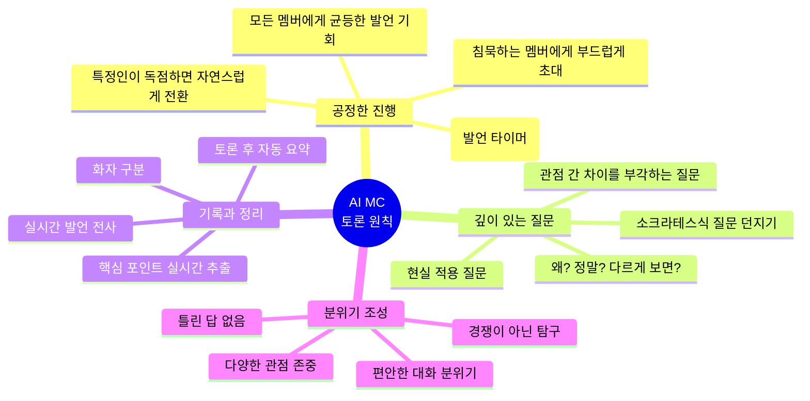

---

## 5. AI MC의 역할과 동작 방식

### 5.1 AI MC가 하는 것 vs 하지 않는 것

| AI MC가 하는 것 | AI MC가 하지 않는 것 |
|----------------|-------------------|
| 토론 주제 제시 | 자기 의견 주장 |
| 질문 던지기 (소크라테스식) | 정답 제시 |
| 발언 순서 관리 | 특정 관점 편들기 |
| 발언 시간 추적 | 멤버 평가/판단 |
| 침묵 멤버 초대 | 강제 발언 요구 |
| 관점 차이 부각 | 합의 강요 |
| 실시간 기록 | - |
| 토론 요약 정리 | - |
| 다음 질문 전환 | - |

### 5.2 AI MC 동작 시나리오 (구체적)

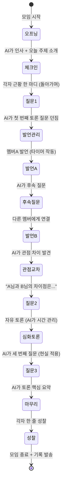

### 5.3 AI MC의 구체적 발화 예시

#### 오프닝 (2분)
```
AI MC: "안녕하세요, 리딩리듬 AI MC입니다.
       오늘은 <정의란 무엇인가> 3장
       '공리주의'에 대해 이야기 나눠보겠습니다.

       오늘 참여자: 서연님, 지현님, 영호님, 민준님,
       하나님, 수진님. 총 6분이시네요.

       먼저 간단히 안부 나눠볼까요?
       서연님부터 한 마디씩 부탁드립니다."
```

#### 첫 질문 던지기 (1분)
```
AI MC: "이번 주 3장에서 벤담의 공리주의가 나오는데요.
       '최대 다수의 최대 행복'이라는 원칙에 대해
       어떻게 생각하셨나요?

       서연님이 이번 주 인사이트 카드에
       '공리주의가 항상 옳지는 않다'고 쓰셨는데,
       어떤 점에서 그렇게 느끼셨나요?"
```

#### 관점 연결 (30초)
```
AI MC: "재미있는 점이 있습니다.
       서연님은 '소수의 희생이 문제'라고 하셨고,
       영호님은 '현실적으로 최선의 원칙'이라고 하셨어요.

       영호님, 서연님의 우려에 대해
       어떻게 생각하시나요?"
```

#### 침묵 멤버 초대 (자연스럽게)
```
AI MC: "민준님, 여기까지 들으시면서
       혹시 떠오르는 생각이 있으신가요?
       다른 관점도 환영합니다.
       편하게 말씀해 주세요."
```

#### 발언 시간 관리 (부드럽게)
```
AI MC: "서연님, 좋은 말씀인데요.
       다른 분들 생각도 들어볼까요?
       지현님은 어떻게 보셨나요?"
```

#### 토론 마무리 요약 (2분)
```
AI MC: "오늘 토론을 정리해보겠습니다.

       핵심 논점: 공리주의의 한계와 가능성
       
       관점 A (서연, 지현, 민준):
       '소수의 권리가 무시될 수 있어 위험하다'
       
       관점 B (영호, 하나):
       '현실 정책에서 가장 실용적인 기준이다'
       
       새로운 발견:
       수진님이 제시한 '밀의 수정된 공리주의'가
       두 관점의 접점이 될 수 있다는 점이
       오늘의 가장 인상적인 인사이트였습니다.

       다음 주는 4장 '자유지상주의'를 다룹니다.
       각자 오늘 가장 인상적이었던 점
       한 줄씩 나눠주세요."
```

---

## 6. 토론 세션 전체 흐름 (분 단위)

### 6.1 90분 토론 타임테이블

| 시간 | 단계 | AI MC 역할 | 멤버 역할 | 화면 표시 |
|------|------|-----------|----------|----------|
| **0~2분** | 오프닝 | 인사, 주제 소개 | 접속 확인 | 참석자 목록 |
| **2~10분** | 체크인 | 돌아가며 초대 | 한 마디 근황 | 발언자 하이라이트 |
| **10~12분** | 질문 1 | 첫 토론 질문 던짐 | 듣기 | 질문 카드 표시 |
| **12~30분** | 토론 1 | 발언 관리, 후속 질문 | 자유 발언 | 발언 타이머, 참여도 바 |
| **30~32분** | 중간 정리 | 지금까지 요약 | 듣기 | 관점 요약 카드 |
| **32~34분** | 질문 2 | 심화 질문 던짐 | 듣기 | 질문 카드 표시 |
| **34~55분** | 토론 2 | 관점 교차, 초대 | 자유 발언 | 관점 비교 시각화 |
| **55~57분** | 질문 3 | 현실 적용 질문 | 듣기 | 질문 카드 표시 |
| **57~75분** | 토론 3 | 자유 토론 촉진 | 자유 토론 | 자유 토론 모드 |
| **75~80분** | 마무리 | 전체 요약 | 듣기 | 토론 요약 카드 |
| **80~88분** | 성찰 | 한 줄 성찰 초대 | 한 줄 성찰 발언 | 성찰 기록 |
| **88~90분** | 클로징 | 다음 주 안내, 인사 | 인사 | 다음 주 안내 |

### 6.2 토론 흐름 다이어그램

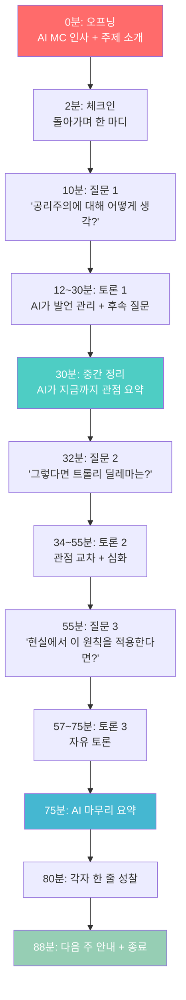

---

## 7. 화면 구성과 인터랙션

### 7.1 화상 토론 메인 화면

```
+--------------------------------------------------+
|  리딩리듬 | 철학 입문 모임 | 3주차               |
|  책: 정의란 무엇인가 3장                          |
+--------------------------------------------------+
|                                                  |
|  +----------+  +----------+  +----------+        |
|  |  서연    |  |  지현    |  |  영호    |        |
|  |  (발언중) |  |          |  |          |        |
|  | [2:15]   |  |          |  |          |        |
|  +----------+  +----------+  +----------+        |
|                                                  |
|  +----------+  +----------+  +----------+        |
|  |  민준    |  |  하나    |  |  수진    |        |
|  |          |  |          |  |          |        |
|  |          |  |          |  |          |        |
|  +----------+  +----------+  +----------+        |
|                                                  |
+--------------------------------------------------+
|  AI MC                                           |
|  "서연님 좋은 관점이네요.                          |
|   영호님은 어떻게 생각하시나요?"                    |
+--------------------------------------------------+
|                                                  |
|  오늘의 질문                      참여도          |
|  +----------------------------+ +----------+     |
|  | Q2. 트롤리 딜레마에서       | | 서연 ████ |     |
|  | 당신이라면 어떤 선택을      | | 지현 ██   |     |
|  | 하시겠습니까?              | | 영호 ███  |     |
|  +----------------------------+ | 민준 █    |     |
|                                 | 하나 ██   |     |
|  핵심 관점                      | 수진 ██   |     |
|  +----------------------------+ +----------+     |
|  | A: 5명 살리기 (서연,지현)   |                  |
|  | B: 개입 안 함 (영호,하나)   |                  |
|  | C: 제3의 방법 (수진)       |                  |
|  +----------------------------+                  |
|                                                  |
|  [손들기]  [채팅]  [반응]  [나가기]               |
+--------------------------------------------------+
```

### 7.2 AI MC 패널 (진행자 보조 화면)

```
+--------------------------------------------------+
|  AI MC 대시보드 (모임장에게만 보임)                 |
+--------------------------------------------------+
|                                                  |
|  현재 상태: 토론 2 진행 중 (34/90분)              |
|                                                  |
|  발언 현황                                        |
|  서연: 4회 (총 8분 12초) ████████ 과다            |
|  지현: 2회 (총 3분 45초) ████                     |
|  영호: 3회 (총 6분 30초) ██████                   |
|  민준: 0회 (총 0분)      [초대 필요]              |
|  하나: 2회 (총 4분 10초) ████                     |
|  수진: 1회 (총 2분 20초) ██                       |
|                                                  |
|  AI 추천 액션:                                    |
|  1. 민준님에게 발언 초대 (0회 발언)               |
|  2. 서연님 발언 조절 (평균의 2배)                 |
|  3. 다음 질문으로 전환 추천 (논점 포화)            |
|                                                  |
|  다음 준비된 질문:                                 |
|  "현실에서 공리주의가 적용된 정책 사례는?"          |
|                                                  |
|  [AI 자동 진행]  [수동 진행]  [질문 변경]          |
+--------------------------------------------------+
```

### 7.3 참여도 시각화 (미네르바 Forum 스타일)

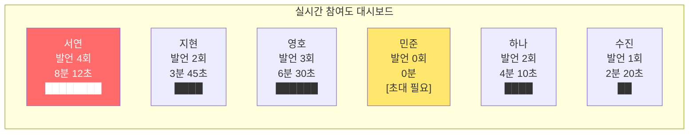

---

## 8. 도서관 오프라인 모임 운영

### 8.1 오프라인 모임에서 앱의 역할

| 단계 | 앱이 하는 것 | 사람이 하는 것 |
|------|------------|-------------|
| **모임 전** | 알림 발송, 진도 확인, 토론 질문 준비 | 책 읽기, 인사이트 카드 작성 |
| **모임 시작** | 녹음 시작 버튼 (AI 전사 시작) | 모임장이 인사 + 시작 |
| **토론 중** | AI 실시간 전사 + 핵심 포인트 추출 | 모임장 또는 멤버가 대화 진행 |
| **토론 중** | 다음 질문 추천 (모임장 화면에) | 모임장이 판단하여 활용 |
| **모임 종료** | 녹음 종료 버튼 | 다음 주 안내 |
| **모임 후** | AI가 전사본 요약 → 알림장 자동 생성 | 모임장이 확인 후 발송 |

### 8.2 오프라인 모임 장비

```
필수:
- 스마트폰 1대 (녹음용, 테이블 중앙)
- 리딩리듬 앱 (녹음 + AI 전사)

선택:
- 노트북/태블릿 (모임장용, AI 추천 질문 확인)
- 빔프로젝터 (토론 주제 표시)

불필요:
- 별도 마이크 (스마트폰 내장 마이크로 충분)
- 카메라 (오프라인은 녹화 불필요)
```

---

## 9. 하이브리드 (온+오프 동시) 운영

### 9.1 하이브리드 구조

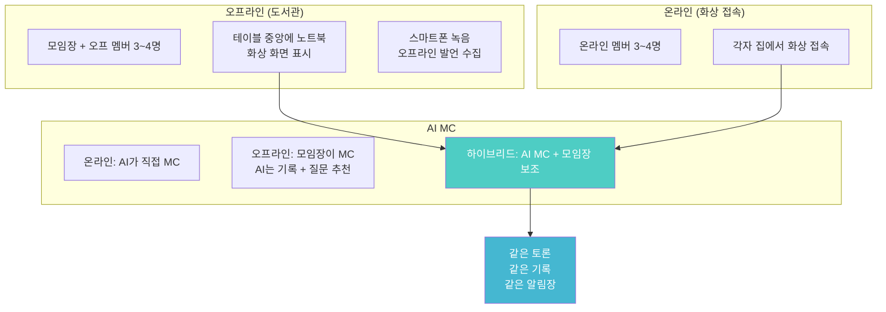

### 9.2 하이브리드 운영 팁

| 상황 | 해결 방법 |
|------|----------|
| 오프라인 소리가 온라인에 안 들림 | 스마트폰 마이크를 테이블 중앙에 놓고 화상 앱과 연결 |
| 온라인 멤버가 소외됨 | AI MC가 온/오프 교대로 발언 초대 |
| 오프라인끼리만 대화함 | 모임장이 "온라인 ○○님 의견은?" 중재 |
| 시간차 | AI MC가 온/오프 순서 교대로 관리 |

---

## 10. 모임 후 자동 기록 프로세스

### 10.1 기록 자동화 흐름

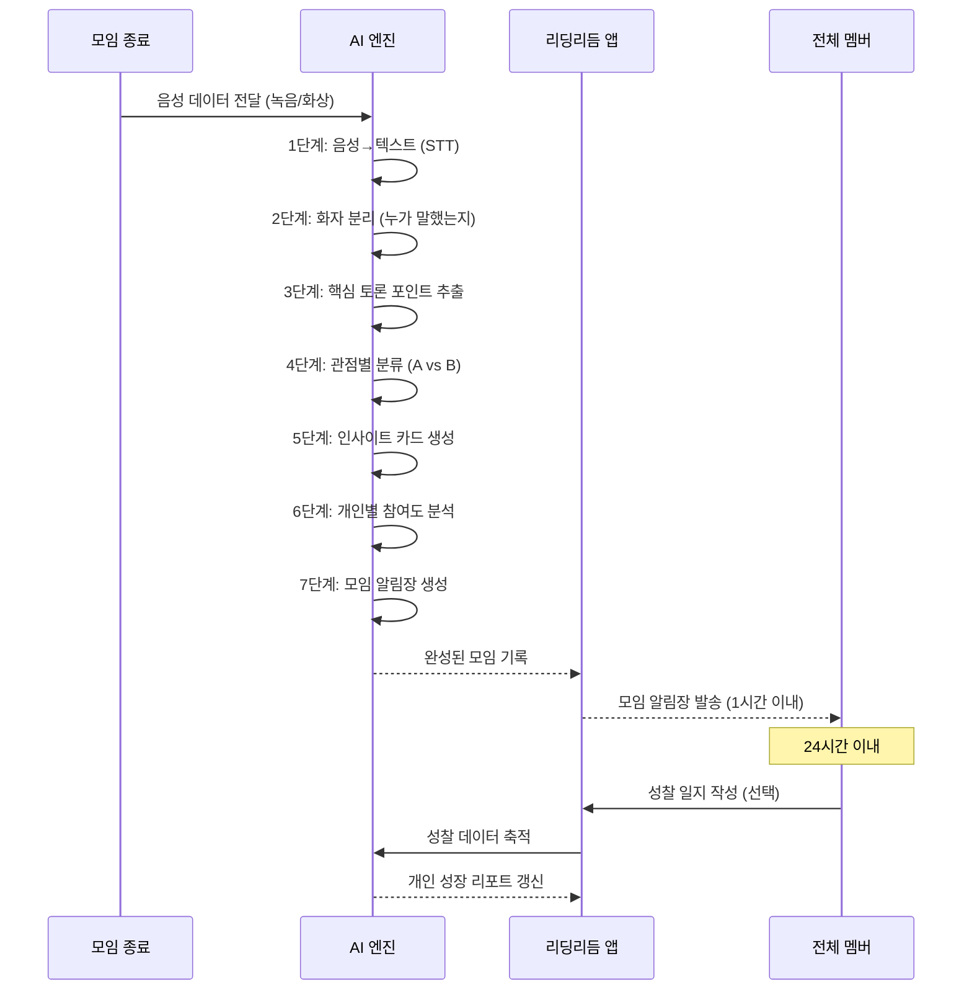

---

## 11. 기술 스택과 난이도 평가

### 11.1 필요 기술 요소와 난이도

| 기능 | 필요 기술 | 난이도 | 기존 솔루션 | 자체 개발 필요 |
|------|----------|--------|-----------|--------------|
| **회원 가입/인증** | OAuth (카카오/네이버) | ★☆☆☆☆ 매우 쉬움 | Firebase Auth, Supabase | 거의 없음 |
| **모임 관리** | CRUD, 알림 | ★★☆☆☆ 쉬움 | 일반 백엔드 | 모임 로직만 |
| **채팅 (비동기)** | WebSocket, DB | ★★☆☆☆ 쉬움 | Supabase Realtime | 거의 없음 |
| **화상 통화** | WebRTC | ★★★☆☆ 중간 | **Daily.co / Agora** | 거의 없음 (SDK) |
| **AI MC 질문 생성** | LLM API (GPT/Claude) | ★★☆☆☆ 쉬움 | OpenAI API, Claude API | 프롬프트 설계만 |
| **AI MC 발언 관리** | 타이머 + 로직 | ★★☆☆☆ 쉬움 | 자체 개발 | UI 로직 |
| **음성→텍스트 (STT)** | STT API | ★★☆☆☆ 쉬움 | **Whisper API / Clova** | API 호출만 |
| **화자 분리** | Speaker Diarization | ★★★☆☆ 중간 | **Whisper + pyannote** | 파이프라인 구축 |
| **실시간 전사** | Streaming STT | ★★★★☆ 높음 | Deepgram, Assembly AI | 실시간 처리 |
| **토론 요약** | LLM 요약 | ★★☆☆☆ 쉬움 | GPT/Claude API | 프롬프트만 |
| **참여도 분석** | 데이터 집계 | ★★☆☆☆ 쉬움 | 자체 개발 | 로직만 |
| **푸시 알림** | FCM / APNs | ★★☆☆☆ 쉬움 | Firebase | 거의 없음 |

### 11.2 기술 난이도 종합 평가

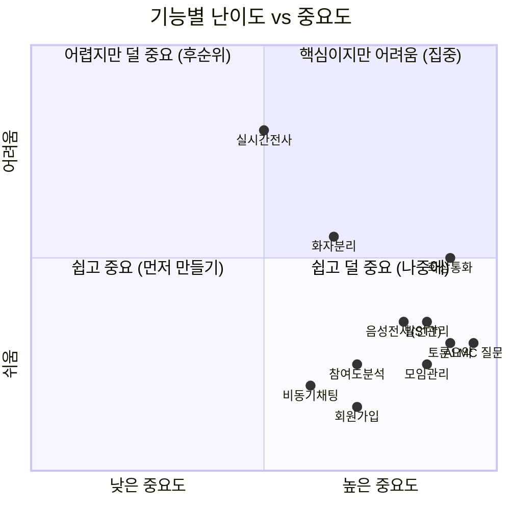

### 11.3 핵심 질문: 기술 난이도가 높을까?

> **결론: 전체적으로 "중간" 수준. 핵심 기술 대부분 기존 API/SDK로 해결 가능**

| 평가 항목 | 결과 | 이유 |
|-----------|------|------|
| **화상 통화** | 쉬움 (SDK) | Daily.co, Agora 등 SDK로 며칠 만에 구현 가능 |
| **AI MC 질문** | 쉬움 (API) | GPT/Claude API + 프롬프트 설계만 필요 |
| **음성→텍스트** | 쉬움 (API) | OpenAI Whisper API로 바로 사용 가능 |
| **화자 분리** | 중간 | pyannote 등 오픈소스 있지만 정확도 튜닝 필요 |
| **실시간 전사** | 높음 (선택) | MVP에서는 불필요, 모임 후 처리로 대체 가능 |
| **발언 시간 추적** | 쉬움 | 프론트엔드 타이머 + 화상 SDK의 음성 감지 |
| **토론 요약** | 쉬움 (API) | LLM API에 전사본 넣으면 바로 요약 |

### 11.4 정직한 난이도 비교

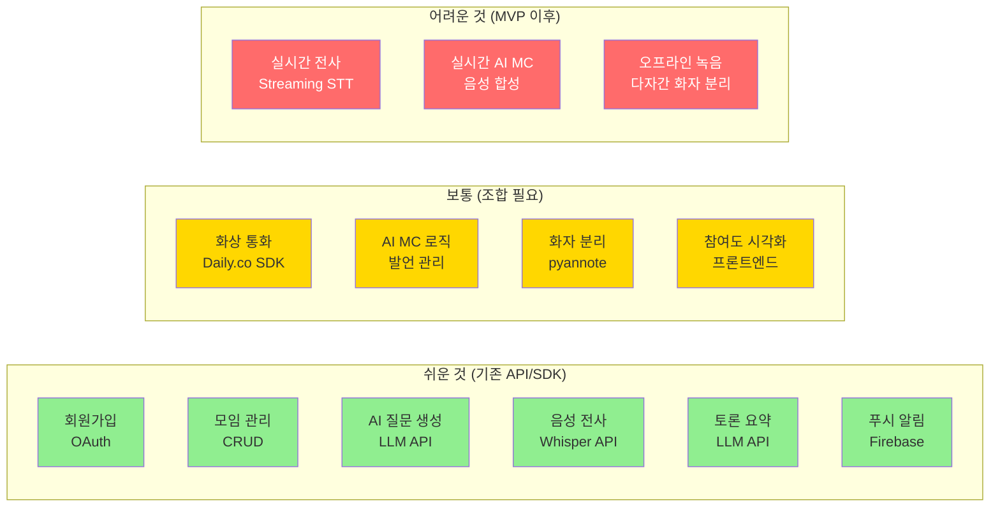

---

## 12. 단계별 개발 전략

### 12.1 MVP → 성장 → 완성 로드맵

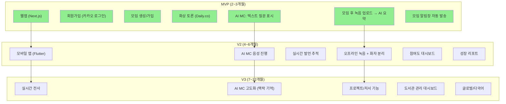

### 12.2 MVP 기능 상세

| 기능 | MVP에서 | V2에서 | V3에서 |
|------|---------|--------|--------|
| **AI MC** | 텍스트로 질문 표시 (채팅창) | 음성으로 질문 (TTS) | 맥락 기억 + 개인화 |
| **화상 토론** | Daily.co 임베드 | 자체 UI 커스텀 | 8인 최적화 레이아웃 |
| **발언 관리** | 수동 (모임장이 조절) | AI가 타이머 + 추천 | 완전 자동 |
| **기록** | 모임 후 녹음 업로드 → 요약 | 실시간 녹음 + 전사 | 실시간 전사 + 화자 분리 |
| **알림장** | AI 요약 → 수동 발송 | 자동 생성 + 자동 발송 | 개인화 알림장 |

### 12.3 MVP 기술 스택 (추천)

| 영역 | 기술 | 이유 | 비용 |
|------|------|------|------|
| **프론트엔드** | Next.js (React) | 빠른 개발, SSR, PWA 가능 | 무료 |
| **백엔드** | Supabase | DB + Auth + Realtime 올인원 | 무료~$25/월 |
| **화상** | Daily.co | 가장 쉬운 SDK, 8인 무료 | 무료 (소규모) |
| **AI** | OpenAI GPT-4o | 질문 생성 + 요약 | ~$20/월 |
| **STT** | OpenAI Whisper API | 한국어 정확도 높음 | ~$10/월 |
| **배포** | Vercel | Next.js 최적화 | 무료 |
| **알림** | Firebase Cloud Messaging | 푸시 알림 | 무료 |

**MVP 월 운영비: 약 $55 (7만원) 이내**

### 12.4 개발 인력 및 기간

| 시나리오 | 인력 | 기간 | 비용 |
|---------|------|------|------|
| **1인 풀스택 개발** | 풀스택 1명 | 3~4개월 | 인건비만 |
| **소규모 팀** | 프론트 1 + 백엔드 1 | 2개월 | 인건비 x 2 |
| **외주 개발** | 외주 업체 | 2~3개월 | 1,500~3,000만원 |
| **노코드+코드 혼합** | 1인 + AI 코딩 보조 | 2~3개월 | 최소 비용 |

---

## 부록: AI MC 프롬프트 설계 예시

### 토론 질문 생성 프롬프트

```
당신은 리딩리듬 독서 모임의 AI MC입니다.

[역할]
- 소크라테스식 질문을 던져 참여자의 사고를 확장합니다
- 정답을 주지 않고, 질문으로 깊이 있는 토론을 유도합니다
- 공정하게 모든 참여자에게 발언 기회를 줍니다

[이번 모임 정보]
- 책: 정의란 무엇인가 (마이클 샌델)
- 범위: 3장 (공리주의)
- 참여자: 6명
- 회차: 3/4주차

[멤버별 인사이트 카드]
- 서연: "공리주의가 항상 옳지는 않다"
- 영호: "현실 정책에서 가장 실용적"
- 수진: "밀의 수정 공리주의가 답"

[요청]
1. 오프닝 멘트 (2문장)
2. 토론 질문 3개 (쉬움 → 어려움 순서)
3. 각 질문에 대한 후속 질문 2개씩
4. 관점이 다른 멤버를 연결하는 질문 1개
5. 현실 적용 질문 1개
6. 마무리 성찰 질문 1개
```

### 토론 요약 프롬프트

```
당신은 리딩리듬 독서 모임의 기록 담당입니다.

[입력]
아래는 90분 토론의 전사본입니다.

[요청]
다음을 생성해주세요:
1. 핵심 토론 포인트 3개 (각 2~3문장)
2. 관점별 정리 (관점 A / 관점 B / 공통점)
3. 가장 인상적인 인사이트 1개
4. 다음 주 연결 질문 1개
5. 멤버별 핵심 발언 요약 (각 1문장)

[형식]
모임 알림장 형태로, 따뜻하고 격려하는 톤으로 작성
```

---

## 최종 정리: 한눈에 보는 전체 흐름

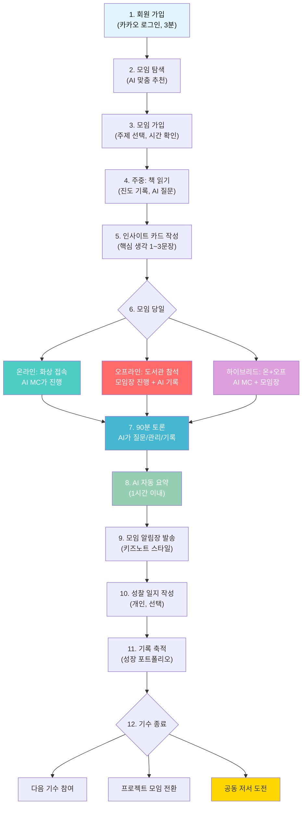

---

> **기술 난이도 최종 판단:**
>
> | 판단 | 내용 |
> |------|------|
> | **MVP** | 쉬움~중간. 기존 API/SDK 조합으로 2~3개월 내 가능 |
> | **V2 (AI MC 음성)** | 중간. TTS + 발언 추적 추가, 4~6개월 |
> | **V3 (실시간 전사)** | 높음. 하지만 MVP 이후 점진적으로 추가 가능 |
>
> **핵심: 어려운 기술은 나중에, 쉬운 것부터 빠르게 만들면 됩니다.**
> **"AI MC가 텍스트로 질문을 던지는 것"만으로도 MVP는 충분합니다.**

---

*이 문서는 리딩리듬 플랫폼의 실전 운영 가이드입니다.*
*회원 가입 → 모임 참여 → AI MC 토론 → 자동 기록의 전체 흐름을 담고 있습니다.*
