# 리딩리듬 서비스 모델: 유튜브형 독서 모임 플랫폼

> **"독서 모임을 유튜브처럼. 만들기 쉽고, 찾기 쉽고, 참여하기 쉽게."**
>
> AI가 진행하는 독서 토론 2회 무료 체험 → 프리미엄으로 계속
> 모임 하나가 하나의 채널. 사용자는 구독하듯 참여.

---

## 목차

### Part 1: 서비스 모델과 과금 구조
1. [프리미엄 모델: 2회 무료 체험 → 구독](#1-프리미엄-모델-2회-무료-체험--구독)
2. [사용자 유형과 권한 체계](#2-사용자-유형과-권한-체계)

### Part 2: 유튜브형 모임 구조
3. [모임 = 채널: 하나의 객체로 관리](#3-모임--채널-하나의-객체로-관리)
4. [모임 탐색 (유튜브 홈 스타일)](#4-모임-탐색-유튜브-홈-스타일)
5. [모임 상세 (유튜브 채널 스타일)](#5-모임-상세-유튜브-채널-스타일)

### Part 3: 운영자/사용자 경험 설계
6. [운영자 경험: 모임 만들기 3분 컷](#6-운영자-경험-모임-만들기-3분-컷)
7. [사용자 경험: 참여하기 3클릭 컷](#7-사용자-경험-참여하기-3클릭-컷)
8. [전체 서비스 흐름도](#8-전체-서비스-흐름도)

### Part 4: 데이터 구조와 객체 설계
9. [핵심 객체 모델](#9-핵심-객체-모델)
10. [모임 객체 상세](#10-모임-객체-상세)

---

## 1. 프리미엄 모델: 2회 무료 체험 → 구독

### 1.1 과금 구조

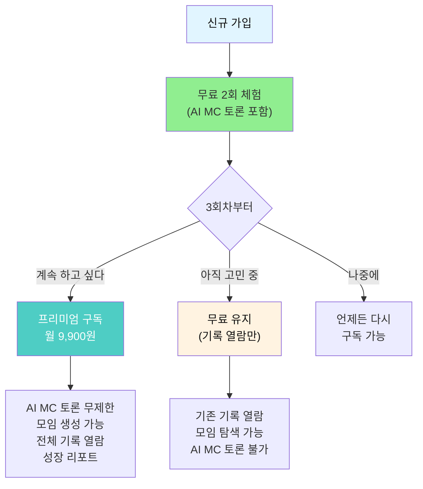

### 1.2 무료 vs 프리미엄 비교

| 기능 | 무료 (2회 체험) | 무료 (체험 후) | 프리미엄 (월 9,900원) |
|------|:---:|:---:|:---:|
| **회원 가입** | O | O | O |
| **모임 탐색/검색** | O | O | O |
| **모임 가입** | O (2개까지) | O (열람만) | O (무제한) |
| **AI MC 토론 참여** | **2회 무료** | X | **무제한** |
| **AI 독서 대화** | 3회/일 | 1회/일 | 무제한 |
| **인사이트 카드 작성** | O | O | O |
| **모임 기록 열람** | O (참여한 모임) | O (참여한 모임) | O (전체) |
| **모임 생성 (운영자)** | X | X | **O (5개까지)** |
| **성장 리포트** | 기본 | 기본 | **심화 + AI 분석** |
| **모임 알림장** | O | O | O |
| **토론 녹화/기록 다운로드** | X | X | O |
| **광고** | 최소 | 최소 | 없음 |

### 1.3 무료 체험의 핵심 전략

> **"2회면 충분히 가치를 느끼게 하자"**

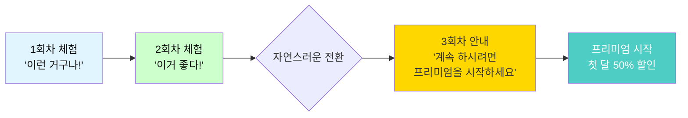

| 회차 | 사용자 경험 | 전환 포인트 |
|------|-----------|-----------|
| **1회차** | AI MC 토론 첫 경험, "신기하다" | 기록이 자동으로 정리되는 경험 |
| **2회차** | 멤버와 관계 형성, "재미있다" | 지난주 기록 돌아보며 성장 느낌 |
| **3회차** | "계속 하고 싶다" → 프리미엄 안내 | 모임 관계 + 기록 자산이 록인 |

---

## 2. 사용자 유형과 권한 체계

### 2.1 사용자 3유형

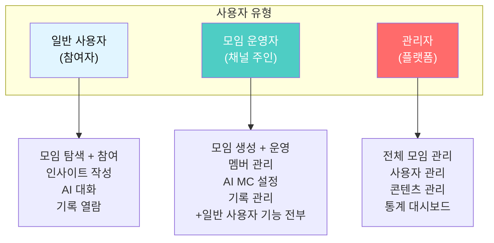

### 2.2 권한 매트릭스

| 기능 | 일반(무료) | 일반(프리미엄) | 운영자(프리미엄) | 관리자 |
|------|:---:|:---:|:---:|:---:|
| 모임 탐색/검색 | O | O | O | O |
| 모임 가입 | O | O | O | O |
| AI MC 토론 참여 | 2회 | 무제한 | 무제한 | 무제한 |
| 인사이트 카드 작성 | O | O | O | O |
| 기록 열람 | 내 모임만 | 전체 | 전체 | 전체 |
| 모임 생성 | X | X | **5개까지** | 무제한 |
| 멤버 관리 | X | X | **O** | O |
| AI MC 설정 (질문 커스텀) | X | X | **O** | O |
| 모임 통계 | X | 기본 | **상세** | 전체 |
| 수익화 (유료 모임) | X | X | O (추후) | O |

### 2.3 운영자 되기 (프리미엄 내 전환)

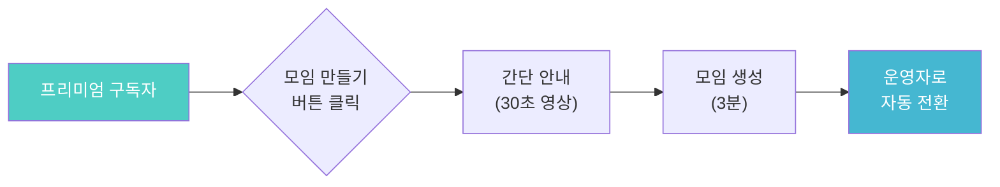

> **별도 신청 없음.** 프리미엄 구독자가 모임을 만들면 자동으로 운영자가 됩니다.

---

## 3. 모임 = 채널: 하나의 객체로 관리

### 3.1 유튜브와의 비유

| 유튜브 | 리딩리듬 | 설명 |
|--------|---------|------|
| **채널** | **모임** | 하나의 독립된 콘텐츠 공간 |
| **영상** | **회차 (세션)** | 매주 진행되는 토론 기록 |
| **구독** | **참여 (가입)** | 모임에 참여 신청 |
| **댓글** | **인사이트 카드** | 멤버들의 관점 공유 |
| **좋아요** | **공감** | 좋은 인사이트에 반응 |
| **재생목록** | **기수 (시즌)** | 같은 모임의 기수별 묶음 |
| **추천 알고리즘** | **맞춤 모임 추천** | AI가 취향에 맞는 모임 추천 |
| **채널 주인** | **모임 운영자** | 모임을 만들고 운영하는 사람 |
| **시청자** | **참여자** | 모임에 참여하는 사람 |
| **썸네일** | **모임 카드** | 모임을 한눈에 보여주는 카드 |

### 3.2 모임 객체 구조 (하나의 카드)

```
+------------------------------------------+
|  [모임 카드 = 유튜브 영상 썸네일]          |
|                                          |
|  +--------------------------------------+|
|  |  [책 표지 이미지]                      ||
|  |                                      ||
|  |  상태: 모집 중  |  온라인             ||
|  |  ★ 4.8 (리뷰 23)                     ||
|  +--------------------------------------+|
|                                          |
|  철학 입문: 정의란 무엇인가               |
|  정하나 · 참여 6/8명 · 매주 수 20시       |
|                                          |
|  #철학 #윤리 #입문 #4주과정               |
|                                          |
|  [참여하기]  [찜하기]  [공유]              |
+------------------------------------------+
```

### 3.3 모임의 생명주기

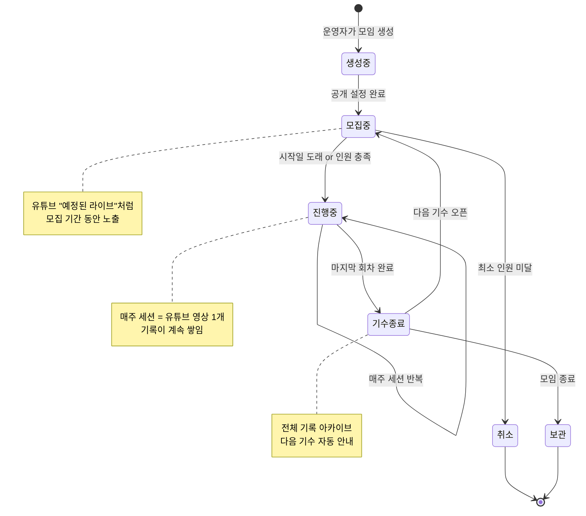

---

## 4. 모임 탐색 (유튜브 홈 스타일)

### 4.1 메인 탐색 화면

```
+--------------------------------------------------+
|  리딩리듬                    [검색]  [알림]  [MY] |
+--------------------------------------------------+
|                                                  |
|  [전체] [철학] [심리] [경영] [역사] [문학] [자유] |
|                                                  |
|  ━━━━ 서연님을 위한 추천 모임 ━━━━                |
|                                                  |
|  +----------+  +----------+  +----------+        |
|  |[책표지]  |  |[책표지]  |  |[책표지]  |        |
|  |모집중    |  |진행중    |  |모집중    |        |
|  +----------+  +----------+  +----------+        |
|  정의란무엇인가  생각의탄생    사피엔스           |
|  정하나·6/8명   김영수·8/8명  박은지·3/8명       |
|  수 20시·4주    토 10시·8주   금 21시·6주        |
|                                                  |
|  ━━━━ 이번 주 인기 모임 ━━━━                     |
|                                                  |
|  +----------+  +----------+  +----------+        |
|  |[책표지]  |  |[책표지]  |  |[책표지]  |        |
|  |곧시작    |  |모집중    |  |모집중    |        |
|  +----------+  +----------+  +----------+        |
|  미움받을용기    코스모스       넛지              |
|  이민수·7/8명   최지우·5/8명  한서영·4/8명       |
|                                                  |
|  ━━━━ 자유 주제 모임 ━━━━                        |
|                                                  |
|  +----------+  +----------+  +----------+        |
|  |[모임사진]|  |[모임사진]|  |[모임사진]|        |
|  |상시모집  |  |상시모집  |  |상시모집  |        |
|  +----------+  +----------+  +----------+        |
|  이달의책나눔   독서산책모임    밤독서수다         |
|                                                  |
+--------------------------------------------------+
|  [홈]     [탐색]    [+만들기]   [내모임]   [MY]  |
+--------------------------------------------------+
```

### 4.2 탐색 필터 (유튜브 필터 스타일)

| 필터 | 옵션 | 기본값 |
|------|------|--------|
| **분야** | 철학/심리/경영/역사/과학/문학/자유 | 전체 |
| **방식** | 온라인/오프라인/하이브리드 | 전체 |
| **시간** | 평일 저녁/주말 오전/주말 오후 | 전체 |
| **인원** | 여유 있음/거의 참 | 전체 |
| **상태** | 모집 중/곧 시작/진행 중 | 모집 중 |
| **정렬** | 추천순/인기순/최신순/시작임박순 | 추천순 |

---

## 5. 모임 상세 (유튜브 채널 스타일)

### 5.1 모임 상세 페이지

```
+--------------------------------------------------+
|  <- 모임 상세                          [공유]    |
+--------------------------------------------------+
|                                                  |
|  +----------------------------------------------+|
|  |  [책 표지 큰 이미지]                          ||
|  |                                              ||
|  |  모집 중 · 온라인 · AI MC 진행               ||
|  +----------------------------------------------+|
|                                                  |
|  철학 입문: 정의란 무엇인가 함께 읽기             |
|  ━━━━━━━━━━━━━━━━━━━━━━━━━━━━━━━━               |
|                                                  |
|  정하나 (운영자)  · ★ 4.8 (23) · 참여 6/8명     |
|  [운영자 프로필 보기]                             |
|                                                  |
|  +----------------------------------------------+|
|  | 매주 수요일 20:00~21:30                       ||
|  | 4주 과정 (3/5 ~ 3/26)                        ||
|  | 온라인 화상 토론 (AI MC 진행)                  ||
|  | 2자리 남음                                    ||
|  +----------------------------------------------+|
|                                                  |
|  [참여하기 (무료 체험 1/2회 남음)]                |
|                                                  |
|  ━━━━ 모임 소개 ━━━━                             |
|  "마이클 샌델의 <정의란 무엇인가>를               |
|   4주에 걸쳐 함께 읽고 토론합니다.                |
|   AI MC가 소크라테스식 질문을 던지며               |
|   깊이 있는 토론을 이끕니다."                     |
|                                                  |
|  ━━━━ 주차별 커리큘럼 ━━━━                       |
|  1주차: 1~3장 (공리주의란?)         3/5           |
|  2주차: 4~6장 (자유와 권리)         3/12          |
|  3주차: 7~9장 (정의와 미덕)         3/19          |
|  4주차: 10장 + 종합 토론            3/26          |
|                                                  |
|  ━━━━ 지난 기수 기록 (유튜브 영상 목록처럼) ━━━━ |
|                                                  |
|  시즌 1 (2026.01)                                |
|  +----------+  +----------+  +----------+        |
|  |1회차기록 |  |2회차기록 |  |3회차기록 |        |
|  |공리주의  |  |자유권리  |  |미덕정의  |        |
|  |인사이트8 |  |인사이트12|  |인사이트10|        |
|  +----------+  +----------+  +----------+        |
|                                                  |
|  ━━━━ 참여자 리뷰 ━━━━                           |
|  ★★★★★ "AI MC가 질문을 정말 잘 던져요" - 서연    |
|  ★★★★☆ "다양한 관점을 들을 수 있어서 좋았어요"   |
|                                                  |
+--------------------------------------------------+
```

### 5.2 지난 기수 기록 = 유튜브 영상 아카이브

> 핵심: **지난 세션 기록이 유튜브 영상처럼 쌓여서, 모임의 가치를 보여준다**

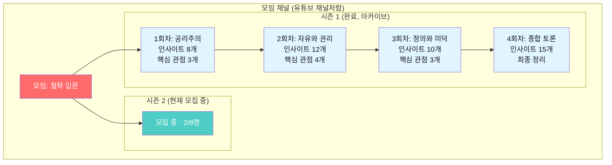

### 5.3 회차 기록 상세 (유튜브 영상 상세처럼)

```
+--------------------------------------------------+
|  <- 1회차 기록                                    |
|                                                  |
|  철학 입문 · 시즌1 · 1회차                        |
|  "공리주의는 정의로운가?"                          |
|  2026.01.08 수 20:00 · 참석 7명                   |
|                                                  |
|  ━━━━ AI MC 요약 ━━━━                            |
|  핵심 토론 포인트:                                |
|  1. 최대 다수의 행복 vs 소수의 권리                |
|  2. 트롤리 딜레마의 현실 적용                      |
|  3. 공리주의의 수정 가능성                         |
|                                                  |
|  ━━━━ 관점 비교 ━━━━                             |
|  관점 A: "현실적 최선" (영호, 하나, 수진)          |
|  관점 B: "소수 희생 위험" (서연, 지현, 민준)       |
|  접점: "밀의 수정 공리주의" (수진 제안)            |
|                                                  |
|  ━━━━ 인사이트 카드 (8개) ━━━━                   |
|  [서연] "숫자로 행복을 측정할 수 있을까?"          |
|  [영호] "정책은 결국 다수를 위한 것"               |
|  [수진] "질적 공리주의가 답 아닐까"               |
|  ... 더보기                                      |
|                                                  |
|  ━━━━ 참석자 ━━━━                                |
|  서연 · 지현 · 영호 · 민준 · 하나 · 수진 · 준서   |
+--------------------------------------------------+
```

---

## 6. 운영자 경험: 모임 만들기 3분 컷

### 6.1 모임 생성 플로우

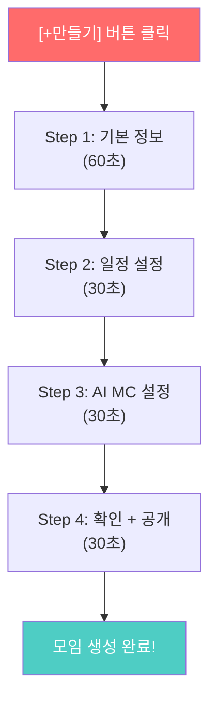

### 6.2 Step별 상세

#### Step 1: 기본 정보 (60초)

```
+------------------------------------------+
|  모임 만들기 (1/4)                        |
|                                          |
|  모임 유형을 선택하세요                    |
|  [같은 책 읽기]  [자유 주제]  [프로젝트]   |
|                                          |
|  책 제목 (같은 책 읽기 선택 시)            |
|  [정의란 무엇인가____________] [검색]      |
|  → AI가 자동으로 책 정보 + 표지 입력      |
|                                          |
|  모임 이름                                |
|  [철학 입문: 정의란 무엇인가 함께 읽기]    |
|  → AI가 자동 제안 (수정 가능)             |
|                                          |
|  모임 소개 (AI 자동 생성, 수정 가능)       |
|  [마이클 샌델의 <정의란 무엇인가>를...]     |
|                                          |
|  분야 태그                                |
|  [#철학] [#윤리] [+추가]                  |
|                                          |
|  [다음]                                   |
+------------------------------------------+
```

#### Step 2: 일정 설정 (30초)

```
+------------------------------------------+
|  모임 만들기 (2/4)                        |
|                                          |
|  방식                                     |
|  [온라인]  [오프라인]  [하이브리드]         |
|                                          |
|  요일과 시간                              |
|  [수요일]  [20:00] ~ [21:30]             |
|                                          |
|  기간                                     |
|  [4주]  시작일 [2026-03-05]              |
|  → AI가 주차별 읽기 범위 자동 배분         |
|                                          |
|  인원                                     |
|  최소 [3]명 ~ 최대 [8]명                  |
|                                          |
|  [다음]                                   |
+------------------------------------------+
```

#### Step 3: AI MC 설정 (30초)

```
+------------------------------------------+
|  모임 만들기 (3/4)                        |
|                                          |
|  AI MC 토론 스타일                        |
|  [소크라테스식] [자유 토론] [발표형]       |
|                                          |
|  토론 깊이                                |
|  [입문] ○────●────○ [심화]               |
|         가벼운 대화   철학적 깊이          |
|                                          |
|  AI MC 추가 설정 (선택)                    |
|  □ 발언 시간 제한 (1인 3분)               |
|  ■ 침묵 멤버 자동 초대                    |
|  ■ 관점 비교 시각화                       |
|  □ 실시간 투표 기능                       |
|                                          |
|  [다음]                                   |
+------------------------------------------+
```

#### Step 4: 확인 + 공개 (30초)

```
+------------------------------------------+
|  모임 만들기 (4/4)                        |
|                                          |
|  모임 미리보기                             |
|  +--------------------------------------+|
|  |  [책 표지]                            ||
|  |  철학 입문: 정의란 무엇인가            ||
|  |  온라인 · 수 20시 · 4주 · 최대 8명    ||
|  |  AI MC: 소크라테스식 · 입문 수준       ||
|  +--------------------------------------+|
|                                          |
|  공개 범위                                |
|  [전체 공개]  [링크 공유만]  [비공개]      |
|                                          |
|  [모임 만들기!]                            |
|                                          |
|  → 생성 즉시 탐색 페이지에 노출           |
|  → 공유 링크 자동 생성                    |
+------------------------------------------+
```

### 6.3 운영자가 해야 할 것 vs AI가 해주는 것

| 항목 | 운영자 | AI |
|------|--------|-----|
| **모임 생성** | 기본 정보 입력 (3분) | 소개글, 커리큘럼 자동 생성 |
| **주간 안내** | 확인 버튼만 | 읽기 범위, 질문, 안내문 자동 생성 |
| **토론 진행** | 참석만 (또는 보조) | **AI MC가 진행** |
| **기록 정리** | 확인 버튼만 | 요약, 인사이트, 알림장 자동 생성 |
| **멤버 관리** | 가입 승인/거절 | 참여도 분석, 리마인더 자동 발송 |
| **다음 기수** | 시작 버튼만 | 모집 공고 자동 생성 |

> **운영자의 핵심 역할: "만들고, 확인하고, 같이 참여하기"**
> AI가 나머지를 다 합니다.

---

## 7. 사용자 경험: 참여하기 3클릭 컷

### 7.1 참여까지 3클릭

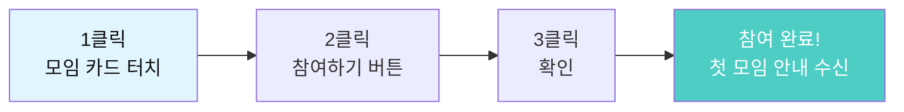

### 7.2 사용자 주간 루틴 (최소 시간 투자)

| 활동 | 소요 시간 | 필수 여부 | 언제 |
|------|----------|----------|------|
| 책 읽기 | 30~60분 | 필수 | 주중 아무 때나 |
| 인사이트 카드 1개 | 3분 | 권장 | 읽다가 아무 때나 |
| 모임 참석 | 90분 | 필수 | 정해진 시간 |
| 알림장 확인 | 5분 | 자동 | 모임 다음날 |
| 성찰 일지 | 10분 | 선택 | 모임 후 24시간 내 |

> **주간 최소 투자: 책 읽기 30분 + 모임 90분 = 2시간**

---

## 8. 전체 서비스 흐름도

### 8.1 사용자 여정 전체 (End-to-End)

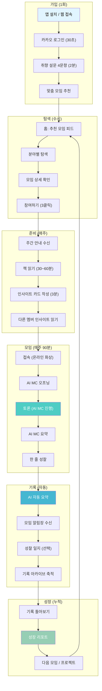

### 8.2 프리미엄 전환 시점

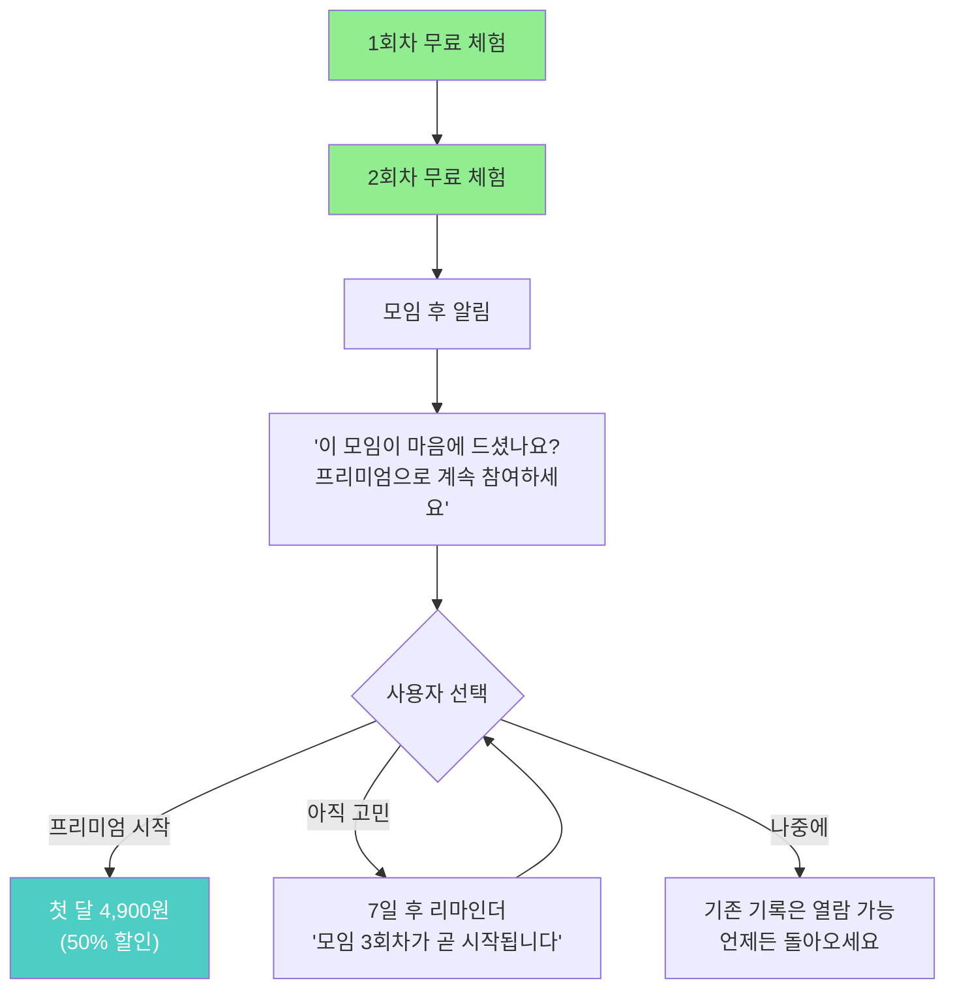

---

## 9. 핵심 객체 모델

### 9.1 데이터 객체 관계도

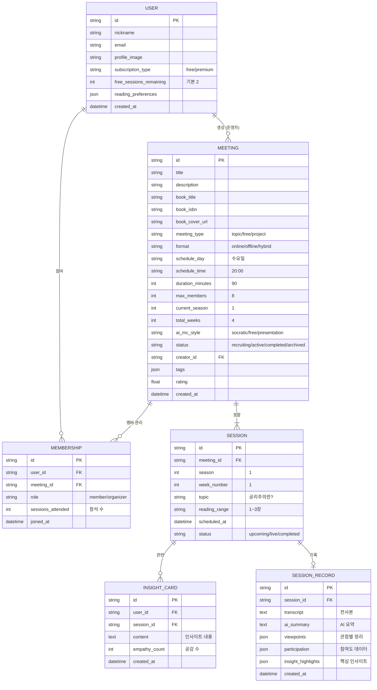

### 9.2 핵심 객체 요약

| 객체 | 유튜브 비유 | 핵심 필드 | 관계 |
|------|-----------|----------|------|
| **User** | 사용자 | 닉네임, 구독 유형, 무료 잔여 횟수 | 모임 참여, 모임 생성 |
| **Meeting** | 채널 | 제목, 책, 일정, AI MC 설정, 상태 | 세션 포함, 멤버 관리 |
| **Session** | 영상 | 주차, 주제, 읽기 범위, 상태 | 기록 포함, 인사이트 포함 |
| **SessionRecord** | 영상 내용 | 전사본, AI 요약, 관점 정리 | 세션에 1:1 |
| **InsightCard** | 댓글 | 내용, 공감 수 | 세션에 다수 |
| **Membership** | 구독 관계 | 역할, 참석 수 | User-Meeting 연결 |

---

## 10. 모임 객체 상세

### 10.1 모임 = 하나의 완전한 객체

> **모임 하나가 독립적으로 동작하는 "마이크로 서비스"처럼 설계**

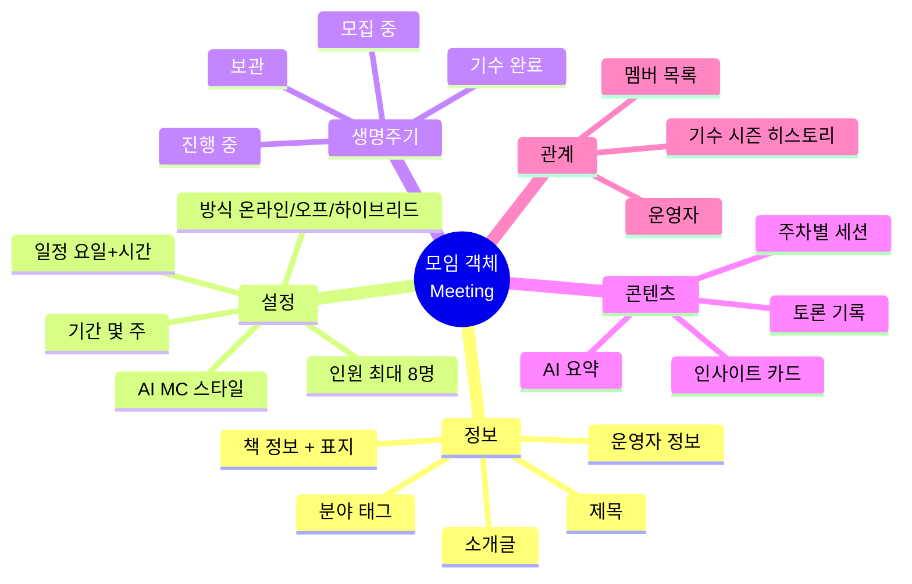

### 10.2 모임 카드 렌더링 규칙

```
모임 상태에 따라 카드 표시가 달라짐:

[모집 중]   → 초록 뱃지, "참여하기" 버튼 활성
[곧 시작]   → 노랑 뱃지, "D-3" 카운트다운
[진행 중]   → 파랑 뱃지, "현재 3주차" 표시
[인원 마감] → 회색 뱃지, "알림 받기" 버튼
[기수 완료] → 보라 뱃지, "기록 보기" 버튼, "다음 기수 알림"
```

### 10.3 모임 운영의 자동화 수준

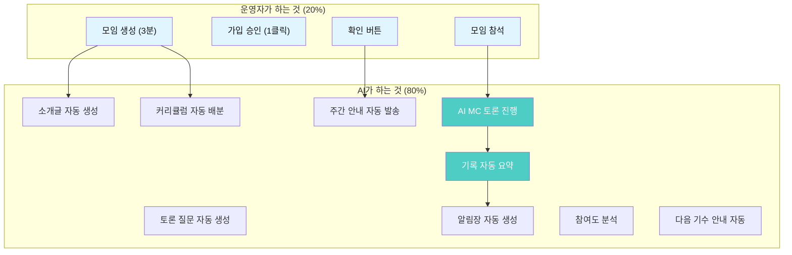

---

## 부록: 전체 서비스 한눈에 보기

### 서비스 구조 요약

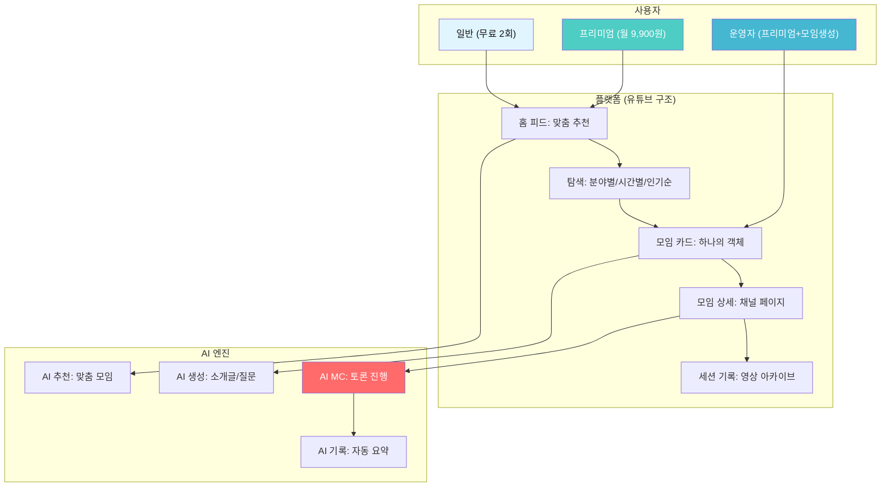

### 핵심 정리

| 항목 | 결정 |
|------|------|
| **과금** | AI MC 토론 2회 무료 → 프리미엄 월 9,900원 (첫 달 50%) |
| **사용자** | 일반(무료) / 프리미엄 / 운영자(프리미엄+생성권) |
| **모임 구조** | 유튜브 채널처럼. 모임=채널, 세션=영상, 가입=구독 |
| **모임 탐색** | 유튜브 홈처럼 카드 피드, 분야별 필터, AI 추천 |
| **운영 난이도** | 운영자 20% (생성+확인) + AI 80% (나머지 전부) |
| **사용자 접근** | 3클릭으로 참여, 주 2시간 투자 |
| **핵심 객체** | Meeting (모임) 하나가 독립 운영되는 완전한 단위 |

---

> **"유튜브에서 채널을 구독하듯,**
> **리딩리듬에서 모임을 구독하세요.**
> **AI MC가 진행하고, 기록은 자동으로.**
> **당신은 읽고, 생각하고, 대화하면 됩니다."**

---

*이 문서는 리딩리듬의 서비스 모델, 과금 구조, 유튜브형 모임 구조를 정의합니다.*
*이전 문서(1~3단계)와 함께 참고하여 개발을 진행합니다.*
