# 리딩클루(ReadingClue) 콘텐츠 중심 설계: 외부·내부·학습 3트랙 운영

> **"한국형 독서 토론 학원을 온라인으로. 20분부터 시작하는 부담 없는 독서 대화."**
>
> **외부 콘텐츠 · 내부 콘텐츠 · 학습 콘텐츠** — 세 갈래로 달리는 콘텐츠 플랫폼
> 초등 · 중등 · 고등 · 일반부 4단계, **기본을 알고 시작하면 독서 토론 모임이 활성화됩니다.**

---

## 목차

### Part 1: 리딩클루 콘텐츠 철학
1. [콘텐츠 퍼스트 원칙](#1-콘텐츠-퍼스트-원칙)
2. [3트랙 운영 구조 (외부·내부·학습)](#2-3트랙-운영-구조)

### Part 2: 점진적 시간 확장 시스템
3. [20분에서 시작하는 세션 설계](#3-20분에서-시작하는-세션-설계)
4. [단계별 세션 구성표](#4-단계별-세션-구성표)

### Part 3: 난이도별 콘텐츠 설계
5. [난이도 3단계 콘텐츠](#5-난이도-3단계-콘텐츠)
6. [미네르바식 다각적 독서법](#6-미네르바식-다각적-독서법)

### Part 4: 대상별 콘텐츠 (초/중/고/일반)
7. [4단계 대상별 콘텐츠 설계](#7-4단계-대상별-콘텐츠-설계)
8. [대상별 추천 도서 커리큘럼](#8-대상별-추천-도서-커리큘럼)

### Part 5: AI 역할과 콘텐츠 생성
9. [AI의 5가지 콘텐츠 역할](#9-ai의-5가지-콘텐츠-역할)
10. [AI 프롬프트 설계 (콘텐츠 생성용)](#10-ai-프롬프트-설계-콘텐츠-생성용)

### Part 6: 3트랙 상세 — 외부 · 내부 · 학습
11. [Track A: 외부 콘텐츠 — 자유로운 모임 주선](#11-track-a-외부-콘텐츠)
12. [Track B: 내부 콘텐츠 — AI 공식 프로그램](#12-track-b-내부-콘텐츠)
13. [Track C: 학습 콘텐츠 — 독서토론 길라잡이](#13-track-c-학습-콘텐츠)
14. [3트랙 시너지 구조](#14-3트랙-시너지-구조)

### Part 7: 건전한 토론 문화 시스템
15. [콘텐츠 보호 및 클린 토론 장치](#15-콘텐츠-보호-및-클린-토론-장치)
16. [건전한 독서 토론 문화 캠페인](#16-건전한-독서-토론-문화-캠페인)

### Part 8: 콘텐츠 확장 로드맵
17. [콘텐츠 다양화 전략](#17-콘텐츠-다양화-전략)

---

## 1. 콘텐츠 퍼스트 원칙

### 1.1 리딩클루의 콘텐츠 철학

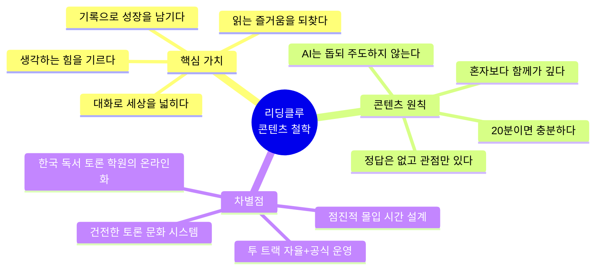

### 1.2 왜 콘텐츠가 먼저인가?

| 순서 | 항목 | 이유 |
|:---:|------|------|
| **1** | 콘텐츠 품질 | 좋은 콘텐츠가 있어야 사람이 모인다 |
| **2** | 커뮤니티 형성 | 콘텐츠로 모인 사람들이 문화를 만든다 |
| **3** | 자발적 확산 | 좋은 경험은 입소문으로 퍼진다 |
| **4** | 가격 정책 | 가치가 증명된 후에 비로소 의미 있다 |

> **"가격 먼저 정하면 '싸니까 써볼까'가 되고, 콘텐츠 먼저 만들면 '좋으니까 계속 쓰고 싶다'가 된다."**

---

## 2. 3트랙 운영 구조

### 2.1 핵심 철학: "기본을 알면, 모임이 살아난다"

> **"마구마구 모임을 만들어도 좋다. 하지만 기본을 알고 시작하면, 그 모임은 10배 더 깊어진다."**

독서 토론은 누구나 시작할 수 있지만, **잘** 하려면 기본이 필요합니다.
리딩클루는 "학습 → 외부(자유 모임) → 내부(공식 프로그램)" 3트랙으로,
**기본을 알려주고 → 자유롭게 모이게 하고 → 체계적으로 성장하게** 합니다.

### 2.2 3트랙 전체 구조도

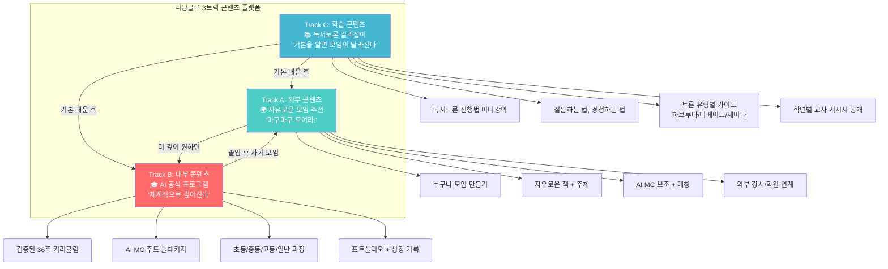

### 2.3 3트랙 사용자 여정 (Journey)

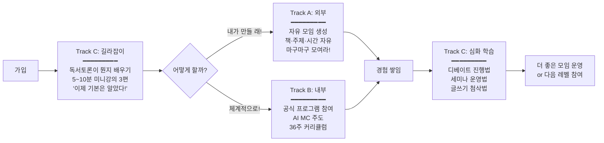

### 2.4 3트랙 비교표

| 항목 | Track C: 학습 (길라잡이) | Track A: 외부 (자유 모임) | Track B: 내부 (공식 프로그램) |
|------|:---:|:---:|:---:|
| **성격** | **배움** — 기본기 습득 | **실전** — 자유로운 실행 | **체계** — 전문적 프로그램 |
| **비유** | 운전면허 학원 | 자유 드라이브 | F1 레이싱 아카데미 |
| **대상** | 모든 사용자 (특히 입문) | 경험자, 모임장 | 체계적 성장 원하는 사용자 |
| **콘텐츠** | 미니강의, 가이드, 튜토리얼 | 모임 도구, AI 보조 | 36주 커리큘럼, AI MC 주도 |
| **시간** | 자율 (5~15분씩) | 자유 설정 (20분~) | 체계적 확장 (20→90분) |
| **비용** | **무료** (전원 접근) | 기본 무료 / 프리미엄 | 구독 or 패키지 |
| **AI 역할** | 학습 도우미, 퀴즈 | 보조 MC, 질문 추천 | 주도 MC, 풀 패키지 |
| **결과물** | 수료증, 기본 뱃지 | 자유 형식 기록 | 포트폴리오, 성장 기록 |
| **핵심 가치** | "알고 하면 다르다" | "자유롭게 모여라" | "깊이 있게 성장하라" |

---

## 3. 20분에서 시작하는 세션 설계

### 3.1 점진적 시간 확장 철학

> **"처음부터 90분은 부담. 20분이면 누구나 할 수 있다."**

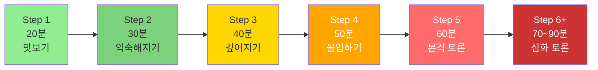

### 3.2 시간 단계별 설계

| 단계 | 시간 | 회차 | 세션 구성 | 목표 |
|:---:|:---:|:---:|------|------|
| **Step 1** | 20분 | 1~2회차 | 자기소개 5분 + 한 줄 감상 10분 + 마무리 5분 | "말해봤더니 괜찮네" |
| **Step 2** | 30분 | 3~4회차 | 체크인 5분 + 감상 공유 15분 + 정리 10분 | "다른 사람 생각이 다르구나" |
| **Step 3** | 40분 | 5~6회차 | 체크인 5분 + 주제 토론 25분 + 정리 10분 | "내 생각을 말할 수 있다" |
| **Step 4** | 50분 | 7~8회차 | 체크인 5분 + 토론 30분 + 성찰 15분 | "깊이 있는 대화가 가능하다" |
| **Step 5** | 60분 | 9~12회차 | 체크인 5분 + 토론 40분 + 성찰 15분 | "본격적인 비판적 사고" |
| **Step 6** | 70분+ | 13회차~ | 체크인 5분 + 심화 토론 50분+ + 성찰 15분 | "전문적인 독서 토론" |

### 3.3 대상별 시간 적용

| 대상 | 시작 시간 | 최대 시간 | 확장 속도 | 비고 |
|:---:|:---:|:---:|:---:|------|
| **초등 (4~6)** | 20분 | 40분 | 2회마다 +5분 | 40분 넘기지 않음 |
| **중등** | 20분 | 60분 | 2회마다 +10분 | 60분이 기본 목표 |
| **고등** | 30분 | 70분 | 2회마다 +10분 | 논술 연계 시 80분 |
| **일반** | 30분 | 90분 | 2회마다 +10분 | 자율 조절 가능 |

---

## 4. 단계별 세션 구성표

### 4.1 Step 1: 20분 세션 (맛보기)

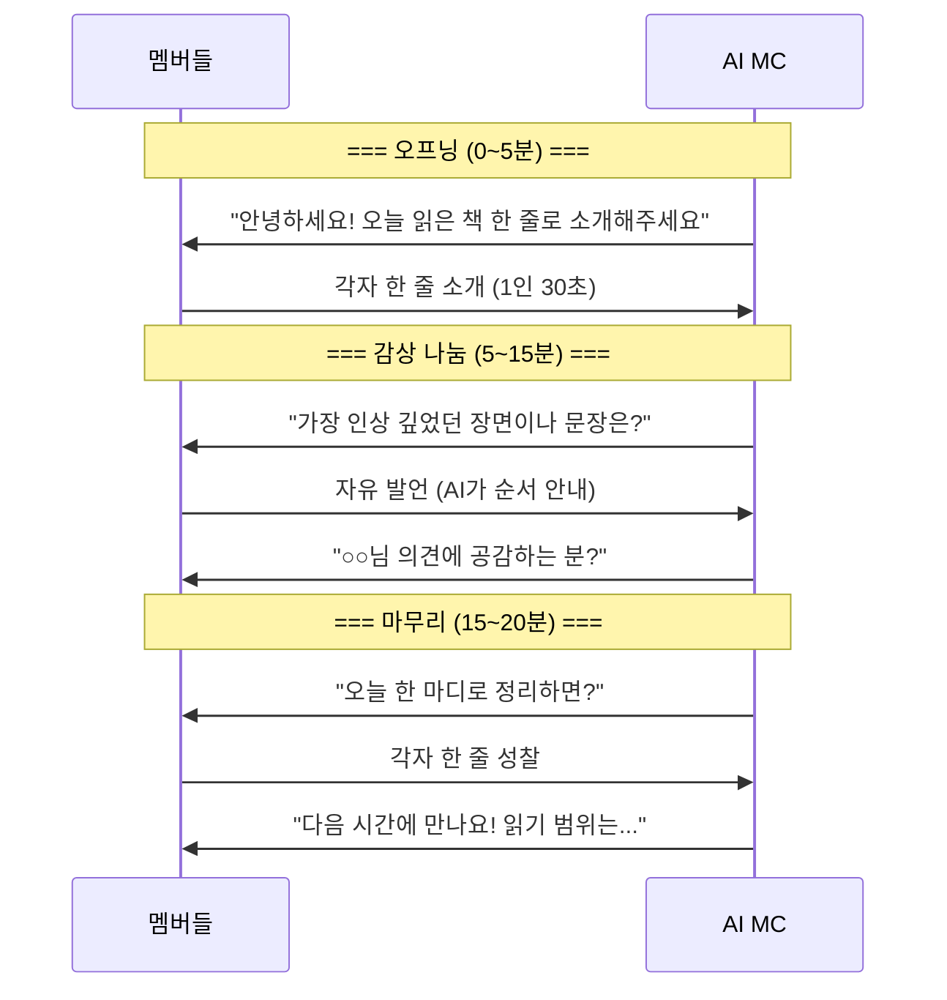

### 4.2 Step 3: 40분 세션 (깊어지기)

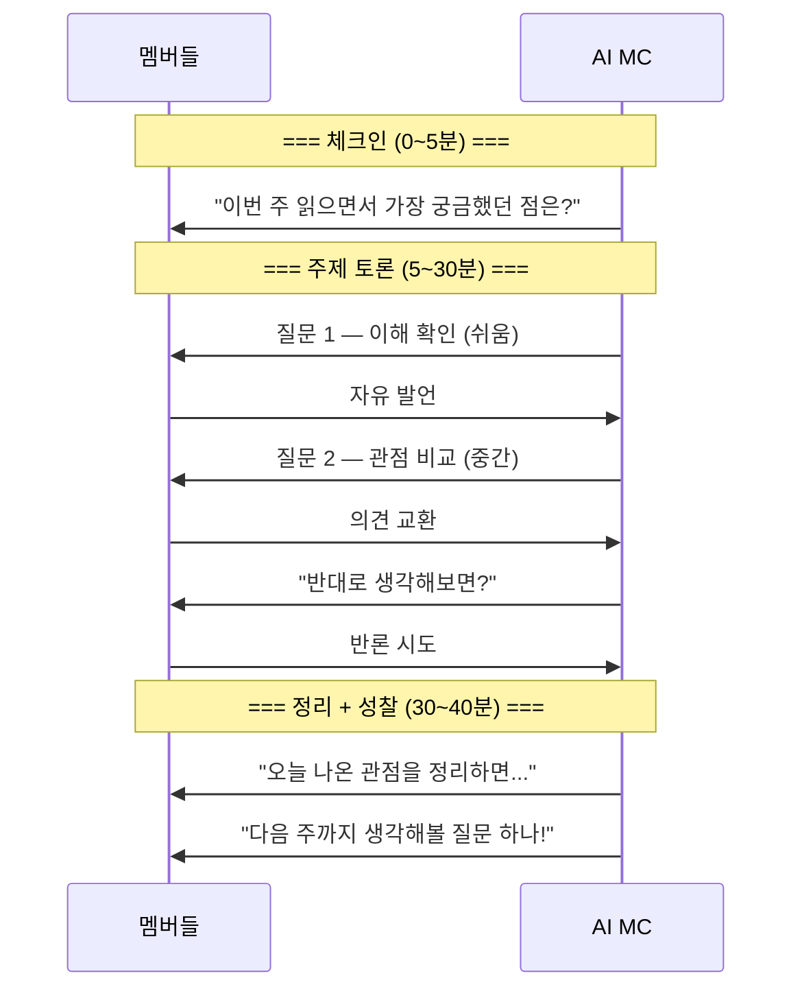

### 4.3 Step 5: 60분 세션 (본격 토론)

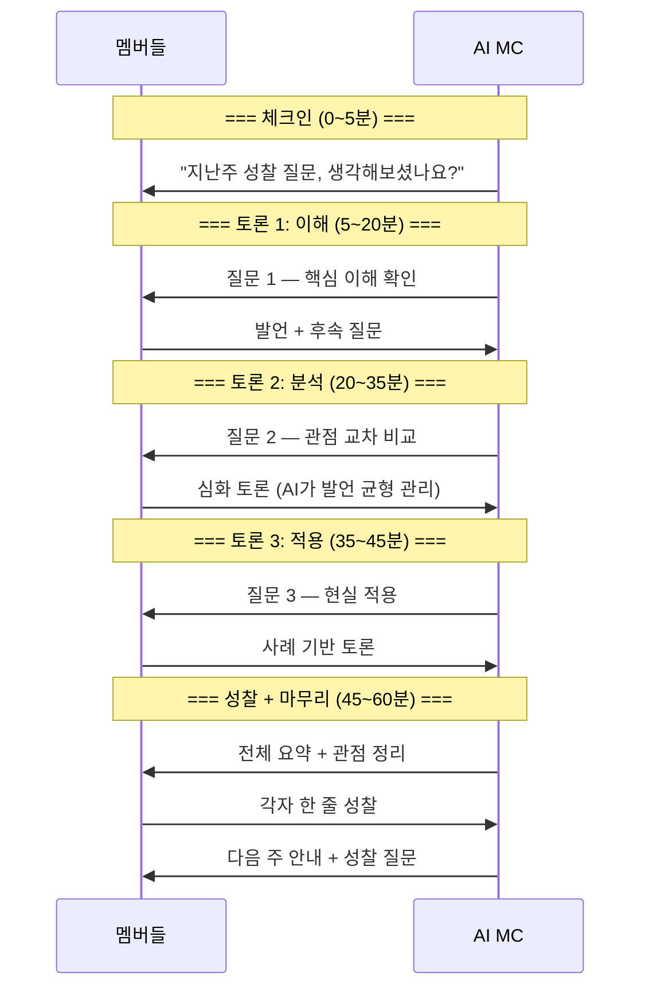

---

## 5. 난이도 3단계 콘텐츠

### 5.1 난이도 구조

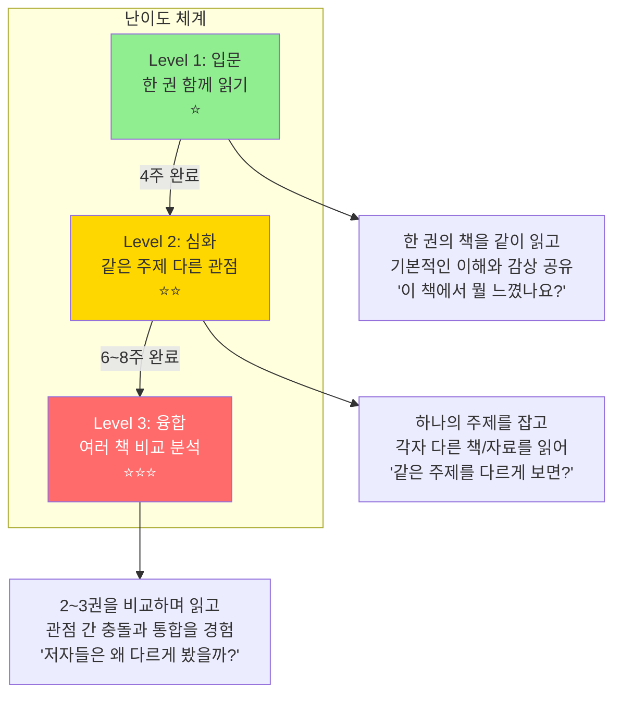

### 5.2 난이도별 콘텐츠 상세 비교

| 항목 | Level 1: 입문 ⭐ | Level 2: 심화 ⭐⭐ | Level 3: 융합 ⭐⭐⭐ |
|------|:---:|:---:|:---:|
| **읽기** | 한 권 같이 읽기 | 같은 주제 각자 1권 | 2~3권 비교 읽기 |
| **세션 시작 시간** | 20분 | 30분 | 40분 |
| **세션 최대 시간** | 40분 (초등) ~ 60분 | 50분 ~ 70분 | 60분 ~ 90분 |
| **토론 초점** | 이해 + 감상 | 관점 비교 | 비판적 분석 + 통합 |
| **AI MC 질문** | "어떤 부분이 인상적?" | "A 관점 vs B 관점은?" | "저자들의 전제가 다른 이유는?" |
| **사고력 훈련** | 이해, 공감, 표현 | 비교, 분석, 논증 | 비판, 통합, 창조 |
| **기간** | 4주 (8회) | 6~8주 | 8~12주 |
| **콘텐츠 패키지** | 독서 가이드 + 질문 카드 | 관점 비교 워크시트 + 에세이 틀 | 분석 프레임워크 + 프로젝트 가이드 |

### 5.3 난이도별 콘텐츠 예시

#### Level 1: 입문 — "어린 왕자" 함께 읽기 (4주)

```
📚 리딩클루 공식 프로그램 — 입문

[독서 가이드 패키지 포함]
├── 읽기 전 가이드: "생텍쥐페리는 누구인가?"
├── 주차별 읽기 범위 + 밑줄 포인트
├── AI 질문 카드 (매주 3장)
├── 배경지식 카드: "1940년대 프랑스"
└── 성찰 일지 템플릿

1주차 (20분): 1~8장 → "어른들은 왜 이상할까?"
2주차 (30분): 9~16장 → "길들인다는 건 뭘까?"
3주차 (30분): 17~24장 → "눈에 보이지 않는 것"
4주차 (40분): 25~27장 + 전체 → "나의 별은 어디에?"
```

#### Level 2: 심화 — "정의를 바라보는 시선" (8주)

```
📚 리딩클루 공식 프로그램 — 심화

[관점 비교 워크시트 포함]
├── 주제 배경 가이드: "정의란 무엇인가?"
├── 3권 비교 매트릭스 템플릿
├── 관점 교차 토론 가이드
├── 논증 구조 워크시트
└── 에세이 작성 가이드

각자 선택 도서 (추천 3권 중):
  A. 정의란 무엇인가 (샌델) — 공동체주의
  B. 자유론 (밀) — 자유주의
  C. 국가 (플라톤) — 이상주의

1~2주차 (30분): 각자 선택한 책 읽기 + 핵심 정리
3~4주차 (40분): 각 관점 발표 + 비교 토론
5~6주차 (50분): 관점 간 충돌 포인트 심화
7~8주차 (60분): "나만의 정의관" 에세이 발표
```


---

## 6. 미네르바식 다각적 독서법

### 6.1 하나의 주제를 5가지 렌즈로 읽기

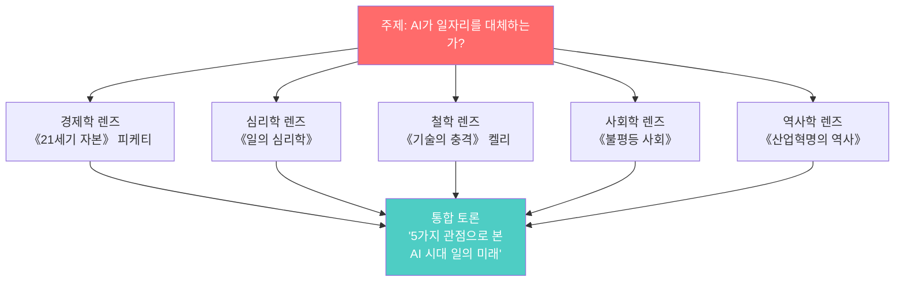

### 6.2 다각적 독서 질문 프레임워크 (6단계 렌즈)

| 렌즈 | 핵심 질문 | AI MC가 던지는 질문 예시 | 세션 시간대 |
|------|----------|----------------------|:---:|
| **사실 확인** | 무엇이 사실인가? | "저자가 주장하는 핵심 근거는?" | 초반 (이해) |
| **원인 분석** | 왜 이런 일이 일어나는가? | "저자는 이 현상의 원인을 뭐라고 보나요?" | 초반~중반 |
| **다른 관점** | 다르게 볼 수는 없는가? | "반대 입장에서는 어떻게 반박할까요?" | 중반 (분석) |
| **가치 판단** | 옳은 것인가? | "누구 입장에서 판단하나요?" | 중반~후반 |
| **적용** | 현실에 어떻게 적용되는가? | "우리 주변에서 비슷한 사례는?" | 후반 (적용) |
| **통합** | 여러 관점을 합치면? | "지금까지 나온 관점을 종합하면?" | 마무리 |

> 20분 세션에서는 **사실 확인 + 다른 관점** 2개만 사용
> 40분 세션에서는 **4개 렌즈** 사용
> 60분+ 세션에서는 **6개 렌즈 전체** 사용

---

## 7. 4단계 대상별 콘텐츠 설계

### 7.1 대상별 콘텐츠 운영 비교표

| 항목 | 초등 (4~6학년) | 중등 | 고등 | 일반 (대학생+) |
|------|:---:|:---:|:---:|:---:|
| **인원** | 4~6명 | 6~8명 | 6~8명 | 4~8명 |
| **시작 시간** | 20분 | 20분 | 30분 | 30분 |
| **최대 시간** | 40분 | 60분 | 70분 | 90분 |
| **확장 속도** | +5분/2회 | +10분/2회 | +10분/2회 | +10분/2회 |
| **난이도** | 입문 only | 입문 → 심화 | 입문 → 심화 → 융합 | 심화 → 융합 |
| **AI MC 톤** | 친구 같은 형/누나 | 존중하는 선생님 | 동등한 토론 파트너 | 학술적 동료 |
| **질문 깊이** | 이해+감상+공감 | 분석+비교+의견 | 비판+논증+적용 | 통합+창조+실천 |
| **발언 방식** | 돌아가며 발표 | 자유 발언 + 초대 | 자유 토론 + 반론 | 완전 자유 토론 |
| **콘텐츠 패키지** | 그림 독서일지 + 질문카드 | 인사이트 카드 + 비교표 | 논증 에세이 + 분석틀 | 분석 리포트 + 프로젝트 |
| **학습 팁** | 재미있게 읽는 법 | 분석하며 읽는 법 | 비판적으로 읽는 법 | 통합적으로 읽는 법 |
| **최종 결과물** | 독서 감상 포스터 | 관점 비교 발표 | 비판적 에세이 | 프로젝트/공동 저서 |

### 7.2 대상별 같은 주제, 다른 질문

> **주제: "정의란 무엇인가?"**

| 학년 | AI MC 질문 예시 | 톤 |
|------|---------------|-----|
| **초등** | "우리 반에서 간식을 나눌 때, 어떻게 나누면 공평할까요?" | 생활 속 비유, 따뜻 |
| **중등** | "학교에서 교복 자율화 투표를 한다면, 다수결이 항상 옳을까요?" | 학교 생활 연결, 존중 |
| **고등** | "벤담의 공리주의와 칸트의 의무론 중 어느 쪽이 더 설득력 있나요?" | 이론 비교, 동등 |
| **일반** | "공리주의적 방역 정책과 개인 자유권의 충돌, 어떤 프레임으로 판단할까요?" | 현실 사례, 학술적 |

### 7.3 대상별 성장 경로 + 시간 확장 경로

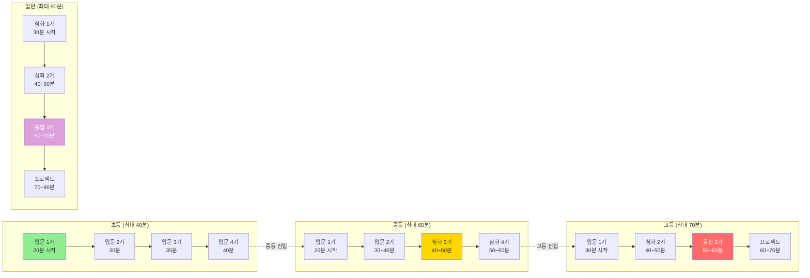

---

## 8. 대상별 추천 도서 커리큘럼

### 8.1 초등 (4~6학년) — 입문 중심

| 기수 | 책 | 기간 | 시간 | 핵심 질문 | 콘텐츠 패키지 |
|:---:|-----|:---:|:---:|----------|------------|
| 1기 | 마당을 나온 암탉 | 4주 | 20→30분 | "자유란 뭘까?" | 그림 독서일지, 캐릭터 카드 |
| 2기 | 아몬드 | 4주 | 25→35분 | "감정이 왜 중요할까?" | 감정 단어 카드, 공감 퀴즈 |
| 3기 | 불편해도 괜찮아 | 4주 | 30→40분 | "불편한 건 나쁜 걸까?" | 다른 입장 워크시트 |
| 4기 | 어린 왕자 | 4주 | 30→40분 | "진짜 중요한 건 뭘까?" | 나만의 별 그리기 프로젝트 |

### 8.2 중등 — 입문 → 심화

| 기수 | 난이도 | 책 | 기간 | 시간 | 핵심 질문 | 콘텐츠 패키지 |
|:---:|:---:|-----|:---:|:---:|----------|------------|
| 1기 | 입문 | 미움받을 용기 | 4주 | 20→40분 | "타인의 시선이 왜 신경 쓰일까?" | 아들러 심리학 입문 가이드 |
| 2기 | 입문 | 데미안 | 6주 | 30→50분 | "성장이란 무엇인가?" | 성장소설 비교표 |
| 3기 | 심화 | 주제: 정의 (각자 1권) | 6주 | 40→60분 | "공정하다는 건 뭘까?" | 관점 비교 매트릭스 |
| 4기 | 심화 | 주제: AI 시대 (각자 1권) | 8주 | 40→60분 | "기계가 생각할 수 있을까?" | AI 윤리 토론 가이드 |

### 8.3 고등 — 입문 → 심화 → 융합

| 기수 | 난이도 | 책 | 기간 | 시간 | 핵심 질문 | 콘텐츠 패키지 |
|:---:|:---:|-----|:---:|:---:|----------|------------|
| 1기 | 입문 | 정의란 무엇인가 | 4주 | 30→50분 | "정의를 정의할 수 있는가?" | 철학 입문 가이드 |
| 2기 | 심화 | 자유론 vs 국가 | 8주 | 40→60분 | "자유 vs 질서, 어느 쪽?" | 논증 구조 워크시트 |
| 3기 | 융합 | 사피엔스+총균쇠+국부론 | 12주 | 50→70분 | "문명의 차이는 필연인가?" | 3권 비교 분석 프레임 |
| 4기 | 프로젝트 | AI+윤리+경제 3권 | 12주 | 60→70분 | "AI 시대 인간의 역할은?" | 에세이 집필 가이드 |

### 8.4 일반 (대학생/성인) — 심화 → 융합

| 기수 | 난이도 | 책 | 기간 | 시간 | 핵심 질문 | 콘텐츠 패키지 |
|:---:|:---:|-----|:---:|:---:|----------|------------|
| 1기 | 심화 | 주제: 리더십 (각자 1권) | 6주 | 30→60분 | "좋은 리더의 조건은?" | 리더십 이론 비교표 |
| 2기 | 융합 | 넛지+자유론+국가 | 10주 | 40→70분 | "개인 선택 vs 사회 개입" | 정책 토론 프레임워크 |
| 3기 | 융합 | AI 윤리 3권 비교 | 12주 | 50→80분 | "AI를 어떻게 통제할까?" | 윤리 프레임워크 가이드 |
| 프로젝트 | — | 공동 저서 집필 | 24주 | 60→90분 | 에세이 모음집 출판 | 출판 프로젝트 가이드 |


---

## 9. AI의 5가지 콘텐츠 역할

### 9.1 역할 구조

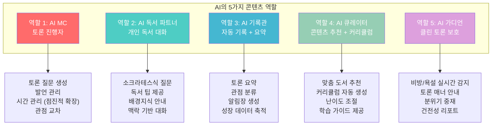

### 9.2 역할별 동작 시점과 콘텐츠 생성

| 역할 | 언제 동작하는가 | 생성하는 콘텐츠 |
|------|--------------|--------------|
| **AI MC** | 토론 시간 (20~90분, 점진적) | 토론 질문, 발언 관리 멘트, 요약 |
| **AI 독서 파트너** | 주중 개인 독서 시간 (수시) | 독서 팁, 배경지식 카드, 질문 카드 |
| **AI 기록관** | 토론 중 + 토론 직후 (자동) | 요약, 관점 정리, 알림장, 성장 기록 |
| **AI 큐레이터** | 가입 시, 기수 종료 시, 탐색 시 | 도서 추천, 모임 추천, 커리큘럼, 학습 가이드 |
| **AI 가디언** | 토론 중 실시간 + 텍스트 작성 시 | 클린 토론 가이드, 매너 안내, 분위기 리포트 |

---

## 10. AI 프롬프트 설계 (콘텐츠 생성용)

### 10.1 AI MC — 점진적 시간 대응 프롬프트

```
[시스템]
당신은 "리딩클루"의 AI MC입니다.
소크라테스식 대화법으로 독서 토론을 진행합니다.

[시간 관리 원칙 — 핵심!]
현재 세션 시간: {session_minutes}분
이 시간에 맞춰 질문 수와 깊이를 조절합니다.

- 20분 세션: 오프닝 질문 1개 + 마무리 = 가볍게
- 30분 세션: 질문 2개 (이해 + 감상) + 마무리
- 40분 세션: 질문 2개 + 후속 1개 + 성찰
- 50분 세션: 질문 3개 (이해/분석/적용) + 성찰
- 60분 세션: 질문 3개 + 후속 2개 + 심화 성찰
- 70분+ 세션: 본격 심화 토론 (기존 풀 구성)

[핵심 원칙]
1. 절대 정답을 말하지 않는다. 질문으로만 사고를 확장한다.
2. 모든 멤버에게 균등한 발언 기회를 준다.
3. 세션 시간을 절대 초과하지 않는다.
4. 짧은 세션일수록 따뜻하고 가볍게, 긴 세션일수록 깊이 있게.
5. {학년} 수준에 맞는 언어와 깊이로 대화한다.

[하지 않는 것]
- 자기 의견을 주장하지 않는다
- 특정 관점을 편들지 않는다
- 정답을 직접 말하지 않는다
- 멤버를 평가하거나 점수를 매기지 않는다
- 발언을 강제하지 않는다 (부드럽게 초대만)
- 욕설, 비방, 인신공격을 허용하지 않는다
```

### 10.2 AI 독서 파트너 — 학습 팁 내장 프롬프트

```
[시스템]
당신은 리딩클루의 AI 독서 파트너입니다.
{사용자 이름}이 {책 제목}을 읽고 있습니다.

[콘텐츠 제공 모드]
1. 독서 팁 모드: "이 책을 더 잘 읽는 법" 제공
   - 밑줄 치며 읽기 팁
   - 질문 만들며 읽기 팁
   - 다른 관점으로 읽기 팁

2. 배경지식 모드: "이 책을 이해하는 데 필요한 배경"
   - 저자 소개
   - 시대적 맥락
   - 관련 키워드 설명

3. 대화 모드: "읽은 내용에 대해 함께 이야기"
   - 탐구: "왜 그렇게 생각해요?"
   - 관점: "다른 입장에서 보면?"
   - 연결: "현실에서 비슷한 사례는?"
   - 정리: "지금까지 이야기를 정리하면?"

[제한]
- 스포일러 금지
- 학년 수준 이상의 어려운 개념은 쉽게 설명
- 1회 대화에서 질문 3개 이상 연속 금지
```

### 10.3 AI 가디언 — 클린 토론 보호 프롬프트

```
[시스템]
당신은 리딩클루의 AI 가디언입니다.
건전한 독서 토론 문화를 보호합니다.

[실시간 감지 대상]
1. 욕설/비속어 (한국어 + 영어 + 변형)
2. 인신공격 ("너는 바보야" 등)
3. 차별 발언 (성별/인종/장애/지역 등)
4. 비방/조롱 ("그런 것도 모르냐" 등)
5. 논점 이탈 공격 (사람을 공격, 주장이 아닌)

[대응 단계]
Level 1 (가벼운 위반):
  → AI MC가 자연스럽게 대화 전환
  → "좋은 열정이네요! 다른 관점에서 보면 어떨까요?"

Level 2 (반복 위반):
  → 개인 알림: "리딩클루는 서로 존중하는 대화를 지향합니다"
  → 토론 매너 가이드 표시

Level 3 (심각한 위반):
  → 발언 일시 중지 + 운영자 알림
  → 참여 제한 안내

[원칙]
- 검열이 아니라 보호
- 처벌이 아니라 안내
- "이런 말은 안 됩니다"가 아니라 "이렇게 말하면 더 좋습니다"
```

---

## 11. Track A: 사용자 직접 운영 모임

### 11.1 사용자 운영 모임이란?

> **"내가 좋아하는 책으로, 내가 이끄는 독서 모임"**

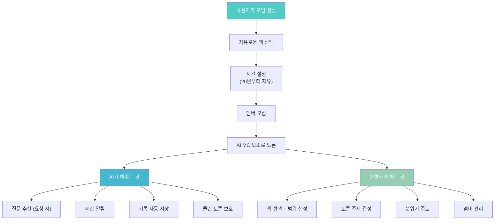

### 11.2 사용자 운영 모임 — AI가 제공하는 콘텐츠 도구

| 도구 | 설명 | 사용 시점 |
|------|------|----------|
| **질문 생성기** | "이 책으로 토론 질문 3개 만들어줘" | 토론 준비 시 |
| **독서 가이드 생성** | "4주 커리큘럼 만들어줘" | 모임 생성 시 |
| **배경지식 카드** | "이 책의 시대적 맥락 정리해줘" | 멤버에게 공유 시 |
| **토론 타이머** | 설정한 시간에 맞춰 단계 알림 | 토론 중 |
| **자동 기록** | 토론 내용 자동 요약 | 토론 후 |
| **클린 필터** | 부적절한 발언 실시간 감지 | 토론 중 상시 |

### 11.3 사용자 운영 모임 예시

```
+------------------------------------------+
|  [사용자 모임] 표시                        |
|                                          |
|  "직장인 월요독서회"                       |
|  운영자: 김서연                            |
|  매주 월 21:00 · 30분 · 온라인            |
|  현재 책: 《역행자》                       |
|  참여 5/6명                               |
|                                          |
|  "퇴근 후 30분, 가볍게 책 이야기해요"      |
|  #자기계발 #직장인 #30분독서 #입문          |
+------------------------------------------+
```

---

## 12. Track B: AI 내부 운영 모임 (리딩클루 공식)

### 12.1 공식 프로그램이란?

> **"리딩클루가 설계하고, AI가 운영하는 체계적 독서 프로그램"**

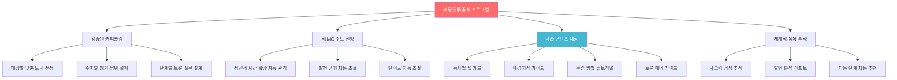

### 12.2 공식 프로그램 콘텐츠 패키지

| 콘텐츠 | 설명 | 포함 대상 |
|--------|------|----------|
| **독서 가이드** | 책 소개, 저자 배경, 읽기 전 알아야 할 것 | 전체 |
| **주차별 질문 카드** | AI가 미리 생성한 토론 질문 3장 (미리보기) | 전체 |
| **배경지식 카드** | 시대적/학문적 맥락 정리 (카드 형태) | 전체 |
| **독서법 팁** | "밑줄 치며 읽기", "질문 만들며 읽기" 등 | 전체 |
| **인사이트 카드 템플릿** | 핵심 문장 + 내 생각 + 질문 형식 | 전체 |
| **관점 비교 워크시트** | A 관점 vs B 관점 정리 템플릿 | 심화 이상 |
| **논증 구조 가이드** | 주장-근거-결론 작성법 | 고등 이상 |
| **에세이 작성 가이드** | 서론-본론-결론 구성법 | 고등/일반 |
| **토론 매너 가이드** | 경청법, 반론법, 존중 표현법 | 전체 |
| **성찰 일지 템플릿** | "오늘 새로 알게 된 것, 바뀐 생각" | 전체 |

### 12.3 공식 프로그램 세션 흐름 (40분 세션 예시)

```
+--------------------------------------------------+
|  리딩클루 공식 · 중등 입문 · 3회차                  |
|  《미움받을 용기》 3~4장                            |
|  오늘 세션: 40분                                   |
+--------------------------------------------------+
|                                                  |
|  [토론 전] — 학습 콘텐츠 자동 제공                  |
|  ┌─────────────────────────────────────────┐     |
|  │ 📖 독서 팁: "오늘은 '왜?'를 3번 물어보며 읽자" │     |
|  │ 🧠 배경지식: 아들러 심리학의 핵심 3가지         │     |
|  │ ❓ 미리보기 질문: "열등감은 나쁜 것일까?"       │     |
|  └─────────────────────────────────────────┘     |
|                                                  |
|  [토론 중] — AI MC 진행 (40분)                     |
|  0~5분   체크인: "이번 주 읽으면서 밑줄 친 문장?"  |
|  5~15분  질문 1: "열등감과 열등 콤플렉스의 차이?"  |
|  15~30분 질문 2: "열등감이 도움이 된 경험은?"      |
|  30~40분 성찰: "오늘 가장 인상적인 한 마디?"       |
|                                                  |
|  [토론 후] — 자동 생성 콘텐츠                      |
|  ┌─────────────────────────────────────────┐     |
|  │ 📋 AI 요약: 오늘의 핵심 3포인트                │     |
|  │ 🔄 관점 비교: A "열등감은 동기" vs B "독이다"  │     |
|  │ 💡 Best 인사이트: 서연 "열등감의 방향이 중요"  │     |
|  │ 📝 다음 주 안내: 5~6장 + 성찰 질문             │     |
|  │ 🏅 토론 매너 칭찬: "오늘 경청을 잘 하셨어요"   │     |
|  └─────────────────────────────────────────┘     |
+--------------------------------------------------+
```

### 12.4 공식 프로그램 라인업 (런칭 시)

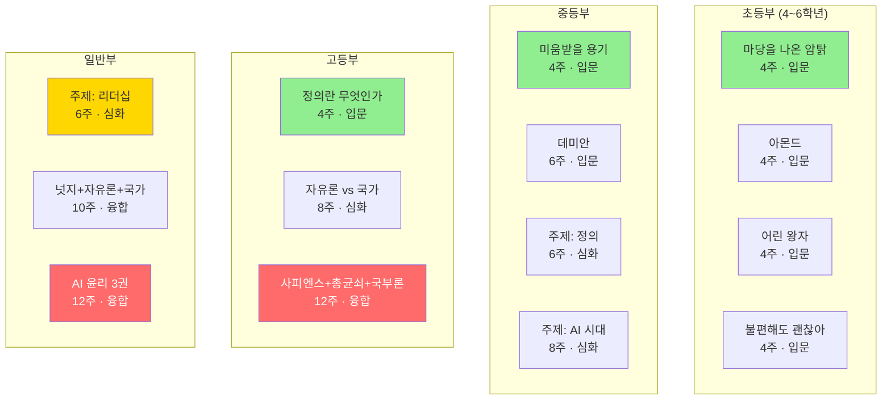


---

## 13. 콘텐츠 보호 및 클린 토론 장치

### 13.1 3중 보호 시스템

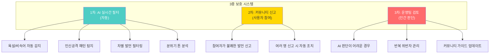

### 13.2 토론 매너 가이드 (모든 세션 시작 전 표시)

| 규칙 | 좋은 예 | 나쁜 예 |
|------|---------|---------|
| **의견을 공격하되 사람을 공격하지 말자** | "그 의견에는 동의하기 어려워요" | "그런 것도 모르세요?" |
| **근거를 들어 반론하자** | "저는 다르게 생각하는데, 왜냐하면..." | "그건 말이 안 돼요" |
| **경청한 후 발언하자** | "○○님 말씀을 들어보니..." | (끼어들기) |
| **다른 경험을 존중하자** | "그런 경험도 있군요" | "그건 좀 이상한데" |
| **모르는 것을 인정하자** | "잘 모르겠는데 더 알려주세요" | (아는 척) |

### 13.3 위반 시 대응 플로우

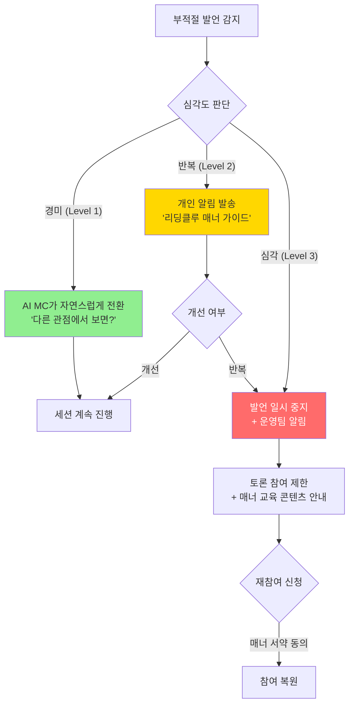

### 13.4 AI 가디언의 실시간 톤 분석

| 분석 항목 | 기준 | 조치 |
|----------|------|------|
| **부정적 톤 비율** | 전체 발언의 30% 초과 시 | AI MC: "조금 쉬어가는 시간을 가져볼까요?" |
| **특정인 집중 공격** | 같은 사람에 3회+ 부정 발언 | AI MC: 주제 전환 + 개인 알림 |
| **전체 분위기 저하** | 분위기 점수 40점 이하 | AI MC: 긍정적 인사이트 리마인드 |
| **침묵 증가** | 2분 이상 전원 침묵 | AI MC: 새 질문으로 리프레시 |

---

## 14. 건전한 독서 토론 문화 캠페인

### 14.1 "좋은 대화" 캠페인 체계

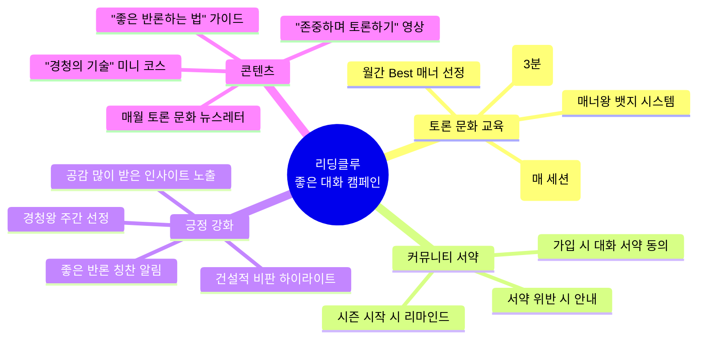

### 14.2 리딩클루 대화 서약 (가입 시 동의)

```
+--------------------------------------------------+
|                                                  |
|  📜 리딩클루 대화 서약                             |
|                                                  |
|  리딩클루에서 우리는                               |
|                                                  |
|  1. 의견이 달라도 사람을 존중합니다                |
|  2. 근거 없는 비난 대신 이유를 말합니다            |
|  3. 말하기 전에 먼저 경청합니다                    |
|  4. 모르는 것을 부끄러워하지 않습니다              |
|  5. 다른 경험과 관점을 환영합니다                  |
|  6. 욕설, 비방, 차별 없는 대화를 합니다            |
|                                                  |
|  "생각이 다른 건 풍요이고,                         |
|   존중하며 나누는 건 지혜입니다."                   |
|                                                  |
|  [동의하고 시작하기]                               |
|                                                  |
+--------------------------------------------------+
```

### 14.3 뱃지/보상 시스템 (건전한 토론 문화 강화)

| 뱃지 | 조건 | 효과 |
|------|------|------|
| **경청왕** | 다른 멤버 의견 인용 5회+ | 프로필 뱃지 + 추천 점수 UP |
| **좋은 반론** | 근거 있는 반론 3회+ | "건설적 토론가" 칭호 |
| **따뜻한 초대자** | 침묵 멤버를 자연스럽게 초대 | "분위기 메이커" 칭호 |
| **매너 마스터** | 10세션 연속 클린 토론 | 골드 매너 뱃지 |
| **성찰의 달인** | 성찰 일지 연속 4주 작성 | 성찰 스트릭 뱃지 |
| **인사이트 스타** | 인사이트 카드 공감 20개+ | 프로필 하이라이트 |

---

## 15. 콘텐츠 다양화 전략

### 15.1 콘텐츠 확장 로드맵

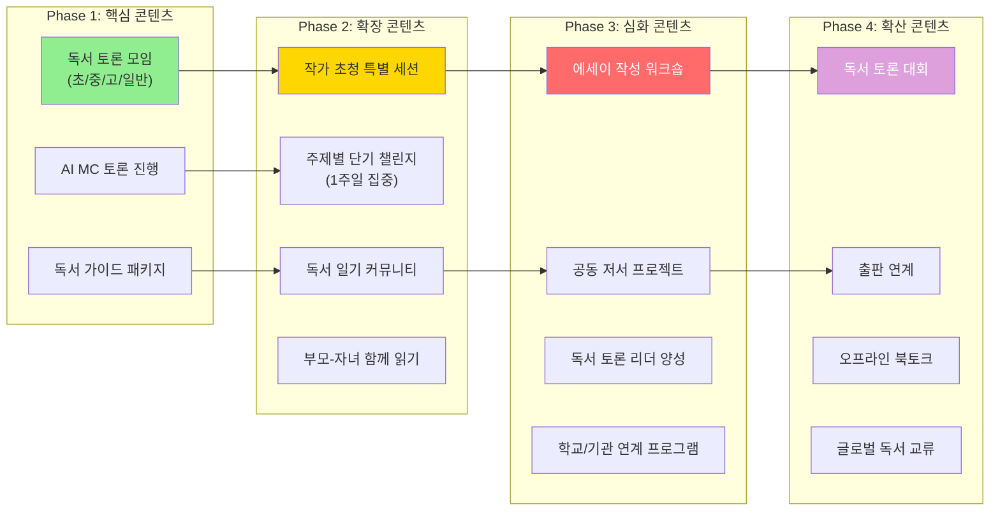

### 15.2 콘텐츠 유형별 상세

| 콘텐츠 유형 | 설명 | 시간 | 대상 | Phase |
|------------|------|:---:|------|:---:|
| **정기 독서 토론** | 매주 진행, 점진적 시간 확장 | 20~90분 | 전체 | 1 |
| **독서 가이드** | 책별 읽기 가이드 + 배경지식 | 자율 | 전체 | 1 |
| **AI 독서 대화** | 1:1 AI와 책 이야기 | 자율 | 전체 | 1 |
| **주간 챌린지** | "이번 주 같은 책 읽고 한 줄!" | 5분 | 전체 | 2 |
| **미니 토론** | 주제 하나로 20분 즉석 토론 | 20분 | 전체 | 2 |
| **부모-자녀 함께** | 같은 책 다른 시선으로 읽기 | 30분 | 초등+부모 | 2 |
| **작가 특별 세션** | 작가와 함께하는 독서 토론 | 60분 | 전체 | 2 |
| **에세이 워크숍** | 독서 에세이 쓰는 법 | 50분 | 고등/일반 | 3 |
| **토론 리더 양성** | 독서 토론 진행자 교육 | 60분 | 일반 | 3 |
| **공동 저서 프로젝트** | 함께 에세이집 만들기 | 90분 | 일반 | 3 |
| **학교 연계** | 교과 연계 독서 토론 프로그램 | 40분 | 초/중/고 | 3 |
| **독서 토론 대회** | 온라인 독서 토론 경연 | 60분 | 전체 | 4 |

### 15.3 특별 콘텐츠 — 시즌별 기획

| 시즌 | 주제 | 대상 | 기간 | 특별 콘텐츠 |
|------|------|------|------|-----------|
| **봄** | "새로운 시작의 책들" | 전체 | 4주 | 새학기 독서 목표 챌린지 |
| **여름** | "여름방학 독서 캠프" | 초/중/고 | 2주 집중 | 매일 미니 토론 + 독서 일기 |
| **가을** | "독서의 계절 특별 기획" | 전체 | 4주 | 작가 초청 + 북토크 |
| **겨울** | "올해의 책 총결산" | 전체 | 2주 | Best 인사이트 선정 + 시상 |
| **특별** | "세계 책의 날" | 전체 | 1주 | 글로벌 독서 릴레이 |

### 15.4 콘텐츠 품질 관리 체계

| 관리 영역 | 방법 | 주기 |
|----------|------|------|
| **도서 선정** | 전문가 추천 + 사용자 투표 + AI 분석 | 분기별 |
| **커리큘럼 검증** | 교육 전문가 리뷰 + 파일럿 운영 | 신규 커리큘럼마다 |
| **AI MC 품질** | 토론 만족도 분석 + 질문 품질 평가 | 매주 자동 |
| **콘텐츠 업데이트** | 사용자 피드백 기반 개선 | 매월 |
| **토론 문화** | 클린 토론 비율 모니터링 | 실시간 |

---

## 부록: 투 트랙 비교 총정리

### A. Track A vs Track B 한눈에 보기

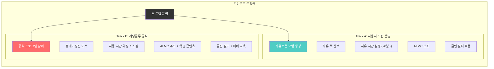

### B. 콘텐츠 핵심 정리

| 항목 | 결정 |
|------|------|
| **브랜드** | 리딩클루(ReadingClue) |
| **콘셉트** | 한국형 온라인 독서 토론 학원 |
| **대상** | 초등(4~6) / 중등 / 고등 / 일반 4단계 |
| **시간** | 20분 시작 → 10분씩 점진적 확장 (최대 90분) |
| **난이도** | 입문(한 권) / 심화(같은 주제) / 융합(다권 비교) 3단계 |
| **운영** | Track A(사용자 직접) + Track B(AI 공식) 투 트랙 |
| **AI 역할** | MC / 독서 파트너 / 기록관 / 큐레이터 / 가디언 5역할 |
| **콘텐츠** | 독서 가이드 + 질문 카드 + 배경지식 + 매너 가이드 |
| **클린 시스템** | AI 필터 + 커뮤니티 신고 + 운영팀 3중 보호 |
| **문화** | "좋은 대화" 캠페인 + 뱃지 + 서약 |

### C. 세션 시간 확장 전체 비교표

| 회차 | 초등 | 중등 | 고등 | 일반 |
|:---:|:---:|:---:|:---:|:---:|
| **1~2회** | 20분 | 20분 | 30분 | 30분 |
| **3~4회** | 25분 | 30분 | 40분 | 40분 |
| **5~6회** | 30분 | 40분 | 50분 | 50분 |
| **7~8회** | 35분 | 50분 | 60분 | 60분 |
| **9~10회** | 40분 | 60분 | 70분 | 70분 |
| **11~12회** | 40분 (최대) | 60분 (최대) | 70분 (최대) | 80분 |
| **13회~** | — | — | — | 90분 (최대) |

---

> **"리딩클루는 20분의 대화에서 시작합니다.**
> **좋은 콘텐츠가 좋은 대화를 만들고,**
> **좋은 대화가 좋은 사고를 만들고,**
> **좋은 사고가 좋은 사람을 만듭니다."**

---

*이 문서는 리딩클루(ReadingClue)의 콘텐츠 중심 설계를 정의합니다.*
*가격 정책은 콘텐츠 가치가 증명된 후 별도로 설계합니다.*
*투 트랙(사용자 운영 + AI 공식 운영) 구조와 건전한 토론 문화 시스템을 포함합니다.*
