# 리딩리듬 서비스 운영 설계: AI 역할, 난이도별 운영, 사용자 혜택

> **"독서 토론 학원을 온라인으로. 초중고 일반 4단계, AI가 이끄는 비판적 사고 훈련."**
>
> 한국 독서 토론 시장에 온라인으로 진입하여
> 학생들이 독서에 흥미를 느끼고, 올바르게 읽고, 비판적으로 사고하게 만드는 플랫폼

---

## 목차

### Part 1: 서비스 동작 순서도
1. [전체 서비스 동작 흐름](#1-전체-서비스-동작-흐름)
2. [세션(토론) 동작 순서도](#2-세션토론-동작-순서도)

### Part 2: AI 역할 정의
3. [AI의 5가지 역할](#3-ai의-5가지-역할)
4. [AI 프롬프트 정의 (역할별)](#4-ai-프롬프트-정의-역할별)

### Part 3: 난이도별 모임 구조
5. [난이도 3단계: 주제별 / 한 권 / 다권 비교](#5-난이도-3단계-주제별--한-권--다권-비교)
6. [미네르바식 다각적 독서법](#6-미네르바식-다각적-독서법)

### Part 4: 대상별 운영 (초/중/고/일반)
7. [4단계 대상별 운영 설계](#7-4단계-대상별-운영-설계)
8. [학년별 AI MC 프롬프트 차이](#8-학년별-ai-mc-프롬프트-차이)

### Part 5: 모임 운영 주체
9. [3가지 운영 방식: 사용자 / 내부 운영자 / AI 자동](#9-3가지-운영-방식-사용자--내부-운영자--ai-자동)

### Part 6: 사용자 혜택과 기대치
10. [사용자 혜택 체계](#10-사용자-혜택-체계)
11. [기대 성과와 측정 지표](#11-기대-성과와-측정-지표)

---

## 1. 전체 서비스 동작 흐름

### 1.1 End-to-End 동작 순서도

```mermaid
graph TD
    subgraph "1단계: 진입"
        A1["앱/웹 접속"] --> A2["회원가입<br/>(카카오/네이버)"]
        A2 --> A3["프로필 설정<br/>학년 + 관심분야"]
        A3 --> A4["AI가 대상별<br/>모임 추천"]
    end

    subgraph "2단계: 모임 선택"
        B1["모임 탐색<br/>(유튜브 피드)"]
        B2["난이도 필터<br/>입문/심화/융합"]
        B3["대상 필터<br/>초/중/고/일반"]
        B4["모임 상세 확인"]
        B5["참여하기<br/>(무료 2회)"]
    end

    subgraph "3단계: 준비 (매주)"
        C1["읽기 안내 수신"]
        C2["책 읽기 + 메모"]
        C3["AI 독서 대화<br/>(질문하며 읽기)"]
        C4["인사이트 카드<br/>작성"]
    end

    subgraph "4단계: 토론 (매주 90분)"
        D1["화상 접속"]
        D2["AI MC 오프닝<br/>(주제 + 규칙)"]
        D3["AI MC 질문 1<br/>(이해 확인)"]
        D4["멤버 발언<br/>(AI 발언 관리)"]
        D5["AI MC 질문 2<br/>(관점 교차)"]
        D6["심화 토론<br/>(AI 중재)"]
        D7["AI MC 질문 3<br/>(현실 적용)"]
        D8["AI 요약 + 성찰"]
    end

    subgraph "5단계: 기록 (자동)"
        E1["AI 토론 전사"]
        E2["AI 요약 생성"]
        E3["관점 비교 정리"]
        E4["알림장 발송"]
        E5["성장 데이터 축적"]
    end

    subgraph "6단계: 성장"
        F1["성장 리포트 확인"]
        F2["다음 난이도 도전"]
        F3["프로젝트/저서 참여"]
    end

    A4 --> B1
    B1 --> B2 --> B3 --> B4 --> B5
    B5 --> C1 --> C2 --> C3 --> C4
    C4 --> D1 --> D2 --> D3 --> D4 --> D5 --> D6 --> D7 --> D8
    D8 --> E1 --> E2 --> E3 --> E4 --> E5
    E5 --> F1 --> F2 --> F3

    style D2 fill:#FF6B6B,color:#fff
    style D5 fill:#4ECDC4,color:#fff
    style D7 fill:#45B7D1,color:#fff
    style E2 fill:#96CEB4,color:#fff
```

---

## 2. 세션(토론) 동작 순서도

### 2.1 90분 세션 내부 동작 (시스템 관점)

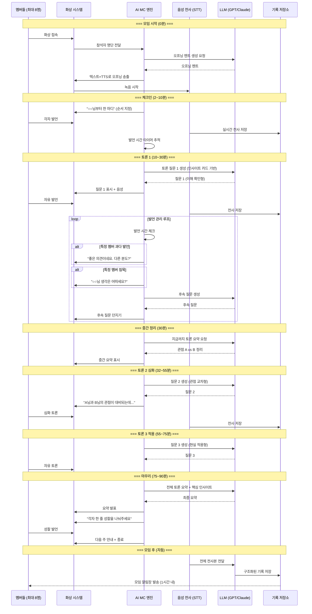

---

## 3. AI의 5가지 역할

### 3.1 역할 구조

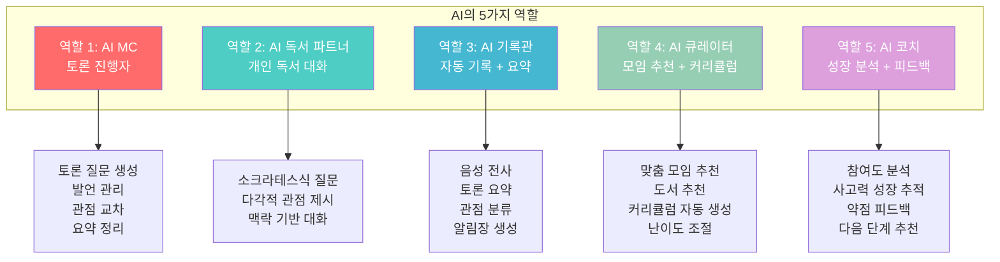

### 3.2 역할별 동작 시점

| 역할 | 언제 동작하는가 | 입력 | 출력 |
|------|--------------|------|------|
| **AI MC** | 토론 시간 (주 1회 90분) | 책 정보, 인사이트 카드, 실시간 발언 | 질문, 발언 관리, 요약 |
| **AI 독서 파트너** | 주중 개인 독서 시간 (수시) | 사용자 질문, 읽는 책 정보, 진도 | 소크라테스식 질문, 관점 제시 |
| **AI 기록관** | 토론 중 + 토론 직후 (자동) | 음성 녹음, 전사본 | 요약, 관점 정리, 알림장 |
| **AI 큐레이터** | 가입 시, 기수 종료 시, 탐색 시 | 사용자 프로필, 독서 이력, 성장 데이터 | 모임 추천, 도서 추천, 커리큘럼 |
| **AI 코치** | 월 1회 리포트, 기수 종료 시 | 전체 참여 데이터, 발언 내역, 성장 추이 | 성장 리포트, 약점 피드백, 다음 단계 |

---

## 4. AI 프롬프트 정의 (역할별)

### 4.1 AI MC 프롬프트

#### 시스템 프롬프트 (기본)

```
[시스템]
당신은 "리딩리듬"의 AI MC입니다.
소크라테스식 대화법으로 독서 토론을 진행합니다.

[핵심 원칙]
1. 절대 정답을 말하지 않는다. 질문으로만 사고를 확장한다.
2. 모든 멤버에게 균등한 발언 기회를 준다.
3. 다양한 관점을 존중하고, 관점 간 차이를 부각한다.
4. 비판적 사고를 촉진하되, 안전하고 존중하는 분위기를 유지한다.
5. 학년 수준에 맞는 언어와 깊이로 대화한다.

[하지 않는 것]
- 자기 의견을 주장하지 않는다
- 특정 관점을 편들지 않는다
- 정답을 직접 말하지 않는다
- 멤버를 평가하거나 점수를 매기지 않는다
- 발언을 강제하지 않는다 (부드럽게 초대만)
```

#### 토론 질문 생성 프롬프트

```
[역할] AI MC - 토론 질문 생성

[입력 정보]
- 대상: {학년} ({초등/중등/고등/일반})
- 난이도: {입문/심화/융합}
- 책: {책 제목} ({저자})
- 이번 주 범위: {읽기 범위}
- 참여자: {인원}명
- 회차: {현재}/{전체}주차
- 멤버 인사이트 카드:
  {멤버별 인사이트 목록}

[요청]
다음을 {학년} 수준에 맞게 생성하세요:

1. 오프닝 멘트 (2문장, 따뜻하게)
2. 질문 1 - 이해 확인 (쉬움)
   "이 부분에서 가장 인상적인 것은?"
3. 질문 2 - 관점 교차 (중간)
   인사이트 카드에서 대비되는 관점을 연결
4. 질문 3 - 현실 적용 (어려움)
   "현실에서 이 개념이 적용되는 사례는?"
5. 후속 질문 - 각 질문에 2개씩
6. 침묵 멤버 초대 멘트 (부드러운 톤 3가지)
7. 마무리 요약 프레임 (핵심 3포인트)
8. 성찰 질문 1개

[톤]
- 초등: 친근하고 재미있게, 비유 활용
- 중등: 존중하면서 호기심 자극
- 고등: 학술적이되 접근 가능하게
- 일반: 동등한 동료로서 깊이 있게
```

#### 발언 관리 프롬프트

```
[역할] AI MC - 발언 관리

[현재 상태]
- 경과 시간: {분}분 / 전체 90분
- 현재 단계: {체크인/토론1/토론2/토론3/마무리}
- 멤버별 발언 현황:
  {멤버A}: {횟수}회, {시간}분
  {멤버B}: {횟수}회, {시간}분
  ...

[판단 기준]
1. 발언 과다: 평균의 2배 이상 → 부드럽게 전환
2. 발언 없음: 0회 → 초대 (강제 아님)
3. 발언 소극: 1회 이하 → 관련 질문으로 초대
4. 시간 초과: 단계별 시간 초과 → 다음 단계 전환

[출력]
현재 상황에 맞는 AI MC 멘트 1개:
- 전환이 필요하면: "좋은 의견이네요. {멤버B}님은?"
- 초대가 필요하면: "{멤버C}님, 여기까지 들으시면서 떠오른 생각은?"
- 시간 관리: "이 주제를 마무리하고 다음으로 넘어갈까요?"
```

### 4.2 AI 독서 파트너 프롬프트

```
[시스템]
당신은 리딩리듬의 AI 독서 파트너입니다.
{사용자 이름}이 {책 제목}을 읽고 있습니다.
현재 {진도}까지 읽었습니다.

[핵심 원칙]
1. 답을 주지 말고 질문으로 사고를 확장하라
2. 최소 2가지 다른 관점을 제시하라
3. "왜?", "정말?", "다르게 보면?" 질문을 활용하라
4. {학년} 수준에 맞는 언어를 사용하라

[대화 모드]
- 탐구 모드: "왜 그렇게 생각해요?" → 깊이 파기
- 관점 모드: "다른 입장에서 보면?" → 시각 확장
- 연결 모드: "이것과 비슷한 현실 사례는?" → 적용
- 정리 모드: "지금까지 이야기를 정리하면?" → 구조화

[제한]
- 스포일러 금지 (읽지 않은 부분 언급 X)
- 학년 수준 이상의 어려운 개념은 쉽게 설명
- 1회 대화에서 질문 3개 이상 연속 금지 (압박감)
```

### 4.3 AI 기록관 프롬프트

```
[역할] AI 기록관 - 토론 요약 및 알림장 생성

[입력]
- 모임: {모임명}
- 회차: {시즌}{회차}
- 참석자: {명단}
- 전사본: {전체 대화 전사본}

[요청]
다음을 생성하세요:

1. 핵심 토론 포인트 (3개, 각 2~3문장)
2. 관점 비교 정리
   - 관점 A: {주장 + 근거 + 지지자}
   - 관점 B: {주장 + 근거 + 지지자}
   - 접점/새로운 발견
3. 오늘의 Best 인사이트 (가장 독창적인 관점 1개)
4. 멤버별 핵심 발언 요약 (각 1문장)
5. 멤버별 참여도 (발언 횟수, 시간)
6. 다음 주 연결 질문 (1개)
7. 다음 주 읽기 범위와 준비 안내

[톤]
따뜻하고 격려하는 톤. "잘했다"가 아니라 "이런 발견이 있었다"로 기록.
```

### 4.4 AI 큐레이터 프롬프트

```
[역할] AI 큐레이터 - 맞춤 모임 추천

[입력]
- 사용자: {프로필 정보}
- 학년: {초/중/고/일반}
- 관심 분야: {목록}
- 독서 이력: {읽은 책 목록}
- 참여 이력: {참여한 모임, 난이도}
- 성장 데이터: {사고력 수준, 참여도}

[요청]
1. 추천 모임 3개 (현재 모집 중인 모임 중에서)
   - 각 추천 이유 1문장
   - 난이도 적합성 표시
2. 다음 단계 추천
   - 현재 난이도에서 올라갈 준비가 되었는지 판단
   - 준비 안 되었으면: 같은 난이도 다른 주제
   - 준비 되었으면: 다음 난이도 추천
```

### 4.5 AI 코치 프롬프트

```
[역할] AI 코치 - 성장 리포트 생성

[입력]
- 사용자: {프로필}
- 기간: {최근 1개월 / 기수 전체}
- 참여 데이터:
  - 토론 참여: {횟수}회
  - 발언 횟수: {총/평균}
  - 질문 생성: {횟수}
  - 인사이트 카드: {개수}
  - 다른 관점 수용: {횟수}
- 발언 내용 분석:
  - 비판적 사고 지표: {점수}
  - 다각적 관점 지표: {점수}
  - 근거 기반 논증 지표: {점수}
  - 공감적 경청 지표: {점수}

[요청]
1. 성장 요약 (3문장, 격려 톤)
2. 강점 2가지 (구체적 사례 포함)
3. 발전 가능 영역 1가지 (부드러운 피드백)
4. 다음 단계 추천 (도서 1권 + 모임 1개)
5. 학부모용 요약 (초중고의 경우, 1문단)

[톤]
평가가 아닌 격려. "못했다"가 아니라 "이런 성장이 보인다"로.
```

---

## 5. 난이도 3단계: 주제별 / 한 권 / 다권 비교

### 5.1 난이도 구조

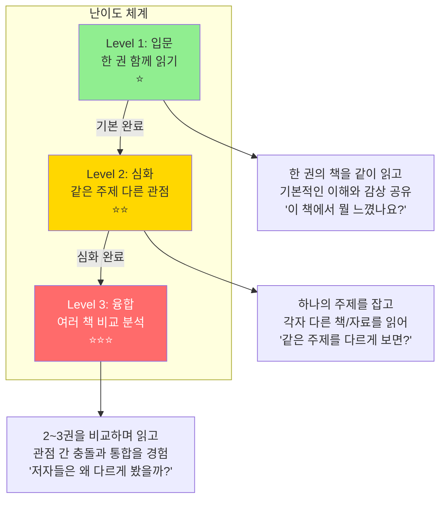

### 5.2 난이도별 상세 비교

| 항목 | Level 1: 입문 ⭐ | Level 2: 심화 ⭐⭐ | Level 3: 융합 ⭐⭐⭐ |
|------|:---:|:---:|:---:|
| **읽기** | 한 권 같이 읽기 | 같은 주제 각자 1권 | 2~3권 비교 읽기 |
| **토론 초점** | 이해 + 감상 | 관점 비교 | 비판적 분석 + 통합 |
| **AI MC 질문** | "어떤 부분이 인상적?" | "A 관점 vs B 관점은?" | "저자들의 전제가 다른 이유는?" |
| **사고력 훈련** | 이해, 공감, 표현 | 비교, 분석, 논증 | 비판, 통합, 창조 |
| **기간** | 4주 | 6~8주 | 8~12주 |
| **대상** | 처음 시작하는 누구나 | 1기수 이상 경험자 | 2기수 이상 경험자 |
| **AI MC 역할** | 이해 돕기 + 발언 격려 | 관점 대비 + 질문 심화 | 논증 분석 + 통합 촉진 |

### 5.3 난이도별 운영 예시

#### Level 1: 입문 (한 권 함께 읽기)

```
모임: "정의란 무엇인가" 함께 읽기 (4주)
대상: 고등학생/일반

1주차: 1~3장 읽기 → "공리주의란 무엇인가?"
2주차: 4~6장 읽기 → "자유는 어디까지인가?"
3주차: 7~9장 읽기 → "정의와 미덕의 관계"
4주차: 10장 + 전체 → "나의 정의관은?"

AI MC 질문 스타일:
Q1. "3장에서 가장 인상 깊은 사례는 무엇이었나요?"
Q2. "트롤리 딜레마에서 여러분은 어떤 선택을 할 건가요?"
Q3. "주변에서 이런 딜레마를 본 적 있나요?"
```

#### Level 2: 심화 (같은 주제 다른 관점)

```
모임: "정의를 바라보는 3가지 시선" (8주)
대상: 고등학생/일반

주제: 정의(Justice)
각자 선택 도서 (추천 3권 중):
  A. 정의란 무엇인가 (샌델) - 공동체주의
  B. 자유론 (밀) - 자유주의
  C. 국가 (플라톤) - 이상주의

1~2주차: 각자 선택한 책 읽기
3~4주차: 각 관점 발표 + 비교 토론
5~6주차: 관점 간 충돌 포인트 심화
7~8주차: "나만의 정의관" 에세이 작성 + 발표

AI MC 질문 스타일:
Q1. "샌델과 밀의 '자유' 개념이 어떻게 다른가요?"
Q2. "A님이 읽은 책의 관점에서 B님의 책을 비판한다면?"
Q3. "세 저자가 한 방에 모인다면 무엇을 논쟁할까요?"
```

#### Level 3: 융합 (여러 책 비교 분석)

```
모임: "AI 시대, 인간이란 무엇인가" (12주)
대상: 일반 (대학생+)

비교 도서 (3권 모두 읽기):
  1. 사피엔스 (하라리) - 인류학적 관점
  2. 생각에 관한 생각 (카너먼) - 심리학적 관점
  3. 기술의 충격 (케빈 켈리) - 기술 철학적 관점

1~4주차: 사피엔스 → "인간은 왜 지배종이 되었나"
5~8주차: 생각에 관한 생각 → "인간의 사고는 어떻게 작동하나"
9~10주차: 기술의 충격 → "기술은 인간을 어디로 데려가나"
11~12주차: 3권 통합 → "AI 시대 인간의 정체성"

AI MC 질문 스타일:
Q1. "하라리는 '허구'가 인간의 힘이라 했는데, 카너먼의 '편향'과 모순되지 않나요?"
Q2. "세 저자의 '인간' 정의를 비교하면?"
Q3. "이 세 관점을 통합해 여러분만의 인간관을 만든다면?"
```

---

## 6. 미네르바식 다각적 독서법

### 6.1 하나의 주제를 5가지 렌즈로 읽기

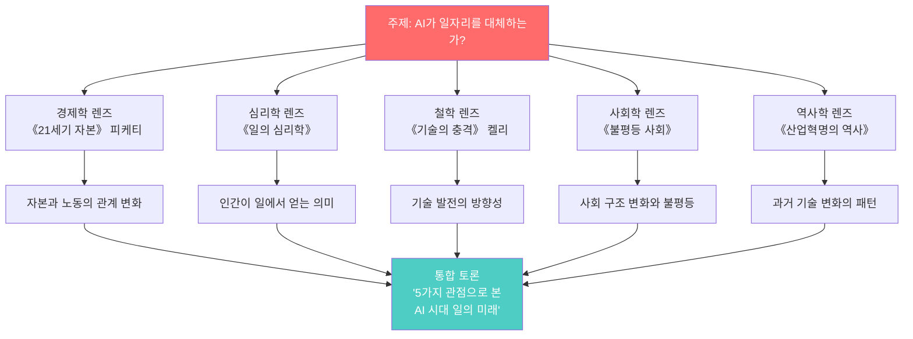

### 6.2 다각적 독서 질문 프레임워크

| 렌즈 | 핵심 질문 | AI MC가 던지는 질문 예시 |
|------|----------|----------------------|
| **사실 확인** | 무엇이 사실인가? | "저자가 주장하는 핵심 근거는 무엇인가요?" |
| **원인 분석** | 왜 이런 일이 일어나는가? | "저자는 이 현상의 원인을 뭐라고 보나요?" |
| **다른 관점** | 다르게 볼 수는 없는가? | "반대 입장에서는 어떻게 반박할까요?" |
| **가치 판단** | 옳은 것인가? | "이것이 정의로운지, 누구 입장에서 판단하나요?" |
| **적용** | 현실에 어떻게 적용되는가? | "우리 주변에서 비슷한 사례를 찾을 수 있나요?" |
| **통합** | 여러 관점을 합치면? | "지금까지 나온 관점을 종합하면 어떤 결론인가요?" |

---

## 7. 4단계 대상별 운영 설계

### 7.1 대상별 운영 비교표

| 항목 | 초등 (4~6학년) | 중등 | 고등 | 일반 (대학생+) |
|------|:---:|:---:|:---:|:---:|
| **인원** | 4~6명 | 6~8명 | 6~8명 | 4~8명 |
| **시간** | 60분 | 75분 | 90분 | 90분 |
| **난이도** | 입문 only | 입문 → 심화 | 입문 → 심화 → 융합 | 심화 → 융합 |
| **AI MC 톤** | 친구 같은 형/누나 | 존중하는 선생님 | 동등한 토론 파트너 | 학술적 동료 |
| **질문 깊이** | 이해+감상+공감 | 분석+비교+의견 | 비판+논증+적용 | 통합+창조+실천 |
| **발언 방식** | 돌아가며 발표 | 자유 발언 + 초대 | 자유 토론 + 반론 | 완전 자유 토론 |
| **기록 형태** | 그림 일기 + 한 줄 | 인사이트 카드 | 논증 에세이 | 분석 리포트 |
| **성장 지표** | 표현력 + 공감력 | 분석력 + 논리력 | 비판력 + 논증력 | 통합력 + 창조력 |
| **최종 결과물** | 독서 감상 포스터 | 관점 비교 발표 | 비판적 에세이 | 프로젝트/공동 저서 |

### 7.2 대상별 도서 운영 예시

#### 초등 (4~6학년) - 입문 중심

| 기수 | 책 | 기간 | 핵심 질문 | 사고력 훈련 |
|------|-----|------|----------|-----------|
| 1기 | 마당을 나온 암탉 | 4주 | "자유란 뭘까?" | 공감 + 표현 |
| 2기 | 아몬드 | 4주 | "감정이 왜 중요할까?" | 관점 이해 |
| 3기 | 불편해도 괜찮아 | 4주 | "불편한 건 나쁜 걸까?" | 다른 입장 보기 |
| 4기 | 어린 왕자 | 4주 | "진짜 중요한 건 뭘까?" | 비유 이해 |

#### 중등 - 입문 → 심화

| 기수 | 난이도 | 책 | 기간 | 핵심 질문 |
|------|--------|-----|------|----------|
| 1기 | 입문 | 미움받을 용기 | 4주 | "타인의 시선이 왜 신경 쓰일까?" |
| 2기 | 입문 | 어린 왕자 + 데미안 | 6주 | "성장이란 무엇인가?" |
| 3기 | 심화 | 주제: 정의 (각자 1권) | 6주 | "공정하다는 건 뭘까?" |
| 4기 | 심화 | 주제: AI 시대 (각자 1권) | 8주 | "기계가 생각할 수 있을까?" |

#### 고등 - 입문 → 심화 → 융합

| 기수 | 난이도 | 책 | 기간 | 핵심 질문 |
|------|--------|-----|------|----------|
| 1기 | 입문 | 정의란 무엇인가 | 4주 | "정의를 정의할 수 있는가?" |
| 2기 | 심화 | 자유론 vs 국가 | 8주 | "자유 vs 질서, 어느 쪽?" |
| 3기 | 융합 | 사피엔스+총균쇠+국부론 | 12주 | "문명의 차이는 필연인가 우연인가?" |
| 4기 | 융합 | AI+윤리+경제 3권 비교 | 12주 | "AI 시대 인간의 역할은?" |

#### 일반 (대학생/성인) - 심화 → 융합

| 기수 | 난이도 | 책 | 기간 | 핵심 질문 |
|------|--------|-----|------|----------|
| 1기 | 심화 | 주제: 리더십 (각자 1권) | 6주 | "좋은 리더의 조건은?" |
| 2기 | 융합 | 넛지+자유론+국가 | 10주 | "개인의 선택 vs 사회의 개입" |
| 3기 | 융합 | AI 윤리 3권 비교 | 12주 | "AI를 어떻게 통제할 것인가?" |
| 프로젝트 | - | 공동 저서 집필 | 24주 | 에세이 모음집 출판 |

### 7.3 대상별 성장 경로

```mermaid
graph LR
    subgraph "초등"
        E1["입문 1기"] --> E2["입문 2기"]
        E2 --> E3["입문 3기"]
        E3 --> E4["입문 4기<br/>(좀 더 깊이)"]
    end

    subgraph "중등"
        M1["입문 1~2기"] --> M2["심화 3~4기"]
        M2 --> M3["심화 5~6기"]
    end

    subgraph "고등"
        H1["입문 1기"] --> H2["심화 2~3기"]
        H2 --> H3["융합 4기"]
        H3 --> H4["프로젝트"]
    end

    subgraph "일반"
        A1["심화 1~2기"] --> A2["융합 3기"]
        A2 --> A3["프로젝트<br/>공동 저서"]
    end

    E4 --> M1
    M3 --> H1
    H4 --> A1

    style E1 fill:#90EE90,color:#333
    style M2 fill:#FFD700,color:#333
    style H3 fill:#FF6B6B,color:#fff
    style A3 fill:#DDA0DD,color:#fff
```

---

## 8. 학년별 AI MC 프롬프트 차이

### 8.1 같은 주제, 다른 질문 방식

> **주제: "정의란 무엇인가?"**

| 학년 | AI MC 질문 | 톤 |
|------|-----------|-----|
| **초등** | "우리 반에서 간식을 나눌 때, 어떻게 나누면 공평할까요? 왜 그렇게 생각해요?" | 생활 속 비유, 따뜻 |
| **중등** | "학교에서 교복 자율화 투표를 한다면, 다수결이 항상 옳을까요?" | 학교 생활 연결, 존중 |
| **고등** | "벤담의 공리주의와 칸트의 의무론 중 어느 쪽이 더 설득력 있다고 생각하나요? 그 이유는?" | 이론 비교, 동등 |
| **일반** | "공리주의적 방역 정책과 개인 자유권의 충돌에서, 어떤 윤리적 프레임워크로 판단할 수 있을까요?" | 현실 사례, 학술적 |

### 8.2 학년별 AI MC 프롬프트 시스템 차이

```
[초등 전용 추가 지침]
- 문장은 짧게 (20자 이내)
- 어려운 단어는 쉬운 말로 바꿔서
- "~해볼까?" "~어때?" 등 친근한 말투
- 비유와 예시를 많이 사용 (학교, 가족, 친구)
- 정답을 요구하지 않음, 모든 대답을 칭찬
- 그림이나 이모지로 분위기 조성
- 60분 구성 (체크인 10 + 토론 35 + 마무리 15)

[중등 전용 추가 지침]
- 존댓말 사용, 하지만 격식은 줄이기
- "님"이 아닌 이름으로 부르기
- 또래 관심사와 연결 (SNS, 게임, 유튜브 등)
- 반론을 부드럽게 유도 ("혹시 다르게 생각하는 사람은?")
- 사춘기 감성 존중, 침묵도 OK
- 75분 구성 (체크인 10 + 토론 45 + 마무리 20)

[고등 전용 추가 지침]
- 동등한 토론 파트너로 대우
- 학술 용어 자연스럽게 사용 (설명 함께)
- 논리적 구조를 요구 ("근거를 들어 말해주세요")
- 반론 적극 유도 ("A님의 주장에 반박할 사람?")
- 입시 연계 가능한 사고 훈련
- 90분 구성 (체크인 5 + 토론 65 + 마무리 20)

[일반 전용 추가 지침]
- 완전한 동등 관계
- 학술적 깊이 추구
- 전문 용어 자유 사용
- 날카로운 반론 환영
- 현실 적용과 실천을 강조
- 90분 구성 (체크인 5 + 토론 65 + 마무리 20)
```

---

## 9. 3가지 운영 방식: 사용자 / 내부 운영자 / AI 자동

### 9.1 운영 주체 비교

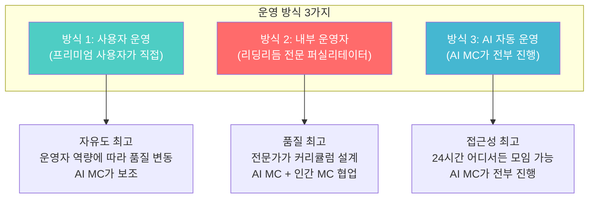

### 9.2 운영 방식 상세 비교

| 항목 | 사용자 운영 | 내부 운영자 | AI 자동 운영 |
|------|-----------|-----------|------------|
| **운영 주체** | 프리미엄 구독자 | 리딩리듬 전문 MC | AI MC 단독 |
| **AI 역할** | MC 보조 (질문 추천) | MC 보조 + 기록 | **MC 전체 진행** |
| **인간 역할** | 모임장이 주도 | 전문 MC가 주도 | 참여자만 |
| **품질** | 운영자에 따라 다름 | 안정적 고품질 | 일정한 품질 |
| **비용** | 프리미엄 구독비만 | 추가 비용 (프리미엄+) | 프리미엄 구독비만 |
| **확장성** | 운영자 수에 한계 | MC 수에 한계 | **무한 확장** |
| **대상** | 경험 있는 사용자 | 처음 시작하는 사용자 | 모든 사용자 |
| **뱃지** | "사용자 운영" 표시 | "공식 모임" 뱃지 | "AI 진행" 표시 |

### 9.3 운영 방식 선택 가이드

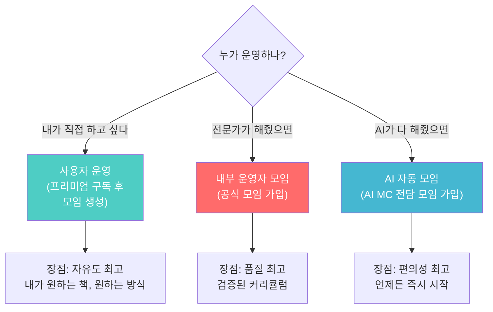

---

## 10. 사용자 혜택 체계

### 10.1 사용자가 얻는 것 (왜 리딩리듬인가?)

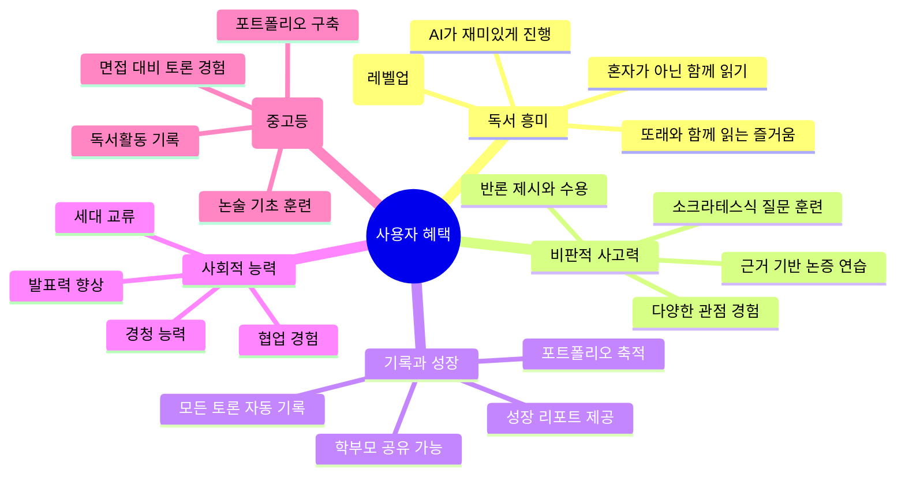

### 10.2 학년별 핵심 혜택

| 대상 | 핵심 혜택 | 학부모가 느끼는 가치 | 학생이 느끼는 가치 |
|------|----------|-----------------|-----------------|
| **초등** | 독서 습관 + 표현력 | "아이가 책을 좋아하게 됐어요" | "친구들이랑 이야기하니 재밌어요" |
| **중등** | 비판적 사고 + 논리력 | "생각하는 힘이 커졌어요" | "내 의견을 말할 수 있게 됐어요" |
| **고등** | 논술 기초 + 포트폴리오 | "입시에 도움이 돼요" | "다양한 관점으로 볼 수 있어요" |
| **일반** | 사고 확장 + 네트워크 | - | "혼자 읽을 때와 완전히 다른 경험" |

### 10.3 기존 독서 토론 학원 vs 리딩리듬

| 항목 | 오프라인 독서 토론 학원 | 리딩리듬 |
|------|---------------------|---------|
| **비용** | 월 15~30만원 | **무료 2회 → 월 9,900원** |
| **시간** | 정해진 시간에 이동 필요 | **집에서 언제든 접속** |
| **인원** | 10~20명 (주의 분산) | **최대 8명 (밀도 높은 토론)** |
| **진행** | 강사 역량에 의존 | **AI MC 일관된 품질 + 인간 MC** |
| **기록** | 없음 (수기 메모) | **자동 전사 + AI 요약 + 알림장** |
| **성장 추적** | 없음 | **AI 성장 리포트 + 포트폴리오** |
| **접근성** | 지역 한정 | **전국 어디서든** |
| **부모 소통** | 월 1회 상담 | **매주 알림장 + 월 리포트** |
| **난이도 조절** | 일괄 적용 | **AI가 개인별 맞춤** |
| **다양한 관점** | 강사 1인 관점 | **AI 다각적 관점 + 멤버 다양성** |

---

## 11. 기대 성과와 측정 지표

### 11.1 사고력 성장 측정 프레임워크

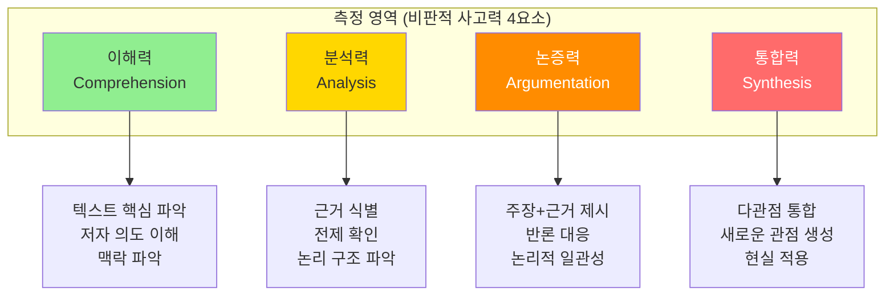

### 11.2 학년별 기대 성과

| 대상 | 1기수 (4주) 후 | 3기수 (12주) 후 | 6기수 (24주) 후 |
|------|-------------|---------------|---------------|
| **초등** | 책 읽는 습관 형성<br/>자기 생각 표현 가능 | 다른 관점 인식 시작<br/>"왜?" 질문하는 습관 | 독서가 즐거워짐<br/>비유/상징 이해 |
| **중등** | 자기 의견 논리적 표현<br/>근거 대는 습관 | 반대 관점 수용<br/>분석적 독서 가능 | 에세이 수준 글쓰기<br/>독립적 사고 |
| **고등** | 비판적 질문 생성<br/>논증 구조 파악 | 복수 관점 비교 분석<br/>논술 기본기 완성 | 통합적 사고<br/>입시 대비 포트폴리오 |
| **일반** | 다각적 관점 습관<br/>깊이 있는 토론 경험 | 전문 분야 깊이<br/>프로젝트 시작 | 공동 저서/연구<br/>사회적 영향력 |

### 11.3 AI가 측정하는 성장 지표

| 지표 | 측정 방법 | 초등 기준 | 중등 기준 | 고등 기준 |
|------|----------|----------|----------|----------|
| **발언 빈도** | 토론당 발언 횟수 | 3회 이상 | 5회 이상 | 7회 이상 |
| **질문 생성** | 스스로 질문한 횟수 | 1회 | 2회 | 3회 이상 |
| **근거 제시** | 근거를 포함한 발언 비율 | 30% | 50% | 70% |
| **관점 수용** | 다른 관점을 인용한 횟수 | 1회 | 2회 | 3회 이상 |
| **논리 구조** | 주장+근거+결론 갖춘 발언 | 20% | 40% | 60% |
| **인사이트 작성** | 인사이트 카드 작성 수 | 주 1개 | 주 2개 | 주 3개 |

### 11.4 성장 리포트 예시 (AI 코치 출력)

```
+--------------------------------------------------+
|  성장 리포트 - 김서연 (고2)                        |
|  기간: 2026.03 ~ 2026.05 (3기수, 12주)            |
+--------------------------------------------------+
|                                                  |
|  종합 성장 등급: B+ → A-                           |
|                                                  |
|  비판적 사고력 4요소                               |
|  이해력  ████████████████ 85% (+15%)              |
|  분석력  ██████████████   70% (+25%)              |
|  논증력  ████████████     60% (+30%)              |
|  통합력  ██████████       50% (+20%)              |
|                                                  |
|  강점:                                            |
|  1. 텍스트 핵심을 정확히 파악하는 능력이 뛰어남     |
|  2. 다른 멤버의 관점을 경청하고 수용하는 자세       |
|                                                  |
|  성장 포인트:                                      |
|  "자기 주장에 구체적 근거를 더 붙이면               |
|   논증력이 크게 향상될 수 있습니다.                 |
|   다음 기수에서는 '왜?'를 한 번 더 물어보세요."     |
|                                                  |
|  다음 추천:                                       |
|  - Level 2 심화 모임: '자유 vs 평등' (8주)         |
|  - 추천 도서: 《자유론》 밀                        |
|                                                  |
|  [학부모 공유]  [포트폴리오 저장]                   |
+--------------------------------------------------+
```

---

## 부록: 독서 토론 시장 진입 전략

### 한국 독서 토론 시장 분석

| 시장 | 규모 | 특징 | 리딩리듬의 기회 |
|------|------|------|--------------|
| **독서 논술 학원** | 약 5,000억원 | 오프라인 중심, 비쌈 (월 15~30만) | 1/10 가격으로 온라인 대체 |
| **온라인 교육** | 급성장 중 | 동영상 강의 중심, 토론 없음 | 실시간 토론이 차별점 |
| **독서 앱** | 초기 시장 | 기록 중심, 커뮤니티 약함 | AI MC + 커뮤니티가 차별점 |

### 진입 전략

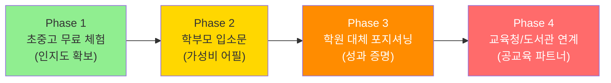

---

> **"독서 토론 학원에 보내면 월 30만원.**
> **리딩리듬이면 월 9,900원에 AI MC가 소크라테스처럼 질문합니다.**
> **아이가 '왜?'를 묻기 시작하면, 비판적 사고가 시작된 겁니다."**

---

*이 문서는 리딩리듬의 서비스 운영 설계, AI 역할/프롬프트 정의,*
*난이도별 운영, 대상별 설계, 사용자 혜택을 정의합니다.*
