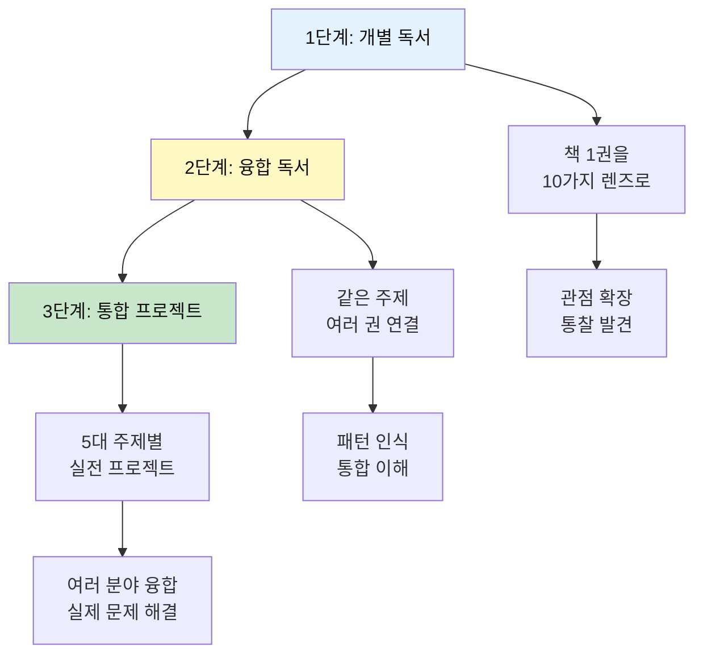
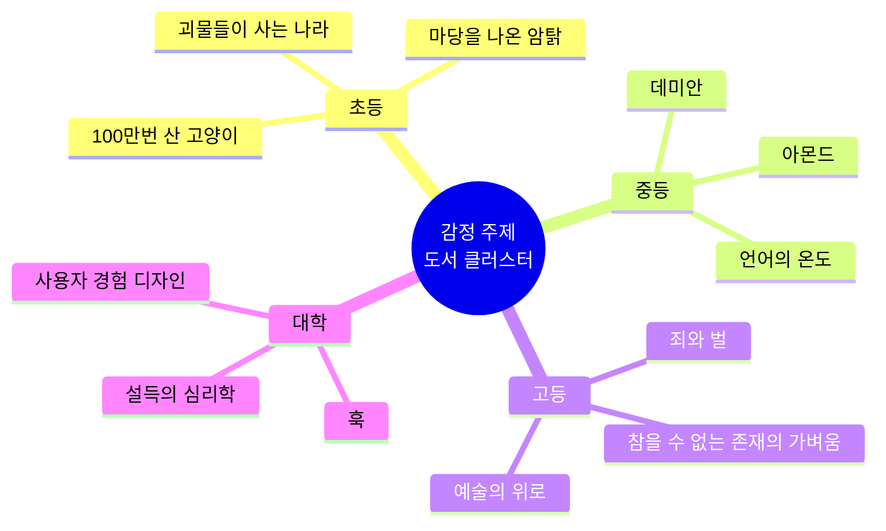
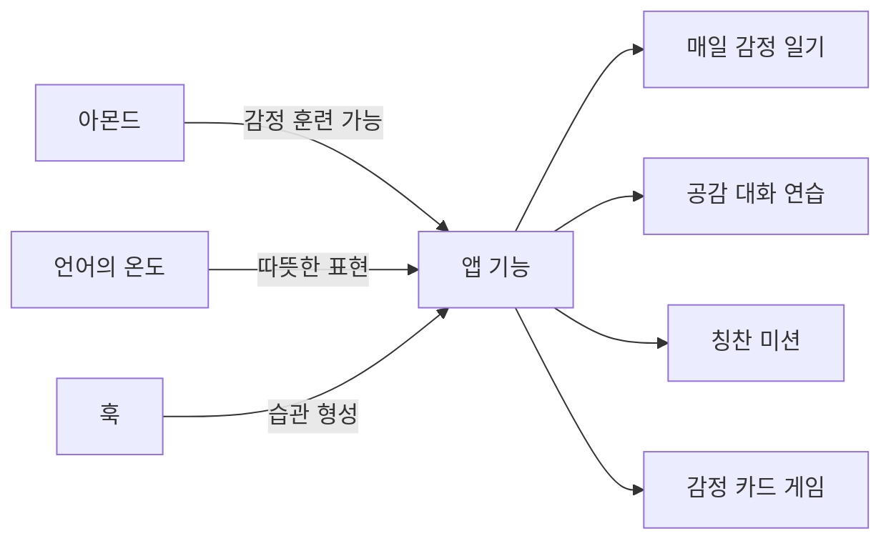
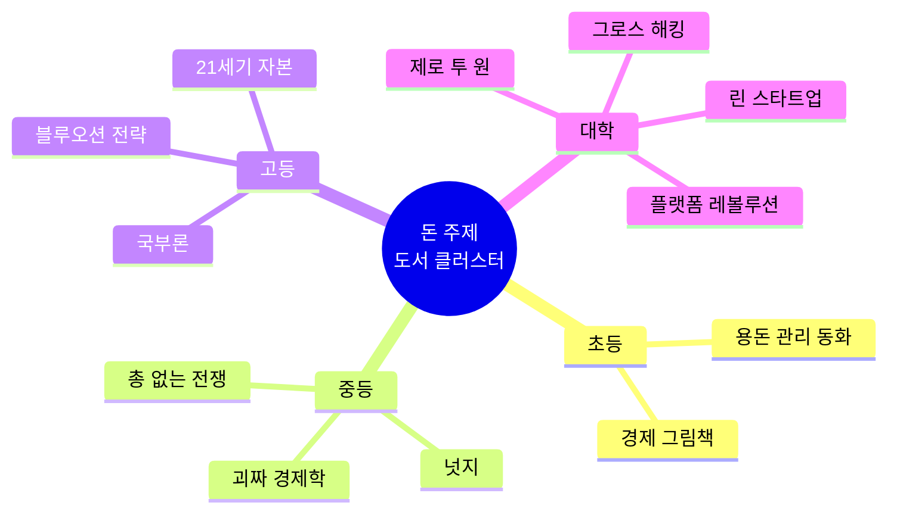
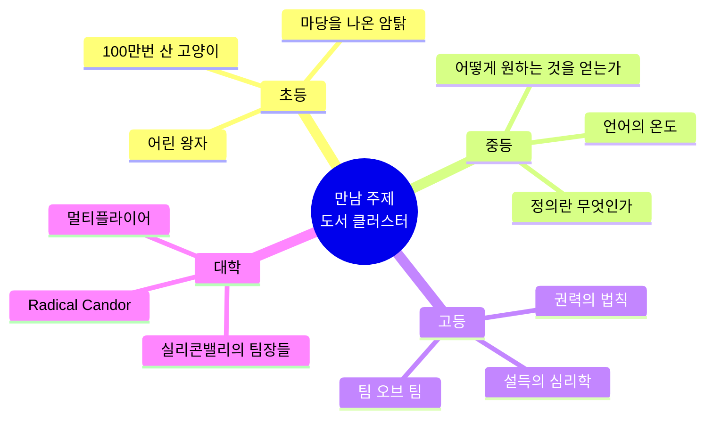
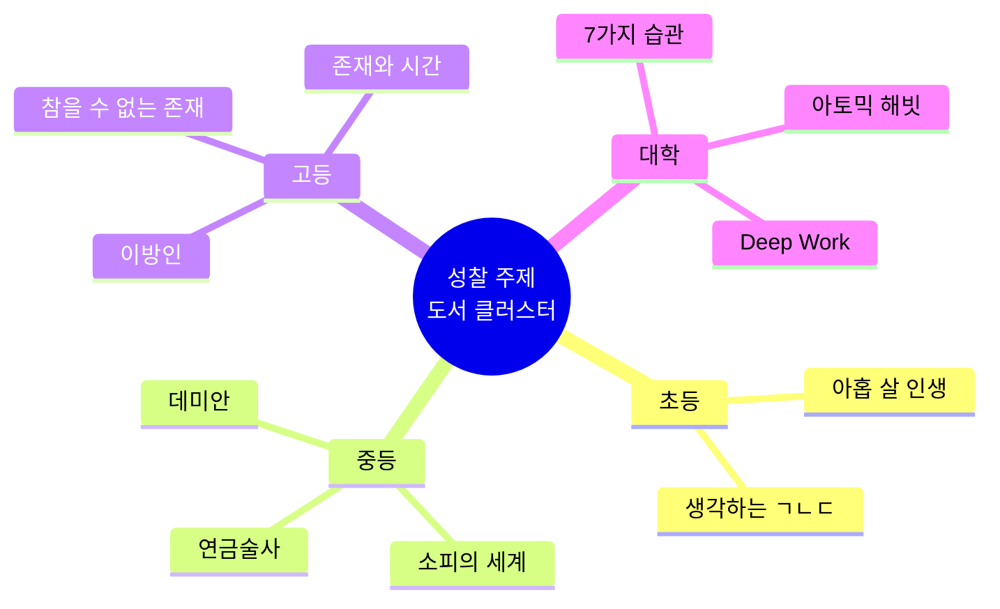
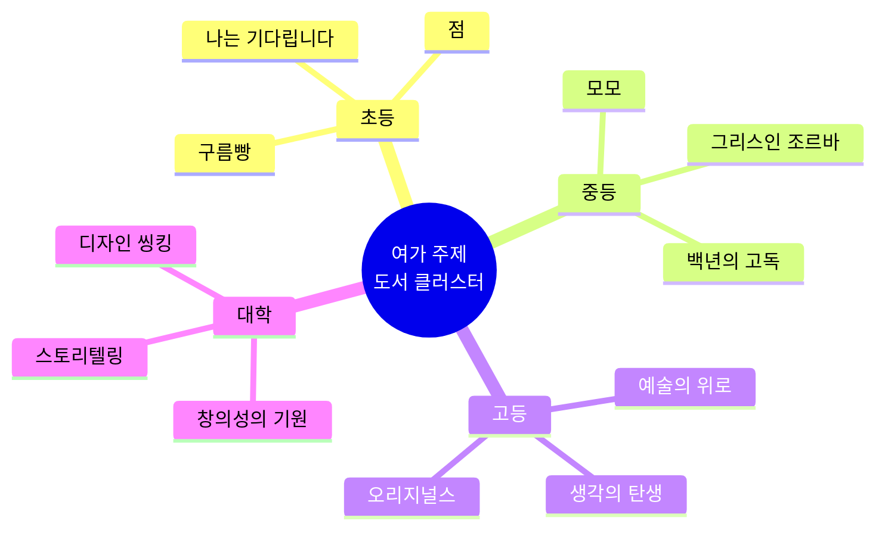
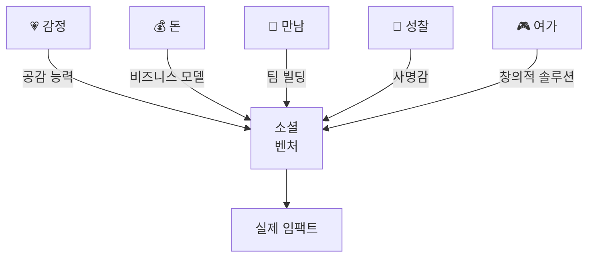

# 5대 주제 프로젝트 가이드

> **핵심 철학**: 한 권 한 권은 다양한 렌즈로 보되,  
> **실제 프로젝트는 여러 권을 융합**하여 깊이 있게 만든다!

---

## 🎯 독서 → 프로젝트 3단계 구조



---

## 💗 주제 1: 감정 (Emotion)

### 📚 독서 클러스터 (학년별 추천)



### 1단계: 개별 독서 (각 책을 10가지 렌즈로)

**예시: 『아몬드』 분석**

| 렌즈 | 질문 | 통찰 |
|------|------|------|
| 💰 경제 | 감정 장애가 경제활동에? | 공감 능력 = 협업 능력 = 경제 가치 |
| ⚖️ 윤리 | 다름을 차별하는 것은? | 신경다양성 존중 필요 |
| 🧠 심리 | 감정은 학습 가능한가? | 감정도 훈련으로 발달 |
| 🏛️ 정치 | 소수자 권리는? | 포용적 정책 필요 |
| 🎨 문화 | 한국 사회 공감 문화는? | 집단주의 vs 개인 차이 |

→ **개인 통찰**: "감정 능력도 근육처럼 훈련할 수 있다"

---

### 2단계: 융합 독서 (여러 권 연결)

**융합 독서 리스트: 감정 이해와 공감**

| 책 | 핵심 통찰 | 융합 질문 |
|-----|----------|-----------|
| 아몬드 | 감정 장애, 다름 이해 | 어떻게 다름을 받아들일까? |
| 언어의 온도 | 말의 힘, 공감 소통 | 어떻게 따뜻하게 표현할까? |
| 설득의 심리학 | 감정 트리거, 설득 | 어떻게 마음을 움직일까? |
| 훅 | 감정과 습관 형성 | 어떻게 습관을 만들까? |

**통합 질문:**
1. 감정은 어떻게 작동하는가? (메커니즘)
2. 공감 능력을 어떻게 키울 수 있나? (훈련)
3. 감정을 어떻게 디자인할 수 있나? (적용)

**융합 통찰:**
> "감정은 ① 이해할 수 있고 (아몬드)  
> ② 표현할 수 있으며 (언어의 온도)  
> ③ 설득에 활용하고 (설득의 심리학)  
> ④ 제품에 적용할 수 있다 (훅)"

---

### 3단계: 통합 프로젝트 (실전)

#### 프로젝트 A: 공감 능력 향상 앱 (중·고등)

**문제 정의:**
- 현대 청소년 공감 능력 저하
- SNS 피상적 소통 증가
- 감정 표현 어려움

**독서 기반 솔루션 설계:**


**12주 프로젝트 로드맵:**
```
Week 1-2: 독서 & 사용자 리서치
• 4권 완독 + 10가지 렌즈 분석
• 청소년 30명 인터뷰

Week 3-4: 융합 분석 & 아이디어
• 4권의 통찰 통합
• HMW 질문 100개
• 솔루션 컨셉 3개

Week 5-6: MVP 설계
• 화면 설계 (Figma)
• 핵심 기능 정의
• 습관 형성 메커니즘 설계

Week 7-9: 개발 & 테스트
• 노코드 개발 (Bubble)
• 베타 테스트 50명
• 피드백 수집

Week 10-11: 개선 & 확장
• 주요 이슈 개선
• 추가 기능 구현
• 사용자 100명 확보

Week 12: 발표 & 포트폴리오
• 피칭 덱 제작
• Demo Day 발표
• 포트폴리오 정리
```

**기대 효과:**
- 공감 점수 30% 향상
- 긍정적 소통 2배 증가
- 감정 표현 능력 향상

---

#### 프로젝트 B: 치유 콘텐츠 큐레이션 서비스 (대학)

**문제 정의:**
- 정신건강 문제 증가
- 적절한 콘텐츠 찾기 어려움
- 개인별 맞춤 필요

**독서 기반 솔루션:**
- 감정 상태 진단 (심리학 기반)
- 맞춤형 콘텐츠 추천 (AI 활용)
- 커뮤니티 형성 (관계 이론)

**비즈니스 모델:**
- Freemium (기본 무료, 프리미엄 유료)
- B2B (기업 웰빙 프로그램)
- 콘텐츠 제작자 수익 분배

---

## 💰 주제 2: 돈 (Money)

### 📚 독서 클러스터 (학년별 추천)



### 2단계: 융합 독서

**융합 독서 리스트: 가치 창출의 메커니즘**

| 책 | 핵심 통찰 | 키워드 |
|-----|----------|--------|
| 국부론 | 분업, 시장 원리 | 생산성 |
| 괴짜 경제학 | 숨은 인센티브 | 동기 |
| 넛지 | 선택 설계 | 행동 |
| 린 스타트업 | 빠른 검증 | 실험 |
| 제로 투 원 | 독점 시장 | 혁신 |
| 블루오션 전략 | 새 시장 창조 | 차별화 |
| 그로스 해킹 | 성장 실험 | 확장 |

**통합 질문:**
1. 가치는 어디서 오는가? (국부론, 제로 투 원)
2. 어떻게 시장을 만드는가? (블루오션, 플랫폼)
3. 어떻게 빠르게 성장하는가? (린, 그로스)

**융합 통찰:**
> "가치 창출 = ① 차별화된 제품 (제로 투 원)  
> ② 새로운 시장 (블루오션)  
> ③ 빠른 검증 (린)  
> ④ 성장 메커니즘 (그로스)"

---

### 3단계: 통합 프로젝트

#### 프로젝트 A: 학생 맞춤 수익 창출 (고등·대학)

**문제 정의:**
- 용돈 부족, 경제 독립 욕구
- 아르바이트 vs 학업 갈등
- 창의적 수익 모델 필요

**독서 기반 솔루션 설계:**

**Step 1: 시장 분석 (괴짜 경제학 + 넛지)**
```
내가 가진 것:
• 시간: 방과 후 2-3시간
• 기술: SNS, 디자인, 글쓰기
• 네트워크: 학교 친구 500명

숨은 기회:
• 학생들의 고민 (시험, 진로)
• 학부모의 니즈 (교육 정보)
• 학교의 문제 (비효율)
```

**Step 2: 아이디어 발상 (블루오션 + 제로 투 원)**
```
4가지 액션 프레임워크:
• 제거: 높은 고정비
• 감소: 시간 투입
• 증가: 자동화
• 창조: 새로운 가치

3가지 비즈니스 모델:
1. 정보 플랫폼 (시험 정보 공유)
2. 재능 마켓 (디자인, 과외)
3. 커뮤니티 구독 (프리미엄 콘텐츠)
```

**Step 3: MVP 제작 (린 스타트업)**
```
Week 1-2: 고객 인터뷰 30명
Week 3-4: 랜딩 페이지 + 결제
Week 5-6: 베타 런칭 (친구 50명)
Week 7-8: 피벗 or 스케일
```

**Step 4: 성장 실험 (그로스 해킹)**
```
AARRR 지표:
• Acquisition: SNS 바이럴
• Activation: 첫 구매 유도
• Retention: 매주 가치 제공
• Revenue: 프리미엄 전환
• Referral: 추천 인센티브
```

**실제 사례 목표:**
- 3개월: 월 50만원 수익
- 6개월: 월 200만원 수익
- 12개월: 학비 자립

---

#### 프로젝트 B: 지역 소상공인 컨설팅 (대학)

**독서 융합:**
- 경쟁 전략: 산업 분석
- 블루오션: 차별화 전략
- 넛지: 매장 동선 설계
- 그로스: 재방문 전략

**12주 프로젝트:**
1. 주변 소상공인 5곳 선정
2. 7권의 책으로 진단 프레임워크
3. 맞춤 전략 제안
4. 3개월 컨설팅 실행
5. 매출 증대 측정

**포트폴리오:**
- 전략 보고서
- 실제 매출 증대 데이터
- 추천서

---

## 🤝 주제 3: 만남 (Connection)

### 📚 독서 클러스터



### 2단계: 융합 독서

**융합 주제: 효과적 협업과 리더십**

| 책 | 핵심 통찰 | 적용 |
|-----|----------|------|
| 어린 왕자 | 길들임 = 관계 = 책임 | 진정한 관계 |
| 설득의 심리학 | 6가지 설득 원리 | 영향력 |
| 실리콘밸리의 팀장들 | Radical Candor | 피드백 |
| 팀 오브 팀 | 적응형 조직 | 협업 시스템 |
| 멀티플라이어 | 리더십 배가 | 임파워먼트 |

**통합 질문:**
1. 좋은 관계란? (깊이)
2. 어떻게 영향을 미치나? (범위)
3. 어떻게 함께 성장하나? (시너지)

---

### 3단계: 통합 프로젝트

#### 프로젝트 A: 동아리/학생회 혁신 (중·고등)

**문제:**
- 형식적 활동
- 참여율 저조
- 갈등 관리 어려움

**독서 기반 솔루션:**

**1. 조직 문화 설계 (실리콘밸리의 팀장들)**
```
Radical Candor 적용:
• 1:1 미팅 (격주)
• 직접적 피드백 문화
• 칭찬 공개, 비판 개인
```

**2. 권한 위임 (멀티플라이어)**
```
5가지 실천:
• 역할 명확화
• 의사결정권 위임
• 실수 허용 문화
• 성장 기회 제공
• 성과 인정
```

**3. 소통 시스템 (언어의 온도)**
```
따뜻한 소통:
• 감사 메시지 (주간)
• 고민 나눔 (월간)
• 축하 이벤트 (수시)
```

**12주 실험:**
- 참여율 50% → 80% 증가
- 만족도 3점 → 4.5점
- 프로젝트 완수율 2배

---

#### 프로젝트 B: 커뮤니티 빌딩 플랫폼 (대학)

**독서 융합:**
- 어린 왕자: 관계의 본질
- 설득의 심리학: 참여 유도
- 팀 오브 팀: 네트워크 조직
- 플랫폼 레볼루션: 양면 시장

**MVP:**
- 관심사 기반 매칭
- 오프라인 모임 지원
- 프로젝트 협업 도구

---

## 🧘 주제 4: 성찰 (Reflection)

### 📚 독서 클러스터



### 2단계: 융합 독서

**융합 주제: 자기 이해와 성장 시스템**

| 책 | 핵심 통찰 | 실천 |
|-----|----------|------|
| 데미안 | 자기 되기 | 정체성 |
| 이방인 | 진정성 | 가치관 |
| 7가지 습관 | 원칙 중심 | 시스템 |
| 아토믹 해빗 | 1% 개선 | 복리 효과 |
| Deep Work | 몰입 | 생산성 |

**통합 질문:**
1. 나는 누구인가? (정체성)
2. 무엇을 원하는가? (가치관)
3. 어떻게 성장하는가? (시스템)

---

### 3단계: 통합 프로젝트

#### 프로젝트 A: 개인 성장 시스템 구축 (고등·대학)

**독서 기반 설계:**

**1. 자기 이해 (데미안 + 이방인)**
```
8주 자기 탐구:
• Week 1-2: 인생 타임라인
• Week 3-4: 가치관 워크숍
• Week 5-6: 강점 발견
• Week 7-8: 사명선언문
```

**2. 목표 설정 (7가지 습관)**
```
OKR 프레임워크:
• Objective: 이루고 싶은 것
• Key Results: 측정 가능한 결과
• 분기별 리뷰
```

**3. 습관 설계 (아토믹 해빗)**
```
습관 스택:
• 아침: 명상 5분 → 독서 30분 → 운동 20분
• 저녁: 일기 10분 → 계획 5분
• 주간: 리뷰 1시간
```

**4. 몰입 환경 (Deep Work)**
```
생산성 시스템:
• 시간 블록킹
• 디지털 디톡스
• 몰입 공간 설계
```

**12주 결과:**
- 목표 달성률 3배
- 생산성 2배
- 만족도 향상

---

#### 프로젝트 B: 청소년 멘토링 프로그램 (대학)

**독서 융합:**
- 여러 철학서의 통찰
- 자기계발서의 시스템
- 실제 멘토링 사례

**12주 프로그램:**
- 1:1 멘토링 (중고생 5명)
- 자기 탐구 워크샵
- 성장 시스템 코칭

---

## 🎮 주제 5: 여가 (Leisure)

### 📚 독서 클러스터



### 2단계: 융합 독서

**융합 주제: 창의적 라이프스타일**

| 책 | 핵심 통찰 | 적용 |
|-----|----------|------|
| 모모 | 시간의 가치 | 여유 |
| 생각의 탄생 | 13가지 사고 도구 | 창의성 |
| 예술의 위로 | 예술의 힘 | 치유 |
| 오리지널스 | 독창성 훈련 | 혁신 |
| 디자인 씽킹 | 창작 프로세스 | 실행 |

---

### 3단계: 통합 프로젝트

#### 프로젝트 A: 창의적 취미 큐레이션 플랫폼 (대학)

**문제:**
- 취미 찾기 어려움
- 혼자 하기 힘듦
- 지속 어려움

**독서 기반 솔루션:**
- 성향 진단 (심리학)
- 맞춤 추천 (AI)
- 커뮤니티 형성 (관계)
- 습관 형성 (행동 설계)

---

#### 프로젝트 B: 문화 콘텐츠 창작 (고등·대학)

**독서 융합:**
- 백년의 고독: 마법적 리얼리즘
- 생각의 탄생: 창작 기법
- 디자인 씽킹: 제작 과정
- 그로스 해킹: 확산 전략

**12주 창작:**
- 웹툰, 소설, 유튜브 등
- 실제 플랫폼 연재
- 팬덤 형성

---

## 🔄 5대 주제 통합 메가 프로젝트

### 메가 프로젝트: 소셜 벤처 창업 (16주)

**5대 주제 모두 활용:**



**Phase 1 (Week 1-4): 문제 발견**
- 💗 감정: 사회적 고통 공감
- 🧘 성찰: 내가 해결하고 싶은 것

**Phase 2 (Week 5-8): 솔루션 설계**
- 💰 돈: 지속가능한 모델
- 🎮 여가: 창의적 아이디어

**Phase 3 (Week 9-12): 팀 빌딩**
- 🤝 만남: 공동창업자, 팀 구성

**Phase 4 (Week 13-16): 실행**
- 통합: MVP 런칭 + 임팩트 측정

**독서 총량:**
- 5대 주제별 3-5권 = 15-25권
- 융합 분석 + 실전 적용
- 16주 집중 프로젝트

---

## 📋 주제별 프로젝트 템플릿

### 공통 프레임워크

```markdown
## 주제: [5대 주제 중 1개]

### 1단계: 독서 클러스터 구성 (2-3주)
□ 선정: 해당 주제 도서 3-7권
□ 개별 독서: 각 책을 10가지 렌즈로 분석
□ 개인 통찰: 책별 핵심 통찰 정리

### 2단계: 융합 분석 (1-2주)
□ 연결: 책들의 공통점과 차이점
□ 패턴: 반복되는 주제와 메시지
□ 통합 통찰: 여러 책을 관통하는 핵심

### 3단계: 문제 발견 (1주)
□ 현실 문제: 실제 존재하는 문제
□ 타깃: 누구의 문제인가?
□ 중요도: 왜 해결해야 하나?

### 4단계: 솔루션 설계 (2주)
□ 아이디어: 독서 기반 솔루션 10개
□ 검증: 3개 선정 → 사용자 인터뷰
□ 선택: 최종 1개 결정

### 5단계: MVP 제작 (3-4주)
□ 프로토타입: 노코드/로우코드
□ 테스트: 실제 사용자 20-50명
□ 피드백: 데이터 수집 및 분석

### 6단계: 개선 & 발표 (1-2주)
□ 개선: 주요 이슈 해결
□ 포트폴리오: 문서화
□ 발표: 피칭 및 시연
```

---

## 🎯 마지막 조언

### 핵심 원칙

**1. 한 권은 렌즈로, 여러 권은 융합으로**
```
❌ 책 1권 → 프로젝트 1개 (얕음)
✅ 책 5권 → 융합 → 프로젝트 1개 (깊음)
```

**2. 5대 주제는 삶의 나침반**
```
모든 문제는 결국:
• 💗 감정의 문제이거나
• 💰 돈의 문제이거나
• 🤝 관계의 문제이거나
• 🧘 의미의 문제이거나
• 🎮 즐거움의 문제
```

**3. 프로젝트는 실전이다**
```
• 가설 검증 (린)
• 실제 사용자 (최소 20명)
• 측정 가능한 결과
• 포트폴리오 완성
```

5대 관심 분야(감정, 돈, 만남, 성찰, 여가)를 중심으로 프로그램 구조를 재구성하겠습니다. 훨씬 더 현실적이고 다양한 관점을 담아내겠습니다.

[11 tools called]

완료했습니다! **5대 관심 영역(감정·돈·만남·성찰·여가)** 중심으로 프로그램을 전면 재구성했습니다. 

## 📊 주요 변경 사항

### 1️⃣ **README.md** - 핵심 구조 개편

**✨ 추가된 내용:**
- **5대 영역 통합 접근** 섹션 (대상별 프로그램 대체)
- **레벨별 × 5대 영역 프로젝트 매트릭스** - 각 학년이 각 영역에서 어떤 프로젝트를 할 수 있는지 구체화
- **5대 영역별 핵심 질문 & 비즈니스 기회** 표
- **융합 프로젝트** 예시 (감정×돈, 만남×돈, 성찰×여가 등)
- **실전 사례 5가지** - 각 영역별 성공 프로젝트 스토리
- **5대 영역 메이커의 10가지 원칙**

**💡 핵심 개선:**
- 단순한 "학교 문제" → 구체적인 **감정·돈·만남·성찰·여가** 문제
- 획일적 프로젝트 → **다양한 관심사에 맞는 맞춤형** 프로젝트
- 모든 전문 분야 포용 (예: 심리학 관심자 → 감정 영역, 경제학 → 돈 영역)

### 2️⃣ **AI_활용_창작_가이드.md** - 창작 형식 다변화

**✨ 추가된 내용:**
- **5대 영역별 창작 형식 매트릭스**
- 각 영역별 실전 프로젝트 가이드:
  - 💗 감정: "마음 친구" AI 챗봇
  - 💰 돈: "틴 프리랜서" 재능 마켓
  - 🤝 만남: "스터디 메이트" 매칭 플랫폼
  - 🧘 성찰: "인생 질문 생성기"
  - 🎮 여가: "인생 시뮬레이션 게임"
- **융합 창작** 예시 (영역 간 결합)

### 3️⃣ **운영_매뉴얼.md** - 실전 운영 프로세스

**✨ 추가된 내용:**
- **5대 영역 문제 발견 프레임워크**
- **5대 렌즈로 질문 확장** 워크숍 (90분 상세 가이드)
- **토론 진행 시 5대 영역 활용** 타임테이블
- **5대 영역 문제 발견 워크시트** (실전 템플릿)

**💡 실전 예시:**
《마당을 나온 암탉》 한 권에서:
- 💗 감정: 모성애의 고통 → 부모-자녀 소통 앱
- 💰 돈: 자유 vs 안정 → 경제적 자립 게임
- 🤝 만남: 소속감 탐구 → 고민 공유 플랫폼
- 🧘 성찰: 진짜 자유란? → 가치관 탐색 앱
- 🎮 여가: 날고 싶은 꿈 → 라이프스타일 챌린지

### 4️⃣ **필독서_종합_가이드.md** - 5대 영역 분류

**✨ 추가된 내용:**
- **5대 영역 기반 독서 시스템**
- **학년별 × 영역별 권수 배분 매트릭스**
- 연령별 비중 변화 추적 (초등: 감정·여가 중심 → 대학: 돈·성찰 중심)

## 🎯 핵심 철학 변화

**Before (단순):**
- 초등: 일상 문제 → 동화책
- 중등: 학교 문제 → 앱
- 고등: 진로 문제 → 스타트업

**After (5대 영역 통합):**
- **모든 연령**이 **5가지 렌즈**로 세상을 본다
- **각자의 관심사**와 **전문성**을 자유롭게 결합
- **융합 프로젝트**로 혁신 창출
- 심리학·경제학·사회학·철학·예술 등 **모든 분야** 포용

## 🚀 실전 활용 가이드

1. **독서 후 질문**: "이 책을 5가지 렌즈로 보면?"
2. **문제 발견**: 각 영역에서 최소 1개씩 = 5개 이상 아이디어
3. **프로젝트 선택**: 가장 흥미로운 영역 or 융합
4. **비즈니스 모델**: 각 영역별 수익화 전략 적용

이제 학생들이 **어떤 관심사를 가지더라도** AI 메이커 프로젝트로 연결할 수 있습니다! 🎉

---

**"한 권으로 시작하되, 여러 권으로 융합하고, 하나의 프로젝트로 완성하라!"**

📚 (개별 독서) → 🔗 (융합 분석) → 🚀 (통합 프로젝트)
