# 리딩클루(ReadingClue) — SMILE형 탐구 독서 플랫폼 · 유저 시나리오

> **"책을 통해 진짜 문제를 찾고, 사람을 모아 함께 해결한다."**
>
> aicareerpath.co.kr이 "진로 정보의 민주화"라면,
> 리딩클루는 **"문제 발견과 해결의 민주화"**다.

---

## 목차

1. [플랫폼 비전](#1-플랫폼-비전)
2. [SMILE 사이클 — 5단계 퀘스트](#2-smile-사이클--5단계-퀘스트)
3. [페르소나와 레벨 시스템](#3-페르소나와-레벨-시스템)
4. [카테고리 체계 — 인간 내면의 50가지 문제 + α](#4-카테고리-체계)
5. [STEP 1: 독서·발견 — 책에서 진짜 문제를 찾다](#5-step-1-독서발견)
6. [STEP 2: 공유·모이기 — 게시판에 올리고 사람을 찾다](#6-step-2-공유모이기)
7. [STEP 3: 초점화·탐구 — 문제를 좁히고 파고들다](#7-step-3-초점화탐구)
8. [STEP 4: 다각도 검토 — 여러 렌즈로 바라보다](#8-step-4-다각도-검토)
9. [STEP 5: 프로젝트 — 해결하거나 정의하다](#9-step-5-프로젝트)
10. [유저 시나리오 — 전체 흐름 (7개 시나리오)](#10-유저-시나리오--전체-흐름)
11. [화면 설계 — 앱/웹 상세](#11-화면-설계--앱웹-상세)
12. [템플릿과 방법론](#12-템플릿과-방법론)
13. [AI 활용 방법론](#13-ai-활용-방법론)
14. [게이미피케이션과 성장 시스템](#14-게이미피케이션과-성장-시스템)
15. [운영 모델과 수익 구조](#15-운영-모델과-수익-구조)
16. [기술 스택과 MVP](#16-기술-스택과-mvp)
17. [SMILE vs 기존 독서 모임 비교](#17-smile-vs-기존-독서-모임-비교)

---

## 1. 플랫폼 비전

### 1.1 핵심 선언

```
┌─────────────────────────────────────────────────────────┐
│                                                           │
│   📚 리딩클루 — "문제 발견과 해결의 민주화"                │
│                                                           │
│   ✊ 우리의 선언:                                         │
│                                                           │
│   "진짜 문제를 찾는 능력은 특권이 아닙니다."               │
│   "비싼 컨설팅도, 특별한 인맥도 필요 없습니다."            │
│   "책 한 권과 질문하는 마음이면 충분합니다."               │
│                                                           │
│   BEFORE              WITH READINGCLUE                    │
│   ━━━━━━              ━━━━━━━━━━━━━━                     │
│   혼자 읽고 끝남       → 함께 읽고 문제를 찾음              │
│   감상에서 멈춤        → 진짜 문제를 정의함                 │
│   말로만 끝남          → 프로젝트로 해결함                  │
│   정보 독점            → 공유와 협력의 문화                 │
│                                                           │
└─────────────────────────────────────────────────────────┘
```

### 1.2 aicareerpath.co.kr과의 비교

| 비교 항목 | AI CareerPath | ReadingClue |
|----------|:---:|:---:|
| **미션** | 진로 정보의 민주화 | 문제 발견·해결의 민주화 |
| **입력** | 적성 검사 결과 | 책 + 질문 |
| **과정** | 5단계 커리어 설계 | 5단계 문제 탐구 |
| **산출** | 커리어 패스 + 포트폴리오 | 문제 정의서 + 프로젝트 결과물 |
| **AI 역할** | 커리어 패스 설계 파트너 | 방법론 가이드 (활용은 개인 선택) |
| **공유 문화** | 선배 경험 공유 | 문제·탐구·프로젝트 공유 |
| **단계 구조** | 적성→탐색→설계→실행→포트폴리오 | 발견→공유→초점화→검토→프로젝트 |

### 1.3 핵심 원칙

| # | 원칙 | 설명 | 실천 방식 |
|:-:|------|------|----------|
| 1 | **공유와 협력** | 혼자 읽고 끝나지 않는다 | 게시판 중심 공유, 팀 구성 |
| 2 | **진짜 문제** | 책은 목적이 아니라 도구다 | 독서 → 문제 발견 프레임 |
| 3 | **해결 지향** | 찾는 것과 해결하는 것, 둘 다 | 문제 정의 + 프로젝트 두 갈래 |
| 4 | **다각도 관점** | 한 방향이 아닌 여러 렌즈 | 윤리·기업·사회·기술 검토 |
| 5 | **열린 참여** | 누구나 문제를 올리고 참여 | 카테고리별 구독, 참여 스펙트럼 |
| 6 | **템플릿 제공** | 방법과 방향성을 제시 | 단계별 템플릿 + 가이드 |
| 7 | **AI는 선택** | 방법론은 제시, 활용은 개인 | AI 가이드 제공, 강제 아님 |

### 1.4 병렬 독서의 힘

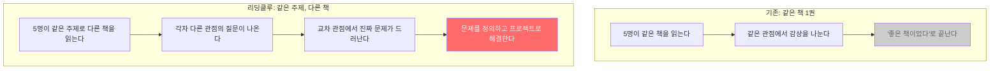

| 병렬 독서 효과 | 설명 | 예시 |
|--------------|------|------|
| **관점 충돌** | 같은 주제를 다른 각도에서 봄 | "내 책에서는 이랬는데, 네 책에서는?" |
| **질문 교차** | 서로 다른 질문이 하나의 문제로 수렴 | AI 감정인식(민준) + 교사 역할(서연) → "교사 전환" |
| **깊이 확보** | 한 권으로는 보이지 않는 전체 그림 | 기술·윤리·교육·철학 관점 동시 확보 |
| **동기 유발** | "저 사람 책도 궁금하다" | 자연스러운 교차 읽기 |

---

## 2. SMILE 사이클 — 5단계 퀘스트

### 2.1 전체 구조

SMILE(Stanford Mobile Inquiry-based Learning Environment) 방식을 독서 기반 문제 해결에 적용합니다.

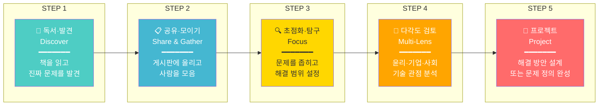

### 2.2 각 단계 상세

| 단계 | 이모지 | 핵심 질문 | 활동 | 결과물 | 소요 시간 |
|:---:|:---:|----------|------|--------|:---:|
| **STEP 1** | 📖 | "이 책에서 어떤 현실 문제가 보이는가?" | 독서 + 문제 메모 | 문제 카드 | 1~2주 |
| **STEP 2** | 📋 | "누가 이 문제에 공감할까?" | 게시판 올리기 + 팀 구성 | 게시글 + 팀 | 1주 |
| **STEP 3** | 🔍 | "해결할 수 있는 범위는 어디까지?" | 문제 좁히기 + 자원 파악 | 문제 정의서 | 1~2주 |
| **STEP 4** | 🔭 | "다른 측면에서 보면?" | 6가지 렌즈 분석 | 다각도 분석서 | 1~2주 |
| **STEP 5** | 🚀 | "어떻게 해결할 것인가?" | 프로젝트 설계 + 실행 | 프로젝트 결과물 | 2~4주 |

### 2.3 "진짜 문제만 찾아도 된다"

```
┌─────────────────────────────────────────────────────┐
│                                                       │
│   💡 리딩클루에서는 "진짜 문제를 찾는 것" 자체가         │
│      완성된 결과물입니다.                               │
│                                                       │
│   STEP 1~3만 해도 OK:                                 │
│   📖 책 읽기 → 📋 문제 공유 → 🔍 문제 정의             │
│   → "진짜 문제 정의서" 완성!                           │
│                                                       │
│   STEP 4~5까지 가면:                                  │
│   🔭 다각도 검토 → 🚀 프로젝트                         │
│   → "해결 방안" 또는 "프로젝트 결과물" 완성!            │
│                                                       │
│   두 갈래 모두 가치 있습니다.                           │
│                                                       │
│   경로 A: 문제 정의까지 (STEP 1~3)                     │
│   ● 에세이, 문제 정의서, 분석 리포트                    │
│   ● 개인 포트폴리오 축적                               │
│   ● "이런 문제가 있다"를 세상에 알림                    │
│                                                       │
│   경로 B: 프로젝트까지 (STEP 1~5)                      │
│   ● 솔루션 제안서, 프로토타입, 정책 제언                │
│   ● 팀 프로젝트 포트폴리오                             │
│   ● "이렇게 해결할 수 있다"를 실행함                    │
│                                                       │
└─────────────────────────────────────────────────────┘
```

### 2.4 사이클 반복 구조

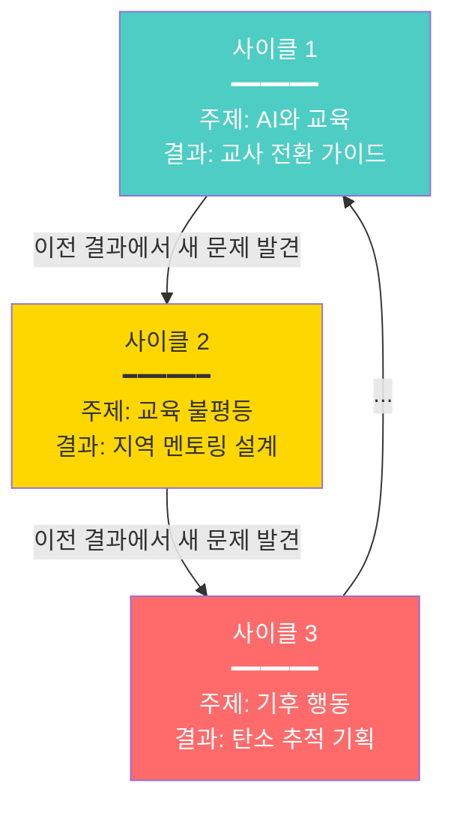

---

## 3. 페르소나와 레벨 시스템

### 3.1 페르소나 맵

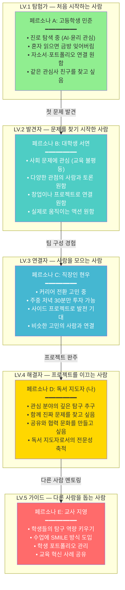

### 3.2 레벨 시스템

| 레벨 | 칭호 | 조건 | 해금 기능 |
|:---:|------|------|----------|
| **LV.1** | 🔭 탐험가 | 회원가입 | 책 읽기, 문제 카드 작성, 게시판 댓글 |
| **LV.2** | 💡 발견자 | 문제 게시글 3개 + 참여 1회 | 팀 참여, 문제 정의서 작성 |
| **LV.3** | 🔗 연결자 | 팀 구성 1회 + 문제 정의 완료 1건 | 팀 생성, 다각도 검토서 작성 |
| **LV.4** | ⚔️ 해결자 | 프로젝트 완주 1건 | 프로젝트 생성, 멘토 신청 |
| **LV.5** | 🛡️ 가이드 | 멘토링 3건 + 프로젝트 3건 | 모임 운영, 템플릿 제작, 커리큘럼 공유 |

### 3.3 XP(경험치) 테이블

| 활동 | XP | 비고 |
|------|:---:|------|
| 책 읽기 완료 | +20 | 읽기 기록 기준 |
| 문제 카드 작성 | +10 | 1일 최대 3장 |
| 문제 게시글 작성 | +30 | 템플릿 활용 시 +10 보너스 |
| 댓글 작성 | +5 | 1일 최대 10개 |
| 공감 받기 (10개당) | +15 | — |
| 팀 참여 | +50 | 참여 확정 시 |
| 문제 정의서 완성 | +100 | 팀 단위 |
| 다각도 검토 완료 (렌즈 1개) | +30 | 6개 모두 시 보너스 +50 |
| 프로젝트 완주 | +200 | — |
| 다른 사람 멘토링 | +80 | 멘티 확인 시 |

---

## 4. 카테고리 체계

### 4.1 인간 내면의 50가지 문제 카테고리

플랫폼의 모든 문제 게시글은 카테고리로 분류됩니다.
누구나 관심 카테고리를 구독하고, 해당 카테고리에서 문제를 올리거나 참여할 수 있습니다.

#### A. 자아와 정체성 (10개)

| # | 카테고리 | 핵심 질문 | 관련 도서 예시 |
|:-:|---------|----------|---------------|
| 1 | **자아 정체성** | 나는 누구인가? | 《데미안》《아직도 가야 할 길》 |
| 2 | **자존감** | 나를 어떻게 받아들이는가? | 《자존감 수업》《미움받을 용기》 |
| 3 | **목적과 의미** | 왜 살아가는가? | 《죽음의 수용소에서》《모리와 함께한 화요일》 |
| 4 | **성장과 변화** | 어떻게 변할 수 있는가? | 《마인드셋》《원씽》 |
| 5 | **고독과 외로움** | 혼자됨은 무엇인가? | 《고독의 위로》《관계의 재발견》 |
| 6 | **완벽주의** | 완벽하지 않아도 되는가? | 《완벽하지 않은 것들에 대한 사랑》 |
| 7 | **진정성** | 진짜 나와 사회적 나는? | 《소유냐 존재냐》《자기 앞의 생》 |
| 8 | **시간과 죽음** | 유한한 시간을 어떻게? | 《모모》《시간의 역사》 |
| 9 | **자유와 책임** | 자유에는 무엇이 따르는가? | 《존재와 무》《1984》 |
| 10 | **영성과 초월** | 보이지 않는 것의 가치는? | 《싯다르타》《영혼의 탐색》 |

#### B. 관계와 사회 (10개)

| # | 카테고리 | 핵심 질문 | 관련 도서 예시 |
|:-:|---------|----------|---------------|
| 11 | **가족 관계** | 가족은 어떤 존재인가? | 《82년생 김지영》《엄마를 부탁해》 |
| 12 | **사랑과 친밀감** | 사랑은 어떻게 하는 것인가? | 《사랑의 기술》《연인》 |
| 13 | **우정과 신뢰** | 진짜 친구란 무엇인가? | 《어린 왕자》《우정에 대하여》 |
| 14 | **소속감** | 어디에 속해야 하는가? | 《이방인》《너의 이름은》 |
| 15 | **소통과 갈등** | 왜 대화가 안 되는가? | 《비폭력 대화》《대화의 심리학》 |
| 16 | **권력과 지배** | 누가 왜 지배하는가? | 《군주론》《왜 세계의 절반은 굶주리는가》 |
| 17 | **용서와 화해** | 용서는 가능한가? | 《용서에 대하여》《화해》 |
| 18 | **공감과 이해** | 타인을 이해할 수 있는가? | 《공감의 시대》《타인의 고통》 |
| 19 | **리더십** | 좋은 리더란 어떤 사람인가? | 《리더의 조건》《팀 오브 팀즈》 |
| 20 | **세대 갈등** | 왜 세대가 충돌하는가? | 《90년생이 온다》《라떼는 말이야》 |

#### C. 감정과 심리 (10개)

| # | 카테고리 | 핵심 질문 | 관련 도서 예시 |
|:-:|---------|----------|---------------|
| 21 | **불안과 두려움** | 무엇이 우리를 불안하게 하는가? | 《불안의 개념》《걱정의 기술》 |
| 22 | **분노와 조절** | 화를 어떻게 다루는가? | 《분노》《감정 조절 수업》 |
| 23 | **슬픔과 상실** | 잃어버림을 어떻게 견디는가? | 《슬픔 이후에 오는 것들》 |
| 24 | **수치심과 죄책감** | 왜 자꾸 자신을 탓하는가? | 《수치심 권하는 사회》 |
| 25 | **중독과 집착** | 멈출 수 없는 것들의 정체는? | 《도파민네이션》《중독의 시대》 |
| 26 | **번아웃과 무기력** | 왜 지쳤는데 쉴 수 없는가? | 《번아웃 사회》《게으름에 대한 찬양》 |
| 27 | **질투와 비교** | 왜 자꾸 비교하는가? | 《지위 불안》《사회적 동물》 |
| 28 | **트라우마** | 과거의 상처는 어떻게 치유하는가? | 《몸은 기억한다》《트라우마 치유》 |
| 29 | **감정 지능** | 감정을 지혜롭게 쓸 수 있는가? | 《EQ》《감정은 어떻게 만들어지는가》 |
| 30 | **행복과 만족** | 행복의 조건은 무엇인가? | 《플로우》《행복의 기원》 |

#### D. 삶의 과제 (10개)

| # | 카테고리 | 핵심 질문 | 관련 도서 예시 |
|:-:|---------|----------|---------------|
| 31 | **진로와 직업** | 무엇을 하며 살 것인가? | 《일의 기쁨과 슬픔》 |
| 32 | **경제와 돈** | 돈은 삶에서 어떤 의미인가? | 《부의 추월차선》《돈의 심리학》 |
| 33 | **교육과 학습** | 어떻게 배워야 하는가? | 《배움의 발견》《핀란드 교육혁명》 |
| 34 | **건강과 몸** | 몸과 마음은 어떻게 연결되는가? | 《아프니까 청춘이다》《우리 몸이 세계라면》 |
| 35 | **창의성** | 새로운 것은 어디서 오는가? | 《창의적 습관》《스틱》 |
| 36 | **결정과 선택** | 어떻게 올바른 선택을 하는가? | 《넛지》《생각에 관한 생각》 |
| 37 | **습관과 의지** | 좋은 습관은 어떻게 만드는가? | 《아주 작은 습관의 힘》《의지력의 재발견》 |
| 38 | **균형** | 일과 삶을 어떻게 조화시키는가? | 《에센셜리즘》《오래된 미래》 |
| 39 | **실패와 회복** | 실패에서 무엇을 배우는가? | 《블랙박스 씽킹》《그릿》 |
| 40 | **노화와 전환** | 인생의 전환점을 어떻게 통과하는가? | 《나이 듦에 대하여》《100세 인생》 |

#### E. 사회와 세계 (10개)

| # | 카테고리 | 핵심 질문 | 관련 도서 예시 |
|:-:|---------|----------|---------------|
| 41 | **정의와 공정** | 무엇이 공정한가? | 《정의란 무엇인가》《공정하다는 착각》 |
| 42 | **다양성과 차별** | 왜 차별이 사라지지 않는가? | 《보이지 않는 여자들》《우리는 차별에 찬성합니다》 |
| 43 | **기술과 인간** | AI 시대에 인간의 가치는? | 《AI 2041》《라이프 3.0》《호모 데우스》 |
| 44 | **환경과 책임** | 지구를 위해 무엇을 할 수 있는가? | 《파란하늘 빨간지구》《침묵의 봄》 |
| 45 | **폭력과 평화** | 폭력은 왜 반복되는가? | 《폭력의 세기》《평화를 위한 불복종》 |
| 46 | **미디어와 진실** | 무엇이 진실인가? | 《팩트풀니스》《뉴스의 시대》 |
| 47 | **소비와 욕망** | 왜 끝없이 소비하는가? | 《소비사회》《나는 왜 이것을 살까》 |
| 48 | **문화와 전통** | 전통은 지켜야 하는가? | 《총균쇠》《사피엔스》 |
| 49 | **시민 참여** | 개인이 세상을 바꿀 수 있는가? | 《왜 세계의 절반은 굶주리는가》 |
| 50 | **글로벌 연결** | 세계 시민이란 무엇인가? | 《21세기를 위한 21가지 제언》 |

### 4.2 기타 카테고리 (확장)

| 대분류 | 하위 카테고리 | 설명 |
|--------|-------------|------|
| **산업·비즈니스** | 스타트업 / 경영 / 마케팅 / 조직 문화 / 혁신 | 비즈니스 세계의 문제 |
| **과학·기술** | 생명과학 / 우주 / 에너지 / 데이터 / 로봇 | 과학 기술의 문제 |
| **예술·문화** | 문학 / 음악 / 영화 / 미술 / 공연 | 예술과 사회의 접점 |
| **역사·철학** | 고대사 / 근현대사 / 서양철학 / 동양철학 / 사상사 | 역사적 교훈과 철학적 사유 |
| **교육·학습** | 교육 혁신 / 학습법 / 교사 / 평가 / EdTech | 교육 분야의 문제 |
| **건강·의료** | 의료 시스템 / 정신건강 / 식품 / 운동 / 의료 윤리 | 건강 분야의 문제 |

### 4.3 카테고리 화면

```
┌──────────────────────────────────────────────────┐
│  🏷️ 카테고리 탐색                                  │
│                                                    │
│  🔥 인기 카테고리          📌 내 구독 카테고리       │
│                                                    │
│  ┌──────────────────────────────────────────┐     │
│  │ 인간 내면의 50가지 문제                      │     │
│  │                                              │     │
│  │ A. 자아와 정체성                              │     │
│  │ ┌────┐ ┌────┐ ┌────┐ ┌────┐ ┌────┐       │     │
│  │ │ 자아 │ │자존감│ │목적 │ │성장 │ │고독 │       │     │
│  │ │ 32  │ │ 28 │ │ 45 │ │ 19 │ │ 23 │       │     │
│  │ │ 문제 │ │ 문제│ │ 문제│ │ 문제│ │ 문제│       │     │
│  │ └────┘ └────┘ └────┘ └────┘ └────┘       │     │
│  │                                              │     │
│  │ B. 관계와 사회                                │     │
│  │ ┌────┐ ┌────┐ ┌────┐ ┌────┐ ┌────┐       │     │
│  │ │가족 │ │사랑 │ │우정 │ │소속 │ │소통 │       │     │
│  │ │ 18  │ │ 31 │ │ 15 │ │ 22 │ │ 37 │       │     │
│  │ │ 문제 │ │ 문제│ │ 문제│ │ 문제│ │ 문제│       │     │
│  │ └────┘ └────┘ └────┘ └────┘ └────┘       │     │
│  │                                              │     │
│  │ C. 감정과 심리                                │     │
│  │ ┌────┐ ┌────┐ ┌────┐ ┌────┐ ┌────┐       │     │
│  │ │불안 │ │분노 │ │슬픔 │ │수치 │ │중독 │       │     │
│  │ │ 41  │ │ 14 │ │ 26 │ │ 9  │ │ 33 │       │     │
│  │ │ 문제 │ │ 문제│ │ 문제│ │ 문제│ │ 문제│       │     │
│  │ └────┘ └────┘ └────┘ └────┘ └────┘       │     │
│  │                                              │     │
│  │ [전체 보기 →]                                 │     │
│  └──────────────────────────────────────────┘     │
│                                                    │
│  ┌──────────────────────────────────────────┐     │
│  │ 기타 카테고리                                │     │
│  │                                              │     │
│  │ 산업·비즈니스  과학·기술  예술·문화           │     │
│  │ 역사·철학      교육·학습  건강·의료           │     │
│  └──────────────────────────────────────────┘     │
│                                                    │
│  💡 각 카테고리의 숫자 = 현재 올라온 문제 수         │
│     구독하면 새 문제가 올라올 때 알림을 받습니다       │
└──────────────────────────────────────────────────┘
```

---

## 5. STEP 1: 독서·발견

### 5.1 화면 흐름

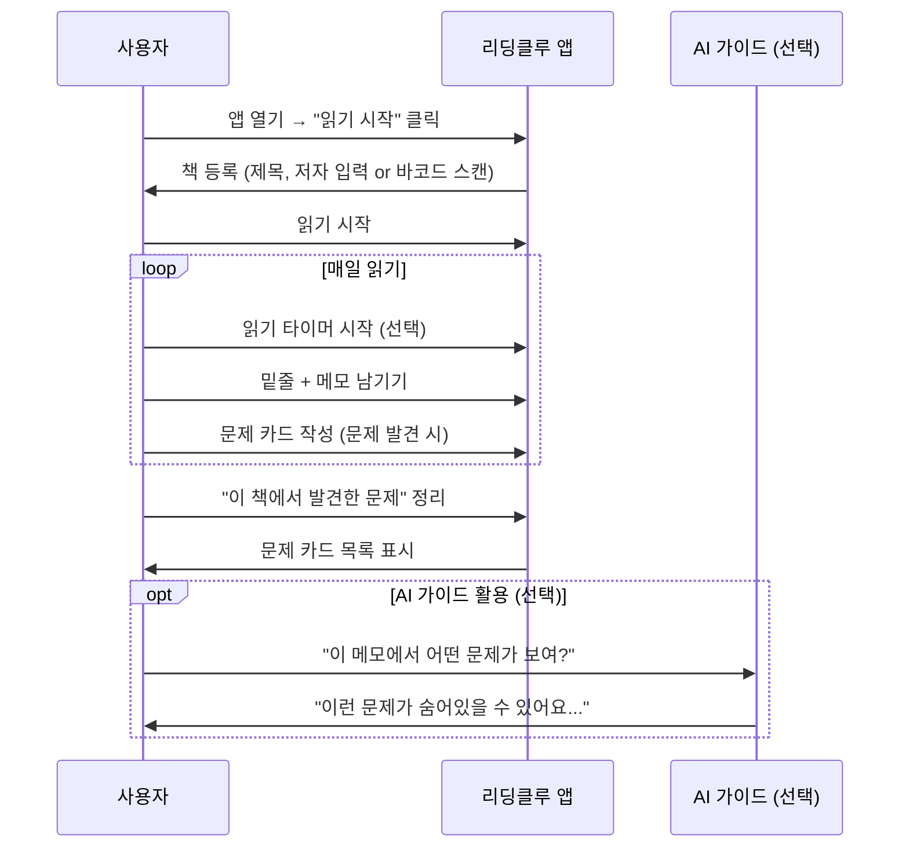

### 5.2 독서 화면

```
┌──────────────────────────────────────────────────┐
│  📖 읽기 중: 《AI 2041》 — 리카이푸               │
│  ━━━━━━━━━━━━━━━━━━━━━━━━━━━━━━━━━━━━━━━━━━━━━━ │
│                                                    │
│  📊 진행률: 60% (180/300p)                         │
│  ⏱️ 오늘 읽기: 32분                               │
│  📝 메모: 7개  💡 문제 카드: 2개                    │
│                                                    │
│  ━━━━━━━━━━━━━━━━━━━━━━━━━━━━━━━━━━━━━━━━━━━━━━ │
│                                                    │
│  📝 최근 메모                                      │
│  ┌────────────────────────────────────────────┐   │
│  │ p.147 밑줄                                    │   │
│  │ "AI는 학생의 미세 표정 변화를 감지하여          │   │
│  │  수업 난이도를 실시간으로 조절한다"              │   │
│  │                                                │   │
│  │ ✏️ 내 메모:                                   │   │
│  │ "이게 가능하면 교사는 뭘 해야 하지?             │   │
│  │  근데 진짜 공감이 되는 건가?"                   │   │
│  │                                                │   │
│  │ [💡 문제 카드로 전환]  [🏷️ 태그 추가]          │   │
│  └────────────────────────────────────────────┘   │
│                                                    │
│  ┌────────────────────────────────────────────┐   │
│  │ p.203 밑줄                                    │   │
│  │ "중국의 한 학교에서 AI가 학생 성적을              │   │
│  │  30% 향상시켰지만, 교사 이직률은 2배 증가"       │   │
│  │                                                │   │
│  │ ✏️ 내 메모:                                   │   │
│  │ "AI가 성적은 올리지만 교사가 떠난다면           │   │
│  │  이게 정말 성공인가?"                           │   │
│  │                                                │   │
│  │ [💡 문제 카드로 전환]  [🏷️ 태그 추가]          │   │
│  └────────────────────────────────────────────┘   │
│                                                    │
│  [읽기 타이머 시작]  [메모 추가]  [문제 카드 보기]   │
└──────────────────────────────────────────────────┘
```

### 5.3 문제 카드 작성

```
┌──────────────────────────────────────────────────┐
│  💡 문제 카드 작성                                  │
│                                                    │
│  📖 책: 《AI 2041》 — 리카이푸                      │
│  📄 관련 페이지: p.147, p.203                      │
│                                                    │
│  ━━━━━━━━━━━━━━━━━━━━━━━━━━━━━━━━━━━━━━━━━━━━━━ │
│                                                    │
│  ❓ 발견한 문제 (한 문장):                          │
│  ┌────────────────────────────────────────────┐   │
│  │ "AI 교육 도구가 빠르게 도입되고 있지만,         │   │
│  │  교사들은 자신의 역할 변화에 준비되지 않았다."   │   │
│  └────────────────────────────────────────────┘   │
│                                                    │
│  📌 왜 이것이 문제인가?:                            │
│  ┌────────────────────────────────────────────┐   │
│  │ "AI가 성적을 올려도 교사가 떠나면,               │   │
│  │  학생은 기술은 받지만 인간적 성장은 놓친다."      │   │
│  └────────────────────────────────────────────┘   │
│                                                    │
│  🏷️ 카테고리 (선택):                               │
│  ☑ #43 기술과 인간  ☑ #33 교육과 학습               │
│  ○ #31 진로와 직업  ○ #41 정의와 공정               │
│                                                    │
│  📎 관련 문장:                                      │
│  "p.147 — AI는 학생의 미세 표정 변화를..."          │
│  "p.203 — 교사 이직률은 2배 증가..."               │
│                                                    │
│  [저장하기]  [게시판에 바로 올리기 →]                │
└──────────────────────────────────────────────────┘
```

### 5.4 독서 → 문제 발견 가이드 (템플릿)

```
┌──────────────────────────────────────────────────┐
│  📋 문제 발견 가이드                                │
│                                                    │
│  📖 책을 읽을 때 이 질문을 품고 읽으세요:            │
│                                                    │
│  1️⃣ 이 책이 다루는 현실 문제는 무엇인가?            │
│  2️⃣ 그 문제는 지금 나의 주변에도 존재하는가?        │
│  3️⃣ 이 문제가 해결되지 않으면                      │
│     누가 어떤 피해를 받는가?                        │
│  4️⃣ 저자는 어떤 해결 방향을 제시하는가?             │
│  5️⃣ 나라면 어떻게 접근할 것인가?                    │
│                                                    │
│  ━━━━━━━━━━━━━━━━━━━━━━━━━━━━━━━━━━━━━━━━━━━━━━ │
│                                                    │
│  💡 문제를 발견하면 이렇게 기록하세요:               │
│                                                    │
│  • 어떤 문제인가? (한 문장)                         │
│  • 어디서 발견했나? (책 이름 + 페이지)               │
│  • 왜 중요한가? (나와의 연결)                       │
│  • 다른 책에서도 비슷한 이야기가 있었나?              │
│  • 누구와 함께 탐구하고 싶은가?                     │
│                                                    │
│  💡 팁: 한 책에서 여러 문제를 발견해도 좋습니다.     │
│  💡 팁: 문제가 아닌 "질문"으로 시작해도 좋습니다.     │
└──────────────────────────────────────────────────┘
```

---

## 6. STEP 2: 공유·모이기

### 6.1 화면 흐름

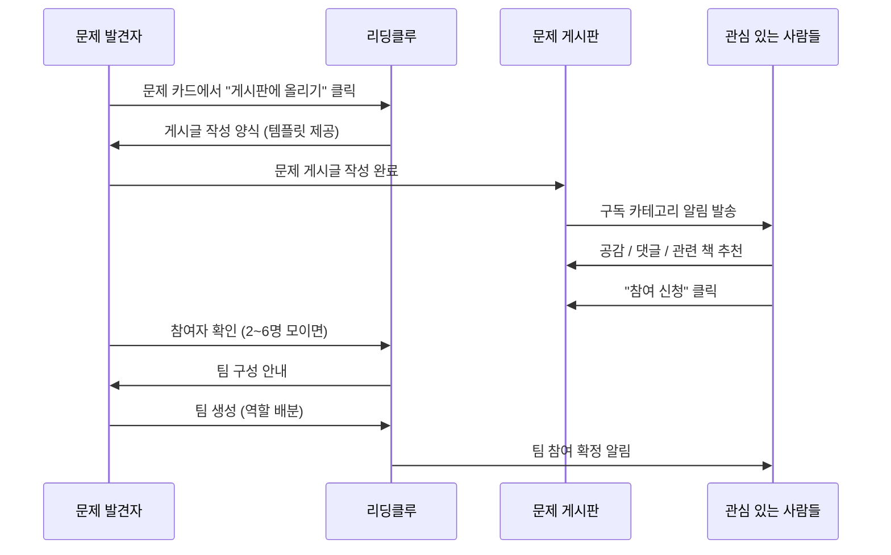

### 6.2 문제 게시판 — 피드

```
┌──────────────────────────────────────────────────┐
│  📋 문제 게시판                                    │
│                                                    │
│  🏷️ 전체 ── 내 구독 ── 🔥 인기 ── 👥 모집중       │
│                                                    │
│  🔍 검색: [                              ] [검색]  │
│                                                    │
│  ━━━━━━━━━━━━━━━━━━━━━━━━━━━━━━━━━━━━━━━━━━━━━━ │
│                                                    │
│  ┌────────────────────────────────────────────┐   │
│  │ 💡 #43 기술과 인간 · #33 교육과 학습          │   │
│  │                                                │   │
│  │ "AI 교육 도구가 도입되었지만,                   │   │
│  │  교사들은 역할 변화에 준비되지 않았다"           │   │
│  │                                                │   │
│  │ 📖 《AI 2041》 — 민준 · LV.2 발견자            │   │
│  │ 📚 함께 읽으면: 《핀란드 교육혁명》《라이프 3.0》 │   │
│  │                                                │   │
│  │ 👍 12  💬 8  👥 3/5명 모집중                   │   │
│  │                                                │   │
│  │ [참여 신청]  [댓글 보기]  [공유]                │   │
│  └────────────────────────────────────────────┘   │
│                                                    │
│  ┌────────────────────────────────────────────┐   │
│  │ 💡 #26 번아웃과 무기력 · #38 균형              │   │
│  │                                                │   │
│  │ "MZ세대의 번아웃은 개인 문제가 아니라            │   │
│  │  구조적 문제다"                                 │   │
│  │                                                │   │
│  │ 📖 《번아웃 사회》 — 서연 · LV.3 연결자         │   │
│  │ 📚 함께 읽으면: 《게으름에 대한 찬양》           │   │
│  │                                                │   │
│  │ 👍 23  💬 15  👥 4/6명 모집중                  │   │
│  │                                                │   │
│  │ [참여 신청]  [댓글 보기]  [공유]                │   │
│  └────────────────────────────────────────────┘   │
│                                                    │
│  ┌────────────────────────────────────────────┐   │
│  │ 💡 #41 정의와 공정 · #42 다양성과 차별         │   │
│  │                                                │   │
│  │ "능력주의는 정말 공정한가?                      │   │
│  │  출발선이 다른 경주를 공정하다고 말할 수 있나?"   │   │
│  │                                                │   │
│  │ 📖 《공정하다는 착각》 — 지은 · LV.1 탐험가     │   │
│  │ ✅ 문제 정의 완료 (프로젝트 없이 종결)           │   │
│  │                                                │   │
│  │ 👍 45  💬 32  📝 문제 정의서 보기               │   │
│  │                                                │   │
│  │ [정의서 보기]  [댓글 보기]  [공유]              │   │
│  └────────────────────────────────────────────┘   │
│                                                    │
│  [문제 올리기 ✏️]                                   │
└──────────────────────────────────────────────────┘
```

### 6.3 문제 게시글 상세

```
┌──────────────────────────────────────────────────┐
│  💡 문제 게시글 상세                                │
│                                                    │
│  🏷️ #43 기술과 인간 · #33 교육과 학습              │
│  👤 민준 · LV.2 발견자 · 2026.07.28               │
│                                                    │
│  ━━━━━━━━━━━━━━━━━━━━━━━━━━━━━━━━━━━━━━━━━━━━━━ │
│                                                    │
│  📌 발견한 문제:                                    │
│  "AI 교육 도구가 빠르게 도입되고 있지만,             │
│   교사들은 자신의 역할이 어떻게 변해야 하는지         │
│   안내받지 못하고 있다.                             │
│   AI가 성적을 올려도 교사가 떠나면,                  │
│   학생은 기술적 교육은 받지만                       │
│   인간적 성장의 기회를 놓친다."                     │
│                                                    │
│  📖 관련 도서:                                      │
│  ┌────────────────────────────────────────────┐   │
│  │ 📕 《AI 2041》 — 리카이푸                       │   │
│  │ p.147: "AI는 학생의 미세 표정 변화를 감지..."    │   │
│  │ p.203: "AI가 성적 30% 향상, 교사 이직 2배"     │   │
│  └────────────────────────────────────────────┘   │
│                                                    │
│  📚 함께 읽으면 좋을 책 (병렬 독서 추천):            │
│  • 《핀란드 교육혁명》 — 교사 역할 전환 사례          │
│  • 《라이프 3.0》 — AI의 공감 한계                  │
│  • 《호모 데우스》 — 데이터 교육의 미래              │
│                                                    │
│  ❓ 탐구하고 싶은 질문:                             │
│  "AI 시대에 교사는 무엇을 해야 하고,                │
│   무엇을 하지 말아야 하는가?"                       │
│                                                    │
│  ━━━━━━━━━━━━━━━━━━━━━━━━━━━━━━━━━━━━━━━━━━━━━━ │
│                                                    │
│  👍 12 공감  💬 8 댓글                              │
│                                                    │
│  💬 댓글:                                          │
│  ┌────────────────────────────────────────────┐   │
│  │ 서연 · LV.3 · 《핀란드 교육혁명》 읽는 중       │   │
│  │ "핀란드에서는 교사를 '코치'로 재정의했어요.       │   │
│  │  AI가 지식 전달을 맡으면 이게 가능하다는          │   │
│  │  이야기가 나와요. 비교해보면 좋겠습니다."         │   │
│  │  👍 4  💬 답글 2                               │   │
│  └────────────────────────────────────────────┘   │
│  ┌────────────────────────────────────────────┐   │
│  │ 현우 · LV.2 · 《라이프 3.0》 읽는 중            │   │
│  │ "《라이프 3.0》에서는 AI가 감정을 '읽는 척'할    │   │
│  │  뿐 진짜 공감은 못한다고 해요.                   │   │
│  │  여기서 교사의 진짜 역할이 나오지 않을까요?"      │   │
│  │  👍 3  💬 답글 1                               │   │
│  └────────────────────────────────────────────┘   │
│                                                    │
│  ━━━━━━━━━━━━━━━━━━━━━━━━━━━━━━━━━━━━━━━━━━━━━━ │
│                                                    │
│  👥 팀 모집 (3/5명)                                │
│  ✅ 민준 (리더) — 《AI 2041》                      │
│  ✅ 서연 — 《핀란드 교육혁명》                       │
│  ✅ 현우 — 《라이프 3.0》                           │
│  ⬜ 모집중 — 《호모 데우스》 읽을 분                 │
│  ⬜ 모집중 — 관련 경험 있는 분                      │
│                                                    │
│  [참여 신청하기]  [팀 구성하기]  [공유하기]           │
└──────────────────────────────────────────────────┘
```

### 6.4 팀 구성 화면

```
┌──────────────────────────────────────────────────┐
│  👥 팀 구성                                        │
│                                                    │
│  📌 문제: "AI 시대 교사 역할 전환의 부재"           │
│  📖 병렬 독서: 각자 다른 책을 읽고 관점을 모읍니다   │
│                                                    │
│  ━━━━━━━━━━━━━━━━━━━━━━━━━━━━━━━━━━━━━━━━━━━━━━ │
│                                                    │
│  👤 팀원 (4명 / 최대 6명)                          │
│                                                    │
│  ┌────────────────────────────────────────────┐   │
│  │ ⭐ 민준 (리더) · LV.2                         │   │
│  │ 📖 《AI 2041》 · 60% 읽는 중                  │   │
│  │ 🎯 역할: 문제 정의 리드                        │   │
│  └────────────────────────────────────────────┘   │
│  ┌────────────────────────────────────────────┐   │
│  │ 서연 · LV.3                                    │   │
│  │ 📖 《핀란드 교육혁명》 · 75% 읽는 중             │   │
│  │ 🎯 역할: 사례 조사 (해외)                      │   │
│  └────────────────────────────────────────────┘   │
│  ┌────────────────────────────────────────────┐   │
│  │ 현우 · LV.2                                    │   │
│  │ 📖 《라이프 3.0》 · 45% 읽는 중                 │   │
│  │ 🎯 역할: 기술적 관점 분석                      │   │
│  └────────────────────────────────────────────┘   │
│  ┌────────────────────────────────────────────┐   │
│  │ 지은 · LV.1                                    │   │
│  │ 📖 《호모 데우스》 · 30% 읽는 중                 │   │
│  │ 🎯 역할: 철학적·윤리적 관점                     │   │
│  └────────────────────────────────────────────┘   │
│                                                    │
│  📋 팀 규칙 (자동 설정, 수정 가능)                   │
│  • 주 1회 이상 게시판에 관점 공유                    │
│  • 2주 내 문제 정의서 완성 목표                      │
│  • 비활성 2주 시 자동 안내 알림                      │
│                                                    │
│  [팀 시작하기]  [규칙 수정]                          │
└──────────────────────────────────────────────────┘
```

### 6.5 참여 방식의 스펙트럼

```
가볍게 ─────────────────────────────────── 깊이 있게

👍 공감     💬 댓글      📚 책 추천    👥 팀 참여    🚀 프로젝트
(1초)      (1분)       (3분)        (지속적)     공동 실행
XP +1      XP +5       XP +10       XP +50      XP +200

 │          │           │            │            │
 └──────────┴───────────┴────────────┴────────────┘
        어떤 수준의 참여든 환영합니다
```

---

## 7. STEP 3: 초점화·탐구

### 7.1 화면 흐름

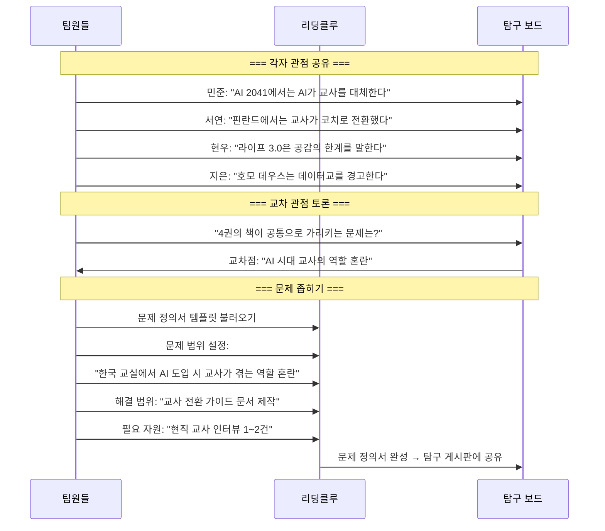

### 7.2 탐구 보드

```
┌──────────────────────────────────────────────────┐
│  🔍 탐구 보드 — "AI 시대 교사 역할 전환"            │
│  팀: 민준+서연+현우+지은 · STEP 3 진행 중           │
│                                                    │
│  ━━━━━━━━━━━━━━━━━━━━━━━━━━━━━━━━━━━━━━━━━━━━━━ │
│                                                    │
│  📖 병렬 독서 관점 비교                              │
│                                                    │
│  ┌──────────┬──────────┬──────────┬──────────┐  │
│  │ 민준      │ 서연      │ 현우      │ 지은      │  │
│  │ AI 2041   │ 핀란드    │ 라이프3.0 │ 호모데우스 │  │
│  ├──────────┼──────────┼──────────┼──────────┤  │
│  │ AI가 교사 │ 교사가    │ AI 공감은 │ 데이터가  │  │
│  │ 를 대체할 │ 코치로    │ 시뮬레이  │ 교육을    │  │
│  │ 수 있다   │ 전환 가능 │ 션일 뿐   │ 지배할 수 │  │
│  │           │           │           │ 있다      │  │
│  ├──────────┼──────────┼──────────┼──────────┤  │
│  │ → 대체   │ → 전환   │ → 한계   │ → 경고   │  │
│  └──────────┴──────────┴──────────┴──────────┘  │
│                                                    │
│  🎯 교차점: "AI 시대 교사의 역할이 바뀌어야 한다"    │
│     하지만 어떻게? → 각 책마다 다른 방향을 가리킨다   │
│                                                    │
│  ━━━━━━━━━━━━━━━━━━━━━━━━━━━━━━━━━━━━━━━━━━━━━━ │
│                                                    │
│  📌 문제 좁히기 과정                                │
│                                                    │
│  넓은 문제: "AI 시대 교육의 미래"                    │
│     ↓ 좁히기                                       │
│  중간 문제: "AI 시대 교사의 역할 변화"               │
│     ↓ 좁히기                                       │
│  좁은 문제: "한국 교실에서 AI 도입 시                │
│             교사가 겪는 역할 혼란과                  │
│             전환 프로그램의 부재"                    │
│     ↓ 범위 설정                                    │
│  우리의 해결 범위: "교사 전환 가이드 제작"            │
│                                                    │
│  [문제 정의서 작성하기]  [팀 토론 시작]               │
└──────────────────────────────────────────────────┘
```

### 7.3 문제 정의서 (템플릿)

```
┌──────────────────────────────────────────────────┐
│  📋 문제 정의서                                     │
│                                                    │
│  ━━━ 기본 정보 ━━━                                 │
│  팀: 민준+서연+현우+지은                            │
│  카테고리: #43 기술과 인간 · #33 교육과 학습          │
│  작성일: 2026.08.10                                │
│                                                    │
│  ━━━ 문제 ━━━                                      │
│  📌 문제 한 줄:                                     │
│  "한국 교실에 AI 교육 도구가 도입되었지만,           │
│   교사의 역할 전환 안내 프로그램이 부재하다"          │
│                                                    │
│  📖 근거 (책에서 발견한 것):                        │
│  1. 《AI 2041》: AI가 성적은 올렸지만               │
│     교사 이직률이 2배 증가 (p.203)                  │
│  2. 《핀란드 교육혁명》: 핀란드는 교사를             │
│     코치로 재정의하여 성공 (p.89)                   │
│  3. 《라이프 3.0》: AI의 공감은 시뮬레이션이라       │
│     교사의 감정적 역할은 대체 불가 (p.156)          │
│  4. 《호모 데우스》: 데이터 최적화만 추구하면        │
│     인간적 교육의 본질을 잃을 수 있음 (p.312)       │
│                                                    │
│  ━━━ 범위 ━━━                                      │
│  🎯 해결 범위 (우리가 할 수 있는 것):                │
│  • 한국형 교사 역할 전환 가이드 문서 제작             │
│  • 3개국 사례 비교 (핀란드·미국·중국)                │
│  • 교사 역량 체크리스트 설계                        │
│                                                    │
│  📋 필요 자원 (추가로 확보해야 할 것):               │
│  • 현직 교사 인터뷰 1~2건                           │
│  • 교육부 AI 교육 가이드라인 자료                   │
│  • EdTech 기업 현황 데이터                          │
│                                                    │
│  ━━━ 다음 단계 ━━━                                 │
│  ○ 여기서 끝내기 (문제 정의서만 공유)                │
│  ● STEP 4: 다각도 검토로 진행                      │
│  ○ STEP 5: 바로 프로젝트로 진행                     │
│                                                    │
│  [저장]  [탐구 게시판에 공유]  [다각도 검토 시작 →]  │
└──────────────────────────────────────────────────┘
```

### 7.4 질문 수렴 과정 (SMILE 핵심)

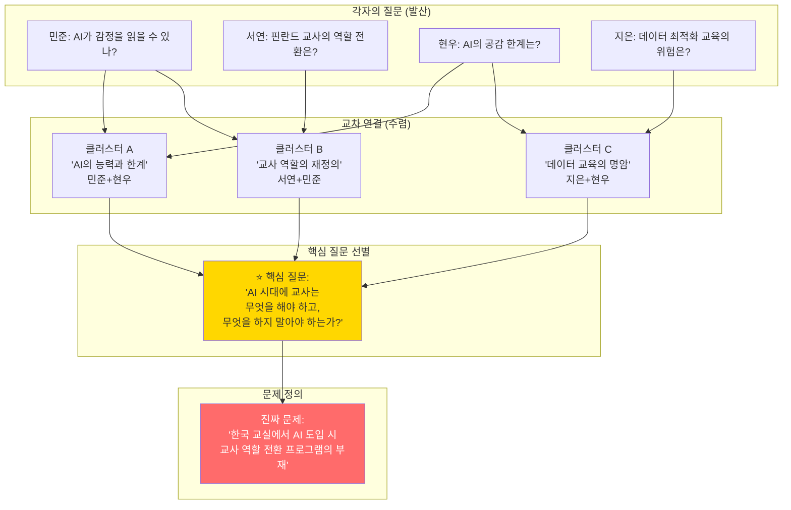

---

## 8. STEP 4: 다각도 검토

### 8.1 6가지 검토 렌즈

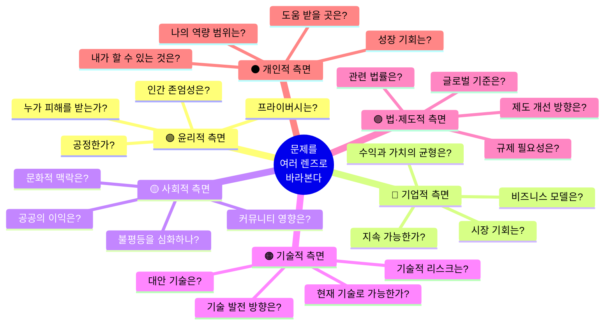

### 8.2 다각도 검토 화면

```
┌──────────────────────────────────────────────────┐
│  🔭 다각도 검토 — "AI 시대 교사 역할 전환"          │
│  팀: 민준+서연+현우+지은 · STEP 4                  │
│                                                    │
│  📌 문제: "한국 교실 AI 도입 시 교사 역할 전환       │
│          프로그램의 부재"                           │
│                                                    │
│  ━━━━━━━━━━━━━━━━━━━━━━━━━━━━━━━━━━━━━━━━━━━━━━ │
│                                                    │
│  📊 검토 진행 현황                                  │
│  ┌────┐ ┌────┐ ┌────┐ ┌────┐ ┌────┐ ┌────┐   │
│  │ 🟢 │ │ 🔵 │ │ 🟡 │ │ 🟠 │ │ 🟣 │ │ ⚫ │   │
│  │윤리 │ │기업 │ │사회 │ │기술 │ │제도 │ │개인 │   │
│  │ ✅  │ │ 🔄  │ │ ✅  │ │ ⬜  │ │ ⬜  │ │ ✅  │   │
│  │완료 │ │진행 │ │완료 │ │예정 │ │예정 │ │완료 │   │
│  └────┘ └────┘ └────┘ └────┘ └────┘ └────┘   │
│                                                    │
│  ━━━━━━━━━━━━━━━━━━━━━━━━━━━━━━━━━━━━━━━━━━━━━━ │
│                                                    │
│  🟢 윤리적 측면 (담당: 지은) ✅ 완료                │
│  ┌────────────────────────────────────────────┐   │
│  │ 1. 학생 데이터 활용 시 동의와 투명성 필요        │   │
│  │    — 학부모 동의 절차가 형식적인 경우 많음        │   │
│  │                                                │   │
│  │ 2. AI 판단의 편향이 교육 불평등을 심화할 위험     │   │
│  │    — 학습 데이터 자체가 편향될 수 있음            │   │
│  │                                                │   │
│  │ 3. 교사의 전문성을 기계가 평가하는 윤리 문제      │   │
│  │    — 교사 역할을 AI 보조로 축소하면 존엄성 훼손   │   │
│  │                                                │   │
│  │ 📖 근거: 《호모 데우스》 p.312, p.340            │   │
│  └────────────────────────────────────────────┘   │
│                                                    │
│  🟡 사회적 측면 (담당: 서연) ✅ 완료                │
│  ┌────────────────────────────────────────────┐   │
│  │ 1. 디지털 격차가 교육 격차로 전이               │   │
│  │    — 농어촌 학교의 AI 인프라 부족 심각           │   │
│  │                                                │   │
│  │ 2. 교사 역할 혼란이 이직으로 이어짐              │   │
│  │    — 중소 도시 교사 부족 가속화                  │   │
│  │                                                │   │
│  │ 3. 학생-교사 관계의 질적 변화                    │   │
│  │    — AI가 지식 전달하면 관계 맺기가 줄어듦        │   │
│  │                                                │   │
│  │ 📖 근거: 《핀란드 교육혁명》 p.89, p.134        │   │
│  └────────────────────────────────────────────┘   │
│                                                    │
│  🔵 기업적 측면 (담당: 현우) 🔄 진행 중             │
│  ┌────────────────────────────────────────────┐   │
│  │ 1. EdTech 기업의 교사 교육 투자 인센티브 부족    │   │
│  │    — (작성 중...)                               │   │
│  └────────────────────────────────────────────┘   │
│                                                    │
│  ⚫ 개인적 측면 (담당: 민준) ✅ 완료                │
│  ┌────────────────────────────────────────────┐   │
│  │ 🟢 할 수 있는 것:                               │   │
│  │ • 교사 전환 가이드 문서 제작                     │   │
│  │ • 3개국 사례 비교 보고서                        │   │
│  │ • 교사 역량 체크리스트 설계                     │   │
│  │                                                │   │
│  │ 🟡 도움이 필요한 것:                            │   │
│  │ • 현직 교사 인터뷰 (1~2건)                     │   │
│  │ • 교육청 데이터 접근                            │   │
│  │                                                │   │
│  │ 🔴 할 수 없는 것 (추후 과제):                    │   │
│  │ • 정책 제언 → 별도 프로젝트로                   │   │
│  │ • 대규모 설문 조사                              │   │
│  └────────────────────────────────────────────┘   │
│                                                    │
│  [다각도 검토서 완성하기]  [STEP 5 진행 →]          │
└──────────────────────────────────────────────────┘
```

### 8.3 다각도 검토서 요약 (자동 생성)

```
┌──────────────────────────────────────────────────┐
│  📋 다각도 검토 요약서                              │
│                                                    │
│  📌 문제: "AI 시대 교사 역할 전환 프로그램의 부재"  │
│                                                    │
│  ┌──────────────────────────────────────────┐     │
│  │ 렌즈       │ 핵심 발견                     │     │
│  ├──────────────────────────────────────────┤     │
│  │ 🟢 윤리    │ 학생 데이터 동의 형식적,       │     │
│  │            │ AI 편향이 불평등 심화 위험     │     │
│  ├──────────────────────────────────────────┤     │
│  │ 🔵 기업    │ EdTech의 교사 교육 투자 부족,  │     │
│  │            │ B2G 사업 모델 가능성           │     │
│  ├──────────────────────────────────────────┤     │
│  │ 🟡 사회    │ 디지털 격차→교육 격차,         │     │
│  │            │ 교사 이직으로 지방 교사 부족    │     │
│  ├──────────────────────────────────────────┤     │
│  │ 🟠 기술    │ 감정 인식 정확도 70~80%,       │     │
│  │            │ 5년 내 크게 개선 전망          │     │
│  ├──────────────────────────────────────────┤     │
│  │ 🟣 제도    │ 교원 연수에 AI 과정 부재,      │     │
│  │            │ 교육부 가이드라인 미비          │     │
│  ├──────────────────────────────────────────┤     │
│  │ ⚫ 개인    │ 가이드 문서 제작 가능,          │     │
│  │            │ 교사 인터뷰 1~2건 필요         │     │
│  └──────────────────────────────────────────┘     │
│                                                    │
│  💡 종합 판단:                                      │
│  "교사 전환 가이드 문서 + 교육청 정책 제언 초안"     │
│  으로 프로젝트 범위를 설정한다.                      │
│                                                    │
│  [탐구 게시판에 공유]  [프로젝트로 전환 →]           │
└──────────────────────────────────────────────────┘
```

---

## 9. STEP 5: 프로젝트

### 9.1 프로젝트 유형

| 유형 | 설명 | 인원 | 기간 | 난이도 | 결과물 |
|------|------|:---:|:---:|:---:|------|
| **에세이** | 개인 관점 정리 + 문제 분석 | 1명 | 1~2주 | ⭐⭐ | 에세이 (3~5페이지) |
| **문제 정의서** | 문제 구조화 + 다각도 분석 | 1~2명 | 1~2주 | ⭐⭐ | 정의서 (5~10페이지) |
| **리서치 리포트** | 현황 조사 + 사례 분석 | 1~3명 | 2~3주 | ⭐⭐⭐ | 보고서 (10~20페이지) |
| **솔루션 제안서** | 해결 방안 설계 + 자원 정의 | 2~4명 | 3~4주 | ⭐⭐⭐ | 제안서 + 발표 |
| **시나리오 구상** | 미래 시나리오 + 다각도 분석 | 2~4명 | 3~4주 | ⭐⭐⭐⭐ | 시나리오 문서 |
| **프로토타입** | 실제 작동하는 시제품/MVP | 3~6명 | 4~8주 | ⭐⭐⭐⭐⭐ | MVP + 시연 |

### 9.2 프로젝트 보드

```
┌──────────────────────────────────────────────────┐
│  🚀 프로젝트 보드                                  │
│  "AI 시대 교사 전환 가이드" · 유형: 솔루션 제안서    │
│  팀: 민준+서연+현우+지은 · STEP 5                  │
│                                                    │
│  ━━━━━━━━━━━━━━━━━━━━━━━━━━━━━━━━━━━━━━━━━━━━━━ │
│                                                    │
│  📋 문제 정의                                       │
│  "한국 교실에 AI 교육 도구가 빠르게 도입되고 있지만, │
│   교사들은 자신의 역할이 어떻게 변해야 하는지         │
│   안내받지 못하고 있다."                            │
│                                                    │
│  📌 해결 범위                                       │
│  ✅ 할 수 있는 것: 교사 전환 가이드 문서              │
│  📋 추가 필요: 현직 교사 인터뷰, 교육청 데이터       │
│                                                    │
│  ━━━━━━━━━━━━━━━━━━━━━━━━━━━━━━━━━━━━━━━━━━━━━━ │
│                                                    │
│  📌 작업 현황 (칸반 보드)                           │
│                                                    │
│  할 일          진행 중         완료                 │
│  ┌─────┐      ┌─────┐       ┌─────┐              │
│  │교육청│      │해결안│       │문제  │              │
│  │데이터│      │초안  │       │정의서│              │
│  │수집  │      │작성  │       │     │              │
│  └─────┘      └─────┘       └─────┘              │
│  ┌─────┐      ┌─────┐       ┌─────┐              │
│  │발표 │      │교사 │       │3개국│              │
│  │준비 │      │인터뷰│       │사례 │              │
│  │     │      │     │       │조사 │              │
│  └─────┘      └─────┘       └─────┘              │
│                              ┌─────┐              │
│                              │다각도│              │
│                              │검토 │              │
│                              └─────┘              │
│                                                    │
│  ━━━━━━━━━━━━━━━━━━━━━━━━━━━━━━━━━━━━━━━━━━━━━━ │
│                                                    │
│  👥 역할 분담                                       │
│  ┌──────────────────────────────────────────┐     │
│  │ 민준 (리더): 해결안 구조 설계 + 통합         │     │
│  │ 서연: 3개국 사례 비교 보고서                 │     │
│  │ 현우: 기술적 분석 + EdTech 현황              │     │
│  │ 지은: 윤리적 검토 + 교사 인터뷰 섭외         │     │
│  └──────────────────────────────────────────┘     │
│                                                    │
│  💬 팀 채팅                                        │
│  서연: "핀란드 사례 정리 끝! 문서 올렸어"            │
│  민준: "좋아! 미국 사례랑 합쳐서 비교표 만들자"      │
│  현우: "교육부 AI 가이드라인 찾았는데 2023년 거다"   │
│                                                    │
│  [제안서 편집]  [다각도 검토 보기]  [발표 준비]      │
└──────────────────────────────────────────────────┘
```

### 9.3 프로젝트 결과물 공유

```
┌──────────────────────────────────────────────────┐
│  📋 프로젝트 게시판 — 완료된 프로젝트               │
│                                                    │
│  ┌────────────────────────────────────────────┐   │
│  │ 🏆 "AI 시대 교사 전환 가이드"                   │   │
│  │                                                │   │
│  │ 팀: 민준+서연+현우+지은                        │   │
│  │ 유형: 솔루션 제안서 · 기간: 6주                 │   │
│  │ 카테고리: #43 기술과 인간 · #33 교육과 학습     │   │
│  │                                                │   │
│  │ 📌 문제: "AI 도입 시 교사 역할 전환 부재"       │   │
│  │ 📖 병렬 독서: AI 2041, 핀란드 교육혁명,         │   │
│  │              라이프 3.0, 호모 데우스             │   │
│  │                                                │   │
│  │ 📎 결과물:                                     │   │
│  │ • 3개국 사례 비교 보고서 (15p)                  │   │
│  │ • 교사 전환 가이드 문서 (20p)                   │   │
│  │ • 교사 역량 체크리스트 (1p)                     │   │
│  │ • 다각도 검토서 (10p)                           │   │
│  │                                                │   │
│  │ 👍 38  💬 22  📥 127 다운로드                   │   │
│  │                                                │   │
│  │ [결과물 보기]  [문제 정의서]  [다각도 검토서]     │   │
│  └────────────────────────────────────────────┘   │
│                                                    │
│  ┌────────────────────────────────────────────┐   │
│  │ 📝 "능력주의는 정말 공정한가? — 분석 에세이"    │   │
│  │                                                │   │
│  │ 작성: 지은 (개인)                               │   │
│  │ 유형: 에세이 · 기간: 2주                        │   │
│  │ 카테고리: #41 정의와 공정                       │   │
│  │                                                │   │
│  │ 📌 문제: "능력주의의 공정성 환상"               │   │
│  │ 📖 독서: 《공정하다는 착각》                     │   │
│  │                                                │   │
│  │ 💡 "진짜 문제만 찾아도 됩니다"                  │   │
│  │    이 프로젝트는 문제 정의서 + 에세이로 종결     │   │
│  │                                                │   │
│  │ 👍 45  💬 32  📥 89 다운로드                    │   │
│  └────────────────────────────────────────────┘   │
└──────────────────────────────────────────────────┘
```

---

## 10. 유저 시나리오 — 전체 흐름 (7개 시나리오)

### 시나리오 1: 민준 — 첫 문제 발견에서 프로젝트까지

```mermaid
journey
    title 민준의 여정 — LV.1 탐험가 → LV.4 해결자
    section STEP 1: 독서·발견
      앱 가입 + 관심 카테고리 구독: 4: 민준
      《AI 2041》 읽기 시작: 3: 민준
      "교사 역할 혼란" 문제 발견: 5: 민준
      문제 카드 3장 작성: 4: 민준
    section STEP 2: 공유·모이기
      문제 게시판에 올리기: 4: 민준
      서연·현우·지은 참여 신청: 5: 민준
      팀 구성 (4명): 4: 민준
    section STEP 3: 초점화
      각자 관점 공유 (병렬 독서): 4: 팀
      문제 좁히기 토론: 5: 팀
      문제 정의서 완성: 5: 팀
    section STEP 4: 다각도 검토
      6가지 렌즈 분석: 4: 팀
      검토서 완성: 4: 팀
    section STEP 5: 프로젝트
      교사 전환 가이드 초안: 4: 팀
      교사 인터뷰 진행: 5: 팀
      최종 결과물 공유: 5: 팀
      포트폴리오 자동 생성: 5: 민준
```

### 시나리오 2: 서연 — 카테고리 구독에서 참여까지

```
서연의 일상 (총 15분/일)

Day 1 (월)
━━━━━━━━━
09:00 앱 열기 → 구독 피드 확인 (3분)
  - #41 정의와 공정, #33 교육과 학습 구독 중
  - 민준의 게시글 발견: "AI 교사 역할 혼란"
  - 💡 "내가 읽고 있는 《핀란드 교육혁명》이랑 연결된다!"
  → 댓글 작성 + 공감 (2분)

Day 2 (화)
━━━━━━━━━
21:00 《핀란드 교육혁명》 읽기 (20분)
  - p.89에 밑줄: "핀란드 교사 = 코치"
  - 문제 카드 작성: "한국에는 이런 전환이 없다" (3분)

Day 3 (수)
━━━━━━━━━
12:00 점심시간 앱 확인 (5분)
  - 민준 게시글에 참여 신청
  - "핀란드 사례로 비교하면 좋겠어요" 코멘트

Day 5 (금)
━━━━━━━━━
  - 팀 확정 알림 수신
  - 팀 채팅에서 역할 논의
  - 서연 역할: 해외 사례 조사
```

### 시나리오 3: 지은 — "진짜 문제만 찾기" (STEP 1~3)

```
지은은 프로젝트까지 가지 않아도 됩니다.
"진짜 문제를 찾는 것" 자체가 완성된 결과물입니다.

Week 1: 《공정하다는 착각》 읽기
  → 문제 카드: "능력주의는 출발선의 불평등을 무시한다"

Week 2: 게시판에 올리기
  → 공감 45개, 댓글 32개
  → 참여 신청 3명 → but 지은은 혼자 탐구하기로

Week 3: 문제 정의서 작성 (혼자)
  → "능력주의가 공정하다는 환상이
     사회 안전망 약화를 정당화하고 있다"
  → 에세이로 정리 (5페이지)

Week 4: 탐구 게시판에 공유
  → 에세이 다운로드 89건
  → 다른 팀이 이 문제를 프로젝트로 발전시킴

✅ 지은의 결과물:
  • 문제 정의서 1건
  • 분석 에세이 1편
  • 포트폴리오에 자동 기록
  • LV.1 → LV.2 레벨업
```

### 시나리오 4: 현우 — 직장인의 30분 참여

```
현우의 일주일 (평균 30분/일)

┌─────┬────────────────────────────┬──────┐
│ 요일 │ 활동                        │ 시간  │
├─────┼────────────────────────────┼──────┤
│ 월   │ 출퇴근 중 앱 피드 확인       │ 10분  │
│ 화   │ 《라이프 3.0》 읽기          │ 30분  │
│ 수   │ 팀 게시판에 관점 공유         │ 15분  │
│ 목   │ 다른 사람 댓글에 답글         │ 10분  │
│ 금   │ 《라이프 3.0》 읽기 + 메모    │ 30분  │
│ 토   │ 다각도 검토 (기업적 측면) 작성 │ 40분  │
│ 일   │ 성찰 일지 (선택)             │ 10분  │
└─────┴────────────────────────────┴──────┘

총 주간 투자: ~2시간 25분
→ 매일 평균 ~20분
→ 퇴근 후 30분 + 주말 50분 패턴
```

### 시나리오 5: 독서 지도자 — 모임 운영

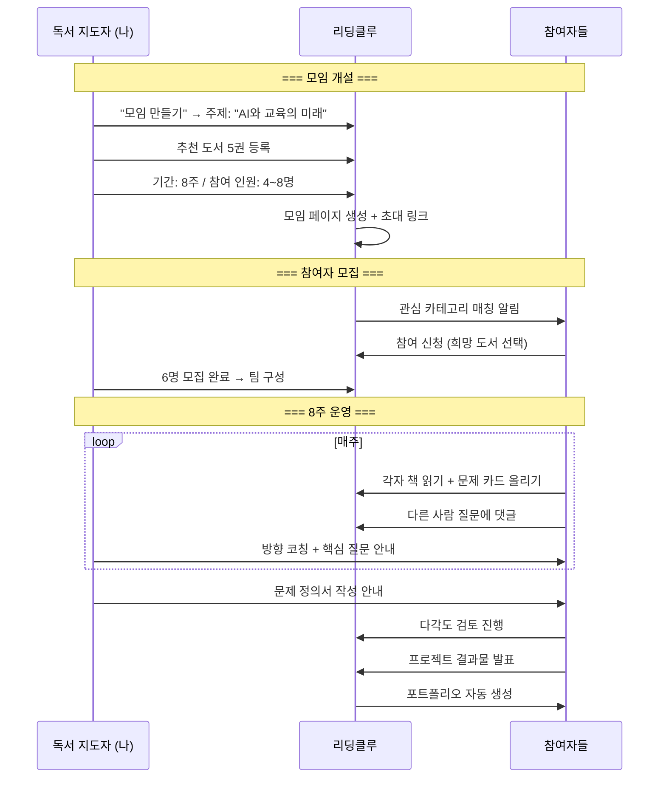

### 시나리오 6: 교사 — 수업에 SMILE 적용

```
지영 선생님의 한 학기 (16주)

전반기 (8주): "환경과 책임" 사이클
━━━━━━━━━━━━━━━━━━━━━━━━━━━━━━
Week 1~2: STEP 1 — 각자 환경 관련 책 선택 + 읽기
  - 《침묵의 봄》《파란하늘 빨간지구》 등 5권 중 택 1
  - 수업 시간에 문제 발견 가이드 활용

Week 3~4: STEP 2 — 문제 게시판에 올리기
  - 학급 내 게시판에 문제 카드 공유
  - 관심 문제별 팀 구성 (3~4명)

Week 5~6: STEP 3 — 문제 정의
  - 병렬 독서 관점 비교 수업
  - 문제 정의서 작성 (팀별)

Week 7: STEP 4 — 다각도 검토
  - 각 팀이 1개 렌즈씩 맡아 분석
  - 교차 발표로 전체 그림 완성

Week 8: STEP 5 — 프로젝트 발표
  - 에세이 / 제안서 / 포스터 택 1
  - 학교 게시판에 결과물 전시

후반기 (8주): "기술과 인간" 사이클
━━━━━━━━━━━━━━━━━━━━━━━━━━━━━━
(동일 구조 반복, 더 깊은 탐구)

✅ 교사 활용 결과:
  • 학생 포트폴리오 자동 축적 (생기부 연동 가능)
  • 수업 활동 기록 → 교사 전문성 포트폴리오
  • 학교 커뮤니티에 SMILE 문화 확산
```

### 시나리오 7: 하나의 문제가 여러 사이클로 발전

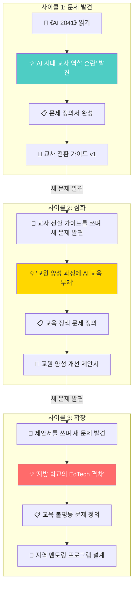

---

## 11. 화면 설계 — 앱/웹 상세

### 11.1 전체 네비게이션

```mermaid
graph TD
    subgraph "하단 탭 (앱)"
        H["🏠 홈"]
        F["📋 피드"]
        W["✏️ 쓰기"]
        T["👥 팀"]
        MY["👤 마이"]
    end

    subgraph "홈 화면"
        H1["내 활동 요약"]
        H2["이번 주 할 일"]
        H3["추천 문제 (카테고리 기반)"]
        H4["레벨 + XP 현황"]
    end

    subgraph "피드 화면"
        F1["문제 게시판"]
        F2["탐구 게시판"]
        F3["프로젝트 게시판"]
        F4["카테고리 필터"]
    end

    subgraph "쓰기 화면"
        W1["문제 카드 작성"]
        W2["게시글 작성"]
        W3["성찰 일지"]
    end

    subgraph "팀 화면"
        T1["내 팀 목록"]
        T2["팀 채팅"]
        T3["탐구 보드"]
        T4["프로젝트 보드"]
    end

    subgraph "마이 화면"
        MY1["내 서재 (읽은 책)"]
        MY2["내 문제 카드"]
        MY3["포트폴리오"]
        MY4["레벨 + 뱃지"]
        MY5["설정"]
    end

    H --> H1 & H2 & H3 & H4
    F --> F1 & F2 & F3 & F4
    W --> W1 & W2 & W3
    T --> T1 & T2 & T3 & T4
    MY --> MY1 & MY2 & MY3 & MY4 & MY5

    style H fill:#FF6B6B,color:#fff
    style F fill:#4ECDC4,color:#fff
    style W fill:#FFD700,color:#333
    style T fill:#45B7D1,color:#fff
    style MY fill:#96CEB4,color:#fff
```

### 11.2 홈 화면

```
┌──────────────────────────────────────────────────┐
│  🏠 리딩클루                          🔔 3  ⚙️    │
│                                                    │
│  ━━━━━━━━━━━━━━━━━━━━━━━━━━━━━━━━━━━━━━━━━━━━━━ │
│                                                    │
│  👤 민준님, 좋은 아침이에요!                        │
│  🔭 LV.2 발견자 · XP 280/500                      │
│  ████████████░░░░░░░░ 56%                          │
│                                                    │
│  ━━━━━━━━━━━━━━━━━━━━━━━━━━━━━━━━━━━━━━━━━━━━━━ │
│                                                    │
│  📌 이번 주 할 일                                   │
│  ┌────────────────────────────────────────────┐   │
│  │ ☑ 《AI 2041》 3~5장 읽기                       │   │
│  │ ☐ 문제 카드 1장 올리기                         │   │
│  │ ☐ 팀 게시판에 관점 공유                        │   │
│  │ ☐ 현우 댓글에 답글 달기                        │   │
│  └────────────────────────────────────────────┘   │
│                                                    │
│  ━━━━━━━━━━━━━━━━━━━━━━━━━━━━━━━━━━━━━━━━━━━━━━ │
│                                                    │
│  📚 내 활동 현황                                    │
│  ┌──────┐  ┌──────┐  ┌──────┐  ┌──────┐        │
│  │ 📖 2 │  │ 💡 5 │  │ 👥 1 │  │ 🚀 0 │        │
│  │ 읽는 중│  │ 문제  │  │ 팀    │  │프로젝│        │
│  │      │  │ 카드  │  │      │  │  트  │        │
│  └──────┘  └──────┘  └──────┘  └──────┘        │
│                                                    │
│  ━━━━━━━━━━━━━━━━━━━━━━━━━━━━━━━━━━━━━━━━━━━━━━ │
│                                                    │
│  🔥 추천 문제 (내 구독 카테고리 기반)                │
│  ┌────────────────────────────────────────────┐   │
│  │ 💡 #43 기술과 인간                             │   │
│  │ "AI가 만든 콘텐츠를 아이들이 무비판적으로        │   │
│  │  소비하고 있다 — 미디어 리터러시의 사각지대"      │   │
│  │ 👍 18  👥 모집중 (2/4명)                       │   │
│  │ [자세히 보기]                                   │   │
│  └────────────────────────────────────────────┘   │
│  ┌────────────────────────────────────────────┐   │
│  │ 💡 #21 불안과 두려움                           │   │
│  │ "취업 불안이 대학생의 학습 동기를 오히려          │   │
│  │  죽이고 있다 — 불안의 역설"                     │   │
│  │ 👍 31  📝 문제 정의 완료                       │   │
│  │ [정의서 보기]                                   │   │
│  └────────────────────────────────────────────┘   │
│                                                    │
│  ━━ 🏠  📋  ✏️  👥  👤 ━━                         │
└──────────────────────────────────────────────────┘
```

### 11.3 앱 vs 웹 역할 분담

| 기능 | 앱 (모바일) | 웹 (데스크탑) |
|------|:-----------:|:------------:|
| **책 읽기 + 밑줄 메모** | ✅ 주력 | ○ 보조 |
| **문제 카드 작성** | ✅ 주력 (5분) | ○ 보조 |
| **게시판 피드 (문제·탐구·프로젝트)** | ✅ 주력 | ✅ 주력 |
| **댓글·공감** | ✅ 주력 | ✅ 주력 |
| **알림 (새 게시글, 댓글)** | ✅ 푸시 | — |
| **카테고리 구독 관리** | ✅ | ✅ |
| **문제 정의서 작성** | — | ✅ 주력 |
| **다각도 검토서 작성** | — | ✅ 주력 |
| **프로젝트 문서 협업** | — | ✅ 주력 |
| **팀 채팅** | ✅ 참여 | ✅ 주력 |
| **성찰 일지** | ✅ 주력 | ○ 보조 |
| **포트폴리오 열람** | ✅ 공유용 | ✅ 편집용 |
| **탐구 보드 / 프로젝트 보드** | ○ 요약 | ✅ 주력 |

### 11.4 포트폴리오 화면

```
┌──────────────────────────────────────────────────┐
│  📂 민준의 포트폴리오                               │
│  🔭 LV.2 발견자 · XP 280                          │
│                                                    │
│  ━━━━━━━━━━━━━━━━━━━━━━━━━━━━━━━━━━━━━━━━━━━━━━ │
│                                                    │
│  📊 활동 요약                                       │
│  ┌──────┐  ┌──────┐  ┌──────┐  ┌──────┐        │
│  │ 📖 8 │  │ 💡 12│  │ 👥 2 │  │ 🚀 1 │        │
│  │읽은 책│  │ 문제  │  │ 팀    │  │프로젝│        │
│  │      │  │ 카드  │  │ 참여  │  │  트  │        │
│  └──────┘  └──────┘  └──────┘  └──────┘        │
│                                                    │
│  ━━━━━━━━━━━━━━━━━━━━━━━━━━━━━━━━━━━━━━━━━━━━━━ │
│                                                    │
│  🏆 완료된 프로젝트                                 │
│  ┌────────────────────────────────────────────┐   │
│  │ "AI 시대 교사 전환 가이드"                      │   │
│  │ 역할: 팀 리더 · 유형: 솔루션 제안서              │   │
│  │ 팀: 4명 · 기간: 6주 · 2026.07~08              │   │
│  │ 카테고리: #43 기술과 인간 · #33 교육과 학습     │   │
│  │                                                │   │
│  │ 📖 병렬 독서: AI 2041, 핀란드 교육혁명,         │   │
│  │              라이프 3.0, 호모 데우스             │   │
│  │                                                │   │
│  │ 📎 결과물: 교사 전환 가이드 (20p)               │   │
│  │ 🔍 다각도 검토: 6가지 렌즈 모두 완료            │   │
│  │                                                │   │
│  │ [결과물 보기]  [공유 링크 복사]                  │   │
│  └────────────────────────────────────────────┘   │
│                                                    │
│  ━━━━━━━━━━━━━━━━━━━━━━━━━━━━━━━━━━━━━━━━━━━━━━ │
│                                                    │
│  📈 성장 그래프                                     │
│                                                    │
│  관심 분야 분포:                                    │
│  #43 기술과 인간  ████████████ 35%                 │
│  #33 교육과 학습  ████████░░░ 25%                  │
│  #41 정의와 공정  ██████░░░░ 20%                   │
│  #21 불안과 두려움 ████░░░░░ 12%                    │
│  기타              ██░░░░░░░ 8%                     │
│                                                    │
│  역량 발달:                                        │
│  문제 발견  ████████████ 우수                      │
│  다각도 분석 ████████░░░ 양호                      │
│  협업·소통  ██████████░ 우수                       │
│  프로젝트   ██████░░░░ 보통                        │
│                                                    │
│  [PDF 다운로드]  [공유 링크]  [자소서 연동]          │
└──────────────────────────────────────────────────┘
```

---

## 12. 템플릿과 방법론

### 12.1 제공 템플릿 일람

| # | 템플릿 | 사용 시점 | 포맷 | 비고 |
|:-:|--------|----------|:---:|------|
| 1 | **문제 발견 가이드** | STEP 1 | 카드 | 5가지 질문 프레임 |
| 2 | **문제 카드** | STEP 1 | 카드 | 한 장에 한 문제 |
| 3 | **문제 게시글** | STEP 2 | 양식 | 게시판 올리기 양식 |
| 4 | **팀 구성 가이드** | STEP 2 | 문서 | 역할 분담 + 규칙 |
| 5 | **병렬 독서 비교표** | STEP 3 | 표 | 각 책의 관점 비교 |
| 6 | **문제 좁히기 워크시트** | STEP 3 | 양식 | 넓은→좁은 문제 |
| 7 | **문제 정의서** | STEP 3 | 문서 | 정의+근거+범위 |
| 8 | **다각도 검토서** | STEP 4 | 문서 | 6가지 렌즈 분석 |
| 9 | **프로젝트 제안서** | STEP 5 | 문서 | 해결안+자원+시나리오 |
| 10 | **에세이 구조** | STEP 5 | 양식 | 문제 분석 에세이 |
| 11 | **시나리오 캔버스** | STEP 5 | 양식 | 미래 시나리오 |
| 12 | **성찰 일지** | 매주 | 카드 | AI 대화형 or 자유 |
| 13 | **포트폴리오** | 자동 | 문서 | 자동 축적+편집 |

### 12.2 핵심 템플릿 상세

#### 문제 좁히기 워크시트

```
┌──────────────────────────────────────────────────┐
│  📋 문제 좁히기 워크시트                            │
│                                                    │
│  1️⃣ 넓은 문제 (책에서 발견한 것):                  │
│  ┌────────────────────────────────────────────┐   │
│  │ "AI 시대 교육의 미래가 불투명하다"               │   │
│  └────────────────────────────────────────────┘   │
│                                                    │
│  2️⃣ 좁히기 질문:                                   │
│  • 이 문제의 어떤 부분이 가장 심각한가?              │
│    → "교사의 역할 혼란"                            │
│  • 어디서 일어나고 있는가?                          │
│    → "한국 교실"                                   │
│  • 누가 가장 영향을 받는가?                         │
│    → "AI 도구를 도입한 학교의 교사들"               │
│  • 왜 아직 해결되지 않았는가?                       │
│    → "교사 전환 프로그램이 없다"                    │
│                                                    │
│  3️⃣ 좁은 문제 (최종):                              │
│  ┌────────────────────────────────────────────┐   │
│  │ "한국 교실에서 AI 도구 도입 시                    │   │
│  │  교사가 겪는 역할 혼란과                         │   │
│  │  전환 프로그램의 부재"                           │   │
│  └────────────────────────────────────────────┘   │
│                                                    │
│  4️⃣ 해결 범위 설정:                                │
│  • 내가/우리가 할 수 있는 것:                       │
│    → "교사 전환 가이드 문서 제작"                   │
│  • 더 필요한 자원:                                  │
│    → "현직 교사 인터뷰 1~2건"                      │
│  • 할 수 없는 것 (추후 과제):                       │
│    → "정책 수준의 제도 개선"                        │
└──────────────────────────────────────────────────┘
```

#### 시나리오 캔버스

```
┌──────────────────────────────────────────────────┐
│  📋 시나리오 캔버스                                 │
│                                                    │
│  📌 문제: [                              ]          │
│                                                    │
│  ━━━━━━━━━━━━━━━━━━━━━━━━━━━━━━━━━━━━━━━━━━━━━━ │
│                                                    │
│  시나리오 A: 최선 (Best Case)                       │
│  ┌────────────────────────────────────────────┐   │
│  │ 만약 [해결 조건]이 모두 충족된다면...           │   │
│  │ → [예상 결과]                                  │   │
│  │ → [필요 자원: ]                                │   │
│  │ → [기간: ]                                     │   │
│  └────────────────────────────────────────────┘   │
│                                                    │
│  시나리오 B: 현실 (Base Case)                       │
│  ┌────────────────────────────────────────────┐   │
│  │ 현재 조건에서 실행 가능한 것은...               │   │
│  │ → [예상 결과]                                  │   │
│  │ → [필요 자원: ]                                │   │
│  │ → [기간: ]                                     │   │
│  └────────────────────────────────────────────┘   │
│                                                    │
│  시나리오 C: 최악 (Worst Case)                      │
│  ┌────────────────────────────────────────────┐   │
│  │ 만약 아무것도 하지 않는다면...                  │   │
│  │ → [예상 결과]                                  │   │
│  │ → [위험 요소: ]                                │   │
│  │ → [가속 요인: ]                                │   │
│  └────────────────────────────────────────────┘   │
│                                                    │
│  💡 우리의 선택: ○ A  ● B  ○ C                     │
│  이유: [                                    ]      │
└──────────────────────────────────────────────────┘
```

---

## 13. AI 활용 방법론

> **AI 활용은 개인적인 선택이다. 하지만 방법론은 제시할 수 있다.**

### 13.1 AI 활용 원칙

```
┌──────────────────────────────────────────────────┐
│  🤖 리딩클루의 AI 철학                              │
│                                                    │
│  ✅ AI는 도구다 — 생각을 대체하지 않고 확장한다      │
│  ✅ AI는 선택이다 — 쓰든 안 쓰든 개인의 자유         │
│  ✅ 방법론은 제시한다 — 효과적으로 쓰는 법을 안내    │
│  ✅ 과정은 투명하다 — AI 도움받은 것을 표시          │
│                                                    │
│  ❌ AI가 문제를 대신 찾아주지 않는다                 │
│  ❌ AI가 답을 대신 쓰지 않는다                      │
│  ❌ AI 사용을 강제하지 않는다                       │
└──────────────────────────────────────────────────┘
```

### 13.2 단계별 AI 활용 가이드

| STEP | AI 활용 장면 | 방법론 | 예시 프롬프트 |
|:---:|-------------|--------|-------------|
| **1** | 질문 다듬기 | 모호한 질문을 구체화 | "이 질문을 '현실 문제'로 좁혀줘" |
| **1** | 관련 주제 탐색 | 비슷한 문제 영역 발견 | "이 문제와 연결된 다른 분야는?" |
| **2** | 게시글 구조화 | 생각을 정리해서 글로 | "이 메모들을 문제 게시글로 정리해줘" |
| **3** | 관점 확장 | 못 본 각도에서 바라보기 | "이 문제를 반대 입장에서 분석해줘" |
| **3** | 자료 조사 | 관련 데이터·사례 찾기 | "한국 교사 AI 교육 관련 통계?" |
| **4** | 다각도 분석 | 특정 렌즈 깊이 분석 | "이 해결안을 윤리적 관점에서 비판해줘" |
| **5** | 글쓰기 보조 | 초안 구조 잡기 | "제안서 구조를 잡아줘" |
| **5** | 시나리오 작성 | 미래 예측 도움 | "이 상황이 5년 후엔 어떨까?" |
| **매주** | 성찰 대화 | 자기 생각 정리 | "이번 주 읽은 내용에서 가장 중요한 건?" |

### 13.3 AI 성찰 대화 (선택적 기능)

```
┌──────────────────────────────────────────────────┐
│  🤖 AI 성찰 파트너 (선택)                          │
│                                                    │
│  💡 이 기능은 AI를 활용하고 싶은 분을 위한 것입니다. │
│     직접 일지를 쓰는 것도 좋은 방법입니다.            │
│                                                    │
│  ━━━━━━━━━━━━━━━━━━━━━━━━━━━━━━━━━━━━━━━━━━━━━━ │
│                                                    │
│  AI: "이번 주 읽은 부분에서 가장 생각이              │
│       많아진 건 뭐였어요?"                          │
│                                                    │
│  나: "AI가 학생 감정을 읽는 장면.                    │
│      신기하면서도 좀 무서웠어."                      │
│                                                    │
│  AI: "무서웠다는 건 어떤 감정이었을까요?              │
│       감시당하는 느낌? 아니면 다른?"                 │
│                                                    │
│  나: "인간만이 할 수 있다고 생각했던 걸               │
│      기계가 하니까."                                │
│                                                    │
│  AI: "그렇다면 '인간만이 할 수 있는 것'이            │
│       뭐라고 생각해요? 이 질문을 문제 카드로          │
│       만들어볼까요?"                                │
│                                                    │
│  나: "좋아, 다음에 문제 카드로 올릴게."               │
│                                                    │
│  AI: "이번 주 성찰 한 줄로 정리하면?"                │
│                                                    │
│  나: "'인간다움'이 뭔지 다시 생각하게 됐다."          │
│                                                    │
│  ━━━━━━━━━━━━━━━━━━━━━━━━━━━━━━━━━━━━━━━━━━━━━━ │
│                                                    │
│  📝 성찰 일지에 자동 저장됨                         │
│  📖 다음 주 읽기 가이드: "인간 고유 능력" 관련 부분  │
└──────────────────────────────────────────────────┘
```

---

## 14. 게이미피케이션과 성장 시스템

### 14.1 뱃지 시스템

| 뱃지 | 이름 | 조건 | 이모지 |
|------|------|------|:---:|
| 첫 발견 | 첫 문제 카드 작성 | 문제 카드 1장 | 🔍 |
| 공유자 | 첫 게시글 올리기 | 게시글 1건 | 📢 |
| 연결자 | 첫 팀 구성 | 팀 1개 | 🔗 |
| 다독가 | 책 5권 완독 | 완독 5권 | 📚 |
| 질문왕 | 문제 카드 20장 | 카드 20장 | ❓ |
| 공감왕 | 공감 100개 받기 | 누적 100개 | 💛 |
| 탐구자 | 문제 정의서 3건 | 정의서 3건 | 🔬 |
| 분석가 | 다각도 검토 완료 3건 | 검토서 3건 | 🔭 |
| 해결자 | 프로젝트 완주 1건 | 프로젝트 1건 | ⚔️ |
| 가이드 | 멘토링 3건 | 멘토링 3건 | 🛡️ |
| 병렬 독서 | 한 팀에서 4권 이상 교차 | 팀 내 4권+ | 📖 |
| 렌즈 마스터 | 6가지 렌즈 모두 작성 | 6렌즈 완료 | 💎 |

### 14.2 스트릭(연속 활동) 시스템

```
┌──────────────────────────────────────────────────┐
│  🔥 활동 스트릭                                    │
│                                                    │
│  이번 주: 5일 연속 활동! 🔥🔥🔥🔥🔥                │
│  최장 기록: 23일                                   │
│                                                    │
│  월  화  수  목  금  토  일                        │
│  ✅  ✅  ✅  ✅  ✅  ⬜  ⬜                        │
│                                                    │
│  💡 스트릭 유지 조건 (하루 1가지 이상):              │
│  • 책 10분 이상 읽기                               │
│  • 문제 카드 1장 작성                              │
│  • 게시판 댓글 1개                                 │
│  • 팀 채팅 참여                                    │
│  • 성찰 일지 작성                                  │
└──────────────────────────────────────────────────┘
```

### 14.3 리더보드

```
┌──────────────────────────────────────────────────┐
│  🏆 리더보드                                       │
│                                                    │
│  📋 전체 ── 카테고리별 ── 이번 주 ── 이번 달        │
│                                                    │
│  🏅 이번 달 TOP 활동가                              │
│  ┌──────────────────────────────────────────┐     │
│  │ 1. 🥇 서연 · LV.3 · XP 1,240              │     │
│  │    발견 12건 · 프로젝트 2건 · 문제 정의 3건  │     │
│  │                                              │     │
│  │ 2. 🥈 민준 · LV.2 · XP 980               │     │
│  │    발견 8건 · 프로젝트 1건 · 문제 정의 2건   │     │
│  │                                              │     │
│  │ 3. 🥉 현우 · LV.2 · XP 720               │     │
│  │    발견 6건 · 댓글 45건 · 문제 정의 1건      │     │
│  └──────────────────────────────────────────┘     │
│                                                    │
│  🏅 이번 달 TOP 문제 발견                           │
│  ┌──────────────────────────────────────────┐     │
│  │ 1. "능력주의는 정말 공정한가?" 👍 45          │     │
│  │ 2. "번아웃은 구조적 문제다" 👍 31             │     │
│  │ 3. "AI 시대 교사 역할 혼란" 👍 23             │     │
│  └──────────────────────────────────────────┘     │
└──────────────────────────────────────────────────┘
```

---

## 15. 운영 모델과 수익 구조

### 15.1 운영 구조

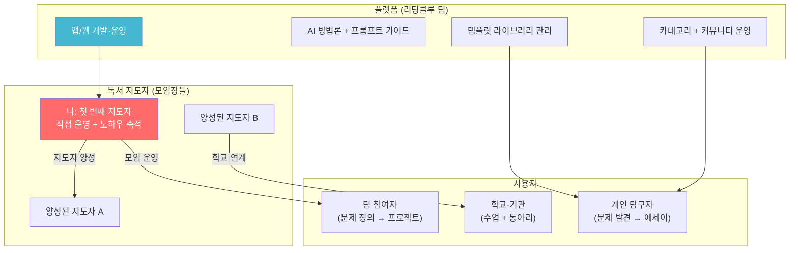

### 15.2 수익 모델

| 수익원 | 설명 | 대상 | 단가 |
|--------|------|------|------|
| **무료 기본** | 모든 핵심 기능 무료 | 전체 | 무료 |
| **프리미엄 템플릿** | 전문 템플릿 + 고급 분석 양식 | 개인 | 월 4,900원 |
| **AI 활용 (종량제)** | AI 성찰, 관점 확장 등 | 개인 | 사용한 만큼 |
| **모임 운영 (지도자)** | 유료 모임 수수료 | 지도자 | 참여비의 30% |
| **학교·기관 라이선스** | 학급 단위 사용 | 학교 | 학급당 월 29,000원 |
| **지도자 양성 과정** | 독서 지도자 교육 | 지도자 지망 | 과정당 150,000원 |

### 15.3 성장 로드맵

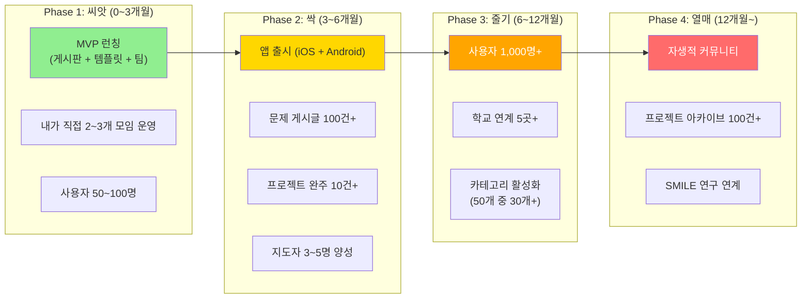

---

## 16. 기술 스택과 MVP

### 16.1 기술 스택

```
프론트엔드
├── 웹: Next.js 14 (React) — App Router + SSR + SEO
├── 앱: Expo (React Native) — iOS + Android
├── 공유: 공통 타입 (TypeScript) + API 클라이언트
└── UI: Tailwind CSS + shadcn/ui (웹) / NativeWind (앱)

백엔드
├── API: Node.js + Fastify (or Express)
├── 실시간: Socket.io (팀 채팅)
├── DB: PostgreSQL + Prisma ORM
├── 검색: PostgreSQL Full-text Search (MVP)
│   → ElasticSearch (확장 시)
├── 캐시: Redis (세션, 실시간)
├── 파일: S3 (문서, 이미지)
└── 인증: NextAuth.js (소셜 로그인)

AI (선택적 기능)
├── LLM: Claude API (성찰 대화, 관점 확장, 글쓰기 보조)
├── 임베딩: 문제·질문 유사도 (관련 게시글 추천)
└── 프롬프트: 방법론 기반 시스템 프롬프트 관리

인프라
├── 호스팅: Vercel (웹) + EAS (앱)
├── DB: Supabase or Railway
├── 모니터링: Sentry + Vercel Analytics
└── CI/CD: GitHub Actions
```

### 16.2 핵심 데이터 모델

```
사용자 (User)
├── id, 이름, 이메일, 프로필_이미지
├── 레벨, XP, 뱃지[]
├── 구독_카테고리[]
└── 가입일, 마지막_활동일

카테고리 (Category)
├── id, 대분류, 이름, 설명, 아이콘
├── 순서, 구독자_수
└── 게시글_수

도서 (Book)
├── id, 제목, 저자, 출판사
├── ISBN, 표지_이미지
└── 관련_카테고리[]

독서 기록 (ReadingLog)
├── id, user_id, book_id
├── 진행률, 읽기_시간(분)
├── 메모[] (페이지, 내용, 밑줄_문장)
└── 시작일, 완료일

문제 카드 (ProblemCard)
├── id, user_id, book_id
├── 문제_한줄, 왜_중요한가
├── 관련_문장[], 카테고리_ids[]
├── 게시글_id (게시글로 전환 시)
└── 작성일

문제 게시글 (Problem)
├── id, 작성자_id, 카테고리_ids[]
├── 제목, 문제_설명, 탐구_질문
├── 관련_도서[] (book_id, 페이지, 문장)
├── 추천_도서[] (book_id, 이유)
├── 공감_수, 댓글[], 참여_신청[]
├── 상태 (모집중/탐구중/프로젝트중/완료/종결)
└── 작성일, 수정일

팀 (Team)
├── id, problem_id, 리더_id
├── 멤버[] (user_id, 역할, 읽는_책)
├── 규칙 (주간_활동, 기간)
├── 문제_정의서_id, 다각도_검토서_id
├── 상태 (탐구중/검토중/프로젝트중/완료)
└── 생성일

문제 정의서 (ProblemDefinition)
├── id, team_id (or user_id)
├── 넓은_문제, 좁히기_과정[], 좁은_문제
├── 근거[] (book_id, 페이지, 문장)
├── 해결_범위, 필요_자원[], 불가_사항[]
└── 작성일, 상태

다각도 검토서 (MultiLensReview)
├── id, team_id, problem_definition_id
├── 렌즈[] {
│   ├── 유형 (윤리/기업/사회/기술/제도/개인)
│   ├── 담당_user_id
│   ├── 분석_내용[], 근거[]
│   └── 상태 (진행중/완료)
│   }
├── 종합_판단
└── 작성일

프로젝트 (Project)
├── id, team_id, 유형
├── 문제_정의, 해결_범위
├── 필요_자원[], 시나리오[]
├── 작업[] (제목, 담당, 상태, 마감일)
├── 결과물[] (파일_url, 설명)
├── 상태 (진행중/발표/완료)
└── 생성일, 완료일

성찰 일지 (Reflection)
├── id, user_id, team_id (선택)
├── 주차, AI_대화_로그[] (선택)
├── 한줄_성찰, 자유_메모
└── 작성일

포트폴리오 (Portfolio)
├── id, user_id
├── 읽은_책[], 문제_카드[]
├── 참여_팀[], 완료_프로젝트[]
├── 관심_분야_분포, 역량_그래프
├── 뱃지[], XP_히스토리
└── 자동 생성, 마지막_업데이트
```

### 16.3 MVP 범위

| 우선순위 | 기능 | 설명 | 플랫폼 |
|:---:|------|------|:---:|
| **P0** | 카테고리 + 문제 게시판 | 50가지 카테고리, 문제 올리기·공감·댓글 | 웹+앱 |
| **P0** | 문제 카드 작성 | 책에서 문제 발견 → 카드 작성 | 앱 |
| **P0** | 참여 신청 + 팀 구성 | 문제에 관심 있는 사람 모으기 | 웹+앱 |
| **P0** | 템플릿 제공 | 문제 발견 가이드, 정의서, 검토서 | 웹+앱 |
| **P1** | 문제 정의서 작성 | 팀/개인 문제 정의 + 탐구 게시판 공유 | 웹 |
| **P1** | 팀 공간 (채팅 + 문서) | 팀별 소통 + 공동 문서 | 웹 |
| **P1** | 다각도 검토서 | 6가지 렌즈 분석 양식 | 웹 |
| **P2** | 프로젝트 보드 | 칸반 + 역할 분담 + 결과물 공유 | 웹 |
| **P2** | 포트폴리오 | 자동 축적 + 편집 + 공유 | 웹+앱 |
| **P2** | 레벨 + XP + 뱃지 | 게이미피케이션 | 웹+앱 |
| **P3** | AI 방법론 가이드 | 활용법 안내 + 성찰 대화 | 앱 |
| **P3** | 모임 운영 기능 | 지도자 대시보드 + 커리큘럼 | 웹 |

### 16.4 MVP 화면 목록

| # | 화면 | 유형 | 우선순위 |
|:-:|------|:---:|:---:|
| 1 | 온보딩 (회원가입 + 카테고리 선택) | 앱+웹 | P0 |
| 2 | 홈 (활동 요약 + 추천 문제) | 앱 | P0 |
| 3 | 카테고리 탐색 | 앱+웹 | P0 |
| 4 | 문제 게시판 (피드) | 앱+웹 | P0 |
| 5 | 문제 게시글 상세 | 앱+웹 | P0 |
| 6 | 문제 게시글 작성 | 앱+웹 | P0 |
| 7 | 문제 카드 작성 | 앱 | P0 |
| 8 | 내 서재 (읽은 책 + 메모) | 앱 | P0 |
| 9 | 팀 구성 | 웹 | P0 |
| 10 | 팀 공간 (채팅 + 문서) | 웹 | P1 |
| 11 | 탐구 보드 | 웹 | P1 |
| 12 | 문제 정의서 작성 | 웹 | P1 |
| 13 | 다각도 검토서 작성 | 웹 | P1 |
| 14 | 프로젝트 보드 | 웹 | P2 |
| 15 | 프로젝트 결과물 공유 | 웹 | P2 |
| 16 | 포트폴리오 | 웹+앱 | P2 |
| 17 | 레벨 + 뱃지 + 리더보드 | 앱+웹 | P2 |
| 18 | AI 성찰 대화 | 앱 | P3 |
| 19 | 모임 운영 대시보드 | 웹 | P3 |
| 20 | 설정 + 알림 관리 | 앱+웹 | P0 |

---

## 17. SMILE vs 기존 독서 모임 비교

### 17.1 종합 비교

| 비교 항목 | 기존 독서 모임 | 리딩클루 SMILE형 |
|----------|:---:|:---:|
| **목적** | 책 읽기 | 진짜 문제 찾기 + 해결 |
| **읽기 방식** | 같은 책 1권 | 같은 주제, 다른 책 (병렬) |
| **토론 방식** | 감상 공유 | 질문 생성 → 문제 수렴 → 다각도 검토 |
| **AI 역할** | 없음 | 방법론 가이드 (개인 선택) |
| **최종 결과** | "좋은 책이었다" | 문제 정의서 / 프로젝트 결과물 |
| **기간** | 단발성 or 무기한 | 사이클 (반복 가능) |
| **참여 방식** | 주 1회 오프라인 | 매일 5~10분 앱 + 온라인 협업 |
| **참여 스펙트럼** | 전부 or 빠짐 | 공감(1초)~프로젝트(수주) |
| **성장 기록** | 없음 | 포트폴리오 자동 축적 |
| **교차 관점** | 같은 책 같은 관점 | 다른 책에서 온 다양한 관점 |
| **게이미피케이션** | 없음 | 레벨 + XP + 뱃지 + 스트릭 |
| **카테고리** | 없음 | 50가지 내면 문제 + 기타 |
| **팀 구성** | 고정 멤버 | 문제 기반 유동 팀 |
| **문제 정의** | 없음 | 핵심 결과물 |
| **다각도 검토** | 없음 | 6가지 렌즈 분석 |

### 17.2 SMILE 방식의 차별적 가치

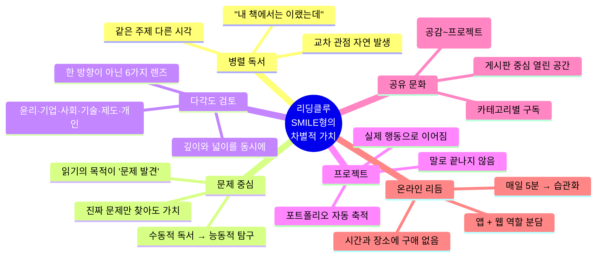

---

## 부록: 실행 체크리스트

### 바로 실행할 수 있는 첫 단계

```
┌──────────────────────────────────────────────────┐
│  ✅ 실행 체크리스트 — Phase 1 (0~3개월)             │
│                                                    │
│  Week 1~2: 기반 준비                               │
│  ☐ Next.js 프로젝트 세팅 (웹)                       │
│  ☐ Expo 프로젝트 세팅 (앱)                          │
│  ☐ PostgreSQL + Prisma 스키마 설계                  │
│  ☐ 인증 (NextAuth.js — 카카오·구글)                 │
│  ☐ 50가지 카테고리 데이터 입력                       │
│                                                    │
│  Week 3~4: 핵심 기능 (P0)                          │
│  ☐ 카테고리 탐색 + 구독 기능                        │
│  ☐ 문제 게시판 (CRUD + 공감 + 댓글)                 │
│  ☐ 문제 카드 작성 기능 (앱)                         │
│  ☐ 참여 신청 + 팀 구성 기능                         │
│  ☐ 템플릿 뷰어 (문제 발견 가이드, 정의서)            │
│                                                    │
│  Week 5~6: 보조 기능                               │
│  ☐ 내 서재 (책 등록 + 메모)                         │
│  ☐ 알림 시스템 (푸시)                               │
│  ☐ 온보딩 (카테고리 선택)                           │
│                                                    │
│  Week 7~8: 검증                                    │
│  ☐ 내가 직접 첫 모임 운영 (5~8명)                   │
│  ☐ 문제 게시글 10건+ 확보                           │
│  ☐ 첫 팀 구성 + 문제 정의서 완성                    │
│  ☐ 사용자 피드백 수집 + 개선                        │
│                                                    │
│  Week 9~12: 확장                                   │
│  ☐ 문제 정의서 작성 기능 (웹)                       │
│  ☐ 팀 채팅 기능                                    │
│  ☐ 다각도 검토서 기능                               │
│  ☐ 앱 베타 출시                                    │
│  ☐ 사용자 50명 확보                                │
└──────────────────────────────────────────────────┘
```

---

## 부록: 한눈에 보는 리딩클루

```
┌─────────────────────────────────────────────────────┐
│                                                       │
│   📚 리딩클루 — SMILE형 탐구 독서 플랫폼               │
│                                                       │
│   "책을 통해 진짜 문제를 찾고,                         │
│    게시판에 올려 사람을 모으고,                         │
│    다각도로 검토하며,                                  │
│    프로젝트로 해결한다.                                │
│    진짜 문제만 찾아도 충분하다."                       │
│                                                       │
│   ┌─────┐  ┌─────┐  ┌─────┐  ┌─────┐  ┌─────┐     │
│   │STEP1│→│STEP2│→│STEP3│→│STEP4│→│STEP5│     │
│   │ 📖  │  │ 📋  │  │ 🔍  │  │ 🔭  │  │ 🚀  │     │
│   │발견 │  │공유 │  │초점 │  │검토 │  │프로 │     │
│   │     │  │모이기│  │     │  │     │  │젝트 │     │
│   └─────┘  └─────┘  └─────┘  └─────┘  └─────┘     │
│                                                       │
│   🏷️ 50가지 인간 내면 문제 + 기타 카테고리              │
│   📋 단계별 템플릿 13종                                │
│   🤖 AI: 방법론 제시 (활용은 개인 선택)                 │
│   📱 앱: 읽기 + 발견 + 성찰 (매일 5분)                 │
│   💻 웹: 문서 + 프로젝트 + 협업                        │
│   🎮 레벨(LV.1~5) + XP + 뱃지 + 스트릭                │
│                                                       │
│   👥 공유와 협력의 문화                                │
│   ✊ 문제 발견과 해결의 민주화                          │
│                                                       │
└─────────────────────────────────────────────────────┘
```

---

> **"우리는 단순히 책을 읽지 않는다.**
> **책에서 진짜 문제를 발견하고,**
> **관심 있는 사람들과 함께 모여,**
> **내가 해결할 수 있는 범위에서 시작하거나**
> **더 큰 해결을 위한 자원과 시나리오를 구상한다.**
> **윤리적으로, 사회적으로, 기술적으로 — 다각도로.**
> **진짜 문제를 찾는 것만으로도 충분히 가치 있다.**
> **그것이 리딩클루의 SMILE이다."**

---

*이 문서는 SMILE(Stanford Mobile Inquiry-based Learning Environment) 방식을 독서 기반 문제 해결에 적용한 유저 시나리오입니다.*
*aicareerpath.co.kr의 5단계 퀘스트 구조를 참고하여, 독서 → 문제 발견 → 공유 → 초점화 → 다각도 검토 → 프로젝트 흐름을 구체화합니다.*
*앱(Expo)과 웹(Next.js)의 역할 분담, 게이미피케이션, 50가지 카테고리 체계를 포함합니다.*
