# 리딩크루(ReadingCrew) 화면 설계서 & AI Agent 설계서

> **"모든 화면은 20분 안에 토론에 도달하도록 설계한다."**
>
> 사용자가 앱을 열고 3탭 안에 토론방에 들어갈 수 있는 UI,
> 그리고 화면 뒤에서 6개의 AI Agent가 협업하는 지능형 시스템

---

## 목차

### Part 1: 정보 구조 (IA)
1. [전체 화면 맵](#1-전체-화면-맵)
2. [네비게이션 구조](#2-네비게이션-구조)
3. [사용자 플로우](#3-사용자-플로우)

### Part 2: 핵심 화면 설계
4. [홈 화면](#4-홈-화면)
5. [탐색 화면](#5-탐색-화면)
6. [모임 상세 화면](#6-모임-상세-화면)
7. [토론 라이브 화면 (핵심)](#7-토론-라이브-화면)
8. [학습 허브 화면](#8-학습-허브-화면)
9. [AI 독서 대화 화면](#9-ai-독서-대화-화면)
10. [내 모임 / 내 기록 화면](#10-내-모임--내-기록-화면)
11. [성장 리포트 화면](#11-성장-리포트-화면)
12. [모임 만들기 화면](#12-모임-만들기-화면)
13. [온보딩 & 프로필 화면](#13-온보딩--프로필-화면)

### Part 3: 디자인 시스템
14. [컬러 · 타이포 · 컴포넌트](#14-디자인-시스템)

### Part 4: AI Agent 아키텍처
15. [AI Agent 전체 구조](#15-ai-agent-전체-구조)
16. [Agent 1 — MC Agent (토론 진행)](#16-agent-1--mc-agent)
17. [Agent 2 — Reader Agent (독서 대화)](#17-agent-2--reader-agent)
18. [Agent 3 — Recorder Agent (기록)](#18-agent-3--recorder-agent)
19. [Agent 4 — Curator Agent (큐레이션)](#19-agent-4--curator-agent)
20. [Agent 5 — Coach Agent (성장 분석)](#20-agent-5--coach-agent)
21. [Agent 6 — Guardian Agent (클린 보호)](#21-agent-6--guardian-agent)

### Part 5: Agent 간 협업 & 데이터 흐름
22. [Agent 오케스트레이션](#22-agent-오케스트레이션)
23. [Agent ↔ UI 연결 맵](#23-agent--ui-연결-맵)

---

## 1. 전체 화면 맵

### 1.1 정보 구조도 (Information Architecture)

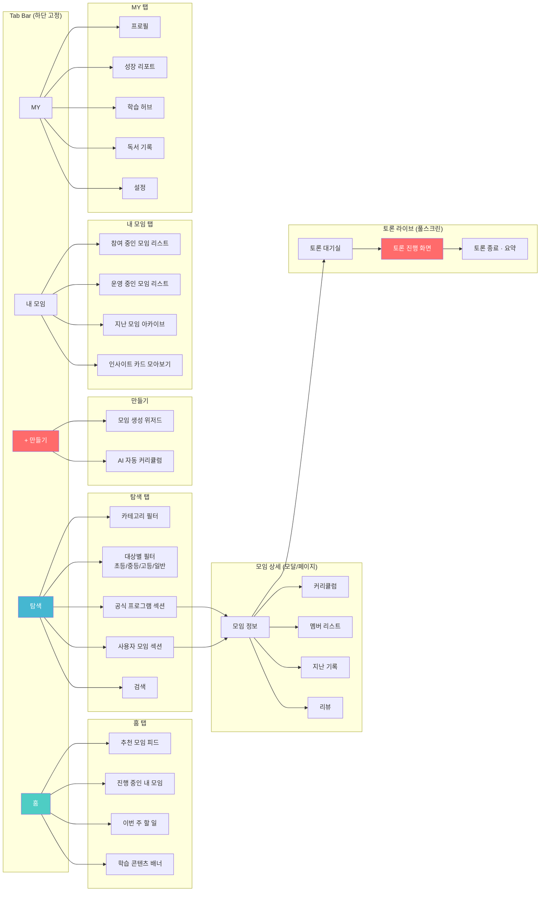

---

## 2. 네비게이션 구조

### 2.1 하단 탭 바

```
┌──────────────────────────────────────────────┐
│                                              │
│     홈        탐색      (+)      내모임    MY │
│     🏠        🔍       ➕       📚       👤 │
│                                              │
└──────────────────────────────────────────────┘

- 홈: 개인화된 메인 피드
- 탐색: 전체 모임 브라우징 + 필터
- (+): 모임 만들기 (FAB 스타일, 강조)
- 내모임: 참여/운영 중인 모임 관리
- MY: 프로필, 성장, 학습, 설정
```

### 2.2 화면 전환 패턴

| 전환 유형 | 사용 위치 | 애니메이션 |
|----------|----------|-----------|
| **탭 전환** | 하단 탭 바 | 페이드 (탭 간 전환) |
| **Push** | 모임 카드 → 모임 상세 | 우측 슬라이드 |
| **Modal** | (+)만들기, 토론 라이브 | 하단에서 올라옴 |
| **풀스크린** | 토론 진행 화면 | 전체 화면 전환 |
| **바텀시트** | 필터, 빠른 설정 | 하단 반쯤 올라옴 |

---

## 3. 사용자 플로우

### 3.1 신규 사용자 (첫 토론까지)

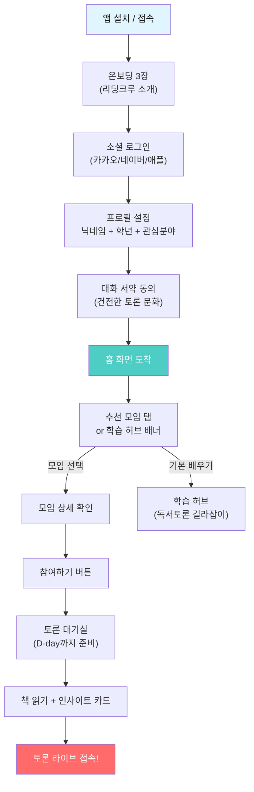

### 3.2 토론 진행 플로우 (라이브)

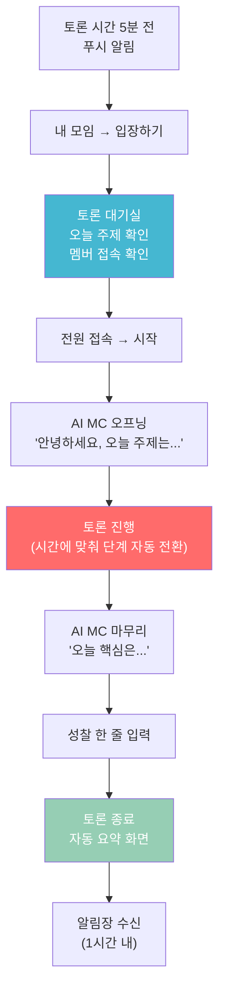

---

## 4. 홈 화면

### 4.1 화면 설계

```
┌──────────────────────────────────────────────┐
│  ReadingCrew                    🔔  ⚙️      │
│  ━━━━━━━━━━━━━━━━━━━━━━━━━━━━━━━━━━━━━━━━  │
│                                              │
│  ┌──────────────────────────────────────┐    │
│  │  💡 서연님, 이번 주 할 일                │    │
│  │  ─────────────────────────────────── │    │
│  │  📖 《미움받을 용기》 3~4장 읽기        │    │
│  │  ✏️ 인사이트 카드 1개 작성              │    │
│  │  🗓️ 수요일 20:00 토론 참여              │    │
│  │  ─────────────────────────────────── │    │
│  │  ■■■■■■□□□□  진행률 60%                │    │
│  └──────────────────────────────────────┘    │
│                                              │
│  ━━━ 📅 다가오는 토론 ━━━━━━━━━━━━━━━━━━━  │
│                                              │
│  ┌─────────────────────────────────────┐     │
│  │  미움받을 용기 · 3회차                │     │
│  │  수 20:00 · 40분 · D-2               │     │
│  │  "열등감은 나쁜 것일까?"              │     │
│  │                                     │     │
│  │  [토론 준비하기]    [AI 독서 대화]    │     │
│  └─────────────────────────────────────┘     │
│                                              │
│  ━━━ 🎯 서연님을 위한 추천 ━━━━━━━━━━━━━━  │
│                                              │
│  ┌────────┐  ┌────────┐  ┌────────┐         │
│  │ [표지] │  │ [표지] │  │ [표지] │         │
│  │ 공식   │  │ 공식   │  │ 사용자 │         │
│  │ 모집중 │  │ 모집중 │  │ 모집중 │         │
│  ├────────┤  ├────────┤  ├────────┤         │
│  │정의란  │  │사피엔스│  │직장인  │         │
│  │무엇인가│  │함께읽기│  │월요독서│         │
│  │고등·4주│  │일반·6주│  │30분·4명│         │
│  └────────┘  └────────┘  └────────┘         │
│                              스크롤 →         │
│                                              │
│  ━━━ 📚 학습 콘텐츠 ━━━━━━━━━━━━━━━━━━━━━  │
│                                              │
│  ┌──────────────────────────────────────┐    │
│  │  🎓 독서토론 길라잡이                   │    │
│  │  "좋은 토론의 시작은 좋은 질문입니다"   │    │
│  │  [시작하기 →]                           │    │
│  └──────────────────────────────────────┘    │
│                                              │
│  ━━━ 🏆 이번 주 인기 인사이트 ━━━━━━━━━━━  │
│                                              │
│  "숫자로 행복을 측정할 수 있을까?"           │
│   — 서연 · 정의란 무엇인가 3회차             │
│   ❤️ 24  💬 8                                │
│                                              │
│  "열등감의 방향이 결국 인생의 방향"          │
│   — 민준 · 미움받을 용기 2회차               │
│   ❤️ 18  💬 5                                │
│                                              │
├──────────────────────────────────────────────┤
│     🏠        🔍       ➕       📚       👤 │
│     홈        탐색     만들기    내모임    MY │
└──────────────────────────────────────────────┘
```

### 4.2 홈 화면 컴포넌트 설명

| 영역 | 컴포넌트 | AI Agent 연동 | 설명 |
|------|---------|:---:|------|
| **이번 주 할 일** | TodoCard | Curator Agent | 진행 중인 모임의 주간 과제 자동 생성 |
| **다가오는 토론** | UpcomingSession | MC Agent | 다음 토론 주제 미리보기 + D-day |
| **추천 모임** | MeetingCarousel | Curator Agent | 프로필 + 이력 기반 맞춤 추천 |
| **학습 콘텐츠** | LearningBanner | — | Track C 학습 허브 진입점 |
| **인기 인사이트** | InsightFeed | Recorder Agent | 전체 인사이트 중 인기순 노출 |

---

## 5. 탐색 화면

### 5.1 화면 설계

```
┌──────────────────────────────────────────────┐
│  🔍 모임 검색...                              │
│  ━━━━━━━━━━━━━━━━━━━━━━━━━━━━━━━━━━━━━━━━  │
│                                              │
│  [전체] [초등] [중등] [고등] [일반]           │
│                                              │
│  [철학] [심리] [경영] [역사] [과학] [문학] →  │
│                                              │
│  ━━━ 🎓 리딩크루 공식 프로그램 ━━━━━━━━━━━  │
│                                              │
│  ┌──────────────────────────────────────┐    │
│  │  🏅 공식                              │    │
│  │  ┌────────┐  ┌────────┐  ┌────────┐ │    │
│  │  │ [표지] │  │ [표지] │  │ [표지] │ │    │
│  │  │ 초등   │  │ 중등   │  │ 고등   │ │    │
│  │  │ 입문   │  │ 심화   │  │ 융합   │ │    │
│  │  ├────────┤  ├────────┤  ├────────┤ │    │
│  │  │마당을  │  │주제:   │  │사피엔스│ │    │
│  │  │나온암탉│  │정의    │  │+총균쇠 │ │    │
│  │  │20분시작│  │30분시작│  │50분시작│ │    │
│  │  │4주·4명 │  │6주·6명 │  │12주·6명│ │    │
│  │  └────────┘  └────────┘  └────────┘ │    │
│  │                          [전체보기 →] │    │
│  └──────────────────────────────────────┘    │
│                                              │
│  ━━━ 🌍 사용자 운영 모임 ━━━━━━━━━━━━━━━━  │
│                                              │
│  ┌────────────────────────────────────┐      │
│  │  [표지]  직장인 월요독서회           │      │
│  │          김서연 · 매주 월 21:00     │      │
│  │          30분 · 5/6명 · ★4.7       │      │
│  │          #자기계발 #직장인           │      │
│  │                     [참여하기]      │      │
│  └────────────────────────────────────┘      │
│                                              │
│  ┌────────────────────────────────────┐      │
│  │  [표지]  대학생 인문학 모임          │      │
│  │          박준서 · 매주 토 14:00     │      │
│  │          40분 · 3/8명 · 신규       │      │
│  │          #철학 #인문학 #대학생       │      │
│  │                     [참여하기]      │      │
│  └────────────────────────────────────┘      │
│                                              │
│  ━━━ ⏰ 곧 시작하는 모임 ━━━━━━━━━━━━━━━━  │
│  ...                                         │
│                                              │
├──────────────────────────────────────────────┤
│     🏠        🔍       ➕       📚       👤 │
└──────────────────────────────────────────────┘
```

### 5.2 필터 바텀시트

```
┌──────────────────────────────────────────────┐
│  ━━━ 필터 ━━━━━━━━━━━━━━━━━━━━━━━━  [초기화] │
│                                              │
│  대상                                        │
│  (●) 전체  ( ) 초등  ( ) 중등  ( ) 고등  ( ) 일반 │
│                                              │
│  난이도                                      │
│  [⭐ 입문]  [⭐⭐ 심화]  [⭐⭐⭐ 융합]        │
│                                              │
│  운영 방식                                   │
│  [전체]  [🎓 공식]  [🌍 사용자]               │
│                                              │
│  시간대                                      │
│  [전체] [평일 저녁] [주말 오전] [주말 오후]    │
│                                              │
│  세션 시간                                   │
│  20분 ○────────●────○ 90분                   │
│                                              │
│  상태                                        │
│  [모집중]  [곧시작]  [진행중]                  │
│                                              │
│  정렬                                        │
│  (●) 추천순  ( ) 인기순  ( ) 최신순  ( ) 시작임박 │
│                                              │
│  [적용하기]                                   │
└──────────────────────────────────────────────┘
```

### 5.3 탐색 화면 컴포넌트

| 컴포넌트 | 설명 | AI Agent |
|---------|------|:---:|
| **SearchBar** | 책 제목, 주제, 운영자 검색 | Curator |
| **TargetFilter** | 초등/중등/고등/일반 탭 | — |
| **CategoryChips** | 분야별 필터 (가로 스크롤) | — |
| **OfficialSection** | 공식 프로그램 가로 카드 | Curator |
| **UserMeetingList** | 사용자 모임 세로 리스트 | Curator |
| **FilterBottomSheet** | 상세 필터 | — |


---

## 6. 모임 상세 화면

### 6.1 화면 설계

```
┌──────────────────────────────────────────────┐
│  ←                                    🔗 ⋮  │
│                                              │
│  ┌──────────────────────────────────────┐    │
│  │                                      │    │
│  │         [책 표지 대형 이미지]          │    │
│  │                                      │    │
│  │   🎓 공식    ⭐ 입문    🟢 모집중     │    │
│  └──────────────────────────────────────┘    │
│                                              │
│  철학 입문: 정의란 무엇인가 함께 읽기         │
│  ━━━━━━━━━━━━━━━━━━━━━━━━━━━━━━━━━━━━━━  │
│                                              │
│  ┌─────────┐  정하나 (운영자)                │
│  │ [아바타] │  ★ 4.8 (리뷰 23개)             │
│  └─────────┘  토론 진행 52회                  │
│                                              │
│  ┌──────────────────────────────────────┐    │
│  │  📅 매주 수요일 20:00                  │    │
│  │  ⏱️ 30분 시작 → 4주 후 50분까지 확장   │    │
│  │  👥 참여 6/8명 (2자리 남음)            │    │
│  │  🎯 고등 · 입문 · 4주 과정             │    │
│  │  🤖 AI MC 소크라테스식 진행             │    │
│  └──────────────────────────────────────┘    │
│                                              │
│  ┌──────────────────────────────────────┐    │
│  │                                      │    │
│  │   [참여하기]                          │    │
│  │                                      │    │
│  └──────────────────────────────────────┘    │
│                                              │
│  ━━━ 소개 ━━━━━━━━━━━━━━━━━━━━━━━━━━━━━━  │
│  마이클 샌델의 <정의란 무엇인가>를            │
│  4주에 걸쳐 함께 읽고 토론합니다.             │
│  AI MC가 소크라테스식 질문을 던지며            │
│  깊이 있는 토론을 이끕니다.                   │
│                                              │
│  ━━━ 시간 확장 플랜 ━━━━━━━━━━━━━━━━━━━━  │
│                                              │
│  1회차  ●━━━━━━━━━━━━━━━━━━  30분           │
│  2회차  ●━━━━━━━━━━━━━━━━━━  30분           │
│  3회차  ●━━━━━━━━━━━━━━━━━━━━━  40분        │
│  4회차  ●━━━━━━━━━━━━━━━━━━━━━━━━  50분     │
│                                              │
│  ━━━ 주차별 커리큘럼 ━━━━━━━━━━━━━━━━━━━━  │
│                                              │
│  ┌──────────────────────────────────────┐    │
│  │  1주차 · 3/5(수)                     │    │
│  │  읽기: 1~3장 (공리주의란?)            │    │
│  │  핵심 질문: "최대 다수의 행복이 정의?" │    │
│  │  📖 배경지식: 벤담과 밀               │    │
│  │  💡 독서팁: 밑줄 치며 읽기             │    │
│  ├──────────────────────────────────────┤    │
│  │  2주차 · 3/12(수)                    │    │
│  │  읽기: 4~6장 (자유와 권리)            │    │
│  │  핵심 질문: "자유에 조건이 있는가?"    │    │
│  │  📖 배경지식: 칸트 의무론              │    │
│  ├──────────────────────────────────────┤    │
│  │  3주차 · 3/19(수)  ...               │    │
│  │  4주차 · 3/26(수)  ...               │    │
│  └──────────────────────────────────────┘    │
│                                              │
│  ━━━ 이런 분께 추천 ━━━━━━━━━━━━━━━━━━━━  │
│  ✅ 철학에 관심 있지만 어디서 시작할지 모름   │
│  ✅ 짧은 시간부터 시작하고 싶은 분            │
│  ✅ AI가 이끌어주는 토론을 경험하고 싶은 분   │
│                                              │
│  ━━━ 포함 콘텐츠 패키지 ━━━━━━━━━━━━━━━━  │
│  📖 독서 가이드    ❓ 질문 카드 (주 3장)     │
│  🧠 배경지식 카드  📝 인사이트 템플릿        │
│  📋 AI 요약       📊 성장 리포트             │
│                                              │
│  ━━━ 지난 기수 기록 ━━━━━━━━━━━━━━━━━━━━  │
│                                              │
│  시즌 1 (2026.01) · 참여 8명 · 완료          │
│  ┌────────┐  ┌────────┐  ┌────────┐         │
│  │1회차   │  │2회차   │  │3회차   │         │
│  │공리주의│  │자유권리│  │미덕정의│         │
│  │💡 8개  │  │💡 12개 │  │💡 10개 │         │
│  └────────┘  └────────┘  └────────┘         │
│                                              │
│  ━━━ 참여자 리뷰 ━━━━━━━━━━━━━━━━━━━━━━━  │
│  ★★★★★ "AI MC가 질문을 정말 잘 던져요"      │
│  — 서연 · 시즌1 참여                         │
│  ★★★★☆ "30분으로 시작하니 부담이 없었어요"  │
│  — 준서 · 시즌1 참여                         │
│                                              │
└──────────────────────────────────────────────┘
```

### 6.2 모임 상세 — 핵심 UI 포인트

| UI 요소 | 설계 의도 | 상세 |
|---------|----------|------|
| **시간 확장 플랜 바** | 점진적 시간 확장을 시각화 | 각 회차의 시간을 프로그레스 바로 표현 |
| **커리큘럼 아코디언** | 회차별 콘텐츠를 한눈에 | 열면 배경지식·독서팁까지 표시 |
| **콘텐츠 패키지 아이콘** | 포함 콘텐츠의 가치를 즉시 전달 | 아이콘 + 라벨 그리드 |
| **기수 아카이브** | 과거 토론의 가치를 보여줌 | 유튜브 영상 목록 스타일 |
| **CTA 고정** | 참여하기 버튼 항상 보이게 | 스크롤해도 하단 고정 또는 플로팅 |

---

## 7. 토론 라이브 화면

> **가장 중요한 화면. 사용자가 가장 오래 머무는 곳.**

### 7.1 토론 대기실

```
┌──────────────────────────────────────────────┐
│  ← 미움받을 용기 · 3회차 · 40분              │
│  ━━━━━━━━━━━━━━━━━━━━━━━━━━━━━━━━━━━━━━━  │
│                                              │
│  ┌──────────────────────────────────────┐    │
│  │  🎯 오늘의 주제                       │    │
│  │  "열등감은 나쁜 것일까?"              │    │
│  │                                      │    │
│  │  📖 읽기 범위: 3~4장                  │    │
│  │  ⏱️ 오늘 토론 시간: 40분              │    │
│  └──────────────────────────────────────┘    │
│                                              │
│  ━━━ 오늘의 준비 콘텐츠 ━━━━━━━━━━━━━━━━━  │
│                                              │
│  ┌──────────────────────────────────────┐    │
│  │  💡 독서 팁                           │    │
│  │  "오늘은 '왜?'를 3번 물어보며 읽자"   │    │
│  ├──────────────────────────────────────┤    │
│  │  🧠 배경지식                          │    │
│  │  아들러 심리학의 핵심 3가지            │    │
│  │  1. 목적론 (과거가 아닌 미래 지향)    │    │
│  │  2. 열등감은 성장의 연료              │    │
│  │  3. 공동체 감각이 행복의 열쇠          │    │
│  ├──────────────────────────────────────┤    │
│  │  ❓ 미리보기 질문                     │    │
│  │  "열등감과 열등 콤플렉스의 차이는?"   │    │
│  └──────────────────────────────────────┘    │
│                                              │
│  ━━━ 접속 현황 ━━━━━━━━━━━━━━━━━━━━━━━━━  │
│                                              │
│  👤 서연 ✅    👤 민준 ✅    👤 지현 ⏳       │
│  👤 영호 ✅    👤 수진 ✅    👤 하나 ⏳       │
│                                              │
│  접속 4/6명 · 전원 접속 시 자동 시작          │
│                                              │
│  ┌──────────────────────────────────────┐    │
│  │                                      │    │
│  │    [토론 시작하기]  (전원 접속 시 활성) │    │
│  │                                      │    │
│  └──────────────────────────────────────┘    │
│                                              │
└──────────────────────────────────────────────┘
```

### 7.2 토론 진행 화면 (메인 — 풀스크린)

```
┌──────────────────────────────────────────────┐
│  미움받을 용기 · 3회차         ⏱️ 12:34/40:00 │
│  ▓▓▓▓▓▓▓▓▓▓▓░░░░░░░░░░░░░░░░░░░  31%       │
│  [체크인]  [●토론1]  [토론2]  [성찰]          │
│  ━━━━━━━━━━━━━━━━━━━━━━━━━━━━━━━━━━━━━━━━  │
│                                              │
│  ┌──────────────────────────────────────┐    │
│  │                                      │    │
│  │     👤    👤    👤    👤    👤    👤  │    │
│  │    서연   민준   지현   영호   수진  하나│    │
│  │     🟢    🟢    ⬜    🟢    ⬜   ⬜  │    │
│  │   (발언중)                           │    │
│  │                                      │    │
│  └──────────────────────────────────────┘    │
│                                              │
│  ┌──────────────────────────────────────┐    │
│  │  🤖 AI MC                            │    │
│  │  ─────────────────────────────────── │    │
│  │  "서연님 좋은 의견이에요!             │    │
│  │   다른 분들은 열등감에 대해            │    │
│  │   어떻게 생각하시나요?"               │    │
│  │                                      │    │
│  │  ❓ 현재 질문                         │    │
│  │  ┌─────────────────────────────────┐ │    │
│  │  │ "열등감이 오히려 도움이 된       │ │    │
│  │  │  경험이 있나요?"                 │ │    │
│  │  └─────────────────────────────────┘ │    │
│  └──────────────────────────────────────┘    │
│                                              │
│  ┌──────────────────────────────────────┐    │
│  │  📊 실시간 관점 보드                  │    │
│  │  ─────────────────────────────────── │    │
│  │  A "열등감은 성장의 동기"             │    │
│  │    서연, 영호                         │    │
│  │  B "열등감은 독이 될 수 있다"         │    │
│  │    민준, 수진                         │    │
│  │  C "방향이 중요하다"                  │    │
│  │    지현                               │    │
│  └──────────────────────────────────────┘    │
│                                              │
│  ┌──────────────────────────────────────┐    │
│  │  [🎤 발언하기]   [✋ 손들기]   [💬 채팅] │    │
│  └──────────────────────────────────────┘    │
│                                              │
└──────────────────────────────────────────────┘
```

### 7.3 토론 진행 — 사이드 패널 (태블릿/웹)

```
┌─────────────────────────────┬────────────────┐
│                             │  💬 실시간 채팅  │
│    [메인 토론 영역]          │  ──────────── │
│    멤버 아바타 + AI MC       │  서연: 동의!   │
│                             │  민준: 근거는?  │
│                             │  AI: 좋은 질문  │
│                             │  ──────────── │
│                             │  인사이트 카드   │
│    ❓ 현재 질문              │  ──────────── │
│    "열등감이 도움이 된       │  [서연의 카드]  │
│     경험이 있나요?"          │  "열등감=연료" │
│                             │  ❤️ 3          │
│    📊 관점 보드              │  ──────────── │
│    A: 동기 vs B: 독          │  [민준의 카드]  │
│                             │  "환경이 결정" │
│                             │  ❤️ 1          │
│  ───────────────────────── │  ──────────── │
│  [🎤 발언] [✋ 손들기] [💬]  │  [카드 작성]   │
└─────────────────────────────┴────────────────┘
```

### 7.4 토론 종료 · 요약 화면

```
┌──────────────────────────────────────────────┐
│  🎉 토론 완료!                                │
│  미움받을 용기 · 3회차 · 40분                  │
│  ━━━━━━━━━━━━━━━━━━━━━━━━━━━━━━━━━━━━━━━━  │
│                                              │
│  ┌──────────────────────────────────────┐    │
│  │  📋 AI 요약                           │    │
│  │  ─────────────────────────────────── │    │
│  │  1. 열등감은 자연스러운 감정이다       │    │
│  │  2. 방향이 콤플렉스와 성장을 가른다    │    │
│  │  3. 아들러의 공동체 감각이 열쇠        │    │
│  └──────────────────────────────────────┘    │
│                                              │
│  ┌──────────────────────────────────────┐    │
│  │  🔄 관점 비교                         │    │
│  │                                      │    │
│  │  관점 A         관점 B               │    │
│  │  "열등감=동기"   "열등감=위험"        │    │
│  │  서연, 영호      민준, 수진           │    │
│  │                                      │    │
│  │  💡 접점: "방향이 중요하다" (지현)     │    │
│  └──────────────────────────────────────┘    │
│                                              │
│  ┌──────────────────────────────────────┐    │
│  │  🏅 오늘의 하이라이트                  │    │
│  │  경청왕: 수진 (3회 인용)              │    │
│  │  좋은 반론: 민준 (근거 2개 제시)      │    │
│  │  Best 인사이트: 지현 "방향이 중요"    │    │
│  └──────────────────────────────────────┘    │
│                                              │
│  ┌──────────────────────────────────────┐    │
│  │  ✍️ 오늘 성찰 한 줄                    │    │
│  │  ┌─────────────────────────────────┐ │    │
│  │  │ 나의 열등감은 어디를 향하고 있는가 │ │    │
│  │  └─────────────────────────────────┘ │    │
│  │                          [제출하기]   │    │
│  └──────────────────────────────────────┘    │
│                                              │
│  ━━━ 다음 회차 안내 ━━━━━━━━━━━━━━━━━━━━━  │
│  📅 4회차 · 다음 수요일 20:00 · 50분        │
│  📖 읽기: 5~6장                              │
│  ❓ 성찰 질문: "타인의 과제를 구분할 수 있는가" │
│                                              │
│  [홈으로]  [기록 상세 보기]                    │
│                                              │
└──────────────────────────────────────────────┘
```

### 7.5 토론 라이브 화면 — 핵심 UI 설계 포인트

| UI 요소 | 설계 의도 | 상세 규격 |
|---------|----------|----------|
| **타임 프로그레스 바** | 남은 시간 직관적 인지 | 상단 고정, 단계별 색상 변화 |
| **단계 탭** | 현재 토론 단계 인식 | 체크인/토론1/토론2/성찰 탭 |
| **멤버 아바타 링** | 발언 상태 시각화 | 🟢 발언중, ⬜ 대기, 🔇 음소거 |
| **AI MC 카드** | AI 발언을 별도 영역으로 | 말풍선 + 현재 질문 강조 박스 |
| **실시간 관점 보드** | 토론 흐름 실시간 정리 | 관점 A/B/C + 지지자 표시 |
| **하단 액션 바** | 참여 수단 항상 접근 가능 | 발언/손들기/채팅 3버튼 |
| **사이드 채팅** | 텍스트 참여 병행 | 웹에서 사이드 패널, 모바일은 바텀시트 |
| **인사이트 카드** | 실시간 인사이트 공유 | 채팅 옆 탭으로 전환 |


---

## 8. 학습 허브 화면

### 8.1 화면 설계 (Track C: 독서토론 길라잡이)

```
┌──────────────────────────────────────────────┐
│  ← 학습 허브                                  │
│  ━━━━━━━━━━━━━━━━━━━━━━━━━━━━━━━━━━━━━━━━  │
│                                              │
│  🎓 독서토론 길라잡이                          │
│  "기본을 알면, 모임이 10배 깊어집니다"          │
│                                              │
│  ━━━ 입문 코스 ━━━━━━━━━━━━━━━━━━━━━━━━━━  │
│                                              │
│  ┌──────────────────────────────────────┐    │
│  │  📘 1. 독서 토론이란?               5분 │    │
│  │  ■■■■■■■■■■ 수료 ✅                   │    │
│  ├──────────────────────────────────────┤    │
│  │  📘 2. 좋은 질문 만드는 법           7분 │    │
│  │  ■■■■■■░░░░ 진행중 60%                │    │
│  ├──────────────────────────────────────┤    │
│  │  📘 3. 경청하고 반론하는 법          5분 │    │
│  │  ░░░░░░░░░░ 미시작                    │    │
│  ├──────────────────────────────────────┤    │
│  │  📘 4. 인사이트 카드 쓰는 법         3분 │    │
│  │  ░░░░░░░░░░ 미시작                    │    │
│  ├──────────────────────────────────────┤    │
│  │  📘 5. 나의 첫 토론 준비하기         5분 │    │
│  │  ░░░░░░░░░░ 미시작                    │    │
│  └──────────────────────────────────────┘    │
│                                              │
│  ━━━ 실전 스킬 ━━━━━━━━━━━━━━━━━━━━━━━━━  │
│                                              │
│  ┌────────┐  ┌────────┐  ┌────────┐         │
│  │ 하브루타│  │디베이트│  │세미나  │         │
│  │ 토론법 │  │ 진행법 │  │ 운영법 │         │
│  │  10분  │  │  12분  │  │  8분   │         │
│  └────────┘  └────────┘  └────────┘         │
│                                              │
│  ━━━ 운영자 가이드 ━━━━━━━━━━━━━━━━━━━━━━  │
│                                              │
│  ┌────────┐  ┌────────┐  ┌────────┐         │
│  │모임장  │  │커리큘럼│  │분위기  │         │
│  │역할    │  │만드는법│  │조성법  │         │
│  │  7분   │  │  10분  │  │  5분   │         │
│  └────────┘  └────────┘  └────────┘         │
│                                              │
│  ━━━ 연령별 독서법 ━━━━━━━━━━━━━━━━━━━━━━  │
│                                              │
│  [초등] 재미있게 읽는 법 · 5분               │
│  [중등] 분석하며 읽는 법 · 7분               │
│  [고등] 비판적으로 읽는 법 · 8분             │
│  [일반] 통합적으로 읽는 법 · 6분             │
│                                              │
└──────────────────────────────────────────────┘
```

### 8.2 학습 콘텐츠 뷰어 (미니 강의)

```
┌──────────────────────────────────────────────┐
│  ← 좋은 질문 만드는 법                   2/5  │
│  ━━━━━━━━━━━━━━━━━━━━━━━━━━━━━━━━━━━━━━━  │
│                                              │
│  ┌──────────────────────────────────────┐    │
│  │                                      │    │
│  │    [일러스트 / 짧은 영상 영역]        │    │
│  │                                      │    │
│  └──────────────────────────────────────┘    │
│                                              │
│  좋은 질문의 3가지 원칙                       │
│  ━━━━━━━━━━━━━━━━━━━━━━━━━━━━━━━━━━━━━━  │
│                                              │
│  1️⃣ "왜?"로 시작하기                         │
│     → 이유를 묻는 질문이 사고를 깊게 한다     │
│                                              │
│     ✅ "왜 저자는 이렇게 주장했을까?"          │
│     ❌ "저자가 뭐라고 했어요?"                 │
│                                              │
│  2️⃣ "만약 ~라면?"으로 확장하기                │
│     → 가정을 통해 새로운 관점을 열기           │
│                                              │
│     ✅ "만약 주인공이 반대로 했다면?"           │
│     ❌ "주인공이 뭘 했어요?"                   │
│                                              │
│  3️⃣ "정말?"로 의심하기                        │
│     → 당연하게 넘긴 것을 다시 보기             │
│                                              │
│     ✅ "저자의 근거가 충분한가요?"              │
│     ❌ "맞는 말이네요"                         │
│                                              │
│  ━━━ 연습 퀴즈 ━━━━━━━━━━━━━━━━━━━━━━━━━  │
│                                              │
│  Q. 다음 중 더 좋은 토론 질문은?              │
│  ┌──────────────────────────────────────┐    │
│  │  A) "이 책은 재미있었나요?"           │    │
│  │  B) "왜 저자는 자유가 위험하다고      │    │
│  │      주장했을까요?"                   │    │
│  └──────────────────────────────────────┘    │
│                                              │
│  [이전]                          [다음 →]    │
│                                              │
└──────────────────────────────────────────────┘
```

---

## 9. AI 독서 대화 화면

### 9.1 화면 설계

```
┌──────────────────────────────────────────────┐
│  ← AI 독서 대화                              │
│  📖 미움받을 용기 · 3~4장                     │
│  ━━━━━━━━━━━━━━━━━━━━━━━━━━━━━━━━━━━━━━━  │
│                                              │
│  ┌──────────────────────────────────────┐    │
│  │  모드 선택                            │    │
│  │  [🔍 탐구]  [👁️ 관점]  [🔗 연결]  [📝 정리] │    │
│  └──────────────────────────────────────┘    │
│                                              │
│  ┌──────────────────────────────────────┐    │
│  │  🤖 리딩크루 AI                       │    │
│  │  "미움받을 용기 3장을 읽으셨군요!     │    │
│  │   아들러가 말하는 '열등감'에 대해      │    │
│  │   이야기해볼까요?"                    │    │
│  └──────────────────────────────────────┘    │
│                                              │
│  ┌──────────────────────────────────────┐    │
│  │  👤 나                                │    │
│  │  "열등감이 성장의 동기가 된다는 게    │    │
│  │   잘 이해가 안 돼요"                  │    │
│  └──────────────────────────────────────┘    │
│                                              │
│  ┌──────────────────────────────────────┐    │
│  │  🤖 리딩크루 AI                       │    │
│  │  "좋은 질문이에요! 한 번 생각해봐요.  │    │
│  │   운동선수가 라이벌을 만났을 때        │    │
│  │   어떤 마음이 들까요?                  │    │
│  │   그 마음이 연습을 더 하게 만든 적은   │    │
│  │   없었을까요?"                        │    │
│  │                                      │    │
│  │  💡 배경지식                           │    │
│  │  ┌─────────────────────────────────┐ │    │
│  │  │ 아들러는 열등감을 "건강한 열등감" │ │    │
│  │  │ 과 "열등 콤플렉스"로 구분했어요. │ │    │
│  │  │ 건강한 열등감 = 더 나아지려는 힘 │ │    │
│  │  │ 콤플렉스 = 포기하는 핑계         │ │    │
│  │  └─────────────────────────────────┘ │    │
│  └──────────────────────────────────────┘    │
│                                              │
│  ┌──────────────────────────────────────┐    │
│  │  💡 이 대화에서 인사이트 카드 만들기   │    │
│  └──────────────────────────────────────┘    │
│                                              │
│  ┌──────────────────────────────────────┐    │
│  │  메시지를 입력하세요...      [전송]   │    │
│  └──────────────────────────────────────┘    │
│                                              │
└──────────────────────────────────────────────┘
```

---

## 10. 내 모임 / 내 기록 화면

### 10.1 내 모임 화면

```
┌──────────────────────────────────────────────┐
│  내 모임                                      │
│  ━━━━━━━━━━━━━━━━━━━━━━━━━━━━━━━━━━━━━━━━  │
│                                              │
│  [참여 중 (2)]  [운영 중 (1)]  [지난 모임]    │
│  ━━━━━━━━━━                                  │
│                                              │
│  ┌──────────────────────────────────────┐    │
│  │  🎓 미움받을 용기 · 중등 입문         │    │
│  │  3회차 진행중 · 다음 토론 D-2         │    │
│  │  ⏱️ 이번 주: 40분                     │    │
│  │  ──────────────────────────────────  │    │
│  │  📖 3~4장 읽기  [✅ 완료]              │    │
│  │  ✏️ 인사이트 카드  [작성하기]           │    │
│  │  🗓️ 수 20:00  [입장하기]               │    │
│  │  ──────────────────────────────────  │    │
│  │  ■■■■■■■░░░  이번 기수 75% 진행       │    │
│  └──────────────────────────────────────┘    │
│                                              │
│  ┌──────────────────────────────────────┐    │
│  │  🌍 직장인 월요독서회 · 일반           │    │
│  │  5회차 · 다음 토론 D-5                │    │
│  │  ⏱️ 이번 주: 50분                     │    │
│  │  ──────────────────────────────────  │    │
│  │  📖 《역행자》 4장 읽기  [미완료]       │    │
│  │  ✏️ 인사이트 카드  [작성하기]           │    │
│  │  ──────────────────────────────────  │    │
│  │  ■■■■■■■■░░  이번 기수 80% 진행       │    │
│  └──────────────────────────────────────┘    │
│                                              │
├──────────────────────────────────────────────┤
│     🏠        🔍       ➕       📚       👤 │
└──────────────────────────────────────────────┘
```

---

## 11. 성장 리포트 화면

### 11.1 화면 설계

```
┌──────────────────────────────────────────────┐
│  ← 성장 리포트                                │
│  ━━━━━━━━━━━━━━━━━━━━━━━━━━━━━━━━━━━━━━━━  │
│                                              │
│  서연님의 독서 여정                            │
│  2026.01 ~ 현재 · 토론 12회 참여               │
│                                              │
│  ┌──────────────────────────────────────┐    │
│  │  📈 사고력 성장 그래프                 │    │
│  │                                      │    │
│  │  이해력  ████████████████ 85% (+15)   │    │
│  │  분석력  ██████████████   70% (+25)   │    │
│  │  논증력  ████████████     60% (+30)   │    │
│  │  통합력  ██████████       50% (+20)   │    │
│  │                                      │    │
│  │  종합 등급: B+ → A-  📈              │    │
│  └──────────────────────────────────────┘    │
│                                              │
│  ┌──────────────────────────────────────┐    │
│  │  🏅 획득 뱃지                         │    │
│  │                                      │    │
│  │  [경청왕]  [좋은반론]  [매너마스터]    │    │
│  │  [성찰달인]                           │    │
│  └──────────────────────────────────────┘    │
│                                              │
│  ┌──────────────────────────────────────┐    │
│  │  💪 강점                              │    │
│  │  1. 텍스트 핵심을 정확히 파악하는 능력  │    │
│  │  2. 다른 멤버의 관점을 경청하고 수용    │    │
│  │                                      │    │
│  │  🌱 성장 포인트                        │    │
│  │  "주장에 구체적 근거를 더 붙이면        │    │
│  │   논증력이 크게 향상될 수 있어요.       │    │
│  │   다음엔 '왜?'를 한 번 더 물어보세요"  │    │
│  └──────────────────────────────────────┘    │
│                                              │
│  ┌──────────────────────────────────────┐    │
│  │  📚 독서 기록                         │    │
│  │  총 읽은 책: 5권                      │    │
│  │  인사이트 카드: 18장                   │    │
│  │  성찰 일지: 10편                      │    │
│  └──────────────────────────────────────┘    │
│                                              │
│  ┌──────────────────────────────────────┐    │
│  │  🎯 다음 추천                         │    │
│  │  Level 2 심화: "자유 vs 평등" (8주)   │    │
│  │  추천 도서: 《자유론》 밀              │    │
│  │                        [추천 모임 →]  │    │
│  └──────────────────────────────────────┘    │
│                                              │
│  [학부모 공유]  [포트폴리오 저장]  [PDF 출력]  │
│                                              │
└──────────────────────────────────────────────┘
```

---

## 12. 모임 만들기 화면

### 12.1 4단계 위저드 플로우

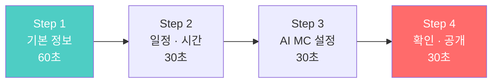

### 12.2 Step 1: 기본 정보

```
┌──────────────────────────────────────────────┐
│  ← 모임 만들기                        Step 1/4│
│  ■■■░░░░░░░░░  25%                           │
│  ━━━━━━━━━━━━━━━━━━━━━━━━━━━━━━━━━━━━━━━━  │
│                                              │
│  모임 유형을 선택하세요                        │
│                                              │
│  ┌────────┐  ┌────────┐  ┌────────┐         │
│  │📖      │  │💬      │  │🎯      │         │
│  │같은 책 │  │자유    │  │프로젝트│         │
│  │함께읽기│  │주제    │  │        │         │
│  │ [선택] │  │        │  │        │         │
│  └────────┘  └────────┘  └────────┘         │
│                                              │
│  책 제목                                      │
│  ┌──────────────────────────── [🔍] ┐       │
│  │  정의란 무엇인가                    │       │
│  └──────────────────────────────────┘       │
│  → AI가 자동으로 책 정보 + 표지 입력          │
│                                              │
│  대상                                        │
│  [초등]  [중등]  [●고등]  [일반]              │
│                                              │
│  모임 이름 (AI 자동 제안, 수정 가능)           │
│  ┌──────────────────────────────────┐       │
│  │  철학 입문: 정의란 무엇인가 함께 읽기 │       │
│  └──────────────────────────────────┘       │
│                                              │
│  모임 소개 (AI 자동 생성, 수정 가능)           │
│  ┌──────────────────────────────────┐       │
│  │  마이클 샌델의 <정의란 무엇인가>를  │       │
│  │  4주에 걸쳐 함께 읽고 토론합니다... │       │
│  └──────────────────────────────────┘       │
│                                              │
│  분야 태그                                    │
│  [#철학]  [#윤리]  [+ 추가]                   │
│                                              │
│                                   [다음 →]   │
│                                              │
└──────────────────────────────────────────────┘
```

### 12.3 Step 2: 일정 · 시간 (점진적 확장 설정)

```
┌──────────────────────────────────────────────┐
│  ← 모임 만들기                        Step 2/4│
│  ■■■■■■░░░░░░  50%                           │
│  ━━━━━━━━━━━━━━━━━━━━━━━━━━━━━━━━━━━━━━━━  │
│                                              │
│  방식                                        │
│  [●온라인]  [오프라인]  [하이브리드]           │
│                                              │
│  요일과 시간                                  │
│  [수요일 ▼]  [20:00 ▼]                       │
│                                              │
│  기간                                        │
│  [4주 ▼]   시작일 [2026-03-05]               │
│                                              │
│  인원                                        │
│  최소 [3▼]명 ~ 최대 [8▼]명                    │
│                                              │
│  ━━━ ⏱️ 시간 확장 설정 ━━━━━━━━━━━━━━━━━━  │
│                                              │
│  시작 시간                                    │
│  20분  ○──────●──────○  90분                  │
│                 30분                          │
│                                              │
│  최대 시간                                    │
│  20분  ○──────────●──○  90분                  │
│                   50분                        │
│                                              │
│  확장 속도                                    │
│  ( ) 매회 +5분   (●) 2회마다 +10분            │
│  ( ) 3회마다 +10분  ( ) 수동 조절              │
│                                              │
│  📋 예상 시간표                                │
│  1~2회: 30분 → 3~4회: 40분 → 5회~: 50분      │
│                                              │
│                          [← 이전]  [다음 →]  │
│                                              │
└──────────────────────────────────────────────┘
```

---

## 13. 온보딩 & 프로필 화면

### 13.1 온보딩 (3장 스와이프)

```
┌──────────────────────────────────────────────┐
│                                              │
│                                              │
│           [일러스트: 사람들이 책을             │
│            들고 대화하는 장면]                 │
│                                              │
│                                              │
│        "20분이면 충분해요"                     │
│                                              │
│   부담 없는 20분 독서 대화로 시작하고          │
│   점점 깊어지는 토론을 경험하세요              │
│                                              │
│              ○ ● ○                            │
│                                              │
│          [다음]                               │
│                                              │
│   이미 계정이 있나요? [로그인]                 │
│                                              │
└──────────────────────────────────────────────┘
```

### 13.2 프로필 설정

```
┌──────────────────────────────────────────────┐
│  프로필을 만들어 주세요                        │
│  ━━━━━━━━━━━━━━━━━━━━━━━━━━━━━━━━━━━━━━━━  │
│                                              │
│         [📷 프로필 사진]                       │
│                                              │
│  닉네임                                      │
│  ┌──────────────────────────────────┐       │
│  │  서연                             │       │
│  └──────────────────────────────────┘       │
│                                              │
│  나는                                        │
│  [초등학생]  [중학생]  [●고등학생]  [대학생+]  │
│                                              │
│  학년 (선택)                                  │
│  [고등학교 2학년 ▼]                            │
│                                              │
│  관심 분야 (복수 선택)                         │
│  [●철학]  [●심리]  [경영]  [역사]              │
│  [과학]   [문학]   [사회]  [예술]              │
│                                              │
│  독서 토론 경험                                │
│  (●) 처음이에요                               │
│  ( ) 몇 번 해봤어요                           │
│  ( ) 자주 해요                                │
│                                              │
│  ━━━━━━━━━━━━━━━━━━━━━━━━━━━━━━━━━━━━━━  │
│                                              │
│  [시작하기]                                   │
│                                              │
└──────────────────────────────────────────────┘
```

### 13.3 대화 서약 화면

```
┌──────────────────────────────────────────────┐
│                                              │
│  📜 리딩크루 대화 서약                         │
│  ━━━━━━━━━━━━━━━━━━━━━━━━━━━━━━━━━━━━━━━━  │
│                                              │
│  리딩크루에서 우리는                           │
│                                              │
│  ┌──────────────────────────────────────┐    │
│  │                                      │    │
│  │  1. 의견이 달라도 사람을 존중합니다   │    │
│  │  2. 근거 없는 비난 대신 이유를 말합니다│    │
│  │  3. 말하기 전에 먼저 경청합니다       │    │
│  │  4. 모르는 것을 부끄러워하지 않습니다 │    │
│  │  5. 다른 경험과 관점을 환영합니다     │    │
│  │  6. 욕설, 비방, 차별 없는 대화를 합니다│    │
│  │                                      │    │
│  └──────────────────────────────────────┘    │
│                                              │
│  "생각이 다른 건 풍요이고,                     │
│   존중하며 나누는 건 지혜입니다."               │
│                                              │
│  ☑️ 위 내용에 동의합니다                       │
│                                              │
│  [동의하고 시작하기]                           │
│                                              │
└──────────────────────────────────────────────┘
```


---

## 14. 디자인 시스템

### 14.1 컬러 팔레트

| 용도 | 컬러 | 코드 | 사용 위치 |
|------|------|------|----------|
| **Primary** | 민트 그린 | `#4ECDC4` | CTA 버튼, 활성 상태, 링크 |
| **Secondary** | 코랄 레드 | `#FF6B6B` | 강조, 라이브 표시, 공식 뱃지 |
| **Accent** | 스카이 블루 | `#45B7D1` | 학습 콘텐츠, 정보 카드 |
| **Success** | 소프트 그린 | `#96CEB4` | 완료, 성장, 성공 상태 |
| **Warning** | 골드 옐로우 | `#FFD700` | 주의, 심화 난이도 |
| **Background** | 아이보리 | `#FAF8F5` | 앱 배경 (눈의 피로 최소) |
| **Card BG** | 화이트 | `#FFFFFF` | 카드, 모달 배경 |
| **Text Primary** | 차콜 | `#2D3436` | 제목, 본문 |
| **Text Secondary** | 그레이 | `#636E72` | 부가 텍스트 |
| **Divider** | 라이트 그레이 | `#E8E8E8` | 구분선 |

### 14.2 타이포그래피

| 용도 | 크기 | 굵기 | 행간 | 예시 |
|------|:---:|:---:|:---:|------|
| **H1 (화면 제목)** | 24px | Bold | 1.3 | "철학 입문: 정의란 무엇인가" |
| **H2 (섹션 제목)** | 20px | SemiBold | 1.3 | "주차별 커리큘럼" |
| **H3 (카드 제목)** | 17px | SemiBold | 1.4 | "미움받을 용기" |
| **Body (본문)** | 15px | Regular | 1.6 | 모임 소개 텍스트 |
| **Caption (부가)** | 13px | Regular | 1.4 | "매주 수 20:00 · 4주" |
| **Label (태그/뱃지)** | 11px | Medium | 1.2 | "#철학" "공식" |

> 폰트: **Pretendard** (한글) + **Inter** (영문/숫자)

### 14.3 핵심 컴포넌트

#### 모임 카드 (MeetingCard)

```
┌────────────────────────────┐
│  ┌────────────────────┐    │   크기: 가로 160px / 세로 220px
│  │  [책 표지]          │    │   모서리: 12px radius
│  │                    │    │   그림자: 0 2px 8px rgba(0,0,0,0.08)
│  │  🎓 공식  ⭐ 입문  │    │
│  └────────────────────┘    │   뱃지: 좌상단 오버레이
│  미움받을 용기               │   난이도: 우상단 오버레이
│  중등 · 4주 · 20분 시작     │
│  참여 5/8명                 │   하단: 2줄 텍스트
│  ★ 4.8                     │
└────────────────────────────┘
```

#### AI MC 말풍선 (AIMCBubble)

```
┌──────────────────────────────────────┐
│  🤖 AI MC                            │  배경: #F0F9F8 (민트 톤)
│  ─────────────────────────────────── │  테두리: 1px #4ECDC4
│  "좋은 의견이에요!                    │  모서리: 16px
│   다른 분들은 어떻게 생각하시나요?"    │  아이콘: 로봇 이모지
│                                      │
│  ❓ 현재 질문                         │  질문 박스: 내부 카드
│  ┌─────────────────────────────────┐ │  배경: white
│  │ "열등감이 도움이 된 경험은?"     │ │  테두리: 1px dashed #4ECDC4
│  └─────────────────────────────────┘ │
└──────────────────────────────────────┘
```

#### 토론 타이머 (SessionTimer)

```
⏱️ 12:34 / 40:00
▓▓▓▓▓▓▓▓▓▓▓░░░░░░░░░░░░░░░░░░░  31%

색상 변화:
- 0~70%: #4ECDC4 (민트, 여유)
- 70~90%: #FFD700 (골드, 마무리 준비)
- 90~100%: #FF6B6B (코랄, 마무리 시간)
```

#### 관점 보드 (ViewpointBoard)

```
┌──────────────────────────────────────┐
│  📊 실시간 관점 보드                  │  배경: white
│  ─────────────────────────────────── │  구분선: 세로 dashed
│                                      │
│  ┌──────────┐    ┌──────────┐       │  관점 카드:
│  │관점 A    │    │관점 B    │       │  좌: #E8F8F5 (그린 톤)
│  │"동기"    │    │"위험"    │       │  우: #FDF2F2 (레드 톤)
│  │서연,영호 │    │민준,수진 │       │
│  └──────────┘    └──────────┘       │
│           ┌──────────┐              │  접점: 하단 중앙
│           │ 💡 접점   │              │  배경: #FFF8E1 (골드 톤)
│           │"방향이    │              │
│           │ 중요하다" │              │
│           └──────────┘              │
└──────────────────────────────────────┘
```

### 14.4 아이콘 · 뱃지 체계

| 뱃지 유형 | 색상 | 아이콘 | 사용 위치 |
|----------|------|-------|----------|
| **공식 프로그램** | `#FF6B6B` | 🎓 | 모임 카드, 상세 |
| **사용자 모임** | `#4ECDC4` | 🌍 | 모임 카드, 상세 |
| **입문** | `#90EE90` | ⭐ | 난이도 표시 |
| **심화** | `#FFD700` | ⭐⭐ | 난이도 표시 |
| **융합** | `#FF6B6B` | ⭐⭐⭐ | 난이도 표시 |
| **모집중** | `#4ECDC4` | 🟢 | 상태 표시 |
| **진행중** | `#45B7D1` | 🔵 | 상태 표시 |
| **라이브** | `#FF6B6B` | 🔴 | 토론 진행 중 |
| **경청왕** | `#FFD700` | 👂 | 성장 뱃지 |
| **좋은반론** | `#4ECDC4` | 💬 | 성장 뱃지 |
| **매너마스터** | `#96CEB4` | 🏅 | 성장 뱃지 |

---

## 15. AI Agent 전체 구조

### 15.1 6-Agent 아키텍처

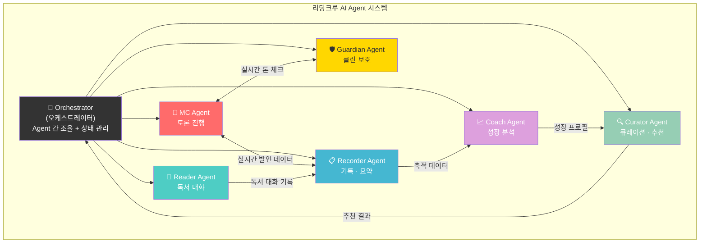

### 15.2 Agent 역할 매트릭스

| Agent | 트리거 | 입력 | 출력 | 연동 화면 |
|-------|--------|------|------|----------|
| **MC Agent** | 토론 세션 시작 | 책 정보, 인사이트, 멤버 발언, 세션 시간 | 질문, 멘트, 발언 관리, 요약 | 토론 라이브 |
| **Reader Agent** | 사용자가 AI 대화 요청 | 책 정보, 진도, 사용자 질문 | 소크라테스 질문, 배경지식, 팁 | AI 독서 대화 |
| **Recorder Agent** | 토론 중 + 종료 후 자동 | 음성 전사, 발언 데이터 | 요약, 관점 정리, 알림장 | 토론 종료, 기록 상세 |
| **Curator Agent** | 가입 시, 탐색 시, 기수 종료 시 | 프로필, 이력, 성장 데이터 | 모임 추천, 도서 추천 | 홈, 탐색, 성장 리포트 |
| **Coach Agent** | 월 1회 / 기수 종료 시 | 전체 참여 데이터 | 성장 리포트, 피드백 | 성장 리포트 |
| **Guardian Agent** | 토론 중 실시간 | 발언 텍스트, 톤 분석 | 경고, 전환 멘트, 리포트 | 토론 라이브 (숨김) |

### 15.3 Agent 기술 스택

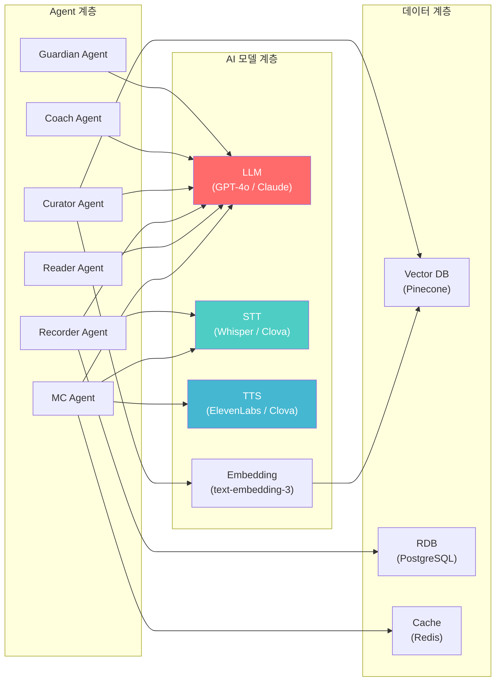


---

## 16. Agent 1 — MC Agent

### 16.1 Agent 명세

```yaml
name: MC Agent
description: 독서 토론을 진행하는 AI MC
trigger: 토론 세션 시작 시 활성화
lifecycle: 세션 시작 ~ 세션 종료

input:
  - session_config:  # 세션 설정
      book: { title, author, isbn }
      reading_range: "3~4장"
      session_time: 40  # 분
      session_step: 3   # 몇 번째 세션인지
      target: "중등"
      difficulty: "입문"
      members: [{ id, name, profile }]
  - insight_cards: [{ member, content }]  # 사전 작성 인사이트
  - realtime_speech: stream  # 실시간 음성 전사

output:
  - opening_message: string  # 오프닝 멘트
  - questions: [{ type, content, follow_ups }]  # 단계별 질문
  - facilitation: [{ type, target_member, message }]  # 발언 관리
  - summary: { key_points, viewpoints, best_insight }  # 토론 요약
  - reflection_question: string  # 성찰 질문

state:
  - current_phase: "checkin|discuss1|discuss2|reflect"
  - elapsed_time: int
  - member_speak_count: { member_id: count }
  - member_speak_time: { member_id: seconds }
  - viewpoints: [{ label, supporters, content }]
```

### 16.2 MC Agent 동작 순서도

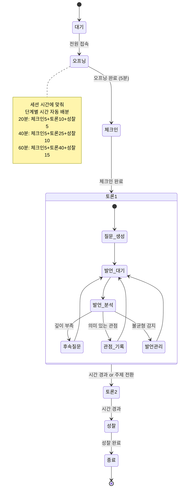

### 16.3 MC Agent 시간 적응 로직

```
┌─────────────────────────────────────────────────┐
│  MC Agent — 시간별 행동 분기                      │
│                                                 │
│  if session_time == 20:                          │
│    phases = [체크인(5), 감상나눔(10), 마무리(5)]  │
│    questions = 1개 (이해)                         │
│    follow_ups = 0                                │
│    viewpoint_board = OFF                         │
│                                                 │
│  elif session_time == 30:                        │
│    phases = [체크인(5), 토론(15), 정리(10)]       │
│    questions = 2개 (이해 + 감상)                  │
│    follow_ups = 1                                │
│    viewpoint_board = 간단 모드                    │
│                                                 │
│  elif session_time == 40:                        │
│    phases = [체크인(5), 토론(25), 성찰(10)]       │
│    questions = 2개 + 후속 1개                     │
│    follow_ups = 2                                │
│    viewpoint_board = ON                          │
│                                                 │
│  elif session_time >= 50:                        │
│    phases = [체크인(5), 토론1(15), 토론2(15),    │
│              적용(N), 성찰(15)]                   │
│    questions = 3개 (이해/분석/적용)               │
│    follow_ups = 3+                               │
│    viewpoint_board = 상세 모드                    │
│                                                 │
│  // 시간 초과 방지: 각 phase에 hard limit 설정   │
│  // 남은 시간 5분 → 강제 성찰 단계 전환          │
└─────────────────────────────────────────────────┘
```

### 16.4 MC Agent ↔ UI 연결

| MC Agent 출력 | UI 컴포넌트 | 화면 위치 |
|--------------|-----------|----------|
| `opening_message` | AIMCBubble | 토론 라이브 메인 |
| `questions[n]` | QuestionHighlight | AI MC 카드 내 질문 박스 |
| `facilitation` | AIMCBubble (소형) | AI MC 카드 하단 |
| `viewpoints` | ViewpointBoard | 토론 라이브 하단 |
| `member_speak_count` | MemberAvatar (링 색상) | 멤버 아바타 영역 |
| `elapsed_time` | SessionTimer | 상단 타이머 |
| `current_phase` | PhaseTab (활성 탭) | 타이머 하단 탭 |
| `summary` | SummaryCard | 토론 종료 화면 |

---

## 17. Agent 2 — Reader Agent

### 17.1 Agent 명세

```yaml
name: Reader Agent
description: 개인 독서 대화 파트너
trigger: 사용자가 "AI 독서 대화" 진입 시
lifecycle: 대화 시작 ~ 대화 종료 (비동기)

input:
  - user_profile: { name, grade, experience }
  - book: { title, author, current_progress }
  - conversation_history: [{ role, content }]
  - mode: "explore|perspective|connect|organize"

output:
  - response: string  # AI 응답
  - background_card: { title, content }  # 배경지식 카드 (선택적)
  - reading_tip: string  # 독서 팁 (선택적)
  - insight_prompt: string  # 인사이트 카드 작성 유도 (선택적)

behavior:
  - 정답을 주지 않고 질문으로 확장
  - 모드에 따라 대화 방향 조절
  - 학년 수준 맞춤 언어
  - 스포일러 절대 금지
  - 3연속 질문 금지 (압박감 방지)
```

### 17.2 Reader Agent 모드별 동작

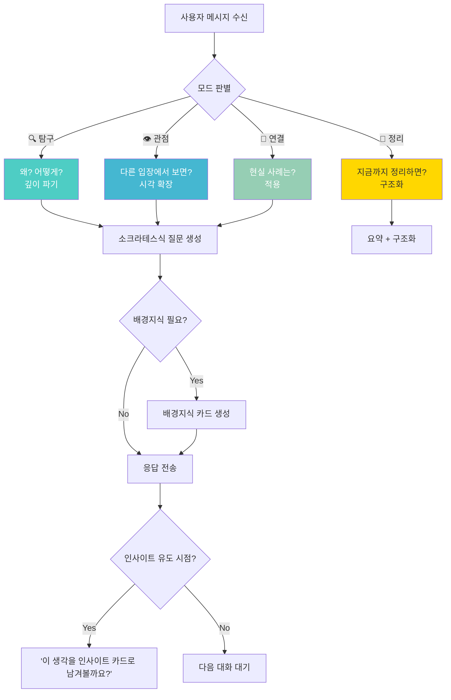

### 17.3 Reader Agent ↔ UI 연결

| Agent 출력 | UI 컴포넌트 | 화면 |
|-----------|-----------|------|
| `response` | ChatBubble (AI) | AI 독서 대화 |
| `background_card` | BackgroundCard (접이식) | 대화 내 인라인 |
| `reading_tip` | TipChip (상단) | 대화 상단 |
| `insight_prompt` | InsightPromptBar | 대화 하단 CTA |
| `mode` | ModeSelector (탭) | 대화 상단 |

---

## 18. Agent 3 — Recorder Agent

### 18.1 Agent 명세

```yaml
name: Recorder Agent
description: 토론 기록 자동 생성
trigger:
  - 토론 중: STT 스트림 수신 시 실시간 전사
  - 토론 후: 세션 종료 시 자동 요약 생성
lifecycle: 세션 시작 ~ 알림장 발송 완료

input:
  - speech_stream: audio/text  # 실시간 음성 / 전사
  - session_info: { meeting, season, week, members }
  - mc_agent_data: { questions, viewpoints, phases }

output:
  - transcript: text  # 전체 전사본
  - summary:
      key_points: [string]  # 핵심 3포인트
      viewpoint_comparison:
        - { label, claim, evidence, supporters }
      best_insight: { member, content }
      member_highlights: [{ member, key_quote }]
  - participation:
      - { member, speak_count, speak_time, question_count }
  - notification:  # 알림장
      parent_summary: string  # 학부모용 요약 (초중고)
      next_week_guide: string  # 다음 주 안내
  - growth_data:  # Coach Agent에 전달
      - { member, metrics }
```

### 18.2 Recorder Agent 동작 타임라인

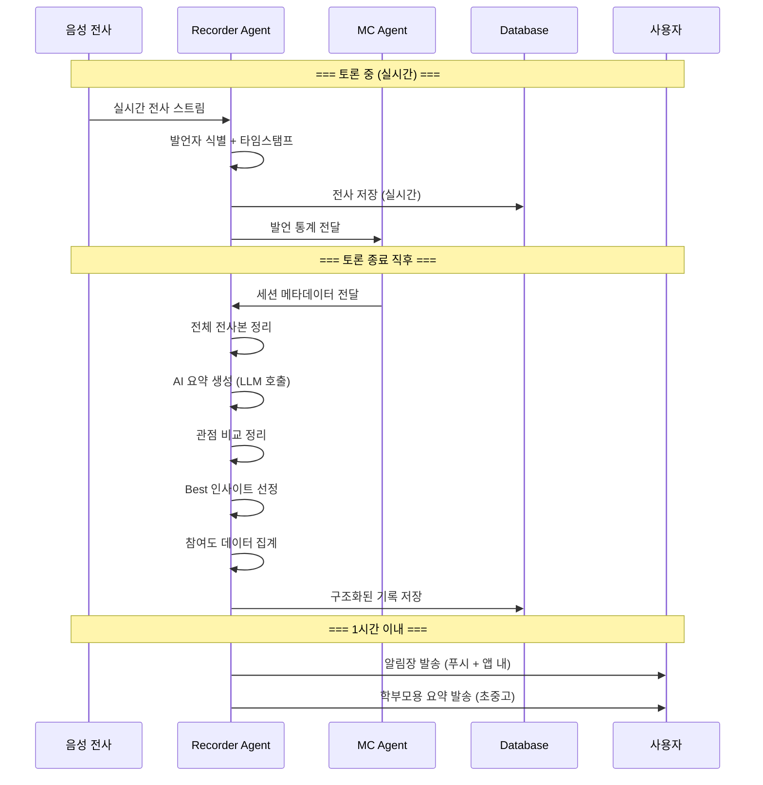

### 18.3 Recorder Agent ↔ UI 연결

| Agent 출력 | UI 컴포넌트 | 화면 |
|-----------|-----------|------|
| `summary.key_points` | SummaryCard | 토론 종료 화면 |
| `summary.viewpoint_comparison` | ViewpointCompare | 토론 종료 / 기록 상세 |
| `summary.best_insight` | HighlightCard | 토론 종료 / 홈 피드 |
| `participation` | ParticipationChart | 기록 상세 |
| `notification` | PushNotification + InAppCard | 알림 / 홈 |
| `transcript` | TranscriptView | 기록 상세 (접이식) |

---

## 19. Agent 4 — Curator Agent

### 19.1 Agent 명세

```yaml
name: Curator Agent
description: 콘텐츠 큐레이션 및 맞춤 추천
trigger:
  - 가입 시: 초기 프로필 기반 추천
  - 탐색 시: 실시간 필터 + 추천
  - 기수 종료 시: 다음 단계 추천
  - 홈 진입 시: 개인화 피드 생성
lifecycle: 항상 활성 (이벤트 기반)

input:
  - user_profile: { grade, interests, experience }
  - reading_history: [{ book, completion, rating }]
  - meeting_history: [{ meeting, season, difficulty, satisfaction }]
  - growth_data: { from Coach Agent }
  - available_meetings: [{ meeting details }]

output:
  - recommended_meetings: [{ meeting, reason, match_score }]
  - recommended_books: [{ book, reason }]
  - next_level_suggestion: { ready: bool, suggestion }
  - home_feed: [{ type, content, priority }]
  - search_results: [{ meeting, relevance_score }]

algorithm:
  - Collaborative Filtering: 비슷한 프로필 사용자가 좋아한 모임
  - Content-based: 관심 분야 + 난이도 매칭
  - Growth-based: Coach Agent 데이터 기반 다음 단계 추천
```

### 19.2 Curator Agent 추천 로직

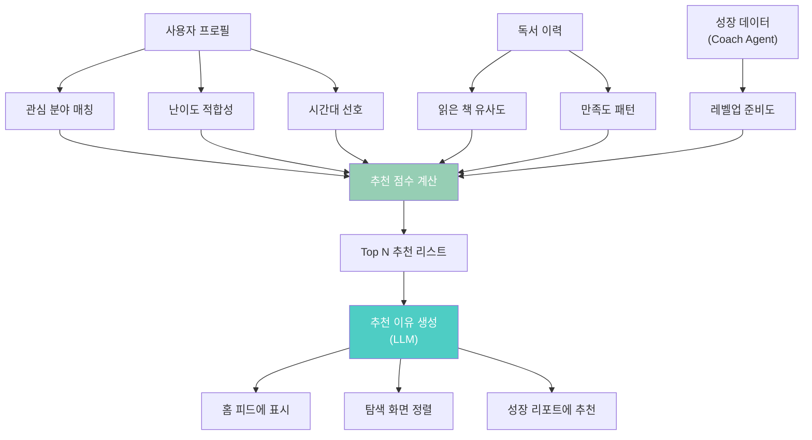

### 19.3 Curator Agent ↔ UI 연결

| Agent 출력 | UI 컴포넌트 | 화면 |
|-----------|-----------|------|
| `recommended_meetings` | MeetingCarousel | 홈 추천 섹션 |
| `home_feed` | HomeFeed (전체 구성) | 홈 화면 |
| `search_results` | SearchResultList | 탐색 검색 결과 |
| `next_level_suggestion` | LevelUpCard | 성장 리포트 하단 |

---

## 20. Agent 5 — Coach Agent

### 20.1 Agent 명세

```yaml
name: Coach Agent
description: 사고력 성장 분석 및 피드백
trigger:
  - 월 1회 정기 리포트
  - 기수 종료 시 종합 리포트
  - 사용자 요청 시
lifecycle: 비동기 배치 처리

input:
  - user_profile: { grade, history }
  - participation_data: [{ from Recorder Agent }]
  - speech_analysis:
      critical_thinking_score: float
      multi_perspective_score: float
      evidence_based_score: float
      empathetic_listening_score: float

output:
  - growth_report:
      overall_grade: string  # "B+ → A-"
      dimension_scores: { comprehension, analysis, argumentation, synthesis }
      strengths: [{ description, example }]
      growth_point: { description, suggestion }
      next_recommendation: { book, meeting }
  - parent_report: string  # 학부모용 (초중고)
  - portfolio_entry: { summary, key_achievements }
```

### 20.2 Coach Agent 성장 측정 프레임워크

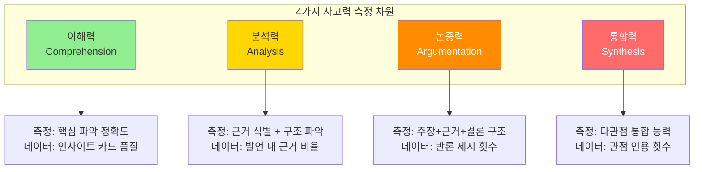

### 20.3 Coach Agent ↔ UI 연결

| Agent 출력 | UI 컴포넌트 | 화면 |
|-----------|-----------|------|
| `growth_report.dimension_scores` | RadarChart + BarChart | 성장 리포트 |
| `growth_report.overall_grade` | GradeCard | 성장 리포트 상단 |
| `growth_report.strengths` | StrengthList | 성장 리포트 중간 |
| `growth_report.growth_point` | FeedbackCard | 성장 리포트 중간 |
| `badges` | BadgeGrid | 성장 리포트 / 프로필 |
| `parent_report` | ParentReportView | 별도 공유 링크 |

---

## 21. Agent 6 — Guardian Agent

### 21.1 Agent 명세

```yaml
name: Guardian Agent
description: 건전한 토론 문화 실시간 보호
trigger: 토론 세션 중 실시간 (항상 백그라운드)
lifecycle: 세션 시작 ~ 세션 종료

input:
  - realtime_text: stream  # 실시간 전사 텍스트
  - tone_analysis: { sentiment, intensity }
  - member_interaction: [{ from, to, type }]

output:
  - alert_level: 0|1|2|3  # 정상/경미/반복/심각
  - redirect_message: string  # MC Agent에 전달할 전환 멘트
  - private_warning: { member, message }  # 개인 알림
  - session_report: { clean_score, incidents }

detection_targets:
  - profanity: 욕설/비속어 (한/영/변형)
  - personal_attack: 인신공격 패턴
  - discrimination: 차별 발언
  - bullying: 반복적 조롱/비하
  - off_topic_attack: 논점 이탈 공격
  - tone_deterioration: 전체 분위기 악화

response_strategy:
  level_1:  # 경미
    action: MC Agent에 자연스러운 주제 전환 요청
    ui: 없음 (사용자에게 보이지 않음)
  level_2:  # 반복
    action: 해당 멤버에게 개인 알림 표시
    ui: 토스트 알림 (해당 멤버만)
  level_3:  # 심각
    action: 발언 일시 중지 + 운영팀 알림
    ui: 모달 경고 (해당 멤버) + 운영자 알림
```

### 21.2 Guardian Agent 동작 플로우

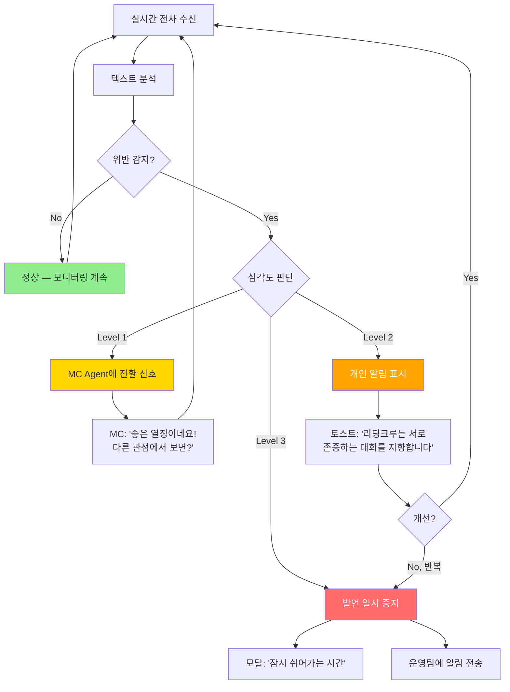

### 21.3 Guardian Agent ↔ UI 연결

| Agent 출력 | UI 컴포넌트 | 표시 대상 |
|-----------|-----------|----------|
| `level_1 redirect` | (없음 — MC Agent 경유) | 전체 (자연스러운 전환) |
| `level_2 warning` | ToastNotification | **해당 멤버만** |
| `level_3 suspend` | WarningModal | **해당 멤버** |
| `level_3 admin_alert` | AdminNotification | **운영자/관리자** |
| `session_report.clean_score` | CleanScoreBadge | 토론 종료 화면 |


---

## 22. Agent 오케스트레이션

### 22.1 Orchestrator 구조

> **Orchestrator는 직접 콘텐츠를 생성하지 않고, Agent 간 메시지 라우팅과 상태를 관리합니다.**

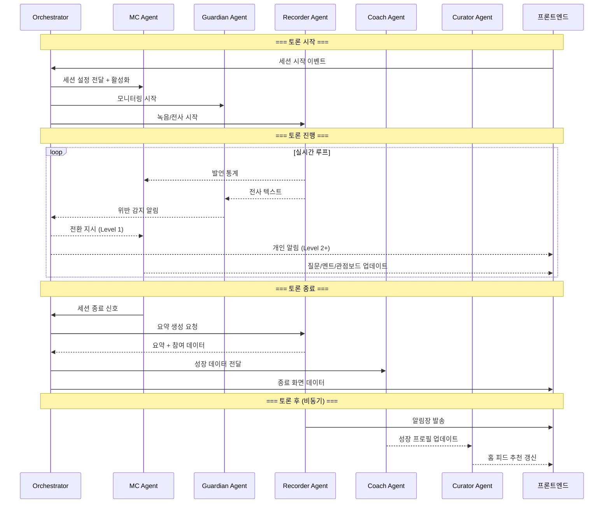

### 22.2 Agent 간 데이터 흐름 요약

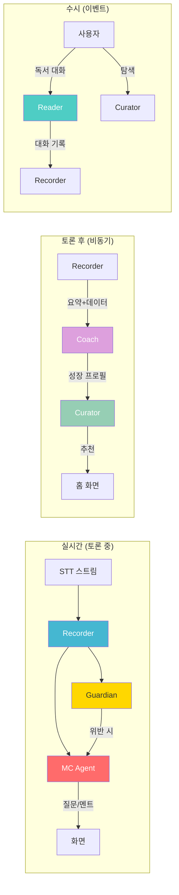

### 22.3 Agent 상태 관리

| 상태 | MC | Reader | Recorder | Curator | Coach | Guardian |
|------|:---:|:---:|:---:|:---:|:---:|:---:|
| **앱 시작** | sleep | sleep | sleep | **active** | sleep | sleep |
| **홈 화면** | sleep | sleep | sleep | **active** | sleep | sleep |
| **AI 대화** | sleep | **active** | logging | sleep | sleep | sleep |
| **토론 대기** | warming | sleep | ready | sleep | sleep | ready |
| **토론 진행** | **active** | sleep | **active** | sleep | sleep | **active** |
| **토론 종료** | summary | sleep | **active** | sleep | triggered | sleep |
| **리포트 조회** | sleep | sleep | sleep | active | **active** | sleep |

---

## 23. Agent ↔ UI 연결 맵

### 23.1 전체 연결 매트릭스

| 화면 | MC | Reader | Recorder | Curator | Coach | Guardian |
|------|:---:|:---:|:---:|:---:|:---:|:---:|
| **홈** | — | — | 인기 인사이트 | **추천 피드** | — | — |
| **탐색** | — | — | — | **검색+필터** | — | — |
| **모임 상세** | 질문 미리보기 | — | 기수 아카이브 | 유사 추천 | — | — |
| **토론 대기** | 오늘 주제 | — | — | — | — | — |
| **토론 라이브** | **질문/멘트/관점** | — | **실시간 전사** | — | — | **실시간 모니터** |
| **토론 종료** | — | — | **요약/비교** | — | — | 클린 점수 |
| **AI 독서 대화** | — | **대화/팁/배경** | 대화 기록 | — | — | — |
| **내 모임** | — | — | 기록 열람 | — | — | — |
| **성장 리포트** | — | — | — | 다음 추천 | **리포트 전체** | — |
| **학습 허브** | — | 연습 퀴즈 | — | 추천 강의 | — | — |
| **프로필** | — | — | — | — | 뱃지/등급 | — |

### 23.2 화면별 Agent 호출 시퀀스

#### 토론 라이브 (가장 복잡)

```
┌─────────────────────────────────────────────────────┐
│  토론 라이브 화면                                     │
│                                                     │
│  ┌──────────┐   ┌──────────┐   ┌──────────┐        │
│  │ MC Agent │   │Recorder  │   │Guardian  │        │
│  │  (주역)  │   │ (기록)   │   │ (감시)   │        │
│  └─────┬────┘   └─────┬────┘   └─────┬────┘        │
│        │              │              │              │
│   질문 생성 ────→ UI: 질문 카드 표시                  │
│        │              │              │              │
│        │         전사 저장 ─────→ 텍스트 분석         │
│        │              │              │              │
│   발언 관리 ←── 발언 통계      위반 감지?            │
│        │              │         │    │              │
│   멘트 출력 ────→ UI: MC 말풍선  │    │              │
│        │              │         │    │              │
│        │              │    No ←─┘    │              │
│        │              │              │              │
│   관점 정리 ────→ UI: 관점 보드  Yes →│              │
│        │              │              │              │
│  ← 전환 지시 ─────────────── Level 1 │              │
│        │              │              │              │
│   자연스럽게                    Level 2 →│            │
│   주제 전환 ───→ UI: MC 멘트    UI: 토스트 알림       │
│        │              │              │              │
│  종료 신호 ─→ 요약 생성         모니터링 종료         │
│        │         │                                  │
│        │    UI: 종료 화면                             │
│        │         │                                  │
│        │    알림장 발송 (1시간 내)                     │
│                                                     │
└─────────────────────────────────────────────────────┘
```

---

## 부록: 화면 설계 체크리스트

### A. 접근성 (Accessibility)

| 항목 | 기준 | 적용 |
|------|------|------|
| **색상 대비** | WCAG AA 4.5:1 이상 | 모든 텍스트 |
| **터치 영역** | 최소 44x44px | 모든 버튼 |
| **폰트 크기** | 최소 13px | 모든 텍스트 |
| **다크모드** | 지원 | Phase 2 |
| **스크린리더** | 주요 화면 지원 | 라벨링 완료 |
| **키보드 네비게이션** | 웹에서 완전 지원 | 탭 순서 설정 |

### B. 반응형 레이아웃

| 디바이스 | 화면 폭 | 레이아웃 변화 |
|---------|:---:|------|
| **모바일** | ~428px | 단일 컬럼, 탭 바 하단 |
| **태블릿** | 429~1024px | 토론 시 사이드 패널 등장 |
| **웹** | 1025px~ | 2~3컬럼, 사이드바 네비게이션 |

### C. 성능 기준

| 항목 | 목표 | 비고 |
|------|:---:|------|
| **첫 화면 로딩** | < 2초 | 스켈레톤 UI 표시 |
| **화면 전환** | < 300ms | 애니메이션 포함 |
| **AI MC 응답** | < 3초 | 스트리밍 표시 |
| **실시간 전사** | < 1초 지연 | STT 최적화 |
| **알림장 생성** | < 1시간 | 토론 종료 후 |
| **추천 갱신** | < 5초 | 화면 진입 시 |

### D. 전체 화면 수

| 카테고리 | 화면 수 | 주요 화면 |
|---------|:---:|------|
| **온보딩** | 5 | 소개 3장 + 로그인 + 프로필 + 서약 |
| **홈** | 1 | 개인화 피드 |
| **탐색** | 3 | 메인 + 검색결과 + 필터 |
| **모임** | 4 | 상세 + 커리큘럼 + 기록 + 리뷰 |
| **토론** | 3 | 대기실 + 라이브 + 종료/요약 |
| **AI 대화** | 1 | 독서 대화 |
| **내 모임** | 3 | 참여중 + 운영중 + 아카이브 |
| **MY** | 5 | 프로필 + 성장리포트 + 학습허브 + 독서기록 + 설정 |
| **만들기** | 4 | 위저드 4단계 |
| **학습** | 3 | 허브 + 강의뷰어 + 퀴즈 |
| **합계** | **32** | — |

---

> **"화면 뒤에 6개의 AI Agent가 협업하고,**
> **화면 앞에서 사용자는 단순하게 읽고, 말하고, 성장합니다.**
> **복잡함은 AI에게, 즐거움은 사용자에게."**

---

*이 문서는 리딩크루(ReadingCrew)의 화면 설계서와 AI Agent 설계서를 정의합니다.*
*5단계 콘텐츠 중심 설계와 함께 참고하여 개발을 진행합니다.*
