# 7단계 — 리딩크루 : 관심사 50 × 크루패스(CluePath) 실행 설계서

> **한 줄 정의**
> aicareerpath.co.kr이 **"직업을 적성으로 매칭해 커리어 패스를 그려주는 곳"**이라면,
> 리딩크루는 **"인간 관심사 50개를 적성으로 매칭해 '진짜 문제' 패스를 함께 그리는 곳"**이다.
>
> **관심사 = 직업이다.** 직업이 "무엇을 하며 먹고사는가"라면, 관심사는 **"무엇을 붙잡고 평생 질문하는가"**다.
> 직업은 바뀌어도 관심사는 남는다. 그래서 관심사가 더 먼저다.
>
> **AI는 제공하지 않는다. 템플릿을 제공한다.**
> 답을 주면 판단력이 죽는다. 우리는 **양식(Form)·순서(Flow)·기준(Rubric)·예시(Example)**만 준다.

**이 문서의 성격**: 기획서가 아니라 **실행 문서**다.
- 모든 템플릿은 **그대로 복사해서 오늘 수업에 쓸 수 있는 완성 양식**이다.
- 모든 양식에는 **빈 양식 + 실제 작성 예시**가 붙어 있다.
- 모든 화면에는 **URL · 진입 경로 · 이탈 경로 · 성공 지표**가 붙어 있다.

**짝 문서**
- [2032_미네르바렌즈_진짜질문_설계서.md](./2032_미네르바렌즈_진짜질문_설계서.md) — 렌즈 L1~L12 (문제를 보는 도구)
- [2032_인간관심사20_생애주기_항해도.md](./2032_인간관심사20_생애주기_항해도.md) — 관심사 원형 + 생애주기 해상도
- [6단계-리딩크루_유저시나리오_SMILE형.md](./6단계-리딩크루_유저시나리오_SMILE형.md) — SMILE 5단계 + 관심사 50 카테고리

---

## 목차

**PART I — 원리와 재료**
0. [이 문서 사용법 — 역할별 3분 안내](#0-이-문서-사용법--역할별-3분-안내)
1. [전략 — aicareerpath 골격의 정확한 이식](#1-전략--aicareerpath-골격의-정확한-이식)
2. [관심사 50 — 직업 카드의 대응물](#2-관심사-50--직업-카드의-대응물)
3. [관심사 카드 완성 예시 5종](#3-관심사-카드-완성-예시-5종)

**PART II — 진단**
4. [CIP 관심사 적성검사 — 전문(全文) 설계](#4-cip-관심사-적성검사--전문-설계)
5. [CIP 문항 36개 전문](#5-cip-문항-36개-전문)
6. [채점 규칙과 결과 산출 — 계산 예시 3인](#6-채점-규칙과-결과-산출--계산-예시-3인)

**PART III — 구조**
7. [사이트맵 — 전체 · URL 라우팅표](#7-사이트맵--전체--url-라우팅표)
8. [주요 페이지 상세 명세 24종](#8-주요-페이지-상세-명세-24종)
9. [UI 디자인 시스템과 화면 와이어프레임](#9-ui-디자인-시스템과-화면-와이어프레임)

**PART IV — 템플릿 (핵심)**
10. [템플릿 센터 — 전체 24종 지도](#10-템플릿-센터--전체-24종-지도)
11. [T-01 ~ T-08 : 발견 단계 템플릿](#11-t-01--t-08--발견-단계-템플릿)
12. [T-09 ~ T-16 : 정의 단계 템플릿](#12-t-09--t-16--정의-단계-템플릿)
13. [T-17 ~ T-24 : 실행 단계 템플릿](#13-t-17--t-24--실행-단계-템플릿)
14. [루브릭 6종](#14-루브릭-6종)

**PART V — 사람과 흐름**
15. [페르소나 8인](#15-페르소나-8인)
16. [유저 시나리오 12종](#16-유저-시나리오-12종)
17. [교사 운영 시나리오 — 16주 커리큘럼](#17-교사-운영-시나리오--16주-커리큘럼)

**PART VI — 구축**
18. [크루패스 · 클루랩 상세 기능 명세](#18-크루패스--클루랩-상세-기능-명세)
19. [데이터 모델과 API](#19-데이터-모델과-api)
20. [개발 단계론 — Phase 1~4](#20-개발-단계론--phase-14)
21. [설계 근거 20조](#21-설계-근거-20조)
22. [차별점과 방어 자산](#22-차별점과-방어-자산)
23. [지표 · 실패 조건 · 운영 리스크](#23-지표--실패-조건--운영-리스크)

---

# PART I — 원리와 재료

## 0. 이 문서 사용법 — 역할별 3분 안내

| 당신이 | 먼저 읽을 곳 | 오늘 할 수 있는 것 |
|---|---|---|
| **학생** | §3 관심사 카드 예시 → §11 T-01 문제 카드 | 책 한 권 펴고 T-01 한 장 채우기 |
| **교사** | §17 16주 커리큘럼 → §14 루브릭 | 1주차 수업안 그대로 실행 |
| **기획자** | §7 사이트맵 → §8 페이지 명세 | 화면 정의서 작성 착수 |
| **개발자** | §19 데이터 모델 → §20 Phase 1 | 스키마 마이그레이션 작성 |
| **디자이너** | §9 디자인 시스템 | 컴포넌트 8종 시안 |
| **투자자/의사결정자** | §1 전략 → §22 차별점 → §23 지표 | 투자 판단 |

### 0.1 문서 전체를 관통하는 4개의 명제

```
명제 1. 문제를 찾는 능력은 가르칠 수 있다. 단, 답을 주지 않을 때만.
명제 2. 혼자 읽으면 확신이 자라고, 다르게 읽은 사람과 만나면 질문이 자란다.
명제 3. 완성된 프로젝트보다 죽은 가설의 기록이 더 많은 것을 증명한다.
명제 4. 도구가 답을 주면 학습자는 도구의 사용자가 되고,
        도구가 빈칸을 주면 학습자는 문제의 주인이 된다.
```

---

## 1. 전략 — aicareerpath 골격의 정확한 이식

### 1.1 왜 골격을 그대로 쓰는가

aicareerpath.co.kr의 강점은 콘텐츠가 아니라 **한 방향 파이프라인**이다.
"흩어진 정보 → 진단 → 매칭 → 경로 → 실행 → 증거"는 사용자를 **되돌아가지 않게** 밀어낸다.
리딩크루는 이 골격을 그대로 쓰고 **탑재물만 교체**한다.

| 레이어 | AI CareerPath | ReadingCrew (7단계) | 교체된 것 |
|---|---|---|---|
| ① 진단 | 직업 적성검사 | **CIP 관심사 적성검사** | 직업 → 관심사 |
| ② 매칭 | 추천 직업 Top N | **관심사 Top3 + 책 3권(정의·도구·반증)** | 직업 → 관심사·책 |
| ③ 탐색 | 직업 상세 / 현직자 후기 | **크루패스** — 문제만 찾는 아카이브 | 직업 정보 → 문제 정의서 |
| ④ 실행 | 커리어 실행 로드맵 | **클루랩** — 협업 프로젝트 4트랙 | 취업 준비 → 문제 해결 |
| ⑤ 증거 | 포트폴리오 | **문제 포트폴리오** (질문·폐기 이력) | 스펙 → 판단 이력 |
| ⑥ 공유 | 선배 경험 후기 | **개인/그룹/학급/학교/공개 5단위** | 개인 → 조직 |
| 엔진 | AI 추천 | **템플릿 24종 + 루브릭 6종** | AI → 사람 |

### 1.2 파이프라인

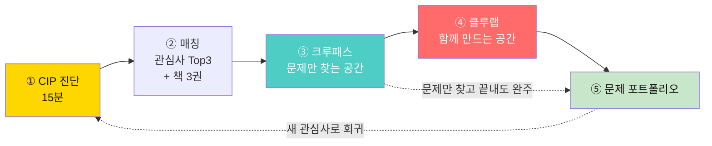

> **핵심 분기**: ③ → ⑤ 경로가 정식으로 열려 있다. **"문제만 찾고 끝내도 완주"**다.

### 1.3 "AI 없음"이 전략인 이유

| 만약 AI를 넣으면 | 결과 |
|---|---|
| AI가 관심사를 추천 | 학생은 결과를 **받는다**. 자기 이유를 못 만든다 |
| AI가 문제를 정의 | 문제 정의서가 다 비슷해진다. 교차 관점이 죽는다 |
| AI가 책을 요약 | **병렬 독서**가 무의미해진다 (요약만 교환) |
| AI가 프로젝트를 설계 | 실패 기록이 안 남는다. 배움의 핵심이 사라진다 |
| AI가 반박을 대신 | ⚔️ 반대편 역할이 형식화된다 |

대신 우리가 주는 것: **템플릿 24종 · 루브릭 6종 · 또래 사례 · 실패 사례.**
개인이 외부 AI를 쓰는 것은 자유다. 단 **플랫폼은 제공하지 않으며**,
**1차 데이터·반대편 인터뷰**처럼 AI로 채울 수 없는 칸을 필수로 둔다.

### 1.4 "원리만 있다" — 이 서비스의 재료는 5개뿐

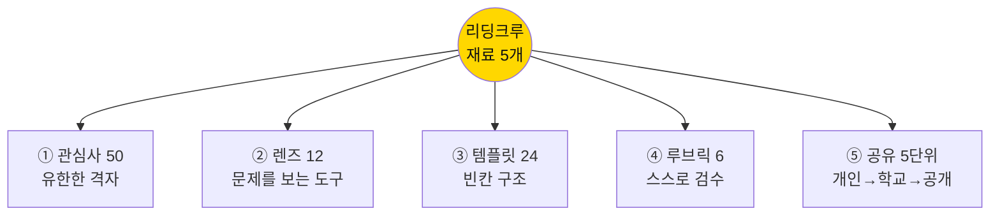

이 5개의 조합으로 모든 화면·기능·수업이 만들어진다. **그 밖의 기능은 넣지 않는다.**

---

## 2. 관심사 50 — 직업 카드의 대응물

### 2.1 구조 — 5영역 × 10

관심사 50은 [6단계 문서 §4](./6단계-리딩크루_유저시나리오_SMILE형.md)의 50개를 승계한다.

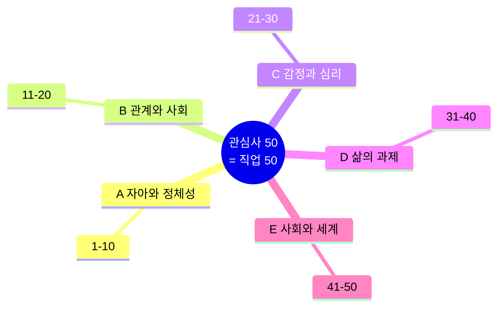

### 2.2 관심사 카드 8칸 규격 — 직업 카드와 1:1

| 칸 | 직업 카드 대응 | 내용 | 데이터 타입 |
|:-:|---|---|---|
| 1 | 직업명 | **관심사명 + 번호** | `string` |
| 2 | 하는 일 | **핵심 긴장** (답이 둘인 지점) | `text` |
| 3 | 주요 업무 | **질문 사다리** 초/중/고/대 4단 | `json[4]` |
| 4 | 필요 역량 | **주력 렌즈** 3개 (L1~L12) | `enum[3]` |
| 5 | 취업 시장 | **활동 인구** (사람·문제·프로젝트 수) | `stat` |
| 6 | 자격증 | **서가**: 정의 3 · 도구 3 · 반증 2 | `book[8]` |
| 7 | 흔한 착각 | **금지된 답** 3개 이상 | `text[]` |
| 8 | 진입 경로 | **첫 7일 액션** + 템플릿 링크 | `action[3]` |

> **7번 칸(금지된 답)이 이 규격의 서명이다.**
> 관심사 페이지 최상단에서 "누구나 3초 만에 떠올리는 답"을 먼저 봉인한다.
> 첫 생각을 봉인해야 두 번째 생각이 나온다.

### 2.3 관심사 50 요약표

| 영역 | # | 관심사 | 대표 긴장 (한 줄) | 주력 렌즈 |
|---|:-:|---|---|---|
| **A 자아** | 1 | 자아 정체성 | 나를 설명하는 말이 늘수록 나는 좁아진다 | L1 L7 L12 |
| | 2 | 자존감 | 인정받아야 서는가, 인정 없이도 서는가 | L5 L11 L12 |
| | 3 | 목적과 의미 | 의미는 찾는 것인가 만드는 것인가 | L1 L8 L10 |
| | 4 | 성장과 변화 | 변하고 싶은데 변한 나는 내가 맞는가 | L4 L6 L8 |
| | 5 | 고독과 외로움 | 혼자가 편한데 왜 불안한가 | L7 L8 L12 |
| | 6 | 완벽주의 | 기준을 낮추면 편해지는가 나빠지는가 | L3 L6 L11 |
| | 7 | 진정성 | 상황마다 다른 나 중 진짜는 누구인가 | L8 L11 L12 |
| | 8 | 시간과 죽음 | 유한을 알면 잘 사는가, 조급해지는가 | L1 L8 L10 |
| | 9 | 자유와 책임 | 선택지가 많을수록 자유로운가 | L3 L6 L7 |
| | 10 | 영성과 초월 | 증명 못 하는 것을 믿어도 되는가 | L9 L10 L12 |
| **B 관계** | 11 | 가족 관계 | 못 고르는 관계는 왜 가장 아픈가 | L5 L7 L8 |
| | 12 | 사랑과 친밀감 | 가까울수록 왜 덜 솔직해지는가 | L6 L11 L12 |
| | 13 | 우정과 신뢰 | 오래된 친구와 맞는 친구 중 무엇인가 | L4 L8 L12 |
| | 14 | 소속감 | 속하려면 얼마나 나를 지워야 하는가 | L3 L7 L12 |
| | 15 | 소통과 갈등 | 대화하면 정말 풀리는가 | L2 L6 L12 |
| | 16 | 권력과 지배 | 규칙은 누구를 위해 만들어졌는가 | L7 L9 L12 |
| | 17 | 용서와 화해 | 용서는 피해자의 의무인가 | L11 L12 L8 |
| | 18 | 공감과 이해 | 이해했다는 착각은 어떻게 생기는가 | L9 L11 L12 |
| | 19 | 리더십 | 좋은 사람과 좋은 리더는 같은가 | L3 L6 L7 |
| | 20 | 세대 갈등 | 세대 차이인가 자리 차이인가 | L7 L8 L9 |
| **C 감정** | 21 | 불안과 두려움 | 불안은 없애야 할 것인가 신호인가 | L1 L5 L7 |
| | 22 | 분노와 조절 | 참는 것과 다스리는 것의 차이는 | L2 L7 L11 |
| | 23 | 슬픔과 상실 | 애도는 끝나야 하는가 | L8 L10 L12 |
| | 24 | 수치심과 죄책감 | 부끄러움은 나를 고치는가 가두는가 | L6 L7 L11 |
| | 25 | 중독과 집착 | 의지 문제인가 설계 문제인가 | L5 L6 L7 |
| | 26 | 번아웃과 무기력 | 쉬면 회복되는가, 구조가 그대로인데 | L6 L7 L4 |
| | 27 | 질투와 비교 | 비교를 끊으면 성장도 멈추는가 | L6 L8 L11 |
| | 28 | 트라우마 | 말하면 낫는가, 다시 아픈가 | L9 L10 L12 |
| | 29 | 감정 지능 | 감정을 관리 대상으로 보면 잃는 것은 | L1 L11 L12 |
| | 30 | 행복과 만족 | 행복을 목표로 삼으면 멀어지는가 | L4 L10 L11 |
| **D 과제** | 31 | 진로와 직업 | 좋아하는 일과 잘하는 일이 다르면 | L3 L4 L9 |
| | 32 | 경제와 돈 | 돈은 수단인가, 이미 목적이 되었는가 | L6 L7 L9 |
| | 33 | 교육과 학습 | 평가 없이 배움이 굴러가는가 | L1 L6 L7 |
| | 34 | 건강과 몸 | 알면서 왜 안 하는가 | L5 L6 L11 |
| | 35 | 창의성 | 새로움은 재능인가 환경인가 | L5 L8 L9 |
| | 36 | 결정과 선택 | 정보가 많을수록 잘 고르는가 | L3 L10 L11 |
| | 37 | 습관과 의지 | 의지가 약한가, 환경이 나쁜가 | L5 L6 L7 |
| | 38 | 균형 | 균형은 상태인가 계속 흔들리는 과정인가 | L3 L4 L6 |
| | 39 | 실패와 회복 | 실패는 자산인가, 그냥 손실인가 | L9 L10 L11 |
| | 40 | 노화와 전환 | 나이 듦은 상실인가 편집인가 | L8 L12 L7 |
| **E 세계** | 41 | 정의와 공정 | 같게 주는 것과 맞게 주는 것 | L7 L9 L12 |
| | 42 | 다양성과 차별 | 좋은 의도가 왜 차별이 되는가 | L6 L11 L12 |
| | 43 | 기술과 인간 | 편해질수록 못하게 되는 것은 | L6 L9 L10 |
| | 44 | 환경과 책임 | 개인 실천은 구조를 바꾸는가 가리는가 | L6 L7 L9 |
| | 45 | 폭력과 평화 | 평온한 곳에 폭력이 없다고 할 수 있는가 | L1 L7 L8 |
| | 46 | 미디어와 진실 | 사실 확인이 늘수록 믿음이 커지는가 | L9 L10 L11 |
| | 47 | 소비와 욕망 | 내가 원한 것인가 원하게 된 것인가 | L5 L6 L11 |
| | 48 | 문화와 전통 | 지킨다는 것은 누구의 기억을 지키는가 | L8 L9 L12 |
| | 49 | 시민 참여 | 참여했다는 느낌과 바뀌는 것의 차이 | L4 L6 L10 |
| | 50 | 글로벌 연결 | 연결될수록 서로를 아는가 | L7 L8 L9 |

### 2.4 렌즈 12 — 관심사 카드 4번 칸의 재료

| 렌즈 | 이름 | 한 문장 | 학생이 던지는 질문 |
|---|---|---|---|
| **L1** | 진짜문제 | 불편은 대개 증상이다 | "이건 문제인가, 다른 문제의 그림자인가?" |
| **L2** | 분해 | 큰 덩어리는 판단 불가 | "겹치지 않는 3조각으로 자르면?" |
| **L3** | 제약조건 | 제약이 없으면 설계도 없다 | "진짜로 못 넘는 벽은 무엇인가?" |
| **L4** | 격차분석 | 문제 = 현재와 목표의 거리 | "정확히 무엇이 비어 있나?" |
| **L5** | 다중원인 | 원인 하나짜리는 없다 | "범인을 3명 더 대보라면?" |
| **L6** | 시스템역학 | 누르면 다른 데가 튀어나온다 | "이걸 고치면 어디가 나빠지나?" |
| **L7** | 분석수준 | 개인/규칙/문화 | "사람 문제인가 규칙 문제인가?" |
| **L8** | 맥락 | 상황이 바뀌면 뜻이 달라진다 | "다른 학교/나라/시대에도 문제인가?" |
| **L9** | 근거의질 | 출처가 약하면 결론도 약하다 | "이 숫자는 누가 왜 만들었나?" |
| **L10** | 반증가능성 | 틀릴 수 없는 주장은 쓸모없다 | "내가 틀렸다면 무엇이 관찰되나?" |
| **L11** | 편향점검 | 나도 치우쳐 있다 | "나에게 유리해서 마음에 드는 건 아닌가?" |
| **L12** | 해석렌즈 | 같은 사실도 입장에 따라 다르다 | "가장 강하게 반대할 사람은?" |

---

## 3. 관심사 카드 완성 예시 5종

> 이 5개는 **운영진이 작성한 표준 샘플**이다. 나머지 45개도 동일 규격으로 작성한다.
> 개발 시 이 5개를 시드 데이터로 먼저 넣고 화면을 만든다.

---

### 3.1 예시 A — `#26 번아웃과 무기력`

```
┌────────────────────────────────────────────────────────────┐
│ ① 관심사       #26 번아웃과 무기력   · 영역 C 감정과 심리    │
├────────────────────────────────────────────────────────────┤
│ ② 핵심 긴장                                                  │
│    "쉬면 회복된다"고 하는데, 쉬고 와도 그대로다.              │
│    회복해야 할 것은 체력인가, 아니면 돌아갈 그 구조인가.      │
├────────────────────────────────────────────────────────────┤
│ ③ 질문 사다리                                                │
│  초등 · 재미있던 게 왜 갑자기 하기 싫어질까?                  │
│  중등 · 주말에 푹 쉬었는데 월요일에 왜 더 피곤할까?           │
│  고등 · '열심히'의 기준은 누가 정했고, 나는 왜 그걸 따르나?   │
│  대학 · 회복을 개인의 책임으로 만드는 구조는 무엇을 얻는가?   │
├────────────────────────────────────────────────────────────┤
│ ④ 주력 렌즈   L6 시스템역학 · L7 분석수준 · L4 격차분석      │
├────────────────────────────────────────────────────────────┤
│ ⑤ 활동 인구   342명 · 문제 88건 · 프로젝트 12건 · 실패 21건  │
├────────────────────────────────────────────────────────────┤
│ ⑥ 서가                                                       │
│   [정의서] 《번아웃 사회》 《피로사회》 《아무튼, 잠》         │
│   [도구서] 《일의 기쁨과 슬픔》 《에센셜리즘》 《쉼》          │
│   [반증서] 《게으름에 대한 찬양》 《우리는 왜 쉬지 못하는가》  │
├────────────────────────────────────────────────────────────┤
│ ⑦ 🚫 금지된 답 (봉인)                                        │
│   🚫 "휴식 시간을 정해두자"  → 이미 다들 안다. 안 지켜질 뿐  │
│   🚫 "스마트폰을 줄이자"     → 원인과 증상을 바꿔친 답        │
│   🚫 "마음챙김 앱"           → 앱 3만 개가 이미 있다          │
│   🚫 "번아웃 예방 교육"      → 교육이 부족해서 생긴 게 아니다 │
├────────────────────────────────────────────────────────────┤
│ ⑧ 첫 7일 액션                                                │
│   D1-7  T-03 에너지 로그 (하루 3회 · 1~10점 · 직전 활동)     │
│   D5    T-02 마찰 지점 표시 (에너지가 꺾인 순간 5개)         │
│   D7    T-06 반대편 후보 지목 ("내가 쉬면 곤란해지는 사람")   │
└────────────────────────────────────────────────────────────┘
```

**이 관심사에서 실제로 나온 문제 3건 (미리보기용)**

| 작성자 | 책 | 질문 선언문 | 상태 |
|---|---|---|---|
| 중2 서연 | 《번아웃 사회》 | "우리 반의 피로는 공부량이 아니라 **쉬는 시간이 5분 단위로 쪼개진 시간표**에서 온다" | 정의서 완성 |
| 고1 민준 | 《피로사회》 | "'자기계발'이라는 말이 붙은 활동은 왜 쉬어도 쉰 것 같지 않은가" | 반박 3건 수용 중 |
| 대2 지호 | 《게으름에 대한 찬양》 | "휴학은 회복인가, 회복을 개인 비용으로 떠넘기는 제도인가" | 프로젝트 T1 진행 |

**이 관심사의 실패 사례 1건**

> **2026-03-12 · 가설 폐기**
> 최초 가설: "학생 피로의 주원인은 스마트폰 사용 시간이다"
> 폐기 사유: 학급 32명 2주 로그 결과, **사용 시간 상위 5명 중 4명의 피로도가 하위권**.
> 오히려 **통학 시간 60분 이상** 집단에서 피로도가 뚜렷하게 높았다.
> 배운 것: 눈에 잘 보이는 변수를 원인으로 착각했다. (L5 다중원인 부족)

---

### 3.2 예시 B — `#41 정의와 공정`

```
┌────────────────────────────────────────────────────────────┐
│ ① 관심사       #41 정의와 공정   · 영역 E 사회와 세계        │
├────────────────────────────────────────────────────────────┤
│ ② 핵심 긴장                                                  │
│    똑같이 나누면 공정한가, 다르게 나눠야 공정한가.            │
│    둘 다 "공정"이라는 같은 단어를 쓴다.                       │
├────────────────────────────────────────────────────────────┤
│ ③ 질문 사다리                                                │
│  초등 · 똑같이 나눴는데 왜 누군가는 억울할까?                 │
│  중등 · 조별과제 점수를 똑같이 주는 건 공정한가?              │
│  고등 · 기회를 같게 주면 결과의 차이는 정당한가?              │
│  대학 · 절차가 공정하면 결과의 불평등은 정당화되는가?         │
├────────────────────────────────────────────────────────────┤
│ ④ 주력 렌즈   L7 분석수준 · L9 근거의질 · L12 해석렌즈       │
├────────────────────────────────────────────────────────────┤
│ ⑤ 활동 인구   517명 · 문제 143건 · 프로젝트 19건             │
├────────────────────────────────────────────────────────────┤
│ ⑥ 서가                                                       │
│   [정의서] 《정의란 무엇인가》 《공정하다는 착각》 《정의론》  │
│   [도구서] 《넛지》 《보이지 않는 여자들》 《불평등의 대가》   │
│   [반증서] 《능력주의는 허구인가》 《평등이라는 이름의 폭력》  │
├────────────────────────────────────────────────────────────┤
│ ⑦ 🚫 금지된 답                                               │
│   🚫 "모두에게 같은 기회를 주자"  → '같은 기회'의 정의가 쟁점 │
│   🚫 "규칙을 투명하게 하자"       → 투명해도 불공정할 수 있다 │
│   🚫 "다수결로 정하자"            → 다수결이 소수에게 공정한가│
├────────────────────────────────────────────────────────────┤
│ ⑧ 첫 7일 액션                                                │
│   D1  T-01 문제 카드 1장 (억울했던 규칙 1개)                 │
│   D3  T-11 분석수준 3층 나누기 (사람/규칙/문화)              │
│   D7  T-13 반대편 대변인 대본으로 1명 인터뷰                 │
└────────────────────────────────────────────────────────────┘
```

**교차 관심사 추천**: `#41 × #16 권력` / `#41 × #33 교육` / `#41 × #12 친밀감`
> `#41 × #12` 교차 질문 예시: **"친밀한 관계에서 '공정하게 하자'는 말은 왜 관계를 악화시키는가?"**

---

### 3.3 예시 C — `#43 기술과 인간`

```
┌────────────────────────────────────────────────────────────┐
│ ① 관심사       #43 기술과 인간   · 영역 E 사회와 세계        │
├────────────────────────────────────────────────────────────┤
│ ② 핵심 긴장                                                  │
│    기술은 능력을 늘려주는가, 능력을 대신해 없애는가.          │
│    계산기가 나온 뒤 우리는 계산을 더 잘하게 되었나.           │
├────────────────────────────────────────────────────────────┤
│ ③ 질문 사다리                                                │
│  초등 · 검색하면 다 나오는데 왜 외워야 할까?                  │
│  중등 · AI가 써준 글은 내 글인가?                             │
│  고등 · AI 채점이 사람 채점보다 공정한가?                     │
│  대학 · 평가 가능한 것만 교육이 되는 구조를 기술은 강화하는가?│
├────────────────────────────────────────────────────────────┤
│ ④ 주력 렌즈   L6 시스템역학 · L9 근거의질 · L10 반증가능성   │
├────────────────────────────────────────────────────────────┤
│ ⑤ 활동 인구   689명 · 문제 201건 · 프로젝트 27건             │
├────────────────────────────────────────────────────────────┤
│ ⑥ 서가                                                       │
│   [정의서] 《AI 2041》 《라이프 3.0》 《호모 데우스》          │
│   [도구서] 《기술의 충격》 《알고리즘이 지배한다》 《넥서스》  │
│   [반증서] 《AI 지도책》 《기계는 어떻게 생각하는가(비판)》    │
├────────────────────────────────────────────────────────────┤
│ ⑦ 🚫 금지된 답                                               │
│   🚫 "AI 윤리 교육이 필요하다"  → 무엇을 가르칠지가 쟁점      │
│   🚫 "AI는 도구일 뿐이다"       → 도구는 사용자를 바꾼다      │
│   🚫 "사용을 금지하자"          → 금지가 만드는 격차가 있다   │
├────────────────────────────────────────────────────────────┤
│ ⑧ 첫 7일 액션                                                │
│   D1-5 T-04 대체 로그 (AI에 맡긴 일 · 맡기기 전 내 실력)     │
│   D6   T-12 반증 조건 만들기                                 │
│   D7   T-06 반대편 후보: "AI 덕분에 처음 기회를 얻은 사람"    │
└────────────────────────────────────────────────────────────┘
```

---

### 3.4 예시 D — `#33 교육과 학습`

```
┌────────────────────────────────────────────────────────────┐
│ ① 관심사       #33 교육과 학습   · 영역 D 삶의 과제          │
├────────────────────────────────────────────────────────────┤
│ ② 핵심 긴장                                                  │
│    평가가 없으면 아무도 안 배운다. 평가가 있으면 평가만 배운다│
├────────────────────────────────────────────────────────────┤
│ ③ 질문 사다리                                                │
│  초등 · 시험이 끝나면 왜 다 잊어버릴까?                       │
│  중등 · 좋아하던 과목이 왜 시험 과목이 되면 싫어질까?         │
│  고등 · 내신은 실력을 재는가, 경쟁 순서를 재는가?             │
│  대학 · 측정 가능한 것만 남는 교육에서 사라진 것은 무엇인가?  │
├────────────────────────────────────────────────────────────┤
│ ④ 주력 렌즈   L1 진짜문제 · L6 시스템역학 · L7 분석수준      │
├────────────────────────────────────────────────────────────┤
│ ⑤ 활동 인구   455명 · 문제 132건 · 프로젝트 21건             │
├────────────────────────────────────────────────────────────┤
│ ⑥ 서가                                                       │
│   [정의서] 《배움의 발견》 《핀란드 교육혁명》 《아이들은…》   │
│   [도구서] 《몰입》 《어떻게 공부할 것인가》 《교사의 도전》   │
│   [반증서] 《학교 없는 사회》 《교육의 배신》                  │
├────────────────────────────────────────────────────────────┤
│ ⑦ 🚫 금지된 답                                               │
│   🚫 "시험을 없애자"        → 없앤 뒤 무엇이 생기는지가 쟁점  │
│   🚫 "자기주도학습을 하자"  → 자기주도가 가능한 조건이 쟁점   │
│   🚫 "교사를 늘리자"        → 예산 제약 안에서 재배치가 쟁점  │
├────────────────────────────────────────────────────────────┤
│ ⑧ 첫 7일 액션                                                │
│   D1-7 T-05 망각 로그 (시험 본 내용 · 3일 뒤 재현율)         │
│   D4   T-10 3조각 분해                                       │
│   D7   T-13 반대편: 평가로 기회를 얻은 학생 인터뷰            │
└────────────────────────────────────────────────────────────┘
```

---

### 3.5 예시 E — `#5 고독과 외로움`

```
┌────────────────────────────────────────────────────────────┐
│ ① 관심사       #5 고독과 외로움   · 영역 A 자아와 정체성     │
├────────────────────────────────────────────────────────────┤
│ ② 핵심 긴장                                                  │
│    혼자 있고 싶은데 혼자면 불안하다.                          │
│    고독은 상태고 외로움은 감정인데, 둘은 자주 같은 말로 불린다│
├────────────────────────────────────────────────────────────┤
│ ③ 질문 사다리                                                │
│  초등 · 친구가 있는데도 왜 외로울 때가 있을까?                │
│  중등 · 단톡방에 있으면 왜 더 외로울까?                       │
│  고등 · 연결을 늘리는 정책은 외로움을 줄이는가?               │
│  대학 · '혼자 있고 싶은 사람'에게 연결 프로그램은 무엇인가?   │
├────────────────────────────────────────────────────────────┤
│ ④ 주력 렌즈   L7 분석수준 · L8 맥락 · L12 해석렌즈           │
├────────────────────────────────────────────────────────────┤
│ ⑤ 활동 인구   298명 · 문제 76건 · 프로젝트 9건               │
├────────────────────────────────────────────────────────────┤
│ ⑥ 서가                                                       │
│   [정의서] 《고독의 위로》 《외로움의 습격》 《이방인》        │
│   [도구서] 《관계의 재발견》 《낯선 사람 효과》               │
│   [반증서] 《혼자 있는 시간의 힘》 《고독을 잃어버린 시간》    │
├────────────────────────────────────────────────────────────┤
│ ⑦ 🚫 금지된 답                                               │
│   🚫 "친구를 많이 사귀자"     → 수와 외로움은 상관이 약하다   │
│   🚫 "SNS를 줄이자"           → 줄인 뒤의 공백이 쟁점         │
│   🚫 "동아리에 가입하자"      → 참여 강제가 만드는 소외가 있다│
├────────────────────────────────────────────────────────────┤
│ ⑧ 첫 7일 액션                                                │
│   D1-7 T-07 접촉 로그 (대화 횟수 · 후 감정 점수)             │
│   D5   T-11 분석수준 나누기                                  │
│   D7   T-13 반대편: "혼자가 편한" 친구 1명 인터뷰            │
└────────────────────────────────────────────────────────────┘
```

---

# PART II — 진단

## 4. CIP 관심사 적성검사 — 전문(全文) 설계

**CIP** = **C**lue **I**nterest **P**rofile.
직업 적성검사가 "무엇을 잘하나"를 재듯, CIP는 **"무엇에 자꾸 걸려 넘어지나"**를 잰다.

### 4.1 설계 원칙 6

| # | 원칙 | 내용 | 이유 |
|:-:|---|---|---|
| 1 | **정답 없음** | 옳은 답이 없는 문항만 사용 | 정답이 있으면 좋아 보이는 답을 고른다 |
| 2 | **양자택일** | "둘 다 일리 있는" 2지선다 | 긴장 감각을 측정해야 하므로 |
| 3 | **행동 기반** | 태도가 아니라 **최근 행동**을 묻는다 | "관심 있다" ≠ "시간을 썼다" |
| 4 | **15분 이내** | 36문항 + 자유서술 2문항 | 이탈 방지 |
| 5 | **가설로 통보** | 결과 화면에 "이건 가설입니다" 고정 | 정체성으로 받으면 탐색이 멈춘다 |
| 6 | **재검사 권장** | 학기마다 재응시, 이력 비교 | 관심사는 고정 특성이 아니다 |

### 4.2 검사 구조

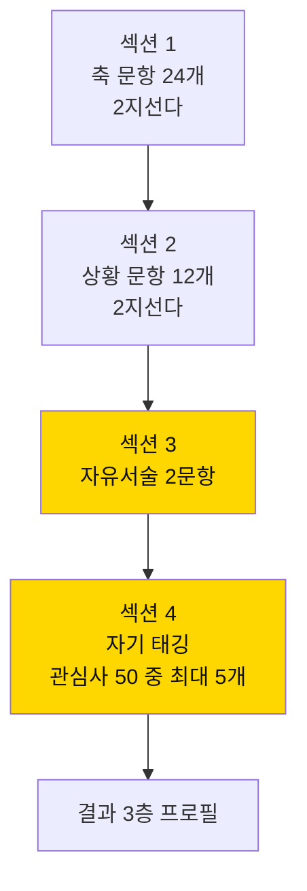

| 섹션 | 문항 | 시간 | 가중치 | 역할 |
|:-:|:-:|:-:|:-:|---|
| 1 축 문항 | 24 | 6분 | 40% | 4개 축 좌표 산출 |
| 2 상황 문항 | 12 | 4분 | 25% | 영역(A~E) 가중 |
| 3 자유서술 | 2 | 4분 | — | 3층(의외의 후보) 근거 |
| 4 자기 태깅 | 최대 5 | 1분 | 35% | **본인 선언** — 가장 큰 단일 가중치 |

> **자기 태깅에 최대 가중치를 준 이유**: 검사가 사람을 규정하면 안 된다.
> 검사는 **본인 선언을 정리해주는 도구**여야 한다. 알고리즘이 사람을 이기면 안 된다.

### 4.3 4개 측정 축

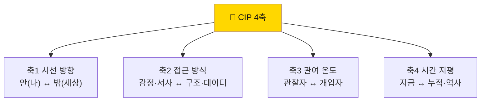

| 축 | 0점 쪽 | 100점 쪽 | 결과에 미치는 영향 |
|---|---|---|---|
| **축1 시선** | 내면 | 세계 | 영역 A·C ↔ B·E 가중 |
| **축2 접근** | 감정·서사 | 구조·데이터 | 추천 렌즈군 결정 (L5·L8·L12 ↔ L3·L4·L9) |
| **축3 온도** | 관찰·기록형 | 개입·실행형 | **크루패스형 ↔ 클루랩형** 진입 경로 결정 |
| **축4 시간** | 당장의 현상 | 누적·역사 | 프로젝트 트랙 추천 (T2 시제품 ↔ T1 조사) |

### 4.4 축 → 영역 매핑 규칙 (계산 가능한 형태)

```
영역 점수 계산식 (각 0~100)

A 자아와 정체성 = (100 - 축1) × 0.6 + (100 - 축2) × 0.2 + (100 - 축3) × 0.2
C 감정과 심리   = (100 - 축1) × 0.5 + (100 - 축2) × 0.3 + (100 - 축4) × 0.2
B 관계와 사회   = 50 + (축1 - 50) × 0.3 + (100 - 축2) × 0.3 + (축3 - 50) × 0.4
D 삶의 과제     = 50 + (축3 - 50) × 0.5 + (축2 - 50) × 0.3 + (100 - 축4) × 0.2
E 사회와 세계   = 축1 × 0.5 + 축2 × 0.3 + 축4 × 0.2

관심사 개별 점수
= 소속 영역 점수 × 0.45
+ 상황 문항 직접 지목 × 0.20
+ 자기 태깅 여부(태깅 시 100) × 0.35
```

> 이 계산식은 **의도적으로 단순하다.** 블랙박스가 아니어야 학생이 "왜 이 결과인지" 이해하고 **반박**할 수 있다.
> 결과 화면 하단에 **계산 내역 펼쳐보기**를 반드시 제공한다.

---

## 5. CIP 문항 36개 전문

> 모든 문항은 **"둘 다 맞는 말"**로 설계한다. 한쪽이 명백히 바람직하면 그 문항은 폐기한다.
> `→` 뒤는 채점 방향. 예: `축1+` = A 선택 시 축1 점수 상승.

### 5.1 섹션 1 — 축 문항 24개

#### 축1 시선 방향 (6문항)

| # | 문항 | A | B | 채점 |
|:-:|---|---|---|---|
| 1 | 최근 한 달, 검색창에 더 자주 친 쪽은? | 내 상태·감정에 관한 것 | 사건·제도·기술에 관한 것 | A 축1− / B 축1+ |
| 2 | 일기를 쓴다면 주로 무엇이 채워질까? | 내가 느낀 것 | 내가 본 것 | A 축1− / B 축1+ |
| 3 | 뉴스를 보다 화가 났다. 다음 행동은? | "나는 왜 이게 화가 날까" 생각 | "이게 왜 이렇게 굴러가지" 검색 | A 축1− / B 축1+ |
| 4 | 친구가 힘들다고 한다. 먼저 궁금한 것은? | 지금 어떤 기분인지 | 어떤 상황이 있었는지 | A 축1− / B 축1+ |
| 5 | 책을 고를 때 끌리는 제목은? | 《나는 왜 이럴까》 | 《세상은 왜 이럴까》 | A 축1− / B 축1+ |
| 6 | 혼자 있는 시간에 주로 하는 생각은? | 내 선택이 맞았는지 | 저 구조가 왜 저런지 | A 축1− / B 축1+ |

#### 축2 접근 방식 (6문항)

| # | 문항 | A | B | 채점 |
|:-:|---|---|---|---|
| 7 | 친구가 울고 있다. 먼저 드는 생각은? | "무슨 일이 있었을까" | "왜 하필 지금 터졌을까" | A 축2− / B 축2+ |
| 8 | 조사 결과를 정리한다면? | 사람들의 말을 인용해서 | 숫자와 표로 | A 축2− / B 축2+ |
| 9 | 어떤 설명이 더 설득력 있게 느껴지나? | 실제로 겪은 사람의 이야기 | 1000명 조사 결과 | A 축2− / B 축2+ |
| 10 | 영화를 보고 남는 것은? | 인물의 감정 | 이야기의 구조 | A 축2− / B 축2+ |
| 11 | 문제가 생겼을 때 먼저 하는 일은? | 관련된 사람과 이야기 | 상황을 종이에 정리 | A 축2− / B 축2+ |
| 12 | 통계 기사를 볼 때 눈이 가는 곳은? | 사례로 나온 사람 이야기 | 표본 수와 조사 방법 | A 축2− / B 축2+ |

#### 축3 관여 온도 (6문항)

| # | 문항 | A | B | 채점 |
|:-:|---|---|---|---|
| 13 | 학교 규칙이 불편하다. 나는? | 왜 생긴 규칙인지 찾아본다 | 바꿔달라고 말해본다 | A 축3− / B 축3+ |
| 14 | 조별과제에서 내 자리는? | 자료 정리·기록 | 역할 나누고 밀고 나가기 | A 축3− / B 축3+ |
| 15 | 책을 덮고 나서 하는 일은? | 밑줄을 다시 읽는다 | 누군가와 얘기하고 싶어진다 | A 축3− / B 축3+ |
| 16 | 불편한 상황을 목격했다. 나는? | 어떻게 된 일인지 지켜본다 | 일단 끼어든다 | A 축3− / B 축3+ |
| 17 | 좋은 아이디어가 떠올랐다. 먼저? | 메모하고 더 다듬는다 | 사람들에게 말한다 | A 축3− / B 축3+ |
| 18 | 동아리에서 더 하고 싶은 일은? | 자료·기록·아카이브 | 기획·섭외·진행 | A 축3− / B 축3+ |

#### 축4 시간 지평 (6문항)

| # | 문항 | A | B | 채점 |
|:-:|---|---|---|---|
| 19 | 뉴스에서 눈이 멈추는 기사는? | 오늘 벌어진 일 | "왜 여태 이런가"를 다룬 일 | A 축4− / B 축4+ |
| 20 | 어떤 질문이 더 흥미로운가? | "지금 이걸 어떻게 고치지" | "이건 언제부터 이랬지" | A 축4− / B 축4+ |
| 21 | 여행지에서 더 오래 머무는 곳은? | 지금 사람들이 모인 곳 | 오래된 것이 남아 있는 곳 | A 축4− / B 축4+ |
| 22 | 문제의 원인을 찾을 때 나는? | 최근에 바뀐 것을 본다 | 계속 그래왔던 것을 본다 | A 축4− / B 축4+ |
| 23 | 어떤 프로젝트가 끌리나? | 4주 안에 결과가 보이는 것 | 1년 걸려야 뭔가 보이는 것 | A 축4− / B 축4+ |
| 24 | 사람을 이해할 때 중요한 것은? | 지금 처한 상황 | 살아온 내력 | A 축4− / B 축4+ |

### 5.2 섹션 2 — 상황 문항 12개 (영역 직접 가중)

> 이 12문항은 **영역 A~E를 직접 지목**한다. 선택지마다 관심사 번호가 붙는다.

| # | 상황 | 선택지 A | 선택지 B | 지목 |
|:-:|---|---|---|---|
| 25 | 조별과제가 망했다. 남는 감정은? | 사람에 대한 서운함 → #15 소통 | 방식에 대한 답답함 → #33 교육 | B / D |
| 26 | 반에서 한 명이 계속 혼자 있다. 먼저 드는 생각은? | "저 친구 괜찮을까" → #5 고독 | "우리 반 분위기가 왜 저렇지" → #14 소속 | A / B |
| 27 | 용돈이 부족하다. 떠오르는 질문은? | "나는 왜 자꾸 사지" → #47 소비 | "왜 이건 이렇게 비싸지" → #32 경제 | E / D |
| 28 | 성적표를 받았다. 가장 오래 남는 생각은? | "나는 왜 이 정도지" → #2 자존감 | "이 점수가 무엇을 재는 거지" → #33 교육 | A / D |
| 29 | 급식 잔반이 많다. 눈에 띄는 것은? | "왜 다들 안 먹지" → #34 건강 | "왜 이만큼 만들지" → #44 환경 | D / E |
| 30 | SNS를 30분 하려다 2시간 했다. 드는 생각은? | "내 의지가 문제인가" → #25 중독 | "이건 이렇게 만들어졌나" → #43 기술 | C / E |
| 31 | 친구와 크게 싸웠다. 되짚는 것은? | "내가 왜 그렇게 화났지" → #22 분노 | "우리는 왜 대화가 안 되지" → #15 소통 | C / B |
| 32 | 봉사활동을 다녀왔다. 남는 것은? | "나는 뭘 느꼈나" → #3 의미 | "이걸로 뭐가 바뀌나" → #49 시민참여 | A / E |
| 33 | 새 학기 첫날. 신경 쓰이는 것은? | "나를 어떻게 볼까" → #1 정체성 | "이 무리는 어떻게 굴러가지" → #14 소속 | A / B |
| 34 | 좋아하던 과목이 싫어졌다. 이유를 찾는다면? | "내가 변했나" → #4 성장 | "평가 방식이 바뀌었나" → #33 교육 | A / D |
| 35 | 뉴스에서 억울한 판결을 봤다. 먼저 드는 것은? | "저 사람 심정이…" → #18 공감 | "이 규칙은 누가 만들었지" → #41 정의 | B / E |
| 36 | 진로를 정해야 한다. 더 무서운 쪽은? | "내가 뭘 좋아하는지 모르겠다" → #31 진로 | "좋아해도 먹고살 수 있나" → #32 경제 | D / D |

### 5.3 섹션 3 — 자유서술 2문항 (3층 산출용)

```
┌──────────────────────────────────────────────────────────┐
│ 서술 1.                                                    │
│ 최근 1년 동안 **아무도 안 시켰는데** 30분 이상 파본 것 3개  │
│                                                            │
│ ①                                                          │
│ ②                                                          │
│ ③                                                          │
│                                                            │
│ 💡 잘하려고 한 것 말고, 그냥 궁금해서 한 것을 쓰세요.       │
│    유튜브로 본 것, 검색한 것, 물어본 것 다 됩니다.          │
├──────────────────────────────────────────────────────────┤
│ 서술 2.                                                    │
│ "다들 원래 그런 거래"라는 말을 들었을 때                    │
│ **가장 승복이 안 됐던** 순간은?                             │
│                                                            │
│                                                            │
│ 💡 억울했던 순간, "왜 아무도 이상하다고 안 하지?" 싶었던    │
│    순간을 떠올려 보세요. 이게 당신의 질문이 시작되는 곳입니다│
└──────────────────────────────────────────────────────────┘
```

> **자동 채점하지 않는다.** 작성 직후 **본인이 관심사 50 중 태깅**한다.
> 이 태깅 행위 자체가 "내가 왜 이걸 골랐는가"의 첫 훈련이다.

### 5.4 섹션 4 — 자기 태깅 화면

```
┌──────────────────────────────────────────────────────────┐
│ 🏷️ 방금 쓴 답을 관심사 50에 붙여보세요 (최대 5개)          │
│                                                            │
│ 내가 쓴 것 ①  "게임 밸런스 패치 노트를 계속 찾아봤다"        │
│    → 어디에 붙일까?  [#41 정의] [#35 창의] [#36 결정] ...   │
│                                                            │
│ 내가 쓴 것 ②  "왜 우리 학교만 두발 규정이 센지 찾아봤다"      │
│    → [#16 권력] ✓  [#41 정의] ✓                            │
│                                                            │
│ 내가 쓴 것 ③  "친구가 갑자기 연락을 끊은 이유를 계속 생각"    │
│    → [#13 우정] ✓                                          │
│                                                            │
│ ⚠️ 딱 맞는 게 없으면 "가장 가까운 것"을 고르세요.            │
│    안 맞는 느낌이 든다면, 그게 당신의 다음 질문입니다.        │
│                                                            │
│                                    [결과 보기 →]           │
└──────────────────────────────────────────────────────────┘
```

---

## 6. 채점 규칙과 결과 산출 — 계산 예시 3인

### 6.1 채점 알고리즘 (의사코드)

```
function scoreCIP(responses):
    # 1. 축 점수 (0~100)
    for axis in [1,2,3,4]:
        items = responses.section1.filter(axis)      # 6문항
        plus  = count(items where choice == '+')
        axis_score[axis] = round(plus / 6 * 100)

    # 2. 영역 점수 (§4.4 계산식)
    area_score = computeAreaScores(axis_score)

    # 3. 상황 문항 가산
    for r in responses.section2:
        area_score[r.pointed_area] += 4              # 12문항 × 최대 4점

    # 4. 관심사 개별 점수
    for i in interests(1..50):
        base   = area_score[i.area] * 0.45
        direct = 20 if i.id in section2.pointed_interests else 0
        tagged = 35 if i.id in section4.tags else 0
        interest_score[i] = clamp(base + direct + tagged, 0, 100)

    # 5. 3층 분류
    layer1 = top3(interest_score)                                  # 강한 끌림
    layer2 = next5(interest_score) filtered by area-adjacency       # 가까운 이웃
    layer3 = interests mentioned ≥2 times in free-text
             but NOT in layer1                                      # 의외의 후보

    return { axis_score, area_score, layer1, layer2, layer3 }
```

### 6.2 계산 예시 ① — 중2 서연

**응답 요약**

| 축 | + 선택 수 | 점수 | 해석 |
|---|:-:|:-:|---|
| 축1 시선 | 2/6 | 33 | 내면 쪽 |
| 축2 접근 | 4/6 | 67 | 구조 쪽 |
| 축3 온도 | 3/6 | 50 | 중간 |
| 축4 시간 | 2/6 | 33 | 지금 쪽 |

**영역 점수 계산**

```
A = (100-33)×0.6 + (100-67)×0.2 + (100-50)×0.2 = 40.2 + 6.6 + 10.0 = 56.8
C = (100-33)×0.5 + (100-67)×0.3 + (100-33)×0.2 = 33.5 + 9.9 + 13.4 = 56.8
B = 50 + (33-50)×0.3 + (100-67)×0.3 + (50-50)×0.4 = 50 - 5.1 + 9.9 + 0 = 54.8
D = 50 + (50-50)×0.5 + (67-50)×0.3 + (100-33)×0.2 = 50 + 0 + 5.1 + 13.4 = 68.5
E = 33×0.5 + 67×0.3 + 33×0.2 = 16.5 + 20.1 + 6.6 = 43.2
```

**상황 문항**: #28(D) #34(D) #30(C) #25(D) 등 → D +16, C +8

```
D = 84.5   C = 64.8   A = 56.8   B = 54.8   E = 43.2
```

**자기 태깅**: `#26 번아웃`, `#33 교육`, `#21 불안`

**최종 관심사 점수 (상위)**

| 관심사 | 영역 | 계산 | 점수 |
|---|:-:|---|:-:|
| #33 교육과 학습 | D | 84.5×0.45 + 20 + 35 | **93.0** |
| #26 번아웃 | C | 64.8×0.45 + 0 + 35 | **64.2** |
| #21 불안 | C | 64.8×0.45 + 0 + 35 | **64.2** |
| #37 습관과 의지 | D | 84.5×0.45 + 0 + 0 | 38.0 |
| #34 건강과 몸 | D | 84.5×0.45 + 20 + 0 | 58.0 |

**자유서술 태깅 분석**: "시험 끝나면 다 까먹는 게 억울했다" → `#33` 2회, `#39 실패` 1회

**결과 화면**

```
┌────────────────────────────────────────────────────────┐
│  🧭 서연님의 관심사 프로필           2026-09-02 · 1차   │
│                                                          │
│  시선  나 ●───────○──────── 세상   33  (내면 쪽)        │
│  접근  감정 ───────●──────  구조   67  (구조 쪽)        │
│  온도  관찰 ────────●───── 개입    50  (중간)           │
│  시간  지금 ●──────○────── 누적    33  (지금 쪽)        │
│                                                          │
│  ── 1층 : 강한 끌림 ─────────────────────────────       │
│  #33 교육과 학습   ████████████████████░ 93             │
│      "평가 없이 배움이 굴러가는가"                       │
│  #26 번아웃과 무기력 ██████████████░░░░░ 64             │
│  #21 불안과 두려움   ██████████████░░░░░ 64             │
│                                                          │
│  ── 2층 : 가까운 이웃 (탐색 권장) ────────────           │
│  #34 건강과 몸 · #37 습관과 의지 · #39 실패와 회복       │
│                                                          │
│  ── 3층 : 의외의 후보 ────────────────────────           │
│  #41 정의와 공정                                         │
│   ↳ 점수는 43이지만, 자유서술에서 "억울"이 3회 나왔습니다│
│                                                          │
│  ⚠️ 이 결과는 추천이 아니라 **가설**입니다.               │
│     책 1권 읽고 나서 언제든 수정할 수 있습니다.           │
│                                                          │
│  [계산 내역 펼쳐보기 ▾]                                  │
│  [관심사 상세 보기] [입문 3권 받기] [결과 수정하기]      │
└────────────────────────────────────────────────────────┘
```

### 6.3 계산 예시 ② — 고1 민준

| 축 | 점수 | 해석 |
|---|:-:|---|
| 축1 시선 | 83 | 세계 쪽 (강함) |
| 축2 접근 | 83 | 구조·데이터 (강함) |
| 축3 온도 | 33 | 관찰자 쪽 |
| 축4 시간 | 67 | 누적 쪽 |

```
E = 83×0.5 + 83×0.3 + 67×0.2 = 41.5 + 24.9 + 13.4 = 79.8
B = 50 + (83-50)×0.3 + (100-83)×0.3 + (33-50)×0.4 = 50 + 9.9 + 5.1 - 6.8 = 58.2
D = 50 + (33-50)×0.5 + (83-50)×0.3 + (100-67)×0.2 = 50 - 8.5 + 9.9 + 6.6 = 58.0
A = (100-83)×0.6 + (100-83)×0.2 + (100-33)×0.2 = 10.2 + 3.4 + 13.4 = 27.0
C = (100-83)×0.5 + (100-83)×0.3 + (100-67)×0.2 = 8.5 + 5.1 + 6.6 = 20.2
```

**태깅**: `#43 기술과 인간`, `#41 정의와 공정`, `#46 미디어와 진실`

| 관심사 | 점수 |
|---|:-:|
| #43 기술과 인간 | 79.8×0.45 + 20 + 35 = **90.9** |
| #41 정의와 공정 | 79.8×0.45 + 0 + 35 = **70.9** |
| #46 미디어와 진실 | 79.8×0.45 + 0 + 35 = **70.9** |

**시스템이 붙이는 안내**

```
📌 축3(온도)이 33으로 관찰자 쪽입니다.
   → 크루패스(문제 찾기)부터 시작하는 것을 권합니다.
   → 프로젝트는 T1 조사·리포트 트랙이 잘 맞습니다.

📌 축2·축4가 모두 높습니다 (구조 + 누적).
   → 주력 렌즈 추천: L9 근거의질 · L6 시스템역학 · L8 맥락
```

### 6.4 계산 예시 ③ — 대학생 지호 (3층이 뒤집는 경우)

| 축 | 점수 |
|---|:-:|
| 축1 | 75 · 세계 |
| 축2 | 50 · 중간 |
| 축3 | 67 · 개입자 |
| 축4 | 50 · 중간 |

**1층**: `#41 정의` 72 · `#16 권력` 68 · `#49 시민참여` 66
**자유서술 분석**: "연애하다 헤어진 이유를 계속 생각했다", "친구 결혼식에서 이상하게 외로웠다", "가까운 사람한테 왜 더 못되게 굴까"
→ `#12 사랑과 친밀감` 3회 언급, 그러나 점수는 38 (2층에도 없음)

```
── 3층 : 의외의 후보 ──────────────────────────────
#12 사랑과 친밀감    점수 38 · 자유서술 3회 언급

💬 "당신이 고른 답은 사회 문제 쪽을 가리키는데,
   직접 쓴 글은 가까운 관계 쪽을 가리킵니다.
   둘 중 무엇이 진짜인지는 우리가 모릅니다.

   그래서 제안합니다 — 두 개를 **교차**해 보세요."

[교차 관심사 만들기 →]  #41 정의 × #12 친밀감
```

**교차 질문 템플릿이 자동 제시** (T-08, AI 아님 — 사전 작성된 조합표)

```
#41 정의 × #12 친밀감 교차 질문 5개
① 친밀한 관계에서 "공정하게 하자"는 말은 왜 관계를 악화시키는가?
② 가족 안에서 역할 분담을 숫자로 나누면 무엇이 사라지는가?
③ 사랑에 계약을 도입하면 안전해지는가, 사랑이 아니게 되는가?
④ 가까운 사이일수록 왜 부당함을 더 오래 참는가?
⑤ 우정에 "손익"이라는 말을 쓰면 왜 불쾌한가?
```

### 6.5 매칭 → 책 연결 규칙 (템플릿 방식, AI 아님)

Top3 관심사마다 **운영진 큐레이션 서가**에서 3권을 꺼낸다. 규칙은 고정이다.

| 슬롯 | 역할 | 선정 기준 | 학년 조정 |
|---|---|---|---|
| **정의서** | 용어와 지형을 준다 | 개념 정의 명확, 입문 난이도 | 초등: 그림책/청소년판 허용 |
| **도구서** | 방법·사례를 준다 | 실증·사례 중심 | 중등: 사례 위주 |
| **반증서** | **위 두 권의 결론을 흔든다** | 반대 입장, 논쟁적 | **모든 학년 필수** |

**책 선정 실패 사례 (운영 주의)**

> ❌ `#44 환경과 책임`에 정의서 3권을 모두 기후위기 경고서로 넣었더니,
> 학급 정의서 24건 중 21건이 "개인 실천을 늘려야 한다"로 수렴했다.
> → 반증서 《지속가능성이라는 거짓말》 투입 후, "개인 실천이 구조 책임을 가리는가"라는
> 새 문제군이 9건 생성됨.

### 6.6 "충분히 읽고 고를 수 있게" — 결정 전 3종

| 미리보기 | 내용 | 분량 | 위치 |
|---|---|---|---|
| **① 5분 브리핑** | 핵심 긴장 + 금지된 답 + 질문 사다리 | 1스크롤 | 관심사 상세 최상단 |
| **② 남들의 문제 3건** | 이 관심사의 실제 정의서 3건 | 카드 3장 | 중단 |
| **③ 실패 사례 1건** | 가설이 죽은 기록 | 카드 1장 | 하단 **고정** |

> ③을 넣는 이유: 성공 사례만 보이면 "나도 저렇게 되겠지"로 시작한다.
> **실패 사례가 진입 문턱의 진실**이다. 관심사 상세 페이지에서 ③은 **접을 수 없다.**

---

# PART III — 구조

## 7. 사이트맵 — 전체 · URL 라우팅표

### 7.1 전체 사이트맵

```mermaid
graph TD
    H["🏠 홈 /"]

    H --> D["🧭 진단 /cip"]
    D --> D1["검사 /cip/test"]
    D --> D2["결과 /cip/result/:id"]
    D --> D3["계산 내역 /cip/result/:id/how"]
    D --> D4["재검사·이력 /cip/history"]

    H --> I["🗂️ 관심사 /interests"]
    I --> I1["영역별 /interests?area=C"]
    I --> I2["상세 /interests/:no"]
    I2 --> I3["서가 /interests/:no/shelf"]
    I2 --> I4["문제 목록 /interests/:no/problems"]
    I2 --> I5["실패 사례 /interests/:no/failures"]
    I --> I6["교차 /interests/cross/:a-:b"]

    H --> B["📚 책 /books"]
    B --> B1["상세 /books/:isbn"]
    B1 --> B2["이 책의 문제 /books/:isbn/problems"]
    B1 --> B3["읽기 기록 /books/:isbn/log"]
    B --> B4["서가 큐레이션 /books/shelves"]

    H --> P["🔍 크루패스 /path"]
    P --> P1["문제 피드 /path/problems"]
    P --> P2["카드 작성 /path/cards/new"]
    P --> P3["카드 상세 /path/cards/:id"]
    P --> P4["정의서 작성 /path/defs/new"]
    P --> P5["정의서 상세 /path/defs/:id"]
    P --> P6["반박 요청 큐 /path/queue/rebuttal"]
    P --> P7["미해결 큐 /path/queue/open"]

    H --> L["🚀 클루랩 /lab"]
    L --> L1["프로젝트 탐색 /lab/projects"]
    L --> L2["팀 모집 /lab/recruit"]
    L --> L3["프로젝트 보드 /lab/projects/:id"]
    L3 --> L4["실패 기록 /lab/projects/:id/failures"]
    L3 --> L5["주간 체크인 /lab/projects/:id/checkin"]
    L --> L6["결과물 아카이브 /lab/archive"]

    H --> G["👥 공간 /spaces"]
    G --> G1["내 그룹 /spaces/groups"]
    G --> G2["그룹 상세 /spaces/groups/:id"]
    G2 --> G3["병렬 독서 배정 /spaces/groups/:id/parallel"]
    G --> G4["학급 /spaces/classes/:id"]
    G4 --> G5["진도판 /spaces/classes/:id/board"]
    G4 --> G6["루브릭 채점 /spaces/classes/:id/grade"]
    G4 --> G7["학기 리포트 /spaces/classes/:id/report"]
    G --> G8["학교 아카이브 /spaces/schools/:id"]

    H --> M["🎒 내 서랍 /me"]
    M --> M1["문제 포트폴리오 /me/portfolio"]
    M --> M2["읽은 책 /me/books"]
    M --> M3["질문·폐기 이력 /me/history"]
    M --> M4["레벨·활동 /me/activity"]
    M --> M5["공개 프로필 /u/:handle"]

    H --> T["🧰 템플릿 /templates"]
    T --> T1["템플릿 24종 /templates/:code"]
    T --> T2["루브릭 /templates/rubrics"]
    T --> T3["교사 지도안 /templates/teaching"]

    style P fill:#4ECDC4,color:#fff
    style L fill:#FF6B6B,color:#fff
    style T fill:#FFD700,color:#111
    style D fill:#FFD700,color:#111
```

### 7.2 URL 라우팅 전체표

| # | URL | 화면 | 권한 | 주 CTA |
|:-:|---|---|---|---|
| 1 | `/` | 홈 | 전체 | 진단 시작 |
| 2 | `/cip` | 진단 소개 | 전체 | 검사 시작 |
| 3 | `/cip/test` | 검사 (4섹션) | 로그인 | 다음 문항 |
| 4 | `/cip/result/:id` | 결과 3층 | 본인·교사 | 관심사 상세 |
| 5 | `/cip/result/:id/how` | 계산 내역 | 본인 | 결과 수정 |
| 6 | `/cip/history` | 검사 이력 비교 | 본인 | 재검사 |
| 7 | `/interests` | 관심사 50 격자 | 전체 | 관심사 선택 |
| 8 | `/interests/:no` | 관심사 상세 8칸 | 전체 | 서가에서 책 고르기 |
| 9 | `/interests/:no/shelf` | 서가 (정의·도구·반증) | 전체 | 책 담기 |
| 10 | `/interests/:no/problems` | 이 관심사의 문제 | 전체 | 반응 달기 |
| 11 | `/interests/:no/failures` | 실패 사례 | 전체 | — |
| 12 | `/interests/cross/:a-:b` | 교차 관심사 | 로그인 | 교차 질문 5개 받기 |
| 13 | `/books` | 책 탐색 | 전체 | 책 상세 |
| 14 | `/books/:isbn` | 책 상세 | 전체 | **문제 카드 쓰기** |
| 15 | `/books/:isbn/problems` | 이 책에서 나온 문제 | 전체 | 반응 달기 |
| 16 | `/path/problems` | 문제 피드 | 전체 | 반응 달기 |
| 17 | `/path/cards/new` | 문제 카드 작성 (5칸) | 로그인 | 저장·공유 |
| 18 | `/path/cards/:id` | 카드 상세 | 공개 범위 | 정의서로 승급 |
| 19 | `/path/defs/new` | 정의서 작성 (9칸) | 로그인 | 제출 |
| 20 | `/path/defs/:id` | 정의서 상세 | 공개 범위 | 🤝🔍⚔️ 반응 |
| 21 | `/path/queue/rebuttal` | 반박 요청 큐 | 로그인 | 반박 작성 |
| 22 | `/path/queue/open` | 미해결 문제 큐 | 전체 | 이어받기 |
| 23 | `/lab/projects` | 프로젝트 탐색 | 전체 | 팀 지원 |
| 24 | `/lab/recruit` | 팀 모집 게시 | 로그인 | 모집 등록 |
| 25 | `/lab/projects/:id` | 프로젝트 보드 | 팀·공개범위 | 주간 체크인 |
| 26 | `/lab/projects/:id/failures` | 실패 기록 | 팀 | 실패 추가 |
| 27 | `/lab/archive` | 결과물 아카이브 | 전체 | 결과물 열람 |
| 28 | `/spaces/groups/:id` | 그룹 홈 | 멤버 | 병렬 배정 |
| 29 | `/spaces/groups/:id/parallel` | 병렬 독서 배정 | 그룹장 | 배정 확정 |
| 30 | `/spaces/classes/:id` | 학급 홈 | 교사·학생 | 과제 배포 |
| 31 | `/spaces/classes/:id/board` | 진도판 | 교사 | — |
| 32 | `/spaces/classes/:id/grade` | 루브릭 채점 | 교사 | 채점 저장 |
| 33 | `/spaces/classes/:id/report` | 학기 리포트 | 교사 | PDF 출력 |
| 34 | `/spaces/schools/:id` | 학교 아카이브 | 학교 구성원 | 인용하기 |
| 35 | `/me/portfolio` | 문제 포트폴리오 | 본인 | 공유 링크 생성 |
| 36 | `/me/history` | 질문·폐기 이력 | 본인 | — |
| 37 | `/u/:handle` | 공개 프로필 | 전체 | — |
| 38 | `/templates` | 템플릿 센터 | 전체 | 템플릿 열기 |
| 39 | `/templates/:code` | 템플릿 상세 (T-01 등) | 전체 | **바로 쓰기** |
| 40 | `/templates/rubrics` | 루브릭 6종 | 전체 | 다운로드 |

### 7.3 전역 네비게이션

```
[리딩크루]  진단 · 관심사 · 크루패스 · 클루랩 · 공간 · 내서랍     [🧰 템플릿] [🔔] [👤]
```

**6개로 고정한다.** 7번째 메뉴가 필요하다고 느껴지면 그 기능을 만들지 않는다.
`🧰 템플릿`은 메뉴가 아니라 **상시 플로팅 버튼** — 어느 화면에서든 3클릭 안에 양식에 닿아야 한다.

### 7.4 진입 → 이탈 경로 지도

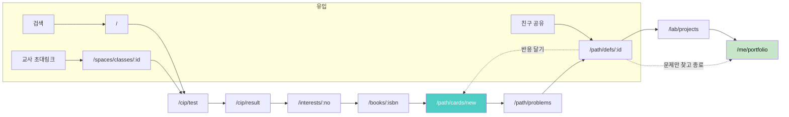

**핵심 전환 구간 3개 (여기가 무너지면 서비스가 무너진다)**

| 구간 | 전환 | 목표 | 무너질 때의 처방 |
|---|---|---|---|
| ① | 결과 → 관심사 상세 | 90% | 결과 화면에 관심사 카드 요약 인라인 노출 |
| ② | 책 상세 → 카드 작성 | 45% | 책 상세 하단 고정 CTA + "5분이면 됩니다" |
| ③ | 카드 → 정의서 승급 | 20% | 반박 요청 큐 + 학급 과제화 |

---

## 8. 주요 페이지 상세 명세 24종

> 각 명세 형식: **역할 한 문장 / 구성 요소 / 주 CTA / 성공 지표 / 두면 안 되는 것**

---

### P-01 홈 `/`

| 항목 | 내용 |
|---|---|
| **역할** | "지금 사람들이 어떤 문제를 붙잡고 있는지" 보여준다 |
| **구성** | ① 헤드라인 + 진단 CTA ② 지금 붙잡힌 문제 6장 ③ 미해결 큐 3건 ④ 오늘의 템플릿 3개 |
| **주 CTA** | `🧭 15분 관심사 진단 시작` |
| **성공 지표** | 진단 시작률 25% / 문제 상세 진입률 18% |
| **금지** | 베스트셀러 랭킹, 인기 유저, 조회수 정렬 |

```
┌────────────────────────────────────────────────────────┐
│ 리딩크루   진단 관심사 크루패스 클루랩 공간 내서랍  [🧰] │
├────────────────────────────────────────────────────────┤
│                                                          │
│   "당신이 평생 붙잡을 질문은 어느 쪽입니까"                │
│   관심사 50개 · 지금 붙잡힌 문제 1,284건                  │
│              [🧭 15분 관심사 진단 시작]                   │
│              이미 해봤다면 → [관심사 50 둘러보기]         │
│                                                          │
├─ 🔥 지금 붙잡힌 문제 ──────────────────────────────────┤
│  ┌──────────────┐ ┌──────────────┐ ┌──────────────┐  │
│  │#26 번아웃      │ │#41 정의와공정 │ │#43 기술과인간 │  │
│  │《번아웃 사회》 │ │《공정하다는..》│ │《AI 지도책》  │  │
│  │"우리 반 피로는 │ │"기회를 같게 주│ │"평가 가능한   │  │
│  │ 공부량이 아니라│ │ 면 결과 차이는│ │ 것만 교육이   │  │
│  │ 5분 단위로 쪼갠│ │ 정당한가"     │ │ 되는 구조"    │  │
│  │ 시간표에서 온다│ │               │ │               │  │
│  │🤝12 🔍3 ⚔️5   │ │🤝28 🔍7 ⚔️11 │ │🤝19 🔍4 ⚔️9  │  │
│  │중2 서연·학급공개│ │고2 은우·공개  │ │고1 민준·공개  │  │
│  └──────────────┘ └──────────────┘ └──────────────┘  │
│                                          [더 보기 →]     │
├─ 🎯 이어받을 수 있는 미해결 질문 ──────────────────────┤
│  · "다른 학교도 화요일에 잔반이 많은가?"                  │
│      A중 3-2반 남김 · 12일째 대기 · 데이터 2주치 포함      │
│  · "혼자 있고 싶은 학생에게 '연결' 정책은 무엇인가"        │
│      B고 독서동아리 남김 · 5일째 대기                     │
│                                          [큐 전체 →]     │
├─ 🧰 오늘의 템플릿 ─────────────────────────────────────┤
│  [T-01 문제 카드 5분] [T-13 반대편 인터뷰] [T-12 반증조건]│
└────────────────────────────────────────────────────────┘
```

---

### P-02 CIP 검사 `/cip/test`

| 항목 | 내용 |
|---|---|
| **역할** | 끝까지 응답하게 만든다 |
| **구성** | 진행바 · 문항 1개씩 · 이전 버튼 · 임시저장 |
| **주 CTA** | 다음 |
| **성공 지표** | **완주율 85% 이상** |
| **금지** | 중간 결과 미리보기(포기 유발), 남은 시간 카운트다운(압박) |

```
┌──────────────────────────────────────────────────────┐
│  ●●●●●●●●●○○○○○○○○○○○○○  12 / 38                    │
│                                                        │
│  최근 한 달, 검색창에 더 자주 친 쪽은?                  │
│                                                        │
│   ┌──────────────────────────────────────────┐        │
│   │ A. 내 상태·감정에 관한 것                   │        │
│   │    "왜 이렇게 피곤하지" "이 감정 뭐지"      │        │
│   └──────────────────────────────────────────┘        │
│   ┌──────────────────────────────────────────┐        │
│   │ B. 사건·제도·기술에 관한 것                 │        │
│   │    "이 규정 왜 이래" "이건 어떻게 굴러가"   │        │
│   └──────────────────────────────────────────┘        │
│                                                        │
│  💡 정답이 없습니다. 더 자주 한 쪽을 고르세요.          │
│                                          [← 이전]      │
└──────────────────────────────────────────────────────┘
```

---

### P-03 CIP 결과 `/cip/result/:id`

| 항목 | 내용 |
|---|---|
| **역할** | 결과를 **가설**로 받아들이게 한다 |
| **구성** | 4축 슬라이더 · 3층 리스트 · 가설 경고 · 계산 내역 링크 |
| **주 CTA** | 관심사 상세 보기 |
| **성공 지표** | 관심사 상세 **2개 이상** 진입 70% |
| **금지** | "당신은 ○○형입니다" 단정, 유형 이름 부여, 공유 유도 배지 |

> 상세 와이어프레임은 §6.2 참조.

---

### P-04 관심사 50 격자 `/interests`

| 항목 | 내용 |
|---|---|
| **역할** | 50개를 **한 화면에서 비교**하게 한다 |
| **구성** | 5영역 × 10 격자 · 각 칸에 문제 수 · 내 Top3 하이라이트 |
| **주 CTA** | 관심사 선택 |
| **성공 지표** | 상세 진입 3개 이상 |
| **금지** | 무한 스크롤, 정렬 옵션 남발 |

```
┌────────────────────────────────────────────────────────┐
│ 🗂️ 관심사 50    [전체] [A자아] [B관계] [C감정] [D과제] [E세계]│
│                              ⭐ 내 Top3 표시 중          │
│ ── A 자아와 정체성 ─────────────────────────────────   │
│ ┌────┐┌────┐┌────┐┌────┐┌────┐┌────┐┌────┐┌────┐  │
│ │1정체││2자존││3의미││4성장││5고독││6완벽││7진정││8시간│  │
│ │ 41 ││ 38 ││ 52 ││ 24 ││ 76 ││ 31 ││ 19 ││ 28 │  │
│ └────┘└────┘└────┘└────┘└────┘└────┘└────┘└────┘  │
│ ── C 감정과 심리 ───────────────────────────────────   │
│ ┌────┐┌────┐┌────┐┌────┐┌────┐┌────┐┌────┐┌────┐  │
│ │21불안││22분노││23슬픔││24수치││25중독││26번아웃⭐    │  │
│ │ 94 ││ 22 ││ 31 ││ 14 ││ 87 ││ 88 ││    ││    │  │
│ └────┘└────┘└────┘└────┘└────┘└────┘└────┘└────┘  │
│                                                          │
│ 💡 숫자 = 지금 올라온 문제 수                             │
│    ⭐ = 내 진단 결과 Top3                                 │
└────────────────────────────────────────────────────────┘
```

---

### P-05 관심사 상세 `/interests/:no`

| 항목 | 내용 |
|---|---|
| **역할** | 고를지 말지 **읽고 결정**하게 한다 |
| **구성** | 8칸 카드 → 남들 문제 3건 → **실패 사례 1건(접기 불가)** → 서가 → 첫 7일 액션 |
| **주 CTA** | 서가에서 책 1권 담기 |
| **성공 지표** | 책 선택률 40% / 실패 사례 스크롤 도달 60% |
| **금지** | 관련 상품, 무한 추천 |

**화면 순서가 곧 설계다.** `금지된 답 → 질문 사다리 → 남들 문제 → 실패 → 서가` 순서를 바꾸지 않는다.
금지된 답을 맨 위에 두어야 학생의 첫 생각이 봉인된다.

---

### P-06 책 상세 `/books/:isbn`

| 항목 | 내용 |
|---|---|
| **역할** | 책을 **문제로 연결**한다 |
| **구성** | 서지 · 이 책의 슬롯(정의/도구/반증) · 관련 관심사 · **이 책에서 나온 문제 N건** · 읽기 기록 |
| **주 CTA** | `✂️ 이 책으로 문제 카드 쓰기 (5분)` — 하단 고정 |
| **성공 지표** | 카드 작성 진입 45% |
| **금지** | 별점, 리뷰 평점, 구매 순위 |

```
┌────────────────────────────────────────────────────────┐
│ 📗 번아웃 사회 · 한병철 · 문학과지성사                    │
│    🏷️ 슬롯: 정의서   관심사: #26 번아웃 #33 교육 #34 건강 │
│                                                          │
│ ⚠️ 이 책의 짝 반증서: 《게으름에 대한 찬양》              │
│    한쪽만 읽으면 확신이 생깁니다. 짝으로 읽으세요. [담기] │
│                                                          │
│ ── 이 책에서 나온 문제 47건 ──────────────────────────  │
│  · "성과사회라는 진단은 학생에게도 적용되는가"  🤝14 ⚔️6  │
│  · "쉬는 시간이 5분 단위로 쪼개진 시간표"       🤝12 ⚔️5  │
│  · "자기착취라는 말이 개인 책임론이 되지 않나"  🤝9  ⚔️11 │
│                                          [47건 전체 →]   │
│ ── 자주 인용된 문장 ────────────────────────────────   │
│  p.23 · 인용 12회   p.87 · 인용 9회   p.104 · 인용 7회   │
│                                                          │
│ ┌────────────────────────────────────────────────┐    │
│ │  ✂️ 이 책으로 문제 카드 쓰기 (5분)               │    │
│ └────────────────────────────────────────────────┘    │
└────────────────────────────────────────────────────────┘
```

---

### P-07 문제 피드 `/path/problems`

| 항목 | 내용 |
|---|---|
| **역할** | 남의 질문에서 **내 질문을 발견**하게 한다 |
| **구성** | 필터(관심사·공개단위·상태) · 문제 카드 리스트 · 반응 수 |
| **주 CTA** | 반응 달기 |
| **성공 지표** | 반응 3종 작성률 25% |
| **금지** | 좋아요·조회수 정렬. 정렬은 **최신 / 반박 필요 / 내 관심사** 3개만 |

> **"반박 필요" 정렬이 이 화면의 심장이다.** 반박이 0건인 정의서가 위로 올라온다.
> 인기 있는 것이 아니라 **도움이 필요한 것**이 먼저 보인다.

---

### P-08 문제 카드 작성 `/path/cards/new`

| 항목 | 내용 |
|---|---|
| **역할** | **5분 안에 끝나게** 한다 |
| **구성** | 5칸 폼 (책/문장/현실/질문/금지된답) + 관심사·렌즈 태그 |
| **주 CTA** | 저장 |
| **성공 지표** | 작성 완료율 75% / **금지된 답 3개 채움 70%** |
| **금지** | 긴 자유서술 필드, 사진 필수, 제목 입력 |

> 상세 양식은 §11 T-01.

---

### P-09 문제 정의서 `/path/defs/:id`

| 항목 | 내용 |
|---|---|
| **역할** | 9칸을 **다 채우게** 한다 |
| **구성** | 9칸 · 진행 링 · 미충족 사유 표시 · 반응 3종 바 |
| **주 CTA** | 제출 (9칸 완성 시에만 활성) |
| **성공 지표** | 승급률 20% / **반증서 포함률 100%** |
| **금지** | 부분 제출, 자유 서술 필드 |

---

### P-10 반박 요청 큐 `/path/queue/rebuttal`

| 항목 | 내용 |
|---|---|
| **역할** | 혼자인 사람에게 **반대편을 붙여준다** |
| **구성** | 반박 0건 정의서 리스트 · 대기 일수 · 관심사 필터 |
| **주 CTA** | ⚔️ 반박 쓰기 |
| **성공 지표** | 24시간 내 첫 반박률 60% |
| **금지** | 익명 비방, 반박에 대한 반박 스레드 3단 이상 |

```
┌────────────────────────────────────────────────────────┐
│ ⚔️ 반박 요청 큐 — 아직 반대편이 없는 문제 34건            │
│    반박을 쓰면 XP +40, 상대도 +20을 받습니다.             │
│                                                          │
│ ┌──────────────────────────────────────────────────┐  │
│ │ 🕐 대기 5일   #34 건강과 몸   중3 하은              │  │
│ │ "학교 급식 잔반은 학생 편식이 아니라 4교시 체육      │  │
│ │  배치가 만든 결과다"                                 │  │
│ │ 근거: 2주 계량 데이터 · 반증서 《식탁의 정치》       │  │
│ │                                                      │  │
│ │ 💡 반박 힌트: 이 결론으로 손해 보는 사람은?          │  │
│ │    (영양사 / 체육 교사 / 편식 지적을 받던 학생)      │  │
│ │                              [⚔️ 반박 쓰기]          │  │
│ └──────────────────────────────────────────────────┘  │
└────────────────────────────────────────────────────────┘
```

---

### P-11 미해결 큐 `/path/queue/open`

| 항목 | 내용 |
|---|---|
| **역할** | 다음 사람이 **이어받게** 한다 |
| **구성** | 종료 프로젝트가 남긴 질문 · 넘겨준 자료 목록 · 대기 일수 |
| **주 CTA** | 이어받기 |
| **성공 지표** | 이어달리기 채택률 15% |
| **금지** | 완료 프로젝트 자랑, 성과 배지 |

---

### P-12 프로젝트 보드 `/lab/projects/:id`

| 항목 | 내용 |
|---|---|
| **역할** | **질문을 잊지 않고** 실행하게 한다 |
| **구성** | 질문 선언문 고정 배너 · 4열 칸반 · 실패 기록 · 역할 4인 · 주간 체크인 |
| **주 CTA** | 주간 체크인 작성 |
| **성공 지표** | 체크인 연속률 70% / 프로젝트당 실패 기록 2건+ |
| **금지** | 태스크만 있는 칸반(선언문 없는 보드), 진척률 % 표시 |

---

### P-13 실패 기록 `/lab/projects/:id/failures`

| 항목 | 내용 |
|---|---|
| **역할** | 실패를 **자산으로 등재**한다 |
| **구성** | 날짜 · 죽은 가설 · 죽인 증거 · 배운 것 · 다음 가설 |
| **주 CTA** | 실패 기록 추가 |
| **성공 지표** | 프로젝트당 2건 이상 |
| **금지** | **삭제 기능** (수정만 가능, 수정 이력 보존) |

---

### P-14 학급 홈 `/spaces/classes/:id`

| 항목 | 내용 |
|---|---|
| **역할** | 교사에게 **채점 근거**를 만들어준다 |
| **구성** | 주차 진행 · 과제 배포 · 학생 진도판 · 루브릭 바로가기 |
| **주 CTA** | 이번 주 과제 배포 |
| **성공 지표** | 루브릭 사용률 60% / 교사 학기 재사용 60% |
| **금지** | 학생 간 점수 공개, 순위표 |

---

### P-15 병렬 독서 배정 `/spaces/groups/:id/parallel`

| 항목 | 내용 |
|---|---|
| **역할** | **같은 책을 못 읽게** 한다 |
| **구성** | 사람 × 책 × 슬롯 매트릭스 · 중복 경고 · 자동 배분 버튼 |
| **주 CTA** | 배정 확정 |
| **성공 지표** | 그룹 내 책 중복률 10% 이하 |
| **금지** | 인기 책 자동 추천 (수렴 유발) |

```
┌────────────────────────────────────────────────┐
│ 🧩 병렬 독서 배정  ·  그룹 「번아웃 탐사대」      │
│ 관심사 #26 번아웃과 무기력  ·  4명               │
│                                                  │
│  민준  →  《번아웃 사회》        [정의서] ✓      │
│  서연  →  《일의 기쁨과 슬픔》    [도구서] ✓      │
│  하은  →  《게으름에 대한 찬양》  [반증서] ✓ 🔴   │
│  지호  →  《아무튼, 잠》          [인접]  ✓      │
│                                                  │
│  ✅ 반증서 1명 이상 배정됨 (필수 조건 충족)       │
│  ⚠️ 같은 책 신청 시 경고가 표시됩니다              │
│                                                  │
│  📅 2주 후 (10/14) : 교차 코멘트 세션 자동 생성   │
│                          [자동 배분] [배정 확정]  │
└────────────────────────────────────────────────┘
```

---

### P-16 학기 리포트 `/spaces/classes/:id/report`

| 항목 | 내용 |
|---|---|
| **역할** | 교사가 **다음 학기에도 오게** 만든다 |
| **구성** | 학급 관심사 분포 · 정의서 목록 · 반박 통계 · 실패 기록 모음 · 개인별 1p 요약 |
| **주 CTA** | PDF 출력 / 다음 학기 복제 |
| **성공 지표** | 출력률 80% / 복제 사용률 50% |
| **금지** | 학생 순위, 평균 점수 비교 |

---

### P-17 문제 포트폴리오 `/me/portfolio`

| 항목 | 내용 |
|---|---|
| **역할** | "무엇을 질문했고 **무엇이 틀렸나**"를 증명한다 |
| **구성** | 관심사 이력 · 정의서 목록 · **폐기한 가설 타임라인** · 받은 반박 · 준 반박 |
| **주 CTA** | 공개 링크 생성 |
| **성공 지표** | 외부 공유 링크 생성 30% |
| **금지** | 점수, 등수, 레벨 자랑 배지 상단 배치 |

```
┌────────────────────────────────────────────────────────┐
│ 🎒 서연의 문제 포트폴리오                 [공개 링크 만들기]│
│                                                          │
│ ── 관심사 이력 ────────────────────────────────────    │
│  2026-09 CIP 1차 : #33 교육 #26 번아웃 #21 불안          │
│  2027-03 CIP 2차 : #41 정의 #33 교육 #16 권력            │
│    ↳ 축1(시선)이 33 → 61로 이동. 내면 → 세계             │
│                                                          │
│ ── 문제 정의서 3건 ────────────────────────────────    │
│  ✅ "우리 반 피로는 시간표 구조에서 온다"  반박 7건 수용 3│
│  ✅ "쉬는 시간 5분 단위 분할의 회복 저해"  반박 4건       │
│  🕐 "두발 규정은 누구의 질서를 위한 것인가" 반박 대기      │
│                                                          │
│ ── ⚰️ 폐기한 가설 4건 (이 서비스의 최고 배점) ────────  │
│  2026-10-12 "피로 주원인 = 스마트폰"                     │
│    죽인 증거: 사용시간 상위 5명 중 4명 피로도 하위        │
│    배운 것: 눈에 띄는 변수를 원인으로 착각 (L5 부족)      │
│  2026-11-03 "쉬는 시간을 늘리면 해결"                    │
│    죽인 증거: 옆 학교는 10분인데 피로도 동일              │
│  2027-04-19 "규정은 교사가 만든다"                       │
│    죽인 증거: 학생회 회의록 3년치 — 학생 제안이 다수       │
│  2027-05-02 "두발 규정은 낡아서 남아 있다"                │
│    죽인 증거: 2년 전 개정됨. 개정 후 더 엄격해짐          │
│                                                          │
│ ── 내가 쓴 반박 12건 · 받은 반박 15건 ─────────────    │
└────────────────────────────────────────────────────────┘
```

---

### P-18 ~ P-24 나머지 페이지 요약

| 코드 | 페이지 | 역할 | 주 CTA | 금지 |
|---|---|---|---|---|
| P-18 | 교차 관심사 `/interests/cross/:a-:b` | 두 관심사를 겹쳐 새 질문을 만든다 | 교차 질문 5개 받기 | AI 생성 (사전 조합표만) |
| P-19 | 그룹 홈 `/spaces/groups/:id` | 작은 단위의 교차 코멘트를 돌린다 | 주간 세션 열기 | 그룹 랭킹 |
| P-20 | 학교 아카이브 `/spaces/schools/:id` | 내년 학생의 **재료**가 되게 한다 | 인용하기 | 우수작 전시만 |
| P-21 | 팀 모집 `/lab/recruit` | 혼자인 문제에 사람을 붙인다 | 모집 등록 | 스펙 기재란 |
| P-22 | 결과물 아카이브 `/lab/archive` | 산출물 + **실패 기록**을 함께 보관 | 열람 | 실패 기록 없는 결과물 등재 |
| P-23 | 템플릿 센터 `/templates` | 막힌 사람이 **3클릭 안에** 양식을 얻는다 | 바로 쓰기 | 이론 장문 설명 |
| P-24 | 공개 프로필 `/u/:handle` | 판단 이력을 대외 증명 | — | 팔로워 수 |

### 8.1 "두면 안 되는 것" 종합 — 이 표가 명세의 본체다

| 넣고 싶은 것 | 왜 안 되는가 | 대신 두는 것 |
|---|---|---|
| 좋아요 | 문제를 인기투표로 만든다 | 🤝🔍⚔️ 문장 반응 3종 |
| 조회수 정렬 | 이미 본 것을 더 보게 만든다 | "반박 필요" 정렬 |
| 별점·리뷰 | 책을 평가 대상으로 만든다 | 이 책에서 나온 문제 수 |
| 랭킹·리더보드 | 상위 10명이 고정된다 | 관심사별 활동 인구 |
| AI 초안 | 정의서가 수렴한다 | 템플릿 + 또래 사례 |
| 진척률 % | 완료를 목표로 만든다 | 9칸 미충족 **사유** 표시 |
| 실패 기록 삭제 | 실패를 숨기게 만든다 | 수정만 가능, 이력 보존 |
| 팔로워 수 | 사람을 팔로우하게 만든다 | 관심사를 구독하게 만든다 |

---

## 9. UI 디자인 시스템과 화면 와이어프레임

### 9.1 디자인 원칙 6

| # | 원칙 | 구현 |
|:-:|---|---|
| 1 | **문장을 요구한다** | 모든 반응 버튼은 입력창을 연다. 원클릭 반응 없음 |
| 2 | **빈칸이 안내한다** | 자유 텍스트 대신 5칸·9칸 구조화 폼 |
| 3 | **미완성이 부끄럽지 않다** | "초안" 배지를 긍정 색으로. 진행 링에 미충족 **사유** 표기 |
| 4 | **실패가 눈에 띈다** | 실패 기록은 회색이 아니라 **plum 강조 카드** |
| 5 | **한 화면 한 행동** | 페이지마다 주 CTA 1개 |
| 6 | **템플릿은 3클릭 안** | 플로팅 🧰 버튼 전역 상시 |

### 9.2 컬러 토큰

| 토큰 | Light | Dark | 의미 | 사용처 |
|---|---|---|---|---|
| `--clue-teal` | `#4ECDC4` | `#3BA9A2` | 발견·문제 | 크루패스 전역 |
| `--clue-coral` | `#FF6B6B` | `#D95757` | 실행·프로젝트 | 클루랩 전역 |
| `--clue-gold` | `#FFD700` | `#D4B300` | 진단·전환점 | CIP, 미해결 큐 |
| `--clue-blue` | `#45B7D1` | `#3691A6` | 공유·공간 | 그룹/학급/학교 |
| `--clue-plum` | `#8E7CC3` | `#7566A8` | **실패 기록** | 실패 카드 |
| `--clue-ink` | `#1F2933` | `#E8EAED` | 본문 텍스트 | 전역 |
| `--clue-paper` | `#FBFAF7` | `#16191D` | 배경 | 전역 |
| `--clue-line` | `#E3E0D8` | `#2B3038` | 구분선 | 전역 |
| `--clue-forbid` | `#C0392B` | `#E06A5C` | 금지된 답 | 🚫 배너 |

> **실패 색(plum)을 따로 준 것이 이 시스템의 서명이다.**
> 실패를 회색으로 칠하면 사람들이 숨긴다. 고유한 색을 주면 등재하게 된다.

### 9.3 타이포그래피

| 용도 | 폰트 | 크기 | 이유 |
|---|---|---|---|
| 본문 | Pretendard | 15/24 | 가독성 |
| 질문 선언문 | 나눔명조 / 본명조 (세리프) | 20/32 | **문서처럼 보여야 무게가 생긴다** |
| 인용 문장 | 세리프 이탤릭 | 17/28 | 책의 문장임을 표시 |
| 금지된 답 | Pretendard + 취소선 | 14/22 | 봉인된 느낌 |
| 데이터·수치 | Pretendard Mono | 14/20 | 정렬 |

### 9.4 핵심 컴포넌트 10종

| # | 컴포넌트 | 형태 | 규칙 |
|:-:|---|---|---|
| 1 | **문제 카드** | 종이 질감, 좌측 책 스파인 색띠 | 책 제목이 항상 먼저 보임 |
| 2 | **금지된 답 배너** | 🚫 취소선 + 붉은 점선 테두리 | 관심사 상세 최상단 고정, 접기 불가 |
| 3 | **9칸 진행 링** | 도넛 + 미충족 칸 강조 | "반증서 없음" 등 **사유** 표시 |
| 4 | **반응 3종 바** | 🤝 🔍 ⚔️ — 각각 입력창 열림 | 좋아요 없음, 문장 없으면 제출 불가 |
| 5 | **병렬 배정 표** | 사람 × 책 × 슬롯 | 같은 책 시 경고, 반증서 미배정 시 확정 불가 |
| 6 | **실패 기록 카드** | plum 배경 + 날짜 + 죽인 증거 | 삭제 불가, 수정만 |
| 7 | **질문 선언문 배너** | 프로젝트 보드 최상단 sticky | 스크롤해도 고정 |
| 8 | **이어달리기 리본** | "A중 → B고 → ?" 체인 | 출처 자동 표기 |
| 9 | **4축 슬라이더** | 양끝 라벨 + 점 | 유형 이름 부여 금지 |
| 10 | **템플릿 플로팅 버튼** | 우하단 🧰 | 전역 상시, 최근 사용 3개 표시 |

### 9.5 반응 3종 바 상세

```
┌──────────────────────────────────────────────────────┐
│  🤝 나도 이 문제 (12)   🔍 여기가 증상 (3)   ⚔️ 반대편 (5)│
├──────────────────────────────────────────────────────┤
│  ⚔️ 반대편에서 보면                                     │
│                                                        │
│  1) 이 결론으로 손해 보는 사람은 누구입니까? (필수)      │
│     ┌──────────────────────────────────────────┐     │
│     │ 급식 시간 배치를 담당하는 영양 교사         │     │
│     └──────────────────────────────────────────┘     │
│  2) 그 사람은 뭐라고 말할까요? (필수 · 20자 이상)        │
│     ┌──────────────────────────────────────────┐     │
│     │ "시간표는 교과 시수 규정에 묶여 있어서       │     │
│     │  급식 편의로 바꿀 수 있는 게 아니다"         │     │
│     └──────────────────────────────────────────┘     │
│                                                        │
│  ⚠️ 두 칸을 다 채워야 등록됩니다.                        │
│     "동의 안 함" 같은 반응만으로는 등록되지 않습니다.     │
│                                        [반박 등록]     │
└──────────────────────────────────────────────────────┘
```

### 9.6 모바일 / 데스크톱 역할 분담

| 화면 | 모바일 | 데스크톱 | 이유 |
|---|:-:|:-:|---|
| CIP 검사 | ◎ | ○ | 이동 중 응답 |
| 문제 카드 작성 | ◎ | ○ | 책 읽다 바로 |
| 반응 3종 | ◎ | ○ | 짧은 문장 |
| 문제 정의서 9칸 | △ | ◎ | 긴 작업, 자료 참조 |
| 프로젝트 보드 | ○ | ◎ | 칸반 |
| 루브릭 채점 | ✕ | ◎ | 교사 작업 |
| 학기 리포트 | ✕ | ◎ | 출력 |

### 9.7 접근성 규칙

- 모든 색 대비 4.5:1 이상 (금지된 답 배너 포함)
- 🤝🔍⚔️ 이모지에 **텍스트 라벨 병기** (이모지만으로 의미 전달 금지)
- 진행 링은 색 + **숫자** 동시 표기 (색맹 대응)
- 폼은 전부 키보드 탐색 가능, 필수 칸은 `aria-required`
- 초등 모드: 폰트 17px 기본, 문항 1개씩 표시

---

# PART IV — 템플릿 (이 문서의 핵심)

## 10. 템플릿 센터 — 전체 24종 지도

> **원칙**: 모든 템플릿은 ① **빈 양식** ② **작성 예시** ③ **자가 점검 3문항** 세 부분으로 이루어진다.
> 학생이 막혔을 때 필요한 것은 답이 아니라 **다음 칸**이다.

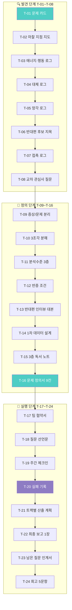

### 10.1 템플릿 24종 색인

| 코드 | 이름 | 단계 | 소요 | 대상 | 사용 렌즈 |
|---|---|---|---|---|---|
| T-01 | 문제 카드 | 발견 | 5분 | 전 학년 | L1 |
| T-02 | 마찰 지점 지도 | 발견 | 20분 | 중등+ | L1 L2 |
| T-03 | 에너지·행동 로그 | 발견 | 7일 | 전 학년 | L5 |
| T-04 | 대체 로그 (기술) | 발견 | 5일 | 중등+ | L6 |
| T-05 | 망각 로그 (학습) | 발견 | 7일 | 전 학년 | L4 |
| T-06 | 반대편 후보 지목 | 발견 | 10분 | 전 학년 | L12 |
| T-07 | 접촉 로그 (관계) | 발견 | 7일 | 전 학년 | L8 |
| T-08 | 교차 관심사 질문 | 발견 | 15분 | 고등+ | L2 L8 |
| T-09 | 증상/문제 분리표 | 정의 | 25분 | 전 학년 | L1 L7 |
| T-10 | 3조각 분해 | 정의 | 20분 | 중등+ | L2 |
| T-11 | 분석수준 3층 | 정의 | 25분 | 중등+ | L7 |
| T-12 | 반증 조건 만들기 | 정의 | 15분 | 중등+ | L10 |
| T-13 | 반대편 인터뷰 대본 | 정의 | 30분+ | 전 학년 | L12 |
| T-14 | 1차 데이터 설계 | 정의 | 40분 | 중등+ | L9 |
| T-15 | 3층 독서 노트 | 정의 | 권당 | 전 학년 | L9 L12 |
| T-16 | **문제 정의서 9칸** | 정의 | 1~2주 | 전 학년 | 전 렌즈 |
| T-17 | 팀 협약서 | 실행 | 30분 | 전 학년 | L3 |
| T-18 | 질문 선언문 | 실행 | 20분 | 전 학년 | L1 L10 |
| T-19 | 주간 체크인 | 실행 | 10분/주 | 전 학년 | L11 |
| T-20 | **실패 기록** | 실행 | 15분 | 전 학년 | L10 L11 |
| T-21 | 트랙별 산출 계획 | 실행 | 40분 | 중등+ | L3 L4 |
| T-22 | 최종 보고 1장 | 실행 | 60분 | 전 학년 | 전 렌즈 |
| T-23 | 남은 질문 인계서 | 실행 | 20분 | 전 학년 | L1 |
| T-24 | 회고 5문항 | 실행 | 20분 | 전 학년 | L11 |

### 10.2 학년별 필수 템플릿

| 학년 | 필수 | 선택 | 면제 |
|---|---|---|---|
| **초등 3~6** | T-01 T-03 T-06 T-09 T-20 | T-13 T-18 | T-08 T-11 T-14 T-21 |
| **중등** | T-01 T-06 T-09 T-10 T-12 T-13 T-16 T-20 | T-11 T-14 | T-08 |
| **고등** | T-01 ~ T-16 전체 | T-17 ~ T-24 | — |
| **대학·성인** | 전체 | — | — |

---

## 11. T-01 ~ T-08 : 발견 단계 템플릿

---

### T-01 · 문제 카드 (5분)

> **언제 쓰나**: 책을 읽다가 "어?" 하는 순간. 하루 최대 3장.
> **왜 5칸인가**: 6칸이 되면 쓰다 만다. 5칸은 5분이다.

#### 빈 양식

```
┌──────────────────────────────────────────────────────────┐
│ 📗 책       《                              》  p.        │
│                                                            │
│ ✂️ 걸린 문장                                                │
│    "                                                    "  │
│                                                            │
│ 😖 내가 본 현실 (내 주변에서 이걸 떠올리게 한 장면)          │
│                                                            │
│                                                            │
│ ❓ 그래서 드는 질문 (물음표로 끝나게)                        │
│                                                            │
│                                                            │
│ 🚫 이미 떠오른 뻔한 답 — 봉인 (3개 필수)                    │
│    1.                                                      │
│    2.                                                      │
│    3.                                                      │
│                                                            │
│ 🏷️ 관심사 #____   렌즈 L____                               │
└──────────────────────────────────────────────────────────┘
```

#### 작성 예시 ① — 중2 서연

```
📗 책     《번아웃 사회》 p.23
✂️ 걸린 문장
   "성과주체는 자기 자신을 착취한다. 착취자가 동시에 피착취자다."

😖 내가 본 현실
   시험 끝난 다음 날, 반 애들이 다 같이 "이제 쉬자"고 했는데
   실제로는 아무도 안 쉬었다. 다들 다음 수행평가 얘기를 했다.
   나도 그랬다. 아무도 시키지 않았는데.

❓ 그래서 드는 질문
   왜 우리는 쉬어도 되는 시간에 스스로 쉬지 못할까?
   쉬는 걸 막는 게 선생님도 부모님도 아니라면 누구지?

🚫 이미 떠오른 뻔한 답 — 봉인
   1. 경쟁이 심해서 → 그럼 경쟁이 약한 반은 쉬나? 확인 안 됨
   2. 의지가 약해서 → 반 전체가 다 의지가 약할 리 없음
   3. 스마트폰 때문에 → 폰 없어도 다들 문제집 폈음

🏷️ 관심사 #26 번아웃과 무기력   렌즈 L7 분석수준
```

#### 작성 예시 ② — 초5 하늘 (초등 버전)

```
📗 책     《아무튼, 잠》 p.12
✂️ 걸린 문장
   "잠은 게으름이 아니라 정리하는 시간이다."

😖 내가 본 현실
   나는 밤 11시에 자는데, 우리 반에서 제일 일찍 자는 편이다.
   애들이 "너 벌써 자?"라고 놀린다.

❓ 그래서 드는 질문
   왜 일찍 자는 게 부끄러운 일이 됐지?

🚫 뻔한 답
   1. 게임하려고 → 안 하는 애들도 늦게 잠
   2. 숙제가 많아서 → 숙제 다 한 애도 늦게 잠
   3. 부모님이 안 재워서 → 부모님은 자라고 함

🏷️ 관심사 #26   렌즈 L8 맥락
```

#### 작성 예시 ③ — 고2 은우

```
📗 책     《공정하다는 착각》 p.157
✂️ 걸린 문장
   "능력주의는 승자에게 오만을, 패자에게 굴욕을 준다."

😖 내가 본 현실
   우리 학교 장학금은 성적순인데, 받는 애들이 대부분
   중학교 때부터 학원을 다닌 애들이다.
   그런데 아무도 그걸 이상하다고 말하지 않는다.
   "쟤가 열심히 했으니까"로 끝난다.

❓ 그래서 드는 질문
   성적순 장학금은 노력을 보상하는가,
   아니면 이미 있던 차이를 정당한 것으로 만들어 주는가?

🚫 뻔한 답
   1. 장학금을 없애자 → 없애면 지원이 필요한 학생이 손해
   2. 소득 기준으로 주자 → 이미 일부 있음. 그래도 같은 현상
   3. 노력을 평가하자 → 노력을 어떻게 측정하나

🏷️ 관심사 #41 정의와 공정   렌즈 L7 분석수준
```

#### 자가 점검 3문항

```
□ 내 질문이 "예/아니오"로 끝나지 않는가?
□ 봉인한 답 3개가 서로 다른 종류인가? (다 같은 말은 아닌가)
□ '내가 본 현실'에 구체적인 장면이 있는가? (일반론이 아닌가)
```

---

### T-02 · 마찰 지점 지도 (20분)

> **언제 쓰나**: 로그를 7일 모은 뒤, "어디서 걸리는지"를 지도로 만들 때.

#### 빈 양식

```
┌──────────────────────────────────────────────────────────┐
│ 관심사 #____                              작성일          │
│                                                            │
│ 1. 하루의 흐름을 5구간으로 나눈다                           │
│   [       ] → [       ] → [       ] → [       ] → [      ]│
│                                                            │
│ 2. 각 구간에서 "걸리는 순간"을 표시한다 (⚡)                │
│                                                            │
│ 3. ⚡ 중에서 가장 자주 나온 3개                             │
│   ⚡1                                    빈도    /7일       │
│   ⚡2                                    빈도    /7일       │
│   ⚡3                                    빈도    /7일       │
│                                                            │
│ 4. 각 ⚡의 직전에 무엇이 있었나                             │
│   ⚡1 직전:                                                │
│   ⚡2 직전:                                                │
│   ⚡3 직전:                                                │
│                                                            │
│ 5. 이 마찰은 누구에게도 없는가? 있다면 누구에게 있나?        │
│                                                            │
└──────────────────────────────────────────────────────────┘
```

#### 작성 예시 — 중3 하은 (`#34 건강과 몸`)

```
1. 하루 5구간
  [등교 전] → [1~4교시] → [점심] → [5~7교시] → [하교 후]

2~3. 가장 자주 나온 ⚡ 3개
  ⚡1 점심시간에 밥을 남긴다              빈도 5/7일
  ⚡2 5교시에 졸음이 몰려온다             빈도 6/7일
  ⚡3 하교 후 편의점에서 군것질           빈도 4/7일

4. 직전에 무엇이 있었나
  ⚡1 직전: 4교시가 체육. 땀 흘리고 씻고 오면 배식 줄이 끝나 있음.
           남은 반찬만 받게 됨.
  ⚡2 직전: 점심을 절반 남겼음
  ⚡3 직전: 점심을 남겨서 배고픔

5. 이 마찰은 누구에게 있나
  4교시 체육이 있는 반(3개 반)에서만. 다른 반은 없음.
  → 개인 편식이 아니라 **시간표 배치**의 문제일 수 있다.
```

**여기서 일어난 일**: "나는 편식이 심하다"가 **"4교시 체육 배치가 만든 결과"**로 이동했다.
이것이 T-02의 목적이다 — **개인 서사를 구조 관찰로 옮긴다.**

#### 자가 점검

```
□ ⚡가 '느낌'이 아니라 '사건'인가?
□ 직전 상황을 적었는가? (원인 추측 말고 관찰)
□ 5번 칸에 "누구에게는 없는가"를 확인했는가?
```

---

### T-03 · 에너지·행동 로그 (7일)

> **언제 쓰나**: `#26 번아웃` `#25 중독` `#37 습관` 계열의 첫 7일.
> **규칙**: 하루 3회 고정 시각. 나중에 몰아 쓰지 않는다.

#### 빈 양식

| 날짜 | 시각 | 에너지 1~10 | 직전 30분에 한 일 | 지금 하고 싶은 것 | "원래 이런 거야"로 넘긴 것 |
|---|---|:-:|---|---|---|
| 월 | 09:00 | | | | |
| 월 | 14:00 | | | | |
| 월 | 21:00 | | | | |
| 화 | 09:00 | | | | |
| … | | | | | |

**7일 뒤 요약란**

```
· 에너지 최저 시각 3개 :
· 최저 직전에 반복된 활동 :
· 에너지가 올라간 순간 (있다면) :
· 7일 동안 한 번도 안 적힌 것 :   ← 이 칸이 중요하다
```

#### 작성 예시 (발췌) — 고1 민준

| 날짜 | 시각 | 에너지 | 직전 30분 | 하고 싶은 것 | 넘긴 것 |
|---|---|:-:|---|---|---|
| 월 | 09:00 | 6 | 등교(지하철 50분) | 자기 | 통학이 원래 힘들지 |
| 월 | 14:00 | 3 | 점심+수학 | 눕기 | 점심 후엔 원래 졸리지 |
| 월 | 21:00 | 4 | 학원 2교시 | 폰 보기 | 이 시간엔 원래 이렇지 |
| 화 | 09:00 | 5 | 등교 | 자기 | — |
| 화 | 14:00 | 3 | 점심+수학 | 눕기 | — |
| 화 | 21:00 | 7 | **체육 대체 수업** | 얘기하기 | — |

```
7일 요약
· 에너지 최저 시각 3개 : 14:00 (7/7일), 21:00 (5/7일), 16:00 (3/7일)
· 최저 직전 반복 활동 : "점심 직후 + 앉아서 하는 과목"이 6/7일
· 에너지가 올라간 순간 : 화요일 21시(체육 대체), 목요일 16시(친구와 논쟁)
    → 공통점: **몸을 쓰거나 말을 한 직후**
· 7일 동안 한 번도 안 적힌 것 : "쉬었다"
    → 7일 × 3회 = 21칸 중 '쉼'이 0회.
      나는 쉰 적이 없는 게 아니라, **쉰 것을 기록할 만한 일로 안 봤다.**
```

> 마지막 줄이 이 템플릿의 진짜 산출물이다. **안 적힌 것**이 문제를 가리킨다.

---

### T-04 · 대체 로그 (기술 계열, 5일)

> **언제 쓰나**: `#43 기술과 인간` `#36 결정과 선택`.
> **측정하는 것**: 도구에 맡긴 뒤 **내가 못 하게 된 것**.

#### 빈 양식

| 날짜 | 맡긴 일 | 사용한 도구 | 맡기기 전 내 실력 (1~5) | 맡긴 뒤 결과 만족도 | 지금 혼자 하면? |
|---|---|---|:-:|:-:|---|
| | | | | | |

**5일 뒤**
```
· 가장 자주 맡긴 일 :
· "혼자 하면?"에 자신 없어진 항목 :
· 맡겼는데 결과가 더 나빴던 것 :
· 맡기지 않은 일 중, 맡길 수 있었는데 안 맡긴 것 :  ← 왜 안 맡겼나?
```

#### 작성 예시 — 고1 민준 (`#43`)

| 날짜 | 맡긴 일 | 도구 | 전 실력 | 만족도 | 혼자 하면? |
|---|---|---|:-:|:-:|---|
| 1 | 영어 지문 해석 | 번역기 | 3 | 4 | 30분 걸림 |
| 2 | 수행평가 개요 짜기 | 챗봇 | 4 | 3 | 가능하지만 느림 |
| 3 | 자료 요약 | 챗봇 | 3 | 5 | 어디를 남길지 모르겠음 |
| 4 | 발표 대본 | 챗봇 | 4 | 2 | **내 말투가 아니었음** |
| 5 | 영어 지문 해석 | 번역기 | 3 | 4 | 더 자신 없어짐 |

```
· 가장 자주 맡긴 일 : 해석/요약 (읽기 계열)
· 자신 없어진 항목 : "긴 글에서 무엇이 중요한지 고르기"
· 결과가 더 나빴던 것 : 발표 대본 (만족도 2)
    → 도구는 **내가 기준을 가진 일**에서는 약했다
· 맡길 수 있었는데 안 맡긴 것 : 친구에게 보낼 사과 메시지
    → 왜? "그건 내가 써야 진짜인 것 같아서"
    → 여기서 질문이 나왔다: **무엇을 맡기면 안 된다고 느끼는가?
      그 기준은 어디서 왔는가?**
```

---

### T-05 · 망각 로그 (학습 계열, 7일)

#### 빈 양식

| 시험/수업 | 배운 내용 3개 | 당일 재현 (○/△/✕) | 3일 뒤 | 7일 뒤 | 왜 남았/사라졌나 |
|---|---|:-:|:-:|:-:|---|
| | | | | | |

#### 작성 예시 — 중2 서연 (`#33 교육과 학습`)

| 시험/수업 | 배운 내용 | 당일 | 3일 | 7일 | 왜 |
|---|---|:-:|:-:|:-:|---|
| 역사 수행 | 3·1운동 연도 | ○ | ○ | △ | 외웠음 |
| 역사 수행 | 3·1운동 왜 실패했나 | ○ | ✕ | ✕ | 답을 외웠지 이해 안 함 |
| 과학 실험 | 밀도 공식 | ○ | ○ | ○ | 실험에서 직접 씀 |
| 과학 실험 | 실험이 왜 실패했나 | ○ | ○ | ○ | **내가 틀린 이유라서** |
| 국어 | 시의 주제 | ○ | △ | ✕ | 선생님 해석을 적음 |

```
남은 것의 공통점 : 내가 직접 하거나, 내가 틀린 것
사라진 것의 공통점 : 남이 정리해 준 결론

→ 질문 : 평가는 '남이 정리해 준 결론'을 재는 데 최적화되어 있지 않은가?
```

---

### T-06 · 반대편 후보 지목 (10분)

> **언제 쓰나**: 질문이 생긴 직후 **바로**. 인터뷰 전에 후보부터 고른다.
> **핵심 질문**: "내 결론대로 되면 **손해 보는 사람**은 누구인가?"

#### 빈 양식

```
┌──────────────────────────────────────────────────────────┐
│ 내 잠정 결론 :                                             │
│                                                            │
│ 1. 이 결론대로 되면 이득 보는 사람                          │
│    ①                    ②                   ③             │
│                                                            │
│ 2. 이 결론대로 되면 손해 보는 사람 (3명 필수)                │
│    ①                                                       │
│       무엇을 잃나 :                                         │
│    ②                                                       │
│       무엇을 잃나 :                                         │
│    ③                                                       │
│       무엇을 잃나 :                                         │
│                                                            │
│ 3. 위 3명 중 **실제로 만날 수 있는 사람** : ____            │
│    관계 : (예: 담당 교사 / 이웃 / 부모님 지인)              │
│                                                            │
│ 4. 그 사람이 할 가장 강한 반박 (내가 미리 써 본다)           │
│                                                            │
│ 5. 4번에 내가 지금 답할 수 있나?  □ 있다  □ 없다            │
│    → "없다"면, 그게 인터뷰에서 물어야 할 것이다.            │
└──────────────────────────────────────────────────────────┘
```

#### 작성 예시 — 중3 하은

```
내 잠정 결론 :
  "급식 잔반은 4교시 체육 배치 때문이다. 시간표를 바꿔야 한다."

1. 이득 : ① 체육 있는 반 학생 ② 조리실무사(잔반 감소) ③ 환경 담당

2. 손해 :
  ① 체육 교사
     잃는 것 : 4교시는 운동장을 다른 반과 안 겹치게 쓸 수 있는 시간
  ② 교무부 시간표 담당 교사
     잃는 것 : 시수 규정·교사 배치 제약 안에서 짜놓은 균형
  ③ 5·6교시가 체육으로 밀린 반 학생
     잃는 것 : 하교 직전 체육 → 씻고 갈 시간 없음

3. 실제로 만날 수 있는 사람 : ② 교무부 담당 선생님

4. 가장 강한 반박 (내가 미리 써 봄)
   "시간표는 교과 시수 규정과 교사 시간표에 묶여 있다.
    급식 편의로 바꿀 수 있는 변수가 아니다."

5. 지금 답할 수 있나?  ☑ 없다
   → 인터뷰에서 물을 것 : "시간표에서 실제로 바꿀 수 있는 칸은 몇 개인가?"
```

> **5번이 "없다"로 끝나는 것이 정상이다.** 답할 수 있으면 그 질문은 이미 얕다.

---

### T-07 · 접촉 로그 (관계 계열, 7일)

#### 빈 양식

| 날짜 | 누구와 | 형태(대면/톡/통화) | 시간 | 대화 후 감정 1~10 | 내가 먼저? |
|---|---|---|---|:-:|:-:|
| | | | | | |

**7일 뒤**
```
· 접촉 횟수 총 :        · 그중 내가 먼저 :
· 감정 점수가 가장 높았던 접촉 3개의 공통점 :
· 감정 점수가 낮았던 접촉의 공통점 :
· 접촉이 많았던 날과 외로움의 관계 :   ← 비례하나? 반비례하나?
```

#### 작성 예시 (요약) — 대2 지호 (`#5 고독과 외로움`)

```
· 총 접촉 34회 · 내가 먼저 6회
· 높은 점수(8~9) 3개 공통점 : 1:1 · 30분 이상 · 대면
· 낮은 점수(2~4) 공통점 : 단톡방 · 5명 이상 · 반응만 함
· 접촉 많은 날일수록 외로움 점수가 **높았다** (역상관)

→ 질문 : 외로움은 접촉의 '양'이 아니라 '형태'의 문제인가?
        그렇다면 "연결을 늘리자"는 정책은 무엇을 해결하는가?
```

---

### T-08 · 교차 관심사 질문 (15분)

> **언제 쓰나**: CIP 3층에 '의외의 후보'가 나왔을 때, 또는 문제가 진부해졌을 때.
> **AI 아님**: 사전 작성된 **조합 규칙 5개**를 적용한다.

#### 조합 규칙 5

| 규칙 | 형식 | 예시 (`#41 정의` × `#12 친밀감`) |
|---|---|---|
| **R1 도입** | A의 언어를 B의 영역에 넣으면? | "가족 안에 '공정'을 도입하면 무엇이 사라지나?" |
| **R2 제거** | B에서 A를 빼면? | "공정을 따지지 않는 관계는 왜 오래가나?" |
| **R3 충돌** | A의 옳음과 B의 옳음이 부딪히는 장면은? | "부모가 두 자식에게 똑같이 대하는 것이 옳은가?" |
| **R4 대리** | A의 문제를 B가 대신 앓는 경우는? | "사회의 불공정을 왜 가장 가까운 사람에게 화내나?" |
| **R5 뒤집기** | B의 기준으로 A를 재면? | "친밀함의 기준으로 사회 제도를 평가하면 어떤 제도가 나쁜가?" |

#### 빈 양식

```
관심사 A : #____              관심사 B : #____

R1 도입 :
R2 제거 :
R3 충돌 :
R4 대리 :
R5 뒤집기 :

가장 답이 안 나오는 것 : R__   ← 이걸 고른다
왜 답이 안 나오나 :
```

#### 작성 예시 — 고2 은우 (`#33 교육` × `#43 기술`)

```
R1 도입 : 교실에 AI 채점을 도입하면 무엇이 사라지나?
R2 제거 : 기술을 다 빼면 남는 교육은 무엇인가?
R3 충돌 : "개별 맞춤"과 "같은 것을 함께 배움"은 왜 부딪히나?
R4 대리 : 기술 격차를 왜 학생 개인의 노력 부족으로 부르나?
R5 뒤집기 : 기술의 기준(효율·확장)으로 교육을 재면 무엇이 낙제하나?

가장 답이 안 나오는 것 : R5
왜 : 교육에서 '효율이 낮은데 좋은 것'을 나는 말할 수 없다.
     그런 게 있다고 믿는데 예를 못 대겠다.
     → 이게 내 문제다. 예를 찾는 것부터 시작한다.
```

---

## 12. T-09 ~ T-16 : 정의 단계 템플릿

---

### T-09 · 증상/문제 분리표 (25분) — L1 · L7

> **언제 쓰나**: 문제 카드 3장 이상 모였을 때. 정의서로 가는 첫 관문.

#### 빈 양식

```
┌──────────────────────────────────────────────────────────┐
│ 1. 내가 본 불편 5개 (다 증상이라고 가정하고 시작한다)        │
│   ①                            ②                          │
│   ③                            ④                          │
│   ⑤                                                        │
│                                                            │
│ 2. 각각에 "그래서 왜?"를 3번 던진다                         │
│   ① → 왜? → 왜? → 왜?                                     │
│   ② → 왜? → 왜? → 왜?                                     │
│   ...                                                      │
│                                                            │
│ 3. 3번째 '왜'에서 겹치는 것이 있나?                         │
│   겹치는 지점 :                                            │
│                                                            │
│ 4. 문제 후보 문장 (증상 아닌 것으로 1개)                    │
│                                                            │
│ 5. 검증 : 이 문제가 사라지면 위 증상 5개 중 몇 개가 사라지나? │
│   개  →  3개 미만이면 문제 후보를 다시 잡는다               │
└──────────────────────────────────────────────────────────┘
```

#### 작성 예시 — 중2 서연

```
1. 불편 5개
  ① 시험 끝나도 못 쉰다
  ② 주말에 쉬어도 월요일에 더 피곤하다
  ③ 쉬는 시간에 다들 문제집을 편다
  ④ "쉬었다"고 말하면 눈치가 보인다
  ⑤ 방학이 오히려 더 피곤하다

2. 왜 3번
  ① 못 쉼 → 다음 평가가 바로 있음 → 평가가 촘촘함 → 평가 사이 간격이 없음
  ② 더 피곤 → 주말에도 학원 → 주중에 못 끝냄 → 주중 시간이 이미 꽉 참
  ③ 문제집 → 안 하면 불안 → 남들이 함 → 기준이 '남'임
  ④ 눈치 → 쉬는 게 게으름으로 보임 → 성실=시간 투입 → 시간으로 성실을 잼
  ⑤ 방학 피곤 → 계획을 세움 → 안 지킴 → 계획이 학기보다 빡셈

3. 3번째 '왜'에서 겹치는 것
  ①④⑤ 모두 → **"시간을 얼마나 썼는가"로 사람을 평가하는 기준**
  ②③ → 시간이 이미 꽉 찬 구조

4. 문제 후보 문장
  "우리 반의 피로는 공부량이 아니라,
   빈 시간이 즉시 새 과제로 채워지는 시간 구조에서 온다."

5. 검증 : 이 문제가 사라지면?
  ①②③⑤ 사라짐 (4개) → 3개 이상 ✅ 통과
  ④는 남음 → ④는 다른 문제(#24 수치심)에 속할 수 있음. 분리해서 보관.
```

---

### T-10 · 3조각 분해 (20분) — L2

#### 빈 양식

```
문제 문장 :

이 문제를 서로 겹치지 않는 3조각으로 자른다.
(합치면 전체가 되고, 서로 안 겹쳐야 한다)

조각 A :
  이 조각만의 증거 :
조각 B :
  이 조각만의 증거 :
조각 C :
  이 조각만의 증거 :

겹침 검사 : A의 증거가 B에도 해당되나?  □ 예(다시 자름) □ 아니오
누락 검사 : A+B+C 밖에 남는 게 있나?     □ 예(4조각 필요) □ 아니오

내가 다룰 조각 : ____   (이유: 자원·접근성)
```

#### 작성 예시 — 중2 서연

```
문제 문장 :
  "우리 반의 피로는 빈 시간이 즉시 새 과제로 채워지는 구조에서 온다."

조각 A : 학교 안 시간 (시간표·수행평가 배치)
  증거 : 수행평가 일정표 · 시간표
조각 B : 학교 밖 시간 (학원·과제)
  증거 : 학원 시간표 설문
조각 C : 시간을 보는 기준 (쉬면 불안한 인식)
  증거 : 인터뷰 · 감정 로그

겹침 검사 : 아니오 (A는 학교가 정함, B는 가정이 정함, C는 인식)
누락 검사 : 아니오

내가 다룰 조각 : A
  이유 : 중2인 내가 접근 가능한 데이터가 학교 안에만 있다.
        B는 가정마다 다르고, C는 측정이 어렵다.
```

> **"내가 다룰 조각"에 이유를 쓰게 하는 것이 핵심이다.** 범위를 좁히는 것은 포기가 아니라 설계다(L3 제약조건).

---

### T-11 · 분석수준 3층 (25분) — L7

#### 빈 양식

```
문제 문장 :

┌─────────┬──────────────────────┬──────────────────┐
│ 층       │ 이 층에서 본 원인      │ 이 층의 해결책     │
├─────────┼──────────────────────┼──────────────────┤
│ 개인     │                        │                    │
│ (사람)   │                        │                    │
├─────────┼──────────────────────┼──────────────────┤
│ 규칙     │                        │                    │
│ (제도)   │                        │                    │
├─────────┼──────────────────────┼──────────────────┤
│ 문화     │                        │                    │
│ (당연함) │                        │                    │
└─────────┴──────────────────────┴──────────────────┘

Q1. 세 층 중 지금 사회가 주로 말하는 층은?  □개인 □규칙 □문화
Q2. 그 층으로 몰아가면 이득 보는 사람은?
Q3. 내가 다룰 층 :        (이유:                    )
```

#### 작성 예시 — 중3 하은 (급식 잔반)

| 층 | 이 층에서 본 원인 | 이 층의 해결책 |
|---|---|---|
| **개인** | 학생이 편식한다 | 편식 지도, 잔반 캠페인 |
| **규칙** | 4교시 체육 → 배식 순서 밀림 → 남은 반찬만 받음 | 시간표 배치 조정, 배식 순서 교대 |
| **문화** | "남기면 안 된다"는 말은 하지만 "왜 남는지"는 아무도 안 묻는다 | 잔반 데이터 공개 |

```
Q1. 사회가 주로 말하는 층 : ☑ 개인
Q2. 개인 층으로 몰면 이득 보는 사람 :
    시간표를 바꾸지 않아도 되는 쪽. 캠페인은 예산이 적게 든다.
Q3. 내가 다룰 층 : 규칙
    이유 : 개인 층은 이미 3년간 캠페인을 했고 잔반량 변화가 없다.
          (학교 급식일지 3년치 확인함)
```

---

### T-12 · 반증 조건 만들기 (15분) — L10

> **가장 자주 빠뜨리는 템플릿이자, 정의서 승급의 필수 관문.**

#### 빈 양식

```
내 주장 :

1. 내가 틀렸다면, 무엇이 관찰되어야 하나? (3개)
   ①
   ②
   ③

2. 위 3개는 실제로 관찰 가능한가?
   ① □가능 □불가능    ② □가능 □불가능    ③ □가능 □불가능
   → 불가능한 것은 지운다. 하나도 안 남으면 주장을 다시 쓴다.

3. 관찰 방법과 기한
   무엇을 :            어떻게 :            언제까지 :

4. 만약 반증되면 나는 무엇을 할 것인가? (미리 정한다)
   □ 주장을 폐기하고 T-20 실패 기록을 쓴다
   □ 범위를 좁혀 다시 쓴다 → 좁힐 방향 :

5. 이 주장은 어떤 결과가 나와도 맞는 말은 아닌가?
   □ 아니다 (반증 가능)   □ 그렇다 → 주장을 다시 쓴다
```

#### 작성 예시 ① — 중3 하은

```
내 주장 :
  "잔반은 4교시 체육 배치가 만든 결과다."

1. 내가 틀렸다면 관찰될 것
  ① 4교시 체육이 없는 반도 잔반량이 비슷하다
  ② 배식 순서를 바꿔도 잔반량이 그대로다
  ③ 잔반 상위 메뉴가 '체육 반'과 '비체육 반'에서 같다

2. 관찰 가능?  ① 가능  ② 가능(1주 실험)  ③ 가능

3. 관찰 방법
  무엇을 : 6개 반 잔반 무게 · 메뉴별
  어떻게 : 급식실 저울 · 2주간 · 조리실무사 협조
  언제까지 : 4월 30일

4. 반증되면 :
  ☑ 범위를 좁혀 다시 쓴다 → 방향 : "배식 순서"만 남기고 시간표는 뺀다

5. 어떤 결과가 나와도 맞는 말인가?  ☑ 아니다
```

#### 작성 예시 ② — 반증 불가능해서 폐기한 경우

```
내 주장 :
  "요즘 학생들은 회복탄력성이 부족하다."

1. 틀렸다면 관찰될 것
  ① 학생들이 회복탄력성이 높다  → 어떻게 재나?
  ② 힘든 일을 잘 이겨낸다      → '잘'의 기준은?
  ③ ... 못 쓰겠다

2. 관찰 가능?  ① 불가능  ② 불가능  ③ —

5. 어떤 결과가 나와도 맞는 말인가?  ☑ 그렇다
   → 잘 버티면 "그건 예외", 못 버티면 "역시 부족"
   → **주장 폐기.** 다시 씀:
     "힘든 일을 겪은 뒤 결석률이 3주 이상 높게 유지되는 비율이
      2019년보다 2026년에 더 높은가?"
     → 이건 관찰 가능하다.
```

---

### T-13 · 반대편 인터뷰 대본 (30분+)

> **필수 템플릿.** 정의서 7번 칸은 이것 없이 못 채운다.
> **원칙**: 설득하러 가는 게 아니다. **반박을 받아오는 것**이 목적이다.

#### 빈 양식 — 대본 8단계

```
┌──────────────────────────────────────────────────────────┐
│ 대상 : (관계만 표기, 실명 금지)                             │
│ 이 사람이 손해 보는 것 :                                    │
│ 일시 · 장소 :                    소요 : 20분 목표           │
├──────────────────────────────────────────────────────────┤
│ ① 목적 밝히기 (그대로 읽어도 됩니다)                        │
│   "제가 ○○에 대해 조사하고 있는데,                          │
│    제 결론이 틀렸을 수도 있어서                             │
│    반대 의견을 꼭 듣고 싶어서 찾아왔습니다."                 │
│                                                            │
│ ② 사실 확인 질문 2개 (의견 아님, 사실만)                    │
│   Q1.                                                      │
│   Q2.                                                      │
│                                                            │
│ ③ 제약 질문 (가장 중요)                                     │
│   "이 부분에서 실제로 바꿀 수 있는 것과                      │
│    절대 못 바꾸는 것은 각각 무엇인가요?"                     │
│                                                            │
│ ④ 내 결론 제시 → 반박 요청                                  │
│   "저는 ○○라고 보고 있는데, 어디가 틀렸을까요?"              │
│                                                            │
│ ⑤ 침묵 5초 (끼어들지 않기) ← 여기서 진짜 말이 나옵니다      │
│                                                            │
│ ⑥ 사례 요청                                                │
│   "그렇게 해서 문제가 생겼던 실제 경우가 있나요?"            │
│                                                            │
│ ⑦ 다음 사람 소개 요청                                       │
│   "이 얘기를 더 잘 아는 분이 계실까요?"                      │
│                                                            │
│ ⑧ 감사 + 결과 공유 약속                                     │
├──────────────────────────────────────────────────────────┤
│ 🚫 하면 안 되는 것                                          │
│   · 설득하기   · "그래도 이건 이상하지 않나요?"              │
│   · 반박에 즉시 재반박   · 녹음(동의 없이)                   │
├──────────────────────────────────────────────────────────┤
│ 📝 인터뷰 후 즉시 작성 (10분 안에)                          │
│   가장 강했던 반박 :                                        │
│   내가 몰랐던 사실 :                                        │
│   내 주장에서 수정할 부분 :                                 │
│   수정 안 할 부분과 그 이유 :                               │
└──────────────────────────────────────────────────────────┘
```

#### 작성 예시 — 중3 하은 × 교무부 선생님

```
대상 : 시간표 담당 교사
손해 보는 것 : 시수 규정 안에서 짜놓은 배치가 흔들림
일시 : 4/8 점심시간 · 교무실 · 18분

② 사실 확인
 Q1. 시간표를 짤 때 고정된 조건은 몇 개인가요?
   → 답: 교과별 주당 시수, 교사 겸임 학교 요일, 특별실 사용,
         전담 교사 공강 — 4개가 거의 못 움직인다
 Q2. 4교시 체육이 있는 반은 몇 개인가요?
   → 답: 3개 반. 특별실(체육관) 사용 순번 때문에 그렇게 됨

③ 제약 질문
   → 답: "체육관 순번은 못 바꾼다. 그런데 **배식 순서**는
         우리 소관이 아니라 급식 담당이 정한다."
   ★ 여기서 내 문제 범위가 바뀌었다

④ 내 결론 제시 → 반박
   → 반박: "시간표를 급식 때문에 바꾼 학교는 못 봤다.
           그건 시간표 문제가 아니라 배식 운영 문제로 보인다."

⑥ 사례
   → "예전에 급식 때문에 5교시를 당긴 적이 있는데,
      그러면 하교가 빨라져서 학원 시간이랑 겹친다고 민원이 왔다."

⑦ 다음 사람 : 급식 담당 부장 / 조리실무사

📝 인터뷰 후
 가장 강한 반박 : "시간표가 아니라 배식 운영의 문제다"
 몰랐던 사실 : 배식 순서 결정 주체가 다르다 / 체육관 순번은 고정
 수정할 부분 : "시간표를 바꿔야 한다" → "배식 순서 규칙을 바꿔야 한다"
 수정 안 할 부분 : "잔반의 원인이 개인 편식이 아니다"는 유지.
   이유 : 반별 잔반 데이터가 여전히 체육 반에 몰려 있다.
```

> **이 인터뷰 한 번으로 문제의 범위가 '시간표'에서 '배식 순서'로 이동했다.**
> 이것이 T-13의 성과다. 프로젝트가 실행 불가능한 요구에서 **실행 가능한 요구**로 바뀌었다.

---

### T-14 · 1차 데이터 설계 (40분) — L9

#### 빈 양식

```
1. 무엇을 알고 싶은가 (한 문장, 숫자로 답이 나오게)

2. 방법 선택
   □ 관찰(세기)  □ 설문  □ 인터뷰  □ 기록물 조사  □ 실험

3. 표본
   대상 :            수 :          기간 :
   왜 이 대상인가 :
   빠지는 대상 (한계) :

4. 측정 정의 (가장 중요)
   내가 세는 '1'은 정확히 무엇인가 :
   애매한 경우 처리 규칙 :

5. 설문이라면 — 유도 질문 점검
   내 문항이 답을 유도하나?  각 문항에 □ 검사
   중립형으로 고쳐 쓰기 :

6. 비교군
   비교할 대상 :        없으면 결론을 못 낸다

7. 예상 결과와 반대 결과
   내 예상 :
   반대 결과가 나오면 :  (T-12와 연결)
```

#### 작성 예시 — 중3 하은

```
1. 알고 싶은 것
   "체육이 4교시인 반과 아닌 반의 1인당 잔반 무게가 다른가?"

2. 방법 : ☑ 관찰(계량) + ☑ 기록물 조사(급식일지 3년치)

3. 표본
   대상 : 3학년 6개 반 (체육 4교시 3개 반 / 아닌 반 3개 반)
   수 : 약 180명 · 기간 : 2주 (10 급식일)
   왜 : 같은 학년이어야 메뉴·양이 같음
   빠지는 대상 : 결석·조퇴 학생, 도시락 지참 학생 (3명)

4. 측정 정의
   '1'은 : 반별 잔반통 총 무게(kg) ÷ 그날 실제 배식 인원
   애매한 경우 : 국물은 별도 통 → 국물은 제외하고 고형물만
                 (이유: 국물 잔량은 배식 방식에 좌우됨)

5. 설문 아님 — 해당 없음
   (단, 2차로 "왜 남겼나" 설문 예정 → 그때 이 칸 다시 씀)

6. 비교군 : 체육 4교시 아닌 3개 반 ✅

7. 예상 : 체육 반이 1인당 30% 이상 많다
   반대 결과가 나오면 : T-12의 반증 조건 ①에 해당 → 배식 순서로 범위 축소
```

---

### T-15 · 3층 독서 노트 (권당)

> **한 권에 한 장.** 정의서 6번 칸(책 근거 3권)의 재료.

#### 빈 양식

```
┌──────────────────────────────────────────────────────────┐
│ 📗 《                    》  저자           슬롯: □정의 □도구 □반증│
│                                                            │
│ 1층 · 이 책이 정의하는 말 (개념 3개)                        │
│   ①              = 
│   ②              = 
│   ③              = 
│                                                            │
│ 2층 · 이 책이 주는 도구 (내 문제에 쓸 수 있는 것 2개)        │
│   ①                        어디에 쓸까 :                    │
│   ②                        어디에 쓸까 :                    │
│                                                            │
│ 3층 · 이 책을 의심하는 칸 (필수)                            │
│   근거가 약한 주장 :                                        │
│   저자가 안 다룬 경우 :                                     │
│   이 책이 유리하게 쓰일 곳 :                                │
│                                                            │
│ 📌 내 문제로 가져올 문장 1개 (인용 + 쪽수)                   │
│                                                            │
│ 📌 이 책과 싸울 책 (짝 반증서) :                            │
└──────────────────────────────────────────────────────────┘
```

#### 작성 예시 — 고1 민준 《AI 2041》

```
📗 《AI 2041》 리카이푸·천치우판   슬롯: ☑정의

1층 · 개념 3개
 ① 딥러닝 = 데이터로 패턴을 학습하는 방식
 ② 자동화의 3단계 = 보조 → 대체 → 재구성
 ③ AI 격차 = 데이터·연산 자원을 가진 쪽과 아닌 쪽의 차이

2층 · 도구 2개
 ① '3단계 프레임' → 우리 학교 AI 사용을 3단계로 분류해 볼 수 있다
 ② 'AI 격차' 개념 → 학교 내 격차 조사 항목으로 쓸 수 있다

3층 · 의심 칸
 근거가 약한 주장 : "AI가 결국 새 일자리를 만든다" — 사례가 전부 미국·중국
 저자가 안 다룬 경우 : 교육 현장에서 **평가**에 AI가 쓰이는 경우
 이 책이 유리하게 쓰일 곳 : AI 기업의 낙관론 홍보

📌 가져올 문장
 "기술은 중립적이지만, 배치는 결코 중립적이지 않다." p.204

📌 짝 반증서 : 《AI 지도책》 (케이트 크로퍼드)
```

---

### T-16 · 문제 정의서 9칸 ★ 핵심 산출물

> **1~2주.** 이 문서가 리딩크루의 **최종 산출물**이다.
> 프로젝트를 안 해도 이것만 완성하면 **완주**다.

#### 빈 양식

```
╔══════════════════════════════════════════════════════════╗
║ 문제 정의서                                                ║
║ 관심사 #____   작성자         공개 범위: □개인 □그룹 □학급  ║
║                                    □학교 □공개            ║
╠══════════════════════════════════════════════════════════╣
║ ① 증상 vs 문제 (L1)                                        ║
║   보이는 증상 3개 :                                        ║
║   그 뿌리에 있는 문제 1개 :                                ║
╠══════════════════════════════════════════════════════════╣
║ ② 3조각 분해 (L2)                                          ║
║   A:            B:            C:                          ║
║   내가 다룰 조각 :      이유 :                             ║
╠══════════════════════════════════════════════════════════╣
║ ③ 다중 원인 (L5) — 4개 이상 필수                           ║
║   ①      ②      ③      ④                                 ║
║   이 중 내가 검증 가능한 것 :                              ║
╠══════════════════════════════════════════════════════════╣
║ ④ 분석 수준 (L7)                                           ║
║   개인 :        규칙 :        문화 :                       ║
║   내가 다룰 층 :      근거 문장 :                          ║
╠══════════════════════════════════════════════════════════╣
║ ⑤ 1차 데이터 (직접 만든 것) — 필수                         ║
║   방법 :        표본 :        기간 :                       ║
║   결과 요약 :                                              ║
║   한계 :                                                   ║
╠══════════════════════════════════════════════════════════╣
║ ⑥ 책 근거 3권 — 반증서 없으면 반려                         ║
║   정의서 《      》 가져온 것 :                            ║
║   도구서 《      》 가져온 것 :                            ║
║   반증서 《      》 흔들린 것 :                            ║
╠══════════════════════════════════════════════════════════╣
║ ⑦ 반대편 대변인 (L12) — 인터뷰 1건 필수                    ║
║   대상(관계) :                                             ║
║   가장 강한 반박 :                                         ║
║   내가 수정한 부분 :                                       ║
║   수정 안 한 부분과 이유 :                                 ║
╠══════════════════════════════════════════════════════════╣
║ ⑧ 반증 조건 (L10)                                          ║
║   "내가 틀렸다면 ______가 관찰될 것이다"                    ║
║   확인 방법 :                    기한 :                    ║
╠══════════════════════════════════════════════════════════╣
║ ⑨ 질문 선언문 (한 문장)                                    ║
║   ┌──────────────────────────────────────────────┐      ║
║   │                                                │      ║
║   └──────────────────────────────────────────────┘      ║
║   예/아니오로 끝나지 않는가? □ 확인                        ║
╚══════════════════════════════════════════════════════════╝
```

#### 작성 예시 — 중3 하은 (완성본)

```
관심사 #34 건강과 몸 (+ #44 환경과 책임)   작성자 하은   공개: 학급

① 증상 vs 문제
  증상 ① 우리 반 잔반이 유독 많다
       ② 점심 후 5교시에 조는 학생이 많다
       ③ 하교 후 편의점 이용이 잦다
  문제 : 잔반은 '무엇을 먹느냐'가 아니라
        '어떤 순서로 배식받느냐'가 만든 결과다

② 3조각 분해
  A 배식 운영(순서·시간)  B 메뉴 구성  C 학생 선호
  내가 다룰 조각 : A
  이유 : B는 영양 규정에 묶여 변경 폭이 좁고, C는 측정에 6개월 이상 필요.
        A는 2주 데이터로 검증 가능하고 학교 내 권한으로 조정 가능.

③ 다중 원인 (4개)
  ① 4교시 체육 → 씻고 오면 배식 줄 끝
  ② 배식 순번이 학년 초 고정, 1년간 안 바뀜
  ③ 인기 반찬이 앞 순서에서 소진
  ④ 점심시간 총 40분 중 이동·대기가 15분
  검증 가능한 것 : ①②③ (④는 관찰만 가능)

④ 분석 수준
  개인 : 학생 편식
  규칙 : 배식 순번 고정 · 체육관 사용 순번
  문화 : "남기지 마라"는 말은 하지만 왜 남는지는 안 묻는다
  내가 다룰 층 : 규칙
  근거 문장 : 개인 층 대응(잔반 캠페인)은 3년간 시행됐으나
             급식일지상 잔반량 변화 없음 (2023~2025 평균 편차 3% 이내)

⑤ 1차 데이터
  방법 : 반별 잔반 계량 (고형물만) + 급식일지 3년치 조사
  표본 : 3학년 6개 반 180명 · 10 급식일
  결과 : 체육 4교시 반 1인당 평균 138g / 비체육 반 89g (55% 차이)
        인기 메뉴일 때 격차 최대 (돈까스 날 172g vs 81g)
  한계 : 국물 제외. 도시락 지참 3명 제외.
        2주는 계절·메뉴 편차를 다 못 잡음.

⑥ 책 근거 3권
  정의서 《우리 몸이 세계라면》 — '식사는 개인 선택이 아니라 배치의 결과'
  도구서 《넛지》 — 선택 설계: 순서를 바꾸면 행동이 바뀐다
  반증서 《식탁의 정치》 — "구조 탓만 하면 개인의 식습관 교육이 무력화된다"
    흔들린 것 : 나는 개인 층을 너무 빨리 버렸다.
    → 수정 : 개인 층을 '틀렸다'가 아니라 '이미 시도됐고 효과 없었다'로 서술

⑦ 반대편 대변인
  대상 : 시간표 담당 교사 / 조리실무사
  가장 강한 반박 : "이건 시간표 문제가 아니라 배식 운영 문제다.
                  시간표는 시수 규정 때문에 못 움직인다."
  수정한 부분 : 요구를 '시간표 변경'에서 '배식 순번 주간 교대'로 변경
  수정 안 한 부분 : "원인이 개인 편식이 아니다" — 반별 데이터가 유지되므로

⑧ 반증 조건
  "내가 틀렸다면, 배식 순번을 2주간 교대해도
   체육 반의 1인당 잔반이 비체육 반 수준으로 내려오지 않을 것이다."
  확인 방법 : 순번 교대 실험 2주 + 계량   기한 : 6월 15일

⑨ 질문 선언문
  ┌──────────────────────────────────────────────────┐
  │ 급식 잔반은 학생의 식습관 문제인가,                  │
  │ 아니면 1년간 고정된 배식 순번이 만든 구조적 결과인가?│
  └──────────────────────────────────────────────────┘
  예/아니오로 끝나지 않는가? ☑ 확인
```

#### 승급 체크리스트 (시스템 자동 검사)

```
□ ③ 다중 원인 4개 이상          → 3개 이하면 제출 불가
□ ⑤ 1차 데이터 있음             → 없으면 제출 불가
□ ⑥ 반증서 슬롯 채워짐          → 없으면 제출 불가
□ ⑦ 반대편 인터뷰 1건           → 없으면 제출 불가
□ ⑧ 반증 조건이 관찰 가능       → 검토자 확인
□ ⑨ 선언문이 예/아니오 아님     → 검토자 확인
```

---

## 13. T-17 ~ T-24 : 실행 단계 템플릿

---

### T-17 · 팀 협약서 (30분)

> **프로젝트 시작 전 반드시 작성.** 갈등은 나중에 생기고, 협약은 지금만 쓸 수 있다.

#### 빈 양식

```
╔══════════════════════════════════════════════════════════╗
║ 팀 협약서            프로젝트명                            ║
╠══════════════════════════════════════════════════════════╣
║ 1. 역할 (4개 고정)                                         ║
║   🧭 키퍼   :        질문 선언문을 지킨다 (회의마다 낭독)    ║
║   📊 레코더 :        데이터·일지·실패 기록                  ║
║   ⚔️ 디센터 :        반대만 한다 (매 회의 1회 의무)          ║
║   🔨 메이커 :        산출물 제작                            ║
║   디센터 교대일 : 2주마다 →                                ║
╠══════════════════════════════════════════════════════════╣
║ 2. 우리가 안 할 것 3개 (제약 명시)                          ║
║   ①                                                        ║
║   ②                                                        ║
║   ③                                                        ║
╠══════════════════════════════════════════════════════════╣
║ 3. 의견이 갈릴 때 규칙                                      ║
║   □ 데이터가 있는 쪽을 따른다                               ║
║   □ 둘 다 시도해보고 2주 뒤 비교한다                        ║
║   □ 키퍼가 선언문에 더 가까운 쪽을 정한다                   ║
║   선택 :                                                   ║
╠══════════════════════════════════════════════════════════╣
║ 4. 못 지킬 때 알리는 방법                                   ║
║   "못 하겠다"고 말해도 되는 시한 : 마감    시간 전          ║
║   말했을 때 팀의 반응 규칙 :                                ║
╠══════════════════════════════════════════════════════════╣
║ 5. 이 프로젝트가 실패했다고 판단할 조건                     ║
║   (실패 = 결과가 안 나온 게 아니라, ____ 인 경우)           ║
╠══════════════════════════════════════════════════════════╣
║ 서명 :                                                     ║
╚══════════════════════════════════════════════════════════╝
```

#### 작성 예시 — 「급식 잔반」 팀 4인

```
1. 역할
  🧭 키퍼 : 하은      📊 레코더 : 서준
  ⚔️ 디센터 : 민지 (~4/25) → 다음 서준     🔨 메이커 : 태윤

2. 우리가 안 할 것 3개
  ① 학생 대상 캠페인·포스터 제작 (이미 3년간 했고 효과 없음)
  ② 영양사 선생님 개인을 원인으로 지목하는 서술
  ③ 잔반 사진을 SNS에 올리는 것 (동의 없음)

3. 의견이 갈릴 때 : ☑ 데이터가 있는 쪽을 따른다
   데이터가 양쪽 다 없으면 → 2주 시도 후 비교

4. 못 지킬 때
   마감 48시간 전까지 말하면 팀이 재분배한다.
   말했을 때 반응 규칙 : "왜 못 했는지" 묻지 않는다. 재분배만 한다.

5. 실패 조건
   결과가 안 나온 것은 실패가 아니다.
   **실패 기록을 한 건도 못 쓴 채 끝나는 것**이 실패다.
   (= 우리가 아무것도 시험해보지 않았다는 뜻이므로)

서명 : 하은 · 서준 · 민지 · 태윤   2026-04-11
```

---

### T-18 · 질문 선언문 (20분)

> 프로젝트 보드 최상단에 **고정**된다. 회의마다 키퍼가 소리 내어 읽는다.

#### 빈 양식 + 작성 규칙

```
┌──────────────────────────────────────────────────────────┐
│ 1차 초안 :                                                 │
│                                                            │
│ 점검 5문항                                                 │
│  □ 예/아니오로 끝나지 않는가?                               │
│  □ 답이 이미 문장 안에 들어 있지 않은가?                     │
│  □ "해야 한다"는 말이 들어 있지 않은가? (주장 아닌 질문)     │
│  □ 우리가 4주 안에 다룰 수 있는 범위인가?                    │
│  □ 반대편이 존재하는가? (반대할 사람을 지목할 수 있는가)     │
│                                                            │
│ 최종 :                                                     │
│  ┌────────────────────────────────────────────────┐      │
│  │                                                  │      │
│  └────────────────────────────────────────────────┘      │
│                                                            │
│ 이 선언문을 어겼다고 판단할 순간 :                          │
│  (예: 우리가 ○○를 만들기 시작하면, 질문에서 벗어난 것이다)  │
└──────────────────────────────────────────────────────────┘
```

#### 작성 예시 3종

**예시 ① — 좋은 선언문**
```
1차 초안 : "급식 잔반을 줄여야 한다"
  □ 예/아니오? — 주장문이라 질문이 아님 ✕
  □ "해야 한다" 들어감 ✕

최종 :
  "급식 잔반은 학생의 식습관 문제인가,
   1년간 고정된 배식 순번이 만든 구조적 결과인가?"

어겼다고 판단할 순간 :
  우리가 '잔반 줄이기 포스터'를 만들기 시작하면,
  질문에 답하지 않고 캠페인으로 도망친 것이다.
```

**예시 ② — 나쁜 선언문과 수정**
```
✕ "AI는 교육에 좋은가 나쁜가?"
  → 예/아니오는 아니지만 범위가 4주를 넘고, 반대편 지목 불가

○ "우리 학교에서 AI 사용을 금지한 과목과 허용한 과목 사이에
   과제 제출물의 무엇이 달라졌는가?"
  → 4주 내 조사 가능, 반대편(금지 담당 교사) 지목 가능
```

**예시 ③ — 범위가 넓어 실패한 사례**
```
✕ "우리 사회의 불공정은 어디서 오는가"
  4주차에 팀이 흩어짐. 각자 다른 것을 조사하고 있었음.

수정 후 : "우리 학교 장학금 수혜자 3년치의 중학교 출신 분포는
          전교생 분포와 얼마나 다른가?"
  → 같은 데이터를 보게 되면서 팀이 다시 모임
```

---

### T-19 · 주간 체크인 (10분/주)

#### 빈 양식

```
┌──────────────────────────────────────────────────────────┐
│ __주차   작성 :        날짜 :                              │
│                                                            │
│ 1. 이번 주 선언문을 지켰나?   □ 예  □ 아니오               │
│    아니오라면, 어디로 새고 있나 :                           │
│                                                            │
│ 2. 이번 주에 새로 안 사실 1개 (추측 말고 사실)              │
│                                                            │
│ 3. 이번 주에 흔들린 가정 1개                                │
│                                                            │
│ 4. 디센터의 반대 의견 (필수 · 디센터가 직접 작성)           │
│                                                            │
│ 5. 다음 주에 확인할 것 1개                                  │
│                                                            │
│ 6. 막힌 것 (있으면 반박 요청 큐 / 그룹에 올린다)            │
└──────────────────────────────────────────────────────────┘
```

#### 작성 예시 — 3주차

```
1. 선언문 지켰나? ☑ 아니오
   새는 곳 : 계량 데이터가 재미있어서 메뉴별 분석에 3일을 씀.
            우리 질문은 '순번'이지 '메뉴'가 아니다.

2. 새로 안 사실
   배식 순번은 학년 초에 정해지고 1년간 안 바뀐다.
   (급식 담당 부장 확인, 4/18)

3. 흔들린 가정
   "체육 반이 늦게 오니까 늦게 받는다"고 생각했는데,
   실제로는 **순번이 고정이라 체육 반이 원래 뒷번호**였다.
   체육은 원인이 아니라 **겹친 조건**일 수 있다.

4. 디센터(민지)
   "체육 반이 원래 뒷번호라면, 우리 결론은 '체육'이 아니라
    '뒷번호'가 되어야 한다. 그럼 체육 얘기는 다 빼야 하는 것 아닌가?"

5. 다음 주 확인할 것
   비체육 반 중 뒷번호인 반이 있나? 있다면 그 반 잔반은?
   → 있으면 우리 결론은 '순번'이 맞고, 없으면 구분 불가

6. 막힌 것 : 없음
```

> **3번과 4번이 없는 체크인은 반려된다.** "잘 하고 있다"는 체크인은 정보가 0이다.

---

### T-20 · 실패 기록 ★ (15분)

> **이 서비스에서 가장 높은 배점.** 삭제 불가, 수정만 가능(수정 이력 보존).

#### 빈 양식

```
╔══════════════════════════════════════════════════════════╗
║ ⚰️ 실패 기록                     날짜 :                    ║
╠══════════════════════════════════════════════════════════╣
║ 1. 죽은 가설 (그대로 옮겨 적는다)                          ║
║                                                            ║
║ 2. 언제부터 이 가설을 믿었나                                ║
║                                                            ║
║ 3. 무엇이 이 가설을 죽였나 (증거 · 숫자 · 인용)             ║
║                                                            ║
║ 4. 나는 왜 이걸 믿었나 (편향 점검 · L11)                    ║
║   □ 눈에 잘 띄어서   □ 내 경험과 맞아서                     ║
║   □ 그렇게 되면 좋아서   □ 남들이 그렇게 말해서             ║
║   □ 확인하기 쉬워서   □ 기타 :                              ║
║                                                            ║
║ 5. 이 실패가 알려준 것 (다음 사람에게 남기는 말)            ║
║                                                            ║
║ 6. 수정된 가설 (있으면)                                     ║
╚══════════════════════════════════════════════════════════╝
```

#### 작성 예시 ① — 「급식 잔반」 팀

```
⚰️ 실패 기록                     2026-04-25

1. 죽은 가설
   "급식 잔반은 4교시 체육 배치 때문이다."

2. 언제부터 믿었나
   3월 20일, T-02 마찰 지도에서 체육 반만 ⚡가 몰린 것을 본 순간부터.

3. 무엇이 죽였나
   · 배식 순번표 확인(4/18) : 순번은 학년 초 고정, 체육 반은 원래 뒷번호
   · 비체육 반 중 뒷번호인 5반 : 1인당 131g (체육 반 138g과 유사)
   · 앞번호 체육 반은 없어서 반대 검증은 불가 → 한계로 명시

4. 왜 믿었나
   ☑ 눈에 잘 띄어서 — 체육복 입고 늦게 오는 장면이 인상적이었다
   ☑ 확인하기 쉬워서 — 시간표만 보면 됐다
   순번표는 급식실에 붙어 있었는데 한 달 동안 아무도 안 봤다.

5. 이 실패가 알려준 것
   "눈에 보이는 차이(체육복)"와 "실제 원인(순번)"이 우연히 겹쳐 있으면,
   보이는 쪽을 원인으로 착각한다.
   다음 사람에게 : **원인 후보를 정하기 전에 '고정된 규칙 목록'부터 확인하라.**

6. 수정된 가설
   "잔반은 1년간 고정된 배식 순번의 뒷번호 반에서 구조적으로 많다."
```

#### 작성 예시 ② — 「AI 채점」 팀

```
⚰️ 실패 기록                     2026-11-03

1. 죽은 가설
   "AI 채점은 사람 채점보다 공정하다."

2. 언제부터 : 9월 초, 《AI 2041》을 읽고 나서

3. 무엇이 죽였나
   · 반증서 《AI 지도책》 : 학습 데이터 편중 사례
   · 우리 학교 서술형 AI 채점 시범 결과 확인 : 문장이 짧은 학생이
     체감상 낮은 점수 → 표본 22명, 상관은 보였으나 표본 부족(한계)
   · ⚔️ 반박: "채점이 공정해도, **채점 대상이 되는 것 자체**가
     불이익인 학생이 있다" (다른 학교 학생이 달아준 반박)

4. 왜 믿었나
   ☑ 그렇게 되면 좋아서 — 우리는 사람 채점의 편애를 싫어했다
   ☑ 남들이 그렇게 말해서

5. 알려준 것
   "A보다 B가 낫다"를 물을 때, **A의 문제**만 보고 B를 고르면 안 된다.
   B가 만드는 새 문제를 따로 조사해야 한다.

6. 수정된 가설
   "문제는 채점의 공정성이 아니라,
    평가 가능한 형태만 학습으로 인정되는 구조다." → T4 재정의 트랙 전환
```

#### 작성 예시 ③ — 실패를 못 쓴 팀의 사례 (반면교사)

```
프로젝트 「독서 앱 만들기」 · 5주 · 실패 기록 0건

회고에서 드러난 것 :
  "우리는 3주차에 이미 아무도 안 쓸 거라는 걸 알았다.
   그런데 앱을 만들기로 정했으니까 그냥 만들었다."

→ 이 팀의 실제 실패는 앱이 아니라, **아는 것을 기록하지 않은 것**이다.
→ T-17 협약서 5번(실패 조건)을 안 썼기 때문에,
  "무엇이 실패인지"를 정해두지 않았다.
```

---

### T-21 · 트랙별 산출 계획 (40분)

#### 트랙 선택 가이드

```
질문에 답하려면 무엇이 더 필요한가?

  더 알아야 한다        → T1 조사·리포트
  만들어봐야 안다        → T2 시제품
  아는데 안 바뀐다       → T3 캠페인·제안
  질문 자체가 틀렸다     → T4 재정의
```

#### 빈 양식 (트랙 공통)

```
트랙 : □T1 조사  □T2 시제품  □T3 제안  □T4 재정의
질문 선언문 :

1. 이 트랙을 고른 이유 (한 문장)

2. 4주 계획
   1주 :            산출 :
   2주 :            산출 :
   3주 :            산출 :
   4주 :            산출 :

3. 필요한 자원 / 허락받아야 할 것
   자원 :           누구에게 :         언제까지 :

4. 최소 성공 조건 (이것만 되면 완주로 친다)

5. 중단 조건 (이렇게 되면 멈추고 T4로 전환한다)
```

#### 트랙별 작성 예시

**T1 조사 — 「급식 잔반」**
```
1. 이유 : 원인 후보가 3개인데 데이터가 없다. 재는 게 먼저다.
2. 4주
   1주 계량 방법 확정·협조 요청     산출 : 측정 정의서
   2주 계량 10일차               산출 : 원자료
   3주 순번 교대 실험 협의·시행    산출 : 실험 로그
   4주 분석·리포트                산출 : 8p 리포트
3. 자원 : 급식실 저울 / 급식 부장 / 4월 10일까지
4. 최소 성공 : 반별 1인당 잔반 데이터 10일치 + 순번과의 관계 서술
5. 중단 조건 : 계량 협조가 안 되면 → 급식일지 3년치 문헌 조사로 전환
```

**T2 시제품 — 「쉬는 시간 회복」**
```
1. 이유 : "5분은 회복이 안 된다"는 주장을 말로는 반박 못 한다. 재봐야 한다.
2. 4주
   1주 회복 측정 방법 설계         산출 : 측정 프로토콜
   2주 A안(5분×4) 시행            산출 : 로그
   3주 B안(10분×2) 시행           산출 : 로그
   4주 비교·발표                  산출 : 비교 리포트 + 학급 건의
3. 자원 : 담임 허락 / 학급 동의 / 3월 말까지
4. 최소 성공 : 두 조건의 회복 점수 차이를 숫자로 제시
5. 중단 : 학급 동의가 절반 미만이면 → T1으로 전환(다른 학교 사례 조사)
```

**T3 제안 — 「두발 규정」**
```
1. 이유 : 3년치 회의록 분석이 끝났다. 이제 결정권자에게 낼 차례다.
2. 4주
   1주 제안서 초안               산출 : 초안 v1
   2주 반대편 3인 사전 검토       산출 : 반박 반영본
   3주 학생회 의결                산출 : 의결서
   4주 학교운영위 제출            산출 : 제출 확인 + 회신
3. 자원 : 학생회 안건 상정 / 학생회장 / 5월 첫째 주
4. 최소 성공 : **채택 여부와 무관하게** 제출 + 회신 문서 확보
5. 중단 : 상정이 거부되면 → 거부 사유를 기록하고 T1(사유 분석)으로 전환
```

**T4 재정의 — 「AI 채점」**
```
1. 이유 : 반증으로 원 가설이 죽었다. 질문을 다시 쓰는 게 산출물이다.
2. 4주
   1주 죽은 가설 정리(T-20)       산출 : 실패 기록 2건
   2주 새 질문 후보 5개            산출 : 후보 목록
   3주 각 후보의 반증 조건 작성    산출 : T-12 ×5
   4주 최종 선언문 + 근거          산출 : 새 정의서
4. 최소 성공 : 반증 가능한 새 선언문 1개 + 폐기 근거 문서화
5. 중단 : 없음 (재정의는 이미 마지막 트랙)
```

---

### T-22 · 최종 보고 1장 (60분)

> **1장을 넘기지 않는다.** 넘기면 아무도 안 읽고, 인계도 안 된다.

#### 빈 양식

```
╔══════════════════════════════════════════════════════════╗
║ [프로젝트명]                        트랙 : T_   기간 :     ║
╠══════════════════════════════════════════════════════════╣
║ 질문 선언문                                                ║
║                                                            ║
╠══════════════════════════════════════════════════════════╣
║ 우리가 한 것 (3줄)                                         ║
║ ①  ②  ③                                                   ║
╠══════════════════════════════════════════════════════════╣
║ 알아낸 것 (숫자 포함, 3개)                                 ║
║ ①  ②  ③                                                   ║
╠══════════════════════════════════════════════════════════╣
║ 죽은 가설 (T-20 요약, 전부)                                ║
║                                                            ║
╠══════════════════════════════════════════════════════════╣
║ 아직 모르는 것 · 한계                                      ║
║                                                            ║
╠══════════════════════════════════════════════════════════╣
║ 반대편이 한 말과 우리 답                                    ║
║                                                            ║
╠══════════════════════════════════════════════════════════╣
║ 남은 질문 (→ T-23 인계서로)                                ║
║                                                            ║
╚══════════════════════════════════════════════════════════╝
```

#### 작성 예시 — 「급식 잔반」 최종본

```
[급식 잔반은 왜 특정 반에만 몰리는가]   트랙 T1   2026.03~04 (4주)

질문 선언문
  급식 잔반은 학생의 식습관 문제인가,
  1년간 고정된 배식 순번이 만든 구조적 결과인가?

우리가 한 것
 ① 3학년 6개 반 10 급식일 잔반 계량 (고형물 기준)
 ② 급식일지 3년치 조사 + 배식 순번표 확인
 ③ 순번 교대 2주 실험 (5·6반 순번 교대)

알아낸 것
 ① 순번 뒷번호 3개 반 평균 134g / 앞번호 3개 반 89g (50% 차이)
 ② 인기 메뉴일수록 격차 확대 (돈까스 172g vs 81g)
 ③ 순번 교대 2주 후, 교대한 5반 잔반 128g → 94g (27% 감소)

죽은 가설
 · "체육 4교시 때문이다" — 체육 반이 원래 뒷번호였음 (4/25 폐기)
 · "학생 편식 때문이다" — 3년 캠페인에도 잔반량 변화 없음 (4/2 폐기)

아직 모르는 것 · 한계
 · 2주 실험은 계절·메뉴 편차를 통제하지 못함
 · 국물류 제외 → 실제 잔반 총량과 다름
 · 앞번호 체육 반이 없어 '체육' 변수 완전 배제 불가

반대편이 한 말과 우리 답
 시간표 담당 교사 : "시간표는 시수 규정 때문에 못 바꾼다"
   → 우리 답 : 시간표가 아니라 **배식 순번 주간 교대**를 요구로 변경
 조리실무사 : "순번을 자주 바꾸면 배식 준비가 꼬인다"
   → 우리 답 : 주 단위 고정 교대(월요일 변경)로 제안 수정

남은 질문
 "다른 학교도 배식 순번이 1년 고정인가? 고정이 아닌 학교의 잔반은?"
```

---

### T-23 · 남은 질문 인계서 (20분)

> **이걸 안 쓰면 프로젝트가 마감되지 않는다.** 시스템이 마감 버튼을 막는다.
> 작성 즉시 **미해결 큐**에 자동 발행된다.

#### 빈 양식

```
╔══════════════════════════════════════════════════════════╗
║ 🎯 남은 질문 인계서                                        ║
╠══════════════════════════════════════════════════════════╣
║ 1. 남은 질문 (한 문장)                                     ║
║                                                            ║
║ 2. 왜 우리는 못 했나                                       ║
║   □ 시간   □ 권한·접근   □ 자료 없음   □ 범위 초과         ║
║   구체적으로 :                                             ║
║                                                            ║
║ 3. 이어받는 사람에게 넘기는 것                              ║
║   □ 원자료 (         )   □ 인터뷰 기록 (   건)             ║
║   □ 실패 기록 (   건)    □ 연락 가능한 사람 (관계만)        ║
║   □ 읽은 책 목록         □ 측정 정의서                     ║
║                                                            ║
║ 4. 이어받는 사람이 **처음 3일에 할 일** (우리가 정해준다)   ║
║   D1 :                                                     ║
║   D2 :                                                     ║
║   D3 :                                                     ║
║                                                            ║
║ 5. 우리가 밟은 지뢰 (같은 실수 반복 방지)                   ║
║                                                            ║
║ 6. 이어받기 조건                                            ║
║   □ 누구나   □ 같은 학교   □ 같은 관심사 활동 이력 있는 사람 ║
╚══════════════════════════════════════════════════════════╝
```

#### 작성 예시 — A중 3-2반 → 미해결 큐

```
1. 남은 질문
   "다른 학교도 배식 순번이 1년 고정인가?
    순번을 교대 운영하는 학교의 잔반은 얼마나 다른가?"

2. 왜 못 했나
   ☑ 권한·접근 — 우리 학교 데이터만 접근 가능.
   다른 학교 급식 데이터를 받으려면 학교 간 협조가 필요한데
   중3인 우리가 요청할 통로가 없었다.

3. 넘기는 것
   ☑ 원자료 : 반별 10일 계량 데이터 (csv)
   ☑ 인터뷰 기록 : 3건 (시간표 담당 / 급식 부장 / 조리실무사)
   ☑ 실패 기록 : 2건
   ☑ 연락 가능한 사람 : 우리 학교 급식 부장 (인계 동의받음)
   ☑ 읽은 책 목록 : 3권
   ☑ 측정 정의서 : 고형물 기준 · 국물 제외 규칙 포함

4. 처음 3일에 할 일
   D1 : 우리 측정 정의서를 그대로 쓸지 결정하라. 바꾸면 비교가 안 된다.
   D2 : 자기 학교 배식 순번표를 확인하라. 급식실 벽에 붙어 있다.
   D3 : 순번이 고정인지 교대인지부터 확인하라. 이것만 알아도 절반이다.

5. 우리가 밟은 지뢰
   · 눈에 띄는 변수(체육복)를 원인으로 착각해 3주를 썼다.
     **고정된 규칙 목록부터 확인하라.**
   · 국물을 포함해 재다가 첫 3일 데이터를 버렸다. 측정 정의를 먼저 정하라.
   · 계량 협조 요청을 구두로 했다가 담당자가 바뀌어 이틀 밀렸다. 문서로 하라.

6. 이어받기 조건 : ☑ 누구나
```

**이후 실제 이어달리기**

```
🎗️ A중 3-2반 (2026.04) → B고 독서동아리 (2026.09) → ?

B고가 이어받은 뒤 한 일 :
  · 3개 학교 순번 운영 방식 비교 (고정 2 / 교대 1)
  · 교대 학교의 잔반이 1인당 21% 낮음
  · 교육지원청에 「배식 순번 교대 권고」 제안서 제출 (T3)
  · 남긴 질문 : "권고가 실제로 반영된 학교는 몇 곳인가?" → 큐로 재발행
```

---

### T-24 · 회고 5문항 (20분)

#### 빈 양식

```
1. 시작할 때 믿었는데 지금은 안 믿는 것은?

2. 이 프로젝트에서 내가 가장 오래 붙잡고 있던 착각은?

3. 반대편의 말 중 지금도 답 못 하는 것은?

4. 다음에 같은 문제를 다시 잡는다면, 무엇부터 다르게 할 것인가?

5. 이 관심사를 계속 붙잡을 것인가?
   □ 계속  □ 다른 관심사로  □ 교차해서
   이유 :
```

#### 작성 예시 — 하은

```
1. 시작할 때 믿었는데 지금은 안 믿는 것
   "잔반은 학생들이 편식해서 생긴다." 3년간 그렇게 들어서 그런 줄 알았다.

2. 가장 오래 붙잡은 착각
   "체육복 입고 늦게 오는 애들"이 원인이라는 그림.
   너무 선명해서 3주 동안 다른 걸 안 봤다.

3. 지금도 답 못 하는 것
   조리실무사님이 "순번을 자주 바꾸면 배식이 꼬인다"고 했는데,
   주 단위 교대가 정말 안 꼬이는지는 2주로는 모른다.

4. 다음에 다르게 할 것
   원인을 정하기 전에 **"이미 고정되어 있는 규칙 목록"**을 먼저 만든다.
   순번표는 처음부터 벽에 붙어 있었다.

5. 계속할 것인가
   ☑ 교차해서 — #34 건강 × #41 정의
   이유 : 잔반을 재다가 "왜 뒷번호 반은 매년 뒷번호인가"가 더 궁금해졌다.
         이건 급식 문제가 아니라 순번이 정해지는 방식의 문제 같다.
```

---

## 14. 루브릭 6종

> 루브릭은 **교사용 채점표이자 학생용 자가 점검표**다. 같은 표를 양쪽이 본다.
> 점수는 학생 간 비교가 아니라 **완성도 확인**에 쓴다.

---

### R-01 문제 카드 루브릭 (10점)

| 항목 | 3점 | 2점 | 1점 | 배점 |
|---|---|---|---|:-:|
| 걸린 문장 | 책의 문장을 쪽수와 함께 정확히 인용 | 인용은 있으나 쪽수 없음 | 요약만 있음 | 3 |
| 내가 본 현실 | 구체적 장면 · 언제 어디서 누가 | 상황은 있으나 일반적 | "요즘 다들…" 식 일반론 | 3 |
| 질문 | 물음표로 끝나고 예/아니오 아님 | 물음표지만 예/아니오 | 주장문 | 2 |
| 금지된 답 | 3개, 서로 다른 종류 | 3개지만 유사 | 2개 이하 | 2 |

---

### R-02 문제 정의서 루브릭 (40점)

| 칸 | 4점 | 3점 | 2점 | 1점 |
|---|---|---|---|---|
| ① 증상/문제 | 증상 3개가 하나의 뿌리로 수렴, 검증(5번) 통과 | 수렴하지만 검증 미기재 | 증상만 나열 | 증상과 문제 미구분 |
| ② 3조각 | 겹침·누락 검사 통과, 선택 이유 명시 | 3조각이나 이유 없음 | 조각이 겹침 | 분해 안 됨 |
| ③ 다중 원인 | 4개 이상 + 검증 가능성 표시 | 4개 | 3개 | 2개 이하 |
| ④ 분석 수준 | 3층 모두 + 근거 문장 + 선택 이유 | 3층 서술 | 2층 | 1층만 |
| ⑤ 1차 데이터 | 측정 정의·표본·기간·한계 모두 명시 | 데이터 있으나 한계 누락 | 방법만 서술 | 없음(제출 불가) |
| ⑥ 책 3권 | 정의·도구·반증 + 반증서로 흔들린 지점 서술 | 3권이나 흔들린 지점 없음 | 2권 | 반증서 없음(제출 불가) |
| ⑦ 반대편 | 인터뷰 + 수정한 부분/안 한 부분 + 이유 | 인터뷰 + 수정만 | 인터뷰만 | 없음(제출 불가) |
| ⑧ 반증 조건 | 관찰 가능 + 방법 + 기한 | 관찰 가능하나 방법 없음 | 모호함 | 반증 불가 명제 |
| ⑨ 선언문 | 예/아니오 아님 + 반대편 존재 | 예/아니오 아님 | 예/아니오형 | 주장문 |
| **가산** | 정의서 작성 중 **가설 폐기 기록**이 있으면 **+4** | | | |

**등급**: 36~44 우수 / 28~35 완성 / 20~27 보완 / 20 미만 재작성

---

### R-03 반응(반박) 품질 루브릭 (5점)

| 항목 | 2점 | 1점 | 0점 |
|---|---|---|---|
| 손해 보는 사람 지목 | 구체적 역할·입장 명시 | 막연한 대상 | 미기재(등록 불가) |
| 그 사람의 논리 | 그 입장에서 성립하는 문장 | 비난·반대 표현만 | 미기재(등록 불가) |
| 근거·사례 | 사례나 자료 언급 | 없음 | — |

> **0점 항목이 있으면 등록 자체가 안 된다.** 시스템이 막는다.

---

### R-04 프로젝트 루브릭 (30점)

| 항목 | 배점 | 6점 | 4점 | 2점 |
|---|:-:|---|---|---|
| 선언문 준수 | 6 | 매주 체크인에 선언문 점검 기록 | 절반 이상 | 선언문 방치 |
| 1차 데이터 | 6 | 직접 수집 + 한계 명시 | 수집만 | 2차 자료만 |
| **실패 기록** | **8** | **2건 이상 + 편향 점검 작성** | 1건 | 0건 |
| 반대편 반영 | 5 | 인터뷰 + 요구/범위 수정 이력 | 인터뷰만 | 없음 |
| 산출물 | 3 | 트랙 규격 충족 | 미흡 | 없음 |
| 인계서 | 2 | 처음 3일 할 일까지 작성 | 질문만 | 없음(마감 불가) |

> **실패 기록이 최고 배점(8점)이다.** 이 배점 배치가 문화를 만든다.

---

### R-05 병렬 독서 그룹 루브릭 (교사용, 15점)

| 항목 | 3점 | 2점 | 1점 |
|---|---|---|---|
| 책 다양성 | 전원 다른 책 + 반증서 포함 | 전원 다른 책 | 중복 있음 |
| 교차 코멘트 | 전원이 타인 책 내용을 인용해 코멘트 | 절반 이상 | 자기 책 얘기만 |
| 관점 충돌 기록 | 충돌 지점 문서화 | 언급만 | 없음 |
| 수렴 방지 | 결론이 갈라진 채로 정의서 2개 이상 | 1개로 수렴 | 전원 동일 결론 |
| 참여 균형 | 전원 카드 3장 이상 | 1~2명 미달 | 절반 미달 |

---

### R-06 자기 점검표 (학생용, 점수 없음)

```
□ 나는 이번에 **틀렸다고 인정한 것**이 하나라도 있나?
□ 내 결론으로 손해 보는 사람을 **실제로 만났나**?
□ 내가 쓴 숫자를 **내가 직접 만들었나**?
□ 내가 읽은 책 중 **내 생각과 반대인 책**이 있었나?
□ 내 질문은 시작할 때와 **달라졌나**?
□ 나는 "원래 그런 거야"라고 넘긴 것을 **하나라도 파봤나**?

여섯 칸 중 ✓가 3개 미만이면,
결과물이 아무리 좋아도 이번 탐구는 **확신을 강화한 것**에 가깝다.
```

---

# PART V — 사람과 흐름

## 15. 페르소나 8인

---

### 🎒 P1. 서연 · 중2 · **핵심 페르소나**

| | |
|---|---|
| **상황** | 책은 꾸준히 읽는데 독후감은 늘 "감동적이었다"로 끝남 |
| **고통** | 무엇을 써야 할지 모른다. 선생님이 "생각을 쓰라"는데 생각이 뭔지 모르겠다 |
| **지금 쓰는 것** | 학교 독서록, 가끔 블로그 |
| **리딩크루에서** | CIP → `#33 교육` → T-01 카드 12장 → 정의서 1건 |
| **성공 신호** | 카드 → 정의서 승급 1건, "쓸 말이 생겼다"는 발화 |
| **이탈 위험** | 정의서 9칸이 너무 많다고 느낌 → 학급 과제로 쪼개 배포하면 완주 |
| **한 문장** | *"내 질문을 처음으로 문장으로 써봤다"* |

---

### 📘 P2. 민준 · 고1

| | |
|---|---|
| **상황** | 생기부에 쓸 탐구 활동이 필요 |
| **고통** | 매년 주제가 남의 것. 결과물은 있는데 내 판단이 없음 |
| **리딩크루에서** | `#43 기술과 인간` → 반증서 독서 → 가설 폐기 → T4 재정의 |
| **성공 신호** | 실패 기록 2건, 포트폴리오 외부 링크 생성 |
| **이탈 위험** | "실패를 기록하면 불리하지 않나" → 포트폴리오에서 폐기 기록이 **최고 배점**임을 명시 |
| **한 문장** | *"틀린 걸 쓰는 게 더 어려운 일이라는 걸 알았다"* |

---

### 🎓 P3. 지호 · 대학생 3학년

| | |
|---|---|
| **상황** | 하고 싶은 게 뭔지 모름. 진로 검사 결과가 안 와닿음 |
| **고통** | "사회 문제에 관심 있다"고 말해왔는데 정작 오래 붙잡은 게 없음 |
| **리딩크루에서** | CIP 3층 '의외의 후보' `#12 친밀감` → 교차 `#41 × #12` |
| **성공 신호** | 학기 말 재검사에서 축1이 이동, 교차 정의서 1건 |
| **이탈 위험** | 소속 그룹이 없어 반박이 안 달림 → 반박 요청 큐로 유입 |
| **한 문장** | *"내가 고른 답과 내가 쓴 글이 서로 다른 곳을 가리켰다"* |

---

### 👩‍🏫 P4. 은정 · 중등 국어교사 · **핵심 페르소나**

| | |
|---|---|
| **상황** | 독서 수업이 감상 나누기로 끝남. 수행평가 근거를 만들기 어려움 |
| **고통** | "생각을 평가한다"는 게 주관적이라는 민원이 무섭다 |
| **리딩크루에서** | 학급 개설 → 병렬 배정 → 루브릭 채점 → 학기 리포트 |
| **성공 신호** | 학급 정의서 20건, 다음 학기 커리큘럼 복제 |
| **이탈 위험** | 초기 세팅 부담 → **16주 커리큘럼 원클릭 적용** (§17) |
| **한 문장** | *"채점 근거를 학생이 스스로 만들어 온다"* |

---

### 📚 P5. 현우 · 학교 도서관 사서

| | |
|---|---|
| **상황** | 장서는 있는데 안 읽힘. 독서 행사가 일회성 |
| **고통** | 책과 활동이 따로 논다 |
| **리딩크루에서** | 관심사별 서가 큐레이션, 학교 아카이브 운영 |
| **성공 신호** | 관심사 태그 도서 대출 30% 증가, 연간 아카이브 1권 |
| **한 문장** | *"어떤 책이 어떤 질문을 낳았는지 처음으로 보였다"* |

---

### 🏫 P6. 태선 · 고교 진로부장

| | |
|---|---|
| **상황** | 진로 활동이 직업 체험 위주. 학생 개별성이 안 드러남 |
| **고통** | 생기부 진로 기재가 다 비슷해짐 |
| **리딩크루에서** | CIP를 진로 활동으로 채택, 관심사 이력 + 폐기 기록을 기재 근거로 |
| **성공 신호** | 학년 단위 도입, 진로 기재 문장 다양성 증가 |
| **한 문장** | *"직업이 아니라 관심사를 먼저 물으니 학생마다 답이 달라졌다"* |

---

### 👨‍👩‍👧 P7. 미라 · 초5 학부모

| | |
|---|---|
| **상황** | 아이가 책은 읽는데 남는 게 없어 보임 |
| **고통** | 독서 논술 학원은 비싸고, 결국 요약 쓰기 훈련 |
| **리딩크루에서** | 초등 모드 — T-01 · T-03 · T-06만 사용, 주 1회 |
| **성공 신호** | 아이가 "왜 원래 그런 거야?"를 주 1회 이상 말함 |
| **이탈 위험** | 결과물이 없어 보임 → **질문 카드 20장 = 학기 산출물**임을 명시 |
| **한 문장** | *"아이가 질문을 모아둔 걸 보여줬다"* |

---

### 🧑‍💼 P8. 준형 · 직장인 독서모임 운영자

| | |
|---|---|
| **상황** | 모임이 3개월이면 시들해짐. 매번 같은 사람이 말함 |
| **고통** | 감상 공유 이상으로 안 나감 |
| **리딩크루에서** | 그룹 개설 → 병렬 독서 배정 → ⚔️ 디센터 순환 |
| **성공 신호** | 6개월 유지, 정의서 3건, 프로젝트 1건 |
| **한 문장** | *"같은 책을 안 읽으니까 오히려 할 말이 생겼다"* |

### 15.1 우선순위

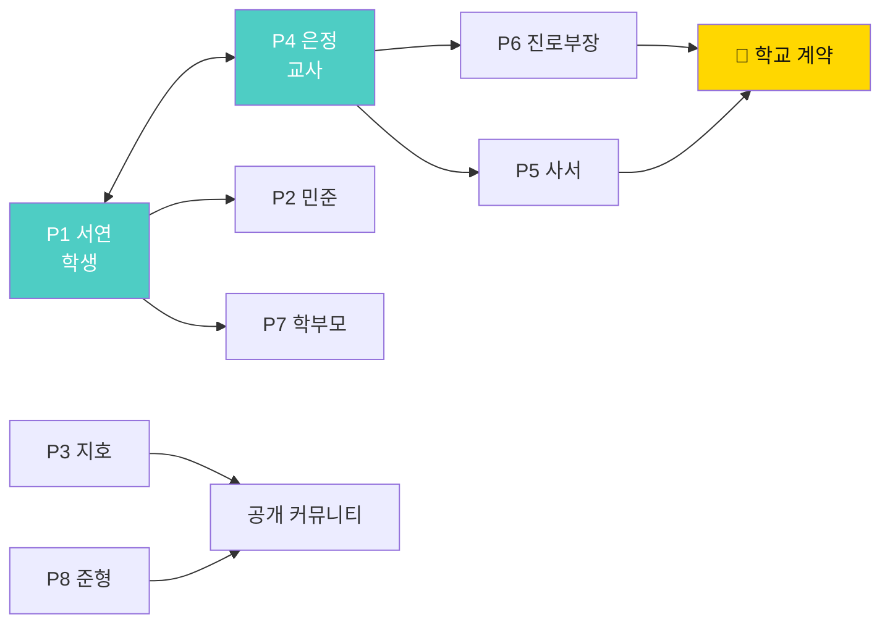

**P1과 P4가 짝으로 성공해야 한다.**
P1이 "쓸 말이 생긴다"를, P4가 "채점 근거가 생긴다"를 동시에 경험하면 학급 단위로 퍼진다.
P6·P5는 학교 계약의 열쇠, P2·P3·P7·P8은 개인 유입.

---

## 16. 유저 시나리오 12종

---

### S1. 서연(중2) — 검사에서 첫 문제 카드까지 (Day 1~14)

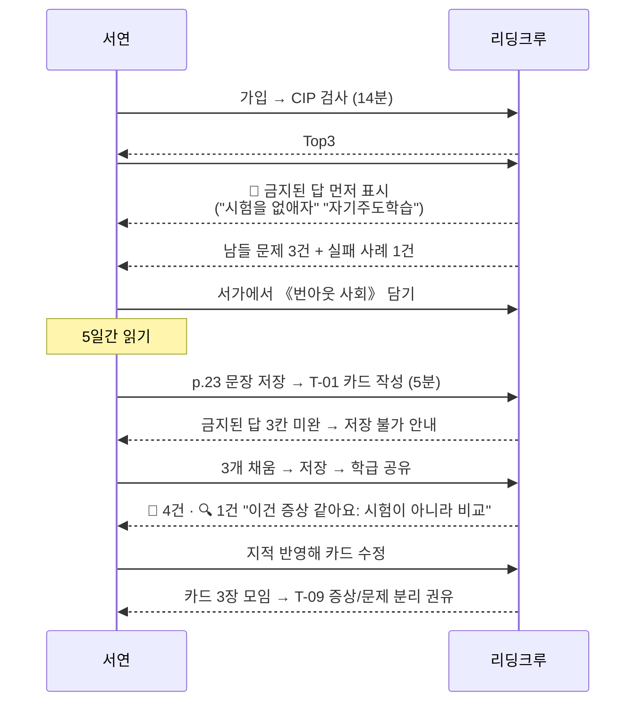

**Day별 상세**

| Day | 행동 | 시스템 | 얻은 것 |
|:-:|---|---|---|
| 1 | CIP 응시 | 3층 결과 + 가설 경고 | "내가 교육 쪽이구나(가설)" |
| 1 | 관심사 상세 | 금지된 답 노출 | "내 첫 생각이 뻔한 답이었네" |
| 2 | 서가에서 책 담기 | 짝 반증서 안내 | 반증서도 담음 |
| 3~7 | 독서 | 읽기 기록 | — |
| 7 | T-01 카드 1장 | 저장 검증 | 첫 질문 문장 |
| 8 | 학급 공유 | 반응 5건 | "나만 그런 게 아니었다" |
| 9 | 🔍 지적 수용 | 수정 이력 기록 | 증상/문제 구분 감각 |
| 10~13 | 카드 2장 추가 | — | — |
| 14 | T-09 착수 | 자동 권유 | 정의서 진입 |

**여기서 서연이 얻는 것**: "감동적이었다"가 아니라 **자기 질문 한 문장.**

---

### S2. 하은(중3) — 문제 카드에서 프로젝트, 그리고 실패까지 (8주)

| 주차 | 단계 | 사용 템플릿 | 사건 |
|:-:|---|---|---|
| 1 | 발견 | T-01, T-02 | 급식 잔반 마찰 지도 → 체육 반에 ⚡ 몰림 발견 |
| 2 | 발견 | T-06 | 반대편 후보 지목 → 교무부 교사 선정 |
| 3 | 정의 | T-09, T-10 | "편식" → "배식 구조"로 이동. 조각 A 선택 |
| 3 | 정의 | T-13 | **인터뷰에서 문제 범위가 '시간표'→'배식 순서'로 이동** |
| 4 | 정의 | T-12, T-14 | 반증 조건 3개, 계량 설계 |
| 4 | 정의 | T-16 | 정의서 제출 → 반증서 없음으로 1차 반려 |
| 5 | 정의 | T-15 | 《식탁의 정치》 읽고 개인 층 서술 수정 → 승급 |
| 5 | 실행 | T-17, T-18 | 팀 4인 결성, 선언문 확정 |
| 6~7 | 실행 | T-19, T-14 | 계량 10일. **T-20 실패 기록 1건(체육 가설 폐기)** |
| 8 | 실행 | T-20, T-22, T-23 | 실패 2건, 최종 1장, 인계서 → 미해결 큐 발행 |

**이 시나리오의 핵심 장면**

```
4주차 · 정의서 반려 화면
┌──────────────────────────────────────────────────┐
│ ⚠️ 제출할 수 없습니다                              │
│                                                    │
│ ⑥ 책 근거 — 반증서 슬롯이 비어 있습니다.           │
│                                                    │
│ 지금 읽은 2권은 모두 "구조가 원인"이라고 말합니다.  │
│ 이대로 제출하면, 당신은 확신을 강화한 것입니다.     │
│                                                    │
│ #34 서가의 반증서 후보:                            │
│  · 《식탁의 정치》 — "구조 탓만 하면 식습관 교육이  │
│    무력화된다"                                     │
│  · 《왜 우리는 남기는가》                           │
│                              [반증서 담기]         │
└──────────────────────────────────────────────────┘
```

> **이 반려가 이 서비스의 정체성이다.** 편의를 포기하고 질을 지킨다.

---

### S3. 민준(고1) — 가설이 죽는 날

1. `#43 기술과 인간` 선택 → 《AI 2041》(정의) + 《기술의 충격》(도구) + **《AI 지도책》(반증)**
2. 최초 가설: "AI 채점이 사람 채점보다 공정하다"
3. T-15 3층 독서 노트 3층 칸에서 → "사례가 전부 미국·중국" 발견 (L9)
4. 학교 시범 채점 결과 22명 표본 확인 → 문장 짧은 학생 저점 경향(표본 부족은 한계로 명시)
5. ⚔️ 반박 유입 (다른 학교 학생): *"채점이 공정해도, **채점 대상이 되는 것 자체**가 불이익인 학생이 있다"*
6. **T-20 실패 기록 등재** — 가설 폐기 (편향 점검: ☑ 그렇게 되면 좋아서)
7. T4 재정의 트랙 전환 → 새 선언문: *"문제는 채점의 공정성이 아니라, 평가 가능한 형태만 학습으로 인정되는 구조다"*
8. 포트폴리오에 **폐기 기록이 최고 배점**으로 기록, 외부 공유 링크 생성

```
포트폴리오 공개 링크 미리보기
┌────────────────────────────────────────────────┐
│ 민준 · 고1 · 문제 포트폴리오                     │
│ 관심사 #43 기술과 인간 (2026.09~2027.01)         │
│                                                  │
│ 질문 이력                                        │
│  9월  "AI 채점은 공정한가"                       │
│  10월 "AI 채점의 편향은 어디서 오는가"           │
│  11월 ⚰️ 폐기 — 질문이 잘못 놓였음               │
│  12월 "평가 가능한 형태만 학습이 되는 구조"       │
│                                                  │
│ ⚰️ 폐기한 가설 2건 · 받은 반박 9건 · 준 반박 14건 │
└────────────────────────────────────────────────┘
```

---

### S4. 지호(대학생) — 3층이 뒤집는 순간

CIP 1층은 `#41 정의` `#16 권력` `#46 미디어`.
그런데 3층 '의외의 후보'에 `#12 사랑과 친밀감` — 자유서술에서 본인이 3회 언급.

```
💬 "당신이 고른 답은 사회 문제 쪽을 가리키는데,
   직접 쓴 글은 가까운 관계 쪽을 가리킵니다.
   둘 중 무엇이 진짜인지는 우리가 모릅니다.
   그래서 제안합니다 — 두 개를 교차해 보세요."
```

→ T-08 교차 질문 5개 중 **R2 제거**를 고름: *"공정을 따지지 않는 관계는 왜 오래가나?"*
→ 4주 뒤 정의서: *"친밀한 관계에서 공정 언어를 도입하면 왜 관계가 회계가 되는가"*
→ 학기 말 재검사: 축1이 75 → 58로 이동. 본인 코멘트: *"내가 사회 문제에 관심 있다고 믿고 있었을 뿐이었다."*

---

### S5. 은정 교사 — 학급 개설 첫날

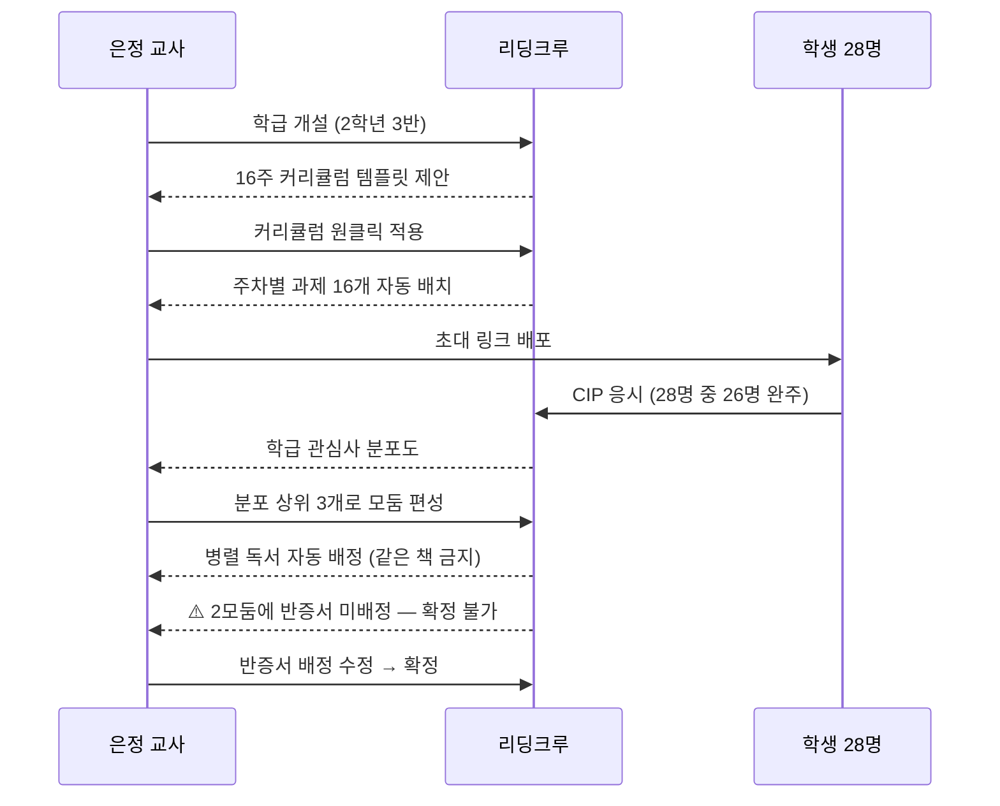

**학급 관심사 분포도 화면**

```
┌────────────────────────────────────────────────────┐
│ 📊 2학년 3반 관심사 분포 (26명 응답)                 │
│                                                      │
│ #33 교육과 학습    ████████ 8명                      │
│ #26 번아웃         ██████ 6명                        │
│ #41 정의와 공정    █████ 5명                         │
│ #21 불안           ███ 3명                           │
│ #13 우정           ██ 2명                            │
│ #43 기술과 인간    ██ 2명                            │
│                                                      │
│ 축 평균 : 시선 41(내면) 접근 58(구조)                │
│           온도 47(중간) 시간 39(지금)                │
│                                                      │
│ 💡 이 반은 '내면 + 구조'입니다.                       │
│    자기 문제를 구조로 설명하려는 경향이 있습니다.      │
│    → L7 분석수준 렌즈를 일찍 도입하면 잘 붙습니다.     │
│                                                      │
│ ⚠️ #43 기술과 인간이 2명뿐입니다.                     │
│    모둠 구성 시 다른 관심사와 합치거나,               │
│    교차 관심사(#43 × #33)로 묶는 것을 권합니다.       │
│                                     [모둠 편성 →]    │
└────────────────────────────────────────────────────┘
```

---

### S6. 교차 코멘트 세션 (5주차 수업 50분)

| 시간 | 활동 | 템플릿 | 산출 |
|:-:|---|---|---|
| 0~5분 | 모둠별 자기 책 1문장 요약 | — | — |
| 5~20분 | **타인 책 카드 읽고 🔍 작성** | R-03 기준 | 학생당 🔍 2건 |
| 20~35분 | ⚔️ 반대편 라운드 (디센터 지정) | T-06 | 학생당 ⚔️ 1건 |
| 35~45분 | 충돌 지점 3개 칠판에 정리 | — | 모둠 충돌 기록 |
| 45~50분 | 다음 주 확인할 것 1개 정하기 | T-19 | — |

**충돌 기록 예시 (2학년 3반 2모둠)**

```
같은 관심사 #26 번아웃, 다른 책 4권

민준 《번아웃 사회》 → "자기착취가 원인이다"
서연 《일의 기쁨과 슬픔》 → "일 자체가 아니라 관계가 원인이다"
하은 《게으름에 대한 찬양》 → "쉬는 게 나쁜 것이라는 전제부터 틀렸다"
지호 《아무튼, 잠》 → "수면 부족이라는 신체 조건이 먼저다"

⚡ 충돌 3개
 1) '자기착취'는 개인 책임론인가? (민준 vs 하은)
 2) 관계 때문이라면 혼자 일하는 사람은 왜 번아웃되나? (서연 vs 지호)
 3) 잠을 자면 해결되나? 방학에 푹 자도 안 나아지는데 (지호 vs 서연)

→ 이 충돌 3개가 다음 주 정의서의 재료가 됨
```

> **같은 책을 읽었으면 이 충돌이 안 생긴다.** 병렬 독서의 산출물이 바로 이 3줄이다.

---

### S7. 혼자 하는 사람 — 반박 요청 큐

지호는 그룹이 없다. 정의서 승급에는 ⚔️ 반박 1건이 필요하다.

```
┌────────────────────────────────────────────────┐
│ ⚠️ 반대편 반박이 없습니다                        │
│                                                  │
│ 정의서 ⑦칸을 채우려면 반대 의견이 필요합니다.    │
│                                                  │
│ 선택하세요:                                      │
│  ① 직접 반대편을 인터뷰한다 (T-13 대본 열기)     │
│  ② 반박 요청 큐에 올린다 (평균 대기 18시간)      │
│                                                  │
│ 💡 ②를 고르면, 당신도 남의 문제에 반박을 하나    │
│    써야 큐에 올라갑니다. (반박이 이곳의 화폐입니다)│
└────────────────────────────────────────────────┘
```

지호는 ②를 고르고, 다른 사람의 `#26 번아웃` 정의서에 반박을 쓴다.
→ 14시간 뒤 자기 정의서에 반박 2건 도착 → 승급.

**반박 경제 규칙**

| 행동 | XP | 조건 |
|---|:-:|---|
| ⚔️ 반박 작성 | +40 | R-03 2점 이상 |
| 반박 받음 | +20 | — |
| 반박 수용해 수정 | +60 | 수정 이력 기록 시 |
| 🔍 증상 지적 | +25 | 칸 지목 필수 |
| 🤝 공감 | +5 | 문장 필수 |
| 큐에 올리기 | −40 | **반박 1건 작성이 선행 조건** |

---

### S8. 학교 간 이어달리기

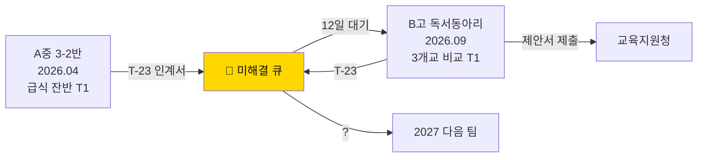

**B고가 이어받는 화면**

```
┌────────────────────────────────────────────────────┐
│ 🎯 이어받기 — "다른 학교도 배식 순번이 1년 고정인가"  │
│    A중 3-2반 남김 · 12일 대기 · 이어받기 조건: 누구나 │
│                                                      │
│ 넘겨받는 것                                          │
│  📊 반별 10일 계량 데이터 (csv, 180명)               │
│  🎙️ 인터뷰 기록 3건                                  │
│  ⚰️ 실패 기록 2건  ← 먼저 읽으세요                   │
│  📏 측정 정의서 (고형물 기준·국물 제외)              │
│  📞 A중 급식 부장 (인계 동의 완료)                   │
│                                                      │
│ 처음 3일에 할 일 (A중이 정해줌)                      │
│  D1 측정 정의서를 그대로 쓸지 결정하라               │
│  D2 자기 학교 배식 순번표를 확인하라                 │
│  D3 고정인지 교대인지부터 확인하라                   │
│                                                      │
│ ⚠️ A중이 밟은 지뢰                                   │
│  · 눈에 띄는 변수를 원인으로 착각해 3주 소모          │
│  · 측정 정의를 안 정하고 시작해 3일치 데이터 폐기     │
│  · 협조 요청을 구두로 해서 이틀 지연                  │
│                                                      │
│                        [이어받기]  [비슷한 질문 보기] │
└────────────────────────────────────────────────────┘
```

---

### S9. 초등 5학년 — 초등 모드 (주 1회 · 8주)

| 주차 | 활동 | 템플릿 | 산출 |
|:-:|---|---|---|
| 1 | 관심사 20(초등 축약판)에서 1개 고르기 | — | 관심사 1개 |
| 2 | 그림책/청소년판 읽기 | — | — |
| 3 | 문제 카드 1장 (초등 양식) | T-01 | 카드 1장 |
| 4 | 7일 로그 시작 | T-03 | 로그표 |
| 5 | "원래 그런 거야" 찾기 놀이 | T-01 봉인칸 | 뻔한 답 목록 |
| 6 | 반대편 찾기 (누가 싫어할까?) | T-06 | 후보 3명 |
| 7 | 증상/문제 카드 분류 놀이 | T-09 축약 | 분류표 |
| 8 | 질문 카드 20장 전시 | — | **학기 산출물** |

**초등 T-01 양식 (축약)**

```
┌────────────────────────────────────────┐
│ 📗 책 :                                  │
│ ✂️ 이상했던 문장 :                        │
│ 😖 나는 이런 걸 봤어요 :                  │
│ ❓ 그래서 궁금해요 :                      │
│ 🚫 뻔한 대답 (2개만) :                   │
│    1.                                    │
│    2.                                    │
└────────────────────────────────────────┘
```

> **초등은 5칸 → 4칸, 금지된 답 3개 → 2개.** 정의서·프로젝트는 없다.
> 초등의 산출물은 **질문 카드 20장**이다.

---

### S10. 직장인 독서모임 — 병렬 독서로 되살리기

준형의 모임은 3개월째 시들하다. 매번 같은 사람이 말한다.

**바꾼 것 3가지**

| 전 | 후 |
|---|---|
| 같은 책 1권 | 같은 관심사, 다른 책 4권 (반증서 필수) |
| 자유 토론 | ⚔️ 디센터 지정 (2주 순환) |
| 감상 공유 | T-09 증상/문제 분리를 함께 채움 |

**8주 뒤**
- 참석률 45% → 78%
- "말 안 하던 사람"이 반증서 담당이 되면서 발언량 최다
- 정의서 2건 (서로 결론이 갈림 — **수렴하지 않은 것이 성과**)

---

### S11. 학부모 — 아이의 질문 카드를 보는 날

```
┌────────────────────────────────────────────────┐
│ 🎒 하늘(초5)의 질문 카드 14장                    │
│    2026.09 ~ 2026.11                            │
│                                                  │
│ 가장 많이 나온 관심사 : #26 번아웃 (5장)         │
│                                                  │
│ 최근 질문                                        │
│  · "왜 일찍 자는 게 부끄러운 일이 됐지?"         │
│  · "쉬는 시간에 왜 다들 뛰어다니지? 안 피곤한가?" │
│  · "숙제를 다 하면 왜 더 주지?"                  │
│                                                  │
│ 🚫 하늘이가 봉인한 뻔한 답 28개                  │
│    (게임 때문 / 의지 부족 / 부모님 탓 ...)       │
│                                                  │
│ 💡 이 카드들은 점수가 아닙니다.                   │
│    아이가 "원래 그런 거야"를 몇 번 의심했는지의   │
│    기록입니다.                                   │
└────────────────────────────────────────────────┘
```

---

### S12. 학기 마감 — 은정 교사의 리포트 출력일

```
┌────────────────────────────────────────────────────┐
│ 📑 2학년 3반 · 2026-2학기 리포트                     │
│                                                      │
│ ── 요약 ────────────────────────────────────────   │
│  학생 28명 · 문제 카드 214장 · 정의서 19건           │
│  프로젝트 5건 · 실패 기록 14건 · 반박 87건           │
│                                                      │
│ ── 반증서 포함률 ───────────────────────────────   │
│  19/19 (100%) — 강제 조건 충족                       │
│                                                      │
│ ── 결론 수렴도 (낮을수록 좋음) ──────────────────  │
│  #33 교육 : 정의서 8건 중 서로 다른 결론 6개 ✅      │
│  #26 번아웃 : 6건 중 다른 결론 5개 ✅                │
│  #41 정의 : 5건 중 다른 결론 2개 ⚠️                  │
│    → 이 모둠은 같은 책 비중이 높았습니다 (병렬 실패) │
│                                                      │
│ ── 개인별 1p 요약 28장 ────────────────────────    │
│  [전체 PDF 출력]  [학생별 개별 전달]                 │
│                                                      │
│ ── 다음 학기 ──────────────────────────────────   │
│  [이 커리큘럼 복제]  [모둠 편성 규칙 유지]           │
└────────────────────────────────────────────────────┘
```

> **"결론 수렴도"가 이 리포트의 핵심 지표다.** 학생들의 결론이 비슷하면 수업이 실패한 것이다.

---

## 17. 교사 운영 시나리오 — 16주 커리큘럼

> **원클릭 적용 가능한 완성 커리큘럼.** 학급 개설 시 이 16주가 자동 배치된다.

### 17.1 전체 흐름

```mermaid
gantt
    dateFormat  X
    axisFormat %s
    title 16주 커리큘럼
    section 진단
    CIP · 모둠 편성        :0, 2
    section 발견
    병렬 독서 · 문제 카드   :2, 4
    교차 코멘트            :4, 5
    section 정의
    증상분리 · 분해 · 수준   :5, 8
    데이터 · 반대편          :8, 10
    정의서 완성             :10, 11
    section 실행
    트랙 선택 · 프로젝트     :11, 15
    발표 · 인계             :15, 16
```

### 17.2 주차별 수업안

| 주 | 주제 | 교사 활동 | 학생 활동 | 템플릿 | 산출물 | 평가 |
|:-:|---|---|---|---|---|---|
| 1 | 시작 | 학급 개설·CIP 배포 | CIP 응시 | — | 개인 프로필 | — |
| 2 | 관심사 | 분포 공유·모둠 편성 | 관심사 상세 읽기 | — | 모둠 3~5개 | — |
| 3 | 병렬 배정 | 배정 확정(반증서 필수) | 책 수령 | — | 배정표 | R-05 |
| 4 | 독서 1 | 순회·질문 유도 | 읽기 + T-01 1장 | T-01 | 카드 1장 | R-01 |
| 5 | 독서 2 | 카드 피드백 | T-01 2장 추가 | T-01 | 카드 3장 | R-01 |
| 6 | **교차 코멘트** | 세션 진행(§S6) | 🔍 2건 ⚔️ 1건 | R-03 | 충돌 기록 | R-03 |
| 7 | 증상/문제 | 사례 시연 | T-09 작성 | T-09 | 분리표 | — |
| 8 | 분해·수준 | 3층 판서 | T-10, T-11 | T-10 T-11 | 조각·3층표 | — |
| 9 | 반증 조건 | "안 죽는 주장" 예시 | T-12 | T-12 | 반증 조건 3개 | — |
| 10 | 데이터 설계 | 유도 질문 점검 지도 | T-14 | T-14 | 데이터 설계서 | — |
| 11 | **반대편 인터뷰** | 대상 섭외 지원 | T-13 실행 | T-13 | 인터뷰 기록 | — |
| 12 | 정의서 | 9칸 검수 | T-16 완성 | T-16 | **문제 정의서** | **R-02** |
| 13 | 트랙 선택 | 트랙 가이드 | T-17 T-18 T-21 | T-17 T-18 T-21 | 협약서·선언문 | — |
| 14 | 프로젝트 1 | 주간 체크인 확인 | 실행 + T-19 | T-19 | 체크인 | — |
| 15 | 프로젝트 2 | 실패 기록 독려 | 실행 + T-20 | T-20 | **실패 기록** | R-04 |
| 16 | 발표·인계 | 리포트 출력 | T-22 T-23 T-24 | T-22~24 | 최종 1장·인계서 | R-04 |

### 17.3 주차별 교사 대사 (그대로 읽어도 되는 스크립트)

**1주차 — CIP 배포 전**
```
"오늘 하는 건 시험이 아닙니다. 맞는 답이 없어요.
 이 검사는 여러분을 무슨 유형이라고 정해주지 않습니다.
 '너 요즘 뭐에 자꾸 걸리니?'를 정리해주는 것뿐이에요.
 그리고 결과가 마음에 안 들면, 언제든 바꿀 수 있습니다."
```

**4주차 — 첫 문제 카드 전**
```
"오늘은 감상을 쓰지 않습니다.
 여러분이 쓸 건 딱 하나, 질문입니다.
 그런데 조건이 하나 있어요.
 질문을 쓰기 전에, 이미 머릿속에 떠오른 뻔한 답 3개를 먼저 적고
 그걸 지웁니다. 그 3개는 다들 아는 답이에요.
 그걸 지워야 네 번째 생각이 나옵니다."
```

**6주차 — 교차 코멘트 세션 전**
```
"오늘은 친구 카드를 읽고 두 가지만 씁니다.
 하나는 '이건 증상 같은데?' 하고 짚어주는 것.
 또 하나는 '반대편 사람이라면 뭐라고 할까'를 대신 말해주는 것.
 칭찬은 안 씁니다. 칭찬은 도움이 안 돼요.
 대신, 반대 의견을 쓸 때는 반드시 '누가' 반대하는지를 적으세요."
```

**11주차 — 인터뷰 나가기 전**
```
"인터뷰는 설득하러 가는 게 아닙니다.
 반박을 받아오는 게 목적이에요.
 상대가 여러분 말을 꺾으면, 그게 성공입니다.
 그리고 하나만 기억하세요. 질문하고 나서 5초를 기다리세요.
 그 5초에 진짜 이야기가 나옵니다."
```

**15주차 — 실패 기록 독려**
```
"이번 주에 실패 기록이 0건인 팀은,
 아무것도 시험해보지 않았다는 뜻입니다.
 여러분 프로젝트에서 제일 점수가 높은 게 실패 기록이에요.
 잘한 걸 쓰는 건 쉬워요. 틀린 걸 쓰는 게 어렵습니다.
 어려운 걸 한 사람이 점수를 받습니다."
```

### 17.4 8주 압축 버전 (동아리·방과후용)

| 주 | 내용 | 템플릿 |
|:-:|---|---|
| 1 | CIP + 모둠 + 병렬 배정 | — |
| 2 | 독서 + T-01 카드 2장 | T-01 |
| 3 | 교차 코멘트 | R-03 |
| 4 | T-09 + T-10 | T-09 T-10 |
| 5 | T-12 + T-13 | T-12 T-13 |
| 6 | T-16 정의서 | T-16 |
| 7 | 트랙 선택 + 실행 | T-18 T-21 |
| 8 | T-22 + T-23 발표 | T-22 T-23 |

> 8주 버전은 **1차 데이터 요건을 완화**한다 (관찰 1회 이상). 나머지 필수 조건은 유지.

### 17.5 교사가 자주 겪는 문제 8가지와 처방

| 문제 | 증상 | 처방 |
|---|---|---|
| 카드가 다 비슷하다 | 같은 책을 읽었다 | 병렬 배정 재확인, 반증서 필수화 |
| 질문이 주장문이다 | "~해야 한다"로 끝남 | T-18 점검 5문항을 카드 단계로 앞당김 |
| 금지된 답을 못 쓴다 | 3칸 공백 | 학급 공용 "뻔한 답 사전" 게시 |
| 반응이 칭찬뿐이다 | 🤝만 달림 | 🔍⚔️ 각 1건을 과제로 지정 |
| 인터뷰를 못 나간다 | 섭외 실패 | 교사가 교내 3명 사전 섭외 목록 제공 |
| 데이터를 못 만든다 | 설문만 함 | T-14 4번(측정 정의) 개별 지도 |
| 실패 기록이 0건 | 다 성공했다고 함 | "안 죽은 가설은 시험 안 한 것" 규칙 공지 |
| 정의서가 안 끝난다 | 12주에 미완 | 9칸을 4주에 나눠 배포 (2칸/주) |

---

# PART VI — 구축

## 18. 크루패스 · 클루랩 상세 기능 명세

---

### 18.1 크루패스 — 문제만 찾는 공간

> **정의**: 해결하지 않는다. **책을 근거로 문제를 정의하고, 공유하고, 서로 반증한다.**
> aicareerpath의 "커리어 패스 탐색"에 대응한다.

| 기존 독서·탐구 서비스 | 크루패스 |
|---|---|
| 감상·리뷰가 최종 산출 | **문제 정의서**가 최종 산출 |
| "좋은 책이었다"로 종료 | "이 책이 나에게 만든 질문"으로 종료 |
| 해결까지 요구 → 부담에 이탈 | **문제만 찾아도 완주 인정** |
| 개인 기록 | 개인/그룹/학급/학교/공개 5단위 |

#### 카드 → 정의서 승급 흐름

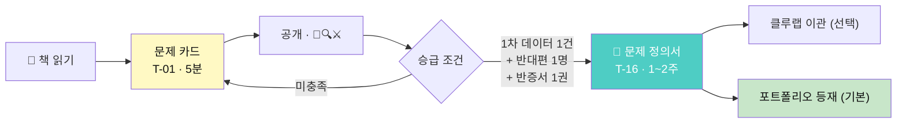

#### 공개 5단위

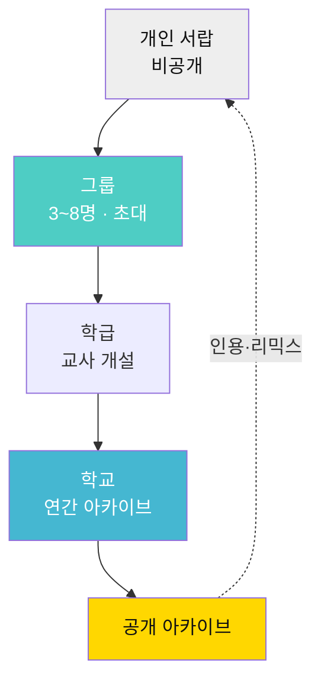

| 단위 | 개설자 | 핵심 기능 | 승급 규칙 |
|---|---|---|---|
| 개인 서랍 | 자동 | 초안·읽은 책·미완성 보관 | — |
| 그룹 | 누구나 | 병렬 배정·교차 코멘트·주간 세션 | 본인이 공개 |
| 학급 | 교사 | 과제 배포·진도판·루브릭·리포트 | 교사 승인 |
| 학교 | 관리자 | 연간 아카이브·학년 통계 | 교사 추천 |
| 공개 | 자동 | 인용·리믹스·이어달리기 | 정의서 승급 시 선택 |

#### 책 중심 탐색 3진입로

| 진입로 | 화면 | 상황 |
|---|---|---|
| 책 → 문제 | 책 상세 하단 "이 책에서 나온 문제 N건" | 읽던 책이 있다 |
| 관심사 → 책 | 관심사 서가 (정의/도구/반증) | 관심사부터 정했다 |
| 문제 → 책 | 정의서 ⑥칸 근거 3권 역추적 | 남의 문제가 눈에 띄었다 |

> 세 진입로가 **서로를 가리켜야** 한다. 어느 페이지에 떨어져도 나머지 둘로 갈 수 있어야 한다.

#### 반응 3종 상세 규격

| 버튼 | 뜻 | 필수 입력 | XP | 루브릭 |
|---|---|---|:-:|---|
| 🤝 나도 이 문제 | 공감 | 내 경우엔 어떻게 보이는지 1문장(20자+) | +5 | — |
| 🔍 여기가 증상 같다 | L1 지적 | **어느 칸**인지 지목 + 이유 | +25 | R-03 |
| ⚔️ 반대편에서 보면 | L12 반박 | **누가 손해 보는지** + 그 사람의 논리 | +40 | R-03 |

**좋아요가 없다.** 좋아요는 문제를 인기투표로 만든다. 세 반응은 전부 문장을 요구한다.

---

### 18.2 클루랩 — 함께 만드는 프로젝트 공간

#### 이관 조건

| 조건 | 기준 | 시스템 검사 |
|---|---|:-:|
| 정의서 9칸 완성 | 필수 | 자동 |
| 🤝 반응 5건 이상 | "나만의 문제"가 아님을 확인 | 자동 |
| ⚔️ 반박 1건 이상 **수용 기록** | 반박을 읽고 수정한 흔적 | 자동 |
| 팀원 2명 이상 | 혼자면 대기열(모집 게시) | 자동 |

#### 4트랙

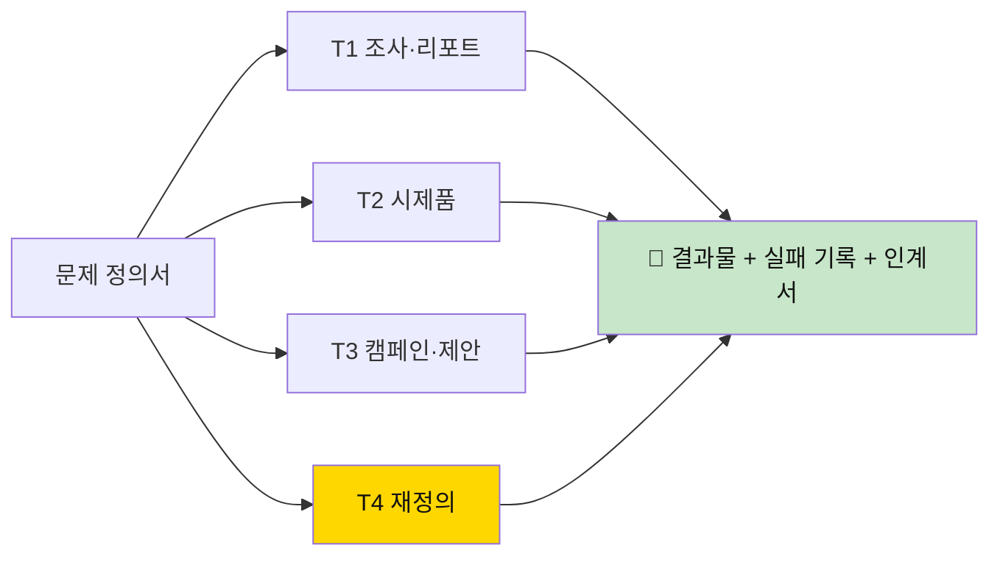

| 트랙 | 산출물 | 기간 | 필요한 이유 |
|---|---|---|---|
| T1 조사·리포트 | 데이터 리포트 | 3~4주 | 대부분의 문제는 아직 안 밝혀졌다 |
| T2 시제품 | 프로토타입 + 테스트 로그 | 4~6주 | 만들어봐야 아는 것이 있다 |
| T3 캠페인·제안 | 제안서 + 제출 기록 | 3~5주 | 개인이 못 바꾸는 것은 제도에 낸다 |
| **T4 재정의** | 수정된 질문 선언문 | 2~3주 | **"문제가 틀렸다"도 정식 결승선** |

> **T4가 정식 트랙인 이유**: 대부분의 학생 프로젝트는 "잘못 잡은 문제를 끝까지 미는" 방식으로 끝난다.
> 문제를 다시 쓰는 것을 **실패가 아니라 트랙**으로 만들면, 도중에 방향을 바꾸는 것이 정상 행동이 된다.

#### 역할 4개 고정

| 역할 | 하는 일 | 왜 필요한가 | 교대 |
|---|---|---|---|
| 🧭 키퍼 | 선언문을 지킨다. 회의마다 낭독 | 프로젝트는 실행에 취해 질문을 잊는다 | 고정 |
| 📊 레코더 | 데이터·일지·**실패 기록** | 기록 없으면 포트폴리오도 없다 | 고정 |
| ⚔️ 디센터 | **반대만 한다** (매 회의 1회 의무) | 팀은 자동으로 합의로 기운다 | **2주 순환** |
| 🔨 메이커 | 산출물 제작 | — | 고정 |

> 디센터를 고정하면 그 사람이 미움받는다. **순환하면 반대가 직책이 된다.**

#### 프로젝트 보드 화면

```
┌──────────────────────────────────────────────────────┐
│ 🚀 「급식 잔반은 왜 특정 반에만 몰리는가」  T1 조사    │
│    #34 건강과 몸 · 4주차/4주 · 학급 공개              │
├──────────────────────────────────────────────────────┤
│ 🧭 질문 선언문                            (sticky)    │
│ "급식 잔반은 학생의 식습관 문제인가,                  │
│  1년간 고정된 배식 순번이 만든 구조적 결과인가?"      │
├──────────────────────────────────────────────────────┤
│ ┌─ 할 일 ─────┬─ 진행 ────┬─ 검증 ────┬─ 완료 ──┐ │
│ │ 순번교대 2주 │ 조리실무사 │ 급식일지   │ 계량10일 │ │
│ │ 결과 정리    │ 인터뷰     │ 3년치 대조 │ 완료    │ │
│ └──────────────┴────────────┴────────────┴─────────┘ │
├──────────────────────────────────────────────────────┤
│ ⚰️ 실패 기록 (2건)  ← 가장 높은 배점 (R-04 8점)       │
│  · 4/02 "학생 편식이 원인" 폐기 — 3년 캠페인 무효과    │
│  · 4/25 "4교시 체육이 원인" 폐기 — 체육 반=원래 뒷번호 │
│                                    [실패 기록 추가]   │
├──────────────────────────────────────────────────────┤
│ 👥 하은(🧭키퍼) 서준(📊레코더)                        │
│    민지(⚔️디센터·~4/25) 태윤(🔨메이커)                 │
│    ⏰ 디센터 교대 D-2                                 │
├──────────────────────────────────────────────────────┤
│ 📋 3주차 체크인 : 선언문 지켰나 ✕ (메뉴 분석으로 샘)   │
│ [주간 체크인 작성]  [학급에 공유]  [마감하기]         │
│  ⚠️ 마감하려면 T-23 인계서가 필요합니다               │
└──────────────────────────────────────────────────────┘
```

#### 이어달리기 규칙

| 규칙 | 내용 |
|---|---|
| 마감 조건 | T-23 인계서 없이는 **마감 버튼 비활성** |
| 자동 발행 | 인계서 작성 즉시 미해결 큐에 등재 |
| 넘기는 것 | 원자료·인터뷰 기록·실패 기록·측정 정의서·연락처(동의 시) |
| 출처 표기 | 이어받은 프로젝트에 체인 리본 자동 부착 |
| 대기 표시 | 큐에서 대기 일수 노출 (오래된 것이 위로) |

---

## 19. 데이터 모델과 API

### 19.1 ERD

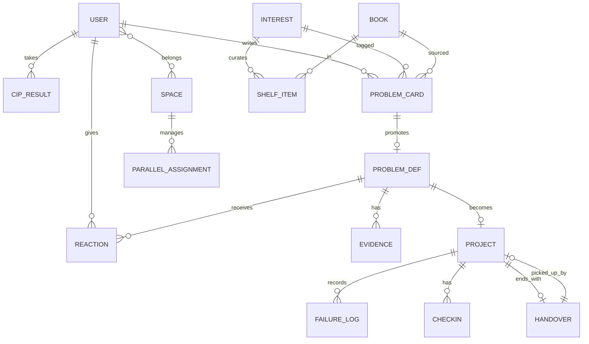

### 19.2 핵심 테이블 명세

**`user`**

| 필드 | 타입 | 비고 |
|---|---|---|
| id | uuid | PK |
| handle | varchar(20) | 공개 프로필 |
| role | enum | student / teacher / librarian / admin |
| grade_band | enum | elem / mid / high / univ / adult |
| level | int | LV.1~5 |
| xp | int | — |

**`interest`** — 50행 고정

| 필드 | 타입 | 비고 |
|---|---|---|
| no | int | 1~50, PK |
| area | enum | A~E |
| name | varchar | 관심사명 |
| tension | text | 핵심 긴장 |
| ladder | json | `{elem, mid, high, univ}` 질문 사다리 |
| lenses | int[] | 주력 렌즈 3개 (1~12) |
| forbidden_answers | jsonb[] | `{answer, why_forbidden}` 3개 이상 |
| first7_actions | jsonb[] | `{day, template_code, desc}` |

**`book`**

| 필드 | 타입 | 비고 |
|---|---|---|
| isbn | varchar(13) | PK |
| title, author, publisher | varchar | — |
| grade_band | enum[] | 권장 학년 |

**`shelf_item`** — 관심사 × 책 × 슬롯

| 필드 | 타입 | 비고 |
|---|---|---|
| interest_no | int | FK |
| isbn | varchar | FK |
| slot | enum | **define / tool / refute** |
| pair_isbn | varchar | 짝 반증서 (define/tool에만) |
| curated_by | uuid | 운영진 |

**`problem_card`** — T-01

| 필드 | 타입 | 비고 |
|---|---|---|
| id | uuid | PK |
| user_id, isbn, interest_no | FK | — |
| page | int | — |
| quote | text | 걸린 문장 |
| reality | text | 내가 본 현실 |
| question | text | 질문 |
| forbidden | text[] | **3개 미만이면 저장 불가** |
| lens | int | L1~L12 |
| visibility | enum | private/group/class/school/public |
| status | enum | draft / shared / promoted |

**`problem_def`** — T-16 (9칸)

| 필드 | 타입 | 검증 |
|---|---|---|
| id | uuid | — |
| card_id | uuid | 승급 원본 |
| c1_symptom_problem | jsonb | 증상 3 + 문제 1 |
| c2_split | jsonb | A/B/C + 선택 + 이유 |
| c3_causes | text[] | **4개 미만 제출 불가** |
| c4_levels | jsonb | 개인/규칙/문화 + 선택 층 |
| c5_data_id | uuid | **null이면 제출 불가** |
| c6_books | jsonb | define/tool/**refute** — refute null이면 불가 |
| c7_counterpart | jsonb | 대상/반박/수정한 것/안 한 것 |
| c8_falsify | jsonb | 조건/방법/기한 |
| c9_declaration | text | — |
| status | enum | draft / submitted / promoted / archived |

**`evidence`** — 1차 데이터 (T-14)

| 필드 | 타입 |
|---|---|
| id, def_id | uuid |
| method | enum (observe/survey/interview/archive/experiment) |
| measure_def | text — **측정 정의 필수** |
| sample, period, result, limitation | text |
| raw_file | s3 key |

**`reaction`**

| 필드 | 타입 | 비고 |
|---|---|---|
| target_type | enum | card / def |
| target_id, user_id | uuid | — |
| type | enum | agree / symptom / counter |
| body | text | **필수** |
| pointed_cell | int | symptom일 때 필수 (1~9) |
| loser | text | **counter일 때 필수** — 손해 보는 사람 |
| accepted | bool | 작성자가 수용했는지 |

**`project`**

| 필드 | 타입 |
|---|---|
| id, def_id | uuid |
| track | enum (T1/T2/T3/T4) |
| declaration | text |
| roles | jsonb — keeper/recorder/dissenter/maker + 교대일 |
| agreement | jsonb — T-17 |
| status | enum (active/closed) |
| closed_at | timestamp — **handover 없이는 null 유지** |

**`failure_log`** — T-20

| 필드 | 타입 | 비고 |
|---|---|---|
| id, project_id | uuid | — |
| dead_hypothesis | text | — |
| believed_since | date | — |
| killed_by | text | 증거 |
| bias_check | enum[] | 왜 믿었나 (체크박스) |
| lesson | text | 다음 사람에게 |
| revised | text | 수정된 가설 |
| **삭제** | — | **DELETE 미구현. UPDATE만, 이력 보존** |

**`handover`** — T-23

| 필드 | 타입 |
|---|---|
| id, project_id | uuid |
| open_question | text |
| why_not_done | enum[] + text |
| assets | jsonb (원자료/인터뷰/실패/연락처) |
| first3days | jsonb[3] |
| landmines | text[] |
| eligibility | enum (anyone/same_school/same_interest) |
| picked_by_project_id | uuid nullable |

**`parallel_assignment`**

| 필드 | 타입 | 비고 |
|---|---|---|
| space_id, user_id, isbn, slot | — | — |
| — | — | **UNIQUE(space_id, isbn)** — 같은 책 금지 |
| — | — | **CHECK: 그룹당 slot='refute' 최소 1** |

### 19.3 주요 API

| Method | Endpoint | 설명 | 검증 |
|---|---|---|---|
| POST | `/api/cip/submit` | 검사 제출 | 38문항 완주 |
| GET | `/api/cip/result/:id` | 3층 결과 | — |
| GET | `/api/cip/result/:id/breakdown` | 계산 내역 | — |
| GET | `/api/interests` | 50개 목록 + 통계 | — |
| GET | `/api/interests/:no` | 8칸 카드 | — |
| GET | `/api/interests/cross/:a/:b` | 교차 질문 5개 | 사전 조합표 조회 |
| POST | `/api/cards` | 카드 생성 | `forbidden.length >= 3` |
| POST | `/api/defs` | 정의서 초안 | — |
| POST | `/api/defs/:id/submit` | 제출 | **9칸 검증 6종** |
| POST | `/api/reactions` | 반응 등록 | type별 필수 필드 |
| POST | `/api/defs/:id/promote` | 클루랩 이관 | 🤝5 + ⚔️1수용 + 팀2 |
| POST | `/api/projects/:id/failures` | 실패 기록 | — |
| DELETE | `/api/projects/:id/failures/:fid` | — | **405 Method Not Allowed** |
| POST | `/api/projects/:id/close` | 마감 | **handover 존재 필수** |
| GET | `/api/queue/rebuttal` | 반박 요청 큐 | 대기순 |
| GET | `/api/queue/open` | 미해결 큐 | 대기순 |
| POST | `/api/spaces/:id/parallel/confirm` | 배정 확정 | 중복 없음 + refute 1+ |
| GET | `/api/classes/:id/report` | 학기 리포트 | 교사 |

### 19.4 제출 검증 로직 (정의서)

```
POST /api/defs/:id/submit

errors = []
if len(c3_causes) < 4:            errors += "원인이 4개 미만입니다"
if c5_data_id is null:            errors += "1차 데이터가 없습니다"
if c6_books.refute is null:       errors += "반증서가 없습니다"
if c7_counterpart is null:        errors += "반대편 인터뷰가 없습니다"
if c8_falsify.observable != true: errors += "반증 조건이 관찰 불가합니다"
if isYesNoQuestion(c9):           errors += "선언문이 예/아니오형입니다"

if errors: return 422 with errors + 해결 링크(템플릿 코드)
```

**422 응답 예시**

```json
{
  "errors": [
    {
      "cell": 6,
      "message": "반증서가 없습니다",
      "why": "지금 읽은 2권은 모두 같은 방향입니다. 이대로면 확신을 강화한 것입니다.",
      "suggestions": [
        {"isbn": "9788954...", "title": "식탁의 정치", "reason": "구조 원인론에 반대"}
      ],
      "template": "T-15"
    }
  ]
}
```

---

## 20. 개발 단계론 — Phase 1~4

### 20.1 로드맵

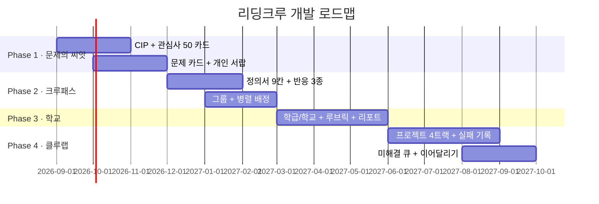

### 20.2 단계별 명세

| Phase | 이름 | 반드시 되는 것 | 절대 안 넣는 것 | 다음 조건 |
|:-:|---|---|---|---|
| **1** | 문제의 씨앗 | CIP 38문항 · 관심사 50 카드 · T-01 · 개인 서랍 | 팀·프로젝트·추천 알고리즘 | **카드 500장** |
| **2** | 크루패스 | T-16 9칸 · 반응 3종 · 반박 큐 · 그룹 · 병렬 배정 | 좋아요·랭킹·프로젝트 | **정의서 100건**, 반증서 100% |
| **3** | 학교 진입 | 학급 · 루브릭 자동 체크 · 학기 리포트 · 학교 아카이브 | 결제 고도화 | **학급 20개**, 교사 재사용 60% |
| **4** | 클루랩 | 4트랙 · 역할 4 · 실패 기록 · 체크인 · 이어달리기 | 외부 연동 | **프로젝트 50건**, 이어달리기 10건 |

> **Phase 1에서 팀·프로젝트를 안 만드는 것이 핵심 판단이다.**
> 문제 카드가 안 쌓인 상태에서 프로젝트 공간을 열면 **빈 방**이 된다.
> 클루랩은 크루패스의 재고가 있어야 열린다.

### 20.3 Phase 1 MVP 상세

**만드는 화면 9개**
1. 가입/로그인 2. CIP 소개 3. CIP 검사 4. 결과 3층 5. 계산 내역
6. 관심사 50 격자 7. 관심사 상세 8. 책 상세 9. T-01 카드 작성 + 내 서랍

**시드 데이터 (개발 전 준비)**

| 항목 | 수량 | 담당 |
|---|:-:|---|
| 관심사 8칸 카드 | 50개 | 운영진 |
| 서가 (관심사당 8권) | 400권 | 사서 자문 |
| 금지된 답 | 150개+ | 운영진 |
| **시드 문제 카드** | **100장** | 운영진 직접 작성 |
| **시드 실패 사례** | **20건** | 운영진 (관심사당 최소 1개 영역) |

> **시드 실패 사례 20건이 가장 중요하다.** 첫 사용자가 "실패를 써도 되는구나"를 보고 배운다.

**Phase 1 성공 판정**

| 지표 | 목표 |
|---|:-:|
| CIP 완주율 | ≥ 85% |
| 검사 후 7일 내 카드 1장+ | 40% |
| **카드 금지된 답 3개 채움률** | **≥ 70%** |
| 관심사 상세 2개+ 진입 | 70% |

> 3번째 지표가 핵심이다. 금지된 답을 채운다는 것은 **첫 생각을 의심했다**는 뜻이다.

### 20.4 기술 스택

| 레이어 | 선택 | 이유 |
|---|---|---|
| 프론트 | Next.js + TypeScript | 학교 공유 링크의 SEO/OG 미리보기 |
| 스타일 | Tailwind + 토큰(§9.2) | 컴포넌트 10종 통일 |
| 백엔드 | Django REST | 학급·권한·리포트 등 관리형 기능에 강함 |
| DB | PostgreSQL | 관심사×문제×책 다대다 + 통계 쿼리 |
| 검색 | PG full-text → Meilisearch(P3) | P2까지 PG로 충분 |
| 파일 | S3 호환 | 원자료·산출물 |
| 리포트 | WeasyPrint (HTML→PDF) | 학기 리포트 |
| 배포 | Vercel(FE) + 컨테이너(BE) | — |
| **AI** | **없음** | 설계 원칙 |

### 20.5 안 만드는 기능 목록 (백로그에서 영구 제외)

| 기능 | 이유 |
|---|---|
| AI 요약·초안·추천 | 정의서가 수렴한다 |
| 좋아요·별점 | 인기투표화 |
| 랭킹·리더보드 | 상위 고정 |
| 팔로우 | 사람이 아니라 관심사를 구독한다 |
| 실패 기록 삭제 | 숨기게 된다 |
| 알림 배지 남발 | 문제를 급하게 만든다 |
| 무한 스크롤 피드 | 소비 모드 유발 |
| 자동 번역 | 원문 인용의 정확성 |

---

## 21. 설계 근거 20조

| # | 결정 | 근거 |
|:-:|---|---|
| 1 | 직업이 아니라 **관심사 50** | 직업은 10년 안에 이름이 바뀐다. 관심사는 안 바뀐다. 직업 선택도 "무엇을 견딜 수 있는가"의 함수이므로 관심사가 상위 개념 |
| 2 | 50개로 **제한** | 무한 태그는 탐색을 죽인다. 유한 격자여야 비교·통계·큐레이션·학급 편성이 가능 |
| 3 | 관심사 카드 **8칸 고정 규격** | 규격이 같아야 비교가 된다. 직업 카드와 1:1 대응시켜 인지 전이를 만든다 |
| 4 | 검사 결과를 **가설로 표기** | 진단 결과를 정체성으로 받으면 탐색이 멈춘다 |
| 5 | 유형 이름을 **부여하지 않음** | "○○형"이 붙는 순간 사람은 그 이름에 맞춰 행동한다 |
| 6 | **자기 태깅에 최대 가중치(35%)** | 알고리즘이 사람을 이기면 안 된다. 검사는 본인 선언을 정리해주는 도구 |
| 7 | **계산 내역 공개** | 블랙박스면 반박할 수 없다. 반박 가능해야 자기 결과의 주인이 된다 |
| 8 | 결과에 **'의외의 후보' 3층** | 상위만 보여주면 자기 확신만 강화된다. 낮은 점수의 반례를 의도적으로 노출 |
| 9 | 추천 도서에 **반증서 강제** | 같은 방향 3권은 독서를 확신 강화 장치로 만든다 |
| 10 | 관심사 상세에 **금지된 답을 최상단** | 첫 생각을 봉인해야 두 번째 생각이 나온다 |
| 11 | 관심사 상세에 **실패 사례 접기 불가** | 성공 사례만 보이면 "나도 저렇게 되겠지"로 시작한다 |
| 12 | **문제만 찾아도 완주** | 해결까지 요구하면 90%가 이탈하고, 남은 10%는 "쉬운 문제"만 고른다 |
| 13 | **좋아요 삭제, 3종 반응** | 좋아요는 문제를 인기투표로 바꾼다. 참여 수가 줄어도 질을 택한다 |
| 14 | 반응에 **문장 강제** | 문장을 못 쓰면 반응할 수 없다. 반응 수 대신 반응 질을 지표로 삼는다 |
| 15 | **병렬 독서 (같은 책 금지)** | 같은 책 독서모임은 관점이 수렴한다. 다른 책이어야 충돌이 생긴다 |
| 16 | **디센터 2주 순환** | 반대를 개인 성격이 아니라 직책으로 만들면 반대가 안전해진다 |
| 17 | **실패 기록 최고 배점 + 삭제 불가** | 배움은 가설이 죽는 순간에 일어난다. 배점이 없으면 아무도 안 쓴다 |
| 18 | **T4 재정의를 정식 트랙** | 방향을 바꾸는 것을 실패가 아니라 트랙으로 만들면 정상 행동이 된다 |
| 19 | **인계서 없이 마감 불가** | 학교 간 공유는 우수작 전시로는 안 일어난다. **재료**를 줘야 쓰인다 |
| 20 | **AI 미제공** | AI가 초안을 주면 정의서가 수렴하고, 병렬 독서·교차 관점이라는 핵심 자산이 무너진다 |

### 21.1 "왜 AI 대신 템플릿인가"

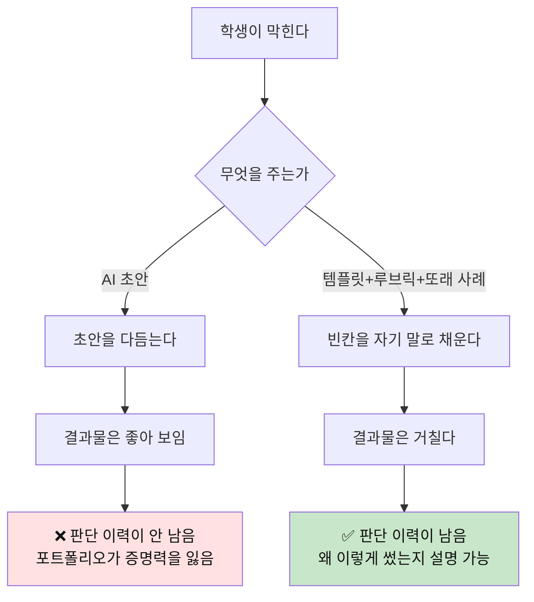

**템플릿이 AI를 대체하는 4가지 장치**

| 장치 | 해결하는 것 | 구현 |
|---|---|---|
| **빈칸 구조** | "무엇을 써야 할지 모름" | T-01 5칸, T-16 9칸 |
| **루브릭** | "잘 썼는지 모름" | R-01~R-06 자가 점검 |
| **또래 사례** | "어떻게 생긴 건지 모름" | 각 템플릿에 작성 예시 2~3개 |
| **실패 사례** | "실수해도 되는지 모름" | 관심사마다 실패 1건 고정 노출 |

**AI로 채울 수 없는 칸 (의도적 설계)**

| 칸 | 왜 AI가 못 채우나 |
|---|---|
| T-16 ⑤ 1차 데이터 | 직접 재야 한다 |
| T-16 ⑦ 반대편 인터뷰 | 실제 사람을 만나야 한다 |
| T-20 실패 기록 | 자기가 믿었던 것을 기록하는 것 |
| T-13 인터뷰 후 메모 | 그 자리에 있어야 쓸 수 있다 |

---

## 22. 차별점과 방어 자산

### 22.1 인접 서비스 비교

| | 독서앱 | 독서모임 | 탐구/생기부 서비스 | AI 학습 도우미 | **리딩크루** |
|---|---|---|---|---|---|
| 산출물 | 읽은 기록 | 대화 | 보고서 | 답변 | **문제 정의서 + 실패 기록** |
| 독서 방식 | 개인 | 같은 책 | 자료 조사 | 요약 | **같은 주제 다른 책** |
| 반대 의견 | 없음 | 자연 발생 | 없음 | 없음 | **역할·버튼으로 강제** |
| 실패 처리 | — | — | 숨김 | — | **최고 배점·삭제 불가** |
| 조직 단위 | 개인 | 소모임 | 개인 | 개인 | **5단위** |
| 미완성 | 이탈 | 이탈 | 이탈 | — | **문제만 찾아도 완주** |
| AI | 추천 | — | 생성 | 전부 | **미제공** |
| 연속성 | 없음 | 시즌 종료 | 학기 종료 | 세션 종료 | **이어달리기** |
| 평가 근거 | 없음 | 없음 | 주관적 | 없음 | **루브릭 6종** |

### 22.2 aicareerpath와의 정확한 대응

| 항목 | AI CareerPath | ReadingCrew |
|---|---|---|
| 미션 | 진로 정보의 민주화 | **문제 발견·해결의 민주화** |
| 입력 | 적성 검사 | **적성 검사 + 책** |
| 단위 | 직업 | **관심사 50** |
| 탐색 공간 | 커리어 패스 | **크루패스** |
| 실행 공간 | 커리어 실행 | **클루랩** |
| 증거 | 포트폴리오 | **문제 포트폴리오 (폐기 이력 포함)** |
| 엔진 | AI | **템플릿 24 + 루브릭 6** |

### 22.3 방어 가능한 자산 5개

| 자산 | 왜 복제가 어려운가 | 축적 속도 |
|---|---|---|
| **문제 정의서 아카이브** | 시간이 쌓여야 생긴다. 1만 건이면 "이 관심사에서 이미 나온 문제" 지형도가 된다 | Phase 2~ |
| **금지된 답 사전** | 사용자 기여로 누적되는 뻔한 답 목록. 어디에도 없는 교육 자산 | Phase 1~ |
| **실패 기록 아카이브** | 다른 어떤 서비스도 실패를 수집하지 않는다 | Phase 4~ |
| **학교 운영 이력** | 루브릭·지도안·리포트가 학교 프로세스에 박히면 전환 비용이 커진다 | Phase 3~ |
| **이어달리기 체인** | 학교·학년을 넘는 질문의 계보. 시간이 곧 해자 | Phase 4~ |

### 22.4 한 문장

> **"AI가 답을 주는 시대에, 답이 아니라 질문의 이력을 남기는 유일한 곳."**

---

## 23. 지표 · 실패 조건 · 운영 리스크

### 23.1 북극성 지표

> **NSM = 분기당 "반증서를 포함하고 반대편 인터뷰가 붙은 문제 정의서" 건수**

가입자 수도, 독서량도, 프로젝트 수도 아니다. **질이 보장된 문제 정의서의 수**다.

### 23.2 보조 지표

| 층 | 지표 | 목표 | 측정 |
|---|---|:-:|---|
| 진입 | CIP 완주율 | 85% | 세션 |
| 진입 | 결과→관심사 상세 2개+ | 70% | 이벤트 |
| 활성 | 검사→카드 7일 전환 | 40% | 코호트 |
| **품질** | **금지된 답 3개 작성률** | **70%** | 폼 |
| **품질** | **정의서 반증서 포함률** | **100%** | 강제 |
| 품질 | 정의서 1차 데이터 포함률 | 100% | 강제 |
| 협력 | 정의서당 ⚔️ 반박 수 | 평균 1.5 | 집계 |
| 협력 | 24시간 내 첫 반박률 | 60% | 큐 |
| 협력 | 반박 수용해 수정한 비율 | 45% | 이력 |
| 실행 | 프로젝트당 실패 기록 | 2건+ | 집계 |
| 실행 | T4 재정의 트랙 선택률 | 15% | 트랙 |
| 연속 | 이어달리기 채택률 | 큐의 15% | 체인 |
| 조직 | 교사 학기 재사용률 | 60% | 학급 |
| 조직 | **학급 결론 수렴도** | 낮을수록 좋음 | 리포트 |

### 23.3 "이러면 실패다" — 사전 정의한 실패 조건

| # | 신호 | 의미 | 되돌릴 기능 |
|:-:|---|---|---|
| 1 | 정의서가 서로 비슷해진다 | 병렬 독서가 무너졌거나 외부 AI로 채우고 있다 | 병렬 배정 강화, 1차 데이터 요건 상향 |
| 2 | ⚔️ 반박이 🤝 공감의 1/10 미만 | 커뮤니티가 서로 칭찬하는 곳이 되었다 | 반박 XP 상향, 학급 과제화 |
| 3 | 실패 기록 0건 프로젝트가 다수 | 실행이 성과 발표로 변질 | 마감 조건에 실패 기록 1건 추가 |
| 4 | 클루랩만 활발하고 크루패스가 빈다 | 문제를 안 찾고 만들기부터 한다 — **정체성 붕괴** | 이관 조건 강화 |
| 5 | 인기 문제 상위 10건이 고정 | 랭킹 없는 설계가 무력화 | 피드 정렬을 "반박 필요"로 고정 |
| 6 | 금지된 답 작성률 50% 미만 | 첫 생각 봉인이 형식화 | 관심사별 뻔한 답 사전 노출 강화 |

> 이 여섯 중 **두 개 이상이 한 분기에 동시 발생하면 기능을 되돌린다.**
> 성장 지표가 좋아도 되돌린다. 이 서비스가 파는 것은 트래픽이 아니라 **질문의 질**이다.

### 23.4 운영 리스크와 대응

| 리스크 | 징후 | 대응 |
|---|---|---|
| **빈 방 문제** | 문제 피드가 비어 있음 | Phase 1에서 운영진이 시드 카드 100장 + 실패 20건 직접 작성 |
| 반응이 안 달림 | 정의서 방치 | 반박 요청 큐 + 반박 XP 가중 + 학급 상호 반박 과제 |
| 템플릿을 안 씀 | 자유 서술로만 채움 | 정의서는 **폼 입력만 가능** (자유 서술 필드 없음) |
| 외부 AI로 대충 채움 | 문장 톤이 균질 | 판별하지 않는다. 대신 **1차 데이터·반대편 인터뷰**를 필수로 두어 AI로 채울 수 없는 칸을 만든다 |
| 교사 이탈 | 학기 1회 쓰고 안 옴 | 학기 리포트 자동 생성 + 다음 학기 복제 버튼 |
| 인터뷰 섭외 실패 | ⑦칸 미완 다수 | 교사용 교내 섭외 목록 템플릿 제공, 반박 요청 큐로 대체 허용 |
| 초등 부담 | 이탈 | 초등 모드 (4칸 카드, 정의서 없음, 산출물 = 카드 20장) |
| 반박이 비방이 됨 | 신고 증가 | R-03 0점 항목 시 등록 불가 + "손해 보는 사람" 지목 강제 |

### 23.5 분기별 점검 리듬

| 시점 | 점검 | 의사결정 |
|---|---|---|
| 매주 | 카드 수, 반박 대기 시간 | 운영 개입 (시드 반박 투입) |
| 매월 | 금지된 답 작성률, 반증서 포함률 | 폼 UX 조정 |
| 분기 | NSM, 실패 조건 6종 | **기능 되돌리기 판단** |
| 학기 | 교사 재사용률, 학급 결론 수렴도 | 커리큘럼 개정 |

---

## 마무리 — 이 문서 한 장 요약

```
관심사 50 = 직업 50               ← 무엇을 붙잡고 살 것인가
    ↓
CIP 적성검사 (36+2문항, 4축, 15분)  ← 결과는 "가설", 자기 태깅 가중 35%
    ↓
Top3 + 책 3권 (정의·도구·반증)      ← 반증서 강제
    ↓
🔍 크루패스 : 문제만 찾는 공간
    · T-01 문제 카드(5칸) → T-16 문제 정의서(9칸)
    · 좋아요 없음 · 🤝🔍⚔️ 문장 반응만
    · 병렬 독서 (같은 책 금지)
    · 개인 / 그룹 / 학급 / 학교 / 공개 5단위
    ↓ (선택 — 안 가도 완주)
🚀 클루랩 : 함께 만드는 공간
    · T1 조사 / T2 시제품 / T3 제안 / T4 재정의
    · 역할 4개 (키퍼·레코더·디센터·메이커, 디센터 2주 순환)
    · ⚰️ 실패 기록이 최고 배점, 삭제 불가
    ↓
🎒 문제 포트폴리오 (질문 이력 + 폐기 이력)
    ↓
🎯 미해결 큐 → 다음 학교·다음 학년이 이어받음

재료는 5개뿐 :
  관심사 50 · 렌즈 12 · 템플릿 24 · 루브릭 6 · 공유 5단위

AI 없음. 템플릿·루브릭·또래 사례·실패 사례만 제공.
```


