# 8단계 — 리딩클루 : 미래 도서관 커뮤니티 설계서
## 온라인 시스템(미네르바형) → 오프라인 무대(도서관) 확장 전략

> **한 줄 정의**
> 리딩클루는 **"같은 관심사를 가진 사람들이 도서관에 모여, 문제 제기에서 시작해 프로젝트까지 함께 밀고 가는 커뮤니티 운영체제(OS)"**다.
>
> 도서관은 **책을 빌리는 곳**에서 **문제가 태어나는 곳**으로 바뀐다.
> 우리는 그 전환을 감성이 아니라 **프로토콜·타임박스·역할·산출물**로 구현한다.
>
> **미네르바가 캠퍼스를 버리고 온라인 세미나를 택했다면,
> 리딩클루는 온라인 세미나의 규율을 그대로 들고 도서관이라는 물리 무대로 되돌아간다.**

---

### 이 문서의 성격

| 구분 | 7단계 문서 | **8단계 문서 (이 문서)** |
|---|---|---|
| 다루는 것 | 개인의 관심사 진단 → 문제 정의 → 프로젝트 | **여러 사람이 모이는 공간과 운영 체계** |
| 단위 | 개인 · 학급 | **커뮤니티 · 지부(Chapter) · 도서관 · 도시** |
| 산출물 | 문제 정의서 · 프로젝트 | **세션 · 시즌 · 공개 발표 무대 · 지역 아카이브** |
| 핵심 질문 | "나의 진짜 문제는 무엇인가" | **"같은 문제를 가진 사람을 어떻게 만나 함께 밀고 가는가"** |
| 실행 주체 | 학생 · 교사 | **사서 · 호스트 · 커뮤니티 매니저 · 기관 담당자** |

**짝 문서**
- [7단계-리딩클루_관심사50_클루패스_설계서.md](./7단계-리딩클루_관심사50_클루패스_설계서.md) — 관심사 50 · 템플릿 24 · 루브릭 6 (개인 파이프라인)
- [(함께_독서_중요성)_리딩리듬_함께하는독서_프로젝트기반_사고력_가이드.md](./%28%ED%95%A8%EA%BB%98_%EB%8F%85%EC%84%9C_%EC%A4%91%EC%9A%94%EC%84%B1%29_%EB%A6%AC%EB%94%A9%EB%A6%AC%EB%93%AC_%ED%95%A8%EA%BB%98%ED%95%98%EB%8A%94%EB%8F%85%EC%84%9C_%ED%94%84%EB%A1%9C%EC%A0%9D%ED%8A%B8%EA%B8%B0%EB%B0%98_%EC%82%AC%EA%B3%A0%EB%A0%A5_%EA%B0%80%EC%9D%B4%EB%93%9C.md) — 함께 읽기의 근거 · 미네르바 세미나 · 소크라테스 7단계
- [2032_미네르바렌즈_진짜질문_설계서.md](./2032_미네르바렌즈_진짜질문_설계서.md) — 렌즈 L1~L12
- [6단계-리딩클루_유저시나리오_SMILE형.md](./6단계-리딩클루_유저시나리오_SMILE형.md) — SMILE 5단계

> **용어 정리**: 7단계 문서의 `크루패스`와 이 문서의 `클루패스(CluePath)`는 동일한 공간을 가리킨다.
> 이 문서는 파일명 표기를 따라 **클루패스**로 통일한다. 프로젝트 공간은 **클루랩(ClueLab)**이다.

---

## 목차

**PART 0 — 3분 요약**
- [0. 역할별 3분 안내 · 한 장 요약](#0-역할별-3분-안내--한-장-요약)

**PART I — 왜 도서관인가**
1. [미래 도서관 명제 — 대출소에서 문제 발생지로](#1-미래-도서관-명제--대출소에서-문제-발생지로)
2. [미네르바 모델 해부 — 무엇을 이식하고 무엇을 버리는가](#2-미네르바-모델-해부--무엇을-이식하고-무엇을-버리는가)
3. [온라인 → 오프라인 확장의 4법칙](#3-온라인--오프라인-확장의-4법칙)

**PART II — 커뮤니티 구조**
4. [커뮤니티 단위 체계 — 셀·크루·지부·연합](#4-커뮤니티-단위-체계--셀크루지부연합)
5. [관심사 50 → 커뮤니티 매칭 엔진](#5-관심사-50--커뮤니티-매칭-엔진)
6. [역할 체계 12종 — 누가 무엇을 책임지는가](#6-역할-체계-12종--누가-무엇을-책임지는가)
7. [멤버 여정 — 방문자에서 호스트까지 6단계](#7-멤버-여정--방문자에서-호스트까지-6단계)

**PART III — 세션 프로토콜 (실행의 핵심)**
8. [세션 프로토콜 총람 12종](#8-세션-프로토콜-총람-12종)
9. [SP-01 ~ SP-04 : 문제 제기 계열 전문](#9-sp-01--sp-04--문제-제기-계열-전문)
10. [SP-05 ~ SP-08 : 심화·검증 계열 전문](#10-sp-05--sp-08--심화검증-계열-전문)
11. [SP-09 ~ SP-12 : 프로젝트·공개 계열 전문](#11-sp-09--sp-12--프로젝트공개-계열-전문)
12. [퍼실리테이터 스크립트 — 그대로 읽는 대사집](#12-퍼실리테이터-스크립트--그대로-읽는-대사집)

**PART IV — 시즌 운영**
13. [12주 시즌 설계 — 문제 제기에서 공개 무대까지](#13-12주-시즌-설계--문제-제기에서-공개-무대까지)
14. [시즌 캘린더와 주차별 운영표](#14-시즌-캘린더와-주차별-운영표)
15. [클루데이(공개 무대) 운영 매뉴얼](#15-클루데이공개-무대-운영-매뉴얼)

**PART V — 공간 설계**
16. [도서관 공간 재구성 — 6존 모델](#16-도서관-공간-재구성--6존-모델)
17. [규모별 배치안 — 소·중·대 3종](#17-규모별-배치안--소중대-3종)
18. [기물·집기·비품 표준 목록](#18-기물집기비품-표준-목록)
19. [하이브리드 세션 기술 규격](#19-하이브리드-세션-기술-규격)

**PART VI — 기관별 도입**
20. [공공도서관 도입 시나리오](#20-공공도서관-도입-시나리오)
21. [대학도서관 도입 시나리오](#21-대학도서관-도입-시나리오)
22. [고등학교 도서관 도입 시나리오](#22-고등학교-도서관-도입-시나리오)
23. [기관 온보딩 90일 플레이북](#23-기관-온보딩-90일-플레이북)

**PART VII — 제품 설계**
24. [온라인 시스템 확장 — 신규 화면 명세 22종](#24-온라인-시스템-확장--신규-화면-명세-22종)
25. [데이터 모델 확장과 API](#25-데이터-모델-확장과-api)
26. [오프라인-온라인 동기화 설계](#26-오프라인-온라인-동기화-설계)
27. [신규 템플릿 C-01 ~ C-16](#27-신규-템플릿-c-01--c-16)
28. [커뮤니티 루브릭 CR-01 ~ CR-06](#28-커뮤니티-루브릭-cr-01--cr-06)

**PART VIII — 사람과 사례**
29. [커뮤니티 페르소나 10인](#29-커뮤니티-페르소나-10인)
30. [운영 시나리오 14종](#30-운영-시나리오-14종)

**PART IX — 지속 가능성**
31. [거버넌스와 커뮤니티 헌장](#31-거버넌스와-커뮤니티-헌장)
32. [안전·갈등·모더레이션 프로토콜](#32-안전갈등모더레이션-프로토콜)
33. [수익 모델과 기관 예산 설계](#33-수익-모델과-기관-예산-설계)
34. [지표 · 실패 조건 · 리스크](#34-지표--실패-조건--리스크)
35. [3년 확장 로드맵](#35-3년-확장-로드맵)
36. [부록 — 즉시 인쇄용 양식 모음](#36-부록--즉시-인쇄용-양식-모음)

---

# PART 0 — 3분 요약

## 0. 역할별 3분 안내 · 한 장 요약

### 0.1 당신이 누구냐에 따라 읽을 곳

| 당신이 | 먼저 읽을 곳 | 오늘 할 수 있는 것 |
|---|---|---|
| **사서 / 도서관 담당자** | §16 6존 모델 → §20 공공도서관 → §23 90일 플레이북 | 열람실 한 귀퉁이에 "문제 벽" 붙이기 |
| **대학 도서관 · 교수학습센터** | §21 대학 시나리오 → §13 12주 시즌 | 학기 연계 파일럿 1개 크루 개설 |
| **고교 도서관 · 사서교사** | §22 고교 시나리오 → §9 SP-01 | 점심시간 45분 SP-01 세션 1회 |
| **커뮤니티 호스트(일반 시민)** | §12 퍼실 스크립트 → §8 프로토콜 총람 | 4명 모아 SP-01 진행 |
| **기획자** | §24 화면 명세 → §26 동기화 설계 | 화면 정의서 작성 착수 |
| **개발자** | §25 데이터 모델 → §26 체크인 흐름 | 스키마 마이그레이션 초안 |
| **의사결정자 · 투자자** | §1 명제 → §33 수익 모델 → §34 지표 | 도입 판단 |

### 0.2 이 문서를 관통하는 6개의 명제

```
명제 1. 커뮤니티는 "모임"이 아니라 "프로토콜"이다.
        무엇을 하는지가 정해져 있지 않은 모임은 3회차에 죽는다.

명제 2. 온라인은 준비와 기록을 맡고, 오프라인은 충돌과 결심을 맡는다.
        이 분업이 흐려지면 오프라인은 낭독회가 되고 온라인은 게시판이 된다.

명제 3. 문제 제기는 개인이 하고, 문제 정의는 집단이 한다.
        혼자 정의한 문제는 확신이고, 반박당한 문제만 문제다.

명제 4. 프로젝트는 커뮤니티의 목표가 아니라 부산물이다.
        프로젝트를 강제하면 사람이 빠지고, 문제를 깊게 하면 프로젝트가 생긴다.

명제 5. 도서관의 자산은 장서가 아니라 "이 지역이 던진 질문의 목록"이다.
        10년 뒤 남는 것은 대출 통계가 아니라 문제 아카이브다.

명제 6. 확장은 지점(支店)이 아니라 프로토콜의 복제로 한다.
        사람을 파견하는 순간 30개 이상 늘지 않는다.
```

### 0.3 한 장 요약 — 전체 구조

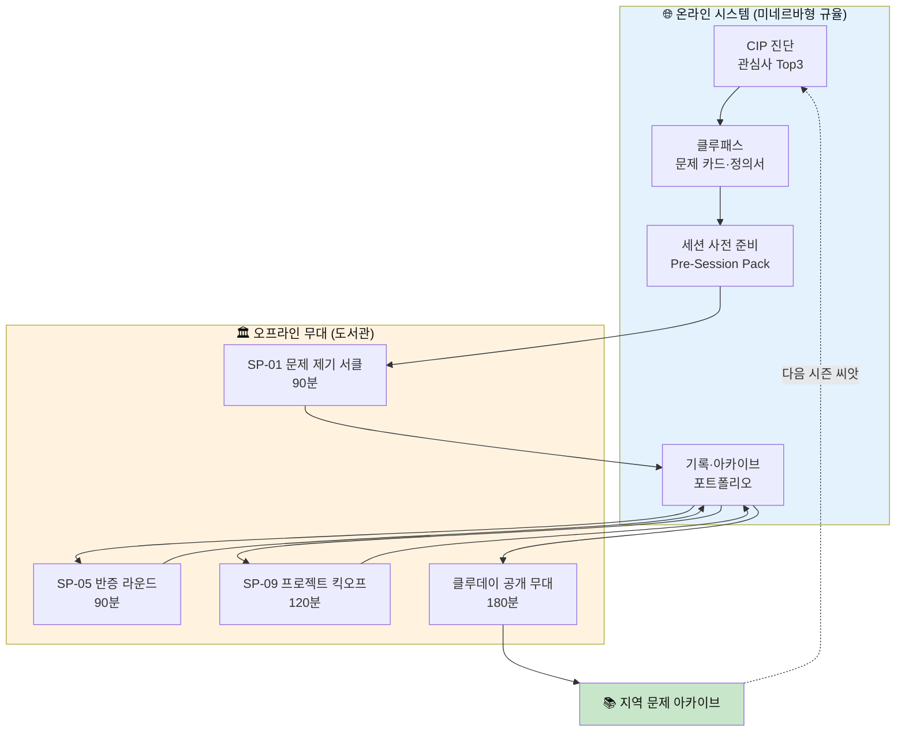

### 0.4 30초 엘리베이터 피치

> "도서관에 사람은 오는데, 서로 말을 걸지 않습니다.
> 리딩클루는 관심사 50개 격자로 같은 문제를 가진 사람을 묶고,
> 90분짜리 세션 프로토콜 12종으로 **문제 제기 → 반증 → 프로젝트**까지 밀어줍니다.
> 온라인은 미네르바처럼 준비와 기록을 강제하고, 오프라인은 도서관에서 충돌합니다.
> 12주 뒤 도서관에는 **그 지역이 던진 질문 목록**이 남습니다."

### 0.5 7단계와의 접속 지점 (이 문서가 새로 만드는 것)

| 7단계가 이미 준 것 | 8단계가 추가하는 것 |
|---|---|
| 관심사 50 격자 | **관심사 → 크루 매칭 엔진 · 최소 정족수 규칙** |
| 템플릿 24종 (개인 작성) | **세션 프로토콜 12종 (집단 진행)** |
| 문제 카드 · 정의서 | **문제 벽(물리) · 문제 시장(Problem Market)** |
| 클루랩 4트랙 | **시즌 12주 · 클루데이 공개 무대** |
| 공개 5단위 | **지부(Chapter) · 연합(Federation) 2단위 추가** |
| 학급 리포트 | **기관 대시보드 · 지역 문제 아카이브** |
| 페르소나 8인 | **커뮤니티 페르소나 10인 (호스트·사서 중심)** |

---

# PART I — 왜 도서관인가

## 1. 미래 도서관 명제 — 대출소에서 문제 발생지로

### 1.1 도서관은 왜 변해야 하는가

도서관이 직면한 현실을 직시한다.

| 지표 | 2015 | 2020 | 2025(추정) | 방향 |
|---|:-:|:-:|:-:|---|
| 공공도서관 연간 방문자(만 명) | 2억 2천 | 1억 3천(코로나) | 1억 8천 | 회복은 하나 정체 |
| 1인당 대출 권수 | 4.7 | 3.2 | 3.0 | **지속 감소** |
| 열람실 좌석 점유율(학습) | 85% | 40% | 65% | 카페·스터디카페에 밀림 |
| "도서관에서 누군가와 대화한 적 있다" | — | — | **7%** | 거의 없음 |
| 도서관 프로그램 참여 비율 | 8% | 5% | 9% | 낮은 천장 |

> **핵심 문제**: 사람은 오지만 **서로를 모른 채** 떠난다.
> 도서관은 장서 관리에서는 탁월하지만 **사람과 사람을 연결하는 프로토콜**이 없다.

### 1.2 도서관의 3단계 진화 모형

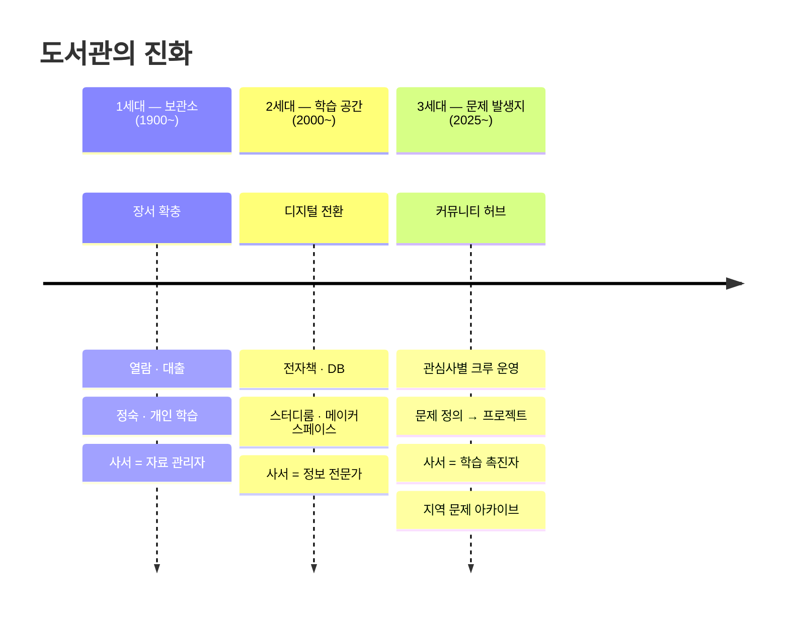

### 1.3 3세대 도서관의 5가지 원칙

```
원칙 ① 사람이 사람을 만나야 한다.
       — 프로그램이 아니라 "같은 관심사"가 만남의 이유다.

원칙 ② 와서 앉는 것이 아니라, 와서 말하는 것이다.
       — 90분 세션의 모든 시간에 "말할 차례"가 있다.

원칙 ③ 기록이 남는다.
       — 세션이 끝나면 물리적 문제 카드와 디지털 아카이브가 동시에 생긴다.

원칙 ④ 단발이 아니라 시즌이다.
       — 12주 시즌이 도서관의 기본 단위다. 1회성 특강은 시즌의 SP-01 체험판일 뿐이다.

원칙 ⑤ 도서관이 아닌 곳에서도 프로토콜은 작동한다.
       — 카페, 교실, 회의실. 프로토콜이 공간을 도서관으로 만든다.
```

### 1.4 도서관 유형별 가능성 매핑

| 유형 | 강점 | 제약 | 리딩클루 도입 형태 |
|---|---|---|---|
| **공공도서관** | 장소 무료 · 전 연령 · 사서 인력 | 연령 혼합 · 예산 경직 · 정숙 문화 | 1~2개 크루 파일럿 → 세미나실 전환 |
| **대학도서관** | 학기 리듬 · 과목 연계 · 동기 높은 참여자 | 학과 칸막이 · 학점 연계 복잡 | 교양 교과 연계 또는 학습 공동체 인정 |
| **고등학교 도서관** | 고정 시간(점심·방과후) · 교사 퍼실 가능 | 입시 압박 · 공간 협소 · 인원 제한 | 동아리 또는 자율활동 슬롯 |
| **작은도서관 · 문고** | 유연함 · 마을 밀착 | 공간 극소 · 1인 운영 | 셀(3~5명) 단위 · 비디오 하이브리드 |
| **기업도서관 · 사내 공간** | 실무 문제 즉시 연결 | 업무 시간 확보 · 비밀 | 점심 세미나 · 기업 전용 크루 |

### 1.5 "문제 아카이브"가 도서관의 새 장서가 된다

전통 도서관의 자산은 **장서 목록(OPAC)**이다.
3세대 도서관의 자산은 **문제 목록(Problem Archive)**이다.

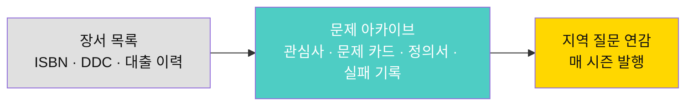

| 항목 | 장서 목록 | 문제 아카이브 |
|---|---|---|
| 단위 | 책 1권 | 문제 카드 1장 |
| 주인 | 출판사 · 저자 | **이용자 · 크루** |
| 검색 키 | 주제 분류 · 제목 · 저자 | **관심사 코드 · 렌즈 · 시즌** |
| 갱신 주기 | 입수 시 | **매 세션 후 실시간** |
| 10년 후 가치 | 감소 (절판) | **증가 (축적)** |

---

## 2. 미네르바 모델 해부 — 무엇을 이식하고 무엇을 버리는가

### 2.1 미네르바 대학의 핵심 구조

미네르바 대학(Minerva University)은 캠퍼스 없이 7개 도시를 순회하며
**100% 온라인 세미나**로 수업하고, 도시 자체를 캠퍼스로 사용한다.
우리가 주목하는 것은 콘텐츠가 아니라 **운영 프로토콜**이다.

| 미네르바의 장치 | 효과 | 리딩클루 이식 여부 |
|---|---|---|
| **Active Learning Forum** (19명 이하) | 전원 발언 필수 | ✅ 크루 정원 15명 · 셀 4~6명 |
| **Pre-Class Assignment** (사전 과제) | 세미나 시간에 강의 제로 | ✅ Pre-Session Pack 필수 |
| **실시간 참여 추적 대시보드** | 교수가 미참여자 즉시 호출 | ✅ 퍼실리테이터 체크리스트 |
| **HC(Habits of Mind & Foundational Concepts)** | 사고 도구를 명시적으로 가르침 | ✅ 렌즈 12 · 템플릿 24 |
| **도시 순회 (7개국)** | 맥락 바꾸기 → 전이 학습 | ⚠️ 제한적 이식 (지부 간 이어달리기) |
| **19명 정원 · 교수 1인** | 높은 인건비 | ❌ 전문 교수 없이 프로토콜로 대체 |
| **학위 프로그램** | 동기 부여 · 4년 유지 | ❌ 비학위 · 시즌(12주) 단위 |

### 2.2 이식하는 것 — "프로토콜이 교수를 대체한다"

미네르바의 핵심은 교수의 전문성이 아니라 **세미나 프로토콜의 엄격함**이다.

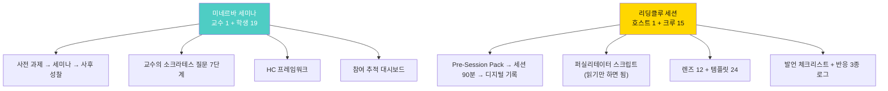

**핵심 전환**:
- 미네르바의 교수 → 리딩클루의 **퍼실리테이터(호스트)**
- 교수의 전문성 → **스크립트 + 프로토콜**
- 교수의 즉흥 판단 → **타임박스 + 템플릿의 강제력**

### 2.3 버리는 것 — 왜 학위도, 전문 교수도 필요 없는가

| 미네르바 전제 | 우리의 전제 | 이유 |
|---|---|---|
| 4년 과정 유지 | 12주 시즌 반복 | 동기가 "학위"가 아니라 "내 문제" |
| 전문 교수가 퍼실 | 훈련된 시민 호스트 | 스크립트가 전문성을 대체 |
| 학비로 운영 | 기관 예산 + 커뮤니티 자원 | 도서관은 이미 있다 |
| 19명 학급 고정 | 시즌별 크루 재구성 | 문제가 바뀌면 사람도 바뀐다 |

### 2.4 소크라테스 7단계의 리딩클루 적용

함께_독서_중요성 문서의 소크라테스 7단계를 세션 프로토콜에 내장한다.

| 소크라테스 단계 | 미네르바 | 리딩클루 세션에서 | 시점 |
|---|---|---|---|
| 1 명확화 | 교수 즉흥 질문 | **SP-01 문제 카드 발표 시 필수 질문** | 세션 전반 |
| 2 가정 탐색 | 교수 즉흥 질문 | **C-03 "숨은 전제 카드" 템플릿** | SP-03 |
| 3 근거 요구 | 교수 즉흥 질문 | **정의서 ⑥칸 근거 3권 필수** | SP-04 |
| 4 관점 확장 | 교수 즉흥 질문 | **병렬 독서 + 교차 코멘트** | SP-05 |
| 5 함의 탐구 | 교수 즉흥 질문 | **C-08 "그렇다면 카드"** | SP-06 |
| 6 반론 제기 | 교수 즉흥 질문 | **SP-07 반증 라운드 전체가 이것** | SP-07 |
| 7 메타 질문 | 교수 즉흥 질문 | **SP-12 시즌 회고 마지막 10분** | SP-12 |

> **차이점**: 미네르바는 교수가 7단계를 **즉흥으로** 운용한다.
> 리딩클루는 7단계를 **12종 세션에 1:1 매핑**하여 스크립트화한다.
> 즉흥이 필요 없으므로 **전문 교수가 필요 없다.**

---

## 3. 온라인 → 오프라인 확장의 4법칙

### 3.1 왜 순수 온라인은 실패하는가

| 온라인만의 한계 | 증거 | 해결 |
|---|---|---|
| **책임감 희석** | Zoom 독서모임 3회 이후 이탈률 70%+ | 물리적 출석 + 문제 벽 게시 |
| **충돌 회피** | 반박이 텍스트로는 공격으로 읽힘 | 대면 반증 라운드 (SP-07) |
| **우연한 만남 불가** | 알고리즘은 비슷한 사람만 보여줌 | 도서관 복도의 "문제 벽" |
| **성취 실감 부족** | 디지털 뱃지의 감흥 0 | 클루데이 물리 무대 발표 |

### 3.2 4법칙

```
법칙 1 — 준비는 온라인, 충돌은 오프라인.
         온라인에서 문제 카드를 쓰고, 오프라인에서 반박당한다.

법칙 2 — 기록은 온라인, 전시는 오프라인.
         모든 산출물은 클루패스에 저장되고, 클루데이에 벽에 붙는다.

법칙 3 — 개인은 온라인, 집단은 오프라인.
         혼자 읽고 쓰는 것은 어디서든. 함께 부딪히는 것은 한 공간에서.

법칙 4 — 프로토콜은 온라인, 에너지는 오프라인.
         타임박스·순서·역할은 시스템이 강제하고,
         격려·긴장·웃음은 사람이 만든다.
```

### 3.3 온-오프 분업 매트릭스

| 활동 | 온라인 | 오프라인 | 비고 |
|---|:-:|:-:|---|
| CIP 관심사 진단 | ● | ○ | 기관 체험 시 오프라인 가능 |
| 관심사 탐색 · 책 선택 | ● | △ | 서가 브라우징은 오프 |
| 문제 카드 작성 (T-01) | ● | △ | 오프라인 종이 카드도 지원 |
| 세션 사전 준비 | ● | — | Pre-Session Pack 필수 |
| **세션 진행 (SP-01~12)** | △ | ● | 원격 참여 허용하되 정원의 30% 이하 |
| 반응 3종 (🤝🔍⚔️) | ● | ● | 오프라인은 스티커 카드 |
| 정의서 작성 (T-16) | ● | — | — |
| 프로젝트 작업 (클루랩) | ● | ● | 트랙에 따라 다름 |
| **클루데이 공개 발표** | △ | ● | 온라인 중계 가능하나 오프 우선 |
| 시즌 아카이브 열람 | ● | ● | 도서관에 인쇄 아카이브 비치 |

> ● 주(主), △ 보조, ○ 선택, — 해당 없음

### 3.4 하이브리드 세션의 황금 비율

모든 세션은 **오프라인 우선**이다. 원격 참여는 허용하되 다음 규칙을 지킨다.

| 규칙 | 내용 | 이유 |
|---|---|---|
| 30% 규칙 | 원격 참여자는 전체의 30% 이하 | 50% 넘으면 에너지가 온라인으로 쏠림 |
| 오프 우선 발언 | 오프라인 참여자가 먼저 발언 | 화면 속 얼굴이 지배하지 않도록 |
| 카메라 온 필수 | 원격 참여자 카메라 의무 | 비대면 무임승차 방지 |
| 동일 타임박스 | 온·오프 같은 시간 제한 | 온라인이 길어지면 오프가 관객이 됨 |

---

# PART II — 커뮤니티 구조

## 4. 커뮤니티 단위 체계 — 셀·크루·지부·연합

### 4.1 4단위 계층

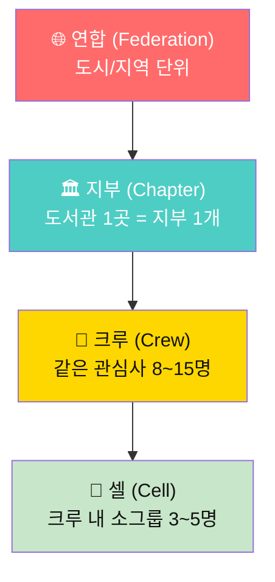

### 4.2 단위별 상세

| 단위 | 정원 | 수명 | 개설 조건 | 해산 조건 | 핵심 산출물 |
|---|:-:|---|---|---|---|
| **셀** | 3~5 | 세션 1회~시즌 1회 | 크루 내 자율 결성 | 세션 종료 시 자동 | 교차 코멘트 기록 |
| **크루** | 8~15 | 시즌 1회 (12주) | 관심사 코드 동일 + 호스트 1명 | 시즌 종료 → 재결성 or 해산 | 문제 정의서 · 프로젝트 |
| **지부** | 크루 2~10개 | 상시 | 기관 MOU 또는 호스트 자격증 | 6개월 세션 0회 | 지역 문제 아카이브 |
| **연합** | 지부 3~30개 | 상시 | 지부 3개 이상 자발 결성 | — | 연합 클루데이 · 이어달리기 |

### 4.3 크루의 생애주기

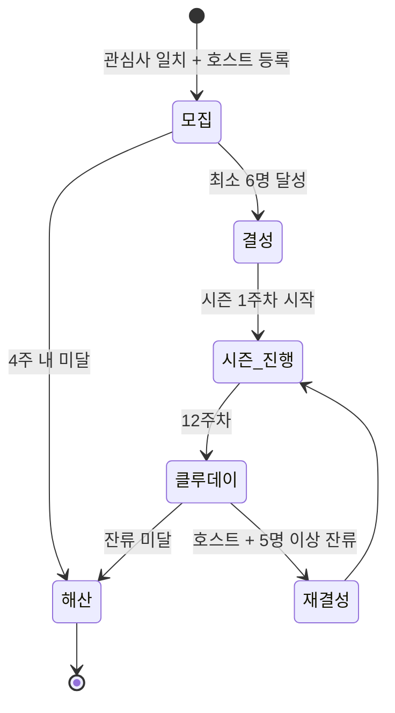

### 4.4 크루 이름 규칙

크루 이름은 `[관심사 코드]-[지부 약칭]-[시즌 번호]`로 자동 생성된다.
예: `#43기술인간-서초-S3` = 관심사 43 기술과 인간 · 서초도서관 지부 · 시즌 3

### 4.5 셀의 역할 — "왜 크루 안에 소그룹이 필요한가"

15명이 한 테이블에서 동시에 말하면 **4명만 말하고 11명은 듣는다.**
셀은 이 문제를 구조적으로 해결한다.

| 세션 단계 | 전체(크루) | 셀(소그룹) |
|---|---|---|
| 문제 카드 발표 | 3분 라이트닝 × 전원 | — |
| 반증 토론 | — | **셀 내 20분 집중 토론** |
| 교차 코멘트 | — | **셀 간 카드 교환 (5분)** |
| 합의·투표 | **전체 합의** | — |
| 회고 | — | 셀 내 5분 → 전체 공유 |

---

## 5. 관심사 50 → 커뮤니티 매칭 엔진

### 5.1 문제 정의 — "같은 관심사를 가진 사람을 어떻게 모으는가"

7단계의 CIP 진단은 개인의 관심사 Top3를 산출한다.
8단계는 이 결과를 기반으로 **크루를 자동 제안**한다.

### 5.2 매칭 알고리즘 (비-AI, 규칙 기반)

```
입력: 사용자의 CIP 결과 (관심사 Top3, 영역 점수)
출력: 추천 크루 목록 (최대 5개)

규칙:
1. Top1 관심사 코드가 동일한 크루 → 우선순위 1
2. Top1의 상위 영역이 동일한 크루 → 우선순위 2
3. Top2, Top3 관심사 코드가 동일한 크루 → 우선순위 3
4. 교차 관심사 (Top1 × Top2 조합) 크루 → 우선순위 4
5. 지리적 근접성 (같은 지부) → 보너스 +1

정족수 규칙:
- 크루 정원: 최소 6명, 최대 15명
- 신청 6명 미만 시: 대기열 → 4주 내 미달 시 유사 관심사 크루 합류 제안
- 15명 초과 시: 자동 분할 (셀 구성 기반)
```

### 5.3 매칭 화면 흐름

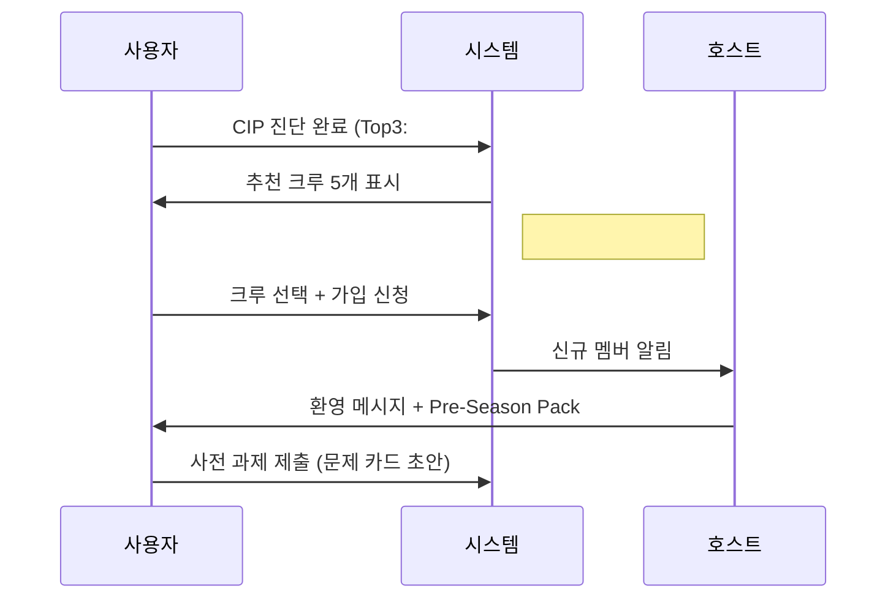

### 5.4 "관심사 교차" 크루 — 새로운 유형

7단계의 교차 관심사(§2.4)를 크루 단위로 확장한다.

| 유형 | 예시 | 특성 |
|---|---|---|
| **단일 관심사 크루** | `#43 기술과 인간` | 깊이 우선 |
| **교차 관심사 크루** | `#43 × #26 기술 번아웃` | 융합 문제 발견에 강함 |
| **영역 크루** | `E 사회와 세계` 전체 | 폭넓은 탐색, 초심자용 |

---

## 6. 역할 체계 12종 — 누가 무엇을 책임지는가

### 6.1 역할 총람

| # | 역할 | 영문 | 소속 | 핵심 책임 | 필요 자격 |
|:-:|---|---|---|---|---|
| 1 | **멤버** | Member | 크루 | 문제 카드 작성 · 세션 참여 · 반응 달기 | CIP 완료 |
| 2 | **셀 리더** | Cell Lead | 셀 | 소그룹 토론 진행 · 시간 관리 | 세션 3회 이상 참석 |
| 3 | **호스트** | Host | 크루 | 세션 퍼실리테이션 · 크루 관리 | 호스트 워크숍 수료 |
| 4 | **병렬 독서 배정자** | Book Matcher | 크루 | 정의·도구·반증 3권 배분 | 호스트 겸임 가능 |
| 5 | **반증 파트너** | Rebuttal Partner | 크루 간 | ⚔️ 반박 작성 · 교차 방문 | R-03 루브릭 B 이상 |
| 6 | **프로젝트 리드** | Project Lead | 클루랩 팀 | 트랙 선정 · 주간 체크인 | 정의서 승급 |
| 7 | **사서 코디네이터** | Library Coord. | 지부 | 공간 배정 · 기관 연락 · 자료 지원 | 사서 자격 또는 기관 지정 |
| 8 | **지부장** | Chapter Lead | 지부 | 시즌 운영 · 호스트 관리 · 클루데이 총괄 | 호스트 2시즌 이상 |
| 9 | **연합 대표** | Fed. Rep. | 연합 | 지부 간 조율 · 이어달리기 중재 | 지부장 경험 |
| 10 | **모더레이터** | Moderator | 전체 | 갈등 중재 · 안전 규칙 · 신고 처리 | 안전 워크숍 수료 |
| 11 | **아카이비스트** | Archivist | 지부 | 시즌별 아카이브 정리 · 연감 편찬 | 사서 또는 지원자 |
| 12 | **멘토** | Mentor | 크루 간 | 이전 시즌 참여자가 신규 크루 지원 | 시즌 1회 완주 |

### 6.2 역할 승급 경로

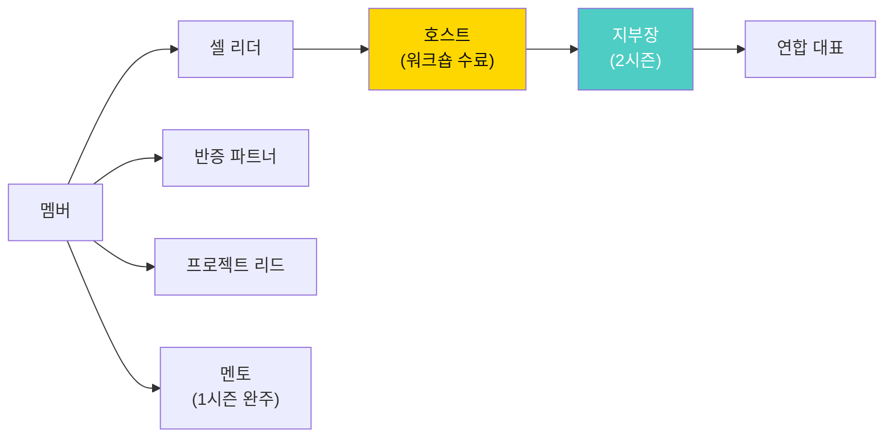

### 6.3 호스트 워크숍 — 전문 교수 없이 가능한 이유

호스트 워크숍은 **8시간(1일 또는 2회)**이다.
가르치는 것이 아니라 **스크립트 따라 읽기 + 타이머 사용법 + 갈등 대응 3패턴**을 연습한다.

| 모듈 | 시간 | 내용 |
|---|:-:|---|
| M1 리딩클루 원리 | 1h | 명제 6개 · 7단계 요약 · 8단계 구조 |
| M2 세션 프로토콜 체험 | 2h | SP-01, SP-05, SP-07을 직접 참여자로 경험 |
| M3 스크립트 읽기 실습 | 2h | 대사집 낭독 · 타임박스 연습 · 발언 체크리스트 |
| M4 갈등 대응 3패턴 | 1.5h | 침묵 · 독점 · 감정 폭발 시 대사 |
| M5 온라인 시스템 사용법 | 1h | Pre-Session Pack 생성 · 체크인 · 아카이브 |
| M6 시뮬레이션 | 0.5h | SP-01 직접 퍼실리테이션 + 피드백 |

> **자격 유지**: 시즌당 최소 6회 세션 호스팅.
> 2시즌 연속 미달 시 자격 일시 정지 → 재수료(M2+M3만, 4시간).

---

## 7. 멤버 여정 — 방문자에서 호스트까지 6단계

### 7.1 여정 지도

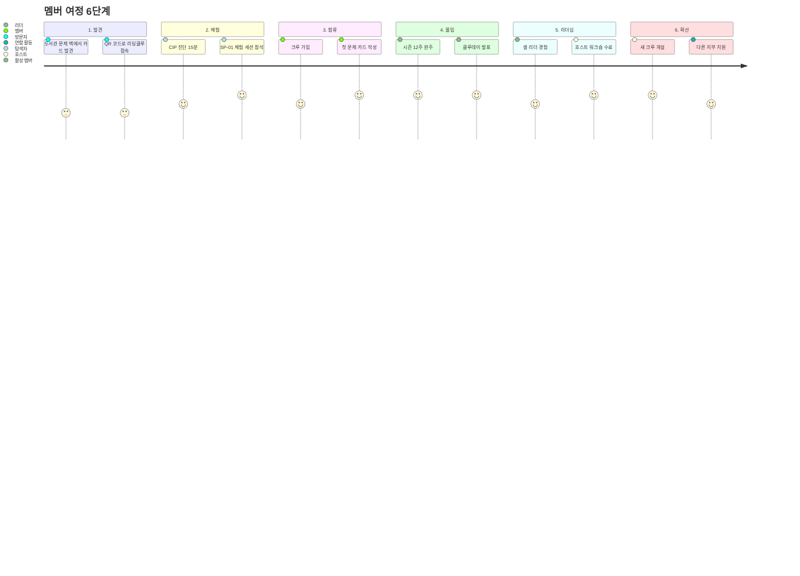

### 7.2 단계별 전환 조건과 이탈 방지

| 전환 | 조건 | 이탈 위험 | 방지책 |
|---|---|---|---|
| 방문자 → 탐색자 | QR 스캔 또는 추천 링크 | "나와 안 맞을 것 같다" | 문제 벽의 실물 카드가 호기심 자극 |
| 탐색자 → 멤버 | CIP 완료 + 크루 가입 | "혼자인 것 같다" | 가입 즉시 호스트 환영 메시지 + 셀 배정 |
| 멤버 → 활성 멤버 | 세션 4회 이상 참석 | "바빠서 못 간다" | 2주 미참석 시 셀 리더 DM |
| 활성 → 리더 | 셀 리더 자원 | "내가 할 수 있을까" | 셀 리더 = 타이머 관리 + 대사 읽기뿐 |
| 리더 → 호스트 | 워크숍 수료 | "부담스럽다" | 첫 세션은 지부장이 코-호스트 |

---

# PART III — 세션 프로토콜 (실행의 핵심)

## 8. 세션 프로토콜 총람 12종

> **세션 프로토콜(SP)**은 7단계의 **템플릿(T)**에 대응하는 8단계의 핵심이다.
> 템플릿이 "개인이 채우는 양식"이라면, 세션 프로토콜은 **"집단이 실행하는 진행표"**다.

### 8.1 전체 지도

```mermaid
graph LR
    subgraph 문제_제기["🟡 문제 제기 (주 1~3)"]
        SP01["SP-01<br/>문제 서클"]
        SP02["SP-02<br/>관심사 탐색"]
        SP03["SP-03<br/>숨은 전제"]
        SP04["SP-04<br/>근거 수집"]
    end

    subgraph 심화_검증["🟢 심화·검증 (주 4~8)"]
        SP05["SP-05<br/>병렬 독서 보고"]
        SP06["SP-06<br/>함의 탐구"]
        SP07["SP-07<br/>반증 라운드"]
        SP08["SP-08<br/>정의서 리뷰"]
    end

    subgraph 프로젝트_공개["🔴 프로젝트·공개 (주 9~12)"]
        SP09["SP-09<br/>프로젝트 킥오프"]
        SP10["SP-10<br/>주간 체크인"]
        SP11["SP-11<br/>리허설"]
        SP12["SP-12<br/>클루데이 + 회고"]
    end

    SP01 --> SP02 --> SP03 --> SP04
    SP04 --> SP05 --> SP06 --> SP07 --> SP08
    SP08 --> SP09 --> SP10 --> SP11 --> SP12

    style 문제_제기 fill:#fff9c4,color:#111
    style 심화_검증 fill:#c8e6c9,color:#111
    style 프로젝트_공개 fill:#ffcdd2,color:#111
```

### 8.2 세션 프로토콜 색인

| 코드 | 이름 | 시간 | 인원 | 사전 준비 | 핵심 산출물 | 소크라테스 단계 |
|---|---|:-:|---|---|---|---|
| SP-01 | 문제 제기 서클 | 90분 | 크루 전체 | T-01 문제 카드 초안 | 문제 카드 게시 | 1 명확화 |
| SP-02 | 관심사 탐색 워크숍 | 90분 | 셀 | CIP 결과 · 관심사 카드 | 관심사 교차 지도 | — |
| SP-03 | 숨은 전제 드러내기 | 90분 | 셀 → 전체 | 문제 카드 + C-03 | 전제 목록 | 2 가정 탐색 |
| SP-04 | 근거 수집 보고 | 90분 | 크루 전체 | 1차 데이터 1건 | 근거 타당성 투표 | 3 근거 요구 |
| SP-05 | 병렬 독서 보고 | 90분 | 셀 | 병렬 3권 독서 완료 | 교차 코멘트 카드 | 4 관점 확장 |
| SP-06 | 함의 탐구 세션 | 90분 | 셀 → 전체 | C-08 "그렇다면 카드" | 결과 예측 지도 | 5 함의 탐구 |
| SP-07 | 반증 라운드 | 120분 | 크루 전체 | 정의서 초안 | 반증 기록 · 수정본 | 6 반론 제기 |
| SP-08 | 정의서 피어 리뷰 | 90분 | 셀 교차 | 정의서 완성본 | R-02 루브릭 점수 | — |
| SP-09 | 프로젝트 킥오프 | 120분 | 크루 전체 | 정의서 승급 | 팀 협약서 · 트랙 선정 | — |
| SP-10 | 주간 체크인 | 45분 | 팀 | T-19 주간 체크인 | 진척 기록 · 실패 기록 | — |
| SP-11 | 클루데이 리허설 | 90분 | 크루 전체 | T-22 최종 보고 초안 | 피드백 목록 | — |
| SP-12 | 클루데이 + 시즌 회고 | 180분 | 지부 전체 + 공개 | 최종 보고 1장 | 발표 · 인계서 · 회고 | 7 메타 질문 |

### 8.3 세션의 보편 구조 — 모든 SP가 공유하는 5박자

모든 세션은 아래 5박자를 공유한다. 시간 배분만 달라진다.

| 박자 | 이름 | 기본 시간 | 역할 |
|:-:|---|:-:|---|
| ① | **체크인** | 5분 | 이름·한 문장 근황 · 오늘 기대 |
| ② | **입력** | 15~30분 | 개인 발표 또는 라이트닝 톡 |
| ③ | **충돌** | 30~60분 | 셀 토론 · 반증 · 교차 코멘트 |
| ④ | **수렴** | 10~20분 | 전체 공유 · 투표 · 합의 |
| ⑤ | **체크아웃** | 5분 | 한 문장 배움 · 다음 주 약속 |

---

## 9. SP-01 ~ SP-04 : 문제 제기 계열 전문

### SP-01 · 문제 제기 서클 (90분)

> **목표**: 크루 멤버 전원이 자신의 문제 카드를 **말로** 발표하고, 첫 반응을 받는다.
> **사전 준비**: T-01 문제 카드 초안 (온라인 작성 또는 종이 카드)
> **준비물**: 타이머 · 문제 카드 인쇄본(A5) · 반응 스티커(🤝🔍⚔️) · 문제 벽 보드

#### 진행표

| 시간 | 단계 | 활동 | 호스트 대사 (요약) |
|:-:|---|---|---|
| 0~5 | ① 체크인 | 원형 좌석, 이름+한 문장 | "이름과 오늘 가져온 문제를 한 문장으로" |
| 5~45 | ② 입력 | **라이트닝 발표 3분 × 최대 12명** | "3분입니다. 벨이 울리면 마지막 한 문장" |
| | | 발표 후 전체 질문 1개 허용 (1분) | "명확화 질문만 1개. 의견은 아직" |
| 45~75 | ③ 충돌 | 셀(4명)로 이동 → 셀 내 교차 반응 | "옆 셀의 카드 2장을 받으세요. 🤝🔍⚔️ 중 하나를 붙여주세요" |
| | | 반응 스티커 + 20자 이상 코멘트 | "스티커만 붙이지 마세요. 왜 그렇게 생각했는지 한 줄" |
| 75~85 | ④ 수렴 | 전체 돌아와서 "가장 많이 ⚔️ 받은 카드 3개" 공유 | "반박이 많다는 건 좋은 문제라는 뜻입니다" |
| 85~90 | ⑤ 체크아웃 | 한 문장: "다음 주까지 내가 할 것" | "한 문장이면 됩니다. 약속은 작을수록 지킵니다" |

#### 물리 배치

```
┌─────────────────────────────────────────────┐
│                                             │
│   ○ ○ ○          ○ ○ ○          ○ ○ ○       │
│     셀A            셀B            셀C       │
│                                             │
│             ┌──────────┐                    │
│             │ 문제 벽   │                    │
│             │ (보드)    │                    │
│             └──────────┘                    │
│                                             │
│   ○ ○ ○          호스트                      │
│     셀D          (타이머)                    │
│                                             │
└─────────────────────────────────────────────┘
```

#### 종료 후 온라인 기록
- 호스트: 세션 체크인 기록 (참석자·발표자·반응 수)
- 멤버: 문제 카드 최종본 온라인 저장 + 받은 반응 반영
- 시스템: 문제 벽 사진 → 디지털 아카이브 자동 연결

---

### SP-02 · 관심사 탐색 워크숍 (90분)

> **목표**: CIP 결과를 공유하고, 셀 내에서 **관심사 교차 지도**를 그린다.
> **사전 준비**: CIP 결과 + 관심사 카드 3장 인쇄

| 시간 | 활동 |
|:-:|---|
| 0~5 | 체크인: "내 관심사 Top3 한 줄로" |
| 5~25 | 개인 발표: CIP 결과 + "이 관심사를 가지게 된 계기" 2분씩 |
| 25~55 | 셀 워크: 전지(모조지)에 관심사 교차 지도 그리기 |
| 55~75 | 셀 간 순회: 다른 셀의 교차 지도 보고 질문 스티커 붙이기 |
| 75~85 | 전체: "예상 밖 교차점" 3개 공유 |
| 85~90 | 체크아웃 |

**교차 지도 그리기 방법**:
1. 전지 중앙에 셀 멤버 이름 4개를 적는다
2. 각자의 Top3 관심사를 연결선으로 잇는다
3. 겹치는 관심사에 빨간 원을 그린다
4. 겹치는 곳에서 "우리 셀의 문제"를 3개 적는다

---

### SP-03 · 숨은 전제 드러내기 (90분)

> **목표**: 문제 카드에 깔린 **전제(가정)**를 찾아내고 명시화한다.
> **사전 준비**: 문제 카드 + C-03 숨은 전제 카드 (빈칸)
> **대응**: 소크라테스 2단계 "어떤 전제를 깔고 있나요?"

| 시간 | 활동 |
|:-:|---|
| 0~5 | 체크인 |
| 5~15 | 호스트 안내: "전제란 무엇인가" + 예시 2개 |
| 15~45 | 셀 워크: 각자의 문제 카드를 돌려 읽으며 **"이 카드는 ___를 당연하게 여기고 있다"** 작성 |
| 45~65 | 전제 경매: 가장 위험한 전제 3개를 셀별 투표 → 전체 발표 |
| 65~80 | 전체 토론: "이 전제가 틀리면 문제 자체가 바뀌는가?" |
| 80~90 | 체크아웃 + 문제 카드 수정 시간 5분 |

#### C-03 숨은 전제 카드 (빈칸 양식)

```
┌──────────────────────────────────────────────┐
│ C-03 숨은 전제 카드                           │
├──────────────────────────────────────────────┤
│ 원래 문제 카드 제목: ___________________      │
│ 작성자: ____________  검토자: ___________     │
├──────────────────────────────────────────────┤
│ 전제 ① ________________________________      │
│ "이 전제가 틀리면 → ___________________"     │
├──────────────────────────────────────────────┤
│ 전제 ② ________________________________      │
│ "이 전제가 틀리면 → ___________________"     │
├──────────────────────────────────────────────┤
│ 전제 ③ ________________________________      │
│ "이 전제가 틀리면 → ___________________"     │
├──────────────────────────────────────────────┤
│ 가장 위험한 전제: ______ (번호)              │
│ 이유: __________________________________      │
└──────────────────────────────────────────────┘
```

---

### SP-04 · 근거 수집 보고 (90분)

> **목표**: 각자 수집한 **1차 데이터**를 보고하고, 근거의 타당성을 집단 검증한다.
> **사전 준비**: T-14 1차 데이터 설계 결과물 + 수집한 데이터
> **대응**: 소크라테스 3단계 "왜 그렇게 생각하나요? 데이터가 있나요?"

| 시간 | 활동 |
|:-:|---|
| 0~5 | 체크인 |
| 5~35 | 라이트닝 보고 3분씩: "데이터 출처 · 수집 방법 · 핵심 발견" |
| 35~60 | 셀 워크: 근거 타당성 체크리스트 (C-04) 상호 작성 |
| 60~80 | 전체: "가장 강한 근거 Top3" 투표 + "보강이 필요한 근거 Top3" |
| 80~90 | 체크아웃 + 다음 주 "병렬 독서 배정" 예고 |

#### C-04 근거 타당성 체크리스트

| # | 항목 | Y/N | 비고 |
|:-:|---|:-:|---|
| 1 | 1차 데이터인가? (직접 수집) | | |
| 2 | 표본이 3명(건) 이상인가? | | |
| 3 | 반대편 의견이 포함되어 있는가? | | |
| 4 | 수집 방법을 다른 사람이 재현할 수 있는가? | | |
| 5 | 데이터가 문제 카드의 전제를 지지하는가? | | |
| 6 | 데이터가 문제 카드의 전제에 반하는가? | | |
| 7 | 데이터 출처가 명시되어 있는가? | | |

---

## 10. SP-05 ~ SP-08 : 심화·검증 계열 전문

### SP-05 · 병렬 독서 보고 (90분)

> **목표**: 같은 관심사에 대해 **다른 책**을 읽은 셀 멤버들이 교차 보고한다.
> **사전 준비**: 병렬 배정된 3권 중 자기 책 1권 완독 + T-15 3층 독서 노트

**병렬 독서 배정 규칙** (7단계 §15와 동일):
- 셀 4명에게 정의·도구·반증 3권 중 하나씩 (1명은 자유 선택)
- 같은 책을 2명 이상이 읽지 않는다
- 교차 보고 시 **요약이 아니라 "이 책이 내 문제에 준 질문"**을 발표

| 시간 | 활동 |
|:-:|---|
| 0~5 | 체크인 |
| 5~25 | 셀 내 교차 보고: 3분씩 "이 책이 내 문제에 준 질문 3개" |
| 25~50 | 교차 코멘트 작성: 다른 멤버의 독서 노트에 C-05 카드 작성 |
| 50~70 | 셀 간 교환: 셀A의 카드 → 셀B, 셀B → 셀C (5분 읽기 + 5분 코멘트) |
| 70~85 | 전체: "가장 예상 밖이었던 관점" 셀별 1개 공유 |
| 85~90 | 체크아웃 |

---

### SP-06 · 함의 탐구 세션 (90분)

> **목표**: 문제가 해결되거나 해결되지 않을 때의 **결과를 구체적으로 그린다**.
> **사전 준비**: C-08 "그렇다면 카드"
> **대응**: 소크라테스 5단계 "그렇다면?"

#### C-08 "그렇다면 카드" 양식

```
┌──────────────────────────────────────────────┐
│ C-08 "그렇다면" 카드                          │
├──────────────────────────────────────────────┤
│ 문제: _____________________________________  │
├──────────────────────────────────────────────┤
│ IF 해결된다면:                                │
│  · 1년 후: _______________________________   │
│  · 5년 후: _______________________________   │
│  · 누가 이득: ____________________________   │
│  · 누가 손해: ____________________________   │
├──────────────────────────────────────────────┤
│ IF 해결되지 않는다면:                          │
│  · 1년 후: _______________________________   │
│  · 5년 후: _______________________________   │
│  · 누가 이득: ____________________________   │
│  · 누가 손해: ____________________________   │
├──────────────────────────────────────────────┤
│ 가장 무서운 결과: ________________________    │
│ 가장 놀라운 결과: ________________________    │
└──────────────────────────────────────────────┘
```

| 시간 | 활동 |
|:-:|---|
| 0~5 | 체크인 |
| 5~20 | 개인 작성: C-08 카드 채우기 (15분) |
| 20~50 | 셀 워크: 카드 돌려 읽기 + "나는 이 결과가 더 무섭다" 토론 |
| 50~70 | 전체: "손해 보는 사람"을 모아 **이해관계자 지도** 그리기 |
| 70~85 | 투표: "이 문제를 프로젝트로 밀고 갈 의향이 있다" Y/N |
| 85~90 | 체크아웃 |

---

### SP-07 · 반증 라운드 ★ (120분)

> **목표**: 정의서 초안에 대해 **체계적으로 반박**하고, 살아남은 문제만 승급한다.
> **사전 준비**: T-16 문제 정의서 초안 + 반증 파트너 사전 배정
> **대응**: 소크라테스 6단계 "반대 의견은? 모순되는 사례는?"

이 세션은 이 시즌에서 **가장 긴장감 있는 시간**이다.

#### 반증 파트너 배정 규칙

| 규칙 | 내용 |
|---|---|
| 같은 셀 금지 | 익숙한 사람 사이에선 반박이 약해진다 |
| 관심사 인접 금지 | 같은 관심사면 전제를 공유하므로 반박 어려움 |
| 이전 시즌 경험자 우선 | R-03 루브릭 B 이상이면 반증 파트너 자격 |
| 크루 간 교차 허용 | 같은 지부 내 다른 크루에서 반증 파트너 초청 가능 |

#### 진행표

| 시간 | 단계 | 활동 |
|:-:|---|---|
| 0~5 | 체크인 | "오늘은 반박하는 날입니다. 목표는 더 나은 문제입니다" |
| 5~15 | 규칙 안내 | 반증 라운드 규칙 5가지 읽기 |
| 15~75 | **반증 라운드** (6쌍 × 10분) | 발표자 3분 → 반증 파트너 질문 5분 → 기록 2분 |
| 75~95 | 셀 토론 | "반박에서 가장 날카로웠던 지적" 공유 |
| 95~110 | 전체 | "수정이 필요한 정의서"와 "그대로 승급 가능한 정의서" 분류 |
| 110~120 | 체크아웃 | "오늘 가장 아팠지만 유익했던 반박" |

#### 반증 라운드 규칙 5가지

```
규칙 1. 인격이 아니라 논증을 반박한다.
규칙 2. "틀렸다"가 아니라 "이 경우에는?"으로 말한다.
규칙 3. 반박에는 반드시 대안 질문이 따라야 한다.
규칙 4. 발표자는 즉시 수용하지 않아도 된다. 기록만 한다.
규칙 5. 반증 파트너의 반박은 R-03 루브릭으로 상호 채점한다.
```

---

### SP-08 · 정의서 피어 리뷰 (90분)

> **목표**: 완성된 정의서를 **다른 셀**이 R-02 루브릭으로 채점한다.
> **사전 준비**: SP-07 반증 반영 완료된 정의서 최종본

| 시간 | 활동 |
|:-:|---|
| 0~5 | 체크인 |
| 5~15 | 정의서 교환 (셀A ↔ 셀C, 셀B ↔ 셀D) |
| 15~50 | 읽기 + R-02 루브릭 채점 (개인별) |
| 50~70 | 셀 내 합의: 채점 결과 논의 → 셀 평균 산출 |
| 70~85 | 전체: 최고 점수 정의서 3개 발표 + "왜 높은가" 해설 |
| 85~90 | 체크아웃 + 승급 가능 정의서 확정 |

---

## 11. SP-09 ~ SP-12 : 프로젝트·공개 계열 전문

### SP-09 · 프로젝트 킥오프 (120분)

> **목표**: 승급된 정의서를 기반으로 **팀을 구성**하고 **트랙을 선정**한다.
> **사전 준비**: 승급 정의서 + 프로젝트 의향 사전 조사

| 시간 | 활동 |
|:-:|---|
| 0~5 | 체크인 |
| 5~25 | **문제 시장(Problem Market)**: 정의서 포스터 세션 (벽에 붙이고 자유 순회) |
| 25~45 | 팀 빌딩: "이 문제에 합류하고 싶다" 스티커 투표 → 최소 2명 이상 팀 성립 |
| 45~75 | 팀별: T-17 팀 협약서 작성 + 4트랙(조사/시제품/캠페인/재정의) 선택 |
| 75~100 | 팀별: T-21 트랙별 산출 계획 초안 |
| 100~115 | 전체: 팀별 1분 선언 "우리 팀은 ___ 문제를 ___ 트랙으로 밀겠습니다" |
| 115~120 | 체크아웃 |

#### 문제 시장(Problem Market) 상세

문제 시장은 학술 학회의 포스터 세션을 독서 커뮤니티에 맞게 변형한 것이다.

```
┌──────────────────────────────────────────────┐
│               문제 시장 배치                   │
│                                              │
│  ┌────┐ ┌────┐ ┌────┐ ┌────┐ ┌────┐         │
│  │정의서│ │정의서│ │정의서│ │정의서│ │정의서│         │
│  │ A  │ │ B  │ │ C  │ │ D  │ │ E  │         │
│  └────┘ └────┘ └────┘ └────┘ └────┘         │
│                                              │
│  참여자들이 자유 순회하며                       │
│  관심 있는 정의서에 "합류" 스티커를 붙인다        │
│                                              │
│  규칙:                                       │
│  · 본인 정의서에는 붙이지 않는다                │
│  · 최대 2개 정의서에만 합류 가능                │
│  · 2명 미만이면 팀 불성립 → 합류 또는 개인 트랙  │
└──────────────────────────────────────────────┘
```

---

### SP-10 · 주간 체크인 (45분)

> **목표**: 프로젝트 진행 상황 공유 + 실패 기록
> 9~11주 매주 반복. 팀 단위.

| 시간 | 활동 |
|:-:|---|
| 0~3 | 체크인 |
| 3~20 | 팀별: T-19 주간 체크인 작성 → 이번 주 진척 / 막힌 점 / 도움 요청 |
| 20~35 | 크루 전체: 팀별 2분 보고 + 크루 자원 연결 |
| 35~43 | 실패 기록 시간: "이번 주 실패한 것 1가지" (T-20) |
| 43~45 | 체크아웃 |

---

### SP-11 · 클루데이 리허설 (90분)

> **목표**: 클루데이 발표 리허설 + 피어 피드백

| 시간 | 활동 |
|:-:|---|
| 0~5 | 체크인 |
| 5~65 | 팀별 리허설 8분 + 피드백 4분 (최대 5팀) |
| 65~80 | 전체: 공통 개선점 3가지 정리 |
| 80~90 | 체크아웃 + 클루데이 역할 분담 확인 |

---

### SP-12 · 클루데이 + 시즌 회고 (180분)

> **목표**: 시즌의 산출물을 **외부에 공개**하고, 시즌을 회고한다.
> **참석**: 크루 + 지부 멤버 + 외부 초대 (가족·교사·지역 주민)
> **대응**: 소크라테스 7단계 "우리 과정에서 놓친 것은?"

| 시간 | 단계 | 활동 |
|:-:|---|---|
| 0~10 | 개회 | 지부장 인사 + 이번 시즌 숫자 (참여자·카드·정의서·실패 수) |
| 10~90 | **공개 발표** | 팀별 10분 발표 + 5분 질의 (최대 5팀) |
| 90~100 | 휴식 | — |
| 100~130 | **문제 벽 순회** | 이번 시즌 모든 문제 카드 전시 · 외부 참석자 반응 달기 |
| 130~150 | **인계 세션** | T-23 남은 질문 인계서 발표 → 다음 시즌 씨앗 |
| 150~170 | **시즌 회고** | T-24 회고 5문항 → 셀 내 공유 → 전체 공유 |
| 170~180 | 폐회 | "이번 시즌 가장 좋은 질문" 투표 → 시즌 최고 질문상 |

---

## 12. 퍼실리테이터 스크립트 — 그대로 읽는 대사집

### 12.1 SP-01 전체 스크립트

아래 대사를 **그대로 읽으면** SP-01을 진행할 수 있다.
즉흥 판단이 필요 없다. 타이머만 누르면 된다.

---

#### [0:00] 체크인

> **호스트**: "안녕하세요, 리딩클루 [크루 이름] 시즌 [N] 첫 번째 세션입니다.
> 저는 오늘 호스트 [이름]입니다.
> 돌아가면서 이름과, 오늘 가져온 문제를 **한 문장**으로 말씀해 주세요.
> 제가 먼저 하겠습니다. [호스트 자기소개 + 문제 한 문장]
> 왼쪽부터 시계 방향으로 부탁드립니다."

#### [5:00] 라이트닝 발표 안내

> **호스트**: "지금부터 문제 카드 발표입니다.
> 규칙은 세 가지입니다.
> 하나, **3분**입니다. 벨이 울리면 마지막 한 문장만 마무리하세요.
> 둘, 발표 후 **질문은 1개만** 받습니다. 의견이 아니라 **명확화 질문**만 허용합니다.
>      '무슨 뜻이에요?'는 질문입니다. '나는 다르게 생각하는데'는 의견입니다.
> 셋, 의견은 이따가 셀 토론에서 충분히 나눕니다.
> 첫 번째 발표자, 부탁드립니다."

#### [45:00] 셀 토론 안내

> **호스트**: "발표 수고하셨습니다.
> 지금부터 셀 토론입니다. 배정된 셀로 이동해 주세요.
> [셀 명단 읽기]
>
> 각 셀은 **옆 셀의 문제 카드 2장**을 받습니다.
> [카드 교환]
>
> 반응 스티커 3종이 있습니다.
> 🤝 나도 이 문제를 느낀다 — 초록 스티커
> 🔍 이 부분은 증상 같다 — 노란 스티커
> ⚔️ 반대편에서 보면 — 빨간 스티커
>
> **스티커만 붙이지 마세요.**
> 뒷면에 **왜 그렇게 생각했는지 한 줄(20자 이상)** 꼭 적어주세요.
> 시간은 **30분**입니다. 타이머 시작합니다."

#### [75:00] 수렴

> **호스트**: "셀 토론 마무리해 주세요.
> 원래 자리로 돌아와 주세요.
> 각 셀에서 **가장 많이 ⚔️(빨간 스티커) 받은 카드 1장**을 선정해 주세요.
> 셀 리더가 카드를 들고 1분 안에 이유를 설명해 주세요.
>
> 참고로, 반박이 많다는 것은 나쁜 게 아닙니다.
> **반박이 많은 문제가 좋은 문제입니다.**
> 왜냐하면 여러 관점에서 볼 수 있다는 뜻이니까요."

#### [85:00] 체크아웃

> **호스트**: "마지막입니다.
> 돌아가면서 **한 문장**: '다음 주까지 내가 할 것'을 말씀해 주세요.
> 약속은 작을수록 지킵니다.
> '책 1장 읽겠다'면 충분합니다.
>
> 수고하셨습니다. 오늘 나온 문제 카드는 [문제 벽]에 붙여 놓겠습니다.
> 온라인에서 문제 카드 최종본을 저장해 주세요.
> 다음 주는 SP-02 관심사 탐색 워크숍입니다. 사전 준비는 [...]입니다.
> 감사합니다."

### 12.2 갈등 대응 3패턴 — 즉흥이 아닌 대사

| 상황 | 호스트 대사 |
|---|---|
| **침묵** (아무도 말하지 않음) | "괜찮습니다. 30초 더 드릴게요. 메모를 보시면서 준비하셔도 됩니다." |
| **독점** (한 사람이 계속 말함) | "좋은 의견 감사합니다. 타이머가 울렸으니 다른 분 의견도 들어보겠습니다." |
| **감정 격양** (목소리가 높아짐) | "잠깐 멈추겠습니다. 반증 라운드 규칙 1번, '인격이 아니라 논증을 반박한다'를 다시 읽겠습니다. 1분 뒤 이어가겠습니다." |

---

# PART IV — 시즌 운영

## 13. 12주 시즌 설계 — 문제 제기에서 공개 무대까지

### 13.1 왜 12주인가

| 기간 | 장점 | 단점 | 판단 |
|---|---|---|---|
| 4주 | 부담 없음 | 문제 정의까지 불가 | ❌ |
| 8주 | 학교 동아리 한 학기 | 프로젝트 시간 부족 | ⚠️ 압축판으로 사용 |
| **12주** | 문제→정의→프로젝트→발표 | 이탈 위험 | ✅ 기본 시즌 |
| 16주 | 대학 학기 | 피로 누적 | ❌ 너무 길다 |

> **핵심**: 12주는 "문제만 찾고 끝나는" 7단계의 한계를 넘어 **프로젝트 + 공개 무대**까지 간다.
> 단, 프로젝트는 강제가 아니다. 문제 정의서로 끝내도 완주 인정(8주차 퇴장 가능).

### 13.2 시즌 3막 구조

```mermaid
gantt
    title 12주 시즌 3막 구조
    dateFormat  X
    axisFormat  %s주

    section 1막 문제 제기
    SP-01 문제 서클          :a1, 1, 1
    SP-02 관심사 탐색         :a2, 2, 1
    SP-03 숨은 전제           :a3, 3, 1

    section 2막 심화·검증
    SP-04 근거 수집           :b1, 4, 1
    SP-05 병렬 독서 보고       :b2, 5, 1
    SP-06 함의 탐구           :b3, 6, 1
    SP-07 반증 라운드 ★       :crit, b4, 7, 1
    SP-08 정의서 피어 리뷰     :b5, 8, 1

    section 3막 프로젝트·공개
    SP-09 킥오프              :c1, 9, 1
    SP-10 주간 체크인          :c2, 10, 2
    SP-11 리허설              :c3, 11, 1
    SP-12 클루데이 ★          :crit, c4, 12, 1
```

### 13.3 시즌 참여 트랙 3종

모든 사람이 프로젝트까지 갈 필요는 없다.

| 트랙 | 참여 기간 | 산출물 | 대상 |
|---|---|---|---|
| **탐색 트랙** | 1~3주 (1막) | 문제 카드 | 처음 온 사람 · 체험자 |
| **정의 트랙** | 1~8주 (1~2막) | 문제 정의서 | 심화하고 싶은 사람 |
| **프로젝트 트랙** | 1~12주 (전 막) | 정의서 + 프로젝트 + 발표 | 끝까지 가는 사람 |

---

## 14. 시즌 캘린더와 주차별 운영표

### 14.1 표준 시즌 캘린더 (공공도서관 기준, 토요일 오전)

| 주 | 날짜(예시) | 세션 | 시간 | 사전 준비 (온라인) | 오프라인 산출물 |
|:-:|---|---|:-:|---|---|
| 1 | S01 | SP-01 문제 서클 | 90분 | T-01 문제 카드 초안 | 문제 벽 게시 |
| 2 | S02 | SP-02 관심사 탐색 | 90분 | CIP 결과 인쇄 | 교차 지도 |
| 3 | S03 | SP-03 숨은 전제 | 90분 | C-03 빈칸 | 전제 목록 |
| 4 | S04 | SP-04 근거 수집 | 90분 | 1차 데이터 수집 | 근거 투표 |
| 5 | S05 | SP-05 병렬 독서 | 90분 | 병렬 1권 완독 | 교차 코멘트 |
| 6 | S06 | SP-06 함의 탐구 | 90분 | C-08 카드 | 이해관계자 지도 |
| 7 | S07 | **SP-07 반증 ★** | **120분** | 정의서 초안 | 반증 기록 |
| 8 | S08 | SP-08 피어 리뷰 | 90분 | 정의서 최종본 | R-02 채점 |
| — | — | **분기점**: 탐색·정의 트랙 완주 인정 | — | — | — |
| 9 | S09 | SP-09 킥오프 | 120분 | 프로젝트 의향 | 팀 구성 |
| 10 | S10 | SP-10 체크인 ① | 45분 | T-19 | 진척 기록 |
| 11 | S11 | SP-10 체크인 ② + SP-11 리허설 | 90분 | T-22 초안 | 피드백 |
| 12 | S12 | **SP-12 클루데이 ★** | **180분** | 최종 보고 | 공개 발표 |

### 14.2 학기 연계 캘린더 (대학, 화요일 저녁)

| 주 | 대학 학사 | 세션 | 비고 |
|:-:|---|---|---|
| 1 | 개강 1주 | SP-01 | OT 겸용 |
| 2~3 | 수업 | SP-02, SP-03 | — |
| 4~5 | 수업 | SP-04, SP-05 | 중간고사 전 마무리 |
| 6 | 중간고사 | 휴회 | 독서 몰입 주간 |
| 7~8 | 수업 | SP-06, SP-07 | — |
| 9 | 수업 | SP-08 | 2막 마감 |
| 10~11 | 수업 | SP-09, SP-10 | — |
| 12 | 수업 | SP-11 | 리허설 |
| 13 | 기말고사 전 | 휴회 | — |
| 14 | 기말고사 | **SP-12 클루데이** | 학기 마감 행사 겸용 |

### 14.3 8주 압축판 (고교 동아리용)

| 주 | 세션 | 비고 |
|:-:|---|---|
| 1 | SP-01 + SP-02 합산 (100분) | 동아리 2교시 연속 |
| 2 | SP-03 | — |
| 3 | SP-04 | — |
| 4 | SP-05 + SP-06 합산 (100분) | — |
| 5 | SP-07 반증 (100분) | 점심시간 연장 |
| 6 | SP-08 | — |
| 7 | SP-09 + SP-10 합산 (90분) | — |
| 8 | **SP-12 미니 클루데이** (120분) | 교내 발표 |

---

## 15. 클루데이(공개 무대) 운영 매뉴얼

### 15.1 클루데이란 무엇인가

클루데이는 시즌의 **졸업식이자 입학식**이다.
- 이번 시즌의 문제와 프로젝트를 **외부에 공개**한다.
- 다음 시즌의 **씨앗(남은 질문)**을 뿌린다.
- 새로운 멤버를 **모집**한다.

### 15.2 규모별 클루데이

| 규모 | 참석자 | 장소 | 소요 시간 | 발표 수 |
|---|---|---|:-:|:-:|
| **미니** | 크루 + 가족 (20~30명) | 도서관 세미나실 | 2시간 | 3~5 |
| **표준** | 지부 전체 + 외부 (50~100명) | 도서관 대강당 | 3시간 | 5~8 |
| **연합** | 지부 3개 이상 (150~300명) | 대학 강당 or 시민홀 | 4시간 | 10~15 |

### 15.3 표준 클루데이 타임테이블 (3시간)

| 시간 | 프로그램 | 담당 |
|:-:|---|---|
| 0:00~0:10 | 개회사 + 이번 시즌 숫자 | 지부장 |
| 0:10~0:20 | "시즌 하이라이트 영상" (3분) + 사서 소감 | 아카이비스트 |
| 0:20~1:20 | **팀 발표 ①~④** (각 12분 발표 + 3분 질의) | 프로젝트 팀 |
| 1:20~1:35 | 휴식 + 문제 벽 순회 | 전체 |
| 1:35~2:05 | **팀 발표 ⑤~⑥** + 개인 정의서 포스터 | 팀 + 개인 |
| 2:05~2:25 | **남은 질문 인계 세션** | 전체 |
| 2:25~2:40 | **시즌 최고 질문상** 투표 + 시상 | 지부장 |
| 2:40~2:55 | 시즌 회고 (전체 한 바퀴) | 전체 |
| 2:55~3:00 | 폐회 + 다음 시즌 예고 + 모집 안내 | 지부장 |

### 15.4 클루데이 체크리스트

| 시점 | 항목 | 담당 |
|---|---|---|
| D-28 | 일시·장소 확정 | 지부장 + 사서 코디 |
| D-21 | 발표 팀 확정 · 발표 순서 추첨 | 호스트 |
| D-14 | 외부 초대장 발송 (지역 주민, 교사, 학부모) | 사서 코디 |
| D-7 | SP-11 리허설 완료 | 호스트 |
| D-3 | 문제 벽 세팅 · 포스터 인쇄 | 아카이비스트 |
| D-1 | 장비 점검 (마이크·타이머·프로젝터) | 사서 코디 |
| D-Day | 사진·영상 촬영 | 자원봉사 |
| D+3 | 사진·기록 아카이브 업로드 | 아카이비스트 |
| D+7 | 시즌 리포트 발행 | 지부장 |

---

# PART V — 공간 설계

## 16. 도서관 공간 재구성 — 6존 모델

### 16.1 6존 정의

기존 도서관에 **새 건물을 짓지 않고**, 기존 공간을 **6개 존**으로 재배치한다.

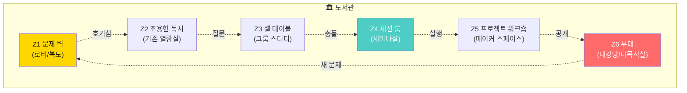

### 16.2 존별 상세

| 존 | 위치 (기존 대응) | 최소 면적 | 핵심 집기 | 소음 수준 | 용도 |
|---|---|:-:|---|---|---|
| **Z1 문제 벽** | 로비 · 복도 벽면 | 3m 벽면 | 코르크보드 · 카드 홀더 · QR 스탠드 | 통행 수준 | 문제 카드 상시 전시 · 비멤버 유인 |
| **Z2 조용한 독서** | 열람실 (기존 유지) | 기존 | 기존 책상 | 정숙 | 개인 독서 · 템플릿 작성 |
| **Z3 셀 테이블** | 그룹 스터디실 | 테이블 1개 (4인) | 화이트보드 소형 · 스티커 | 대화 허용 | 셀 토론 · 교차 코멘트 |
| **Z4 세션 룸** | 세미나실 · 프로그램실 | 30석 | 원형 좌석 · 타이머 · 마이크 | 발표 수준 | SP 세션 진행 |
| **Z5 프로젝트 워크숍** | 메이커 스페이스 · 컴퓨터실 | 10석 | 노트북 · 화이트보드 · 프로토타입 도구 | 작업 수준 | 클루랩 프로젝트 작업 |
| **Z6 무대** | 대강당 · 다목적실 | 50석 | 무대 · 프로젝터 · 음향 | 발표 수준 | 클루데이 · 문제 시장 |

### 16.3 Z1 문제 벽 — 도서관의 새 얼굴

문제 벽은 도서관에 들어서자마자 보이는 곳에 설치한다.
**비멤버가 문제 카드를 보고 호기심을 느끼는 것**이 Z1의 유일한 목적이다.

```
┌────────────────────────────────────────────────────┐
│                    Z1 문제 벽 (3m × 1.5m)           │
│                                                    │
│  ┌──────┐ ┌──────┐ ┌──────┐ ┌──────┐ ┌──────┐    │
│  │ 카드  │ │ 카드  │ │ 카드  │ │ 카드  │ │ 카드  │    │
│  │#43-01│ │#26-03│ │#33-02│ │#41-01│ │#5-04 │    │
│  │기술과 │ │번아웃│ │교육  │ │정의  │ │고독  │    │
│  │인간  │ │무기력│ │학습  │ │공정  │ │외로움│    │
│  └──────┘ └──────┘ └──────┘ └──────┘ └──────┘    │
│                                                    │
│  ┌──────┐ ┌──────┐ ┌──────┐ ┌──────┐ ┌──────┐    │
│  │ 카드  │ │ 카드  │ │ 카드  │ │ 카드  │ │ 카드  │    │
│  │...   │ │...   │ │...   │ │...   │ │...   │    │
│  └──────┘ └──────┘ └──────┘ └──────┘ └──────┘    │
│                                                    │
│  🔍 QR코드: "당신의 문제를 적어보세요"               │
│  📱 → readingclue.kr/wall/[지부코드]               │
│                                                    │
│  [이번 시즌 문제 카드 32장]  [지난 시즌 베스트 5장]    │
└────────────────────────────────────────────────────┘
```

---

## 17. 규모별 배치안 — 소·중·대 3종

### 17.1 소규모 (작은도서관 · 마을문고 · 60㎡ 이하)

| 존 | 배치 방법 |
|---|---|
| Z1 문제 벽 | 출입문 옆 벽면 1m (소형 보드) |
| Z2 독서 | 기존 열람석 (분리 불가 → 시간대 분리) |
| Z3+Z4 통합 | 테이블 2개를 원형 배치 (8명) → 세션 겸용 |
| Z5 | 없음 → 온라인 작업 |
| Z6 | 없음 → 인근 카페 또는 마을회관 대여 (클루데이) |

### 17.2 중규모 (공공도서관 · 대학도서관 분관 · 200~500㎡)

| 존 | 배치 방법 |
|---|---|
| Z1 | 로비 3m 벽면 |
| Z2 | 기존 열람실 |
| Z3 | 그룹 스터디실 2~3개 (각 4~6인) |
| Z4 | 프로그램실 1개 (30석 원형) |
| Z5 | 디지털 자료실 일부 전환 |
| Z6 | 다목적실 (행사 시 의자 배치) |

### 17.3 대규모 (중앙도서관 · 대학 본관 · 500㎡ 이상)

| 존 | 배치 방법 |
|---|---|
| Z1 | 1층 로비 전체 벽면 (문제 벽 상설) |
| Z2 | 각 층 열람실 |
| Z3 | 전용 크루 라운지 (셀 테이블 8개) |
| Z4 | 전용 세션 룸 2개 (각 30석) |
| Z5 | 메이커 스페이스 또는 창업 지원 공간 연계 |
| Z6 | 대강당 (100석+) |

---

## 18. 기물·집기·비품 표준 목록

### 18.1 Z1 문제 벽 세트

| 품목 | 수량 | 규격 | 예상 비용 |
|---|:-:|---|---|
| 코르크 게시판 | 2 | 120×90cm | 4만원 |
| 카드 홀더 (투명) | 30 | A5 | 1.5만원 |
| QR 스탠드 | 1 | 탁상형 | 0.5만원 |
| 문제 카드 인쇄용지 | 100매 | A5 220g | 1만원 |
| 반응 스티커 세트 | 5 | 🤝🔍⚔️ 각 100매 | 2.5만원 |
| **소계** | | | **9.5만원** |

### 18.2 Z4 세션 룸 세트

| 품목 | 수량 | 규격 | 예상 비용 |
|---|:-:|---|---|
| 이동식 의자 (팔걸이 없음) | 20 | 접이식 | 기존 활용 |
| 타이머 (대형 디스플레이) | 1 | 탁상형 | 2만원 |
| 화이트보드 (이동식) | 2 | 90×120cm | 6만원 |
| 마이커 + 스피커 | 1세트 | 무선 핸드 | 5만원 |
| 보드마카 세트 | 3 | 4색 | 0.9만원 |
| 전지 (모조지) | 30매 | 전지 | 1.5만원 |
| **소계** | | | **15.4만원** |

### 18.3 전체 초기 세팅 비용 (중규모 기준)

| 항목 | 비용 |
|---|---|
| Z1 문제 벽 세트 | 9.5만원 |
| Z4 세션 룸 세트 | 15.4만원 |
| 인쇄물 (템플릿·카드·루브릭) | 5만원 |
| 호스트 워크숍 교재 | 3만원 |
| **합계** | **32.9만원** |

> **30만원 이하로 시작 가능하다.**
> 기존 도서관 집기를 활용하면 Z1 세트(10만원 미만)만으로 시작한다.

---

## 19. 하이브리드 세션 기술 규격

### 19.1 최소 장비

| 장비 | 용도 | 대안 |
|---|---|---|
| 노트북 1대 + 웹캠 | 원격 참여자 연결 | 호스트 스마트폰 |
| 스피커폰 | 음성 양방향 | 블루투스 스피커 |
| 화면 공유용 TV/프로젝터 | 원격 참여자 얼굴 표시 | 노트북 화면 그대로 |
| Zoom / Google Meet | 화상 회의 | 무료 플랜 충분 |

### 19.2 하이브리드 세션 규칙

| 규칙 | 설명 |
|---|---|
| 카메라 온 | 원격 참여자 필수 |
| 30% 상한 | 전체 15명 중 원격 최대 4명 |
| 오프라인 우선 발언 | 온라인은 2순위 |
| 채팅 기록 담당 | 원격 참여자 중 1명이 채팅 기록 담당 |
| 화면에 타이머 공유 | 원격 참여자도 타임박스 인지 |

---

# PART VI — 기관별 도입

## 20. 공공도서관 도입 시나리오

### 20.1 현실 진단

| 현재 상황 | 리딩클루 접근 |
|---|---|
| 독서 프로그램 = 1회성 강연 + 작가 초청 | **12주 시즌**으로 연속성 부여 |
| 프로그램 참가자 = 고정 10~20명 | 문제 벽으로 **비참가자를 유인** |
| 사서 = 프로그램 기획 + 강사 섭외 | 사서 = **커뮤니티 코디네이터** |
| 성과 = 프로그램 횟수 · 참여자 수 | 성과 = **문제 카드 수 · 정의서 수 · 프로젝트 수** |

### 20.2 도입 3단계

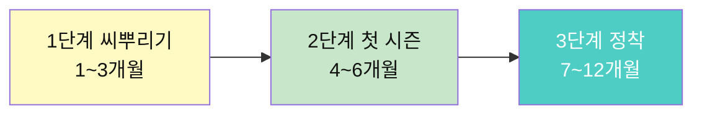

#### 1단계 씨뿌리기 (1~3개월)

| 주 | 활동 | 담당 |
|:-:|---|---|
| 1~2 | Z1 문제 벽 설치 + QR 코드 | 사서 |
| 3~4 | 사서 + 관심 시민 대상 호스트 워크숍(8h) | 외부 강사 or 온라인 |
| 5~8 | "체험 SP-01" 월 1회 운영 (90분, 비등록) | 수료 호스트 |
| 9~12 | CIP 진단 이벤트 (도서관 주간 등 연계) | 사서 |

#### 2단계 첫 시즌 (4~6개월)

| 활동 | 상세 |
|---|---|
| 크루 모집 | 문제 벽 + 체험 참가자 + 기존 독서모임 전환 |
| 크루 1~2개 개설 | 관심사 상위 2개 코드 |
| 시즌 12주 운영 | 토요일 오전 10시 (90분) |
| 클루데이 | 소규모 (도서관 내 세미나실) |

#### 3단계 정착 (7~12개월)

| 활동 | 상세 |
|---|---|
| 크루 3~5개 확대 | 시즌 2~3 연속 운영 |
| 호스트 3~5명 확보 | 멤버 → 호스트 승급 |
| 지부 공식 등록 | 연합 가입 |
| 기관 예산 편입 | "커뮤니티 프로그램 예산"으로 전환 |

### 20.3 사서의 새 역할 — 커뮤니티 코디네이터

| 기존 업무 | 리딩클루 후 추가 업무 | 소요 시간/주 |
|---|---|---|
| 자료 관리 | 문제 벽 관리 · 카드 교체 | 1시간 |
| 프로그램 기획 | 시즌 캘린더 관리 | 2시간 |
| 강사 섭외 | **호스트 관리 · 신규 호스트 발굴** | 1시간 |
| 통계 보고 | **문제 아카이브 관리 · 시즌 리포트** | 2시간 |
| — | 세션 참관 (선택) | 1.5시간 |
| **합계** | | **7.5시간/주** |

---

## 21. 대학도서관 도입 시나리오

### 21.1 대학의 강점과 제약

| 강점 | 제약 |
|---|---|
| 학기 리듬과 시즌 12주가 일치 | 학과별 칸막이 → 교차 관심사 크루 구성 어려움 |
| 교양 교과 연계 가능 | 학점 인정 절차 복잡 |
| 교수학습센터 인력 활용 | 방학 기간 크루 유지 어려움 |
| 동기 높은 참여자 | 취업 준비로 인한 이탈 |

### 21.2 연계 모형 3종

| 모형 | 설명 | 학점 | 난이도 |
|---|---|:-:|---|
| **A 비교과 학습 공동체** | 비교과 프로그램으로 운영, 마일리지 지급 | ❌ | 낮음 |
| **B 교양 교과 연계** | "비판적 사고" 등 교양 수업의 실습 트랙 | 1~2 | 중간 |
| **C 캡스톤 연계** | 클루랩 프로젝트 → 캡스톤 디자인 산출물 | 3 | 높음 |

### 21.3 모형 A — 비교과 학습 공동체 상세

| 항목 | 내용 |
|---|---|
| 운영 주체 | 도서관 + 교수학습센터 |
| 모집 | 학기 초 2주, CIP 진단 이벤트 병행 |
| 크루 | 2~4개 (학과 혼합 권장) |
| 인센티브 | 활동 마일리지 · 우수 팀 장학금 · 포트폴리오 인증 |
| 호스트 | 대학원생 또는 경험 학부생 (호스트 워크숍 수료) |
| 공간 | 도서관 그룹 스터디실 + 세미나실 |
| 클루데이 | 학기 말 도서관 행사 (타 학습 공동체와 합동) |

### 21.4 미네르바식 원격 세미나 + 도서관 오프라인 결합

대학은 미네르바의 원격 세미나를 가장 직접적으로 이식할 수 있는 환경이다.

| 주 | 온라인 (화요일 저녁 · 60분) | 오프라인 (목요일 오후 · 90분) |
|:-:|---|---|
| 홀수 | **미네르바형 세미나**: 셀 4명, 전원 발언 필수, 소크라테스 질문 운용 | 세션 프로토콜 (SP-홀수) |
| 짝수 | 독서 · 데이터 수집 · 온라인 코멘트 (비동기) | 세션 프로토콜 (SP-짝수) |

> **핵심**: 온라인 세미나가 "강의 대체"가 아니라 **"사전 충돌"** 역할을 한다.
> 오프라인 세션에 오면 이미 논쟁의 뼈대가 잡혀 있다.

---

## 22. 고등학교 도서관 도입 시나리오

### 22.1 현실 제약과 기회

| 제약 | 기회 |
|---|---|
| 점심시간 45분 · 방과후 60~90분 | 동아리 · 자율활동 슬롯 확보 가능 |
| 입시 압박 → "쓸모 있어야" | 학생부 기재 · 탐구 보고서 연계 |
| 공간 협소 (도서관 30석 내외) | 사서교사가 퍼실 가능 |
| 학생 자율 제한 | 교사 주도 → 점진적 이관 |

### 22.2 동아리 모델 (주 1회 · 8주 압축)

| 주 | 세션 | 시간 | 학생부 기재 키워드 |
|:-:|---|:-:|---|
| 1 | SP-01+02 합산 | 100분 | 관심사 탐색 · 문제 발견 |
| 2 | SP-03 | 50분 | 비판적 사고 · 전제 분석 |
| 3 | SP-04 | 50분 | 근거 수집 · 데이터 리터러시 |
| 4 | SP-05+06 합산 | 100분 | 다각적 독서 · 이해관계자 분석 |
| 5 | SP-07 | 100분 | 논증 · 반증 · 토론 |
| 6 | SP-08 | 50분 | 피어 리뷰 · 자기 점검 |
| 7 | SP-09+10 합산 | 90분 | 프로젝트 기획 · 협업 |
| 8 | SP-12 미니 클루데이 | 120분 | 발표 · 성찰 · 인계 |

### 22.3 사서교사의 역할

| 기존 | 리딩클루 후 |
|---|---|
| 독서교육 수업 (연 10회 이하) | **시즌 호스트** (주 1회, 연 2시즌) |
| 권장 도서 목록 | **관심사 50 기반 서가 큐레이션** |
| 학생 독서 기록 관리 | **문제 아카이브 관리** |
| 학교 도서관 통계 | **시즌 리포트** (학교 성과에 반영) |

---

## 23. 기관 온보딩 90일 플레이북

### 23.1 총괄 타임라인

```mermaid
gantt
    title 기관 온보딩 90일
    dateFormat  X
    axisFormat  %s일

    section 준비 (D1~D30)
    MOU 체결 · 담당자 지정       :a1, 1, 7
    호스트 워크숍 (8시간)         :a2, 8, 2
    Z1 문제 벽 설치              :a3, 10, 5
    온라인 시스템 기관 계정 세팅    :a4, 15, 5
    CIP 진단 이벤트 기획          :a5, 20, 10

    section 파일럿 (D31~D60)
    체험 SP-01 (2회)              :b1, 31, 14
    CIP 진단 이벤트 실시           :b2, 45, 7
    크루 모집 · 매칭               :b3, 52, 8

    section 첫 시즌 (D61~D90)
    시즌 1주차 SP-01               :c1, 61, 7
    시즌 2주차 SP-02               :c2, 68, 7
    시즌 3주차 SP-03               :c3, 75, 7
    중간 점검 · 호스트 피드백        :c4, 82, 8
```

### 23.2 체크리스트 (기관 담당자용)

| 단계 | # | 항목 | 완료 |
|---|:-:|---|:-:|
| 준비 | 1 | MOU/협약 체결 | □ |
| | 2 | 내부 담당자 1명 지정 | □ |
| | 3 | 호스트 후보 2~3명 확보 | □ |
| | 4 | 호스트 워크숍 일정 확정 | □ |
| | 5 | Z1 문제 벽 설치 완료 | □ |
| | 6 | 온라인 기관 계정 생성 | □ |
| | 7 | CIP 진단 이벤트 홍보물 제작 | □ |
| 파일럿 | 8 | 체험 SP-01 1회 완료 | □ |
| | 9 | 체험 SP-01 2회 완료 | □ |
| | 10 | CIP 진단 이벤트 실시 (20명+) | □ |
| | 11 | 크루 1개 이상 결성 (6명+) | □ |
| 첫 시즌 | 12 | 시즌 1주차 세션 완료 | □ |
| | 13 | 중간 점검 (4주차) | □ |
| | 14 | 첫 시즌 12주 완료 | □ |
| | 15 | 클루데이 개최 | □ |
| | 16 | 시즌 리포트 발행 | □ |

---

# PART VII — 제품 설계

## 24. 온라인 시스템 확장 — 신규 화면 명세 22종

> 7단계 문서의 40개 URL에 **커뮤니티·지부·세션** 관련 22개 화면을 추가한다.

### 24.1 신규 URL 라우팅표

| # | URL | 화면 | 권한 |
|:-:|---|---|---|
| 41 | `/community` | 커뮤니티 홈 (지부 목록) | 전체 |
| 42 | `/community/crews` | 크루 탐색 (관심사별 필터) | 전체 |
| 43 | `/community/crews/:id` | 크루 상세 (멤버·시즌·세션 기록) | 멤버·공개 |
| 44 | `/community/crews/:id/join` | 크루 가입 신청 | 로그인 |
| 45 | `/community/crews/new` | 크루 개설 (호스트) | 호스트 |
| 46 | `/community/chapters` | 지부 목록 | 전체 |
| 47 | `/community/chapters/:id` | 지부 홈 (크루 목록·클루데이·아카이브) | 전체 |
| 48 | `/community/chapters/:id/dashboard` | 지부 대시보드 | 지부장·사서 |
| 49 | `/community/chapters/:id/archive` | 지역 문제 아카이브 | 전체 |
| 50 | `/community/chapters/:id/wall` | 디지털 문제 벽 | 전체 |
| 51 | `/community/federation` | 연합 홈 | 전체 |
| 52 | `/sessions` | 세션 캘린더 (내 크루) | 멤버 |
| 53 | `/sessions/:id` | 세션 상세 (프로토콜·사전 준비·출석) | 멤버 |
| 54 | `/sessions/:id/pre` | Pre-Session Pack | 멤버 |
| 55 | `/sessions/:id/record` | 세션 기록 (호스트 체크인) | 호스트 |
| 56 | `/sessions/:id/reactions` | 세션 반응 모아보기 | 멤버 |
| 57 | `/host` | 호스트 대시보드 | 호스트 |
| 58 | `/host/script/:sp` | 퍼실리테이터 스크립트 | 호스트 |
| 59 | `/host/checklist` | 발언 체크리스트 | 호스트 |
| 60 | `/clueday` | 클루데이 관리 | 지부장 |
| 61 | `/clueday/:id` | 클루데이 상세 (프로그램·발표·투표) | 전체 |
| 62 | `/onboarding/org` | 기관 온보딩 90일 체크리스트 | 기관 담당자 |

### 24.2 핵심 화면 상세 5종

#### P-42 크루 탐색 `/community/crews`

| 항목 | 내용 |
|---|---|
| **진입** | 네비게이션 "커뮤니티" → 크루 탐색 |
| **필터** | 관심사 코드 · 지부 · 모집 중 여부 |
| **카드** | 크루 이름 · 관심사 · 정원(현재/최대) · 시즌 · 호스트 이름 |
| **CTA** | "가입 신청" (로그인 필요) |
| **빈 상태** | "아직 이 관심사에 크루가 없습니다. 직접 만들어 보세요 →" |

#### P-50 디지털 문제 벽 `/community/chapters/:id/wall`

| 항목 | 내용 |
|---|---|
| **진입** | Z1 QR 코드 · 지부 홈 · 공유 링크 |
| **표시** | 문제 카드 격자 (물리 벽의 디지털 트윈) |
| **정렬** | 최신순 · 반응 많은 순 · 관심사별 |
| **반응** | 🤝🔍⚔️ (비로그인 시 🤝만 가능, 20자 코멘트 필수) |
| **"나도 적어보기"** | → `/path/cards/new` 연결 |

#### P-58 퍼실리테이터 스크립트 `/host/script/:sp`

| 항목 | 내용 |
|---|---|
| **진입** | 호스트 대시보드 → 다음 세션 → "스크립트 열기" |
| **표시** | §12 대사집 전문 + 타이머 자동 연동 |
| **기능** | 대사 하이라이트 (읽고 있는 부분) · 타이머 시작/종료 버튼 · 발언 체크리스트 팝업 |
| **오프라인 모드** | PWA로 사전 다운로드 → 인터넷 없이 사용 가능 |

---

## 25. 데이터 모델 확장과 API

### 25.1 신규 엔티티

```
Community (커뮤니티 전체)
  └── Federation (연합)
       └── Chapter (지부)
            ├── Crew (크루)
            │    ├── Cell (셀)
            │    ├── Season (시즌)
            │    └── CrewMember (멤버십)
            ├── Session (세션)
            │    ├── SessionAttendance (출석)
            │    ├── SessionReaction (반응)
            │    └── PreSessionPack (사전 준비)
            ├── ClueDay (클루데이)
            └── ProblemWall (문제 벽)
```

### 25.2 핵심 테이블

| 테이블 | PK | 주요 컬럼 | FK |
|---|---|---|---|
| `chapters` | `chapter_id` | `name`, `library_name`, `address`, `status`, `federation_id` | `federation_id` |
| `crews` | `crew_id` | `interest_code`, `chapter_id`, `season_no`, `host_user_id`, `capacity`, `status` | `chapter_id`, `host_user_id` |
| `crew_members` | `crew_id`, `user_id` | `role`, `joined_at`, `track` | — |
| `cells` | `cell_id` | `crew_id`, `session_id`, `members[]` | `crew_id`, `session_id` |
| `seasons` | `season_id` | `crew_id`, `start_date`, `end_date`, `status` | `crew_id` |
| `sessions` | `session_id` | `crew_id`, `season_id`, `protocol_code` (SP-01~12), `scheduled_at`, `location`, `status` | `crew_id`, `season_id` |
| `session_attendance` | `session_id`, `user_id` | `mode` (offline/online), `spoke` (bool), `reaction_count` | — |
| `session_reactions` | `reaction_id` | `session_id`, `card_id`, `reactor_user_id`, `type` (🤝/🔍/⚔️), `comment` | — |
| `pre_session_packs` | `pack_id` | `session_id`, `user_id`, `submitted_at`, `content_json` | — |
| `cluedays` | `clueday_id` | `chapter_id`, `season_id`, `date`, `venue`, `status` | — |
| `problem_walls` | `wall_id` | `chapter_id`, `cards[]`, `updated_at` | `chapter_id` |

### 25.3 주요 API

| Method | Endpoint | 설명 |
|---|---|---|
| `GET` | `/api/chapters` | 지부 목록 |
| `GET` | `/api/chapters/:id/crews` | 지부 내 크루 목록 |
| `POST` | `/api/crews` | 크루 개설 (호스트) |
| `POST` | `/api/crews/:id/join` | 크루 가입 신청 |
| `GET` | `/api/crews/:id/sessions` | 크루 세션 일정 |
| `POST` | `/api/sessions/:id/checkin` | 세션 출석 체크 |
| `POST` | `/api/sessions/:id/reactions` | 세션 반응 등록 |
| `GET` | `/api/sessions/:id/pre` | Pre-Session Pack 조회 |
| `POST` | `/api/sessions/:id/pre` | Pre-Session Pack 제출 |
| `GET` | `/api/chapters/:id/wall` | 디지털 문제 벽 |
| `GET` | `/api/chapters/:id/archive` | 지역 문제 아카이브 |
| `GET` | `/api/host/script/:sp` | 퍼실리테이터 스크립트 |

---

## 26. 오프라인-온라인 동기화 설계

### 26.1 동기화 원칙

```
원칙 1. 오프라인에서 일어난 모든 것은 24시간 내 온라인에 기록된다.
원칙 2. 온라인에서 준비한 모든 것은 세션 시작 전 인쇄 가능하다.
원칙 3. 인터넷이 끊겨도 세션은 진행된다. (오프라인 퍼스트)
```

### 26.2 동기화 흐름

```mermaid
sequenceDiagram
    participant OFF as 오프라인 세션
    participant HOST as 호스트 앱 (PWA)
    participant SRV as 서버
    participant MEM as 멤버 앱

    Note over MEM,SRV: [세션 전] Pre-Session Pack 제출
    MEM->>SRV: Pre-Session Pack 저장
    SRV->>HOST: Pack 목록 동기화

    Note over OFF,HOST: [세션 중]
    OFF->>HOST: 출석 체크 (오프라인 저장)
    OFF->>HOST: 반응 스티커 → 사진 촬영
    OFF->>HOST: 타이머 기록

    Note over HOST,SRV: [세션 후 24시간 내]
    HOST->>SRV: 출석 · 반응 · 사진 업로드
    SRV->>MEM: "세션 기록이 올라왔습니다" 알림
    MEM->>SRV: 문제 카드 최종본 저장
```

### 26.3 오프라인 퍼스트 — PWA 설계

| 기능 | 온라인 | 오프라인 |
|---|---|---|
| 퍼실리테이터 스크립트 | 실시간 로드 | **캐시 (사전 다운로드)** |
| 타이머 | 서버 동기화 | **로컬 타이머** |
| 출석 체크 | 즉시 저장 | **로컬 저장 → 연결 시 동기화** |
| 반응 기록 | 즉시 저장 | **사진 → 로컬 → 연결 시 OCR + 저장** |
| 문제 벽 사진 | 즉시 업로드 | **로컬 저장 → 연결 시 업로드** |

---

## 27. 신규 템플릿 C-01 ~ C-16

> C(Community) 템플릿은 7단계의 T(Template)와 구별된다.
> T는 개인이 채우고, **C는 세션에서 집단이 채운다.**

### 27.1 템플릿 색인

| 코드 | 이름 | 사용 세션 | 작성 주체 | 시간 |
|---|---|---|---|:-:|
| C-01 | 체크인 카드 | 모든 SP | 개인 | 1분 |
| C-02 | 라이트닝 발표 메모 | SP-01 | 개인 | 3분 |
| C-03 | 숨은 전제 카드 | SP-03 | 셀 | 15분 |
| C-04 | 근거 타당성 체크리스트 | SP-04 | 셀 | 10분 |
| C-05 | 교차 코멘트 카드 | SP-05 | 셀 | 10분 |
| C-06 | 교차 지도 (전지용) | SP-02 | 셀 | 20분 |
| C-07 | 반증 기록지 | SP-07 | 쌍 | 10분 |
| C-08 | "그렇다면" 카드 | SP-06 | 개인 | 15분 |
| C-09 | 문제 시장 포스터 | SP-09 | 개인 | 20분 |
| C-10 | 팀 빌딩 투표지 | SP-09 | 전체 | 5분 |
| C-11 | 주간 체크인 보고판 | SP-10 | 팀 | 10분 |
| C-12 | 클루데이 프로그램 시트 | SP-12 | 지부 | — |
| C-13 | 시즌 최고 질문 투표지 | SP-12 | 전체 | 5분 |
| C-14 | 호스트 발언 체크리스트 | 모든 SP | 호스트 | — |
| C-15 | 셀 배정표 | 모든 SP | 호스트 | — |
| C-16 | 세션 종료 보고서 | 모든 SP | 호스트 | 10분 |

---

## 28. 커뮤니티 루브릭 CR-01 ~ CR-06

| 코드 | 이름 | 평가 대상 | 점수 | 평가자 |
|---|---|---|:-:|---|
| CR-01 | 세션 참여도 | 멤버 1인 | 10점 | 셀 리더 |
| CR-02 | 호스트 퍼실리테이션 | 호스트 1인 | 20점 | 멤버 (익명) |
| CR-03 | 크루 건강도 | 크루 1개 | 15점 | 지부장 |
| CR-04 | 셀 협업 | 셀 1개 | 10점 | 셀 내 상호 |
| CR-05 | 클루데이 발표 | 팀 1개 | 20점 | 외부 참석자 |
| CR-06 | 시즌 자기 점검 | 멤버 1인 | — | 본인 |

### CR-01 세션 참여도 루브릭 (10점)

| 항목 | A (3) | B (2) | C (1) | D (0) |
|---|---|---|---|---|
| 발언 | 2회 이상, 근거 포함 | 1회, 근거 포함 | 1회, 감상 수준 | 발언 없음 |
| 반응 | ⚔️ 포함, 20자+ | 🔍 포함, 20자+ | 🤝만 | 반응 없음 |
| 경청 | 타인 발언 인용하며 반응 | 고개 끄덕·메모 | 수동 청취 | 핸드폰 |
| 사전 준비 | Pack 전부 완료 | Pack 절반 | Pack 미제출, 현장 작성 | 미준비 |

---

# PART VIII — 사람과 사례

## 29. 커뮤니티 페르소나 10인

### 🏛 CP1. 정혜진 · 공공도서관 사서 · **핵심 페르소나**

| 항목 | 내용 |
|---|---|
| 나이 | 38세 |
| 경력 | 공공도서관 사서 12년차 |
| 고민 | "프로그램 참여자가 매번 같은 20명. 새 사람이 안 온다." |
| 바라는 것 | 도서관이 "책 빌리는 곳"을 넘어 지역 커뮤니티 거점이 되는 것 |
| 리딩클루 진입 | Z1 문제 벽 설치 + 호스트 워크숍 수료 |
| 핵심 시나리오 | §30-S1 "사서가 첫 시즌을 여는 날" |
| 걱정 | "기존 업무에 더해 시간을 낼 수 있을까" |
| 동기 부여 | 문제 아카이브가 도서관 성과로 인정되는 구조 |

### 🎓 CP2. 김도윤 · 대학생 3학년 · 호스트 후보

| 항목 | 내용 |
|---|---|
| 나이 | 22세 |
| 전공 | 사회학 |
| 고민 | "학교 토론 동아리가 매번 같은 패턴. 갇힌 느낌" |
| 바라는 것 | 학과를 넘어 다른 관심사를 가진 사람과 부딪히고 싶다 |
| 리딩클루 진입 | CIP 진단 → #41 정의와 공정 크루 가입 → 셀 리더 → 호스트 |
| 핵심 시나리오 | §30-S3 "대학생 호스트의 첫 퍼실리테이션" |

### 📚 CP3. 이수현 · 고교 사서교사

| 항목 | 내용 |
|---|---|
| 나이 | 34세 |
| 상황 | 학교 도서관 1인 운영, 주 2시간 독서 수업 담당 |
| 고민 | "독서 기록장 = 줄거리 요약. 사고력이 안 붙는다" |
| 바라는 것 | 학생들이 책에서 **질문**을 가져가는 것 |
| 리딩클루 진입 | 동아리 개설 → 8주 압축판 |
| 핵심 시나리오 | §30-S5 "점심시간 45분 SP-01" |

### 👥 CP4. 박민서 · 직장인 독서모임 운영자

| 항목 | 내용 |
|---|---|
| 나이 | 31세 |
| 상황 | 10명 독서모임 2년차. 매달 1권 읽고 감상 공유 |
| 고민 | "매번 '좋았다/별로였다'로 끝남. 더 깊이 가고 싶다" |
| 바라는 것 | 독서모임이 프로젝트로 이어지는 경험 |
| 리딩클루 진입 | 기존 독서모임 → 크루 전환 + 호스트 워크숍 |
| 핵심 시나리오 | §30-S6 "독서모임을 크루로 전환하는 날" |

### 🧑‍🏫 CP5. 최은지 · 중등 국어교사

| 항목 | 내용 |
|---|---|
| 나이 | 42세 |
| 상황 | 7단계 페르소나 P4(은정 교사)의 동료 |
| 고민 | "수업 시간에 토론을 하면 4~5명만 말한다" |
| 바라는 것 | 셀 구조로 전원이 발언하는 시스템 |
| 리딩클루 진입 | 교내 연수 → 방과후 크루 개설 |

### 🌐 CP6. 장태호 · 퇴직 후 시민 활동가

| 항목 | 내용 |
|---|---|
| 나이 | 62세 |
| 상황 | 퇴직 후 지역 봉사, 마을도서관 운영위원 |
| 고민 | "젊은 사람들과 교류하고 싶은데 접점이 없다" |
| 바라는 것 | 세대를 넘어 같은 관심사로 만나는 공간 |
| 리딩클루 진입 | 문제 벽 → CIP → #31 건강과 노화 크루 |

### 🎒 CP7. 윤서아 · 고2 · 크루 멤버

| 항목 | 내용 |
|---|---|
| 나이 | 17세 |
| 상황 | 입시 스트레스, 진로 미정 |
| 고민 | "뭘 좋아하는지 모르겠다. 시간 낭비가 무섭다" |
| 바라는 것 | 자기 관심사를 발견하고 학생부에 연결 |
| 리딩클루 진입 | CIP → #26 번아웃 크루 → 프로젝트 트랙 |

### 🏫 CP8. 한진우 · 대학 교수학습센터 팀장

| 항목 | 내용 |
|---|---|
| 나이 | 45세 |
| 상황 | 비교과 프로그램 기획, 연 예산 3천만원 |
| 고민 | "학습 공동체 지원하면 보고서만 쌓인다. 지속이 안 된다" |
| 바라는 것 | 학생 자율 커뮤니티가 학기 넘어 이어지는 구조 |
| 리딩클루 진입 | 모형 A 비교과 학습 공동체 → 3개 크루 |

### 📖 CP9. 오하린 · 초등 5학년 학부모

| 항목 | 내용 |
|---|---|
| 나이 | 39세 |
| 상황 | 아이 독서량은 많으나 "읽기만 하고 생각 안 함" |
| 바라는 것 | 아이와 함께 참여할 수 있는 가족 크루 |
| 리딩클루 진입 | 공공도서관 가족 체험 SP-01 → 가족 크루 |

### 🔗 CP10. 김준혁 · 지부장 · **핵심 페르소나**

| 항목 | 내용 |
|---|---|
| 나이 | 29세 |
| 경력 | 커뮤니티 매니저 3년 → 리딩클루 호스트 2시즌 → 지부장 |
| 고민 | "크루가 4개로 늘었는데 호스트가 부족하다" |
| 바라는 것 | 프로토콜만으로 호스트 양성 가능한 시스템 |
| 핵심 시나리오 | §30-S10 "호스트 부족 위기 대응" |

---

## 30. 운영 시나리오 14종

### S1. 사서가 첫 시즌을 여는 날 (CP1 정혜진)

```
Day 1    Z1 문제 벽 설치. "당신의 문제를 적어보세요" QR 코드 부착.
Day 7    문제 벽에 카드 8장 쌓임. 사서 SNS에 공유.
Day 14   호스트 워크숍 수료 (8시간, 온라인).
Day 21   체험 SP-01 진행 (참석자 11명).
Day 28   체험 SP-01 2회차 (참석자 9명, 1회차 참석자 6명 재방문).
Day 35   크루 모집 공고. CIP 진단 이벤트 (22명 참여).
Day 42   크루 1개 결성 (#43 기술과 인간, 9명).
Day 49   시즌 1주차 SP-01. 문제 카드 9장 게시.
...
Day 133  SP-12 클루데이 (참석자 35명, 외부 15명 포함).
         시즌 리포트: 문제 카드 47장, 정의서 6건, 프로젝트 2건.
Day 140  시즌 리포트를 관장에게 보고. "이거 다음 시즌도 할 수 있을까요?"
```

### S2. 대학 첫 학기 비교과 학습 공동체 (CP2 도윤 + CP8 진우)

```
개강 전  교수학습센터에서 CIP 진단 이벤트 (신입생 OT 연계, 80명).
1주      크루 3개 개설 (관심사 상위 3개). 각 크루 호스트 배정.
2~8주    주 1회 SP-01~SP-08. 화요일 저녁 (비교과 마일리지).
9~12주   프로젝트 트랙 진입 (2개 크루에서 4팀).
13주     클루데이 (도서관 행사 겸용, 참석 120명).
학기 말  활동 마일리지 지급 + 우수 팀 장학금 50만원 × 2팀.
         → 다음 학기 호스트 후보 5명 확보.
```

### S3. 대학생 호스트의 첫 퍼실리테이션 (CP2 도윤)

```
D-7   호스트 워크숍 수료. "스크립트 읽기만 하면 된다"에 안도.
D-3   Pre-Session Pack 확인. 9명 중 7명 제출 완료.
D-1   스크립트 3번 낭독 연습. 타이머 앱 세팅.
D-Day SP-01 진행. 시작 5분 전 긴장.
      체크인: 스크립트 읽기. 자연스러움 70%.
      라이트닝: 3분 벨 2번 누름 실수 → 웃음으로 넘김.
      셀 토론: 셀C에서 침묵 발생.
      → 갈등 대응 대사 읽기: "30초 더 드릴게요."
      → 30초 후 한 명이 말하기 시작.
      수렴: 예상보다 활발. ⚔️ 스티커가 가장 많은 카드에 박수.
      체크아웃: "약속은 작을수록 지킵니다" 대사에 웃음.
D+1   세션 기록 업로드. 지부장에게 피드백 요청.
      지부장: "침묵 대응 잘했어요. 다음엔 셀 배정을 미리 알려주세요."
```

### S4. 반증 라운드에서 정의서가 뒤집히는 날 (CP7 서아)

```
SP-07 7주차.
서아의 정의서: "고교생 번아웃은 시간 부족 때문이다"
반증 파트너(다른 크루, 대학생):
  "시간이 부족한 게 아니라 선택권이 없는 것 아닌가?
   방학에도 번아웃인 학생은 어떻게 설명하나요?"
서아: (충격) 10초 침묵.
호스트: "기록만 하세요. 수용은 나중에 해도 됩니다."
서아: 기록 후 한 주 동안 재고.
SP-08: 정의서 수정 → "고교생 번아웃은 선택 부재에서 온다"
      R-02 루브릭 32/40점 → 승급.
시즌 회고: "가장 아팠지만 유익했던 반박" 1위 선정.
```

### S5. 점심시간 45분 SP-01 (CP3 수현)

```
12:10  학생 8명 도서관 집합. 도시락 허용.
12:12  체크인 2분 (8명 × 15초).
12:14  라이트닝 2분 × 8명 = 16분 (12:30까지).
12:30  셀 2개로 나눠 교차 반응 10분.
12:40  전체 수렴 3분.
12:43  체크아웃 2분.
12:45  종료. 카드는 도서관 게시판에 부착.
       → 방과후에 온라인으로 최종본 저장.
```

### S6. 독서모임을 크루로 전환하는 날 (CP4 민서)

```
기존 독서모임: 월 1회, 10명, 2년차.
전환 결정: "우리 모임을 리딩클루 크루로 바꿔보자" 제안 → 7명 동의.
1주차  CIP 진단 → 관심사 Top3 공유 → #43 기술과 인간 다수.
       크루 등록: #43기술인간-판교-S1.
2주차  SP-01. 기존 독서모임과 다른 점:
       "감상이 아니라 문제를 말해야 한다" → 처음엔 어색.
       → 3번째 발표자부터 익숙해짐.
4주차  "예전 독서모임 때보다 깊어졌다" 피드백 5명.
8주차  정의서 4건 → 프로젝트 2건 시작.
       독서모임에서 한 번도 안 나온 일.
12주차 미니 클루데이. 가족 초대.
```

### S7. 지부 간 이어달리기 (서초 → 강남 → 분당)

```
서초 지부 시즌 3 종료.
남은 질문 인계서 3건 중 1건:
  "#33 교육과 학습: 대안학교 졸업생의 진로 추적이 왜 없는가?"
강남 지부 시즌 4에서 이 질문 이어받기 신청.
  → 강남 크루에서 정의서 작성 + 대안학교 졸업생 인터뷰 추가.
분당 지부에서 반증 파트너 제공 (원격 SP-07 참여).
연합 클루데이에서 3개 지부 합동 발표.
```

### S8. 문제 벽이 비멤버를 데려오는 날

```
공공도서관 로비 Z1 문제 벽.
카드 32장 게시 중.
비이용자 A(50대 남성):
  → "#31 건강과 노화" 카드를 3분간 읽음.
  → QR 코드 스캔 → CIP 진단 → #31 Top1.
  → 크루 가입 → 이 도서관 첫 방문.
사서 정혜진: "문제 벽 설치 후 신규 이용자 등록이 월 5명 → 12명으로 늘었다."
```

### S9. 기관 간 연합 클루데이 (3개 지부, 200명)

```
장소: 시민홀 대강당.
프로그램:
  0:00~0:15  연합 대표 개회 + 3개 지부 시즌 요약.
  0:15~1:30  발표 8팀 (각 8분 + 4분 질의).
  1:30~1:45  휴식.
  1:45~2:30  문제 벽 대형 전시 (3개 지부 카드 120장).
  2:30~3:00  "올해의 질문" 투표 + 시상.
  3:00~3:30  네트워킹 (크루 간 교차 명함 교환).
  3:30~4:00  폐회 + 다음 시즌 예고.
참석자 앙케트: "가장 인상 깊었던 것? → 문제 벽(42%), 발표(35%), 네트워킹(23%)"
```

### S10. 호스트 부족 위기 대응 (CP10 준혁)

```
상황: 지부 크루 4개, 호스트 3명 (1명 개인 사정 이탈).
문제: 크루 1개 호스트 공백.
대응 1: 멤버 중 셀 리더 경험 2명에게 코-호스트 제안.
대응 2: 지부장(준혁)이 2개 크루 겸임 (4주간).
대응 3: 긴급 호스트 워크숍 반일(4시간) 개설 → 2명 수료.
결과: 3주 만에 정상화. 교훈 → "멤버 → 셀 리더 파이프라인을 상시 운영해야."
```

### S11. 초등 가족 크루 (CP9 하린)

```
크루: #33교육학습-은평-S2 (가족 크루, 6가족 12명)
특징: 학부모 + 초등 3~5학년 자녀 함께 참여.
SP-01: 부모-자녀 페어로 문제 카드 1장 공동 작성.
       자녀가 그림, 부모가 글.
SP-07: 반증은 다른 가족이 담당. "반박"을 "다르게 생각해 봤어요"로 순화.
클루데이: 가족 포스터 발표. 최고 질문상은 초등 4학년이 수상.
```

### S12. 사서가 시즌 리포트를 관장에게 보고하는 날

```
시즌 리포트 요약:
  · 크루 2개 · 멤버 22명 · 세션 24회
  · 문제 카드 87장 · 정의서 12건 · 프로젝트 4건 · 실패 기록 9건
  · 클루데이 참석 48명 (외부 18명)
  · 신규 도서관 이용자 등록 +23명 (시즌 중)
  · 문제 벽 QR 스캔 312회

관장: "이 숫자를 시·도 교육청 보고에 쓸 수 있나?"
사서: "네. 기존 '프로그램 참가자 수' 외에 '문제 카드 수·프로젝트 수'를 추가 지표로 제안합니다."
```

### S13. 크루 해산과 재결성

```
시즌 3 종료. 크루 #26번아웃-서초-S3 (12명).
시즌 4 잔류 의향 조사: 5명만 잔류 → 정족수 미달(6명).
선택지:
  A) 유사 관심사 크루 #21감정조절-서초-S4에 합류 (3명 선택)
  B) 신규 관심사로 재결성 (2명 → 다른 크루 가입)
결과: 크루 자연 해산. 문제 아카이브는 지부에 영구 보존.
교훈: "해산은 실패가 아니다. 관심사가 진화한 것이다."
```

### S14. 원격 참여자의 경험

```
멤버 김서준 (부산 거주, 서초 지부 크루 온라인 참여).
SP-01: Zoom으로 참여. 라이트닝 발표 3분 정상 진행.
       셀 토론: 오프라인 셀에 Zoom으로 합류. 화면 위치 어색.
       → 호스트가 노트북을 셀 테이블 중앙에 배치.
       → "화면 속 얼굴이 대화에 참여한다"는 느낌 확보.
SP-07: 반증 라운드. 원격이라 반박의 강도가 약해짐.
       → 호스트가 "채팅에 반박 요점을 미리 적어 달라" 요청.
       → 채팅 → 음성 순서로 반박 → 효과적.
만족도: "70%. 오프라인이 더 좋지만, 없으면 참여 자체를 못 하니까."
```

---

# PART IX — 지속 가능성

## 31. 거버넌스와 커뮤니티 헌장

### 31.1 커뮤니티 헌장 초안

```
리딩클루 커뮤니티 헌장

제1조 (목적)
이 커뮤니티는 같은 관심사를 가진 사람들이 책을 기반으로
문제를 제기하고, 반증하고, 함께 프로젝트를 밀고 가는 데 목적을 둔다.

제2조 (원칙)
① 답을 주지 않는다. 빈칸을 준다.
② 혼자 읽고, 다르게 읽은 사람과 만난다.
③ 문제만 찾아도 완주다.
④ 실패 기록은 성공보다 가치 있다.
⑤ 좋아요가 없다. 반응은 말로 한다.

제3조 (멤버십)
① 누구나 CIP 진단을 완료하면 크루에 가입할 수 있다.
② 멤버는 세션에 참여하고 반응을 남길 의무가 있다.
③ 4주 이상 무단 미참석 시 대기 멤버로 전환된다.

제4조 (안전)
① 인격 공격은 어떤 상황에서도 허용되지 않는다.
② 모더레이터는 갈등 발생 시 즉시 개입한다.
③ 신고는 익명으로 가능하며, 24시간 내 처리한다.

제5조 (지적 재산)
① 문제 카드와 정의서의 저작권은 작성자에게 있다.
② 공개 아카이브에 게시된 산출물은 CC BY-NC-SA 4.0을 따른다.
③ 인용 시 원작자 표시를 필수로 한다.

제6조 (개정)
이 헌장은 연합 총회에서 2/3 이상 찬성으로 개정한다.
```

---

## 32. 안전·갈등·모더레이션 프로토콜

### 32.1 3단계 에스컬레이션

| 단계 | 상황 | 대응자 | 행동 |
|---|---|---|---|
| 1단계 | 의견 충돌 · 불쾌감 | **호스트** | 갈등 대응 대사 읽기 (§12.2) → 1분 정지 → 재개 |
| 2단계 | 반복 독점 · 인격 공격 | **모더레이터** | 당사자 별도 대화 → 사과 기회 → 경고 |
| 3단계 | 위협 · 차별 · 지속 위반 | **지부장** | 즉시 퇴장 → 7일 참여 정지 → 헌장 위반 심의 |

### 32.2 안전 키워드

| 키워드 | 의미 | 사용 시 |
|---|---|---|
| **"잠깐"** | 발언 일시 중지 요청 | 누구나, 언제든 |
| **"규칙 확인"** | 반증 규칙 재낭독 요청 | 반증 라운드 중 |
| **"개인 시간"** | 5분 개인 정리 시간 요청 | 감정 격양 시 |

---

## 33. 수익 모델과 기관 예산 설계

### 33.1 리딩클루는 무엇으로 유지되는가

| 수익원 | 대상 | 가격(안) | 비고 |
|---|---|---|---|
| **기관 구독** | 공공도서관 · 대학 · 학교 | 월 20~50만원 | 온라인 시스템 + 호스트 교육 + 시즌 지원 |
| **호스트 워크숍** | 개인 · 기관 | 1인 15만원 (8시간) | 자격 유지 비용 없음 |
| **클루데이 후원** | 지역 기업 · 재단 | 건당 50~200만원 | 행사 운영비 |
| **개인 멤버십** | 비기관 개인 | 월 5,000원 | 온라인 기능 전체 |
| **무료 티어** | 누구나 | 무료 | CIP 진단 + 문제 벽 열람 + 체험 SP-01 |

### 33.2 기관 예산 모형 (공공도서관 연간)

| 항목 | 비용 |
|---|---|
| 리딩클루 기관 구독 (연) | 360만원 |
| 호스트 워크숍 (3명) | 45만원 |
| 초기 세팅 비용 | 33만원 |
| 클루데이 행사비 (2회) | 60만원 |
| 인쇄물·소모품 | 20만원 |
| **합계** | **518만원/년** |

> 공공도서관 평균 프로그램 예산(연 1,500~3,000만원)의 **17~35%**로 운영 가능.

---

## 34. 지표 · 실패 조건 · 리스크

### 34.1 북극성 지표

```
"시즌당 승급된 문제 정의서 수"
= CIP → 문제 카드 → 반증 → 정의서까지 도달한 건수.
```

### 34.2 보조 지표

| 지표 | 정의 | 목표 (지부당) |
|---|---|---|
| 시즌 완주율 | 12주 중 8회 이상 참석 비율 | 60%+ |
| 반응 밀도 | 정의서 1건당 반응(🤝🔍⚔️) 수 | 10건+ |
| 반증 수용율 | ⚔️ 반박 중 수정에 반영된 비율 | 30%+ |
| 문제 벽 QR 스캔 수 | 비멤버 유입 지표 | 월 50회+ |
| 신규 멤버 전환율 | QR 스캔 → CIP 완료 → 크루 가입 | 15%+ |
| 호스트 자급율 | 지부 내 호스트 / 크루 수 | 1.0+ |
| 세대 혼합 비율 | 크루 내 10세 이상 연령차 멤버 비율 | 30%+ |

### 34.3 "이러면 실패다" — 사전 정의한 실패 조건

| # | 실패 조건 | 징후 | 대응 |
|:-:|---|---|---|
| F1 | 문제 벽이 3개월 이상 갱신 안 됨 | 카드 누렇게 변색 | 사서 코디에게 알림 → 강제 갱신 |
| F2 | 크루가 "독서모임"으로 퇴행 | 문제 카드 없이 감상 공유 | 호스트 재교육 → SP-01 재진행 |
| F3 | 반증 없이 정의서 승급 | ⚔️ 반응 0건 | 시스템 차단 (⚔️ 1건 이상 필수) |
| F4 | 호스트가 "강사"로 변함 | 스크립트 안 읽고 본인 의견 30분+ | 지부장 참관 → 피드백 |
| F5 | 프로젝트 강제 → 이탈 | 정의 트랙 멤버 50% 이탈 | 프로젝트 = 선택임을 재확인 |
| F6 | 온라인이 오프라인을 대체 | 오프라인 참석 50% 미만 | 30% 규칙 재적용 |

### 34.4 운영 리스크와 대응

| 리스크 | 확률 | 영향 | 대응 |
|---|---|---|---|
| 호스트 소진 | 높음 | 크루 중단 | 코-호스트 의무화 · 시즌 교대 |
| 세대 간 갈등 | 중간 | 멤버 이탈 | 세대 혼합 셀 배정 + 모더레이터 배치 |
| 기관 예산 삭감 | 중간 | 구독 해지 | 무료 티어로 전환 → 커뮤니티 자체 운영 |
| 프로토콜 피로 | 낮음 | 형식화 | 시즌 간 프로토콜 변형 허용 (코어 5박자 유지) |

---

## 35. 3년 확장 로드맵

### 35.1 연도별 목표

| 연도 | 목표 | 핵심 활동 |
|---|---|---|
| **Y1** | 파일럿 3개 지부 | 공공도서관 2 + 대학 1 · 호스트 10명 · 시즌 3회 |
| **Y2** | 확장 15개 지부 | 고교 5 + 공공 5 + 대학 5 · 호스트 50명 · 연합 2개 |
| **Y3** | 자립 30개 지부 | 연합 5개 · 호스트 양성 자동화 · 연합 클루데이 3회 |

### 35.2 확장 원칙 — "지점이 아니라 프로토콜의 복제"

```
확장 ≠ 사람 파견.
확장 = 프로토콜 패키지(스크립트 + 템플릿 + 루브릭 + 온라인 시스템)를
       기관이 다운로드하여 자체 운영.

필요한 것:
  · 호스트 워크숍 영상 (온라인 자체 수료 가능)
  · 세션 프로토콜 12종 인쇄 패키지
  · 온라인 시스템 기관 계정
  · 첫 시즌 원격 코칭 (월 1회, 60분)

불필요한 것:
  · 본사 직원 파견
  · 전문 강사
  · 고가 장비
```

### 35.3 연도별 핵심 수치 목표

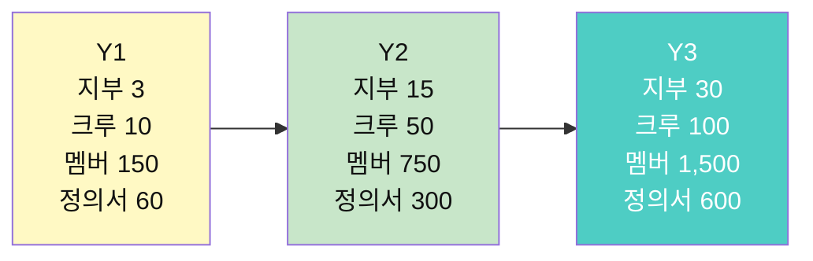

---

## 36. 부록 — 즉시 인쇄용 양식 모음

### 36.1 인쇄용 양식 목록

| # | 양식 | 규격 | 용도 |
|:-:|---|---|---|
| 1 | 문제 카드 (빈칸) | A5 | SP-01 |
| 2 | 반응 스티커 시트 | A4 (잘라 사용) | 모든 SP |
| 3 | C-03 숨은 전제 카드 | A5 | SP-03 |
| 4 | C-04 근거 타당성 체크리스트 | A5 | SP-04 |
| 5 | C-07 반증 기록지 | A4 | SP-07 |
| 6 | C-08 "그렇다면" 카드 | A5 | SP-06 |
| 7 | C-09 문제 시장 포스터 | A3 | SP-09 |
| 8 | C-14 호스트 발언 체크리스트 | A4 | 모든 SP |
| 9 | C-15 셀 배정표 | A4 | 모든 SP |
| 10 | C-16 세션 종료 보고서 | A4 | 모든 SP |
| 11 | 문제 벽 QR 코드 포스터 | A3 | Z1 상시 |
| 12 | 크루 모집 포스터 | A3 | 시즌 전 |
| 13 | 클루데이 프로그램 시트 | A4 양면 | SP-12 |
| 14 | 시즌 리포트 템플릿 | A4 4p | 시즌 후 |

### 36.2 문제 카드 인쇄용 (A5 양면)

#### 앞면

```
┌──────────────────────────────────────────────┐
│ 🔍 문제 카드                [크루명]_[시즌]    │
├──────────────────────────────────────────────┤
│ 관심사: #___ _______________                  │
│ 작성자: ____________  날짜: ____/____/____    │
├──────────────────────────────────────────────┤
│ ① 이 문제를 한 문장으로:                      │
│ _____________________________________________│
│ _____________________________________________│
├──────────────────────────────────────────────┤
│ ② 이 문제를 느낀 순간:                        │
│ _____________________________________________│
│ _____________________________________________│
├──────────────────────────────────────────────┤
│ ③ 이 문제와 관련된 책:                        │
│ 《_______________________》                   │
│ 이 책이 준 질문: ___________________________  │
├──────────────────────────────────────────────┤
│ ④ 반대편에서 보면:                            │
│ "이건 문제가 아니다"라고 말할 사람: ___________│
│ 그 사람의 논리: _____________________________│
├──────────────────────────────────────────────┤
│ ⑤ 이 문제가 중요한 이유 (한 문장):             │
│ _____________________________________________│
└──────────────────────────────────────────────┘
```

#### 뒷면

```
┌──────────────────────────────────────────────┐
│ 반응 기록                                     │
├──────────────────────────────────────────────┤
│ 🤝 나도 이 문제를 느낀다:                      │
│ (이름)_______ : ____________________________  │
│ (이름)_______ : ____________________________  │
│ (이름)_______ : ____________________________  │
├──────────────────────────────────────────────┤
│ 🔍 여기가 증상 같다:                           │
│ (이름)_______ : ____________________________  │
│ (이름)_______ : ____________________________  │
├──────────────────────────────────────────────┤
│ ⚔️ 반대편에서 보면:                            │
│ (이름)_______ : ____________________________  │
│ (이름)_______ : ____________________________  │
├──────────────────────────────────────────────┤
│ 세션 후 수정 사항:                             │
│ _____________________________________________│
│ _____________________________________________│
└──────────────────────────────────────────────┘
```

---

# 마무리 — 이 문서 한 장 요약

```
┌────────────────────────────────────────────────────────────┐
│              8단계 — 리딩클루 미래 도서관 커뮤니티 설계서        │
├────────────────────────────────────────────────────────────┤
│                                                            │
│  미네르바의 규율을 이식하고, 전문 교수를 스크립트로 대체하고,     │
│  도서관을 문제가 태어나는 무대로 바꾼다.                       │
│                                                            │
│  ┌──────────┐  ┌──────────┐  ┌──────────┐                  │
│  │ 온라인    │  │ 오프라인   │  │ 산출물    │                  │
│  │ 준비·기록 │→│ 충돌·발표 │→│ 문제     │                  │
│  │ 미네르바형│  │ 도서관    │  │ 아카이브  │                  │
│  └──────────┘  └──────────┘  └──────────┘                  │
│                                                            │
│  구조: 셀(3~5) → 크루(8~15) → 지부(도서관) → 연합(도시)       │
│  시간: 12주 시즌 · 세션 12종 · 클루데이 공개 무대               │
│  공간: 6존 모델 (문제 벽 → 독서 → 셀 → 세션 → 프로젝트 → 무대) │
│  사람: 호스트(8시간 교육) · 사서 코디 · 지부장                  │
│  비용: 30만원으로 시작 · 연 518만원으로 운영                    │
│                                                            │
│  확장: 사람 파견 ❌ → 프로토콜 복제 ✅                         │
│  3년 목표: 지부 3 → 15 → 30                                 │
│                                                            │
│  기억할 것 하나:                                             │
│  "10년 뒤 도서관에 남는 것은 대출 통계가 아니라                 │
│   그 지역이 던진 질문의 목록이다."                             │
│                                                            │
└────────────────────────────────────────────────────────────┘
```

---

*이 문서는 [7단계-리딩클루_관심사50_클루패스_설계서.md](./7단계-리딩클루_관심사50_클루패스_설계서.md)의 확장이다.*
*개인 파이프라인(7단계) 위에 커뮤니티 운영 체계(8단계)를 올린다.*
*두 문서를 함께 읽으면 리딩클루의 전체 그림이 완성된다.*
