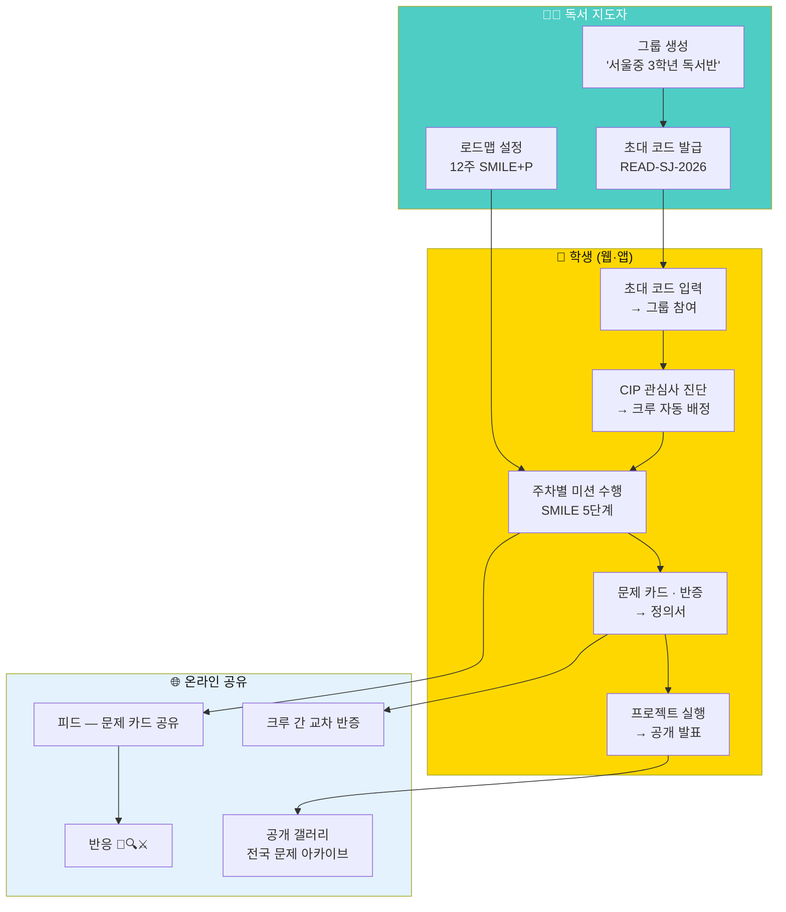
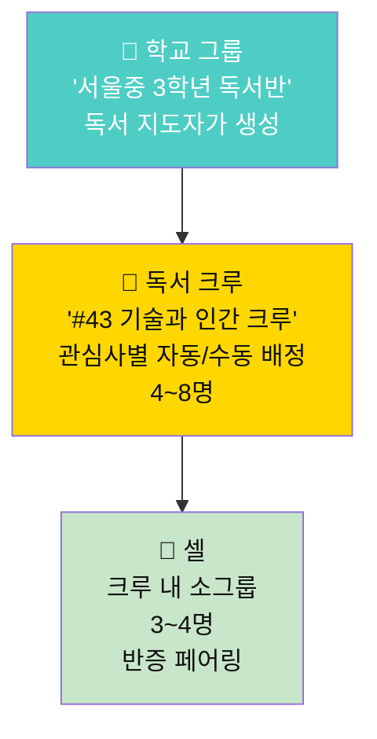
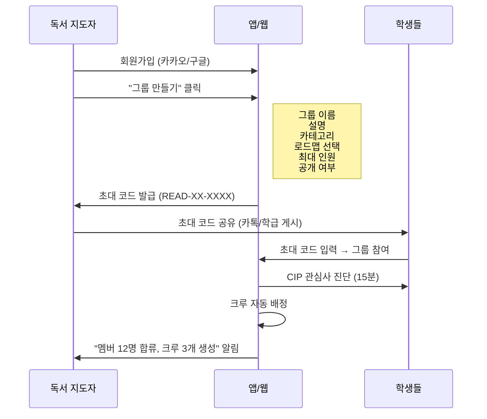
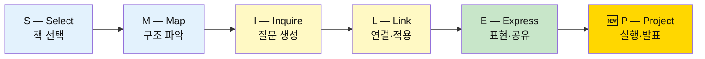
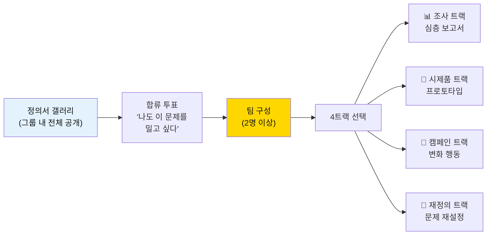

# 9단계 — 리딩클루 : 독서 지도자를 위한 온라인 실행 설계서
## 웹·앱 기반 독서 커뮤니티 — 학교별 그룹 운영 시스템

> **한 줄 정의**
> 독서 지도자가 **초대 코드 하나로 학교 독서 그룹을 만들고**,
> SMILE 5단계 독서를 **문제 발견 → 반증 → 프로젝트**까지 밀어주는
> **온라인 실행 플랫폼**이다.
>
> 오프라인 도서관은 선택지이고, **웹이 본진**이다.
> **웹으로 먼저 출시하고, 앱으로 확장한다.**
>
> 👉 화면 설계와 페이지별 시나리오는 [10단계 문서](./10단계-리딩클루_웹화면설계서_페이지별_유저시나리오.md)를 참조.

---

> ⚠️ **이 문서는 배경 설계서입니다. 최종 확정 범위·시나리오는 [11단계 최종 기획안](11단계-리딩클루_최종_기획안_유저시나리오.md)을 따릅니다.**

### 이 문서의 성격

| 구분 | 8단계 문서 | **9단계 문서 (이 문서)** |
|---|---|---|
| 초점 | 오프라인 도서관 중심 + 온라인 보조 | **온라인 중심 + 오프라인 선택** |
| 주인공 | 사서 · 호스트 · 커뮤니티 매니저 | **독서 지도자 · 교사 · 학부모** |
| 단위 | 지부(도서관) → 크루 | **학교 그룹 → 독서 크루** |
| 산출물 | 세션 프로토콜 · 공간 설계 | **앱/웹 화면 명세 · 실행 흐름** |
| 핵심 질문 | "같은 문제를 가진 사람을 어떻게 만나는가" | **"독서 지도자가 어떻게 바로 시작하는가"** |
| 참고 모델 | 미네르바 대학 | **aicareerpath.co.kr 그룹 전략** |

**짝 문서**
- [8단계-리딩클루_미래도서관_커뮤니티_온오프라인_확장_설계서.md](./8단계-리딩클루_미래도서관_커뮤니티_온오프라인_확장_설계서.md) — 오프라인 커뮤니티 원본 설계
- [7단계-리딩클루_관심사50_클루패스_설계서.md](./7단계-리딩클루_관심사50_클루패스_설계서.md) — 관심사 50 · 템플릿 24 · 루브릭 6
- [6단계-리딩클루_유저시나리오_SMILE형.md](./6단계-리딩클루_유저시나리오_SMILE형.md) — SMILE 5단계

---

## 목차

**PART 0 — 3분 요약**
- [0. 한 장 요약 · 30초 피치](#0-한-장-요약--30초-피치)

**PART I — 왜 온라인 우선인가**
1. [독서 지도자의 현실과 온라인 전환의 필요](#1-독서-지도자의-현실과-온라인-전환의-필요)
2. [aicareerpath 그룹 전략 — 무엇을 이식하는가](#2-aicareerpath-그룹-전략--무엇을-이식하는가)
3. [온라인 우선의 5원칙](#3-온라인-우선의-5원칙)

**PART II — 그룹 시스템 설계**
4. [그룹 체계 — 학교 그룹 · 독서 크루 · 셀](#4-그룹-체계--학교-그룹--독서-크루--셀)
5. [그룹 생성 · 참여 · 관리 흐름](#5-그룹-생성--참여--관리-흐름)
6. [역할 체계 — 독서 지도자 · 크루장 · 멤버](#6-역할-체계--독서-지도자--크루장--멤버)

**PART III — SMILE → 프로젝트 실행 파이프라인**
7. [SMILE 5단계 + P(프로젝트) 통합 로드맵](#7-smile-5단계--p프로젝트-통합-로드맵)
8. [주차별 온라인 활동 설계 (12주)](#8-주차별-온라인-활동-설계-12주)
9. [프로젝트 전환 — 읽기에서 실행으로](#9-프로젝트-전환--읽기에서-실행으로)

**PART IV — 화면 명세 (웹·앱)**
10. [URL 라우팅과 화면 목록](#10-url-라우팅과-화면-목록)
11. [핵심 화면 상세 12종](#11-핵심-화면-상세-12종)

**PART V — 운영 시나리오**
12. [독서 지도자 시나리오 6종](#12-독서-지도자-시나리오-6종)
13. [학교 유형별 운영 가이드](#13-학교-유형별-운영-가이드)

**PART VI — 기술·확장**
14. [데이터 모델](#14-데이터-모델)
15. [MVP 범위와 개발 로드맵](#15-mvp-범위와-개발-로드맵)

---

# PART 0 — 3분 요약

## 0. 한 장 요약 · 30초 피치

### 0.1 전체 구조



### 0.2 30초 엘리베이터 피치

> "독서 지도자가 앱에서 **초대 코드 하나**로 학교 독서 그룹을 만듭니다.
> 학생은 코드를 입력하고, CIP 관심사 진단을 받고, 같은 관심사 크루에 배정됩니다.
> 12주 동안 SMILE 5단계로 책을 읽되, **문제 카드를 쓰고 반박을 받습니다.**
> 8주째 문제 정의서가 완성되고, 원하는 학생은 **프로젝트로 전환**합니다.
> 모든 과정은 온라인이고, 학교가 달라도 같은 관심사면 **크루 간 교차 반증**이 됩니다."

### 0.3 8단계와의 차이 — 무엇이 달라지는가

| 8단계 (오프라인 중심) | **9단계 (온라인 실행)** |
|---|---|
| 도서관 = 본진, 온라인 = 보조 | **앱/웹 = 본진**, 오프라인 = 선택 |
| 지부(도서관) 단위 | **학교 그룹** 단위 |
| 호스트 워크숍 8시간 필수 | **30분 온보딩 영상 + 앱 가이드** |
| 세션 룸 · 문제 벽 등 공간 설계 | **모든 것이 앱 화면** |
| 반증 라운드 = 대면 120분 | **비동기 텍스트 반증 + 선택적 화상 세션** |
| 클루데이 = 물리 발표 무대 | **온라인 갤러리 + 선택적 학내 발표** |
| 사서 코디네이터 필요 | **독서 지도자 혼자 시작 가능** |

---

# PART I — 왜 온라인 우선인가

## 1. 독서 지도자의 현실과 온라인 전환의 필요

### 1.1 독서 지도자가 처한 현실

| 현실 | 수치 | 온라인이 해결하는 것 |
|---|---|---|
| 학교당 독서 지도자 평균 **1명** | 사서교사 배치율 62% (2024) | 혼자 운영 가능한 시스템 |
| 독서 수업 시간 **주 1~2시간** | 연간 40시간 내외 | 수업 외 시간에 비동기로 이어감 |
| 독후감 = **줄거리 요약** | 독서록 형식화율 80%+ | 문제 카드 양식이 사고를 강제 |
| 토론 시 **4~5명만 발언** | 25명 학급 기준 발언율 20% | 온라인 텍스트 = 전원 참여 |
| 학교 간 **교류 없음** | — | 같은 관심사 타교 크루 교차 |
| 프로젝트까지 **이어지지 않음** | 독서→실행 전환율 5% 미만 | 4트랙 프로젝트 구조 |

### 1.2 한국 독서 정책과 기회

```
2024  한국, 독서 국가 선포
      → 모든 학교에 도서실 확충 · 장서 확대
      → 독서 지도자 수요 급증
      
문제: 공간과 책은 늘어나지만, "어떻게 읽힐 것인가"의 방법론이 없다.
      → 리딩클루 9단계 = 그 방법론의 온라인 실행 버전.
```

---

## 2. aicareerpath 그룹 전략 — 무엇을 이식하는가

aicareerpath.co.kr의 **커리어 스페이스(그룹)** 구조를 독서 커뮤니티에 맞게 이식한다.

### 2.1 구조 대응표

| aicareerpath | 리딩클루 9단계 | 이식 방식 |
|---|---|---|
| **커리어 스페이스** (그룹 공간) | **독서 스페이스** (그룹 공간) | 명칭·구조 동일 |
| 초대 코드 (`SCI-2026`) | 초대 코드 (`READ-SJ-2026`) | 동일 메커니즘 |
| 카테고리: 스터디/프로젝트/멘토링/동아리 | 카테고리: **독서반/동아리/프로젝트/자율** | 독서 맥락 |
| 진행 방식: 온라인/오프라인/병행 | 진행 방식: **온라인/교실병행/자율** | 동일 |
| 최대 인원: 2~200명 | 최대 인원: **4~40명** | 교실 규모 |
| 그룹 내 로드맵 공유 | 그룹 내 **12주 독서 로드맵** | 독서+프로젝트 |
| 공개/비공개 (초대 코드 전용) | 공개/비공개 동일 | — |
| 피드 | **독서 피드** (문제 카드·반응) | 독서 특화 |

### 2.2 이식하는 것 vs 새로 만드는 것

| 이식하는 것 (aicareerpath 원형) | 새로 만드는 것 (독서 특화) |
|---|---|
| ✅ 그룹 생성 (이름·설명·카테고리·인원) | 🆕 **SMILE 로드맵 자동 생성** |
| ✅ 초대 코드 참여 | 🆕 **CIP 관심사 진단 → 크루 자동 배정** |
| ✅ 피드 · 공유 | 🆕 **문제 카드 양식 · 반응 3종 (🤝🔍⚔️)** |
| ✅ 그룹 아이콘 12종 | 🆕 **관심사 50 아이콘** |
| ✅ 공개/비공개 토글 | 🆕 **크루 간 교차 반증** |
| ✅ 멤버 관리 | 🆕 **주차별 미션 · 진행률 대시보드** |

---

## 3. 온라인 우선의 5원칙

```
원칙 1 — 독서 지도자가 5분 안에 그룹을 만들 수 있어야 한다.
         그룹 생성 → 초대 코드 → 학생 안내. 끝.

원칙 2 — 학생은 앱/웹에서 모든 활동을 완료한다.
         문제 카드 쓰기, 반응 달기, 반증, 정의서, 프로젝트까지.

원칙 3 — 비동기가 기본이다.
         같은 시간에 모이지 않아도 진행된다.
         실시간 토론은 선택적 부스트.

원칙 4 — 학교 밖으로 연결된다.
         같은 관심사의 다른 학교 크루와 교차 반증이 가능하다.

원칙 5 — 독서 지도자는 관리자이지 강사가 아니다.
         시스템이 로드맵을 강제하고, 독서 지도자는 진행을 모니터링한다.
```

---

# PART II — 그룹 시스템 설계

## 4. 그룹 체계 — 학교 그룹 · 독서 크루 · 셀

### 4.1 3계층 구조



### 4.2 계층별 상세

| 단위 | 정원 | 생성 방법 | 수명 | 핵심 기능 |
|---|:-:|---|---|---|
| **학교 그룹** | 4~40명 | 독서 지도자가 앱에서 생성 | 학기/연간 | 초대 코드 · 전체 대시보드 · 로드맵 설정 |
| **독서 크루** | 4~8명 | CIP 결과 기반 자동 배정 or 지도자 수동 | 시즌(12주) | 같은 관심사 · 문제 카드 · 반증 · 정의서 |
| **셀** | 3~4명 | 시스템 자동 (크루 내) | 세션 1회 | 교차 코멘트 · 반증 페어 |

### 4.3 "학교 그룹"의 유연함

학교 그룹은 반드시 학교일 필요가 없다. aicareerpath처럼 **자유 생성**이다.

| 사용 예 | 그룹 이름 | 초대 코드 | 인원 |
|---|---|---|:-:|
| 학교 정규 독서반 | "한빛중 2학년 독서반" | `READ-HB2-26` | 30 |
| 방과후 동아리 | "서초고 비판적 독서 동아리" | `READ-SC-BT` | 15 |
| 학부모 독서모임 | "은평 학부모 함께읽기" | `READ-EP-MOM` | 10 |
| 도서관 프로그램 | "서초도서관 시즌4" | `READ-SCL-S4` | 20 |
| 교사 연수 | "독서교육 연구회" | `READ-TEACH` | 12 |
| 자발적 독서모임 | "직장인 기술독서" | `READ-TECH-W` | 8 |

---

## 5. 그룹 생성 · 참여 · 관리 흐름

### 5.1 독서 지도자의 그룹 생성 (5분)



### 5.2 그룹 생성 폼

| 필드 | 입력 | 기본값 | 비고 |
|---|---|---|---|
| **그룹 아이콘** | 관심사 50 아이콘 중 선택 | 📖 | — |
| **그룹 이름** | 자유 텍스트 | — | 예: "한빛중 2학년 독서반" |
| **설명** | 자유 텍스트 | — | 그룹 목적 한 줄 |
| **카테고리** | 독서반 / 동아리 / 프로젝트 / 자율 | 독서반 | 드롭다운 |
| **진행 방식** | 온라인 / 교실 병행 / 자율 | 온라인 | — |
| **로드맵** | 12주 표준 / 8주 압축 / 자율 | 12주 표준 | 로드맵 선택 시 주차별 미션 자동 생성 |
| **최대 인원** | 4~40명 | 30 | 슬라이더 |
| **크루 배정 방식** | CIP 자동 / 지도자 수동 / 자율 | CIP 자동 | — |
| **공개 여부** | 목록 공개 / 초대 코드 전용 | 초대 코드 전용 | — |

생성 완료 시 **초대 코드**가 자동 발급된다.

### 5.3 학생의 참여 흐름

```
1. 독서 지도자에게 초대 코드 받음 (카톡/QR/게시판)
2. 앱/웹에서 "초대 코드 입력" → 즉시 그룹 참여
   또는 "참여 요청" → 이름·관심 분야·참여 목적 입력 → 지도자 승인
3. CIP 관심사 진단 (15분, 관심사 Top3 산출)
4. 크루 자동 배정 (같은 관심사 4~8명)
5. 주차별 미션 시작 (로드맵에 따라)
```

### 5.4 독서 지도자의 관리 도구

| 도구 | 기능 | 위치 |
|---|---|---|
| **대시보드** | 전체 진행률 · 크루별 현황 · 미제출자 알림 | 그룹 홈 |
| **멤버 관리** | 가입 승인 · 크루 재배정 · 역할 변경 | 설정 |
| **미션 관리** | 주차별 미션 커스터마이징 · 마감일 설정 | 로드맵 탭 |
| **피드 모니터링** | 문제 카드 · 반응 · 반증 활동 모아보기 | 피드 탭 |
| **성과 리포트** | 시즌 통계 자동 생성 (학교 보고용) | 리포트 탭 |
| **알림 발송** | 전체/크루별 공지 · 미참여자 독려 | 알림 |

---

## 6. 역할 체계 — 독서 지도자 · 크루장 · 멤버

### 6.1 역할 총람 (간소화)

8단계의 12종 역할을 **온라인 실행에 맞게 4종**으로 압축한다.

| # | 역할 | 할 수 있는 것 | 자격 |
|:-:|---|---|---|
| 1 | **독서 지도자** (그룹 관리자) | 그룹 생성 · 초대 코드 · 로드맵 설정 · 멤버 관리 · 리포트 | 회원가입 + 그룹 생성 |
| 2 | **크루장** | 크루 내 반증 배정 · 주차별 독려 · 셀 관리 | 지도자가 지정 or 자동(첫 가입자) |
| 3 | **멤버** | 문제 카드 작성 · 반응 · 반증 · 정의서 · 프로젝트 | 초대 코드 입력 + CIP 완료 |
| 4 | **게스트** | 공개 그룹 열람 · 공개 갤러리 반응(🤝만) | 회원가입만 |

### 6.2 독서 지도자가 해야 하는 최소 행동

```
매주 10분:
  1. 대시보드에서 크루별 진행률 확인 (2분)
  2. 미제출자에게 "독려 알림" 1회 발송 (3분)
  3. 이번 주 우수 문제 카드 1개 "하이라이트" 지정 (2분)
  4. 다음 주 미션 확인 (자동 설정이므로 확인만) (1분)
  5. 학생 질문/신고 처리 (2분)

매 시즌 종료 시:
  · "리포트 다운로드" 클릭 → 학교 보고용 PDF 자동 생성
```

---

# PART III — SMILE → 프로젝트 실행 파이프라인

## 7. SMILE 5단계 + P(프로젝트) 통합 로드맵

### 7.1 SMILE 5단계의 한계와 P의 추가



| 단계 | 개인 활동 (기존 SMILE) | 온라인 확장 (리딩클루 9단계) | 산출물 |
|---|---|---|---|
| **S — Select** | 관심사에 맞는 책 선택 | CIP 진단 → 관심사 50 기반 추천 | 관심사 Top3 · 책 1권 선택 |
| **M — Map** | 책의 구조 파악 | 마인드맵 도구로 구조화 → 크루 공유 | 독서 구조 맵 |
| **I — Inquire** | 질문 생성 | **문제 카드 작성** → 크루에 게시 → 반응(🤝🔍⚔️) 받기 | 문제 카드 |
| **L — Link** | 다른 텍스트와 연결 | **병렬 독서** (크루 내 다른 책 읽기) → 교차 코멘트 | 교차 코멘트 카드 |
| **E — Express** | 글·발표로 표현 | **반증** (셀 간 텍스트 반박) → **문제 정의서** 작성 | 정의서 |
| **P — Project** | *(기존 SMILE에 없음)* | **4트랙 프로젝트** → 온라인 갤러리 발표 | 프로젝트 보고서 |

### 7.2 시즌 3막 구조

```
┌─────────────────────────────────────────────────────────────┐
│                   12주 시즌 3막 구조                          │
├─────────────────────────────────────────────────────────────┤
│                                                             │
│  1막 문제 제기 (주 1~3)          SMILE: S · M · I           │
│  ┌─────┐ ┌─────┐ ┌─────┐                                   │
│  │ 주1  │ │ 주2  │ │ 주3  │                                   │
│  │ CIP  │ │ 구조  │ │ 문제  │                                   │
│  │ 진단  │ │ 파악  │ │ 카드  │                                   │
│  └─────┘ └─────┘ └─────┘                                   │
│                                                             │
│  2막 심화·검증 (주 4~8)          SMILE: I · L · E            │
│  ┌─────┐ ┌─────┐ ┌─────┐ ┌─────┐ ┌─────┐                  │
│  │ 주4  │ │ 주5  │ │ 주6  │ │ 주7  │ │ 주8  │                  │
│  │ 근거  │ │ 병렬  │ │ 함의  │ │ 반증  │ │ 정의서│                  │
│  │ 수집  │ │ 독서  │ │ 탐구  │ │ ★   │ │ 완성  │                  │
│  └─────┘ └─────┘ └─────┘ └─────┘ └─────┘                  │
│                                                             │
│  ──── 분기점: 여기서 끝나도 완주 ────                          │
│                                                             │
│  3막 프로젝트 (주 9~12)          SMILE+: P                   │
│  ┌─────┐ ┌─────┐ ┌─────┐ ┌─────┐                           │
│  │ 주9  │ │주10  │ │주11  │ │주12  │                           │
│  │ 팀구성│ │ 실행  │ │ 리허설│ │ 발표  │                           │
│  │ 트랙  │ │ 체크인│ │      │ │ 갤러리│                           │
│  └─────┘ └─────┘ └─────┘ └─────┘                           │
│                                                             │
└─────────────────────────────────────────────────────────────┘
```

---

## 8. 주차별 온라인 활동 설계 (12주)

모든 활동은 **앱/웹에서 비동기로 수행**한다. 실시간 모임은 선택.

### 8.1 12주 상세 로드맵

| 주 | SMILE | 미션 이름 | 온라인 활동 (비동기) | 선택: 실시간 | 산출물 | 소요 |
|:-:|:-:|---|---|---|---|:-:|
| 1 | S | **관심사 발견** | CIP 진단 15분 → 결과 크루 게시 | — | 관심사 Top3 | 20분 |
| 2 | S·M | **책 선택 · 구조 파악** | 관심사 기반 책 선택 → 마인드맵 작성 → 크루 공유 | 크루 줌 인사 (15분) | 독서 구조 맵 | 40분 |
| 3 | I | **문제 카드 작성** | 문제 카드 양식 채우기 → 크루 피드에 게시 → 크루원 반응 달기 | — | 문제 카드 1장 | 30분 |
| 4 | I | **숨은 전제 · 근거** | 셀 파트너의 문제 카드에 C-03 숨은 전제 코멘트 → 1차 데이터 1건 수집 | — | 전제 카드 + 근거 1건 | 40분 |
| 5 | L | **병렬 독서** | 크루 내 다른 책 1권 추가 읽기 → 3층 독서 노트 작성 | — | 독서 노트 | 60분+ |
| 6 | L | **교차 코멘트** | 셀 파트너의 독서 노트에 교차 코멘트 → "그렇다면" 카드 작성 | — | 교차 코멘트 + C-08 카드 | 30분 |
| 7 | E | **반증 ★** | 정의서 초안 작성 → 반증 파트너(다른 셀) 배정 → **텍스트 반증 교환** | 반증 화상 세션 (45분) | 반증 기록 | 45분 |
| 8 | E | **정의서 완성** | 반증 반영 수정 → 정의서 최종본 → 크루 투표(승급 여부) | — | 문제 정의서 | 30분 |
| — | — | **분기점** | 정의 트랙은 여기서 완주 인정 | — | — | — |
| 9 | P | **프로젝트 킥오프** | 문제 시장(정의서 갤러리) → 합류 투표 → 팀 구성 → 4트랙 선택 | 팀 화상 킥오프 (30분) | 팀 협약서 | 30분 |
| 10 | P | **주간 체크인 ①** | 주간 진척 보고 (텍스트) → 크루 피드 공유 → 실패 기록 1건 | — | 진척 기록 | 20분 |
| 11 | P | **주간 체크인 ② + 리허설** | 발표 자료 업로드 → 크루 피드백(텍스트/음성) | 리허설 화상 (30분) | 발표 자료 초안 | 40분 |
| 12 | P | **갤러리 발표** | 최종 보고서 업로드 → 온라인 갤러리 공개 → 전체 투표 "최고 질문상" | 학내 발표 (선택) | 최종 보고서 + 회고 | 30분 |

### 8.2 미션 자동 알림 흐름

```
매주 월요일 09:00  → "이번 주 미션: [미션 이름]" 푸시
매주 수요일 18:00  → 미제출자에게 "미션 마감 D-4" 리마인더
매주 금요일 18:00  → 미제출자에게 "마감 D-2" + 독서 지도자에게 미제출자 목록
매주 일요일 23:59  → 미션 마감 → 다음 주 미션 자동 오픈
```

### 8.3 비동기 반증 프로토콜 (주 7, 온라인 특화)

8단계의 SP-07(대면 120분)을 **비동기 텍스트**로 전환한다.

```
1. 시스템이 반증 파트너를 자동 배정 (다른 셀, 관심사 인접 금지)
2. 발표자: 정의서 초안 게시 (월요일까지)
3. 반증 파트너: 72시간 내 반증 코멘트 작성
   · 최소 3개 질문 + 1개 대안 제시 필수
   · "이 경우에는?" 형식 사용 (규칙 2)
   · 200자 이상
4. 발표자: 72시간 내 응답 또는 "기록만 합니다" 표시
5. 시스템: 반증 기록 자동 정리 → 정의서 수정 가이드 제시

선택: 반증 화상 세션 (45분)
  · 발표자 3분 → 반증 파트너 질문 5분 → 기록 2분 × 4쌍
  · 독서 지도자 또는 크루장이 타이머 관리
```

---

## 9. 프로젝트 전환 — 읽기에서 실행으로

### 9.1 전환 지점 — "정의서 갤러리"

주 8에서 정의서가 완성되면, 주 9에 **문제 시장**이 열린다.
온라인에서는 이를 **"정의서 갤러리"**라고 부른다.



### 9.2 4트랙별 온라인 산출물

| 트랙 | 주 9 산출물 | 주 10~11 활동 | 주 12 최종 산출물 |
|---|---|---|---|
| **📊 조사** | 조사 계획서 | 인터뷰/설문/문헌 조사 | 심층 보고서 (PDF/영상) |
| **🔧 시제품** | 프로토타입 설계도 | 개발/디자인/테스트 | 프로토타입 데모 (영상/링크) |
| **📢 캠페인** | 캠페인 기획서 | 콘텐츠 제작/배포 | 캠페인 결과 보고서 |
| **🔄 재정의** | 문제 재정의 초안 | 추가 반증/문헌 | 갱신된 정의서 + 근거 보고서 |

### 9.3 참여 트랙 (8주 완주도 인정)

| 트랙 | 기간 | 산출물 | 인정 |
|---|---|---|---|
| **탐색 트랙** | 주 1~3 | 문제 카드 | 체험 인증 |
| **정의 트랙** | 주 1~8 | 문제 정의서 | **SMILE 완주 인증** |
| **프로젝트 트랙** | 주 1~12 | 정의서 + 프로젝트 | **SMILE+P 완주 인증** |

---

# PART IV — 화면 명세 (웹·앱)

## 10. URL 라우팅과 화면 목록

### 10.1 URL 라우팅표

| # | URL | 화면 | 권한 |
|:-:|---|---|---|
| 1 | `/` | 랜딩 페이지 (소개 + CTA) | 전체 |
| 2 | `/login` | 소셜 로그인 (카카오/구글) | 전체 |
| 3 | `/cip` | CIP 관심사 진단 | 로그인 |
| 4 | `/cip/result` | 진단 결과 (관심사 Top3) | 로그인 |
| 5 | `/groups` | 그룹 탐색 (공개 그룹 목록) | 전체 |
| 6 | `/groups/join` | 초대 코드 입력 | 로그인 |
| 7 | `/groups/new` | 그룹 생성 | 로그인 |
| 8 | `/groups/:id` | 그룹 홈 (대시보드) | 멤버 |
| 9 | `/groups/:id/feed` | 그룹 피드 (문제 카드·반응·공유) | 멤버 |
| 10 | `/groups/:id/roadmap` | 로드맵 (주차별 미션) | 멤버 |
| 11 | `/groups/:id/crews` | 크루 목록 | 멤버 |
| 12 | `/groups/:id/crews/:cid` | 크루 상세 (멤버·활동) | 크루 멤버 |
| 13 | `/groups/:id/gallery` | 정의서 갤러리 (문제 시장) | 멤버 |
| 14 | `/groups/:id/projects` | 프로젝트 목록 | 멤버 |
| 15 | `/groups/:id/report` | 시즌 리포트 | 지도자 |
| 16 | `/groups/:id/settings` | 그룹 설정 · 멤버 관리 | 지도자 |
| 17 | `/cards/new` | 문제 카드 작성 | 멤버 |
| 18 | `/cards/:id` | 문제 카드 상세 (반응·코멘트) | 멤버·공개 |
| 19 | `/definitions/:id` | 문제 정의서 상세 | 멤버 |
| 20 | `/projects/:id` | 프로젝트 상세 | 멤버 |
| 21 | `/rebuttal/:id` | 반증 세션 (텍스트 교환) | 배정된 멤버 |
| 22 | `/explore` | 공개 갤러리 (전국 문제 아카이브) | 전체 |
| 23 | `/my` | 내 기록 (카드·정의서·프로젝트·포트폴리오) | 로그인 |
| 24 | `/guide` | 독서 지도자 온보딩 가이드 | 전체 |

---

## 11. 핵심 화면 상세 12종

### P-07 그룹 생성 `/groups/new`

```
┌─────────────────────────────────────────────┐
│  📖 새 독서 그룹 만들기                       │
├─────────────────────────────────────────────┤
│                                             │
│  아이콘  [📖] [🔬] [🎨] [💻] [🌍] ...       │
│                                             │
│  그룹 이름  [한빛중 2학년 독서반          ]    │
│                                             │
│  설명      [함께 읽고 문제를 발견합시다    ]    │
│                                             │
│  카테고리  [독서반 ▼]                        │
│                                             │
│  진행 방식  ○ 온라인  ○ 교실 병행  ○ 자율     │
│                                             │
│  로드맵    ○ 12주 표준  ○ 8주 압축  ○ 자율    │
│                                             │
│  최대 인원  [====●===========] 30명          │
│                                             │
│  크루 배정  ○ CIP 자동  ○ 지도자 수동  ○ 자율  │
│                                             │
│  공개 여부  [🔒 초대 코드 전용  ●───○]        │
│                                             │
│           [ 그룹 만들기 ]                     │
│                                             │
└─────────────────────────────────────────────┘

→ 생성 완료 시:

┌─────────────────────────────────────────────┐
│  ✅ 그룹이 만들어졌습니다!                     │
│                                             │
│  초대 코드:  READ-HB2-26                     │
│                                             │
│  [ 코드 복사 ]  [ 카카오 공유 ]  [ QR 생성 ]   │
│                                             │
│  학생에게 이 코드를 공유하세요.                 │
│  학생이 코드를 입력하면 바로 참여됩니다.         │
│                                             │
│           [ 그룹으로 이동 → ]                  │
└─────────────────────────────────────────────┘
```

### P-08 그룹 홈 (대시보드) `/groups/:id`

```
┌─────────────────────────────────────────────┐
│  📖 한빛중 2학년 독서반       [설정⚙️]        │
│  초대 코드: READ-HB2-26  [복사]              │
│  멤버 24명 · 크루 4개 · 시즌 1 · 5주차        │
├─────────────────────────────────────────────┤
│                                             │
│  [피드]  [로드맵]  [크루]  [갤러리]  [리포트]   │
│                                             │
├─── 이번 주 미션 ────────────────────────────┤
│  주 5: 병렬 독서 📚                          │
│  마감: D-3  |  완료 18/24 (75%)  ████████░░  │
│  미제출: 김○○, 이○○, 박○○ ...  [독려 알림 →]  │
│                                             │
├─── 크루별 현황 ──────────────────────────────┤
│  #43 기술과 인간 (6명)  ████████░░  83%      │
│  #33 교육과 학습 (7명)  ██████░░░░  57%      │
│  #26 번아웃 (5명)       ██████████  100%     │
│  #41 정의와 공정 (6명)  ████████░░  83%      │
│                                             │
├─── 이번 주 하이라이트 ──────────────────────┤
│  ⭐ "AI가 교사를 대체할 수 있는가?"            │
│     작성: 김○○  반응: 🤝3 🔍2 ⚔️4            │
│                                             │
├─── 시즌 누적 ───────────────────────────────┤
│  문제 카드 47장 · 반응 312개 · 반증 0건(7주~)  │
└─────────────────────────────────────────────┘
```

### P-09 그룹 피드 `/groups/:id/feed`

```
┌─────────────────────────────────────────────┐
│  피드  [전체 ▼] [크루별 ▼] [유형별 ▼]         │
├─────────────────────────────────────────────┤
│                                             │
│  ┌── 문제 카드 ─────────────────────────┐    │
│  │ 김○○ · #43 기술과 인간 · 3시간 전      │    │
│  │                                     │    │
│  │ "AI가 교사를 대체할 수 있는가?"        │    │
│  │                                     │    │
│  │ 이 문제를 느낀 순간:                  │    │
│  │ 챗GPT로 숙제를 하는 친구를 보면서      │    │
│  │ 선생님의 역할이 뭔지 의문이 들었다.     │    │
│  │                                     │    │
│  │ 관련 책: 《에듀테크의 미래》            │    │
│  │ 이 책이 준 질문: "기술이 교육을 바꾸는  │    │
│  │ 것인가, 교육이 기술을 선택하는 것인가?"  │    │
│  │                                     │    │
│  │ [🤝 3] [🔍 2] [⚔️ 4]  [코멘트 5]     │    │
│  └─────────────────────────────────────┘    │
│                                             │
│  ┌── 교차 코멘트 ───────────────────────┐    │
│  │ 이○○ → 김○○의 카드  · 1일 전         │    │
│  │ 🔍 "대체"라는 전제가 문제 같다.        │    │
│  │ 교사의 역할을 "지식 전달"로만 보면      │    │
│  │ 대체 가능하지만, "관계"로 보면 불가능.   │    │
│  └─────────────────────────────────────┘    │
│                                             │
└─────────────────────────────────────────────┘
```

### P-10 로드맵 `/groups/:id/roadmap`

```
┌─────────────────────────────────────────────┐
│  📋 12주 로드맵  [커스터마이징 ✏️]             │
├─────────────────────────────────────────────┤
│                                             │
│  1막 문제 제기                               │
│  ✅ 주1 관심사 발견  ··········  24/24 완료   │
│  ✅ 주2 책 선택·구조  ··········  24/24 완료   │
│  ✅ 주3 문제 카드    ··········  22/24 완료   │
│                                             │
│  2막 심화·검증                               │
│  ✅ 주4 숨은 전제·근거 ·········  21/24 완료   │
│  🔵 주5 병렬 독서    ·········  18/24 진행중  │
│  ⬜ 주6 교차 코멘트   ·········  미시작       │
│  ⬜ 주7 반증 ★       ·········  미시작       │
│  ⬜ 주8 정의서 완성   ·········  미시작       │
│                                             │
│  ──── 분기점 ────                            │
│                                             │
│  3막 프로젝트 (선택)                          │
│  ⬜ 주9 팀 구성·트랙  ·········  미시작       │
│  ⬜ 주10 실행 체크인  ·········  미시작       │
│  ⬜ 주11 리허설      ·········  미시작       │
│  ⬜ 주12 갤러리 발표  ·········  미시작       │
│                                             │
└─────────────────────────────────────────────┘
```

### P-17 문제 카드 작성 `/cards/new`

```
┌─────────────────────────────────────────────┐
│  🔍 문제 카드 작성                            │
├─────────────────────────────────────────────┤
│                                             │
│  관심사  [#43 기술과 인간 ▼]                  │
│                                             │
│  ① 이 문제를 한 문장으로:                     │
│  [                                        ] │
│  0/100자                                    │
│                                             │
│  ② 이 문제를 느낀 순간:                       │
│  [                                        ] │
│  [                                        ] │
│  0/300자                                    │
│                                             │
│  ③ 관련된 책:                                │
│  책 제목 [                              ]    │
│  이 책이 준 질문 [                        ]    │
│                                             │
│  ④ 반대편에서 보면:                           │
│  "이건 문제가 아니다"라고 말할 사람:            │
│  [                                        ] │
│  그 사람의 논리:                              │
│  [                                        ] │
│                                             │
│  ⑤ 이 문제가 중요한 이유 (한 문장):            │
│  [                                        ] │
│                                             │
│       [임시 저장]        [크루에 게시 →]       │
│                                             │
└─────────────────────────────────────────────┘
```

### P-21 반증 세션 `/rebuttal/:id`

```
┌─────────────────────────────────────────────┐
│  ⚔️ 반증 세션                                │
│  발표자: 김○○  ↔  반증 파트너: 박○○           │
│  마감: D-2                                   │
├─────────────────────────────────────────────┤
│                                             │
│  ┌── 정의서 초안 ───────────────────────┐    │
│  │ "고교생 번아웃은 시간 부족 때문이다"    │    │
│  │ 근거 1: ...                         │    │
│  │ 근거 2: ...                         │    │
│  │ 근거 3: ...                         │    │
│  │ [전문 보기 →]                        │    │
│  └─────────────────────────────────────┘    │
│                                             │
│  ┌── 반증 규칙 ─────────────────────────┐    │
│  │ 1. 인격이 아니라 논증을 반박한다        │    │
│  │ 2. "틀렸다"가 아니라 "이 경우에는?"     │    │
│  │ 3. 반박에는 대안 질문이 따라야 한다      │    │
│  │ 4. 발표자는 "기록만 합니다" 가능        │    │
│  │ 5. 최소 질문 3개 + 대안 1개 (200자+)   │    │
│  └─────────────────────────────────────┘    │
│                                             │
│  반증 코멘트 작성:                            │
│  [                                        ] │
│  [                                        ] │
│  [                                        ] │
│  200자 이상 · 현재 0자                       │
│                                             │
│       [임시 저장]        [반증 제출 →]         │
│                                             │
│  ── 반증 기록 ──                             │
│  (아직 반증이 제출되지 않았습니다)               │
│                                             │
└─────────────────────────────────────────────┘
```

### P-15 시즌 리포트 `/groups/:id/report`

```
┌─────────────────────────────────────────────┐
│  📊 시즌 리포트  [PDF 다운로드]                │
│  한빛중 2학년 독서반 · 시즌 1 · 12주 완료      │
├─────────────────────────────────────────────┤
│                                             │
│  ┌── 핵심 지표 ─────────────────────────┐    │
│  │ 참여자 24명 · 완주 20명 (83%)         │    │
│  │ 문제 카드 52장 · 정의서 14건           │    │
│  │ 반증 교환 38회 · 반증 수용 12건 (32%)  │    │
│  │ 프로젝트 5건 · 갤러리 발표 5건         │    │
│  │ 반응 총 487개 (🤝 201 🔍 142 ⚔️ 144) │    │
│  └─────────────────────────────────────┘    │
│                                             │
│  ┌── 크루별 성과 ───────────────────────┐    │
│  │ #43 기술과 인간  카드12 정의서4 프로젝트2│    │
│  │ #33 교육과 학습  카드15 정의서5 프로젝트1│    │
│  │ #26 번아웃      카드11 정의서2 프로젝트1│    │
│  │ #41 정의와 공정  카드14 정의서3 프로젝트1│    │
│  └─────────────────────────────────────┘    │
│                                             │
│  ┌── 시즌 베스트 ───────────────────────┐    │
│  │ 🏆 최고 질문상: "AI가 교사를 대체할 수  │    │
│  │    있는가?" (투표 1위)                 │    │
│  │ 🏆 최고 반증상: 박○○ (가장 날카로운 반박)│    │
│  │ 🏆 최고 전환상: 이○○ (정의서→프로젝트)  │    │
│  └─────────────────────────────────────┘    │
│                                             │
│  📝 학교 보고용 문구 (자동 생성):              │
│  "본교 2학년 독서반은 12주간 SMILE+P 독서      │
│   프로그램을 운영하여 문제 카드 52장,           │
│   문제 정의서 14건, 프로젝트 5건의 성과를       │
│   거두었습니다. 참여 학생의 완주율은 83%..."    │
│                                             │
└─────────────────────────────────────────────┘
```

### P-22 공개 갤러리 `/explore`

```
┌─────────────────────────────────────────────┐
│  🌐 전국 문제 아카이브                        │
│  "전국의 학생이 던진 질문을 만나보세요"          │
├─────────────────────────────────────────────┤
│                                             │
│  [관심사별 ▼] [지역별 ▼] [학교급별 ▼] [인기순]  │
│                                             │
│  ┌────────┐ ┌────────┐ ┌────────┐           │
│  │#43기술  │ │#33교육  │ │#26번아웃│           │
│  │AI가 교사│ │학교는 왜│ │고교생  │           │
│  │를 대체할│ │행복을  │ │번아웃은│           │
│  │수 있는가│ │가르치지│ │선택 부재│           │
│  │?       │ │않는가? │ │에서 온다│           │
│  │        │ │        │ │        │           │
│  │🤝12🔍8 │ │🤝9 🔍5 │ │🤝15🔍3│           │
│  │⚔️14    │ │⚔️7     │ │⚔️11   │           │
│  │서울·중학│ │부산·고교│ │대전·고교│           │
│  └────────┘ └────────┘ └────────┘           │
│                                             │
│  + 더 보기 (전국 1,247장의 문제 카드)           │
│                                             │
│  ┌── 이번 시즌 TOP 질문 ────────────────┐    │
│  │ 1위 "AI가 교사를 대체할 수 있는가?"    │    │
│  │ 2위 "공정한 입시는 존재하는가?"         │    │
│  │ 3위 "기후변화에 학생이 할 수 있는 것?"  │    │
│  └─────────────────────────────────────┘    │
│                                             │
└─────────────────────────────────────────────┘
```

---

# PART V — 운영 시나리오

## 12. 독서 지도자 시나리오 6종

### S1. 사서교사가 학교 독서반을 온라인으로 여는 날

```
Day 0   앱 설치 → 카카오 로그인 → 온보딩 가이드 영상 시청 (30분)
Day 1   "그룹 만들기" → "한빛중 2학년 독서반" → 초대 코드 READ-HB2-26
        카카오톡 학급 단톡방에 코드 공유
Day 2   학생 18명 코드 입력 → CIP 진단 완료 → 크루 3개 자동 생성
        (#43 기술 6명, #33 교육 7명, #26 번아웃 5명)
Day 3   주 1 미션 자동 시작: "관심사 발견"
        사서교사 할 일: 대시보드 확인 (2분)

Week 1~3  1막 문제 제기. 학생들 비동기로 미션 수행.
          사서교사 주 10분: 미제출자 알림 + 하이라이트 지정.
          수요일 점심시간에 도서관에서 자율 모임 (선택).

Week 4~8  2막 심화·검증.
          주 7 반증: 비동기 텍스트 반증. 교실에서 45분 화상 보충 (선택).
          주 8 정의서 14건 완성. 분기점.

Week 9~12 3막 프로젝트. 12명 참여 (6명은 정의 트랙 완주).
          주 12 온라인 갤러리 발표 + 학교 도서관에서 미니 발표 (학부모 초대).

시즌 종료  리포트 PDF 다운로드 → 교감에게 보고.
          "문제 카드 52장, 정의서 14건, 프로젝트 5건."
```

### S2. 독서 동아리 교사가 기존 동아리를 전환하는 날

```
기존 동아리: 15명, 월 1회, 한 권 읽고 감상 공유.
전환: 앱에서 그룹 생성 → 초대 코드 공유 → CIP → 크루 2개 자동 생성.
      기존 월 1회 모임 → 매주 온라인 미션 + 격주 대면 모임(선택).
Week 4: "전에는 '좋았다/별로'로 끝났는데, 문제 카드를 쓰니 다르다."
Week 7: 반증. "반박당하는 게 처음인데 유익하다."
Week 12: 미니 클루데이. 동아리 역사상 첫 프로젝트 2건 완성.
```

### S3. 학부모 독서 지도자가 마을에서 시작하는 날

```
학부모 독서 봉사자. 마을 도서관에서 주 1회 초등 독서 지도.
앱에서 그룹 생성: "은평 어린이 독서탐험대" (8명, 초 4~6).
8주 압축 로드맵 선택.
CIP 진단 → 크루 2개 (관심사 혼합, 수동 배정).
Week 1~3: 매주 토요일 도서관 모임 90분 + 앱에서 문제 카드 작성 (집에서).
Week 4~6: 병렬 독서 → 어린이용 교차 코멘트 ("친구 책에서 궁금한 것 3가지").
Week 7~8: 미니 발표 (부모 초대, 도서관 게시판에 문제 카드 전시).
```

### S4. 교사 연수에서 리딩클루를 체험하는 날

```
교육청 독서교육 연수 (3시간).
강사(리딩클루 운영자)가 그룹 생성: "독서교육 연수 2026-08"
참석 교사 20명이 초대 코드 입력.
1시간: CIP 진단 + 문제 카드 작성 (교사 본인의 교육 고민).
1시간: 셀(4명)로 반증 체험. "즉흥이 아니라 스크립트로 가능하다."
1시간: 학교 적용 계획 수립. 그룹 생성 실습.
연수 후: 교사들이 각자 학교에서 그룹 생성 → 학생 초대.
```

### S5. 두 학교 크루가 교차 반증하는 날

```
서울 A중학교 #43 기술 크루 (6명)
부산 B고등학교 #43 기술 크루 (5명)

독서 지도자 둘이 "교차 반증" 신청 (앱에서 클릭 1회).
주 7: A크루의 정의서 3건 → B크루 반증 파트너 3명 배정.
      B크루의 정의서 2건 → A크루 반증 파트너 2명 배정.
비동기 텍스트 반증 72시간.
A크루 학생: "다른 학교 학생이 반박해주니 더 긴장되고 도움된다."
B크루 학생: "중학생의 관점이 신선했다. 내 전제를 못 봤다."
```

### S6. 전국 문제 아카이브에서 새 시즌이 시작되는 날

```
시즌 1 종료. 전국 50개 그룹, 문제 카드 2,400장 축적.
공개 갤러리에서 "이번 시즌 TOP 질문" 투표.
1위: "AI가 교사를 대체할 수 있는가?" (서울 한빛중)
시즌 2: 다른 학교에서 이 질문을 이어받아 새 크루 구성.
"남은 질문 인계" 기능 → 질문이 학교를 넘어 전국으로 퍼짐.
3년 후: 전국 문제 아카이브 50,000장.
        "한국 학생들이 던진 질문의 연감" 발행.
```

---

## 13. 학교 유형별 운영 가이드

### 13.1 유형별 권장 설정

| 유형 | 로드맵 | 크루 배정 | 진행 방식 | 프로젝트 | 독서 지도자 |
|---|---|---|---|---|---|
| **초등 (4~6)** | 8주 압축 | 지도자 수동 | 교실 병행 | 미니 발표 | 교사/학부모 |
| **중등** | 12주 표준 | CIP 자동 | 온라인 + 격주 대면 | 4트랙 선택 | 사서교사 |
| **고등** | 8주 압축 | CIP 자동 | 온라인 중심 | 학생부 연계 | 사서교사 |
| **대학** | 12주 표준 | CIP 자동 | 온라인 | 캡스톤 연계 | 교수학습센터 |
| **독서모임** | 12주/자율 | 자율 | 온라인 | 자율 | 운영자 |
| **도서관** | 12주 표준 | CIP 자동 | 교실 병행 | 클루데이 | 사서 |

### 13.2 학생부 기재 가이드 (고교)

| 주차 | 활동 | 학생부 기재 키워드 |
|:-:|---|---|
| 1~3 | CIP 진단 · 문제 카드 | 관심사 탐색, 문제 발견, 비판적 읽기 |
| 4~6 | 숨은 전제 · 병렬 독서 | 전제 분석, 다각적 독서, 교차 관점 |
| 7~8 | 반증 · 정의서 | 논증, 반증, 피어 리뷰, 자기 점검 |
| 9~12 | 프로젝트 | 프로젝트 기획, 협업, 데이터 리터러시, 공개 발표 |

---

# PART VI — 기술·확장

## 14. 데이터 모델

### 14.1 핵심 엔티티

```
User (사용자)
  ├── CIPResult (관심사 진단 결과)
  └── GroupMember (그룹 멤버십)

Group (학교 그룹)
  ├── GroupMember
  │    └── role: leader | crew_lead | member | guest
  ├── Crew (독서 크루)
  │    ├── CrewMember
  │    └── Cell (셀)
  ├── Roadmap (로드맵)
  │    └── Mission (주차별 미션)
  │         └── MissionSubmission (미션 제출)
  ├── Feed (피드)
  └── Season (시즌)

Card (문제 카드)
  ├── Reaction (반응 🤝🔍⚔️)
  └── Comment (코멘트)

Definition (문제 정의서)
  └── Rebuttal (반증)

Project (프로젝트)
  └── ProjectUpdate (주간 체크인)
```

### 14.2 핵심 테이블

| 테이블 | PK | 주요 컬럼 |
|---|---|---|
| `users` | `user_id` | `name`, `email`, `auth_provider`, `created_at` |
| `cip_results` | `result_id` | `user_id`, `top3_interests[]`, `scores_json` |
| `groups` | `group_id` | `name`, `description`, `category`, `invite_code`, `roadmap_type`, `max_members`, `is_public`, `leader_id` |
| `group_members` | `group_id, user_id` | `role`, `crew_id`, `joined_at` |
| `crews` | `crew_id` | `group_id`, `interest_code`, `name`, `lead_user_id` |
| `missions` | `mission_id` | `group_id`, `week_no`, `title`, `description`, `deadline` |
| `mission_submissions` | `submission_id` | `mission_id`, `user_id`, `content_json`, `submitted_at` |
| `cards` | `card_id` | `user_id`, `crew_id`, `interest_code`, `title`, `body_json`, `created_at` |
| `reactions` | `reaction_id` | `card_id`, `user_id`, `type` (🤝/🔍/⚔️), `comment` |
| `definitions` | `def_id` | `user_id`, `card_id`, `body_json`, `status` (draft/submitted/approved) |
| `rebuttals` | `rebuttal_id` | `def_id`, `author_id`, `partner_id`, `content`, `response` |
| `projects` | `project_id` | `group_id`, `def_id`, `track`, `team_members[]`, `status` |

---

## 15. MVP 범위와 개발 로드맵

### 15.1 MVP (최소 실행 가능 제품) — 8주 개발

| 우선순위 | 기능 | 화면 | 비고 |
|:-:|---|---|---|
| **P0** | 소셜 로그인 (카카오/구글) | P-02 | — |
| **P0** | 그룹 생성 + 초대 코드 | P-07 | 핵심 |
| **P0** | 초대 코드 참여 | P-06 | 핵심 |
| **P0** | CIP 관심사 진단 | P-03, P-04 | 기존 시스템 연동 |
| **P0** | 크루 자동 배정 | — | 백엔드 |
| **P0** | 문제 카드 작성·게시 | P-17, P-18 | 핵심 |
| **P0** | 반응 3종 (🤝🔍⚔️) | P-18 | — |
| **P0** | 그룹 대시보드 | P-08 | 지도자용 |
| **P1** | 로드맵 + 주차별 미션 | P-10 | — |
| **P1** | 그룹 피드 | P-09 | — |
| **P1** | 반증 세션 (텍스트) | P-21 | — |
| **P1** | 정의서 작성 | P-19 | — |
| **P2** | 프로젝트 관리 | P-14, P-20 | 3막 |
| **P2** | 시즌 리포트 | P-15 | — |
| **P2** | 공개 갤러리 | P-22 | — |
| **P2** | 교차 반증 (그룹 간) | — | 확장 |
| **P3** | 알림 시스템 (푸시/카톡) | — | — |
| **P3** | 오프라인 인쇄 양식 | — | PDF 생성 |

### 15.2 개발 타임라인

```mermaid
gantt
    title MVP 개발 로드맵 (8주)
    dateFormat  X
    axisFormat  %s주

    section P0 핵심
    로그인 + 그룹 생성 + 초대코드     :a1, 1, 2
    CIP 진단 연동 + 크루 배정        :a2, 2, 1
    문제 카드 CRUD + 반응            :a3, 3, 2
    대시보드                        :a4, 4, 1

    section P1 확장
    로드맵 + 미션 시스템             :b1, 5, 1
    피드 + 반증 세션                :b2, 5, 2
    정의서                         :b3, 6, 1

    section 마무리
    테스트 + 버그 수정               :c1, 7, 1
    파일럿 배포 (학교 2곳)           :c2, 8, 1
```



### 15.3 기술 스택 (권장)

| 영역 | 기술 | 이유 |
|---|---|---|
| **웹 프론트** | Next.js (React) | readingclue.kr 기존 스택 연장 |
| **앱** | Expo (React Native) | 기존 lingoPang 앱과 동일 스택 |
| **백엔드** | Next.js API Routes or Supabase | 빠른 MVP |
| **DB** | PostgreSQL (Supabase) | 관계형 + 실시간 구독 |
| **인증** | 카카오/구글 OAuth | 한국 사용자 기본 |
| **알림** | FCM (푸시) + 카카오 알림톡 | — |
| **배포** | Vercel (웹) + EAS (앱) | 기존 인프라 |

---

# 마무리 — 이 문서 한 장 요약

```
┌────────────────────────────────────────────────────────────┐
│          9단계 — 리딩클루 독서 지도자 온라인 실행 설계서        │
├────────────────────────────────────────────────────────────┤
│                                                            │
│  독서 지도자가 앱에서 5분 안에 학교 독서 그룹을 만든다.         │
│  학생은 초대 코드로 참여하고, CIP 진단으로 크루에 배정된다.      │
│  12주 동안 SMILE 5단계 + P(프로젝트)로 독서를 실행한다.       │
│                                                            │
│  ┌──────────┐  ┌──────────┐  ┌──────────┐                  │
│  │ 그룹 생성 │→│ SMILE+P  │→│ 전국      │                  │
│  │ 초대 코드 │  │ 12주 로드맵│  │ 문제     │                  │
│  │ 크루 배정 │  │ 비동기 반증│  │ 아카이브  │                  │
│  └──────────┘  └──────────┘  └──────────┘                  │
│                                                            │
│  구조: 학교 그룹 → 독서 크루(4~8명) → 셀(3~4명)              │
│  시간: 12주/8주 시즌 · 주 30~60분 비동기                      │
│  역할: 독서 지도자(관리) · 크루장(진행) · 멤버(참여)           │
│  비용: 무료 (기본) · 기관 구독 (확장 기능)                    │
│                                                            │
│  차별점:                                                    │
│  · 오프라인이 아니라 온라인이 본진                             │
│  · 독서 지도자 혼자 시작 가능 (5분)                           │
│  · 학교 간 교차 반증 (전국 연결)                              │
│  · SMILE에서 끝나지 않고 프로젝트로 전환                      │
│  · 전국 문제 아카이브 축적                                   │
│                                                            │
│  기억할 것 하나:                                             │
│  "독서 지도자에게 필요한 것은 전문 지식이 아니라               │
│   초대 코드 하나와 12주 로드맵이다."                          │
│                                                            │
└────────────────────────────────────────────────────────────┘
```

---

*이 문서는 [8단계-리딩클루_미래도서관_커뮤니티_온오프라인_확장_설계서.md](./8단계-리딩클루_미래도서관_커뮤니티_온오프라인_확장_설계서.md)의 온라인 실행 버전이다.*
*8단계가 "왜, 무엇을"을 설계했다면, 9단계는 "어떻게, 지금 바로"를 설계한다.*
*두 문서를 함께 읽으면 오프라인과 온라인 양쪽의 전체 그림이 완성된다.*
