# 🤖 AI 활용 성찰 기반 창작 가이드

> **"진짜 문제를 발견하고, 글로 표현하고, AI와 함께 창작하다"**
> 
> 독서 후 성찰을 단순한 감상에서 끝내지 않고,  
> **글쓰기, 동화책, 영상, 프로젝트**로 구체화하며  
> **기획력과 창의성**을 키우는 실전 가이드입니다.

---

## 📌 핵심 개념: 성찰 → 표현 → 창작


---

## 🎯 1단계: 성찰을 글로 표현하기

### 1.1 성찰 글쓰기의 중요성


### 1.2 단계별 글쓰기 프로세스


### 1.3 성찰 글쓰기 템플릿

#### 초등학생용: 생각 쏟아내기 노트

```markdown
📝 나의 생각 노트

책: ________________
날짜: ______________

[1단계: 자유롭게 쓰기 - 10분]
━━━━━━━━━━━━━━━━━━━━━━━━
이 책을 읽고 떠오르는 생각을 모두 적어보세요.
틀린 답은 없어요. 떠오르는 대로!

[그냥 쓰기 공간]
_____________________________________
_____________________________________
_____________________________________
_____________________________________
_____________________________________

[2단계: 질문 만들기]
━━━━━━━━━━━━━━━━━━━━━━━━
가장 궁금한 것 3가지:
1. _____________________________________
2. _____________________________________
3. _____________________________________

[3단계: 내 이야기 연결하기]
━━━━━━━━━━━━━━━━━━━━━━━━
이 책의 이야기와 내 경험의 연결:
_____________________________________
_____________________________________

[4단계: 만들고 싶은 것]
━━━━━━━━━━━━━━━━━━━━━━━━
이 책을 읽고 만들어보고 싶은 것:
□ 그림책
□ 만화
□ 영상
□ 노래/시
□ 게임
□ 기타: ___________

어떤 내용으로? 
_____________________________________
```

#### 중학생용: 성찰 에세이

```markdown
📚 성찰 에세이

제목: ________________________________
책: ________________ 저자: ____________
날짜: ______________

[1부: 발견한 문제]
━━━━━━━━━━━━━━━━━━━━━━━━
이 책에서 발견한 진짜 문제는?

문제 정의:
_____________________________________

왜 이것이 중요한가?
_____________________________________

[2부: 나와의 연결]
━━━━━━━━━━━━━━━━━━━━━━━━
이 문제가 나와 어떻게 연결되는가?

내 경험:
_____________________________________

내가 느낀 감정:
_____________________________________

내가 가진 비슷한 고민:
_____________________________________

[3부: 깊이 탐구]
━━━━━━━━━━━━━━━━━━━━━━━━
이 문제의 원인은 무엇인가?
_____________________________________

다양한 관점에서 본다면?
• 관점 1: _____________________
• 관점 2: _____________________
• 관점 3: _____________________

[4부: 해결 방향]
━━━━━━━━━━━━━━━━━━━━━━━━
나는 이 문제를 어떻게 해결할 수 있을까?
_____________________________________

작은 실천:
1. _____________________________________
2. _____________________________________
3. _____________________________________

[5부: 창작 아이디어]
━━━━━━━━━━━━━━━━━━━━━━━━
이 성찰을 바탕으로 만들 수 있는 것:
• 형식: (영상/웹툰/소설/발표자료 등)
• 핵심 메시지: 
• 예상 관객:
• 제작 계획:
```

#### 고등학생/대학생용: 분석적 글쓰기

```markdown
🎓 분석적 성찰 글

주제: ________________________________
텍스트: _____________________________
날짜: ______________

[Abstract - 요약]
━━━━━━━━━━━━━━━━━━━━━━━━
(200자 이내로 핵심 요약)

[1. 문제 발견]
━━━━━━━━━━━━━━━━━━━━━━━━
1.1 텍스트에서 발견한 문제
_____________________________________

1.2 문제의 본질
_____________________________________

1.3 연구 질문 (Research Question)
_____________________________________

[2. 분석 및 해석]
━━━━━━━━━━━━━━━━━━━━━━━━
2.1 이론적 프레임워크
_____________________________________

2.2 텍스트 분석
_____________________________________

2.3 비판적 검토
_____________________________________

[3. 자기 성찰]
━━━━━━━━━━━━━━━━━━━━━━━━
3.1 개인적 경험과 연결
_____________________________________

3.2 가치관 점검
_____________________________________

3.3 인식의 변화
_____________________________________

[4. 사회적 함의]
━━━━━━━━━━━━━━━━━━━━━━━━
4.1 사회적 맥락
_____________________________________

4.2 현실 적용
_____________________________________

4.3 실천 방향
_____________________________________

[5. 창작 프로젝트 제안]
━━━━━━━━━━━━━━━━━━━━━━━━
5.1 프로젝트 컨셉
• 형식:
• 목표 독자:
• 핵심 메시지:
• 차별점:

5.2 기획안
• 구조:
• 주요 내용:
• 예상 효과:

5.3 제작 계획
• 필요 자원:
• 일정:
• AI 활용 지점:
```

---

## 🤖 2단계: AI와 함께 생각 심화하기

### 2.1 AI 활용 원칙


### 2.2 AI와 성찰 대화하기

#### 활용 시나리오 1: 생각 정리하기

```
[1단계: 내 글 정리 요청]

프롬프트 예시:
"
나는 《마당을 나온 암탉》을 읽고 다음과 같이 생각했어:

[자신이 쓴 성찰 글 붙여넣기]

내 생각을 정리해서 핵심 질문 3개를 뽑아줄 수 있어?
"

[2단계: AI 응답 받기]
→ AI가 제시한 질문 검토
→ 동의하는 부분, 다른 부분 체크

[3단계: 깊이 파기]

프롬프트:
"
두 번째 질문에 대해 더 깊이 생각해보고 싶어.
'모성애의 본질은 무엇인가?'라는 질문인데,
다양한 철학자들의 관점에서 설명해줄 수 있어?
"

[4단계: 나의 관점 정립]

프롬프트:
"
여러 관점을 들으니 내 생각은 이래:

[자신의 생각 작성]

내 관점에서 부족한 점이나 보완할 부분이 있을까?
"
```

#### 활용 시나리오 2: 반대 의견 듣기

```
프롬프트 템플릿:

"
나는 [주제]에 대해 이렇게 생각해:
[자신의 주장]

이 생각에 대한 반대 의견이나 다른 관점을 
3가지 정도 제시해줄 수 있어?
각 관점마다 근거도 함께 설명해줘.
"

→ AI 응답 검토
→ 가장 설득력 있는 반론 선택
→ 재반박 작성
→ 논증 강화
```

#### 활용 시나리오 3: 예시 찾기

```
프롬프트 템플릿:

"
내가 탐구하는 주제는 [주제]야.

이와 관련된 실제 사례나 역사적 예시를 
5가지 정도 알려줄 수 있어?

각 예시마다:
1. 무슨 일이 있었는지
2. 내 주제와 어떻게 연결되는지
3. 어떤 교훈을 주는지
설명해줘.
"
```

### 2.3 AI 프롬프트 템플릿 모음

| 목적 | 프롬프트 템플릿 | 학년 |
|------|----------------|------|
| **생각 확장** | "이 주제와 관련된 다양한 관점을 제시해줘:<br/>[주제 설명]" | 전체 |
| **논리 점검** | "내 논증에 논리적 오류가 있는지 확인해줘:<br/>[논증 붙여넣기]" | 중등↑ |
| **예시 찾기** | "다음 개념을 설명하는 쉬운 예시를 3개 들어줘:<br/>[개념]" | 전체 |
| **반론 탐색** | "내 주장에 대한 가능한 반론을 체계적으로 정리해줘:<br/>[주장]" | 고등↑ |
| **구조화** | "이 아이디어들을 논리적으로 구조화해줘:<br/>[여러 아이디어 나열]" | 중등↑ |
| **개념 이해** | "[개념]을 [학년] 수준에서 이해할 수 있게 설명해줘" | 전체 |
| **연결 찾기** | "[주제A]와 [주제B]의 공통점과 차이점을 분석해줘" | 중등↑ |

---

## 🎨 3단계: 다양한 형식으로 창작하기

### 3.1 창작 형식 선택: 5대 영역별 접근

> **모든 창작물은 인간의 5대 관심사에 뿌리를 둡니다**
> 
> 당신의 성찰이 어느 영역에 속하는지 파악하면,
> 가장 효과적인 창작 형식과 전달 방법을 찾을 수 있습니다.


#### 5대 영역별 창작 형식 매트릭스

| 영역 | 핵심 니즈 | 추천 형식 | AI 도구 | 성공 지표 | 수익 모델 |
|------|----------|----------|---------|----------|----------|
| **💗 감정<br/>Emotion** | 위로, 공감,<br/>감정 해소 | • 힐링 동화책<br/>• 명상 앱<br/>• 감정 일기 도구<br/>• 위로 챗봇<br/>• ASMR 콘텐츠 | ChatGPT<br/>ElevenLabs<br/>Midjourney | 사용자 감정 개선도<br/>재방문율<br/>공유율 | 구독, 프리미엄,<br/>상담 연결 수수료 |
| **💰 돈<br/>Money** | 수익 창출,<br/>경제적 자립 | • 재테크 앱<br/>• 재능 마켓<br/>• 자동화 도구<br/>• 투자 시뮬레이션<br/>• 비즈니스 가이드 | Cursor<br/>ChatGPT<br/>Notion AI | 거래 발생 건수<br/>사용자 수익 증가<br/>리텐션 | 거래 수수료,<br/>구독, 광고 |
| **🤝 만남<br/>Connection** | 관계 형성,<br/>네트워킹 | • 매칭 플랫폼<br/>• 커뮤니티 앱<br/>• 협업 도구<br/>• 이벤트 플랫폼<br/>• 소셜 게임 | Full Stack<br/>AI 매칭<br/>Figma | 매칭 성공률<br/>커뮤니티 활성도<br/>NPS | 매칭 수수료,<br/>프리미엄 기능 |
| **🧘 성찰<br/>Reflection** | 자기 이해,<br/>의미 탐구 | • 성찰 저널 앱<br/>• 질문 생성기<br/>• 철학 에세이<br/>• 토론 플랫폼<br/>• 워크숍 콘텐츠 | ChatGPT<br/>Claude<br/>Notion | 성찰 깊이<br/>행동 변화<br/>지속 사용 | 프리미엄 콘텐츠,<br/>워크숍 판매 |
| **🎮 여가<br/>Leisure** | 즐거움,<br/>재미 | • 게임<br/>• 영상 콘텐츠<br/>• 취미 가이드<br/>• 문화 큐레이션<br/>• 엔터테인먼트 | Scratch<br/>Unity<br/>CapCut | 플레이 시간<br/>재방문율<br/>바이럴 | 광고, 인앱 구매,<br/>굿즈 판매 |

#### 융합 창작: 여러 영역을 아우르는 혁신

**진짜 혁신은 경계를 허무는 데서 나옵니다!**

| 융합 | 창작물 예시 | 핵심 가치 | 혁신 포인트 |
|------|----------|----------|----------|
| **💗×🎮<br/>감정+여가** | • **"힐링 게임"**: 감정 회복을 게임으로<br/>• **"감정 표현 놀이터"**: 예술 치료 게임 | 재미있게 치유 | 게임 ≠ 중독<br/>게임 = 치유 |
| **💰×🧘<br/>돈+성찰** | • **"가치관 기반 재테크"**: 철학 + 투자<br/>• **"의미 있는 부"**: 임팩트 투자 가이드 | 돈 + 의미 | 수익 vs 가치<br/>→ 통합 |
| **🤝×💗<br/>만남+감정** | • **"공감 커뮤니티"**: 같은 고민 연결<br/>• **"위로 네트워크"**: 또래 상담 플랫폼 | 안전한 연결 | 외로움 해소 +<br/>정서 지원 |
| **🧘×🎮<br/>성찰+여가** | • **"철학 게임"**: 인생 질문을 게임화<br/>• **"성장 RPG"**: 자기계발 시뮬레이션 | 재미 + 깊이 | 철학 ≠ 지루<br/>철학 = 재미 |
| **💰×🤝<br/>돈+만남** | • **"협업 수익 플랫폼"**: 팀 프로젝트 매칭<br/>• **"재능 교환 마켓"**: 스킬 거래 커뮤니티 | 함께 성장 | 경쟁 → 협력<br/>혼자 → 함께 |

### 3.2 5대 영역별 창작 프로젝트 실전 가이드

#### 💗 감정(Emotion) 영역 창작

**목표**: 사용자의 감정을 이해하고 위로하는 창작물

**프로젝트 예시**:

```markdown
📱 프로젝트: "마음 친구" AI 챗봇

[문제 발견]
━━━━━━━━━━━━━━━━━━━━━━━━
• 독서 후 발견: 《데미안》을 읽고 "내면의 목소리를 들어주는 존재"의 중요성 깨달음
• 진짜 문제: 청소년들이 고민을 털어놓을 안전한 공간이 없음
• 타겟: 중고등학생 (특히 외로움을 느끼는 학생)

[솔루션 기획]
━━━━━━━━━━━━━━━━━━━━━━━━
1. AI 챗봇이 감정을 경청하고 공감
2. 판단하지 않는 안전한 대화 공간
3. 필요시 전문가 연결

[AI 도구 활용]
━━━━━━━━━━━━━━━━━━━━━━━━
• ChatGPT API: 공감적 대화
• Cursor: 앱 개발
• Claude: 안전한 응답 설계

[비즈니스 모델]
━━━━━━━━━━━━━━━━━━━━━━━━
• 기본: 무료
• 프리미엄: 월 3,000원 (무제한 대화, 감정 분석 리포트)
• B2B: 학교 라이센스 월 30만원

[성공 지표]
━━━━━━━━━━━━━━━━━━━━━━━━
□ 100명 사용자
□ 평균 대화 세션 10분 이상
□ 감정 개선도 70% 이상
□ 10명 유료 전환
```

**단계별 가이드**:

| 단계 | 활동 | AI 프롬프트 예시 | 결과물 |
|------|------|----------------|--------|
| **1. 공감 대화 설계** | 어떻게 위로할까? | "청소년이 외로움을 호소할 때 공감적으로 응답하는 대화 패턴 10가지를 만들어줘" | 대화 시나리오 |
| **2. 안전 장치** | 위험 감지 시스템 | "자해·자살 관련 표현을 감지하고 전문가를 연결하는 프로토콜을 설계해줘" | 안전 가이드 |
| **3. 앱 개발** | Cursor로 제작 | "React Native로 채팅 앱을 만들고 ChatGPT API를 연동해줘" | 작동하는 앱 |
| **4. 베타 테스트** | 10명 테스트 | "사용자 경험 설문 문항을 만들어줘" | 피드백 데이터 |

#### 💰 돈(Money) 영역 창작

**목표**: 경제적 가치를 창출하는 도구

**프로젝트 예시**:

```markdown
💼 프로젝트: "틴 프리랜서" 재능 마켓

[문제 발견]
━━━━━━━━━━━━━━━━━━━━━━━━
• 독서 후 발견: 《부의 추월차선》을 읽고 "시간을 돈으로 바꾸는 것의 한계" 깨달음
• 진짜 문제: 학생들은 재능은 있지만 수익화할 방법을 모름
• 타겟: 중고등학생 (디자인, 영상편집, 과외 등 재능 보유자)

[솔루션 기획]
━━━━━━━━━━━━━━━━━━━━━━━━
1. 재능 거래 마켓플레이스
2. 포트폴리오 자동 생성
3. 안전 결제 시스템

[비즈니스 모델]
━━━━━━━━━━━━━━━━━━━━━━━━
• 플랫폼 수수료: 거래액의 15%
• 목표: 월 100건 거래 × 평균 2만원 = 30만원 수수료 수익

[12주 로드맵]
━━━━━━━━━━━━━━━━━━━━━━━━
Week 1-2: MVP 개발 (프로필 + 거래 기능)
Week 3-4: 베타 테스트 10명
Week 5-6: 피드백 반영, 결제 연동
Week 7-8: 학교 홍보, 50명 모집
Week 9-12: 첫 거래 발생, 수익 창출
```

#### 🤝 만남(Connection) 영역 창작

**프로젝트 예시**:

```markdown
🤝 프로젝트: "스터디 메이트" 매칭 플랫폼

[문제 발견]
━━━━━━━━━━━━━━━━━━━━━━━━
• 독서 후 발견: 《아웃라이어》를 읽고 "함께 성장하는 동료"의 중요성
• 진짜 문제: 혼자 공부하면 지속이 어렵고 외로움
• 타겟: 수험생, 자격증 준비생

[솔루션]
━━━━━━━━━━━━━━━━━━━━━━━━
• 목표·과목별 스터디 메이트 AI 매칭
• 공부 시간 공유 & 격려 시스템
• 오프라인 스터디카페 제휴

[비즈니스 모델]
━━━━━━━━━━━━━━━━━━━━━━━━
• 무료: 기본 매칭
• 프리미엄 월 5,000원: AI 맞춤 매칭, 공부 분석 리포트
• 제휴 수수료: 스터디카페 예약 수수료
```

#### 🧘 성찰(Reflection) 영역 창작

**프로젝트 예시**:

```markdown
🧘 프로젝트: "인생 질문 생성기"

[문제 발견]
━━━━━━━━━━━━━━━━━━━━━━━━
• 독서 후 발견: 《사피엔스》를 읽고 "근본적 질문의 힘"
• 진짜 문제: 사람들은 표면적으로만 살고, 깊이 성찰할 기회가 없음
• 타겟: 자기 이해를 원하는 고등학생, 대학생

[솔루션]
━━━━━━━━━━━━━━━━━━━━━━━━
• 매일 하나씩 삶의 본질을 묻는 질문 제공
• AI가 답변을 분석하고 통찰 제공
• 성찰 기록 아카이브

[창작 형식]
━━━━━━━━━━━━━━━━━━━━━━━━
1. 모바일 앱 (알림 기능)
2. 철학 에세이 시리즈 (뉴스레터)
3. 성찰 워크숍 (오프라인)

[비즈니스 모델]
━━━━━━━━━━━━━━━━━━━━━━━━
• 앱: 프리미엄 월 3,000원
• 에세이: 유료 구독 월 5,000원
• 워크숍: 1회 3만원
```

#### 🎮 여가(Leisure) 영역 창작

**프로젝트 예시**:

```markdown
🎮 프로젝트: "인생 시뮬레이션 게임"

[문제 발견]
━━━━━━━━━━━━━━━━━━━━━━━━
• 독서 후 발견: 《어린 왕자》를 읽고 "어른들은 재미를 잃어버렸다"
• 진짜 문제: 공부/일만 하며 살고, 놀이를 잃어버림
• 타겟: 청소년, 청년

[솔루션]
━━━━━━━━━━━━━━━━━━━━━━━━
• 인생 선택을 시뮬레이션하는 게임
• 재미 + 성찰 결합
• 친구들과 결과 공유

[개발 도구]
━━━━━━━━━━━━━━━━━━━━━━━━
• Scratch (초등)
• Unity + ChatGPT (중고등)
• Full Stack 웹 게임 (대학생)

[비즈니스 모델]
━━━━━━━━━━━━━━━━━━━━━━━━
• 무료 플레이 + 광고
• 인앱 구매 (캐릭터, 스토리 확장)
```

---

### 3.3 형식별 AI 활용 가이드

#### A. 동화책 만들기 (💗 감정 × 🎮 여가)

**레벨**: 초등학생 이상

**프로세스**:


**Step-by-Step 가이드**:

| 단계 | 활동 | AI 활용 | 도구 예시 |
|------|------|---------|----------|
| **1. 스토리 구상** | • 주제 정하기<br/>• 메시지 정리<br/>• 대상 독자 | AI와 브레인스토밍<br/>"내 주제로 만들 수 있는 동화 구조 제안해줘" | ChatGPT<br/>Claude |
| **2. 줄거리 개발** | • 시작-중간-끝<br/>• 갈등과 해결<br/>• 캐릭터 설정 | 줄거리 피드백<br/>"이 줄거리에서 더 흥미진진하게 만들 수 있는 부분은?" | ChatGPT<br/>Claude |
| **3. 장면 나누기** | • 12-16장면<br/>• 각 장면 설명<br/>• 대사 작성 | 장면 구체화<br/>"각 장면을 그림으로 표현하려면 어떤 요소가 필요해?" | ChatGPT |
| **4. 삽화 제작** | • 캐릭터 디자인<br/>• 배경 설정<br/>• 분위기 | AI 이미지 생성<br/>프롬프트 작성 | Midjourney<br/>DALL-E<br/>Stable Diffusion |
| **5. 편집 완성** | • 레이아웃<br/>• 텍스트 배치<br/>• 표지 디자인 | 디자인 제안<br/>레이아웃 피드백 | Canva<br/>Figma |

**프롬프트 예시**:

```
[스토리 개발 프롬프트]

"
나는 《마당을 나온 암탉》을 읽고 '용기'에 대해 생각했어.
진짜 용기란 무엇인지 전하고 싶어.

대상: 초등학교 3-4학년
메시지: 작은 용기가 큰 변화를 만든다
주인공: 겁이 많은 토끼

이 주제로 12장면 정도의 동화를 만들려고 해.
스토리 구조를 제안해줄 수 있어?
각 장면마다 어떤 일이 일어나는지 간단히 설명해줘.
"

[이미지 생성 프롬프트]

"
A small, timid rabbit standing at the edge of a dark forest, 
looking scared but determined. 
Children's book illustration style, 
warm colors, gentle and encouraging mood, 
watercolor effect
"
```

#### B. 영상 콘텐츠 제작

**레벨**: 중학생 이상

**영상 유형**:


**제작 프로세스**:

| 단계 | 활동 | AI 활용 | 도구 |
|------|------|---------|------|
| **기획** | • 컨셉 정하기<br/>• 대본 작성<br/>• 스토리보드 | 대본 구조화<br/>아이디어 발전 | ChatGPT<br/>Claude |
| **스크립트** | • 대사 작성<br/>• 내레이션<br/>• 자막 | 대사 다듬기<br/>자막 생성 | ChatGPT |
| **영상 제작** | • 촬영/녹화<br/>• 편집<br/>• 효과 | AI 편집 보조<br/>자막 자동 생성 | CapCut<br/>Adobe Premiere |
| **음악/음향** | • 배경음악<br/>• 효과음<br/>• 내레이션 | AI 음악 생성<br/>음성 합성 | Suno AI<br/>ElevenLabs |
| **썸네일** | • 썸네일 디자인<br/>• 제목 | AI 디자인<br/>제목 제안 | Canva<br/>Midjourney |

**영상 대본 템플릿**:

```markdown
🎬 영상 대본

제목: ________________________________
컨셉: ________________________________
길이: ____분
대상: ________________________________

[오프닝 - 0:00-0:15]
━━━━━━━━━━━━━━━━━━━━━━━━
영상: [오프닝 화면, 제목 타이틀]
음악: [밝은 배경음악]
자막: "○○○가 전하는 독서 이야기"

내레이션:
"안녕하세요, 오늘은 ○○○를 읽고
깊이 생각한 이야기를 나누려고 합니다."

[문제 제기 - 0:15-1:00]
━━━━━━━━━━━━━━━━━━━━━━━━
영상: [B-roll 영상 또는 이미지]
자막: [핵심 질문]

내레이션:
"여러분은 이런 질문을 해본 적 있나요?
[문제 제기]"

[본론 1 - 1:00-2:30]
━━━━━━━━━━━━━━━━━━━━━━━━
...

[결론 - 4:30-5:00]
━━━━━━━━━━━━━━━━━━━━━━━━
...
```

#### C. 웹툰/만화 제작

**레벨**: 초등학생 이상

**장점**: 
- 그림 실력이 부족해도 AI로 보완 가능
- 스토리텔링 능력 집중 개발
- 디지털 리터러시 향상

**제작 과정**:


**AI 활용 포인트**:

| 작업 | AI 도구 | 활용 방법 |
|------|---------|----------|
| **캐릭터 디자인** | Midjourney<br/>DALL-E | 캐릭터 외형, 의상, 표정 생성 |
| **배경 제작** | Stable Diffusion<br/>Midjourney | 배경 이미지 생성 후 편집 |
| **컷 구성** | ChatGPT | 효과적인 컷 구성 제안 |
| **대사 다듬기** | ChatGPT<br/>Claude | 자연스러운 대사로 개선 |
| **편집** | Canva<br/>Photoshop | 말풍선, 효과선 추가 |

#### D. 인터랙티브 웹사이트/앱

**레벨**: 고등학생, 대학생

**프로젝트 예시**:
- 성찰 질문 생성기
- 독서 토론 플랫폼
- 책 추천 시스템
- 디지털 독서 노트

**기술 스택**:


#### E. 팟캐스트/오디오 콘텐츠

**레벨**: 중학생 이상

**제작 가이드**:

```markdown
🎙️ 팟캐스트 기획

[기획안]
제목: "책으로 묻는 진짜 질문들"
컨셉: 한 권의 책에서 하나의 질문 탐구
길이: 15-20분
형식: 독백 + 인터뷰

[에피소드 구조]
1. 인트로 (1분)
   - 오프닝 멘트
   - 오늘의 책 소개
   
2. 책 소개 (3분)
   - 간단한 줄거리
   - 저자 배경
   
3. 진짜 질문 (8분)
   - 발견한 문제
   - 깊이 탐구
   - 다양한 관점
   
4. 내 이야기 (5분)
   - 개인적 성찰
   - 실천 계획
   
5. 아웃트로 (1분)
   - 마무리 질문
   - 다음 예고

[AI 활용]
• 대본 다듬기: ChatGPT
• 음성 합성: ElevenLabs (필요시)
• 배경음악: Suno AI
• 편집 가이드: ChatGPT
```

---

## 🎯 4단계: 기획력 & 창의성 개발

### 4.1 기획력이란?


### 4.2 기획력 향상 프로세스

#### 프로젝트 기획 워크시트

```markdown
📋 프로젝트 기획서

[1. 문제 정의]
━━━━━━━━━━━━━━━━━━━━━━━━
해결하고 싶은 문제:
_____________________________________

왜 이것이 중요한가?
_____________________________________

대상(Target):
_____________________________________

[2. 목표 설정 (SMART)]
━━━━━━━━━━━━━━━━━━━━━━━━
Specific (구체적): _____________________
Measurable (측정 가능): _____________________
Achievable (달성 가능): _____________________
Relevant (관련성): _____________________
Time-bound (기한): _____________________

[3. 컨셉 개발]
━━━━━━━━━━━━━━━━━━━━━━━━
핵심 아이디어:
_____________________________________

차별점:
_____________________________________

형식/매체:
_____________________________________

[4. 실행 계획]
━━━━━━━━━━━━━━━━━━━━━━━━
| 단계 | 활동 | 기한 | 필요 자원 | 완료 |
|------|------|------|----------|------|
| 1단계 | | | | □ |
| 2단계 | | | | □ |
| 3단계 | | | | □ |
| 4단계 | | | | □ |

[5. AI 활용 계획]
━━━━━━━━━━━━━━━━━━━━━━━━
어떤 단계에서 AI를 활용할 것인가?

| 작업 | AI 도구 | 활용 목적 |
|------|---------|----------|
| | | |
| | | |

[6. 평가 기준]
━━━━━━━━━━━━━━━━━━━━━━━━
성공의 기준:
1. _____________________________________
2. _____________________________________
3. _____________________________________

측정 방법:
_____________________________________

[7. 리스크 관리]
━━━━━━━━━━━━━━━━━━━━━━━━
예상되는 어려움:
1. _____________________________________
   → 대처 방안: _____________________
   
2. _____________________________________
   → 대처 방안: _____________________
```

### 4.3 창의성 개발 활동

#### 활동 1: 아이디어 폭발 (Brainstorming with AI)

```
📝 활동 방법:

1. 주제 설정 (5분)
   - 책에서 발견한 문제 정의

2. 개인 브레인스토밍 (10분)
   - 가능한 모든 아이디어 나열
   - 판단하지 않고 쏟아내기

3. AI와 브레인스토밍 (15분)
   프롬프트:
   "
   나는 [문제]를 해결하고 싶어.
   지금까지 생각한 아이디어는:
   1. ___
   2. ___
   3. ___
   
   더 창의적이고 혁신적인 아이디어 10가지를 제안해줘.
   각 아이디어마다 어떻게 실현할 수 있는지도 설명해줘.
   "

4. 통합 및 선택 (10분)
   - 내 아이디어 + AI 아이디어
   - 가장 매력적인 3가지 선택
   - 실현 가능성 평가

5. 발전시키기 (10분)
   - 선택한 아이디어 구체화
   - 장단점 분석
   - 최종 아이디어 결정
```

#### 활동 2: SCAMPER 기법 with AI

```
SCAMPER 질문 + AI 활용

S (Substitute - 대체): 
"[내 아이디어]에서 ○○를 다른 것으로 대체하면 어떻게 될까?"
→ AI에게 다양한 대체 옵션 요청

C (Combine - 결합):
"[아이디어A]와 [아이디어B]를 결합하면?"
→ AI에게 융합 방법 제안 요청

A (Adapt - 적용):
"다른 분야의 아이디어를 차용한다면?"
→ AI에게 다양한 분야 사례 요청

M (Modify - 수정):
"크기/색깔/속도를 바꾼다면?"
→ AI에게 변형 아이디어 요청

P (Put to other uses - 다른 용도):
"이것을 다른 목적으로 사용한다면?"
→ AI에게 새로운 활용법 요청

E (Eliminate - 제거):
"꼭 필요하지 않은 요소를 빼면?"
→ AI에게 핵심 요소 분석 요청

R (Reverse - 역전):
"반대로 하면 어떻게 될까?"
→ AI에게 역발상 아이디어 요청
```

---

## 📊 5단계: 포트폴리오 구축

### 5.1 디지털 포트폴리오 구조


### 5.2 포트폴리오 플랫폼

| 플랫폼 | 특징 | 추천 대상 | 비용 |
|--------|------|----------|------|
| **Notion** | • 유연한 구조<br/>• 쉬운 사용<br/>• 멀티미디어 | 전체 | 무료 |
| **GitHub Pages** | • 웹사이트 형식<br/>• 코드 포함 가능<br/>• 전문적 | 고등↑ | 무료 |
| **Behance** | • 창작물 중심<br/>• 디자인 포트폴리오<br/>• 커뮤니티 | 중등↑ | 무료 |
| **YouTube** | • 영상 중심<br/>• 대중 공개<br/>• 구독자 | 전체 | 무료 |
| **Medium** | • 글쓰기 중심<br/>• 블로그 형식<br/>• 독자층 | 고등↑ | 무료/유료 |
| **개인 블로그** | • 완전한 통제<br/>• 맞춤 디자인<br/>• 도메인 | 고등↑ | 무료/유료 |

### 5.3 포트폴리오 템플릿 (Notion)

```markdown
🎨 [이름]의 성찰 기반 독서 포트폴리오

━━━━━━━━━━━━━━━━━━━━━━━━━━━━━━━━

📌 About Me
━━━━━━━━━━━━━━━━━━━━━━━━━━━━━━━━
[프로필 사진]

이름: _______________
학년: _______________
관심 분야: _______________
좌우명: "_______________"

나의 독서 철학:
_____________________________________

━━━━━━━━━━━━━━━━━━━━━━━━━━━━━━━━

📚 Reading Journey
━━━━━━━━━━━━━━━━━━━━━━━━━━━━━━━━
[타임라인 형식]

2024년 1학기
├── 3월: 《책 제목》
│   └── 발견한 질문: "..."
│   └── 창작물: [링크]
│
├── 4월: 《책 제목》
│   └── 발견한 질문: "..."
│   └── 창작물: [링크]
...

━━━━━━━━━━━━━━━━━━━━━━━━━━━━━━━━

✨ Featured Works (대표작)
━━━━━━━━━━━━━━━━━━━━━━━━━━━━━━━━

[작품 1]
제목: _______________
형식: 동화책 / 영상 / 웹툰 등
주제: _______________
제작 기간: _______________

[썸네일/대표 이미지]

작품 설명:
_____________________________________

제작 과정:
_____________________________________

AI 활용:
_____________________________________

배운 점:
_____________________________________

[작품 보기 버튼]

━━━━━━━━━━━━━━━━━━━━━━━━━━━━━━━━

📝 Best Essays (베스트 글)
━━━━━━━━━━━━━━━━━━━━━━━━━━━━━━━━
[선별된 성찰 에세이 모음]

━━━━━━━━━━━━━━━━━━━━━━━━━━━━━━━━

🎯 Projects (프로젝트)
━━━━━━━━━━━━━━━━━━━━━━━━━━━━━━━━
[프로젝트별 페이지]

각 프로젝트마다:
• 기획서
• 과정 기록
• 최종 결과물
• 회고

━━━━━━━━━━━━━━━━━━━━━━━━━━━━━━━━

📈 Growth Story (성장 스토리)
━━━━━━━━━━━━━━━━━━━━━━━━━━━━━━━━

Before & After
[비교 차트/그래프]

Key Learnings
1. _____________________________________
2. _____________________________________
3. _____________________________________

Skills Developed
• 기획력: ⭐⭐⭐⭐
• 창의성: ⭐⭐⭐⭐⭐
• 글쓰기: ⭐⭐⭐⭐
• AI 활용: ⭐⭐⭐⭐⭐

━━━━━━━━━━━━━━━━━━━━━━━━━━━━━━━━

💭 Reflections (성찰 모음)
━━━━━━━━━━━━━━━━━━━━━━━━━━━━━━━━
[월별 성찰 기록]

━━━━━━━━━━━━━━━━━━━━━━━━━━━━━━━━

🔮 What's Next (다음 계획)
━━━━━━━━━━━━━━━━━━━━━━━━━━━━━━━━
다음 학기 목표:
_____________________________________

읽고 싶은 책:
_____________________________________

만들고 싶은 것:
_____________________________________

━━━━━━━━━━━━━━━━━━━━━━━━━━━━━━━━

📮 Contact
━━━━━━━━━━━━━━━━━━━━━━━━━━━━━━━━
Email: _______________
Blog: _______________
GitHub: _______________
```

---

## 🏆 6단계: 공유 및 발표

### 6.1 발표 형식


### 6.2 발표 준비 가이드

#### 발표 구조 (5-10분)

```markdown
📢 발표 스크립트

[1. 도입 - 30초]
━━━━━━━━━━━━━━━━━━━━━━━━
인사 및 주제 소개
"안녕하세요, 저는 [이름]입니다.
오늘은 [책]을 읽고 발견한 질문과
그것을 바탕으로 만든 [창작물]을 소개하겠습니다."

[2. 문제 발견 - 1분 30초]
━━━━━━━━━━━━━━━━━━━━━━━━
독서 후 떠오른 질문
"이 책을 읽으며 이런 질문이 들었습니다:
[핵심 질문]

왜 이 질문이 중요한가하면..."

[3. 탐구 과정 - 2분]
━━━━━━━━━━━━━━━━━━━━━━━━
생각의 발전 과정
"이 질문을 깊이 파고들며
이렇게 생각이 발전했습니다..."

[4. 창작물 소개 - 3-5분]
━━━━━━━━━━━━━━━━━━━━━━━━
작품 시연 및 설명
"그래서 이런 작품을 만들었습니다.
[작품 시연/상영/공개]

왜 이 형식을 선택했냐면..."

[5. 배운 점 - 1분]
━━━━━━━━━━━━━━━━━━━━━━━━
성찰 공유
"이 프로젝트를 하면서
가장 크게 배운 것은..."

[6. 마무리 - 30초]
━━━━━━━━━━━━━━━━━━━━━━━━
청중에게 질문
"여러분은 이 문제에 대해
어떻게 생각하시나요?"

감사 인사
```

### 6.3 피드백 받기

#### 동료 피드백 양식

```markdown
💬 피드백 시트

발표자: _______________
평가자: _______________
날짜: _______________

[1. 좋았던 점]
━━━━━━━━━━━━━━━━━━━━━━━━
가장 인상 깊었던 부분:
_____________________________________

창의적이었던 점:
_____________________________________

배울 점:
_____________________________________

[2. 개선 제안]
━━━━━━━━━━━━━━━━━━━━━━━━
더 나아질 수 있는 부분:
_____________________________________

추가했으면 하는 내용:
_____________________________________

[3. 질문]
━━━━━━━━━━━━━━━━━━━━━━━━
궁금한 점:
_____________________________________

[4. 종합 평가]
━━━━━━━━━━━━━━━━━━━━━━━━
• 문제 발견: ⭐⭐⭐⭐⭐
• 창의성: ⭐⭐⭐⭐⭐
• 실행력: ⭐⭐⭐⭐⭐
• 발표력: ⭐⭐⭐⭐⭐
• 성찰 깊이: ⭐⭐⭐⭐⭐

총평:
_____________________________________
```

---

## 🎓 7단계: 역량 평가 및 인증

### 7.1 개발되는 핵심 역량

```mermaid
mindmap
  root((핵심 역량))
    인지적 역량
      비판적 사고
      창의적 문제 해결
      메타인지
    실천적 역량
      기획 능력
      실행 능력
      프로젝트 관리
    기술적 역량
      디지털 리터러시
      AI 활용 능력
      멀티미디어 제작
    사회적 역량
      소통 능력
      협업 능력
      공감 능력
```



### 7.2 역량 평가 루브릭

| 역량 | 초급 (1-2점) | 중급 (3-4점) | 고급 (5점) |
|------|-------------|-------------|-----------|
| **문제 발견** | 표면적 질문 | 의미 있는 질문 | 본질적 질문 |
| **기획력** | 막연한 아이디어 | 구조화된 계획 | 체계적 전략 |
| **창의성** | 모방 수준 | 독창적 요소 | 혁신적 아이디어 |
| **AI 활용** | 단순 질문 | 효과적 활용 | 전략적 협업 |
| **실행력** | 미완성/단순 | 완성도 있음 | 탁월한 품질 |
| **성찰 깊이** | 감상 수준 | 분석적 성찰 | 통찰과 변화 |

### 7.3 프로젝트 완료 인증서

```markdown
━━━━━━━━━━━━━━━━━━━━━━━━━━━━━━━━
🏆 성찰 기반 독서 클럽 수료증
━━━━━━━━━━━━━━━━━━━━━━━━━━━━━━━━

[이름]

위 참여자는 20○○년 ○학기 성찰 기반 독서 클럽에서
○권의 책을 읽고 깊이 성찰하며,
AI를 활용한 창작 프로젝트를 성공적으로 완수하였기에
이 수료증을 수여합니다.

━━━━━━━━━━━━━━━━━━━━━━━━━━━━━━━━
📚 독서 기록
━━━━━━━━━━━━━━━━━━━━━━━━━━━━━━━━
• 완독: ○권
• 성찰 저널: ○편
• 토론 참여: ○회

━━━━━━━━━━━━━━━━━━━━━━━━━━━━━━━━
🎨 창작 활동
━━━━━━━━━━━━━━━━━━━━━━━━━━━━━━━━
• 프로젝트 완성: ○개
• 형식: [동화책/영상/웹툰/etc]
• AI 활용 숙련도: ★★★★☆

━━━━━━━━━━━━━━━━━━━━━━━━━━━━━━━━
🌟 개발된 역량
━━━━━━━━━━━━━━━━━━━━━━━━━━━━━━━━
✅ 비판적 사고력
✅ 창의적 문제 해결
✅ AI 활용 능력
✅ 디지털 창작 능력
✅ 기획 및 실행력

━━━━━━━━━━━━━━━━━━━━━━━━━━━━━━━━

20○○년 ○월 ○일

퍼실리테이터: _______________ (서명)
━━━━━━━━━━━━━━━━━━━━━━━━━━━━━━━━
```

---

## 📚 부록: 추천 AI 도구

### A. 텍스트 생성 AI

| 도구 | 특징 | 가격 | 추천 용도 |
|------|------|------|----------|
| **ChatGPT** | • 범용 대화형 AI<br/>• 한국어 우수<br/>• 웹 검색 가능 | 무료/유료 | 브레인스토밍<br/>글 다듬기<br/>질문 심화 |
| **Claude** | • 긴 텍스트 처리<br/>• 섬세한 분석<br/>• 윤리적 응답 | 무료/유료 | 깊이 있는 분석<br/>긴 글 작성<br/>비평 |
| **Gemini** | • 구글 연동<br/>• 최신 정보<br/>• 멀티모달 | 무료 | 정보 검색<br/>통합 작업 |

### B. 이미지 생성 AI

| 도구 | 특징 | 가격 | 추천 용도 |
|------|------|------|----------|
| **Midjourney** | • 예술적 품질<br/>• 다양한 스타일<br/>• 커뮤니티 | 유료 | 동화책 삽화<br/>웹툰 배경<br/>컨셉 아트 |
| **DALL-E 3** | • ChatGPT 통합<br/>• 텍스트 이해 우수<br/>• 안전한 생성 | ChatGPT Plus | 교육용 이미지<br/>일러스트 |
| **Stable Diffusion** | • 오픈소스<br/>• 무료 사용<br/>• 커스터마이징 | 무료 | 실험적 창작<br/>다량 생성 |

### C. 영상/음악 AI

| 도구 | 특징 | 가격 | 추천 용도 |
|------|------|------|----------|
| **Runway** | • AI 영상 편집<br/>• 특수 효과<br/>• 영상 생성 | 무료/유료 | 영상 제작<br/>특수 효과 |
| **Suno AI** | • AI 음악 생성<br/>• 가사 포함<br/>• 다양한 장르 | 무료/유료 | 배경음악<br/>주제가 제작 |
| **ElevenLabs** | • AI 음성 합성<br/>• 자연스러움<br/>• 다국어 | 무료/유료 | 내레이션<br/>오디오북 |

### D. 코딩/개발 AI

| 도구 | 특징 | 가격 | 추천 용도 |
|------|------|------|----------|
| **GitHub Copilot** | • 코드 자동 완성<br/>• 다양한 언어<br/>• VS Code 통합 | 유료<br/>(학생 무료) | 웹 개발<br/>앱 제작 |
| **Cursor** | • AI 기반 에디터<br/>• 대화형 코딩<br/>• 초보자 친화적 | 무료/유료 | 초보 코딩<br/>프로토타입 |

---

## 💼 8단계: 비즈니스 모델 & 기업가 정신

> **"아이디어는 누구나 있다. 하지만 실행하고, 수익을 내고, 지속하는 건 메이커만이 할 수 있다."**

### 8.1 왜 비즈니스 모델인가?


### 8.2 레벨별 비즈니스 모델링

#### 초등학생: 용돈벌이 프로젝트

```markdown
🎯 나만의 비즈니스 플랜

[1단계: 무엇을 팔까?]
━━━━━━━━━━━━━━━━━━━━━━━━
내가 만든 것:
□ 그림책  □ 캐릭터 그림  □ 수제 굿즈  
□ 이야기  □ 게임  □ 기타: _______

[2단계: 누가 살까?]
━━━━━━━━━━━━━━━━━━━━━━━━
고객: 
□ 친구들  □ 동생들  □ 부모님  
□ 선생님  □ 이웃  □ 기타: _______

[3단계: 얼마에 팔까?]
━━━━━━━━━━━━━━━━━━━━━━━━
가격: _______ 원
왜 이 가격? _____________________________

[4단계: 어떻게 팔까?]
━━━━━━━━━━━━━━━━━━━━━━━━
판매 방법:
□ 직접 판매  □ 온라인  □ 학교 바자회
□ 부모님 도움  □ 기타: _______

[5단계: 목표]
━━━━━━━━━━━━━━━━━━━━━━━━
팔고 싶은 개수: _______ 개
벌고 싶은 금액: _______ 원
무엇에 쓸까? _____________________________
```

**프로젝트 예시:**
- **그림책 판매**: AI로 만든 동화책을 친구들에게 5000원에 판매 (목표: 10권)
- **캐릭터 굿즈**: Midjourney로 디자인한 스티커를 학교 바자회에서 판매
- **게임 판매**: Scratch로 만든 게임을 온라인 플랫폼에서 판매

#### 중학생: 린 스타트업 체험

```markdown
📊 린 캔버스 작성 (중학생용)

┌─────────────────────────────────────┐
│          린 캔버스 워크시트          │
└─────────────────────────────────────┘

[1] 문제 (Problem)
━━━━━━━━━━━━━━━━━━━━━━━━
우리 학년 학생들이 겪는 문제 TOP 3:
1. _____________________________________
2. _____________________________________
3. _____________________________________

현재 어떻게 해결하고 있나요?
_____________________________________

[2] 고객 (Customer Segments)
━━━━━━━━━━━━━━━━━━━━━━━━
타겟 고객: _____________________________________
나이: _______ 세
어디에 있나요? (온라인/학교/etc)
_____________________________________

[3] 솔루션 (Solution)
━━━━━━━━━━━━━━━━━━━━━━━━
우리의 해결책:
_____________________________________

어떻게 만들 것인가? (앱/웹/영상/etc)
_____________________________________

AI 도구: _____________________________________

[4] 차별점 (Unique Value Proposition)
━━━━━━━━━━━━━━━━━━━━━━━━
한 문장으로 설명:
_____________________________________

기존 솔루션과 다른 점:
_____________________________________

[5] 수익 모델 (Revenue Streams)
━━━━━━━━━━━━━━━━━━━━━━━━
어떻게 돈을 벌 것인가?
□ 광고 수익  □ 유료 앱  □ 구독  
□ 판매  □ 수수료  □ 무료 (경험 축적)

예상 수익:
1명당: _______ 원
목표 고객: _______ 명
예상 월 수익: _______ 원

[6] 비용 (Cost Structure)
━━━━━━━━━━━━━━━━━━━━━━━━
들어가는 비용:
• 도메인/호스팅: _______ 원
• AI 도구 구독: _______ 원
• 마케팅: _______ 원
• 기타: _______ 원

총 비용: _______ 원/월

[7] 핵심 지표 (Key Metrics)
━━━━━━━━━━━━━━━━━━━━━━━━
성공을 어떻게 측정할까?
• 사용자 수: _______ 명 목표
• 재방문율: _______ %
• 추천율: _______ %

[8] 채널 (Channels)
━━━━━━━━━━━━━━━━━━━━━━━━
어떻게 고객에게 알릴까?
□ 인스타그램  □ 학교 게시판  
□ 단톡방  □ 유튜브  □ 블로그
```

**프로젝트 예시:**
- **학습 도우미 앱**: 시험 기간 알림 + 스터디 플래너 (광고 수익)
- **중고 거래 플랫폼**: 학생 전용 중고 거래 (수수료 모델)
- **영상 콘텐츠**: 공부법 유튜브 채널 (광고 수익)

#### 고등학생: 스타트업 기획

```markdown
🚀 비즈니스 모델 캔버스 (BMC) + 재무 계획

[전체 BMC 작성] (README.md 참조)

[재무 계획 추가]
━━━━━━━━━━━━━━━━━━━━━━━━

[1] 비용 구조 (월간)
━━━━━━━━━━━━━━━━━━━━━━━━
고정 비용:
• 서버/호스팅: _______ 원
• 도구 구독: _______ 원
• 마케팅: _______ 원
• 인건비: _______ 원 (팀원 있을 경우)

변동 비용:
• 거래당 수수료: _______ 원
• CS 비용: _______ 원

총 월간 비용: _______ 원

[2] 수익 구조 (월간)
━━━━━━━━━━━━━━━━━━━━━━━━
수익 모델:
_____________________________________

단가: _______ 원
예상 고객 수: _______ 명
전환율: _______ %

총 월간 수익: _______ 원

[3] 손익분기점 (BEP)
━━━━━━━━━━━━━━━━━━━━━━━━
손익분기 고객 수: _______ 명
달성 예상 시기: _______ 개월 후

[4] 성장 계획
━━━━━━━━━━━━━━━━━━━━━━━━
| 월 | 목표 사용자 | 예상 수익 | 비용 | 손익 |
|----|-----------|---------|------|------|
| 1  |           |         |      |      |
| 3  |           |         |      |      |
| 6  |           |         |      |      |
| 12 |           |         |      |      |

[5] 투자 필요 여부
━━━━━━━━━━━━━━━━━━━━━━━━
필요 자금: _______ 원
용도: _____________________________________
조달 방법:
□ 자체 자금  □ 크라우드펀딩  
□ 엔젤 투자  □ 대회 상금
```

**프로젝트 예시:**
- **SaaS 서비스**: 학생 포트폴리오 빌더 (월 구독 모델)
- **마켓플레이스**: 학생 재능 거래 플랫폼 (수수료 모델)
- **에듀테크**: AI 맞춤형 학습 플랫폼 (프리미엄 모델)

#### 대학생: 실제 창업

```markdown
💼 사업 계획서 + 투자 유치

[Executive Summary]
━━━━━━━━━━━━━━━━━━━━━━━━
회사명: _____________________________________
문제: _____________________________________
솔루션: _____________________________________
시장 규모: _____________________________________
목표: _____________________________________

[상세 사업 계획] (30-50 페이지)
━━━━━━━━━━━━━━━━━━━━━━━━
1. 시장 분석
   • TAM (Total Addressable Market)
   • SAM (Serviceable Available Market)
   • SOM (Serviceable Obtainable Market)

2. 경쟁 분석
   • 직접 경쟁사
   • 간접 경쟁사
   • 경쟁 우위

3. 제품/서비스
   • 핵심 기능
   • 기술 스택
   • 개발 로드맵

4. 비즈니스 모델
   • 수익 모델
   • 가격 전략
   • 고객 획득 비용 (CAC)
   • 고객 생애 가치 (LTV)
   • Unit Economics

5. 마케팅 & 세일즈
   • Go-to-Market 전략
   • 채널 전략
   • 그로스 해킹

6. 재무 계획 (3-5년)
   • 손익 계산서
   • 현금 흐름표
   • 대차대조표
   • 손익분기점 분석

7. 팀
   • 창업 팀 소개
   • 역할 분담
   • 자문단

8. 리스크 & 대응
   • 주요 리스크
   • 완화 전략

9. 투자 제안
   • 필요 자금
   • 사용 계획
   • Exit 전략

[투자 피칭 덱] (10-15 슬라이드)
━━━━━━━━━━━━━━━━━━━━━━━━
README.md의 피칭 덱 템플릿 + 추가:

11. 재무 지표
    • MRR/ARR
    • 성장률
    • Unit Economics
    • 손익분기 시점

12. Use of Funds
    • 투자금 사용 계획 (파이 차트)
    • 마일스톤

13. Exit Strategy
    • M&A 후보
    • IPO 가능성
    • 투자 회수 시나리오
```

### 8.3 기업가 정신 (Entrepreneurship) 함양


#### 기업가 정신 함양 활동

| 활동 | 내용 | 목표 | 레벨 |
|------|------|------|------|
| **문제 사냥** | 일주일간 하루 3개씩 문제 발견 기록 | 문제 발견 능력 | 전체 |
| **48시간 해커톤** | 2일 안에 MVP 만들기 | 빠른 실행력 | 중등↑ |
| **고객 인터뷰** | 10명 인터뷰하여 페인 포인트 검증 | 고객 중심 사고 | 중등↑ |
| **피봇 연습** | 피드백 기반으로 방향 전환 연습 | 유연성 | 고등↑ |
| **VC 피칭** | 실제 투자자에게 피칭 | 설득력 | 대학 |

### 8.4 수익화 전략 (Monetization)


#### 레벨별 수익화 전략

| 레벨 | 추천 모델 | 실현 가능성 | 예시 |
|------|----------|-----------|------|
| **초등** | 직접 판매 | ⭐⭐⭐⭐⭐ | 그림책 5,000원<br/>스티커 1,000원 |
| **중등** | 광고 수익<br/>유료 콘텐츠 | ⭐⭐⭐⭐ | 앱 광고<br/>유튜브 수익화 |
| **고등** | 구독 모델<br/>프리미엄 | ⭐⭐⭐⭐ | 월 5,000원 구독<br/>프리미엄 기능 |
| **대학** | SaaS<br/>수수료 | ⭐⭐⭐⭐⭐ | B2B SaaS<br/>거래 수수료 15% |

### 8.5 크라우드펀딩 전략

```markdown
💰 크라우드펀딩 캠페인 기획

[플랫폼 선택]
━━━━━━━━━━━━━━━━━━━━━━━━
□ 텀블벅 (창작물)
□ 와디즈 (제품/서비스)
□ 킥스타터 (글로벌)
□ 해피빈 (사회적 가치)

[캠페인 구조]
━━━━━━━━━━━━━━━━━━━━━━━━
1. 제목 (10자 이내)
   _____________________________________

2. 부제 (20자 이내)
   _____________________________________

3. 목표 금액
   _______ 원 (최소 필요 금액의 70-80%)

4. 펀딩 기간
   _______ 일 (보통 30일)

5. 리워드 구조
   | 금액 | 리워드 | 예상 선택률 |
   |------|--------|------------|
   | 5,000원  |        |            |
   | 10,000원 |        |            |
   | 30,000원 |        |            |
   | 50,000원 |        |            |

6. 스토리텔링
   - 왜 이 프로젝트를 시작했나요?
   - 어떤 문제를 해결하나요?
   - 펀딩이 왜 필요한가요?
   - 리스크와 대응 방안은?

7. 마케팅 계획
   - 런칭 전 (티징)
   - 런칭 일주일
   - 중반 부스트
   - 마지막 스퍼트

[성공 사례 분석]
━━━━━━━━━━━━━━━━━━━━━━━━
벤치마크 프로젝트:
_____________________________________

성공 요인:
1. _____________________________________
2. _____________________________________
3. _____________________________________

우리 프로젝트에 적용:
_____________________________________
```

## 🎯 마무리: AI 시대의 메이커 & 기업가로

### 핵심 메시지


### ✅ 기억할 10가지 원칙

1. **AI는 도구, 주인공은 나**
   → AI가 대신하는 것이 아니라 함께 만드는 것

2. **문제 발견이 80%**
   → 진짜 문제를 찾으면 해결책은 자연스럽게

3. **생각이 먼저, 기술은 다음**
   → 비즈니스 모델이 명확하면 구현은 AI가 돕는다

4. **완벽함보다 실행**
   → 2주 안에 MVP를 만들어라

5. **실패는 배움의 기회**
   → 빠르게 실패하고, 빠르게 배우고, 빠르게 개선

6. **고객이 정답이다**
   → 내 생각이 아니라 사용자 피드백이 방향을 결정

7. **수익은 지속가능성의 증거**
   → 돈을 벌 수 있다는 것은 가치를 만들고 있다는 것

8. **작은 것부터 시작**
   → 거대한 계획보다 오늘 할 수 있는 한 걸음

9. **네트워크가 자산**
   → 혼자 하지 말고, 협업하고, 멘토를 찾아라

10. **기록이 포트폴리오**
    → 과정을 기록하면 그것이 당신의 경쟁력

### 🚀 다음 단계


---

**AI와 함께 비즈니스를 만들고, 세상에 가치를 전달하세요! 🚀💰**

**From Idea to Impact, From Maker to Entrepreneur**
