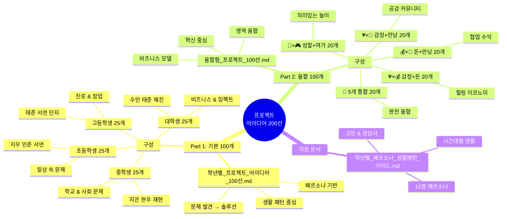
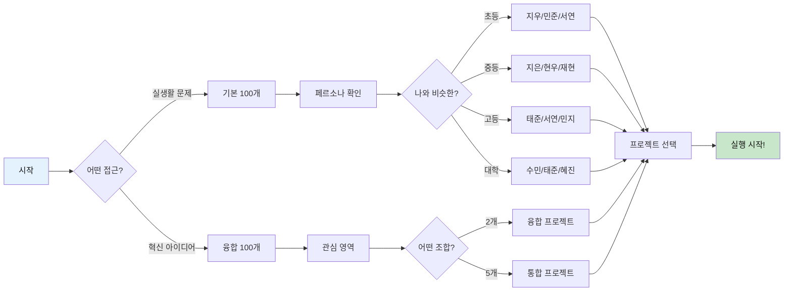
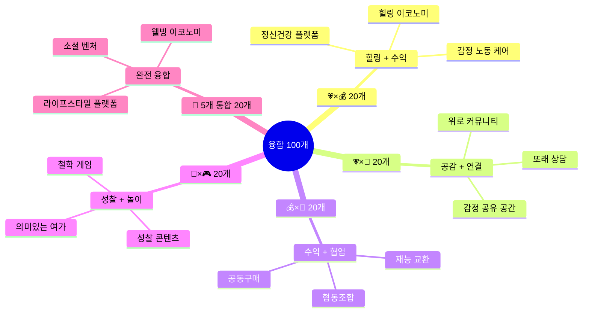
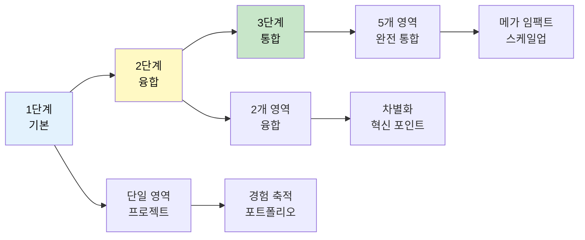

# 🚀 프로젝트 아이디어 200선 - 완전 가이드

> **실전에서 바로 쓸 수 있는 200개의 프로젝트 아이디어**  
> **기본 100개 + 융합 100개 = 혁신과 실용의 완벽한 조화**

---

## 📦 전체 구조 한눈에 보기



---

## 🎯 빠른 시작 가이드

### Step 1: 나에게 맞는 프로젝트 찾기



---

## 📚 파일별 상세 안내

### 1️⃣ 학년별_프로젝트_아이디어_100선.md

**📋 개요**
- **목적**: 실제 학생들의 하루 속에서 발견하는 문제 → 솔루션
- **방법**: 페르소나별 감정 + 생활패턴 → 아이디어 탄생 순간 포착
- **특징**: Journey Map으로 아이디어 발상 과정 시각화

**👥 페르소나 (12명)**

| 학년 | 페르소나 | 유형 | 대표 고민 | 대표 프로젝트 |
|------|---------|------|-----------|-------------|
| **초등** | 지우 (여) | 감정형 | 친구 위로하기 | 친구 칭찬 쿠폰북 |
| **초등** | 민준 (남) | 탐구형 | 호기심 해결 | 나만의 실험 기록 |
| **초등** | 서연 (여) | 활동형 | 친구들과 놀기 | 보드게임 만들기 |
| **중등** | 지은 (여) | 정의형 | 사회 문제 | 학교 매점 개선 |
| **중등** | 현우 (남) | 기술형 | 앱 만들기 | 스터디 매칭 앱 |
| **중등** | 재현 (남) | 창작형 | 콘텐츠 창작 | 웹툰 그리기 |
| **고등** | 태준 (남) | 창업형 | 사업 시작 | 학생 프리랜서 |
| **고등** | 서연 (여) | 철학형 | 삶의 의미 | 철학 카페 운영 |
| **고등** | 민지 (여) | 균형형 | 진로 선택 | 진로 로드맵 앱 |
| **대학** | 수민 (여) | 소셜벤처 | 임팩트 창출 | 청년 웰빙 플랫폼 |
| **대학** | 태준 (남) | 개발자 | 기술 구현 | SaaS 스타트업 |
| **대학** | 혜진 (여) | 크리에이터 | 콘텐츠 수익 | 크리에이터 비즈니스 |

**📊 5대 영역별 분포**

| 영역 | 초등 | 중등 | 고등 | 대학 | 합계 | 특징 |
|------|------|------|------|------|------|------|
| 💗 **감정** | 7개 | 5개 | 4개 | 3개 | **19개** | 공감, 치유, 정서 |
| 💰 **돈** | 3개 | 4개 | 6개 | 7개 | **20개** | 수익, 경제, 창업 |
| 🤝 **만남** | 6개 | 5개 | 5개 | 4개 | **20개** | 관계, 네트워크 |
| 🧘 **성찰** | 4개 | 6개 | 6개 | 6개 | **22개** | 자아, 가치관 |
| 🎮 **여가** | 5개 | 5개 | 4개 | 5개 | **19개** | 창의, 문화 |
| **합계** | **25개** | **25개** | **25개** | **25개** | **100개** | - |

**🎯 활용 방법**
1. 자신과 비슷한 페르소나 찾기
2. 그 페르소나의 Journey Map 보기
3. 공감되는 "문제 발견 순간" 찾기
4. 그 문제를 해결하는 프로젝트 선택
5. 자신만의 방식으로 변형 & 실행

**💡 예시: 중학생 지은이의 경우**
```
1. 페르소나 확인: 정의로운 지은 (정의형)
2. Journey Map: 점심시간 → 매점 줄 → 짜증 💡
3. 문제 발견: "매점 동선이 비효율적"
4. 프로젝트: #33 학교 매점 개선 제안
5. 실행: 우리 학교 매점 분석 → 키오스크 제안서 작성
```

---

### 2️⃣ 융합형_프로젝트_100선.md

**📋 개요**
- **목적**: 단일 영역이 아닌 2개 이상 영역을 융합한 혁신 프로젝트
- **특징**: 영역 경계를 넘나들며 새로운 가치 창출
- **활용**: 공모전 수상작, 스타트업 아이템, 차별화 포인트

**🌈 융합 유형 (5가지)**



**💡 융합의 힘**

| 융합 유형 | 혁신 포인트 | 비즈니스 기회 | 대표 프로젝트 |
|----------|-----------|-------------|-------------|
| **💗×💰** | 감정 해결 + 수익 창출 | 정신건강 시장 급성장 | #111 정신건강 케어 플랫폼 (B2B) |
| **💗×🤝** | 공감 + 커뮤니티 | 외로움 해소 니즈 | #136 정신건강 커뮤니티 |
| **💰×🤝** | 협업으로 수익 | 공유경제, 협동조합 | #156 프리랜서 네트워크 |
| **🧘×🎮** | 재미 + 의미 | 에듀테인먼트 | #176 의미있는 게임 스튜디오 |
| **🌈 5개 통합** | 완전한 라이프스타일 | 통합 플랫폼 | #196 완전 통합 라이프 플랫폼 |

**📈 난이도 & 수익성**

| 레벨 | 난이도 | 개발 기간 | 예상 수익 | 추천 프로젝트 |
|------|--------|----------|----------|-------------|
| **초등** | ⭐ | 1주-1개월 | 0-5만원 | #101-#105 (개인 용돈벌이) |
| **중등** | ⭐⭐ | 1-3개월 | 0-50만원 | #106-#110 (앱/서비스 시작) |
| **고등** | ⭐⭐⭐ | 3-6개월 | 50-300만원 | #111-#115 (B2B 서비스) |
| **대학** | ⭐⭐⭐⭐ | 6-12개월 | 300-1000만원 | #116-#120 (스타트업) |

**🎯 활용 방법**
1. 관심 영역 2개 선택 (예: 감정 + 돈)
2. 해당 융합 프로젝트 20개 탐색
3. 비슷한 문제 의식 찾기
4. 차별화 포인트 발견
5. 비즈니스 모델 수립

**💡 예시: 고등학생 창업형 태준이의 경우**
```
1. 관심 영역: 💗 감정 + 💰 돈
2. 융합 프로젝트: #111 정신건강 케어 플랫폼 (B2B)
3. 문제 의식: 청소년 정신건강 위기
4. 차별화: 학교 대상 B2B 패키지
5. 비즈니스: 학교당 월 30만원 × 10개교 = 월 300만원
```

---

### 3️⃣ 학년별_페르소나_생활패턴_가이드.md

**📋 개요**
- **목적**: 한국 AI 세대 학생의 실제 생활패턴 기반 프로젝트 기획
- **방법**: 페르소나별 일상 → 문제 발견 → AI/메이커 솔루션 설계
- **특징**: 시간대별 상세 패턴 + 감정 + 문제 발견 순간

**📊 페르소나 상세 정보**

각 페르소나마다 다음 정보를 제공합니다:

```
✅ 기본 정보
   - 나이, 학년, 성격, 관심사
   - 디지털 활용 수준
   - 좋아하는 것 / 고민

✅ 하루 생활 패턴 (Gantt Chart)
   - 시간대별 활동
   - 감정 변화
   - 💡 아이디어 발상 순간

✅ 발상된 아이디어 (7-8개)
   - 발상 시간 & 상황
   - 감정 반응
   - 사고 과정 (WHY 5번)
   - 5대 주제 분류

✅ 일주일 패턴 (평일 vs 주말)
   - 요일별 차이
   - 학원, 동아리, 친구 만남

✅ 디지털 생활
   - 사용 앱/도구
   - 온라인 활동
   - 콘텐츠 소비 패턴
```

**🎯 활용 방법**
1. 자신과 가장 비슷한 페르소나 찾기
2. 그 페르소나의 하루 패턴 확인
3. 비슷한 고민/상황 발견
4. 💡 아이디어 발상 순간 참고
5. 자신만의 문제 발견 → 프로젝트화

---

## 🚀 실전 활용 시나리오

### 시나리오 1: 혼자서 프로젝트 시작하기

**상황**: 중학교 2학년, 코딩에 관심 있고, 친구들 고민을 들어주는 걸 좋아함

```
Step 1: 페르소나 찾기
   └─ 비슷한 페르소나: 중등 지은 (정의형) + 현우 (기술형)

Step 2: 관심 영역 확인
   └─ 💗 감정 + 🤝 만남 = 또래 상담에 관심

Step 3: 프로젝트 탐색
   └─ 기본: #26 익명 고민 상담 앱
   └─ 융합: #126 익명 고민 상담 + 또래 연결

Step 4: 프로젝트 선택
   └─ #126 선택 (더 차별화됨)

Step 5: 실행 계획
   Week 1-2: Bubble.io로 프로토타입
   Week 3-4: 우리 반 베타 테스트 (10명)
   Week 5-8: 피드백 반영 & 학교 전체 런칭
```

---

### 시나리오 2: 팀 프로젝트로 공모전 도전

**상황**: 고등학교 3명 팀, 소셜 벤처 공모전 준비

```
Step 1: 팀원 역할 분담
   └─ A: 기획자 (문제 발견, 비즈니스 모델)
   └─ B: 개발자 (기술 구현)
   └─ C: 디자이너 (UI/UX, 발표 자료)

Step 2: 융합 프로젝트 선택
   └─ 💗×💰 영역에서 #111 정신건강 케어 플랫폼 (B2B)
   └─ 이유: 사회적 임팩트 + 수익 모델 명확

Step 3: 차별화 전략
   └─ 기존: 개인 대상 (B2C)
   └─ 우리: 학교 대상 (B2B) ← 차별화!

Step 4: 3개월 실행 계획
   Month 1: 시장 조사 + 프로토타입
   Month 2: 5개 학교 파일럿 테스트
   Month 3: 피칭 자료 + 공모전 제출

Step 5: 목표 설정
   └─ 단기: 공모전 입상
   └─ 장기: 실제 스타트업 창업
```

---

### 시나리오 3: 개인 성장 포트폴리오 만들기

**상황**: 대학생, 졸업 전에 포트폴리오 3개 만들고 싶음

```
Step 1: 레벨별 프로젝트 선택
   └─ 초급: 기본 프로젝트 1개 (1개월)
   └─ 중급: 융합 프로젝트 1개 (2개월)
   └─ 고급: 5개 통합 프로젝트 1개 (3개월)

Step 2: 구체적 프로젝트
   └─ 초급: #90 개인 성장 코칭 사업 (월 수익 50만원)
   └─ 중급: #156 프리랜서 네트워크 (월 수익 200만원)
   └─ 고급: #196 완전 통합 라이프 플랫폼 (월 수익 500만원)

Step 3: 6개월 로드맵
   Month 1: 초급 프로젝트 완성 & 런칭
   Month 2-3: 중급 프로젝트 개발 & 베타
   Month 4-6: 고급 프로젝트 개발 & 정식 런칭

Step 4: 포트폴리오 효과
   └─ 취업: 실전 경험 증명
   └─ 창업: 바로 사업 시작 가능
   └─ 수익: 월 750만원 달성
```

---

## 📊 프로젝트 선택 매트릭스

### 관심사별 추천 프로젝트

| 관심사 | 기본 100개 | 융합 100개 | 난이도 | 수익성 |
|--------|----------|----------|--------|--------|
| **심리/상담** | #26, #51, #76 | #106, #111, #116 | ⭐⭐⭐ | 💰💰💰 |
| **경제/창업** | #33, #56, #79 | #107, #113, #117 | ⭐⭐⭐⭐ | 💰💰💰💰 |
| **교육/학습** | #35, #42, #67 | #146, #156, #176 | ⭐⭐ | 💰💰 |
| **관계/커뮤니티** | #11, #35, #61 | #126, #136, #156 | ⭐⭐ | 💰💰 |
| **철학/성찰** | #17, #40, #66 | #171, #176, #196 | ⭐⭐⭐⭐ | 💰💰 |
| **게임/콘텐츠** | #21, #47, #72 | #161, #171, #176 | ⭐⭐⭐ | 💰💰💰 |

### 목표별 추천 프로젝트

| 목표 | 추천 프로젝트 | 기대 효과 | 소요 시간 |
|------|------------|----------|----------|
| **빠른 프로토타입** | 기본 #1-#25 (초등) | 1주 내 완성 | 5-20시간 |
| **공모전 수상** | 융합 #106-#120 (중고등) | 차별화 포인트 | 100-200시간 |
| **실제 수익** | 융합 #111-#120 (고등대학) | 월 50-300만원 | 200-500시간 |
| **스타트업 창업** | 융합 #196-#200 (5개 통합) | 투자 유치 가능 | 500-1000시간 |
| **포트폴리오** | 기본 + 융합 각 1개 | 실전 경험 증명 | 100-300시간 |

---

## 💡 성공 전략

### 3단계 성장 전략



### 실행 팁

**🎯 초보자 (처음 시작)**
```
✅ 기본 100개에서 가장 공감되는 프로젝트 선택
✅ 1개월 안에 완성 가능한 것으로
✅ 완벽보다는 "일단 만들기"
✅ 10명에게라도 써보게 하기
```

**🎯 중급자 (경험 1-2회)**
```
✅ 융합 100개에서 차별화 포인트 있는 것
✅ 2-3개월 프로젝트
✅ 비즈니스 모델 구체화
✅ 100명 사용자 목표
```

**🎯 고급자 (경험 3회 이상)**
```
✅ 5개 통합 프로젝트 도전
✅ 6-12개월 장기 프로젝트
✅ 실제 수익 또는 투자 유치
✅ 1,000명 이상 사용자
```

---

## 🔗 관련 문서 링크

| 문서 | 설명 | 링크 |
|------|------|------|
| **프로젝트 메인 README** | 전체 프로젝트 개요 | [../README.md](../README.md) |
| **필독서 종합 가이드** | 5대 주제별 독서 리스트 | [../필독서/필독서_종합_가이드.md](../필독서/필독서_종합_가이드.md) |
| **AI 활용 창작 가이드** | AI 협업 창작 방법 | [../AI_활용_창작_가이드.md](../AI_활용_창작_가이드.md) |
| **운영 매뉴얼** | 독서 클럽 운영 방법 | [../운영_매뉴얼.md](../운영_매뉴얼.md) |
| **5대주제 프로젝트 가이드** | 주제별 프로젝트 설계 | [../5대주제_프로젝트_가이드.md](../5대주제_프로젝트_가이드.md) |

---

## 📞 도움이 필요하신가요?

### 질문별 가이드

**Q: "내게 맞는 프로젝트를 모르겠어요"**
→ [학년별_페르소나_생활패턴_가이드.md](./학년별_페르소나_생활패턴_가이드.md)에서 비슷한 페르소나 찾기

**Q: "일반적인 프로젝트는 식상해요"**
→ [융합형_프로젝트_100선.md](./융합형_프로젝트_100선.md)에서 차별화 포인트 찾기

**Q: "어떻게 시작해야 할지 모르겠어요"**
→ [학년별_프로젝트_아이디어_100선.md](./학년별_프로젝트_아이디어_100선.md)에서 공감되는 문제 찾기

**Q: "수익을 내고 싶어요"**
→ [융합형_프로젝트_100선.md](./융합형_프로젝트_100선.md)의 고등/대학 프로젝트 (#111-#120, #196-#200)

**Q: "공모전에 내고 싶어요"**
→ [융합형_프로젝트_100선.md](./융합형_프로젝트_100선.md)의 융합 프로젝트 + 차별화 전략

---

**"200개 중 하나는 반드시 당신의 것입니다!"** 🚀

**지금 바로 시작하세요:**
1. 📖 [학년별_프로젝트_아이디어_100선.md](./학년별_프로젝트_아이디어_100선.md) 열기
2. 🌈 [융합형_프로젝트_100선.md](./융합형_프로젝트_100선.md) 탐색하기
3. 👥 [학년별_페르소나_생활패턴_가이드.md](./학년별_페르소나_생활패턴_가이드.md) 페르소나 확인하기

**Happy Making! 💡✨**
