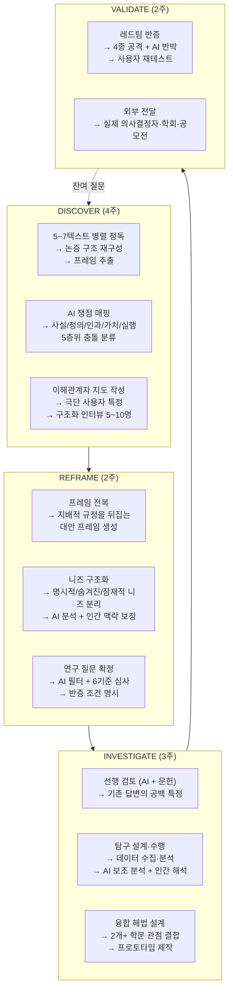
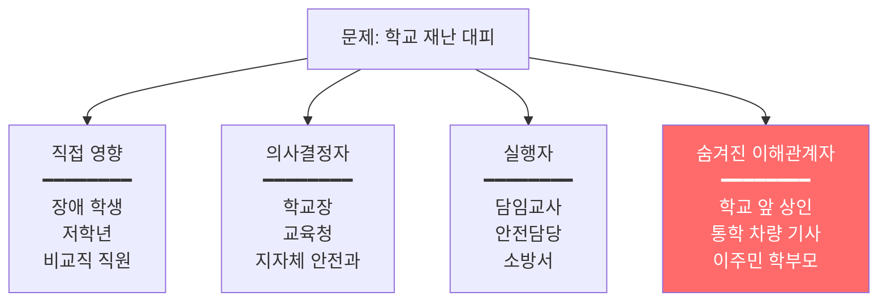
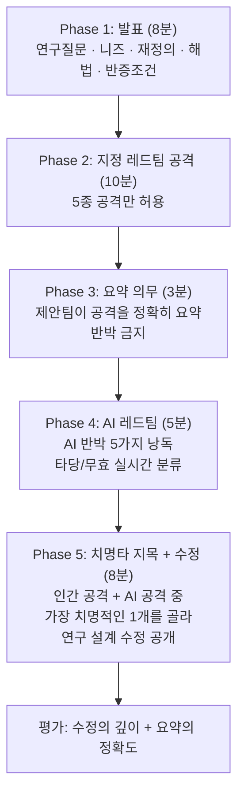
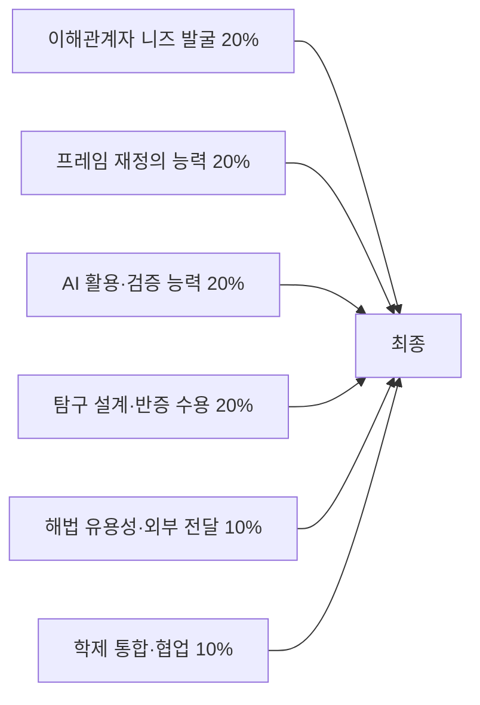

# 독서토론 고등과정 실전 운영 매뉴얼 (2032 개정판)

> 고등 1~3학년 | 36주 | **병렬 독서 × AI 연구 파트너 × 사용자 니즈 기반 융합 연구 프로그램** | 세특·IB·입시 연계 | 교사 지시서 완전판

---

## 0. 이 프로그램의 한 줄 정의

> **"5~7권을 동시에 읽어 프레임 충돌을 만들고, AI를 연구 도구로 활용하면서, 실제 이해관계자의 숨겨진 니즈를 찾아내고, 학문 간 경계를 넘나들며 문제를 재정의하고, 반증을 거친 해결책을 실제 의사결정자에게 전달하는 프로그램"**

고등 과정의 핵심 차별점:
- 초등이 "문제를 찾는 법", 중등이 "문제를 재정의하는 법"을 배운다면, 고등은 **"재정의한 문제를 학문적으로 검증하고 실제 세상에 제안하는 법"**을 배운다
- AI를 **연구의 전 단계에서 고도로 활용**하되, AI가 생산한 모든 것을 **검증하는 능력이 곧 학술적 역량**이다
- 사용자 니즈 발굴이 **이해관계자 분석(stakeholder analysis)**으로 확장된다
- 최종 산출물이 **교실 밖으로 나간다** — 학교장·지자체·학회·공모전·언론

---

## PART 1. 프로그램 엔진 — INQUIRY 7단계



---

## PART 2. AI 고급 활용 프로토콜

### 2.1 AI를 연구의 전 단계에서 쓰되, 모든 단계에서 검증한다

고등 과정에서 AI는 **금지할 대상이 아니라 검증 능력을 키우는 도구**다. 핵심은: **AI가 생산한 것을 그대로 쓰면 0점, AI가 생산한 것의 오류를 찾으면 가점.**

#### 연구 단계별 AI 활용 완전 가이드

| 단계 | AI에게 시키는 것 | 구체적 프롬프트 | 학생 의무 (검증) | 평가 항목 |
|------|----------------|---------------|----------------|----------|
| **텍스트 분석** | 논증 구조 재구성 | "이 텍스트의 핵심 주장, 3개 근거, 숨은 전제, 반례 가능성을 정리해줘" | 원문 대조. AI가 놓친/왜곡한 논거 지적 | 교정 로그 정확도 |
| **프레임 추출** | 저자의 문제 규정 분석 | "이 저자는 이 현상을 무엇의 문제로 규정하고 있어? 그 규정 때문에 보이지 않게 되는 것은?" | AI 분석 vs 원문 대조. 저자의 위치성(직업/학문/국적) 반영 여부 확인 | 위치성 분석의 깊이 |
| **충돌 분류** | 쟁점 층위 판별 | "A와 B의 대립은 사실 다툼인가 가치 다툼인가? 왜 그렇게 판단해?" | AI 판별에 동의/반박 + 근거. 층위 오판 시 교정 | 층위 판별 정확도 |
| **인터뷰 설계** | 질문 초안 생성 | "재난 취약 계층의 숨겨진 니즈를 파악하기 위한 심층 인터뷰 질문 15개를 SPIN 구조로 만들어줘" | 유도 질문 삭제, 검색 가능 질문 삭제, 현장 특화 질문 추가 | 편집 판단의 질 |
| **니즈 분석** | 인터뷰 데이터 패턴 분석 | "이 10명의 인터뷰 원문에서 ①공통 니즈 ②숨겨진 니즈 ③잠재적 니즈를 분리해줘" | AI가 놓친 비언어/맥락/감정 정보 추가. **현장에서만 포착 가능한 것** | 추가 정보의 가치 |
| **가설 반증** | 가설에 대한 반박 생성 | "이 가설을 반증하는 논거를 5개 만들어줘. 가능하면 구체적 데이터를 인용해서" | 각 반박의 ①타당성 ②인용 출처 존재 여부 확인 | 환각 검출 + 타당성 판단 |
| **선행 검토** | 유사 연구/사례 검색 | "이 연구 질문과 관련된 기존 연구/정책/사례를 10개 찾아줘" | **모든 출처 원문 확인**. 존재하지 않는 문헌 = 환각 → 삭제 | 환각 검출률 |
| **데이터 분석** | 수집 데이터 통계/패턴 | "이 설문 결과에서 유의미한 패턴과 상관관계를 찾아줘" | 상관을 인과로 오독하지 않았는지 / 교란변수 가능성 / 표본 편향 | 통계 리터러시 |
| **해법 반박** | 제안서 약점 발견 | "이 제안서를 가장 싫어할 이해관계자의 관점에서 약점 5가지를 찾아줘" | 진짜 약점 vs 헛다리 구분. 진짜만 반영해 수정 | 수정의 깊이 |
| **문구 교정** | 보고서 퇴고 | "이 보고서의 논리적 비약과 근거 부족 부분을 지적해줘" | **구조(주장·근거·전제·반증)는 학생이 짠다**. AI는 다듬기만 | 구조의 독자성 |

### 2.2 AI 검증 능력 평가표 (고등 전용 — 20점)

| 항목 | 5점 | 3점 | 1점 | 배점 |
|------|-----|-----|-----|------|
| **환각 검출** | 인용 출처 10개 중 환각 전부 발견 | 일부 발견 | 미검증 | /5 |
| **논증 교정** | AI의 논증 재구성에서 오류/왜곡 3건+ 발견 | 1~2건 발견 | 미대조 | /5 |
| **반박 분류** | AI 반박 중 타당/무효를 정확히 분류 | 대략적 분류 | 전부 수용 | /5 |
| **적절성 판단** | AI가 적합한 장면과 부적합한 장면을 명시적으로 구분 | 일부 구분 | 무차별 사용 | /5 |

> **핵심 메시지**: 2032년의 학술적 역량은 "잘 쓰는 것"이 아니라 **"AI가 쓴 것을 정확하게 검증하는 것"**이다. 이 20점이 기존의 글쓰기 평가를 대체한다.

### 2.3 AI 활용 완전 기록지 (연구 제출 시 필수 첨부)

```
┌──────────────────────────────────────────────────────┐
│              AI 연구 파트너 활용 전체 기록               │
├──────────────────────────────────────────────────────┤
│ 학생: _______ 클러스터: _________                     │
│                                                        │
│ [사용 빈도]                                            │
│   AI 사용 총 세션: ____회                              │
│   질문 필터로 폐기한 질문: ____개                      │
│                                                        │
│ [검증 기록] (각 건별 상세)                              │
│ ┌────┬──────────┬──────────┬─────────────┐           │
│ │ # │ AI가 말한 것 │ 실제(원문확인) │ 어떻게 확인했나│    │
│ ├────┼──────────┼──────────┼─────────────┤           │
│ │ 1 │          │          │             │            │
│ │ 2 │          │          │             │            │
│ │ 3 │          │          │             │            │
│ │ …  │          │          │             │            │
│ └────┴──────────┴──────────┴─────────────┘           │
│                                                        │
│ [AI가 못 해서 내가 직접 한 것]                          │
│ □ 이해관계자 인터뷰 ___명 (AI 불가능)                  │
│ □ 현장 조사 ___회 (AI 불가능)                         │
│ □ 데이터 직접 수집 (설문/관찰/측정)                    │
│ □ 가치 판단 (AI는 판단하되 책임지지 않음)              │
│ □ 프레임 전복 검증 (사용자에게 되물어 확인)             │
│ □ 레드팀에서 받은 공격 선별적 수용                     │
│                                                        │
│ [AI를 가장 잘 활용한 순간]                              │
│ 장면: __________________________________________      │
│ 왜 이 장면에서 AI가 유용했나:                          │
│ ______________________________________________        │
│                                                        │
│ [AI를 써서는 안 됐던 순간 (있었다면)]                   │
│ 장면: __________________________________________      │
│ 왜: ____________________________________________      │
│                                                        │
│ [이 연구에서 AI가 가장 크게 틀린 순간]                  │
│ AI의 출력: ______________________________________     │
│ 실제: __________________________________________      │
│ 이 오류가 반영됐다면 연구에 미쳤을 영향:                │
│ ______________________________________________        │
│                                                        │
└──────────────────────────────────────────────────────┘
```

---

## PART 3. 이해관계자 니즈 발굴 — 고등 심화 프로토콜

### 3.1 이해관계자 지도 (Stakeholder Map) — 초등의 "사용자 찾기"에서 확장

고등에서는 단순히 "곤란한 사람"을 찾는 것을 넘어, **그 문제를 둘러싼 모든 관계자의 이해관계를 매핑**한다.



> **교사 지시**: "빨간색 영역(숨겨진 이해관계자)이 연구의 가치를 결정한다. AI에게 '이 문제의 이해관계자 목록'을 물으면 A~C만 나온다. D를 찾는 것이 학생의 일이다."

### 3.2 극단 사용자(Extreme User) 인터뷰 전략

**누구를 만나야 하는가**: 평균적 사용자가 아니라 **가장 크게 영향받는 사람**과 **가장 보이지 않는 사람**.

| 유형 | 이 사람을 만나는 이유 | 지진 클러스터 예시 |
|------|---------------------|------------------|
| **가장 큰 영향** | 문제의 심각성을 극한까지 보여줌 | 휠체어 학생 — 계단 대피 불가 |
| **가장 안 보이는** | 시스템이 간과한 사각지대 발견 | 학교 앞 분식집 사장 — 학생 대피 시 차도 혼잡 |
| **가장 오래 겪은** | 패턴과 실패의 역사를 알고 있음 | 20년 경력 소방관 — 과거 훈련의 한계를 축적 |
| **전혀 다른 맥락** | 프레임 전복의 단서 제공 | 일본 거주 경험 학부모 — 다른 시스템과 비교 |

### 3.3 심층 인터뷰 프로토콜 (고등 — 30분 × 5~10명)

| 단계 | 시간 | 질문 유형 | 구체적 예시 | 학생 행동 |
|------|------|---------|-----------|----------|
| **래포** | 0~2분 | 자기소개 + 목적 | "안녕하세요, 저희는 학교 재난 대피 개선 프로젝트를 하고 있습니다. 30분 정도 경험을 여쭤봐도 될까요?" | 동의 확인. 녹음 여부 합의 |
| **S** | 2~7분 | 현재 상황 | "대피 훈련 때 보통 어떤 일이 일어나나요? 처음부터 끝까지 시간 순서대로 말씀해주세요" | **시간순 행동 지도** 그리기 |
| **P** | 7~12분 | 문제·불편 | "그 과정에서 가장 불안하거나 불편한 순간은 언제인가요?" + "왜 그 순간이 특히요?" | **감정 메모** — 말보다 표정·멈춤 |
| **I** | 12~20분 | 영향·파급 | "그게 잘 안 되면 어떤 일이 벌어질까요?" → "그래서 어떤 기분이세요?" → **"왜"를 5번** | **숨겨진 니즈 채굴** |
| **프레임** | 20~25분 | 규정 질문 | "이 문제가 해결 안 되는 가장 큰 이유가 뭐라고 생각하세요?" | 이 사람의 **프레임** 포착 |
| **N** | 25~28분 | 바람 | "제약 없이 뭐든 할 수 있다면 어떻게 바꾸고 싶으세요?" | 해법 방향 힌트 |
| **검증** | 28~30분 | 되물어 확인 | "정리하면, ○○님은 ~할 때 ~때문에 ~가 곤란하시고, ~됐으면 한다는 거죠?" | 사용자 "맞아요" 확인 |

### 3.4 니즈 3층 분리 (고등 심화)

| 층 | 정의 | 발견 방법 | 예시 |
|----|------|---------|------|
| **명시적 니즈** | 사용자가 직접 말한 것 | P 질문 | "방송이 안 들려요" |
| **숨겨진 니즈** | 말은 안 했지만 행동/감정에서 드러나는 것 | I 질문 + 관찰 | "사실 혼자서 무서웠어요" (고립감) |
| **잠재적 니즈** | 사용자도 모르지만 프레임 분석에서 추론되는 것 | 프레임 전복 + 구조 분석 | "계획 수립에 참여할 권리 자체가 없었다" |

> **AI 한계**: AI는 명시적 니즈를 잘 정리한다. 숨겨진 니즈는 일부 추론한다. **잠재적 니즈는 AI가 거의 발견하지 못한다** — 이것이 학생 연구의 학술적 기여 지점이다.

### 3.5 이해관계자 니즈 통합표 (팀 제출용)

| 이해관계자 | 명시적 니즈 | 숨겨진 니즈 | 잠재적 니즈 | AI 인식 | 프레임 |
|-----------|-----------|-----------|-----------|---------|--------|
| 경비원 | 방송 안 들림 | 고립감·공포 | 계획 참여 배제 | △ | 정보 문제 |
| 장애 학생 | 계단 못 내려감 | 의존에 대한 수치심 | 보편적 설계 부재 | ○ | 시설 문제 |
| 1학년 교사 | 공황 통제 어려움 | 책임 과부하 | 교사 재난 교육 부재 | △ | 훈련 문제 |
| 학교 앞 상인 | 학생 쏟아지면 위험 | 재난 때 학교와 소통 없음 | 학교-지역 경계의 책임 공백 | ✕ | 경계 문제 |
| 이주민 학부모 | 한국어 안내 못 읽음 | 정보 요청 자체가 어려움 | 다문화 재난 소통 부재 | ✕ | 언어/포용 문제 |

> 이 표에서 **AI가 ✕인 칸이 연구의 독창적 기여(academic contribution)**가 된다. 세특과 자소서의 소재도 여기서 나온다.

---

## PART 4. 프레임 분석·전복 — 고등 심화

### 4.1 프레임 분석 6요소 (고등 완전판)

텍스트(또는 이해관계자의 발언)를 이 6요소로 해부한다.

| 요소 | 질문 | AI 보조 | 학생 판단 |
|------|------|---------|----------|
| **규정** | 이 현상을 무엇의 문제로 보는가? | AI가 추출 | 학생이 원문 대조 |
| **원인** | 무엇을 원인으로 지목하는가? | AI가 추출 | 인과 vs 상관 구분 |
| **해법** | 규정에서 자동으로 따라오는 해법은? | AI가 추론 | 학생이 대안 해법 생성 |
| **배제** | 이 프레임에서 보이지 않게 되는 것은? | **AI가 잘 못 함** | 학생의 핵심 작업 |
| **수혜자** | 이 프레임이 유지되면 누가 이익인가? | AI 일부 추론 | 학생이 구조 분석 |
| **위치성** | 이 프레임을 쓰는 사람의 직업/학문/이해관계는? | AI가 기본 정보 | 학생이 맥락 판단 |

### 4.2 프레임 전복 실전 — 3단계 프로토콜

| 단계 | 교사 지시 | 구체 행동 | AI 역할 |
|------|----------|----------|---------|
| **1. 지배적 프레임 확인** | "5~7텍스트와 인터뷰 결과를 종합하면, 이 문제를 가장 많이 규정하는 프레임은?" | 모둠 투표 → "정보 전달 문제" (4/7 텍스트) | AI: 텍스트별 프레임 분류 보조 |
| **2. 강제 전복** | "이제 10분간 이것을 **절대 정보 문제가 아닌 것으로** 봅니다. 무엇의 문제입니까?" | 모둠 토론: "관계 문제", "구조 문제", "권리 문제" 등 | AI: "이 문제를 정보 문제가 아니라 권리 문제로 분석해줘" |
| **3. 사용자 검증** | "이 재정의가 맞는지 한 가지만 확인하면 됩니다. 무엇을 물어보겠습니까?" | 학생 설계: "대피 계획을 세울 때 참여한 적 있나요?" | AI: 불가능. 학생만 가능. |

### 4.3 학문 간 융합 해법 설계

**한 학문만으로는 풀 수 없는 문제**를 의도적으로 선택한다.

| 문제 | 학문 A만의 해법 | 학문 B만의 해법 | A+B 융합 해법 |
|------|---------------|---------------|--------------|
| 경비원 대피 공백 | 공학: 시각 경보 장치 설치 | 사회학: 비교직 직원 포용 정책 | **시각 경보 + 계획 참여 제도를 함께 제안** (기술이 구조 변화 없이 도입되면 형식화됨) |
| 이주민 안내 부재 | 언어학: 다국어 표지판 | 사회학: 커뮤니티 리더 네트워크 | **다국어 표지 + 커뮤니티 연락망을 함께 구축** (표지판만으로는 읽지 않는 사람에게 도달 못 함) |

> **교사 지시**: "학문 하나만의 해법이 왜 불충분한지를 반드시 밝혀라. 그래야 융합의 이유가 생긴다. '멋있으니까 융합'은 융합이 아니다."

---

## PART 5. 대표 클러스터 — 「흔들리는 땅」 고등 완전 실행

### 5.1 11주 실행표

| 주 | 단계 | 핵심 활동 | AI 사용 | AI가 못 하는 것(학생) | 산출물 |
|----|------|----------|---------|---------------------|--------|
| 1 | DISCOVER | 데이터 충격: 규모 대비 사망자 산점도의 잔차 | 데이터 시각화 | 잔차 해석 가설 | 초기 가설 |
| 2~3 | DISCOVER | 7텍스트 직소 정독 → 논증 구조 재구성 | 논증 추출 보조 | 원문 대조 교정 3건+ | 논증 재구성표 7종 |
| 4 | DISCOVER | **★ 이해관계자 인터뷰 5~10명** | 인터뷰 설계 + 패턴 분석 | 직접 만남 + 감정·맥락 포착 | 니즈 통합표 |
| 5 | REFRAME | 프레임 해부 + 전복 세미나 | 다중 프레임 분석 | 사용자에게 재정의 검증 | 프레임 전복 기록 |
| 6 | REFRAME | 연구 질문 확정: AI 필터 → 6기준 → 반증 조건 | 질문 필터 + 선행 검색 | 반증 조건 자기 설정 | 연구 질문서 |
| 7 | INVESTIGATE | 선행 검토 (AI 문헌 검색 + 원문 확인) | 문헌 검색 | **환각 검출 + 원문 확인** | 선행 검토 노트 |
| 8 | INVESTIGATE | 탐구 설계·수행 (설문/인터뷰/데이터/현장) | 설문 설계 + 데이터 분석 | 현장 수집 + 인과 판단 | 원자료 + 분석 |
| 9 | INVESTIGATE | 융합 해법 설계 + 프로토타입 | 아이디어 생성 | 현장 기반 아이디어 + 사용자 테스트 | 시제품 v1 |
| 10 | VALIDATE | **레드팀**: 타 팀 + AI + 교사 적대 검증 | AI 반박 5가지 | 반박 분류 + 수정 | 시제품 v2 |
| 11 | VALIDATE | 사용자 최종 테스트 + **외부 전달** | 제안서 교정 | 발표·설득·전달 | 최종 보고서 |

### 5.2 실전 지도안: 이해관계자 인터뷰 + 프레임 전복 연결 (4~5주차, 120분×2)

#### 4주차: 인터뷰 실행

| 시간 | 활동 | AI 사용 | 학생 행동 |
|------|------|---------|----------|
| 0~20분 | 이해관계자 지도 완성 | "학교 재난 대피의 이해관계자를 4분류(직접영향/의사결정/실행/숨겨진)로 나열해줘" | AI 목록에서 **숨겨진 이해관계자를 추가** ("학교 앞 문방구", "통학 버스 기사") |
| 20~30분 | 인터뷰 질문 최종화 | AI SPIN 질문 15개 → 편집 | 유도 질문 삭제 + 현장 특화 질문 추가 |
| 30~80분 | **★ 현장 인터뷰** | 불가능 | 5~10명 분산 인터뷰. 30분 SPIN 프로토콜 |
| 80~100분 | 니즈 워크시트 즉시 작성 | 불필요 | **3분 이내** 감정·맥락 기록 (기억 휘발 방지) |
| 100~120분 | AI 패턴 분석 + 인간 보정 | 인터뷰 텍스트 입력 → 패턴 추출 | "AI가 놓친 것" 3건 추가 |

#### 5주차: 프레임 전복

| 시간 | 활동 | 교사 스크립트 |
|------|------|-------------|
| 0~20분 | 니즈 통합표 완성 | "이 표에서 AI가 ✕인 칸, 즉 AI가 전혀 인식하지 못한 니즈가 우리 연구의 독창적 기여입니다. 그 니즈를 발견하게 만든 인터뷰 순간을 구체적으로 복원하세요." |
| 20~40분 | 지배적 프레임 확인 | "7텍스트와 인터뷰를 종합하면, 이 문제를 가장 많이 '무엇의 문제'로 규정했나요? AI한테도 물어봅시다." |
| 40~65분 | **강제 전복** | "이제 그 프레임을 **금지**합니다. '정보 문제'라는 말을 10분간 쓸 수 없습니다. 이것은 무엇의 문제입니까?" → 모둠 토론 |
| 65~85분 | 사용자 검증 설계 | "이 재정의가 맞는지 확인할 **질문 딱 하나**를 설계하세요. 다음 주에 실제로 물어봅니다." |
| 85~105분 | HMW 전환 | 기존 HMW vs 재정의 HMW. "어떤 것이 더 근본적인가? 왜?" |
| 105~120분 | 연구 질문 초안 | AI 필터 + 6기준 적용. "반증 조건이 비면 질문으로 인정하지 않습니다." |

### 5.3 레드팀 프로토콜 (고등 — 5종 공격 + AI)



**5종 공격** (고등 확장판)

| 공격 | 형식 | 예시 |
|------|------|------|
| **니즈 공격** | "그 니즈는 보편적인가 특수한가?" | "5명 중 2명만 말한 니즈로 제도 변경을 제안하는가?" |
| **프레임 공격** | "다른 프레임이 더 설명력 있지 않나?" | "관계 문제가 아니라 단순 예산 문제일 수 있다" |
| **방법 공격** | "그 데이터로 그 주장을 지지할 수 있는가?" | "설문 표본 30명으로 학교 전체를 대표할 수 없다" |
| **부작용 공격** | "이 해법의 2차 피해는?" | "경비원 회의 참여 → 근무시간 증가 → 처우 문제" |
| **실행 공격** | "누가 결정하고 누가 비용을 내나?" | "교육청 예산이 필요한데 의사결정 경로를 제시하라" |

---

## PART 6. 연간 커리큘럼

### 6.1 고1 — 클러스터 독서와 니즈 발굴의 기초 (3클러스터 × 11주)

| 클러스터 | 주제 | 진짜 사용자 | AI 핵심 | 융합 | 산출물 |
|---------|------|-----------|---------|------|--------|
| C1 | **흔들리는 땅** | 학교 비교직·장애 학생·지역 주민 | 질문 필터 + 패턴 분석 | 과학×공학×사회×윤리×문학 | 학교 재난 개선 제안서 |
| C2 | **몸의 값** | 보건교사·만성질환 학생·간병 학부모 | 의학 데이터 분석 + 환각 검증 | 생명과학×사회학×경제×윤리×서사 | 건강 접근성 보고서 |
| C3 | **기계가 고른 답** | AI 교체 경험 노동자·AI 사용 교사 | AI 자체가 연구 대상이자 도구 | 컴퓨터과학×인지×법×노동×윤리 | AI 판단 가이드라인 |

### 6.2 고2 — 계열 심화 (전공 연계 + 세특)

| 계열 | 클러스터 | 핵심 재정의 | 극단 사용자 | 산출물 |
|------|---------|-----------|-----------|--------|
| 인문·사회 | **경계와 소속** | "보호 장치인가 배제 장치인가" | 이주민·무국적자·난민 경험자 | 시민권 정책 비평 |
| 인문·사회 | **일의 소멸** | "기술 문제인가 협상력 문제인가" | 플랫폼 노동자·자영업자 | 노동 변동 실증 보고서 |
| 자연·공학 | **에너지 전환** | "과학 문제인가 정치 문제인가" | 에너지 빈곤 가구·시설팀 | 지역 전환 시나리오 |
| 자연·공학 | **감염병** | "의학 문제인가 신뢰 문제인가" | 의료진·방역 경험 자영업자 | 대응체계 제안 |
| 의약 | **돌봄** | "가족의 일인가 사회의 일인가" | 돌봄 노동자·치매 가족 | 돌봄 정책 보고서 |
| 예술·교육 | **기억의 형식** | "누구의 기억이 공공 기억이 되나" | 유족·기록활동가 | 기억 아카이브 |

### 6.3 고3 — 압축 + 입시 전환

| 시기 | 운영 | 목적 |
|------|------|------|
| 3~6월 | 1클러스터 집중(11주) + 개인 심화 | 세특 본체 완성 |
| 7~8월 | 탐구 서사 워크숍 | 질문 이동 궤적 → 문장화 |
| 9~11월 | 적대적 심문 훈련 (면접 대비) | AI 면접 + 교차 심문 |
| 12월 | 3년 포트폴리오 | 학업역량 서사 종합 |

---

## PART 7. 입시 연계 — 세특·자소서·면접

### 7.1 세특 서술의 핵심: "질문이 어떻게 바뀌었는가"

| | Before (책 나열형) | After (탐구 궤적형) |
|---|---|---|
| **내용** | 읽은 책과 느낀 점 | 질문의 이동 경로 |
| **구조** | 도서명 → 내용 요약 → 감상 | 최초 질문 → 프레임 충격 → 재정의 → 탐구 → 반증 수용 → 남은 질문 |
| **AI 방어력** | AI 대필 가능 | AI 대필 불가능 (현장 인터뷰·반증 수용은 경험 기반) |

#### 세특 서술 모범 예시

> 동일 규모 지진의 국가별 사망자 격차 데이터에서 지진 규모로 설명되지 않는 잔차에 의문을 품고, 지구과학·구조공학·재난사회학·윤리·증언 문학 7개 텍스트를 병렬 정독하여 관점별 논증 구조를 재구성함. 초기에는 '정보 전달 실패'로 문제를 규정했으나, 학교 경비원·장애 학생·이주민 학부모 등 10명의 구조화 인터뷰에서 **'대피 계획 수립 과정에 비교직 직원이 배제되어 있다'**는 숨겨진 니즈를 발견하고, 문제를 '정보'에서 **'참여 구조의 배제'**로 재정의함. 이 재정의를 경비원에게 직접 검증("계획에 참여한 적 있나요?" — "없어요")받은 뒤, 시각 경보 시스템(공학) + 계획 참여 제도(사회학)를 결합한 융합 해법을 설계함. 레드팀 검증에서 "근무시간 증가 문제"를 지적받아 '분기별 10분 체크리스트 참여'로 실행 규모를 축소 수정하였고, 최종 제안서를 학교 안전위원회에 제출함. AI를 문헌 검색과 인터뷰 패턴 분석에 활용하되, AI 출력의 환각 3건(존재하지 않는 논문 인용)을 발견·삭제함. **남은 질문**: 이 참여 배제 구조가 학교에 한정된 것인지 다른 공공 시설에서도 반복되는지 — 이를 대학에서 공공정책 관점으로 탐구하고자 함.

> **이 서술이 AI 대필 불가능한 이유**: ①경비원 인터뷰는 현장 기반 ②프레임 전복의 구체적 순간("없어요") ③레드팀 공격과 수정 내용 ④AI 환각 검출 기록 — 모두 실제 수행 없이 조작하면 구술 면접에서 즉시 탈로남

### 7.2 면접 대비 — 적대적 심문 훈련

**면접 = 자기 탐구를 방어하는 게임**

| 심문 유형 | 질문 예시 | 훈련 포인트 |
|----------|----------|-----------|
| **니즈 심문** | "그 니즈를 5명한테만 듣고 일반화할 수 있나요?" | 표본의 한계를 방어 아닌 인정 + 그 안에서의 유효 범위 진술 |
| **프레임 심문** | "정보 문제가 아니라 참여 문제라는 근거가 충분합니까?" | 사용자 검증 순간을 구체적으로 복원 |
| **AI 심문** | "이 정도는 AI도 하지 않습니까? 본인이 한 건 뭡니까?" | AI가 못 한 3가지를 즉답: ①인터뷰 ②프레임 전복 검증 ③반증 수용 |
| **반증 심문** | "무엇을 확인하면 본인 결론이 틀렸다고 인정하겠습니까?" | 즉답 가능해야 함. 반증 조건이 없으면 연구가 아님 |
| **동기 심문** | "왜 하필 이 질문이었습니까?" | 프레임 충격의 순간("'없어요'라는 답을 듣고 —")을 서사로 |

**AI 면접 연습 프롬프트**:
```
"나는 [학과명] 면접 교수다. 이 학생의 세특을 읽었다.
가장 날카로운 질문 5개를 해줘.
특히 ①표본 타당성 ②프레임 전복의 근거 ③AI 의존 의심
④반증 조건 ⑤동기의 진정성을 공격해줘."
```
→ 학생은 즉답 연습. 못 답하면 준비 부족.

---

## PART 8. 평가 시스템

### 8.1 평가 비중



### 8.2 고등 통합 루브릭 (30점)

| 영역 | A (5) | B (4) | C (3) | D (2) | E (1) |
|------|-------|-------|-------|-------|-------|
| **니즈 발굴** | 숨겨진+잠재적 니즈 발견, 사용자 검증 완료 | 숨겨진 니즈 발견 | 명시적 니즈 파악 | 인터뷰 피상적 | 미실행 |
| **프레임 재정의** | 지배 프레임을 전복하고 사용자 검증까지 수행 | 대안 프레임 적용 | 프레임 인식 | 단일 프레임 | 없음 |
| **AI 검증** | 환각 3건+ 발견 + 반박 분류 정확 + 적절성 판단 | 검증 실행 | AI 의존 | 미검증 | 미사용 |
| **탐구 설계** | 반증 조건 명시 + 방법 타당 + 한계 인식 | 설계 적절 | 설계 제시 | 부적합 | 없음 |
| **반증 수용** | 레드팀 치명타를 인정하고 설계 실제 변경 | 일부 수정 | 인지 | 방어만 | 거부 |
| **융합·전달** | 2개+ 학문 결합 + 외부 전달 | 2개 학문 연결 | 1개 관점 | 나열 | 없음 |

### 8.3 AI 검증 능력 별도 평가 (20점 — PART 2.2 참조)

---

## PART 9. 운영 실무

### 9.1 인터뷰 대상 확보 체크리스트

| 시기 | 교사 업무 | 유의사항 |
|------|----------|---------|
| **4주 전** | 인터뷰 후보 15명 리스트 (학교 5 + 지역 5 + 전문가 5) | 극단 사용자 반드시 포함 |
| **2주 전** | 사전 동의서 + 시간 확보 (30분) | 미성년자 인터뷰 시 보호자 동의 |
| **1주 전** | 학생에게 대상 배정 + 연락 정보 + 비상 연락 | 안전 계획 |
| **당일** | 교사 순회 관찰. 개입 최소화 | 학생이 뜻밖의 답을 듣는 순간이 교육 |
| **이후** | 대상자에게 감사 + 최종 결과물 공유 | 관계 유지 → 다음 클러스터 자원 |

### 9.2 위기 대응

| 상황 | 대응 |
|------|------|
| **AI에 완전 의존** | AI 출력 원문 + "틀린 것 3개 찾기" 필수. AI 기록지 없으면 제출 불인정 |
| **인터뷰에서 민감 정보** | 사전 윤리 교육. 개인 식별 정보는 보고서에 포함 금지 |
| **재정의가 안 됨** | 교사가 의도적으로 다른 프레임 투입: "만약 이걸 ○○의 문제로 본다면?" |
| **연구가 실패** | 실패 보고서가 정식 산출물. "왜 이 방법으로는 답할 수 없는가"는 유효한 결론 |
| **세특과 연결 안 됨** | 7.1의 서술 구조(질문 이동 궤적)를 따르면 자동 연결됨 |
| **AI로 제안서 대필** | 구조(주장·근거·전제)는 자필 의무 + **구술 심문**으로 판별 |

### 9.3 학기말 보고서

```
═══════════════════════════════════════════════════
     고등 클러스터 연구 학기말 보고서
═══════════════════════════════════════════════════
학생: __________ (고__ / __학기)
클러스터: 「__________________________」

[질문의 이동 궤적] ★ 핵심
──────────────────────────────────────────────────
최초 질문: 「__________________________________」
프레임 충격:
 "____라고 생각했는데, ____를 만나서/읽고서
  사실은 ____의 문제였다는 것을 알았다."
재정의 후: 「__________________________________」
사용자 검증 순간:
 "___에게 '____?'라고 물었더니 '____'라고 답했다."
최종 연구 질문: 「_______________________________」
반증 조건: ______________________________________

[이해관계자 니즈 발견]
──────────────────────────────────────────────────
인터뷰 수: ___명 (직접 영향 / 의사결정 / 숨겨진)
가장 중요한 발견:
 명시적: ________________________________________
 숨겨진: ________________________________________
 잠재적: ________________________________________
 이 중 AI가 발견 못한 것: ________________________

[AI 활용 요약]
──────────────────────────────────────────────────
AI 세션 수: ___회
환각 검출: ___건 (가장 큰 환각: _______________)
AI가 못 해서 내가 직접 한 것: __________________
AI를 가장 잘 쓴 순간: __________________________

[레드팀 검증]
──────────────────────────────────────────────────
받은 치명타 (인간): ____________________________
받은 치명타 (AI): ______________________________
실제 수정 내용: ________________________________

[역량 성장]          학기초 → 학기말
──────────────────────────────────────────────────
니즈 발굴력:       ☆☆☆☆☆ → ☆☆☆☆☆
프레임 재정의:     ☆☆☆☆☆ → ☆☆☆☆☆
AI 검증력:         ☆☆☆☆☆ → ☆☆☆☆☆
학제 통합:         ☆☆☆☆☆ → ☆☆☆☆☆
반증 수용:         ☆☆☆☆☆ → ☆☆☆☆☆

[외부 전달]
──────────────────────────────────────────────────
제출처: __________  형식: __________
반응: ____________________________________________

[세특 연계 문장 초안]
──────────────────────────────────────────────────


[남은 질문 — 대학으로]
──────────────────────────────────────────────────
1.
2.

담당교사: _______ (인)    날짜: ____/__/__
═══════════════════════════════════════════════════
```

### 9.4 학부모 안내문

```
━━━━━━━━━━━━━━━━━━━━━━━━━━━━━━━━━━━
   [고등 독서토론] 프로그램 안내
━━━━━━━━━━━━━━━━━━━━━━━━━━━━━━━━━━━

■ 무엇을 하나요
  한 주제를 5~7권으로 동시에 읽고,
  AI를 연구 도구로 활용하면서,
  실제 이해관계자를 만나 인터뷰하고,
  문제를 재정의해서
  검증된 해결책을 실제 기관에 전달합니다.

■ AI를 쓴다고요?
  네. 연구의 전 단계에서 적극 활용합니다.
  단, 세 가지를 가르칩니다:
  ① AI가 잘못 만든 것(환각)을 찾아내는 법
  ② AI 반박 중 진짜와 헛다리를 구분하는 법
  ③ AI가 절대 대신 못 하는 것을 아는 법
  이 세 가지가 2032년의 진짜 학술 역량입니다.

■ 사람을 만난다고요?
  네. 학교 경비원, 장애 학생, 이주민 학부모,
  소방관, 지역 주민 등 5~10명을
  구조화된 프로토콜로 인터뷰합니다.
  AI가 절대 발견 못하는 진짜 문제는
  사람 속에만 있습니다.

■ 입시와의 관계
  이 과정이 곧 세특의 본체입니다.
  '읽은 책'이 아니라 '질문이 바뀐 궤적'이
  기록됩니다. AI가 대필할 수 없는
  유일한 종류의 서술입니다.

■ 가정에서
  1. "몇 권 읽었니" 대신
     "어떤 질문이 바뀌었니"
  2. "누구를 만났고, 뭘 발견했니"
  3. 생각을 바꾸면 칭찬해주세요.
     생각을 고치는 것이 성과입니다.
  4. 실패한 탐구도 성과로 평가됩니다.
━━━━━━━━━━━━━━━━━━━━━━━━━━━━━━━━━━━
```

---

## PART 10. 교사 발문 은행 (핵심만)

### 니즈 발굴 발문

| 발문 | 목적 |
|------|------|
| "AI에게 물어보면 뭐라고 하나요? 그럼 그 답에 없는 건 뭐죠?" | AI 한계 인식 |
| "이 사람이 말은 안 했지만 표정이나 행동에서 느낀 건?" | 숨겨진 니즈 |
| "이 사람이 이 문제를 이렇게 규정하는 이유는 뭘까요? 그 사람의 위치 때문은 아닌가요?" | 프레임과 위치성 |
| "5명 인터뷰에서 AI가 전혀 모르는 것은 무엇이었나요? 그것이 연구의 기여입니다." | 독창적 기여 특정 |

### 프레임·재정의 발문

| 발문 | 목적 |
|------|------|
| "이 문제를 지금 프레임 말고 다른 것으로 규정하면 무엇이 보입니까?" | 프레임 전복 |
| "이 프레임이 유지되면 누가 이익이고 누가 손해입니까?" | 구조 분석 |
| "이 재정의가 맞는지 한 가지만 확인하면 됩니다. 무엇을 물어보겠습니까?" | 검증 설계 |

### 반증 발문

| 발문 | 목적 |
|------|------|
| "무엇을 관찰하면 당신 결론이 틀렸다고 인정하겠습니까?" | 반증 조건 |
| "AI가 준 이 반박, 진짜 아픈 것은 어느 것입니까?" | AI 반박 분류 |
| "이 제안을 가장 싫어할 사람은 누구이고, 그 사람 말에 일리가 있나요?" | 반대자 이해 |

---

> **운영 참고**: 주 1회(120분) 기준 11주 = 1클러스터, 연 3클러스터. IB 학교는 TOK와 병행해 주 2회 운영 권장. 고3은 1학기 1클러스터 후 2학기 전체를 탐구 서사 정리 + 적대적 심문 훈련으로 전환.

---

*최종 업데이트: 2026년 8월 6일 (AI 연구 파트너 + 이해관계자 니즈 중심 2032 개정판)*
