# 독서토론 고등과정 실전 운영 매뉴얼

> 고등학교 1~3학년 대상 | 36주 연간 커리큘럼 | 세미나+입시 연계 | IB 연계 | 교사 지시서 완전판

---

## 전체 운영 구조도

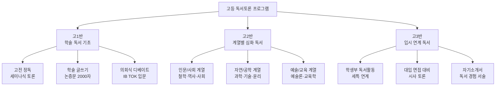

---

## PART 1. 교육 목표 및 역량 체계

### 1.1 학년별 도달 목표

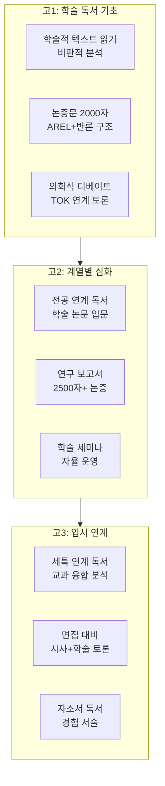

### 1.2 핵심 역량 상세표

| 역량 | 고1 | 고2 | 고3 |
|------|-----|-----|-----|
| **읽기** | 고전/학술 텍스트 정독, 저자 논증 구조 파악 | 학술 논문 초록 분석, 다학제 텍스트 비교 | 제시문 분석, 교과 융합 읽기 |
| **말하기** | 학술 발표 (5분), 즉흥 토론 | 세미나 진행 (15분), 반론 구성 | 면접형 발표, 시사 논평 |
| **쓰기** | 논증문 2000자, 서평 | 연구 보고서 2500자, 비평문 | 자소서 독서 경험, 수시 논술 |
| **토론** | 의회식 디베이트, TOK 토론 | 학술 세미나 자율 진행 | 면접 모의 토론, 시사 토론 |
| **사고** | 연역-귀납, 오류 판별 | 학제 간 융합, 메타 인지 | 가치 판단, 종합적 사고 |

---

## PART 2. 고1 연간 커리큘럼 (36주)

### 2.1 단원 구성 개요

```mermaid
gantt
    title 고1 연간 커리큘럼
    dateFormat MM
    section 1학기
    1단원-존재와인간        :a1, 03, 45d
    2단원-사회와권력        :a2, after a1, 45d
    3단원-과학과윤리        :a3, after a2, 30d
    section 2학기
    4단원-역사와문명        :b1, 09, 30d
    5단원-예술과인간        :b2, after b1, 45d
    6단원-미래와선택        :b3, after b2, 30d
    종합정리               :b4, after b3, 15d
```

### 2.2 주차별 상세 계획

| 단원 | 주 | 도서/텍스트 | 수업 주제 | 토론 형식 | 글쓰기 과제 | 핵심 발문 |
|------|-----|-----------|----------|----------|-----------|----------|
| **1단원** | 1 | 『데미안』 1~3장 | 두 세계: 선과 악 | 텍스트 분석 | 상징 분석 노트 | "밝은 세계와 어두운 세계는 무엇을 상징하는가?" |
| **존재** | 2 | 『데미안』 4~6장 | 자아 탐색의 방법 | 하브루타 심화 | 데미안 인물론 | "데미안은 실재인가, 싱클레어의 내면인가?" |
| **와** | 3 | 『데미안』 7~끝 | 아프락사스: 이분법 초월 | 소크라테스 세미나 | 주제 분석 에세이 | "선악 이분법을 넘어선다는 것은 가능한가?" |
| **인간** | 4 | 『데미안』 전체 | **디베이트**: 인간의 본성은 선한가 | 의회식 디베이트 | 논증문 1500자 | 인성론 논거 정리 |
| | 5 | 『이방인』 1부 | 부조리의 의미 | 텍스트 분석 | 뫼르소 심리 분석 | "뫼르소는 왜 어머니 장례에서 울지 않았는가?" |
| | 6 | 『이방인』 2부 | 사회와 개인 | 모의재판 토론 | 판결문 작성 | "뫼르소는 유죄인가? 무엇에 대한 유죄인가?" |
| | 7~8 | 단원 정리 | 실존주의 비교 | 비교 에세이 | 비교 논증문 2000자 | "데미안과 이방인의 '자아 발견'은 어떻게 다른가?" |
| **2단원** | 9 | 『1984』 1부 | 전체주의와 감시 | 시사 연계 토론 | 빅브라더 분석 | "오늘날의 빅브라더는 무엇인가?" |
| **사회** | 10 | 『1984』 2부 | 사랑과 저항 | 소크라테스 세미나 | 윈스턴 선택 분석 | "개인의 사랑은 체제에 대한 저항이 될 수 있는가?" |
| **와** | 11 | 『1984』 3부+끝 | 사상 통제와 자유 | 의회식 디베이트 | 비평문 | "뉴스피크는 현대 사회에도 존재하는가?" |
| **권력** | 12 | 『1984』+『동물농장』 | **디베이트**: 표현의 자유에 한계가 있어야 하는가 | CEDA 디베이트 | 논증문 2000자 | 자유 vs 안전 논거 |
| | 13 | 『정의란 무엇인가(발췌)』 | 정의의 원칙 | 딜레마 토론 | 정의론 요약+견해 | "공리주의와 자유주의 중 무엇이 정의에 가까운가?" |
| | 14 | 시사 텍스트 (AI 윤리) | AI와 권력 | 월드카페 | 사회 분석 보고서 | "AI가 만드는 새로운 권력 구조는?" |
| | 15~16 | 단원 정리 | 권력과 자유의 균형 | 종합 세미나 | 포트폴리오 | 에세이 퇴고+제출 |
| **3단원** | 17 | 『코스모스(발췌)』 | 과학적 사고의 본질 | 과학 토론 | 과학 에세이 | "과학은 믿음인가, 방법인가?" |
| **과학** | 18 | 『이기적 유전자(발췌)』 | 진화와 도덕 | 찬반 토론 | 논증문 | "이타적 행동은 이기적 유전자로 설명 가능한가?" |
| **윤리** | 19~20 | 과학 윤리 텍스트 | 유전자 편집, 복제 | 의회식 디베이트 | 윤리 보고서 | "과학의 진보에 윤리적 한계를 둬야 하는가?" |
| **4단원** | 21 | 『총균쇠(발췌)』 | 문명 발전의 요인 | 학술 토론 | 문명론 에세이 | "지리적 조건이 역사를 결정하는가?" |
| **역사** | 22 | 『사피엔스(발췌)』 | 인지 혁명과 허구 | 비교 분석 | 비교 보고서 | "허구를 믿는 능력이 인류를 지배종으로 만들었는가?" |
| **문명** | 23~24 | 한국 현대사 텍스트 | 민주화 운동의 의미 | 역사 토론 | 역사 에세이 | "민주주의는 완성되는 것인가, 계속 만들어가는 것인가?" |
| **5단원** | 25 | 『어린 왕자』 재독 | 성인 문학으로 재해석 | 심층 세미나 | 상징 분석 논문 | "어린 왕자를 실존주의 관점에서 읽는다면?" |
| **예술** | 26 | 시 선집 (윤동주, 백석 등) | 시의 언어와 진실 | 낭독+토론 | 시 비평문 | "시인은 왜 진실을 '아름답게' 말하는가?" |
| **인간** | 27~28 | 영화+소설 비교 | 매체 변환과 해석 | 매체 비교 토론 | 매체 비평문 | "같은 이야기, 다른 매체: 무엇이 달라지는가?" |
| **6단원** | 29~30 | 진로 연계 독서 | 계열별 도서 자유 선택 | 독서 발표회 | 계열 에세이 | "이 책이 나의 진로에 미친 영향은?" |
| **미래** | 31~32 | 미래 사회 텍스트 | AI, 기후, 인구 | 시사 토론 | 미래 보고서 | "2050년의 세계는?" |
| **선택** | 33~34 | 자유 선택 | 개인 프로젝트 발표 | 최종 세미나 | 최종 에세이 | 자율 |
| | 35~36 | - | 연간 정리 | 발표회+전시 | 연간 포트폴리오 | 성장 성찰 |

---

## PART 3. 고2 계열별 심화 커리큘럼

### 3.1 계열별 프로그램 구조도

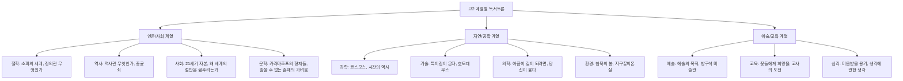

### 3.2 계열별 도서 및 토론 주제

#### 인문/사회 계열

| 월 | 도서 | 핵심 주제 | 토론 논제 | 연계 학과 |
|----|------|----------|----------|----------|
| 3~4월 | 『정의란 무엇인가』 | 롤스 vs 샌델의 정의론 | "능력주의는 공정한가?" | 철학, 정치학 |
| 5~6월 | 『역사란 무엇인가』 | 역사의 객관성 | "역사는 사실의 기록인가, 해석인가?" | 역사학 |
| 9~10월 | 『왜 세계의 절반은 굶주리는가』 | 구조적 빈곤 | "빈곤은 개인 책임인가, 구조적 문제인가?" | 사회학, 경제학 |
| 11~12월 | 『카라마조프의 형제들(발췌)』 | 신, 자유, 도덕 | "신 없이 도덕은 가능한가?" | 문학, 신학 |

#### 자연/공학 계열

| 월 | 도서 | 핵심 주제 | 토론 논제 | 연계 학과 |
|----|------|----------|----------|----------|
| 3~4월 | 『코스모스(발췌)』 | 과학적 겸손 | "과학으로 설명 불가능한 것은 존재하는가?" | 물리학, 천문학 |
| 5~6월 | 『호모데우스(발췌)』 | 인간 강화 기술 | "인간의 능력을 기술로 강화해도 되는가?" | 공학, 생명과학 |
| 9~10월 | 『아픔이 길이 되려면』 | 의료 불평등 | "건강은 개인 문제인가, 사회 문제인가?" | 의학, 보건학 |
| 11~12월 | 『침묵의 봄』+기후 텍스트 | 환경과 경제 | "경제 성장과 환경 보호는 양립 가능한가?" | 환경공학 |

---

## PART 4. 수업 운영 매뉴얼

### 4.1 120분 수업 흐름도 (표준)

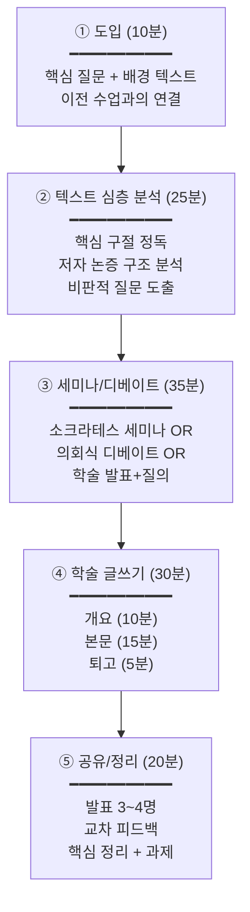

### 4.2 실전 지도안: 『1984』 의회식 디베이트 (고1, 120분)

**논제**: "국가는 국민의 표현의 자유를 제한할 수 있다"

**교사 사전 준비**
- [ ] 『1984』 완독 확인 (사전 퀴즈 5문제)
- [ ] 의회식 디베이트 규칙 인쇄물
- [ ] 현실 사례 자료 (가짜뉴스법, SNS 규제, 표현의 자유 판례)
- [ ] 정부측/야당측 팀 사전 배정 (7:7 또는 8:8)
- [ ] 논증문 원고지 (2000자)

| 단계 | 시간 | 교사 스크립트 | 학생 활동 |
|------|------|-------------|----------|
| **도입** | 0~10분 | "『1984』에서 가장 무서운 것은 텔레스크린이 아닙니다. 뉴스피크, 즉 '말 자체를 없애는 것'이었습니다. 왜 오웰은 언어 통제를 가장 위험한 것으로 보았을까요? (1분 사고) ... 오늘 우리는 이 문제를 현실로 가져옵니다. 논제: '국가는 국민의 표현의 자유를 제한할 수 있다.'" | 사고 후 2~3명 답변 |
| **사전 퀴즈** | 10~15분 | "먼저 『1984』 완독 여부를 확인합니다. 5문제, 1분씩." | 퀴즈 응시 |
| **팀 준비** | 15~30분 | "정부측(찬성)과 야당측(반대)으로 나뉘어 전략을 세우세요. 15분입니다. 역할: 수상(Prime Minister)/야당 대표(Leader of Opposition), 부수상/부대표, 의원 3인. 보충 자료도 활용하세요." | 팀 전략 회의 |
| **디베이트** | 30~70분 | (아래 순서도 참조) 총 40분 진행 | 의회식 디베이트 |
| **판정+성찰** | 70~80분 | "양측 모두 탁월했습니다. 청중 판정: (거수) 오늘 토론의 핵심 쟁점은 무엇이었나요?" | 판정+성찰 토론 |
| **글쓰기** | 80~110분 | "논증문 작성 시간입니다. 주제: '표현의 자유의 범위와 한계'. 『1984』와 현실 사례를 모두 활용하세요. 2000자. 개요 10분→본문 15분→퇴고 5분." | 논증문 작성 |
| **마무리** | 110~120분 | "발표 2명. ... 다음 주는 『정의란 무엇인가』 발췌문을 읽어옵니다. '정의'란 무엇인지 미리 생각해오세요." | 발표+과제 확인 |

### 4.3 의회식 디베이트 진행 순서도

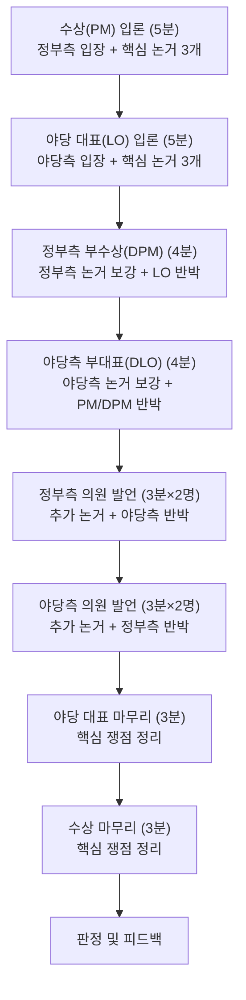

**POI(Point of Information) 규칙**: 상대측 발언 중 1분 경과 후~마지막 1분 전까지, 손을 들어 "POI!"라고 외치면 발언자가 수락/거절할 수 있음. 수락 시 15초 이내 질문.

### 4.4 소크라테스 세미나 심화 (고등용)

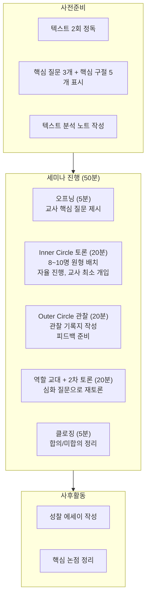

#### 세미나 운영 교사 지시서

| 교사 행동 | 해야 할 것 | 하지 말아야 할 것 |
|-----------|-----------|----------------|
| **질문** | 오프닝 질문 1개만 제시 | 유도 질문, 정답 암시 |
| **개입** | 침묵 30초 이상 시에만 촉진 질문 | 빈번한 개입, 의견 제시 |
| **촉진** | "텍스트 어디에서 그 근거를 찾을 수 있나요?" | "그건 틀렸어요", "제 생각에는..." |
| **기록** | 학생별 발언 횟수/질, 핵심 논점 기록 | 녹음/녹화 (사전 동의 없이) |
| **평가** | 관찰 기록 + 성찰 에세이 종합 평가 | 실시간 점수 매기기 (분위기 저해) |

---

## PART 5. IB(국제 바칼로레아) 연계 프로그램

### 5.1 TOK(Theory of Knowledge) 연계 토론

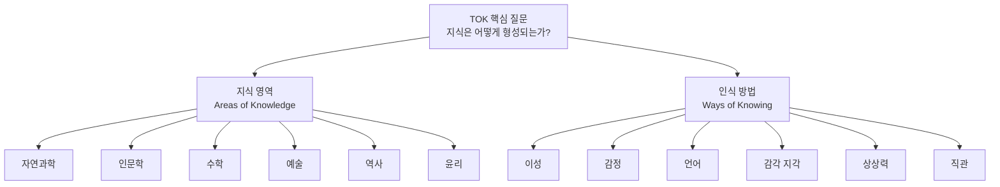

### 5.2 TOK 연계 독서토론 주제표

| 지식 영역 | 연계 도서 | TOK 핵심 질문 | 토론 형식 |
|-----------|----------|-------------|----------|
| **자연과학** | 『코스모스』 | "과학적 지식은 객관적인가?" | 학술 세미나 |
| **인문학** | 『데미안』 | "문학은 진리를 전달할 수 있는가?" | 소크라테스 세미나 |
| **역사** | 『역사란 무엇인가』 | "역사적 사실은 존재하는가?" | 디베이트 |
| **윤리** | 『정의란 무엇인가』 | "보편적 도덕 원칙은 가능한가?" | 딜레마 토론 |
| **수학** | 『수학의 확실성(발췌)』 | "수학적 진리는 발견인가 발명인가?" | 찬반 토론 |
| **예술** | 시/소설 비교 | "예술의 가치는 주관적인가 객관적인가?" | 월드카페 |

### 5.3 TOK 에세이 구조 가이드

```
┌──────────────────────────────────────────────┐
│             TOK 에세이 구조                    │
├──────────────────────────────────────────────┤
│                                              │
│  [서론] (200~300자)                          │
│  • 핵심 개념 정의                            │
│  • 논제(prescribed title) 해석              │
│  • 에세이 방향 제시                          │
│                                              │
│  [본론1] 지식 영역 A 분석 (500~600자)        │
│  • 주장 + 근거 + 구체적 사례                 │
│  • 반론(counterclaim) 제시                  │
│  • 재반박 또는 종합                          │
│                                              │
│  [본론2] 지식 영역 B 분석 (500~600자)        │
│  • 다른 영역에서의 같은 질문 탐구            │
│  • 영역 간 비교/대조                         │
│                                              │
│  [결론] (200~300자)                          │
│  • 핵심 논점 종합                            │
│  • 한계 인정 + 열린 결론                     │
│  • "so what?" — 왜 이 질문이 중요한가        │
│                                              │
└──────────────────────────────────────────────┘
```

---

## PART 6. 평가 시스템

### 6.1 고등 토론 평가 루브릭

| 평가 영역 | A (5점) | B (4점) | C (3점) | D (2점) | E (1점) |
|-----------|---------|---------|---------|---------|---------|
| **텍스트 분석** | 저자 논증 구조를 정확히 파악하고 비판적으로 분석 | 논증 구조를 잘 파악 | 내용 이해함 | 이해 피상적 | 이해 부족 |
| **논증 구성** | AREL 완벽 + 반론 포함 + 3개 이상 다층적 논거 | AREL 구조 + 2~3 논거 | 주장+근거 있음 | 주장만 있음 | 논증 없음 |
| **비판적 사고** | 논리적 오류 식별, 전제 검토, 대안 제시 | 비판적 관점 보유 | 일부 비판적 | 수용적 | 비판 없음 |
| **학제 간 연결** | 2개 이상 학문 영역을 융합하여 분석 | 교과 간 연결 시도 | 단일 관점 | 관점 부족 | - |
| **발표/전달** | 학술 발표 수준, 논리적 구조, 청중 고려 | 명확한 발표 | 발표 가능 | 발표 미숙 | 발표 어려움 |
| **경청/반응** | 상대 논거를 정확히 요약하고 그에 대해 발전적 응답 | 경청+응답 | 경청함 | 경청 부족 | 미참여 |

**총점**: 30점 / **등급**: A(27+) B(22~26) C(17~21) D(12~16) E(11↓)

### 6.2 연간 평가 체계

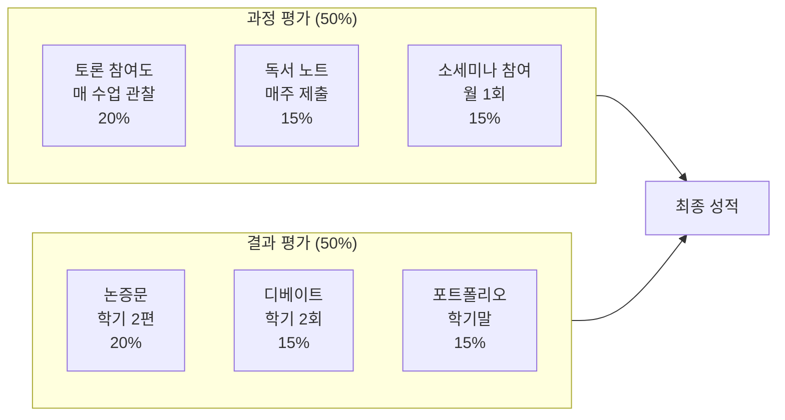

---

## PART 7. 입시 연계 (고3)

### 7.1 학생부 독서활동 기록 가이드

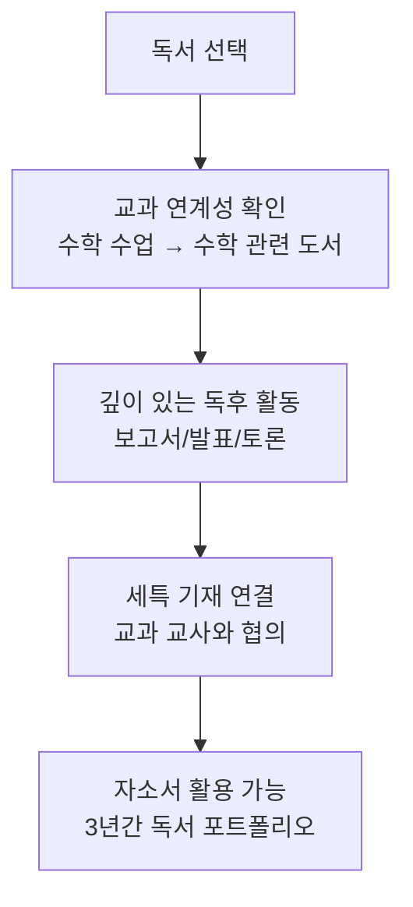

#### 교과별 추천 독서+세특 연계표

| 교과 | 추천 도서 | 세특 기재 방향 예시 |
|------|----------|-------------------|
| **국어** | 『데미안』,『이방인』 | "실존주의 문학의 자아탐색 주제를 비교 분석하여..." |
| **수학** | 『수학의 확실성』 | "수학적 증명의 완전성 문제를 괴델의 불완전성 정리와 연결하여..." |
| **영어** | 『1984(원서 발췌)』 | "오웰의 뉴스피크 개념을 현대 미디어 리터러시와 연결하여..." |
| **사회** | 『정의란 무엇인가』 | "롤스의 무지의 베일 개념을 한국 교육 불평등 문제에 적용하여..." |
| **과학** | 『이기적 유전자』 | "이타적 행동의 진화론적 설명을 게임이론과 연계하여 분석..." |
| **윤리** | 『공리주의(밀)』 | "공리주의적 윤리관의 한계를 자율주행차 트롤리 딜레마에 적용..." |

### 7.2 대입 면접 독서 토론 대비

#### 면접 모의 토론 진행 순서도

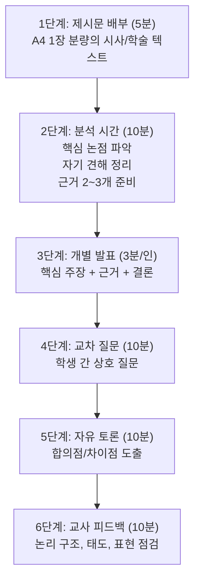

#### 면접 빈출 독서 질문 TOP 10

| 순위 | 질문 유형 | 예시 |
|------|----------|------|
| 1 | 가장 인상 깊은 책 | "고등학교 시절 가장 인상 깊었던 책과 그 이유는?" |
| 2 | 책의 핵심 주장 | "그 책의 저자가 주장하는 바는 무엇이며, 동의하나요?" |
| 3 | 비판적 읽기 | "그 책의 한계점이나 반론은 무엇이라고 생각하나요?" |
| 4 | 교과 연계 | "이 책이 본인이 지원한 학과와 어떤 관련이 있나요?" |
| 5 | 현실 적용 | "이 책의 내용을 현실 문제에 적용한다면?" |
| 6 | 후속 독서 | "이 책을 읽고 더 알고 싶어져서 찾아본 것은?" |
| 7 | 관점 변화 | "이 책을 통해 생각이 바뀐 점이 있나요?" |
| 8 | 다른 관점 | "같은 주제를 다른 관점에서 다룬 책을 알고 있나요?" |
| 9 | 실천 | "이 책을 읽고 행동이나 태도가 변한 것은?" |
| 10 | 추천 | "이 책을 동급생에게 추천한다면, 어떻게 소개하겠나요?" |

### 7.3 자기소개서 독서 경험 서술 가이드

#### 자소서 독서 경험 작성 흐름도

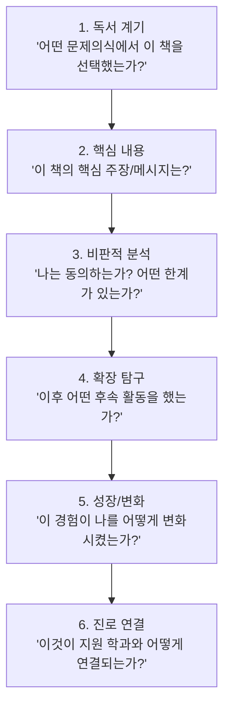

#### 우수 자소서 독서 경험 서술 예시 (Before/After)

**Before (평범한 서술)**:
> 고1 때 『정의란 무엇인가』를 읽었다. 정의에 대해 많이 생각하게 되었다. 공리주의와 자유지상주의에 대해 알게 되었다. 이 책을 읽고 사회에 관심을 갖게 되었다.

**After (우수 서술)**:
> 사회 수업에서 '최저임금 인상'에 대한 토론을 하면서 '정의'의 기준이 사람마다 다르다는 점에 의문을 느꼈습니다. 마이클 샌델의 『정의란 무엇인가』를 읽으며, 공리주의적 관점("최대 다수의 최대 행복")과 롤스의 무지의 베일 개념을 비교 분석했습니다. 특히 롤스가 제시한 '차등의 원칙'이 한국의 교육 불평등 문제에 적용 가능한지를 탐구하기 위해, 한국교육개발원의 교육격차 데이터를 분석하는 후속 탐구를 진행했습니다. 이 과정에서 이론적 정의론이 현실에 적용될 때의 괴리를 발견했고, 이를 정책학적 관점에서 해결할 수 있는 공공정책학에 진학하고자 합니다.

---

## PART 8. 교사 발문 은행 (고등용)

### 8.1 텍스트 분석 발문 (학술 수준)

| 발문 유형 | 예시 발문 | 목적 |
|-----------|----------|------|
| **구조 분석** | "저자의 핵심 논증을 3단계로 요약해보세요." | 논증 구조 파악 |
| **전제 검토** | "이 주장이 성립하려면 어떤 전제가 필요한가요?" | 비판적 사고 |
| **논리 오류** | "이 논증에 논리적 오류는 없나요? 어떤 오류?" | 오류 판별 능력 |
| **맥락** | "이 텍스트가 쓰인 시대적 맥락은 어떤 영향을 주었나요?" | 맥락적 읽기 |
| **비교** | "A 저자와 B 저자의 관점 차이는 어디서 발생하나요?" | 다관점 분석 |
| **적용** | "이 이론을 한국 사회에 적용한다면 어떤 결과가 예상되나요?" | 현실 연결 |
| **한계** | "이 저자의 논증에서 간과하고 있는 것은 무엇인가요?" | 비판적 평가 |
| **종합** | "오늘 논의를 종합하면, 가장 설득력 있는 관점은?" | 종합적 판단 |

### 8.2 상황별 고급 촉진 발문

| 상황 | 발문 | 의도 |
|------|------|------|
| **표면적 답변** | "그 주장의 논리적 근거를 한 단계 더 깊이 파고들어볼까요?" | 심화 유도 |
| **이분법적 사고** | "찬성과 반대 외에 제3의 관점은 가능하지 않을까요?" | 사고 확장 |
| **근거 부족** | "텍스트 몇 페이지, 몇 번째 줄에서 그 근거를 찾을 수 있나요?" | 텍스트 기반 논증 |
| **감정적 반응** | "그 감정적 반응을 논리적 주장으로 전환한다면 어떻게 될까요?" | 논리적 전환 |
| **합의 도달** | "이 합의에 도전할 수 있는 반례는 없을까요?" | 비판적 검증 |
| **토론 정체** | "다른 학문 분야에서 이 문제를 보면 어떤 새로운 관점이 나올까요?" | 학제 간 연결 |

---

## PART 9. 학부모 소통 및 운영 관리

### 9.1 고등 과정 학부모 안내문

```
━━━━━━━━━━━━━━━━━━━━━━━━━━━━━━━━━━━
  [고등 독서토론] 연간 프로그램 안내
━━━━━━━━━━━━━━━━━━━━━━━━━━━━━━━━━━━

■ 프로그램 목적
비판적 사고력과 학술적 글쓰기 역량을 기르며,
학생부 독서활동·세특·자소서에 실질적으로 활용할
수 있는 깊이 있는 독서 토론 교육

■ 연간 도서 (고1 기준)
• 『데미안』 『이방인』 → 실존주의와 자아
• 『1984』 『동물농장』 → 사회와 권력
• 『코스모스』 『이기적 유전자』 → 과학과 윤리
• 『총균쇠』 『사피엔스』 → 역사와 문명
• 『어린 왕자』+ 시 선집 → 예술과 인간
• 진로 연계 도서 → 계열별 탐구

■ 입시 연계 포인트
✅ 학생부 독서활동란 기재 (연간 12권+)
✅ 세특 연계 심화 탐구 보고서
✅ 대입 면접 모의 토론 훈련
✅ 자소서 독서 경험 서술 지도

■ 평가 방식
과정평가 50% + 결과평가 50%

■ 가정에서의 역할
1. 주당 독서 시간 3~5시간 확보 지원
2. 시사 이슈에 대한 가정 내 대화
3. '정답 맞추기'가 아닌 '생각 나누기' 격려
━━━━━━━━━━━━━━━━━━━━━━━━━━━━━━━━━━━
```

### 9.2 학기말 종합 성장 보고서

```
═══════════════════════════════════════════════
     고등 독서토론 학기말 종합 성장 보고서
═══════════════════════════════════════════════
학생: _____________ (고__ / ____학기)

[독서 이력]
──────────────────────────────────────────────
완독 도서: ___권
 1. 『_______________』 — 핵심 주제: _______
 2. 『_______________』 — 핵심 주제: _______
 ...

[역량별 성장 분석]
──────────────────────────────────────────────
          학기초 → 학기말
비판적 읽기: ☆☆☆☆☆ → ☆☆☆☆☆
논증 구성:   ☆☆☆☆☆ → ☆☆☆☆☆
토론 참여:   ☆☆☆☆☆ → ☆☆☆☆☆
학술 글쓰기: ☆☆☆☆☆ → ☆☆☆☆☆
학제간 사고: ☆☆☆☆☆ → ☆☆☆☆☆

[우수 글쓰기 대표작]
──────────────────────────────────────────────
제목: 「_____________________________」
분량: ___자 / 평가: A B C D E
교사 코멘트: 

[디베이트 성과]
──────────────────────────────────────────────
참여 횟수: __회 / 역할: ________________
최우수 논거: 

[세특 연계 가능 활동]
──────────────────────────────────────────────
1. 교과 (____): 
2. 교과 (____): 

[교사 종합 평가]
──────────────────────────────────────────────


[다음 학기 제안]
──────────────────────────────────────────────
1. 
2. 
3. 

담당교사: _______ (인)    날짜: ____/__/__
═══════════════════════════════════════════════
```

---

> **운영 참고**: 고등 과정은 주 1회(120분) 기준 설계. IB 학교의 경우 TOK 수업과 연계하여 주 2회 운영 권장. 고3 2학기는 면접 대비 집중 프로그램으로 전환 가능합니다.

---

*최종 업데이트: 2026년 2월 16일*
