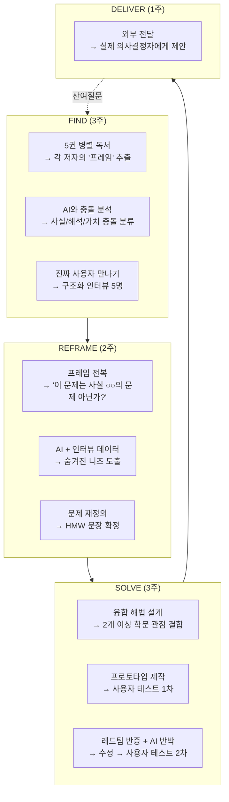
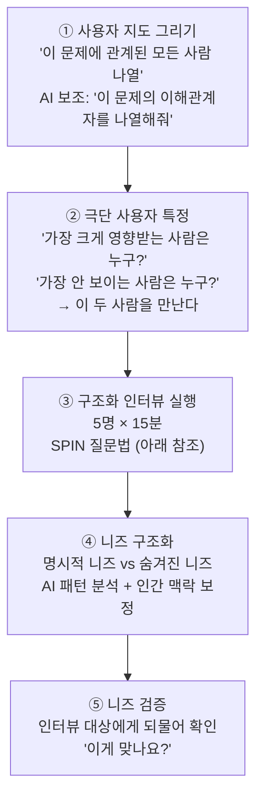
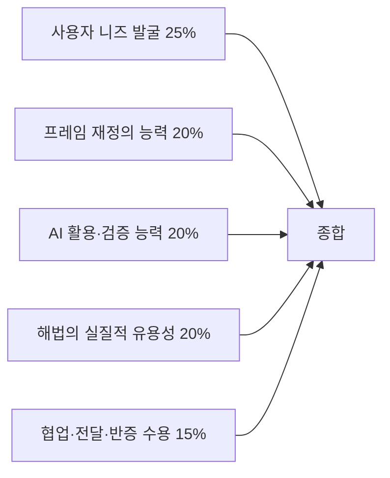

# 독서토론 중등과정 실전 운영 매뉴얼 (2032 개정판)

> 중학교 1~3학년 | 36주 | **병렬 독서 × AI 연구 파트너 × 사용자 니즈 기반 문제 해결 프로그램** | 교사 지시서 완전판

---

## 0. 이 프로그램의 한 줄 정의

> **"5권을 동시에 읽어 관점의 충돌을 만들고, AI를 연구 파트너로 쓰면서 실제 사용자의 니즈를 찾아내고, 융합적으로 문제를 재정의해서 검증된 해결책을 설계하는 프로그램"**

중등 과정의 차별점:
- 초등이 "문제를 찾는 법"을 배운다면, 중등은 **"문제를 재정의하는 법"**을 배운다
- 같은 현상을 **다른 프레임으로 규정하면 다른 해법이 나온다**는 것을 체험한다
- AI를 단순 필터가 아니라 **연구 가설 생성·반증·데이터 분석 파트너**로 사용한다
- 사용자 인터뷰를 **구조화된 니즈 분석**으로 발전시킨다

---

## PART 1. 프로그램 엔진 — REFRAME 6단계



---

## PART 2. AI 연구 파트너 프로토콜

### 2.1 중등 AI 활용 — "같이 일하되, 검증하라"

초등이 "AI가 맞는지 틀린지"를 배웠다면, 중등은 **"AI를 어떻게 잘 시키고, 그 결과를 어떻게 검증하는가"**를 배운다.

#### AI 사용 10대 장면과 학생 의무

| # | 장면 | 구체적 프롬프트 예시 | 학생 의무 | 평가 대상 |
|---|------|-------------------|----------|----------|
| 1 | **질문 필터** | "이 질문에 답해봐: '지진 사망자 수가 나라마다 다른 이유는?'" | AI 답변이 충분하면 폐기 / 불충분하면 ⭐ 보존 | 폐기/보존 판단 정확도 |
| 2 | **프레임 추출** | "이 책 발췌를 읽고, 이 저자가 이 문제를 '무엇의 문제'로 규정하고 있는지 한 단어로 말해줘" | AI 답변을 원문 대조. 틀리면 교정 | 교정 로그 |
| 3 | **충돌 발견** | "A 저자는 '건물 때문'이라고 하고 B 저자는 '정책 때문'이라고 합니다. 이 차이가 사실 다툼인지 가치 다툼인지 판단해줘" | AI 판단에 동의/반박 + 이유 | 판단 근거의 질 |
| 4 | **인터뷰 설계** | "재난 취약 계층에게 인터뷰할 질문 10개를 만들어줘. 단, 검색하면 바로 나오는 질문은 빼" | AI 질문 10개 중 5개 삭제(유도/피상적) + 자체 3개 추가 | 삭제 판단 + 자체 질문의 질 |
| 5 | **니즈 패턴 분석** | "이 5명의 인터뷰 원문을 읽고, 공통 니즈와 숨겨진 니즈를 분리해줘" | AI가 놓친 감정/맥락/비언어 정보를 추가 | 추가한 것의 가치 |
| 6 | **선행 조사** | "학교 재난 대피 개선 사례를 10개 찾아줘" | 각 사례의 출처 원문 확인 → 환각 검출 | 환각 검출 정확도 |
| 7 | **가설 생성** | "우리 데이터에서 '소득이 낮은 지역일수록 내진 보강률이 낮다'는 가설이 타당한지 반박해봐" | AI 반박 중 타당/무효 구분 | 구분의 정확도 |
| 8 | **초안 반박** | "이 제안서의 약점 5가지를 찾아줘. 특히 '이걸 싫어할 사람'의 관점에서" | 5가지 중 진짜 아픈 것 vs 헛다리 구분 → 진짜만 반영 | 반영 깊이 |
| 9 | **문구 교정** | "이 제안서를 더 설득력 있게 다듬어줘" | **구조(주장·근거·전제)는 학생이 짠다**. AI는 문장 다듬기만 | 구조의 독자성 |
| 10 | **발표 연습** | "이 발표에 대해 면접관처럼 질문 3개를 해줘" | 질문에 즉답 연습. 못 답하면 준비 부족 | 즉답 능력 |

### 2.2 "AI가 못 하는 것" 목록 (교실 게시용)

```
┌──────────────────────────────────────────────────┐
│      AI가 절대 대신 할 수 없는 것 (중등판)         │
├──────────────────────────────────────────────────┤
│                                                    │
│  ❌ 우리 학교를 직접 본 적 없다                     │
│     → 우리 학교 대피 경로는 우리만 조사 가능         │
│                                                    │
│  ❌ 사람의 표정을 읽지 못한다                       │
│     → 인터뷰 대상이 말을 멈춘 순간의 의미를          │
│       AI는 모른다. 너만 안다.                       │
│                                                    │
│  ❌ "이게 맞나?" 스스로 확인하지 않는다              │
│     → AI는 자신이 틀렸는지 신경 쓰지 않는다          │
│       검증은 너의 일이다                            │
│                                                    │
│  ❌ 가치 판단을 대신 할 수 없다                     │
│     → "누가 먼저 구조되어야 하는가"에 대해           │
│       AI는 답하지만, 그 답에 책임지지 않는다         │
│       결정과 책임은 인간의 것이다                    │
│                                                    │
│  ❌ 실패에서 배우지 못한다                          │
│     → AI는 "안 됐네요" 하고 끝                     │
│       너는 "왜 안 됐지?"에서 새로운 질문을 만든다    │
│                                                    │
└──────────────────────────────────────────────────┘
```

### 2.3 AI 활용 평가 기록지 (매 클러스터 제출)

```
┌──────────────────────────────────────────────┐
│          AI 연구 파트너 활용 기록지             │
├──────────────────────────────────────────────┤
│ 학생: _______ 클러스터: ________              │
│                                              │
│ [1] AI에게 던진 질문 총 수: ____개           │
│     그중 AI가 충분히 답한 것: ____개 → 폐기   │
│     AI가 불충분하게 답한 것: ____개 → 보존    │
│                                              │
│ [2] AI 오류 발견 기록 (최소 3건)              │
│     ① AI 출력: _________________________    │
│       실제:  _________________________      │
│       확인 방법: _____________________       │
│     ② ...                                   │
│     ③ ...                                   │
│                                              │
│ [3] AI가 못 해서 내가 직접 한 것              │
│     □ 사람 인터뷰 ___명                     │
│     □ 현장 조사 ___회                       │
│     □ 데이터 직접 수집                       │
│     □ 가치 판단                              │
│     □ 실패 분석                              │
│                                              │
│ [4] AI를 가장 잘 쓴 장면                      │
│     "___________________________"            │
│     왜 이때 AI가 유용했는가:                  │
│     ____________________________________    │
│                                              │
│ [5] AI 없이 했어야 했던 장면                   │
│     "___________________________"            │
│     왜 AI가 부적합했는가:                     │
│     ____________________________________    │
│                                              │
└──────────────────────────────────────────────┘
```

---

## PART 3. 사용자 니즈 발굴 — 구조화 프로토콜

### 3.1 니즈 발굴 5단계 프로세스



### 3.2 SPIN 인터뷰법 (중등 맞춤)

단순히 "불편한 게 뭐예요?" 대신, 4단계로 니즈를 파고드는 기법.

| 단계 | 질문 유형 | 예시 (지진 클러스터) | 발견하는 것 |
|------|---------|-------------------|-----------|
| **S** - Situation | 상황 | "지진 대피 훈련 때 보통 어떻게 하세요?" | 현재 행동 |
| **P** - Problem | 문제 | "그때 불편하거나 걱정되는 건 뭐예요?" | 명시적 불편 |
| **I** - Impact | 영향 | "그게 안 되면 어떤 일이 생겨요?" / "그래서 어떤 기분이에요?" | **숨겨진 니즈** |
| **N** - Need | 바람 | "이상적으로는 어떻게 됐으면 좋겠어요?" | 해결 방향 |

**실전 시나리오** — 중1, 학교 경비원 인터뷰

> **S**: "아저씨, 지진 대피 훈련 때 보통 어떻게 하세요?"
> **경비**: "음, 방송이 나오면 정문 열고 아이들 나올 때 교통 정리를 하죠."
>
> **P**: "그때 불편하거나 걱정되는 건 뭐예요?"
> **경비**: "사실 방송이 여기까지 잘 안 들려요. 그리고 내가 정문 여는 게 먼저인지, 교통 정리가 먼저인지 매뉴얼이 없어요."
>
> **I**: "방송이 안 들리면 어떤 일이 생겨요?"
> **경비**: "전에 한번 진짜 지진 있었을 때... 나만 모르고 있었어요. 아이들이 뛰어나오는데 차가 다니고 있었고. 정말 아찔했어요."
> → **숨겨진 니즈 발견**: 경비원에게 대피 매뉴얼이 없다. 방송이 유일한 알림인데 안 들린다. **실제 위험 상황을 겪은 적이 있다.**
>
> **N**: "이상적으로는 어떻게 됐으면 좋겠어요?"
> **경비**: "방송 대신 핸드폰으로 바로 알림 오거나, 정문에 불이 번쩍이거나... 그리고 내가 뭘 해야 하는지 딱 적힌 카드 같은 거?"

**이 인터뷰에서 나온 것**: 책 5권 어디에도 없는 **"학교 비교직 직원의 재난 매뉴얼 공백"** 이라는 진짜 문제. AI에게 물어봐도 일반론만 나올 **현장 기반 구체 니즈**.

### 3.3 니즈 분석 워크시트

```
┌──────────────────────────────────────────────────┐
│               니즈 분석 워크시트                    │
├──────────────────────────────────────────────────┤
│ 인터뷰 대상: _____________ (5명 각각 작성)         │
│                                                    │
│ [현재 행동] 이 사람은 지금 이렇게 하고 있다:        │
│ → ______________________________________          │
│                                                    │
│ [명시적 니즈] 이 사람이 직접 말한 불편:              │
│ → ______________________________________          │
│                                                    │
│ [숨겨진 니즈] 말은 안 했지만 관찰/맥락에서 발견:     │
│ → ______________________________________          │
│ 어떻게 알았나: ____________________________        │
│                                                    │
│ [감정] 이 문제에 대한 이 사람의 감정:               │
│ → ______________________________________          │
│                                                    │
│ [기존 해결책의 한계]                                │
│ 이 사람이 지금 쓰고 있는 방법: _______________      │
│ 그 방법의 문제점: ___________________________      │
│                                                    │
│ [AI 교차 분석]                                     │
│ AI에게 이 니즈를 입력했을 때 AI 답변:               │
│ → ______________________________________          │
│ AI가 놓친 것 (내가 현장에서 본 것):                  │
│ → ______________________________________          │
│                                                    │
└──────────────────────────────────────────────────┘
```

### 3.4 5명 인터뷰 통합 — 니즈 매트릭스

| 니즈 | 1번 | 2번 | 3번 | 4번 | 5번 | 빈도 | AI 인식 여부 |
|------|-----|-----|-----|-----|-----|------|------------|
| 매뉴얼 공백 | ✓ | | ✓ | ✓ | | 3/5 | AI 일반론만 |
| 방송 불달 | ✓ | ✓ | | | ✓ | 3/5 | AI 모름 |
| 감정적 고립 | ✓ | | | ✓ | | 2/5 | **AI 완전 모름** ★ |
| 역할 혼란 | ✓ | ✓ | ✓ | ✓ | ✓ | 5/5 | AI 부분 인식 |

> **교사 지시**: "AI가 완전 모르는(★) 니즈, 그리고 5명 모두가 공통으로 말한 니즈 — 이 두 가지가 프로젝트의 핵심이다."

---

## PART 4. 프레임 재정의 — 중등 과정의 핵심 훈련

### 4.1 왜 "재정의"가 핵심인가

**같은 현상도 어떤 프레임으로 규정하느냐에 따라 해법이 완전히 달라진다.**

| 프레임 | "학교 경비원이 대피를 모른다"를 어떻게 규정하나 | 따라오는 해법 |
|--------|----------------------------------------------|------------|
| **정보 프레임** | 정보 전달 실패 → | 앱/알림 시스템 개발 |
| **제도 프레임** | 비교직 직원 매뉴얼 부재 → | 매뉴얼 제작 + 훈련 포함 의무화 |
| **관계 프레임** | 조직 내 소외/무관심 → | 경비원도 교직원 회의 참여 |
| **구조 프레임** | 비정규직 안전 책임 공백 → | 고용 형태와 안전 의무의 관계 재검토 |
| **감정 프레임** | 공포와 고립 → | 심리적 지원 체계 |

> **수업 지시**: "5권의 책은 각각 다른 프레임을 쓰고 있다. 어느 프레임이 맞냐를 고르는 것이 아니라, **어떤 프레임을 택하면 무엇이 보이고 무엇이 사라지는지**를 파악하는 것이 목적이다."

### 4.2 프레임 전복 실습 (구체 절차)

**STEP 1**: 인터뷰 결과를 프레임별로 배치 (AI 보조)
- 프롬프트: "이 인터뷰 내용을 '정보 문제/제도 문제/관계 문제/구조 문제/감정 문제' 5개 렌즈로 분석해줘"
- 학생 작업: AI 분석 vs 인간 판단 비교

**STEP 2**: 가장 많이 쓰이는 프레임 확인
- "우리가 읽은 5권 중 4권이 '정보 문제'로 규정하고 있다"

**STEP 3**: **일부러 다른 프레임 강제 적용**
- "이 문제를 '관계 문제'로 재정의하면 무엇이 보이는가?"
- "경비원이 정보를 못 받은 게 아니라, **애초에 대피 계획을 만들 때 아무도 경비원을 생각 안 한 것**이라면?"

**STEP 4**: 재정의 결과를 사용자에게 검증
- 경비원에게: "혹시 대피 훈련 계획을 세울 때 의견을 물어본 적 있어요?"
- 경비원: "한 번도 없어요."
- → **프레임 전복 성공**: 문제는 정보 전달이 아니라 **계획 과정에서의 배제**였다.

### 4.3 HMW(How Might We) 재정의 워크시트

```
┌──────────────────────────────────────────────────┐
│         문제 재정의 워크시트                        │
├──────────────────────────────────────────────────┤
│                                                    │
│ [최초 문제 정의] (인터뷰 직후)                      │
│ → "경비원이 대피 방송을 못 듣는다"                  │
│ 이건 무엇의 문제? → 정보 전달 문제                  │
│                                                    │
│ [재정의 시도 1] 다른 프레임 적용                    │
│ → 제도 프레임: "비교직 직원용 매뉴얼이 없다"        │
│                                                    │
│ [재정의 시도 2] 더 깊은 프레임 적용                 │
│ → 관계/구조 프레임: "대피 계획 수립 시               │
│   경비원이 배제되어 있다"                           │
│                                                    │
│ [검증] 이 재정의를 사용자에게 확인했는가?            │
│ □예 → 반응: _______________________________      │
│ □아니오 → 다음 인터뷰에서 확인할 것                │
│                                                    │
│ [최종 HMW]                                        │
│ "어떻게 하면 대피 계획 수립 과정에                  │
│  비교직 직원의 관점이 반영될 수 있을까?"             │
│                                                    │
│ [이 HMW가 기존과 다른 점]                          │
│ 기존: 방송 시스템 개선 (기술 해법)                  │
│ 재정의 후: 계획 프로세스 변경 (제도 해법)           │
│ → 기술만으로는 근본 원인이 해결되지 않는다          │
│                                                    │
└──────────────────────────────────────────────────┘
```

---

## PART 5. 대표 클러스터 완전 실행 — 「흔들리는 땅」

### 5.1 9주 실행표

| 주 | 단계 | 핵심 활동 | AI 사용 | 학생이 AI 대신 하는 것 | 산출물 |
|----|------|----------|---------|---------------------|--------|
| 1 | FIND | 데이터 충격 + 5텍스트 배정 + AI 질문 필터 | 규모별 사망자 데이터 요청 / 질문 필터 | 데이터의 이상점(outlier)에 대한 해석 | 관점 요약 |
| 2 | FIND | 직소 독서 → 프레임 추출 | 텍스트별 프레임 분석 보조 | 원문 대조 교정 | 프레임 지도 |
| 3 | FIND | **★ 사용자 인터뷰 5명** + AI 패턴 분석 | 인터뷰 설계 보조 + 결과 패턴 분석 | 직접 만남. 표정·맥락·감정 포착 | 니즈 매트릭스 |
| 4 | REFRAME | 프레임 전복 세미나: AI 다중 프레임 분석 vs 인간 판단 | 5개 프레임으로 인터뷰 재분석 | 사용자에게 재정의 검증 | 재정의 워크시트 |
| 5 | REFRAME | HMW 확정 + 선행 조사 | 유사 사례 검색 + 환각 검증 | 출처 원문 확인 5건 이상 | HMW + 선행 노트 |
| 6 | SOLVE | 아이디어 발산: AI 10개 + 학생 10개 = 20개 → 3개 선택 | 아이디어 생성 보조 | **AI가 생각 못한 현장 기반 아이디어** | 선별 아이디어 |
| 7 | SOLVE | 프로토타입 제작 + 사용자 1차 테스트 | 디자인/문구 보조 | 사용자 반응 직접 관찰 | 시제품 v1 |
| 8 | SOLVE | **레드팀**: 타 모둠 공격 + AI 반박 + 수정 | AI에게 "약점 5개 찾아줘" | 공격 중 진짜/헛다리 구분 | 시제품 v2 |
| 9 | DELIVER | 사용자 최종 테스트 + 외부 전달 | 제안서 교정 보조 | 전달·발표·설득 | 최종 제안서 |

### 5.2 실전 지도안 A: 사용자 인터뷰 수업 (3주차, 100분)

**이 수업이 전체 클러스터의 심장이다.**

| 시간 | 활동 | 교사 스크립트 | 유의사항 |
|------|------|-------------|---------|
| 0~15분 | 인터뷰 질문 설계 | "AI한테 '학교 재난 대피에서 가장 곤란한 사람에게 물어볼 질문 10개 만들어줘' 시킵시다. (AI 출력) 이 중에 '네/아니오로 끝나는 질문' 삭제. '검색하면 나오는 질문' 삭제. 남은 것 + 우리만의 질문 3개." | AI 질문을 **그대로 쓰지 말고 편집**하는 것이 훈련 |
| 15~25분 | SPIN 연습 | 짝끼리 역할극. 한 명이 경비원, 한 명이 인터뷰어. S→P→I→N 순서 연습 | I(영향) 단계에서 "그래서 어떤 일이 생겨요?"를 꼭 물어보기 |
| 25~30분 | 사전 브리핑 | "규칙: ①3분 안에 목적을 밝힌다 ②녹음하지 않는다 ③'왜 안 하세요?'처럼 비난으로 들릴 수 있는 말을 하지 않는다 ④모르는 건 '나중에 알아볼게요' ⑤끝나면 반드시 '감사합니다'" | 윤리 교육 |
| 30~70분 | **★ 현장 인터뷰** | 모둠별 학교 안/밖 이동. 사전 섭외한 대상 5명 분산 인터뷰 (모둠당 1~2명) | 교사는 순회 관찰. 개입 최소화 |
| 70~85분 | 즉시 기록 | 돌아오면 **3분 이내** 니즈 분석 워크시트 작성. "기억이 사라지기 전에!" | 기억이 흐려지기 전 기록이 핵심 |
| 85~95분 | AI 교차 분석 | 인터뷰 핵심 내용을 AI에 입력. "이 5명의 답에서 공통 니즈를 찾아줘" → AI 답변과 우리 느낌 비교 | "AI가 놓친 감정/맥락은?" |
| 95~100분 | 발견 선언 | 모둠별 1문장: "우리가 발견한, 책에도 없고 AI도 모르는 진짜 니즈는 ○○입니다" | **이 문장이 프로젝트의 전환점** |

### 5.3 실전 지도안 B: 프레임 전복 세미나 (4주차, 100분)

| 시간 | 활동 | 교사 스크립트 |
|------|------|-------------|
| 0~15분 | 복기 | "지난주 인터뷰에서 우리는 ○○라는 니즈를 발견했습니다. 지금까지 우리 프로젝트는 이것을 **무엇의 문제로** 보고 있었죠?" → "정보 전달 문제요" |
| 15~35분 | AI 다중 프레임 | "AI한테 시켜봅시다: '경비원이 대피 정보를 못 받는 문제를 5가지 다른 관점으로 분석해줘' (AI 출력) 정보 문제 / 제도 문제 / 관계 문제 / 구조 문제 / 감정 문제" |
| 35~55분 | **프레임 강제 전환** | "지금부터 10분간 **관계 문제**로만 이 현상을 봅니다. '경비원이 방송을 못 들은 게 아니라, 애초에 대피 계획에 경비원을 포함시키지 않은 것이 문제다' — 이렇게 보면 뭐가 달라지죠?" → 모둠 토론 |
| 55~70분 | 사용자 검증 계획 | "이 재정의가 맞는지 어떻게 확인하죠? 경비원에게 딱 하나 물어보면 됩니다: '대피 훈련 계획 세울 때 의견을 물어본 적 있으세요?'" → 검증 질문 설계 |
| 70~85분 | HMW 전환 | 기존 HMW vs 재정의 HMW 비교. "어떤 HMW가 더 근본적인 해법으로 이어지는가?" |
| 85~100분 | 정리 | "오늘 배운 것: **문제를 어떻게 규정하느냐가 해법의 절반을 결정한다.** 프레임을 바꾸면 보이지 않던 것이 보인다. 과제: 재정의한 HMW에 대해 AI와 토론하고 AI 반박 3개 + 나의 재반박 제출" |

### 5.4 레드팀 프로토콜 (중등 — 4종 공격)

| 공격 | 형식 | 예시 |
|------|------|------|
| **니즈 공격** | "그건 진짜 니즈가 아닐 수 있다. 5명 중 2명만 말한 것이다" | "경비원의 감정적 고립은 2/5만 언급 — 일반화 가능한가?" |
| **프레임 공격** | "다른 프레임으로 보면 이 해법은 안 나온다" | "이건 관계 문제가 아니라 예산 문제일 수도 있다" |
| **부작용 공격** | "이 해법은 새로운 문제를 만든다" | "경비원이 회의에 참석하면 정문이 비게 된다" |
| **실행 공격** | "이걸 누가 결정하고 누가 비용을 내나?" | "학교장이 동의해도 교육청 승인이 필요하다" |

**평가**: 이긴 팀이 아니라 **공격을 받아들여 가장 크게 수정한 팀**에 가점

---

## PART 6. 연간 커리큘럼 (4 클러스터 × 9주)

### 6.1 중1 — 문제 찾기의 기초

| 클러스터 | 주제 | 진짜 사용자 | AI 핵심 활용 | 융합 관점 | 산출물 |
|---------|------|-----------|------------|----------|--------|
| C1 | **흔들리는 땅** | 학교 비교직·장애 학생 | 질문 필터 + 패턴 분석 | 과학×공학×사회×제도×문학 | 학교 재난 개선안 |
| C2 | **먹는 것의 비밀** | 급식 영양사·학부모·배달원 | 인터뷰 설계 + 데이터 정리 | 생물×경제×사회×윤리×문화 | 급식·식품 개선 제안 |
| C3 | **학교 가는 길** | 통학 학생·교통 약자·주민 | 경로 분석 + 선행 조사 | 도시계획×교통×법×안전×사회 | 통학로 안전 보고서 |
| C4 | **가짜와 진짜** | 조부모·학부모·교사 | AI 자체가 연구 대상 | 정보과학×심리×법×언론×윤리 | 팩트체크 가이드 |

### 6.2 중2 — 프레임 재정의

| 클러스터 | 주제 | 핵심 재정의 훈련 | 진짜 사용자 | 산출물 |
|---------|------|----------------|-----------|--------|
| C1 | **기후와 정의** | "환경 문제인가 불평등 문제인가" | 폭염 취약 주민·농민 | 지역 기후 취약성 보고서 |
| C2 | **건강과 접근** | "의학 문제인가 사회구조 문제인가" | 보건교사·장애 학생·만성질환 학생 | 학교 건강 접근성 개선안 |
| C3 | **일과 자동화** | "기술 문제인가 분배 문제인가" | 키오스크 어려운 노인·배달 노동자 | 기술 접근성 제안서 |
| C4 | **에너지 전환** | "과학 문제인가 정치 문제인가" | 에너지 빈곤 가구·학교 시설팀 | 학교 에너지 감사 |

### 6.3 중3 — 해법 설계와 검증

| 클러스터 | 주제 | 핵심 훈련 | 진짜 사용자 | 산출물 |
|---------|------|---------|-----------|--------|
| C1 | **감시와 자유** | 반증 설계 + 가치 판단 | 학생·교사·보안업체 | CCTV 정책 검토 |
| C2 | **돌봄의 값** | 보이지 않는 노동 가시화 | 돌봄 노동자·가족 돌봄인 | 돌봄 실태 보고서 |
| C3 | **인간 강화** | 윤리적 경계 설정 | 의료인·선수·환자 | 윤리 가이드라인 |
| C4 | **★ 자유 클러스터** | 학생이 주제·텍스트·사용자 직접 설계 | 학생 결정 | 완전 자율 프로젝트 |

> **중3 C4**: 학생 팀이 주제 선정 → 5텍스트 큐레이션 → 사용자 특정 → 인터뷰 → 재정의 → 해법까지 전 과정을 자율 수행. 이것이 이 프로그램의 **졸업 작품**.

---

## PART 7. 평가

### 7.1 평가 비중



### 7.2 루브릭 (30점)

| 영역 | A (5) | B (4) | C (3) | D (2) | E (1) |
|------|-------|-------|-------|-------|-------|
| **니즈 발굴** | SPIN 인터뷰로 숨겨진 니즈를 발견, 사용자가 "맞다" 확인 | 인터뷰 실행, 명시적 니즈 파악 | 인터뷰 했으나 피상적 | 만남 없음 | 없음 |
| **프레임 재정의** | 지배적 프레임을 전복하고 사용자 검증까지 수행 | 다른 프레임 적용 시도 | 프레임 인식 | 한 프레임만 | 없음 |
| **AI 활용** | AI 오류 3건+ 발견 + AI가 못 한 것 명시 + 적절 사용 | AI 적절 사용 + 검증 | AI 의존 | 미사용 | 없음 |
| **해법 유용성** | 사용자 2차 테스트에서 긍정 반응 + 외부 전달 | 사용자 1차 테스트 통과 | 시제품 완성 | 아이디어만 | 없음 |
| **학제 통합** | 3개 이상 관점을 해법에 실질적으로 결합 | 2개 관점 연결 | 1개 관점 | 없음 | 없음 |
| **반증 수용** | 레드팀 공격 중 치명타를 인정하고 실제 설계 변경 | 일부 수정 | 인지 | 방어만 | 거부 |

---

## PART 8. 운영 실무

### 8.1 사용자 인터뷰 사전 준비 (교사 업무)

| 시기 | 교사 할 일 |
|------|----------|
| 클러스터 시작 **2주 전** | 인터뷰 후보 대상자 10명 리스트 (학교 안 5 + 밖 5) |
| **1주 전** | 대상자에게 사전 동의 요청 + 시간 확보 (15분) |
| **당일** | 대상자 위치·연락처 학생에게 전달. 비상 연락 체계 확인 |
| **이후** | 감사 인사 전달 + 결과물 공유 (대상자도 결과를 본다) |

### 8.2 위기 대응

| 상황 | 대응 |
|------|------|
| **인터뷰 대상이 협조 거부** | 정상. "아니오"도 데이터다. 다른 대상으로 전환 |
| **학생이 인터뷰에서 말을 못함** | 질문 카드를 읽기만 해도 됨. 기록만 해도 참여 인정 |
| **AI에 완전 의존** | AI 출력 원문 + "이 중 틀린 것 3개 찾기" 를 필수 과제로 |
| **재정의가 안 됨** | 교사가 **일부러 다른 프레임을 투입**: "만약 이걸 돈 문제로 본다면?" |
| **해법이 비현실적** | 제약 조건 카드: "예산 0원 / 1주일 / 학교 안에서만" |
| **주제 민감** | 프레임 분석 도구로 중립 처리. 결론 강요 금지 |

### 8.3 학부모 안내문

```
━━━━━━━━━━━━━━━━━━━━━━━━━━━━━━━━━
  [중등 독서토론] 프로그램 안내
━━━━━━━━━━━━━━━━━━━━━━━━━━━━━━━━━

■ 무엇을 하나요
  한 주제를 5권으로 동시에 읽고,
  AI를 연구 파트너로 활용하면서,
  실제 사람을 만나 인터뷰하고,
  그 사람의 진짜 문제를 발견해
  해결책을 설계하고 전달합니다.

■ AI 사용 방침
  금지하지 않습니다.
  대신 세 가지를 가르칩니다:
  ① AI를 잘 시키는 법
  ② AI가 틀릴 때 찾아내는 법
  ③ AI가 절대 못 하는 것을 아는 법

■ 사람을 만난다고요?
  네. 학교 안의 경비원, 보건교사,
  동네의 어르신, 배달원 등을
  직접 인터뷰합니다.
  책에 없는 진짜 문제는
  사람 속에만 있습니다.

■ 가정에서
  1. "뭘 읽었어?" 대신
     "누구를 만났어? 뭘 발견했어?"
  2. 아이가 "문제를 다시 정의했어"라고 하면
     그게 이 프로그램 최고의 성과입니다
  3. AI 틀린 것 찾으면 함께 기뻐해주세요
━━━━━━━━━━━━━━━━━━━━━━━━━━━━━━━━━
```

---

*최종 업데이트: 2026년 8월 6일 (AI 연구 파트너 + 니즈 발굴 중심 2032 개정판)*
