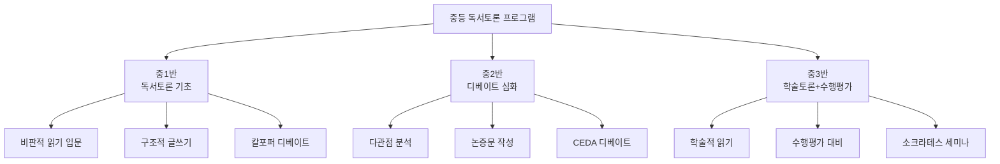
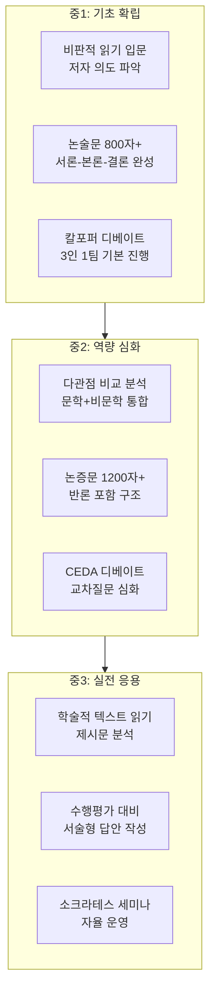
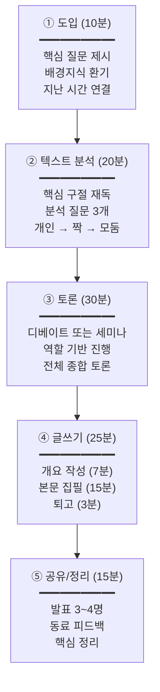
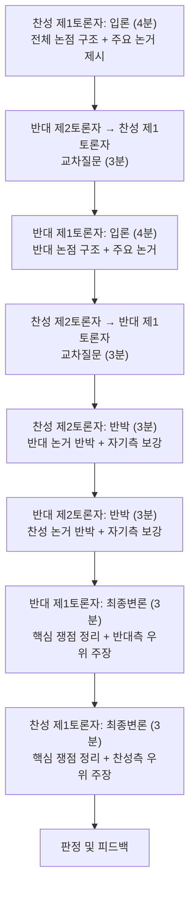
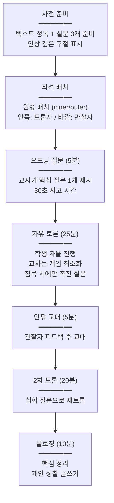
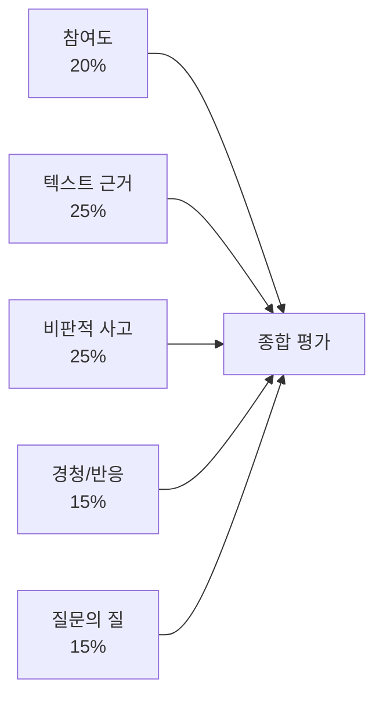
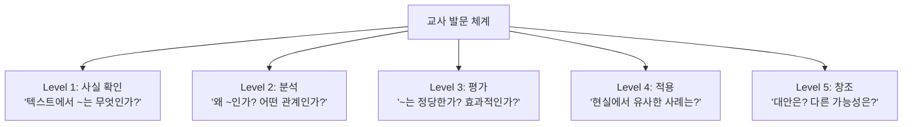
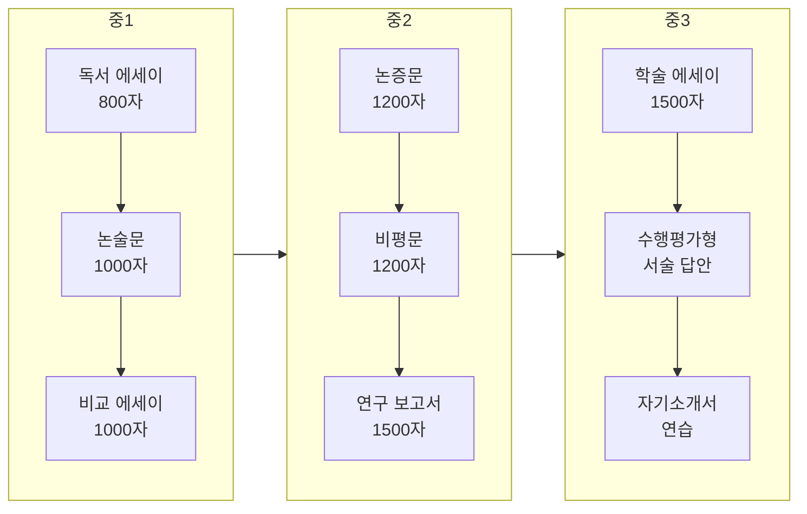

# 독서토론 중등과정 실전 운영 매뉴얼

> 중학교 1~3학년 대상 | 36주 연간 커리큘럼 | 디베이트 중심 | 교사 지시서 완전판

---

## 전체 운영 구조도



---

## PART 1. 교육 목표 및 역량 체계

### 1.1 학년별 도달 목표



### 1.2 핵심 역량 비교표

| 역량 | 중1 | 중2 | 중3 |
|------|-----|-----|-----|
| **읽기** | 저자 의도 파악, 핵심 요약 | 다관점 비교, 비문학 독해 | 학술 텍스트 분석, 제시문 해석 |
| **말하기** | 주장+근거 2개+예시 | 주장+근거 3개+반론 고려 | 즉흥 토론, 학술 발표 |
| **쓰기** | 논술문 800자 (3단 구조) | 논증문 1200자 (반론 포함) | 서술형 답안, 비평문 |
| **토론** | 칼포퍼 디베이트 | CEDA 디베이트 | 소크라테스 세미나, 의회식 |
| **사고** | 원인-결과, 비교-대조 | 귀납-연역, 유추 | 비판적 분석, 창의적 종합 |

---

## PART 2. 중1 연간 커리큘럼 (36주)

### 2.1 단원 구성 개요

```mermaid
gantt
    title 중1 연간 커리큘럼
    dateFormat MM
    section 1학기
    1단원-성장소설읽기       :a1, 03, 45d
    2단원-사회비판소설       :a2, after a1, 45d
    3단원-비문학독해         :a3, after a2, 30d
    section 2학기  
    4단원-한국문학           :b1, 09, 30d
    5단원-세계문학           :b2, after b1, 45d
    6단원-진로독서           :b3, after b2, 30d
    종합정리                 :b4, after b3, 15d
```



### 2.2 주차별 상세 계획

| 단원 | 주 | 도서/텍스트 | 수업 주제 | 토론 형식 | 글쓰기 과제 | 핵심 발문 |
|------|-----|-----------|----------|----------|-----------|----------|
| **1단원** | 1 | 『아몬드』 1~4장 | 감정이란 무엇인가 | 하브루타 | 인물 분석 노트 | "감정 없이 인간관계가 가능한가?" |
| **성장** | 2 | 『아몬드』 5~8장 | 관계와 변화 | 모둠 토론 | 관계도+감정 변화표 | "곤이는 왜 윤재를 변화시켰는가?" |
| **소설** | 3 | 『아몬드』 9장~끝 | 공감의 의미 | 소크라테스 세미나 | 독서 에세이 800자 | "공감은 학습 가능한 것인가?" |
| | 4 | 『아몬드』 전체 | **디베이트**: 공감능력 필수론 | 칼포퍼 디베이트 | 논술문 800자 | 찬반 논거 정리 |
| | 5 | 『데미안』 1~3장 | 두 세계: 밝음과 어둠 | 텍스트 분석 토론 | 상징 분석 노트 | "싱클레어에게 '밝은 세계'란?" |
| | 6 | 『데미안』 4~6장 | 자아 발견의 과정 | 가치관 토론 | 성찰 에세이 | "선과 악의 구분은 절대적인가?" |
| | 7 | 『데미안』 7장~끝 | 아프락사스의 의미 | 심층 토론 | 주제 분석 보고서 | "데미안이 상징하는 것은?" |
| | 8 | 단원 정리 | 성장소설 비교 분석 | 비교 토론 | 비교 에세이 1000자 | "아몬드와 데미안의 공통점과 차이점" |
| **2단원** | 9 | 『동물농장』 1~4장 | 혁명의 이상과 현실 | 역사 연계 토론 | 알레고리 분석 | "동물들은 왜 혁명을 일으켰는가?" |
| **사회** | 10 | 『동물농장』 5~7장 | 권력의 부패 과정 | 타임라인 토론 | 권력 변화 분석표 | "나폴레옹은 언제부터 변했는가?" |
| **비판** | 11 | 『동물농장』 8~10장 | 선전과 여론 조작 | 미디어 분석 토론 | 비판적 분석문 | "스퀼러의 기법은 현대 사회에도 있는가?" |
| | 12 | 『동물농장』 전체 | **디베이트**: 직접민주주의 vs 대의민주주의 | CEDA 입문 | 논증문 1000자 | 정치체제 비교 논거 |
| | 13 | 『1984(발췌)』 | 감시 사회 | 시사 토론 | CCTV·SNS 분석 | "프라이버시와 안전 중 무엇이 우선?" |
| | 14 | 시사 텍스트 | AI 시대의 자유 | 월드카페 | 사회문제 보고서 | "기술 발전이 자유를 보장하는가?" |
| | 15~16 | 단원 정리 | 사회 비판 문학의 가치 | 종합 발표 | 비교 에세이 | 포트폴리오 정리 |
| **3단원** | 17 | 『사피엔스(발췌)』1 | 인지 혁명 | 과학 토론 | 요약+분석 | "인간을 특별하게 만든 것은?" |
| **비문학** | 18 | 『사피엔스(발췌)』2 | 농업 혁명의 함정 | 찬반 토론 | 논증문 | "농업 혁명은 축복인가 재앙인가?" |
| | 19~20 | 과학/사회 비문학 | 자유 선택 비문학 | 북토크 | 서평 | 1학기 마무리 |
| **4단원** | 21~22 | 『우리들의 일그러진 영웅』 | 권위와 복종 | 역할극+토론 | 경험 에세이 | "엄석대에게 맞선다면?" |
| **한국** | 23~24 | 『난장이가 쏘아올린 작은 공(발췌)』 | 사회 불평등 | 모둠 토론 | 사회 분석문 | "난장이 가족의 비극 원인은?" |
| **문학** | 25~26 | 한국 단편소설 선집 | 문학적 표현 분석 | 텍스트 분석 | 문학 비평문 | 작품별 주제 비교 |
| **5단원** | 27~28 | 『어린 왕자』 | 본질과 관계 | 소크라테스 세미나 | 상징 분석+에세이 | "길들인다는 것의 의미는?" |
| **세계** | 29~30 | 『파리대왕(발췌)』 | 문명과 야만 | 의회식 디베이트 | 논증문 | "인간의 본성은 선한가 악한가?" |
| **문학** | 31~32 | 자유 선택 세계 문학 | 개별 발표 | 독서 발표회 | 서평+발표자료 | 자율 선택 |
| **6단원** | 33~34 | 진로 관련 도서 | 진로 탐색 독서 | 직업 토론 | 진로 에세이 | "나의 미래를 위해 필요한 역량은?" |
| **진로** | 35~36 | - | 종합 정리 | 최종 발표회 | 연간 포트폴리오 | 1년 성장 돌아보기 |

---

## PART 3. 수업 운영 매뉴얼

### 3.1 100분 수업 흐름도 (표준)



### 3.2 실전 지도안: 『동물농장』 디베이트 수업 (중1, 100분)

**논제**: "직접민주주의가 대의민주주의보다 우월하다"

**교사 사전 준비**
- [ ] 사전 과제: 『동물농장』 완독 + 토론 준비 워크시트 완성
- [ ] 찬성/반대 팀 사전 배정 (6:6 또는 8:8)
- [ ] CEDA 디베이트 규칙표 인쇄
- [ ] 타이머, 판정 루브릭, 기록지
- [ ] 보충 자료: 현대 민주주의 사례 (스위스 직접민주주의, 한국 대의민주주의)

| 단계 | 시간 | 교사 스크립트 | 학생 활동 | 유의사항 |
|------|------|-------------|----------|---------|
| **도입** | 0~5분 | "『동물농장』에서 동물들은 자신들의 정치를 만들어갔습니다. 처음에는 모두가 참여하는 직접민주주의였죠. 하지만 결국 돼지들의 독재가 되었어요. 오늘 우리는 이 질문을 토론합니다: '직접민주주의가 대의민주주의보다 우월한가?'" | 경청, 논제 기록 | 핵심 개념 칠판에 정리 |
| **개념** | 5~10분 | "먼저 개념을 정리합시다. 직접민주주의란? (학생 답변) 대의민주주의란? (학생 답변) 『동물농장』에서 각각의 사례는?" | 개념 정리 | 오개념 교정 |
| **준비** | 10~20분 | "팀별로 최종 전략을 세우세요. 역할을 확정하세요. 입론자: 팀 주장의 전체 틀 제시. 질문자: 상대팀 허점 파악 질문 3개 이상 준비. 반박자: 예상 반론에 대한 재반박 준비." | 팀 전략 회의 | 순회하며 논거 수준 확인 |
| **디베이트** | 20~50분 | **CEDA 형식 진행** (아래 순서도 참조) | 디베이트 실행 | 타이머 엄수, 기록 |
| **판정** | 50~60분 | "양팀 모두 수고했습니다. 판정 전에, 청중 여러분은 어느 팀이 더 설득력 있었나요? (거수) 이유를 한 명씩 말해보세요." | 청중 평가 | 구체적 근거 요구 |
| **연결** | 60~65분 | "이제 『동물농장』으로 돌아가봅시다. 동물들의 실패는 직접민주주의의 한계 때문인가, 아니면 다른 이유인가? 나폴레옹의 독재를 막을 방법은 없었을까?" | 자유 토론 | 텍스트 근거 요구 |
| **글쓰기** | 65~90분 | "논술문 작성 시간입니다. 주제: '바람직한 민주주의의 조건'. 『동물농장』을 근거로 활용하되, 현실 사례도 포함하세요. 개요 7분 → 본문 15분 → 퇴고 3분. 1000자 이상." | 논증문 작성 | 개요 확인 후 본문 |
| **마무리** | 90~100분 | "발표할 사람? (3명) ... 다음 주에는 오웰의 또 다른 작품 『1984』 발췌문을 읽어옵니다. 감시 사회에 대해 생각해오세요." | 발표+정리 | 다음 과제 안내 |

### 3.3 CEDA 디베이트 진행 순서도



### 3.4 소크라테스 세미나 진행 순서도 (중2~3)



---

## PART 4. 평가 시스템

### 4.1 디베이트 판정 루브릭 (중등용)

| 평가 영역 | 매우 우수 (5) | 우수 (4) | 보통 (3) | 미흡 (2) | 매우 미흡 (1) |
|-----------|-------------|---------|---------|---------|-------------|
| **논제 이해** | 쟁점을 정확히 파악하고 용어를 명확히 정의함 | 쟁점을 파악함 | 논제를 이해함 | 이해 부족 | 논제를 오해 |
| **입론 구성** | 3개 이상 논거를 체계적으로 배치, 논점 구조 탁월 | 2~3개 논거, 구조적 | 1~2개 논거 | 논거 약함 | 입론 없음 |
| **근거/자료** | 통계+사례+전문가의견 다양하게 활용 | 2종 이상 자료 | 1종 자료 | 자료 미흡 | 자료 없음 |
| **교차질문** | 핵심을 찌르는 전략적 질문으로 상대 논리 붕괴 | 효과적 질문 | 적절한 질문 | 질문 부적절 | 질문 없음 |
| **반박** | 상대 핵심 논거를 정확히 지적하고 논리적으로 재반박 | 효과적 반박 | 반박 시도 | 반박 약함 | 반박 없음 |
| **전달력** | 명확한 발음, 적절한 속도/강약, 시선처리 탁월 | 전달 명확 | 전달 가능 | 전달 어려움 | 매우 어려움 |
| **팀워크** | 역할 분담 완벽, 전략적 협업 | 협력 양호 | 협력함 | 소극적 | 협력 없음 |
| **시간 관리** | 배정 시간 ±10초 이내 | ±20초 이내 | ±30초 이내 | 시간 초과/부족 | 심각한 위반 |

**총점**: 40점 / **승리 기준**: 총점 + 핵심 쟁점 지배력 종합 판단

### 4.2 논술문 평가 루브릭 (중등용)

| 항목 | A (5점) | B (4점) | C (3점) | D (2점) | E (1점) |
|------|---------|---------|---------|---------|---------|
| **구조** | 서론-본론(3단)-결론 완벽, 단락 전환 자연스러움 | 구조 명확 | 기본 구조 있음 | 구조 불명확 | 구조 없음 |
| **주장** | 핵심 주장이 명확하고 일관되게 유지됨 | 주장 명확 | 주장 있음 | 주장 불명확 | 주장 없음 |
| **논거** | 논거 3개+, 각각 구체적 사례/통계 뒷받침 | 논거 2~3개 | 논거 1~2개 | 논거 약함 | 논거 없음 |
| **반론 고려** | 예상 반론 제시 + 효과적 재반박 | 반론 고려 | 반론 언급 | 반론 미고려 | - |
| **텍스트 활용** | 원문 인용/참조가 적절하고 분석적 | 인용 적절 | 인용 있음 | 인용 피상적 | 인용 없음 |
| **표현** | 다양한 어휘, 정확한 문법, 학술적 표현 | 적절한 표현 | 무난한 표현 | 어색한 표현 | 표현 미흡 |

**총점**: 30점

### 4.3 소크라테스 세미나 평가표



| 관찰 항목 | 체크 포인트 | 점수(1~5) |
|-----------|-----------|----------|
| **발언 횟수** | 3회 미만(1), 3~5회(3), 6회 이상(5) | /5 |
| **텍스트 근거** | 텍스트 인용/참조 없음(1), 1~2회(3), 3회 이상(5) | /5 |
| **핵심 질문** | 주제에서 벗어남(1), 적절(3), 토론을 심화시킴(5) | /5 |
| **타인 의견 반응** | 반응 없음(1), "동의/반대"만(3), 근거 들어 반응(5) | /5 |
| **새로운 관점** | 기존 의견 반복(1), 약간 새로움(3), 독창적 관점(5) | /5 |

---

## PART 5. 교사 발문 은행 (중등용)

### 5.1 질문 유형별 발문 체계



### 5.2 도서별 교사 발문 예시

#### 『동물농장』 발문 시퀀스

| Level | 발문 예시 | 사용 시점 |
|-------|----------|----------|
| **L1** | "동물 농장의 7계명은 무엇이었나? 마지막에 어떻게 변했나?" | 내용 확인 |
| **L2** | "나폴레옹이 스노볼을 추방한 진짜 이유는 무엇인가?" | 분석 토론 |
| **L2** | "스퀼러가 사용한 선전 기법을 3가지 이상 찾아보자." | 분석 심화 |
| **L3** | "동물들의 혁명은 성공한 것인가, 실패한 것인가?" | 평가 토론 |
| **L3** | "복서의 충성심은 존경할 만한가, 어리석은 것인가?" | 윤리 판단 |
| **L4** | "현대 사회에서 '스퀼러'와 같은 역할을 하는 것은?" | 시사 연결 |
| **L4** | "역사에서 동물농장과 유사한 사례를 찾아보자." | 역사 연결 |
| **L5** | "동물들이 독재를 막으려면 어떤 제도가 필요했을까?" | 대안 토론 |
| **L5** | "오늘날의 민주주의에서 '나폴레옹'이 나타나지 않으려면?" | 창의적 사고 |

#### 『데미안』 발문 시퀀스

| Level | 발문 예시 |
|-------|----------|
| **L1** | "싱클레어가 처음 경험한 '어두운 세계'의 사건은?" |
| **L2** | "데미안은 싱클레어에게 어떤 존재인가? 친구? 멘토? 또 다른 자아?" |
| **L2** | "'아프락사스'라는 신은 무엇을 상징하는가?" |
| **L3** | "싱클레어의 변화는 긍정적인가? 혹시 위험하지는 않은가?" |
| **L4** | "나에게도 '데미안'과 같은 존재가 있는가?" |
| **L5** | "선과 악의 이분법을 넘어선 세계관은 가능한가?" |

### 5.3 토론 촉진 발문 (상황별)

| 상황 | 교사 발문 |
|------|----------|
| **침묵이 길어질 때** | "방금 읽은 구절에서 가장 눈에 띄는 단어는 뭔가요?" |
| **한쪽 의견만 나올 때** | "반대 입장에서 생각해볼 사람? 일부러라도 반대 논거를 만들어볼까요?" |
| **피상적 답변** | "좀 더 구체적으로 말해줄 수 있나요? 텍스트 어느 부분에서 그렇게 생각했나요?" |
| **감정적 대립** | "두 의견 모두 좋은 근거가 있어요. 공통점은 없을까요?" |
| **주제 이탈** | "흥미로운 이야기인데, 오늘의 핵심 질문으로 돌아가볼까요?" |
| **토론 마무리** | "오늘 토론에서 '합의된 것'과 '끝까지 논쟁된 것'을 각각 정리해봅시다." |

---

## PART 6. 글쓰기 지도 체계

### 6.1 중등 글쓰기 유형 로드맵



### 6.2 논증문 구조 교사 지도 가이드

```
┌─────────────────────────────────────────────┐
│              논증문 구조 (AREL)              │
├─────────────────────────────────────────────┤
│                                             │
│  ┌─────────────────────────────────────┐    │
│  │ A - Assertion (주장)                │    │
│  │ "나는 ~라고 주장한다"               │    │
│  └─────────────────────────────────────┘    │
│              ↓                              │
│  ┌─────────────────────────────────────┐    │
│  │ R - Reasoning (이유)                │    │
│  │ "왜냐하면 ~이기 때문이다"           │    │
│  └─────────────────────────────────────┘    │
│              ↓                              │
│  ┌─────────────────────────────────────┐    │
│  │ E - Evidence (증거)                 │    │
│  │ "실제로 ~한 사례/통계가 있다"       │    │
│  └─────────────────────────────────────┘    │
│              ↓                              │
│  ┌─────────────────────────────────────┐    │
│  │ L - Link back (연결)               │    │
│  │ "따라서 ~라는 주장이 타당하다"      │    │
│  └─────────────────────────────────────┘    │
│                                             │
└─────────────────────────────────────────────┘
```

### 6.3 첨삭 피드백 기호 체계

| 기호 | 의미 | 교사 코멘트 예시 |
|------|------|----------------|
| ○ | 좋은 표현/논거 | "설득력 있는 근거!" |
| △ | 보완 필요 | "근거가 약해요. 구체적 사례 추가" |
| ✕ | 논리 오류 | "주장과 근거가 맞지 않아요" |
| → | 구조 변경 제안 | "이 단락은 본론2로 이동" |
| ~~취소선~~ | 불필요한 부분 | "반복되는 내용, 삭제 권장" |
| ? | 의미 불명확 | "무엇을 말하려는 건가요?" |
| ★ | 우수 | "독창적인 관점!" |

---

## PART 7. 학부모 소통 및 운영 관리

### 7.1 학기초 오리엔테이션 안내문

```
━━━━━━━━━━━━━━━━━━━━━━━━━━━━━━━━━━
  [중등 독서토론] 학기 오리엔테이션 안내
━━━━━━━━━━━━━━━━━━━━━━━━━━━━━━━━━━

■ 수업 개요
• 대상: 중__학년 / 정원: __명
• 시간: 매주 __요일 __:__~__:__
• 장소: ______________

■ 연간 프로그램
• 1학기: 성장소설 → 사회비판소설 → 비문학
• 2학기: 한국문학 → 세계문학 → 진로독서
• 토론 형식: 디베이트, 세미나, 월드카페

■ 평가 방식
• 수시 평가 (토론 참여도): 40%
• 중간 평가 (논술문): 30%
• 포트폴리오: 30%

■ 가정에서 도와주세요
1. 매주 배정된 독서 분량을 읽을 시간 확보
2. "어떤 내용이었어?" 대신 
   "어떤 생각이 들었어?"로 질문해주세요
3. 정답이 없는 대화를 즐겨주세요

■ 필독서 목록 (별도 안내)
■ 문의: _______________
━━━━━━━━━━━━━━━━━━━━━━━━━━━━━━━━━━
```

### 7.2 월별 학습 보고서 (중등용)

```
═══════════════════════════════════════════
         중등 독서토론 월별 학습 보고서
═══════════════════════════════════════════
학생: _________ (중__학년)    ____년 __월

[이달의 독서 & 토론]
────────────────────────────────────────
도서: 『__________________』
토론 논제: _____________________________
토론 형식: _________ / 역할: __________
참여 평가: ☆☆☆☆☆ (__/5)

[글쓰기 성장 분석]
────────────────────────────────────────
작성 편수: __편 / 평균 분량: ___자
구조 완성도: ☆☆☆☆☆
논거 충실도: ☆☆☆☆☆
표현 다양성: ☆☆☆☆☆

강점: 
개선점: 

[교사 총평]
────────────────────────────────────────


[다음 달 과제]
────────────────────────────────────────
1. 필독: 『_________________』
2. 글쓰기: 
3. 토론 준비: 

담당교사: _______ (인)
═══════════════════════════════════════════
```

---

> **운영 참고**: 중등 과정은 주 1회(100분) 기준 설계. 주 2회 운영 시 1회차를 텍스트 분석+토론, 2회차를 글쓰기+발표로 분리 가능합니다.

---

*최종 업데이트: 2026년 2월 16일*
