# 독서토론 초등과정 실전 운영 매뉴얼

> 초등 1~6학년 대상 | 36주 연간 커리큘럼 | 차시별 지도안 | 교사 지시서 완전판

---

## 전체 운영 구조도

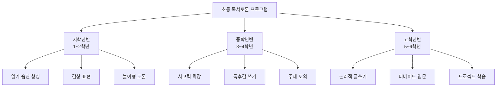

---

## PART 1. 저학년반 (1~2학년)

### 1.1 교육 목표 체계

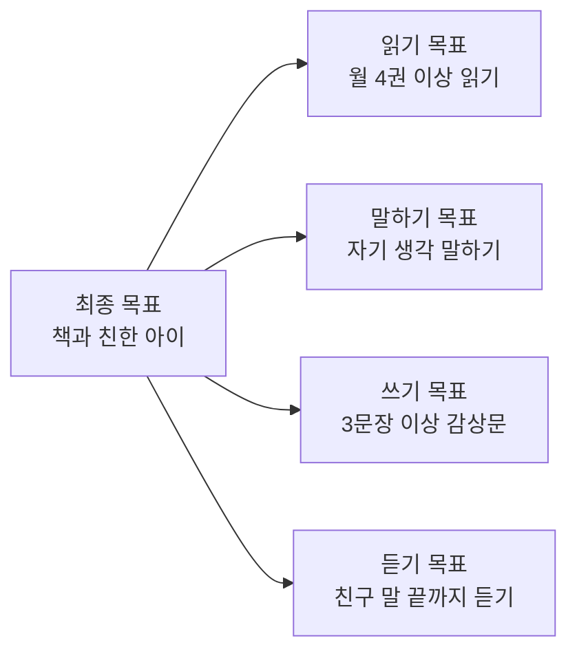

| 영역 | 1학년 목표 | 2학년 목표 |
|------|----------|----------|
| **읽기** | 그림책 혼자 읽기 | 동화책(50쪽) 읽기 |
| **말하기** | "나는 ~라고 생각해요" 문장 완성 | 이유 1가지 붙여서 말하기 |
| **쓰기** | 문장 3개로 감상 쓰기 | 문장 5~7개로 독후감 쓰기 |
| **듣기** | 친구 발표 끝까지 듣기 | 친구 의견에 반응하기 |
| **토론** | 손들고 말하기 | 돌아가며 이야기, 찬성/반대 표현 |

### 1.2 연간 36주 커리큘럼

| 월 | 주차 | 주제 | 도서 | 토론 방식 | 글쓰기 | 연계교과 |
|----|------|------|------|----------|--------|---------|
| **3월** | 1 | 나를 소개해요 | 『이게 정말 나일까?』 | 돌아가며 발표 | 자기소개 카드 | 국어 |
| | 2 | 학교생활 | 『학교에 간 개돌이』 | 질문-답변 | 학교 그림일기 | 통합 |
| | 3 | 규칙 | 『질서를 지켜요』 | 역할극 | 우리반 규칙 만들기 | 도덕 |
| **4월** | 4 | 봄/자연 | 『씨앗 아기 꽃 아기』 | 관찰 토론 | 봄 관찰 일지 | 통합 |
| | 5 | 책 읽기 | 『도서관에 간 사자』 | 자유 토의 | 좋아하는 책 소개 | 국어 |
| | 6 | 동물 | 『강아지똥』 | 감정 이야기 | 등장인물 편지 | 국어 |
| | 7 | 상상력 | 『구름빵』 | 이어 말하기 | 결말 바꾸기 | 국어 |
| **5월** | 8 | 가족 사랑 | 『엄마 사용법』 | 하브루타(짝) | 가족에게 편지 | 도덕 |
| | 9 | 감사 | 『고맙습니다 선생님』 | 릴레이 발표 | 감사 카드 | 도덕 |
| | 10 | 효도 | 『심청전(그림책)』 | 역할극 | 효도 다짐문 | 도덕 |
| **6월** | 11 | 우정 | 『무지개 물고기』 | 가치 수직선 | 친구 소개문 | 도덕 |
| | 12 | 나눔 | 『아낌없이 주는 나무』 | 찬반 표현 | 나눔 경험 쓰기 | 도덕 |
| | 13 | 약속 | 『해님달님』 | 이야기 토론 | 약속 목록 만들기 | 국어 |
| **7월** | 14 | 여름/물 | 『바닷속 이야기』 | 퀴즈 토론 | 여름 방학 계획 | 통합 |
| | 15 | 1학기 마무리 | 자유 선택 | 북토크 | 최고의 책 소개문 | 국어 |
| | 16 | 포트폴리오 | - | - | 1학기 돌아보기 | - |
| **9월** | 17 | 가을/추석 | 『솔이의 추석 이야기』 | 비교 이야기 | 추석 관찰 일기 | 통합 |
| | 18 | 전통 | 『호랑이와 곶감』 | 역할극 | 전래동화 다시 쓰기 | 국어 |
| | 19 | 음식 | 『팥이 영감과 우르르 콩』 | 요리 토론 | 음식 소개문 | 통합 |
| **10월** | 20 | 독서의 달 | 자유 선택 | 북토크 | 서평 쓰기(3문장) | 국어 |
| | 21 | 용기 | 『겁쟁이 사자』 | 감정 토론 | 용기 낸 경험 | 도덕 |
| | 22 | 다름 | 『돼지책』 | 역할 바꾸기 | 모두 달라요 글쓰기 | 도덕 |
| | 23 | 꿈 | 『커다란 순무』 | 협력 토론 | 나의 꿈 발표 | 통합 |
| **11월** | 24 | 겨울 준비 | 『겨울잠 자는 동물들』 | 과학 토론 | 관찰 보고서 | 통합 |
| | 25 | 배려 | 『마음이 아파요』 | 공감 토론 | 위로 편지 쓰기 | 도덕 |
| | 26 | 환경 | 『쓰레기가 쌓이고 쌓이면』 | 실천 토론 | 환경 다짐 포스터 | 통합 |
| **12월** | 27 | 겨울/성탄 | 『눈사람 친구』 | 자유 토의 | 겨울 이야기 쓰기 | 국어 |
| | 28 | 한 해 돌아보기 | 자유 선택 | 성찰 발표 | 올해 최고의 책 | 국어 |
| | 29 | 포트폴리오 | - | 발표회 | 2학기 돌아보기 | - |

### 1.3 차시별 수업 지도안 (60분 기준)

#### 수업 흐름도

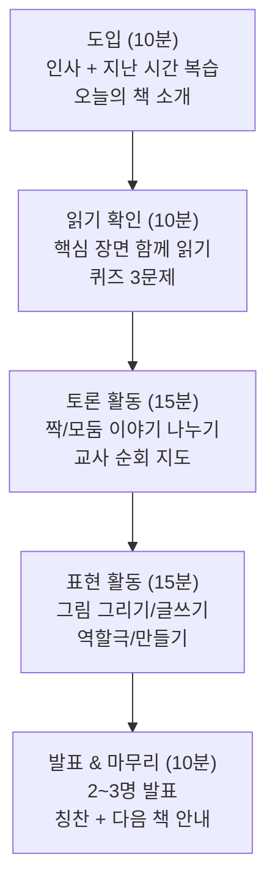

#### 실전 지도안: 6차시 『강아지똥』 (1~2학년, 60분)

**수업 전 교사 준비**
- [ ] 『강아지똥』 그림책 5권 (모둠별)
- [ ] 등장인물 그림카드 4장 (강아지똥, 흙덩이, 참새, 민들레)
- [ ] 감정 스티커 (웃는얼굴/슬픈얼굴/화난얼굴)
- [ ] 활동지 인쇄 (A4 1장, 앞: 인물 관계도 / 뒤: 편지쓰기)
- [ ] 색연필, 크레파스

| 단계 | 시간 | 교사 지시 (말 그대로 읽기) | 학생 활동 | 교사 유의사항 |
|------|------|--------------------------|----------|-------------|
| **도입** | 0~3분 | "안녕하세요! 지난 시간에 읽은 책은 뭐였죠? 맞아요! 오늘은 새 책을 만나볼 거예요. 제목이 뭘까요? (표지 보여주기) '강아지똥'이에요! 강아지똥이 주인공이래요. 신기하죠?" | 자리에 앉아 경청 | 호기심 유발, 웃음 허용 |
| **도입** | 3~5분 | "선생님이 읽어줄게요. 귀 쫑긋 세우고 들어보세요. 강아지똥은 어떤 기분일까 생각하면서요." | 경청 | 천천히, 감정 살려 읽기 |
| **읽기** | 5~15분 | (그림책 낭독) 중간중간 멈추며: "여기서 강아지똥은 어떤 기분이었을까요? 슬펐을까요, 화났을까요?" | 손들고 답변 | 모든 답변 수용 "좋은 생각이야!" |
| **퀴즈** | 15~20분 | "자, 퀴즈타임! 1번: 강아지똥을 처음 만난 건 누구? 2번: 참새는 강아지똥에게 뭐라고 했어요? 3번: 마지막에 강아지똥은 누구를 도왔나요?" | 손들고 답변 | 정답에 스티커 보상 |
| **토론** | 20~30분 | "이제 짝꿍과 이야기해볼 거예요. 질문 1: 강아지똥은 정말 쓸모없을까요? 질문 2: 여러분이 강아지똥이라면 어떤 기분이었을까요? 2분씩 번갈아가며 이야기해보세요. 시작!" | 짝 토론 2분×2 | 순회하며 칭찬, 말 안하는 아이 독려 |
| **전체공유** | 30~35분 | "어떤 이야기를 나눴나요? 발표해볼 친구?" (3명 지명) "OO의 생각 정말 멋지다! 다른 생각 있는 친구?" | 발표 | 다양한 의견 수용 |
| **활동** | 35~50분 | "이제 활동지를 나눠줄게요. 앞면에는 등장인물 그림을 그리고, 뒷면에는 강아지똥에게 편지를 써보세요. '강아지똥아, 너는 쓸모없지 않아. 왜냐하면...' 이렇게 시작해보세요." | 그림+편지 쓰기 | 순회하며 개별 격려 |
| **발표** | 50~57분 | "누가 편지를 읽어줄래요?" (3명) "와, 정말 따뜻한 편지네요!" | 자원자 발표 | 박수 유도 |
| **마무리** | 57~60분 | "오늘 우리가 배운 건 뭘까요? 맞아요! 모든 것에는 소중한 쓸모가 있어요. 다음 시간에는 『구름빵』을 읽어올 거예요. 집에서 미리 읽어오는 사람?" | 손들기 | 다음 책 나눠주기 |

### 1.4 교사 발문 은행 (저학년용)

| 발문 유형 | 예시 발문 | 사용 시점 |
|-----------|----------|----------|
| **열기** | "오늘 읽은 책에서 가장 기억에 남는 장면은?" | 수업 시작 |
| **감정** | "주인공은 이때 어떤 기분이었을까요?" | 낭독 중간 |
| **경험** | "여러분도 비슷한 경험이 있나요?" | 토론 시작 |
| **상상** | "만약 내가 주인공이라면 어떻게 했을까요?" | 토론 심화 |
| **비교** | "A와 B 중에 누구의 행동이 더 좋았나요?" | 찬반 유도 |
| **이유** | "왜 그렇게 생각해요?" | 모든 답변 후 |
| **연결** | "이 이야기는 우리 생활과 어떤 관계가 있을까요?" | 마무리 |
| **정리** | "오늘 가장 중요한 것 하나만 말해볼까요?" | 수업 종료 |

---

## PART 2. 중학년반 (3~4학년)

### 2.1 교육 목표 체계

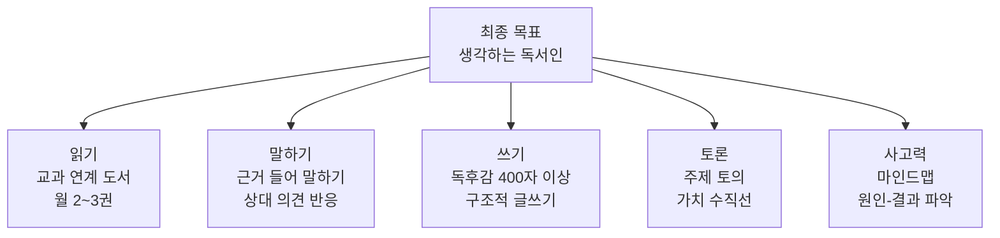

| 영역 | 3학년 목표 | 4학년 목표 |
|------|----------|----------|
| **읽기** | 중편 동화 완독 (100쪽) | 장편 동화 완독 (200쪽) |
| **말하기** | 이유 2가지 붙여 말하기 | 근거 + 예시 들어 말하기 |
| **쓰기** | 독후감 400자 (3문단) | 독후감 600자 (서론-본론-결론) |
| **토론** | 돌아가며 말하기, 가치 수직선 | 모둠 토의, 찬반 입장 발표 |
| **사고** | 마인드맵 작성 | 비교-대조, 원인-결과 분석 |

### 2.2 연간 36주 커리큘럼

| 월 | 주차 | 대주제 | 도서 | 토론 형식 | 글쓰기 과제 | 독후활동 |
|----|------|--------|------|----------|------------|---------|
| **3월** | 1~2 | 새 학기/자아 | 『이게 정말 나일까?』 | PMI 기법 | 자기소개서 | 강점 카드 만들기 |
| | 3~4 | 질문의 힘 | 『철학 안경』 | 하브루타(짝) | 질문 3개 만들기 | 질문 나무 게시판 |
| **4월** | 5~6 | 봄/자연 | 『마당을 나온 암탉』 | 4단계 토론 | 잎싹에게 편지 | 등장인물 관계도 |
| | 7~8 | 꿈과 용기 | 『마당을 나온 암탉』 | 가치 수직선 | 나의 꿈 에세이 | 북아트 소책자 |
| **5월** | 9~10 | 가족/사랑 | 『엄마 사용법』 | 릴레이 토론 | 가족 인터뷰 기사 | 가족 신문 만들기 |
| | 11~12 | 선택과 결과 | 『마법의 설탕 두 조각』 | 딜레마 토론 | 선택 일기 쓰기 | 가치 카드 게임 |
| **6월** | 13~14 | 환경 보호 | 『냉장고가 사라졌다!』 | 찬반 토론 | 환경 실천 보고서 | 에코 포스터 제작 |
| | 15~16 | 평화 | 『브이를 찾습니다』 | 감정 토론 | 평화 동시 창작 | 평화 카드 제작 |
| **7월** | 17~18 | 1학기 정리 | 자유 선택 | 북토크 | 서평 쓰기(500자) | 포트폴리오 정리 |
| **9월** | 19~20 | 역사/전통 | 『이선비 혼례를 치르다』 | 비교 토론 | 전통문화 소개문 | 역사 만화 |
| | 21~22 | 우정 | 『나의 라임오렌지나무(발췌)』 | 소크라테스 세미나 | 우정 에세이 | 편지 릴레이 |
| **10월** | 23~24 | 독서의 달 | 『몽실 언니』 | 모둠 토론 | 전쟁과 평화 논술 | 독서 신문 만들기 |
| | 25~26 | 다양성 | 『원더(발췌)』 | 역할극 토론 | '다름'에 대한 글 | 다양성 캠페인 |
| **11월** | 27~28 | 과학/호기심 | 『수학 도둑(1권)』 | 퀴즈 토론 | 수학 탐구 보고서 | 문제 만들기 |
| | 29~30 | 리더십 | 『설민석의 한국사 대모험(1)』 | 인물 토론 | 존경하는 인물 소개 | 역사 인물 카드 |
| **12월** | 31~32 | 겨울/성찰 | 자유 선택 | 성찰 토론 | 독서 감상문 결선 | 우수 작품 전시 |
| | 33~34 | 프로젝트 | - | 발표회 | 연간 베스트 서평 | 포트폴리오 완성 |

### 2.3 90분 수업 지도안 상세

#### 수업 흐름도 (중학년 90분)

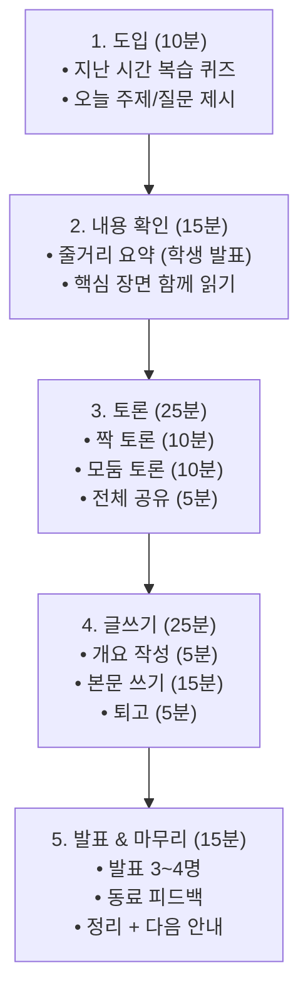

#### 실전 지도안: 『마당을 나온 암탉』 1차시 (3~4학년, 90분)

**교사 사전 준비 체크리스트**
- [ ] 『마당을 나온 암탉』 모둠별 1권 (사전 읽기 과제)
- [ ] PPT (등장인물 사진, 관계도 빈칸)
- [ ] 활동지 A: 4단계 토론 기록지
- [ ] 활동지 B: 등장인물 관계도 빈칸
- [ ] 역할 카드 (진행자/기록자/발표자/시간관리자)
- [ ] 타이머

| 단계 | 시간 | 교사 스크립트 | 학생 활동 | 교사 TIP |
|------|------|-------------|----------|---------|
| **도입** | 0~5분 | "안녕하세요! 이번 시간에는 모두 미리 읽어온 『마당을 나온 암탉』에 대해 토론할 거예요. 다 읽어왔나요? (확인) 한 문장으로 이 책을 소개한다면? 30초 생각해보세요." | 생각 정리 | 안 읽은 학생: 줄거리 요약지 제공 |
| **도입** | 5~10분 | "3명에게 물어볼게요. OO, 한 문장으로? ... 훌륭해요! 오늘의 핵심 질문은 이거예요: (칠판에 쓰기) '잎싹의 선택은 현명했을까?'" | 핵심 질문 노트 기록 | 질문을 크게 써서 계속 보이게 |
| **확인** | 10~20분 | "먼저 내용을 정리해봅시다. 잎싹이 마당을 나온 이유는? 가장 원했던 것은? 나그네는 어떤 존재인가? 3분 동안 활동지B 등장인물 관계도를 완성해보세요." | 관계도 작성 | 순회하며 확인 |
| **확인** | 20~25분 | "완성한 관계도 짝꿍과 비교해보세요. 다른 점 있나요?" | 짝 비교 | 차이점 발견 유도 |
| **토론** | 25~35분 | "이제 4인 모둠으로 앉아주세요. 역할 카드를 뽑으세요. 활동지A를 꺼내세요. 1단계 '사실 확인' 질문 3개에 대해 모둠에서 답해보세요. 10분입니다. 시작!" | 모둠 토론 1단계: 사실 확인 | 타이머 설정, 순회 |
| **토론** | 35~45분 | "잘했어요! 이제 2단계 '분석'입니다. 질문: '잎싹의 성격은 어떻게 변했나?' '족제비는 악당인가, 생존자인가?' 모둠에서 토론해보세요." | 모둠 토론 2단계: 분석 | 다양한 관점 허용 |
| **토론** | 45~50분 | "이제 3단계! 핵심 질문으로 돌아갑니다. '잎싹의 선택은 현명했을까?' 모둠 의견을 정해주세요. 찬성/반대/중립. 이유도 함께!" | 모둠 입장 정리 | 합의 과정 관찰 |
| **공유** | 50~58분 | "발표자, 앞으로! 각 모둠 의견을 발표해주세요. (4모둠) 다른 모둠에 질문 있으면 해주세요." | 모둠별 발표 + 질의응답 | 칠판에 의견 정리 |
| **글쓰기** | 58~80분 | "지금부터 글쓰기를 할 거예요. 주제: '잎싹에게 보내는 편지'. 먼저 개요를 5분 동안 짜보세요. (개요 양식 제시) 그 다음 본문을 쓰세요. 400자 이상!" | 개요→본문 작성 | 개요 확인 후 글쓰기 |
| **발표** | 80~87분 | "다 쓴 친구? 3명만 읽어줄 수 있나요?" | 자원자 발표 | 박수 + 구체적 칭찬 |
| **마무리** | 87~90분 | "오늘 토론에서 가장 인상 깊었던 의견은? (2명) 다음 시간에는 잎싹의 마지막 선택에 대해 더 깊이 토론할 거예요. 5장~끝까지 다시 한번 읽어오세요!" | 정리 노트 | 다음 차시 안내 |

### 2.4 평가 도구

#### 중학년 토론 평가표 (교사용)

| 평가 항목 | A (5점) | B (4점) | C (3점) | D (2점) |
|-----------|---------|---------|---------|---------|
| **내용 이해** | 핵심 내용을 정확히 파악하고 분석함 | 주요 내용을 잘 이해함 | 기본 내용을 파악함 | 이해 부족 |
| **의견+근거** | 의견 + 텍스트 근거 + 경험 근거 제시 | 의견 + 근거 1~2개 | 의견만 제시 | 의견 불명확 |
| **경청/반응** | 경청 + 메모 + 질문 | 경청 + 반응 | 경청하는 편 | 경청 부족 |
| **협력** | 모둠 분위기 리드 | 적극 참여 | 참여함 | 소극적 |
| **글쓰기** | 구조적 + 논리적 + 창의적 | 구조적 + 논리적 | 기본 구조 | 구조 미흡 |

**총점**: 25점 / 등급: A(23+) B(18~22) C(13~17) D(12↓)

---

## PART 3. 고학년반 (5~6학년)

### 3.1 교육 목표 체계

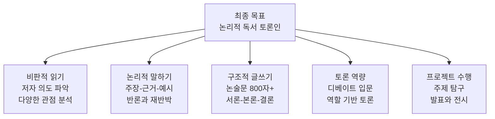

### 3.2 연간 36주 커리큘럼 (단원 중심)

```mermaid
gantt
    title 고학년반 연간 커리큘럼
    dateFormat  MM
    section 1학기
    1단원-자아정체성     :a1, 03, 2M
    2단원-사회문제       :a2, after a1, 2M
    3단원-역사이해       :a3, after a2, 1M
    1학기마무리          :a4, after a3, 15d
    section 2학기
    4단원-과학탐구       :b1, 09, 1M
    5단원-문학감상       :b2, after b1, 2M
    6단원-진로탐색       :b3, after b2, 1M
    2학기마무리          :b4, after b3, 15d
```

#### 단원별 상세 설계

| 단원 | 기간 | 핵심 도서 | 보조 도서 | 토론 형식 | 최종 산출물 |
|------|------|----------|----------|----------|-----------|
| **1. 자아 정체성** | 3~4월 (8주) | 『아몬드』 | 『원더』 | 하브루타→디베이트 | 논술문 700자 |
| **2. 사회 문제** | 5~6월 (8주) | 『동물농장』 | 『플라스틱 바다』 | 월드카페→의회식 | 사회문제 해결 보고서 |
| **3. 역사 이해** | 7월 (4주) | 『난중일기(발췌)』 | 『설민석 한국사』 | 인물 토론 | 역사 인물 평전 |
| **4. 과학 탐구** | 9월 (4주) | 『과학하고 앉아있네』 | 『수학도둑』 | 과학 논쟁 토론 | 과학 탐구 보고서 |
| **5. 문학 감상** | 10~11월 (8주) | 『어린 왕자』 | 『나미야 잡화점의 기적』 | 소크라테스 세미나 | 서평 + 창작 글쓰기 |
| **6. 진로 탐색** | 12월 (4주) | 자유 선택 (진로 관련) | - | 북토크 | 독서 포트폴리오 |

#### 1단원 주차별 세부 계획

| 주차 | 도서 범위 | 토론 주제 | 토론 형식 | 글쓰기 | 교사 핵심 발문 |
|------|----------|----------|----------|--------|--------------|
| 1주 | 『아몬드』 1~3장 | 윤재의 특별함 이해 | 짝 하브루타 | 인물 분석 노트 | "감정이 없다는 건 무엇일까?" |
| 2주 | 『아몬드』 4~6장 | 곤이와의 관계 | 모둠 토론 | 관계도 완성 | "왜 곤이는 윤재에게 끌렸을까?" |
| 3주 | 『아몬드』 7~9장 | 변화의 계기 | 소크라테스 세미나 | 변화 일지 | "윤재가 변한 건가, 원래 있던 게 드러난 건가?" |
| 4주 | 『아몬드』 완독 | **디베이트**: "공감능력은 인간의 필수조건이다" | 칼포퍼 디베이트 | 논술문 500자 | 찬반 논거 정리 |
| 5주 | 『원더』 1~3부 | 외모와 차별 | 역할극 토론 | 어기의 일기 쓰기 | "어기를 처음 만난다면 어떤 반응?" |
| 6주 | 『원더』 4~6부 | 다양한 시점 비교 | 월드카페 | 시점 바꿔 쓰기 | "왜 작가는 여러 시점을 사용했을까?" |
| 7주 | 『원더』 완독 | **디베이트**: "외모에 의한 차별은 법으로 금지해야 한다" | 의회식 토론 | 논술문 700자 | 법적/윤리적 논거 구분 |
| 8주 | 단원 정리 | 종합 토론 | 피라미드 토론 | 최종 에세이 | "자아 정체성이란 무엇인가?" |

### 3.3 고학년 120분 수업 지도안

#### 수업 흐름도

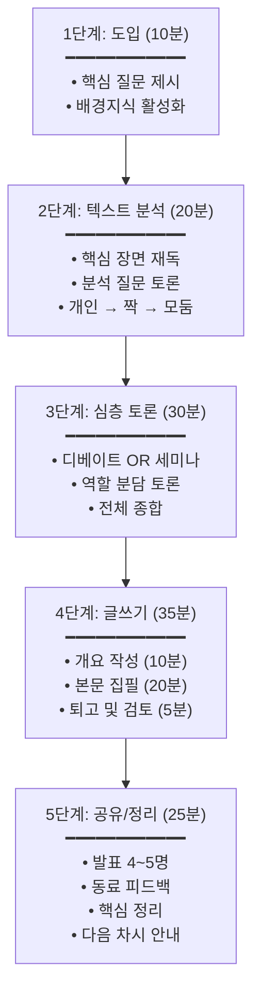

#### 실전 지도안: 4주차 『아몬드』 디베이트 수업 (120분)

**논제**: "공감 능력은 인간의 필수 조건이다"

| 단계 | 시간 | 교사 스크립트 | 학생 활동 | 준비물 |
|------|------|-------------|----------|--------|
| **배경** | 0~5분 | "오늘은 드디어 디베이트 날이에요! 지난 3주간 『아몬드』를 읽으며 준비한 것을 보여줄 시간입니다. 논제를 확인하세요: '공감 능력은 인간의 필수 조건이다.' 찬성팀과 반대팀으로 나뉘어 토론합니다." | 팀 확인, 자리 이동 | 논제 게시판, 타이머 |
| **규칙** | 5~10분 | "칼 포퍼 디베이트 규칙을 확인합니다. (규칙 PPT) ①찬성 입론 3분 ②반대 교차질문 2분 ③반대 입론 3분 ④찬성 교차질문 2분 ⑤찬성 반박 2분 ⑥반대 반박 2분 ⑦최종 변론 각 2분. 총 20분입니다." | 규칙 확인, 역할 확인 | 규칙표, 역할카드 |
| **준비** | 10~20분 | "10분 동안 팀별 최종 전략을 짜세요. 입론자, 교차질문자, 반박자, 최종변론자를 확정하세요." | 팀 전략 회의 | 전략 기록지 |
| **디베이트** | 20~40분 | (진행자 역할) "찬성팀 1번 토론자, 입론 시작하세요. 3분입니다." → 규칙대로 진행 | 디베이트 실행 | 타이머, 기록지 |
| **피드백** | 40~50분 | "잘했습니다! 양팀 모두 훌륭했어요. 먼저, 각자 상대팀에서 가장 설득력 있었던 논거를 하나씩 말해보세요." | 상호 피드백 | - |
| **판정** | 50~55분 | 교사 판정: "논리성, 근거의 타당성, 반박력을 종합하면..." + 개별 피드백 | 결과 청취 | 평가 루브릭 |
| **글쓰기** | 55~90분 | "이제 논술문을 쓸 시간입니다. 주제: '공감 능력의 중요성에 대한 나의 견해'. 토론에서 나온 양측 의견을 모두 고려해서 써주세요. 개요 10분 → 본문 20분 → 퇴고 5분." | 논술문 작성 (500자+) | 논술 원고지 |
| **발표** | 90~110분 | "완성한 논술문을 발표할 친구? 4명!" | 발표 + 동료 피드백 | 피드백 카드 |
| **정리** | 110~120분 | "오늘 디베이트를 통해 무엇을 배웠나요? 공감 능력이 필수인지 아닌지보다 중요한 건, 다양한 관점에서 생각하는 힘이에요. 다음 주부터 『원더』를 시작합니다!" | 정리 노트, 다음 책 확인 | - |

### 3.4 고학년 칼 포퍼 디베이트 진행 순서도

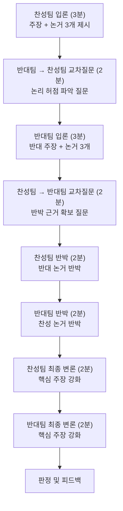

### 3.5 고학년 글쓰기 단계별 지도

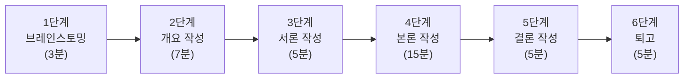

#### 논술문 개요 양식

```
┌─────────────────────────────────────────┐
│           논술문 개요                     │
├─────────────────────────────────────────┤
│ 논제: _________________________________  │
│ 나의 입장: _____________________________  │
├─────────────────────────────────────────┤
│ [서론] 문제 제기 + 나의 입장 한 문장      │
│ → ____________________________________  │
├─────────────────────────────────────────┤
│ [본론1] 근거 ①: ______________________  │
│  예시/사례: ___________________________  │
├─────────────────────────────────────────┤
│ [본론2] 근거 ②: ______________________  │
│  예시/사례: ___________________________  │
├─────────────────────────────────────────┤
│ [본론3] 반론 고려 + 재반박              │
│  예상 반론: ___________________________  │
│  나의 재반박: _________________________  │
├─────────────────────────────────────────┤
│ [결론] 주장 재강조 + 전망               │
│ → ____________________________________  │
└─────────────────────────────────────────┘
```

---

## PART 4. 통합 교사 지시서

### 4.1 수업 전 필수 체크리스트

| 구분 | 저학년 | 중학년 | 고학년 |
|------|--------|--------|--------|
| **도서 확인** | 그림책 모둠별 확보 | 사전 읽기 과제 확인 | 사전 읽기 + 발제문 확인 |
| **좌석 배치** | ㅁ자 (전체 보이게) | 4인 모둠 | 토론 형태별 변형 |
| **활동지** | 그림+3문장 양식 | 토론기록지+독후감양식 | 개요양식+논술원고지+평가지 |
| **준비물** | 색연필, 스티커 | 역할카드, 타이머 | 역할카드, 타이머, 판정표 |
| **시간 확인** | 60분 | 90분 | 120분 |

### 4.2 위기 대응 매뉴얼

| 상황 | 원인 | 대응 방법 |
|------|------|----------|
| **학생이 책을 안 읽어옴** | 습관 미형성, 동기 부족 | 줄거리 요약지 제공, 핵심 장면만 함께 읽기, 다음 수업 전 리마인드 |
| **토론 참여를 안 함** | 소극적 성격, 자신감 부족 | 짝 토론부터 시작, 역할 카드로 '기록자' 배정, 글로 의견 제출 허용 |
| **한 학생이 토론 독점** | 발표 욕구 강함 | "OO 의견 잘 들었어요. 다른 친구 의견도 들어볼까요?" 발언 토큰 제도 |
| **감정적 대립** | 주제 민감, 토론 미숙 | 즉시 중단 → "잠깐, 우리 규칙 확인해요" → 의견이지 인격이 아님 강조 |
| **글쓰기 거부** | 어려움, 두려움 | 문장 시작 제공 ("나는 ~라고 생각한다. 왜냐하면..."), 분량 축소 허용 |
| **수업 시간 부족** | 토론 과열, 진행 지연 | 글쓰기를 과제로 전환, 핵심 활동만 진행 |

### 4.3 학부모 소통 가이드

#### 월별 가정통신문 양식

```
━━━━━━━━━━━━━━━━━━━━━━━━━━━━━━
   [학년] 독서토론 ___월 안내문
━━━━━━━━━━━━━━━━━━━━━━━━━━━━━━

학부모님 안녕하세요.

[이번 달 프로그램]
📚 도서: 『________________』
🎯 주제: ________________
📝 활동: ________________

[가정에서 도와주세요]
1. 매주 ___요일까지 책 읽기를 마칠 수 있도록
   독서 시간을 확보해주세요.
2. "오늘 책에서 어떤 부분이 좋았어?" 질문을
   자주 해주시면 좋습니다.
3. 강요보다는 함께 읽기를 추천합니다.

[지난 달 우리 반 성과]
✅ 토론 참여율: ___%
✅ 평균 글쓰기 분량: ___자
✅ 이달의 우수 토론자: ___

문의: 담당교사 ___ (연락처)
━━━━━━━━━━━━━━━━━━━━━━━━━━━━━━
```

### 4.4 연간 평가 계획

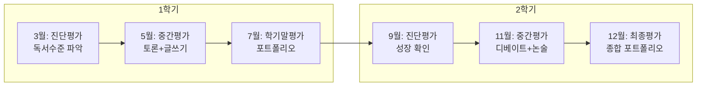

| 평가 시기 | 평가 방법 | 반영 비율 | 대상 |
|-----------|----------|----------|------|
| **진단평가** (3월/9월) | 독서 수준 테스트, 글쓰기 사전 진단 | 미반영 (참고용) | 전 학년 |
| **수시평가** (매 수업) | 토론 참여도 관찰, 글쓰기 첨삭 | 40% | 전 학년 |
| **중간평가** (5월/11월) | 토론 발표 평가, 논술문 평가 | 30% | 전 학년 |
| **최종평가** (7월/12월) | 포트폴리오 평가, 최종 발표 | 30% | 전 학년 |

---

> **참고**: 이 매뉴얼은 주 1회 수업 기준으로 설계되었습니다. 주 2회 운영 시 토론과 글쓰기를 분리 진행할 수 있습니다.

---

*최종 업데이트: 2026년 2월 16일*
