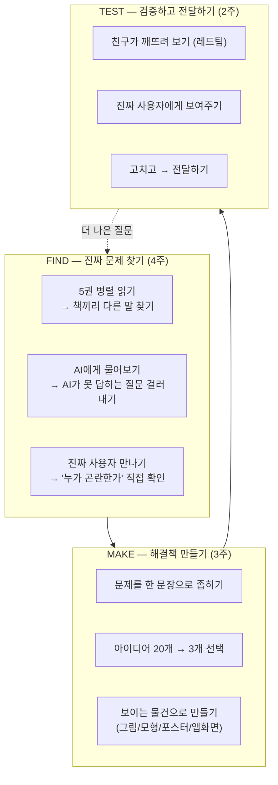
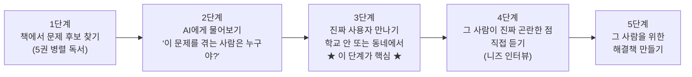
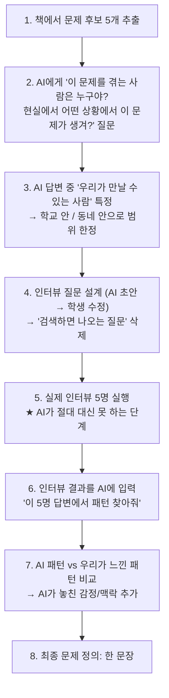
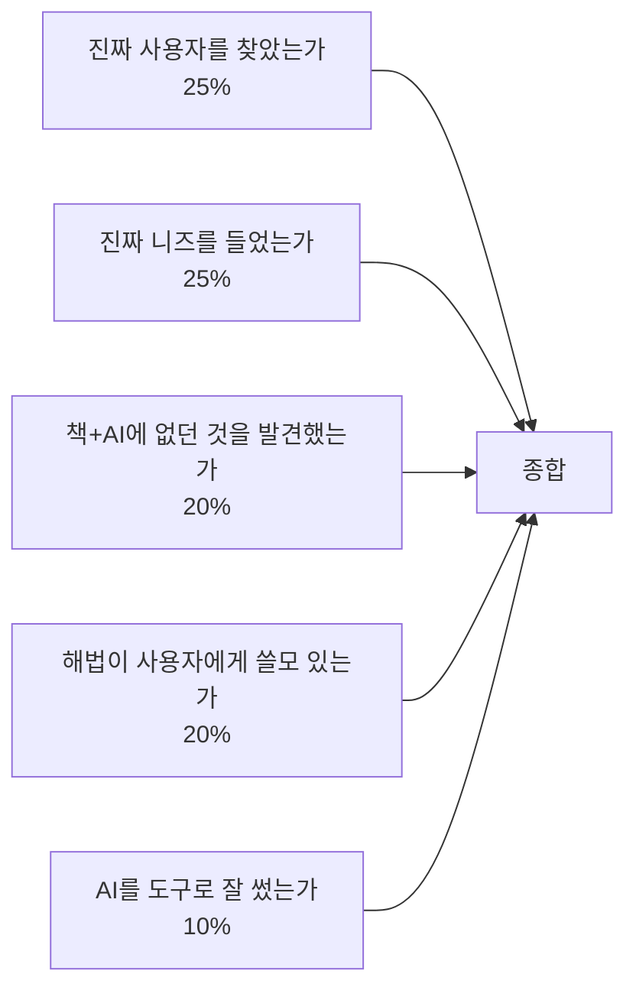

# 독서토론 초등과정 실전 운영 매뉴얼 (2032 개정판)

> 초등 1~6학년 | 36주 | **병렬 독서 × AI 협업 × 진짜 문제 발굴 프로그램** | 교사 지시서 완전판

---

## 0. 이 프로그램의 한 줄 정의

> **"한 주제를 5권으로 동시에 읽고, AI와 함께 진짜 문제를 찾아내고, 그 문제를 겪는 사람을 직접 만나서, 해결책을 만들어 전달하는 프로그램"**

핵심은 세 가지다:
1. **병렬 독서** — 한 권이 아니라 5권을 동시에 읽어야 관점의 충돌이 일어난다
2. **AI 협업** — AI를 금지하지 않고, AI와 함께 일하되 AI가 못하는 것을 학생이 한다
3. **진짜 사용자** — 교실 안에서 끝나지 않고, 실제로 그 문제를 겪는 사람을 찾아간다

---

## PART 1. 프로그램 엔진 — FIND-MAKE-TEST

모든 학년이 이 3단계를 반복한다. 저학년은 그림으로, 고학년은 보고서로.



---

## PART 2. AI 협업 프로토콜 — 학년별 구체 사용법

### 2.1 AI는 이렇게 쓴다 (교실 규칙)

```
┌──────────────────────────────────────────────────┐
│          AI 사용 3원칙 (교실 게시용)               │
├──────────────────────────────────────────────────┤
│                                                    │
│  ① AI에게 질문을 던져라                            │
│     → AI가 바로 답하면? 그건 가짜 질문이다          │
│     → AI가 헤매면? 그게 진짜 질문이다               │
│                                                    │
│  ② AI의 답을 의심하라                              │
│     → "이거 진짜야?" 확인하는 것이 너의 일이다      │
│     → AI가 틀린 것 찾으면 별표 ★                   │
│                                                    │
│  ③ AI가 못 하는 것을 하라                          │
│     → AI는 사람을 못 만난다                        │
│     → AI는 우리 학교를 못 본다                      │
│     → AI는 마음이 없다                             │
│     → 그래서 너가 필요하다                          │
│                                                    │
└──────────────────────────────────────────────────┘
```

### 2.2 학년별 AI 활용 구체 장면

#### 저학년 (1~2학년) — "AI 친구와 질문 놀이"

교사가 AI를 대화면에 띄우고 아이들과 함께 사용한다. 아이들이 직접 타이핑하지 않아도 된다.

| 장면 | 교사 행동 | AI 사용법 | 학생이 하는 것 |
|------|----------|----------|-------------|
| **질문 필터** | 아이가 "지진은 왜 생겨요?" 질문 | 교사가 화면에 AI에게 질문 → AI가 바로 답함 | "AI가 바로 답했으니 이건 가짜 질문! 다른 거 물어보자" |
| **그림 도우미** | 대피 표지 만들기 | "글씨 모르는 아이도 알아보는 표지 아이디어 5개 줘" → AI 답변 | "AI 아이디어 중에 우리 학교에 맞는 건? 안 맞는 건 왜?" |
| **정보 확인** | "지진 나면 책상 밑에 숨어야 해요?" | AI에게 물어봄 → AI 답변 | "그럼 우리 교실 책상은 튼튼해? 직접 확인해보자!" (현장 이동) |
| **오류 찾기 게임** | AI에게 일부러 틀린 답 유도 | "지진이 나면 엘리베이터 타면 되지?" → AI 교정 | "AI도 가끔 틀려. 선생님이 일부러 이상한 답 넣었는데 AI가 못 잡은 것도 있어!" |

#### 중학년 (3~4학년) — "AI 탐정단"

| 장면 | 구체적 프롬프트 예시 | 학생 후속 활동 |
|------|-------------------|--------------|
| **충돌 확인** | "A 책은 '지진은 땅 때문'이라고 하고, B 책은 '건물 때문에 사람이 죽는다'고 합니다. 둘 다 맞을 수 있나요?" | AI 답변을 읽고 → "AI는 이렇게 말하는데, 우리 동네 건물은 어떤지 직접 보러 가자" |
| **데이터 해석** | "나라별 지진 사망자 수 표를 보여줘" → AI가 표 생성 | "이 표에서 이상한 점 찾기 — 왜 일본은 큰 지진에도 사망자가 적지?" |
| **인터뷰 질문 설계** | "우리가 소방관에게 인터뷰하려고 해. 좋은 질문 5개 만들어줘" → AI 답변 | "AI 질문 중 '검색하면 바로 나오는 것' 빼기. 나머지 + 우리가 직접 만든 질문 2개 추가" |
| **AI 틀린 것 찾기** | AI에게 우리 학교 대피 경로를 물어봄 → AI가 일반적인 답변 | "AI는 우리 학교를 모르잖아! 직접 걸어보고 AI 답이 맞는지 확인" |

#### 고학년 (5~6학년) — "AI 연구 파트너"

| 장면 | 구체적 프롬프트 | 학생 판단 | 후속 행동 |
|------|---------------|----------|----------|
| **질문 필터** | "이 질문에 답해봐: '우리 학교에서 지진 나면 가장 늦게 대피할 사람은 누구일까?'" | AI가 일반론만 답함 → **진짜 질문!** AI가 우리 학교를 모르니까 | 직접 조사: 타이머 들고 반별 대피 시간 측정 |
| **자료 정리 보조** | "이 5권 책의 주장을 표로 정리해줘" → AI가 정리 | "AI가 정리한 것 중 틀린 것 2개 찾기 (원문 대조)" → **별표** | 교정한 표를 모둠 공유 문서에 업로드 |
| **제안서 초안 반박** | "이 제안서의 약점 3가지를 찾아줘" → AI 반박 | "AI 반박 중 진짜 아픈 것 vs 헛다리 구분" | 진짜 아픈 것만 반영해서 수정 |
| **선행 조사** | "학교 재난 대피 개선 사례를 찾아줘" → AI가 사례 나열 | "이 사례가 진짜 있는지 출처 확인" → 환각 검출 훈련 | 검증된 사례만 참고로 활용 |

### 2.3 AI 활용 평가표 (매 클러스터 제출)

```
┌──────────────────────────────────────────┐
│        나의 AI 활용 기록지                │
├──────────────────────────────────────────┤
│ 이름: _______  클러스터: _______         │
│                                          │
│ [AI에게 물어본 질문 수] ____개           │
│                                          │
│ [AI가 바로 답해서 폐기한 질문] ____개     │
│  (이것은 가짜 질문이었다)                │
│                                          │
│ [AI가 못 답해서 살린 질문] ____개         │
│  → 이것이 진짜 질문이 됐다:              │
│  「____________________________」        │
│                                          │
│ [AI가 틀린 것을 내가 발견한 횟수] ____회  │
│  가장 기억나는 틀림:                      │
│  AI 답: ____________________________     │
│  진짜:  ____________________________     │
│  어떻게 확인했나: ___________________     │
│                                          │
│ [AI가 못 해서 내가 직접 한 것]           │
│  □ 사람을 만났다 (누구: ________)        │
│  □ 현장에 갔다 (어디: ________)          │
│  □ 직접 실험했다 (무엇: ________)        │
│  □ 마음으로 느꼈다 (무엇: ________)      │
└──────────────────────────────────────────┘
```

---

## PART 3. 진짜 문제 찾기 — 사용자 니즈 발굴 프로토콜

### 3.1 "진짜 사용자 찾기" 가 핵심이다

책만 읽으면 **책 속의 문제**만 보인다. 진짜 문제는 **사람 속**에 있다.



### 3.2 니즈 인터뷰 — 학년별 구체 실행법

#### 저학년: "질문 3개로 만나기"

대상: 학교 안의 사람 (급식실 아주머니, 경비 아저씨, 1학년 동생, 보건 선생님)

```
┌──────────────────────────────────────────┐
│     저학년 질문 카드 (3장 세트)            │
├──────────────────────────────────────────┤
│                                          │
│  🟡 질문 1: "○○ 때 가장 불편한 게 뭐예요?" │
│                                          │
│  🟢 질문 2: "그때 어떤 기분이에요?"        │
│                                          │
│  🔵 질문 3: "이렇게 되면 좋겠다! 는 뭐예요?"│
│                                          │
│  ★ 듣고 나서 따라 말하기:                  │
│  "○○님은 ~할 때 ~해서 ~하셨으면           │
│   좋겠다고 하셨어요. 맞나요?"              │
│                                          │
└──────────────────────────────────────────┘
```

**실전 시나리오**: 지진 클러스터 — 경비 아저씨 인터뷰

> **학생**: "지진 나면 가장 불편한 게 뭐예요?"
> **경비**: "나는 정문에 있잖아. 그런데 방송이 잘 안 들려."
> **학생**: "그때 어떤 기분이에요?"
> **경비**: "아이들은 다 나오는데 나만 뭘 해야 할지 모르면 무서울 것 같아."
> **학생**: "이렇게 되면 좋겠다! 는 뭐예요?"
> **경비**: "정문에서도 볼 수 있는 큰 표시 같은 게 있으면 좋겠어."
>
> → **발견한 니즈**: "정문 경비실에는 대피 방송이 안 들린다. 눈으로 볼 수 있는 신호가 필요하다."
> → 이것은 책에 없던 **진짜 문제**다.

#### 중학년: "5명에게 같은 질문하기"

대상: 학교 안 + 학교 근처 (학교 앞 문방구 사장님, 학원 선생님, 횡단보도 도우미 할머니)

```
┌──────────────────────────────────────────────┐
│      중학년 니즈 인터뷰 시트                   │
├──────────────────────────────────────────────┤
│ 주제: ________ / 인터뷰 대상: ________       │
│                                              │
│ Q1. "○○에 대해 가장 걱정되는 것은?"           │
│    답: ________________________________      │
│                                              │
│ Q2. "그 문제가 생기면 지금은 어떻게 하세요?"   │
│    답: ________________________________      │
│    → (지금 방법의 불편한 점도 물어본다)        │
│                                              │
│ Q3. "이런 게 있으면 좋겠다, 하는 것은?"        │
│    답: ________________________________      │
│                                              │
│ Q4. "아까 말씀하신 것 중 이게 가장 중요한 건가요?"│
│    (되물어서 우선순위 확인)                    │
│    답: ________________________________      │
│                                              │
│ [인터뷰 후 기록]                             │
│ 이 사람이 진짜 곤란한 것: _________________   │
│ 이건 책에 나왔나? □예 □아니오               │
│ AI한테 물어봤나? □예(답변:___) □아니오       │
│ → 책에도 없고 AI도 모르는 진짜 문제인가?     │
│   □예 → ★ 이것이 프로젝트 문제다             │
└──────────────────────────────────────────────┘
```

**5명 비교표**: 같은 질문을 5명에게 한 뒤 아래 표를 채운다.

| | 1번 (경비) | 2번 (급식) | 3번 (보건) | 4번 (1학년 선생님) | 5번 (학부모) |
|---|---|---|---|---|---|
| 가장 걱정되는 것 | | | | | |
| 지금 하는 방법 | | | | | |
| 바라는 것 | | | | | |
| **공통점** | ← 여기서 패턴을 찾는다 → |
| **다른 점** | ← 여기서 사각지대를 찾는다 → |

> **교사 지시**: "5명이 공통으로 말한 것이 **확인된 니즈**다. 한 명만 말한 것 중에 나머지 4명도 몰랐던 것이 있다면, 그게 **숨겨진 니즈**다. 둘 다 중요하다."

#### 고학년: "AI 분석 + 현장 검증"



**고학년 니즈 인터뷰 프로토콜 (5단계)**

| 단계 | 행동 | 시간 | 유의사항 |
|------|------|------|---------|
| **래포** | "안녕하세요, 저희는 ○○ 프로젝트를 하고 있어요. 3분만 이야기 나눌 수 있을까요?" | 30초 | 목적 먼저 밝히기 |
| **열기** | "○○에 대해 불편하거나 걱정되는 게 있으세요?" | 1분 | 열린 질문. 유도 금지 |
| **파기** | "그게 구체적으로 언제, 어떤 상황에서 생기나요?" + "그때 기분은 어떠세요?" | 3분 | **'왜'를 5번** 연속 묻는 기법 |
| **확인** | "제가 이해한 걸 확인해도 될까요? ○○님은 ~할 때 ~해서 ~가 곤란하시다는 거죠?" | 30초 | 되말하기(paraphrasing) |
| **상상** | "마법처럼 뭐든 할 수 있다면, 어떻게 되면 좋겠으세요?" | 1분 | 제약 없이 바람 듣기 |

**교사가 절대 하면 안 되는 것**: 인터뷰 대상을 사전에 코칭하기, "이렇게 답해주세요" 부탁하기 → 아이가 예상 못한 답을 듣는 순간이 교육적 사건이다.

### 3.3 문제 정의 — "한 문장 공식"

인터뷰 결과를 이 공식에 넣으면 프로젝트의 문제가 확정된다.

```
┌──────────────────────────────────────────────┐
│         문제 정의 한 문장 공식                  │
├──────────────────────────────────────────────┤
│                                              │
│  [누가]는                                     │
│  [어떤 상황에서]                              │
│  [무엇 때문에]                                │
│  [어떤 곤란]을 겪는다.                        │
│                                              │
│  예시:                                       │
│  "정문 경비 아저씨는 / 지진 대피 훈련 때 /    │
│   방송이 안 들려서 / 무엇을 해야 할지         │
│   모르는 곤란을 겪는다."                      │
│                                              │
│  검증: 이 문장을 그 사람에게 읽어줬을 때      │
│  "맞아요!"라고 하면 → 정확한 문제 정의        │
│  "음... 그건 아닌데"라면 → 다시 인터뷰         │
│                                              │
└──────────────────────────────────────────────┘
```

> **왜 이 공식이 중요한가**: 문제가 "지진은 위험하다"처럼 크면 아무것도 못 한다. "경비 아저씨한테 방송이 안 들린다"까지 좁혀야 **초등학생도 해결할 수 있다.** 니즈 찾기의 본질은 **크기를 줄이는 것**이다.

---

## PART 4. 대표 클러스터 상세 — 「흔들리는 땅」 완전 실행 가이드

### 4.1 클러스터 개요

| 항목 | 내용 |
|------|------|
| 주제 | 지진과 재난 대비 |
| 기간 | 9주 (FIND 4주 / MAKE 3주 / TEST 2주) |
| 5권 관점 | 과학 / 기술 / 사람 이야기 / 규칙·제도 / 감정·문학 |
| 진짜 사용자 | 우리 학교에서 재난 시 가장 곤란할 사람 |
| AI 사용 | 질문 필터 + 자료 정리 + 반박 도구 |
| 최종 산출물 | 실제 학교에 전달하는 개선 제안서 + 시제품 |

### 4.2 주차별 완전 실행 가이드

#### 1주차: 체험 도입 + 5권 배정 (120분)

| 시간 | 활동 | 교사 스크립트 | 준비물 |
|------|------|-------------|--------|
| 0~15분 | **체험 실험** | "책상 위에 블록 탑을 쌓으세요. (1분) 자, 이제 책상을 흔듭니다. (교사가 흔듦) 어떤 탑이 무너졌나요? 어떤 탑이 살았나요? 왜요?" | 블록 세트 |
| 15~25분 | **데이터 충격** | "자 여기 표를 보세요. 같은 크기 지진인데, 이 나라는 20명 죽었고 이 나라는 20만 명 죽었어요. 300배예요. 지진 크기가 같은데 왜요?" | 국가별 비교 카드 |
| 25~35분 | **AI 첫 사용** | (화면에 AI) "AI한테 물어보자. '왜 같은 지진인데 죽는 사람 수가 달라요?' ... AI가 답했네요. 이 답으로 충분해요? 뭐가 더 궁금해요?" | AI 화면 |
| 35~55분 | **5권 소개** | "이 질문을 풀기 위해 5권을 동시에 읽을 거예요. 각 책은 이 문제를 다르게 봅니다. (관점별 1분 소개)" 모둠별 담당 1권 배정 | 5권 세트 |
| 55~80분 | **첫 읽기** | "담당 책의 처음 30쪽을 읽거나 (저학년: 교사 낭독) 핵심 그림 5장을 봅니다. 포스트잇 2개: 노란색='새로 안 것', 파란색='왜?' 질문" | 포스트잇 |
| 80~100분 | **첫 공유** | 모둠별로 노란+파란 포스트잇 발표. 벽면에 5관점 구역 붙이기 시작 | 전지 |
| 100~120분 | **AI 질문 놀이** | "각자 질문 1개를 AI에게 던집니다. AI가 바로 답하면 ❌ 표시. AI가 '그건 복잡한 문제입니다' 하면 ⭐ 표시. ⭐ 질문을 벽에 붙입니다." | AI 접근 기기 |

**1주차 끝 교사 체크**: □ 5관점 벽 시작됨 □ AI 필터 개념 아이들이 이해함 □ ⭐ 질문 최소 5개

#### 2주차: 직소 교차 + 충돌 찾기 (120분)

| 시간 | 활동 | 구체적 방법 |
|------|------|-----------|
| 0~30분 | **전문가 모둠** | 같은 책 읽은 아이들끼리 모여 "이 책은 이 문제를 ○○의 문제로 봅니다" 한 문장 확정 + 핵심 장면 3개 선정 |
| 30~60분 | **원 모둠 직소** | 각 관점 전문가가 원 모둠으로 돌아가 3분씩 발표. 듣는 아이는 **다른 점 메모** |
| 60~85분 | **충돌 찾기** | "A 책이랑 B 책이 다르게 말한 거 찾았으면 빨간 포스트잇에 써서 벽에 붙여요!" → 모둠별 3개 이상 | 
| 85~100분 | **AI 충돌 확인** | "AI한테 물어보자: '지진 피해의 원인이 땅이라는 의견과 건물이라는 의견이 있어. 뭐가 맞아?' AI 답변을 읽고 — 이 답이 충분해? 빠진 건 없어?" |
| 100~120분 | **충돌 지도 정리** | 빨간 포스트잇을 그룹핑. 가장 큰 그룹 = "이 동네에서 가장 큰 싸움이 벌어지고 있다" |

**2주차 끝 교사 체크**: □ 충돌 3개 이상 발견 □ AI 답변의 부족함을 아이들이 느낌

#### 3주차: 진짜 사용자 만나기 (120분) ★ 이 수업이 클러스터의 심장

| 시간 | 활동 | 교사 스크립트 |
|------|------|-------------|
| 0~15분 | **사용자 특정** | "지진이 진짜 나면 우리 학교에서 가장 곤란할 사람은 누구일까? 이름을 대볼까요?" → 보건 선생님(부상자 올 때), 경비 아저씨(정문), 급식실(불 사용), 1학년 동생(어려서), 장애 학생(이동) |
| 15~25분 | **인터뷰 준비** | "AI한테 '소방관에게 지진 인터뷰 질문 5개 만들어줘' 부탁해봅시다. (AI 출력) 이 중에 검색하면 바로 나오는 것 빼기. 나머지 + 우리만의 질문 2개 추가." |
| 25~30분 | **인터뷰 연습** | 짝끼리 역할극 1회. 질문 카드 순서 연습 |
| 30~70분 | **★ 실제 인터뷰 출동** | 모둠별 1명씩 학교 내 사용자를 직접 만나러 간다. 질문 카드 + 기록지 지참. (사전에 대상자 동의 확보) |
| 70~90분 | **발견 공유** | 모둠별 "우리가 만난 사람은 ○○이고, 이 사람이 진짜 곤란한 것은 ○○였어요. 이건 책에 없었어요!" |
| 90~110분 | **AI 패턴 찾기** | 5명 인터뷰 결과를 AI에 입력. "이 5명의 답에서 공통점을 찾아줘" → AI 답변 vs 아이들이 느낀 것 비교 |
| 110~120분 | **문제 정의** | "한 문장 공식"에 넣어 프로젝트 문제 확정 |

**3주차 끝 교사 체크**: □ 실제 사람을 만났음 □ 책에 없던 니즈를 발견함 □ 문제가 한 문장으로 좁혀짐

#### 4주차: 질문 확정 + 아이디어 발산 (120분)

| 시간 | 활동 |
|------|------|
| 0~20분 | 문제 정의 검증: 인터뷰 대상에게 한 문장을 보여주고 "맞나요?" 확인 |
| 20~40분 | 질문 전환: 문제 → "어떻게 하면 ~할 수 있을까?" (HMW) |
| 40~60분 | AI 아이디어 보조: "이 문제를 해결하는 아이디어 10개 줘" → AI 출력 |
| 60~80분 | 아이디어 20개 만들기: AI 아이디어 10개 + 우리만의 아이디어 10개. **"AI가 생각 못한 것 10개"가 진짜 과제** |
| 80~100분 | 아이디어 선별: "지금 바로 할 수 있는 것" + "가장 효과 큰 것" 2×2 격자에 배치 → 3개 선택 |
| 100~120분 | 실행 계획 작성: 누가, 무엇을, 언제까지 |

#### 5~6주차: 만들기 (MAKE)

| 주 | 활동 | AI 활용 |
|----|------|---------|
| 5주 | 시제품 제작: 종이 모형 / 포스터 / 표지판 시안 / 대피 지도 / 앱 화면 그림 | AI 이미지 참고, AI 문구 초안 → 학생 수정 |
| 6주 | 사용자 테스트 1차: 만든 것을 **인터뷰했던 그 사람에게 보여주기**. "이거 쓸 만해요?" | AI에 피드백 입력 → "이 피드백을 반영하려면 뭘 고칠까?" |

#### 7주차: 레드팀 (TEST — 깨뜨리기)

| 시간 | 활동 | 규칙 |
|------|------|------|
| 0~40분 | 모둠별 발표 (5분/팀) | 문제 → 사용자 → 해법 → 시제품 |
| 40~70분 | **다른 모둠이 깨뜨리기** | "이건 ○○ 때문에 안 될 것 같아" 카드 3장씩. **물건을 공격, 사람을 공격 안 함** |
| 70~85분 | **AI 레드팀** | 제안서를 AI에 입력: "이 제안의 약점 5개 찾아줘" → 아이들과 비교 |
| 85~110분 | 수정 작업 | 가장 아픈 공격 1개를 반영해 수정 |
| 110~120분 | 수정 선언 | "우리는 ○○ 공격을 받아서 ○○으로 고쳤습니다" |

#### 8주차: 사용자 최종 테스트 + 제안서 작성

| 활동 | 내용 |
|------|------|
| 수정된 시제품을 사용자에게 다시 보여주기 | "지난번보다 나아졌어요?" 확인 |
| 제안서 작성 | 문제 → 사용자 → 조사 결과 → 해법 → 시제품 사진 → "이것을 학교에 제안합니다" |
| AI 도움 | "이 제안서를 초등학생이 쓴 것치고 잘 됐는지 봐줘" → 교정 |

#### 9주차: 전달 + 전시

| 활동 | 대상 |
|------|------|
| 학교장에게 제안서 전달 | 실제 학교 의사결정자 |
| 전시회 | 학부모·다른 반 학생 |
| 성찰 | "내 질문은 어떻게 바뀌었나?" 기록 |

---

## PART 5. 연간 4개 클러스터 (학년군별)

### 5.1 저학년 (1~2학년, 60분 수업)

| 클러스터 | 기간 | 주제 | 진짜 사용자 | AI 활용 포인트 | 산출물 |
|---------|------|------|-----------|--------------|--------|
| C1 | 3~5월 | **흔들리는 땅** | 학교 경비·급식·보건 | AI 질문 필터 | 대피 그림지도 |
| C2 | 5~7월 | **쓰레기는 어디로** | 학교 청소 아주머니 | "왜?" 5번 묻기 연습 | 분리배출 스티커 |
| C3 | 9~10월 | **물이 없다면** | 급식실 조리사 | AI 그림 참고 | 물 절약 장치 그림 |
| C4 | 11~12월 | **아프면 어떡해** | 보건 선생님 | AI 정보 검증 | 보건실 개선 제안 |

### 5.2 중학년 (3~4학년, 90분 수업)

| 클러스터 | 기간 | 주제 | 진짜 사용자 | AI 활용 포인트 | 산출물 |
|---------|------|------|-----------|--------------|--------|
| C1 | 3~5월 | **흔들리는 땅** | 학교 주변 어르신 | AI 인터뷰 질문 설계 | 학교 위험지도 + 표지판 |
| C2 | 5~7월 | **먹는 것의 비밀** | 급식 영양사, 학부모 | AI 데이터 정리 | 급식 개선 제안서 |
| C3 | 9~10월 | **학교 가는 길** | 통학 학생 5명, 녹색어머니 | AI 경로 분석 | 안전 통학로 보고서 |
| C4 | 11~12월 | **AI와 내 숙제** | 학생·학부모·교사 3자 | AI를 직접 시험 | AI 사용 규칙 제안 |

### 5.3 고학년 (5~6학년, 120분 수업)

| 클러스터 | 기간 | 주제 | 진짜 사용자 | 융합 관점 | 산출물 |
|---------|------|------|-----------|----------|--------|
| C1 | 3~5월 | **흔들리는 땅** | 장애 학생·1학년·경비 | 과학×공학×사회×윤리×문학 | 학교 재난 개선 제안서 + 모형 |
| C2 | 5~7월 | **기후와 우리 동네** | 쪽방촌 주민·노인회 | 기후과학×건축×사회×경제×문학 | 폭염 취약지 개선안 |
| C3 | 9~10월 | **가짜뉴스와 우리 가족** | 조부모·학부모 | 정보과학×심리×법×언론×윤리 | 가족용 팩트체크 가이드 |
| C4 | 11~12월 | **다름과 함께 살기** | 다문화 가정·특수반 | 사회학×법×교육×심리×문학 | 학교 규칙 개정안 |

---

## PART 6. 평가 — "무엇을 찾았는가"를 평가한다

### 6.1 평가 비중



### 6.2 루브릭

| 영역 | A (5) | B (4) | C (3) | D (2) |
|------|-------|-------|-------|-------|
| **사용자 발견** | 인터뷰를 통해 책에 없던 구체적 니즈를 발견 | 인터뷰 실행, 니즈 파악 | 인터뷰 했으나 피상적 | 안 만남 |
| **문제 정의** | 한 문장으로 좁혀지고 사용자가 "맞아요" 확인 | 한 문장 정의 완성 | 범위가 큼 | 못 함 |
| **관점 연결** | 3권 이상 관점을 해법에 반영 | 2권 연결 | 1권만 | 없음 |
| **해법 유용성** | 사용자가 "이거 쓸 만해요" 라고 반응 | 시제품 완성 | 아이디어만 | 없음 |
| **AI 활용** | AI 오류 발견 + AI가 못 한 것을 채움 | AI 적절히 사용 | AI에 의존 | 안 씀 |

---

## PART 7. 학부모 안내문

```
━━━━━━━━━━━━━━━━━━━━━━━━━━━━━━
   [초등 독서토론] 프로그램 안내
━━━━━━━━━━━━━━━━━━━━━━━━━━━━━━

■ 무엇을 하나요
  한 주제를 5권으로 동시에 읽고,
  AI와 함께 일하면서,
  실제로 그 문제를 겪는 사람을 만나
  해결책을 만들어 전달합니다.

■ 왜 5권을 동시에 읽나요
  한 권만 읽으면 그 책의 답을 외울 뿐입니다.
  5권을 읽으면 책끼리 다른 말을 합니다.
  거기서 "진짜 문제"가 보입니다.

■ AI를 쓴다고요?
  네. 금지하지 않습니다.
  대신 아이들은 이것을 배웁니다:
  - AI가 바로 답하는 질문은 가짜 질문
  - AI가 틀린 것을 찾으면 별표 ★
  - AI가 못 하는 것(사람 만나기, 현장 가기)을
    아이가 합니다

■ 진짜 사람을 만난다고요?
  네. 학교 안의 경비 아저씨, 보건 선생님,
  급식실 조리사 등을 직접 인터뷰합니다.
  책에 없는 진짜 문제는 사람 속에 있습니다.

■ 가정에서 도와주세요
  1. "뭘 읽었어?" 대신
     "누구를 만났어? 뭘 발견했어?"
  2. 아이가 "AI가 틀렸어!"하면
     함께 기뻐해주세요.
     그게 이 프로그램의 성과입니다.
  3. 해결책이 안 되면?
     "왜 안 됐는지 알았으면 그것도 성과야"

■ 문의: ______________
━━━━━━━━━━━━━━━━━━━━━━━━━━━━━━
```

---

## PART 8. 교사를 위한 클러스터 제작 가이드

새 주제로 클러스터를 만들 때 이 체크리스트를 따른다.

- [ ] **주제 검증**: AI에게 이 주제를 물어봤을 때 AI가 바로 답하지 못하는 질문이 나오는가?
- [ ] **5관점 배치**: 과학/기술/사람/제도/감정 슬롯이 채워졌는가?
- [ ] **진짜 사용자 존재**: 학교 안 또는 동네 안에서 이 문제를 겪는 사람을 특정할 수 있는가?
- [ ] **인터뷰 가능**: 그 사람에게 아이들이 3~5분 인터뷰할 수 있는가? (사전 동의)
- [ ] **해법 가능**: 초등학생이 9주 안에 만들 수 있는 크기의 해법이 나올 수 있는가?
- [ ] **전달 대상**: 만든 것을 실제로 전달할 곳(학교장·구청·학부모회)이 있는가?
- [ ] **AI 필터 작동**: 이 주제에서 AI가 답하는 질문과 못 답하는 질문이 분리되는가?

> **핵심**: 클러스터의 성패는 **인터뷰 가능한 진짜 사용자가 있느냐**에 달렸다. 사용자가 없으면 책 읽기 프로그램으로 되돌아간다.

---

*최종 업데이트: 2026년 8월 6일 (AI 협업 + 니즈 발굴 중심 2032 개정판)*
