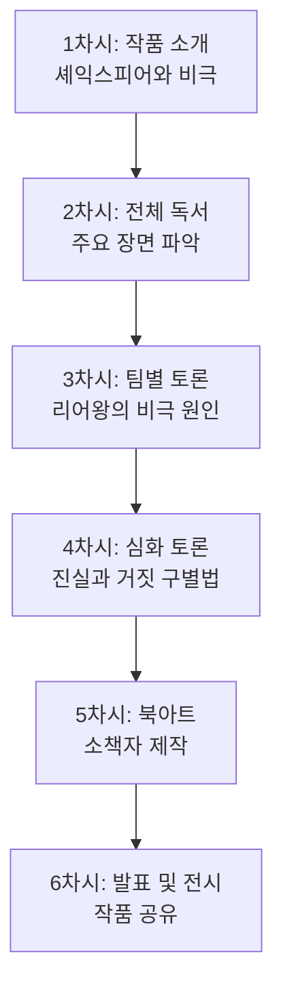
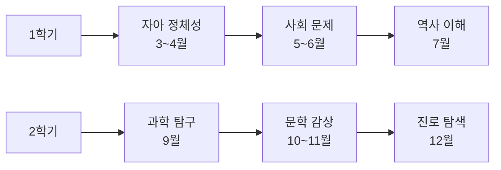

# 독서토론 컨텐츠 실전 가이드

> 실제 수업에서 바로 활용할 수 있는 구체적인 수업 지도안, 토론 질문, 평가 루브릭, 커리큘럼 설계 등을 담은 실전 가이드

---

## 목차

1. [실제 수업 지도안 및 시나리오](#1-실제-수업-지도안-및-시나리오)
2. [책별 상세 토론 가이드](#2-책별-상세-토론-가이드)
3. [학년별 연간 커리큘럼 설계](#3-학년별-연간-커리큘럼-설계)
4. [토론 평가 루브릭 상세](#4-토론-평가-루브릭-상세)
5. [주제별 도서 큐레이션](#5-주제별-도서-큐레이션)
6. [실전 토론 주제 60선](#6-실전-토론-주제-60선)
7. [교사 발문 스크립트 예시](#7-교사-발문-스크립트-예시)
8. [글쓰기 첨삭 실전 사례](#8-글쓰기-첨삭-실전-사례)
9. [독서활동 포트폴리오 구성](#9-독서활동-포트폴리오-구성)
10. [독후활동 워크시트 예시](#10-독후활동-워크시트-예시)

---

## 1. 실제 수업 지도안 및 시나리오

### 1.1 초등 3학년 6주 프로그램 사례

| 차시 | 도서명 | 주제 | 활동 | 토론 방식 |
|------|--------|------|------|----------|
| **1주** | 『이게 정말 나일까?』 | 자아 정체성 | PMI 기법으로 자기소개 | 돌아가며 발표 |
| **2주** | 『철학 안경』 | 질문하는 힘 | 다양한 질문으로 깊이 생각하기 | 하브루타 (짝 토론) |
| **3주** | 『마법의 설탕 두 조각』 | 선택과 결과 | 가치 수직선 토론 | 입장 표현 활동 |
| **4주** | 『브이를 찾습니다』 | 평화와 전쟁 | 동시 감상 및 창작 | 모둠 토의 |
| **5주** | 『냉장고가 사라졌다!』 | 환경 문제 | 환경 보호 실천 방안 | 찬반 토론 |
| **6주** | 『이선비 혼례를 치르다』 | 전통 문화 | 전통 풍습 조사 발표 | 비교 토론 |

### 1.2 중학생 대상 『리어왕』 수업 지도안 (속리산중 사례)



#### 토론 주제 예시
- **주제 1**: 리어왕이 비극의 주인공이 된 가장 큰 이유는 무엇인가?
- **주제 2**: 진실과 거짓을 구별하는 방법은 무엇인가?
- **주제 3**: 고너릴, 리건, 코델리아 중 누구의 행동이 가장 이해 가능한가?
- **주제 4**: 리어왕은 피해자인가, 가해자인가?

### 1.3 90분 수업 상세 시나리오 (초등 5학년, 『아몬드』)

| 시간 | 교사 활동 | 학생 활동 | 준비물 |
|------|----------|----------|--------|
| **0~5분** | 출석 확인, 지난 시간 복습 | 자리 착석, 발제문 제출 | 출석부 |
| **5~10분** | 오늘의 주제 안내: "감정과 공감" | 주제 경청, 개인 경험 떠올리기 | PPT |
| **10~20분** | 핵심 질문 제시: "윤재는 왜 감정을 느끼지 못할까?" | 책 내용 요약 발표 (4명) | - |
| **20~25분** | 소그룹 구성 (3~4명씩) | 소그룹으로 이동 | - |
| **25~40분** | 순회 지도, 촉진 질문 | 소그룹 토론: 공감 능력의 중요성 | 토론 카드 |
| **40~50분** | 전체 토론 진행, 의견 종합 | 소그룹 의견 발표, 질문/반론 | 화이트보드 |
| **50~70분** | 글쓰기 과제 제시: "공감이 필요한 순간" | 논술문 작성 (개요→본문) | 원고지 |
| **70~80분** | 자원자 선정, 발표 지도 | 자원자 3명 작품 발표 | - |
| **80~85분** | 동료 피드백 유도 | 긍정적 피드백 제공 | 피드백 양식 |
| **85~90분** | 오늘의 핵심 정리, 다음 도서 안내 | 정리 노트 작성, 다음 책 확인 | 독서 수첩 |

### 1.4 하브루타 토론 수업 실제 사례 (중등)

**도서**: 『부자는 어떤 사람일까?』 관련 텍스트

**진행 방식**: 2인 1조, 12단계 질문

| 단계 | 질문 예시 |
|------|----------|
| 1 | 부자는 어떤 사람일까? |
| 2 | 자유인이란? |
| 3 | 이 글에서 왕이 의미하는 바는? |
| 4 | 왕 같은 자유인이 되려면 무엇이 필요할까? |
| 5 | 돈을 버는 목적은 무엇일까? |
| 6 | 진정한 부는 무엇일까? |
| 7 | 소유와 존재의 차이는? |
| 8 | 행복의 조건은 무엇인가? |
| 9 | 가난한 사람과 부자의 차이는? |
| 10 | 물질적 풍요와 정신적 풍요 중 무엇이 중요한가? |
| 11 | 나는 어떤 부자가 되고 싶은가? |
| 12 | 이 글에서 가장 중요한 메시지는? |

---

## 2. 책별 상세 토론 가이드

### 2.1 『강아지똥』 (권정생) - 초등 저학년

#### 기본 정보
- **대상**: 초등 1~2학년
- **장르**: 그림책/우화
- **핵심 주제**: 존재의 가치, 순환, 희생

#### 사전 독서 가이드
- 강아지똥이 겪는 감정 변화에 주목하며 읽기
- 등장인물(강아지똥, 흙덩이, 참새, 민들레)의 태도 비교하기

#### 핵심 질문 (6가지)

| 질문 유형 | 질문 | 답변 가이드 |
|-----------|------|-------------|
| **사실 확인** | 강아지똥은 누구를 처음 만났나요? | 흙덩이 (내용 이해 확인) |
| **감정 이해** | 강아지똥은 언제 가장 슬펐을까요? | 모두가 자신을 더럽다고 할 때 (공감 능력) |
| **가치 판단** | 흙덩이는 좋은 친구였나요? | 열린 답변 (근거 제시 유도) |
| **적용** | 여러분도 쓸모없다고 느낀 적 있나요? | 개인 경험 연결 |
| **예측/추론** | 민들레를 만나지 못했다면 어떻게 되었을까요? | 상상력 확장 |
| **주제 파악** | 이 이야기가 전하는 메시지는 무엇인가요? | 모든 존재의 가치 (핵심 주제) |

#### 독후활동 아이디어
1. **역할극**: 강아지똥, 흙덩이, 참새, 민들레 역할 맡아 연극하기
2. **그림 그리기**: 민들레가 핀 후의 장면 상상해서 그리기
3. **편지 쓰기**: 강아지똥에게 위로의 편지 쓰기
4. **토론**: "모든 것에는 쓸모가 있다" 찬반 토론

### 2.2 『아몬드』 (손원평) - 초등 고학년/중등

#### 기본 정보
- **대상**: 초등 5~6학년, 중등
- **장르**: 청소년 성장소설
- **핵심 주제**: 감정, 공감, 차이의 수용

#### 사전 독서 가이드
- 윤재의 특별한 상황(아몬드가 작음) 이해하기
- 윤재와 곤이의 관계 변화 추적하기
- 윤재가 변화하는 계기들 표시하며 읽기

#### 심층 토론 질문 (10가지)

| 순서 | 질문 | 토론 목표 |
|------|------|----------|
| 1 | 윤재는 정말 감정이 없는 걸까요, 아니면 표현하지 못하는 걸까요? | 인물 심리 분석 |
| 2 | 곤이는 왜 윤재에게 끌렸을까요? | 인물 관계 이해 |
| 3 | 윤재의 엄마는 어떤 마음이었을까요? | 부모의 입장 이해 |
| 4 | "괴물이 아니라 다른 거야"라는 말의 의미는? | 차이와 차별 구별 |
| 5 | 윤재가 눈물을 흘린 장면, 무엇이 변한 걸까요? | 성장의 의미 파악 |
| 6 | 공감 능력이 없다면 인간관계가 가능할까요? | 철학적 사고 |
| 7 | 윤재 같은 친구가 우리 반에 있다면 어떻게 대할 건가요? | 실생활 적용 |
| 8 | 곤이의 폭력적 행동은 이해할 수 있나요? | 윤리적 판단 |
| 9 | 이 소설에서 가장 중요한 장면은 어디인가요? | 구조 분석 |
| 10 | 감정을 느끼는 것과 표현하는 것, 무엇이 더 중요한가요? | 가치 판단 |

#### 디베이트 주제
**논제**: "공감 능력은 인간의 필수 조건이다"
- **찬성 측 논거**: 인간관계 형성, 사회 유지, 도덕적 판단 기반
- **반대 측 논거**: 능력의 스펙트럼, 다양성 인정, 대안적 소통 방식 존재

#### 창의적 글쓰기
1. 윤재의 일기 쓰기 (1인칭 시점)
2. 곤이에게 보내는 편지
3. 10년 후 윤재의 모습 상상하기
4. 다른 결말 쓰기

### 2.3 『마당을 나온 암탉』 (황선미) - 초등 중학년

#### 기본 정보
- **대상**: 초등 3~4학년
- **장르**: 창작동화
- **핵심 주제**: 꿈, 자유, 모성애, 편견

#### 단계별 토론 설계

**1단계: 사실 확인 (10분)**
- 잎싹이 마당을 나온 이유는?
- 잎싹이 가장 원했던 것은?
- 나그네는 어떤 존재인가?

**2단계: 분석 (15분)**
- 잎싹의 성격은 어떻게 변했나?
- 초록목이를 키우는 과정에서 어려움은?
- 족제비는 악당인가, 생존자인가?

**3단계: 평가 (15분)**
- 잎싹의 선택은 현명했나?
- 다른 닭들의 태도는 이해할 수 있나?
- 결말이 슬픈가, 아름다운가?

**4단계: 적용 (10분)**
- 내 꿈을 위해 포기할 수 있는 것은?
- 편견을 경험한 적이 있나?
- 잎싹처럼 용기 낸 경험은?

---

## 3. 학년별 연간 커리큘럼 설계

### 3.1 초등 3~4학년 연간 커리큘럼 (월별)

| 월 | 주제 | 도서 예시 | 토론 방식 | 글쓰기 유형 | 연계 교과 |
|----|------|----------|----------|------------|----------|
| **3월** | 새학기/학교생활 | 『교실 밖 국어여행』 | 자유 토의 | 학급 규칙 만들기 | 국어, 도덕 |
| **4월** | 독서의 중요성 | 『책 읽기의 즐거움』 | 돌아가며 발표 | 독서 계획서 | 국어 |
| **5월** | 가족과 효 | 『엄마 사용법』 | 하브루타 | 가족에게 편지 | 도덕 |
| **6월** | 환경 보호 | 『냉장고가 사라졌다』 | 찬반 토론 | 환경 실천 다짐문 | 과학, 사회 |
| **7월** | 여름/물 | 『물은 어디에나 있어』 | 질문 토론 | 과학 탐구 일지 | 과학 |
| **9월** | 전통/추석 | 『이선비 혼례를 치르다』 | 비교 토론 | 전통 문화 소개문 | 사회 |
| **10월** | 독서의 달 | 자유 선택 도서 | 북토크 | 서평 쓰기 | 국어 |
| **11월** | 우정/관계 | 『친구』 | 소크라테스 세미나 | 친구 소개문 | 도덕 |
| **12월** | 겨울/성찰 | 『겨울 이야기』 | 성찰 토론 | 한 해 돌아보기 | 국어 |

### 3.2 초등 5~6학년 연간 커리큘럼 (주제 중심)



#### 1학기 상세 설계

**1단원: 자아 정체성 (3~4월, 8주)**

| 주차 | 도서 | 활동 | 평가 |
|------|------|------|------|
| 1주 | 『아몬드』 (1~3장) | 인물 분석 | 독서노트 |
| 2주 | 『아몬드』 (4~6장) | 감정 토론 | 참여도 |
| 3주 | 『아몬드』 (7~9장) | 관계 탐구 | 소그룹 발표 |
| 4주 | 『아몬드』 완독 | 전체 토론 | 논술문(500자) |
| 5주 | 『원더』 (1~3부) | 외모 차별 토론 | 독서노트 |
| 6주 | 『원더』 (4~6부) | 입장 바꿔 생각하기 | 역할극 |
| 7주 | 『원더』 완독 | 수용과 공존 토론 | 논술문(700자) |
| 8주 | 단원 정리 | 포트폴리오 제작 | 최종 평가 |

**2단원: 사회 문제 (5~6월, 8주)**

| 주차 | 도서 | 주제 | 토론 형식 |
|------|------|------|----------|
| 1주 | 『동물농장』 | 권력과 부패 | 자유 토의 |
| 2주 | 『동물농장』 | 민주주의 위기 | 디베이트 |
| 3주 | 『82년생 김지영』 (발췌) | 성평등 | 월드카페 |
| 4주 | 『82년생 김지영』 | 사회 구조 | 소크라테스 세미나 |
| 5주 | 『플라스틱 바다』 | 환경 오염 | 찬반 토론 |
| 6주 | 『플라스틱 바다』 | 실천 방안 | 문제해결 토론 |
| 7주 | 종합 토론 | 우선순위 정하기 | 피라미드 토론 |
| 8주 | 프로젝트 발표 | 사회 문제 해결 제안 | 발표 평가 |

### 3.3 중등 연간 커리큘럼 (장르 중심)

| 학기 | 장르 | 필독서 | 선택서(3권 중 1권) | 역량 |
|------|------|--------|-------------------|------|
| **1학기** | 고전 문학 | 『데미안』 | 『호밀밭의 파수꾼』<br/>『이방인』<br/>『변신』 | 비판적 읽기 |
| **1학기** | 비문학 | 『사피엔스』(발췌) | 『총균쇠』<br/>『코스모스』<br/>『이기적 유전자』 | 논리적 사고 |
| **2학기** | 한국 문학 | 『태백산맥』(발췌) | 『토지』<br/>『난장이가 쏘아올린 작은 공』<br/>『우리들의 일그러진 영웅』 | 역사 의식 |
| **2학기** | 세계 문학 | 『1984』 | 『멋진 신세계』<br/>『파리대왕』<br/>『동물농장』 | 사회 비판력 |

---

## 4. 토론 평가 루브릭 상세

### 4.1 초등 고학년 토론 평가 루브릭

| 평가 항목 | 최우수 (5점) | 우수 (4점) | 보통 (3점) | 노력 필요 (2점) | 미흡 (1점) |
|-----------|-------------|-----------|-----------|----------------|-----------|
| **내용 이해** | 책의 핵심 내용을 정확하고 깊이 있게 이해함 | 책의 주요 내용을 잘 이해함 | 책의 기본 내용을 이해함 | 일부 내용만 이해함 | 내용 이해 부족 |
| **의견 제시** | 독창적이고 논리적인 자기 의견을 명확히 제시함 | 논리적인 자기 의견을 제시함 | 자기 의견을 제시함 | 의견이 불명확함 | 의견 제시 없음 |
| **근거 제시** | 텍스트와 경험을 바탕으로 설득력 있는 근거 3개 이상 | 텍스트나 경험을 바탕으로 명확한 근거 2개 | 근거 1~2개 제시 | 근거가 약하거나 1개 | 근거 없음 |
| **경청 태도** | 다른 의견을 존중하며 적극 경청하고 메모함 | 다른 의견을 경청하고 반응함 | 다른 의견을 듣는 편 | 경청 태도 부족 | 경청하지 않음 |
| **참여도** | 자발적으로 5회 이상 발언하며 토론을 이끔 | 자발적으로 3~4회 발언 | 1~2회 발언 | 지명 시에만 발언 | 거의 참여 안 함 |
| **질문력** | 토론을 심화시키는 핵심 질문을 던짐 | 적절한 질문을 함 | 질문을 하려 노력함 | 질문이 주제에서 벗어남 | 질문 없음 |
| **반론 능력** | 논리적 근거로 정중하게 반박함 | 근거를 들어 반박함 | 반박을 시도함 | 반박이 감정적임 | 반박 안 함 |
| **협력** | 모둠원과 적극 협력하며 분위기 조성 | 모둠원과 잘 협력함 | 협력하려 노력함 | 소극적 협력 | 협력하지 않음 |

**총점**: 40점 (최우수 36점 이상, 우수 28~35점, 보통 20~27점)

### 4.2 중등 디베이트 평가 루브릭

| 평가 항목 | 매우 우수 (5점) | 우수 (4점) | 보통 (3점) | 미흡 (2점) | 매우 미흡 (1점) |
|-----------|----------------|-----------|-----------|-----------|---------------|
| **논제 이해** | 논제를 정확히 이해하고 쟁점 파악 | 논제를 잘 이해함 | 논제를 이해함 | 논제 이해 부족 | 논제 오해 |
| **주장의 명확성** | 입장이 분명하고 핵심 주장 3개 이상 | 입장이 명확하고 주장 2~3개 | 주장 1~2개 제시 | 주장이 불명확함 | 주장 없음 |
| **논거의 타당성** | 논리적이고 객관적인 논거 다수 제시 | 적절한 논거 제시 | 논거 있으나 약함 | 논거 부족 | 논거 없음 |
| **자료 활용** | 통계, 사례, 전문가 의견 등 다양한 자료 | 2가지 이상 자료 활용 | 1가지 자료 활용 | 자료 활용 미흡 | 자료 없음 |
| **반론** | 상대 논리의 허점을 정확히 지적하고 효과적 반박 | 적절한 반박 | 반박 시도 | 반박 약함 | 반박 없음 |
| **교차질문** | 핵심을 찌르는 질문으로 상대 흔들기 | 적절한 질문 | 질문 있으나 약함 | 질문 부적절 | 질문 없음 |
| **발표력** | 명확한 발음, 적절한 속도, 설득력 있는 표현 | 발표가 명확함 | 발표 가능 수준 | 발표 어눌함 | 발표 매우 어려움 |
| **팀워크** | 팀원과 완벽한 호흡, 전략적 역할 분담 | 팀원과 협력 잘함 | 협력하는 편 | 협력 부족 | 협력 안 함 |

**총점**: 40점

### 4.3 글쓰기 평가 루브릭 (논술문 기준)

| 평가 항목 | 최우수 (5점) | 우수 (4점) | 보통 (3점) | 노력 필요 (2점) |
|-----------|-------------|-----------|-----------|----------------|
| **구조** | 서론-본론-결론 명확, 단락 구분 탁월 | 구조가 명확함 | 구조 있음 | 구조 불명확 |
| **주제 적합성** | 주제에 완벽히 부합하는 내용 | 주제에 잘 부합 | 주제 관련 있음 | 주제에서 벗어남 |
| **논리성** | 논리 전개가 매우 탄탄함 | 논리적 전개 | 논리 흐름 있음 | 논리 비약 |
| **독창성** | 참신하고 창의적인 관점 | 독창적 관점 있음 | 일반적 관점 | 진부함 |
| **어휘/문장** | 다양하고 적절한 어휘, 매끄러운 문장 | 적절한 표현 | 표현 무난 | 표현 어색함 |
| **분량** | 규정 분량의 100% 충족 | 90% 이상 | 80% 이상 | 70% 미만 |

**총점**: 30점

---

## 5. 주제별 도서 큐레이션

### 5.1 환경/기후 위기 주제 도서

| 도서명 | 저자 | 대상 | 핵심 토론 주제 | 연계 활동 |
|--------|------|------|---------------|----------|
| 『기후 책』 | 그레타 툰베리 외 | 중등+ | 기후 정의, 세대 간 책임 | 탄소발자국 계산 |
| 『세상은 실제로 어떻게 돌아가는가』 | 바츨라프 스밀 | 고등 | 에너지, 식량, 팬데믹 | 데이터 분석 프로젝트 |
| 『냉장고가 사라졌다』 | 권정생 | 초등 | 에너지 절약 실천 | 환경 포스터 제작 |
| 『플라스틱 바다』 | 앨런 피터스 | 초등 고학년 | 플라스틱 사용 줄이기 | 재활용 프로젝트 |
| 『침묵의 봄』 | 레이첼 카슨 | 중고등 | 화학물질과 생태계 | 환경 보고서 작성 |
| 『지구 끝의 온실』 | 김초엽 | 중고등 | SF로 본 기후 미래 | 미래 시나리오 쓰기 |

### 5.2 평화/인권 주제 도서

| 도서명 | 저자 | 대상 | 핵심 토론 주제 | 연계 활동 |
|--------|------|------|---------------|----------|
| 『몽실 언니』 | 권정생 | 초등 중학년 | 전쟁의 참상, 평화의 소중함 | 평화 편지 쓰기 |
| 『안네의 일기』 | 안네 프랑크 | 초등 고학년+ | 전쟁과 인권, 차별 | 일기 형식 글쓰기 |
| 『파친코』 | 이민진 | 고등 | 재일동포, 정체성, 차별 | 역사 탐구 프로젝트 |
| 『82년생 김지영』 | 조남주 | 중고등 | 성평등, 사회 구조 | 젠더 이슈 토론 |
| 『죽은 시인의 사회』 | N.H. 클라인바움 | 중등 | 교육의 의미, 자유 | 교육 이상 토론 |
| 『아무도 미워하지 않는 자의 죽음』 | 김려령 | 중등 | 학교 폭력, 방관자 책임 | 학교 폭력 예방 캠페인 |

### 5.3 과학/기술 주제 도서

| 도서명 | 저자 | 대상 | 핵심 토론 주제 | 연계 활동 |
|--------|------|------|---------------|----------|
| 『코스모스』 (발췌) | 칼 세이건 | 중고등 | 우주, 과학적 사고 | 천체 관측 활동 |
| 『이기적 유전자』 (발췌) | 리처드 도킨스 | 고등 | 진화, 본성 vs 양육 | 과학 논쟁 토론 |
| 『사피엔스』 (발췌) | 유발 하라리 | 중고등 | 인류의 역사, 미래 | 타임라인 만들기 |
| 『AI 시대, 우리 아이를 위한 공부의 미래』 | 최재웅 | 중등+ | AI와 교육의 미래 | 미래 직업 탐구 |
| 『수학 도둑』 | 송도수 | 초등 | 수학적 사고, 문제해결 | 수학 퀴즈 대회 |
| 『과학하고 앉아있네』 시리즈 | 원종우 외 | 중등 | 과학 대중화, 호기심 | 과학 팟캐스트 만들기 |

### 5.4 역사/사회 주제 도서

| 도서명 | 저자 | 대상 | 핵심 토론 주제 | 연계 활동 |
|--------|------|------|---------------|----------|
| 『난중일기』 (발췌) | 이순신 | 초등 고학년+ | 리더십, 헌신 | 역사 인물 조사 |
| 『태백산맥』 (발췌) | 조정래 | 고등 | 이념 갈등, 한국 현대사 | 역사 토론 |
| 『총균쇠』 (발췌) | 재레드 다이아몬드 | 고등 | 문명 발전의 요인 | 세계사 비교 분석 |
| 『어린이 세계사』 시리즈 | 다양 | 초등 | 세계 여러 나라의 역사 | 세계지도 만들기 |
| 『설민석의 한국사 대모험』 | 설민석 | 초등 | 한국사 주요 사건 | 역사 만화 만들기 |

### 5.5 철학/사고력 주제 도서

| 도서명 | 저자 | 대상 | 핵심 토론 주제 | 연계 활동 |
|--------|------|------|---------------|----------|
| 『소피의 세계』 | 요슈타인 가아더 | 중등+ | 철학의 역사, 존재의 의미 | 철학 카페 |
| 『어린 왕자』 | 생텍쥐페리 | 전 학년 | 본질, 관계, 어른 vs 아이 | 명대사 필사 |
| 『연금술사』 | 파울로 코엘료 | 중등+ | 꿈, 운명, 여정의 의미 | 자기 꿈 발표 |
| 『데미안』 | 헤르만 헤세 | 고등 | 자아 발견, 선악 이분법 | 상징 분석 |
| 『철학 안경』 | 최혜진 | 초등 | 질문하는 힘, 사고의 확장 | 질문 만들기 대회 |
| 『생각하는 ㄱㄴㄷ』 | 이상교 | 초등 | 창의적 사고, 상상력 | 철학 동시 창작 |

---

## 6. 실전 토론 주제 60선

### 6.1 초등 저학년 (1~2학년) 토론 주제 15선

#### 학교 생활
1. 학교에서 간식을 먹을 수 있어야 할까?
2. 숙제는 꼭 해야 할까?
3. 쉬는 시간을 더 길게 해야 할까?

#### 일상 생활
4. 아침밥을 꼭 먹어야 할까?
5. 방을 스스로 치워야 할까?
6. TV는 하루에 얼마나 봐야 할까?

#### 윤리와 가치
7. 줄을 서는 건 꼭 지켜야 할까?
8. 거짓말은 언제나 나쁜 걸까?
9. 어려운 친구를 도와주는 것이 중요할까?

#### 재미와 놀이
10. 게임은 하루에 얼마나 해야 할까?
11. 친구와 놀 때 지는 것도 괜찮을까?
12. 장난감은 나눠 써야 할까?

#### 가족과 관계
13. 동생에게 양보해야 할까?
14. 부모님 말씀을 항상 들어야 할까?
15. 혼자 있는 시간도 필요할까?

### 6.2 초등 중학년 (3~4학년) 토론 주제 15선

#### 학교와 교육
1. 시험은 꼭 필요한가?
2. 학교에서 핸드폰을 사용해도 될까?
3. 숙제를 없애야 할까?

#### 동물과 자연
4. 동물원은 없어져야 할까?
5. 반려동물을 키우는 것이 좋은가?
6. 고기를 먹지 않아야 할까? (채식 논쟁)

#### 환경
7. 플라스틱 사용을 완전히 금지해야 할까?
8. 일회용품 사용을 줄여야 할까?
9. 전기 자동차를 더 많이 만들어야 할까?

#### 사회와 규칙
10. 어린이도 투표할 수 있어야 할까?
11. CCTV를 더 많이 설치해야 할까?
12. 공공장소에서 큰 소리로 통화해도 될까?

#### 기술과 미디어
13. 유튜브를 보는 시간을 제한해야 할까?
14. 로봇이 사람의 일을 대신하는 건 좋은 일일까?
15. 인터넷 실명제를 해야 할까?

### 6.3 초등 고학년 (5~6학년) 토론 주제 15선

#### 학교와 교육
1. 시험 성적은 학생의 능력을 정확히 평가할 수 있을까?
2. 학교에서 핸드폰 사용을 허용해야 할까?
3. 학교 급식에 채식 메뉴를 늘려야 할까?

#### 사회 문제
4. 동물원은 없어져야 할까?
5. 플라스틱 사용을 완전히 금지해야 할까?
6. 사형제도를 폐지해야 할까?

#### 과학과 기술
7. 인공지능(AI)은 인간을 대체할 수 있을까?
8. 우주 탐사는 꼭 필요한 일일까?
9. 동물 실험을 금지해야 할까?

#### 경제와 소비
10. 용돈을 더 많이 받을수록 좋을까?
11. 명품 브랜드를 사는 것이 필요할까?
12. 광고는 사람들을 속이는가?

#### 윤리와 가치
13. 능력에 따라 차등 대우하는 것은 정당한가?
14. 거짓말이 정당화될 수 있는 경우가 있을까?
15. 개인의 자유와 공동체의 규칙 중 무엇이 우선인가?

### 6.4 중등 토론 주제 15선

#### 교육과 입시
1. 대학 입시에서 수능 비중을 높여야 할까?
2. 일반고를 폐지하고 모두 자사고로 전환해야 할까?
3. 학교에서 핸드폰 제출을 의무화해야 할까?

#### 사회 정의
4. 부유한 사람에게 더 높은 세금을 부과해야 할까?
5. 징병제를 폐지하고 모병제로 전환해야 할까?
6. 사형제도를 폐지해야 할까?

#### 과학과 윤리
7. 인간 복제를 허용해야 할까?
8. 동물 실험을 전면 금지해야 할까?
9. 유전자 편집 기술을 인간에게 사용해도 될까?

#### 환경과 에너지
10. 원자력 발전소를 모두 폐쇄해야 할까?
11. 육식을 줄여야 기후 위기를 막을 수 있을까?
12. 플라스틱 사용을 법으로 금지해야 할까?

#### 기술과 사회
13. 인공지능이 인간의 일자리를 대체하는 것을 막아야 할까?
14. 자율주행차를 도로에서 허용해야 할까?
15. SNS 실명제를 도입해야 할까?

---

## 7. 교사 발문 스크립트 예시

### 7.1 수업 도입부 발문 (5~10분)

#### 상황: 『아몬드』 첫 수업

**교사**: "여러분, 안녕하세요. 오늘은 『아몬드』에 대해 이야기 나눌 거예요. 먼저, 이 책 제목이 '아몬드'인 이유가 뭐라고 생각해요?"

**학생들**: (다양한 답변)

**교사**: "좋아요. 그렇다면 책에서 '아몬드'는 무엇을 의미하나요? 우리 뇌의 어느 부분이죠?"

**학생 A**: "편도체요."

**교사**: "맞아요. 편도체는 어떤 역할을 하나요?"

**학생 B**: "감정을 느끼게 해요."

**교사**: "정확해요. 그렇다면 윤재는 왜 특별한 걸까요? 윤재의 편도체는 어떤 상태인가요?"

**학생 C**: "작아서 감정을 잘 못 느껴요."

**교사**: "그렇죠. 만약 여러분이 감정을 느끼지 못한다면 어떨 것 같아요? 한번 상상해볼까요?"

### 7.2 토론 중반부 발문 (심화 질문)

#### 상황: 윤재의 변화에 대한 토론

**교사**: "민준이는 윤재가 눈물을 흘린 장면이 가장 중요하다고 했어요. 그 이유를 설명해줄 수 있나요?"

**학생 민준**: "윤재가 처음으로 진짜 감정을 느낀 것 같아서요."

**교사**: "좋은 관점이에요. 그렇다면 다른 친구들에게 질문할게요. 윤재는 정말 그 전에는 감정이 없었을까요, 아니면 표현하지 못한 걸까요?"

**학생 지은**: "표현을 못 한 것 같아요. 엄마를 생각하는 마음은 있었잖아요."

**교사**: "지은이의 의견에 동의하는 사람? (손을 들게 함) 반대하는 사람? (손을 들게 함) 반대하는 친구가 있네요. 서준이, 왜 반대하나요?"

**학생 서준**: "윤재는 슬픔을 느끼지 못했다고 나와요. 엄마를 생각하는 건 습관 같은 거였을 것 같아요."

**교사**: "흥미로운 의견이네요. 그렇다면 감정과 습관의 차이는 뭘까요? 이 질문으로 조금 더 깊이 생각해봅시다."

### 7.3 토론 후반부 발문 (적용 및 성찰)

#### 상황: 토론 마무리

**교사**: "지금까지 우리는 윤재의 특별한 상황에 대해 이야기했어요. 그렇다면 이제 우리 자신에 대해 생각해볼까요? 만약 우리 반에 윤재 같은 친구가 있다면, 여러분은 어떻게 대할 건가요?"

**(학생들 침묵)**

**교사**: "어려운 질문이죠? 그럼 이렇게 생각해봅시다. 우리가 윤재를 이해하기 위해 가장 필요한 건 뭘까요?"

**학생 수진**: "그 친구의 입장에서 생각해보는 거요."

**교사**: "맞아요. 그걸 우리가 뭐라고 불렀죠?"

**학생들**: "공감!"

**교사**: "정확해요. 공감 능력이죠. 그렇다면 마지막 질문입니다. 공감 능력이 없는 윤재를 이해하려면, 우리에게는 어떤 능력이 더욱 필요할까요?"

**학생 현우**: "역설적이지만... 더 큰 공감 능력이요?"

**교사**: "와, 현우가 정말 깊이 생각했네요. 바로 그거예요. 차이를 가진 사람을 이해하려면, 우리가 더욱 공감하려고 노력해야 해요. 이게 이 책이 우리에게 전하는 메시지예요."

### 7.4 하브루타 질문 순환 촉진 발문

#### 상황: 짝 토론 중 순회 지도

**교사**: (A-B 짝에게 다가가서) "무엇에 대해 이야기하고 있나요?"

**학생 A**: "곤이가 왜 윤재에게 끌렸는지 토론하고 있어요."

**교사**: "좋아요. B는 어떤 의견을 냈나요?"

**학생 B**: "곤이도 외로웠을 거라고 했어요."

**교사**: "흥미로운 관점이네요. 그렇다면 A에게 질문해볼게요. B의 의견에 대해 어떤 질문을 던질 수 있을까요?"

**학생 A**: "음... 곤이가 외로웠다는 근거가 책 어디에 나오나요?"

**교사**: "좋은 질문이에요! 이제 B가 답변할 차례죠. 계속 이어가보세요."

### 7.5 정리 단계 발문

#### 상황: 수업 마무리 10분 전

**교사**: "자, 이제 정리해볼까요. 오늘 우리가 토론한 내용 중 가장 기억에 남는 의견은 무엇인가요?"

**학생들**: (다양한 답변)

**교사**: "많은 의견이 나왔네요. 그렇다면 이 중에서 우리가 합의한 부분은 뭘까요?"

**학생 예진**: "윤재는 다르지만 틀리지 않았다는 거요."

**교사**: "훌륭해요. 그리고 우리가 끝까지 합의하지 못한 부분은?"

**학생 태양**: "감정이 없는 것과 표현을 못하는 것의 차이요."

**교사**: "맞아요. 그리고 그게 중요한 이유는 뭘까요? 왜 우리는 이걸 계속 토론했을까요?"

**학생 은서**: "그에 따라 윤재를 대하는 방법이 달라지니까요."

**교사**: "정확해요. 이해의 방식이 달라지면 대하는 태도도 달라지죠. 이게 바로 토론의 힘이에요. 서로 다른 생각을 나누면서 우리는 더 깊이 이해하게 돼요. 오늘 수업 정말 잘했어요!"

---

## 8. 글쓰기 첨삭 실전 사례

### 8.1 독후감 첨삭 사례 (초등 5학년)

#### 원문 (학생 A, 『아몬드』 독후감)

```
아몬드를 읽고

나는 아몬드를 읽었다. 주인공 윤재는 감정을 느끼지 못한다. 
그래서 슬프다. 윤재는 친구 곤이를 만났다. 곤이는 나쁜 아이다. 
하지만 윤재와 친구가 되었다. 그리고 윤재는 눈물을 흘렸다. 
나는 이 책이 재미있었다. 윤재가 불쌍했다.
```

#### 첨삭 버전 1 (구조 개선)

**[교사 피드백]**

✅ **잘한 점**
- 책을 끝까지 읽고 핵심 내용을 파악했어요
- 인물의 변화(눈물을 흘림)를 포착했어요

⚠️ **개선할 점**
1. **구조**: 독후감은 "책 소개 - 인상 깊은 부분 - 느낀 점"으로 구성해보세요
2. **구체성**: "슬프다", "재미있었다"보다 구체적인 감정과 이유를 써보세요
3. **깊이**: "왜"를 생각해보세요. 왜 곤이가 나쁜 아이인가요? 왜 윤재가 불쌍한가요?

📝 **다시 써보기 제안**
```
첫 문단: 『아몬드』는 어떤 책인가요? (주인공과 갈등 소개)
둘째 문단: 가장 인상 깊은 장면은? (구체적으로)
셋째 문단: 이 책을 읽고 무엇을 느꼈나요? (나의 생각/변화)
```

#### 첨삭 후 학생 수정본

```
감정을 배우는 소년, 『아몬드』를 읽고

『아몬드』는 감정을 느끼지 못하는 소년 윤재의 이야기다. 
윤재는 편도체(뇌에서 감정을 담당하는 부분)가 작아서 기쁨도 슬픔도 
느끼지 못한다. 그래서 항상 겉도는 느낌으로 살아간다.

나는 윤재가 처음으로 눈물을 흘리는 장면이 가장 인상 깊었다. 
곤이와의 우정을 통해 윤재는 조금씩 변화했다. 엄마를 잃은 슬픔을 
뒤늦게 느낀 윤재의 눈물은, 오히려 평범한 사람보다 더 큰 의미가 
있다고 생각한다. 왜냐하면 그는 평생 느끼지 못했던 감정을 
처음으로 경험한 것이기 때문이다.

이 책을 읽고 나는 '다름'에 대해 생각하게 되었다. 윤재처럼 다른 
사람도 틀린 것이 아니라 그저 다를 뿐이다. 그리고 그런 친구를 
이해하려면 내가 더 공감하려고 노력해야 한다는 것을 배웠다.
```

**[교사 최종 피드백]**: ⭐⭐⭐⭐⭐ 
훌륭해요! 구조가 명확해지고, 구체적인 장면을 들어 설명했어요. 특히 "다름과 틀림의 차이"를 자신의 언어로 표현한 점이 인상적이에요. A

### 8.2 논술문 첨삭 사례 (중등 1학년)

#### 원문 (학생 B, 논제: "인공지능은 인간을 대체할 수 있는가?")

```
인공지능이 발전하고 있다. 인공지능은 여러 분야에서 사용된다. 
의료, 교육, 제조 등이다. 인공지능은 편리하다. 하지만 위험할 수도 있다. 
일자리가 없어질 수 있다. 그래서 인공지능은 인간을 대체할 수 없다고 생각한다.
```

#### 첨삭 버전 (논증 구조 강화)

**[교사 피드백]**

⚠️ **주요 문제점**
1. **주장 불명확**: "대체할 수 없다"는 결론이 갑자기 나옴
2. **논거 부족**: 왜 대체할 수 없는지 논리적 근거 필요
3. **반론 없음**: 반대 의견 고려하지 않음
4. **근거-주장 불일치**: "일자리 없어짐"은 오히려 대체 가능성을 보여줌

📊 **논술문 구조 가이드**
```
서론: 문제 제기 + 자신의 입장 명확히
본론 1: 주장을 뒷받침하는 논거 1 (구체적 사례/통계)
본론 2: 주장을 뒷받침하는 논거 2
본론 3: 반론 제시 + 재반박
결론: 주장 재진술 + 함의/전망
```

#### 교사 예시 수정본 (부분)

```
서론:
인공지능(AI) 기술의 발전으로 많은 이들이 "AI가 인간을 대체할 것인가?"라는 
질문을 던진다. 나는 AI가 인간의 특정 기능을 대체할 수는 있지만, 
인간 그 자체를 대체할 수는 없다고 주장한다.

본론 1:
첫째, AI는 데이터 기반 판단은 가능하지만, 창의성과 직관은 구현하기 어렵다. 
예를 들어, AI는 수백만 곡의 음악을 분석해 새로운 곡을 만들 수 있지만, 
베토벤이 귀가 들리지 않는 상황에서 '운명 교향곡'을 작곡한 것 같은 
인간 고유의 창조성은 모방할 수 없다...

(학생이 이 구조를 참고해 다시 작성)
```

### 8.3 글쓰기 성장 과정 비교 (2주 차 vs 8주 차)

#### 학생 C의 성장 사례

**2주 차 독후감 (『몽실 언니』)**
- 분량: 200자
- 구조: 단순 요약 + "재미있었다"
- 평가: C (구조 미흡, 피상적 감상)

**8주 차 논술문 (『82년생 김지영』)**
- 분량: 800자
- 구조: 서론-본론(3문단)-결론
- 논거: 구체적 사례 3개, 통계 인용 1개
- 평가: A (논리적 구조, 깊이 있는 사고)

**성장 요인**
1. 매주 첨삭 피드백 반영
2. 우수 작품 사례 학습
3. 토론 후 바로 글쓰기 연습
4. 개요 작성 습관화

---

## 9. 독서활동 포트폴리오 구성

### 9.1 포트폴리오 필수 구성 요소 (25페이지 예시)

| 순서 | 항목 | 페이지 수 | 내용 |
|------|------|----------|------|
| 1 | **표지** | 1 | 이름, 학년, 기간, 사진 |
| 2 | **자기소개** | 1 | 독서 성향, 좋아하는 장르, 목표 |
| 3 | **독서 목록** | 2 | 읽은 책 리스트 (표 형식) |
| 4 | **독서 일지** | 10 | 책별 독서일지 (10권 기준) |
| 5 | **토론 기록** | 3 | 주요 토론 내용 정리 |
| 6 | **우수 글쓰기** | 5 | 최우수 작품 5편 선정 |
| 7 | **독후활동 결과물** | 2 | 그림, 만화, 마인드맵 등 |
| 8 | **성장 일기** | 1 | 독서를 통한 변화 기록 |

### 9.2 독서 일지 템플릿

```
┌─────────────────────────────────────────┐
│         독서 일지 #__                    │
├─────────────────────────────────────────┤
│ 도서명: ________________________________ │
│ 저자: __________________________________ │
│ 읽은 날짜: ____년 __월 __일 ~ __월 __일 │
├─────────────────────────────────────────┤
│ [줄거리 간추리기]                        │
│                                         │
│                                         │
│                                         │
├─────────────────────────────────────────┤
│ [인상 깊은 문장]                        │
│                                         │
│                                         │
├─────────────────────────────────────────┤
│ [질문 3가지]                            │
│ 1.                                      │
│ 2.                                      │
│ 3.                                      │
├─────────────────────────────────────────┤
│ [나의 생각]                             │
│                                         │
│                                         │
│                                         │
├─────────────────────────────────────────┤
│ 추천 별점: ☆☆☆☆☆                       │
└─────────────────────────────────────────┘
```

### 9.3 월별 학습 결과 보고서 (학부모용)

```
═══════════════════════════════════════
    월별 독서토론 학습 보고서
═══════════════════════════════════════
학생명: ________    학년: ___    월: __월
───────────────────────────────────────
[이달의 독서]
📚 읽은 책: ___권
   - 도서 1: 『________________』
   - 도서 2: 『________________』

───────────────────────────────────────
[토론 참여도]
├ 발언 횟수: ___회
├ 질문 횟수: ___회  
├ 경청 태도: ☆☆☆☆☆
└ 협력 태도: ☆☆☆☆☆

───────────────────────────────────────
[글쓰기 성장]
 독후감: ___편 (평균 ___점)
 논술문: ___편 (평균 ___점)
 
 주요 강점:
 ∙ 
 ∙
 
 개선 필요:
 ∙
 ∙

───────────────────────────────────────
[교사 총평]


───────────────────────────────────────
[다음 달 목표]
1.
2.
3.

───────────────────────────────────────
담당교사: _______  (인)    날짜: __/__/__
═══════════════════════════════════════
```

### 9.4 학기말 포트폴리오 평가 기준

| 항목 | 배점 | 평가 기준 |
|------|------|----------|
| **완성도** | 20점 | 모든 페이지가 빠짐없이 작성되었는가? |
| **성실성** | 20점 | 매 수업 후 꾸준히 기록했는가? |
| **글쓰기 성장** | 30점 | 초기 대비 글쓰기 실력이 향상되었는가? |
| **창의성** | 15점 | 독후활동이 창의적이고 다양한가? |
| **성찰** | 15점 | 자신의 성장을 돌아보고 기록했는가? |
| **합계** | 100점 | |

---

## 10. 독후활동 워크시트 예시

### 10.1 등장인물 관계도 워크시트

```
┌────────────────────────────────────────┐
│   등장인물 관계도 그리기                │
│   도서명: _______________________     │
├────────────────────────────────────────┤
│                                        │
│                                        │
│        [중심 원에 주인공]               │
│              써보세요                   │
│                                        │
│         ↗    ↑    ↖                   │
│                                        │
│   [주변 인물]                          │
│                                        │
│         ↓                ↓             │
│                                        │
│                                        │
│   * 화살표로 관계 표시하기              │
│   * 화살표 위에 관계 쓰기               │
│     (예: 친구, 적대, 가족 등)           │
│                                        │
└────────────────────────────────────────┘

[등장인물 소개카드]
┌─────────────┬─────────────┐
│ 이름:        │ 이름:        │
│ 성격:        │ 성격:        │
│ 역할:        │ 역할:        │
└─────────────┴─────────────┘
```

### 10.2 플롯 다이어그램 워크시트

```
            ★ 절정
           /  \
          /    \
    상승  /      \  하강
        /        \
       /          \
      /            \
  발단              해결

┌────────────────────────────────────┐
│ 1. 발단 (이야기의 시작)             │
│ _________________________________  │
│                                    │
├────────────────────────────────────┤
│ 2. 상승 (갈등이 커지는 과정)        │
│ _________________________________  │
│                                    │
├────────────────────────────────────┤
│ 3. 절정 (가장 긴장되는 순간)        │
│ _________________________________  │
│                                    │
├────────────────────────────────────┤
│ 4. 하강 (갈등이 풀리는 과정)        │
│ _________________________________  │
│                                    │
├────────────────────────────────────┤
│ 5. 해결 (결말)                     │
│ _________________________________  │
│                                    │
└────────────────────────────────────┘
```

### 10.3 5W1H 분석 워크시트

```
┌───────────────────────────────────────┐
│        5W1H로 책 분석하기              │
├───────────────────────────────────────┤
│ 도서명: __________________________    │
├───────────────────────────────────────┤
│ WHO (누가):                           │
│ 주인공은 누구인가요?                   │
│ ___________________________________   │
│                                       │
├───────────────────────────────────────┤
│ WHAT (무엇을):                        │
│ 무슨 일이 일어났나요?                  │
│ ___________________________________   │
│                                       │
├───────────────────────────────────────┤
│ WHEN (언제):                          │
│ 이야기는 언제 일어났나요?              │
│ ___________________________________   │
│                                       │
├───────────────────────────────────────┤
│ WHERE (어디서):                       │
│ 이야기의 배경은 어디인가요?            │
│ ___________________________________   │
│                                       │
├───────────────────────────────────────┤
│ WHY (왜):                             │
│ 왜 그런 일이 일어났나요?               │
│ ___________________________________   │
│                                       │
├───────────────────────────────────────┤
│ HOW (어떻게):                         │
│ 문제가 어떻게 해결되었나요?            │
│ ___________________________________   │
│                                       │
└───────────────────────────────────────┘
```

### 10.4 찬반 토론 준비 워크시트

```
┌──────────────────────────────────────┐
│     찬반 토론 준비 워크시트           │
├──────────────────────────────────────┤
│ 논제: ___________________________    │
│                                      │
│ 나의 입장:  □ 찬성    □ 반대        │
├──────────────────────────────────────┤
│ [우리 측 주장]                       │
│                                      │
│ 주장 1: __________________________   │
│ 근거:                                │
│                                      │
│                                      │
│ 주장 2: __________________________   │
│ 근거:                                │
│                                      │
│                                      │
│ 주장 3: __________________________   │
│ 근거:                                │
│                                      │
├──────────────────────────────────────┤
│ [상대 측 예상 주장]                  │
│                                      │
│ 예상 주장 1: _____________________   │
│ 우리의 반박:                         │
│                                      │
│                                      │
│ 예상 주장 2: _____________________   │
│ 우리의 반박:                         │
│                                      │
├──────────────────────────────────────┤
│ [추가 자료]                          │
│ □ 통계      □ 사례      □ 전문가 의견│
│                                      │
│ 자료 내용:                           │
│                                      │
└──────────────────────────────────────┘
```

### 10.5 독서 감상 마인드맵 워크시트

```
              [책 제목]
                 │
      ┌──────────┼──────────┐
      │          │          │
   [등장인물]  [사건]    [배경]
      │          │          │
   ┌──┴──┐   ┌──┴──┐   ┌──┴──┐
   │     │   │     │   │     │
  주인공 조력자 발단 절정 시간 장소
```

---

## 부록: 참고 자료 및 도구

### A. 온라인 독서토론 플랫폼

| 플랫폼 | 주요 기능 | 대상 | 가격 |
|--------|----------|------|------|
| 주니어북살롱 | 테마별 수업 150+ | 초등 | 수업별 |
| 클래스팅 | 학급 운영, 독서 기록 | 초중고 | 무료/유료 |
| 리딩오션 | AI 독서 진단, 추천 | 초등 | 유료 |
| 밀크T | 독서 프로그램 포함 | 초등 | 유료 |

### B. 교사용 독서교육 자료

- 서울특별시교육청 독서논술교육 자료
- 학교도서관저널 (slj.co.kr)
- 국립어린이청소년도서관 추천도서 (nlcy.go.kr)
- 책따세 (북스타트) 추천도서

### C. 토론 진행 도구

- 토론 타이머 앱
- 역할 카드 (진행자/요약자/비판자/연결자)
- 토론 기록지
- 의견 스티커 (찬성/반대/보류)

---

> **참고 문헌**
> - 속리산중학교 '북아트 토론발전소' 프로그램 사례
> - 경기도교육청 초등토론교육 모형 (2025)
> - 서울대학교 글쓰기 센터 첨삭 가이드
> - 한성대학교 독서클럽 운영 사례 (2025)
> - 인천 부평초·당산초 독서교육 프로젝트

---

*최종 업데이트: 2026년 2월 16일*
