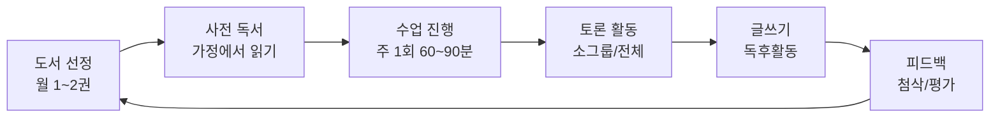
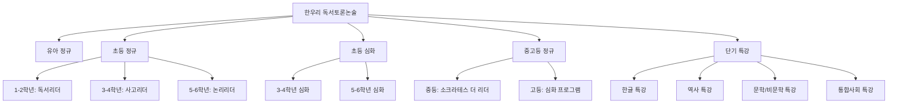
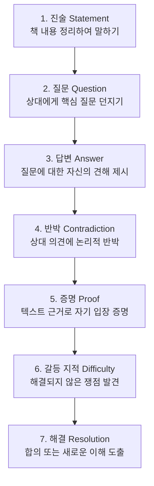
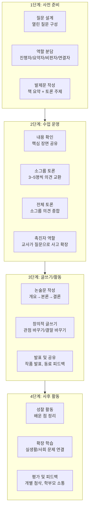
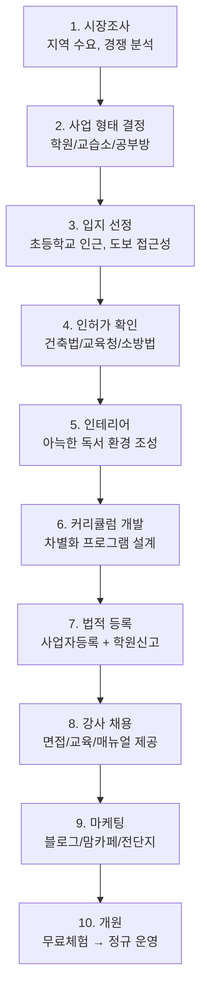

# 독서토론 학원 운영 현황 완벽 가이드

> 독서토론 학원의 운영 방식, 콘텐츠 구성, 책 선정, 수업 진행, 비용, 프랜차이즈 비교 등을 종합 정리한 문서

---

## 목차

1. [독서토론 학원 시장 현황](#1-독서토론-학원-시장-현황)
2. [주요 프랜차이즈 학원 비교](#2-주요-프랜차이즈-학원-비교)
3. [수업 운영 방식](#3-수업-운영-방식)
4. [대상별 프로그램 구성](#4-대상별-프로그램-구성)
5. [도서 선정 기준 및 추천도서](#5-도서-선정-기준-및-추천도서)
6. [독서토론 방법론 비교](#6-독서토론-방법론-비교)
7. [수업 진행 4단계 프로세스](#7-수업-진행-4단계-프로세스)
8. [수업료 및 비용 구조](#8-수업료-및-비용-구조)
9. [학원 창업 및 운영 노하우](#9-학원-창업-및-운영-노하우)
10. [콘텐츠 설계 핵심 요소](#10-콘텐츠-설계-핵심-요소)
11. [향후 트렌드 및 시사점](#11-향후-트렌드-및-시사점)

---

## 1. 독서토론 학원 시장 현황

### 1.1 시장 개요

| 항목 | 내용 |
|------|------|
| **시장 분류** | 사설학원 > 보습/논술 > 독서논술 |
| **주요 수요층** | 초등 3~6학년 학부모 (가장 높은 수요) |
| **성장 동인** | 문해력 저하 우려, 수행평가 비중 증가, IB 교육 도입 |
| **데이터 출처** | 한국교육학술정보원 NEIS, 서울시 공개데이터 |
| **운영 형태** | 학원, 교습소, 공부방, 방문수업, 온라인 |

### 1.2 운영 형태별 분류

| 운영 형태 | 정원 제한 | 시설 요건 | 등록 기관 | 특징 |
|-----------|----------|----------|----------|------|
| **학원** | 제한 없음 | 별도 교육장 필수 | 교육지원청 | 정식 학원 등록, 강사 고용 가능 |
| **교습소** | 9명 이하 | 소규모 공간 | 교육지원청 | 1인 운영, 강사 고용 불가 |
| **공부방** | 9명 이하 | 주거지 일부 활용 가능 | 교육지원청 | 소자본 창업 가능 |
| **방문수업** | 1~3명 | 학생 가정 | 사업자 등록 | 이동형, 1:1 맞춤 |
| **온라인** | 제한 없음 | 플랫폼 기반 | 사업자 등록 | 전국 단위 운영 가능 |

### 1.3 지역별 특성

| 지역 | 특성 | 수업료 수준 |
|------|------|------------|
| **대치동/목동** | 프리미엄, 입시 연계 강화 | 최상위 (월 20~30만원) |
| **강남/서초** | 브랜드 학원 밀집 | 상위 (월 15~25만원) |
| **수도권 일반** | 중소형 학원 중심 | 중간 (월 10~18만원) |
| **지방 도시** | 프랜차이즈 가맹 중심 | 보통 (월 8~15만원) |

---

## 2. 주요 프랜차이즈 학원 비교

### 2.1 대형 프랜차이즈 비교표

| 항목 | 한우리 독서토론논술 | C&A 논술 | 책나무 독서코칭 | 주니어북살롱 |
|------|-------------------|----------|---------------|-------------|
| **설립** | 1994년 | 2000년대 초 | 2010년대 | 2020년대 |
| **형태** | 방문+학원+온라인 | 학원(대치동 본원) | 학원+교습소 | 온라인 플랫폼 |
| **전국 지점** | 전국 다수 센터 | 전국 분원 운영 | 지역 기반 | 온라인(전국) |
| **대상** | 유아~고등 | 초등 고학년~중등 | 유아~중등 | 초등 중심 |
| **정원** | 소규모 3~5명 | 10명 담임제 | 소규모 | 온라인 클래스 |
| **특징** | 월별 필독서+워크북 | 모의재판·국회청문회식 토론 | 하브루타 질문독서 | 테마별 150+ 수업 |
| **강점** | 체계적 교재, 전국 커버리지 | 아카데믹 커리큘럼 | 개별 맞춤 코칭 | 200명+ 선생님 풀 |
| **수업료(월)** | 10~23만원 | 비공개(대기 3~12개월) | 10~15만원 | 수업별 상이 |

### 2.2 개인 운영 학원 비교표 (목동 기준)

| 항목 | MSC 브레인컨설팅 | 독해랑 창의랑 | 대한논리정독 | 가치인 독서논술 |
|------|----------------|-------------|-------------|---------------|
| **수업료(월)** | 20만원 | 24만원 | 주1회 17만원 / 주2회 23만원 / 주3회 26만원 | 12~15만원 |
| **입학 조건** | 입학테스트 4만원 | 없음 | 없음 | 레벨 테스트 |
| **반 구성** | DNA/RNA 반 구분 | 소그룹 | 소그룹 | 소그룹 3~5명 |
| **숙제** | 있음 | 없음 | 있음 | 있음 |
| **특징** | 개별 맞춤 학습 | 창의력 중심 | 논리적 정독 훈련 | 독서+토론+논술 통합 |

---

## 3. 수업 운영 방식

### 3.1 일반적인 수업 구조

### 3.2 수업 시간 구성 (90분 기준)

| 시간 | 활동 | 내용 | 비중 |
|------|------|------|------|
| 0~10분 | **도입** | 지난 시간 복습, 오늘 주제 소개 | 11% |
| 10~25분 | **내용 확인** | 책 내용 요약, 핵심 장면 공유 | 17% |
| 25~50분 | **토론** | 주제 토론, 역할 토론, 디베이트 | 28% |
| 50~70분 | **글쓰기** | 논술문 작성, 독후감, 창작 글쓰기 | 22% |
| 70~85분 | **발표/공유** | 작성한 글 발표, 동료 피드백 | 17% |
| 85~90분 | **마무리** | 정리, 다음 도서 안내, 과제 배부 | 5% |

### 3.3 수업 형태별 비교

| 수업 형태 | 인원 | 시간 | 빈도 | 장점 | 단점 |
|-----------|------|------|------|------|------|
| **1:1 개인** | 1명 | 50~60분 | 주 1~2회 | 완전 맞춤형 | 비용 높음, 토론 제한 |
| **소그룹(3~5명)** | 3~5명 | 60~90분 | 주 1회 | 깊이 있는 토론 | 레벨 맞추기 어려움 |
| **중그룹(6~10명)** | 6~10명 | 90~120분 | 주 1회 | 다양한 관점 | 참여도 편차 |
| **온라인** | 4~8명 | 50~60분 | 주 1회 | 접근성 좋음 | 집중도 관리 어려움 |
| **방문수업** | 1~3명 | 60분 | 주 1회 | 편리함 | 토론 다양성 부족 |

---

## 4. 대상별 프로그램 구성

### 4.1 단계별 프로그램 비교표

| 항목 | 유아(5~7세) | 초등 저학년(1~2) | 초등 중학년(3~4) | 초등 고학년(5~6) | 중등 | 고등 |
|------|-----------|----------------|----------------|----------------|------|------|
| **핵심 목표** | 책과 친해지기 | 기초 문해력 | 사고력 확장 | 논리적 표현 | 비판적 사고 | 입시 연계 |
| **읽기 수준** | 그림책 위주 | 동화, 짧은 글 | 중편 도서 | 장편 소설 | 문학+비문학 | 고전+학술 |
| **월 독서량** | 4~8권 | 2~4권 | 2~3권 | 1~2권 | 1~2권 | 1권 |
| **토론 방식** | 질문-답변 놀이 | 돌아가며 이야기 | 주제 토의 | 찬반 토론 | 디베이트 | 세미나형 |
| **글쓰기** | 그림일기 | 독서일기 | 독후감 | 논술문 | 비평문 | 논증문 |
| **활동** | 만들기, 역할극 | 그림 그리기, 퀴즈 | 마인드맵, 발표 | 포트폴리오 | 수행평가 대비 | 학생부 연계 |
| **수업 시간** | 40분 | 50분 | 60분 | 70~90분 | 90분 | 90~120분 |

### 4.2 한우리 프로그램 체계 (대표 사례)

### 4.3 한우리 5~6학년 '논리리더' 교재 구성

| 교재 구성 | 내용 |
|-----------|------|
| **월별 필독서** | 문학 1권 + 비문학 1권 (총 2권) |
| **워크북** | 1권 (독해·사고력 활동지) |
| **단편도서** | 1권 (과정 중심 글쓰기 연계) |
| **활동자료** | 토론 카드, 마인드맵 등 |
| **포트폴리오** | 월별 학습 결과물 정리 |

### 4.4 한우리 중등 '소크라테스 더 리더' 수업 내용

| 영역 | 내용 |
|------|------|
| **독해** | 독해 원리 → 수능형 지문까지 단계별 학습 |
| **문학** | 단편소설 독해로 문학독해력 강화 |
| **IB 연계** | 국제 바칼로레아 교육프로그램 연계 |
| **진로 독서** | 인문·사회·과학·공학·예술 계열별 독서 |
| **토론** | 통합사회 토론 (시사 이슈 연계) |

---

## 5. 도서 선정 기준 및 추천도서

### 5.1 도서 선정 5대 기준

| 기준 | 설명 | 예시 |
|------|------|------|
| **1. 인지 발달 단계** | 아이의 인지·어휘·감정이해 수준에 맞는 도서 | 저학년: 그림책, 고학년: 장편소설 |
| **2. 학생 관심사 반영** | 강제 선정이 아닌 학생의 관심 분야 중심 | 과학 좋아하는 학생 → 과학 관련 도서 |
| **3. 교과 연계성** | 학교 교육과정·교과서와 연계되는 도서 | 사회 수업 연계 역사 도서 |
| **4. 토론 적합성** | 다양한 관점에서 논의 가능한 주제 포함 | 찬반 논쟁 가능한 소재의 도서 |
| **5. 공인 추천 도서** | 교육부 권장, 학교도서관사서협의회 추천 | 2025년 추천도서 701종 (초등 378, 중등 323) |

### 5.2 학년별 추천도서 목록

#### 초등 저학년 (1~2학년) - 키워드: 공감, 흥미, 상상력

| 도서명 | 저자 | 장르 | 토론 주제 |
|--------|------|------|----------|
| 강아지똥 | 권정생 | 그림책/동화 | 쓸모없는 것의 가치 |
| 괜찮아 | 최숙희 | 그림책 | 자존감과 다양성 |
| 마법의 시간여행 시리즈 | 메리 포프 오즈번 | 판타지 | 역사 속 모험과 용기 |
| 구름빵 | 백희나 | 그림책 | 가족의 사랑과 나눔 |
| 돼지책 | 앤서니 브라운 | 그림책 | 성역할과 가사 분담 |

#### 초등 중학년 (3~4학년) - 키워드: 관찰력, 사고 확장, 이야기 구조

| 도서명 | 저자 | 장르 | 토론 주제 |
|--------|------|------|----------|
| 우주로 보내는 편지 | 김려령 | 동화 | 소통과 외로움 |
| 몽실 언니 | 권정생 | 장편동화 | 전쟁과 평화, 가족 |
| 수학 도둑 시리즈 | 송도수 | 학습만화 | 수학적 사고와 문제해결 |
| 마당을 나온 암탉 | 황선미 | 장편동화 | 꿈과 도전, 편견 |
| 아낌없이 주는 나무 | 셸 실버스타인 | 그림책 | 사랑과 희생의 의미 |

#### 초등 고학년 (5~6학년) - 키워드: 자아, 책임감, 사회적 시선

| 도서명 | 저자 | 장르 | 토론 주제 |
|--------|------|------|----------|
| 아몬드 | 손원평 | 청소년소설 | 감정과 공감 능력 |
| 사자왕 형제의 모험 | 린드그렌 | 판타지 | 용기와 정의 |
| 푸른 사자 와니니 | 이현 | 성장소설 | 독립과 성장 |
| 원더 | R.J. 팔라시오 | 소설 | 외모 차별과 수용 |
| 나미야 잡화점의 기적 | 히가시노 게이고 | 소설 | 인생의 선택과 연결 |

#### 중등 - 키워드: 비판적 사고, 진로 탐색, 정체성

| 도서명 | 저자 | 장르 | 토론 주제 |
|--------|------|------|----------|
| 데미안 | 헤르만 헤세 | 성장소설 | 자아 발견과 운명 |
| 공부머리 독서법 | 최승필 | 자기계발 | 효과적인 독서법 |
| 시간을 파는 상점 | 김선영 | 판타지 | 시간의 가치와 선택 |
| 동물농장 | 조지 오웰 | 풍자소설 | 권력과 민주주의 |
| 82년생 김지영 | 조남주 | 소설 | 성평등과 사회구조 |

---

## 6. 독서토론 방법론 비교

### 6.1 주요 토론 방법론 비교표

| 항목 | 하브루타 (Havruta) | 소크라테스 문답법 | 디베이트 (Debate) | 소크라테스 세미나 | 월드카페 |
|------|-------------------|-----------------|------------------|-----------------|---------|
| **기원** | 유대교 탈무드 학습 | 고대 그리스 철학 | 서양 학술 전통 | 미국 교육학 | 현대 퍼실리테이션 |
| **참여 형태** | 2인 1조 | 교사 vs 학생(1:1) | 찬성팀 vs 반대팀 | 원형 토론 | 소그룹 순환 |
| **교사 역할** | 촉진자 | 질문자(답을 알고 있음) | 심판/진행자 | 진행자 | 진행자 |
| **정답 유무** | 정해진 답 없음 | 교사가 의도한 답 있음 | 승패 판정 | 최선의 이해 도출 | 집단지성 도출 |
| **핵심 역량** | 질문력, 창의적 사고 | 논리적 추론 | 논리력, 설득력 | 비판적 읽기 | 협력, 경청 |
| **적합 대상** | 전 연령 | 중등 이상 | 초등 고학년 이상 | 중등 이상 | 전 연령 |
| **장점** | 깊이 있는 탐구 | 체계적 사고 유도 | 논리력 향상 | 텍스트 심층 이해 | 다양한 관점 |
| **단점** | 짝 수준 편차 | 창의적 답변 제한 | 이분법적 사고 우려 | 준비 시간 多 | 깊이 부족 가능 |

### 6.2 하브루타 7단계 진행 과정

### 6.3 디베이트 주요 형식

| 형식 | 인원 | 시간 | 특징 | 적합 대상 |
|------|------|------|------|----------|
| **CEDA 디베이트** | 2인 vs 2인 | 60분 | 교차질문 포함 | 중·고등 |
| **칼 포퍼 디베이트** | 3인 vs 3인 | 45분 | 교차질문 중심 | 초등 고학년~중등 |
| **링컨-더글러스** | 1인 vs 1인 | 30분 | 가치 토론 중심 | 고등 |
| **의회식 디베이트** | 팀 대항 | 60분 | 정부 vs 야당 형식 | 중·고등 |
| **모의재판** | 다수 | 90분+ | 역할극 결합 | 초등 고학년~중등 |
| **국회청문회식** | 다수 | 60분+ | 질의응답 중심 | 중등 이상 |

---

## 7. 수업 진행 4단계 프로세스

### 7.1 전체 프로세스 흐름

### 7.2 단계별 상세 활동

#### 1단계: 사전 준비

| 활동 | 담당 | 내용 | 시기 |
|------|------|------|------|
| 도서 선정 | 교사 (학생 참여 가능) | 월별 도서 선정 및 안내 | 수업 2~4주 전 |
| 사전 독서 | 학생 | 가정에서 도서 읽기 | 수업 전 1~2주 |
| 질문 설계 | 교사 | 열린 질문 5~10개 설계 | 수업 전 |
| 발제문 작성 | 학생 | 책 요약 + 인상깊은 장면 + 질문 | 수업 전 |
| 역할 분담 | 교사/학생 | 진행자·요약자·비판자·연결자 배정 | 수업 시작 시 |

#### 2단계: 수업 운영

| 활동 | 시간 | 교사 역할 | 학생 활동 |
|------|------|----------|----------|
| 책 내용 확인 | 10~15분 | 핵심 질문 제시 | 줄거리 요약, 인상적 장면 공유 |
| 소그룹 토론 | 15~20분 | 순회 지도, 촉진 질문 | 짝/소그룹 의견 교환 |
| 전체 토론 | 15~20분 | 정리 및 심화 질문 | 소그룹 의견 발표, 반론 제시 |
| 핵심 정리 | 5분 | 주요 논점 정리 | 자기 생각 정리 |

#### 3단계: 글쓰기/활동

| 활동 유형 | 내용 | 소요 시간 |
|-----------|------|----------|
| **독후감** | 감상문 형식의 자유 글쓰기 | 20분 |
| **논술문** | 개요 작성 → 서론/본론/결론 구조 | 30분 |
| **창작 글쓰기** | 결말 바꾸기, 편지 쓰기, 일기 쓰기 | 20분 |
| **비평문** | 작품 분석 및 평가 글쓰기 | 30분 |
| **서평** | 책 소개 및 추천 글 쓰기 | 25분 |

#### 4단계: 사후 활동

| 활동 | 내용 | 주기 |
|------|------|------|
| 개별 첨삭 | 글쓰기 결과물 1:1 첨삭 피드백 | 매 수업 |
| 학부모 소통 | 학습 결과 보고서, 상담 | 월 1회 |
| 포트폴리오 | 월별 학습 결과물 정리 | 월 1회 |
| 독서 기록장 | 읽은 책 목록 및 감상 누적 기록 | 상시 |
| 확장 활동 | 도서관 방문, 저자 특강, 독서 대회 참가 | 분기 1회 |

---

## 8. 수업료 및 비용 구조

### 8.1 학원별·대상별 수업료 비교 (월 기준)

| 학원/형태 | 초등 저학년 | 초등 고학년 | 중등 | 고등 | 비고 |
|-----------|-----------|-----------|------|------|------|
| **한우리** | 10만원 | 12만원 | 14만원 | 23만원 | 1:1은 15만원, 3:1은 13만원 |
| **MSC** | - | 20만원 | 20만원 | - | 입학테스트 4만원 별도 |
| **독해랑 창의랑** | - | 24만원 | - | - | 숙제 없음 |
| **대한논리정독** | 17만원(주1) | 23만원(주2) | 26만원(주3) | - | 주 횟수별 차등 |
| **개인 교습소** | 8~12만원 | 10~15만원 | 12~18만원 | 15~20만원 | 지역별 차이 큼 |
| **온라인** | 5~8만원 | 7~10만원 | 8~12만원 | 10~15만원 | 플랫폼별 상이 |

### 8.2 수업료 외 추가 비용

| 항목 | 비용 | 주기 | 비고 |
|------|------|------|------|
| 교재비 | 1~3만원 | 월 | 학원 자체 워크북 |
| 도서 구입비 | 1~3만원 | 월 | 필독서 1~2권 |
| 입학/레벨 테스트 | 0~4만원 | 1회 | 일부 학원만 |
| 특강/캠프 | 10~30만원 | 방학 중 | 집중 프로그램 |
| 대회 참가비 | 1~5만원 | 연 1~2회 | 논술/토론 대회 |

### 8.3 학원 운영자 비용 구조 (월 기준, 소규모 교습소)

| 항목 | 예상 비용 | 비중 |
|------|----------|------|
| 임대료 | 50~150만원 | 25~35% |
| 인건비 (강사) | 100~200만원 | 30~40% |
| 교재/도서 구입 | 20~50만원 | 5~10% |
| 마케팅/홍보 | 10~30만원 | 3~7% |
| 관리비/공과금 | 10~20만원 | 3~5% |
| 기타 운영비 | 10~30만원 | 3~7% |
| **합계** | **200~480만원** | **100%** |

---

## 9. 학원 창업 및 운영 노하우

### 9.1 창업 프로세스

### 9.2 성공 요인 분석

| 성공 요인 | 상세 내용 | 중요도 |
|-----------|----------|--------|
| **입지 선정** | 초등학교 300m 이내, 학부모 동선 고려 | ★★★★★ |
| **차별화된 커리큘럼** | 독서+토론+논술 통합, 교과 연계 | ★★★★★ |
| **소수정예 운영** | 1:3~1:5 비율 유지, 개별 맞춤 피드백 | ★★★★☆ |
| **학부모 소통** | 월별 학습 보고서, 정기 상담 | ★★★★☆ |
| **강사 역량** | 독서교육 전문성, 토론 진행 능력 | ★★★★★ |
| **마케팅** | 맘카페/블로그 운영, 입소문 관리 | ★★★★☆ |
| **결과 가시화** | 글쓰기 포트폴리오, 대회 수상 | ★★★☆☆ |

### 9.3 강사 자격 및 관리

| 항목 | 내용 |
|------|------|
| **추천 자격** | 독서지도사, 논술지도사, 하브루타 지도사, 국어교육 전공 |
| **필수 역량** | 독서교육 이해, 토론 진행 능력, 글쓰기 첨삭 능력 |
| **교육 과정** | 입사 후 1~2주 자체 교육, 월 1회 보수교육 |
| **관리 방법** | 수업 모니터링, 학부모 만족도 조사, 정기 피드백 |
| **처우** | 시간당 2~5만원 또는 반당 월 고정급 |

---

## 10. 콘텐츠 설계 핵심 요소

### 10.1 효과적인 독서토론 질문 설계

| 질문 유형 | 예시 | 목적 |
|-----------|------|------|
| **사실 확인** | "주인공이 처음 만난 사람은 누구인가요?" | 내용 이해 확인 |
| **추론** | "주인공은 왜 그런 선택을 했을까요?" | 원인-결과 추론 |
| **비판적 사고** | "주인공의 결정이 옳았다고 생각하나요?" | 가치 판단 |
| **적용** | "비슷한 상황이라면 여러분은 어떻게 할까요?" | 실생활 연결 |
| **창의적** | "결말을 바꾼다면 어떤 이야기가 될까요?" | 상상력 확장 |
| **연결** | "이 책의 주제와 비슷한 사회 문제는 무엇인가요?" | 통합적 사고 |

### 10.2 역할 기반 토론 구성

| 역할 | 담당 업무 | 학습 효과 |
|------|----------|----------|
| **진행자** | 토론 순서 관리, 시간 배분 | 리더십, 조율 능력 |
| **요약자** | 토론 내용 정리, 핵심 기록 | 경청 능력, 종합 사고 |
| **비판자** | 상대 의견에 반론 제기 | 비판적 사고력 |
| **연결자** | 다른 책/사회 이슈와 연결 | 통합적 사고력 |
| **발제자** | 토론 주제 제시, 배경 설명 | 분석력, 표현력 |

### 10.3 독후활동 유형 비교

| 활동 유형 | 대상 학년 | 소요 시간 | 학습 효과 | 난이도 |
|-----------|----------|----------|----------|--------|
| 독서 퀴즈 | 전 학년 | 10분 | 내용 이해 확인 | ★☆☆☆☆ |
| 등장인물 관계도 | 초등 전체 | 15분 | 인물 분석, 관계 파악 | ★★☆☆☆ |
| 마인드맵 | 초등 3학년+ | 20분 | 핵심 정리, 구조화 | ★★☆☆☆ |
| 독서일기/독후감 | 전 학년 | 20~30분 | 감상 표현, 글쓰기 | ★★★☆☆ |
| 역할극/연극 | 초등 전체 | 30분+ | 표현력, 공감 능력 | ★★★☆☆ |
| 찬반 토론 | 초등 고학년+ | 30~40분 | 논리력, 설득력 | ★★★★☆ |
| 논술문 쓰기 | 초등 5학년+ | 40분+ | 논리적 글쓰기 | ★★★★☆ |
| 비평문 쓰기 | 중등+ | 40분+ | 비판적 분석 | ★★★★★ |
| 서평/북리뷰 | 중등+ | 30분 | 종합적 평가 | ★★★★☆ |
| 포트폴리오 작성 | 전 학년 | 지속적 | 학습 성장 기록 | ★★★☆☆ |

---

## 11. 향후 트렌드 및 시사점

### 11.1 독서토론 교육 트렌드

| 트렌드 | 내용 | 시사점 |
|--------|------|--------|
| **AI 도입** | AI 기반 독서 추천, 글쓰기 첨삭, 토론 진행 보조 | 교사 역할 변화 (촉진자로 전환) |
| **온·오프 통합** | 온라인 독서 + 오프라인 토론 하이브리드 모델 | 접근성 향상, 전국 단위 운영 가능 |
| **IB 교육 확대** | 국제 바칼로레아 도입으로 토론·서술 평가 강화 | 토론 교육 수요 급증 예상 |
| **수행평가 비중 증가** | 학교 평가에서 서술형·토론 비중 확대 | 독서토론 학원 수요 증가 |
| **문해력 위기** | 디지털 세대의 문해력 저하 우려 | 체계적 독서 교육 필요성 증가 |
| **프로젝트 기반 학습** | 독서를 중심으로 한 PBL(Project Based Learning) | 융합형 프로그램 설계 필요 |
| **커뮤니티 기반** | 독서 동아리·클럽 형태의 자발적 모임 증가 | 학원 외 대안적 모델 등장 |

### 11.2 기존 학원 vs 미래형 독서토론 교육 비교

| 항목 | 기존 학원 모델 | 미래형 모델 |
|------|-------------|-----------|
| **수업 형태** | 오프라인 대면 | 온·오프 하이브리드 |
| **도서 선정** | 교사 일방 선정 | AI 추천 + 학생 참여 선정 |
| **토론 방식** | 교사 주도 토의 | AI MC + 학생 자율 토론 |
| **글쓰기 첨삭** | 교사 수동 첨삭 | AI 초벌 첨삭 + 교사 최종 피드백 |
| **학습 기록** | 종이 포트폴리오 | 디지털 포트폴리오 (성장 분석) |
| **학부모 소통** | 월 1회 서면 보고 | 실시간 학습 대시보드 |
| **평가 방식** | 교사 주관 평가 | 루브릭 기반 정량+정성 평가 |
| **확장성** | 지역 한정 | 전국/글로벌 가능 |

### 11.3 리딩리듬 프로젝트와의 연결점

| 기존 학원의 한계 | 리딩리듬 프로젝트 해결 방안 |
|-----------------|--------------------------|
| 소수정예라 확장 어려움 | 온라인 플랫폼으로 규모 확장 |
| 강사 역량에 의존 | AI MC가 토론 품질 보장 |
| 높은 수업료 | 구독 모델로 접근성 향상 |
| 지역 제한 | 전국 단위 서비스 가능 |
| 획일적 커리큘럼 | AI 기반 개인 맞춤 커리큘럼 |
| 피드백 지연 | 실시간 AI 피드백 시스템 |
| 학부모 소통 부족 | 학습 대시보드 실시간 제공 |

---

## 부록: 독서토론 수업 설계 체크리스트

### A. 수업 전 체크리스트

- [ ] 이번 달 도서 선정 완료 (학년·수준·토론 적합성 검토)
- [ ] 교사용 질문지 작성 (열린 질문 5~10개)
- [ ] 학생 발제문 양식 배포
- [ ] 토론 역할 분담 계획 수립
- [ ] 필요한 활동 자료 준비 (워크시트, 토론 카드 등)

### B. 수업 중 체크리스트

- [ ] 책 내용 확인 (핵심 장면, 주제 공유)
- [ ] 소그룹 토론 진행 (모든 학생 발언 기회 보장)
- [ ] 전체 토론 진행 (다양한 관점 종합)
- [ ] 글쓰기 활동 진행 (적절한 유형 선택)
- [ ] 발표 및 동료 피드백

### C. 수업 후 체크리스트

- [ ] 학생 글쓰기 결과물 첨삭 완료
- [ ] 개별 학습 피드백 작성
- [ ] 수업 기록 정리 (토론 내용, 학생 참여도)
- [ ] 학부모 소통 (필요 시)
- [ ] 다음 수업 도서 및 활동 계획

---

> **참고 자료**
> - 한우리독서토론논술 (hanuribook.com)
> - 주니어북살롱 (junior.booksalon.co.kr)
> - 책나무 독서코칭 (booktreei.com)
> - 한국교육학술정보원 학원교습소 정보 (data.go.kr)
> - 2025 학교도서관사서협의회 추천도서
> - 서울시 사설학원 통계 (data.seoul.go.kr)

---

*최종 업데이트: 2026년 2월 16일*
