# 🌈 융합형 프로젝트 100선 (5대 영역 결합)

> **특징**: 단일 영역이 아닌 2개 이상 영역을 융합한 실전 프로젝트  
> **혁신 포인트**: 영역 경계를 넘나들며 새로운 가치 창출  
> **활용**: 공모전 수상작, 스타트업 아이템, 포트폴리오

---

## 🎯 융합 프로젝트 전체 구조

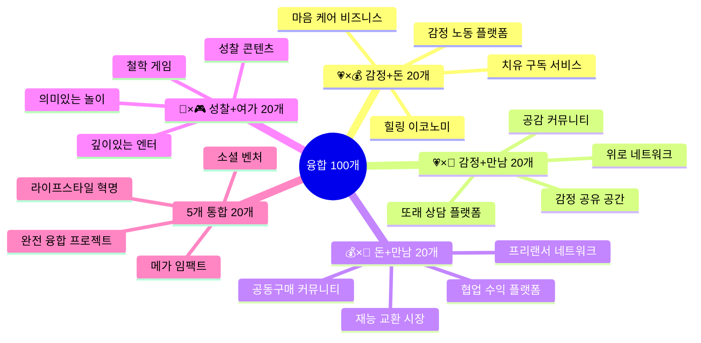

---

## 💗×💰 Part 1: 감정 + 돈 융합 (20개)

> **핵심 아이디어**: 감정적 니즈를 해결하면서 수익도 창출한다!

### 초등학생 (5개)

**#101 기분 좋아지는 용돈벌이**
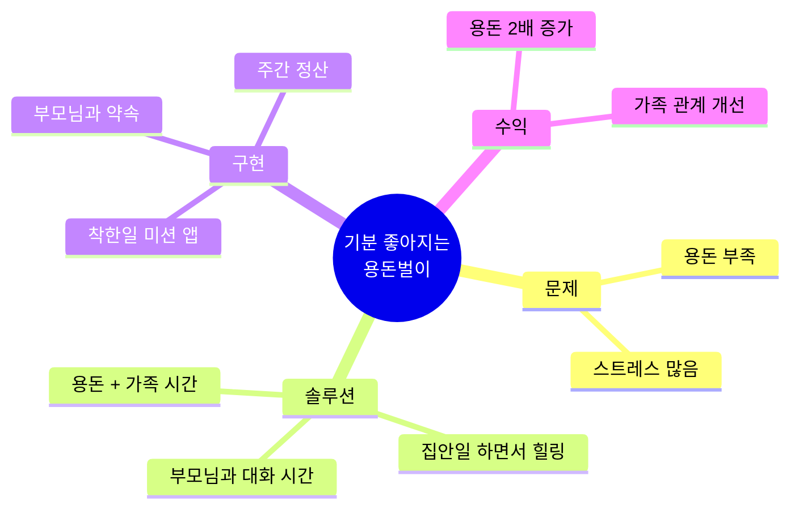
- **문제**: 용돈도 부족하고, 부모님과 대화도 부족
- **솔루션**: 집안일을 하면서 부모님과 대화하는 "힐링 미션"
- **수익 모델**: 미션 완료 시 용돈 + 칭찬 포인트
- **예상 효과**: 월 용돈 5천원 → 1만원, 가족 대화 시간 30분 증가

---

**#102 친구 위로 쿠폰 장터**
- **문제**: 친구가 슬플 때 어떻게 위로할지 모름
- **솔루션**: 위로 쿠폰을 만들어서 거래하는 반 내 장터
  - "같이 놀아줄게" 쿠폰
  - "숙제 도와줄게" 쿠폰
  - "칭찬해줄게" 쿠폰
- **수익 모델**: 반 화폐로 거래, 학기말 경매
- **예상 효과**: 학급 분위기 개선, 따돌림 감소

---

**#103 감정 그림 판매 프로젝트**
- **문제**: 그림은 잘 그리는데 용돈이 필요함
- **솔루션**: 감정을 표현한 그림을 그려서 판매
  - 주제: "오늘 기분을 그림으로"
  - 친구/부모님에게 판매
  - 온라인 (크몽 키즈) 등록
- **수익 모델**: 그림 1장 3,000원
- **예상 효과**: 월 10장 판매 = 3만원

---

**#104 스트레스 해소 게임 + 광고**
- **문제**: 숙제 스트레스가 심함
- **솔루션**: 간단한 힐링 게임 제작 (Scratch)
  - 예: 풍선 터뜨리기, 색칠하기
  - 친구들과 공유
- **수익 모델**: 나중에 광고 붙이기 (부모님 도움)
- **예상 효과**: 친구 50명 플레이, 스트레스 감소

---

**#105 감정 인형 만들기 사업**
- **문제**: 슬플 때 안아줄 친구가 필요함
- **솔루션**: 감정 인형을 직접 만들어서 판매
  - 재료: 펠트, 솜, 바느질
  - 각 감정별 인형 (기쁨이, 슬픔이 등)
- **수익 모델**: 인형 1개 5,000원
- **예상 효과**: 월 5개 판매 = 25,000원

---

### 중학생 (5개)

**#106 시험 스트레스 관리 앱 (구독 모델)**
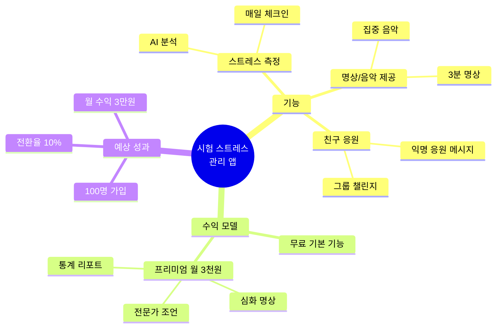
- **문제**: 시험 스트레스로 멘탈 붕괴
- **솔루션**: 스트레스 측정 + 명상 + 커뮤니티
- **수익 모델**: 프리미엄 월 3,000원
- **개발**: Bubble.io (노코드)
- **예상 성과**: 100명 가입, 10명 유료 = 월 3만원

---

**#107 감정 노동자를 위한 케어 서비스**
- **문제**: 알바하면서 감정 노동이 심함 (편의점, 카페)
- **솔루션**: 감정 노동 측정 + 힐링 콘텐츠 + 법률 정보
  - 매일 감정 노동 점수 기록
  - 힐링 영상/명상 제공
  - 부당한 대우 시 대응 가이드
- **수익 모델**: 기업 B2B (알바 많이 쓰는 카페 체인)
- **예상 성과**: 5개 매장 × 월 5만원 = 25만원

---

**#108 우울 극복 챌린지 + 코칭**
- **문제**: 우울감을 느끼는데 상담은 비쌈
- **솔루션**: 30일 우울 극복 챌린지
  - 매일 미션 (산책, 일기, 감사 등)
  - 그룹 챌린지로 동기 부여
  - 1주 1회 코치와 화상 통화
- **수익 모델**: 30일 코스 49,000원
- **예상 성과**: 월 10명 참여 = 49만원

---

**#109 힐링 굿즈 디자인 & 판매**
- **문제**: 위로가 필요한 친구들이 많음
- **솔루션**: 힐링 메시지가 담긴 굿즈 제작
  - 스티커, 엽서, 파우치
  - Canva로 디자인
  - 스마트스토어 판매
- **수익 모델**: 굿즈 판매 수익
- **예상 성과**: 월 50개 판매 × 5천원 = 25만원

---

**#110 감정 일기 + 광고 수익**
- **문제**: 감정 표현이 어려움
- **솔루션**: 감정 일기 앱 with AI 분석
  - 매일 감정 + 이유 기록
  - AI가 패턴 분석 및 조언
  - 무료 제공 + 광고
- **수익 모델**: 광고 수익 (Google AdMob)
- **예상 성과**: MAU 500명 → 월 5만원

---

### 고등학생 (5개)

**#111 정신건강 케어 플랫폼 (B2B)**
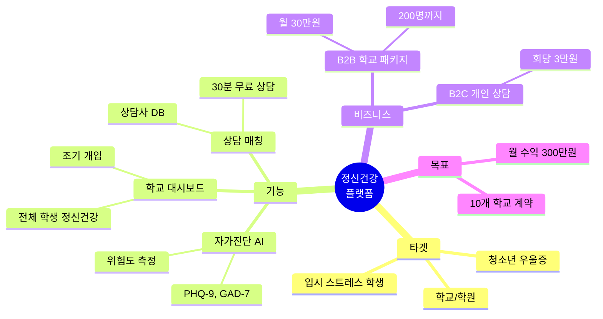
- **문제**: 청소년 정신건강 위기, 병원은 문턱이 높음
- **솔루션**: 자가진단 → 상담 매칭 → 학교 제휴
- **수익 모델**: 
  - B2B 학교 패키지: 월 30만원
  - B2C 상담 연결 수수료: 회당 1만원
- **예상 성과**: 10개 학교 = 월 300만원

---

**#112 입시 멘탈 케어 코칭**
- **문제**: 입시 스트레스로 번아웃
- **솔루션**: 수험생 전용 멘탈 관리 코칭
  - 주 1회 화상 코칭 (30분)
  - 매일 체크인 (스트레스, 수면, 공부시간)
  - 멘탈 회복 루틴 설계
- **수익 모델**: 3개월 코스 30만원
- **예상 성과**: 월 10명 = 100만원

---

**#113 감정 기반 진로 상담**
- **문제**: 진로를 정해야 하는데 뭘 해야 할지 모름
- **솔루션**: 감정 추적 + 진로 연결
  - 2주간 매일 활동 후 감정 점수 기록
  - 어떤 활동에서 기쁨을 느끼는지 분석
  - AI가 적합 진로 추천
- **수익 모델**: 진로 리포트 5만원
- **예상 성과**: 월 20명 = 100만원

---

**#114 힐링 콘텐츠 크리에이터**
- **문제**: 우울한 학생들이 많음
- **솔루션**: 유튜브 힐링 채널 운영
  - 주제: ASMR, 명상, 위로 메시지
  - 주 3회 업로드
  - 광고 + 후원
- **수익 모델**: 애드센스 + 투네이션
- **예상 성과**: 구독자 1만명 → 월 50만원

---

**#115 트라우마 치유 VR 콘텐츠**
- **문제**: 트라우마를 가진 학생들이 많음
- **솔루션**: VR 노출 치료 콘텐츠
  - 안전한 가상 환경
  - 전문가 협업
  - 병원 납품
- **수익 모델**: 병원/학교 라이센스
- **예상 성과**: 5개 기관 × 월 50만원 = 250만원

---

### 대학생 (5개)

**#116 직장인 번아웃 예방 플랫폼**
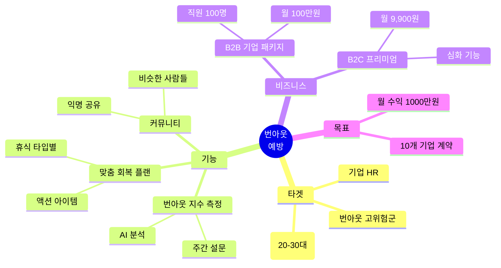
- **문제**: 직장인 번아웃 급증
- **솔루션**: 번아웃 측정 + 회복 플랜 + 커뮤니티
- **수익 모델**:
  - B2B 기업: 직원 100명 기준 월 100만원
  - B2C: 개인 월 9,900원
- **예상 성과**: 10개 기업 = 월 1000만원

---

**#117 습관 형성 앱 (훅 모델 적용)**
- **문제**: 좋은 습관을 만들고 싶은데 지속이 어려움
- **솔루션**: 행동 설계 기반 습관 앱
  - Trigger: 알림 최적화
  - Action: 초간단 액션
  - Reward: 즉각적 보상
  - Investment: 기록 축적
- **수익 모델**: 프리미엄 월 4,900원
- **예상 성과**: 1만 MAU, 전환율 5% = 월 245만원

---

**#118 감정 노동자 케어 B2B SaaS**
- **문제**: 콜센터, 서비스직 감정 노동 심각
- **솔루션**: 기업용 감정 노동 관리 플랫폼
  - 직원 감정 상태 대시보드
  - 조기 경보 시스템
  - 힐링 콘텐츠 제공
- **수익 모델**: 직원 1인당 월 5,000원
- **예상 성과**: 100명 기업 10곳 = 월 500만원

---

**#119 정신건강 챗봇 (AI 상담)**
- **문제**: 상담 비용이 비싸고 문턱이 높음
- **솔루션**: GPT 기반 AI 상담 챗봇
  - 24시간 대화 가능
  - CBT 기법 적용
  - 위급 시 전문가 연결
- **수익 모델**: 
  - 기본 무료, 프리미엄 월 9,900원
  - 전문가 연결 수수료
- **예상 성과**: 1만 MAU, 전환 10% = 월 100만원

---

**#120 힐링 이코노미 플랫폼**
- **문제**: 힐링 상품/서비스가 파편화됨
- **솔루션**: 힐링 마켓플레이스
  - 명상, 요가, 상담, 여행 등 통합
  - 큐레이션 & 추천
  - 구독 박스 형태
- **수익 모델**: 거래 수수료 20%
- **예상 성과**: 월 거래액 3000만원 = 수익 600만원

---

## 💗×🤝 Part 2: 감정 + 만남 융합 (20개)

> **핵심 아이디어**: 외로움을 해소하고 정서적 지지를 받는 커뮤니티!

### 초등학생 (5개)

**#121 외로운 친구 매칭 앱**
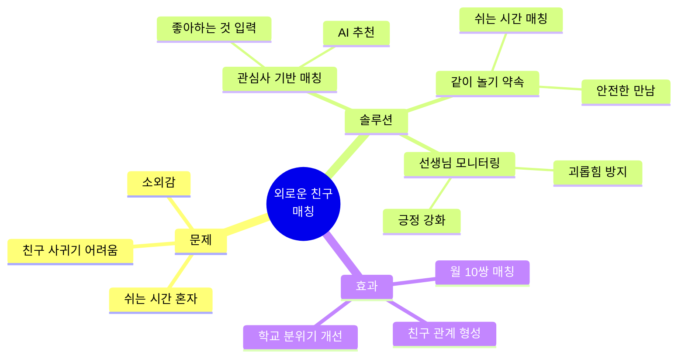
- **문제**: 민수네 반에 항상 혼자 있는 친구가 있어요
- **솔루션**: 같은 관심사를 가진 친구 매칭
- **개발**: 간단한 설문 + 엑셀 매칭 → 나중에 앱
- **예상 효과**: 학급 따돌림 감소, 친구 관계 형성

---

**#122 감정 공유 우정 일기**
- **문제**: 친구에게 속마음을 말하기 어려움
- **솔루션**: 친구와 함께 쓰는 교환 일기
  - 오늘 기분 + 이유
  - 서로 읽고 위로 메시지
  - 주 1회 만나서 이야기
- **효과**: 친구 관계 깊이 증가

---

**#123 칭찬 릴레이 게임**
- **문제**: 친구의 좋은 점을 잘 몰라요
- **솔루션**: 반 친구들이 돌아가며 칭찬하기
  - 매일 1명씩 칭찬 주인공
  - 포스트잇에 칭찬 메시지
  - 1달 후 모두에게 전달
- **효과**: 학급 분위기 개선, 자존감 향상

---

**#124 가족 대화 챌린지**
- **문제**: 부모님과 대화가 부족해요
- **솔루션**: 가족 대화 미션
  - 매일 5분 대화 (질문 카드 제공)
  - 예: "오늘 기분은 어땠어요?"
  - 스티커 모으기
- **효과**: 가족 관계 개선

---

**#125 우는 나무 프로젝트**
- **문제**: 슬플 때 혼자 참아요
- **솔루션**: 교실에 "우는 나무" 설치
  - 슬픈 일을 적어서 잎에 붙이기
  - 친구들이 위로 메시지 달기
  - 주 1회 함께 읽기
- **효과**: 공동체 위로 문화

---

### 중학생 (5개)

**#126 익명 고민 상담 + 또래 연결**
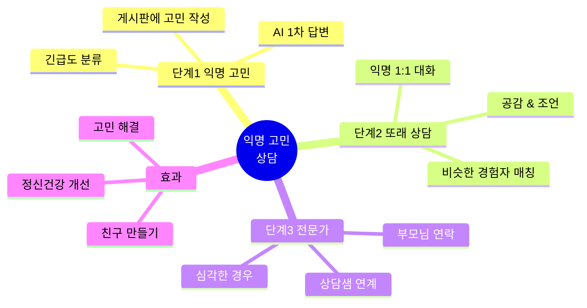
- **문제**: 고민이 있는데 친구에게 말하기 부끄러움
- **솔루션**: 익명 고민 상담 → 비슷한 경험자 매칭
- **개발**: Bubble.io + ChatGPT API
- **예상 성과**: 월 100건 상담, 50건 매칭

---

**#127 공감 능력 훈련 그룹**
- **문제**: 친구의 감정을 이해하기 어려움
- **솔루션**: 공감 능력 훈련 워크숍
  - 주 1회 소그룹 모임
  - 상황 카드 + 역할극
  - 여러 관점으로 보기 연습
- **효과**: 학급 갈등 감소, 공감 능력 향상

---

**#128 감정 공유 커뮤니티**
- **문제**: 비슷한 고민을 가진 친구를 찾기 어려움
- **솔루션**: 주제별 소모임
  - 예: "부모님과 갈등", "진로 고민", "외로움"
  - 월 1회 오프라인 만남
  - 온라인 채팅방
- **효과**: 소속감, 정서적 지지

---

**#129 긍정 메시지 벽 (디지털)**
- **문제**: 칭찬받을 기회가 적음
- **솔루션**: 학교 앱에 칭찬 게시판
  - 익명으로 칭찬 메시지
  - 메인 화면에 노출
  - 주간 베스트 칭찬
- **효과**: 긍정 문화, 자존감 향상

---

**#130 학급 감정 온도계**
- **문제**: 학급 분위기가 나빠지는 걸 모름
- **솔루션**: 매일 감정 체크인
  - 등교 시 터치 스크린에 감정 선택
  - 실시간 학급 평균 감정 점수
  - 담임샘이 대시보드 확인
- **효과**: 조기 개입, 학급 관리

---

### 고등학생 (5개)

**#131 입시 동지 매칭 플랫폼**
- **문제**: 입시 준비 외롭고 스트레스
- **솔루션**: 같은 목표 대학 지망생 매칭
  - 목표 대학/학과 입력
  - AI 매칭 (공부 스타일, 성격)
  - 온라인 스터디 그룹
  - 정서적 지지 + 정보 공유
- **수익**: 프리미엄 월 5,000원 (심화 매칭)
- **예상 성과**: 500명 가입, 50명 유료 = 월 25만원

---

**#132 멘탈 회복 동아리**
- **문제**: 번아웃 학생이 많음
- **솔루션**: 멘탈 케어 동아리
  - 주 1회 모임 (명상, 요가, 대화)
  - 서로 감정 공유
  - 전문가 초청 특강
- **효과**: 번아웃 예방, 공동체 형성

---

**#133 감정 노동자 네트워크**
- **문제**: 알바하면서 감정 노동이 심함
- **솔루션**: 감정 노동자 커뮤니티
  - 경험 공유
  - 힐링 팁 교환
  - 부당 대우 대응 법률 정보
- **효과**: 연대감, 문제 해결

---

**#134 트라우마 치유 그룹**
- **문제**: 학교 폭력, 가정 문제로 트라우마
- **솔루션**: 또래 트라우마 치유 그룹
  - 전문가 지도 하에 진행
  - 안전한 공간에서 경험 공유
  - 치유 과정 함께하기
- **효과**: 트라우마 완화

---

**#135 감정 표현 워크숍**
- **문제**: 감정을 말로 표현하기 어려움
- **솔루션**: 예술 기반 감정 표현
  - 미술, 음악, 춤으로 감정 표현
  - 친구들과 공유
  - 피드백 & 공감
- **효과**: 감정 표현 능력 향상

---

### 대학생 (5개)

**#136 정신건강 커뮤니티 플랫폼**
- **문제**: 우울증, 불안 학생이 많은데 외로움
- **솔루션**: 비슷한 고민을 가진 사람들 연결
  - 주제별 그룹 (우울, 불안, 섭식장애 등)
  - 익명 또는 실명 선택
  - 전문가 자문
  - 온/오프라인 모임
- **수익 모델**: 프리미엄 기능 월 9,900원
- **예상 성과**: 1,000명 가입, 100명 유료 = 월 100만원

---

**#137 습관 형성 버디 시스템**
- **문제**: 혼자 습관 만들기 어려움
- **솔루션**: 같은 습관 목표를 가진 버디 매칭
  - 예: 아침 7시 기상, 운동 30분, 독서 1시간
  - 매일 인증 사진 공유
  - 서로 응원 메시지
  - 격주 오프라인 만남
- **수익 모델**: 매칭 수수료 월 5,000원
- **예상 성과**: 200쌍 = 월 100만원

---

**#138 소셜 벤처 창업가 네트워크**
- **문제**: 소셜 벤처는 외롭고 어려움
- **솔루션**: 소셜 벤처 창업가 커뮤니티
  - 월간 밋업
  - 경험 공유
  - 협업 프로젝트
  - 정서적 지지
- **수익 모델**: 멤버십 월 5만원 (공간 + 네트워킹)
- **예상 성과**: 50명 = 월 250만원

---

**#139 사회 문제 해결 팀 빌딩**
- **문제**: 사회 문제를 해결하고 싶은데 혼자는 힘듦
- **솔루션**: 문제별 팀 매칭
  - 관심 사회 문제 선택
  - 스킬 기반 팀 빌딩
  - 3개월 프로젝트
  - 최종 발표회
- **효과**: 실제 문제 해결, 네트워크 형성

---

**#140 감정 노동자 힐링 리트릿**
- **문제**: 감정 노동으로 번아웃
- **솔루션**: 감정 노동자 전용 힐링 캠프
  - 2박 3일 리트릿
  - 명상, 요가, 대화
  - 전문가 치유 프로그램
  - 같은 업종 사람들과 연대
- **수익 모델**: 1회 참가비 30만원
- **예상 성과**: 월 1회 × 20명 = 월 600만원

---

## 💰×🤝 Part 3: 돈 + 만남 융합 (20개)

> **핵심 아이디어**: 함께 수익을 만들고, 협업하며 성장한다!

### 초등학생 (5개)

**#141 친구와 함께하는 벼룩시장**
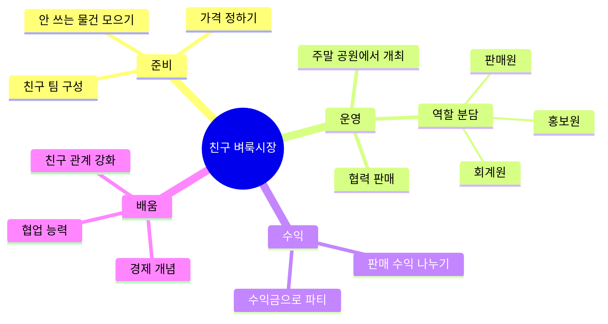
- **문제**: 물건도 팔고 싶고, 친구와도 놀고 싶음
- **솔루션**: 친구 3-5명이 팀을 이루어 벼룩시장
  - 각자 물건 가져오기
  - 역할 분담 (판매, 홍보, 회계)
  - 수익 균등 분배
- **예상 수익**: 팀당 5만원 → 1인당 1만원
- **배움**: 협업, 경제, 친구 관계

---

**#142 우리 반 공동 저금통**
- **문제**: 학급 활동 비용이 부족함
- **솔루션**: 반 전체가 협력하여 돈 모으기
  - 착한 일 하면 반 통장에 100원
  - 학기말에 반 파티 or 기부
  - 회계 담당 돌아가며
- **예상 수익**: 학기당 10만원
- **배움**: 협동조합, 공동체 의식

---

**#143 재능 교환 장터**
- **문제**: 배우고 싶은 것이 있는데 학원은 비쌈
- **솔루션**: 재능 교환 (돈 없이)
  - 예: 그림 잘 그리는 친구 ↔ 수학 잘하는 친구
  - 온라인 플랫폼 or 오프라인 만남
  - 포인트 시스템 (1시간 = 1포인트)
- **배움**: 재능의 가치, 협력 경제

---

**#144 가족 협동 프로젝트**
- **문제**: 용돈도 부족하고, 가족과 시간도 부족
- **솔루션**: 가족이 함께 수익 프로젝트
  - 예: 가족 유튜브 채널, 수제 쿠키 판매
  - 역할 분담 (촬영, 편집, 판매)
  - 수익 공유 (용돈 증가)
- **예상 수익**: 월 10만원 → 용돈 3만원
- **배움**: 가족 협업, 비즈니스

---

**#145 동네 아이들 협동조합**
- **문제**: 동네에서 심심함
- **솔루션**: 동네 친구들과 협동조합
  - 공동 수익 사업 (레모네이드, 수제품)
  - 수익금으로 동네 놀이터 개선
  - 어른들 지원 받기
- **예상 수익**: 월 5만원 → 놀이터 개선
- **배움**: 협동조합, 지역 사회

---

### 중학생 (5개)

**#146 학생 프리랜서 협업 플랫폼**
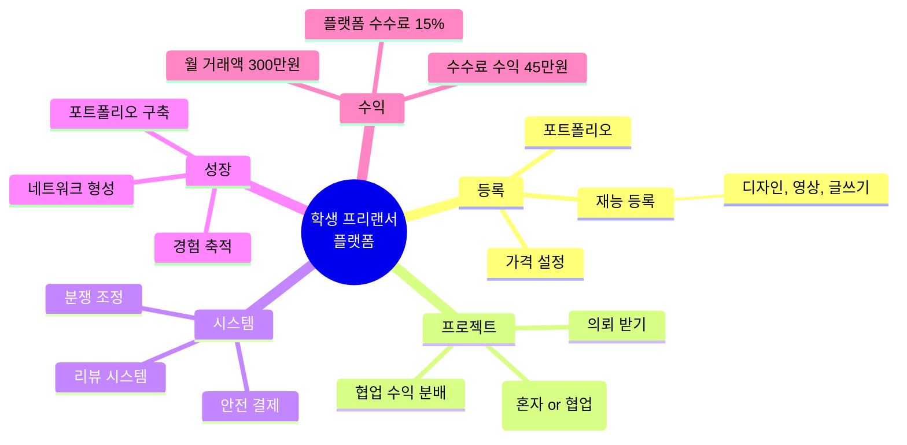
- **문제**: 재능은 있는데 혼자는 큰 프로젝트가 어려움
- **솔루션**: 학생 간 팀 프로젝트 매칭
  - 예: 디자이너 + 개발자 + 마케터
  - 수익 배분 시스템
  - 포트폴리오 축적
- **수익 모델**: 플랫폼 수수료 15%
- **예상 성과**: 월 거래액 300만원 → 수수료 45만원

---

**#147 공동구매 커뮤니티**
- **문제**: 학용품, 간식이 비쌈
- **솔루션**: 학생 공동구매 플랫폼
  - 같은 물건을 원하는 학생 모집
  - 대량 구매로 가격 협상
  - 배송비 절감
  - 리더가 주문 & 분배
- **수익 모델**: 리더 수수료 10%
- **예상 성과**: 월 100만원 거래 → 10만원

---

**#148 스터디 카페 공동 운영**
- **문제**: 스터디 카페가 비쌈 (시간당 3,000원)
- **솔루션**: 학생들이 공간을 공동 임대
  - 10명이 월 5만원씩 = 50만원
  - 공간 임대 (월 30만원)
  - 나머지는 간식, 비품
  - 24시간 자유 이용
- **절감**: 개인당 월 10만원 → 5만원
- **배움**: 협동조합, 공간 운영

---

**#149 재능 기부 + 수익 쉐어링**
- **문제**: 재능 기부하고 싶은데 지속이 어려움
- **솔루션**: 무료 재능 기부 → 후원금 받기
  - 예: 무료 과외, 무료 디자인
  - 후원 플랫폼 (투네이션)
  - 수익의 50%는 다시 기부
- **수익**: 월 10만원 후원 → 5만원 수익, 5만원 기부
- **배움**: 선순환 경제

---

**#150 학급 협동 사업**
- **문제**: 학급 활동비가 부족함
- **솔루션**: 반 전체가 사업 운영
  - 예: 굿즈 제작 & 판매
  - 모든 학생 참여 (기획, 제작, 판매)
  - 수익금으로 학급 활동
- **예상 수익**: 학기당 50만원
- **배움**: 협업, 비즈니스 전 과정

---

### 고등학생 (5개)

**#151 프리랜서 팀 에이전시**
- **문제**: 개인 프리랜서는 큰 프로젝트 수주 어려움
- **솔루션**: 학생 프리랜서가 팀을 이루어 에이전시
  - 풀스택 팀 (기획, 디자인, 개발, 마케팅)
  - 중소기업 대상 서비스
  - 수익 배분 명확
- **수익 모델**: 프로젝트당 평균 200만원
- **예상 성과**: 월 1건 × 5명 = 1인당 40만원

---

**#152 학생 창업 협동조합**
- **문제**: 혼자 창업은 리스크가 큼
- **솔루션**: 여러 학생이 공동 창업
  - 각자 지분 보유
  - 역할 분담
  - 수익 배분
  - 리스크 분산
- **예상 수익**: 월 300만원 → 5명 = 1인당 60만원
- **배움**: 협동조합, 창업 전 과정

---

**#153 프로젝트 팀 매칭 플랫폼**
- **문제**: 해커톤, 공모전 팀을 찾기 어려움
- **솔루션**: 스킬 기반 팀 매칭
  - 프로필 (스킬, 경험, 성격)
  - AI 매칭 알고리즘
  - 프로젝트별 팀 구성
  - 수상 시 상금 배분
- **수익 모델**: 프리미엄 매칭 월 1만원
- **예상 성과**: 200명 유료 = 월 200만원

---

**#154 지역 청년 협동 사업**
- **문제**: 지역 소상공인이 어려움
- **솔루션**: 학생들이 협력하여 마케팅 지원
  - 팀 구성 (사진, 영상, SNS, 디자인)
  - 지역 가게 홍보
  - 성과 기반 수수료
- **수익 모델**: 매출 증가분의 10%
- **예상 성과**: 5개 가게 × 월 20만원 = 100만원

---

**#155 크라우드펀딩 협업 프로젝트**
- **문제**: 좋은 아이디어가 있는데 자금이 없음
- **솔루션**: 친구들과 협업하여 크라우드펀딩
  - 아이디어 + 제작팀 구성
  - 텀블벅 런칭
  - 목표 금액 달성 시 수익 배분
- **예상 수익**: 목표 500만원 달성 → 5명 = 1인당 100만원

---

### 대학생 (5개)

**#156 프리랜서 네트워크 플랫폼**
- **문제**: 프리랜서는 외롭고 프로젝트 수주 어려움
- **솔루션**: 프리랜서 협업 플랫폼
  - 스킬 등록 & 팀 매칭
  - 대형 프로젝트 공동 수주
  - 정기 밋업 & 네트워킹
  - 수익 배분 시스템
- **수익 모델**: 플랫폼 수수료 10%
- **예상 성과**: 월 거래액 5000만원 → 수수료 500만원

---

**#157 소셜 벤처 공동 창업**
- **문제**: 사회 문제 해결하고 싶은데 혼자는 어려움
- **솔루션**: 3-5명이 팀을 이루어 소셜 벤처
  - 공동 지분 보유
  - 역할 분담 (CEO, CTO, CMO 등)
  - 수익 + 임팩트
- **예상 성과**: 월 매출 1000만원 → 5명 = 1인당 200만원

---

**#158 창업가 커뮤니티 + 코워킹**
- **문제**: 창업은 외롭고 리소스가 부족함
- **솔루션**: 창업가 커뮤니티 & 공유 오피스
  - 월 멤버십 10만원
  - 코워킹 스페이스
  - 주간 밋업 & 네트워킹
  - 리소스 공유 (법무, 회계, 디자인)
- **수익 모델**: 100명 × 월 10만원 = 월 1000만원

---

**#159 학생 VC (벤처 캐피털) 펀드**
- **문제**: 좋은 학생 창업 아이템에 투자할 곳이 없음
- **솔루션**: 학생들이 모아서 펀드 조성
  - 1인당 10만원씩 투자
  - 유망 학생 스타트업에 투자
  - Exit 시 수익 배분
- **예상 성과**: 100명 × 10만원 = 1000만원 펀드

---

**#160 협동조합 비즈니스 모델**
- **문제**: 일반 회사는 수익 독점 구조
- **솔루션**: 협동조합 형태로 비즈니스
  - 모든 멤버가 공동 소유
  - 1인 1표 의사결정
  - 수익 균등 배분
  - 민주적 운영
- **예상 성과**: 지속가능한 비즈니스 모델

---

## 🧘×🎮 Part 4: 성찰 + 여가 융합 (20개)

> **핵심 아이디어**: 놀면서 깊이 생각하고, 의미를 찾으며 즐긴다!

### 초등학생 (5개)

**#161 철학 보드게임 만들기**
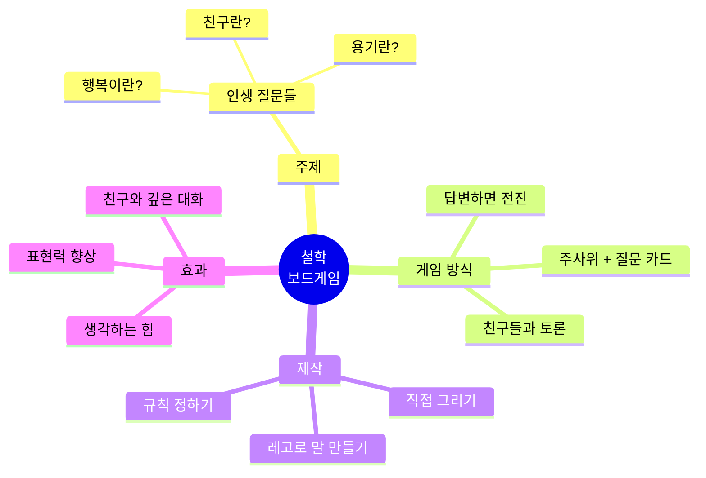
- **문제**: 게임은 재밌는데 생각은 안 하게 됨
- **솔루션**: 철학 질문이 담긴 보드게임
  - 주사위 굴려서 질문 칸에 도착
  - 질문에 답변해야 전진
  - 친구들이 투표로 좋은 답 선정
- **효과**: 생각하는 힘 + 재미

---

**#162 인생 시뮬레이션 게임 (Scratch)**
- **문제**: 인생이 뭔지 잘 모르겠어요
- **솔루션**: Scratch로 인생 게임 만들기
  - 선택지마다 결과가 다름
  - 예: 공부 vs 놀기 → 미래 변화
  - 친구들과 플레이
- **효과**: 선택의 중요성 배움

---

**#163 상상 놀이터 + 철학 질문**
- **문제**: 놀이터는 재밌는데 단순함
- **솔루션**: 철학 질문이 있는 놀이터
  - 각 놀이기구마다 질문 부착
  - 예: 그네 - "자유란 무엇일까?"
  - 친구들과 놀면서 대화
- **효과**: 놀이 + 사고

---

**#164 나만의 철학책 만들기**
- **문제**: 질문은 많은데 답은 모름
- **솔루션**: 질문 & 생각을 책으로
  - 매주 질문 1개 + 내 답변
  - 그림과 글로 표현
  - 1년 후 나만의 철학책 완성
- **효과**: 자기 이해, 글쓰기

---

**#165 스토리텔링 게임**
- **문제**: 상상력은 있는데 표현이 서툼
- **솔루션**: 스토리 카드 게임
  - 카드 3장 뽑아서 이야기 만들기
  - 친구들이 이어서 이야기
  - 가장 재밌는 이야기 투표
- **효과**: 창의력, 표현력

---

### 중학생 (5개)

**#166 철학 카페 + 보드게임**
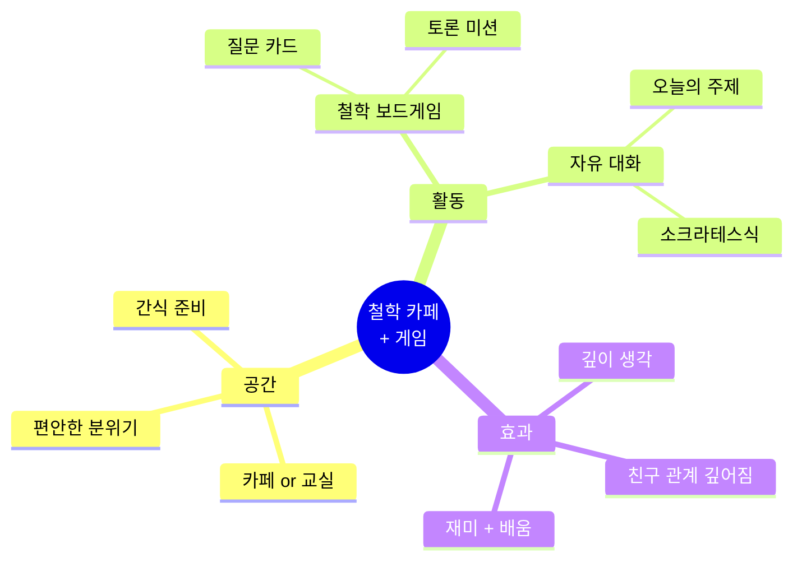
- **문제**: 철학은 지루하고, 게임은 단순함
- **솔루션**: 철학 토론 + 보드게임 결합
  - 월 1회 모임
  - 철학 주제로 게임 (예: 트롤리 딜레마)
  - 간식 먹으면서 자유 토론
- **효과**: 사고력 + 재미 + 친구 관계

---

**#167 인생 시뮬레이션 게임 (Unity)**
- **문제**: 선택이 어려움 (진로, 공부, 연애)
- **솔루션**: 인생 선택 시뮬레이션 게임
  - Unity로 제작
  - 선택마다 결과가 다름
  - 여러 엔딩
- **효과**: 의사결정 훈련, 게임 개발 경험

---

**#168 책 + 게임 융합 프로젝트**
- **문제**: 독서는 지루하고, 게임만 하고 싶음
- **솔루션**: 책을 게임으로 만들기
  - 소설을 선택형 게임으로
  - Twine (텍스트 게임 엔진) 사용
  - 플레이하면서 이야기 이해
- **효과**: 독서 동기, 창작 능력

---

**#169 의미 있는 취미 찾기 챌린지**
- **문제**: 취미는 있는데 의미가 없음
- **솔루션**: 30일 취미 탐험 챌린지
  - 매주 새로운 취미 시도
  - 각 취미에서 "의미" 찾기
  - 일지 작성 & 성찰
- **효과**: 진짜 좋아하는 것 발견

---

**#170 성찰 게임 개발**
- **문제**: 성찰은 어렵고 지루함
- **솔루션**: 성찰을 게임으로
  - 매일 질문 미션
  - 답변하면 경험치 & 레벨업
  - 친구들과 공유 가능
- **효과**: 성찰 습관화 + 재미

---

### 고등학생 (5개)

**#171 철학 게임 개발 스타트업**
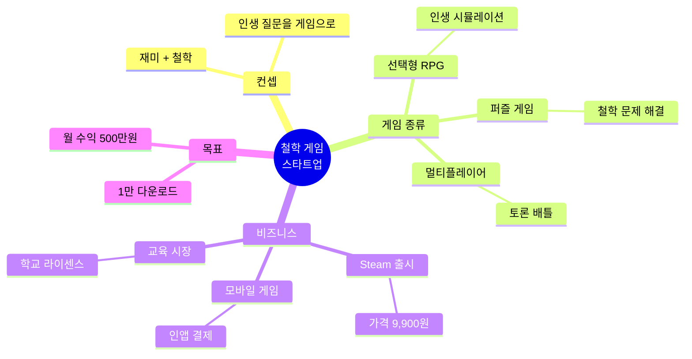
- **문제**: 철학은 지루하다는 편견
- **솔루션**: 철학을 게임으로 만들기
  - Unity/Unreal로 개발
  - 인생 선택 RPG
  - Steam 출시
- **수익 모델**: 게임 판매 9,900원
- **예상 성과**: 1만 다운로드 = 1억원

---

**#172 독서 × 게임 융합 플랫폼**
- **문제**: 독서는 지루하고, 게임은 단순함
- **솔루션**: 책을 게임으로 플레이하는 플랫폼
  - 소설 → 선택형 게임 변환
  - 독자가 주인공이 되어 선택
  - 책 판매 + 게임 판매
- **수익 모델**: 책/게임당 5,000원
- **예상 성과**: 월 100건 = 50만원

---

**#173 의미 있는 여가 큐레이션 서비스**
- **문제**: 여가 시간을 의미없이 보냄
- **솔루션**: 의미 있는 여가 활동 추천
  - AI가 관심사 분석
  - 성찰 + 재미 결합 활동 추천
  - 예: 독서 → 관련 영화 → 토론 모임
- **수익 모델**: 프리미엄 월 5,000원
- **예상 성과**: 500명 = 월 250만원

---

**#174 성찰 콘텐츠 크리에이터**
- **문제**: 유튜브는 재밌는데 의미가 없음
- **솔루션**: 성찰 + 엔터테인먼트 채널
  - 주제: 인생 질문을 재밌게
  - 예: "행복이란 뭘까?" 실험 영상
  - 철학 + VLOG 결합
- **수익 모델**: 광고 + 후원
- **예상 성과**: 구독 5만명 = 월 100만원

---

**#175 라이프 로깅 + 성찰 앱**
- **문제**: 하루를 그냥 보냄
- **솔루션**: 하루를 기록하고 성찰하는 앱
  - 자동 라이프 로깅 (위치, 활동)
  - 저녁에 성찰 질문 제공
  - 의미 있는 하루 만들기
- **수익 모델**: 프리미엄 월 4,900원
- **예상 성과**: 1,000명 = 월 490만원

---

### 대학생 (5개)

**#176 의미 있는 게임 개발 스튜디오**
- **문제**: 게임은 중독만 시킨다는 인식
- **솔루션**: 의미와 재미를 모두 담은 게임
  - 예: 인생 철학 RPG, 사회 문제 시뮬레이션
  - Steam/모바일 출시
  - 교육 시장 공략
- **수익 모델**: 게임 판매 + 라이센스
- **예상 성과**: 게임 1개 × 5만 다운로드 × 만원 = 5억원

---

**#177 철학 콘텐츠 플랫폼**
- **문제**: 철학 콘텐츠가 딱딱하고 재미없음
- **솔루션**: 재밌는 철학 콘텐츠
  - 웹툰, 영상, 게임 등 다양한 형식
  - 유료 구독 모델
  - 크리에이터 커뮤니티
- **수익 모델**: 월 구독 9,900원
- **예상 성과**: 1,000명 = 월 990만원

---

**#178 라이프스타일 디자인 코칭**
- **문제**: 의미 있는 삶을 살고 싶은데 방법 모름
- **솔루션**: 라이프스타일 디자인 코칭
  - 가치관 명확화
  - 이상적 하루 설계
  - 시스템 구축
  - 3개월 코칭 프로그램
- **수익 모델**: 3개월 코스 100만원
- **예상 성과**: 월 10명 = 월 1000만원

---

**#179 의미 있는 취미 큐레이션**
- **문제**: 취미는 있는데 의미가 없음
- **솔루션**: 취미 × 성장 연결
  - AI가 적합 취미 추천
  - 취미 통해 자기 계발
  - 커뮤니티 연결
- **수익 모델**: 프리미엄 월 9,900원
- **예상 성과**: 1,000명 = 월 990만원

---

**#180 성찰 리트릿 운영**
- **문제**: 일상에 치여서 성찰할 시간 없음
- **솔루션**: 2박 3일 성찰 캠프
  - 자연 속에서 디지털 디톡스
  - 철학 세미나 + 명상 + 산책
  - 인생 질문 탐구
  - 개인 미션 수행
- **수익 모델**: 1회 50만원
- **예상 성과**: 월 2회 × 20명 = 월 2000만원

---

## 🌈 Part 5: 5개 영역 완전 통합 (20개)

> **핵심 아이디어**: 모든 영역을 아우르는 완전한 라이프스타일 혁명!

### 초등학생 (5개)

**#181 꿈의 마을 만들기 프로젝트**
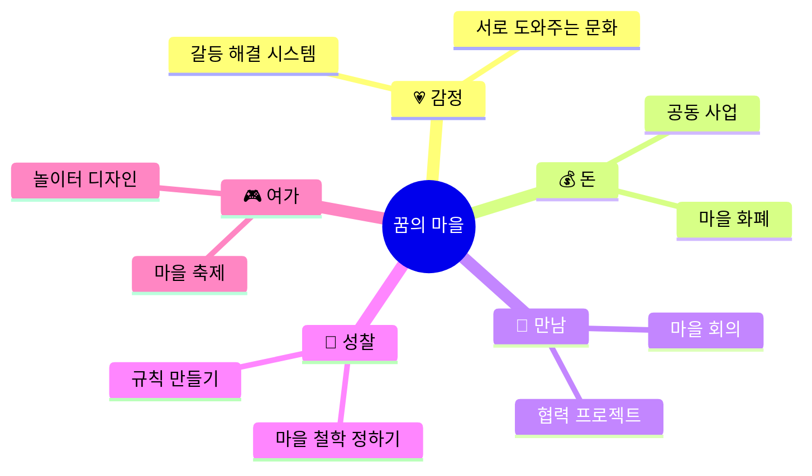
- **통합 아이디어**: 이상적인 마을을 직접 설계하고 운영
- **5대 영역 모두 포함**:
  - 💗 감정: 갈등 해결 시스템
  - 💰 돈: 마을 경제 (화폐, 사업)
  - 🤝 만남: 마을 회의, 협력
  - 🧘 성찰: 마을 철학, 가치관
  - 🎮 여가: 마을 축제, 놀이
- **구현**: 마인크래프트 or 실제 학교 프로젝트
- **효과**: 사회 시스템 이해, 협력, 창의성

---

**#182 우리 반 유토피아 실험**
- **문제**: 반에 여러 문제가 많음
- **솔루션**: 이상적인 학급 만들기
  - 감정: 서로 위로하는 문화
  - 돈: 반 경제 시스템
  - 만남: 모두가 친구
  - 성찰: 우리가 원하는 것
  - 여가: 재밌는 활동
- **기간**: 한 학기 실험
- **효과**: 학급 분위기 개선

---

**#183 나만의 라이프스타일 디자인**
- **문제**: 어떻게 살아야 할지 모름
- **솔루션**: 이상적인 하루 설계
  - 감정: 언제 행복한가?
  - 돈: 용돈을 어떻게 쓸까?
  - 만남: 누구와 시간 보낼까?
  - 성찰: 왜 사는가?
  - 여가: 무엇을 즐길까?
- **결과**: 나만의 생활 철학

---

**#184 가족 프로젝트: 행복 설계**
- **통합**: 가족이 함께 행복 찾기
  - 감정: 서로 감정 이해
  - 돈: 가족 수익 프로젝트
  - 만남: 가족 대화 시간
  - 성찰: 가족 가치관
  - 여가: 가족 여가 활동
- **효과**: 가족 관계 개선

---

**#185 미래의 나 프로젝트**
- **통합**: 10년 후 나의 모습
  - 감정: 어떤 감정으로 살까?
  - 돈: 어떻게 돈을 벌까?
  - 만남: 누구와 함께할까?
  - 성찰: 무엇이 중요할까?
  - 여가: 무엇을 즐길까?
- **결과**: 미래 비전 그리기

---

### 중학생 (5개)

**#186 학교 혁신 프로젝트**
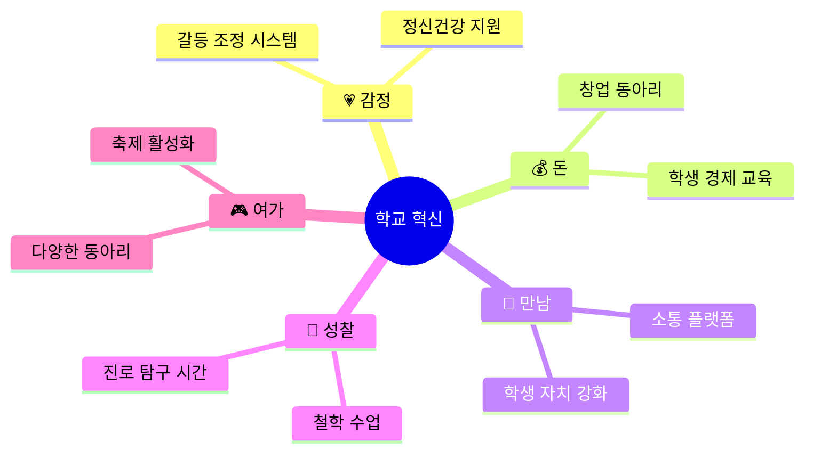
- **문제**: 학교 시스템이 낡고 문제가 많음
- **솔루션**: 학생들이 직접 학교 혁신 제안
  - 💗 감정: 상담실 확대, 또래 상담
  - 💰 돈: 경제 교육, 창업 동아리
  - 🤝 만남: 학생회 개혁, 소통 앱
  - 🧘 성찰: 진로 탐구, 철학 토론
  - 🎮 여가: 동아리 다양화, 축제
- **실행**: 교장 선생님께 제안서 제출
- **예상 효과**: 학교 문화 개선

---

**#187 소셜 벤처: 청소년 웰빙 플랫폼**
- **통합 비즈니스**: 청소년 종합 지원
  - 감정: 정신건강 케어
  - 돈: 용돈벌이 기회 제공
  - 만남: 친구 매칭 & 커뮤니티
  - 성찰: 진로 상담 & 워크숍
  - 여가: 문화 체험 기획
- **수익 모델**: 프리미엄 월 5,000원
- **예상 성과**: 1,000명 = 월 500만원

---

**#188 라이프스타일 실험 프로젝트**
- **통합**: 3개월간 새로운 삶의 방식 실험
  - Week 1-4: 감정 중심 (힐링)
  - Week 5-8: 돈 중심 (수익 창출)
  - Week 9-12: 통합 라이프스타일
- **기록**: 블로그 or 유튜브
- **효과**: 자기 이해, 최적 라이프스타일 발견

---

**#189 마을 공동체 활성화**
- **통합**: 동네를 더 좋은 곳으로
  - 감정: 이웃 위로 프로젝트
  - 돈: 마을 공동체 사업
  - 만남: 세대 간 교류
  - 성찰: 마을 비전 워크숍
  - 여가: 마을 축제 기획
- **효과**: 지역 사회 기여

---

**#190 개인 성장 시스템 구축**
- **통합**: 나만의 성장 시스템
  - 감정: 감정 관리 루틴
  - 돈: 수익 시스템 (재능 활용)
  - 만남: 네트워킹 전략
  - 성찰: 성찰 습관
  - 여가: 의미 있는 취미
- **결과**: 지속 가능한 성장 시스템

---

### 고등학생 (5개)

**#191 통합 라이프스타일 플랫폼**
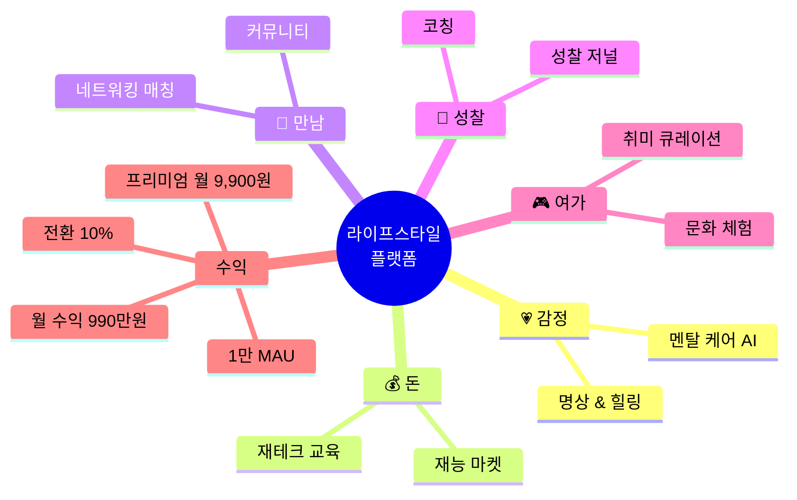
- **통합 비즈니스**: 모든 것을 한 곳에서
  - 감정: AI 심리 상담
  - 돈: 재능 거래 마켓
  - 만남: 네트워킹 이벤트
  - 성찰: 성찰 도구 & 코칭
  - 여가: 취미 추천 & 큐레이션
- **수익 모델**: 프리미엄 월 9,900원
- **예상 성과**: 1만 MAU, 10% 전환 = 월 990만원

---

**#192 청년 웰빙 스타트업**
- **통합**: 청년 삶의 질 향상
  - 감정: 번아웃 예방
  - 돈: 경제적 자립 지원
  - 만남: 또래 네트워크
  - 성찰: 진로 & 가치관
  - 여가: 워라밸 문화
- **비즈니스**: B2B (기업) + B2C (개인)
- **예상 성과**: 월 매출 3000만원

---

**#193 소셜 임팩트 스타트업**
- **통합**: 사회 문제 × 비즈니스
  - 감정: 소외계층 정서 지원
  - 돈: 수익 모델 (지속가능)
  - 만남: 커뮤니티 빌딩
  - 성찰: 사회적 가치 추구
  - 여가: 문화 접근성 향상
- **예상 성과**: 임팩트 + 수익

---

**#194 개인 브랜드 구축**
- **통합**: 나를 브랜드로
  - 감정: 진정성 있는 메시지
  - 돈: 수익화 (강의, 제품)
  - 만남: 팬 커뮤니티
  - 성찰: 나만의 철학
  - 여가: 즐기면서 일하기
- **채널**: 유튜브, 블로그, SNS
- **예상 성과**: 월 수익 500만원

---

**#195 라이프스타일 실험 기록**
- **통합**: 1년간 라이프스타일 실험
  - 매달 다른 영역 집중
  - 블로그/유튜브 기록
  - 책으로 출판
- **수익**: 광고 + 책 판매
- **예상 성과**: 월 100만원 + 책 인세

---

### 대학생 (5개)

**#196 완전 통합 라이프 플랫폼**
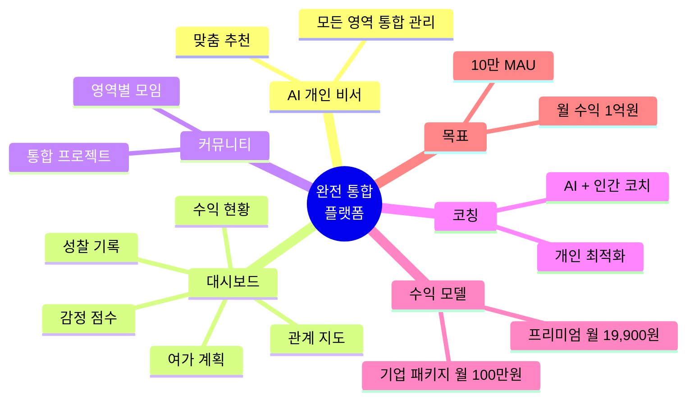
- **비전**: 삶의 모든 영역을 통합 관리하는 슈퍼 앱
- **기능**:
  - 💗 감정: AI 심리 분석 & 케어
  - 💰 돈: 수익 추적 & 재테크
  - 🤝 만남: 관계 관리 & 매칭
  - 🧘 성찰: 성찰 도구 & 코칭
  - 🎮 여가: 취미 큐레이션
- **AI 개인 비서**: 모든 영역 최적화
- **수익 모델**: 
  - B2C 프리미엄 월 19,900원
  - B2B 기업 패키지 월 100만원
- **목표**: 10만 MAU, 월 매출 1억원

---

**#197 라이프스타일 디자인 컨설팅**
- **통합 서비스**: 삶을 다시 설계
  - 3개월 프로그램
  - 5대 영역 모두 최적화
  - 개인 맞춤 시스템 구축
- **수익**: 3개월 200만원
- **예상 성과**: 월 10명 = 월 2000만원

---

**#198 소셜 벤처: 웰빙 이코노미**
- **통합 비즈니스**: 웰빙 × 수익
  - 감정: 정신건강 서비스
  - 돈: 수익 모델
  - 만남: 커뮤니티
  - 성찰: 의미 추구
  - 여가: 문화
- **목표**: 임팩트 + 수익 + 지속가능성
- **예상 성과**: 월 매출 5000만원

---

**#199 개인 성장 교육 비즈니스**
- **통합**: 모든 영역 교육
  - 온라인 코스
  - 1:1 코칭
  - 그룹 워크숍
  - 리트릿
- **수익**: 다중 수익원
- **예상 성과**: 월 3000만원

---

**#200 라이프스타일 혁명 운동**
- **비전**: 사회 전체의 라이프스타일 변화
  - 5대 영역 통합 삶
  - 커뮤니티 확산
  - 정책 제안
  - 문화 변화
- **수익**: 책, 강의, 컨설팅
- **목표**: 소셜 임팩트 + 지속가능한 비즈니스

---

## 🎯 융합 프로젝트 활용 가이드

### 선택 방법

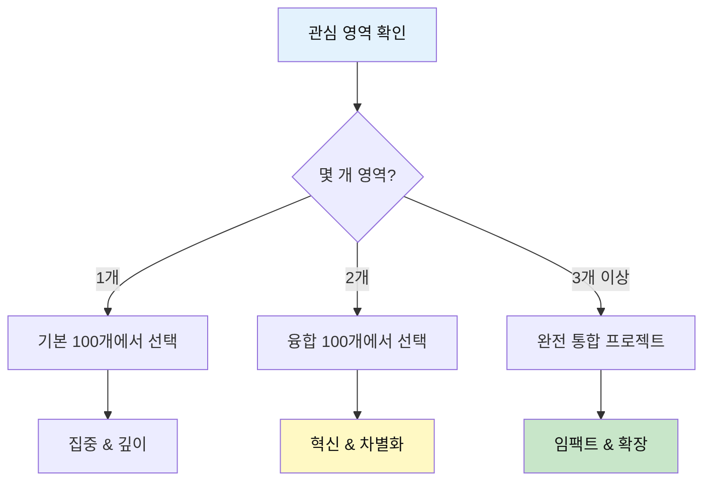

### 난이도별 추천

| 레벨 | 추천 융합 | 프로젝트 번호 | 이유 |
|------|----------|-------------|------|
| **초등** | 감정+만남 | #121-#125 | 이해하기 쉽고 효과 즉각적 |
| **중등** | 돈+만남 | #146-#150 | 실용적이고 수익 가능 |
| **고등** | 성찰+여가 | #171-#175 | 깊이 + 창의성 |
| **대학** | 5개 통합 | #196-#200 | 완전한 비즈니스 모델 |

### 공모전 매칭

| 융합 유형 | 추천 공모전 | 프로젝트 예시 |
|----------|----------|-------------|
| 💗×💰 | 소셜 벤처 대회 | #111 정신건강 플랫폼 |
| 💗×🤝 | 사회 혁신 공모전 | #136 커뮤니티 플랫폼 |
| 💰×🤝 | 창업 경진대회 | #156 프리랜서 네트워크 |
| 🧘×🎮 | 콘텐츠 공모전 | #176 의미있는 게임 |
| 5개 통합 | 메가 공모전 | #196 완전 통합 플랫폼 |

---

## 💡 성공 전략

### 3단계 접근

```
1단계: 단일 영역 프로젝트로 시작 (기본 100개)
   └─ 경험 축적, 포트폴리오 구축

2단계: 2개 영역 융합 (융합 100개)
   └─ 차별화, 혁신 포인트 발견

3단계: 5개 영역 통합 (완전 통합)
   └─ 메가 임팩트, 스케일업
```

### 팀 구성 팁

**융합 프로젝트는 팀이 유리!**

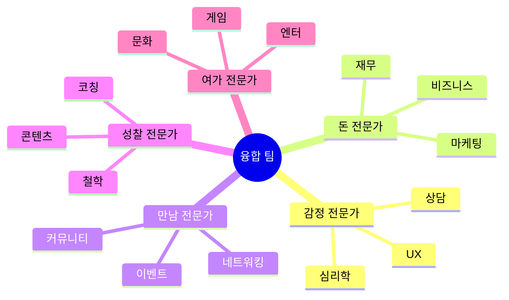

---

**"영역을 넘나들면 혁신이 일어난다!"** 🌈

**Part 1 기본 100개 + Part 2 융합 100개 = 총 200개 실전 프로젝트! 🚀**
