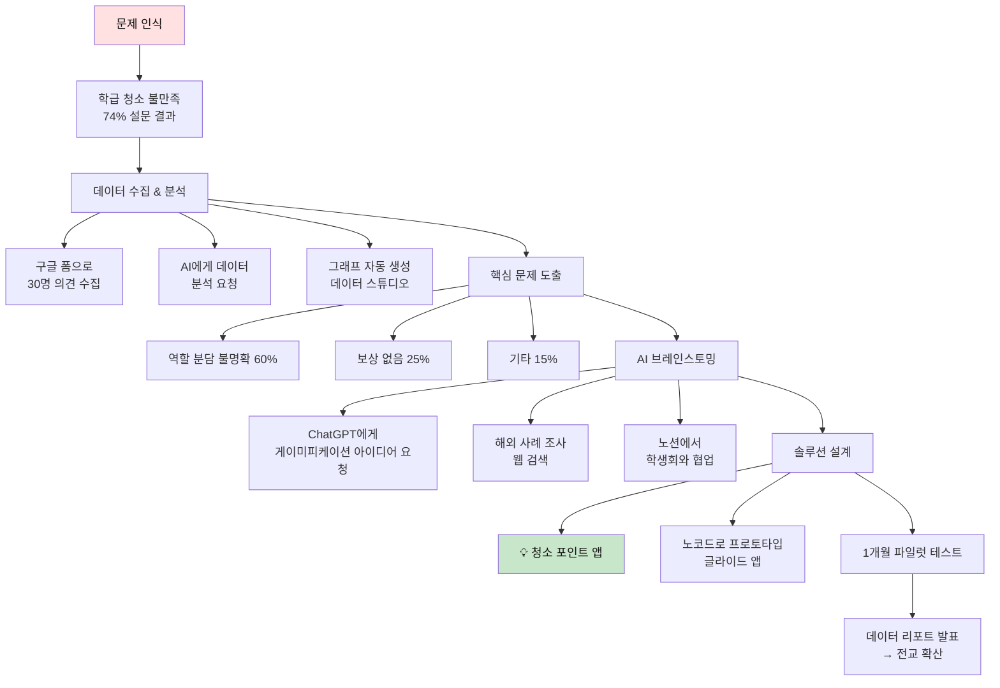

```mermaid
gantt
    title 지우의 하루 (평일)
    dateFormat HH:mm
    axisFormat %H:%M
    
    section 아침
    기상 & 준비           :07:00, 1h
    등교                  :08:00, 30m
    
    section 학교
    1-4교시(국·수·사·과) :08:30, 4h
    점심시간             :12:30, 1h
    5-6교시(SW·미술)     :13:30, 2h
    메이커 동아리        :15:30, 1h
    
    section 저녁
    하교 & 간식          :16:30, 1h
    AI 학습앱으로 숙제   :17:30, 40m
    유튜브/쇼츠 시청     :18:10, 20m
    AI 그림 만들기       :18:30, 1h
    저녁 & 휴식          :19:30, 2h
    웹툰 읽기            :21:30, 30m
    취침                 :22:00, 1h
```

```mermaid
gantt
    title 민준이의 하루 (평일)
    dateFormat HH:mm
    axisFormat %H:%M
    
    section 아침
    기상 & 준비           :07:00, 1h
    등교                  :08:00, 30m
    
    section 학교
    1-4교시              :08:30, 4h
    점심시간             :12:30, 1h
    5-6교시(코딩·체육)   :13:30, 2h
    로봇 동아리          :15:30, 1h
    
    section 저녁
    하교 & 간식          :16:30, 1h
    AI로 숙제 도움받기   :17:30, 40m
    엔트리 코딩 연습     :18:10, 50m
    저녁 & 가족시간      :19:00, 1.5h
    유튜브(과학·메이커)  :20:30, 40m
    마인크래프트        :21:10, 50m
    취침                 :22:00, 1h
```

```mermaid
gantt
    title 재현이의 하루 (평일)
    dateFormat HH:mm
    axisFormat %H:%M
    
    section 아침
    기상 & 준비           :06:30, 1h
    등교                  :07:30, 30m
    
    section 학교
    1-7교시              :08:00, 7.5h
    
    section 저녁
    하교 & 저녁          :15:30, 2h
    학원(수학,영어)      :17:30, 4h
    야식 & 휴식          :21:30, 30m
    웹툰 보기            :22:00, 30m
    AI 그림 생성         :22:30, 40m
    프로크리에이트 편집  :23:10, 50m
    취침                 :00:00, 1h
```

```mermaid
gantt
    title 현우의 하루 (평일)
    dateFormat HH:mm
    axisFormat %H:%M
    
    section 아침
    기상 & 뉴스레터      :06:00, 1h
    등교                  :07:00, 30m
    
    section 학교
    0교시                :07:30, 1h
    1-7교시              :08:30, 7.5h
    
    section 저녁
    하교 & 저녁          :16:00, 2h
    학원(국영수)         :18:00, 3h
    야식                 :21:00, 30m
    AI로 과제 요약       :21:30, 30m
    독서(경영서)         :22:00, 40m
    노코드 개발          :22:40, 1.5h
    팀 미팅(온라인)      :00:10, 20m
    취침                 :00:30, 1h
```

```mermaid
gantt
    title 수진이의 하루 (평일)
    dateFormat HH:mm
    axisFormat %H:%M
    
    section 아침
    기상 & 아침 독서     :05:30, 1h
    AI와 철학 대화       :06:30, 30m
    등교                 :07:00, 30m
    
    section 학교
    0교시                :07:30, 1h
    1-7교시              :08:30, 7.5h
    자율학습             :16:00, 2h
    
    section 저녁
    하교 & 저녁          :18:00, 1.5h
    학원(논술)           :19:30, 3h
    AI로 논문 요약       :22:30, 30m
    독서 & 노트 정리     :23:00, 1h
    에세이 쓰기          :00:00, 1h
    옵시디언 지식 연결   :01:00, 30m
    취침                 :01:30, 1h
```

```mermaid
gantt
    title 동현이의 하루 (평일)
    dateFormat HH:mm
    axisFormat %H:%M
    
    section 아침
    기상 & 지표 확인     :07:00, 1h
    AI 뉴스레터 정리     :08:00, 30m
    등교                 :08:30, 30m
    
    section 학교
    전공 수업(AI 융합)   :09:00, 3h
    점심 & 온라인 미팅   :12:00, 1.5h
    오후 수업            :13:30, 3h
    
    section 저녁
    카페 이동            :16:30, 30m
    AI API 개발          :17:00, 3h
    저녁                 :20:00, 1h
    고객 피드백 분석     :21:00, 1h
    코딩 / 버그 수정     :22:00, 2h
    트위터 네트워킹      :00:00, 30m
    취침                 :00:30, 1h
```

# 학년별 페르소나 & 생활패턴 가이드 (AI 세대 특화판)

> **목적**: 한국 AI 세대 학생의 실제 생활패턴 기반 프로젝트 기획  
> **방법**: 페르소나별 일상 → 문제 발견 → AI/메이커 솔루션 설계  
> **특징**: 블록코딩, 메이커 활동, AI 도구 활용이 일상화된 디지털 네이티브 세대 반영

---

## 🌐 2026년 한국 교육 환경

### 디지털·AI 교육 현황
- **AI 디지털 교과서**: 2025년 도입, 2028년까지 전 과목 확대 예정
- **SW·코딩 교육**: 초·중·고 필수/선택 과목으로 확대 (스크래치, 엔트리, 파이썬)
- **메이커 교육**: 학교 메이커 스페이스, 로봇/드론/3D프린팅 체험 활성화
- **AI 윤리 교육**: 디지털 리터러시, AI 윤리, 저작권 교육 강화

### 학생 디지털 생활 특징
- **초등**: 블록코딩, 교육용 로봇, AI 그림/음성 체험
- **중등**: SNS 활동 증가, 콘텐츠 창작 욕구, 메이커 동아리
- **고등**: AI 학습 도구 활용, 효율성 중시, 자기주도 학습
- **공통**: 유튜브/쇼츠 소비, 게임, AI 생성 도구 사용 일상화

---

## 📊 전체 구조 마인드맵 (AI 세대)


---

## 🌱 초등학생 페르소나 (2명)

### 페르소나 1: AI 크리에이터 지우 (초4, 여학생)

#### 📋 기본 정보
- **나이**: 10세, 초등학교 4학년
- **성격**: 감수성 풍부, 디지털 창작 좋아함, 공유 욕구 강함
- **관심 분야**: 💗 감정 + 🎮 창작 (친구 관계, AI 그림, 디지털 콘텐츠)
- **디지털 활용**: AI 그림 생성 앱, 스크래치 주니어, 유튜브 키즈, 패들렛
- **좋아하는 것**: AI로 그림 만들기, 웹툰 보기, 친구들에게 작품 공유하기
- **고민**: "AI가 그려준 그림을 친구들한테 보여줬는데, 내가 그린 게 아니라고 해서 속상해요"
- **메이커 경험**: 학교 메이커 데이에서 종이회로 카드 만들기, LED 배지 제작

#### 🕐 하루 생활 패턴 (2026년 기준)



#### 📱 디지털 도구 사용 패턴
- **AI 도구**: 뤼튼(Wrtn), 빙 이미지 크리에이터, 캔바 AI
- **학습 앱**: EBS 초등, AI 펭톡(영어), 똑똑 수학탐험대
- **창작 도구**: 스크래치 주니어, 틴커캐드(3D 디자인 입문)
- **소통**: 부모님 카톡, 학급 패들렛
- **일일 스크린 타임**: 평균 2-3시간 (부모 관리 앱으로 제한)

#### 💭 사고 과정 (AI 활용 창작)


#### 📚 추천 프로젝트 (AI 시대 특화)
1. **#2 AI 감정 카드 메이커** - AI로 위로 이미지 만들고 손편지 추가
2. **#6 디지털 우는 나무** - 마이크로비트로 감정 센서 트리 만들기
3. **하이브리드 아트북** - AI 그림 + 손그림 융합 작품집
4. **스크래치로 감정 게임** - 감정 표현 배우는 인터랙티브 게임

#### 📖 추천 독서 (💗 감정 + 🤖 AI 윤리)
- 100만 번 산 고양이 (감성)
- 로봇 친구 (AI와 우정)
- 내 친구 인공지능 (초등 AI 윤리)
- 디지털 시민학교 (온라인 에티켓)

---

### 페르소나 2: 메이커 엔지니어 민준 (초5, 남학생)

#### 📋 기본 정보
- **나이**: 11세, 초등학교 5학년
- **성격**: 호기심 많음, 만드는 것 좋아함, 실험 정신 강함
- **관심 분야**: 🎮 창작 + 🧘 탐구 (로봇, 코딩, 과학 실험)
- **디지털 활용**: 엔트리 코딩, 마인크래프트 레드스톤, 아두이노 입문, ChatGPT 질문
- **좋아하는 것**: 레고 로보틱스, 과학 유튜브(도티, 침착맨 과학), 메이커 키트 조립
- **고민**: "로봇 대회 나가고 싶은데 혼자서는 프로그래밍이 어려워요. AI한테 물어봐도 이해가 안 돼요"
- **메이커 경험**: 학교 코딩 동아리, 지역 메이커 스페이스에서 드론 조립, 3D 펜으로 작품 제작

#### 🕐 하루 생활 패턴 (2026년 기준)



#### 📱 디지털 도구 사용 패턴
- **코딩 도구**: 엔트리, 스크래치, 마인크래프트 에듀케이션
- **AI 도구**: ChatGPT(궁금증 해결), 퍼플렉시티(조사), 뤼튼
- **메이커 도구**: 틴커캐드(3D 설계), 아두이노 IDE(로봇 코드)
- **학습**: 유튜브(과학 채널), EBS 다큐, 나무위키
- **일일 스크린 타임**: 평균 3-4시간 (창작/학습 중심)

#### 💭 사고 과정 (AI 협업 메이킹)


#### 📚 추천 프로젝트 (AI 시대 특화)
1. **#7 AI 질문왕 챌린지** - 효과적인 프롬프트 연습
2. **#25 디지털 트윈 학교** - 마인크래프트로 학교 재현
3. **로봇 + AI 융합** - 라인트레이서에 ChatGPT 연동
4. **메이커 유튜버** - 제작 과정 촬영 및 공유
5. **엔트리로 AI 학습** - 이미지 분류 모델 만들기

#### 📖 추천 독서 (🎮 창작 + 🤖 AI)
- Why? 코딩 시리즈
- 인공지능과 놀자
- 메이커 다은쌤의 코딩 레시피
- 생각의 탄생 (창의성)
- 로봇 시대, 인간의 일 (진로)

---

## 🌿 중학생 페르소나 (2명)

### 페르소나 3: 디지털 리더 서연 (중2, 여학생)

#### 📋 기본 정보
- **나이**: 14세, 중학교 2학년
- **성격**: 책임감 강함, 효율성 중시, 디지털 도구 활용 능숙
- **관심 분야**: 🤝 만남 + 💰 임팩트 (학급 자치, 소셜 벤처, 시빅 테크)
- **디지털 활용**: 노션(학생회 관리), 구글 폼(설문), 패들렛, 디스코드(학급 소통)
- **좋아하는 것**: 토론, 데이터 기반 의사결정, 환경·사회 이슈, 앱 기획
- **고민**: "설문 조사 결과는 나왔는데, 이걸 어떻게 시각화하고 설득력 있게 전달하지? AI가 도와줄 수 있을까?"
- **메이커 경험**: 학생회 웹사이트 구축(노코드), 교내 재활용 캠페인 앱 기획

#### 🕐 하루 생활 패턴 (2026년 기준)


#### 📱 디지털 도구 사용 패턴
- **생산성 도구**: 노션(프로젝트 관리), 트렐로, 구글 워크스페이스
- **AI 도구**: ChatGPT(보고서 초안), 뤼튼(아이디어 브레인스토밍), Notion AI
- **학습 도구**: AI 튜터링 앱(매쓰플랫, 퀀다), AI 디지털 교과서
- **소통**: 디스코드(학급), 인스타그램(학생회 홍보), 단체 카톡
- **분석**: 구글 데이터 스튜디오(설문 시각화), 엑셀 파워쿼리
- **일일 스크린 타임**: 평균 5-6시간 (학습+소통 중심, 관리 필요)

#### 💭 사고 과정 (데이터 기반 의사결정)



#### 📚 추천 프로젝트 (AI 시대 특화)
1. **#35 학급 민주주의 앱** - 노코드로 안건 제안·투표 플랫폼 제작
2. **#38 AI 의견 분석 시스템** - 자유 의견을 AI로 카테고리 분류
3. **데이터 기반 학생회** - 대시보드로 학교 문제 시각화
4. **시빅 테크 프로젝트** - 지역 사회 문제 해결 앱
5. **소셜 임팩트 측정** - 캠페인 효과를 데이터로 증명

#### 📖 추천 독서 (🤝 만남 + 💰 임팩트)
- 정의란 무엇인가 (철학)
- 넛지 (행동경제학)
- 린 스타트업 (프로토타입)
- 소셜 임팩트를 위한 데이터 과학
- 10대를 위한 시빅 테크 입문

---

### 페르소나 4: AI 웹툰 크리에이터 재현 (중3, 남학생)

#### 📋 기본 정보
- **나이**: 15세, 중학교 3학년
- **성격**: 상상력 풍부, 내향적, AI 도구 활용 적극적
- **관심 분야**: 🎮 창작 + 💗 감정 (웹툰, AI 아트, 스토리텔링)
- **디지털 활용**: 미드저니(배경), 스테이블 디퓨전(캐릭터), 클립스튜디오(편집), ChatGPT(스토리)
- **좋아하는 것**: AI 그림 생성, 웹툰 보기, 게임 스토리 분석, 프로크리에이트로 그리기
- **고민**: "AI로 그림을 빠르게 만들 수 있지만, 이게 진짜 내 작품일까? 웹툰 작가가 되려면 모든 걸 손으로 그려야 하나?"
- **메이커 경험**: 학교 예술제에서 AI 협업 웹툰 전시, 클래스101에서 디지털 드로잉 강의 수강

#### 🕐 하루 생활 패턴 (2026년 기준)



#### 📱 디지털 도구 사용 패턴
- **AI 창작 도구**: 미드저니, 스테이블 디퓨전, 노블AI(스토리), ChatGPT(대사)
- **그리기 도구**: 프로크리에이트(아이패드), 클립스튜디오, 포토샵
- **학습**: 유튜브(웹툰 강좌), 클래스101, 네이버 웹툰 도전만화 분석
- **영감**: 인스타그램(아티스트 팔로우), 핀터레스트, 아트스테이션
- **협업**: 디스코드(웹툰 동아리), 노션(스토리보드)
- **일일 스크린 타임**: 평균 4-5시간 (창작 중심, 주말엔 8시간+)

#### 💭 사고 과정 (AI 협업 창작)


#### 📚 추천 프로젝트 (AI 시대 특화)
1. **#47 AI 협업 웹툰 연재** - 도전만화에 16주 프로젝트
2. **#48 크리에이터 브이로그** - AI 창작 과정 공유 (유튜브 쇼츠)
3. **AI 아트 포트폴리오** - 예술고/애니고 입시 대비
4. **캐릭터 IP 개발** - AI로 다양한 버전 실험 후 굿즈 제작
5. **인터랙티브 스토리** - AI와 대화하는 웹소설

#### 📖 추천 독서 (🎮 창작 + 🤖 AI 윤리)
- 스토리 천재가 된 홍대리 (스토리텔링)
- AI 시대의 예술과 창작
- 생각의 탄생 (창의성)
- 백년의 고독 (서사 구조)
- AI는 인간을 넘어서는가 (철학)

---

## 🌳 고등학생 페르소나 (2명)

### 페르소나 5: 노코드 창업가 현우 (고2, 남학생)

#### 📋 기본 정보
- **나이**: 17세, 고등학교 2학년
- **성격**: 실행력 강함, 기술 활용 능숙, MVP 사고방식
- **관심 분야**: 💰 돈 + 🤝 임팩트 (노코드 창업, AI 비즈니스, 소셜 벤처)
- **디지털 활용**: 버블(웹앱), 플러터플로우(앱), ChatGPT(기획), 피그마(디자인), 노션(PM)
- **좋아하는 것**: 경영 서적, Y Combinator 영상, 해커톤, 린 스타트업 실험
- **고민**: "AI 도구로 빠르게 만들 수 있지만, 진짜 개발자가 아닌데 스타트업을 할 수 있을까? 코딩 없이도 경쟁력이 있을까?"
- **메이커 경험**: 교내 창업 동아리, 노코드 해커톤 수상, 학생 대상 설문 앱 제작·런칭

#### 🕐 하루 생활 패턴 (2026년 기준)



#### 📱 디지털 도구 사용 패턴
- **노코드 개발**: 버블, 글라이드, 소프트르, 웹플로우
- **AI 도구**: ChatGPT(기획서), Claude(코드 리뷰), 뤼튼(마케팅 문구), Notion AI
- **디자인**: 피그마, 캔바, 미드저니(목업)
- **협업**: 슬랙(팀 소통), 노션(문서화), 트렐로(태스크)
- **학습**: AI 튜터링 앱(매쓰플랫, 리딩게이트), 유튜브(스타트업 강의)
- **분석**: 구글 애널리틱스, 핫자(히트맵), 타입폼(설문)
- **일일 스크린 타임**: 평균 6-8시간 (개발+학습, 수면 부족 경향)

#### 💭 사고 과정 (AI 시대 노코드 창업)


#### 📚 추천 프로젝트 (AI 시대 특화)
1. **#56 AI 기반 소셜 벤처** - 교육·진로·멘탈헬스 문제 해결
2. **#58 노코드 SaaS 창업** - 학생용 생산성 도구
3. **프롬프트 엔지니어링 컨설팅** - 학교·학원 대상
4. **AI 에이전트 마켓플레이스** - GPTs 판매
5. **하이퍼로컬 커뮤니티 앱** - 우리 학교 전용 플랫폼

#### 📖 추천 독서 (💰 돈 + 🤖 AI)
- 린 스타트업 (방법론)
- 제로 투 원 (혁신)
- 노코드로 1인 창업하기
- AI 시대의 비즈니스 모델
- 그로스 해킹 (성장 전략)
- The Lean AI (AI 스타트업)

---

### 페르소나 6: AI 시대 사색가 수진 (고3, 여학생)

#### 📋 기본 정보
- **나이**: 18세, 고등학교 3학년
- **성격**: 깊은 사고, AI와 대화하며 성찰, 비판적 사고 강함
- **관심 분야**: 🧘 성찰 + 💗 감정 (AI 철학, 디지털 인문학, 기술 윤리)
- **디지털 활용**: Claude(철학 대화), Perplexity(논문 조사), 노션(독서 노트), 옵시디언(지식 연결)
- **좋아하는 것**: 철학책, AI와 소크라테스식 대화, 에세이 쓰기, 북클럽
- **고민**: "AI에게 철학 질문을 하면 너무 잘 대답해줘서 오히려 내 생각이 사라지는 느낌이에요. AI와 함께 사유한다는 게 가능할까?"
- **메이커 경험**: 학술제에서 'AI 시대의 자유의지' 논문 발표, 온라인 철학 독서 모임 운영

#### 🕐 하루 생활 패턴 (2026년 기준)



#### 📱 디지털 도구 사용 패턴
- **AI 대화**: Claude(철학 토론), ChatGPT(개념 설명), Perplexity(논문 검색)
- **지식 관리**: 옵시디언(제텔카스텐), 노션(독서 노트), 로그시크(연결망)
- **학습**: AI 튜터(수능 국어·영어), 논술 첨삭 AI, Semantic Scholar
- **글쓰기**: Grammarly(영어), QuillBot(문장 다듬기), DeepL(번역)
- **사색**: Forest(집중), Calm(명상), 전자책 리더
- **일일 스크린 타임**: 평균 5-6시간 (학습·사색 중심, 수면 부족 심각)

#### 💭 사고 과정 (AI와 함께 사유하기)


#### 📚 추천 프로젝트 (AI 시대 특화)
1. **#66 AI 철학 카페** - AI를 소크라테스 삼아 토론
2. **#70 기술 윤리 리서치** - AI 편향성, AGI 안전성 분석
3. **디지털 제텔카스텐** - 옵시디언으로 1000개 노트 연결
4. **AI 시대 인문학 에세이 시리즈** - 16주 집필 프로젝트
5. **온라인 철학 독서 모임** - 디스코드 커뮤니티 운영

#### 📖 추천 독서 (🧘 성찰 + 🤖 AI 철학)
- 이방인 (실존주의)
- 사피엔스 / 호모 데우스 (기술과 인간)
- AI 윤리 (AI 도덕성)
- 생각에 관한 생각 (인지편향)
- 정의란 무엇인가 (윤리)
- 슈퍼인텔리전스 (AI 미래)
- 라이프 3.0 (AI 철학)

---

## 🚀 대학생 페르소나 (2명)

### 페르소나 7: AI 스타트업 파운더 동현 (대2, 남학생)

#### 📋 기본 정보
- **나이**: 21세, 대학교 2학년 (경영학과 + AI 융합전공)
- **성격**: 열정적, 빠른 실행력, AI 네이티브 세대
- **관심 분야**: 💰 돈 + 🤝 임팩트 (AI 스타트업, 에이전트 비즈니스, 자동화)
- **디지털 활용**: ChatGPT API(서비스 개발), 버셀(배포), 스트라이프(결제), 린어(분석)
- **좋아하는 것**: AI 해커톤, Y Combinator 영상, 트위터(X) 테크 커뮤니티, 사이드 프로젝트
- **고민**: "AI 에이전트 서비스를 만들었는데, 너무 빠르게 경쟁자가 생겨요. 6개월 후엔 GPT가 내 서비스를 무료로 제공할 것 같아요"
- **메이커 경험**: 노코드+AI 결합 SaaS 2개 런칭, MRR $500 달성, 대학 창업 지원 프로그램 선정

#### 🕐 하루 생활 패턴 (2026년 기준)



#### 📱 디지털 도구 사용 패턴
- **개발**: Cursor(AI 코딩), ChatGPT API, Claude API, 버셀(배포), 깃허브
- **노코드**: 버블, 웹플로우, 자피어(자동화), 메이크(통합)
- **비즈니스**: 스트라이프(결제), 레몬스쿼지(판매), 타입폼(랜딩)
- **분석**: 포스트호그(행동 분석), 구글 애널리틱스, 핫자
- **협업**: 슬랙, 노션, 리니어(이슈 트래킹), 피그마
- **학습**: 트위터(X), 레딧(r/SideProject), 유튜브(테크 트렌드)
- **일일 스크린 타임**: 평균 10-14시간 (창업 중심 생활)

#### 💭 사고 과정 (AI 시대 초고속 창업)


#### 📚 추천 프로젝트 (AI 시대 특화)
1. **#79 AI 에이전트 SaaS** - GPT Wrapper 넘어선 가치
2. **#81 AI 자동화 비즈니스** - 반복 업무 자동화
3. **인디 해커 스타일 사업** - 1인 개발 MRR $10K 목표
4. **오픈소스 + 유료 모델** - 커뮤니티 기반 성장
5. **AI 컨설팅 에이전시** - 기업 AI 도입 지원

#### 📖 추천 독서 (💰 돈 + 🤖 AI)
- 린 스타트업 (방법론)
- 제로 투 원 (혁신)
- The Indie Hacker Handbook
- $100M Offers (포지셔닝)
- AI 슈퍼파워 (AI 전략)
- Traction (성장 채널)
- The Mom Test (고객 인터뷰)

---

### 페르소나 8: AI 콘텐츠 크리에이터 예은 (대3, 여학생)

#### 📋 기본 정보
- **나이**: 22세, 대학교 3학년 (미디어학과 + 데이터과학 복수전공)
- **성격**: 창의적, 분석적, AI 도구 마스터
- **관심 분야**: 🎮 창작 + 💰 수익화 (AI 콘텐츠, 1인 크리에이터 비즈니스)
- **디지털 활용**: 프리미어(편집), 미드저니(썸네일), RunwayML(영상 AI), ElevenLabs(AI 더빙)
- **좋아하는 것**: 영상 편집, AI 생성 콘텐츠, 데이터 분석, 크리에이터 이코노미
- **고민**: "AI로 콘텐츠를 10배 빠르게 만들 수 있지만, 다들 AI를 쓰니까 경쟁이 더 심해졌어요. 어떻게 차별화하죠?"
- **메이커 경험**: 유튜브 구독자 3만, 인스타 팔로워 1.5만, AI 콘텐츠 제작 강의 판매 중

#### 🕐 하루 생활 패턴 (2026년 기준)


#### 📱 디지털 도구 사용 패턴
- **영상 제작**: 프리미어 프로, 캡컷(자동 자막), Descript(AI 편집), Opus Clip(쇼츠 생성)
- **AI 도구**: ChatGPT(스크립트), RunwayML(영상 생성), ElevenLabs(AI 음성)
- **디자인**: 미드저니(썸네일), 캔바 AI, 피그마
- **분석**: VidIQ(유튜브 SEO), 소셜 블레이드, 구글 애널리틱스
- **수익화**: 패트리온(후원), 디지털 프로덕트(템플릿), 클래스101(강의)
- **협업**: 디스코드(커뮤니티), 노션(콘텐츠 달력), 트렐로
- **일일 스크린 타임**: 평균 10-12시간 (제작+분석+소통)

#### 💭 사고 과정 (AI로 10배속 콘텐츠 비즈니스)


#### 📚 추천 프로젝트 (AI 시대 특화)
1. **#96 AI 크리에이터 비즈니스** - 월 300만원 목표
2. **AI 콘텐츠 템플릿 판매** - 디지털 프로덕트
3. **크리에이터 커뮤니티** - 유료 멤버십
4. **AI 활용 강의 제작** - 클래스101·인프런
5. **에이전시 모델** - 다른 크리에이터 도와주기

#### 📖 추천 독서 (🎮 창작 + 💰 비즈니스)
- 컨테이져스 (바이럴)
- 훅 (중독성 콘텐츠)
- 1인 기업 (수익화)
- Creator Economy (크리에이터 경제)
- AI로 일하는 법 (효율성)
- Building a StoryBrand (브랜딩)
- The Lean Creator (린 창작)

---

## 📊 페르소나별 비교표 (AI 세대)

### 관심 분야 & 디지털 역량 분포

| 페르소나 | 학년 | 주 관심사 | AI/디지털 활용도 | 메이커 경험 | 프로젝트 성향 |
|---------|------|-----------|-----------------|------------|--------------|
| 지우 | 초4 | 💗 감정 + 🎮 창작 | ⭐⭐ (AI 그림) | 메이커 데이, 종이회로 | AI 협업 창작, 윤리 고민 |
| 민준 | 초5 | 🎮 창작 + 🧘 탐구 | ⭐⭐⭐ (코딩, 로봇) | 로봇 동아리, 3D 펜 | 메이킹, AI 튜터 활용 |
| 서연 | 중2 | 🤝 만남 + 💰 임팩트 | ⭐⭐⭐⭐ (생산성, 분석) | 학생회 웹사이트, 앱 기획 | 데이터 기반 의사결정 |
| 재현 | 중3 | 🎮 창작 + 💗 감정 | ⭐⭐⭐⭐ (AI 아트) | AI 웹툰 전시, 디지털 드로잉 | AI 하이브리드 창작 |
| 현우 | 고2 | 💰 돈 + 🤝 임팩트 | ⭐⭐⭐⭐⭐ (노코드 개발) | 해커톤 수상, 앱 런칭 | 노코드 + AI 창업 |
| 수진 | 고3 | 🧘 성찰 + 💗 감정 | ⭐⭐⭐⭐ (AI 대화, 지식관리) | 철학 논문, 온라인 모임 | AI와 소크라테스식 대화 |
| 동현 | 대2 | 💰 돈 + 🤝 임팩트 | ⭐⭐⭐⭐⭐ (풀스택 + AI) | SaaS 2개 런칭, MRR 달성 | AI 스타트업, 초고속 실행 |
| 예은 | 대3 | 🎮 창작 + 💰 돈 | ⭐⭐⭐⭐⭐ (AI 콘텐츠 제작) | 유튜브 3만, 강의 판매 | AI로 10배속 콘텐츠

---

### 생활패턴 & 스크린 타임 비교

```mermaid
gantt
    title 학년별 디지털 활용 시간 비교 (일평균)
    dateFormat HH
    axisFormat %H시
    
    section 초등
    스크린타임(지우)    :00, 3h
    창작시간            :03, 1h
    
    section 중등
    스크린타임(서연)    :00, 5h
    창작시간            :05, 1.5h
    
    section 고등
    스크린타임(현우)    :00, 7h
    창작시간            :07, 2h
    
    section 대학
    스크린타임(동현)    :00, 12h
    창작시간            :12, 4h
```



**2026년 AI 세대 통찰:**
- **초등**: 오후 여유 시간 多, AI 도구 체험 단계, 부모 관리 필요
- **중등**: SNS·창작 욕구 증가, 학업 부담 시작, 효율성 중시
- **고등**: 극도의 시간 부족, AI 학습 도구로 효율화, 수면 부족 심각
- **대학**: 시간 자율적이나 디지털 중독 위험, 자기관리 필수
- **공통**: 스크린 타임 지속 증가, 창작보다 소비 편향, 디지털 웰빙 교육 필요

### AI 도구 활용 수준 비교

| 학년 | 주 활용 도구 | 사용 목적 | 윤리 인식 |
|------|------------|----------|----------|
| 초등 | AI 그림, 블록코딩 | 놀이·체험 | 낮음 (교육 필요) |
| 중등 | 생성 AI, 노코드 | 창작·학습 | 중간 (고민 시작) |
| 고등 | AI 튜터, 개발 도구 | 효율·창업 | 높음 (실천적) |
| 대학 | AI API, 자동화 | 비즈니스·제작 | 매우 높음 (전문적) |

---

## 💡 AI 세대 페르소나 활용 가이드

### 1. 자신의 AI 활용 유형 찾기
```
Q1: 나는 어느 학년? (생애주기 특성)
Q2: AI 도구를 어떻게 사용하나? (소비 vs 창작)
Q3: 주로 관심 있는 주제는? (5대 주제)
Q4: 디지털 역량 수준은? (⭐~⭐⭐⭐⭐⭐)
Q5: 내 성격과 비슷한 페르소나는?
```

### 2. 디지털 생활패턴 최적화
```
Step 1: 스크린 타임 분석 (iOS/Android 설정)
  - 소비 시간: SNS, 유튜브, 게임
  - 창작 시간: 코딩, 글쓰기, 제작
  
Step 2: 창작 시간 확보 (최소 30분)
  - 소비 30% ↓ → 창작으로 전환
  - AI 도구로 효율화 (시간 2배 절약)
  
Step 3: AI 협업 워크플로우 설계
  - AI: 반복 작업, 초안, 아이디어
  - 나: 전략, 감성, 최종 판단
```

### 3. AI 시대 맞춤형 프로젝트 선택
```
내 페르소나 + AI 활용도 + 관심 주제 + 창작 시간
→ AI 특화 프로젝트 3개 선정
→ 작게 시작 (MVP: Minimum Viable Project)
→ AI와 협업하며 빠르게 이터레이션
```

### 4. 온라인 커뮤니티 활용
```
같은 관심사 커뮤니티 찾기
  - 디스코드, 슬랙, 오픈채팅
  - AI 도구 활용 팁 공유
  
온라인 + 오프라인 융합
  - 메이커 페어, 해커톤 참가
  - 프로젝트 과정 SNS 공유
```

### 5. AI 윤리와 디지털 웰빙
```
AI 활용 시 자문하기
  ✅ 이게 내 창작물인가, AI 창작물인가?
  ✅ 출처를 명확히 밝혔는가?
  ✅ AI 의존도가 너무 높지 않은가?
  
디지털 디톡스 실천
  - 주 1회 스크린 프리 데이
  - 자연 활동, 오프라인 만남
  - 명상, 운동으로 균형 잡기
```

---

## 🎯 실전 활용 예시 (AI 세대)

### 예시 1: 중학생 서연이 - 데이터 기반 학급 개선 프로젝트

```
Step 1: 문제 발견 (학급 청소 만족도 낮음)
  ↓
Step 2: AI 활용 데이터 수집 (1일)
  - 구글 폼으로 설문 (30명, 10분)
  - ChatGPT에게 데이터 분석 요청
  - 핵심 문제: 역할 분담 불명확 60%
  ↓
Step 3: 5대 주제 융합 + AI 브레인스토밍
  - 💗 감정: 불만족 데이터 시각화
  - 🤝 만남: 민주적 의사결정 필요
  - 🎮 여가: 게이미피케이션 아이디어
  - 🧘 성찰: 공정함의 의미
  - AI에게 "넛지 이론 기반 솔루션 10개" 요청
  ↓
Step 4: 독서 + AI 요약 (3일)
  - 정의란 무엇인가 → ChatGPT로 핵심 요약
  - 넛지 → AI와 토론: "우리 학급에 적용?"
  - Perplexity로 해외 사례 조사
  ↓
Step 5: 노코드 프로토타입 (3일)
  - 글라이드 앱으로 청소 포인트 시스템
  - AI 생성 이미지로 배지 디자인
  - 노션으로 대시보드 제작
  ↓
Step 6: 파일럿 테스트 (2주)
  - Week 1: 앱 시범 운영 (10명)
  - Week 2: 전체 확대 (30명)
  - 실시간 데이터 수집 & 분석
  ↓
Step 7: 성과 & 확산
  - 만족도 60% → 88% 증가
  - 데이터 리포트 학생회 발표
  - 전교 확산 + 지역 교육청 사례 공유
  
**AI 활용 포인트:**
✅ 작업 시간 4주 → 10일로 단축
✅ 데이터 기반 설득력 강화
✅ 프로토타입 제작으로 실제 체험 제공
```

---

### 예시 2: 대학생 동현이 - AI 스타트업 초고속 런칭

```
Step 1: 트렌드 발견 (대학생 진로 고민 급증)
  ↓
Step 2: AI 초고속 검증 (48시간)
  - ChatGPT로 아이디어 100개 생성
  - 구글 폼 설문 50명 (반응 확인)
  - AI 데이터 분석: 익명 상담 수요 85%
  ↓
Step 3: 5대 주제 융합 + AI 시장 조사
  - 💗 감정: 익명성, 안전한 공간
  - 💰 돈: 프리미엄 월 5천원 (B2C)
  - 🤝 만남: 또래 멘토링 매칭
  - 🧘 성찰: 진로 탐색 가치
  - Perplexity로 경쟁사 5개 분석 (10분)
  ↓
Step 4: AI 활용 독서 (3일, 효율 5배)
  - 린 스타트업 → ChatGPT 요약 + 질문
  - The Mom Test → 인터뷰 스크립트 생성
  - AI가 추천한 논문 3편 정독
  ↓
Step 5: 노코드 + AI MVP (1주)
  - Day 1-2: 버블로 웹앱 개발 (AI 코드 도움)
  - Day 3-4: ChatGPT API 진로 챗봇 연동
  - Day 5: 피그마 AI로 UI 디자인
  - Day 6-7: 베타 테스트 20명 → 피드백
  ↓
Step 6: 빠른 이터레이션 (2주)
  - AI로 코드 수정 (30분만에 기능 추가)
  - 고객 피드백을 AI가 카테고리 분류
  - 매일 개선 → 주 3회 업데이트
  ↓
Step 7: 파일럿 런칭 (4주)
  - 학교 3곳 협업 (학생회 통해)
  - 월 사용자 300명 달성
  - 프리미엄 전환율 15% (MRR 45만원)
  ↓
Step 8: 스케일업 전략
  - Product Hunt 런칭 → 해외 유저 유입
  - 대학 창업 지원금 500만원 확보
  - 6개월 목표: MRR $2,000 → 엔젤 투자
  
**AI 활용 포인트:**
✅ 개발 시간 6주 → 1주로 단축
✅ 코딩 없이도 풀스택 서비스 구현
✅ 24시간 고객 응대 (AI 챗봇)
✅ 데이터 분석 자동화로 빠른 의사결정

**핵심 교훈:**
⚠️ AI로 빠르게 만들면 경쟁자도 빠르게 생김
💡 차별화: 커뮤니티, 브랜드, 네트워크 효과
🎯 PMF 찾기 전까지 계속 피벗
```

---

## 🤖 AI 세대 핵심 인사이트

### 1. AI는 도구다, 사용자는 창작자다
- **초등**: AI 그림도 내 아이디어로 시작하면 내 작품
- **중등**: AI 코드를 이해하고 수정하는 능력이 진짜 실력
- **고등**: AI로 10배 빠르게 만들되, 전략과 차별화는 내가
- **대학**: AI 시대엔 아이디어 검증과 실행 속도가 경쟁력

### 2. 협업의 재정의: 사람 + AI
- **구분법**: AI는 반복·초안·분석, 나는 전략·감성·판단
- **효율화**: 작업 시간 50% 절약 → 사색과 전략에 투자
- **위험**: AI 의존도 높아지면 창의성·비판적 사고 저하

### 3. 디지털 웰빙이 경쟁력이다
- **스크린 타임**: 소비 ↓, 창작 ↑ (황금 비율 3:7)
- **수면**: 고등학생 평균 5시간 → 최소 7시간 확보 필요
- **오프라인**: 자연 활동, 사람 만남이 창의성의 원천

### 4. AI 윤리는 선택이 아닌 필수
- **출처 명시**: AI 생성물 사용 시 반드시 밝히기
- **저작권**: AI가 학습한 데이터에도 원작자가 있음
- **편향성**: AI 답변도 편향될 수 있음, 비판적 사고 필요

### 5. 평생 학습 습관: AI와 함께 성장하기
- **AI 리터러시**: 프롬프트 엔지니어링, 도구 선택 능력
- **적응력**: 6개월마다 새로운 AI 도구 등장, 빠른 학습 필수
- **본질**: 기술은 변해도 문제 해결·창의성·공감은 불변

---

## 🚀 학년별 추천 로드맵

### 초등학생 (만 7-12세)
```
1년차: AI 체험 → 블록코딩 → 메이커 키트
2년차: 작은 프로젝트 → 학급 전시 → 성공 경험
3년차: 코딩 동아리 → 로봇 대회 → 포트폴리오
```

### 중학생 (만 13-15세)
```
1년차: 텍스트 코딩 → 노코드 앱 → 웹툰/콘텐츠
2년차: 학교 문제 해결 → 데이터 분석 → 발표
3년차: 지역 대회 → 공모전 → 고교 입시 준비
```

### 고등학생 (만 16-18세)
```
1년차: 진로 탐색 → AI 활용 → 사이드 프로젝트
2년차: 노코드 창업 → 포트폴리오 → 대입 준비
3년차: 실전 경험 → 대학 연계 → 장학금/특기자
```

### 대학생 (만 19-24세)
```
1-2학년: 해커톤 → MVP 런칭 → 실패 경험
3-4학년: PMF 달성 → 수익화 → 취업/창업 선택
졸업 후: 커리어 vs 스타트업 vs 프리랜서
```

---

## 📚 AI 세대 필수 역량

| 역량 | 초등 | 중등 | 고등 | 대학 |
|------|------|------|------|------|
| **AI 리터러시** | 체험 | 활용 | 숙련 | 전문 |
| **코딩** | 블록 | 파이썬 | 풀스택 | API·자동화 |
| **디자인 씽킹** | 관찰 | 공감 | 프로토타입 | 비즈니스 |
| **데이터 분석** | - | 기초 통계 | 시각화 | 의사결정 |
| **협업** | 친구 프로젝트 | 팀 역할 | 온라인 협업 | 글로벌 팀 |
| **윤리** | 출처 표기 | AI 편향성 | 디지털 책임 | 사회 영향 |

---

## 🔗 연계 문서

- **[5대주제_프로젝트_가이드.md](../5대주제_프로젝트_가이드.md)** - 주제별 융합 프로젝트
- **[학년별_프로젝트_아이디어_100선.md](./학년별_프로젝트_아이디어_100선.md)** - 구체적 아이디어
- **[필독서_종합_가이드.md](../필독서/필독서_종합_가이드.md)** - 독서 가이드
- **[AI_활용_창작_가이드.md](../AI_활용_창작_가이드.md)** - AI 도구 활용법

---

## 📞 2026년 한국 교육 리소스

### 메이커 스페이스
- **서울**: 무한상상실, 팹랩서울, 메이커스페이스 (50개소)
- **전국**: 지역 도서관, 과학관, 대학 메이커 스페이스

### 코딩 교육 플랫폼
- **무료**: EBS 소프트웨어, 엔트리, 스크래치
- **유료**: 코드잇, 프로그래머스, 인프런

### AI 교육 리소스
- **AI 허브**: AI 데이터셋 및 학습 자료
- **네이버 Clova AI**: 학생 대상 AI 교육 프로그램
- **카카오 AI Report**: AI 윤리 교육 자료

### 대회 및 공모전
- **한국정보올림피아드**: 코딩 실력 검증
- **메이커 페어 서울**: 연 1회, 작품 전시
- **AI 윤리 에세이 대회**: 학년별 부문

---

**"AI 세대, 기술은 도구일 뿐. 진짜 경쟁력은 문제를 발견하고 해결하는 인간의 힘!"** 🎯🤖✨

---

*마지막 업데이트: 2026년 1월*  
*기반 조사: 한국 교육부, AI 디지털 교과서 정책, Z세대·알파세대 연구*
