# 🚀 학년별 프로젝트 아이디어 200선

> **총 200개 실전 프로젝트 = 기본 100개 + 융합 100개**  
> **방법**: 페르소나 생활패턴 → 문제 발견 → 솔루션 설계  
> **특징**: 실제 학생들의 하루 속 아이디어 탄생 순간 포착

---

## 🗺️ 전체 네비게이션

### 📦 두 개의 아이디어 세트

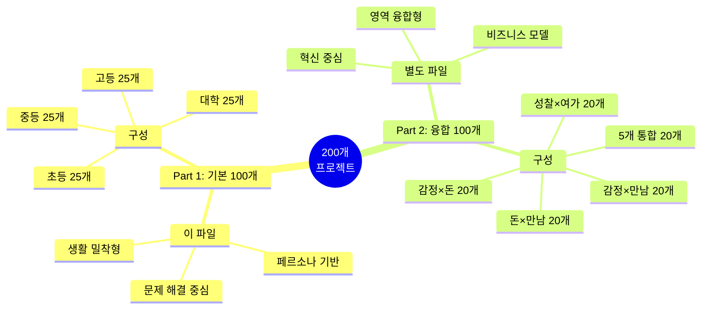

**📁 파일 구성:**
- **현재 파일** → 기본 100개 (페르소나별 생활 기반)
- **[융합형_프로젝트_100선.md](./융합형_프로젝트_100선.md)** → 융합 100개 (영역 결합)

---

## 🎯 프로젝트 선택 가이드

### 어떤 프로젝트를 선택할까?

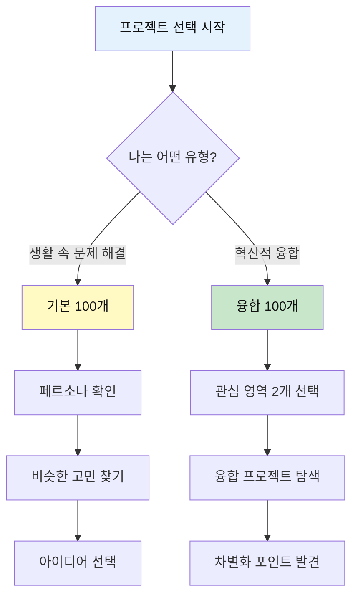

### 레벨별 추천

| 레벨 | 시작 | 중급 | 고급 |
|------|------|------|------|
| **초등** | 기본 #1-10 | 기본 #11-20 | 융합 #101-105 |
| **중등** | 기본 #26-35 | 기본 #36-45 | 융합 #106-110, #121-125 |
| **고등** | 기본 #51-60 | 기본 #61-70 | 융합 #111-115, #131-135, #171-175 |
| **대학** | 기본 #76-85 | 기본 #86-95 | 융합 #116-120, #136-140, #196-200 |

---

## 👥 학년별 페르소나 한눈에 보기

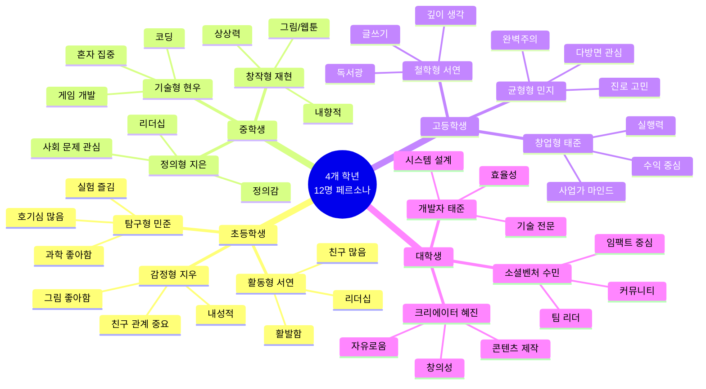

---

## 📊 Part 1: 기본 100개 (현재 파일)

> **특징**: 실제 학생들의 하루 속에서 발견하는 문제 → 솔루션  
> **방법**: 페르소나별 감정 + 생활패턴 → 아이디어 탄생 순간 포착

---

## 📊 아이디어 발상 체계

### 전체 구조

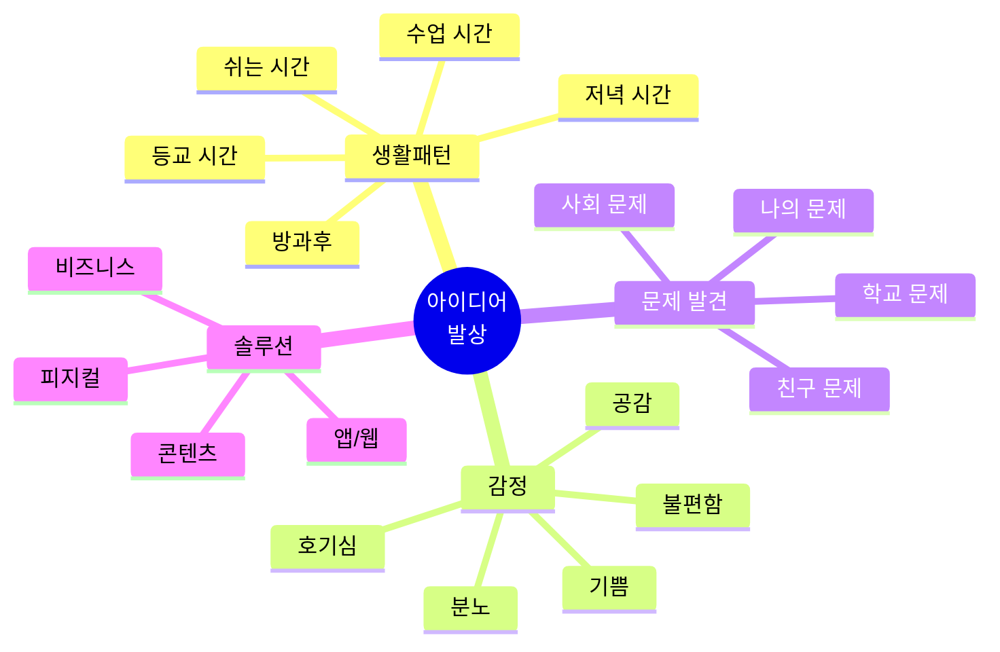

### 아이디어 탄생 공식

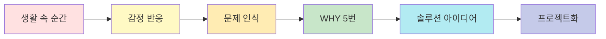

**예시:**
```
지우의 점심시간 (12:30)
→ 친구가 울고 있음 (감정: 안타까움)
→ 어떻게 위로해야 할까? (문제)
→ WHY: 왜 울까? / 뭐가 필요할까? / 나는 뭘 할 수 있지?
→ 위로 쿠폰북 아이디어
→ #2 친구 칭찬 쿠폰북 프로젝트
```

---

## 🌱 초등학생 아이디어 (25개)

### 페르소나 1: 감정형 지우 (초4)

#### 하루 속 아이디어 발상 Journey

| 구분         | 활동                | 점수 | 인물  | 아이디어 발생 여부 |
|--------------|---------------------|------|-------|--------------------|
| **아침**     | 기상                | 3    | 지우  |                    |
|              | 엄마와 아침         | 4    | 지우  |                    |
|              | 등교                | 5    | 지우  |                    |
| **학교**     | 수업                | 4    | 지우  |                    |
|              | 점심시간 - 친구 울음 | 2    | 지우  | 💡                 |
|              | 5-6교시             | 3    | 지우  |                    |
|              | 방과후              | 4    | 지우  |                    |
| **저녁**     | 하교 - 혼자         | 3    | 지우  | 💡                 |
|              | 숙제                | 3    | 지우  |                    |
|              | 그림 그리기         | 5    | 지우  | 💡                 |
|              | 독서                | 5    | 지우  |                    |

#### 발상된 아이디어 (7개)

**💡 아이디어 #2: 친구 칭찬 쿠폰북**
- **발상 시간**: 점심시간 (12:45)
- **상황**: 친구가 울고 있는데 어떻게 위로해야 할지 모름
- **감정**: 😢 안타까움 + 😰 막막함
- **사고 과정**:
  ```
  친구가 슬퍼 → 위로하고 싶어 → 말로는 어려워
  → 뭔가 줄 수 있을까? → 쿠폰은 어때?
  → "같이 놀아줄게" 쿠폰 → 친구가 좋아할 것 같아!
  ```
- **근거**: 지우는 내성적이라 말보다 행동/물건으로 감정 표현 선호
- **5대 주제**: 💗 감정 + 🤝 만남

**💡 아이디어 #3: 기분 색깔 팔찌**
- **발상 시간**: 자유시간 (18:30)
- **상황**: 오늘 하루를 그림으로 그리다가
- **감정**: 🤔 성찰 + 🎨 창작
- **사고 과정**:
  ```
  오늘 기분이 어땠지? → 색깔로 표현하면?
  → 파란색은 평온, 빨간색은 화남
  → 매일 색깔 비즈로 팔찌 만들면?
  → 한 달 팔찌 = 내 감정 달력!
  ```
- **근거**: 그림 그리기를 좋아하는 지우의 시각적 표현 욕구
- **5대 주제**: 💗 감정 + 🧘 성찰

**💡 아이디어 #4: 슬픔 상자**
- **발상 시간**: 독서 후 (21:45)
- **상황**: 『100만 번 산 고양이』 읽고 슬픔에 대해 생각
- **감정**: 😭 슬픔 + 💭 성찰
- **사고 과정**:
  ```
  고양이가 슬플 때 어떻게 했지?
  → 나도 슬플 때가 있어
  → 일기에 쓰면 조금 나아져
  → 상자에 넣고 나중에 보면?
  → 지난 슬픔은 별거 아니더라
  ```
- **근거**: 독서를 통한 감정 투영 및 성찰
- **5대 주제**: 💗 감정 + 🧘 성찰

**💡 아이디어 #6: 우는 나무 만들기**
- **발상 시간**: 방과후 (15:45)
- **상황**: 교실에서 여러 친구들이 각자 슬픔
- **감정**: 😢 공감 + 💡 아이디어
- **사고 과정**:
  ```
  나만 슬픈 게 아니구나
  → 친구들도 다 슬픈 일이 있어
  → 같이 나누면 좋겠어
  → 나무에 잎처럼 달면?
  → 서로 위로 메시지도 달고!
  ```
- **근거**: 공감 능력이 높은 지우의 공동체 의식
- **5대 주제**: 💗 감정 + 🤝 만남

**💡 아이디어 #11: 우정 타임캡슐**
- **발상 시간**: 하교 길 (16:40)
- **상황**: 단짝 친구와 걸으며 미래 이야기
- **감정**: 😊 행복 + 🤝 우정
- **사고 과정**:
  ```
  우리 계속 친구일까?
  → 미래의 우리에게 편지 쓰면?
  → 1년 후에 열어보자!
  → 추억을 간직할 수 있어
  ```
- **근거**: 관계를 소중히 여기는 지우의 성향
- **5대 주제**: 🤝 만남 + 💗 감정

**💡 아이디어 #17: 나의 꿈 타임라인**
- **발상 시간**: 독서 시간 (21:30)
- **상황**: 『마당을 나온 암탉』 읽으며 꿈에 대해 생각
- **감정**: 🌟 동경 + 🤔 궁금
- **사고 과정**:
  ```
  나는 뭐가 되고 싶지?
  → 태어나서 지금까지 좋아한 것들
  → 미래에는 뭘 하고 있을까?
  → 그림으로 그려보면 재미있겠다
  ```
- **근거**: 내성적이라 혼자 생각하고 표현하기 선호
- **5대 주제**: 🧘 성찰

**💡 아이디어 #23: 동화 속편 쓰기**
- **발상 시간**: 자유시간 (19:00)
- **상황**: 동화책 읽고 "그 다음은?"이라는 궁금증
- **감정**: 😮 호기심 + ✍️ 창작욕
- **사고 과정**:
  ```
  이야기가 끝났는데 궁금해
  → 그 다음엔 어떻게 됐을까?
  → 내가 상상해서 쓰면?
  → 그림도 그리고 책으로 만들기!
  ```
- **근거**: 독서와 그림을 좋아하는 지우의 창작 활동
- **5대 주제**: 🎮 여가

---

### 페르소나 2: 탐구형 민준 (초5)

#### 하루 속 아이디어 발상 Journey

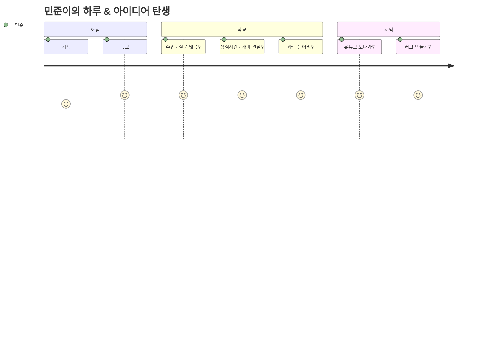

#### 발상된 아이디어 (7개)

**💡 아이디어 #7: 위대한 실수 연구**
- **발상 시간**: 과학 동아리 (15:45)
- **상황**: 실험 실수로 예상과 다른 결과
- **감정**: 😲 놀람 + 🤔 호기심
- **사고 과정**:
  ```
  어? 내가 잘못했나? → 그런데 재미있는 결과네
  → 과학자들도 실수로 발견한 게 많대
  → 실수를 모아서 연구하면?
  → 페니실린도 실수로 발견했잖아!
  ```
- **근거**: 호기심이 많고 실패를 배움으로 전환하는 성향
- **5대 주제**: 🎮 여가 + 🧘 성찰

**💡 아이디어 #21: 나만의 보드게임 만들기**
- **발상 시간**: 레고 시간 (21:30)
- **상황**: 레고로 놀다가 규칙을 만들고 싶어짐
- **감정**: 🎲 재미 + 💡 창의
- **사고 과정**:
  ```
  레고로 성을 만들었어
  → 이걸로 게임하면 재미있겠다
  → 주사위, 말, 카드 추가
  → 친구들과 규칙 만들어보자
  ```
- **근거**: 놀이를 통한 학습, 규칙 설계 능력
- **5대 주제**: 🎮 여가

**💡 아이디어 #22: 상상 놀이터 설계**
- **발상 시간**: 점심시간 후 (13:00)
- **상황**: 놀이터에서 놀다가 "더 재미있으면?"
- **감정**: 😊 즐거움 + 💭 상상
- **사고 과정**:
  ```
  이 놀이터는 시시해
  → 내가 만든다면?
  → 미끄럼틀이 더 길고, 비밀 통로도 있고
  → 그림으로 그려서 학교에 제안!
  ```
- **근거**: 탐구형이라 개선점을 찾고 설계하는 것 선호
- **5대 주제**: 🎮 여가 + 🤝 만남

**💡 아이디어 #25: 레고 우리 학교 만들기**
- **발상 시간**: 레고 시간 (21:30)
- **상황**: 레고로 뭘 만들까 고민
- **감정**: 🏫 애착 + 🔧 창작
- **사고 과정**:
  ```
  학교를 레고로 만들면?
  → 우리 교실, 운동장, 급식실
  → 불편한 곳을 개선해서 만들기
  → 선생님께 제안할 수 있어!
  ```
- **근거**: 관찰력과 문제 해결 능력
- **5대 주제**: 🎮 여가 + 🤝 만남

**💡 아이디어 #18: 좋아하는 것 100개 리스트**
- **발상 시간**: 숙제 중 (17:45)
- **상황**: 자기소개 숙제하다가
- **감정**: 🤔 성찰 + ✍️ 정리욕
- **사고 과정**:
  ```
  나는 뭘 좋아하지?
  → 레고, 과학, 곤충, 유튜브...
  → 100개까지 써보면?
  → 친구들과 비교하면 재미있겠다
  ```
- **근거**: 호기심이 많아 관심사가 다양함
- **5대 주제**: 🧘 성찰

**💡 아이디어 #10: 벼룩시장 앱**
- **발상 시간**: 하교 길 (16:35)
- **상황**: 친구가 레고를 갖고 싶어함
- **감정**: 💡 아이디어 + 🤝 나눔
- **사고 과정**:
  ```
  내 오래된 레고 안 쓰는데
  → 친구 장난감이랑 바꾸면?
  → 학교 친구들끼리 교환하면 좋겠다
  → 앱으로 만들면 편할 것 같아
  ```
- **근거**: 실용적이고 효율적인 해결책 선호
- **5대 주제**: 💰 돈 + 🤝 만남

**💡 아이디어 #19: 나만의 슈퍼파워 찾기**
- **발상 시간**: 유튜브 시청 (18:50)
- **상황**: 슈퍼히어로 영상 보다가
- **감정**: 🦸 동경 + 💪 자신감
- **사고 과정**:
  ```
  슈퍼히어로처럼 능력이 있다면?
  → 나는 관찰을 잘해
  → 이게 나의 슈퍼파워!
  → 캐릭터로 만들어보자
  ```
- **근거**: 자신의 강점을 발견하는 과정
- **5대 주제**: 🧘 성찰

---

## 🌿 중학생 아이디어 (25개)

### 페르소나 3: 리더형 서연 (중2)

#### 하루 속 아이디어 발상 Journey


#### 발상된 아이디어 (7개)

**💡 아이디어 #35: 학급 민주주의 플랫폼**
- **발상 시간**: 학생회 회의 (16:50)
- **상황**: 학급 안건이 묻히는 문제 발견
- **감정**: 😤 답답함 + 💪 해결 의지
- **사고 과정**:
  ```
  친구들 의견을 들어보고 싶은데
  → 손들기는 부담스러워하고
  → 익명으로 안건 제안하면?
  → 투표까지 앱으로 하면 편하겠다
  → 블록체인으로 투명하게!
  ```
- **근거**: 리더로서 민주적 의사결정 시스템에 관심
- **5대 주제**: 🤝 만남 + 🧘 성찰

**💡 아이디어 #38: 학생회 소통 개선**
- **발상 시간**: 학생회 회의 (17:15)
- **상황**: "학생회가 뭐 하는지 모르겠어" 피드백
- **감정**: 😔 아쉬움 + 💡 개선
- **사고 과정**:
  ```
  우리가 열심히 하는데 모르네
  → 소통이 문제야
  → 실시간 Q&A 있으면?
  → 학생 의견도 바로 수집하고
  ```
- **근거**: 리더십에서 소통의 중요성 인식
- **5대 주제**: 🤝 만남

**💡 아이디어 #36: 스터디 그룹 매칭 앱**
- **발상 시간**: 자율학습 (21:45)
- **상황**: 혼자 공부하기 힘든데 스터디 구하기 어려움
- **감정**: 😓 힘듦 + 🤝 협력
- **사고 과정**:
  ```
  같이 공부하고 싶은데
  → 누가 어떤 과목 하는지 모르겠어
  → 매칭 앱 있으면 좋겠다
  → 시험 기간에 유용할 것 같아
  ```
- **근거**: 협업의 가치를 아는 리더의 관점
- **5대 주제**: 🤝 만남 + 🧘 성찰

**💡 아이디어 #41: 가치관 워크숍**
- **발상 시간**: 자율학습 중 성찰 (22:30)
- **상황**: 『정의란 무엇인가』 읽고 고민
- **감정**: 🤔 성찰 + 💭 철학
- **사고 과정**:
  ```
  나에게 중요한 건 뭘까?
  → 정의? 자유? 평등?
  → 친구들은 뭘 중요하게 생각할까?
  → 가치 카드로 워크숍 하면 재미있겠다
  ```
- **근거**: 책임감 강하고 정의로운 성향
- **5대 주제**: 🧘 성찰

**💡 아이디어 #30: 긍정 메시지 벽**
- **발상 시간**: 점심시간 (12:45)
- **상황**: 복도에서 우는 친구 목격
- **감정**: 😢 안타까움 + 💡 아이디어
- **사고 과정**:
  ```
  학교에 스트레스 받는 친구들 많아
  → 서로 격려하면 좋을 텐데
  → 익명 칭찬 포스트잇은 어때?
  → 긍정적인 학교 문화 만들자
  ```
- **근거**: 공동체 문화 개선에 대한 리더의 책임감
- **5대 주제**: 💗 감정 + 🤝 만남

**💡 아이디어 #33: 학교 매점 개선 제안**
- **발상 시간**: 쉬는 시간 (10:15)
- **상황**: 매점 줄이 너무 길어서 포기
- **감정**: 😤 짜증 + 💡 개선 의지
- **사고 과정**:
  ```
  매번 이렇게 기다려야 해?
  → 동선이 비효율적이야
  → 키오스크 도입하면?
  → 경영 분석해서 제안해보자
  ```
- **근거**: 문제 발견 및 시스템 개선 능력
- **5대 주제**: 💰 돈 + 🤝 만남

**💡 아이디어 #44: 멘토 매칭 플랫폼**
- **발상 시간**: 학원 가는 길 (19:35)
- **상황**: 진로 고민을 누구에게 물어보지?
- **감정**: 😟 고민 + 🤝 연결
- **사고 과정**:
  ```
  선배들 경험이 궁금한데
  → 어떻게 연결되지?
  → 멘토-멘티 매칭 플랫폼 있으면
  → 진로 고민 해결할 수 있어
  ```
- **근거**: 리더로서 후배 지원 시스템에 관심
- **5대 주제**: 🤝 만남 + 🧘 성찰

---

### 페르소나 4: 창작형 재현 (중3)

#### 하루 속 아이디어 발상 Journey

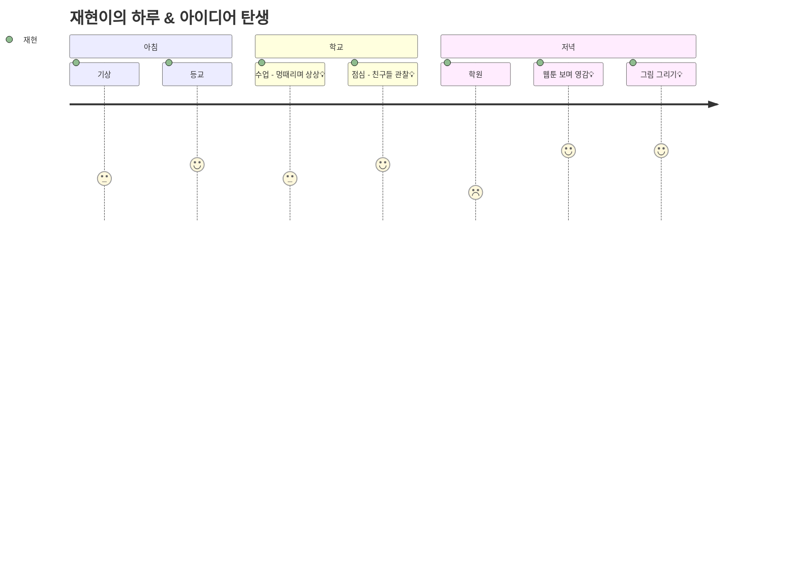

#### 발상된 아이디어 (6개)

**💡 아이디어 #47: 웹툰 창작 프로젝트**
- **발상 시간**: 웹툰 보기 (22:30)
- **상황**: 웹툰 보다가 "나도 그릴 수 있을까?"
- **감정**: 🎨 동경 + 😰 두려움
- **사고 과정**:
  ```
  이 작가도 처음엔 초보였겠지
  → 나도 해볼까?
  → 학교 이야기면 소재 풍부해
  → 매일 30분씩이라도
  → 네이버 도전만화에 올려보자
  ```
- **근거**: 창작 욕구 + 시간 부족 → 효율적 실행 계획
- **5대 주제**: 🎮 여가 + 💗 감정

**💡 아이디어 #48: 1인 미디어 크리에이터**
- **발상 시간**: 그림 그리기 (23:15)
- **상황**: 그림 그리는 과정을 기록하고 싶음
- **감정**: 📹 공유 욕구 + 🎨 창작
- **사고 과정**:
  ```
  내가 그림 그리는 과정을 영상으로?
  → 타임랩스로 찍으면 멋있겠다
  → 다른 친구들도 궁금해할 거야
  → 유튜브에 올려보자
  ```
- **근거**: 내향적이지만 작품으로 소통하고 싶은 욕구
- **5대 주제**: 🎮 여가

**💡 아이디어 #28: 감정 일기 분석 앱**
- **발상 시간**: 학원 후 (21:35)
- **상황**: 오늘 하루 감정 기복이 심했음
- **감정**: 😔 우울 + 🤔 궁금
- **사고 과정**:
  ```
  왜 나는 기분이 자주 바뀌지?
  → 패턴이 있을까?
  → AI가 분석해주면?
  → 감정 일기 + AI 조언
  ```
- **근거**: 감성적인 성향으로 자기 이해 필요
- **5대 주제**: 💗 감정 + 🧘 성찰

**💡 아이디어 #43: 버킷리스트 앱**
- **발상 시간**: 수업 중 상상 (11:20)
- **상황**: 지루한 수업 시간, 미래 상상
- **감정**: 🌟 동경 + ✨ 희망
- **사고 과정**:
  ```
  나중에 뭐 하고 싶지?
  → 여행, 전시회, 웹툰 작가...
  → 100개 목록 만들면?
  → 친구들과 공유하고 함께 도전
  ```
- **근거**: 상상력 풍부한 성향
- **5대 주제**: 🧘 성찰 + 🎮 여가

**💡 아이디어 #46: 학교 방탈출 게임 제작**
- **발상 시간**: 점심시간 (13:00)
- **상황**: 친구들과 방탈출 이야기
- **감정**: 🎮 재미 + 💡 창의
- **사고 과정**:
  ```
  우리 학교로 방탈출 만들면?
  → 교실마다 퀴즈 숨기고
  → 스토리는 학교 괴담으로
  → 축제 때 운영하자!
  ```
- **근거**: 스토리텔링 능력 + 친구들과 재미 추구
- **5대 주제**: 🎮 여가 + 🤝 만남

**💡 아이디어 #32: 학생 재능 마켓**
- **발상 시간**: 하교 길 (15:35)
- **상황**: "그림 그려줄게" 친구 부탁
- **감정**: 😊 뿌듯함 + 💰 호기심
- **사고 과정**:
  ```
  내 그림으로 용돈 벌 수 있을까?
  → 친구들도 재능 팔면?
  → 과외, 코딩, 디자인...
  → 학생 재능 마켓 앱 만들면?
  ```
- **근거**: 창작 재능의 경제적 가치 발견
- **5대 주제**: 💰 돈 + 🎮 여가

---

## 🌳 고등학생 아이디어 (25개)

### 페르소나 5: 기업가형 현우 (고2)

#### 하루 속 아이디어 발상 Journey


#### 발상된 아이디어 (7개)

**💡 아이디어 #55: 고등학생 프리랜서 플랫폼**
- **발상 시간**: 사이드 프로젝트 (23:45)
- **상황**: 코딩 실력으로 용돈 벌 수 있을까?
- **감정**: 💡 기회 포착 + 💪 도전
- **사고 과정**:
  ```
  고등학생도 디자인, 코딩 잘해
  → 근데 돈 벌 기회가 없어
  → 안전한 플랫폼 만들면?
  → 학생증 인증 + 에스크로 결제
  → 경제적 자립 도와주기
  ```
- **근거**: 실행력 강하고 비즈니스 마인드
- **5대 주제**: 💰 돈 + 🤝 만남

**💡 아이디어 #56: 소셜 벤처 창업**
- **발상 시간**: 독서 후 (23:20)
- **상황**: 『린 스타트업』 읽고 영감
- **감정**: 🔥 열정 + 🌍 사명감
- **사고 과정**:
  ```
  돈도 벌고 사회도 좋게 할 수 있어?
  → 장애인 이동권, 환경 문제
  → 소셜 벤처가 답이야
  → 문제 선정 → 솔루션 → 수익 모델
  ```
- **근거**: 도전적이고 사회 문제에 관심
- **5대 주제**: 💰 돈 + 🤝 만남 + 🧘 성찰

**💡 아이디어 #58: 지역 소상공인 컨설팅**
- **발상 시간**: 점심시간 (12:50)
- **상황**: 학교 앞 가게가 장사 안 됨
- **감정**: 😢 안타까움 + 💡 아이디어
- **사고 과정**:
  ```
  저 가게 아저씨 힘들어 보여
  → SNS 마케팅하면 손님 올 텐데
  → 무료로 컨설팅 해드리면?
  → 실무 경험도 쌓고 포트폴리오도!
  ```
- **근거**: 실행력 + 실무 경험 갈망
- **5대 주제**: 💰 돈 + 🤝 만남

**💡 아이디어 #60: 크라우드 펀딩 프로젝트**
- **발상 시간**: 0교시 전 (07:35)
- **상황**: 학교 냉난방기 고장
- **감정**: 😤 불편함 + 💡 해결책
- **사고 과정**:
  ```
  학교 예산 없대
  → 우리가 모금하면?
  → 크라우드 펀딩 해보자
  → 텀블벅 활용, 리워드 설계
  ```
- **근거**: 문제를 비즈니스 관점에서 접근
- **5대 주제**: 💰 돈 + 🤝 만남

**💡 아이디어 #61: 학생 자치 조직 개혁**
- **발상 시간**: 아침 뉴스 (06:25)
- **상황**: 조직 혁신 기사 읽음
- **감정**: 💡 영감 + 🔥 열정
- **사고 과정**:
  ```
  학생회도 조직이야
  → Radical Candor 문화 도입하면?
  → 솔직한 피드백, 수평 문화
  → 실험해보고 싶어
  ```
- **근거**: 리더십과 조직 문화에 관심
- **5대 주제**: 🤝 만남 + 🧘 성찰

**💡 아이디어 #67: 진로 로드맵 앱**
- **발상 시간**: 자율학습 없는 날 (16:15)
- **상황**: 목표 대학까지 계획이 막막함
- **감정**: 😰 불안 + 📋 체계화 욕구
- **사고 과정**:
  ```
  서울대 가려면 뭘 해야 하지?
  → 역산 계획이 필요해
  → OKR 방식으로 구조화
  → 앱으로 만들어서 공유
  ```
- **근거**: 목표 지향적 성향
- **5대 주제**: 🧘 성찰 + 💰 돈

**💡 아이디어 #57: 주식 모의 투자 동아리**
- **발상 시간**: 독서 (22:40)
- **상황**: 경제 서적 읽고 투자에 관심
- **감정**: 📈 호기심 + 💰 돈
- **사고 과정**:
  ```
  주식 투자 배우고 싶어
  → 실전은 위험해
  → 모의 투자로 연습하자
  → 친구들과 동아리 만들기
  ```
- **근거**: 경제 마인드 + 팀 활동 선호
- **5대 주제**: 💰 돈 + 🧘 성찰

---

### 페르소나 6: 철학형 수진 (고3)

#### 하루 속 아이디어 발상 Journey

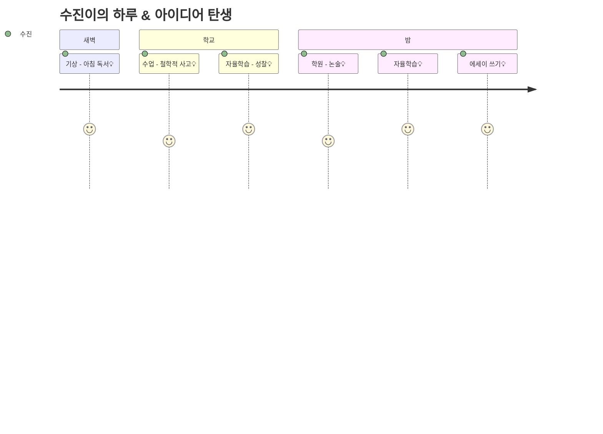

#### 발상된 아이디어 (6개)

**💡 아이디어 #66: 철학 카페 운영**
- **발상 시간**: 아침 독서 (05:45)
- **상황**: 『이방인』 읽고 부조리 고민
- **감정**: 🤔 깊은 사고 + 💬 대화 욕구
- **사고 과정**:
  ```
  이 개념을 누군가와 나누고 싶어
  → 친구들은 어떻게 생각할까?
  → 소크라테스식 대화 해보면?
  → 월 1회 철학 카페 열자
  ```
- **근거**: 깊은 사고를 나누고 싶은 욕구
- **5대 주제**: 🧘 성찰 + 🤝 만남

**💡 아이디어 #68: 독서 마라톤 챌린지**
- **발상 시간**: 아침 독서 후 (06:45)
- **상황**: 책 한 권 완독의 뿌듯함
- **감정**: 😊 성취감 + 📚 지적 욕구
- **사고 과정**:
  ```
  올해 몇 권 읽었지?
  → 목표를 50권으로 하면?
  → 혼자는 힘들 수 있어
  → 온라인 독서 모임 만들기
  ```
- **근거**: 완벽주의적 성향으로 체계적 실행
- **5대 주제**: 🧘 성찰

**💡 아이디어 #70: 사회 문제 리서치 프로젝트**
- **발상 시간**: 논술 학원 (20:15)
- **상황**: 사회 문제 주제 논술
- **감정**: 🔥 문제의식 + 📝 연구 욕구
- **사고 과정**:
  ```
  이 문제를 깊이 파고들고 싶어
  → 논문 수준으로 연구하면?
  → 문헌 조사 → 분석 → 논문 작성
  → 학술대회에 발표해보자
  ```
- **근거**: 진지하고 학구적인 성향
- **5대 주제**: 🧘 성찰 + 🤝 만남

**💡 아이디어 #52: 시험 불안 완화 앱**
- **발상 시간**: 자율학습 (22:55)
- **상황**: 시험 스트레스로 호흡 곤란
- **감정**: 😰 불안 + 💡 해결 필요
- **사고 과정**:
  ```
  시험 때마다 너무 불안해
  → 호흡법, 명상 도움 될까?
  → 과학적 근거 찾아보자
  → 앱으로 만들어서 다른 수험생도 돕기
  ```
- **근거**: 자신의 문제를 철학적/과학적으로 접근
- **5대 주제**: 💗 감정 + 🧘 성찰

**💡 아이디어 #69: 자기 계발 시스템 구축**
- **발상 시간**: 에세이 쓰기 (00:45)
- **상황**: 『아토믹 해빗』 에세이 작성
- **감정**: 💪 동기부여 + 📊 시스템화
- **사고 과정**:
  ```
  습관을 어떻게 만들지?
  → 시스템으로 설계해보자
  → 7가지 습관 + 아토믹 해빗 융합
  → 3개월 실험하고 기록
  ```
- **근거**: 완벽주의로 체계적 접근 선호
- **5대 주제**: 🧘 성찰

**💡 아이디어 #71: 인생 시뮬레이션 게임**
- **발상 시간**: 자율학습 중 상상 (17:20)
- **상황**: 진로 선택 고민
- **감정**: 😟 두려움 + 💭 시뮬레이션
- **사고 과정**:
  ```
  이 선택이 맞을까?
  → 선택에 따른 결과를 미리 보면?
  → 게임으로 인생 시뮬레이션
  → 의사결정 훈련에 도움될 거야
  ```
- **근거**: 신중한 성격으로 결과 예측 욕구
- **5대 주제**: 🧘 성찰 + 🎮 여가

---

## 🚀 대학생 아이디어 (25개)

### 페르소나 7: 창업가 동현 (대2)

#### 하루 속 아이디어 발상 Journey

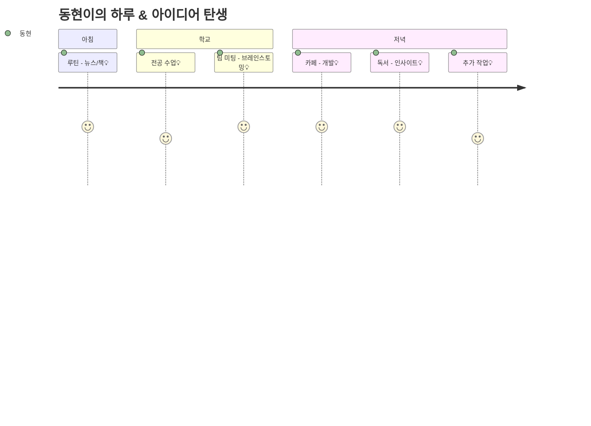

#### 발상된 아이디어 (8개)

**💡 아이디어 #79: SaaS 스타트업**
- **발상 시간**: 전공 수업 후 (12:25)
- **상황**: 프로젝트 협업 도구 불편함
- **감정**: 😤 불편함 + 💡 기회
- **사고 과정**:
  ```
  팀 프로젝트 관리가 너무 복잡해
  → 기존 도구는 비싸거나 불편해
  → B2B SaaS 만들면?
  → 대학생 팀용 협업 도구
  → MRR 모델로 수익화
  ```
- **근거**: 실제 문제 경험 + 비즈니스 모델 지식
- **5대 주제**: 💰 돈 + 🤝 만남

**💡 아이디어 #81: 플랫폼 비즈니스**
- **발상 시간**: 독서 (22:45)
- **상황**: 『플랫폼 레볼루션』 읽고 영감
- **감정**: 🔥 열정 + 🚀 야망
- **사고 과정**:
  ```
  플랫폼이 세상을 바꿔
  → 양면 시장을 찾아보자
  → 대학생 프리랜서 ↔ 기업
  → 네트워크 효과 극대화
  → 유니콘 도전!
  ```
- **근거**: 열정적이고 큰 그림 추구
- **5대 주제**: 💰 돈 + 🤝 만남

**💡 아이디어 #84: 그로스 해킹 실험**
- **발상 시간**: 카페 작업 (19:40)
- **상황**: 서비스 성장이 정체됨
- **감정**: 😓 답답함 + 💡 돌파구
- **사고 과정**:
  ```
  왜 성장이 멈췄지?
  → 그로스 해킹 필요해
  → 100가지 실험 리스트
  → AARRR 깔때기 최적화
  → 데이터 기반 의사결정
  ```
- **근거**: 실행력 강하고 실험 정신
- **5대 주제**: 💰 돈

**💡 아이디어 #86: 창업가 커뮤니티**
- **발상 시간**: 팀 미팅 (13:15)
- **상황**: 혼자 창업하기 외로움
- **감정**: 😔 고립감 + 🤝 연결 욕구
- **사고 과정**:
  ```
  같이 고민 나눌 사람이 필요해
  → 대학생 창업가 네트워크
  → 월간 밋업, 컨퍼런스
  → 생태계 구축하자
  ```
- **근거**: 네트워킹 능력 + 공동체 가치
- **5대 주제**: 🤝 만남 + 💰 돈

**💡 아이디어 #88: 프로젝트 팀 매칭**
- **발상 시간**: 아침 루틴 (08:15)
- **상황**: 해커톤 팀 구하기 어려움
- **감정**: 😰 조급함 + 💡 솔루션
- **사고 과정**:
  ```
  해커톤 나가고 싶은데 팀이 없어
  → 스킬 기반 매칭 플랫폼?
  → 개발자 + 디자이너 + 기획자
  → 공모전, 해커톤 팀 빌딩
  ```
- **근거**: 실무적 필요 + 네트워킹
- **5대 주제**: 🤝 만남

**💡 아이디어 #95: 사이드 프로젝트 100일**
- **발상 시간**: 추가 작업 (23:55)
- **상황**: 매일 조금씩 하는 게 힘듦
- **감정**: 💪 결심 + 📊 추적 욕구
- **사고 과정**:
  ```
  매일 1시간씩 하면?
  → 100일이면 뭘 만들까?
  → 공개적으로 기록하면 동기부여
  → 트위터에 매일 업데이트
  ```
- **근거**: 실행력 강하고 습관화 전략
- **5대 주제**: 🧘 성찰 + 💰 돈

**💡 아이디어 #83: 에듀테크 스타트업**
- **발상 시간**: 전공 수업 (10:45)
- **상황**: 교수님 강의 방식이 비효율적
- **감정**: 😤 불만 + 💡 개선
- **사고 과정**:
  ```
  개인 맞춤 학습이 없어
  → AI로 학습 패턴 분석하면?
  → 맞춤형 커리큘럼 제공
  → 에듀테크 시장 유망해
  ```
- **근거**: 문제 발견 + 시장 기회 포착
- **5대 주제**: 💰 돈 + 🧘 성찰

**💡 아이디어 #85: 벤처 투자 받기**
- **발상 시간**: 독서 후 (23:35)
- **상황**: 『제로 투 원』 읽고 투자 생각
- **감정**: 🚀 야망 + 💰 자금 필요
- **사고 과정**:
  ```
  이제 투자가 필요해
  → IR 덱 제작 방법 공부
  → 액셀러레이터 리스트 정리
  → 3개월 안에 피칭하자
  ```
- **근거**: 목표 지향적 + 실행력
- **5대 주제**: 💰 돈

---

### 페르소나 8: 크리에이터 예은 (대3)

#### 하루 속 아이디어 발상 Journey

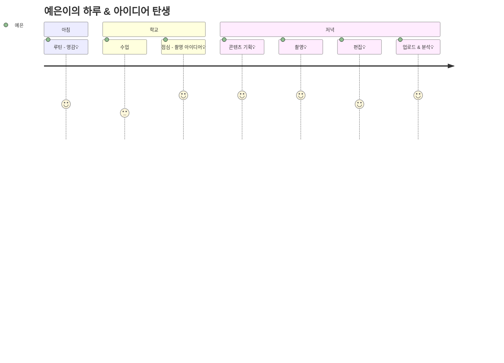

#### 발상된 아이디어 (7개)

**💡 아이디어 #96: 1인 크리에이터 비즈니스**
- **발상 시간**: 업로드 후 분석 (01:45)
- **상황**: 조회수는 나오는데 수익이 적음
- **감정**: 😓 답답함 + 💰 수익화 욕구
- **사고 과정**:
  ```
  광고 수익만으론 부족해
  → 수익 다각화 필요
  → 애드센스 + 후원 + 제품 판매
  → 월 100만원 목표 세우자
  → 니치 시장 선택: 대학생 자취
  ```
- **근거**: 창의적 + 현실적 수익 고민
- **5대 주제**: 💰 돈 + 🎮 여가

**💡 아이디어 #82: 콘텐츠 커머스**
- **발상 시간**: 콘텐츠 기획 (17:55)
- **상황**: 영상에 나온 제품 문의 많음
- **감정**: 💡 기회 + 💰 수익
- **사고 과정**:
  ```
  시청자들이 제품 물어봐
  → 제휴 마케팅 하면?
  → 쿠팡 파트너스, 네이버
  → 콘텐츠 + 쇼핑몰 결합
  ```
- **근거**: 콘텐츠 영향력을 수익화
- **5대 주제**: 💰 돈 + 🎮 여가

**💡 아이디어 #98: 웹툰/웹소설 작가**
- **발상 시간**: 점심 산책 (14:00)
- **상황**: 영상 스토리텔링에서 영감
- **감정**: ✍️ 창작욕 + 🎨 도전
- **사고 과정**:
  ```
  영상도 재미있지만
  → 글과 그림으로 표현하고 싶어
  → 웹툰 도전해볼까?
  → 카카오페이지 연재 목표
  ```
- **근거**: 창의적이고 다양한 창작 도전
- **5대 주제**: 🎮 여가 + 💰 돈

**💡 아이디어 #77: 사용자 경험 컨설팅**
- **발상 시간**: 편집 중 (23:20)
- **상황**: 편집 툴 UX가 불편함
- **감정**: 😤 불편함 + 💡 개선 아이디어
- **사고 과정**:
  ```
  이 앱 UX가 너무 불편해
  → 내가 컨설팅 해줄 수 있을 텐데
  → 사용성 테스트 + 리포트 제작
  → 프리랜서로 해보자
  ```
- **근거**: 감성적이라 UX에 민감
- **5대 주제**: 💰 돈 + 💗 감정

**💡 아이디어 #87: 지식 공유 플랫폼**
- **발상 시간**: 수업 후 (17:05)
- **상황**: 전공 자료 찾기 어려움
- **감정**: 😓 힘듦 + 🤝 공유 욕구
- **사고 과정**:
  ```
  강의 자료를 어디서 구하지?
  → 학생들끼리 공유하면?
  → 전공별 스터디 커뮤니티
  → 자료 + 질문 + 멘토링
  ```
- **근거**: 학습 경험 개선 + 커뮤니티
- **5대 주제**: 🤝 만남 + 🧘 성찰

**💡 아이디어 #94: 디지털 미니멀리즘 챌린지**
- **발상 시간**: 촬영 중 휴대폰 방해 (20:15)
- **상황**: SNS 알림으로 집중 방해
- **감정**: 😤 짜증 + 🧘 집중 욕구
- **사고 과정**:
  ```
  휴대폰 때문에 집중이 안 돼
  → SNS 디톡스 필요해
  → 30일 챌린지 해보자
  → 대안 활동 설계하고
  → 과정을 콘텐츠로!
  ```
- **근거**: 창작자로서 집중력 중요성 인식
- **5대 주제**: 🧘 성찰 + 🎮 여가

**💡 아이디어 #91: 독서 클럽 운영**
- **발상 시간**: 아침 루틴 (08:25)
- **상황**: 책 읽고 나눌 사람이 없음
- **감정**: 💬 대화 욕구 + 📚 성장
- **사고 과정**:
  ```
  이 책 정말 좋은데 누구랑 얘기하지?
  → 온라인 독서 모임 만들면?
  → 미네르바 방식 세미나
  → 사고력 훈련 + 네트워킹
  ```
- **근거**: 깊이 있는 대화 추구
- **5대 주제**: 🧘 성찰 + 🤝 만남

---

## 📊 아이디어 발상 패턴 분석

### 1. 시간대별 아이디어 발생 빈도

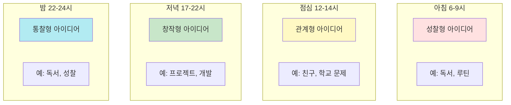

**통찰:**
- **초등**: 학교 생활 중심 (친구, 놀이)
- **중등**: 관계 + 자아 (학급, 진로)
- **고등**: 문제 해결 + 실행 (창업, 리서치)
- **대학**: 비즈니스 + 전문성 (수익화, 전문가)

---

### 2. 감정별 아이디어 트리거

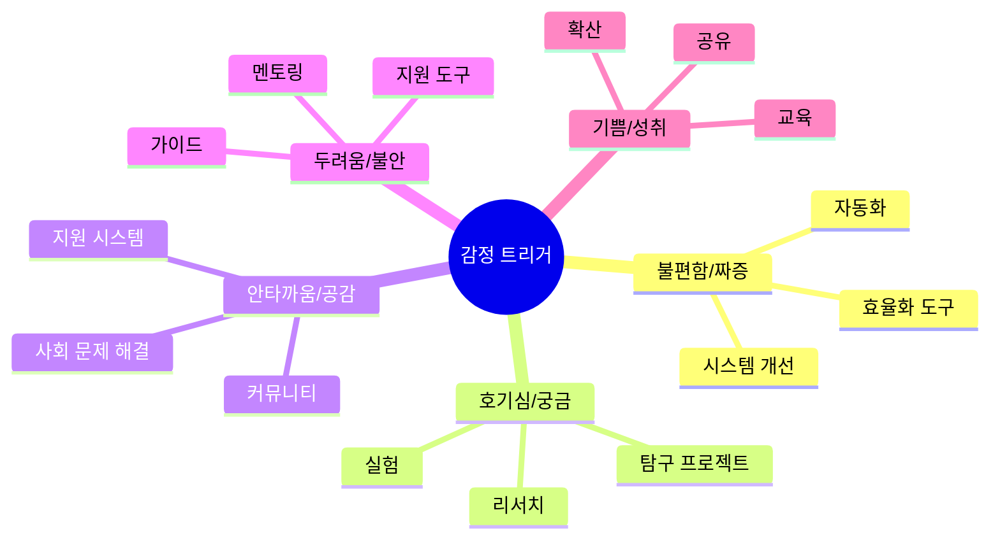

**아이디어 발상 공식:**

| 감정 | 학년 | 아이디어 유형 | 예시 |
|------|------|---------------|------|
| 😢 안타까움 | 초등 | 감정 지원 | #2 친구 칭찬 쿠폰북 |
| 😤 불편함 | 중등 | 시스템 개선 | #35 학급 민주주의 플랫폼 |
| 💡 기회 포착 | 고등 | 창업 | #55 프리랜서 플랫폼 |
| 💰 수익화 | 대학 | 비즈니스 | #96 크리에이터 비즈니스 |

---

### 3. 생활패턴 → 문제 발견 → 아이디어

#### 패턴 A: 등교 시간 (07:00-08:30)

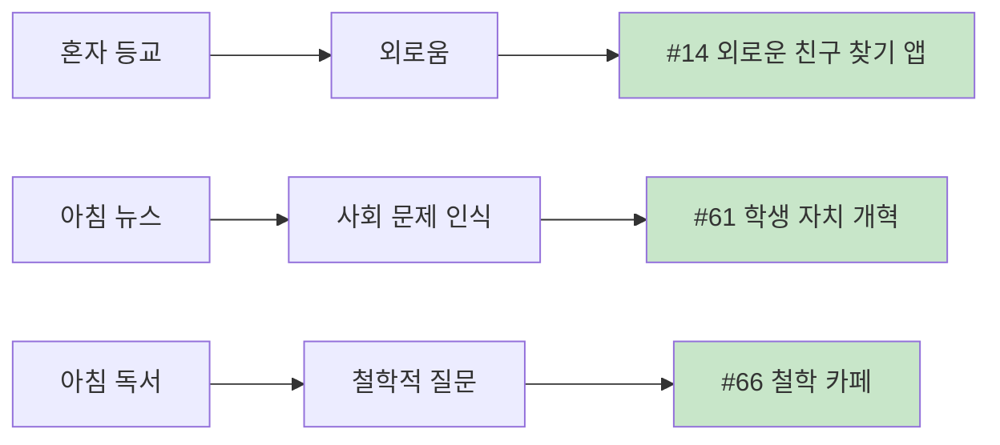

#### 패턴 B: 점심시간 (12:30-14:00)

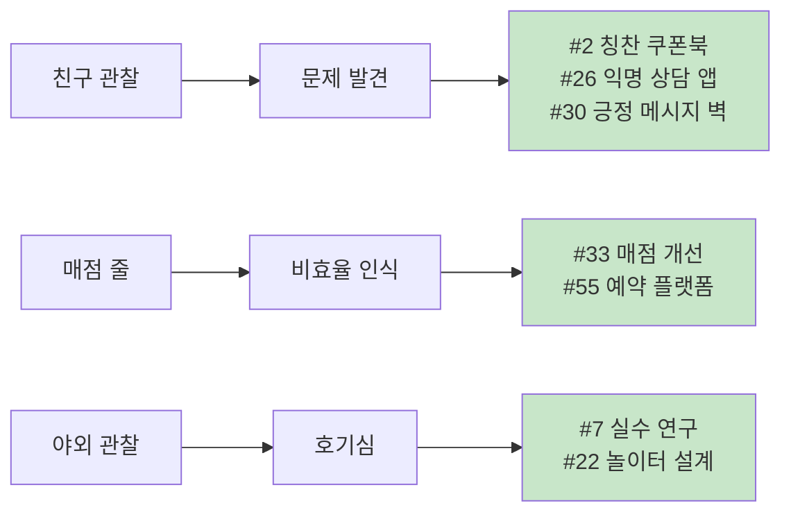

#### 패턴 C: 방과후 (15:30-18:00)

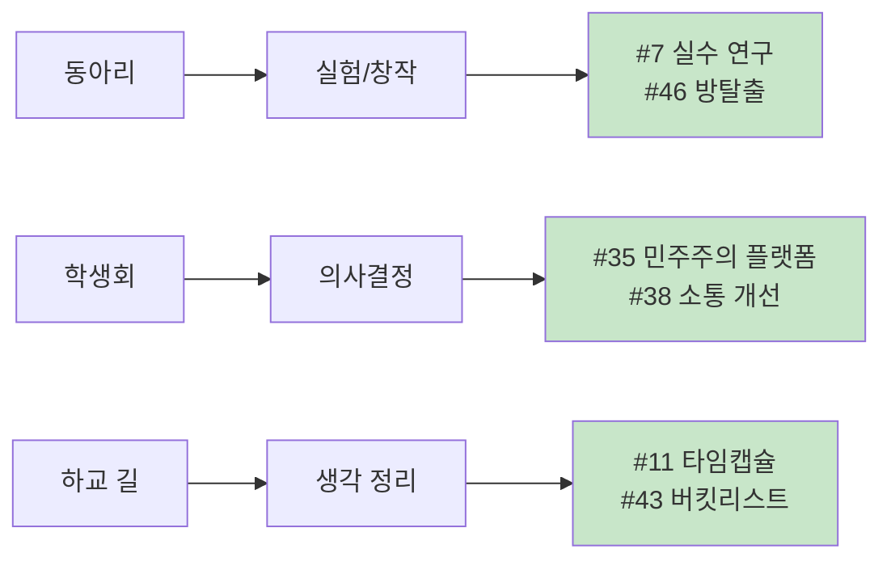

#### 패턴 D: 저녁/밤 (18:00-24:00)

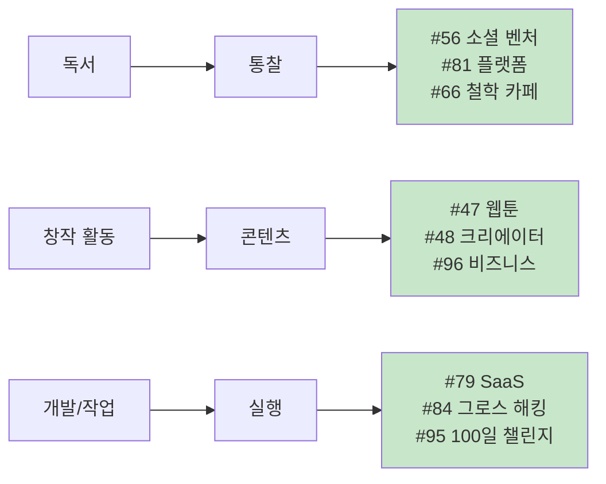

---

## 💡 아이디어 발상 실전 가이드

### Step 1: 나의 생활패턴 기록하기 (1주일)

```
✅ 체크리스트:
□ 하루 중 가장 불편한 순간은?
□ 친구/가족과 대화 중 불만 나온 것은?
□ "이게 있으면 좋겠다" 생각한 것은?
□ 호기심이 생긴 것은?
□ 누군가를 도와주고 싶었던 순간은?
```

**기록 양식:**
```
날짜: 2026.01.21
시간: 12:45
상황: 매점에서 30분 대기
감정: 😤 짜증, ⏰ 시간 아까움
문제: 동선 비효율, 결제 느림
아이디어: 모바일 주문 + 픽업 시스템
```

---

### Step 2: 감정 트리거 활용

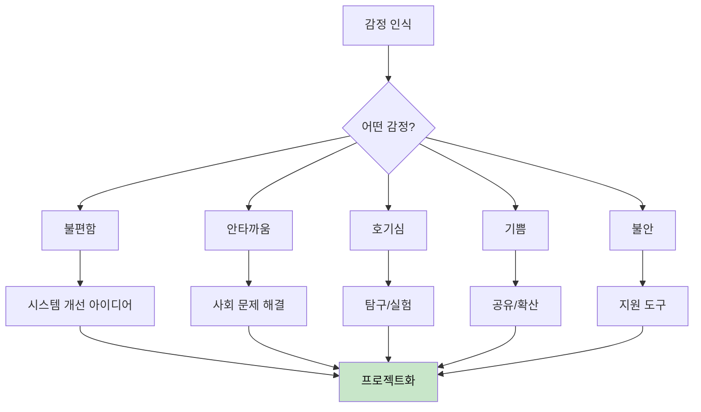

---

### Step 3: WHY 5번 질문법

**예시: 지우의 친구 칭찬 쿠폰북**

```
문제: 친구가 울고 있어

WHY 1: 왜 문제인가?
→ 친구가 슬프니까

WHY 2: 왜 슬픈가?
→ 친구랑 싸웠대

WHY 3: 왜 위로하고 싶은가?
→ 친구가 소중하니까

WHY 4: 왜 위로가 어려운가?
→ 말로 표현하기 어려워

WHY 5: 왜 말로 표현이 어려운가?
→ 내성적이고 쑥스러워

💡 솔루션: 말 대신 행동으로 → 칭찬 쿠폰북!
```

---

### Step 4: 페르소나 매칭

**나는 어떤 페르소나와 비슷할까?**

| 특성 | 페르소나 | 추천 아이디어 유형 |
|------|----------|-------------------|
| 감수성 풍부, 내성적 | 지우 (초4) | 감정 표현, 공감 도구 |
| 호기심 많음, 실험 | 민준 (초5) | 탐구, 과학 프로젝트 |
| 책임감, 리더십 | 서연 (중2) | 시스템 개선, 조직 |
| 상상력, 창작 | 재현 (중3) | 콘텐츠, 스토리텔링 |
| 실행력, 비즈니스 | 현우 (고2) | 창업, 컨설팅 |
| 깊은 사고, 철학 | 수진 (고3) | 리서치, 에세이 |
| 열정적, 창업 | 동현 (대2) | 스타트업, 플랫폼 |
| 창의적, 콘텐츠 | 예은 (대3) | 크리에이터, 커머스 |

---

### Step 5: 5대 주제 태깅

**모든 아이디어를 5대 주제로 분류:**

```
💗 감정: 감정 이해, 공감, 정신건강, UX
💰 돈: 경제, 창업, 수익화, 투자
🤝 만남: 관계, 협업, 커뮤니티, 리더십
🧘 성찰: 자아, 철학, 진로, 성장
🎮 여가: 놀이, 창작, 콘텐츠, 게임
```

**융합 아이디어:**
```
#96 크리에이터 비즈니스 = 🎮 여가 + 💰 돈
#56 소셜 벤처 = 💰 돈 + 🤝 만남 + 🧘 성찰
#35 민주주의 플랫폼 = 🤝 만남 + 🧘 성찰
```

---

## 🎯 공모전/대회 매칭 가이드

### 감정별 추천 공모전

| 트리거 감정 | 아이디어 유형 | 추천 공모전 | 대상 |
|------------|--------------|-----------|------|
| 😢 안타까움 | 사회 문제 해결 | 사회혁신 아이디어 공모전 | 중고대 |
| 😤 불편함 | 시스템 개선 | 앱 개발 공모전, SW 공모전 | 중고대 |
| 🤔 호기심 | 과학 탐구 | 청소년 과학탐구대회 | 초중고 |
| 💡 창업 | 비즈니스 | K-Startup, 비즈쿨 | 고대 |
| 🎨 창작 | 콘텐츠 | 웹툰/영상 공모전 | 중고대 |

---

### 생활패턴별 추천 프로젝트 기간

| 자유시간 | 학년 | 추천 기간 | 프로젝트 유형 |
|---------|------|----------|--------------|
| 4시간+ | 초등 | 1-2주 | 간단한 프로토타입 |
| 2시간 | 중등 | 1개월 | 노코드 앱, MVP |
| 1-2시간 | 고등 | 3개월 | 방학 집중 |
| 자율 | 대학 | 6개월 | 본격 비즈니스 |

---

## 🔗 연계 문서

- **[@아이디어/학년별_페르소나_생활패턴_가이드.md](./학년별_페르소나_생활패턴_가이드.md)** - 8명의 상세 페르소나
- **[5대주제_프로젝트_가이드.md](../5대주제_프로젝트_가이드.md)** - 주제별 융합 독서
- **[필독서/필독서_종합_가이드.md](../필독서/필독서_종합_가이드.md)** - 학년별 독서 가이드

---

## 📝 마무리: 아이디어는 일상 속에 있다

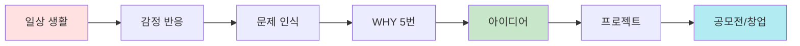

**핵심 메시지:**

> **"불편함은 기회다"**  
> 매일 겪는 작은 불편함, 감정, 호기심이  
> 세상을 바꾸는 아이디어가 된다.

> **"기록하라"**  
> 1주일만 생활패턴 + 감정을 기록하면  
> 10개 이상의 아이디어가 나온다.

> **"작게 시작하라"**  
> 완벽한 아이디어는 없다.  
> 작은 프로토타입으로 검증하고 개선하라.

---

**"오늘 느낀 감정이 내일의 프로젝트다!"** 💡✨
