# 🚀 AI 메이커스 독서 클럽 운영 매뉴얼

> **실전 운영 가이드 - 독서에서 시작해 실제 솔루션을 만들어내는 메이커 클럽 운영법**
> 
> **핵심**: 읽고 → 문제 발견하고 → 비즈니스 모델 만들고 → AI로 빠르게 제작하고 → 런칭한다

---

## 📌 운영 철학: 메이커 & 기업가 양성

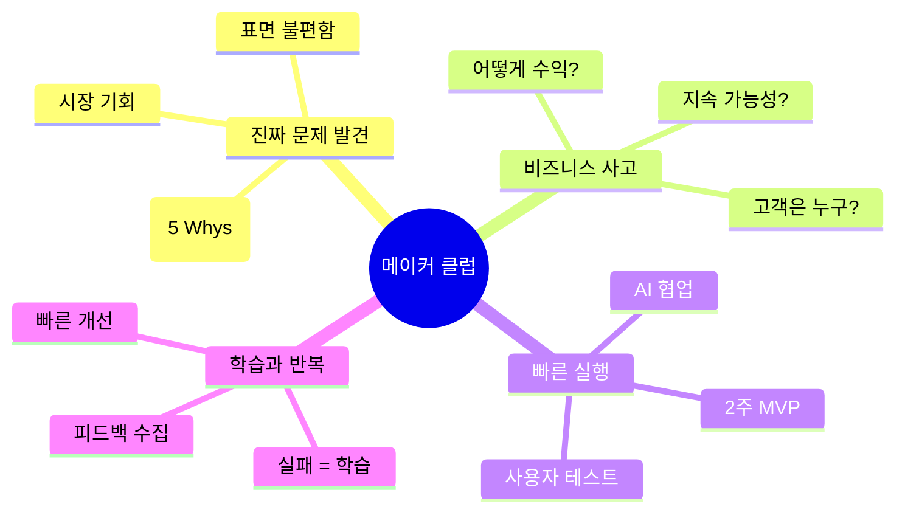

### 🎯 핵심 운영 원칙

| 원칙 | 설명 | 실천 방법 | 메이커 관점 |
|------|------|----------|-----------|
| **문제 우선** | 문제 발견이 80% | • "왜?" 5번 질문<br/>• 페인 포인트 찾기<br/>• 시장 기회 포착 | 좋은 문제 = 좋은 비즈니스 |
| **실행 제일** | 생각만 하지 말고 만들기 | • 2주 MVP 룰<br/>• AI 협업 극대화<br/>• 완벽주의 타파 | Done is better than perfect |
| **고객 중심** | 사용자가 정답이다 | • 10명 인터뷰<br/>• 베타 테스트<br/>• 피드백 반영 | Build for users, not for us |
| **비즈니스 사고** | 지속 가능성 고민 | • 수익 모델 설계<br/>• 단가 × 고객 수<br/>• 손익분기 계산 | No revenue, no impact |
| **학습 속도** | 빠르게 실패, 빠르게 학습 | • 주간 스프린트<br/>• 회고 필수<br/>• 피봇 유연성 | Fail fast, learn faster |

---

## 🚀 1단계: 독서 클럽 시작하기

### 1.1 사전 준비 체크리스트

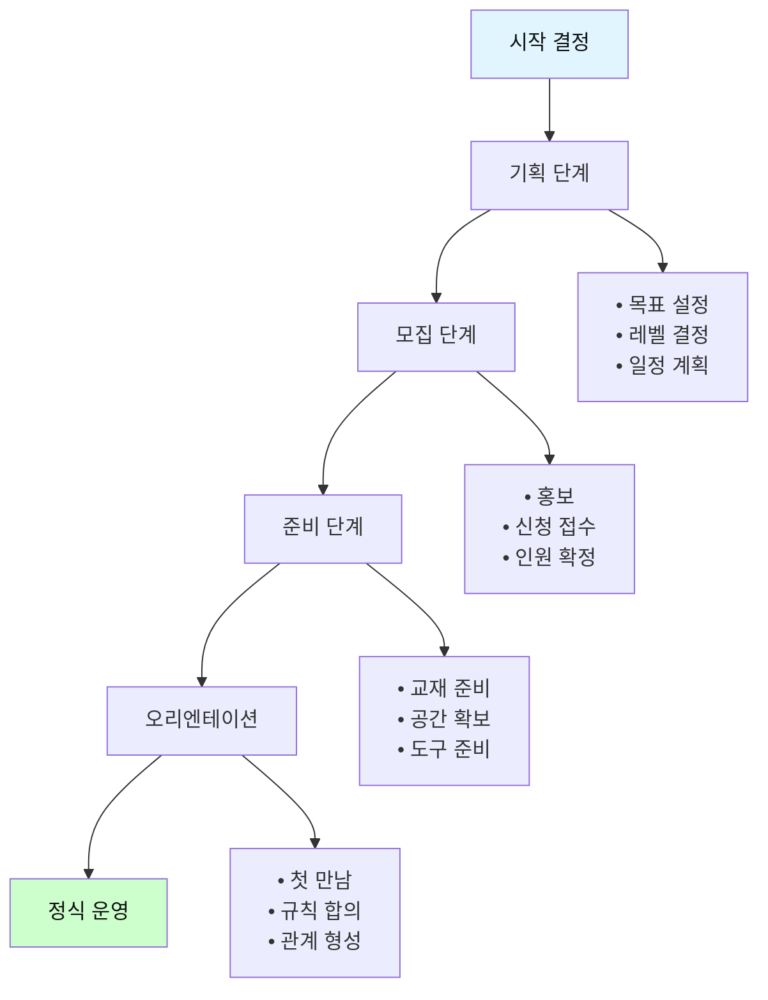

#### 📋 세부 체크리스트

**1주 전 준비사항**

| 항목 | 세부 내용 | 담당자 | 완료 |
|------|----------|--------|------|
| **공간 확보** | • 좌석 배치 확인 (원형 선호)<br/>• 화이트보드/전지 준비<br/>• 조명, 온도 체크 | 운영자 | □ |
| **교재 준비** | • 선정 도서 구매/대여<br/>• 인원수 확인<br/>• 배포 계획 | 운영자 | □ |
| **도구 준비** | • 성찰 저널 인쇄<br/>• 필기구, 포스트잇<br/>• 타이머, 명찰 | 운영자 | □ |
| **자료 준비** | • 퍼실리테이터 가이드<br/>• 토론 질문지<br/>• 평가 양식 | 운영자 | □ |
| **참여자 확인** | • 참석 여부 재확인<br/>• 사전 설문 발송<br/>• 안내문 전달 | 운영자 | □ |

**당일 준비사항**

```
□ 1시간 전 도착
□ 공간 세팅 (원형 좌석 배치)
□ 자료 배치 (각 자리에)
□ 웰컴 보드 준비
□ 간식/음료 준비 (선택)
□ 타임테이블 부착
□ 음악 준비 (시작/종료 시그널)
□ 비상 연락망 확인
```

---

## 👥 1.2 모집 및 팀 구성

### 적정 인원

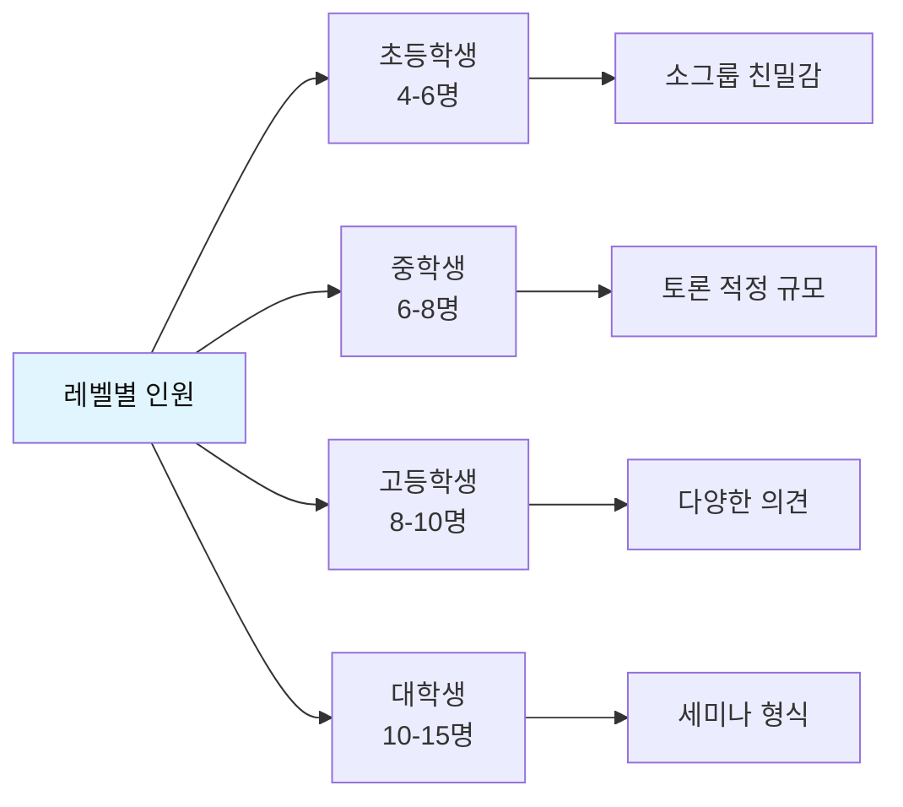

### 모집 공고 템플릿

```markdown
🌱 [○○○ 성찰 기반 독서 클럽] 멤버 모집

📚 함께 읽고, 깊이 생각하고, 성장하는 독서 공동체

[모집 대상]
• ○학년 학생 (또는 연령)
• 독서에 관심 있는 분
• 생각을 나누고 싶은 분

[활동 내용]
• 매주 1회 모임 (○요일 ○시~○시)
• 한 학기 4-6권 함께 읽기
• 성찰 저널 작성 및 토론
• 프로젝트 기반 실천 활동

[기간 및 일정]
• 기간: 20○○년 ○월 ~ ○월 (○주)
• 장소: ○○○
• 첫 모임: ○월 ○일

[신청 방법]
• 신청서 작성 (링크)
• 마감: ○월 ○일
• 문의: [연락처]

[특징]
✅ 성찰 중심의 깊이 있는 독서
✅ 안전하고 존중받는 대화 공간
✅ 프로젝트로 실천하는 배움
✅ 성장을 기록하는 포트폴리오

함께 성장할 당신을 기다립니다! 🌱
```

### 신청서 양식

| 질문 | 목적 | 유형 |
|------|------|------|
| 1. 이름, 연령/학년, 연락처 | 기본 정보 | 필수 |
| 2. 독서 클럽에 지원한 동기는? | 참여 의지 파악 | 서술형 |
| 3. 최근 읽은 책 3권과 인상 깊었던 이유 | 독서 경험 확인 | 서술형 |
| 4. 가장 궁금하거나 고민하는 문제는? | 관심사 파악 | 서술형 |
| 5. 이 활동을 통해 얻고 싶은 것은? | 기대 파악 | 서술형 |
| 6. 매주 ○요일 ○시 참석 가능한가요? | 일정 확인 | 필수 |

---

## 🎪 2단계: 오리엔테이션 진행

### 첫 모임 타임테이블 (120분)

```mermaid
gantt
    title 오리엔테이션 타임라인
    dateFormat HH:mm
    axisFormat %H:%M
    
    section 도입
    웰컴 & 아이스브레이킹    :14:00, 20m
    
    section 소개
    프로그램 소개            :14:20, 20m
    
    section 활동
    팀 빌딩 활동             :14:40, 30m
    
    section 합의
    규칙 만들기              :15:10, 20m
    
    section 실습
    첫 책 소개 & 계획        :15:30, 20m
    
    section 마무리
    Q&A 및 다음 안내         :15:50, 10m
```

### 세부 진행안

#### 1. 웰컴 & 아이스브레이킹 (20분)

**목표**: 긴장 완화, 친밀감 형성

**활동: "책으로 자기소개"**

```
진행 방법:
1. 각자 인생에서 가장 인상 깊었던 책 1권 생각하기 (2분)
2. 돌아가며 소개하기 (각 2분)
   - 이름
   - 그 책 제목
   - 왜 인상 깊었는지
   - 한 문장으로 나를 표현한다면?
3. 공통점 찾기 (3분)

준비물: 
• 명찰
• 편안한 음악
```

#### 2. 프로그램 소개 (20분)

**목표**: 활동 이해, 기대 형성, 메이커 마인드셋

**설명 내용**:

| 주제 | 시간 | 핵심 메시지 |
|------|------|------------|
| **메이커 클럽 철학** | 5분 | "책을 읽고 → 문제를 발견하고 → AI로 만들고 → 런칭한다<br/>**우리는 아이디어를 현실로 만드는 메이커다!**" |
| **6단계 사이클** | 5분 | 읽기 → 문제 발견 → 성찰 → 비즈니스 모델 → AI 제작 → 런칭 |
| **1학기 목표** | 5분 | • 2-3개 MVP 완성<br/>• 실제 사용자 확보<br/>• 포트폴리오 구축 |
| **메이커 역량** | 5분 | **기획자** (문제 발견) + **실행자** (AI 협업) +<br/>**디버거** (개선) + **기업가** (비즈니스) |

**강조 포인트**:
- "AI가 코드를 짜는 시대, 우리는 **무엇을 만들지**를 정한다"
- "2주 안에 MVP를 만들어 실제 사용자에게 테스트한다"
- "실패는 학습, 피드백은 성장의 연료"

**시각 자료**: README의 메이커 다이어그램 활용

#### 3. 팀 빌딩 활동 (30분)

**활동: "우리의 독서 나무 만들기"**

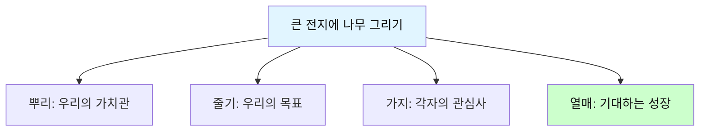

**진행**:
1. 전지에 큰 나무 그리기 (5분)
2. 각 부분 함께 채우기 (20분)
   - 뿌리: "우리가 중요하게 여기는 가치는?"
   - 줄기: "우리의 공동 목표는?"
   - 가지: "각자 궁금한 주제는?"
   - 열매: "어떻게 성장하고 싶나?"
3. 완성된 나무 사진 촬영 (5분)

**결과물**: 모임 장소에 게시

#### 4. 규칙 만들기 (20분)

**목표**: 함께 만드는 안전한 공간

**필수 합의 사항**:

| 영역 | 논의 질문 | 예시 답변 |
|------|----------|----------|
| **참여** | • 결석 시 어떻게 할까?<br/>• 준비 안 된 경우는? | • 사전 연락<br/>• 다음 모임에 의견 공유<br/>• 최대 결석 횟수 |
| **대화** | • 어떤 대화 문화를 원하나?<br/>• 지켜야 할 에티켓은? | • 비판 금지<br/>• 경청 우선<br/>• 비밀 보장<br/>• 핸드폰 자제 |
| **평가** | • 무엇을 평가할까?<br/>• 어떻게 평가할까? | • 참여도 중심<br/>• 성장 과정 중시<br/>• 자기 평가 + 동료 평가 |
| **실천** | • 프로젝트 어떻게 할까?<br/>• 협력 방식은? | • 개인/팀 선택<br/>• 중간 공유<br/>• 서로 돕기 |

**기록**: "우리의 약속" 문서 작성 → 모두 서명

#### 5. 첫 책 소개 & 계획 (20분)

**첫 책 선정 원칙**:
- 접근하기 쉬운 난이도
- 성찰할 거리가 풍부한 책
- 다양한 관점이 나올 수 있는 주제

**진행**:
1. 첫 책 소개 (5분)
   - 왜 이 책을 선정했는지
   - 어떤 질문을 탐구할지
2. 4주 계획 설명 (10분)
   - Week 1: 개인 독서
   - Week 2: 토론
   - Week 3: 프로젝트
   - Week 4: 발표
3. 성찰 저널 사용법 (5분)

#### 6. Q&A 및 다음 안내 (10분)

```
□ 궁금한 점 질문 받기
□ 다음 주 준비사항 안내
  - 책 ○○페이지까지 읽기
  - 성찰 저널 작성하기
  - 질문 3개 준비하기
□ 연락 방법 공유 (단체 채팅방)
□ 단체 사진 촬영
□ 마무리 인사
```

---

## 📅 3단계: 정기 모임 운영

### 3.1 매주 모임 표준 프로세스

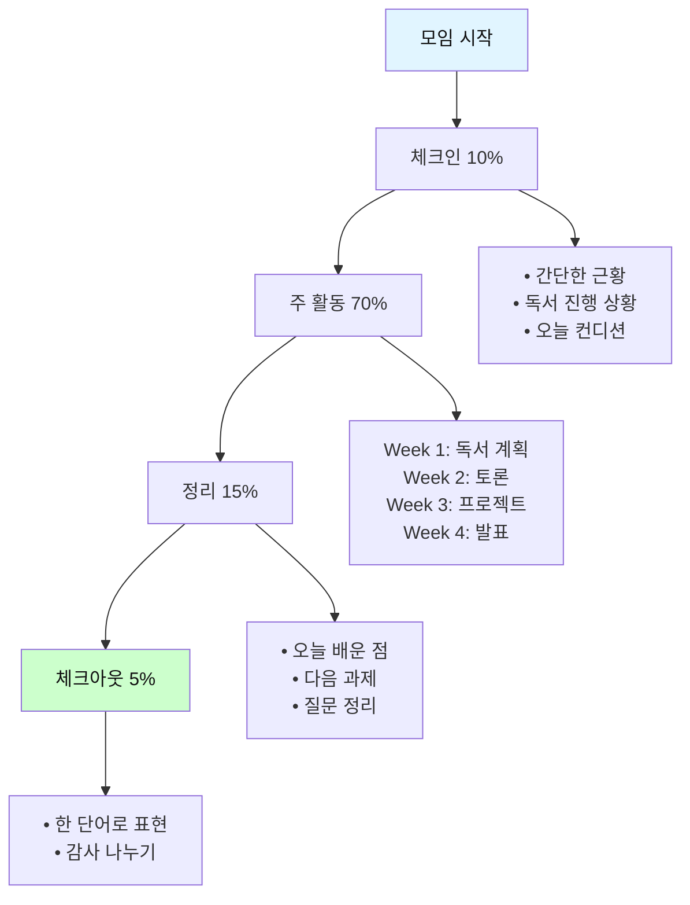

### 3.2 Week 2 토론 모임 상세 가이드 (초등학생 90분)

#### 타임테이블

| 시간 | 활동 | 내용 | 비고 |
|------|------|------|------|
| **0:00-0:10<br/>(10분)** | 체크인 | • 간단한 게임<br/>• 독서 완료 확인<br/>• 오늘의 기분 | 긴장 풀기 |
| **0:10-0:30<br/>(20분)** | 이해 확인 | • 줄거리 요약 (함께)<br/>• 중요 장면 나누기<br/>• 질문 리스트업 | 포스트잇 활용 |
| **0:30-0:55<br/>(25분)** | 성찰 토론 | • 준비한 질문 공유<br/>• 자유 대화<br/>• 깊이 파기 | 퍼실리테이터<br/>질문 안내 |
| **0:55-1:10<br/>(15분)** | 프로젝트<br/>기획 | • 프로젝트 아이디어<br/>• 팀 또는 개인 선택<br/>• 계획 스케치 | 워크시트 제공 |
| **1:10-1:25<br/>(15분)** | 정리 | • 오늘의 통찰 공유<br/>• 다음 주 과제 안내<br/>• 질문 기록 | 성찰 저널 |
| **1:25-1:30<br/>(5분)** | 체크아웃 | • 한 단어로 표현<br/>• 마무리 인사 | 원 형태로 |

#### 퍼실리테이터 스크립트 예시

**📖 도입 (10분)**

```
[모임 시작 5분 전부터 편안한 음악]

퍼실리테이터: "안녕하세요, 여러분! 오늘도 함께 만나서 반가워요. 
               지난주에 책을 읽으면서 어땠나요? 한 명씩 돌아가며 
               한 문장으로 말해볼까요?"

[돌아가며 발표 - 각 30초]

퍼실리테이터: "네, 다들 열심히 읽어왔네요! 오늘은 함께 
               이야기 나누는 시간이에요. 우리가 만든 
               '대화의 약속' 기억하시죠? 
               (칠판에 적힌 약속 가리키며)
               
               1. 비판하지 않기
               2. 경청하기
               3. 다양한 의견 존중하기
               
               자, 시작해볼까요?"
```

**📖 이해 확인 (20분)**

```
퍼실리테이터: "먼저 이야기를 함께 정리해볼게요. 
               이 책의 주인공은 누구였죠?"

[대답 듣기]

퍼실리테이터: "맞아요! 그럼 주인공에게 어떤 일이 
               일어났나요? 처음부터 끝까지 
               중요한 사건들을 같이 정리해봅시다."

[전지에 타임라인 그리며 함께 정리]

퍼실리테이터: "자, 이제 여러분이 준비한 질문을 
               포스트잇에 써볼까요? 
               
               예를 들면:
               - 왜 주인공은 그렇게 했을까?
               - 나라면 어떻게 했을까?
               - 가장 중요한 장면은 어디일까?
               
               3분 드릴게요!"

[포스트잇에 질문 작성 → 칠판에 붙이기 → 비슷한 것끼리 묶기]
```

**📖 성찰 토론 (25분) - 핵심!**

```
[질문을 3-4개 그룹으로 묶은 후]

퍼실리테이터: "우와, 정말 다양한 질문이 나왔네요! 
               비슷한 질문끼리 묶어보니 
               크게 3가지 주제가 있어요.
               
               1) 주인공의 선택에 대한 질문
               2) 등장인물의 관계
               3) 이야기의 의미
               
               어떤 것부터 이야기해볼까요?"

[투표나 합의로 순서 정하기]

--- 질문 1 탐구 (8분) ---

퍼실리테이터: "첫 번째 질문을 볼게요. 
               '주인공은 왜 ○○○를 선택했을까요?'
               
               먼저 각자 1분 동안 생각해보고, 
               성찰 저널에 간단히 메모해주세요."

[1분 침묵 사고 시간]

퍼실리테이터: "자, 누가 먼저 생각을 나눠줄래요?"

[발표자1]: "저는요, ..."

퍼실리테이터: "그렇게 생각했구나. 왜 그렇게 생각했어요?"
[깊이 질문]

퍼실리테이터: "다른 분들은 어떻게 생각하세요? 
               [발표자1]이 말한 것에 덧붙이거나 
               다른 의견 있나요?"

[여러 의견 듣기]

퍼실리테이터: "흥미롭네요. 지금까지 나온 의견을 보면,
               
               - ○○ 때문이라는 의견
               - △△ 때문이라는 의견
               - □□ 때문이라는 의견
               
               이 있었어요. 그럼 이렇게 물어볼게요.
               
               🔍 만약 여러분이 주인공이라면, 
                  같은 선택을 했을까요?
               
               왜 그렇게 생각하나요?"

[더 깊은 대화 → 자기 경험과 연결]

--- 이런 식으로 2-3개 질문 탐구 ---
```

**📖 프로젝트 기획 (15분)**

```
퍼실리테이터: "오늘 이야기 나눈 것을 바탕으로, 
               다음 주에는 프로젝트를 해볼 거예요.
               
               이 책과 관련해서 
               
               ✏️ 그림으로 표현하기
               ✏️ 속편 이야기 쓰기
               ✏️ 인터뷰 영상 만들기
               ✏️ 나만의 아이디어
               
               등 여러 가지를 할 수 있어요.
               
               무엇을 하고 싶은지 생각해보고,
               이 워크시트에 간단히 적어주세요."

[프로젝트 기획 워크시트 작성 - 10분]

퍼실리테이터: "누가 자기 아이디어를 나눠줄래요?"

[2-3명 간단히 발표]

퍼실리테이터: "좋아요! 다음 주까지 이것을 완성해오는 거예요.
               혹시 도움이 필요하면 언제든 연락 주세요!"
```

**📖 정리 & 체크아웃 (20분)**

```
퍼실리테이터: "오늘 토론 정말 알차게 했어요! 
               마지막으로 성찰 저널에 
               '오늘 배운 점'을 적어볼까요?
               
               3분 드릴게요."

[개인 작성 시간]

퍼실리테이터: "누가 나눠줄 수 있어요?"

[2-3명 발표]

퍼실리테이터: "다음 주 과제를 정리할게요.
               
               📝 다음 주 과제:
               1. 프로젝트 완성해오기
               2. 프로젝트 일지 작성하기
               3. 발표 준비하기 (3분)
               
               질문 있나요?"

[Q&A]

퍼실리테이터: "그럼 마지막으로, 오늘을 한 단어로 
               표현한다면? 돌아가며 말해봅시다!"

[각자 한 단어씩]

퍼실리테이터: "오늘도 함께해줘서 고마워요. 
               다음 주에 만나요!" 🙋‍♀️
```

---

## 🎯 4단계: 진짜 문제 발견 프로세스 (5대 영역 접근)

> **이것이 성찰 기반 독서의 핵심입니다!**
> 
> 모든 문제는 **감정·돈·만남·성찰·여가** 5대 영역 중 하나 이상과 연결됩니다.
> 이 렌즈로 바라보면 훨씬 더 풍부하고 실질적인 문제를 발견할 수 있습니다.

### 4.0 5대 영역 문제 발견 프레임워크

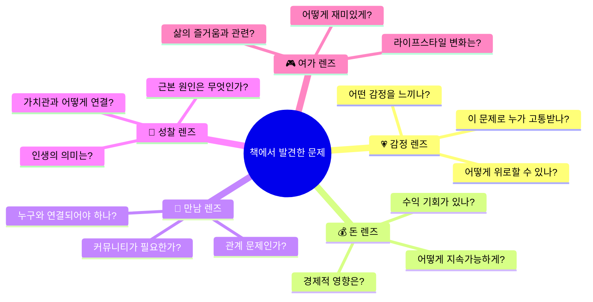

### 4.1 5대 영역별 질문 도구

**독서 후 문제 발견 시, 5가지 렌즈로 각각 질문하라!**

#### 워크숍 활동: "5대 영역 질문 확장"

```markdown
📚 책: 《마당을 나온 암탉》

[1단계: 표면적 문제 파악]
━━━━━━━━━━━━━━━━━━━━━━━━
잎싹은 자유를 얻었지만 위험해졌고, 초록이를 키우며 희생했다.

[2단계: 5대 영역으로 질문 확장]
━━━━━━━━━━━━━━━━━━━━━━━━

💗 감정 렌즈로 보기:
Q1. 잎싹은 어떤 감정을 느꼈을까? (외로움, 두려움, 사랑...)
Q2. 초록이를 잃었을 때의 슬픔은?
Q3. 희생하는 부모의 마음은 어떨까?
→ 발견: **"모성애의 고통과 보람"**
→ 프로젝트 아이디어: 부모-자녀 감정 소통 앱

💰 돈 렌즈로 보기:
Q1. 자유의 대가는 무엇인가? (안전 vs 자유)
Q2. 양계장은 왜 그런 시스템인가? (경제성)
Q3. 먹이사슬에서의 경제 원리는?
→ 발견: **"자유와 안정의 경제학"**
→ 프로젝트 아이디어: 경제적 자립 시뮬레이션 게임

🤝 만남 렌즈로 보기:
Q1. 잎싹과 나그네의 관계는?
Q2. 양계장 안 닭들과 밖 닭들의 차이는?
Q3. 초록이가 무리를 찾아간 것은?
→ 발견: **"소속감 vs 독립성"**
→ 프로젝트 아이디어: 같은 고민을 가진 사람 연결 플랫폼

🧘 성찰 렌즈로 보기:
Q1. 진짜 자유란 무엇인가?
Q2. 좋은 엄마란 무엇인가?
Q3. 나는 무엇을 위해 희생할 수 있나?
→ 발견: **"자아실현과 희생의 의미"**
→ 프로젝트 아이디어: 인생 가치관 탐색 저널 앱

🎮 여가 렌즈로 보기:
Q1. 잎싹은 마당 밖에서 무엇을 즐겼나?
Q2. 날고 싶다는 꿈은 어떤 의미?
Q3. 자유로운 삶의 방식은?
→ 발견: **"진짜 원하는 삶의 방식"**
→ 프로젝트 아이디어: 라이프스타일 실험 챌린지 앱
```

#### 실전 토론 가이드: 5대 영역 활용

**토론 진행 시 5가지 렌즈를 순서대로 활용하세요**

| 시간 | 영역 | 퍼실리테이터 질문 | 목표 |
|------|------|----------------|------|
| **0-10분** | **💗 감정** | "등장인물은 어떤 감정을 느꼈을까요?<br/>여러분은 비슷한 감정을 느낀 적 있나요?" | 공감대 형성 |
| **10-20분** | **🤝 만남** | "인물들의 관계는 어땠나요?<br/>여러분의 관계 속 비슷한 상황은?" | 관계 성찰 |
| **20-35분** | **🧘 성찰** | "이 이야기가 던지는 근본 질문은?<br/>나에게 정말 중요한 것은?" | 깊이 탐구 |
| **35-45분** | **💰 돈** | "이 문제가 경제적 측면과 연결된다면?<br/>어떻게 지속가능하게 만들까?" | 현실성 검토 |
| **45-55분** | **🎮 여가** | "이것을 재미있게 표현한다면?<br/>어떤 창작물을 만들 수 있을까?" | 창작 아이디어 |

### 4.2 문제 발견의 3단계 (개선)

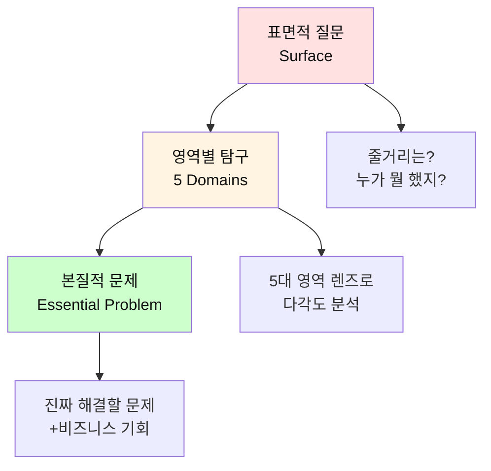

### 4.2 질문 심화 사다리

| 레벨 | 질문 유형 | 예시 | 학년 |
|------|----------|------|------|
| **1단계<br/>사실 확인** | 이해 질문 | • 무슨 일이 일어났나요?<br/>• 주인공은 누구인가요?<br/>• 어디서 일어난 일인가요? | 초등 |
| **2단계<br/>원인 탐구** | 분석 질문 | • 왜 그런 일이 일어났나요?<br/>• 무엇이 원인인가요?<br/>• 어떻게 연결되나요? | 초등<br/>중등 |
| **3단계<br/>의미 해석** | 해석 질문 | • 이것이 의미하는 바는?<br/>• 작가가 말하고 싶은 것은?<br/>• 상징은 무엇인가요? | 중등<br/>고등 |
| **4단계<br/>자기 연결** | 적용 질문 | • 나는 어떤가요?<br/>• 내 경험과 어떻게 연결되나요?<br/>• 나라면 어떻게 할까요? | 전체 |
| **5단계<br/>비판적 사고** | 평가 질문 | • 이것이 옳은가요?<br/>• 다른 관점은 없나요?<br/>• 문제점은 무엇인가요? | 고등<br/>대학 |
| **6단계<br/>본질 탐구** | 철학적 질문 | • 정말로 중요한 것은?<br/>• 인간이란 무엇인가?<br/>• 좋은 삶이란? | 고등<br/>대학 |
| **7단계<br/>실천 방향** | 행동 질문 | • 무엇을 바꿀 수 있나요?<br/>• 어떻게 실천할까요?<br/>• 나의 역할은? | 전체 |

### 4.3 5대 영역 문제 발견 워크숍 (실전)

**활동: "5대 렌즈로 문제 발견하기" (90분)**

```markdown
📝 5대 영역 질문 확장 워크숍

주제: 《마당을 나온 암탉》을 읽고

[도입 (10분)]
━━━━━━━━━━━━━━━━━━━━━━━━
퍼실리테이터: "오늘은 특별한 도구를 사용할 거예요.
              5가지 렌즈로 이 책을 바라볼 거예요!"
              
[칠판에 5가지 영역 아이콘 그리기]
💗 감정  💰 돈  🤝 만남  🧘 성찰  🎮 여가

[개인 워크 1: 표면적 이해 (10분)]
━━━━━━━━━━━━━━━━━━━━━━━━
워크시트 작성:
• 이 이야기의 핵심은? _________________
• 가장 기억에 남는 장면은? _________________

[그룹 활동: 5대 렌즈로 탐구 (50분)]
━━━━━━━━━━━━━━━━━━━━━━━━

각 영역당 10분씩 로테이션:

[💗 감정 렌즈 (10분)]
━━━━━━━━━━━━━━━━━━━━━━━━
퍼실리테이터 질문:
1. "잎싹은 어떤 감정을 느꼈을까요?"
2. "여러분도 비슷한 감정을 느낀 적 있나요?"
3. "이런 감정을 가진 사람들을 어떻게 도울 수 있을까요?"

[포스트잇에 작성 → 발표 → 칠판에 붙이기]

발견된 문제 예시:
✓ 외로움을 느끼는 사람들
✓ 꿈을 포기해야 하는 슬픔
✓ 사랑하는 존재를 잃는 고통

→ 프로젝트 아이디어: 
  "위로 챗봇", "감정 일기 앱", "힐링 동화책"

[💰 돈 렌즈 (10분)]
━━━━━━━━━━━━━━━━━━━━━━━━
퍼실리테이터 질문:
1. "양계장은 왜 그런 시스템인가요? (경제성)"
2. "자유 vs 안정, 경제적으로 본다면?"
3. "이 문제로 돈을 벌 수 있는 방법은?"

발견된 문제 예시:
✓ 안정적 수입 vs 자유로운 삶의 딜레마
✓ 시스템에 갇힌 사람들 (직장인, 학생)
✓ 경제적 자립의 어려움

→ 프로젝트 아이디어:
  "재테크 게임", "부업 플랫폼", "경제적 자립 가이드"

[🤝 만남 렌즈 (10분)]
━━━━━━━━━━━━━━━━━━━━━━━━
퍼실리테이터 질문:
1. "잎싹과 나그네의 관계는 어땠나요?"
2. "초록이는 왜 무리를 찾아갔을까요?"
3. "외톨이와 커뮤니티, 어떻게 연결할까요?"

발견된 문제 예시:
✓ 다른 꿈을 가진 사람들의 고립
✓ 소속감을 찾지 못하는 사람들
✓ 혼자 목표를 달성하는 어려움

→ 프로젝트 아이디어:
  "목표 메이트 매칭 앱", "비슷한 꿈 커뮤니티", "스터디 그룹"

[🧘 성찰 렌즈 (10분)]
━━━━━━━━━━━━━━━━━━━━━━━━
퍼실리테이터 질문:
1. "진짜 자유란 무엇일까요?"
2. "나는 무엇을 위해 희생할 수 있나요?"
3. "좋은 삶이란 무엇일까요?"

발견된 문제 예시:
✓ 삶의 의미를 모르겠음
✓ 가치관이 혼란스러움
✓ 진짜 원하는 게 뭔지 모르겠음

→ 프로젝트 아이디어:
  "인생 질문 생성기", "가치관 탐색 저널", "철학 토론 앱"

[🎮 여가 렌즈 (10분)]
━━━━━━━━━━━━━━━━━━━━━━━━
퍼실리테이터 질문:
1. "잎싹의 마당 밖 삶은 어떤 즐거움이 있었나요?"
2. "날고 싶다는 꿈은 무엇을 의미하나요?"
3. "여러분은 어떤 삶의 방식을 즐기나요?"

발견된 문제 예시:
✓ 재미없는 일상
✓ 취미를 찾지 못함
✓ 자유로운 라이프스타일 추구

→ 프로젝트 아이디어:
  "라이프스타일 실험 챌린지", "취미 발견 게임", "자유 여행 가이드"

[통합 활동: 진짜 문제 선정 (15분)]
━━━━━━━━━━━━━━━━━━━━━━━━
1. 5가지 렌즈에서 나온 문제들 정리
2. 가장 해결하고 싶은 문제 투표
3. 개인 또는 팀으로 문제 선택
4. "진짜 문제 정의서" 작성

[마무리 (5분)]
━━━━━━━━━━━━━━━━━━━━━━━━
퍼실리테이터: "한 권의 책에서 최소 5가지 이상의 
              비즈니스 아이디어가 나왔어요!
              다음 주에는 이 문제를 해결하는 
              솔루션을 만들어볼 거예요!"
```

#### 5대 영역 문제 발견 워크시트

```markdown
📋 5대 렌즈 문제 발견 워크시트

책 제목: ______________________
이름: __________________________
날짜: __________________________

[💗 감정 영역]
━━━━━━━━━━━━━━━━━━━━━━━━
이 책에서 발견한 감정 문제:
_____________________________________

누가 고통받나요?
_____________________________________

어떻게 위로할 수 있을까요?
_____________________________________

프로젝트 아이디어:
□ AI 챗봇  □ 상담 플랫폼  □ 힐링 콘텐츠
□ 커뮤니티  □ 기타: _____________

[💰 돈 영역]
━━━━━━━━━━━━━━━━━━━━━━━━
이 책에서 발견한 경제 문제:
_____________________________________

누가 경제적 어려움을 겪나요?
_____________________________________

어떻게 수익을 만들 수 있을까요?
_____________________________________

프로젝트 아이디어:
□ 재능 마켓  □ 재테크 앱  □ 수익 자동화
□ 교육 플랫폼  □ 기타: _____________

[🤝 만남 영역]
━━━━━━━━━━━━━━━━━━━━━━━━
이 책에서 발견한 관계 문제:
_____________________________________

누가 외로움/고립을 겪나요?
_____________________________________

어떻게 연결할 수 있을까요?
_____________________________________

프로젝트 아이디어:
□ 매칭 플랫폼  □ 커뮤니티  □ 협업 도구
□ 네트워킹  □ 기타: _____________

[🧘 성찰 영역]
━━━━━━━━━━━━━━━━━━━━━━━━
이 책에서 발견한 철학적 질문:
_____________________________________

근본 원인은 무엇인가요?
_____________________________________

어떻게 성찰을 도울 수 있을까요?
_____________________________________

프로젝트 아이디어:
□ 질문 생성기  □ 성찰 저널  □ 토론 플랫폼
□ 철학 콘텐츠  □ 기타: _____________

[🎮 여가 영역]
━━━━━━━━━━━━━━━━━━━━━━━━
이 책에서 발견한 라이프스타일 문제:
_____________________________________

사람들은 어떤 즐거움을 잃었나요?
_____________________________________

어떻게 재미있게 만들 수 있을까요?
_____________________________________

프로젝트 아이디어:
□ 게임  □ 영상 콘텐츠  □ 취미 플랫폼
□ 챌린지  □ 기타: _____________

━━━━━━━━━━━━━━━━━━━━━━━━

[최종 선택]
내가 만들고 싶은 프로젝트:
_____________________________________

왜 이것을 선택했나요?
_____________________________________

누가 가장 도움받을까요?
_____________________________________

어떻게 수익을 낼까요?
_____________________________________
```

---

## 📊 5단계: 평가 및 피드백

### 5.1 다면 평가 시스템

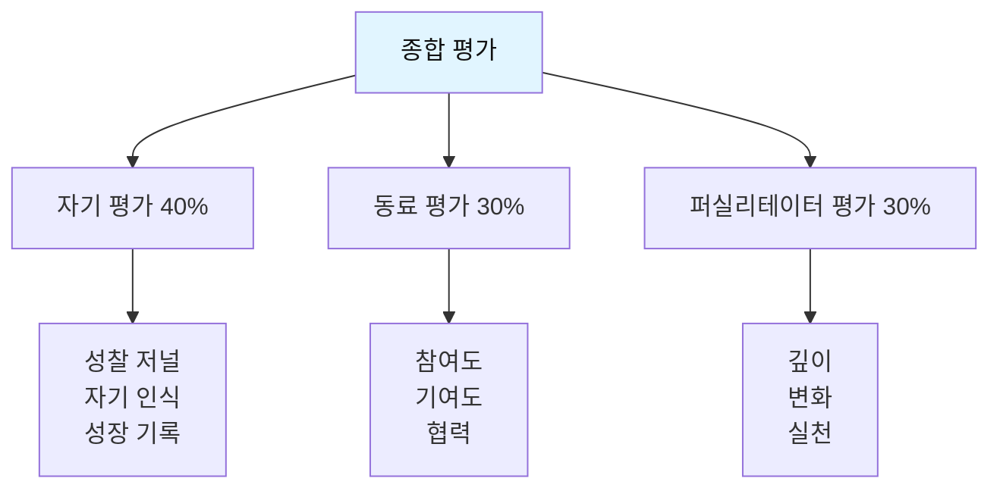

### 5.2 학기말 성찰 리뷰

**개인 성찰 질문**:

```
📝 한 학기 돌아보기

[독서 여정]
1. 이번 학기에 읽은 책:
   ① __________________
   ② __________________
   ③ __________________
   ④ __________________

2. 가장 인상 깊었던 책과 그 이유:
   ________________________________

[성장 성찰]
3. 가장 크게 변화한 점:
   이전: _________________________
   이후: _________________________

4. 발견한 나의 새로운 모습:
   ________________________________

5. 가장 어려웠던 순간과 극복 방법:
   ________________________________

[관계와 배움]
6. 동료들과의 대화에서 배운 점:
   ________________________________

7. 내가 기여한 것:
   ________________________________

[미래 계획]
8. 다음 학기 목표:
   ________________________________

9. 계속 탐구하고 싶은 질문:
   ________________________________

10. 나에게 이 독서 클럽은:
    한 단어로: ___________
    한 문장으로: ________________________________
```

---

## 🔧 6단계: 문제 해결 가이드

### 자주 발생하는 문제와 해결책

| 문제 상황 | 원인 | 해결 방법 |
|----------|------|----------|
| **참여가 저조함** | • 부담감<br/>• 흥미 부족<br/>• 시간 부족 | • 부담 줄이기 (분량 조절)<br/>• 흥미로운 활동 추가<br/>• 일정 재조정<br/>• 개별 상담 |
| **토론이 안 됨** | • 준비 부족<br/>• 분위기<br/>• 주제 어려움 | • 사전 질문지 제공<br/>• 소그룹 활동<br/>• 쉬운 주제부터<br/>• 아이스브레이킹 강화 |
| **일부만 발언** | • 성격 차이<br/>• 자신감 부족<br/>• 경쟁 분위기 | • 돌아가며 발표<br/>• 글로 먼저 작성<br/>• 소그룹 나누기<br/>• 칭찬 문화 |
| **표면적 대화** | • 질문 수준<br/>• 안전감 부족<br/>• 모델 부족 | • 질문 심화 연습<br/>• 신뢰 구축<br/>• 퍼실리테이터 시범<br/>• 우수 사례 공유 |
| **프로젝트 미완성** | • 시간 부족<br/>• 동기 부족<br/>• 방법 모름 | • 일정 재조정<br/>• 흥미 주제 연결<br/>• 단계별 가이드<br/>• 중간 피드백 |

---

## 📚 부록: 필수 양식 모음

### A. 출석부

```
[○○○ 독서 클럽 출석부]

기수: 20○○-○학기
레벨: ________________
퍼실리테이터: ________________

| 회차 | 날짜 | 이름1 | 이름2 | 이름3 | ... |
|------|------|-------|-------|-------|-----|
| 1차  | 3/7  | ✅    | ✅    | ❌    |     |
| 2차  | 3/14 | ✅    | ✅    | ✅    |     |
| 3차  | 3/21 |       |       |       |     |
...
```

### B. 모임 기록지

```
[모임 기록지]

날짜: __________ 회차: ____ 주차
참석: ____ / ____ 명
퍼실리테이터: ___________

[오늘의 활동]
━━━━━━━━━━━━━━━━━━
주제: ______________________
진행: ______________________

[주요 논점]
1. _________________________
2. _________________________
3. _________________________

[인상 깊은 의견]
• 누가: _____ 내용: _________
• 누가: _____ 내용: _________

[특이사항]
_____________________________

[다음 준비사항]
_____________________________

기록자: __________
```

### C. 퍼실리테이터 체크리스트

```
□ 모임 3일 전: 리마인더 발송
□ 모임 1일 전: 준비물 점검
□ 모임 1시간 전: 공간 세팅
□ 시작 전: 출석 체크
□ 진행 중: 시간 관리
□ 진행 중: 참여 독려
□ 종료 후: 정리 및 기록
□ 당일 중: 다음 모임 예고
□ 3일 이내: 모임 기록 공유
```

---

## 🛠️ 7단계: 메이커 워크숍 운영 프로세스

### 7.1 2주 스프린트 운영 모델

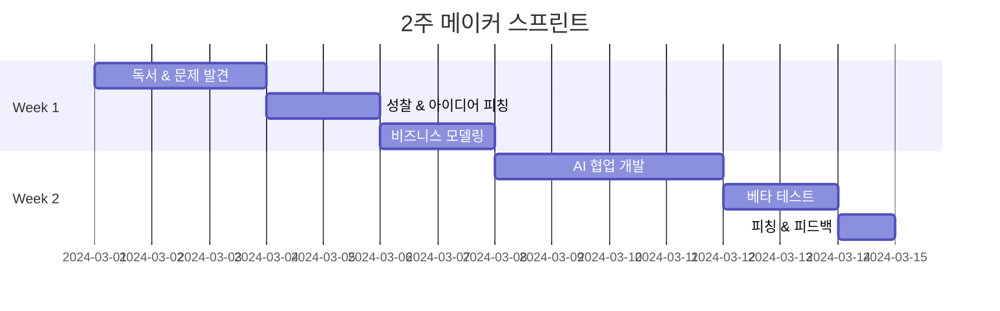

#### Day 1-3: 독서 & 문제 발견 워크숍 (3일)

**개인 활동 (자율)**:
- 책 읽기 + 문제 발견 일지 작성
- 페인 포인트 리스트 작성
- 5 Whys 분석

**모임 활동 (2시간)**:

```markdown
📅 문제 발견 워크숍

[도입 (15분)]
━━━━━━━━━━━━━━━━━━━━━━━━
• 체크인: 이번 주 발견한 문제 1가지씩 공유
• 오늘 목표: 진짜 문제 정의하기

[개인 워크 (30분)]
━━━━━━━━━━━━━━━━━━━━━━━━
각자 "진짜 문제 발견 워크시트" 작성
(README.md 참조)

□ 표면 문제 수집
□ Why 5번
□ 페인 포인트 분석
□ 기회 평가

[소그룹 공유 (30분)]
━━━━━━━━━━━━━━━━━━━━━━━━
4명씩 그룹
• 각자 문제 발표 (5분)
• 질문 & 피드백 (5분)
• 그룹별 베스트 문제 선정

[전체 공유 (30분)]
━━━━━━━━━━━━━━━━━━━━━━━━
• 각 그룹 베스트 문제 발표
• 투표: 가장 해결하고 싶은 문제
• 협업 제안

[마무리 (15분)]
━━━━━━━━━━━━━━━━━━━━━━━━
• 다음 단계 안내: 비즈니스 모델링
• 과제: 린 캔버스 초안 작성
```

#### Day 4-5: 성찰 & 비즈니스 모델링 (2일)

**개인 활동**:
- 성찰 저널 작성
- 린 캔버스 초안 작성
- 고객 인터뷰 3명 이상

**모임 활동 (2시간)**:

```markdown
💰 비즈니스 모델링 워크숍

[레벨별 활동]
━━━━━━━━━━━━━━━━━━━━━━━━

초등학생:
• 간단한 비즈니스 플랜 작성
• "누가 살까?" "얼마에 팔까?" 정하기
• 친구 10명에게 설문

중학생:
• 린 캔버스 작성
• 수익 모델 선택
• 예상 수익 계산

고등학생:
• 비즈니스 모델 캔버스 (BMC)
• 재무 계획
• 시장 조사

대학생:
• 사업 계획서 초안
• Unit Economics
• 투자 피칭 덱

[멘토링 (1시간)]
━━━━━━━━━━━━━━━━━━━━━━━━
• 1:1 또는 소그룹 멘토링
• 비즈니스 모델 검토
• 실현 가능성 점검
• 개선 방향 제시

[3분 피칭 연습 (1시간)]
━━━━━━━━━━━━━━━━━━━━━━━━
• 문제 → 솔루션 → 비즈니스 모델
• 동료 피드백
• 피칭 개선
```

#### Day 6-9: AI 협업 개발 스프린트 (4일)

**목표**: 2주 MVP 완성

**일일 스탠드업 (온라인, 15분)**:
```markdown
매일 아침 또는 저녁 단체 채팅방에서:

1. 어제 한 일 (Yesterday)
   _____________________________

2. 오늘 할 일 (Today)
   _____________________________

3. 막힌 부분 (Blocker)
   _____________________________

4. 도움 필요? (Help Needed)
   _____________________________
```

**개발 활동**:
- AI 도구 활용 개발
- GitHub에 코드 푸시
- 개발 로그 작성

**중간 점검 모임 (Day 7, 1시간)**:
```markdown
🔍 중간 점검

[데모 (30분)]
━━━━━━━━━━━━━━━━━━━━━━━━
• 각자 현재 진행 상황 시연
• 작동하는 부분 보여주기
• 어려운 점 공유

[피드백 (20분)]
━━━━━━━━━━━━━━━━━━━━━━━━
• 건설적 피드백
• 개선 아이디어
• 협업 제안

[리소스 공유 (10분)]
━━━━━━━━━━━━━━━━━━━━━━━━
• 유용한 AI 프롬프트
• 코드 스니펫
• 참고 자료
```

#### Day 10-11: 베타 테스트 (2일)

**목표**: 최소 10명의 실제 사용자 테스트

**테스트 프로토콜**:
```markdown
📊 베타 테스트 가이드

[1. 테스터 모집]
━━━━━━━━━━━━━━━━━━━━━━━━
• 타겟 고객 10명
• 다양한 페르소나
• 솔직한 피드백 가능한 사람

[2. 테스트 실행]
━━━━━━━━━━━━━━━━━━━━━━━━
각 테스터에게:
1. 제품 설명 (1분)
2. 사용 관찰 (10분)
3. 인터뷰 (5분)

관찰 포인트:
□ 첫 반응
□ 사용 흐름
□ 막히는 지점
□ 표정/반응

[3. 피드백 수집]
━━━━━━━━━━━━━━━━━━━━━━━━
질문:
1. 첫인상은?
2. 이해하기 쉬웠나요?
3. 불편한 점은?
4. 어떤 기능이 필요한가요?
5. 돈을 낼 의향이 있나요? 얼마?

[4. 데이터 분석]
━━━━━━━━━━━━━━━━━━━━━━━━
• 공통 피드백 정리
• 우선순위 결정
• 개선 계획 수립
```

#### Day 12: 최종 피칭 & 런칭 (1일)

**최종 발표회 (3시간)**:

```markdown
🚀 Demo Day & Pitch Competition

[오프닝 (15분)]
━━━━━━━━━━━━━━━━━━━━━━━━
• 환영 인사
• 2주간의 여정 회고
• 발표 순서 안내

[3분 피칭 + Q&A (각 10분, 총 120분)]
━━━━━━━━━━━━━━━━━━━━━━━━
각 발표:
• 3분 피칭 (README 템플릿)
• 라이브 데모
• 5분 Q&A
• 2분 피드백

평가 기준:
□ 문제 발견 (20점)
□ 비즈니스 모델 (20점)
□ 실행력 (30점)
□ 피칭 (15점)
□ 사용자 반응 (15점)

[시상 (15분)]
━━━━━━━━━━━━━━━━━━━━━━━━
• Best Problem Discovery
• Best Execution
• Best Business Model
• Audience Choice
• 전원 수료증

[네트워킹 (30분)]
━━━━━━━━━━━━━━━━━━━━━━━━
• 자유롭게 데모 체험
• 피드백 교환
• 협업 논의
• 사진 촬영
```

### 7.2 메이커 멘토링 가이드

#### 효과적인 멘토링 질문

| 단계 | 나쁜 질문 | 좋은 질문 | 왜? |
|------|----------|----------|-----|
| **문제 발견** | "문제가 뭐야?" | "누가 언제 이 문제를 가장 고통스럽게 겪어?" | 구체화 유도 |
| **비즈니스** | "돈을 어떻게 벌 거야?" | "고객이 왜 돈을 낼까? 얼마를 낼까?" | 고객 관점 |
| **개발** | "언제 완성돼?" | "오늘 사용자가 테스트할 수 있는 가장 작은 버전은?" | MVP 집중 |
| **디버깅** | "왜 안 돼?" | "어디까지 되고, 어디서부터 안 돼?" | 문제 구조화 |
| **피봇** | "포기할 거야?" | "지금까지 배운 것으로 어떻게 방향을 바꿀 수 있을까?" | 학습 강조 |

#### 멘토의 역할

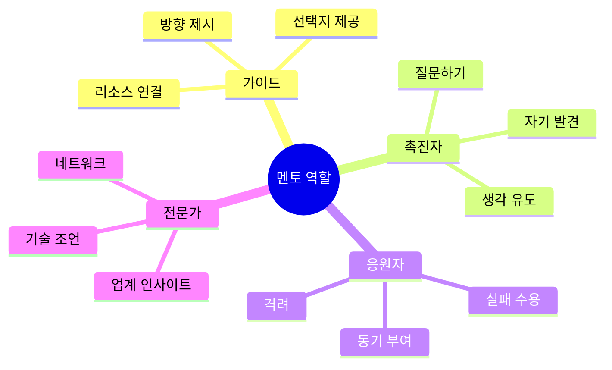

**멘토링 시간 배분**:
- 경청: 40%
- 질문: 30%
- 조언: 20%
- 격려: 10%

### 7.3 AI 도구 워크숍

#### 필수 AI 도구 온보딩 (첫 주)

```markdown
🤖 AI 도구 마스터 클래스 (2시간)

[1부: ChatGPT 기본 (30분)]
━━━━━━━━━━━━━━━━━━━━━━━━
• 계정 생성
• 프롬프트 작성법
• 대화형 개발
• 실습: 아이디어 브레인스토밍

[2부: Cursor 코딩 (45분)]
━━━━━━━━━━━━━━━━━━━━━━━━
• Cursor 설치
• AI 페어 프로그래밍
• 코드 생성 & 수정
• 실습: 간단한 웹페이지 만들기

[3부: 이미지 생성 AI (30분)]
━━━━━━━━━━━━━━━━━━━━━━━━
• Midjourney 또는 DALL-E
• 프롬프트 작성
• 실습: 로고/아이콘 생성

[4부: No-Code 도구 (15분)]
━━━━━━━━━━━━━━━━━━━━━━━━
• Notion AI
• Canva AI
• v0.dev 소개
```

### 7.4 성과 추적 & 포트폴리오

```markdown
📈 메이커 대시보드

각 멤버별 트래킹:

[정량 지표]
━━━━━━━━━━━━━━━━━━━━━━━━
• MVP 개수: ___개
• 완성도: ___%
• 사용자 수: ___명
• GitHub 커밋: ___개
• 피칭 횟수: ___회

[정성 지표]
━━━━━━━━━━━━━━━━━━━━━━━━
• 문제 발견 능력: ⭐⭐⭐⭐⭐
• 실행 속도: ⭐⭐⭐⭐⭐
• 디버깅 능력: ⭐⭐⭐⭐⭐
• 피칭 능력: ⭐⭐⭐⭐⭐
• 팀워크: ⭐⭐⭐⭐⭐

[포트폴리오 구축]
━━━━━━━━━━━━━━━━━━━━━━━━
□ GitHub 저장소 생성
□ README 작성
□ 라이브 데모 링크
□ 피칭 덱 업로드
□ 개발 로그 정리
□ Notion 포트폴리오 페이지
□ LinkedIn 프로젝트 등록
```

---

## 🎯 마무리: 메이커 클럽 성공의 핵심

### ✅ 꼭 기억할 10가지

1. **문제가 80%다**
   → 좋은 문제 발견이 좋은 솔루션을 만든다

2. **2주 룰을 지켜라**
   → 완벽함보다 빠른 실행이 학습을 만든다

3. **AI는 친구다**
   → 코딩이 막힐 때가 아니라 시작부터 함께

4. **사용자가 선생이다**
   → 10명의 피드백이 100시간의 고민보다 낫다

5. **실패는 배움이다**
   → 빠르게 실패하고 빠르게 배우는 문화

6. **비즈니스 사고를 심어라**
   → 취미와 사업의 차이는 수익 모델

7. **포트폴리오가 경쟁력이다**
   → 모든 과정을 기록하고 공유하라

8. **네트워크가 자산이다**
   → 멘토, 동료, 사용자 모두가 성장의 동력

9. **작은 성공을 축하하라**
   → 첫 사용자, 첫 피드백, 첫 수익 모두 의미 있다

10. **멘토도 배운다**
    → 메이커들에게서 배우는 겸손함을 가져라

---

**이 매뉴얼은 성장하는 문서입니다.**  
운영하며 배운 것들을 계속 추가하고 개선해주세요! 📝
