# 독서 × 글쓰기 × 문해력 통합 가이드
## 유아 · 초등 · 중등 · 고등 — 단계별 실전 완전판

> **핵심 철학 (최승필)**
> "공부머리는 지식이 아닌 **몰입**에서 나온다. 재미있는 독서만이 아이를 성장시킨다."
>
> **핵심 원칙**
> 독서 → 생각 → 글쓰기의 순환이 문해력과 사고력을 동시에 키운다.
> 앞 단계 기본기가 완성되지 않으면 다음 단계는 효과가 없다.

---

## 전체 발달 로드맵

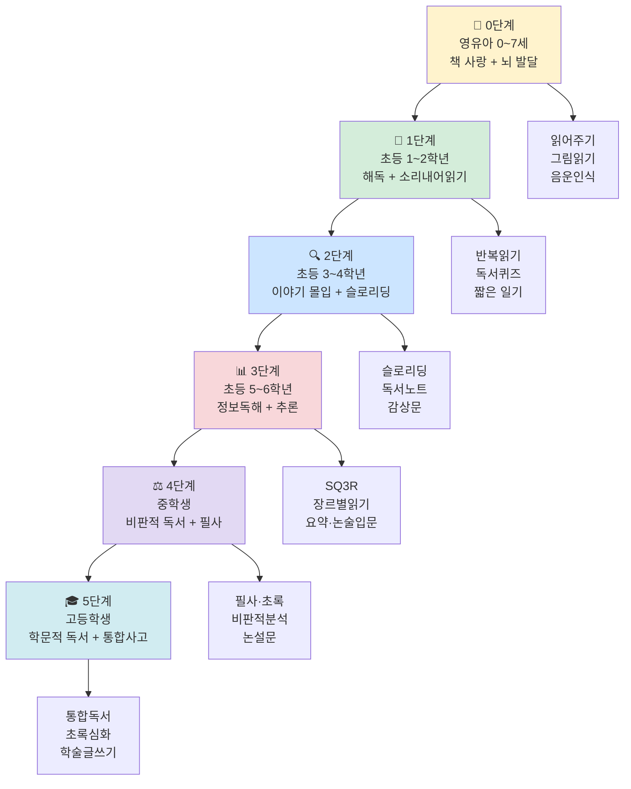

---

## 독서 위기 시기와 대응

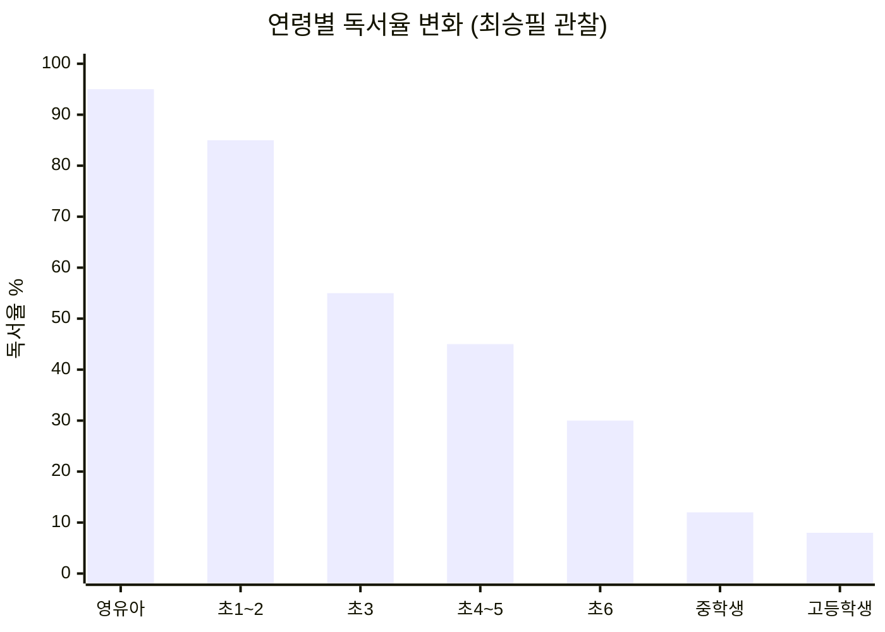

| 위기 시점 | 주요 원인 | 대응 전략 |
|-----------|-----------|-----------|
| **초등 3학년** | 지식책 강요, 부모가 책 선택, 학원 시작 | 이야기책 복귀, 아이가 직접 선택, 가족 독서 시간 |
| **중학교 입학** | 공부 압박, 스마트폰 경쟁, 독서=공부 인식 | 2주 1권 정독, 필사 도입, 독서=취미로 재정의 |

---

## 독서 × 글쓰기 연계 원리

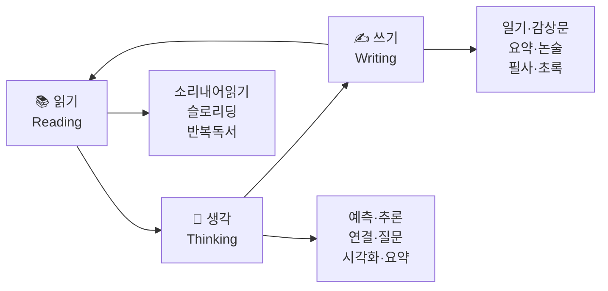

> 읽기와 쓰기는 분리된 기술이 아니다.
> 읽으면서 생각하고, 생각을 글로 쓰고, 쓴 글을 다시 읽는 순환이 문해력의 본질이다.

---

## 0단계 | 영유아 (0~7세)

### 핵심 목표: 책 사랑 형성 + 뇌 발달 + 조기교육 금지

> **뇌과학 근거**: 영유아기 과도한 학습은 스트레스 호르몬 **코르티솔**을 분비시켜
> 기억을 담당하는 **해마의 성장을 방해**한다.
> 핀란드는 8세 미만 아동에게 문자 교육을 **법으로 금지**한다.

---

### 독서 방법

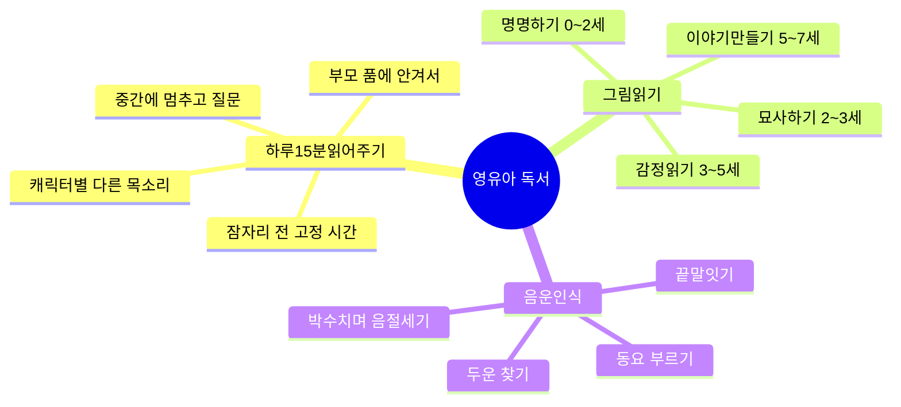

**하루 15분 읽어주기 — 실전 방법**

| 순서 | 행동 | 목적 |
|------|------|------|
| 읽기 전 | 표지 보며 "어떤 내용일까?" | 예측 사고 |
| 읽는 중 | 캐릭터마다 다른 목소리 | 감정 몰입 |
| 읽는 중 | "다음에 어떻게 될 것 같아?" | 추론 훈련 |
| 읽은 후 | "어떤 부분이 재미있었어?" | 언어 표현 |
| 반복 | 같은 책 반복 요청 허용 | 언어 내면화 |

> ⚠️ 오디오북은 상호교감이 없어 효과가 절반 이하. 부모가 직접 읽어줘야 한다.

---

### 글쓰기 연계 (이 시기는 '말하기'가 글쓰기의 전 단계)

```
그림 보고 이야기 말하기
  → "이 그림에서 무슨 일이 일어나고 있어?"
  → 아이가 말한 내용을 부모가 받아 적기
  → 적은 것을 아이에게 읽어주기
  → "이게 네가 한 말이야" — 말이 글이 된다는 인식 형성
```

---

### 추천 도서

| 연령 | 추천 도서 | 특징 |
|------|-----------|------|
| 0~2세 | 《까꿍》 《색깔 그림책》 | 감각 자극, 소리 반복 |
| 2~4세 | 《강아지똥》 권정생 / 《구름빵》 백희나 | 의성어·의태어, 감정 |
| 4~6세 | 《파도야 놀자》 이수지 (글 없는 그림책) | 그림으로 이야기 읽기 |
| 4~6세 | 《100층짜리 집》 이와이 도시오 | 상상력, 수 개념 |
| 6~7세 | 《마당을 나온 암탉》 황선미 (짧은 챕터) | 서사 구조 인식 |

---

## 1단계 | 초등 저학년 (1~2학년)

### 핵심 목표: 해독 완성 + 소리 내어 읽기 유창성

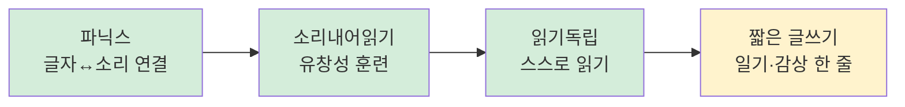

---

### 독서 방법: 소리 내어 읽기 4단계

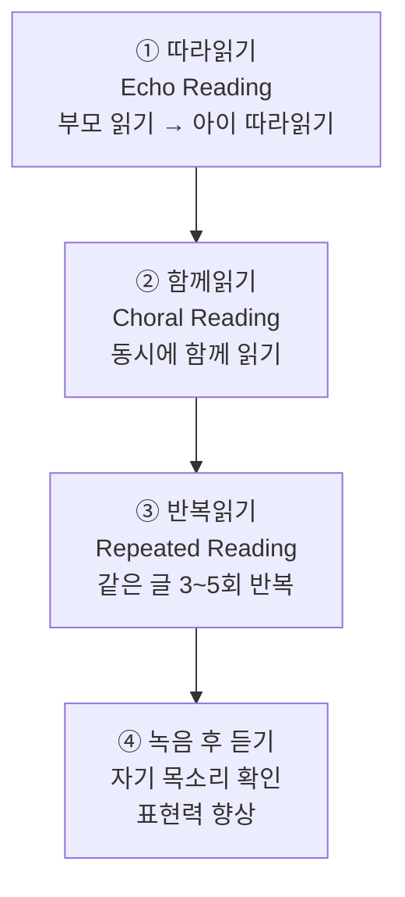

**반복 읽기 실전 예시**

```
[텍스트] 짧은 동화 한 단락 (5~7문장)

1회: 천천히, 틀려도 OK
2회: 조금 더 빠르게
3회: 자연스럽게
4회: 캐릭터가 된 것처럼
5회: 녹음해서 들어보기
```

**유창성의 3요소**

| 요소 | 의미 | 훈련 방법 |
|------|------|-----------|
| 정확성 | 글자를 틀리지 않고 읽기 | 모르는 글자 짚어주기 |
| 속도 | 1분 100자 이상 | 타이머 활용 반복 읽기 |
| 표현력 | 의미에 맞게 억양 조절 | 연극처럼 읽기 |

---

### 글쓰기 연계: 하루 한 줄 일기

```
형식: 날짜 + 한 문장 + 그림

예시:
  오늘 《강아지똥》을 읽었다.
  강아지똥이 민들레꽃이 되어서 기뻤다.
  [그림]

핵심: 맞춤법보다 표현의 즐거움이 먼저
      틀린 것을 바로 고쳐주지 말 것
      "잘 썼네!" 칭찬이 글쓰기 동기를 만든다
```

---

### 방학 특별 프로그램: 독서퀴즈대회

```
준비: 아이 학년 수준 책 5권 (아이가 직접 선택)
진행: 방학 동안 5권 읽기
퀴즈: 주인공 이름 / 주요 사건 / 결말 / 내 생각
보상: 일정 점수 이상 → 아이가 원하는 상품
효과: 5권 읽고 학기 복귀 시 독해력 눈에 띄게 향상
```

---

### 추천 도서

| 분류 | 도서 | 활용법 |
|------|------|--------|
| 소리내어읽기 | 《아씨방 일곱 동무》 이영경 | 의성어·의태어 풍부 |
| 소리내어읽기 | 《팥죽 할머니와 호랑이》 조대인 | 반복 구조 |
| 이야기책 | 《개구리와 두꺼비》 아널드 로벨 | 짧은 챕터, 우정 |
| 이야기책 | 《나쁜 어린이 표》 황선미 | 일상 공감 |
| 이야기책 | 《마당을 나온 암탉》 황선미 | 감동 서사 |

---

### 체크리스트

- [ ] 모든 글자를 정확하게 소리 내어 읽는다
- [ ] 1분에 100자 이상 유창하게 읽는다
- [ ] 읽은 이야기의 주요 내용을 말할 수 있다
- [ ] 하루 한 줄 일기를 쓴다
- [ ] 독서를 즐거운 시간으로 경험한다

---

## 2단계 | 초등 중학년 (3~4학년)

### 핵심 목표: 이야기책 몰입 + 슬로리딩 입문 + 독서노트 시작

> **최승필**: "초등 3학년은 독서의 첫 번째 위기다.
> 이 시기에 지식책으로 전환하면 독서를 싫어하게 된다.
> 장편 이야기책에 푹 빠지는 경험을 충분히 해야 한다."

---

### 독서 방법: 6가지 능동적 이해 전략

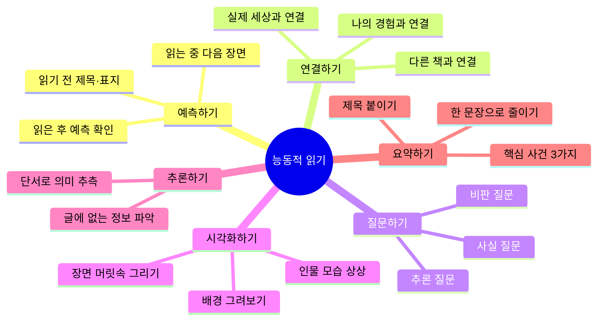

---

### 슬로리딩 (초등 4학년부터)

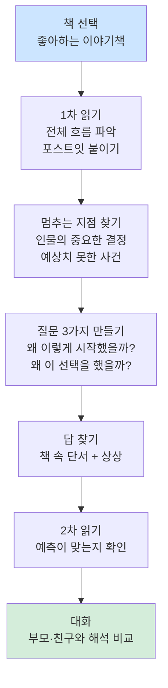

**슬로리딩 질문 카드**

| 질문 유형 | 예시 질문 |
|-----------|-----------|
| 인물 | 왜 이 인물은 이런 선택을 했을까? |
| 인물 | 이 인물의 가장 큰 두려움은 무엇일까? |
| 사건 | 왜 작가는 이 사건을 넣었을까? |
| 사건 | 이 사건이 없었다면 이야기가 어떻게 달라졌을까? |
| 주제 | 작가가 이 책을 통해 말하고 싶은 것은? |

**실전 예시 — 《마당을 나온 암탉》**

```
장면: 잎싹이 마당을 탈출하기로 결심하는 장면

질문: "자유와 안전 중 어느 것이 더 중요할까?"
아이: "자유가 더 중요한 것 같아요"
부모: "왜 그렇게 생각해?"
아이: "갇혀 있으면 진짜 사는 게 아닌 것 같아서요"

→ 이 대화가 사고력과 언어 능력을 키운다
```

---

### 글쓰기 연계: 독서노트 + 감상문

**독서노트 기본 형식**

```
┌──────────────────────────────────────┐
│ 책 제목:              읽은 날짜:     │
├──────────────────────────────────────┤
│ 가장 기억에 남는 장면:               │
│                                      │
├──────────────────────────────────────┤
│ 내가 느낀 점:                        │
│                                      │
├──────────────────────────────────────┤
│ 궁금한 점 / 질문:                    │
│                                      │
├──────────────────────────────────────┤
│ 내가 주인공이라면:                   │
│                                      │
└──────────────────────────────────────┘
```

**감상문 쓰기 3단계**

```
1단계: 줄거리 (2~3문장)
  → 누가, 무엇을, 어떻게 했는지

2단계: 인상적인 장면 (1~2문장)
  → 왜 그 장면이 기억에 남는지

3단계: 내 생각 (2~3문장)
  → 내가 배운 것, 느낀 것, 연결된 경험
```

---

### 추천 도서

| 분류 | 도서 | 슬로리딩 포인트 |
|------|------|----------------|
| 장편 이야기 | 《마당을 나온 암탉》 황선미 | 자유와 모성 |
| 장편 이야기 | 《몽실 언니》 권정생 | 전쟁과 희생 |
| 장편 이야기 | 《나의 라임오렌지나무》 바스콘셀로스 | 성장과 슬픔 |
| 장편 이야기 | 《샬롯의 거미줄》 E.B.화이트 | 우정과 죽음 |
| 슬로리딩 입문 | 《아낌없이 주는 나무》 실버스타인 | 짧고 깊은 의미 |

---

### 체크리스트

- [ ] 200페이지 이상 장편 이야기책을 끝까지 읽는다
- [ ] 읽으면서 질문을 만드는 습관이 생겼다
- [ ] 독서노트를 꾸준히 쓴다
- [ ] 4학년부터 슬로리딩을 시작한다
- [ ] 감상문을 3단계로 쓸 수 있다

---

## 3단계 | 초등 고학년 (5~6학년)

### 핵심 목표: 정보 텍스트 읽기 + 추론 + 장르별 전략 + 요약·논술 입문

---

### 독서 방법: SQ3R

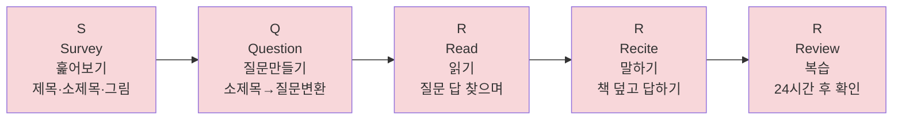

**정보 텍스트 구조 5가지**

| 구조 | 특징 | 읽기 전략 |
|------|------|-----------|
| 기술·묘사 | 대상의 특징 설명 | 핵심어와 세부 정보 구분 |
| 순서·절차 | 시간 순서나 단계 | 순서도 그리며 읽기 |
| 비교·대조 | 두 가지 이상 비교 | 벤다이어그램 그리기 |
| 원인·결과 | 왜 일어났는지 | 원인→결과 화살표 정리 |
| 문제·해결 | 문제와 해결책 | 문제-해결 표로 정리 |

---

### 장르별 읽기 전략

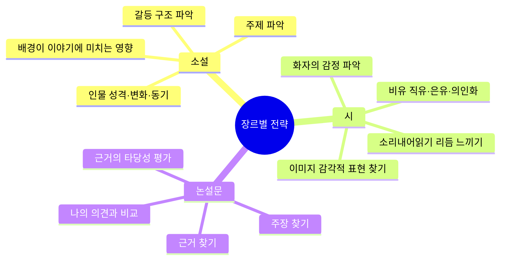

---

### 추론 읽기 — 행간을 읽다

```
추론 3단계:

1단계: 사실 확인 (글에 있는 정보)
  "글에서 직접 찾을 수 있는 내용은?"

2단계: 추론 (글의 단서 + 배경지식)
  "글에서 직접 말하지 않지만 알 수 있는 것은?"

3단계: 비판·평가 (글 밖의 판단)
  "이 내용에 동의하는가? 왜?"

실전 훈련 — "왜냐하면" 연습:
  글의 단서: "철수는 창문을 닫았다."
  추론: 철수는 추웠을 것이다.
  근거: 왜냐하면 추울 때 창문을 닫기 때문이다.
```

---

### 글쓰기 연계: 요약문 → 논술 입문

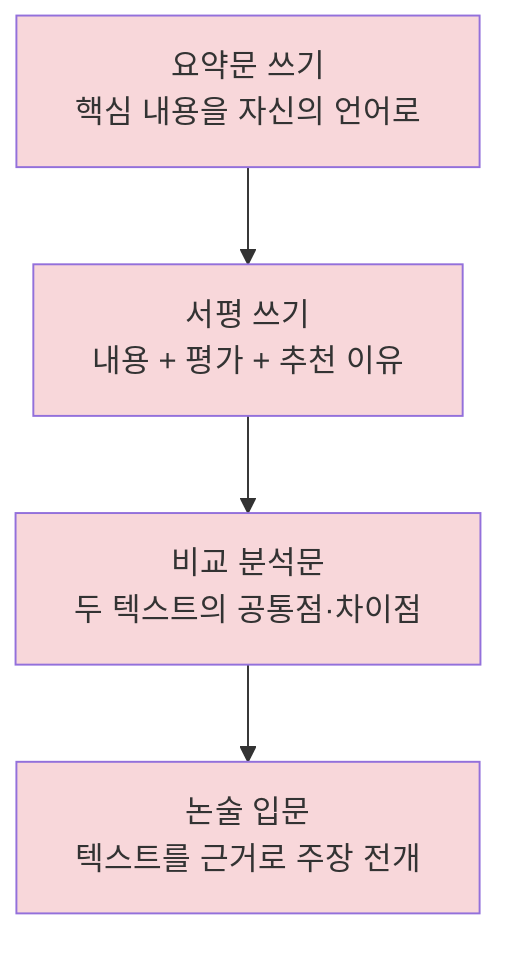

**서평 쓰기 형식**

```
제목: 《책 제목》을 읽고

1. 이 책은 어떤 책인가? (2~3문장 요약)
2. 가장 인상적인 부분은? (이유 포함)
3. 이 책의 좋은 점과 아쉬운 점은?
4. 누구에게 추천하고 싶은가? 왜?
```

---

### 추천 도서

| 분류 | 도서 | 글쓰기 연계 |
|------|------|------------|
| 슬로리딩 | 《소나기》 황순원 | 감정 묘사 따라쓰기 |
| 슬로리딩 | 《어린 왕자》 생텍쥐페리 | 철학적 질문 글쓰기 |
| 논설 입문 | 《왜 세계의 절반은 굶주리는가》 장 지글러 | 주장·근거 분석 |
| 정보 | 《수학귀신》 엔첸스베르거 | 개념 정리 초록 |
| 이야기 | 《완득이》 김려령 | 인물 분석 글쓰기 |

---

### 체크리스트

- [ ] SQ3R 방법으로 교과서를 읽는다
- [ ] 정보 텍스트의 구조를 파악하며 읽는다
- [ ] 추론 읽기를 할 수 있다
- [ ] 서평을 4단계로 쓸 수 있다
- [ ] 장르에 따라 다른 읽기 전략을 쓴다

---

## 4단계 | 중학생 (1~3학년)

### 핵심 목표: 비판적 독서 + 필사 + 초록 + 논설문 쓰기

> **최승필**: "중학생 기준으로 2주마다 책 한 권을 제대로 읽으면,
> 10개월 만에 언어 능력과 성적이 오른다."

---

### 독서 방법: 비판적 읽기 4가지 질문

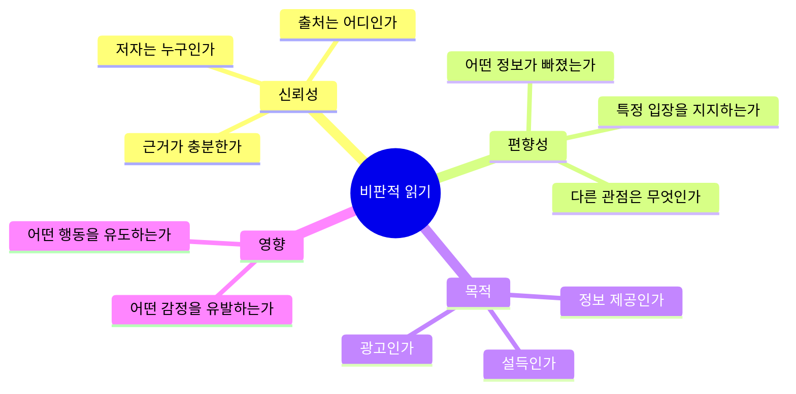

**논증 구조 분석**

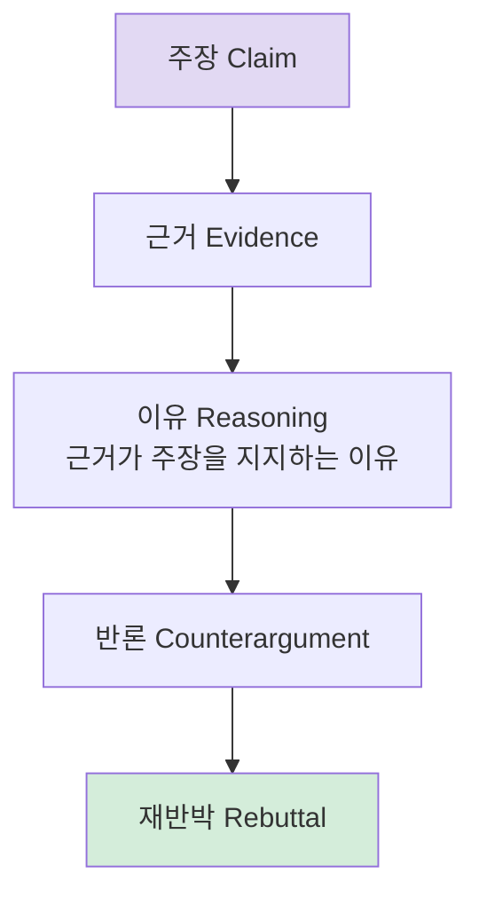

---

### 필사 (중학생 이상 권장)

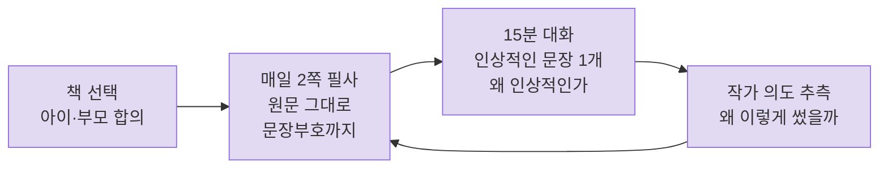

> ⚠️ 초등학생에게는 절대 시키지 말 것 (최승필)

**필사 실전 예시**

```
[텍스트] 《아몬드》 손원평 중 한 단락

필사 후 대화:
  부모: "오늘 필사한 부분에서 가장 인상적인 문장은?"
  아이: "감정을 느끼지 못하는 주인공이 오히려 더 외로워 보였어요"
  부모: "왜 그렇게 느꼈어?"
  아이: "감정이 없으면 연결될 수 없으니까요"
  부모: "작가는 왜 이런 인물을 만들었을까?"
```

---

### 초록 — 지식책 읽기의 기술

```
1단계: 중요한 부분에 밑줄 + 별표
  → 처음에는 이것만 해도 충분

2단계: 핵심어 추출
  → 밑줄 친 부분에서 가장 중요한 단어 5개
  → 그 단어들로 내용 설명해보기

3단계: 커닝페이퍼 만들기
  → A4 반 장에 챕터 전체 내용 정리
  → 나중에 이것만 봐도 내용이 떠오르도록

4단계: 교과서에 적용
  → 교과서 읽을 때도 같은 방법 사용
```

---

### 글쓰기 연계: 논설문 쓰기

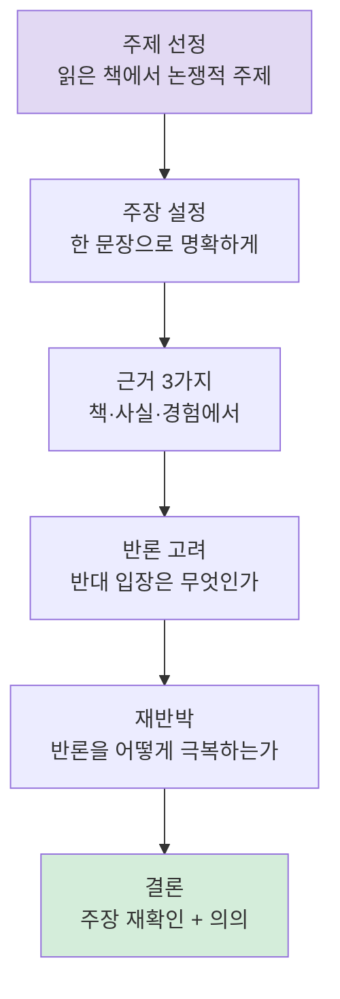

**논설문 실전 예시 — 《82년생 김지영》 읽고**

```
주제: 성별 불평등은 여전히 존재하는가

주장: 한국 사회의 성별 불평등은 구조적으로 지속되고 있다

근거 1: 책 속 김지영의 경험 (직접 인용)
근거 2: 통계 데이터 (성별 임금 격차)
근거 3: 내 주변의 실제 사례

반론: "요즘은 오히려 남성이 역차별받는다"
재반박: "역차별 논의는 구조적 불평등을 개인 경쟁으로 환원하는 오류"

결론: 개인의 노력이 아닌 구조적 변화가 필요하다
```

---

### 추천 도서

| 분류 | 도서 | 글쓰기 연계 |
|------|------|------------|
| 필사용 | 《아몬드》 손원평 | 감정·공감 묘사 |
| 필사용 | 《데미안》 헤르만 헤세 | 자아 탐색 에세이 |
| 필사용 | 《채식주의자》 한강 | 문장 밀도·상징 분석 |
| 초록용 | 《왜 세계의 절반은 굶주리는가》 | 주장·근거 분석 |
| 초록용 | 《정의란 무엇인가》 마이클 샌델 (발췌) | 논증 구조 분석 |
| 논설 | 《82년생 김지영》 조남주 | 사회 문제 논설문 |

---

### 체크리스트

- [ ] 2주에 1권 이상 정독한다
- [ ] 필사를 주 5일 2쪽씩 실천한다
- [ ] 교과서 읽을 때 초록 방법을 사용한다
- [ ] 논설문을 6단계 구조로 쓸 수 있다
- [ ] 글쓴이의 관점과 의도를 파악하며 읽는다

---

## 5단계 | 고등학생 (1~3학년)

### 핵심 목표: 학문적 독서 + 메타인지 + 통합 독서 + 학술 글쓰기

---

### 독서 방법: 메타인지 독서

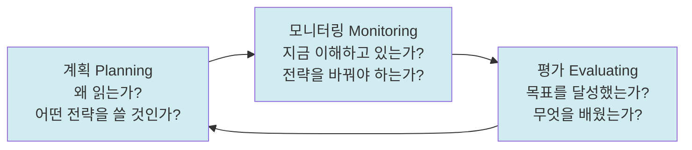

**이해 점검 신호**

| 이해할 때 | 이해 안 될 때 |
|-----------|--------------|
| 머릿속에 그림이 그려진다 | 같은 문장을 여러 번 읽게 된다 |
| 앞 내용과 연결된다 | 머릿속이 멍하다 |
| 예측이 맞아 들어간다 | 앞 내용이 기억나지 않는다 |
| → 계속 읽기 | → 소리 내어 읽기, 다시 읽기 |

---

### SQ4R + 코넬 노트

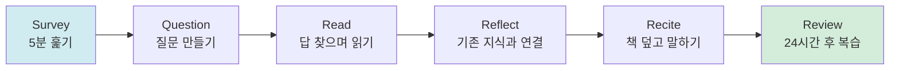

**코넬 노트 형식**

```
┌──────────────────┬────────────────────────────────────┐
│                  │                                    │
│  핵심어 / 질문   │         상세 내용 메모             │
│   (좌측 1/3)    │          (우측 2/3)                │
│                  │                                    │
│                  │                                    │
├──────────────────┴────────────────────────────────────┤
│              요약 (하단 1/5)                           │
│  핵심 내용을 2~3문장으로 정리                          │
└───────────────────────────────────────────────────────┘
```

---

### 통합 독서 — 여러 텍스트를 하나로

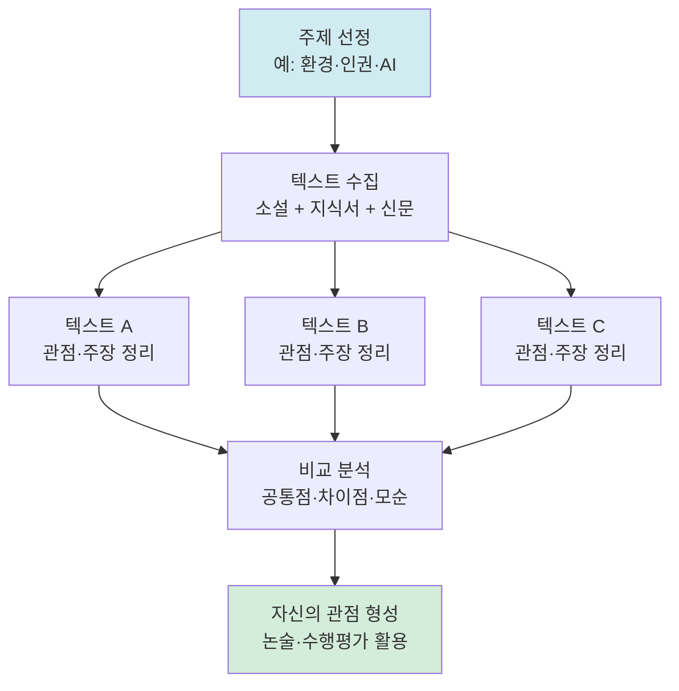

---

### 교과별 읽기 전략

| 교과 | 텍스트 구조 | 읽기 전략 |
|------|------------|-----------|
| 국어·문학 | 시·소설·비문학 | 화자→상황→정서→표현→주제 |
| 사회·역사 | 인과·비교·논증 | 맥락 파악 → 다양한 해석 비교 |
| 과학 | 가설→실험→결론 | 그래프·표와 본문 연결 |
| 수학 | 정의→정리→증명 | 모든 조건의 의미 파악 |

---

### 글쓰기 연계: 학술 글쓰기 단계

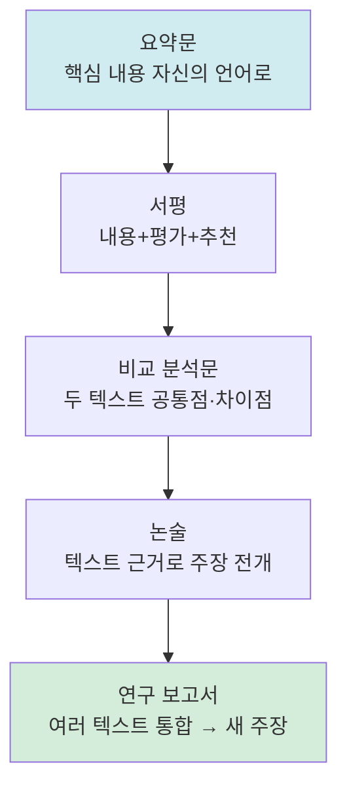

**연구 보고서 구조**

```
1. 서론: 연구 질문 제시
   "왜 이 주제를 탐구하는가?"

2. 본론 1: 텍스트 A 분석
   핵심 주장 + 근거 + 나의 평가

3. 본론 2: 텍스트 B 분석
   핵심 주장 + 근거 + 나의 평가

4. 비교·통합: 두 텍스트의 공통점·차이점

5. 결론: 자신의 관점 + 새로운 질문
```

---

### 추천 도서

| 분류 | 도서 | 글쓰기 연계 |
|------|------|------------|
| 문학·필사 | 《채식주의자》 한강 | 문장 분석·필사 |
| 문학·필사 | 《소년이 온다》 한강 | 역사 인식 논술 |
| 문학·필사 | 《파친코》 이민진 | 정체성·역사 보고서 |
| 인문·초록 | 《사피엔스》 유발 하라리 | 통합 독서 |
| 인문·초록 | 《정의란 무엇인가》 마이클 샌델 | 철학 논술 |
| 과학·초록 | 《코스모스》 칼 세이건 | 과학 글쓰기 |
| 사회·통합 | 《침묵의 봄》 레이첼 카슨 | 환경 보고서 |

---

### 체크리스트

- [ ] 교과별로 다른 읽기 전략을 적용한다
- [ ] 읽는 중 자신의 이해 상태를 점검한다
- [ ] 코넬 노트로 체계적으로 메모한다
- [ ] 여러 텍스트를 통합하여 자신의 관점을 형성한다
- [ ] 연구 보고서 형식으로 글을 쓸 수 있다

---

## 5가지 핵심 독서법 총정리

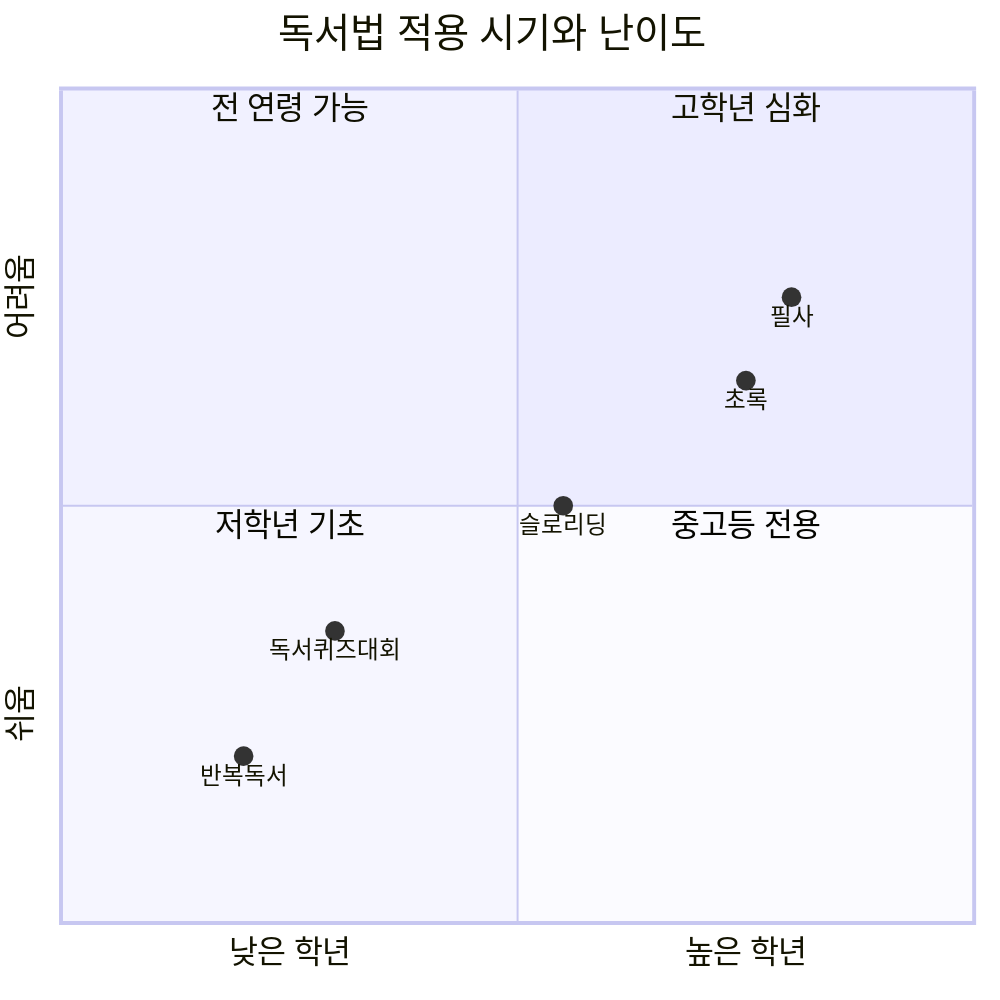

| 독서법 | 대상 | 방법 | 효과 |
|--------|------|------|------|
| **반복독서** | 전 연령 | 같은 책 3번 반복 | 사고의 극대치 경험 |
| **독서퀴즈대회** | 전 연령 | 방학 5권 + 퀴즈 + 보상 | 독서 동기 부여 |
| **슬로리딩** | 초4 이상 | 멈추고 질문 → 답 찾기 | 사고력·언어 능력 향상 |
| **초록** | 중학생~ | 밑줄 → 핵심어 → 커닝페이퍼 | 지식 체계화 |
| **필사** | 중학생~ | 주 5일 2쪽 + 15분 대화 | 문장력·사고력 향상 |

---

## 단계 간 연결 — 무엇이 이어지는가

```mermaid
flowchart TD
    A["영유아<br> 음운인식 완성<br> 그림으로 이야기 말하기<br> 책에 대한 긍정적 태도"] --> B["초등 저학년<br> 모든 글자 정확히 읽기<br> 1분 100자 유창하게<br> 5W1H로 내용 말하기"]
    B --> C["초등 중학년<br> 묵독으로 긴 글 읽기<br> 6가지 이해 전략 사용<br> 독서노트 꾸준히 쓰기"]
    C --> D["초등 고학년<br> 정보 텍스트 구조 파악<br> 추론 읽기 가능<br> 서평 쓰기"]
    D --> E["중학생<br> 비판적 읽기 습관화<br> 논증 구조 분석<br> 논설문 쓰기"]
    E --> F["고등학생<br> 통합 독서<br> 메타인지 독서<br> 학술 글쓰기"]

    style A fill:#fff3cd,color:#333
    style B fill:#d4edda,color:#333
    style C fill:#cce5ff,color:#333
    style D fill:#f8d7da,color:#333
    style E fill:#e2d9f3,color:#333
    style F fill:#d1ecf1,color:#333
```

---

## 부모·교사를 위한 핵심 원칙

```mermaid
mindmap
  root((독서 교육 원칙))
    아이가 스스로 고른다
      선택지가 많으면 칸을 좁혀줘라
      부모가 고른 책은 집중력이 떨어진다
    가족 독서 시간
      하루 1시간 주 2~3회
      부모가 옆에서 함께 읽는다
      협상하지 말 것
    독서 편식 허용
      한 분야 집중은 좋은 신호
      균형 잡힌 독서 강요 금지
    재미가 먼저
      지식 전집보다 이야기책
      공부가 아닌 취미로
    책 읽는 아이를 믿는다
      단기 성과보다 장기 언어 능력
      결국 성적이 따라온다
```

---

## ❓ 자주 묻는 질문 40가지

### 📌 영유아 관련 (Q1~Q8)

**Q1. 몇 살부터 책을 읽어줘야 하나요?**
- 태어나는 순간부터입니다. 신생아도 부모의 목소리를 듣고 언어 리듬을 흡수합니다. 0세부터 하루 15분 읽어주기를 시작하세요.

**Q2. 아이가 책을 찢고 입에 넣어요. 읽어줘야 하나요?**
- 네, 계속 읽어주세요. 이 시기 아이에게 책은 탐색 대상입니다. 찢어지지 않는 보드북을 활용하고, 읽어주는 행위 자체가 언어 발달에 핵심입니다.

**Q3. 같은 책만 반복해서 읽어달라고 해요. 새 책을 사줘야 하나요?**
- 반복 요청은 매우 좋은 신호입니다. 같은 책을 반복할수록 언어가 내면화됩니다. 새 책을 강요하지 마세요.

**Q4. 한글을 일찍 가르치면 독서에 유리하지 않나요?**
- 오히려 반대입니다. 조기 문자 교육은 스트레스 호르몬 코르티솔을 분비시켜 해마 성장을 방해합니다. 핀란드는 8세 미만 문자 교육을 법으로 금지합니다.

**Q5. 오디오북으로 읽어줘도 되나요?**
- 부모가 직접 읽어주는 것의 대체재가 될 수 없습니다. 오디오북은 상호교감이 없어 효과가 절반 이하입니다. 어려운 책의 사전 학습용으로는 활용 가능합니다.

**Q6. 그림책은 언제까지 읽어줘야 하나요?**
- 초등학교 입학 후에도 계속 읽어줄 수 있습니다. 그림책은 유아만을 위한 것이 아닙니다. 좋은 그림책은 모든 연령에 깊은 사고를 유발합니다.

**Q7. 글 없는 그림책이 효과가 있나요?**
- 매우 효과적입니다. 아이가 그림을 보며 이야기를 만드는 과정이 서사 구조 인식, 구술 표현력, 상상력을 동시에 키웁니다. 이수지 작가의 《파도야 놀자》를 추천합니다.

**Q8. 동요나 동시도 독서 교육에 포함되나요?**
- 핵심적인 음운 인식 훈련입니다. 동요를 부르고 끝말잇기를 하는 것이 읽기 학습의 전제 조건인 음운 인식 능력을 키웁니다.

---

### 📌 초등 저학년 관련 (Q9~Q15)

**Q9. 소리 내어 읽기를 언제까지 해야 하나요?**
- 묵독으로 전환한 후에도 어려운 텍스트, 시, 연설문은 계속 소리 내어 읽어야 합니다. 소리 내어 읽기는 모든 연령에서 유효한 훈련입니다.

**Q10. 아이가 읽을 때 자꾸 틀려요. 바로 고쳐줘야 하나요?**
- 의미를 해치지 않는 작은 오류는 흐름을 끊지 말고 넘어가세요. 읽기가 끝난 후 부드럽게 알려주는 것이 좋습니다. 즉각적인 교정은 읽기에 대한 불안을 키웁니다.

**Q11. 아이가 읽기 싫다고 해요. 어떻게 해야 하나요?**
- 강요하지 마세요. 대신 부모가 옆에서 책을 읽는 모습을 보여주고, 아이가 원하는 책을 스스로 고르게 하세요. 독서를 공부가 아닌 즐거운 시간으로 만드는 것이 먼저입니다.

**Q12. 만화책, 학습만화도 독서로 인정해야 하나요?**
- 독서 입문 단계에서는 허용하되, 점차 글밥이 있는 책으로 전환을 유도하세요. 학습만화는 정보를 제공하지만 읽기 능력 자체를 키우지는 않습니다.

**Q13. 독서 기록장을 꼭 써야 하나요?**
- 초등 저학년에게 독서 기록을 강요하면 독서 자체를 싫어하게 됩니다. 하루 한 줄 일기나 그림으로 표현하는 것부터 자연스럽게 시작하세요.

**Q14. 책을 빨리 읽는 아이가 더 잘 읽는 건가요?**
- 아닙니다. 속독은 오히려 이해력을 떨어뜨립니다. 읽고 이해하는 것이 세트입니다. 빠르게 눈으로 훑는 것은 읽기가 아닙니다.

**Q15. 영어책도 같이 읽어줘야 하나요?**
- 모국어 독서 능력이 먼저입니다. 한국어 읽기 능력이 탄탄해야 영어 독서도 효과가 있습니다. 영어책 읽어주기는 모국어 독서와 병행하되, 모국어를 우선하세요.

---

### 📌 초등 중·고학년 관련 (Q16~Q23)

**Q16. 초등 3학년부터 독서량이 줄어요. 왜 그런가요?**
- 가장 흔한 원인은 지식책 강요, 부모의 책 선택, 학원 증가입니다. 이 시기에 아이가 좋아하는 이야기책을 스스로 고르게 하고, 가족 독서 시간을 확보하세요.

**Q17. 교과 연계 도서를 읽히면 공부에 도움이 되지 않나요?**
- 단기적으로는 도움이 되는 것처럼 보이지만 장기적으로는 손해입니다. 지식 전집보다 아이가 몰입할 수 있는 이야기책이 언어 능력과 사고력을 더 키웁니다.

**Q18. 독서 편식이 걱정돼요. 다양한 분야를 읽혀야 하지 않나요?**
- 독서 편식은 재미있게 읽고 있다는 증거입니다. 한 분야에 집중하는 것이 독서 몰입의 신호입니다. 균형 잡힌 독서를 강요하면 오히려 독서를 싫어하게 됩니다.

**Q19. 슬로리딩을 하면 독서 속도가 너무 느려지지 않나요?**
- 슬로리딩은 모든 책에 적용하는 것이 아닙니다. 깊이 읽고 싶은 한 권을 선택해서 적용합니다. 나머지 책은 자유롭게 읽으면 됩니다.

**Q20. 독서 후 독후감을 꼭 써야 하나요?**
- 강요하면 독서를 싫어하게 됩니다. 대신 대화로 시작하세요. "어떤 부분이 재미있었어?"라는 질문 하나가 독후감보다 훨씬 효과적입니다. 쓰고 싶을 때 쓰게 하세요.

**Q21. 지식책은 언제부터 읽혀야 하나요?**
- 200페이지 이상의 장편 이야기책을 재미있게 읽을 수 있을 때부터입니다. 이야기책 기초 없이 지식책을 강요하면 독서를 싫어하게 됩니다.

**Q22. 논술 학원을 보내면 글쓰기 실력이 늘지 않나요?**
- 논술 학원은 형식을 가르치지만 내용을 만드는 힘은 독서에서 나옵니다. 독서 없는 논술 훈련은 빈 그릇에 모양만 만드는 것입니다.

**Q23. 책 읽는 속도가 너무 느려요. 속독을 훈련시켜야 하나요?**
- 속독 훈련은 권장하지 않습니다. 읽기 속도는 이해력이 향상되면 자연스럽게 빨라집니다. 이해 없는 속독은 읽기 능력을 키우지 않습니다.

---

### 📌 중학생 관련 (Q24~Q30)

**Q24. 중학생인데 책을 전혀 안 읽어요. 너무 늦은 건가요?**
- 늦지 않았습니다. 중학생 기준으로 2주마다 책 한 권을 제대로 읽으면 10개월 만에 언어 능력과 성적이 오릅니다. 지금 시작하세요.

**Q25. 필사가 정말 효과가 있나요?**
- 네. 필사는 문장의 구조와 리듬을 몸으로 익히는 훈련입니다. 작가의 문장을 손으로 옮겨 쓰면서 글쓰기 능력이 자연스럽게 향상됩니다. 단, 부모와 아이가 합의해서 진행해야 합니다.

**Q26. 어떤 책으로 필사를 시작해야 하나요?**
아이가 좋아하는 이야기책으로 시작하세요. 문장이 아름다운 책이 좋습니다. 《아몬드》, 《완득이》, 《데미안》 등이 중학생에게 적합합니다.

**Q27. 수능 국어 성적을 올리려면 어떻게 해야 하나요?**
- 수능 국어는 읽기 능력의 총합입니다. 단기 문제 풀이보다 꾸준한 독서와 초록 훈련이 근본적인 해결책입니다. 비문학 지문 유형별로 관련 분야 교양서를 읽으면 배경지식이 쌓여 독해 속도가 빨라집니다.

**Q28. 독서와 성적은 정말 연관이 있나요?**
- 아이의 성적은 결국 언어 능력에 맞춰 제자리를 찾아갑니다. 영어·수학만 잘하던 아이가 중학교에서 성적이 떨어지는 것은 언어 능력의 한계가 드러나는 것입니다.

**Q29. 초록과 필사를 동시에 해야 하나요?**
- 이야기책은 필사, 지식책은 초록으로 구분해서 사용하세요. 동시에 할 필요는 없습니다. 먼저 하나를 습관화한 후 다른 것을 추가하세요.

**Q30. 독서 토론이 효과적인가요?**
- 매우 효과적입니다. 같은 책을 읽고 서로 다른 해석을 나누는 과정이 비판적 사고와 언어 표현력을 동시에 키웁니다. 가족 독서 토론을 주 1회 30분만 해도 큰 효과가 있습니다.

---

### 📌 고등학생 관련 (Q31~Q36)

**Q31. 고등학생인데 독서할 시간이 없어요.**
- 2주에 1권이면 충분합니다. 하루 30분, 주 3~4회만 읽어도 됩니다. 독서는 공부의 방해가 아니라 공부 능력의 기반입니다.

**Q32. 수행평가와 논술에 독서를 어떻게 연결하나요?**
- 읽은 책의 주장과 근거를 수행평가 주제와 연결하세요. 통합 독서로 여러 텍스트를 읽고 자신의 관점을 형성하면 논술과 수행평가에 직접 활용할 수 있습니다.

**Q33. 어려운 책을 읽어야 문해력이 향상되나요?**
- 꼭 그렇지 않습니다. 자신의 수준보다 약간 높은 책이 가장 효과적입니다. 너무 어려운 책은 읽기 자체를 포기하게 만듭니다.

**Q34. 전자책이나 웹소설도 독서로 인정되나요?**
- 읽기 능력 향상에는 종이책이 더 효과적이라는 연구가 많습니다. 웹소설은 독서 입문 단계에서 허용하되, 점차 깊이 있는 텍스트로 전환을 유도하세요.

**Q35. 독서와 글쓰기를 연결하는 가장 효과적인 방법은?**
- 읽은 책에 대한 자신의 의견을 한 단락으로 쓰는 것부터 시작하세요. 주장 한 문장 + 근거 두 문장 + 마무리 한 문장의 형식으로 매일 쓰면 3개월 후 글쓰기 능력이 눈에 띄게 향상됩니다.

**Q36. 인문학 책과 과학책 중 어느 것을 더 읽어야 하나요?**
- 자신이 흥미 있는 분야부터 시작하세요. 단, 수능을 준비한다면 비문학 지문 유형(인문·사회·과학·기술·예술)에 맞춰 각 분야 교양서를 1~2권씩 읽어두면 독해 속도가 크게 향상됩니다.

---

### 📌 독서 방법 일반 (Q37~Q40)

**Q37. 독서 모임이 효과적인가요?**
- 매우 효과적입니다. 혼자 읽을 때 놓치는 해석을 발견하고, 자신의 생각을 언어로 표현하는 훈련이 됩니다. 가족 독서 모임, 학교 독서 동아리 모두 추천합니다.

**Q38. 독서 습관을 만들기 위한 가장 좋은 방법은?**
- 시간과 장소를 고정하세요. "잠자리 전 20분" 또는 "저녁 식사 후 30분"처럼 루틴으로 만들면 의지력 없이도 자연스럽게 읽게 됩니다.

**Q39. 부모가 책을 안 읽는데 아이에게 독서를 시킬 수 있나요?**
- 어렵습니다. 부모가 책 읽는 모습을 보여주는 것이 어떤 교육보다 강력합니다. 가족 독서 시간을 만들어 부모도 함께 읽으세요. 아이는 부모가 하는 것을 따라합니다.

**Q40. 독서 교육에서 가장 중요한 한 가지를 꼽는다면?**
- **재미**입니다. 재미있는 독서만이 아이를 성장시킵니다. 지식 축적, 성적 향상, 문해력 향상은 모두 재미있는 독서의 결과물입니다. 아이가 책을 즐기게 만드는 것이 모든 독서 교육의 출발점이자 목적입니다.

---

> **마지막으로**
>
> *"책 읽는 아이를 믿으세요.*
> *책을 통해 아이의 언어능력을 길러주세요.*
> *많이 읽는 것보다 재밌게 제대로 읽어내는 게 중요합니다.*
> ***재미있는 독서만이 아이를 성장시킬 수 있습니다.***"*
> — 최승필
>
> 독서 → 생각 → 글쓰기의 순환을 멈추지 마세요.
> 이 순환이 쌓이면 어떤 공부도 스스로 해낼 수 있는 힘이 됩니다.
