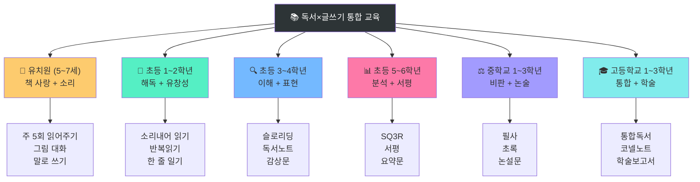
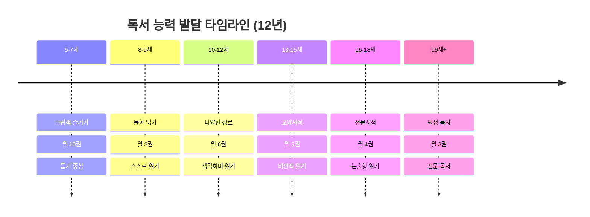
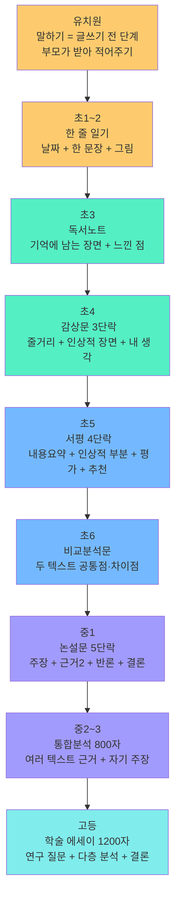

# 학년별 독서 × 글쓰기 WBS 실전 플랜
## 유치원 ~ 고3 | 주간 스케줄 + 구체적 예시 완전판

> **이 가이드의 목적**: 방법론이 아닌 **내일 당장 실천할 수 있는 구체적 행동**을 제공한다.
> "어떻게 하라"가 아닌 "오늘 저녁 정확히 이렇게 하라"의 수준으로 작성했다.

---

## 전체 WBS 구조






---

## 🌱 유치원 (5~7세)

### 핵심 목표
- 책 = 즐거움이라는 회로 형성
- 음운 인식 (말소리 구조 인식)
- 그림에서 이야기 읽기

---

### 주간 WBS 스케줄

```
┌─────┬──────────────────────────────────────────────────────────┐
│ 요일 │ 활동 (저녁 잠자리 전 20분)                               │
├─────┼──────────────────────────────────────────────────────────┤
│ 월  │ 새 그림책 1권 읽어주기 (표지 보며 예측 → 읽기 → 대화)    │
│ 화  │ 어제 책 다시 읽기 + 그림 속 새로운 것 찾기               │
│ 수  │ 동요 2~3곡 부르기 + 끝말잇기 놀이 (10분)                │
│ 목  │ 새 그림책 1권 읽어주기                                   │
│ 금  │ 이번 주 읽은 책 중 하나 선택해서 아이가 "읽어주기"        │
│ 토  │ 도서관 또는 서점 방문 → 아이가 직접 책 2~3권 고르기      │
│ 일  │ 자유 — 아이가 원하는 책 원하는 만큼                      │
└─────┴──────────────────────────────────────────────────────────┘
```

---

### 구체적 실전 예시 — 《강아지똥》 읽어줄 때

**읽기 전 (2분)**
```
부모: (표지 보여주며) "이 책 제목이 '강아지똥'이래. 강아지똥이 주인공이라는데,
      어떤 이야기일 것 같아?"
아이: "강아지가 똥을 싸는 이야기요?"
부모: "그럴 수도 있겠다. 읽어보자."
```

**읽는 중 (12분) — 멈추는 지점 2곳**
```
[멈춤 1] 강아지똥이 "나는 쓸모없어"라고 말하는 장면
부모: "강아지똥이 왜 슬퍼할까?"
아이: "아무도 좋아하지 않아서요"
부모: "그렇구나. 근데 정말 쓸모없을까? 계속 읽어보자."

[멈춤 2] 민들레가 나타나는 장면
부모: "민들레가 강아지똥한테 뭐라고 할 것 같아?"
아이: "같이 놀자고 할 것 같아요"
```

**읽은 후 (5분)**
```
부모: "강아지똥이 결국 어떻게 됐어?"
아이: "민들레꽃이 됐어요!"
부모: "강아지똥이 쓸모없다고 했는데, 나중에 보니까?"
아이: "진짜 중요했어요"
부모: "우리 생활에서도 처음엔 쓸모없어 보이는데 나중에 중요한 게 있을까?"
```

**말로 쓰기 (글쓰기 전 단계, 1분)**
```
부모: "오늘 읽은 이야기를 한 문장으로 말해볼래?"
아이: "강아지똥이 민들레꽃이 됐어요"
부모: (받아 적으며) "맞아! 이게 오늘 네가 쓴 거야."
      → 포스트잇에 적어 냉장고에 붙이기
```

---

### 음운 인식 놀이 — 일상에서 5분

```
① 끝말잇기 (차에서, 밥 먹으면서)
   사자 → 자동차 → 차도 → 도마뱀 → 뱀장어 → ...

② 박수 음절 세기
   "토-끼" 박수 2번 / "하-마" 박수 2번 / "코-끼-리" 박수 3번

③ 같은 소리 찾기
   "ㅂ으로 시작하는 음식 말해봐"
   바나나, 밥, 버섯, 볶음밥...

④ 소리 빼기
   "바나나에서 '나'를 빼면?" → "바나"
   → 처음엔 어려워도 괜찮다. 놀이로만 한다.
```

---

### 추천 도서와 활용법

| 책 제목 | 작가 | 이렇게 활용하세요 |
|---------|------|-----------------|
| 《강아지똥》 | 권정생 | "쓸모 있다/없다" 대화 — 공감·가치관 |
| 《구름빵》 | 백희나 | 그림 속 숨은 것 찾기 — 관찰력 |
| 《파도야 놀자》 | 이수지 | 글 없이 그림만으로 이야기 만들기 |
| 《100층짜리 집》 | 이와이 도시오 | "다음 층에 누가 살까?" 예측 놀이 |
| 《으뜸 헤엄이》 | 레오 리오니 | "혼자는 못하지만 함께는?" 대화 |
| 《지각대장 존》 | 존 버닝햄 | 엄마/선생님 목소리 다르게 읽기 |

---

## 📖 초등 1학년

### 핵심 목표
- 한글 자모 → 음절 → 단어 → 문장 순서 해독
- 소리 내어 읽기 유창성 기초 확립
- 하루 한 줄 일기 습관

---

### 주간 WBS 스케줄

```
┌─────┬────────────────────────────────────────────────────────────────┐
│ 요일 │ 오전 (등교 전 10분) + 저녁 (잠자리 전 20분)                   │
├─────┼────────────────────────────────────────────────────────────────┤
│ 월  │ 저녁: 부모가 그림책 읽어주기 + 아이가 한 페이지 따라 읽기      │
│ 화  │ 저녁: 어제 책 한 단락 아이가 소리 내어 읽기 (3회 반복)         │
│ 수  │ 저녁: 새 쉬운 챕터북 읽어주기 + 줄거리 대화                    │
│ 목  │ 저녁: 수요일 책 한 챕터 아이가 읽기 + 한 줄 일기 쓰기          │
│ 금  │ 저녁: 이번 주 책 중 좋아하는 부분 아이가 골라 소리 내어 읽기   │
│ 토  │ 오전: 도서관 (아이가 3~5권 직접 선택)                          │
│ 일  │ 자유 독서 + 한 줄 일기 (그림 포함)                             │
└─────┴────────────────────────────────────────────────────────────────┘
```

---

### 구체적 실전 예시 — 소리 내어 읽기 훈련

**사용 텍스트**: 《개구리와 두꺼비는 친구》 중 한 단락

```
[원문 텍스트]
"개구리가 말했습니다.
'두꺼비야, 오늘 같이 수영하러 가지 않을래?'
두꺼비가 고개를 저었습니다.
'나는 수영복이 없어.'"
```

**1회차 읽기 (천천히)**
```
부모: "천천히 읽어봐. 틀려도 괜찮아."
아이: "개-구-리-가 말-했-습-니-다..."
부모: (틀린 곳 있으면 그냥 넘기고 끝난 후) "잘 읽었어!"
```

**2회차 읽기 (조금 빠르게)**
```
부모: "이번엔 조금 더 빠르게 읽어볼까?"
아이: "개구리가 말했습니다. '두꺼비야, 오늘..."
```

**3회차 읽기 (개구리/두꺼비 목소리 다르게)**
```
부모: "개구리는 밝은 목소리, 두꺼비는 낮은 목소리로 읽어봐"
아이: (밝게) "두꺼비야, 오늘 같이 수영하러 가지 않을래?"
      (낮게) "나는 수영복이 없어."
부모: "와, 진짜 개구리랑 두꺼비 같았어!"
```

---

### 구체적 실전 예시 — 하루 한 줄 일기

**부모가 아이에게 물어보는 방법**
```
부모: "오늘 학교에서 가장 재미있었던 게 뭐야?"
아이: "점심에 떡볶이 먹었어요"
부모: "그거 일기에 써봐"
아이: [연필 들고] "오늘 떡볶이를 먹었다. 매웠지만 맛있었다."

→ 맞춤법이 틀려도 절대 그 자리에서 고쳐주지 않는다
→ "잘 썼어! 매웠는데도 맛있었구나" 반응만 한다
→ 나중에 부드럽게 "이 글자는 이렇게 써" 한 번만
```

**한 줄 일기 성장 단계**
```
1개월차: 한 문장 + 그림
  "오늘 비가 왔다." [그림]

2개월차: 두 문장
  "오늘 비가 왔다. 우산을 썼다."

3개월차: 이유 추가
  "오늘 비가 왔다. 우산을 썼는데 발이 젖었다. 다음엔 장화를 신어야겠다."
```

---

## 📖 초등 2학년

### 핵심 목표
- 유창한 묵독으로 전환 준비
- 혼자 책 읽기 30분 이상
- 독서 감상 두 줄 이상 쓰기

---

### 주간 WBS 스케줄

```
┌─────┬────────────────────────────────────────────────────────────────┐
│ 요일 │ 활동                                                           │
├─────┼────────────────────────────────────────────────────────────────┤
│ 월  │ 혼자 읽기 30분 (쉬운 챕터북) + 줄거리 3문장 말하기             │
│ 화  │ 어제 책 인상적인 부분 소리 내어 읽기 + 왜 그 부분이 좋았는지   │
│ 수  │ 부모와 함께 읽기 (부모 1페이지 → 아이 1페이지 번갈아)          │
│ 목  │ 혼자 읽기 30분 + 독서 감상 두 줄 쓰기                          │
│ 금  │ 이번 주 읽은 책 소개하기 (가족에게 30초 발표)                  │
│ 토  │ 도서관 또는 서점 (아이가 고름)                                  │
│ 일  │ 자유 독서                                                       │
└─────┴────────────────────────────────────────────────────────────────┘
```

---

### 구체적 실전 예시 — 독서 감상 두 줄

**《나쁜 어린이 표》 읽고**
```
부모: "오늘 읽은 부분에서 기억에 남는 게 있어?"
아이: "선생님이 나쁜 어린이 표를 준 게 억울했어요"
부모: "그 기분을 써봐"
아이: "선생님이 나쁜 어린이 표를 줬다. 나는 억울했다."
부모: "왜 억울했어? 그것도 써봐"
아이: "선생님이 나쁜 어린이 표를 줬다. 나는 억울했다.
       왜냐하면 내가 일부러 한 게 아니기 때문이다."
```

---

### 읽기 유창성 점검표 (2학년 말 기준)

| 항목 | 기준 | 확인 |
|------|------|------|
| 속도 | 1분에 120~150자 | □ |
| 정확도 | 오류율 5% 이하 | □ |
| 표현력 | 물음표·느낌표에서 억양 변화 | □ |
| 이해도 | 읽은 내용 5W1H 말할 수 있음 | □ |
| 독립성 | 30분 이상 혼자 집중해서 읽음 | □ |

---

## 🔍 초등 3학년

### 핵심 목표
- 묵독으로 완전 전환
- 능동적 이해 전략 6가지 훈련 시작
- 독서 노트 시작

> ⚠️ **3학년 독서 위기 주의보**
> 이 시기 가장 큰 실수: 학교 권장 도서·지식책 강요
> → 아이가 좋아하는 이야기책을 스스로 고르게 할 것

---

### 주간 WBS 스케줄

```
┌─────┬────────────────────────────────────────────────────────────────┐
│ 요일 │ 활동 (하루 30~40분)                                            │
├─────┼────────────────────────────────────────────────────────────────┤
│ 월  │ 새 책 시작: 표지·목차 보고 내용 예측 → 1장 읽기               │
│ 화  │ 계속 읽기 + 포스트잇에 "질문" 1개 적으며 읽기                  │
│ 수  │ 계속 읽기 + 읽은 후 줄거리 3문장으로 요약해보기               │
│ 목  │ 계속 읽기 + 독서 노트 작성 (기억에 남는 장면 + 느낀 점)       │
│ 금  │ 이번 주 분량 완독 or 계속 + 가족에게 줄거리 소개              │
│ 토  │ 가족 독서 시간 (각자 읽고 30분 후 대화)                        │
│ 일  │ 자유 독서                                                       │
└─────┴────────────────────────────────────────────────────────────────┘
```

---

### 구체적 실전 예시 — 독서 노트 작성

**《마당을 나온 암탉》 3장 읽고**

```
[독서 노트 형식]

날짜: 2025년 3월 10일
책: 마당을 나온 암탉
읽은 부분: 1~3장

기억에 남는 장면:
  잎싹이 마당 밖을 처음 봤을 때 눈이 부셨다는 부분

왜 기억에 남는가:
  나도 처음 보는 것을 봤을 때 그런 느낌이었던 것 같아서

내 질문:
  잎싹은 왜 마당을 나가고 싶을까?
  나쁜 일이 생길 것 같은데 왜 그냥 있지 않을까?

내가 주인공이라면:
  나도 답답하면 나가고 싶을 것 같다.
```

---

### 구체적 실전 예시 — 6가지 이해 전략

**전략 1: 예측하기** (읽기 전)
```
책: 《몽실 언니》
부모: "표지에 어린 여자아이가 아기를 업고 있어. 어떤 이야기일 것 같아?"
아이: "가난한 가족 이야기요?"
부모: "언제 이야기일 것 같아?"
아이: "옛날이요"
→ 예측을 적어두고 나중에 맞는지 확인
```

**전략 6: 요약하기** (읽은 후)
```
부모: "오늘 읽은 부분을 한 문장으로 말해봐"
아이: "몽실이가 새어머니와 살게 됐어요"
부모: "더 자세하게 - 누가, 무엇을, 왜"
아이: "몽실이가 아버지 재혼으로 새어머니와 살게 됐는데, 새어머니가 차갑게 대해요"
→ 이 훈련을 매일 하면 요약 능력이 자동화된다
```

---

## 🔍 초등 4학년

### 핵심 목표
- 슬로리딩 본격 시작
- 장편 소설 완독 (200페이지 이상)
- 감상문 쓰기 (3단락)

---

### 주간 WBS 스케줄

```
┌─────┬────────────────────────────────────────────────────────────────┐
│ 요일 │ 활동 (하루 40~50분)                                            │
├─────┼────────────────────────────────────────────────────────────────┤
│ 월  │ 슬로리딩: 한 챕터 읽기 → 포스트잇 질문 2개 적기               │
│ 화  │ 질문에 대한 답 책에서 찾기 + 독서 노트 기록                    │
│ 수  │ 다음 챕터 읽기 → 예측: 다음에 어떻게 될까?                    │
│ 목  │ 계속 읽기 + 인물 분석: 주인공이 왜 이런 선택을 했는지          │
│ 금  │ 이번 주 분량 완독 + 가족 대화 15분                             │
│ 토  │ 감상문 초고 쓰기 (3단락)                                       │
│ 일  │ 감상문 다시 읽고 고치기 + 새 책 선택                          │
└─────┴────────────────────────────────────────────────────────────────┘
```

---

### 구체적 실전 예시 — 슬로리딩

**《마당을 나온 암탉》 7장: 잎싹이 탈출을 결심하는 장면**

```
[읽다가 멈추는 지점]
"잎싹은 마당 문이 열린 틈을 발견했다.
심장이 두근거렸다."

부모: "잠깐 멈춰. 이 장면에서 질문 하나 만들어봐"
아이: "잎싹이 나갈까요, 안 나갈까요?"
부모: "좋아. 또 다른 질문은?"
아이: "왜 심장이 두근거릴까요?"
부모: "왜 그럴 것 같아?"
아이: "무섭기도 하고 설레기도 해서요"
부모: "네 경험에서 비슷한 때가 있었어?"
아이: "처음 수영장 갔을 때요. 무서운데 하고 싶었어요"
부모: "맞아. 그게 잎싹의 마음이야. 계속 읽어보자."
```

---

### 구체적 실전 예시 — 감상문 3단락

**《마당을 나온 암탉》 완독 후**

```
[1단락: 줄거리 요약 - 3문장]
"이 책은 마당에 갇혀 살던 암탉 잎싹이 마당을 탈출해서
청둥오리 알을 품고, 초록이라는 오리를 키우는 이야기이다.
잎싹은 마지막에 족제비에게 잡히지만 초록이를 살린다."

[2단락: 인상적인 장면 - 이유 포함]
"가장 기억에 남는 장면은 잎싹이 족제비 앞에서 도망치지 않는
마지막 부분이다. 왜냐하면 자기 목숨보다 초록이를 더 소중히
생각하는 잎싹의 마음이 느껴졌기 때문이다."

[3단락: 내 생각]
"처음에 잎싹이 마당을 나가는 게 무모하다고 생각했다.
하지만 읽다 보니 갇혀 사는 것보다 위험해도 자유롭게 사는 게
더 의미 있을 수도 있다는 생각이 들었다."
```

---

## 📊 초등 5학년

### 핵심 목표
- 정보 텍스트 읽기 (비문학 입문)
- SQ3R 전략 습득
- 서평 쓰기 시작

---

### 주간 WBS 스케줄

```
┌─────┬────────────────────────────────────────────────────────────────┐
│ 요일 │ 활동 (하루 45~60분)                                            │
├─────┼────────────────────────────────────────────────────────────────┤
│ 월  │ 이야기책 30분 + SQ3R 교과서 1단원 적용 15분                   │
│ 화  │ 이야기책 계속 읽기 + 추론 연습 ("왜냐하면" 훈련)               │
│ 수  │ 관심 분야 지식책 1챕터 읽기 + 핵심어 3개 찾기                  │
│ 목  │ 이야기책 계속 읽기 + 독서 노트                                 │
│ 금  │ 완독 or 계속 + 서평 초고 쓰기                                  │
│ 토  │ 가족 독서 시간 + 읽은 책 소개 (3분)                            │
│ 일  │ 자유 + 서평 수정                                               │
└─────┴────────────────────────────────────────────────────────────────┘
```

---

### 구체적 실전 예시 — SQ3R 교과서 적용

**사회 교과서 "조선의 건국" 단원**

```
S (Survey - 훑기, 3분):
  → 제목: "조선의 건국"
  → 소제목: 위화도 회군 / 새 왕조의 시작 / 한양 천도
  → 그림: 경복궁 사진, 이성계 초상화
  → "이 단원은 조선이 어떻게 시작됐는지 설명하는 것 같다"

Q (Question - 질문, 2분):
  → "위화도 회군이 뭐지?" → 소제목을 질문으로 변환
  → "왜 새 왕조를 만들었을까?"
  → "왜 한양으로 수도를 옮겼을까?"
  질문을 노트에 적어둔다.

R (Read - 읽기, 15분):
  → 질문에 답을 찾으며 읽기
  → "위화도에서 군대를 돌렸구나" 답 찾으면 체크

R (Recite - 말하기, 3분):
  → 교과서 덮고 질문에 답해보기
  → "위화도 회군은 이성계가 요동 정벌 명령을 거부하고 군대를 돌린 사건"

R (Review - 복습, 2분):
  → 다음날 다시 질문 보고 답하기
```

---

### 구체적 실전 예시 — 서평 쓰기

**《어린 왕자》 읽고 서평**

```
제목: 《어린 왕자》를 읽고 — 어른들이 잃어버린 것

[1단락: 이 책은 어떤 책인가?]
《어린 왕자》는 작은 별에서 온 왕자가 여러 별을 여행하며
어른들의 이상한 모습을 보고, 지구에서 여우와 사막 뱀을
만나는 이야기이다.

[2단락: 가장 인상적인 부분]
"가장 중요한 것은 눈에 보이지 않아"라는 문장이 가장
인상적이었다. 왜냐하면 나도 눈에 보이는 것만 중요하다고
생각했는데, 이 책을 읽고 나서 친구와의 우정이나 마음 같은
것이 더 소중할 수 있다는 생각이 들었기 때문이다.

[3단락: 평가 + 추천]
이 책의 좋은 점은 짧지만 생각할 거리가 많다는 것이다.
아쉬운 점은 처음 읽을 때는 무슨 말인지 이해하기 어렵다는 것이다.
이 책은 어른과 함께 읽으면 더 재미있을 것 같아서,
부모님과 함께 읽고 싶은 친구에게 추천한다.
```

---

## 📊 초등 6학년

### 핵심 목표
- 논설문 구조 이해
- 비교 분석 글쓰기
- 중학교 대비 읽기 체력 완성

---

### 주간 WBS 스케줄

```
┌─────┬────────────────────────────────────────────────────────────────┐
│ 요일 │ 활동 (하루 50~60분)                                            │
├─────┼────────────────────────────────────────────────────────────────┤
│ 월  │ 이야기책 40분 + 논설문 1편 읽기 (주장·근거 찾기)               │
│ 화  │ 이야기책 계속 + 어제 논설문의 주장·근거 정리 (표로)            │
│ 수  │ 같은 주제 다른 입장의 글 읽기 (찬반 비교)                      │
│ 목  │ 이야기책 계속 + 내 의견을 한 단락으로 쓰기                     │
│ 금  │ 완독 + 비교 분석 글쓰기 (두 책 또는 두 관점 비교)             │
│ 토  │ 가족 토론 (이번 주 읽은 내용 관련 주제로 15분)                 │
│ 일  │ 자유 독서                                                       │
└─────┴────────────────────────────────────────────────────────────────┘
```

---

### 구체적 실전 예시 — 논설문 주장·근거 분석

**신문 사설: "학교 스마트폰 사용 금지해야 한다"**

```
[분석 표 만들기]

주장: 학교에서 스마트폰 사용을 금지해야 한다

근거 1: 수업 집중력 저하
  - 사실인가? YES (연구 결과 있음)
  - 충분한가? 부분적으로 (게임 앱 문제이지 스마트폰 전체가 아님)

근거 2: 사이버 불링 문제
  - 사실인가? YES
  - 관련 있는가? YES

근거 3: 수업 도구로 활용 가능
  → 이건 오히려 반론인데 왜 근거로 넣었지?

내 의견: 전면 금지보다 시간제 규정이 더 현실적이다
이유: 스마트폰은 교육 도구로도 쓸 수 있기 때문이다
```

---

## ⚖️ 중학교 1학년

### 핵심 목표
- 2주 1권 정독 루틴 확립
- 필사 시작 (주 3회)
- 논설문 쓰기 (5단락)

---

### 주간 WBS 스케줄

```
┌─────┬────────────────────────────────────────────────────────────────┐
│ 요일 │ 활동 (하루 60분 목표 — 30분씩 나눠도 OK)                      │
├─────┼────────────────────────────────────────────────────────────────┤
│ 월  │ 이야기책 40분 + 필사 2쪽 (원문 그대로 손으로 쓰기)            │
│ 화  │ 이야기책 40분 + 어제 필사 부분 다시 읽기 + 인상적인 문장 1개   │
│ 수  │ 이야기책 40분 + 필사 2쪽 + 15분 부모와 대화                   │
│ 목  │ 이야기책 40분 + 독서 노트 (비판적 읽기 4가지 질문 적용)        │
│ 금  │ 이야기책 40분 + 필사 2쪽 + 논설문 주제 정하기                  │
│ 토  │ 논설문 초고 쓰기 (5단락 구조)                                  │
│ 일  │ 논설문 수정 + 다음 주 책 선택                                  │
└─────┴────────────────────────────────────────────────────────────────┘
```

---

### 구체적 실전 예시 — 필사 + 대화

**《아몬드》 손원평, 첫 챕터 중 2쪽 필사 후**

```
[필사한 문장]
"나는 태어날 때부터 편도체가 작았다. 편도체는 감정을 느끼게
해주는 뇌 부위인데, 나는 그게 작아서 공포나 분노, 슬픔 같은
감정을 잘 느끼지 못한다."

[대화]
부모: "오늘 필사한 부분에서 가장 인상적인 문장이 뭐야?"
아이: "편도체가 작다는 부분이요"
부모: "왜 그 문장이 인상적이었어?"
아이: "감정을 못 느끼는 사람이 주인공이라는 게 신기해서요"
부모: "그런 사람이 실제로 있을까?"
아이: "있을 수도 있을 것 같아요"
부모: "감정을 못 느끼면 어떤 점이 힘들고, 어떤 점이 편할까?"
아이: "슬픔을 못 느끼니까 안 슬프겠지만... 
       기쁨도 못 느끼니까 더 외로울 것 같아요"
→ 이 15분이 사고력의 핵심이다
```

---

### 구체적 실전 예시 — 논설문 5단락

**주제: 청소년 SNS 사용을 제한해야 하는가?**

```
[1단락: 서론 — 문제 제기]
최근 청소년들의 SNS 사용이 급증하면서 다양한 문제가 발생하고 있다.
학교폭력의 형태가 사이버 공간으로 이동하고, 수면 시간이 줄어들고 있다.
나는 청소년의 SNS 사용 시간을 하루 1시간으로 제한해야 한다고 생각한다.

[2단락: 근거 1]
첫째, SNS 과다 사용은 청소년의 수면을 방해한다.
미국 수면재단 연구에 따르면, 잠자리에서 스마트폰을 사용하는 청소년은
그렇지 않은 청소년보다 평균 1시간 덜 잔다.
충분한 수면은 뇌 발달과 학습에 필수적이므로, 이는 심각한 문제이다.

[3단락: 근거 2]
둘째, SNS는 청소년의 자존감을 낮출 수 있다.
SNS에서 타인의 '완벽해 보이는' 생활을 보며 자신과 비교하는 과정에서
불필요한 열등감이 생긴다.

[4단락: 반론과 재반박]
물론 SNS가 친구들과 소통하고 정보를 얻는 유용한 도구라는 주장도 있다.
하지만 제한이 없는 사용이 아닌, 적절한 시간 관리를 통해도
충분히 소통과 정보 수집의 목적을 달성할 수 있다.

[5단락: 결론]
따라서 나는 청소년의 SNS 사용 시간을 제한하는 것이 필요하다고 생각한다.
물론 강제적 금지보다는 스스로 시간을 관리하는 능력을 키우는 교육이
병행되어야 할 것이다.
```

---

## ⚖️ 중학교 2학년

### 핵심 목표
- 초록 방법으로 지식책 읽기
- 비판적 읽기 심화
- 다관점 비교 분석

---

### 주간 WBS 스케줄

```
┌─────┬────────────────────────────────────────────────────────────────┐
│ 요일 │ 활동                                                           │
├─────┼────────────────────────────────────────────────────────────────┤
│ 월  │ 이야기책 30분 + 지식책 1챕터 읽으며 밑줄·별표                 │
│ 화  │ 어제 지식책 챕터 핵심어 5개 추출 + 커닝페이퍼 초안            │
│ 수  │ 이야기책 30분 + 필사 2쪽 + 대화                               │
│ 목  │ 같은 주제 다른 관점 글 읽기 (신문, 반대 입장 책)              │
│ 금  │ 두 관점 비교 표 만들기 + 내 입장 정리                         │
│ 토  │ 비교 분석 글쓰기 (600자)                                       │
│ 일  │ 자유 독서 + 다음 주 계획                                       │
└─────┴────────────────────────────────────────────────────────────────┘
```

---

### 구체적 실전 예시 — 초록 (커닝페이퍼 만들기)

**《왜 세계의 절반은 굶주리는가》 3장 읽기**

```
[1단계: 밑줄 치기]
책을 읽으면서 중요하다고 생각되는 문장에 연필로 밑줄

[2단계: 핵심어 추출]
밑줄 친 부분을 다시 보며 가장 핵심적인 단어 5개:
  → 기아 / 식량 분배 / 구조적 문제 / 다국적 기업 / 농지 수탈

[3단계: 커닝페이퍼 작성 (A4 반 장)]
┌─────────────────────────────────────────────┐
│ 3장 핵심: 기아는 식량 부족이 아닌 분배 문제  │
│                                              │
│ 근거:                                        │
│ • 세계 식량 생산량 = 80억 명 분 충분          │
│ • 문제: 다국적 기업이 농지 수탈               │
│ • 결과: 현지인이 자기 땅 식량 못 먹음         │
│                                              │
│ 내 질문: 왜 각국 정부가 이걸 막지 않는가?    │
└─────────────────────────────────────────────┘

[활용] 이 커닝페이퍼만 보면 3장 전체 내용이 떠오른다
```

---

## ⚖️ 중학교 3학년

### 핵심 목표
- 통합 독서 (여러 텍스트 연결)
- 고등학교 수준 글쓰기 준비
- 메타인지 독서 시작

---

### 주간 WBS 스케줄

```
┌─────┬────────────────────────────────────────────────────────────────┐
│ 요일 │ 활동                                                           │
├─────┼────────────────────────────────────────────────────────────────┤
│ 월  │ 주제 선정 + 관련 책/글 3개 수집 (이야기책·지식책·기사)        │
│ 화  │ 텍스트 1 읽기 + 초록 작성                                      │
│ 수  │ 텍스트 2 읽기 + 초록 작성                                      │
│ 목  │ 텍스트 3 읽기 + 초록 작성                                      │
│ 금  │ 3개 텍스트 비교 표 작성 (공통점·차이점·내 입장)               │
│ 토  │ 통합 분석 글쓰기 (800자) — 여러 텍스트 근거로 자기 주장       │
│ 일  │ 자유 독서 + 글 수정                                            │
└─────┴────────────────────────────────────────────────────────────────┘
```

---

### 구체적 실전 예시 — 통합 독서

**주제: "인공지능은 인간을 대체할 수 있는가"**

```
[텍스트 3개 선정]
① 소설: 《공각기동대》 (AI와 인간의 경계)
② 지식서: 《특이점이 온다》 레이 커즈와일 (발췌 2챕터)
③ 신문 기사: "ChatGPT, 기자·변호사 직업 위협하나" (2025)

[비교 표]
┌──────────┬───────────────┬───────────────┬────────────────┐
│          │ 소설           │ 지식서         │ 기사           │
├──────────┼───────────────┼───────────────┼────────────────┤
│ 주장     │ AI가 의식을    │ 2045년 특이점  │ 일부 직업은    │
│          │ 가질 수 있다   │ 이후 AI=인간  │ 대체될 것      │
├──────────┼───────────────┼───────────────┼────────────────┤
│ 근거     │ 소설적 상상    │ 기술 발전 곡선 │ 현재 AI 성능   │
├──────────┼───────────────┼───────────────┼────────────────┤
│ 한계     │ 현실 증거 없음 │ 낙관적 편향    │ 단기 시각      │
└──────────┴───────────────┴───────────────┴────────────────┘

[내 입장]
AI는 반복 작업은 대체하지만, 창의성과 공감이 필요한 영역은
당분간 인간이 우위를 유지할 것이다.
근거: 세 텍스트 모두 'AI의 한계'를 인정하는 부분이 있음
```

---

## 🎓 고등학교 1학년

### 핵심 목표
- 교과별 읽기 전략 분화
- 코넬 노트 도입
- 수능 비문학 독해 기초

---

### 주간 WBS 스케줄

```
┌─────┬────────────────────────────────────────────────────────────────┐
│ 요일 │ 활동 (하루 60~90분 — 30분씩 나눠도 OK)                        │
├─────┼────────────────────────────────────────────────────────────────┤
│ 월  │ 문학 작품 40분 + 코넬 노트 작성 (국어 연계)                    │
│ 화  │ 인문·사회 교양서 1챕터 + 초록 (수능 비문학 배경지식)           │
│ 수  │ 문학 작품 계속 + 필사 2쪽 + 대화                              │
│ 목  │ 과학·기술 교양서 1챕터 + 초록 (수능 과학지문 대비)            │
│ 금  │ 문학 완독 or 계속 + 이번 주 초록 복습                         │
│ 토  │ 글쓰기: 논술 주제로 800자 에세이                               │
│ 일  │ 자유 독서 + 다음 주 계획                                       │
└─────┴────────────────────────────────────────────────────────────────┘
```

---

### 구체적 실전 예시 — 코넬 노트

**《소년이 온다》 한강, 1장 읽고**

```
┌──────────────────┬─────────────────────────────────────────────┐
│ 핵심어 / 질문    │ 상세 메모                                    │
│                  │                                             │
│ 광주 5·18        │ • 1980년 5월 광주 민주화 운동               │
│                  │ • 주인공: 중학생 동호                       │
│ 동호              │ • 친구 정대가 눈앞에서 죽음                 │
│                  │ • 도청에 남아 시신 수습 자원                │
│ 왜 남았을까?     │ • 이유: 도망치는 게 정대에 대한 배신 같아서 │
│                  │                                             │
│ 문체 특징        │ • 2인칭 시점 "너는 ~했다"                   │
│                  │ → 독자가 동호 자신이 되는 효과              │
│                  │ → 죄책감, 생존자의 고통 전달                │
├──────────────────┴─────────────────────────────────────────────┤
│ 요약                                                            │
│ 1장: 광주 학살 속 중학생 동호가 친구의 죽음을 목격하고         │
│ 시신 수습을 위해 도청에 자원. 2인칭 시점으로 독자를            │
│ 역사 속으로 끌어들이는 서술 방식이 핵심.                       │
└─────────────────────────────────────────────────────────────────┘
```

---

## 🎓 고등학교 2학년

### 핵심 목표
- 수능 국어 독해 전략 완성
- 통합 독서 심화
- 대학 수준 글쓰기 입문

---

### 주간 WBS 스케줄

```
┌─────┬────────────────────────────────────────────────────────────────┐
│ 요일 │ 활동                                                           │
├─────┼────────────────────────────────────────────────────────────────┤
│ 월  │ 수능 기출 비문학 지문 1편 + 관련 교양서 1챕터 연계 읽기        │
│ 화  │ 문학 작품 (현대소설/시) + 작품 분석 코넬 노트                  │
│ 수  │ 인문·철학 교양서 읽기 + 초록 (논술 배경지식)                   │
│ 목  │ 문학 계속 + 비문학 지문 1편 추가                               │
│ 금  │ 주제 통합 독서 (이번 주 읽은 것 모두 연결)                     │
│ 토  │ 논술 에세이 1200자 (여러 텍스트 근거 활용)                     │
│ 일  │ 자유 독서 + 에세이 수정                                        │
└─────┴────────────────────────────────────────────────────────────────┘
```

---

### 구체적 실전 예시 — 수능 비문학 + 교양서 연계

**수능 기출 지문: "칸트의 정언명령"**

```
[지문 읽기 전략]
1. 첫 문단에서 중심 화제 파악: "칸트 / 정언명령 / 도덕"
2. 각 문단의 첫 문장만 먼저 읽기 (단락 요지 파악)
3. 다시 읽으며 논리 구조 파악:
   → 정언명령이란? → 왜 필요한가? → 가언명령과 차이? → 결론

[연계 독서]
이 지문 이해 후 → 《정의란 무엇인가》 마이클 샌델 2장 읽기
→ "칸트 의무론" 챕터가 지문과 연결됨
→ 배경지식이 생기면 비슷한 지문이 나와도 30% 빠르게 읽힘
```

---

## 🎓 고등학교 3학년

### 핵심 목표
- 수능 최종 독해 완성
- 대학별 논술 대비
- 자기소개서 글쓰기

---

### 주간 WBS 스케줄

```
┌─────┬────────────────────────────────────────────────────────────────┐
│ 요일 │ 활동 (수능 전 — 독서는 유지하되 부담 없이)                    │
├─────┼────────────────────────────────────────────────────────────────┤
│ 월  │ 수능 기출 비문학 2편 + 지문 관련 배경지식 확인                │
│ 화  │ 수능 기출 문학 작품 + 작품 해설 읽기 (코넬 노트)              │
│ 수  │ 논술 예상 주제 관련 교양서 1챕터 + 초록                       │
│ 목  │ 수능 모의고사 국어 풀기 + 틀린 지문 다시 읽고 분석            │
│ 금  │ 자유 독서 30분 (부담 없이 — 뇌를 쉬게 하는 독서)             │
│ 토  │ 논술 1200자 쓰기 or 자기소개서 활동 글쓰기                    │
│ 일  │ 완전 자유 (독서 강요 금지)                                    │
└─────┴────────────────────────────────────────────────────────────────┘
```

---

### 구체적 실전 예시 — 자기소개서 독서 연계

**"독서 경험을 활동으로 기술하시오"**

```
[잘못된 예]
"저는 《사피엔스》를 읽고 인류의 역사에 대해 많이 배웠습니다."
→ 너무 평범. 차별화 없음.

[좋은 예]
"《사피엔스》를 읽고 '허구를 믿는 능력이 인류를 지배종으로
만들었다'는 주장에 의문이 생겼습니다. 이 의문을 해결하기 위해
《총, 균, 쇠》와 비교하여 읽었고, 두 저자의 핵심 차이가
'문화'와 '환경' 중 무엇이 역사를 결정하는가에 있음을 발견했습니다.
이 탐구 과정에서 단일 텍스트가 아닌 여러 관점을 비교하며 읽는
습관이 중요함을 깨달았습니다."

→ 구체적 책 제목 + 구체적 의문 + 구체적 탐구 과정 + 배운 점
```

---

## 📅 학년별 1년 독서 연간 계획표

```mermaid
gantt
    title 학년별 연간 독서 교육 WBS
    dateFormat MM
    section 유치원~초1
    그림책 읽어주기 (매일)     :active, 01, 12M
    음운인식 놀이 (주 3회)     :01, 12M
    말로 쓰기 → 한 줄 일기     :03, 10M

    section 초등 2~3학년
    소리내어읽기 훈련           :01, 6M
    묵독 전환 + 이야기책 몰입   :07, 6M
    독서노트 시작               :04, 9M
    독서퀴즈대회 (방학)         :07, 2M

    section 초등 4~5학년
    슬로리딩 훈련               :01, 12M
    SQ3R 교과서 적용            :03, 10M
    서평 쓰기                   :05, 8M
    지식책 입문                 :09, 4M

    section 초등 6~중1
    논설문 구조 학습            :01, 6M
    필사 시작 (주 3회)          :03, 10M
    초록 방법 도입              :06, 7M

    section 중2~중3
    통합독서 훈련               :01, 12M
    비교분석 글쓰기             :01, 12M
    메타인지 독서               :06, 7M

    section 고등
    코넬노트 완성               :01, 12M
    수능연계 독서               :01, 12M
    논술·학술글쓰기             :01, 12M
```



---

## 방학 집중 프로그램 WBS

### 여름방학 독서 집중 플랜 (4주)

```
┌──────┬─────────────────────────────────────────────────────────────┐
│ 주차  │ 활동                                                        │
├──────┼─────────────────────────────────────────────────────────────┤
│ 1주차 │ 독서퀴즈대회 준비                                           │
│      │ • 아이가 직접 책 5권 선택 (도서관·서점 방문)                │
│      │ • 하루 1~2시간 자유 독서                                    │
│      │ • 저녁: 읽은 부분 3문장 요약 말하기                         │
├──────┼─────────────────────────────────────────────────────────────┤
│ 2주차 │ 집중 읽기                                                   │
│      │ • 5권 중 아직 못 읽은 것 집중 완독                          │
│      │ • 슬로리딩 1권 적용 (4학년 이상)                            │
│      │ • 독서 노트 매일 작성                                       │
├──────┼─────────────────────────────────────────────────────────────┤
│ 3주차 │ 글쓰기 집중                                                 │
│      │ • 읽은 5권 각 서평 1편씩 (100~200자)                        │
│      │ • 5권 중 최고로 좋았던 책 감상문 (500자)                    │
│      │ • 필사 (중학생 이상): 매일 2쪽                              │
├──────┼─────────────────────────────────────────────────────────────┤
│ 4주차 │ 독서퀴즈대회 + 시상                                         │
│      │ • 가족 독서퀴즈 진행                                        │
│      │ • 우수 서평 가족 앞에서 읽기                                │
│      │ • 2학기 독서 계획 스스로 세우기                             │
└──────┴─────────────────────────────────────────────────────────────┘
```

---

## 학년별 글쓰기 성장 로드맵



---

## 부모가 오늘 당장 할 수 있는 것

### 자녀 학년별 즉시 실천 행동

| 학년 | 오늘 저녁 당장 하세요 |
|------|---------------------|
| 유치원 | 잠자리에서 그림책 1권 읽어주기. 표지 보고 "어떤 내용일까?" 한 마디만 |
| 초1 | 아이에게 책 한 단락 소리 내어 읽게 하고 "잘 읽었어!" 칭찬 |
| 초2 | "오늘 가장 기억에 남는 게 뭐야?" 물어보고 한 문장 일기 쓰게 하기 |
| 초3 | "이번 주에 읽고 싶은 책 도서관에서 골라봐" — 선택권 주기 |
| 초4 | 책 읽는 중 "왜 이 인물은 이런 선택을 했을까?" 질문 하나만 |
| 초5 | 교과서 한 단원 SQ3R로 같이 읽어보기 (S: 소제목 훑기부터) |
| 초6 | 신문 기사 하나 읽고 "주장이 뭐야? 근거가 뭐야?" 대화 |
| 중1 | 아이가 좋아하는 이야기책 2쪽을 함께 필사하고 15분 대화 |
| 중2 | 이번 주 배운 교과서 내용 커닝페이퍼 1장으로 만들어보기 |
| 중3 | 하나의 주제로 책·기사 2개 읽고 공통점·차이점 표 만들기 |
| 고1 | 읽은 책 코넬 노트로 정리해보기 (핵심어/내용/요약 3구역) |
| 고2 | 수능 기출 지문 1편 + 관련 교양서 챕터 연계해서 읽기 |
| 고3 | 자기소개서에 쓸 독서 경험 — 구체적 의문과 탐구 과정 중심으로 |

---

> **핵심 메시지**
>
> 완벽한 계획보다 **불완전하지만 지속 가능한 루틴**이 낫다.
>
> 하루 20분, 주 5회.
> 이것만 지켜도 1년 후 아이의 독서·글쓰기 능력은 눈에 띄게 달라진다.
>
> *"재미있는 독서만이 아이를 성장시킵니다."* — 최승필
