# AI 시대, 독해력이 무기다
## 학년별 비판적 사고 × 문해력 × AI 디버깅 능력 완전 가이드

> **핵심 명제**
> AI는 텍스트를 생성한다. 인간은 텍스트를 **판단**한다.
> AI가 고도회되고 상용화될수록 , 인간의 **방향 설정 능력**이 더 희소해지고 더 가치 있어진다.

---

## 1. AI가 못하는 것 — 인간이 해야 하는 4가지

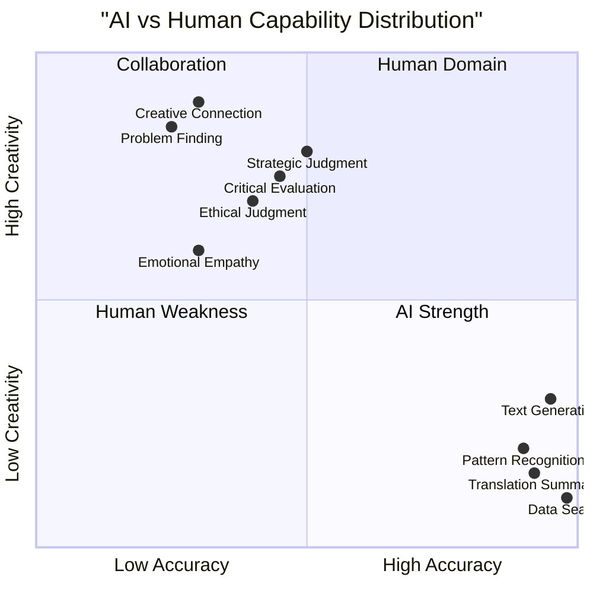

---

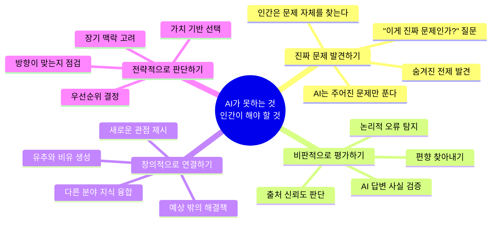

---

## 2. 독해력 → AI 디버깅 능력 연결 구조

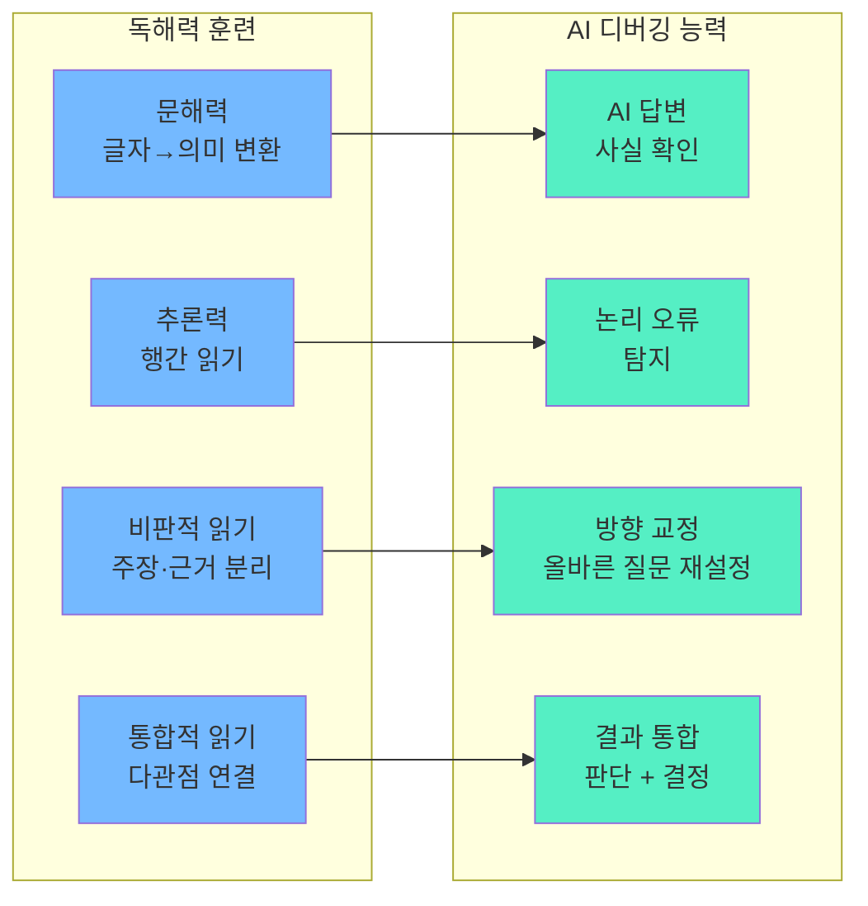

---

## 3. AI 결과값 디버깅 프로세스

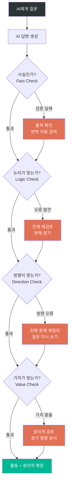

---

## 4. 학년별 핵심 목표 전체 지도

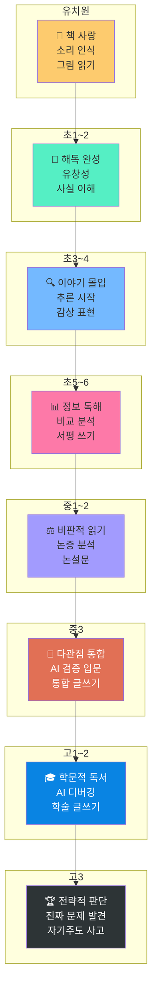

---

## 5. 4가지 핵심 능력별 학년 로드맵

### 능력 1: 진짜 문제 발견하기 (Problem Finding)

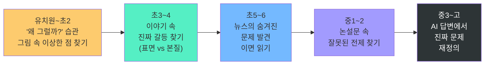

### 능력 2: 비판적으로 평가하기 (Critical Evaluation)

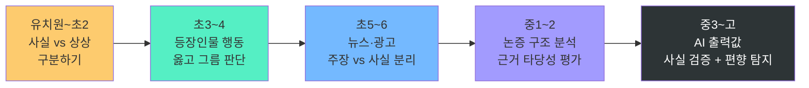

### 능력 3: 창의적으로 연결하기 (Creative Connection)

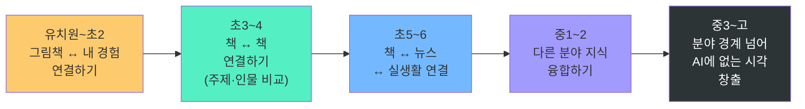

### 능력 4: 전략적으로 판단하기 (Strategic Judgment)

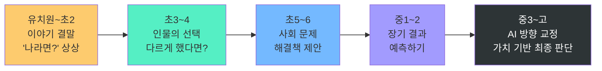

---

## 6. 학년별 상세 목표 + 추천 도서

---

### 🌱 유치원 (5~7세)

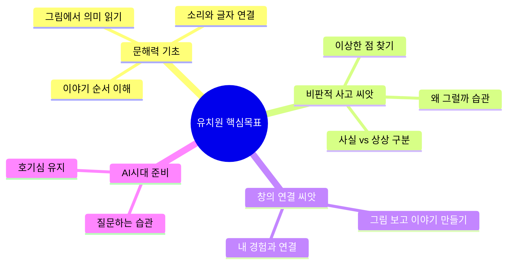

| 분야 | 추천 도서 | 기르는 능력 |
|------|-----------|------------|
| 그림 읽기 | 《파도야 놀자》 이수지 | 시각 정보 해석 |
| 창의 연결 | 《으뜸 헤엄이》 레오 리오니 | 협력·문제 해결 |
| 비판적 씨앗 | 《지각대장 존》 존 버닝햄 | 관점 차이 인식 |
| 감정 이해 | 《강아지똥》 권정생 | 공감·가치 인식 |
| 질문 습관 | 《100층짜리 집》 이와이 도시오 | 예측·탐색 |

---

### 📖 초등 1학년

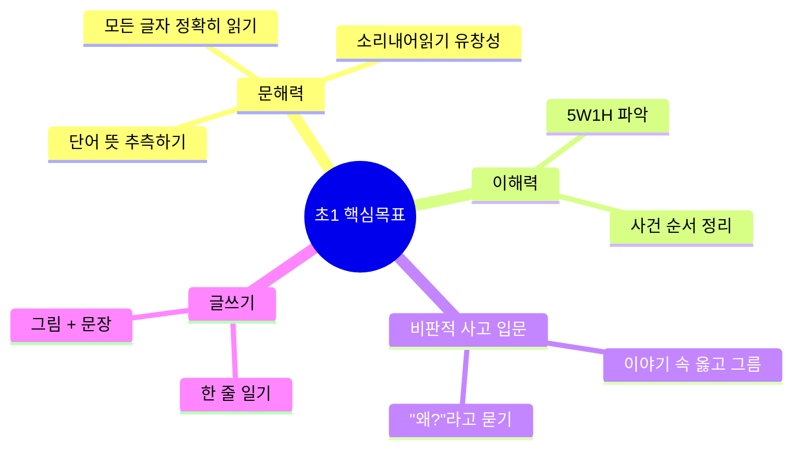

| 분야 | 추천 도서 | 기르는 능력 |
|------|-----------|------------|
| 유창성 | 《개구리와 두꺼비는 친구》 아널드 로벨 | 소리내어읽기 |
| 이해력 | 《나쁜 어린이 표》 황선미 | 사건 파악, 감정 |
| 옳고 그름 | 《강아지똥》 권정생 | 가치 판단 입문 |
| 어휘 | 《아씨방 일곱 동무》 이영경 | 어휘·의성어 |
| 창의 | 《구름빵》 백희나 | 상상력·인과 |

---

### 📖 초등 2학년

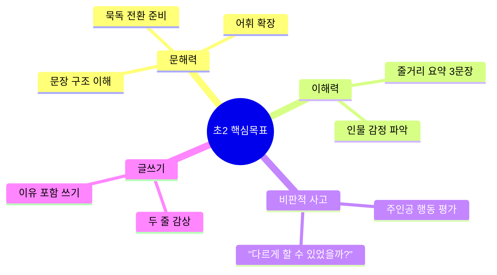

| 분야 | 추천 도서 | 기르는 능력 |
|------|-----------|------------|
| 이해력 | 《마당을 나온 암탉》 황선미 | 인물 심리, 선택 |
| 관점 이해 | 《팥죽 할머니와 호랑이》 조대인 | 입장 차이 |
| 어휘 | 《아홉 살 마음 사전》 박성우 | 감정 어휘 |
| 창의 | 《이상한 자연사 박물관》 박완서 外 | 상상력 |
| 비판 씨앗 | 《거짓말 학교》 박현숙 | 거짓말·정직 판단 |

---

### 🔍 초등 3학년

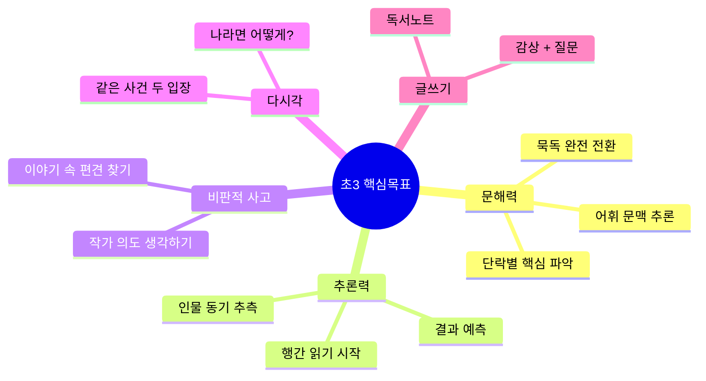

| 분야 | 추천 도서 | 기르는 능력 |
|------|-----------|------------|
| 추론력 | 《몽실 언니》 권정생 | 행간 읽기, 역사 맥락 |
| 다시각 | 《진짜 나쁜 늑대가 없다》 존 셰스카 | 관점 전환 |
| 비판 | 《괴물들이 사는 나라》 모리스 센닥 | 감정·권위 비판 |
| 어휘 | 《나의 라임오렌지나무》 바스콘셀로스 | 감정 어휘 심화 |
| 문제발견 | 《샬롯의 거미줄》 E.B.화이트 | 숨겨진 가치 |

---

### 🔍 초등 4학년

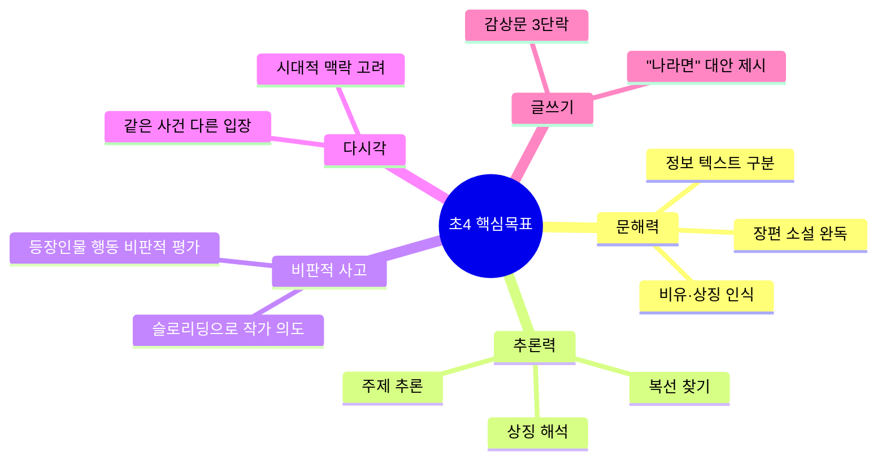

| 분야 | 추천 도서 | 기르는 능력 |
|------|-----------|------------|
| 관점 전환 | 《늑대가 들려주는 아기 돼지 삼형제》 존 셰스카 | 관점 바꾸기 |
| 주제 추론 | 《어린 왕자》 생텍쥐페리 | 상징·주제 |
| 비판 심화 | 《마당을 나온 암탉》 황선미 | 자유·구속 가치 판단 |
| 역사 시각 | 《소년》 이금이 | 역사적 맥락 |
| 문제발견 | 《행복한 왕자》 오스카 와일드 | 사회 구조 문제 |

---

### 📊 초등 5학년

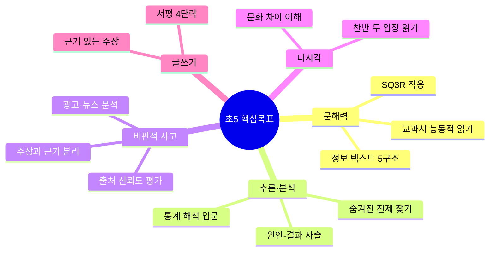

| 분야 | 추천 도서 | 기르는 능력 |
|------|-----------|------------|
| 비판적 읽기 | 《완득이》 김려령 | 사회 편견·약자 시각 |
| 다문화 시각 | 《파친코》 이민진 (발췌) | 다른 관점 수용 |
| 사회 문제 | 《왜 세계의 절반은 굶주리는가》 장 지글러 | 구조적 문제 발견 |
| 논증 이해 | 《소나기》 황순원 | 감정 이면 읽기 |
| 통계·사실 | 《숫자로 보는 세계》 시리즈 | 데이터 리터러시 |

---

### 📊 초등 6학년

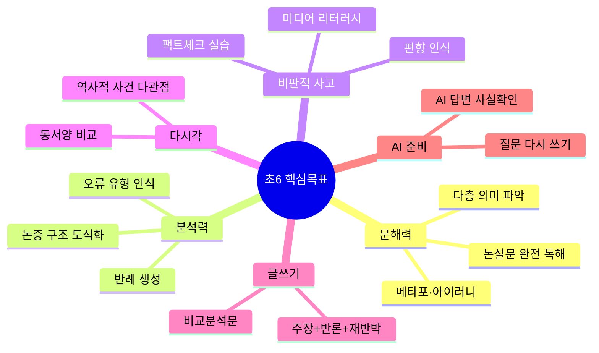

| 분야 | 추천 도서 | 기르는 능력 |
|------|-----------|------------|
| 논증 분석 | 《정의란 무엇인가》 마이클 샌델 (어린이판) | 논증·윤리 |
| 역사 다관점 | 《조선왕조실록》 관련 역사 동화 | 역사 해석 |
| 미디어 비판 | 뉴스 기사 직접 분석 (팩트체크) | 미디어 리터러시 |
| 과학적 사고 | 《수학귀신》 엔첸스베르거 | 논리·반례 |
| 사회 구조 | 《어린이 살아남기》 시리즈 | 문제 발견 |

---

### ⚖️ 중학교 1학년

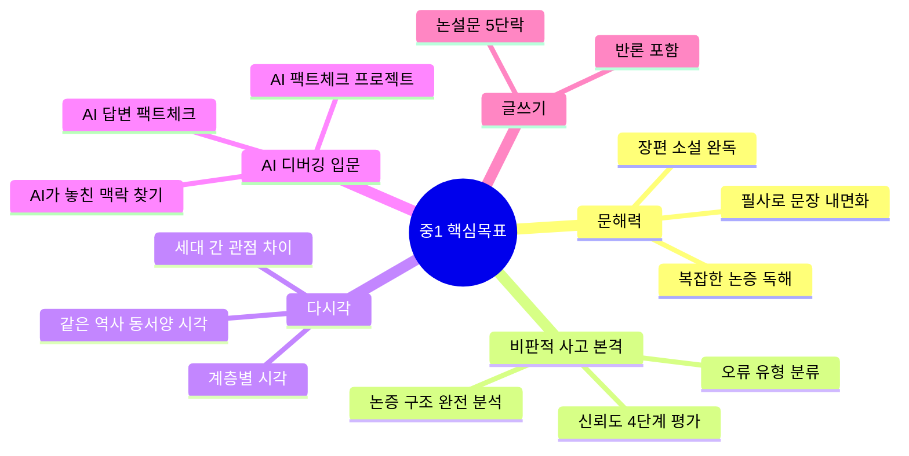

| 분야 | 추천 도서 | 기르는 능력 |
|------|-----------|------------|
| 비판적 사고 | 《1984》 조지 오웰 | 권력·정보 통제 비판 |
| 다시각 | 《아몬드》 손원평 | 감정·공감 다층 분석 |
| 논증 | 《왜 세계의 절반은 굶주리는가》 | 구조적 문제 |
| 역사 비판 | 《소년이 온다》 한강 | 역사 해석의 다양성 |
| AI 준비 | 《클루지》 게리 마커스 | 인간 사고의 결함 |
| 과학적 사고 | 《틀리지 않는 법》 조던 엘렌버그 | 통계·논리 |

---

**프로젝트 1 (입문): AI 팩트체크 프로젝트 (중1 추천)**

```
주제: AI가 말하는 역사적 사실을 검증하기

┌─────────────────────────────────────────────────────────────────┐
│ Week 1: AI에게 역사 질문 10개 → 답변 기록                        │
├─────────────────────────────────────────────────────────────────┤
│ • 교과서에서 궁금한 역사적 사건 10개 선택                        │
│                                                                 │
│ 예시 질문:                                                       │
│ 1. "임진왜란은 왜 시작됐어?"                                     │
│ 2. "광해군은 왜 폐위됐어?"                                       │
│ 3. "동학농민운동의 원인은?"                                      │
│                                                                 │
│ • AI 답변을 노트에 그대로 복사                                   │
└─────────────────────────────────────────────────────────────────┘

┌─────────────────────────────────────────────────────────────────┐
│ Week 2: 교과서와 대조 — 사실 확인                                │
├─────────────────────────────────────────────────────────────────┤
│ 검증표 작성:                                                     │
│                                                                 │
│ ┌─────────┬──────────┬──────────┬────────┐                     │
│ │ 질문    │ AI 답변  │ 교과서   │ 일치?  │                     │
│ ├─────────┼──────────┼──────────┼────────┤                     │
│ │ 임진왜란│도요토미  │O         │ O      │                     │
│ │ 광해군  │중립외교  │O         │ O      │                     │
│ │ 동학농민│부패·착취 │O         │ O      │                     │
│ └─────────┴──────────┴──────────┴────────┘                     │
│                                                                 │
│ • 결과 분석:                                                     │
│   - AI가 맞게 답한 것: ___개                                     │
│   - AI가 틀리거나 불충분한 것: ___개                             │
│   - AI가 교과서보다 더 자세한 것: ___개                          │
└─────────────────────────────────────────────────────────────────┘

┌─────────────────────────────────────────────────────────────────┐
│ Week 3: AI 실수 사례 분석 + 왜 틀렸는지 탐구                     │
├─────────────────────────────────────────────────────────────────┤
│ • AI가 틀린 답변 선택 → 왜 틀렸는지 분석                         │
│                                                                 │
│ 예시:                                                            │
│ 질문: "세종대왕의 업적은?"                                       │
│ AI 답변: "한글 창제, 측우기 발명, 과학 발전..."                  │
│ 검증: 측우기는 세종이 아닌 문종 때!                              │
│                                                                 │
│ 왜 틀렸나?                                                       │
│ → AI가 '세종=과학' 연관성을 과도하게 학습                        │
│ → 시기를 혼동하는 패턴                                           │
│                                                                 │
│ 교훈: AI는 "그럴듯한 연관성"을 사실로 착각할 수 있다             │
└─────────────────────────────────────────────────────────────────┘

┌─────────────────────────────────────────────────────────────────┐
│ Week 4: 보고서 작성 (600자)                                     │
├─────────────────────────────────────────────────────────────────┤
│ 제목: AI 역사 팩트체크 프로젝트 — AI를 믿어도 되는가?            │
│                                                                 │
│ 1. AI에게 물었던 역사 질문 10개 (100자)                         │
│ 2. 검증 결과: 맞은 것 vs 틀린 것 (200자)                        │
│ 3. AI가 틀린 이유 분석 (200자)                                  │
│ 4. 결론: AI 활용 시 주의점 (100자)                              │
│    → 반드시 교과서·신뢰할 만한 자료로 확인                       │
└─────────────────────────────────────────────────────────────────┘
```

---

### ⚖️ 중학교 2학년

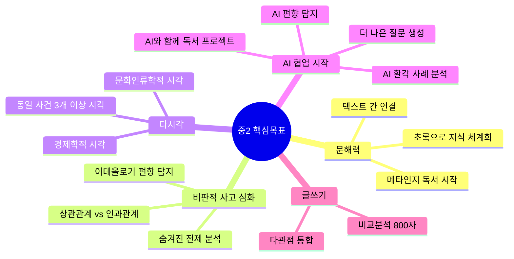

| 분야 | 추천 도서 | 기르는 능력 |
|------|-----------|------------|
| 숨겨진 전제 | 《총, 균, 쇠》 재레드 다이아몬드 (발췌) | 역사 편향 분석 |
| AI·기술 비판 | 《알고리즘이 지배한다》 관련 서적 | AI 편향 이해 |
| 경제 시각 | 《괴짜 경제학》 스티븐 레빗 (발췌) | 다른 관점 적용 |
| 과학 비판 | 《이기적 유전자》 리처드 도킨스 (발췌) | 과학적 주장 평가 |
| 철학 | 《소피의 세계》 요슈타인 가아더 | 사고 체계 이해 |
| 한국 사회 | 《82년생 김지영》 조남주 | 구조적 편향 |

---

### 🤖 중2부터 시작 — AI 협업 독서 프로젝트

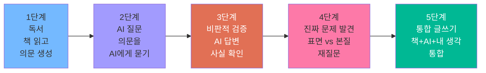

**프로젝트 1: AI 디버깅 독서 프로젝트 (중2 추천)**

```
주제: 《82년생 김지영》 읽고 AI와 대화하며 진짜 문제 찾기

┌─────────────────────────────────────────────────────────────────┐
│ Week 1: 독서 + 의문 생성                                        │
├─────────────────────────────────────────────────────────────────┤
│ • 《82년생 김지영》 완독                                         │
│ • 독서노트: 이상하다고 느낀 장면 5개 기록                       │
│ • 질문 10개 만들기                                               │
│   예: "왜 김지영은 회사를 그만뒀을까?"                           │
└─────────────────────────────────────────────────────────────────┘

┌─────────────────────────────────────────────────────────────────┐
│ Week 2: AI에게 질문하기 + 답변 기록                             │
├─────────────────────────────────────────────────────────────────┤
│ • 질문 10개를 ChatGPT/Claude에게 물어보기                       │
│ • AI 답변을 그대로 복사해서 기록                                │
│ • 각 답변 옆에 "동의함/의심됨" 표시                              │
│                                                                 │
│ 예시:                                                           │
│ 질문: "왜 김지영은 회사를 그만뒀을까?"                           │
│ AI 답변: "육아와 직장 병행이 어려워서"                          │
│ 내 판단: [의심됨] → 정말 육아 문제만인가?                       │
└─────────────────────────────────────────────────────────────────┘

┌─────────────────────────────────────────────────────────────────┐
│ Week 3: 비판적 검증 — AI 답변 디버깅                            │
├─────────────────────────────────────────────────────────────────┤
│ • AI 답변 중 "의심됨" 표시한 것 재검증                          │
│ • 검증 방법:                                                    │
│   ① 책에서 근거 찾기 (페이지 번호 기록)                         │
│   ② 다른 자료 찾기 (통계, 뉴스, 논문)                           │
│   ③ AI에게 "반대 입장을 말해줘" 재질문                          │
│                                                                 │
│ 예시:                                                           │
│ AI 1차 답변: "육아 문제"                                        │
│ 재질문: "육아 문제 외에 김지영이 회사를 그만둔 구조적 원인은?"   │
│ AI 2차 답변: "경력단절 여성에 대한 사회적 편견, 승진 차별..."   │
│ → AI도 질문에 따라 다른 답을 한다!                              │
└─────────────────────────────────────────────────────────────────┘

┌─────────────────────────────────────────────────────────────────┐
│ Week 4: 진짜 문제 발견 — 표면 vs 본질                           │
├─────────────────────────────────────────────────────────────────┤
│ • AI 답변들을 비교하며 진짜 문제 정의하기                       │
│                                                                 │
│ 표면 문제: "육아와 직장 병행의 어려움"                           │
│     ↓ (왜 병행이 어려운가?)                                     │
│ 중간 문제: "직장의 육아휴직 제도 부족"                           │
│     ↓ (왜 제도가 부족한가?)                                     │
│ 진짜 문제: "경력단절 여성을 비용으로 보는 기업 문화 +            │
│             여성이 육아 책임을 져야 한다는 사회적 전제"          │
│                                                                 │
│ → AI는 표면 문제를 먼저 답하는 경향                             │
│ → 인간이 "왜?"를 3번 물어야 진짜 문제 도달                      │
└─────────────────────────────────────────────────────────────────┘

┌─────────────────────────────────────────────────────────────────┐
│ Week 5: 통합 글쓰기 (1000자)                                    │
├─────────────────────────────────────────────────────────────────┤
│ 제목: 《82년생 김지영》과 AI가 말하지 않는 것                    │
│                                                                 │
│ 구조:                                                           │
│ 1. 책 요약 (200자)                                              │
│ 2. AI에게 물었던 질문과 답변 소개 (200자)                       │
│ 3. AI 답변의 한계 분석 (300자)                                  │
│    - AI가 놓친 관점은?                                          │
│    - AI가 피한 민감한 주제는?                                   │
│ 4. 내가 발견한 진짜 문제 (200자)                                │
│ 5. 결론: AI 시대에 인간 독서가 필요한 이유 (100자)              │
└─────────────────────────────────────────────────────────────────┘
```

---

### ⚖️ 중학교 3학년

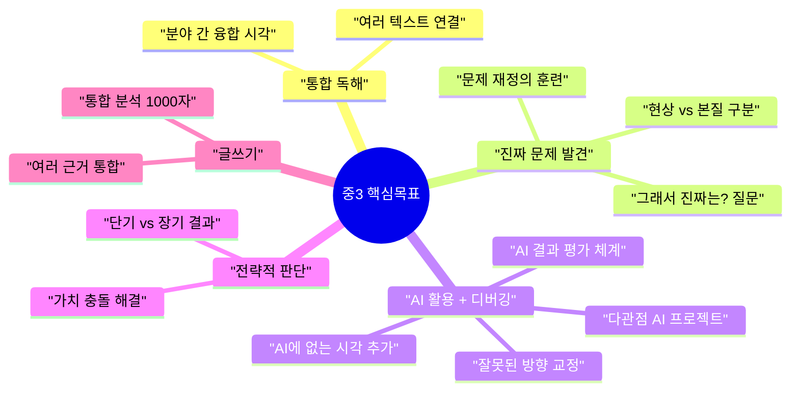

| 분야 | 추천 도서 | 기르는 능력 |
|------|-----------|------------|
| 문제 재정의 | 《사피엔스》 유발 하라리 (발췌) | 큰 그림 사고 |
| AI 이해 | 《생각하지 않는 사람들》 니콜라스 카 | AI의 한계·위험 |
| 전략적 사고 | 《블랙스완》 나심 탈레브 (발췌) | 불확실성 판단 |
| 다관점 융합 | 《총, 균, 쇠》 + 《사피엔스》 비교 읽기 | 통합 사고 |
| 문학 비판 | 《채식주의자》 한강 | 사회 규범 비판 |
| 과학철학 | 《코스모스》 칼 세이건 (발췌) | 과학적 회의주의 |

---

**프로젝트 2: 다관점 AI 프로젝트 (중3 추천)**

```
주제: 하나의 사회 문제를 AI로 3가지 시각에서 분석하기

┌─────────────────────────────────────────────────────────────────┐
│ Week 1: 문제 선정 + 배경 독서                                    │
├─────────────────────────────────────────────────────────────────┤
│ • 관심 사회 문제 선택 (예: 기후변화, 교육 불평등, AI 윤리)      │
│ • 관련 책 1권 + 뉴스 기사 5개 읽기                               │
│ • 내가 가진 기본 관점 정리 (200자)                               │
└─────────────────────────────────────────────────────────────────┘

┌─────────────────────────────────────────────────────────────────┐
│ Week 2: AI에게 3가지 렌즈로 질문하기                             │
├─────────────────────────────────────────────────────────────────┤
│ 같은 문제를 3가지 관점에서 AI에게 질문:                          │
│                                                                 │
│ 질문 1 (경제학 렌즈):                                            │
│ "기후변화 문제를 비용-편익 분석 관점에서 설명해줘"               │
│                                                                 │
│ 질문 2 (윤리학 렌즈):                                            │
│ "기후변화 문제를 세대 간 정의 관점에서 설명해줘"                 │
│                                                                 │
│ 질문 3 (정치학 렌즈):                                            │
│ "기후변화 문제를 국가 간 권력 관계 관점에서 설명해줘"            │
│                                                                 │
│ → AI 답변 3개를 표로 정리                                        │
└─────────────────────────────────────────────────────────────────┘

┌─────────────────────────────────────────────────────────────────┐
│ Week 3: AI 답변 비교 + 편향 탐지                                 │
├─────────────────────────────────────────────────────────────────┤
│ 비교 분석표 작성:                                                │
│                                                                 │
│ ┌──────┬─────────┬─────────┬──────────┐                        │
│ │ 관점  │ 핵심주장│ 해결책  │ AI 편향   │                        │
│ ├──────┼─────────┼─────────┼──────────┤                        │
│ │경제학│비용증가 │탄소세   │선진국중심│                        │
│ │윤리학│책임분담 │협약강화 │추상적    │                        │
│ │정치학│권력투쟁 │협상     │현실주의  │                        │
│ └──────┴─────────┴─────────┴──────────┘                        │
│                                                                 │
│ • 각 AI 답변이 놓친 관점은?                                      │
│ • 세 답변을 합쳐도 빠진 시각은? (예: 개발도상국 관점)           │
└─────────────────────────────────────────────────────────────────┘

┌─────────────────────────────────────────────────────────────────┐
│ Week 4: 진짜 문제 재정의 — AI가 못 보는 것                       │
├─────────────────────────────────────────────────────────────────┤
│ • AI 3개 답변의 공통된 전제 찾기                                 │
│   예: "경제 성장과 기후 보호는 상충된다"는 전제                  │
│                                                                 │
│ • 그 전제에 도전하기:                                            │
│   "경제 성장 없이 기후 문제를 해결할 방법은?"                    │
│   "기후 문제가 경제 기회가 될 수 있는가?"                        │
│                                                                 │
│ • 재질문 → AI 새 답변 → 또 다른 시각 발견                        │
└─────────────────────────────────────────────────────────────────┘

┌─────────────────────────────────────────────────────────────────┐
│ Week 5-6: 통합 글쓰기 (1200자)                                  │
├─────────────────────────────────────────────────────────────────┤
│ 제목: [문제명]에 대한 다관점 분석 — AI가 말하지 않는 네 번째 시각│
│                                                                 │
│ 1. 서론: 문제 소개 (150자)                                      │
│ 2. AI 답변 3가지 요약 (300자)                                   │
│ 3. AI 답변 비교·한계 분석 (400자)                               │
│    - 공통 전제 / 빠진 관점 / 편향                               │
│ 4. 내가 발견한 네 번째 시각 (250자)                             │
│    - AI가 제시하지 않은 새로운 관점                             │
│ 5. 결론: AI와 인간 협업의 필요성 (100자)                        │
└─────────────────────────────────────────────────────────────────┘
```

---

### 🎓 고등학교 1학년

```mermaid
mindmap
  root((고1 핵심목표))
    학문적 독해
      교과별 읽기 전략
      코넬노트 체계화
      수능 비문학 독해
    비판적 사고 완성
      논증의 숨겨진 전제
      반증 가능성 검토
      다학제적 분석
    AI 디버깅 체계화
      4단계 검증 프로세스
      AI 환각 패턴 인식
      질문 재설계 능력
      AI 학습 보조 프로젝트
    창의적 연결
      분야 간 유추
      새로운 프레임 제시
    글쓰기
      학술 에세이 1200자
      각주 활용
```

| 분야 | 추천 도서 | 기르는 능력 |
|------|-----------|------------|
| AI 비판 | 《생각하지 않는 사람들》 니콜라스 카 | 기술 비판적 사고 |
| 철학 | 《정의란 무엇인가》 마이클 샌델 | 가치 판단 체계 |
| 과학철학 | 《과학혁명의 구조》 토머스 쿤 (발췌) | 패러다임 전환 이해 |
| 역사 다관점 | 《총, 균, 쇠》 재레드 다이아몬드 | 다층 원인 분석 |
| 문학 | 《소년이 온다》 한강 | 역사·문학 통합 |
| 통계 | 《새빨간 거짓말, 통계》 대럴 허프 | 데이터 비판 |

---

**프로젝트 3: AI 학습 보조 프로젝트 (고1 추천)**

```
주제: 수능 비문학 지문을 AI로 심화 학습하기

┌─────────────────────────────────────────────────────────────────┐
│ Week 1: 수능 지문 선택 + 1차 독해                                │
├─────────────────────────────────────────────────────────────────┤
│ • 어려운 수능 기출 비문학 지문 1개 선택 (과학/인문/경제)         │
│ • 혼자 읽고 이해도 자가 평가: 60% 이하면 선택 성공               │
│ • 이해 안 되는 부분 밑줄 긋기                                    │
└─────────────────────────────────────────────────────────────────┘

┌─────────────────────────────────────────────────────────────────┐
│ Week 2: AI에게 단계별 질문하기                                   │
├─────────────────────────────────────────────────────────────────┤
│ 질문 1단계: 용어 확인                                            │
│ "이 지문에 나온 [용어]를 고등학생이 이해할 수 있게 설명해줘"     │
│                                                                 │
│ 질문 2단계: 논리 구조                                            │
│ "이 지문의 논리 전개를 단계별로 요약해줘"                        │
│                                                                 │
│ 질문 3단계: 배경지식                                             │
│ "이 지문을 이해하려면 어떤 배경지식이 필요해?"                   │
│                                                                 │
│ 질문 4단계: 예시 요청                                            │
│ "이 개념을 실생활 예시로 설명해줘"                               │
│                                                                 │
│ → 모든 AI 답변 기록                                              │
└─────────────────────────────────────────────────────────────────┘

┌─────────────────────────────────────────────────────────────────┐
│ Week 3: AI 답변 검증 + 교과서·참고서 대조                        │
├─────────────────────────────────────────────────────────────────┤
│ • AI가 설명한 내용이 맞는지 교과서에서 확인                      │
│ • AI 답변 vs 해설지 비교                                         │
│ • AI가 틀리거나 불충분한 부분 체크                               │
│                                                                 │
│ 검증표:                                                          │
│ ┌────────┬─────────┬──────────┬──────────┐                     │
│ │ AI답변 │ 교과서  │ 해설지   │ 일치도   │                     │
│ ├────────┼─────────┼──────────┼──────────┤                     │
│ │ 용어설명│ O       │ O        │ 90%      │                     │
│ │ 논리구조│ △       │ O        │ 70%      │                     │
│ │ 배경지식│ O       │ X (없음) │ AI 우수  │                     │
│ │ 예시    │ O       │ X (없음) │ AI 우수  │                     │
│ └────────┴─────────┴──────────┴──────────┘                     │
│                                                                 │
│ → AI의 강점: 배경지식, 예시 제공                                 │
│ → AI의 약점: 논리 구조 설명 (인간이 보완 필요)                   │
└─────────────────────────────────────────────────────────────────┘

┌─────────────────────────────────────────────────────────────────┐
│ Week 4: 더 깊은 질문 → 지문 너머 탐구                            │
├─────────────────────────────────────────────────────────────────┤
│ • 지문 내용을 넘어서는 확장 질문:                                │
│                                                                 │
│ "이 이론에 대한 반론은?"                                         │
│ "이 개념이 실제로 적용된 사례는?"                                │
│ "이 분야의 최신 연구 동향은?"                                    │
│                                                                 │
│ → AI 답변으로 관련 교양서 1권 추천받기                           │
│ → 그 책 1챕터 읽기 (배경지식 확장)                               │
└─────────────────────────────────────────────────────────────────┘

┌─────────────────────────────────────────────────────────────────┐
│ Week 5: 학습 과정 메타인지 글쓰기 (800자)                        │
├─────────────────────────────────────────────────────────────────┤
│ 제목: AI를 활용한 [지문 주제] 학습 과정 분석                     │
│                                                                 │
│ 1. 지문 소개 + 초기 어려움 (150자)                              │
│ 2. AI에게 물었던 질문 4단계 (200자)                             │
│ 3. AI 답변의 유용한 점 vs 한계 (250자)                          │
│ 4. AI 없이 혼자 공부했을 때와 차이 (150자)                      │
│ 5. 향후 AI 활용 학습 전략 (50자)                                │
└─────────────────────────────────────────────────────────────────┘
```

---

### 🎓 고등학교 2학년

```mermaid
mindmap
  root((고2 핵심목표))
    통합 독해
      수능 전 영역 독해
      논술 배경지식 구축
    진짜 문제 발견 심화
      사회 구조 분석
      담론 비판
      당연한 것 의심하기
    AI 협업 + 교정
      AI 활용 연구 방법
      AI 출력 검증 루틴
      인간 판단 추가 능력
      AI 연구 프로젝트
    전략적 판단
      복잡계 사고
      2차 3차 결과 예측
    글쓰기
      논술 1500자
      연구 보고서
```

| 분야 | 추천 도서 | 기르는 능력 |
|------|-----------|------------|
| 복잡계 사고 | 《블랙스완》 나심 탈레브 | 불확실성·예측 한계 |
| AI 미래 | 《특이점이 온다》 레이 커즈와일 (발췌) | AI 미래 비판적 이해 |
| 경제 구조 | 《자본론》 마르크스 (입문서) | 구조 분석 |
| 인류학 | 《총, 균, 쇠》 + 《사피엔스》 심화 | 메타 시각 |
| 한국 현대 | 《파친코》 이민진 | 역사·정체성 |
| 과학 비판 | 《이기적 유전자》 리처드 도킨스 | 과학 주장 평가 |

---

**프로젝트 4: AI 연구 보조 프로젝트 (고2 추천)**

```
주제: 관심 주제로 AI와 함께 미니 연구 논문 쓰기

┌─────────────────────────────────────────────────────────────────┐
│ Week 1-2: 연구 주제 설정 + 문제 발견                             │
├─────────────────────────────────────────────────────────────────┤
│ • 관심 분야에서 연구 주제 선택                                   │
│   예: "한국 고등학생의 수면 부족 원인 분석"                      │
│                                                                 │
│ • AI 브레인스토밍:                                               │
│   "이 주제로 고등학생이 연구할 수 있는 구체적 질문 5개 제시해줘" │
│                                                                 │
│ • AI 제안 5개 중 1개 선택 + 내가 수정                            │
│   AI 제안: "수면 시간과 성적의 상관관계"                         │
│   내 수정: "수면 시간이 아니라 수면의 질이 핵심 아닌가?"         │
│   최종 연구 질문: "한국 고등학생의 수면의 질에 영향을 미치는     │
│                    심리·사회적 요인 탐구"                        │
└─────────────────────────────────────────────────────────────────┘

┌─────────────────────────────────────────────────────────────────┐
│ Week 3-4: AI로 선행 연구 조사                                    │
├─────────────────────────────────────────────────────────────────┤
│ • AI에게 질문:                                                   │
│   "청소년 수면의 질 관련 주요 연구 결과 5개 알려줘"              │
│                                                                 │
│ • AI 답변 받기 → 각 연구 검증                                    │
│   ① AI가 제시한 연구자 이름 구글 검색                            │
│   ② 실제 논문이 존재하는가? (AI 환각 체크)                      │
│   ③ 논문 초록 직접 읽기                                          │
│                                                                 │
│ • AI 환각 사례 발견 시:                                          │
│   "이 연구는 실제로 존재하지 않는데, 왜 제시했어?"               │
│   → AI의 한계 이해 + 인간 검증의 중요성 깨닫기                   │
└─────────────────────────────────────────────────────────────────┘

┌─────────────────────────────────────────────────────────────────┐
│ Week 5-6: 데이터 수집 + AI 분석 보조                             │
├─────────────────────────────────────────────────────────────────┤
│ • 설문 조사 설계 (친구 30명 대상)                                │
│   AI 활용: "수면의 질 측정 설문 문항 10개 추천해줘"              │
│   인간 수정: AI 문항 중 부적절한 것 제거, 맥락에 맞게 수정       │
│                                                                 │
│ • 데이터 수집 후 AI에게 해석 요청:                               │
│   "이 설문 결과에서 어떤 패턴이 보여?"                           │
│                                                                 │
│ • AI 해석 vs 내 해석 비교:                                       │
│   AI: "스마트폰 사용 시간이 길수록 수면의 질 저하"               │
│   나: "스마트폰이 아니라 '불안감'이 진짜 원인 아닐까?"           │
│   → 재질문 → 더 깊은 인사이트                                    │
└─────────────────────────────────────────────────────────────────┘

┌─────────────────────────────────────────────────────────────────┐
│ Week 7-8: 논문 작성 (AI 초안 → 인간 수정)                        │
├─────────────────────────────────────────────────────────────────┤
│ • AI에게 구조 요청:                                              │
│   "고등학생 연구 보고서 구조를 단계별로 알려줘"                  │
│                                                                 │
│ • AI 활용 vs 인간 역할 분담:                                     │
│   ① 서론 배경 자료 → AI가 초안 작성 → 내가 맥락 추가            │
│   ② 연구 방법 → 내가 직접 작성 (내가 한 일이니까)               │
│   ③ 결과 해석 → AI 제안 받기 → 내가 비판적 수정                 │
│   ④ 결론·제언 → 내가 직접 작성 (가치 판단이니까)                │
│                                                                 │
│ • 최종 논문 (2000자)                                             │
│   각주: AI 활용 부분 명시 (투명성)                               │
└─────────────────────────────────────────────────────────────────┘
```

---

### 🎓 고등학교 3학년

```mermaid
mindmap
  root((고3 핵심목표))
    수능 독해 완성
      비문학 전 영역
      문학 심층 독해
    자기주도 사고
      자신만의 관점 구축
      논리 체계 완성
    AI 시대 핵심역량
      진짜 문제 설정
      AI 방향 교정
      가치 기반 판단
      AI 자기소개서 프로젝트
    진로 연계
      관심 분야 심층 독서
      자기소개서 연계
    글쓰기
      대학 수준 에세이
      자기소개서
```

| 분야 | 추천 도서 | 기르는 능력 |
|------|-----------|------------|
| 메타 사고 | 《생각에 관한 생각》 대니얼 카너먼 | 인지 편향 인식 |
| AI 철학 | 《마음의 사회》 마빈 민스키 (발췌) | AI와 인간 사고 비교 |
| 전략 판단 | 《손자병법》 (현대 해석) | 전략적 사고 체계 |
| 통합 인문 | 《문명의 충돌》 새뮤얼 헌팅턴 (발췌) | 거시 시각 |
| 자기 이해 | 《자기 앞의 생》 에밀 아자르 | 정체성·삶의 의미 |
| 진로 심화 | 관심 분야 전공 입문서 | 전공 준비 |

---

**프로젝트 5: AI 자기소개서 프로젝트 (고3 추천)**

```
주제: AI를 도구로 쓰되, AI가 쓸 수 없는 나만의 이야기 만들기

┌─────────────────────────────────────────────────────────────────┐
│ Week 1: AI에게 자기소개서 쓰게 하기 (반면교사)                   │
├─────────────────────────────────────────────────────────────────┤
│ • AI에게 요청:                                                   │
│   "고등학생 자기소개서를 써줘. 주제: 독서 경험"                  │
│                                                                 │
│ • AI가 쓴 자기소개서 분석:                                       │
│   ✗ 너무 평범하다                                                │
│   ✗ 구체적 경험이 없다                                           │
│   ✗ "많이 배웠습니다" 같은 뻔한 표현                             │
│   ✗ 나만의 목소리가 없다                                         │
│                                                                 │
│ → AI 자기소개서의 한계 목록 작성                                 │
│ → 이것이 대학이 원하지 않는 자소서!                              │
└─────────────────────────────────────────────────────────────────┘

┌─────────────────────────────────────────────────────────────────┐
│ Week 2: 진짜 나만의 경험 찾기 (AI 없이)                          │
├─────────────────────────────────────────────────────────────────┤
│ • AI 없이 손으로 메모:                                           │
│   - 책 읽고 진짜 충격받았던 순간 (감정 기록)                     │
│   - 그 책 때문에 내가 바뀐 구체적 행동                           │
│   - 실패·좌절·의문·갈등 (완벽한 이야기 NO)                      │
│                                                                 │
│ • 예시:                                                          │
│   《사피엔스》 읽고 "인간이 특별하지 않을 수도 있다"는 생각에     │
│   혼란스러웠다. 3일간 아무 책도 읽지 못했다. 그 후 《정의란       │
│   무엇인가》를 읽으며 "그래도 윤리는 인간만의 것"이라는 답을     │
│   스스로 찾았다. 이 과정이 나를 철학과에 관심 갖게 했다.         │
│                                                                 │
│ → 구체적 감정 + 구체적 행동 + 구체적 변화                        │
└─────────────────────────────────────────────────────────────────┘

┌─────────────────────────────────────────────────────────────────┐
│ Week 3: AI를 편집자로 활용하기                                   │
├─────────────────────────────────────────────────────────────────┤
│ • 내가 쓴 초고를 AI에게 보여주며:                                │
│                                                                 │
│   "이 자기소개서 초고를 읽고 다음을 알려줘:                      │
│    1) 어떤 부분이 구체적이고 좋은가?                             │
│    2) 어떤 부분이 추상적이고 약한가?                             │
│    3) 논리 전개에 빠진 부분은?                                   │
│    단, 내용을 대신 써주지는 말고 질문만 해줘"                    │
│                                                                 │
│ • AI 피드백 예시:                                                │
│   "《사피엔스》를 읽고 혼란스러웠다고 했는데, 어떤 부분이         │
│    구체적으로 혼란을 일으켰나요?"                                │
│                                                                 │
│ → AI 질문에 답하며 내용 구체화 (내가 직접 쓰기)                  │
└─────────────────────────────────────────────────────────────────┘

┌─────────────────────────────────────────────────────────────────┐
│ Week 4: AI와 나 버전 비교 + 최종 완성                            │
├─────────────────────────────────────────────────────────────────┤
│ • 비교표 작성:                                                   │
│                                                                 │
│ ┌──────────┬──────────────┬──────────────────┐                 │
│ │ 항목     │ AI 버전      │ 내 버전          │                 │
│ ├──────────┼──────────────┼──────────────────┤                 │
│ │ 구체성   │ 추상적       │ 감정·날짜·장소   │                 │
│ │ 진정성   │ 뻔한 표현    │ 나만의 고민      │                 │
│ │ 차별성   │ 모두 비슷    │ 내 실패 경험     │                 │
│ │ 가치     │ 결과 중심    │ 과정 중심        │                 │
│ └──────────┴──────────────┴──────────────────┘                 │
│                                                                 │
│ • 최종 자기소개서:                                               │
│   AI는 편집 도구로만 사용                                        │
│   핵심 내용·감정·가치 판단은 100% 나                             │
│                                                                 │
│ • 각주 명시: "AI를 편집 도구로 활용했으나                        │
│              모든 경험과 판단은 작성자 본인의 것임"              │
└─────────────────────────────────────────────────────────────────┘
```

---

### 🎓 고등학교 2학년

```mermaid
mindmap
  root((고2 핵심목표))
    통합 독해
      수능 전 영역 독해
      논술 배경지식 구축
    진짜 문제 발견 심화
      사회 구조 분석
      담론 비판
      당연한 것 의심하기
    AI 협업 + 교정
      AI 활용 연구 방법
      AI 출력 검증 루틴
      인간 판단 추가 능력
    전략적 판단
      복잡계 사고
      2차 3차 결과 예측
    글쓰기
      논술 1500자
      연구 보고서
```

| 분야 | 추천 도서 | 기르는 능력 |
|------|-----------|------------|
| 복잡계 사고 | 《블랙스완》 나심 탈레브 | 불확실성·예측 한계 |
| AI 미래 | 《특이점이 온다》 레이 커즈와일 (발췌) | AI 미래 비판적 이해 |
| 경제 구조 | 《자본론》 마르크스 (입문서) | 구조 분석 |
| 인류학 | 《총, 균, 쇠》 + 《사피엔스》 심화 | 메타 시각 |
| 한국 현대 | 《파친코》 이민진 | 역사·정체성 |
| 과학 비판 | 《이기적 유전자》 리처드 도킨스 | 과학 주장 평가 |

---

### 🎓 고등학교 3학년

```mermaid
mindmap
  root((고3 핵심목표))
    수능 독해 완성
      비문학 전 영역
      문학 심층 독해
    자기주도 사고
      자신만의 관점 구축
      논리 체계 완성
    AI 시대 핵심역량
      진짜 문제 설정
      AI 방향 교정
      가치 기반 판단
      AI 진로탐색 프로젝트
    진로 연계
      관심 분야 심층 독서
      자기소개서 연계
    글쓰기
      대학 수준 에세이
      자기소개서
```

| 분야 | 추천 도서 | 기르는 능력 |
|------|-----------|------------|
| 메타 사고 | 《생각에 관한 생각》 대니얼 카너먼 | 인지 편향 인식 |
| AI 철학 | 《마음의 사회》 마빈 민스키 (발췌) | AI와 인간 사고 비교 |
| 전략 판단 | 《손자병법》 (현대 해석) | 전략적 사고 체계 |
| 통합 인문 | 《문명의 충돌》 새뮤얼 헌팅턴 (발췌) | 거시 시각 |
| 자기 이해 | 《자기 앞의 생》 에밀 아자르 | 정체성·삶의 의미 |
| 진로 심화 | 관심 분야 전공 입문서 | 전공 준비 |

---

**프로젝트 6: AI 진로 탐색 프로젝트 (고3 추천)**

```
주제: AI로 관심 분야 깊이 탐구 + 자기소개서 완성

┌─────────────────────────────────────────────────────────────────┐
│ Week 1: 진로 분야 독서 지도 만들기 (AI 활용)                     │
├─────────────────────────────────────────────────────────────────┤
│ • AI에게 질문:                                                   │
│   "[관심 전공]을 이해하기 위해 고등학생이 읽어야 할              │
│    필수 도서 10권을 난이도 순으로 추천해줘"                      │
│                                                                 │
│ • AI 추천 도서 검증:                                             │
│   ① 각 책을 구글에서 검색 → 실제 평가 확인                      │
│   ② 도서관·서점에서 실물 확인 → 너무 어려운 건 제외             │
│   ③ 최종 5권 선정 (AI 추천 + 내 판단)                           │
│                                                                 │
│ • 3개월 독서 계획 수립:                                          │
│   책 1: 입문 (가장 쉬운 것)                                      │
│   책 2-3: 심화                                                   │
│   책 4-5: 현재 이슈·논쟁                                         │
└─────────────────────────────────────────────────────────────────┘

┌─────────────────────────────────────────────────────────────────┐
│ Week 2-10: 독서 + AI 탐구 (책 1권당 2주)                        │
├─────────────────────────────────────────────────────────────────┤
│ 각 책마다 반복:                                                  │
│                                                                 │
│ 1주차: 책 읽기 + 코넬노트                                        │
│   • 이해 안 되는 부분 → AI에게 "설명해줘"                        │
│   • 흥미로운 부분 → AI에게 "더 깊이 알고 싶어"                   │
│                                                                 │
│ 2주차: 비판적 질문 + AI 대화                                    │
│   • "이 이론의 반론은?"                                          │
│   • "이 주장의 한계는?"                                          │
│   • "실제 적용 사례는?"                                          │
│   • "최신 연구 동향은?"                                          │
│                                                                 │
│ → AI 답변 + 내 생각 = 전공 이해 노트 완성                        │
└─────────────────────────────────────────────────────────────────┘

┌─────────────────────────────────────────────────────────────────┐
│ Week 11-12: 자기소개서 작성 (AI 협업)                           │
├─────────────────────────────────────────────────────────────────┤
│ • 핵심 원칙: AI는 편집 도구, 내용은 100% 나                      │
│                                                                 │
│ 1단계: 핵심 경험 3가지 선택 (AI 없이)                           │
│   → 10주간 독서에서 가장 충격적이었던 순간                       │
│   → 내 생각이 바뀐 순간                                          │
│   → 새로운 질문이 생긴 순간                                      │
│                                                                 │
│ 2단계: 구조 잡기 (AI 활용)                                      │
│   "이 세 경험을 하나의 이야기로 연결하는 구조를 제안해줘"        │
│   → AI 제안 구조 vs 내 직관 비교 → 최종 결정은 내가             │
│                                                                 │
│ 3단계: 초고 작성 (AI 없이 손으로)                               │
│   → 구체적 감정·날짜·장소·대화 포함                              │
│   → "많이 배웠습니다" 같은 AI스러운 표현 금지                    │
│                                                                 │
│ 4단계: AI 편집 (문장만)                                          │
│   "이 문장을 더 명확하게 다듬어줘. 단, 내 목소리를 유지해줘"     │
│   → AI 제안 vs 원문 비교 → 내 목소리 유지되면 채택               │
│                                                                 │
│ 5단계: 최종 검토 (AI에게 역할극)                                │
│   "당신은 대학 입학사정관입니다. 이 자기소개서의 강점과          │
│    약점을 솔직하게 평가해주세요"                                 │
│   → AI 피드백 듣고 최종 수정 (판단은 내가)                       │
└─────────────────────────────────────────────────────────────────┘
```

---

## 7. AI 디버깅 능력 학년별 훈련

```mermaid
flowchart TD
    subgraph 초5~6 입문
        D1["AI 답변 읽기<br>사실인지 하나만 확인"]
        D2["AI가 틀린 것<br>교과서로 확인"]
    end

    subgraph 중1~2 기초
        D3["AI 답변 구조 분석<br>주장·근거 분리"]
        D4["AI가 놓친 관점<br>스스로 추가"]
    end

    subgraph 중3~고1 응용
        D5["AI 편향 탐지<br>어떤 시각이 빠졌나?"]
        D6["더 나은 질문 설계<br>질문 재작성"]
    end

    subgraph 고2~고3 심화
        D7["AI 방향 교정<br>진짜 문제 재정의"]
        D8["AI + 인간 협업<br>각자 역할 분담"]
    end

    D1 --> D2 --> D3 --> D4 --> D5 --> D6 --> D7 --> D8

    style D1 fill:#74b9ff,color:#333
    style D2 fill:#74b9ff,color:#333
    style D3 fill:#a29bfe,color:#333
    style D4 fill:#a29bfe,color:#333
    style D5 fill:#e17055,color:#fff
    style D6 fill:#e17055,color:#fff
    style D7 fill:#2d3436,color:#fff
    style D8 fill:#2d3436,color:#fff
```

---

## 8. 구체적 실전 예시 — AI 디버깅

### 사례 1: AI 사실 오류 탐지 (초5~6 수준)

```
질문: "이순신 장군이 죽은 전투는?"
AI 답변: "이순신 장군은 노량해전에서 전사했습니다."
              ↓ 맞는 것 같은데...

디버깅 과정:
  1. 교과서 확인 → 맞다 (사실 확인 OK)
  2. 추가 질문: "노량해전은 몇 년이야?"
  AI: "1598년입니다."
  3. 교과서 확인 → 맞다
  4. 한 발 더: "노량해전 이후 임진왜란은 어떻게 됐어?"
  AI: "이순신 사망 후 조선이 어려워졌습니다."
  → 이건 틀림! 이순신 사망 = 전쟁 종결 시점
  → AI가 인과관계를 반대로 서술

핵심 교훈: AI는 개별 사실은 맞아도 인과관계를 틀릴 수 있다
```

---

### 사례 2: AI 편향 탐지 (중학생 수준)

```
질문: "산업혁명의 영향은?"
AI 답변:
  "산업혁명으로 생산성이 향상되고, 경제가 성장했으며,
   기술이 발전하여 현대 문명의 기초가 되었습니다."

디버깅 과정:
  1. 주장 확인: 맞는 것들이다
  2. 편향 질문: "누구 입장에서 쓴 글인가?"
     → 산업 자본가 / 서구 중심 / 현재 시점 관점
  3. 빠진 관점 찾기:
     ✗ 노동자 아동 착취 (당시 12시간 노동, 아동 노동)
     ✗ 식민지 수탈 (원재료 착취)
     ✗ 환경 파괴 (초기 대기오염)
     ✗ 기술 실업 (러다이트 운동)
  4. 더 나은 질문 재설계:
     "산업혁명이 자본가, 노동자, 식민지에 미친
      각각 다른 영향은 무엇인가?"

핵심 교훈: AI는 지배적 담론을 반영한다. 빠진 시각을 찾는 것이 인간의 역할
```

---

### 사례 3: 방향 교정 (고등학생 수준)

```
잘못된 질문: "우리나라 교육 문제를 해결하는 방법은?"
AI 답변: (사교육 비용 절감, 교육과정 개편, 교사 역량 강화...)

방향 교정 과정:
  1. "이게 진짜 문제를 묻는 질문인가?"
     → 문제를 "교육 문제"로 너무 넓게 정의함
  2. 진짜 문제 재정의:
     "교육 문제"의 본질은 무엇인가?
     → 학생들이 행복하지 않다? (현상)
     → 왜 행복하지 않나? (원인)
     → 성적이 자존감을 결정하는 구조 (구조)
     → 왜 그런 구조인가? (더 깊은 원인)
     → 서열화된 대학 입시 → 취업 시장 → 노동 구조
  3. 재설계된 질문:
     "노동 시장 서열화가 교육 경쟁을 강화하는
      인과 구조를 분석하고, 핀란드와 비교할 때
      한국만의 구조적 특수성은 무엇인가?"

핵심 교훈: 좋은 질문이 좋은 답변보다 더 어렵고 더 중요하다
           이것이 AI가 못하는 것이다
```

---

## 9. 분야별 다시각 훈련 — 같은 사건, 다른 렌즈

```mermaid
mindmap
  root((다시각 훈련))
    경제학 렌즈
      비용-편익 분석
      인센티브 구조
      시장 실패 원인
    역사학 렌즈
      맥락 속 해석
      1차 사료 vs 해석
      승자의 역사 의심
    심리학 렌즈
      인지 편향
      집단 심리
      동기 분석
    사회학 렌즈
      구조 vs 개인
      계층·권력 관계
      제도의 영향
    철학 렌즈
      윤리적 판단
      가치 충돌 해결
      전제 질문
    과학 렌즈
      증거 기반 판단
      반증 가능성
      상관 vs 인과
```

---

### 실전 예시: "노숙자 문제"를 다시각으로 보기

```
┌──────────┬──────────────────────────────────────────────────┐
│ 렌즈      │ 분석 내용                                        │
├──────────┼──────────────────────────────────────────────────┤
│ 경제학   │ 주거 비용 상승 → 소득 대비 임대료 비율 문제      │
│ 심리학   │ 트라우마·정신질환 → 사회적 지원 부재             │
│ 사회학   │ 사회 안전망 부재 → 계층 이동 불가 구조           │
│ 역사학   │ 외환위기 이후 급증 → 구조조정의 결과             │
│ 철학     │ 국가의 의무 vs 개인 책임 논쟁                    │
│ 과학     │ 노숙 기간 vs 건강 악화 상관관계                  │
├──────────┼──────────────────────────────────────────────────┤
│ AI 단일답│ "사회 안전망 강화와 일자리 제공이 필요합니다"    │
│ 한계     │ → 모든 렌즈를 평균낸 무난한 답 / 구조 놓침       │
├──────────┼──────────────────────────────────────────────────┤
│ 인간 추가│ "이 문제의 본질은 한국 사회에서                  │
│ 시각     │  '실패'가 회복 불가능하도록 설계된 구조다"        │
│          │ → 이것이 AI가 못하는 진짜 문제 발견              │
└──────────┴──────────────────────────────────────────────────┘
```

---

## 10. 문해력 4가지 수준 진단표

```mermaid
flowchart TD
    L1["수준 1: 해독<br>글자를 소리로 변환<br>단어의 뜻 파악<br>→ 초등 1~2학년 목표"]
    L2["수준 2: 이해<br>문장의 의미 파악<br>단락 요지 추출<br>줄거리 요약<br>→ 초등 3~4학년 목표"]
    L3["수준 3: 분석<br>주장·근거 분리<br>논증 구조 파악<br>편향·오류 탐지<br>→ 초등 5학년~중학생 목표"]
    L4["수준 4: 통합<br>여러 텍스트 연결<br>진짜 문제 발견<br>새 관점 창출<br>AI 교정<br>→ 중3~고등학생 목표"]

    L1 --> L2 --> L3 --> L4

    style L1 fill:#55efc4,color:#333
    style L2 fill:#74b9ff,color:#333
    style L3 fill:#a29bfe,color:#333
    style L4 fill:#2d3436,color:#fff
```

---

## 11. 학년별 추천 도서 전체 요약표

| 학년 | 문해력·독해 | 비판적 사고 | 다시각 | AI시대 준비 |
|------|------------|------------|--------|------------|
| 유치원 | 《파도야 놀자》 | 《지각대장 존》 | 《으뜸 헤엄이》 | 《100층짜리 집》 |
| 초1 | 《개구리와 두꺼비》 | 《강아지똥》 | 《구름빵》 | 《나쁜 어린이 표》 |
| 초2 | 《마당을 나온 암탉》 | 《거짓말 학교》 | 《아홉 살 마음 사전》 | 《이상한 자연사 박물관》 |
| 초3 | 《몽실 언니》 | 《진짜 나쁜 늑대가 없다》 | 《샬롯의 거미줄》 | 《나의 라임오렌지나무》 |
| 초4 | 《어린 왕자》 | 《늑대가 들려주는 아기 돼지 삼형제》 | 《행복한 왕자》 | 《마당을 나온 암탉》 심화 |
| 초5 | 《완득이》 | 《왜 세계의 절반은 굶주리는가》 | 《파친코》 발췌 | 《숫자로 보는 세계》 |
| 초6 | 《소나기》 | 《정의란 무엇인가》 어린이판 | 역사 다관점 자료 | 팩트체크 실습 |
| 중1 | 《소년이 온다》 | 《1984》 | 《아몬드》 | 《클루지》 |
| 중2 | 《채식주의자》 | 《총, 균, 쇠》 발췌 | 《소피의 세계》 | 《괴짜 경제학》 발췌 |
| 중3 | 《사피엔스》 발췌 | 《블랙스완》 발췌 | 여러 텍스트 통합 읽기 | 《생각하지 않는 사람들》 |
| 고1 | 《과학혁명의 구조》 발췌 | 《정의란 무엇인가》 원서 | 《총, 균, 쇠》 완독 | 《새빨간 거짓말, 통계》 |
| 고2 | 《파친코》 완독 | 《자본론》 입문서 | 《문명의 충돌》 발췌 | 《특이점이 온다》 발췌 |
| 고3 | 관심 분야 전공 입문서 | 《생각에 관한 생각》 | 《손자병법》 현대 해석 | 《마음의 사회》 발췌 |

---

## 12. 중1~고3 AI 협업 프로젝트 전체 로드맵

```mermaid
flowchart TD
    subgraph M1 ["중1: AI 팩트체크"]
        M1A["역사 질문 10개"] --> M1B["AI 답변"]
        M1B --> M1C["교과서 검증"]
        M1C --> M1D["틀린 이유 분석"]
    end

    subgraph M2 ["중2: AI 디버깅"]
        M2A["책 읽고 의문"] --> M2B["AI 질문"]
        M2B --> M2C["답변 비판 검증"]
        M2C --> M2D["진짜 문제 재정의"]
    end

    subgraph M3 ["중3: 다관점 AI"]
        M3A["사회 문제 선정"] --> M3B["3가지 렌즈로 질문"]
        M3B --> M3C["답변 비교·편향"]
        M3C --> M3D["네 번째 시각 창출"]
    end

    subgraph H1 ["고1: AI 학습 보조"]
        H1A["어려운 수능 지문"] --> H1B["AI 단계별 질문"]
        H1B --> H1C["교과서 대조 검증"]
        H1C --> H1D["학습 과정 글쓰기"]
    end

    subgraph H2 ["고2: AI 연구 보조"]
        H2A["연구 주제 설정"] --> H2B["AI 선행연구 조사"]
        H2B --> H2C["AI 환각 검증"]
        H2C --> H2D["연구 논문 2000자"]
    end

    subgraph H3 ["고3: AI 진로 탐색"]
        H3A["AI 독서 추천"] --> H3B["10주 심층 독서"]
        H3B --> H3C["AI 편집 협업"]
        H3C --> H3D["자기소개서 완성"]
    end

    M1 --> M2 --> M3 --> H1 --> H2 --> H3

    style M1 fill:#a29bfe,color:#333
    style M2 fill:#fd79a8,color:#333
    style M3 fill:#e17055,color:#fff
    style H1 fill:#0984e3,color:#fff
    style H2 fill:#6c5ce7,color:#fff
    style H3 fill:#2d3436,color:#fff
```

| 학년 | 프로젝트명 | 기간 | 핵심 능력 | 결과물 |
|------|-----------|------|-----------|--------|
| 중1 | AI 팩트체크 | 4주 | 사실 검증 | 보고서 600자 |
| 중2 | AI 디버깅 독서 | 5주 | 비판적 검증 | 통합 글 1000자 |
| 중3 | 다관점 AI | 6주 | 다시각 통합 | 분석 글 1200자 |
| 고1 | AI 학습 보조 | 5주 | 학습 전략 | 메타인지 글 800자 |
| 고2 | AI 연구 보조 | 8주 | 연구 방법 | 연구 논문 2000자 |
| 고3 | AI 진로 탐색 | 12주 | 진로 탐구 | 자기소개서 |

---

## 13. AI 협업 독서·글쓰기 통합 프로세스

```mermaid
flowchart TD
    START["📚 책 읽기<br>(인간 주도)"] --> QUESTION["❓ 의문 생성<br>(인간 주도)<br>진짜 문제가 무엇인가?"]
    
    QUESTION --> AI_Q["🤖 AI에게 질문<br>(AI 활용)<br>첫 번째 답변"]
    
    AI_Q --> VERIFY["✅ 검증<br>(인간 주도)<br>사실인가? 논리적인가?"]
    
    VERIFY --> REFRAME{"방향이 맞는가?<br>(인간 판단)"}
    
    REFRAME -->|"방향 오류"| NEWQ["❓ 질문 재설계<br>(인간 주도)<br>진짜 문제 재정의"]
    NEWQ --> AI_Q
    
    REFRAME -->|"방향 OK"| EXPAND["🔍 확장 탐구<br>(AI 협업)<br>더 깊은 질문"]
    
    EXPAND --> INSIGHT["💡 새 시각 발견<br>(인간 주도)<br>AI에 없는 관점"]
    
    INSIGHT --> WRITE["✍️ 글쓰기<br>(인간 주도)<br>책+AI+내 판단 통합"]
    
    WRITE --> AI_EDIT["🤖 AI 편집<br>(AI 보조)<br>문장 다듬기만"]
    
    AI_EDIT --> FINAL["📄 최종 판단<br>(인간 주도)<br>내 목소리 유지 확인"]

    style START fill:#74b9ff,color:#333
    style QUESTION fill:#fdcb6e,color:#333
    style VERIFY fill:#e17055,color:#fff
    style REFRAME fill:#fd79a8,color:#333
    style NEWQ fill:#fdcb6e,color:#333
    style INSIGHT fill:#00b894,color:#fff
    style WRITE fill:#6c5ce7,color:#fff
    style FINAL fill:#2d3436,color:#fff
```

---

## 14. 부모·교사를 위한 핵심 질문 목록

> 책 읽은 후 이 질문들을 하면 4가지 능력이 모두 훈련된다.

```mermaid
mindmap
  root((책 읽은 후<br>핵심 질문))
    진짜 문제 발견
      이 이야기의 진짜 문제는 뭘까?
      겉으로 보이는 문제와 숨겨진 문제가 다른가?
      작가는 무엇을 말하고 싶었을까?
    비판적 평가
      이 주장에 동의해? 왜?
      반대 입장은 어떤 말을 할까?
      이 정보는 믿을 수 있어? 근거가 있어?
    창의 연결
      이 이야기가 현실에서 일어난다면?
      다른 책에서 비슷한 상황이 있었어?
      전혀 다른 분야와 연결해보면?
    전략 판단
      주인공이 다른 선택을 했다면?
      장기적으로 어떻게 됐을까?
      네가 결정해야 한다면 어떻게 할 거야?
```

---

## 15. AI 시대 독서·글쓰기 교육 원칙 10계명

```mermaid
mindmap
  root((AI 시대<br>교육 원칙))
    AI는 도구다
      AI가 생각을 대신하지 않는다
      AI는 편집자지 작가가 아니다
    검증은 인간이다
      AI 답변 맹신 금지
      반드시 출처 확인
      교과서·신뢰 자료 대조
    질문이 핵심이다
      좋은 질문이 좋은 답보다 어렵다
      질문 재설계 능력이 미래 경쟁력
    방향은 인간이 잡는다
      AI는 주어진 방향만 간다
      올바른 방향 설정은 인간의 몫
    가치 판단은 인간만이다
      AI는 윤리적 판단을 못한다
      최종 결정은 인간이
    독서가 기초다
      AI 활용도 독해력이 있어야 가능
      비판적 읽기가 AI 검증의 근육
    프로세스를 기록하라
      결과보다 과정이 배움
      AI 활용 과정을 글로 남겨라
    실수를 환영하라
      AI 틀린 것 찾기가 학습
      AI 환각이 교육 재료다
    창의는 인간 영역이다
      AI 없는 새 시각 찾기
      분야 경계 넘나들기
    즐거움을 잃지 마라
      AI 도구가 부담 주면 안 된다
      독서의 즐거움이 최우선
```

---

## 16. 학년별 AI 활용 가이드라인

| 학년 | AI 사용 허용 범위 | 금지 사항 | 주의점 |
|------|-----------------|-----------|--------|
| 초6 이하 | 사용 권장 안 함 | 전면 금지 | 기초 독해력 확립이 우선 |
| 중1 | 팩트체크 목적만 | AI로 숙제하기 | 교과서 검증 필수 |
| 중2 | 탐구·질문 목적 | 글쓰기 대신하기 | 비판적 검증 훈련 |
| 중3 | 다관점 분석 | AI 답변 그대로 쓰기 | 내 시각 추가 필수 |
| 고1 | 학습 보조 도구 | AI 요약 의존 | 스스로 읽기 우선 |
| 고2 | 연구 보조 도구 | AI 환각 무검증 | 출처 반드시 확인 |
| 고3 | 편집 도구 | 내용 생성 의존 | 경험은 100% 본인 |

---

## 17. 중학생 이후 AI 협업 독서 월간 루틴 (종합)

```
┌──────┬──────────────────────────────────────────────────────────┐
│ 주차  │ 활동 (중2~고3 공통 프레임)                               │
├──────┼──────────────────────────────────────────────────────────┤
│ 1주  │ 책 읽기 + 의문 리스트 만들기 (AI 없이)                   │
│      │ → 최소 10개 이상 질문 만들기                             │
├──────┼──────────────────────────────────────────────────────────┤
│ 2주  │ AI에게 질문하기 + 답변 전체 기록                         │
│      │ → AI 답변에 "동의/의심/궁금" 표시하기                    │
├──────┼──────────────────────────────────────────────────────────┤
│ 3주  │ 비판적 검증 — 교과서·참고서·다른 자료와 대조             │
│      │ → AI 맞은 것 / 틀린 것 / 불충분한 것 분류               │
├──────┼──────────────────────────────────────────────────────────┤
│ 4주  │ 진짜 문제 재정의 + 재질문                                │
│      │ → "왜?"를 3번 이상 물어 본질 도달                        │
│      │ → AI에게 재질문 → 새 시각 발견                           │
├──────┼──────────────────────────────────────────────────────────┤
│ 5주  │ 통합 글쓰기 (책+AI+내 판단)                              │
│      │ → AI는 편집만 / 내용·판단은 100% 나                     │
└──────┴──────────────────────────────────────────────────────────┘
```

---

## 18. AI 디버깅 체크리스트 (중학생 이상 필수)

```
AI 답변을 받았을 때 반드시 확인할 4가지:

┌─────────────────────────────────────────────────────────────────┐
│ ✅ 1단계: 사실 검증 (Fact Check)                                │
├─────────────────────────────────────────────────────────────────┤
│ □ AI가 제시한 날짜·숫자·이름이 정확한가?                        │
│ □ 출처가 실제로 존재하는가? (구글 검색)                         │
│ □ 교과서·신뢰 자료와 일치하는가?                                │
└─────────────────────────────────────────────────────────────────┘

┌─────────────────────────────────────────────────────────────────┐
│ ✅ 2단계: 논리 검증 (Logic Check)                               │
├─────────────────────────────────────────────────────────────────┤
│ □ 전제 → 결론 연결이 논리적인가?                                │
│ □ 상관관계를 인과관계로 착각하지 않았는가?                      │
│ □ 일반화의 오류는 없는가? (하나 사례로 전체 주장)               │
└─────────────────────────────────────────────────────────────────┘

┌─────────────────────────────────────────────────────────────────┐
│ ✅ 3단계: 방향 검증 (Direction Check)                           │
├─────────────────────────────────────────────────────────────────┤
│ □ 내 질문에 제대로 답했는가? (질문 회피는 없는가)               │
│ □ 표면 문제가 아니라 본질 문제를 다뤘는가?                      │
│ □ 빠진 관점은 없는가? (누구의 시각이 빠졌나)                    │
└─────────────────────────────────────────────────────────────────┘

┌─────────────────────────────────────────────────────────────────┐
│ ✅ 4단계: 가치 검증 (Value Check)                               │
├─────────────────────────────────────────────────────────────────┤
│ □ AI 제안이 윤리적으로 문제는 없는가?                           │
│ □ 장기적 결과를 고려했는가?                                     │
│ □ 약자·소수의 관점이 배제되지 않았는가?                         │
└─────────────────────────────────────────────────────────────────┘
```

---

## 19. 부모·교사를 위한 핵심 질문 목록

> 책 읽은 후 이 질문들을 하면 4가지 능력이 모두 훈련된다.

```mermaid
mindmap
  root((책 읽은 후<br>핵심 질문))
    진짜 문제 발견
      이 이야기의 진짜 문제는 뭘까?
      겉으로 보이는 문제와 숨겨진 문제가 다른가?
      작가는 무엇을 말하고 싶었을까?
      AI에게 물어보기 전에 네 생각은?
    비판적 평가
      이 주장에 동의해? 왜?
      반대 입장은 어떤 말을 할까?
      이 정보는 믿을 수 있어? 근거가 있어?
      AI가 이렇게 답했는데 맞을까?
    창의 연결
      이 이야기가 현실에서 일어난다면?
      다른 책에서 비슷한 상황이 있었어?
      전혀 다른 분야와 연결해보면?
      AI가 제안 못한 연결은?
    전략 판단
      주인공이 다른 선택을 했다면?
      장기적으로 어떻게 됐을까?
      네가 결정해야 한다면 어떻게 할 거야?
      AI 제안대로 하는 게 최선일까?
```

---

## 20. 실전 사례 — AI 디버깅 완전 예시

### 사례: 중2 학생이 《82년생 김지영》 읽고 AI와 대화

```
┌─────────────────────────────────────────────────────────────────┐
│ 1단계: 책 읽고 의문 생성 (AI 없이)                               │
├─────────────────────────────────────────────────────────────────┤
│ 학생의 의문: "왜 김지영은 회사를 그만뒀을까?"                    │
└─────────────────────────────────────────────────────────────────┘

┌─────────────────────────────────────────────────────────────────┐
│ 2단계: AI에게 질문                                               │
├─────────────────────────────────────────────────────────────────┤
│ AI 답변:                                                         │
│ "김지영은 출산 후 육아와 직장 병행이 어려워 회사를 그만두었습니다.│
│  한국 사회에서 여성에게 육아 책임이 집중되고, 직장은 육아휴직을  │
│  실질적으로 지원하지 않는 구조적 문제가 원인입니다."             │
│                                                                 │
│ 학생 반응: [동의함] 그럴듯하다                                   │
└─────────────────────────────────────────────────────────────────┘

┌─────────────────────────────────────────────────────────────────┐
│ 3단계: 비판적 검증 — "정말 그것뿐일까?"                         │
├─────────────────────────────────────────────────────────────────┤
│ 재질문 1: "김지영이 회사를 그만둔 다른 이유는 없을까?"           │
│ AI 답변: "승진에서 제외되고, 동료들의 차별적 언행도 있었습니다" │
│                                                                 │
│ 재질문 2: "남편은 왜 회사를 그만두지 않았을까?"                  │
│ AI 답변: "남편은 주 소득원이라는 경제적 이유와 사회적 기대..."   │
│                                                                 │
│ 학생 발견: "육아 문제"가 아니라                                  │
│            "육아 책임을 누가 지느냐의 문제"네!                   │
└─────────────────────────────────────────────────────────────────┘

┌─────────────────────────────────────────────────────────────────┐
│ 4단계: 진짜 문제 재정의 — AI가 못 본 것                          │
├─────────────────────────────────────────────────────────────────┤
│ 학생의 재정의:                                                   │
│                                                                 │
│ "이 소설의 진짜 문제는 '육아와 직장 병행'이 아니라               │
│  '여성만 선택을 강요받는 구조'다.                                │
│  남성은 선택하지 않는다. 당연히 일한다.                          │
│  여성만 일 vs 육아를 '선택'해야 한다.                            │
│  이 비대칭이 진짜 문제다."                                       │
│                                                                 │
│ → AI 첫 답변에는 이 "비대칭" 개념이 명확하지 않았다              │
│ → "왜?"를 3번 물으니 학생 스스로 발견                            │
└─────────────────────────────────────────────────────────────────┘

┌─────────────────────────────────────────────────────────────────┐
│ 5단계: 통합 글쓰기 (1000자)                                     │
├─────────────────────────────────────────────────────────────────┤
│ 제목: 《82년생 김지영》이 말하는 '선택'의 비대칭                 │
│                                                                 │
│ [서론] 김지영은 왜 회사를 그만뒀을까? AI에게 물었더니            │
│        "육아 문제"라고 답했다. 하지만 책을 다시 읽으며           │
│        진짜 문제는 다른 곳에 있다는 것을 발견했다.               │
│                                                                 │
│ [본론1] AI의 첫 답변과 그 한계                                   │
│ [본론2] 왜?를 3번 물으며 발견한 것                               │
│ [본론3] 진짜 문제: 선택의 비대칭 구조                            │
│                                                                 │
│ [결론] AI는 표면 문제를 잘 답하지만, 구조적 본질을 발견하는      │
│        것은 인간이 책을 깊이 읽어야만 가능하다.                  │
└─────────────────────────────────────────────────────────────────┘
```

---

---

## 21. 심도 높은 질문과 답변 30개

### 📌 기초 개념 (Q1~Q5)

**Q1. 문해력과 독해력은 어떻게 다른가요?**

```mermaid
flowchart LR
    A["문해력 Literacy<br>글자를 읽고 쓰는 능력<br>+ 의미를 이해하는 능력"] --> B["독해력 Reading Comprehension<br>텍스트의 의미를<br>깊이 이해하는 능력"]
    
    A --> A1["기초: 해독<br>글자→소리→단어"]
    B --> B1["심화: 추론·분석<br>행간 읽기·비판"]
    
    style A fill:#74b9ff,color:#333
    style B fill:#0984e3,color:#fff
```

**답변:**
- **문해력**: 기초적인 읽기·쓰기 능력. 글자를 해독하고 문장의 표면 의미를 파악하는 것
- **독해력**: 문해력을 기반으로 텍스트의 깊은 의미, 행간, 작가의 의도까지 파악하는 능력
- 문해력 없이 독해력은 불가능하지만, 문해력이 있어도 독해력이 자동으로 생기지는 않는다
- 초등 1~2학년은 문해력 확립, 초등 3학년부터 독해력 훈련 시작

---

**Q2. 왜 소리 내어 읽기를 계속 해야 하나요? 묵독이 더 빠른데요.**

**답변:**
소리 내어 읽기는 해독 단계에서만 필요한 것이 아닙니다.

| 시기 | 소리 내어 읽기의 역할 |
|------|---------------------|
| 초등 1~2 | 해독 자동화, 유창성 훈련 |
| 초등 3~4 | 어려운 단어·문장 이해 확인 |
| 초등 5~중 | 시·연설문·중요 문단 — 리듬과 감정 체험 |
| 고등~ | 논문·어려운 텍스트 — 논리 구조 파악 |
| 성인 | 자신의 글 퇴고 — 어색한 문장 발견 |

뇌과학 연구: 소리 내어 읽을 때 시각·청각·운동 영역이 동시에 활성화되어 이해도가 30% 이상 높아집니다.

---

**Q3. AI 시대에 독서가 정말 필요한가요? AI가 요약해주는데요.**

**답변:**
AI는 텍스트를 요약하지만, **왜 그 책을 읽어야 하는지는 모릅니다.**

```
AI가 하는 것:
  • 줄거리 요약
  • 핵심 메시지 추출
  • 키워드 정리

AI가 못하는 것:
  • 왜 이 책이 지금 나에게 필요한가?
  • 이 책과 내 삶을 어떻게 연결하는가?
  • 읽으면서 변하는 나의 생각
  • 책을 읽는 과정에서의 감정적 경험
  • 다른 책·경험과의 창의적 연결
```

독서는 정보 습득이 아니라 **사고 훈련**입니다. AI 요약은 정보를 주지만, 책을 읽는 과정이 뇌를 변화시킵니다.

---

**Q4. 독서 편식을 정말 허용해도 되나요? 균형이 필요하지 않나요?**

**답변 (최승필):**

```mermaid
flowchart LR
    A["독서 편식은<br>재미있게 읽는 증거"] --> B["한 분야 깊이<br>= 전문성 씨앗"]
    B --> C["자연스럽게<br>주변 분야로 확장"]
    
    A1["균형 강요"] --> B1["흥미 저하"] --> C1["독서 회피"]
    
    style A fill:#00b894,color:#fff
    style B fill:#00b894,color:#fff
    style C fill:#00b894,color:#fff
    style A1 fill:#d63031,color:#fff
    style B1 fill:#d63031,color:#fff
    style C1 fill:#d63031,color:#fff
```

- 초등 4학년이 "공룡만 읽는다" → 좋은 신호
- 공룡 → 고생물학 → 지질학 → 진화 → 과학 전반으로 자연 확장
- 억지로 "오늘은 역사책 읽어"라고 하면 → 공룡책도 역사책도 다 싫어짐
- **예외**: 고등학생 수능 대비는 전략적으로 분야별 읽기 필요

---

**Q5. 책을 읽으면서 AI로 모르는 것을 바로 검색해도 되나요?**

**답변:**

| 방법 | 장점 | 단점 | 권장 여부 |
|------|------|------|----------|
| 즉시 검색 | 막힘 없이 읽기 | 추론 능력 저하 | △ (고등 이상) |
| 포스트잇 표시 | 흐름 유지 | 모르는 채로 계속 | ○ (초중고 모두) |
| 다 읽은 후 검색 | 추론 훈련 | 맥락 이해 어려움 | ◎ (추천) |

**권장 방법:**
1. 모르는 단어에 포스트잇 붙이기
2. 문맥에서 뜻 추측해보기 (추론 훈련)
3. 책 다 읽은 후 AI/사전으로 확인
4. 내 추측이 맞았는지 비교 → 추론 능력 향상

---

### 📌 독서 방법 (Q6~Q12)

**Q6. 슬로리딩을 모든 책에 적용해야 하나요?**

**답변:**
아닙니다.

```
슬로리딩 적용 책 (학기당 1~2권):
  • 문학성이 높은 소설
  • 깊이 생각할 주제가 있는 책
  • 내가 정말 좋아하는 책

일반 독서 책 (나머지 모두):
  • 자유롭게, 즐겁게
  • 빠르게 읽어도 OK
```

슬로리딩은 **근력 운동**이고, 일반 독서는 **유산소 운동**입니다. 둘 다 필요합니다.

---

**Q7. 필사는 언제, 어떻게 시작해야 하나요?**

**답변:**

```mermaid
flowchart TD
    A["필사 시작 조건<br>(모두 충족 필요)"] --> B1["중학생 이상"]
    A --> B2["장편 소설 완독 가능"]
    A --> B3["아이·부모 합의"]
    
    B1 --> C["시작 방법"]
    B2 --> C
    B3 --> C
    
    C --> D["좋아하는 이야기책 1권"]
    D --> E["매일 2쪽<br>(5~10분)"]
    E --> F["필사 후 15분 대화"]
    
    style A fill:#e17055,color:#fff
    style C fill:#74b9ff,color:#333
    style F fill:#00b894,color:#fff
```

**주의사항:**
- 초등학생에게 필사 강요 절대 금지 (최승필)
- 필사는 목적이 아닌 수단 — 작가의 문장을 몸으로 익히는 것
- 필사만 하고 끝나면 의미 없음 → 반드시 대화가 따라와야 함

---

**Q8. 초록과 코넬노트는 어떻게 다른가요?**

**답변:**

| 구분 | 초록 | 코넬노트 |
|------|------|----------|
| 대상 텍스트 | 지식책·교과서 | 모든 텍스트 (강의 포함) |
| 방법 | 밑줄 → 핵심어 → 커닝페이퍼 | 노트를 3구역으로 분할 |
| 목적 | 지식 체계화 | 복습·암기 효율화 |
| 시작 시기 | 중학생 | 고등학생 |
| 특징 | 책에 직접 표시 | 별도 노트 작성 |

초록은 **책 읽는 중** 하는 것이고, 코넬노트는 **읽은 후** 정리하는 것입니다.

---

**Q9. 반복독서는 몇 번이 적당한가요?**

**답변:**

```
1회 읽기: 전체 흐름 파악 (60% 이해)
2회 읽기: 놓친 부분 발견 (80% 이해)
3회 읽기: 주제·구조 완전 파악 (95% 이해)

→ 3번 읽으면 그 책을 통해 할 수 있는 사고의 극대치 경험 (최승필)
```

**언제 반복하나:**
- 정말 좋아하는 책
- 이해가 어려웠던 책
- 글쓰기 모델로 삼고 싶은 책

**주의**: 강제 반복은 역효과. 아이가 원할 때만.

---

**Q10. 독서 후 대화는 어떻게 시작하나요? 아이가 말을 안 해요.**

**답변:**

```mermaid
flowchart LR
    A["❌ 나쁜 질문<br>'재미있었어?'<br>'무슨 내용이야?'"] --> A1["○○○<br>대답 끝"]
    
    B["⭕ 좋은 질문<br>구체적 + 열린 질문"] --> B1["대화 시작"]
    
    style A fill:#d63031,color:#fff
    style A1 fill:#d63031,color:#fff
    style B fill:#00b894,color:#fff
    style B1 fill:#00b894,color:#fff
```

**좋은 질문 예시:**
- "가장 기억에 남는 장면이 뭐야? 왜?"
- "주인공한테 뭐라고 말해주고 싶어?"
- "너랑 비슷한 경험이 있었어?"
- "작가는 왜 이렇게 끝냈을까?"
- "제목을 다시 붙인다면?"

핵심: **부모도 그 책을 읽어야** 진짜 대화가 된다.

---

**Q11. 책을 읽으면서 메모를 해야 하나요?**

**답변:**

| 학년 | 메모 방법 | 이유 |
|------|----------|------|
| 초등 저 | 메모 안 함 | 흐름에 집중, 즐거움 우선 |
| 초등 중 | 포스트잇만 | 중요한 페이지 표시 정도 |
| 초등 고 | 독서노트 별도 | 다 읽은 후 기록 |
| 중학생 | 책에 밑줄·별표 | 초록 방법 시작 |
| 고등학생 | 코넬노트 정리 | 체계적 학습 |

메모가 독서의 즐거움을 방해하면 안 됩니다. 학년이 올라가며 자연스럽게 시작하세요.

---

**Q12. 빠르게 읽는 것과 천천히 읽는 것, 어느 게 좋은가요?**

**답변:**

```
텍스트 유형별 속도 조절:

┌─────────────────┬─────────────┬──────────────────┐
│ 텍스트          │ 속도        │ 이유             │
├─────────────────┼─────────────┼──────────────────┤
│ 가벼운 이야기책 │ 빠르게      │ 흐름·재미 중심   │
│ 장편 문학       │ 보통        │ 인물·주제 파악   │
│ 시·철학         │ 매우 천천히 │ 한 문장씩 음미   │
│ 교과서·논문     │ 천천히      │ 정확한 이해 필수 │
│ 신문·뉴스       │ 빠르게      │ 정보 파악        │
└─────────────────┴─────────────┴──────────────────┘
```

속독 자체가 목표가 아니라, **목적에 맞는 속도 조절 능력**이 중요합니다.

---

### 📌 AI 활용 (Q13~Q20)

**Q13. 몇 학년부터 AI를 사용해도 되나요?**

**답변:**

```mermaid
flowchart TD
    A["기초 독해력 완성됐는가?"] -->|NO| B["AI 사용 금지<br>기초부터 다시"]
    A -->|YES| C["중학생 이상인가?"]
    C -->|NO| D["초등생<br>AI 권장 안 함"]
    C -->|YES| E["중1: 팩트체크만<br>중2: 탐구 목적<br>중3~: 협업 도구"]
    
    style B fill:#d63031,color:#fff
    style D fill:#fdcb6e,color:#333
    style E fill:#00b894,color:#fff
```

**핵심 기준:**
- 교과서를 혼자 읽고 이해할 수 있는가?
- 논설문에서 주장과 근거를 구분할 수 있는가?
- AI 답변이 맞는지 틀린지 스스로 판단할 수 있는가?

→ 3개 모두 YES면 AI 활용 가능

---

**Q14. AI가 숙제를 대신해주면 안 되나요?**

**답변:**
절대 안 됩니다.

```
AI로 숙제하면:
  ✗ 사고 과정을 건너뜀
  ✗ 틀릴 기회를 잃음 (실수에서 배움)
  ✗ 자기 실력을 모름
  ✗ 시험에서 드러남
  
AI를 학습 도구로 쓰면:
  ✓ 모르는 것 질문 → 이해 → 스스로 풀기
  ✓ 내 답안 작성 후 AI에게 피드백 요청
  ✓ AI 답변과 내 답변 비교 → 차이 분석
  ✓ 실력 향상
```

**올바른 활용:**
- 숙제를 다 푼 후 → AI에게 "내 답안의 논리적 오류를 지적해줘"
- AI 피드백 받고 → 내가 직접 수정

---

**Q15. AI에게 어떻게 질문해야 좋은 답을 얻나요?**

**답변:**

```mermaid
flowchart LR
    BAD["❌ 나쁜 질문<br>'임진왜란 설명해줘'<br>→ 너무 넓음"] --> BAD_R["표면적 답변"]
    
    GOOD["⭕ 좋은 질문<br>'임진왜란이 일본의<br>정치 상황과 어떤<br>관계가 있는가?'"] --> GOOD_R["깊이 있는 답변"]
    
    style BAD fill:#d63031,color:#fff
    style BAD_R fill:#d63031,color:#fff
    style GOOD fill:#00b894,color:#fff
    style GOOD_R fill:#00b894,color:#fff
```

**좋은 질문의 5가지 요소:**
1. **구체적**: "독서법"이 아니라 "초등 4학년 슬로리딩"
2. **맥락 포함**: "한국 고등학생의 수면 문제"
3. **관점 명시**: "경제학 관점에서"
4. **범위 제한**: "3가지만"
5. **비교 요청**: "A와 B의 차이는"

---

**Q16. AI 답변이 틀렸는지 어떻게 알 수 있나요?**

**답변:**

```
AI 오류 패턴 5가지:

① 환각 (Hallucination)
   → 존재하지 않는 연구·책 인용
   검증: 구글 검색, 논문 사이트 확인

② 시기 혼동
   → 역사적 사건의 연도·순서 착각
   검증: 교과서 연표 확인

③ 인과관계 역전
   → 원인과 결과를 반대로
   검증: 논리적으로 다시 생각해보기

④ 과도한 일반화
   → 하나 사례로 전체 주장
   검증: "항상 그런가?" 반례 찾기

⑤ 맥락 무시
   → 시대·문화적 맥락 없이 현재 기준으로만
   검증: 역사적 배경 고려
```

---

**Q17. AI로 글을 쓰면 안 되는 이유는 무엇인가요?**

**답변:**

```mermaid
flowchart TD
    A["AI가 글 쓰기"] --> B["사고 과정 생략"]
    B --> C["뇌가 훈련 안 됨"]
    C --> D["실력 향상 없음"]
    D --> E["다음에도 AI 의존"]
    
    A1["내가 쓰고<br>AI가 편집"] --> B1["사고 과정 경험"]
    B1 --> C1["뇌 훈련됨"]
    C1 --> D1["실력 향상"]
    D1 --> E1["점점 AI 없이도 가능"]
    
    style A fill:#d63031,color:#fff
    style E fill:#d63031,color:#fff
    style A1 fill:#00b894,color:#fff
    style E1 fill:#00b894,color:#fff
```

**올바른 활용 비율:**
- 내용 생성: 100% 나
- 구조 조언: AI 참고 → 최종 결정은 나
- 문장 다듬기: AI 제안 → 내 목소리 유지되는 것만 채택

---

**Q18. AI로 책 요약을 보고 독후감을 써도 되나요?**

**답변:**
절대 안 됩니다.

```
AI 요약만 보고 쓴 독후감:
  • 책을 안 읽은 티가 난다
  • 구체적 장면·감정이 없다
  • "많은 생각을 했습니다" 같은 빈 문장
  • 교사는 단번에 알아챈다

책을 읽고 쓴 독후감:
  • 구체적 페이지·장면 인용
  • 읽으면서 느낀 감정
  • 내 삶과 연결된 경험
  • 진정성이 느껴진다
```

AI 요약은 **읽기 전 미리보기**나 **읽은 후 확인**용으로만 사용하세요.

---

**Q19. AI 시대에 암기가 필요 없다는데, 정말인가요?**

**답변:**
큰 오해입니다.

```mermaid
mindmap
  root((AI 시대에도<br>필요한 암기))
    기초 개념·용어
      AI에게 물으려면 용어를 알아야
      대화 맥락 이해 필요
    핵심 프레임워크
      사고의 틀 내면화
      즉각적 판단 가능
    역사적 흐름
      시대 맥락 이해
      AI 답변 시기 오류 탐지
    논리 오류 유형
      AI 논리 검증 능력
    자주 쓰는 예시
      빠른 유추 가능
```

**차이점:**
- 암기 목적이 "시험"에서 "AI 검증"으로 바뀜
- 단편적 지식보다 **개념 간 연결** 암기가 중요
- 모든 것을 암기할 필요는 없지만, **핵심 구조는 머릿속**에 있어야 함

---

**Q20. 고등학생인데 AI로 논술을 준비해도 되나요?**

**답변:**

```
AI 역할별 활용법:

┌─────────────────┬──────────────┬──────────────────┐
│ 단계            │ AI 역할      │ 내 역할          │
├─────────────────┼──────────────┼──────────────────┤
│ 주제 이해       │ 배경지식 제공│ 핵심 파악        │
│ 논제 분석       │ 다양한 관점  │ 입장 정하기      │
│ 개요 작성       │ 구조 제안    │ 최종 결정        │
│ 초고 작성       │ 사용 안 함   │ 100% 직접 쓰기   │
│ 논리 검토       │ 오류 지적    │ 수정             │
│ 문장 다듬기     │ 제안         │ 선택             │
│ 최종 검토       │ 역할극 피드백│ 최종 판단        │
└─────────────────┴──────────────┴──────────────────┘
```

---

### 📌 심화 개념 (Q21~Q25)

**Q21. 진짜 문제를 발견한다는 게 정확히 무엇인가요?**

**답변:**

```
예시로 이해하기:

표면 문제: "학생들이 학교에서 스마트폰을 과다 사용한다"
  ↓ 왜?
중간 문제: "스마트폰이 재미있어서"
  ↓ 왜 그렇게 재미있나?
중간 문제: "게임·SNS가 중독성 있게 설계됨"
  ↓ 왜 중독성 있게 만드나?
진짜 문제: "광고 기반 수익 모델이 사용자 시간을 극대화하도록 유도"

해결책 변화:
  표면: "스마트폰 금지" → 실효성 없음
  진짜: "비즈니스 모델 규제 + 대안 활동 제공" → 근본적 해결
```

AI는 표면 문제를 잘 답하지만, "왜?"를 3번 물어 본질에 도달하는 것은 인간의 몫입니다.

---

**Q22. 같은 책을 읽어도 사람마다 다르게 해석하는 이유는 무엇인가요?**

**답변:**

```mermaid
flowchart TD
    TEXT["같은 텍스트"] --> R1["독자 A<br>배경지식·경험·가치관"]
    TEXT --> R2["독자 B<br>배경지식·경험·가치관"]
    TEXT --> R3["독자 C<br>배경지식·경험·가치관"]
    
    R1 --> I1["해석 A"]
    R2 --> I2["해석 B<br>(다름)"]
    R3 --> I3["해석 C<br>(또 다름)"]
    
    style TEXT fill:#74b9ff,color:#333
    style I1 fill:#fdcb6e,color:#333
    style I2 fill:#55efc4,color:#333
    style I3 fill:#fd79a8,color:#333
```

**이것이 중요한 이유:**
- 독서는 정답 찾기가 아니라 **자기만의 의미 구성**
- 다른 해석을 들으면 → 내 시야가 넓어짐
- AI는 평균적 해석을 제시 → 독특한 시각은 인간만 가능

따라서 독서 후 **토론**이 매우 중요합니다.

---

**Q23. 비판적 읽기와 그냥 읽기의 차이는 무엇인가요?**

**답변:**

| 구분 | 일반 읽기 | 비판적 읽기 |
|------|-----------|------------|
| 자세 | 수용적 | 능동적 |
| 질문 | "무엇을?" | "왜? 정말?" |
| 저자 | 믿는다 | 검증한다 |
| 목표 | 정보 습득 | 판단·평가 |
| 결과 | 아는 것 증가 | 사고력 증가 |

**예시:**
```
일반 읽기: "작가가 이렇게 말했구나" → 끝
비판적 읽기: 
  "작가가 이렇게 말했는데,
   근거가 충분한가?
   반대 증거는 없나?
   다른 해석은?
   작가의 편향은?"
```

중학생부터는 비판적 읽기가 필수입니다.

---

**Q24. 메타인지 독서란 무엇인가요?**

**답변:**

```mermaid
flowchart LR
    A["독서"] --> B["메타인지<br>내가 이해하고 있는가?<br>모니터링"]
    B --> C["이해 안 됨<br>발견"]
    C --> D["전략 변경<br>다시 읽기<br>소리내어<br>AI에게 질문"]
    D --> A
    
    style B fill:#e17055,color:#fff
    style D fill:#00b894,color:#fff
```

**메타인지 독서 = 나의 읽기를 읽기**

체크 질문:
- "지금 무슨 내용인지 알고 있나?"
- "이 단락의 핵심이 뭔가?"
- "앞 내용과 어떻게 연결되나?"
- "이해 안 되는 부분은 어디인가?"

고등학생이 되면 이 자기 점검이 자동화되어야 합니다.

---

**Q25. 통합 독서란 무엇이고, 왜 중요한가요?**

**답변:**

```
통합 독서 = 여러 텍스트를 연결하여 새로운 의미 창출

예시: "환경 문제" 주제

┌──────────┬──────────────────┬────────────────────┐
│ 텍스트   │ 관점             │ 핵심 주장          │
├──────────┼──────────────────┼────────────────────┤
│ 소설     │ 개인의 경험      │ 작은 실천의 의미   │
│ 과학책   │ 데이터·사실      │ 기후변화의 심각성  │
│ 경제 책  │ 비용·편익        │ 경제와 환경의 균형 │
│ 철학 책  │ 윤리·책임        │ 세대 간 정의       │
├──────────┴──────────────────┴────────────────────┤
│ 통합 이해: 환경 문제는 과학·경제·윤리가 얽힌      │
│            복잡계이며, 어느 하나의 시각만으로는    │
│            해결할 수 없다                          │
└───────────────────────────────────────────────────┘
```

AI는 각 텍스트를 따로 요약하지만, **연결하여 새 의미를 만드는 것은 인간**만이 할 수 있습니다.

---

### 📌 실전 적용 (Q26~Q30)

**Q26. 독서가 실제 성적 향상으로 이어지려면 얼마나 걸리나요?**

**답변 (최승필):**

```
중학생 기준:
  2주 1권 정독 → 10개월 후 언어 능력과 성적 상승

고등학생 기준:
  3개월 집중 독서 → 6개월 후 수능 국어 등급 향상

단, 조건:
  ✓ 제대로 읽어야 함 (속독 NO)
  ✓ 이해하며 읽어야 함
  ✓ 생각하며 읽어야 함
  ✓ 글로 정리해야 함
```

**주의**: 단기 효과를 기대하면 실패합니다. 최소 6개월 이상 장기 투자가 필요합니다.

---

**Q27. 수능 국어를 잘 보려면 어떻게 독서해야 하나요?**

**답변:**

```mermaid
flowchart TD
    A["문학 대비"] --> A1["시집 20편 이상<br>소설 10편 이상<br>필사·감상"]
    
    B["비문학 대비"] --> B1["각 영역별<br>교양서 2권씩"]
    B1 --> B2["인문: 철학·심리"]
    B1 --> B3["사회: 경제·법·정치"]
    B1 --> B4["과학: 물리·생물·화학"]
    B1 --> B5["기술: AI·공학"]
    B1 --> B6["예술: 미술·음악 이론"]
    
    A1 --> C["배경지식 축적"]
    B2 --> C
    B3 --> C
    B4 --> C
    B5 --> C
    B6 --> C
    
    C --> D["지문 독해 속도 30% ↑"]
    
    style C fill:#00b894,color:#fff
    style D fill:#2d3436,color:#fff
```

수능 국어는 **배경지식 싸움**입니다. 해당 분야 교양서를 읽은 학생이 압도적으로 유리합니다.

---

**Q28. 자기소개서에 독서를 어떻게 연결하나요?**

**답변:**

```
❌ 나쁜 예:
"저는 《사피엔스》를 읽고 인류의 역사에 대해 많이 배웠습니다."
→ 평범, 차별성 없음, 구체성 없음

⭕ 좋은 예:
"《사피엔스》의 '허구를 믿는 능력' 주장에 의문이 생겼습니다.
 AI도 허구를 만드는데, 그럼 AI도 인간처럼 협력할 수 있는가?
 이 질문으로 AI 챗봇과 3주간 대화하며 '공감 없는 협력의 한계'를
 발견했고, 이것이 AI 윤리 연구에 관심을 갖게 한 계기입니다."

차별화 요소:
  ✓ 구체적 책과 구체적 문장
  ✓ 의문 → 탐구 과정
  ✓ 독서를 행동으로 연결
  ✓ 전공 연계
```

---

**Q29. 방학에 독서 집중 훈련을 하려면 어떻게 계획하나요?**

**답변:**

```
4주 독서 부트캠프 (중고등학생)

Week 1: 독서퀴즈 대회 준비
  • 책 5권 선정 (아이가 직접)
  • 하루 2시간 자유 독서
  
Week 2: 슬로리딩 1권
  • 좋아하는 책 1권 선택
  • 멈추고 질문 → AI에게 묻기 → 검증

Week 3: 글쓰기 집중
  • 5권 각 서평 200자
  • 최고의 책 감상문 1000자
  • 필사 매일 2쪽 (중학생 이상)

Week 4: AI 프로젝트
  • 이번 방학 읽은 책 주제로 AI 탐구
  • 통합 보고서 1500자
  • 다음 학기 독서 계획
```

---

**Q30. 부모가 책을 안 읽는데 아이에게만 독서를 시킬 수 있나요?**

**답변:**
매우 어렵습니다.

```mermaid
flowchart TD
    A["부모가 책 읽는 모습"] --> B["아이가 관찰"]
    B --> C["자연스러운 모방"]
    C --> D["독서 습관 형성"]
    
    A1["부모는 폰<br>아이에게만 책"] --> B1["아이가 관찰"]
    B1 --> C1["이중 잣대 인식"]
    C1 --> D1["독서 거부"]
    
    style A fill:#00b894,color:#fff
    style D fill:#00b894,color:#fff
    style A1 fill:#d63031,color:#fff
    style D1 fill:#d63031,color:#fff
```

**해결책:**
1. 가족 독서 시간: 주 3회, 1시간, 모두가 함께
2. 부모도 쉬운 책부터 시작 (소설·에세이)
3. 독서 후 가족 대화
4. 부모가 읽는 책을 식탁에 놓아두기

**최승필 선생님**: "부모가 옆에서 읽으면 아이는 안 읽을 수가 없다."

---

> **결론**
>
> AI가 발전할수록 인간에게 필요한 것은 더 많은 정보가 아니라
> **더 나은 질문**과 **더 깊은 판단**이다.
>
> 독해력은 그 판단의 근육이다.
>
> 책을 읽는다는 것은 단순히 이야기를 즐기는 것을 넘어,
> **AI가 만들어내는 세계를 교정하고 방향을 잡는 능력**을 기르는 것이다.
>
> 중학생 2학년부터 AI와 함께 독서하고, 비판하고, 재질문하는 훈련을 시작하라.
> 그것이 AI 시대를 살아갈 아이들에게 줄 수 있는 가장 강력한 무기다.
