# 독해력 마스터 가이드 - 기본편

> 진짜 독해력은 단순히 글을 읽는 것이 아니라, **전략적으로 이해하고, 분석하고, 적용하는** 능력입니다.
> 
> **독해의 핵심**: 목적 설정 → 전략적 읽기 → 비판적 분석 → 통합적 이해 → 실전 적용

---

## 🎯 독해력의 3가지 핵심 요소

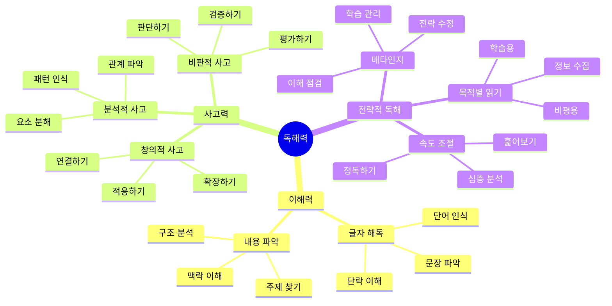

---

## 🚀 왜 독해력이 중요한가?

### 독해력 = 학습 능력의 기초

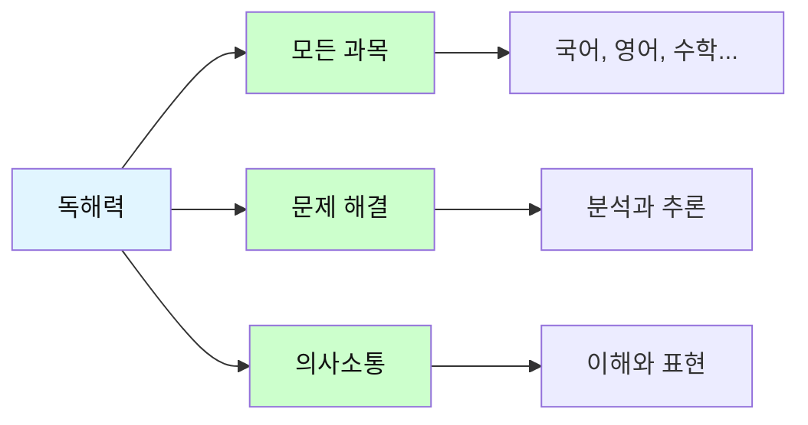

**독해력의 3가지 레벨**:

| 레벨 | 능력 | 설명 | 활용 |
|------|------|------|------|
| **기초** | 글자 이해 | 단어, 문장, 단락 파악 | 기본 정보 습득 |
| **중급** | 내용 분석 | 주제, 구조, 논리 이해 | 학습과 시험 |
| **고급** | 비판적 평가 | 판단, 종합, 적용 | 문제 해결, 창조 |

### 독해 방식의 종류

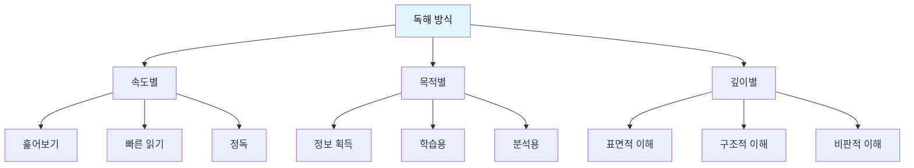

**상황별 독해 전략**:

| 상황 | 목적 | 속도 | 방법 | 이해도 목표 |
|------|------|------|------|------------|
| **시험 직전** | 복습 | 빠름 | 핵심만 훑기 | 70% |
| **새로운 학습** | 이해 | 중간 | 꼼꼼히 읽기 | 85% |
| **논술 준비** | 분석 | 느림 | 메모하며 정독 | 95% |
| **즐기기** | 재미 | 자유 | 편하게 읽기 | 60% |

---

## 📖 독서의 기본 방법론

### 독서의 4단계 구성요소

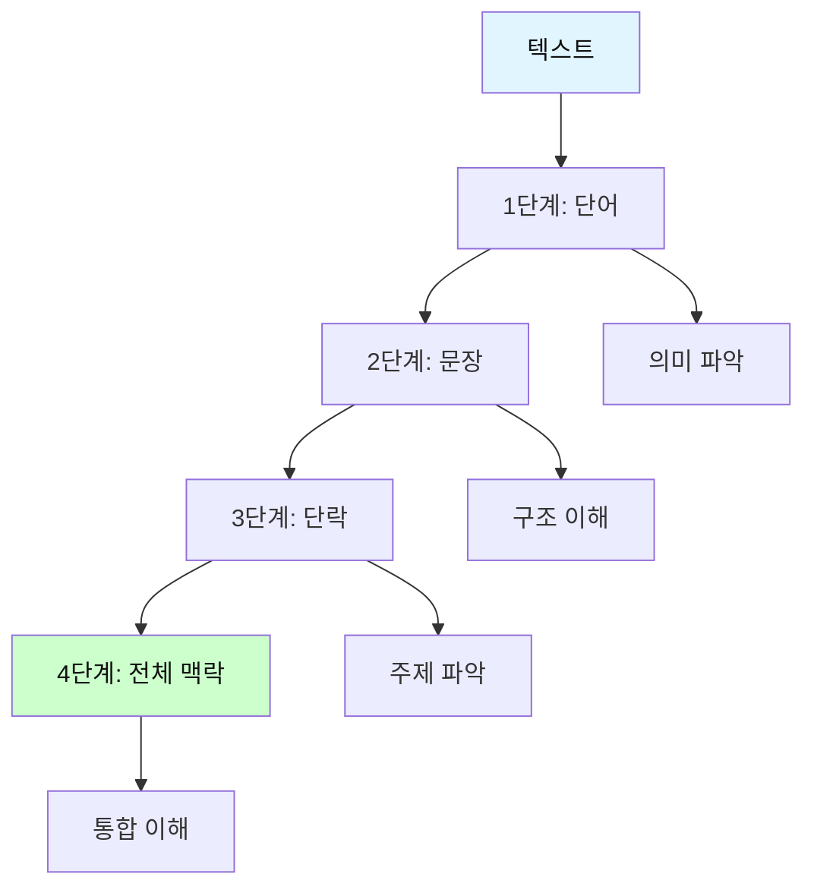

**독서는 작은 단위부터 큰 단위로 이해하는 과정입니다.**

---

### 📊 독서 구성요소별 비교

| 단계 | 구성요소 | 크기 | 이해 목표 | 주요 기술 | 난이도 |
|------|----------|------|----------|----------|--------|
| **1단계** | 단어 | 최소 단위 | 의미 파악 | 어휘력, 추론 | ⭐ |
| **2단계** | 문장 | 소단위 | 구조 이해 | 문법, 연결 | ⭐⭐ |
| **3단계** | 단락 | 중단위 | 주제 파악 | 요약, 분석 | ⭐⭐⭐ |
| **4단계** | 전체 | 대단위 | 통합 이해 | 종합, 평가 | ⭐⭐⭐⭐ |

---

### 1단계: 단어 읽기 (어휘력의 기초)

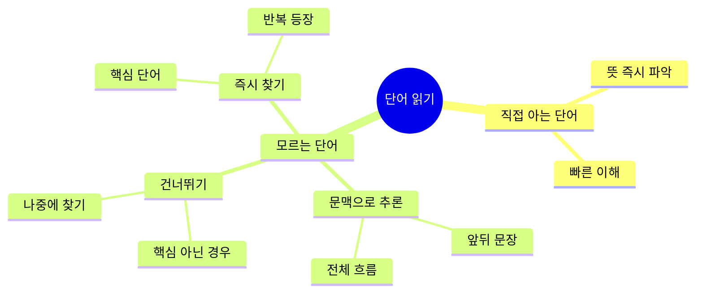

#### 단어 처리 전략

**상황별 단어 처리법**:

| 상황 | 단어 중요도 | 처리 방법 | 예시 | 시간 |
|------|------------|----------|------|------|
| **핵심 단어** | ⭐⭐⭐⭐⭐ | 즉시 찾기 | 주제어, 반복 단어 | 30초 |
| **일반 단어** | ⭐⭐⭐ | 문맥 추론 | 수식어, 부가 정보 | 5초 |
| **부가 단어** | ⭐ | 건너뛰기 | 장식어, 비유 | 0초 |

#### 문맥으로 단어 추론하기

**예시 1**: 알 수 없는 단어를 추론

```
문장: "그는 매우 '낙천적인' 성격이어서 어려움에도 
      항상 웃음을 잃지 않았다."

'낙천적인'을 모른다면?

[추론 과정]
1. 앞 문맥: 성격을 설명
2. 뒤 문맥: 어려움에도 웃음 → 긍정적
3. 결론: '낙천적인' = 긍정적, 밝은 성격
```

**예시 2**: 반대말로 추론

```
문장: "부유한 사람과 달리, 그는 '빈한한' 생활을 했다."

'빈한한'을 모른다면?

[추론 과정]
1. "달리" = 반대
2. 부유 ↔ 빈한
3. 결론: '빈한한' = 가난한
```

#### 단어 학습 3단계

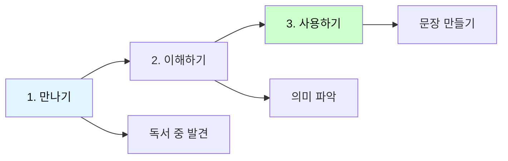

**실전 훈련**: 단어장 만들기

| 단어 | 뜻 | 문장에서의 의미 | 나만의 문장 | 복습 |
|------|----|--------------------|-------------|------|
| 낙천적 | 밝고 긍정적 | 어려움에도 긍정적 | 친구는 낙천적이다 | □□□ |
| 빈한 | 가난한 | 가난한 생활 | 빈한한 시절을 겪었다 | □□□ |

---

### 2단계: 문장 읽기 (구조 이해의 핵심)

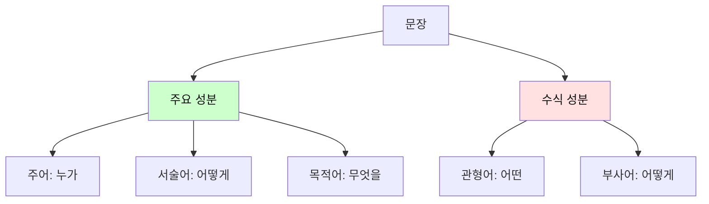

#### 문장 분석 3단계

**단계별 문장 읽기**:

| 단계 | 찾는 것 | 질문 | 중요도 | 예시 |
|------|---------|------|--------|------|
| **1단계** | 주어 | 누가? | ⭐⭐⭐⭐⭐ | 철수가 |
| **2단계** | 서술어 | 무엇을? | ⭐⭐⭐⭐⭐ | 책을 읽었다 |
| **3단계** | 수식어 | 어떤/어떻게? | ⭐⭐⭐ | 재미있는, 열심히 |

#### 문장 구조 파악하기

**예시 1**: 간단한 문장

```
문장: "철수가 책을 읽었다."

[분석]
┌─────────────────────┐
│ 주어: 철수가         │ → 누가?
│ 목적어: 책을        │ → 무엇을?
│ 서술어: 읽었다      │ → 어떻게?
└─────────────────────┘

핵심 의미: 철수 + 읽었다 + 책
```

**예시 2**: 복잡한 문장

```
문장: "어제 도서관에서 만난 친구가 재미있는 소설책을 
      나에게 빌려주었다."

[1차 분석: 핵심 찾기]
주어: 친구가
목적어: 소설책을
서술어: 빌려주었다

핵심 의미: 친구가 책을 빌려주었다

[2차 분석: 세부 정보]
- 언제? 어제
- 어디서? 도서관에서
- 어떤 친구? 만난
- 어떤 책? 재미있는 소설책
- 누구에게? 나에게

완전한 이해: 어제 도서관에서 만난 친구가 
재미있는 소설책을 나에게 빌려주었다
```

#### 문장 연결 이해하기

**접속어의 역할**:

| 접속어 유형 | 기능 | 예시 | 다음 내용 예측 |
|------------|------|------|---------------|
| **순접** | 이어짐 | 그리고, 또한 | 유사한 내용 |
| **역접** | 반대 | 그러나, 하지만 | 반대 내용 |
| **인과** | 원인-결과 | 그러므로, 따라서 | 결과 제시 |
| **예시** | 구체화 | 예를 들어, 즉 | 구체적 설명 |

**실전 예시**:

```
[문장 1] "그는 매일 운동을 했다."
[접속어] "따라서"
[예측] → 건강해졌다? 체력이 좋아졌다?
[문장 2] "체력이 크게 향상되었다."
[확인] ✓ 예측 맞음!

독서 팁: 접속어를 보면 다음 내용을 예측할 수 있다!
```

---

### 3단계: 단락 읽기 (주제 파악의 기술)

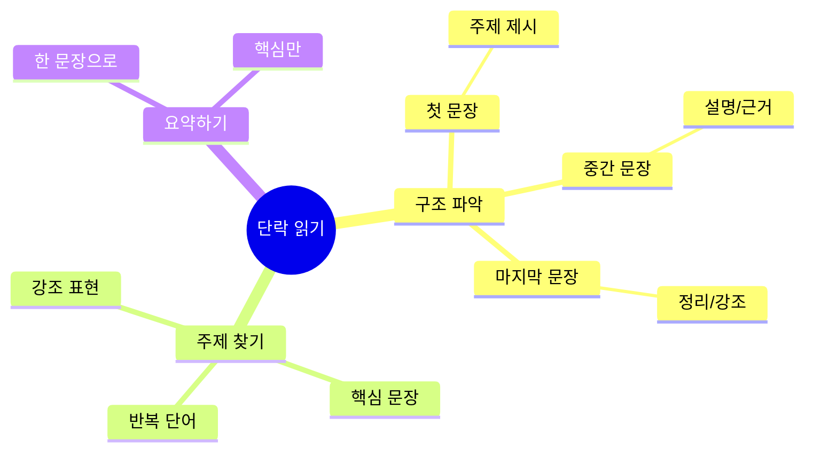

#### 단락의 3가지 구조

**구조별 읽기 전략**:

| 구조 유형 | 주제문 위치 | 특징 | 읽기 전략 | 비율 |
|----------|-------------|------|----------|------|
| **두괄식** | 첫 문장 | 주제 먼저 제시 | 첫 문장 집중 | 60% |
| **미괄식** | 마지막 문장 | 주제 나중 정리 | 끝까지 읽기 | 30% |
| **양괄식** | 처음+끝 | 주제 반복 강조 | 처음과 끝 | 10% |

#### 단락 분석 실전

**예시 1: 두괄식 단락**

```
[단락]
"독서는 인생에서 가장 중요한 습관이다. 독서를 통해 
우리는 새로운 지식을 얻고, 사고력을 키우며, 삶의 
지혜를 배운다. 역사상 위대한 인물들은 모두 독서가였다. 
따라서 어려서부터 독서 습관을 기르는 것이 필수적이다."

[분석]
┌─────────────────────────┐
│ 주제문 (첫 문장):        │
│ "독서는 가장 중요한 습관" │ ← 핵심!
├─────────────────────────┤
│ 뒷받침 문장 (2-3번째):   │
│ - 지식 습득              │
│ - 사고력 향상            │
│ - 지혜 배움              │
│ - 위인들의 예            │
├─────────────────────────┤
│ 결론 (마지막):           │
│ "습관 기르기 필수"       │
└─────────────────────────┘

요약: 독서는 중요하므로 습관을 길러야 한다.
```

**예시 2: 미괄식 단락**

```
[단락]
"컴퓨터 게임은 집중력을 떨어뜨린다. 또한 시력을 
나빠지게 한다. 게다가 운동 부족을 유발한다. 게임 중독은 
학업에도 악영향을 미친다. 이러한 이유로 어린이의 게임 
시간을 제한해야 한다."

[분석]
┌─────────────────────────┐
│ 근거 나열 (1-4번째):     │
│ - 집중력 저하            │
│ - 시력 악화              │
│ - 운동 부족              │
│ - 학업 악영향            │
├─────────────────────────┤
│ 주제문 (마지막):         │
│ "게임 시간 제한해야"     │ ← 핵심!
└─────────────────────────┘

요약: 게임의 해로움 때문에 시간을 제한해야 한다.
```

#### 단락 요약 훈련

**3단계 요약 시스템**:

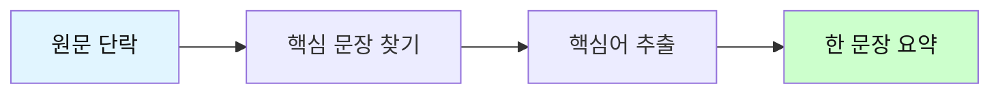

**실전 연습**:

| 단계 | 활동 | 원문 분량 | 요약 분량 | 비율 |
|------|------|----------|----------|------|
| **1단계** | 핵심 문장 | 10문장 | 2-3문장 | 30% |
| **2단계** | 핵심어 | 2-3문장 | 10단어 | 10% |
| **3단계** | 한 문장 | 10단어 | 1문장 | 5% |

---

### 4단계: 전체 맥락 읽기 (통합 이해)

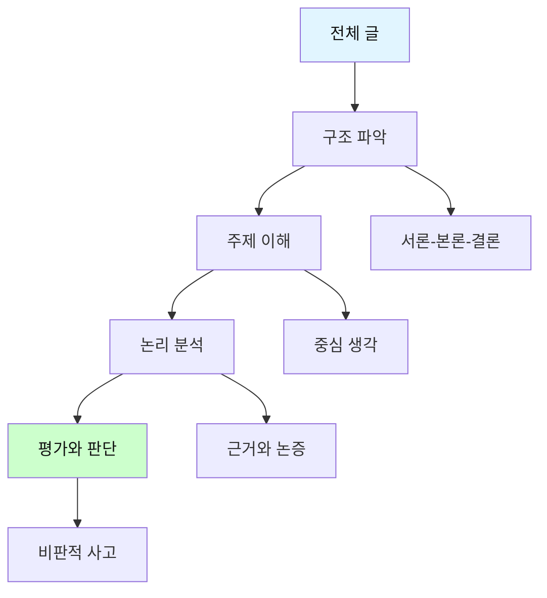

#### 글의 구조 이해하기

**3단 구성 분석**:

| 부분 | 역할 | 찾아야 할 것 | 질문 | 비중 |
|------|------|-------------|------|------|
| **서론** | 문제 제기 | 주제, 배경 | 무엇을 다룰까? | 10-20% |
| **본론** | 전개와 논증 | 주장, 근거 | 왜 그럴까? | 60-80% |
| **결론** | 정리와 강조 | 핵심 주장 | 결국 무엇? | 10-20% |

#### 통합적 독서 과정

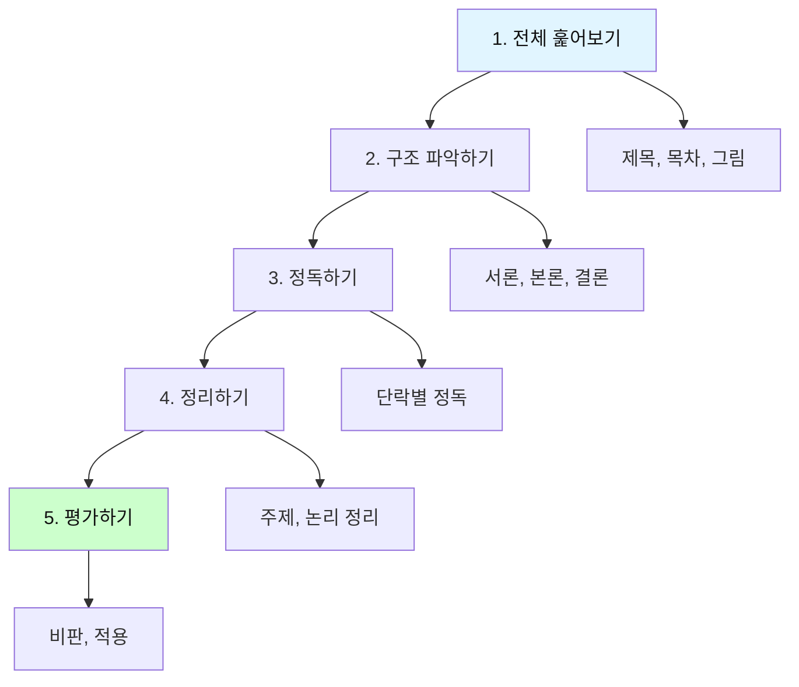

**5단계 독서법 상세**:

```
[1단계: 전체 훑어보기 - 5분]
━━━━━━━━━━━━━━━━━━━━
활동:
□ 제목과 부제목 읽기
□ 목차 확인
□ 첫 단락과 마지막 단락 읽기
□ 그림, 도표 보기

목표: 전체 주제와 구조 파악

[2단계: 구조 파악하기 - 10분]
━━━━━━━━━━━━━━━━━━━━
활동:
□ 서론에서 문제의식 찾기
□ 본론의 소제목들 확인
□ 결론에서 핵심 주장 파악

목표: 글의 전개 방식 이해

[3단계: 정독하기 - 30분]
━━━━━━━━━━━━━━━━━━━━
활동:
□ 단락별로 천천히 읽기
□ 중요 부분 밑줄
□ 모르는 단어 체크
□ 의문점 메모

목표: 세부 내용 완전 이해

[4단계: 정리하기 - 10분]
━━━━━━━━━━━━━━━━━━━━
활동:
□ 주제문 찾기
□ 핵심 내용 요약
□ 논리 구조도 그리기
□ 중요 개념 정리

목표: 내용의 체계화

[5단계: 평가하기 - 15분]
━━━━━━━━━━━━━━━━━━━━
활동:
□ 저자의 주장 타당한가?
□ 근거는 충분한가?
□ 반론은 없는가?
□ 나의 생각은?

목표: 비판적 이해
```

---

### 📊 통합 독서 전략 비교표

| 읽기 목적 | 속도 | 집중도 | 적용 단계 | 이해도 목표 | 사용 시기 |
|----------|------|--------|----------|------------|----------|
| **훑어보기** | 매우 빠름 | 낮음 | 1단계 | 30-40% | 첫 만남 |
| **빠르게 읽기** | 빠름 | 중간 | 2단계 | 50-60% | 구조 파악 |
| **정독** | 느림 | 높음 | 3단계 | 80-90% | 이해 필요 |
| **분석적 읽기** | 매우 느림 | 매우 높음 | 4-5단계 | 95%+ | 심화 학습 |

---

### 🎯 독서 방법론 종합 훈련

**실전 예시: 한 권의 책 완전 정복 (《어린 왕자》)**

```
[1주차: 단어와 문장]
━━━━━━━━━━━━━━━━
Day 1-2: 모르는 단어 30개 찾기
┌────────────────────┐
│ 단어    │ 뜻       │
├────────────────────┤
│ 사막    │ 모래땅   │
│ 길들이다│ 친해지다 │
│ ...     │ ...      │
└────────────────────┘

Day 3-4: 인상 깊은 문장 10개 분석
"네가 오후 4시에 온다면, 나는 3시부터 
행복해지기 시작할 거야."

→ 주어: 나는
→ 의미: 기다림의 설렘

[2주차: 단락과 전체]
━━━━━━━━━━━━━━━━
Day 5-7: 각 장별 주제 정리
┌────────────────────┐
│ 장  │ 주제         │
├────────────────────┤
│ 1장 │ 어른과 아이  │
│ 2장 │ 사막에서의 만남│
│ ... │ ...          │
└────────────────────┘

Day 8-10: 전체 구조와 주제
[구조]
서론: 어른 비판
본론: 어린 왕자의 여행
결론: 소중한 것의 의미

[주제]
"정말 중요한 것은 눈에 보이지 않아"
```

---

## 🎓 연령별·수준별 독서 단계

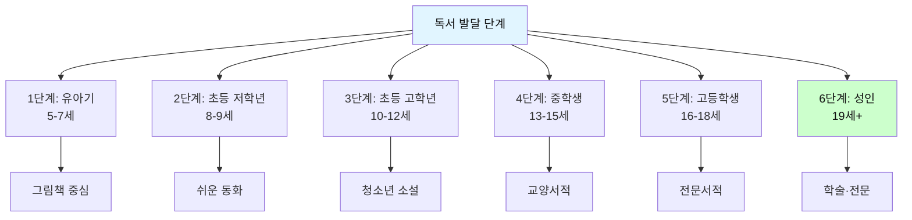

### 📊 단계별 상세 비교표

| 단계 | 나이 | 읽기 능력 | 이해 수준 | 적합 장르 | 분량 | 학습 목표 |
|------|------|----------|----------|----------|------|----------|
| **1단계** | 5-7세 | 그림 읽기 | 단순 스토리 | 그림책, 전래동화 | 10-20쪽 | 독서 흥미 |
| **2단계** | 8-9세 | 문장 읽기 | 사건 이해 | 창작동화, 위인전 | 50-100쪽 | 독서 습관 |
| **3단계** | 10-12세 | 단락 읽기 | 주제 파악 | 소설, 과학책 | 100-200쪽 | 사고력 기초 |
| **4단계** | 13-15세 | 글 전체 읽기 | 맥락 이해 | 교양서, 인문학 | 200-300쪽 | 비판적 사고 |
| **5단계** | 16-18세 | 분석적 읽기 | 논리 파악 | 철학, 사회과학 | 300-500쪽 | 논술 완성 |
| **6단계** | 19세+ | 통합적 읽기 | 종합 판단 | 전문서적, 논문 | 500쪽+ | 전문성 구축 |

---

## 📖 1단계: 유아기 (5-7세) - 독서의 즐거움 발견

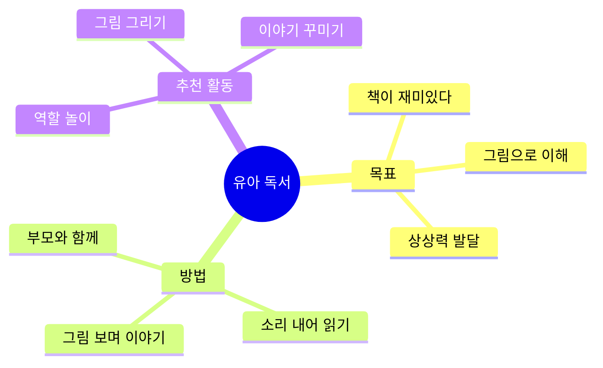

### 추천 도서 (1단계)

**필수 그림책 20권**:

| 제목 | 저자 | 주제 | 학습 포인트 |
|------|------|------|------------|
| 《괴물들이 사는 나라》 | 모리스 샌닥 | 상상력 | 감정 표현 이해 |
| 《곰 사냥을 떠나자》 | 마이클 로젠 | 모험 | 반복 패턴 인식 |
| 《나는 기다립니다》 | 다비드 칼리 | 인내 | 시간의 흐름 |
| 《100층짜리 집》 | 이와이 도시오 | 숫자 | 관찰력 향상 |
| 《솔이의 추석 이야기》 | 이억배 | 전통 | 문화 이해 |

### 학습 방법: 대화형 읽기

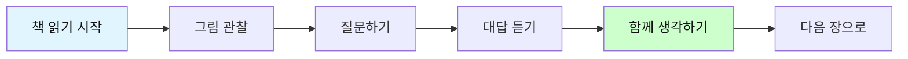

#### 대화형 읽기 6단계 프로세스

| 단계 | 부모 역할 | 아이 반응 | 학습 효과 | 시간 |
|------|----------|-----------|----------|------|
| **1. 관찰** | "무엇이 보이니?" | 그림 보기 | 집중력 | 1분 |
| **2. 질문** | "왜 그랬을까?" | 생각하기 | 사고력 | 1분 |
| **3. 대답** | 경청하기 | 의견 말하기 | 표현력 | 2분 |
| **4. 연결** | "너는?" | 경험 떠올리기 | 공감력 | 2분 |
| **5. 예측** | "다음은?" | 상상하기 | 창의력 | 1분 |
| **6. 확인** | 함께 읽기 | 확인하기 | 이해력 | 3분 |

**실전 예시: 《괴물들이 사는 나라》 대화 시나리오**

```
┌──────────────────────────────────────┐
│ [1페이지 - 맥스가 괴물 옷을 입는 장면]│
└──────────────────────────────────────┘

📖 1단계: 관찰
━━━━━━━━━━━━━━━━━━━━━━━━━━━━━━━━
부모: "어? 이 아이가 뭘 하고 있을까?"
아이: "옷 입어요!"
부모: "어떤 옷이지? 우리가 입는 옷이랑 같아?"
아이: "아니요, 괴물 옷이에요!"
→ 효과: 세밀한 관찰 훈련

📖 2단계: 질문
━━━━━━━━━━━━━━━━━━━━━━━━━━━━━━━━
부모: "맞아! 왜 괴물 옷을 입었을까?"
아이: "재미있어서요?"
부모: "그럴 수도 있지. 우리 같이 읽어볼까?"
→ 효과: 호기심 유발

📖 3단계: 함께 읽기
━━━━━━━━━━━━━━━━━━━━━━━━━━━━━━━━
[읽기 진행]

📖 4단계: 감정 이입
━━━━━━━━━━━━━━━━━━━━━━━━━━━━━━━━
부모: "맥스가 엄마한테 혼났네. 기분이 어떨까?"
아이: "속상할 것 같아요."
→ 효과: 등장인물 이해

📖 5단계: 경험 연결
━━━━━━━━━━━━━━━━━━━━━━━━━━━━━━━━
부모: "맞아. 그래서 괴물 나라로 갔나봐. 
      너도 속상할 때 있어?"
아이: "네, 장난감 치우라고 할 때요."
부모: "그때 네 기분이 맥스랑 같구나!"
→ 효과: 책과 삶의 연결! ⭐

📖 6단계: 예측하기
━━━━━━━━━━━━━━━━━━━━━━━━━━━━━━━━
부모: "맥스가 괴물 나라에서 뭘 할까?"
아이: "괴물들이랑 놀 것 같아요!"
부모: "재미있겠다! 계속 읽어볼까?"
→ 효과: 능동적 독서
```

### 사고력 질문 카드 (유아용)

#### 3단계 질문 시스템

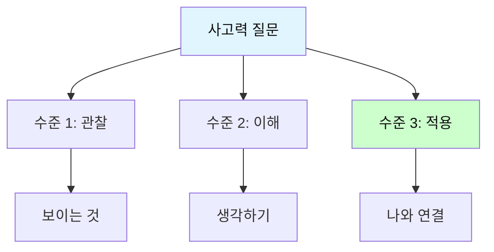

**질문 레벨별 가이드**:

| 수준 | 목적 | 난이도 | 예시 질문 | 기대 답변 |
|------|------|--------|----------|----------|
| **수준 1<br/>관찰** | 그림 보기 | ⭐ | • 무엇이 보이나요?<br/>• 주인공은 어떤 표정인가요?<br/>• 배경은 어디인가요? | 보이는 그대로<br/>답하기 |
| **수준 2<br/>이해** | 생각하기 | ⭐⭐ | • 무슨 일이 일어났나요?<br/>• 주인공은 왜 그랬을까요?<br/>• 다음에는 어떻게 될까요? | 내용 이해하고<br/>예측하기 |
| **수준 3<br/>적용** | 나와 연결 | ⭐⭐⭐ | • 너라면 어떻게 했을까?<br/>• 비슷한 경험이 있나요?<br/>• 이 이야기에서 뭘 배웠나요? | 자신의 경험과<br/>연결하기 |

**실전 적용 예시: 《곰 사냥을 떠나자》**

```
┌────────────────────────────────────┐
│ 📖 수준 1: 관찰 질문 (3-4세 가능)  │
└────────────────────────────────────┘

Q1. 그림에서 무엇이 보이나요?
   ✓ 좋은 답변: "아빠, 아이들, 개가 보여요!"
   ✓ 추가 질문: "몇 명이 있나요? 세어볼까?"

Q2. 주인공들은 어떤 표정인가요?
   ✓ 좋은 답변: "웃고 있어요! 신나 보여요!"
   ✓ 추가 질문: "왜 신날까?"

Q3. 배경은 어디인가요?
   ✓ 좋은 답변: "풀밭이요. 밖이에요!"
   ✓ 추가 질문: "날씨는 어때 보여?"

┌────────────────────────────────────┐
│ 📖 수준 2: 이해 질문 (5-6세 권장)  │
└────────────────────────────────────┘

Q1. 무슨 일이 일어났나요?
   ✓ 좋은 답변: "곰 사냥을 가요!"
   ✓ 추가 질문: "어디를 지나가나요?"

Q2. 주인공들은 왜 곰 사냥을 갔을까요?
   ✓ 좋은 답변: "모험하고 싶어서요."
   ✓ 추가 질문: "무서워하나요?"

Q3. 다음에는 어떻게 될까요?
   ✓ 좋은 답변: "곰을 만날 것 같아요!"
   ✓ 추가 질문: "만나면 어떻게 될까?"

┌────────────────────────────────────┐
│ 📖 수준 3: 적용 질문 (6-7세 권장)  │
└────────────────────────────────────┘

Q1. 너라면 곰 사냥을 갈 수 있어?
   ✓ 좋은 답변: "아니요, 무서워요." / "네, 재미있을 것 같아요!"
   ✓ 추가 질문: "왜 그렇게 생각해?"

Q2. 비슷한 모험을 한 적 있나요?
   ✓ 좋은 답변: "산에 갔을 때요!"
   ✓ 추가 질문: "그때 기분은 어땠어?"

Q3. 이 이야기에서 뭘 배웠나요?
   ✓ 좋은 답변: "용기가 필요해요."
   ✓ 추가 질문: "용기가 뭘까?"
```

**연령별 질문 활용 가이드**:

| 연령 | 권장 수준 | 질문 수 | 소요 시간 | 팁 |
|------|----------|---------|----------|-----|
| **3-4세** | 수준 1 | 3개 | 5분 | 그림 위주로 |
| **5-6세** | 수준 1-2 | 5개 | 10분 | 예측 질문 추가 |
| **7세** | 수준 1-3 | 7개 | 15분 | 경험 연결 강화 |

---

## 📘 2단계: 초등 저학년 (8-9세) - 독서 습관 형성

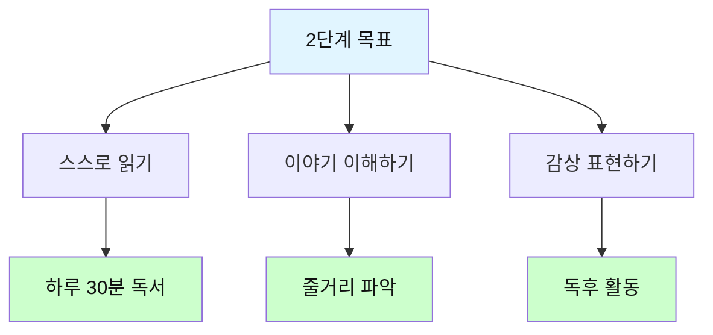

### 추천 도서 (2단계)

**창작동화 20권**:

| 장르 | 제목 | 저자 | 쪽수 | 학습 포인트 |
|------|------|------|------|------------|
| **우정** | 《마당을 나온 암탉》 | 황선미 | 160p | 용기와 희생 |
| **가족** | 《사과가 쿵》 | 다다 히로시 | 80p | 나눔의 의미 |
| **성장** | 《내 이름은 삐삐 롱스타킹》 | 아스트리드 린드그렌 | 180p | 독립심 |
| **모험** | 《톰소여의 모험》(쉬운판) | 마크 트웨인 | 120p | 호기심과 용기 |
| **판타지** | 《해리포터와 마법사의 돌》(쉬운판) | J.K. 롤링 | 200p | 선과 악 |

### 학습 방법: 5단계 읽기

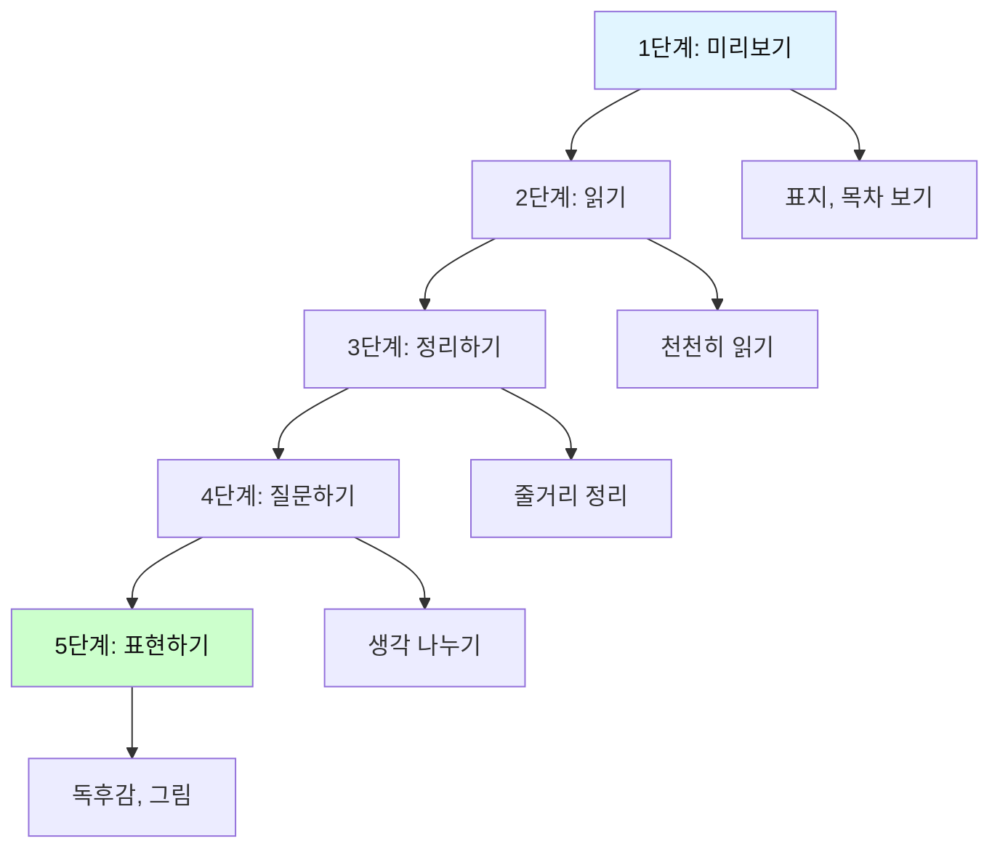

**실전 예시: 《마당을 나온 암탉》 1주 완벽 프로그램**

#### 일일 학습 계획표

| 요일 | 활동 | 시간 | 목표 | 준비물 |
|------|------|------|------|--------|
| **월** | 미리보기 | 20분 | 내용 예측 | 책, 노트 |
| **화-목** | 읽기 | 30분×3일 | 완독 | 책, 색연필 |
| **금** | 정리 | 40분 | 구조 파악 | 전지, 펜 |
| **토** | 질문 | 30분 | 사고력 | 워크시트 |
| **일** | 표현 | 60분 | 창의성 | 자유 선택 |

#### 📅 Day 1 (월): 미리보기 단계

```
┌─────────────────────────────────────┐
│ 🎯 목표: 책과 친해지기 (20분)        │
└─────────────────────────────────────┘

📍 활동 1: 표지 관찰 (5분)
━━━━━━━━━━━━━━━━━━━━━━━━━━━━━━━━
질문과 관찰:
• 표지에 무엇이 보이나요?
  → 답: 암탉, 마당, 하늘
• 제목은 무엇인가요?
  → "마당을 나온 암탉"
• 어떤 이야기일 것 같나요?
  → 예상 적어보기

📍 활동 2: 뒷표지와 목차 보기 (5분)
━━━━━━━━━━━━━━━━━━━━━━━━━━━━━━━━
• 간략한 소개 읽기
• 장 제목 확인하기
• 그림 훑어보기

📍 활동 3: 예측하기 (10분)
━━━━━━━━━━━━━━━━━━━━━━━━━━━━━━━━
예측 노트 작성:

┌──────────────────────┐
│ 예측 노트             │
├──────────────────────┤
│ 주인공: _____________ │
│ 어디: _______________ │
│ 무슨 일: ____________ │
│ 결말 예상: __________ │
└──────────────────────┘
```

#### 📅 Day 2-4 (화-목): 읽기 단계

```
┌─────────────────────────────────────┐
│ 🎯 목표: 완독하기 (매일 30분)        │
└─────────────────────────────────────┘

📖 화요일: 1-5장 (50페이지)
━━━━━━━━━━━━━━━━━━━━━━━━━━━━━━━━
읽기 전략:
✓ 조용한 곳에서 집중
✓ 모르는 단어는 표시만
✓ 재미있는 장면에 포스트잇

읽은 후 활동:
→ 가장 기억에 남는 장면 그리기
→ 한 문장으로 요약하기

📖 수요일: 6-10장 (50페이지)
━━━━━━━━━━━━━━━━━━━━━━━━━━━━━━━━
읽기 중 메모:
• 잎싹의 성격: ___________
• 새로운 등장인물: _______
• 놀라운 사건: ___________

읽은 후 활동:
→ 인상 깊은 장면 그리기
→ 다음 내용 예측하기

📖 목요일: 11장-끝 (60페이지)
━━━━━━━━━━━━━━━━━━━━━━━━━━━━━━━━
집중 읽기:
• 마지막은 천천히
• 감정 느끼며 읽기
• 궁금증 해소

읽은 후 활동:
→ 가장 감동적인 장면 그리기
→ 전체 느낌 한 단어로 표현
```

#### 📅 Day 5 (금): 정리하기 단계

```
┌─────────────────────────────────────┐
│ 🎯 목표: 스토리 맵 만들기 (40분)     │
└─────────────────────────────────────┘

📊 활동: 이야기 구조 파악
━━━━━━━━━━━━━━━━━━━━━━━━━━━━━━━━

[스토리 맵 템플릿]

       시작 (Beginning)
   ┌──────────────────┐
   │ 잎싹이 양계장에   │
   │ 갇혀 있다         │
   └────────┬─────────┘
            ↓
       문제 (Problem)
   ┌──────────────────┐
   │ 알을 품고 싶은    │
   │ 간절한 꿈         │
   └────────┬─────────┘
            ↓
     주요 사건 (Events)
   ┌──────────────────┐
   │ 1. 마당으로 나옴  │
   │ 2. 알을 발견      │
   │ 3. 초록이 부화    │
   │ 4. 함께 살기      │
   └────────┬─────────┘
            ↓
       위기 (Crisis)
   ┌──────────────────┐
   │ 족제비의 위협     │
   │ 위험한 순간       │
   └────────┬─────────┘
            ↓
       해결 (Solution)
   ┌──────────────────┐
   │ 초록이를 지키는   │
   │ 잎싹의 희생       │
   └──────────────────┘
```

#### 📅 Day 6 (토): 질문하기 단계

```
┌─────────────────────────────────────┐
│ 🎯 목표: 깊이 생각하기 (30분)        │
└─────────────────────────────────────┘

💭 사고력 질문 3단계
━━━━━━━━━━━━━━━━━━━━━━━━━━━━━━━━

[1단계: 이해 질문]
Q1. 잎싹은 왜 마당으로 나왔을까요?
답: _________________________________

Q2. 초록이는 누구인가요?
답: _________________________________

[2단계: 분석 질문]
Q3. 초록이를 키우면서 힘들었을 텐데 
    왜 포기하지 않았을까요?
답: _________________________________

Q4. 족제비도 나쁜 존재인가요?
답: _________________________________

[3단계: 평가 질문]
Q5. 마지막 장면에서 잎싹의 선택은 옳았나요?
□ 옳다  □ 옳지 않다
이유: _________________________________

Q6. 이 책에서 가장 중요한 메시지는?
답: _________________________________
```

#### 📅 Day 7 (일): 표현하기 단계

```
┌─────────────────────────────────────┐
│ 🎯 목표: 창의적 표현 (60분)          │
└─────────────────────────────────────┘

🎨 선택 활동 (하나 선택)
━━━━━━━━━━━━━━━━━━━━━━━━━━━━━━━━

□ 활동 1: 독후감 쓰기 (200자)
  ┌──────────────────────┐
  │ 제목: ______________ │
  │                      │
  │ 줄거리 (50자):       │
  │ _________________    │
  │                      │
  │ 감동적인 부분 (100자):│
  │ _________________    │
  │                      │
  │ 배운 점 (50자):      │
  │ _________________    │
  └──────────────────────┘

□ 활동 2: 인상 깊은 장면 그리기
  - A4 용지 준비
  - 색연필로 표현
  - 짧은 설명 추가

□ 활동 3: 속편 상상하기
  제목: "초록이의 모험"
  - 5년 후 이야기
  - 3-5문장으로

□ 활동 4: 잎싹에게 편지 쓰기
  ┌──────────────────────┐
  │ 잎싹에게,            │
  │                      │
  │ 나는 ___ 입니다.     │
  │ 책을 읽고 ___        │
  │ ___________________  │
  │                      │
  │ 가장 ___한 장면은    │
  │ ___________________  │
  │                      │
  │ 마지막에 ___         │
  │                      │
  │        ___ 올림      │
  └──────────────────────┘
```

**1주 완독 체크리스트**:

```
□ 월: 미리보기 완료
□ 화: 1-5장 완독
□ 수: 6-10장 완독  
□ 목: 끝까지 완독
□ 금: 스토리 맵 완성
□ 토: 질문 답변 완료
□ 일: 표현 활동 완료

총 완료: ___/7
```

### 독후 활동 워크시트

**《마당을 나온 암탉》 종합 워크시트**

```
┌────────────────────────────────────────┐
│  📝 독서 활동지                         │
├────────────────────────────────────────┤
│  이름: ____________  날짜: ____________ │
│  학년: ______  소요 시간: ______분      │
└────────────────────────────────────────┘
```

#### 섹션 1: 줄거리 정리 (25점)

**5문장 요약법** - 시작/문제/사건/위기/해결

| 구조 | 질문 | 내용 정리 |
|------|------|----------|
| ① 시작 | 처음에 어땠나요? | |
| ② 문제 | 무슨 문제가 있었나요? | |
| ③ 사건 | 어떤 일이 일어났나요? | |
| ④ 위기 | 가장 위험한 순간은? | |
| ⑤ 해결 | 어떻게 끝났나요? | |

---

#### 섹션 2: 등장인물 분석 (30점)

**인물 분석표**

| 등장인물 | 성격 | 주요 행동 | 변화 | 나의 평가 |
|----------|------|----------|------|-----------|
| **잎싹** | | | | ⭐⭐⭐⭐⭐ |
| **초록이** | | | | ⭐⭐⭐⭐⭐ |
| **나그네** | | | | ⭐⭐⭐⭐⭐ |
| **족제비** | | | | ⭐⭐⭐⭐⭐ |

**심화 질문**:

```
Q1. 가장 좋아하는 인물은?
답: ___________________
이유: _________________________________

Q2. 가장 용감한 인물은?
답: ___________________
이유: _________________________________
```

---

#### 섹션 3: 생각 나누기 (20점)

| 질문 | 나의 답변 | 점수 |
|------|----------|------|
| **Q1.** 가장 감동적인 장면은? | | /5 |
| **Q2.** 왜 그 장면이 감동적이었나요? | | /10 |
| **Q3.** 잎싹에게 하고 싶은 말은? | | /5 |

---

#### 섹션 4: 비판적 질문 (15점)

**핵심 논제**: 잎싹의 마지막 선택은 옳았나요?

```
┌─────────────────────────────────┐
│ 나의 입장: □ 옳다  □ 옳지 않다  │
└─────────────────────────────────┘

[찬성 근거] (옳다고 생각한다면)
1. _________________________________
2. _________________________________
3. _________________________________

[반대 근거] (옳지 않다고 생각한다면)
1. _________________________________
2. _________________________________
3. _________________________________

[최종 의견]
_____________________________________
_____________________________________
```

---

#### 섹션 5: 창의적 활동 (10점)

**상상력 질문**

```
💭 만약 내가 잎싹이라면?

상황: 알을 발견한 순간
나의 선택: _________________________
이유: _______________________________

💭 속편 상상하기

제목: 《초록이의 ___________》
내용 (3문장):
1. _________________________________
2. _________________________________
3. _________________________________

💭 다른 결말 상상하기

만약 마지막에 _______했다면?
_____________________________________
```

---

#### 평가 기준표

| 항목 | 배점 | 채점 기준 | 내 점수 |
|------|------|----------|---------|
| **줄거리** | 25점 | 5문장 완성도 | /25 |
| **인물 분석** | 30점 | 깊이 있는 분석 | /30 |
| **생각 나누기** | 20점 | 구체적 설명 | /20 |
| **비판적 질문** | 15점 | 논리적 근거 | /15 |
| **창의성** | 10점 | 독창적 아이디어 | /10 |
| **합계** | 100점 | | /100 |

**등급표**:

| 점수 | 등급 | 평가 |
|------|------|------|
| 90-100점 | A | 매우 우수 |
| 80-89점 | B | 우수 |
| 70-79점 | C | 보통 |
| 60-69점 | D | 노력 필요 |

---

## 📕 3단계: 초등 고학년 (10-12세) - 사고력 기초 확립

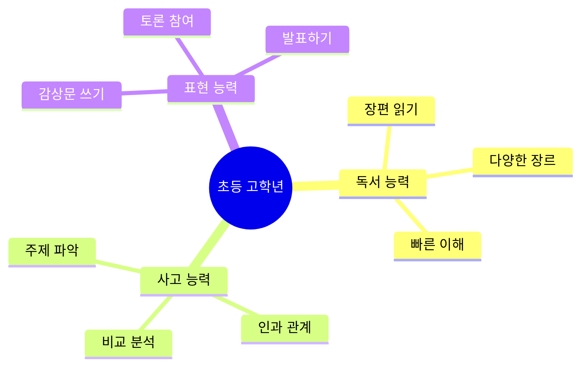

### 추천 도서 (3단계)

**장르별 필독서 30권**

| 장르 | 난이도 | 제목 | 저자 | 쪽수 | 핵심 주제 |
|------|--------|------|------|------|----------|
| **성장소설** | ⭐⭐ | 《몽실언니》 | 권정생 | 240p | 가난과 희망 |
| **판타지** | ⭐⭐ | 《나니아 연대기》 | C.S. 루이스 | 300p | 선과 악의 투쟁 |
| **과학** | ⭐⭐ | 《코스모스》(어린이판) | 칼 세이건 | 200p | 우주와 과학 |
| **역사** | ⭐⭐⭐ | 《난중일기》(청소년판) | 이순신 | 180p | 역사의식 |
| **철학** | ⭐⭐⭐ | 《소피의 세계》(청소년판) | 요슈타인 가아더 | 280p | 철학 입문 |
| **사회** | ⭐⭐ | 《얼굴 없는 보스》 | 고희정 | 150p | 학교폭력 |

### 학습 방법: 비판적 읽기 시작

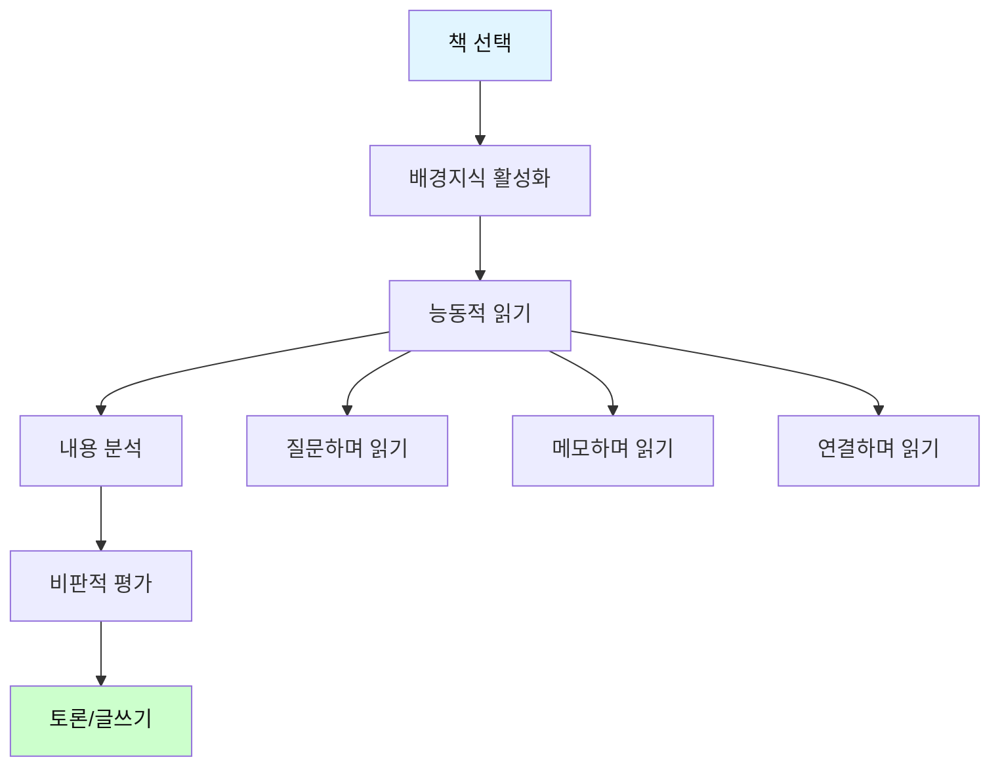

**실전 예시: 《몽실언니》 2주 심화 프로그램**

```
[1주차: 읽기와 이해]

Day 1 (월): 배경 조사 (30분)
- 1950-60년대 한국 상황 조사
- 가난한 시대 사진 자료 찾기
- 예상 질문 3개 만들기

Day 2-4 (화-목): 적극적 읽기 (매일 40분)
읽기 전략: "질문 카드" 활용
- 노란 포스트잇: 궁금한 점
- 파란 포스트잇: 감동적인 부분
- 분홍 포스트잇: 이해 안 되는 부분

Day 5 (금): 내용 정리 (60분)
활동: 마인드맵 만들기

         [몽실언니]
              |
    ┌─────┼─────┬─────┐
    |         |         |         |
  인물      사건      배경      주제
    |         |         |         |
  몽실    입양      전쟁     가족애
  언니    고생    가난함    희망
  ...     ...       ...      ...

[2주차: 분석과 평가]

Day 6 (월): 인물 분석 (50분)
워크시트: 인물 비교표

| 특성 | 몽실 | 언니 | 아버지 |
|------|------|------|--------|
| 성격 | | | |
| 변화 | | | |
| 갈등 | | | |
| 해결 | | | |

Day 7 (화): 주제 분석 (50분)
질문 탐구:
1. 이 책의 진짜 주제는 무엇인가?
   □ 가난  □ 가족  □ 희망  □ 성장
   □ 기타: ____________
   
2. 작가가 전하고 싶은 메시지는?
   ________________________________

Day 8 (수): 비판적 평가 (60분)
평가 영역:
1. 사실성: 현실적인 이야기인가? (5점 척도)
   1---2---3---4---5
   
2. 공감도: 인물에게 공감되는가?
   1---2---3---4---5
   
3. 교훈성: 배울 점이 있는가?
   1---2---3---4---5
   
4. 문학성: 표현이 뛰어난가?
   1---2---3---4---5

Day 9 (목): 토론 준비 (60분)
토론 주제: "몽실의 선택은 옳았는가?"

찬성 근거 3가지:
1. ________________________________
2. ________________________________
3. ________________________________

반대 근거 3가지:
1. ________________________________
2. ________________________________
3. ________________________________

나의 입장: ________________
최종 근거: ________________________________

Day 10 (금): 글쓰기 (90분)
과제: 비평문 작성 (800자)

구성:
- 서론: 책 소개 + 나의 평가 (200자)
- 본론1: 내용 분석 (300자)
- 본론2: 비판적 평가 (200자)
- 결론: 추천 여부 + 이유 (100자)
```

### 비판적 사고 훈련 워크북

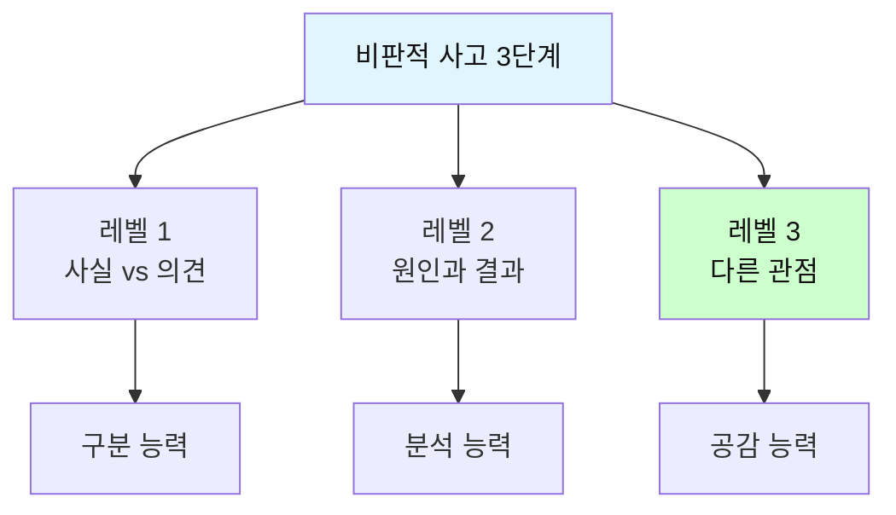

#### 레벨 1: 사실과 의견 구분하기 (⭐⭐)

**《몽실언니》 분석표**:

| 번호 | 문장 | 사실 | 의견 | 판단 근거 |
|------|------|------|------|----------|
| 1 | 몽실이는 고아였다 | ☑ | ☐ | 객관적 상태 |
| 2 | 몽실이는 불쌍한 아이다 | ☐ | ☑ | 주관적 감정 |
| 3 | 전쟁 후 한국은 가난했다 | ☑ | ☐ | 역사적 사실 |
| 4 | 가난한 사람들은 불행하다 | ☐ | ☑ | 일반화 |
| 5 | 몽실이의 언니는 착한 사람이다 | ☐ | ☑ | 평가 |

---

#### 레벨 2: 원인과 결과 분석하기 (⭐⭐⭐)

**인과관계 분석표**:

```
핵심 사건: 몽실이가 입양을 갔다
```

| 단계 | 질문 | 답변 1 | 답변 2 | 답변 3 |
|------|------|--------|--------|--------|
| **원인** | 왜? | 경제적 어려움 | 더 나은 환경 | 아버지 판단 |
| **사건** | 무엇? | 몽실이의 입양 | | |
| **결과** | 그래서? | 가족 분리 | 새 환경 적응 | 정체성 혼란 |

**가상 시나리오**:

```
┌─────────────────────────────────────┐
│ 💭 만약 입양을 가지 않았다면?       │
└─────────────────────────────────────┘

예상 결과:
✓ 긍정적: ___________________________
✗ 부정적: ___________________________

나의 판단: ___________________________
```

---

#### 레벨 3: 다른 관점에서 생각하기 (⭐⭐⭐⭐)

**다중 관점 분석표**:

```
사건: 아버지가 몽실을 입양 보냈다
```

| 입장 | 감정 | 생각 | 가장 힘든 점 | 공감도 |
|------|------|------|------------|--------|
| **몽실** | 슬픔, 배신감 | "왜 나를?" | | ⭐⭐⭐⭐⭐ |
| **아버지** | 죄책감, 고민 | "이게 최선" | | ⭐⭐⭐⭐ |
| **언니** | 죄책감 | "내가 지켰어야" | | ⭐⭐⭐⭐ |
| **입양가족** | 기대, 걱정 | "적응할까?" | | ⭐⭐⭐ |

**종합 평가**:

```
Q1. 가장 힘든 사람은? _______________
    이유: _____________________________

Q2. 가장 이해되는 입장은? ___________
    이유: _____________________________

Q3. 나라면 어떻게? _________________
```

---

## 📗 4단계: 중학생 (13-15세) - 비판적 사고 완성

```mermaid
graph TD
    A[중학생 독서 목표] --> B[깊이 있는 이해]
    A --> C[비판적 분석]
    A --> D[논리적 표현]
    
    B --> B1[행간의 의미]
    B --> B2[상징과 은유]
    
    C --> C1[근거 평가]
    C --> C2[논리 검증]
    
    D --> D1[논술문 작성]
    D --> D2[토론 능력]
    
    style A fill:#e1f5ff,color:#111
    style B1 fill:#ccffcc,color:#111
    style C1 fill:#ccffcc,color:#111
    style D1 fill:#ccffcc,color:#111
```

### 추천 도서 (4단계)

**교양 및 인문학 필독서 40권**

| 분야 | 난이도 | 제목 | 저자 | 쪽수 | 사고력 훈련 |
|------|--------|------|------|------|------------|
| **소설** | ⭐⭐⭐ | 《데미안》 | 헤르만 헤세 | 220p | 자아 정체성 |
| **소설** | ⭐⭐⭐ | 《1984》 | 조지 오웰 | 380p | 정치 비판 |
| **소설** | ⭐⭐⭐⭐ | 《죄와 벌》 | 도스토예프스키 | 680p | 도덕적 딜레마 |
| **철학** | ⭐⭐⭐ | 《이중섭편지》 | 이중섭 | 180p | 예술과 삶 |
| **역사** | ⭐⭐⭐ | 《총균쇠》(청소년판) | 재레드 다이아몬드 | 320p | 문명의 발전 |
| **과학** | ⭐⭐⭐ | 《이기적 유전자》 | 리처드 도킨스 | 400p | 진화론 |
| **사회** | ⭐⭐⭐ | 《정의란 무엇인가》 | 마이클 샌델 | 380p | 정의와 도덕 |
| **경제** | ⭐⭐⭐ | 《국부론》(청소년판) | 애덤 스미스 | 280p | 경제 원리 |

### 학습 방법: 논술형 독서

```mermaid
flowchart TD
    A[책 선택] --> B[문제의식 갖기]
    B --> C[분석적 읽기]
    C --> D[논점 파악]
    D --> E[근거 수집]
    E --> F[논술문 작성]
    F --> G[피드백]
    
    C --> C1[저자의 주장]
    C --> C2[논거 분석]
    C --> C3[논리 구조]
    
    style A fill:#e1f5ff,color:#111
    style F fill:#ccffcc,color:#111
```

**실전 예시: 《1984》 3주 논술 프로그램**

```
[1주차: 분석적 읽기]

사전 질문 설정:
1. 전체주의란 무엇인가?
2. 감시 사회의 문제점은?
3. 개인의 자유란?

읽기 전략: 3색 형광펜 활용
- 노랑: 주요 주장
- 초록: 구체적 사례
- 분홍: 의문점/반론

Day 1-5: 매일 100페이지 + 메모
메모 양식:

┌─────────────────────┐
│ 날짜: __________        │
│ 읽은 부분: ___장        │
│                        │
│ 핵심 내용:             │
│ ▪ _________________    │
│ ▪ _________________    │
│                        │
│ 저자의 주장:           │
│ _____________________  │
│                        │
│ 나의 생각:             │
│ _____________________  │
│                        │
│ 질문:                  │
│ Q. __________________  │
└─────────────────────┘

[2주차: 심화 분석]

Day 6: 주제 분석 (2시간)
활동: 주제 마인드맵

               [1984의 주제]
                     |
        ┌──────┼──────┬──────┐
        |           |           |           |
    감시사회    언어통제    역사왜곡    개인말살
        |           |           |           |
    빅브라더    신어         진리부      사상범죄
        |           |           |           |
    CCTV     표현제한     기록조작    내면감시

현대 사회와 연결:
- 감시: CCTV, 스마트폰 위치 추적
- 언어: 정치적 올바름, SNS 검열
- 역사: 교과서 논쟁
- 개인: 사생활 침해

Day 7: 논점 도출 (2시간)
논술 가능한 논점 5가지:

1. 안전을 위한 감시는 정당한가?
   찬성 vs 반대

2. 국가는 개인의 생각까지 통제할 수 있는가?
   찬성 vs 반대

3. 진실은 누가 결정하는가?
   권력 vs 개인

4. 현대 사회도 1984와 같은가?
   유사 vs 다름

5. 개인의 자유와 사회 안정 중 무엇이 우선인가?
   자유 vs 안정

Day 8-9: 근거 수집 (각 2시간)

논점 1 선택: "안전을 위한 감시는 정당한가?"

찬성 근거:
1. 책에서: ________________________________
   페이지: ____
   
2. 현실 사례: CCTV로 범죄 예방
   출처: ________________________________
   
3. 전문가 의견: ________________________

반대 근거:
1. 책에서: ________________________________
   페이지: ____
   
2. 현실 사례: 감시로 인한 인권 침해
   출처: ________________________________
   
3. 전문가 의견: ________________________

Day 10: 논리 구조 설계 (2시간)

논증 구조도:

주제: 안전을 위한 감시는 정당한가?

나의 입장: 제한적으로만 정당하다

논리 구조:
┌─────────────────────┐
│ 서론: 문제 제기        │
│ - 감시 사회의 현실     │
│ - 쟁점 소개            │
└─────────────────────┘
          ↓
┌─────────────────────┐
│ 본론1: 감시의 필요성   │
│ - 근거1: 범죄 예방     │
│ - 근거2: 테러 방지     │
│ - 사례: CCTV 효과      │
└─────────────────────┘
          ↓
┌─────────────────────┐
│ 본론2: 감시의 위험성   │
│ - 근거1: 프라이버시    │
│ - 근거2: 권력 남용     │
│ - 사례: 1984의 경고    │
└─────────────────────┘
          ↓
┌─────────────────────┐
│ 본론3: 균형잡힌 해법   │
│ - 제안1: 법적 통제     │
│ - 제안2: 투명성 확보   │
│ - 제안3: 감시의 한계   │
└─────────────────────┘
          ↓
┌─────────────────────┐
│ 결론: 입장 재확인      │
│ - 제한적 정당성        │
│ - 균형의 중요성        │
└─────────────────────┘

[3주차: 논술문 작성]

Day 11-12: 초고 작성 (각 3시간)
목표 분량: 1500-2000자

작성 체크리스트:
□ 서론에 명확한 문제 제기
□ 본론에 3개 이상 근거
□ 각 근거마다 구체적 사례
□ 반론 제시 및 재반박
□ 책의 내용을 적절히 인용
□ 논리적 연결
□ 결론에 입장 재확인

Day 13: 퇴고 (2시간)
점검 사항:
□ 맞춤법 확인
□ 문장 다듬기
□ 논리 흐름 점검
□ 분량 조절
□ 인용 출처 확인

Day 14: 상호 피드백 (2시간)
동료 평가 기준:

| 항목 | 점수 (5점 만점) | 피드백 |
|------|----------------|--------|
| 주제 명확성 | | |
| 논리 구조 | | |
| 근거 충실성 | | |
| 문장 표현 | | |
| 창의성 | | |
| 총점 | /25 | |

Day 15: 최종 수정 및 제출 (2시간)
```

### 논술문 작성 템플릿

**형식 1: 문제 해결형**

```
제목: ________________________________

[서론] (200자)
- 문제 상황 제시
- 《1984》를 통해 본 문제
- 논의의 필요성

[본론1: 문제 분석] (400자)
- 문제의 원인
- 《1984》에서의 사례
- 현실 사회와의 연결

[본론2: 해결 방안] (400자)
- 해결책 1
- 해결책 2
- 해결책 3
- 각각의 근거와 예시

[본론3: 예상 반론과 재반박] (300자)
- 예상되는 반론
- 나의 재반박
- 추가 근거

[결론] (200자)
- 핵심 주장 재확인
- 해결 방안 요약
- 미래 전망

총 1500자
```

**형식 2: 찬반 논증형**

```
논제: 안전을 위한 감시는 정당한가?
입장: 제한적 정당성

[서론] (150자)
- 논제 소개
- 입장 밝히기
- 《1984》 언급

[본론1: 찬성 측면] (400자)
주장: 공공 안전을 위해 필요하다
- 근거1: 범죄 예방 효과
- 근거2: 신속한 대응
- 사례: 현실의 CCTV
- 《1984》와 대비

[본론2: 반대 측면] (400자)
주장: 개인의 자유를 침해한다
- 근거1: 프라이버시 권리
- 근거2: 권력의 남용 가능성
- 사례: 《1984》의 경고
- 현실 사례

[본론3: 나의 입장] (400자)
주장: 제한적으로만 정당하다
- 조건1: 법적 근거 명확
- 조건2: 투명한 운영
- 조건3: 감시 범위 한정
- 《1984》의 교훈 적용

[결론] (150자)
- 균형의 중요성
- 최종 입장
- 우리의 과제

총 1500자
```

---

## 📙 5단계: 고등학생 (16-18세) - 논술 완성

```mermaid
mindmap
  root((고등학생 독서))
    학술적 독해
      전문 용어
      복잡한 논리
      다층적 의미
    비판적 분석
      논증 구조
      근거 타당성
      논리적 오류
    창의적 종합
      다양한 관점
      통합적 사고
      독창적 견해
    논술 완성
      대학 논술
      심화 에세이
      학술 글쓰기
```

### 추천 도서 (5단계)

**철학·사회·과학 필독서 50권**

| 분야 | 난이도 | 제목 | 저자 | 쪽수 | 논술 연계 |
|------|--------|------|------|------|-----------|
| **철학** | ⭐⭐⭐⭐ | 《국가》 | 플라톤 | 500p | 정의론, 이상국가 |
| **철학** | ⭐⭐⭐⭐ | 《순수이성비판》(입문) | 칸트 | 400p | 인식론, 도덕 |
| **사회** | ⭐⭐⭐⭐ | 《자본론》(입문) | 마르크스 | 350p | 경제철학 |
| **사회** | ⭐⭐⭐⭐ | 《문명의 충돌》 | 헌팅턴 | 550p | 국제관계 |
| **과학** | ⭐⭐⭐⭐ | 《종의 기원》 | 다윈 | 600p | 진화론 |
| **과학** | ⭐⭐⭐⭐⭐ | 《시간의 역사》 | 호킹 | 280p | 우주론 |
| **문학** | ⭐⭐⭐⭐ | 《카라마조프 가의 형제들》 | 도스토예프스키 | 1200p | 신과 인간 |

### 학습 방법: 대학 논술 대비 독서

```mermaid
flowchart TD
    A[논술 도서 선택] --> B[배경 연구]
    B --> C[비판적 정독]
    C --> D[논점 추출]
    D --> E[다각도 분석]
    E --> F[논술문 작성]
    F --> G[첨삭 및 수정]
    
    D --> D1[핵심 쟁점 3-5개]
    E --> E1[철학적 관점]
    E --> E2[사회적 관점]
    E --> E3[역사적 관점]
    
    style A fill:#e1f5ff,color:#111
    style F fill:#ccffcc,color:#111
```

**실전 예시: 《정의란 무엇인가》 4주 논술 마스터**

```
[1주차: 철저한 독해]

Day 1: 배경 연구 (3시간)
- 마이클 샌델 소개
- 정의론의 역사 (공리주의, 자유지상주의, 공동체주의)
- 핵심 철학자들 (벤담, 칸트, 롤스, 아리스토텔레스)

Day 2-5: 장별 정독 (매일 3시간)
읽기 방법: Cornell Note-taking

┌─────────────────────────────┐
│ 제목: 공리주의 (1장)           │
├──────────────┬──────────────┤
│ 핵심 내용      │ 나의 생각    │
│              │              │
│▪최대 다수의  │ 반론: 소수의 │
│ 최대 행복    │ 권리는?      │
│              │              │
│▪벤담의 원리  │ 사례: 전차   │
│              │ 딜레마       │
│              │              │
│▪문제점: 측정 │ 질문: 행복을 │
│ 불가능       │ 어떻게 측정? │
└──────────────┴──────────────┘
요약:
_______________________________________

Day 6-7: 전체 통합 (각 2시간)
활동: 정의론 비교 매트릭스

| 이론 | 핵심 주장 | 강점 | 약점 | 사례 |
|------|-----------|------|------|------|
| 공리주의 | 최대 행복 | 실용적 | 소수 희생 | 전차 |
| 자유지상 | 개인 자유 | 권리 중시 | 불평등 | 세금 |
| 롤스 | 공정한 기회 | 정의로움 | 이상적 | 분배 |
| 공동체 | 공동선 | 덕목 중시 | 전통 강요 | 시민권 |

[2주차: 논점 분석]

Day 8: 논술 논점 도출 (3시간)
책에서 찾은 논점 10가지:

1. 돈으로 살 수 없는 것이 있는가?
2. 대리모는 정당한가?
3. 능력에 따른 보상은 공정한가?
4. 소수를 희생시켜 다수를 구할 수 있는가?
5. 역사적 불의에 대한 보상은 필요한가?
6. 시장의 자유는 어디까지 허용되어야 하는가?
7. 애국심을 강요할 수 있는가?
8. 동성 결혼은 정당한가?
9. 긍정적 차별 조치는 정의로운가?
10. 좋은 삶이란 무엇인가?

Day 9-10: 논점별 입장 정리 (각 3시간)

논점 선택: "능력에 따른 보상은 공정한가?"

입장 A: 공정하다 (자유지상주의)
- 근거1: 개인의 노력 결과
- 근거2: 자유 시장 원리
- 근거3: 동기 부여 효과
- 사례: 기업가 성공 스토리
- 철학적 배경: 로버트 노직

입장 B: 공정하지 않다 (롤스)
- 근거1: 타고난 능력은 우연
- 근거2: 사회적 협력의 결과
- 근거3: 격차 심화 문제
- 사례: 상속과 교육 기회
- 철학적 배경: 존 롤스

입장 C: 부분적으로 공정하다 (절충)
- 근거1: 노력은 인정, 그러나
- 근거2: 최소한의 기회 보장 필요
- 근거3: 과도한 격차 제한
- 사례: 누진세, 복지 제도
- 철학적 배경: 통합적 접근

나의 입장: C
이유: ___________________________________

Day 11-12: 반론 검토 (각 2시간)

나의 주장: 부분적 공정성
예상 반론 5가지:

반론1: "노력도 능력이다"
재반박: 노력할 수 있는 환경도 운이다
추가 근거: 가정 환경의 영향 연구

반론2: "평등은 나태를 낳는다"
재반박: 기회의 평등과 결과의 평등 구분
추가 근거: 북유럽 국가 사례

반론3: "시장이 가장 공정하다"
재반박: 시장 실패와 외부효과 존재
추가 근거: 2008 금융위기

Day 13-14: 근거 강화 (각 3시간)

근거 유형별 수집:

[철학적 근거]
- 롤스의 정의론 2원칙
- 출처: 《정의란 무엇인가》 p.XXX
- 인용: "___________________"

[경험적 근거]
- 소득 불평등 통계
- 출처: OECD 보고서
- 수치: 한국 지니계수 0.XX

[사례 근거]
- 북유럽 복지 모델
- 출처: ___________________
- 효과: 높은 행복도 + 경제 성장

[3주차: 논술문 작성]

Day 15: 개요 작성 (3시간)

논술문 구조 (2000자):

I. 서론 (250자)
   A. 능력주의 사회의 현실
   B. 논쟁의 핵심
   C. 논제 제시
   D. 입장 밝히기: 제한적 공정성

II. 본론1: 능력주의의 정당성 (500자)
   A. 노력과 성과의 연결
   B. 자유 시장 경제의 원리
   C. 사례: 성공한 기업가
   D. 그러나 한계 존재 → 전환

III. 본론2: 능력주의의 문제점 (600자)
   A. 타고난 능력의 불평등
      1) 지능의 유전
      2) 환경의 영향
   B. 기회의 불평등
      1) 교육 기회 격차
      2) 사회적 자본 차이
   C. 결과의 극심한 불평등
      1) 양극화 심화
      2) 사회 통합 저해
   D. 사례: 《정의란 무엇인가》의 지적

IV. 본론3: 균형잡힌 접근 (500자)
   A. 능력에 따른 보상 인정
   B. 그러나 제한 조건 필요
      1) 최소한의 기회 보장
      2) 과도한 격차 조정
      3) 사회 안전망 구축
   C. 구체적 방안
      1) 교육 기회 확대
      2) 누진적 과세
      3) 사회적 투자
   D. 사례: 북유럽 모델

V. 결론 (150자)
   A. 핵심 주장 재확인
   B. 능력과 평등의 조화
   C. 지속 가능한 사회를 위한 과제

Day 16-18: 초고 작성 (매일 3시간)

작성 원칙:
1. 각 문단은 하나의 주제
2. 주제문 → 설명 → 사례 → 연결
3. 책 내용 최소 3회 이상 인용
4. 철학적 개념 정확히 사용
5. 논리적 연결어 활용

Day 19: 자기 점검 (3시간)

체크리스트:
□ 서론에 명확한 입장
□ 각 본론 500자 이상
□ 단락 간 논리적 연결
□ 3가지 이상 철학적 근거
□ 구체적 사례 제시
□ 반론과 재반박 포함
□ 책 내용 적절히 인용
□ 결론에 통찰 제시

Day 20-21: 퇴고 (각 2시간)

1차 퇴고: 내용
- 논리적 비약 없는지
- 근거가 충분한지
- 반론 검토했는지

2차 퇴고: 표현
- 문장 매끄러운지
- 전문 용어 정확한지
- 맞춤법 확인

[4주차: 피드백과 완성]

Day 22-23: 동료 피드백 (각 2시간)

피드백 가이드:
1. 주장이 명확한가?
2. 근거가 타당한가?
3. 논리가 일관된가?
4. 반론을 고려했는가?
5. 책을 잘 활용했는가?
6. 창의적 통찰이 있는가?
7. 문장이 명확한가?

Day 24-25: 최종 수정 (각 3시간)

Day 26: 다른 논점으로 연습 (4시간)
논점: "대리모는 정당한가?"
같은 과정 반복

Day 27-28: 3시간 제한 논술 연습 (각 3시간)
실전 논술 시험 시뮬레이션
```

### 대학 논술 유형별 전략

```mermaid
graph TD
    A[대학 논술 유형] --> B[인문계열]
    A --> C[사회계열]
    A --> D[통합논술]
    
    B --> B1[지문 분석형]
    B --> B2[도서 기반형]
    
    C --> C1[통계 해석형]
    C --> C2[시사 논평형]
    
    D --> D1[교과 통합형]
    D --> D2[창의 융합형]
    
    style A fill:#e1f5ff,color:#111
```

**유형 1: 인문계열 - 지문 분석형**

```
예시 문제:
다음 제시문을 읽고 '정의'에 대한 갑과 을의 입장을 비교하고,
《정의란 무엇인가》의 내용을 바탕으로 자신의 견해를 논술하시오.
(1000자, 60분)

[제시문 가] - 공리주의 입장
[제시문 나] - 자유지상주의 입장

답안 구조:
I. 서론 (100자)
   - 정의 개념의 다양성
   - 논의 방향

II. 갑의 입장 분석 (300자)
   - 핵심 주장
   - 근거
   - 《정의란 무엇인가》의 공리주의

III. 을의 입장 분석 (300자)
   - 핵심 주장
   - 근거
   - 《정의란 무엇인가》의 자유지상주의

IV. 비교 및 나의 견해 (250자)
   - 두 입장의 차이점
   - 각각의 한계
   - 나의 입장: 롤스의 정의론
   - 근거

V. 결론 (50자)
   - 종합
```

**유형 2: 통합논술 - 통계 해석 + 독서**

```
예시 문제:
다음 통계 자료를 분석하고, 《자본론》의 관점에서 해석한 후,
현대 사회의 경제적 불평등 해소 방안을 논술하시오.
(1200자, 90분)

[그래프: 소득 분위별 자산 증가율]
[표: 국가별 지니계수 변화]

답안 전략:
1. 통계 분석 (300자)
   - 주요 경향
   - 의미 해석

2. 《자본론》 관점 적용 (400자)
   - 자본 축적의 법칙
   - 양극화 심화 예측
   - 현실과의 부합

3. 해소 방안 제시 (400자)
   - 정책적 방안
   - 제도적 개선
   - 사회적 합의

4. 결론 (100자)
```

---

## 📘 6단계: 성인 (19세+) - 전문 독서

```mermaid
mindmap
  root((성인 독서))
    전문 분야
      학술 논문
      전문 서적
      연구 자료
    실용 독서
      업무 문서
      기술 매뉴얼
      법률 문서
    교양 독서
      고전 문학
      철학 원전
      역사 연구
    평생 학습
      지속적 성장
      폭넓은 시야
      깊이 있는 통찰
```

*(계속해서 성인 독서 부분과 실전 독서 토론, 평가 시스템 등을 추가하겠습니다)*

---

## 💬 독서 토론의 기술

```mermaid
flowchart TD
    A[독서 토론] --> B[준비 단계]
    B --> C[진행 단계]
    C --> D[정리 단계]
    
    B --> B1[철저한 독서]
    B --> B2[쟁점 파악]
    B --> B3[입장 정리]
    
    C --> C1[경청]
    C --> C2[질문]
    C --> C3[반론]
    
    D --> D1[핵심 정리]
    D --> D2[새로운 통찰]
    
    style A fill:#e1f5ff,color:#111
    style D2 fill:#ccffcc,color:#111
```

### 토론 유형별 전략

| 토론 유형 | 목적 | 방법 | 적합 책 |
|----------|------|------|---------|
| **텍스트 분석** | 깊이 이해 | 구절별 분석 | 철학서 |
| **주제 토론** | 쟁점 논의 | 찬반 논쟁 | 사회과학서 |
| **비평 토론** | 평가 | 근거 기반 비평 | 문학 작품 |
| **적용 토론** | 실생활 연결 | 사례 중심 | 자기계발서 |

### 독서 토론 실전 가이드

**주제: 《정의란 무엇인가》 토론 (2시간)**

```
[1단계: 준비] (토론 1주 전)

개인 준비 사항:
1. 책 완독
2. 핵심 개념 정리
3. 토론 주제 선정
4. 입장 정리
5. 근거 수집

토론 주제 (중 1개 선택):
□ 능력에 따른 보상은 공정한가?
□ 시장의 자유는 어디까지 허용되어야 하는가?
□ 대리모는 정당한가?

[2단계: 토론 진행] (120분)

0:00-0:10 도입 (10분)
- 인사 및 규칙 확인
- 오늘의 주제 발표
- 토론 목표 설정

0:10-0:40 1라운드: 입장 발표 (30분)
각자 5분씩 자신의 입장 발표
- 핵심 주장 명확히
- 근거 2-3가지
- 책 내용 인용

0:40-1:20 2라운드: 자유 토론 (40분)
- 질문과 답변
- 반론과 재반박
- 새로운 관점 제시

규칙:
▪ 한 번에 3분 이내
▪ 상대방 말 끊지 않기
▪ 근거 기반 논의
▪ 인신공격 금지

1:20-1:50 3라운드: 심화 논의 (30분)
- 새로운 쟁점 발견
- 다른 사례 적용
- 통합적 사고

1:50-2:00 정리 (10분)
- 핵심 쟁점 요약
- 배운 점 공유
- 다음 주제 결정

[3단계: 사후 정리]

토론 일지 작성:
┌─────────────────────┐
│ 토론 주제: ___________   │
│ 날짜: _______________    │
│                         │
│ 나의 입장:              │
│ _______________________ │
│                         │
│ 주요 논점:              │
│ 1. _________________    │
│ 2. _________________    │
│ 3. _________________    │
│                         │
│ 다른 사람의 좋은 의견:  │
│ _______________________ │
│                         │
│ 내 생각의 변화:         │
│ _______________________ │
│                         │
│ 새로운 질문:            │
│ _______________________ │
└─────────────────────┘
```

---

## 📊 독서 능력 평가 시스템

```mermaid
graph TD
    A[독서 능력 평가] --> B[이해도 평가]
    A --> C[사고력 평가]
    A --> D[표현력 평가]
    
    B --> B1[기본 이해 50%]
    B --> B2[심층 이해 30%]
    B --> B3[비판적 이해 20%]
    
    C --> C1[분석 능력]
    C --> C2[추론 능력]
    C --> C3[평가 능력]
    
    D --> D1[구술 표현]
    D --> D2[글쓰기]
    
    style A fill:#e1f5ff,color:#111
    style B1 fill:#ccffcc,color:#111
    style C1 fill:#ccffcc,color:#111
    style D1 fill:#ccffcc,color:#111
```

### 평가 기준표

**레벨 1: 초등 저학년**

| 영역 | 평가 항목 | 배점 | 평가 방법 |
|------|----------|------|-----------|
| **이해도** | 줄거리 파악 | 30점 | 구술 질문 |
| | 등장인물 이해 | 20점 | 워크시트 |
| **사고력** | 원인-결과 파악 | 20점 | 질문 응답 |
| | 예측하기 | 10점 | 토론 |
| **표현력** | 감상 말하기 | 10점 | 발표 |
| | 그림/글 표현 | 10점 | 창작 활동 |

**레벨 2: 초등 고학년**

| 영역 | 평가 항목 | 배점 | 평가 방법 |
|------|----------|------|-----------|
| **이해도** | 주제 파악 | 25점 | 에세이 |
| | 구조 이해 | 15점 | 분석 과제 |
| **사고력** | 비교 분석 | 20점 | 비교표 작성 |
| | 비판적 질문 | 15점 | 토론 |
| **표현력** | 독후감 | 15점 | 글쓰기 |
| | 발표 | 10점 | 프레젠테이션 |

**레벨 3: 중·고등학생**

| 영역 | 평가 항목 | 배점 | 평가 방법 |
|------|----------|------|-----------|
| **이해도** | 심층 분석 | 20점 | 논술문 |
| | 맥락 이해 | 15점 | 에세이 |
| **사고력** | 논리적 분석 | 25점 | 논증 구조도 |
| | 비판적 평가 | 20점 | 비평문 |
| **표현력** | 논술문 | 15점 | 시험 |
| | 토론 | 5점 | 참여 평가 |

---

## 🎯 실전 문제 예시

### 초등 저학년: 《마당을 나온 암탉》

**이해도 문제 (50점)**

```
1. 잎싹은 어디에서 살았나요? (5점)
   답: ___________________________

2. 잎싹이 가장 하고 싶었던 일은 무엇인가요? (5점)
   답: ___________________________

3. 초록이는 누구인가요? (10점)
   답: ___________________________

4. 이야기에서 가장 중요한 사건 3가지는? (15점)
   ① ___________________________
   ② ___________________________
   ③ ___________________________

5. 이 이야기의 주제는 무엇일까요? (15점)
   □ 우정  □ 모성애  □ 용기  □ 희생
   이유: ___________________________
```

**사고력 문제 (30점)**

```
6. 잎싹은 왜 양계장을 나왔을까요? (10점)
   ___________________________

7. 만약 잎싹이 마당으로 나오지 않았다면 어떻게 되었을까요? (10점)
   ___________________________

8. 마지막에 잎싹의 선택에 대해 어떻게 생각하나요? (10점)
   □ 잘했다  □ 잘못했다
   이유: ___________________________
```

**표현력 문제 (20점)**

```
9. 가장 감동적인 장면을 그림으로 그리고 설명하세요. (10점)
   [그림 공간]
   설명: ___________________________

10. 잎싹에게 편지를 써 보세요. (10점)
    잎싹에게,
    ___________________________
    ___________________________
    ___________________________
```

### 중학생: 《1984》

**이해도 문제 (35점)**

```
1. 빅 브라더는 누구이며, 어떤 역할을 하는가? (10점)
   ___________________________

2. "전쟁은 평화, 자유는 예속, 무지는 힘"의 의미를 설명하시오. (15점)
   ___________________________

3. 신어(Newspeak)의 목적은 무엇인가? (10점)
   ___________________________
```

**사고력 문제 (40점)**

```
4. 오세아니아의 통치 방식을 현대 사회와 비교하시오. (15점)
   
   유사점:
   ___________________________
   
   차이점:
   ___________________________

5. "과거를 지배하는 자가 미래를 지배한다"는 문구를 
   역사 교육과 연결하여 논하시오. (15점)
   ___________________________

6. 개인의 자유와 사회 안전 중 무엇이 우선되어야 하는가?
   《1984》의 내용을 근거로 자신의 입장을 밝히시오. (10점)
   ___________________________
```

**표현력 문제 (25점)**

```
7. 《1984》의 경고가 현대 사회에 주는 시사점을 
   800자로 논술하시오. (25점)
   
   [서론] 책 소개 및 현재성
   ___________________________
   
   [본론] 구체적 사례 분석
   ___________________________
   
   [결론] 우리가 경계해야 할 것
   ___________________________
```

### 고등학생: 《정의란 무엇인가》

**심화 논술 문제 (100점, 120분)**

```
다음 상황을 읽고, 《정의란 무엇인가》에서 다룬 정의론들을
적용하여 분석한 후, 자신의 견해를 논술하시오. (2000자)

[상황]
코로나19 백신이 부족한 상황에서 누구에게 먼저 백신을 접종해야 하는가?

A안: 의료진과 필수 노동자 우선 (공리주의)
B안: 돈을 많이 내는 사람 우선 (자유시장)
C안: 모두에게 추첨으로 공정하게 (평등)
D안: 취약 계층 우선 (롤스의 정의론)

[답안 구조]
I. 서론 (200자)
   - 문제 상황의 심각성
   - 정의의 문제로서 접근
   - 논의 방향

II. 본론1: 각 안의 정의론적 분석 (600자)
   - A안: 공리주의적 관점
   - B안: 자유지상주의적 관점
   - C안: 평등주의적 관점
   - D안: 롤스의 정의론
   각 관점의 논거와 한계

III. 본론2: 비판적 검토 (600자)
   - 각 안의 강점과 약점
   - 현실 적용의 문제점
   - 상충하는 가치들

IV. 본론3: 나의 견해 (500자)
   - 선택한 안 (또는 절충안)
   - 철학적 근거
   - 실천적 방안
   - 예상 반론과 재반박

V. 결론 (100자)
   - 정의의 복합성
   - 지속적 고민의 필요성

[평가 기준]
- 정의론 이해 (25점)
- 논리적 분석 (25점)
- 비판적 사고 (25점)
- 표현력 (15점)
- 창의성 (10점)
```

---

## 📈 독서 성장 로드맵

```mermaid
timeline
    title 독서 능력 발달 타임라인 (12년)
    5-7세 : 그림책 즐기기
          : 월 10권
          : 듣기 중심
    8-9세 : 동화 읽기
          : 월 8권
          : 스스로 읽기
    10-12세 : 다양한 장르
           : 월 6권
           : 생각하며 읽기
    13-15세 : 교양서적
           : 월 5권
           : 비판적 읽기
    16-18세 : 전문서적
           : 월 4권
           : 논술형 읽기
    19세+ : 평생 독서
          : 월 3권
          : 전문 독서
```

### 연간 독서 목표 설정

**초등 저학년 (8-9세)**
```
연간 목표: 100권
- 창작동화: 50권
- 전래동화: 20권
- 위인전: 15권
- 과학책: 10권
- 자유선택: 5권

월별 체크리스트:
1월: □□□□□□□□ (8권)
2월: □□□□□□□□
...
12월: □□□□□□□□
```

**중학생 (13-15세)**
```
연간 목표: 60권
- 고전문학: 10권
- 현대소설: 15권
- 철학/사회: 15권
- 과학/역사: 10권
- 자기계발: 10권

심화 목표:
- 독후감: 24편 (월 2편)
- 토론: 12회 (월 1회)
- 논술문: 6편 (격월 1편)
```

**고등학생 (16-18세)**
```
연간 목표: 50권
- 논술 대비: 20권
- 전공 탐색: 15권
- 교양 확장: 15권

논술 포트폴리오:
- 심화 논술문: 12편
- 독서 토론: 24회
- 비평문: 6편
```

---

## 💡 학부모·교사를 위한 가이드

### 효과적인 독서 지도법

```mermaid
mindmap
  root((독서 지도))
    환경 조성
      전용 공간
      충분한 책
      조용한 시간
    습관 형성
      정해진 시간
      목표 설정
      기록 관리
    흥미 유발
      자유 선택
      다양한 활동
      보상 시스템
    수준별 지도
      개별 진단
      맞춤 도서
      단계적 향상
```

### 연령별 지도 포인트

| 연령 | 핵심 과제 | 지도 방법 | 주의사항 |
|------|----------|-----------|----------|
| **5-7세** | 흥미 | 함께 읽기, 재미있게 | 강요하지 않기 |
| **8-9세** | 습관 | 정해진 시간, 칭찬 | 분량 압박 금지 |
| **10-12세** | 다양성 | 장르 넓히기, 토론 | 편식 방지 |
| **13-15세** | 깊이 | 질문하기, 글쓰기 | 시험 독서 탈피 |
| **16-18세** | 전문성 | 논술 연계, 진로 연결 | 수능만 강조 금지 |

---

## 🎁 부록: 독서 활동 워크북

### 독서 기록장 템플릿

```
┌─────────────────────────────────┐
│   나의 독서 여권                 │
│                                 │
│   이름: _______________         │
│   시작일: _____________         │
│   목표: 1년 ___권               │
│                                 │
│   완독 스탬프                    │
│   □□□□□□□□□□              │
│   □□□□□□□□□□              │
│   ...                           │
└─────────────────────────────────┘

[독서 기록 양식]

책 번호: _____
제목: ___________________________
저자: ___________________________
출판사: _____________ 쪽수: _____
시작일: ______ 완료일: ______
소요 시간: _____시간

⭐ 나의 평점: ★★★★★

한 줄 평:
_________________________________

가장 인상 깊은 문장:
"_________________________________"

배운 점:
_________________________________

추천 대상:
□ 친구  □ 부모님  □ 선생님  □ 모두

다음에 읽고 싶은 책:
_________________________________
```

### 독서 마인드맵 템플릿

```
         [책 제목]
              |
    ┌─────┼─────┬─────┐
    |         |         |         |
  인물      사건      주제     느낌
    |         |         |         |
    |         |         |         |
  [세부]  [세부]   [세부]   [세부]
```

---

## 📚 추천 도서 종합 리스트

*(각 연령별로 30-50권씩 상세 리스트)*

### 유아 (5-7세) - 그림책 30권

1. 《괴물들이 사는 나라》 - 모리스 샌닥
2. 《곰 사냥을 떠나자》 - 마이클 로젠
...
30. 《도서관에 간 사자》 - 미셸 누슨

### 초등 저학년 (8-9세) - 동화 40권

1. 《마당을 나온 암탉》 - 황선미
2. 《사과가 쿵》 - 다다 히로시
...
40. 《프레더릭》 - 레오 리오니

### 초등 고학년 (10-12세) - 다양한 장르 50권

1. 《몽실언니》 - 권정생
2. 《나니아 연대기》 - C.S. 루이스
...
50. 《모모》 - 미하엘 엔데

### 중학생 (13-15세) - 교양서 60권

1. 《데미안》 - 헤르만 헤세
2. 《1984》 - 조지 오웰
...
60. 《총균쇠》 - 재레드 다이아몬드

### 고등학생 (16-18세) - 심화서적 70권

1. 《정의란 무엇인가》 - 마이클 샌델
2. 《국가》 - 플라톤
...
70. 《종의 기원》 - 찰스 다윈

---

## 🎯 마무리: 진짜 독서력이란?

```mermaid
mindmap
  root((진짜 독서력))
    지식
      폭넓은 이해
      깊이 있는 통찰
    사고
      비판적 분석
      창의적 종합
    소통
      명확한 표현
      설득력 있는 주장
    태도
      평생 학습
      열린 자세
```

**독서력 = 이해력 × 사고력 × 표현력 × 습관**

---

## 📘 심화 학습으로 넘어가기

기본적인 독해 방법을 익혔다면, 이제 전략적 독해로 넘어갈 시간입니다!

### 심화 가이드에서 배울 내용

```mermaid
mindmap
  root((심화 독해))
    체계적 방법론
      SQ3R
      PQ4R
      KWL
    학문별 전략
      문학 독해
      철학 독해
      과학 독해
      역사 독해
    고급 기법
      비판적 독해
      논증 분석
      메타인지
    효율 극대화
      속독 기법
      시간 관리
      습관 형성
```

### 다음 단계

| 현재 수준 | 추천 과정 | 학습 내용 |
|----------|----------|----------|
| **기초 완성** | 기본편 복습 | 4단계 독서법 완전 숙달 |
| **중급 진입** | 🔥 **심화편** 🔥 | 전략적 독해 시스템 |
| **고급 목표** | 심화편 + 실전 | 학문별 독해 + 논술 완성 |

👉 **[독해 방식 심화 가이드 보러가기](./독해_방식_심화_가이드.md)**

---

💪 **핵심 정리**

1. ✅ **단계적 접근**: 연령별 수준에 맞는 독서
2. ✅ **비판적 사고**: 읽고 생각하고 판단하기
3. ✅ **능동적 독서**: 질문하고 토론하고 쓰기
4. ✅ **다양한 장르**: 편식하지 않고 폭넓게
5. ✅ **꾸준한 습관**: 매일 조금씩, 평생 독서
6. ✅ **실전 적용**: 논술, 토론으로 완성
7. ✅ **즐거움 우선**: 재미있어야 오래간다!

### 독해력 향상 로드맵

```
[기초] 독서 즐기기 (유아~초등 저학년)
   ↓
[초급] 다양한 책 읽기 (초등 고학년~중등)
   ↓
[중급] 전략적 독해 익히기 (고등~대학)
   ↓
[고급] 전문 독해 마스터 (평생)
```

**독서는 평생의 자산입니다. 지금 시작하세요! 📚**

---

## 🚀 AI 시대의 독해력

독해력은 AI 시대에 더욱 중요해집니다.

```mermaid
flowchart LR
    A[독해력] --> B[문제 발견]
    B --> C[비즈니스 기획]
    C --> D[AI 활용]
    D --> E[솔루션 창출]
    
    style A fill:#e1f5ff,color:#111
    style E fill:#ccffcc,color:#111
```

**AI가 못하는 것**:
- 진짜 문제 발견하기
- 비판적으로 평가하기
- 창의적으로 연결하기
- 전략적으로 판단하기

→ **모두 독해력이 기반입니다!**

더 자세한 AI 활용 방법은 [AI 활용 창작 가이드](../아이디어/AI_활용_창작_가이드.md)를 참고하세요.
