# 독해 방식 심화 가이드

> 전략적 독해부터 학문별 독해, 메타인지 독해까지
> 
> **고급 독해의 핵심**: 목적 인식 → 전략 선택 → 능동적 읽기 → 메타인지 점검 → 지식 통합

---

## 📑 목차

1. [전략적 독해 시스템](#전략적-독해-시스템)
2. [체계적 독해 방법론](#체계적-독해-방법론)
3. [학문별 독해 전략](#학문별-독해-전략)
4. [속독과 정독의 전략적 활용](#속독과-정독의-전략적-활용)
5. [비판적 독해 기법](#비판적-독해-기법)
6. [논증 구조 분석](#논증-구조-분석)
7. [메타인지 독해](#메타인지-독해)
8. [독해 효율 극대화 전략](#독해-효율-극대화-전략)

---

## 🎯 전략적 독해 시스템

### 독해의 3단계 전략 모델


### 1단계: 읽기 전 전략 (Pre-Reading)

#### 목적 설정 매트릭스

| 목적 | 질문 | 전략 | 예상 시간 | 이해도 목표 |
|------|------|------|----------|-----------|
| **정보 수집** | 필요한 정보가 무엇인가? | 훑어보기 + 부분 정독 | 짧음 | 60-70% |
| **시험 준비** | 출제 범위와 유형은? | 핵심 중심 정독 | 중간 | 85-90% |
| **논문 작성** | 인용할 근거는? | 비판적 정독 | 긺 | 95%+ |
| **교양 독서** | 재미와 통찰은? | 자유롭게 | 자유 | 70% |
| **전문 학습** | 완전한 이해 필요? | 정독 + 반복 | 매우 긺 | 98%+ |

#### 배경 지식 활성화 기법


**실전 예시: 《총균쇠》 읽기 전**

```
┌──────────────────────────────────────┐
│ 읽기 전 체크리스트                    │
├──────────────────────────────────────┤
│ 1. 목적 설정                          │
│    ☑ 문명 발전 요인 이해              │
│    ☑ 역사 관점 확장                   │
│    □ 시험 대비                        │
│                                      │
│ 2. 배경 지식 점검                     │
│    ☑ 세계사 기본 지식 있음            │
│    ☑ 지리 이해 있음                   │
│    □ 생물학 지식 부족 → 보완 필요     │
│                                      │
│ 3. 사전 질문 (5개)                    │
│    Q1. 왜 유럽이 발전했을까?          │
│    Q2. 지리가 정말 영향 줄까?         │
│    Q3. 문화 차이는?                   │
│    Q4. 반론은 없을까?                 │
│    Q5. 현재에 시사점은?               │
│                                      │
│ 4. 읽기 전략 선택                     │
│    → 정독 + 메모 (각 장마다 요약)     │
│    → 예상 시간: 주 2회, 4주 완독      │
└──────────────────────────────────────┘
```

### 2단계: 읽는 중 전략 (While-Reading)

#### 능동적 읽기 7가지 기법


**기법 1: 질문하며 읽기 (Questioning)**

| 질문 유형 | 예시 | 효과 |
|----------|------|------|
| **사실 질문** | 누가? 언제? 어디서? | 기본 정보 파악 |
| **분석 질문** | 왜? 어떻게? | 인과 관계 이해 |
| **평가 질문** | 타당한가? 신뢰할 수 있나? | 비판적 사고 |
| **적용 질문** | 나라면? 다른 사례는? | 지식 확장 |

**기법 2: 예측하며 읽기 (Predicting)**

```
[읽기 패턴]
단락 1 읽기 → 다음 내용 예측 → 확인 → 수정

예시:
"그러나" 접속어 발견
→ 예측: 앞 내용과 반대되는 주장이 나올 것
→ 읽으며 확인
→ 예측이 맞으면: 독해력 ↑
→ 예측이 틀리면: 이유 분석 → 학습
```

**기법 3: 연결하며 읽기 (Connecting)**


**기법 4-7: 나머지 기법 활용표**

| 기법 | 방법 | 도구 | 효과 |
|------|------|------|------|
| **시각화** | 그림, 도표, 마인드맵 | 노트, 태블릿 | 구조 이해 ↑ |
| **요약** | 단락별/장별 핵심 정리 | 메모장 | 기억력 ↑ |
| **평가** | 근거 타당성 판단 | 평가 체크리스트 | 비판력 ↑ |
| **메모** | 중요 부분 표시 | 형광펜, 포스트잇 | 복습 효율 ↑ |

#### 메모 전략: 3색 시스템

```
┌──────────────────────────────────┐
│ 노란색 형광펜 🟨                  │
│ → 핵심 개념, 주요 주장            │
│                                  │
│ 초록색 형광펜 🟩                  │
│ → 구체적 사례, 근거, 통계         │
│                                  │
│ 분홍색 형광펜 🟥                  │
│ → 의문점, 반론, 확인 필요         │
└──────────────────────────────────┘

추가 메모:
- 여백에 한 줄 요약
- 페이지 상단에 키워드
- 페이지 하단에 질문
```

### 3단계: 읽은 후 전략 (Post-Reading)

#### 3R 시스템: Review - Reflect - Respond


**Review (검토): 이해도 점검**

```
체크리스트:
□ 주제를 한 문장으로 말할 수 있는가?
□ 핵심 논점 3가지를 설명할 수 있는가?
□ 저자의 주장과 근거를 구분할 수 있는가?
□ 전체 구조를 도식화할 수 있는가?
□ 중요 개념을 정의할 수 있는가?

→ 2개 이상 X면 다시 읽기!
```

**Reflect (성찰): 비판적 사고**

| 질문 영역 | 핵심 질문 | 사고 수준 |
|----------|----------|----------|
| **타당성** | 주장이 논리적인가? | ⭐⭐⭐ |
| **신뢰성** | 근거가 충분한가? | ⭐⭐⭐⭐ |
| **편향성** | 편견이 있지 않은가? | ⭐⭐⭐⭐ |
| **완전성** | 놓친 관점은 없는가? | ⭐⭐⭐⭐⭐ |
| **현재성** | 지금도 유효한가? | ⭐⭐⭐⭐⭐ |

**Respond (반응): 지식 활용**

```
4가지 반응 유형:

1. 요약형 (Summary)
   → 핵심을 내 언어로 정리

2. 분석형 (Analysis)
   → 구조, 논리, 기법 분석

3. 비평형 (Critique)
   → 강점과 약점 평가

4. 창조형 (Creation)
   → 새로운 아이디어 도출
```

---

## 📚 체계적 독해 방법론

### SQ3R 독해법 (Survey, Question, Read, Recite, Review)


#### 1. Survey (훑어보기) - 5분

**체크리스트**:
```
□ 제목과 부제목 읽기
□ 서론과 결론 읽기
□ 각 장의 첫 문단 읽기
□ 그림, 도표, 표 확인
□ 굵은 글씨, 이탤릭 확인
□ 요약 박스 읽기

목표: 전체 구조와 주제 파악
```

#### 2. Question (질문하기) - 5분

**질문 생성 공식**:

```
제목 → 질문으로 전환

예시:
제목: "기후 변화의 원인"
→ Q1. 기후 변화는 무엇인가?
→ Q2. 원인은 무엇인가?
→ Q3. 인간의 영향은?
→ Q4. 해결책은?

각 소제목마다 1-2개 질문 만들기
```

#### 3. Read (읽기) - 핵심 시간

**집중 독해 원칙**:

| 원칙 | 내용 | 팁 |
|------|------|-----|
| **능동적** | 질문에 답 찾기 | 밑줄, 메모 |
| **선택적** | 중요도 판단 | 핵심 집중 |
| **연결적** | 개념 연결 | 마인드맵 |
| **비판적** | 평가하며 읽기 | 의문점 표시 |

#### 4. Recite (암송하기) - 5분

```
단락/장을 읽은 후:

1. 책을 덮는다
2. 핵심 내용을 말로 설명한다
3. 질문에 대한 답을 말한다
4. 막히는 부분은 다시 확인
5. 다시 설명한다

→ 말로 설명 못하면 이해 못한 것!
```

#### 5. Review (복습하기) - 10분

**복습 주기 전략**:

```
┌─────────────────────────────┐
│ 에빙하우스 망각 곡선 대응    │
├─────────────────────────────┤
│ 1차: 읽은 직후 (10분)        │
│ 2차: 1일 후 (5분)           │
│ 3차: 1주일 후 (5분)         │
│ 4차: 1개월 후 (5분)         │
└─────────────────────────────┘

복습 방법:
- 메모 다시 읽기
- 질문에 답하기
- 핵심 개념 설명하기
```

### PQ4R 독해법 (SQ3R의 확장)

```
P: Preview (미리보기)
Q: Question (질문)
R1: Read (읽기)
R2: Reflect (성찰)
R3: Recite (암송)
R4: Review (복습)

추가된 Reflect:
→ 내용을 기존 지식과 연결
→ 자신의 경험과 연결
→ 비판적으로 평가
```

### KWL 독해법 (배경 지식 활용)

| 단계 | 의미 | 활동 | 시기 |
|------|------|------|------|
| **K** | Know<br/>이미 아는 것 | 배경 지식 활성화 | 읽기 전 |
| **W** | Want to know<br/>알고 싶은 것 | 질문 목록 작성 | 읽기 전 |
| **L** | Learned<br/>배운 것 | 학습 내용 정리 | 읽은 후 |

**실전 예시: 《사피엔스》**

```
┌──────────────────────────────────────┐
│ KWL 차트                              │
├──────────────────────────────────────┤
│ K (Know) - 이미 아는 것               │
│ • 인류는 호모 사피엔스                │
│ • 약 20만 년 전 출현                  │
│ • 진화론 기본 개념                    │
│                                      │
│ W (Want) - 알고 싶은 것               │
│ • 왜 사피엔스만 살아남았나?           │
│ • 다른 인류종과 차이는?               │
│ • 인지 혁명이란?                      │
│ • 현대 문제와 연결은?                 │
│                                      │
│ L (Learned) - 배운 것 [읽은 후 작성]  │
│ • 인지혁명: 허구 믿는 능력            │
│ • 농업혁명: 양날의 검                 │
│ • 과학혁명: 무지의 인정               │
│ • 협력이 생존의 핵심                  │
└──────────────────────────────────────┘
```

---

## 🔬 학문별 독해 전략

### 문학 작품 독해


**문학 독해 5단계 시스템**

| 단계 | 초점 | 질문 | 방법 |
|------|------|------|------|
| **1단계<br/>몰입** | 스토리 | 무슨 일이 일어나는가? | 빠르게 읽기 |
| **2단계<br/>인물** | 캐릭터 | 누가, 왜 그랬는가? | 인물 분석표 |
| **3단계<br/>구조** | 전개 | 어떻게 구성되었나? | 플롯 다이어그램 |
| **4단계<br/>표현** | 기법 | 어떤 기법을 썼나? | 문체 분석 |
| **5단계<br/>의미** | 주제 | 무엇을 말하려 하나? | 해석과 평가 |

**실전 예시: 소설 《1984》 분석**

```
┌──────────────────────────────────────┐
│ 1단계: 몰입 독해                      │
├──────────────────────────────────────┤
│ • 빠르게 읽으며 스토리 파악            │
│ • 감정 이입                           │
│ • 전체 흐름 이해                      │
│                                      │
│ 2단계: 인물 분석                      │
├──────────────────────────────────────┤
│ 윈스턴: 반항적, 사랑 갈망             │
│ 줄리아: 실용적, 본능적                │
│ 오브라이언: 복잡, 상징적              │
│ 빅 브라더: 절대 권력 상징             │
│                                      │
│ 3단계: 구조 분석                      │
├──────────────────────────────────────┤
│ [발단] 억압 사회                      │
│ [전개] 금지된 사랑                    │
│ [위기] 체포와 고문                    │
│ [절정] 101호실                        │
│ [결말] 완전한 굴복                    │
│                                      │
│ 4단계: 표현 기법                      │
├──────────────────────────────────────┤
│ • 신어(Newspeak): 언어 통제           │
│ • 이중사고: 모순 수용                 │
│ • 일기: 내면 드러내기                 │
│ • 상징: 빅 브라더, 101호실            │
│                                      │
│ 5단계: 주제 해석                      │
├──────────────────────────────────────┤
│ • 전체주의의 위험                     │
│ • 언어와 사고의 관계                  │
│ • 개인의 자유 vs 권력                 │
│ • 진리의 상대성                       │
│ • 현대 사회 경고                      │
└──────────────────────────────────────┘
```

### 철학 텍스트 독해

**철학 독해의 4P 접근법**


| 단계 | 질문 | 방법 | 예시 (칸트) |
|------|------|------|-----------|
| **Problem** | 무엇이 문제인가? | 문제의식 파악 | 도덕의 기초는? |
| **Position** | 저자의 답은? | 핵심 주장 정리 | 정언명령 |
| **Proof** | 근거는? | 논증 구조 분석 | 이성의 보편성 |
| **Problem** | 반론은? | 한계 검토 | 지나친 형식주의? |

**철학 텍스트 읽기 전략**

```
1. 천천히, 반복해서 읽기
   - 한 문장도 소홀히 하지 않기
   - 모호한 부분은 3번 이상 읽기

2. 개념 정의 명확히 하기
   - 핵심 개념 리스트 작성
   - 저자의 정의 vs 일반적 정의

3. 논증 구조 그리기
   - 전제 → 추론 → 결론
   - 각 단계의 타당성 검토

4. 질문 목록 만들기
   - 이해 안 되는 부분
   - 동의 안 되는 부분
   - 추가 탐구할 부분

5. 다른 철학자와 비교
   - 유사점과 차이점
   - 논쟁 지점
```

### 과학 텍스트 독해

**과학 독해의 특수성**


**과학 논문 읽기 순서**

```
일반 책과 다른 순서!

1. Abstract (초록) - 3분
   → 전체 내용 파악

2. Figures & Tables (그림, 표) - 10분
   → 핵심 결과 이해

3. Results (결과) - 15분
   → 무엇을 발견했나?

4. Discussion (논의) - 15분
   → 의미는 무엇인가?

5. Introduction (서론) - 10분
   → 배경과 맥락

6. Methods (방법) - 선택적
   → 필요시만 상세히

7. Conclusion (결론) - 5분
   → 최종 정리
```

### 역사 텍스트 독해

**역사 독해의 3C 접근**

| 단계 | 의미 | 질문 | 활동 |
|------|------|------|------|
| **Context** | 맥락 | 언제, 어디서, 왜? | 시대 배경 파악 |
| **Content** | 내용 | 무슨 일이? | 사건 정리 |
| **Consequence** | 결과 | 영향은? | 인과 관계 |

**역사 독해 시 주의사항**

```
1. 사료의 성격 파악
   □ 1차 사료 (당대 기록)
   □ 2차 사료 (후대 해석)
   □ 저자의 관점과 편향

2. 다중 관점 고려
   □ 승자의 기록
   □ 패자의 입장
   □ 제3자의 시각
   □ 현대의 평가

3. 인과 관계 분석
   □ 단순 연대기 X
   □ 원인과 결과 파악
   □ 우연 vs 필연
   □ 장기적 영향

4. 현재와 연결
   □ 역사적 교훈
   □ 현재 상황 비교
   □ 미래 시사점
```

---

## ⚡ 속독과 정독의 전략적 활용

### 속도별 독해 스펙트럼


### 속독 기법과 활용

**속독의 원리**

| 기법 | 방법 | 속도 향상 | 이해도 |
|------|------|----------|--------|
| **묶어 읽기** | 단어 단위 → 구 단위 | +50% | 90% 유지 |
| **주변시야** | 한 번에 넓게 보기 | +30% | 85% |
| **음독 제거** | 속으로 소리 내지 않기 | +40% | 90% |
| **되돌림 감소** | 다시 읽기 최소화 | +20% | 80% |

**속독 훈련 4단계**

```
1단계: 음독 제거 (1주)
━━━━━━━━━━━━━━━━━━
- 입 다물고 읽기
- 껌 씹으며 읽기
- 빠른 음악 들으며 읽기

목표: 내면의 소리 없애기

2단계: 시야 확대 (1주)
━━━━━━━━━━━━━━━━━━
- 3-5단어 묶어 보기
- 중심에 시선, 주변시야 활용
- 지그재그 읽기 훈련

목표: 한 번에 보는 범위 ↑

3단계: 되돌림 방지 (1주)
━━━━━━━━━━━━━━━━━━
- 손가락으로 가이드
- 일정 속도로 진행
- 되돌아가고 싶어도 참기

목표: 순방향 읽기 습관

4단계: 속도 조절 (지속)
━━━━━━━━━━━━━━━━━━
- 내용 난이도별 속도 조절
- 중요도별 전략 선택
- 목적에 맞는 속도
```

**속독 적합 콘텐츠**

```
✓ 속독이 효과적인 경우:
  • 소설 (재미로 읽기)
  • 신문 기사
  • 이메일, 보고서
  • 복습 자료
  • 배경 지식 있는 분야

✗ 속독 부적합:
  • 철학, 수학 등 난해한 텍스트
  • 시, 문학의 아름다운 문장
  • 법률, 계약서
  • 새로운 전문 지식
  • 암기가 필요한 내용
```

### 정독 기법과 활용

**정독의 5단계 깊이**


**정독 체크리스트**

```
□ 한 문장씩 완전히 이해하며 읽기
□ 모르는 단어는 즉시 찾기
□ 중요 부분에 밑줄, 메모
□ 단락마다 요약하기
□ 저자의 의도 파악하기
□ 논리적 흐름 확인하기
□ 비판적으로 평가하기
□ 기존 지식과 연결하기
□ 의문점 질문 목록 작성
□ 필요시 여러 번 읽기
```

### 상황별 속도 선택 가이드

| 상황 | 목적 | 권장 속도 | 이해도 목표 | 방법 |
|------|------|----------|-----------|------|
| **시험 1주 전** | 복습 | 빠름 150% | 80% | 핵심만 훑기 |
| **처음 배우기** | 학습 | 보통 100% | 90% | 정독 + 메모 |
| **논술 준비** | 분석 | 느림 50% | 98% | 정독 + 비판 |
| **재미로 읽기** | 즐거움 | 빠름 150% | 70% | 속독 |
| **전문서적** | 완전 이해 | 매우 느림 25% | 99% | 정독 + 반복 |

---

## 🔍 비판적 독해 기법

### 비판적 독해의 4단계


### 1단계: 주장 파악하기

**주장 vs 사실 구분**

| 구분 | 특징 | 예시 | 판단 기준 |
|------|------|------|----------|
| **사실** | 객관적, 검증 가능 | "서울은 한국의 수도다" | 증명 가능 |
| **의견** | 주관적, 판단 | "서울이 살기 좋다" | 개인 판단 |
| **주장** | 근거 필요 | "수도를 옮겨야 한다" | 논증 필요 |

**주장 찾기 훈련**

```
텍스트 분석:

"기후 변화는 인류의 가장 큰 위협이다. 
지난 100년간 평균 기온이 1.1도 상승했으며, 
이는 산업화와 직접적 관련이 있다. 
따라서 탄소 배출을 즉시 줄여야 한다."

분석:
┌──────────────────────────────┐
│ 사실: 기온 1.1도 상승         │ ← 측정 가능
│ 해석: 산업화와 관련           │ ← 인과 주장
│ 평가: 가장 큰 위협            │ ← 가치 판단
│ 주장: 탄소 배출 즉시 감축     │ ← 행동 촉구
└──────────────────────────────┘

주장: "탄소 배출을 즉시 줄여야 한다"
→ 이것을 중심으로 비판적 분석
```

### 2단계: 근거 분석하기

**근거의 종류와 강도**


**근거 평가 체크리스트**

```
근거 평가 질문:

□ 출처가 명확한가?
  → 누가 말했는가?
  → 언제, 어디서?
  → 원본 확인 가능한가?

□ 신뢰할 수 있는가?
  → 전문가인가?
  → 이해관계는 없는가?
  → 다른 전문가도 동의하는가?

□ 충분한가?
  → 근거가 몇 개인가?
  → 다양한 종류의 근거인가?
  → 반론도 고려했는가?

□ 관련성 있는가?
  → 주장을 직접 뒷받침하는가?
  → 논리적 비약은 없는가?
  → 시대적으로 적절한가?

□ 정확한가?
  → 수치가 정확한가?
  → 왜곡은 없는가?
  → 맥락을 고려했는가?
```

### 3단계: 논리적 오류 찾기

**흔한 논리적 오류 10가지**

| 오류 유형 | 설명 | 예시 | 반박 방법 |
|----------|------|------|----------|
| **성급한 일반화** | 소수 사례로 전체 판단 | "내 친구 3명 다 그래" | 표본의 크기 지적 |
| **인신공격** | 주장 아닌 사람 공격 | "저 사람은 부자라 몰라" | 주장 자체 평가 요구 |
| **흑백 논리** | 극단적 양자택일 | "찬성 아니면 적" | 중간 입장 제시 |
| **허수아비 공격** | 왜곡된 주장 공격 | "국방비 늘리자고? 전쟁을 원해?" | 원래 주장 재확인 |
| **순환논증** | 결론을 전제로 사용 | "신은 존재한다. 성경에 나오니까" | 독립 근거 요구 |
| **잘못된 인과** | 상관관계를 인과로 | "아이스크림 → 익사 증가" | 제3의 변수 확인 |
| **권위에 호소** | 권위만으로 주장 | "교수님이 그랬어" | 논리 자체 평가 |
| **대중에 호소** | 다수가 믿으니 참 | "모두가 믿어" | 진리는 다수결 아님 |
| **전통에 호소** | 옛날부터 해왔으니 | "조상도 그랬어" | 시대 변화 지적 |
| **무지에 호소** | 증명 안 됐으니 거짓 | "UFO 없다는 증거 없어" | 입증 책임 확인 |

**논리 오류 찾기 훈련**

```
예시 텍스트:
"스마트폰은 청소년에게 해롭다. 내가 아는 
스마트폰 중독 학생 5명이 모두 성적이 떨어졌다. 
스마트폰을 금지하지 않으면 우리 아이들이 
모두 실패할 것이다. 교수님도 이렇게 말씀하셨다."

오류 분석:
┌─────────────────────────────────┐
│ 1. 성급한 일반화                 │
│    → 5명만으로 전체 판단          │
│                                 │
│ 2. 잘못된 인과                   │
│    → 스마트폰이 원인? 다른 요인? │
│                                 │
│ 3. 흑백 논리                     │
│    → 금지 vs 실패? 중간은?       │
│                                 │
│ 4. 권위에 호소                   │
│    → 교수님 말씀이 근거?         │
└─────────────────────────────────┘
```

### 4단계: 대안적 관점 고려

**다중 관점 분석표**

```
이슈: 인공지능 발전

┌─────────────────────────────────────┐
│ 관점 1: 기술 낙관론                  │
├─────────────────────────────────────┤
│ 주장: AI는 인류를 발전시킨다          │
│ 근거: 생산성 향상, 질병 치료          │
│ 가정: 기술은 통제 가능                │
│ 한계: 부작용 과소평가                │
│                                     │
│ 관점 2: 기술 비관론                  │
├─────────────────────────────────────┤
│ 주장: AI는 위험하다                   │
│ 근거: 일자리 감소, 통제 불능           │
│ 가정: 기술은 예측 불가                │
│ 한계: 이점 무시                      │
│                                     │
│ 관점 3: 균형적 접근                  │
├─────────────────────────────────────┤
│ 주장: 신중한 발전 필요                │
│ 근거: 양면성 인정, 규제 필요          │
│ 가정: 관리 가능하나 노력 필요         │
│ 평가: 가장 현실적                    │
└─────────────────────────────────────┘

나의 입장: ___________________________
근거: _______________________________
```

---

## 📊 논증 구조 분석

### 논증의 기본 구조


### 툴민 모델 (Toulmin Model)

**6요소 논증 분석**

| 요소 | 영문 | 역할 | 예시 |
|------|------|------|------|
| **주장** | Claim | 입증하려는 것 | "담배를 금지해야" |
| **근거** | Data | 주장의 기초 | "흡연으로 연 8만 명 사망" |
| **논거** | Warrant | 근거→주장 연결 | "생명을 지켜야 한다" |
| **보강** | Backing | 논거 뒷받침 | "헌법상 생명권" |
| **반박** | Rebuttal | 예외 상황 | "개인 자유도 중요" |
| **한정** | Qualifier | 주장의 강도 | "공공장소에서는" |

**실전 분석: 기후 변화 논증**

```
┌──────────────────────────────────────┐
│ 툴민 모델 논증 분석                   │
├──────────────────────────────────────┤
│ [주장] Claim                          │
│ → 화석 연료 사용을 줄여야 한다         │
│                                      │
│ [근거] Data                           │
│ → CO2 배출량 매년 증가               │
│ → 지구 평균 기온 1.1도 상승           │
│                                      │
│ [논거] Warrant                        │
│ → CO2 증가가 기온 상승 야기           │
│ → 기온 상승은 재앙적 결과             │
│                                      │
│ [보강] Backing                        │
│ → IPCC 과학적 합의                   │
│ → 수천 건의 연구 논문                │
│                                      │
│ [한정] Qualifier                      │
│ → 경제 발전도 고려하여                │
│ → 단계적으로 감축                    │
│                                      │
│ [반박] Rebuttal                       │
│ → 개도국은 예외 가능                  │
│ → 경제적 여력 고려                    │
└──────────────────────────────────────┘

평가:
✓ 근거 충분
✓ 논리 명확
✓ 반론 고려
→ 강력한 논증
```

### 논증 강도 평가 기준

**5점 척도 평가**

```
각 항목 1-5점으로 평가:

1. 주장의 명확성
   1---2---3---4---5
   모호함      매우 명확

2. 근거의 충분성
   1---2---3---4---5
   부족함      충분함

3. 논리의 타당성
   1---2---3---4---5
   비약 많음    완벽함

4. 반론의 고려
   1---2---3---4---5
   무시함      충분히 답함

5. 결론의 설득력
   1---2---3---4---5
   약함        강력함

───────────────────────
총점: ____ / 25점

평가:
20-25점: 매우 강력한 논증
15-19점: 양호한 논증
10-14점: 보완 필요
5-9점: 약한 논증
```

---

## 🧠 메타인지 독해

### 메타인지란?


### 독해에서의 메타인지

**3단계 메타인지 시스템**

| 단계 | 시기 | 질문 | 활동 |
|------|------|------|------|
| **계획** | 읽기 전 | 어떻게 읽을까? | 전략 선택 |
| **점검** | 읽는 중 | 이해하고 있나? | 모니터링 |
| **평가** | 읽은 후 | 잘 이해했나? | 반성과 개선 |

**메타인지 독해 체크리스트**

```
[ 읽기 전 ] 계획 단계
─────────────────────
□ 이 글을 왜 읽는가?
□ 이미 아는 것은?
□ 얼마나 어려울까?
□ 어떤 전략을 쓸까?
□ 얼마나 시간이 필요할까?

[ 읽는 중 ] 점검 단계
─────────────────────
□ 지금 이해하고 있나?
□ 집중하고 있나?
□ 막히는 부분은?
□ 전략이 효과적인가?
□ 조정이 필요한가?

[ 읽은 후 ] 평가 단계
─────────────────────
□ 목표를 달성했나?
□ 이해도는 몇 %?
□ 무엇을 배웠나?
□ 어려운 점은?
□ 다음에는 어떻게?
```

### 이해 점검 기법

**자가 테스트 5가지**

```
1. 설명하기 테스트
   → 다른 사람에게 설명할 수 있나?
   → 막힘없이 3분 이상 말할 수 있으면 OK

2. 요약하기 테스트
   → 핵심을 3문장으로 요약할 수 있나?
   → 주요 개념이 모두 포함되었나?

3. 질문 만들기 테스트
   → 시험 문제 5개를 만들 수 있나?
   → 다양한 수준의 질문인가?

4. 연결하기 테스트
   → 다른 지식과 연결할 수 있나?
   → 실생활 예시를 들 수 있나?

5. 적용하기 테스트
   → 새로운 상황에 적용할 수 있나?
   → 문제를 해결할 수 있나?
```

### 막혔을 때 대처 전략


**Fix-Up 전략**

| 문제 | 증상 | 해결책 | 시간 |
|------|------|--------|------|
| **모르는 단어** | 의미 불명 | 추론 → 사전 → 메모 | 1분 |
| **복잡한 문장** | 구조 혼란 | 문장 쪼개기, 도식화 | 2분 |
| **배경 부족** | 전체 이해 안 됨 | 관련 자료 먼저 읽기 | 10분 |
| **집중 안 됨** | 내용 기억 안 남 | 5분 휴식 | 5분 |
| **너무 어려움** | 전혀 모르겠음 | 쉬운 책부터 | - |

---

## ⚙️ 독해 효율 극대화 전략

### 독해 환경 최적화

**최적의 독해 환경 체크리스트**

```
물리적 환경:
□ 조용한 공간 (또는 백색 소음)
□ 적절한 조명 (자연광 or 독서등)
□ 편안한 자세 (but 너무 편하면 졸림)
□ 적정 온도 (20-23도)
□ 책상 정리정돈

시간 관리:
□ 집중력 높은 시간 선택
   (아침 vs 밤 - 개인차)
□ 50분 집중 + 10분 휴식
□ 스마트폰 멀리두기
□ 방해 요소 제거

심리적 준비:
□ 명확한 목표 설정
□ 긍정적 마인드
□ 적절한 난이도 선택
□ 흥미 유발 (왜 읽는지)
```

### 시간대별 독해 전략

```mermaid
gantt
    title 하루 독해 스케줄 (예시)
    dateFormat HH:mm
    axisFormat %H:%M
    
    section 아침
    어려운 책 정독     :06:00, 2h
    
    section 점심
    가벼운 독서        :12:30, 30m
    
    section 오후
    자료 조사 독해     :15:00, 1h
    
    section 저녁
    복습 및 정리       :20:00, 1h
    
    section 밤
    재미있는 책        :22:00, 1h
```



| 시간대 | 특징 | 적합한 독해 | 추천 도서 |
|--------|------|------------|----------|
| **아침<br/>06-09시** | 집중력 최고 | 어려운 전문서 정독 | 철학, 과학 |
| **오전<br/>09-12시** | 분석력 좋음 | 논리적 텍스트 | 논문, 보고서 |
| **점심<br/>12-14시** | 에너지 저하 | 가벼운 읽기 | 에세이, 잡지 |
| **오후<br/>14-17시** | 창의력 발휘 | 아이디어 독서 | 자기계발 |
| **저녁<br/>17-20시** | 정리 능력 | 복습, 요약 | 메모 정리 |
| **밤<br/>20-23시** | 여유로움 | 재미있는 책 | 소설 |

### 독해 생산성 향상 기법

**포모도로 테크닉 + 독해**

```
┌─────────────────────────────────┐
│ 독해용 포모도로 (50-10-50-30)   │
├─────────────────────────────────┤
│ 1세트: 50분 집중 독해            │
│   → 알람 설정                    │
│   → 중단 없이 읽기               │
│   → 진도 기록                    │
│                                 │
│ 휴식: 10분                       │
│   → 스트레칭                     │
│   → 물 마시기                    │
│   → 눈 휴식                      │
│                                 │
│ 2세트: 50분 집중 독해            │
│                                 │
│ 긴 휴식: 30분                    │
│   → 산책                        │
│   → 간식                        │
│   → 다른 활동                    │
└─────────────────────────────────┘

하루 목표: 3-4세트 (2.5-3.5시간)
```

**진도 추적 시스템**

```
독해 기록 템플릿:

날짜: 2026.01.21
┌──────────────────────────────┐
│ 오늘의 독해                   │
├──────────────────────────────┤
│ 책: 《총균쇠》                │
│ 진도: p.150-200 (50p)        │
│ 시간: 2시간                   │
│ 이해도: ★★★★☆ (4/5)        │
│                              │
│ 오늘의 핵심:                  │
│ • 지리적 요인이 결정적        │
│ • 작물 재배 가능성            │
│ • 가축 domestication          │
│                              │
│ 어려운 점:                    │
│ • 일부 생물학 용어            │
│                              │
│ 액션 아이템:                  │
│ □ 생물학 용어 정리            │
│ □ 내일 p.200-250 목표         │
└──────────────────────────────┘

주간 통계:
월: 50p ▓▓▓▓▓
화: 40p ▓▓▓▓
수: 60p ▓▓▓▓▓▓
목: 
금:
토:
일:

주간 목표: 300p
현재: 150p (50%)
```

### 독해 습관 형성

**21일 독해 습관 챌린지**

```
┌──────────────────────────────────────┐
│ 독해 습관 만들기 (21일 법칙)          │
├──────────────────────────────────────┤
│ Week 1: 시작 (1-7일)                  │
│ 목표: 매일 30분, 쉬운 책              │
│ 체크: □□□□□□□                      │
│ 팁: 같은 시간, 같은 장소              │
│                                      │
│ Week 2: 적응 (8-14일)                 │
│ 목표: 매일 40분, 조금 어려운 책        │
│ 체크: □□□□□□□                      │
│ 팁: 보상 시스템 (완료 시 간식)        │
│                                      │
│ Week 3: 정착 (15-21일)                │
│ 목표: 매일 50분, 목표한 책            │
│ 체크: □□□□□□□                      │
│ 팁: 안 하면 불편할 정도로             │
└──────────────────────────────────────┘

습관 강화 전략:
1. 시각적 추적 (캘린더에 X 표시)
2. 연속 기록 유지 (스트릭 보호)
3. 커뮤니티 참여 (독서 모임)
4. 작은 보상 (주말 카페 가기)
5. 환경 설계 (침대 옆에 책)
```

---

## 📈 독해력 자가 진단

### 독해 수준 테스트

**레벨 체크: 자신의 수준 파악**

```
다음 각 항목에 대해 자신의 능력을 평가하세요.
(1: 매우 약함, 5: 매우 강함)

[ 기초 독해력 ]
1. 글의 주제를 빠르게 파악한다      1-2-3-4-5
2. 모르는 단어를 문맥으로 추론한다   1-2-3-4-5
3. 문장 구조를 정확히 이해한다       1-2-3-4-5
4. 단락의 중심 문장을 찾는다        1-2-3-4-5

[ 분석적 독해력 ]
5. 글의 논리 구조를 파악한다        1-2-3-4-5
6. 주장과 근거를 구분한다           1-2-3-4-5
7. 저자의 의도를 이해한다           1-2-3-4-5
8. 사실과 의견을 구별한다           1-2-3-4-5

[ 비판적 독해력 ]
9. 근거의 타당성을 평가한다         1-2-3-4-5
10. 논리적 오류를 발견한다          1-2-3-4-5
11. 다른 관점을 고려한다            1-2-3-4-5
12. 편향과 가정을 식별한다          1-2-3-4-5

[ 통합적 독해력 ]
13. 기존 지식과 연결한다            1-2-3-4-5
14. 다른 텍스트와 비교한다          1-2-3-4-5
15. 실생활에 적용한다               1-2-3-4-5
16. 새로운 통찰을 얻는다            1-2-3-4-5

─────────────────────────────
총점: ____ / 80점

평가:
65-80점: 고급 독해자
50-64점: 중급 독해자  
35-49점: 초급 독해자
16-34점: 기초 독해자

→ 약한 영역을 집중 훈련!
```

### 맞춤형 학습 계획

**독해력 향상 로드맵**


| 현재 수준 | 목표 | 권장 활동 | 기간 |
|----------|------|----------|------|
| **기초** | 기본 이해력 | • 쉬운 책 많이 읽기<br/>• 단어 학습<br/>• 요약 연습 | 3개월 |
| **초급** | 분석력 향상 | • 다양한 장르<br/>• 구조 분석<br/>• 비교 독서 | 6개월 |
| **중급** | 비판력 완성 | • 논증 분석<br/>• 비판적 읽기<br/>• 토론 참여 | 6개월 |
| **고급** | 전문성 구축 | • 전문 서적<br/>• 학문별 독해<br/>• 창조적 적용 | 지속 |

---

## 🎯 실전 독해 프로젝트

### 프로젝트 1: 일주일에 책 한 권 완전 분석

```
┌──────────────────────────────────────┐
│ 1주 1책 마스터 프로젝트               │
├──────────────────────────────────────┤
│ 월: 사전 조사 + 1차 독해 (30%)        │
│   - 저자 조사                         │
│   - 배경 지식 활성화                  │
│   - 빠르게 훑어보기                   │
│   - 구조 파악                         │
│                                      │
│ 화-수: 정독 (100% 완독)               │
│   - 메모하며 읽기                     │
│   - 질문 만들기                       │
│   - 핵심 표시                         │
│                                      │
│ 목: 분석하기                          │
│   - 구조 도식화                       │
│   - 논증 분석                         │
│   - 비판적 평가                       │
│                                      │
│ 금: 통합하기                          │
│   - 다른 책과 비교                    │
│   - 실생활 적용                       │
│   - 창의적 확장                       │
│                                      │
│ 토: 표현하기                          │
│   - 서평 작성                         │
│   - 발표 준비                         │
│   - SNS 공유                          │
│                                      │
│ 일: 복습하기                          │
│   - 메모 재검토                       │
│   - 핵심 암기                         │
│   - 다음 책 선정                      │
└──────────────────────────────────────┘
```

### 프로젝트 2: 한 주제 10권 읽기

```
주제 예시: "리더십"

┌──────────────────────────────────────┐
│ 주제별 심화 독서 프로젝트 (2개월)     │
├──────────────────────────────────────┤
│ 1단계: 다양한 관점 (1-5권)            │
│ Week 1-5                             │
│   1. 고전: 《군주론》                 │
│   2. 현대: 《성공하는 사람들의 7가지 습관》│
│   3. 전기: 스티브 잡스 전기           │
│   4. 연구: 《Good to Great》          │
│   5. 철학: 《도덕경》                 │
│                                      │
│ 2단계: 심화 학습 (6-8권)              │
│ Week 6-8                             │
│   6. 전문서적 3권                     │
│   → 이론 심화                         │
│                                      │
│ 3단계: 종합 정리 (9-10권)             │
│ Week 9-10                            │
│   9-10. 최신 트렌드 책                │
│   → 통합 관점 형성                    │
│                                      │
│ 최종 결과물:                          │
│ • 비교 분석표                         │
│ • 통합 에세이 (5000자)                │
│ • 실천 계획                           │
└──────────────────────────────────────┘
```

---

## 💡 독해 달인되는 최종 팁

### 10가지 황금 원칙

```
1. 목적 없는 독해는 없다
   → 항상 "왜 읽는가?" 자문

2. 능동적으로 읽어라
   → 질문, 예측, 연결, 평가

3. 속도를 전략적으로 조절하라
   → 상황에 맞는 속도 선택

4. 메타인지를 활용하라
   → 이해 점검, 전략 수정

5. 비판적으로 읽어라
   → 맹신 금지, 항상 평가

6. 다양하게 읽어라
   → 여러 장르, 관점, 시대

7. 읽는 것에서 끝내지 마라
   → 요약, 토론, 글쓰기

8. 독해는 근육과 같다
   → 꾸준한 연습이 핵심

9. 막히면 전략을 바꿔라
   → Fix-Up 전략 활용

10. 독해는 평생 여정이다
    → 지속적 성장 마인드
```

### 독해력 향상의 4단계


---

## 🎓 결론: 독해의 달인이 되는 길

독해력은 하루아침에 만들어지지 않습니다. 하지만 올바른 전략과 꾸준한 연습으로 누구나 독해의 달인이 될 수 있습니다.

### 기억해야 할 3가지

```
1. 전략적 사고
   → 상황에 맞는 독해 전략 선택

2. 메타인지 활용
   → 자신의 이해 과정 모니터링

3. 지속적 연습
   → 매일 조금씩, 평생 동안
```

### 지금 당장 시작하기

```
오늘의 액션:
□ 독해 수준 자가 진단
□ 한 권의 책 선정
□ 독해 전략 1개 선택
□ 50분 집중 독해
□ 독해 일지 작성

이번 주 목표:
□ 책 1권 완독
□ 새로운 독해 기법 3개 시도
□ 독해 습관 시작 (매일 30분)

이번 달 목표:
□ 책 4권 심화 독해
□ 독해 전략 마스터
□ 독서 모임 참여
```

---

**독해력 = 학습력 = 경쟁력**

올바른 독해 방식을 익히면 모든 학습이 쉬워집니다. 지금 바로 시작하세요! 📚✨

---

*이 가이드는 지속적으로 업데이트됩니다. 피드백과 제안을 환영합니다.*
