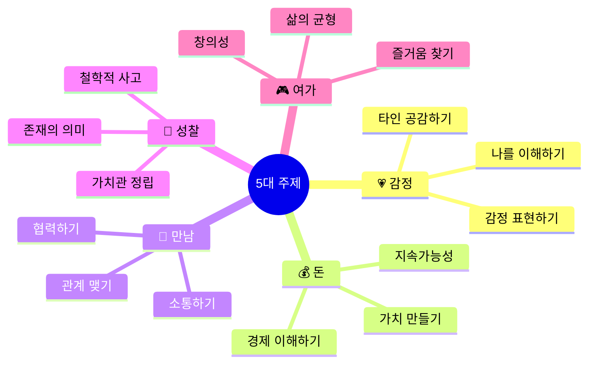

# 📚 주제별 독서 로드맵 (Theme-Based Reading Roadmap)

> **핵심 철학**: 하나의 주제를 2-3권의 책으로 다각도로 탐구하면  
> **시각 확장**이 자연스럽게 일어나고, **깊이 있는 통찰**이 생긴다!

---

## 🎯 왜 주제별로 읽는가?

### 기존 방식의 문제점

```markdown
❌ 책 1 (환경) → 책 2 (우정) → 책 3 (역사) → 책 4 (경제)
━━━━━━━━━━━━━━━━━━━━━━━━━━━━━━━━━━━━━━
• 주제가 계속 바뀌어서 깊이가 없음
• 비교할 수 없음
• 파편화된 지식
• 통찰 부족
```

### 주제별 독서의 장점

```markdown
✅ 주제 1 (환경): 책 A → 책 B → 책 C
━━━━━━━━━━━━━━━━━━━━━━━━━━━━━━━━━━━━━━
• 같은 주제를 여러 관점에서 봄 (시각 확장)
• 책과 책을 비교할 수 있음 (비판적 사고)
• 통합적 이해 (깊이)
• 명확한 통찰 도출
• 관심사에 맞춰 선택 가능 (동기 부여)
```

---

## 📊 5대 주제 기반 독서 구조

### 5대 주제 소개



### 1학기 기본 구조 (16주 기준)

```markdown
[추천 구조]
━━━━━━━━━━━━━━━━━━━━━━━━
Week 1-8   (8주): 주제 1 (2-3권)
Week 9-16  (8주): 주제 2 (2-3권)

또는

Week 1-6   (6주): 주제 1 (2권)
Week 7-12  (6주): 주제 2 (2권)
Week 13-16 (4주): 통합 세션

[한 주제 내 구조]
━━━━━━━━━━━━━━━━━━━━━━━━
• 책 1: 3-4주 (입문서, 쉬운 책)
• 책 2: 3-4주 (심화서, 다른 관점)
• 비교 토론: 1주
• 통합 성찰: 1주
```

---

## 💗 주제 1: 감정 (Emotion) - "나와 타인 이해하기"

### 왜 이 주제인가?

```
청소년기 가장 중요한 것: 감정 이해와 공감
→ 나를 이해해야 타인을 이해한다
→ 감정을 표현할 수 있어야 관계가 좋아진다
→ 공감 능력이 모든 것의 기초
```

### 초등학생 (5-6학년) - 8주 프로그램

#### 📚 독서 리스트 (난이도 순)

| 주차 | 책 | 분량 | 핵심 질문 |
|------|-----|------|----------|
| **1-3주** | 《아몬드》<br/>손원평 | 280p | "감정이 없다면?"<br/>"공감이란 무엇일까?" |
| **4-6주** | 《언어의 온도》<br/>이기주 | 200p | "말이 주는 힘은?"<br/>"어떻게 표현할까?" |
| **7주** | [비교 토론] | - | "두 책의 공통점과 차이점은?" |
| **8주** | [통합 성찰] | - | "감정에 대해 새롭게 알게 된 것은?" |

#### 주차별 운영 계획

**Week 1-3: 《아몬드》 읽기**

```markdown
[1주차: 책 소개 & 전반부 읽기]
━━━━━━━━━━━━━━━━━━━━━━━━
• 책 소개 (20분)
  "이 책은 감정을 느끼지 못하는 소년 이야기예요"
  
• 핵심 질문 제시:
  Q1. 감정이 없다면 어떨까?
  Q2. 나는 어떤 감정을 자주 느끼나?
  
• 전반부 (p.1-100) 읽기 계획

[2주차: 중간 토론]
━━━━━━━━━━━━━━━━━━━━━━━━
• 독서 경험 나누기
• 토론 질문 (쉬운 것부터):
  Q1. 윤재는 어떤 아이인가요?
  Q2. 윤재는 감정이 없어서 어떤 어려움을 겪나요?
  Q3. 만약 내가 윤재라면?
  
• 후반부 (p.101-끝) 읽기 계획

[3주차: 심화 토론 & 성찰]
━━━━━━━━━━━━━━━━━━━━━━━━
• 전체 내용 정리
• 심화 질문:
  Q1. 감정은 배울 수 있을까요?
  Q2. "다름"을 어떻게 받아들일까요?
  Q3. 공감이란 무엇일까요?
  
• 개인 성찰:
  "나는 감정을 잘 느끼나요?"
  "나는 친구의 감정을 잘 알아차리나요?"
```

**Week 4-6: 《언어의 온도》 읽기**

```markdown
[4주차: 책 소개 & 전반부]
━━━━━━━━━━━━━━━━━━━━━━━━
• 《아몬드》 복습 (10분)
  "지난 3주 동안 '감정'에 대해 배웠죠?"
  
• 《언어의 온도》 소개
  "이번에는 '말'에 대한 책이에요.
   말이 감정에 어떤 영향을 줄까요?"
  
• 핵심 질문:
  Q1. 따뜻한 말 vs 차가운 말
  Q2. 내가 상처받은 말은?
  Q3. 내가 누군가에게 해준 좋은 말은?

[5주차: 중간 토론]
━━━━━━━━━━━━━━━━━━━━━━━━
• 가장 인상 깊은 글 공유
• 토론 질문:
  Q1. 어떤 글이 기억에 남나요?
  Q2. 나는 어떤 말을 자주 하나요?
  Q3. 친구/가족에게 하고 싶은 말은?

[6주차: 실천 활동]
━━━━━━━━━━━━━━━━━━━━━━━━
• 책 전체 리뷰
• 실천 활동: "따뜻한 말 편지 쓰기"
  → 가족이나 친구에게 편지 쓰기
  → 발표 (원하는 사람만)
```

**Week 7: 비교 토론**

```markdown
🔍 비교 토론: "감정과 말"

[활동 1: 벤 다이어그램 (30분)]
━━━━━━━━━━━━━━━━━━━━━━━━
화이트보드에 벤 다이어그램 그리기:

┌─────────────┐         ┌─────────────┐
│  《아몬드》    │         │《언어의 온도》│
│             │         │             │
│  감정 느끼기  │  공통점  │  감정 표현하기│
│  공감하기    │         │  소통하기    │
│  이해하기    │  감정   │  위로하기    │
└─────────────┘         └─────────────┘

질문:
• 두 책의 공통점은?
• 두 책의 차이점은?
• 어떤 책이 더 좋았나요? 왜?

[활동 2: 통합 질문 (40분)]
━━━━━━━━━━━━━━━━━━━━━━━━
Q1. 감정을 느끼는 것 vs 표현하는 것
    어느 것이 더 중요할까요?
    
Q2. 윤재(아몬드)가 《언어의 온도》를 읽는다면?
    어떤 글이 도움이 될까요?
    
Q3. 공감 능력을 키우려면?
    → 《아몬드》: 다름을 이해하기
    → 《언어의 온도》: 따뜻하게 표현하기

[활동 3: 나만의 통찰 (30분)]
━━━━━━━━━━━━━━━━━━━━━━━━
워크시트 작성:

"두 책을 읽고 나는..."

□ 감정에 대해 새롭게 알게 된 것:
  _________________________________

□ 말의 힘에 대해 깨달은 것:
  _________________________________

□ 앞으로 실천하고 싶은 것:
  _________________________________
```

**Week 8: 통합 성찰**

```markdown
🎯 8주 통합 성찰: "감정 마스터 되기"

[활동 1: 8주 여정 돌아보기 (30분)]
━━━━━━━━━━━━━━━━━━━━━━━━
타임라인 만들기:

Week 1-3: 《아몬드》
→ "감정이 없다면?" 
→ 배운 것: _______________

Week 4-6: 《언어의 온도》
→ "말이 주는 힘"
→ 배운 것: _______________

Week 7: 비교
→ 통합 통찰: _______________

[활동 2: 나의 감정 지도 만들기 (40분)]
━━━━━━━━━━━━━━━━━━━━━━━━
워크시트:

나의 감정 지도

1. 나는 어떤 감정을 자주 느끼나요?
   ☺️ 기쁨  😢 슬픔  😡 화남  😰 불안  😊 평온
   
2. 어떤 상황에서 그 감정을 느끼나요?
   _________________________________
   
3. 나는 감정을 어떻게 표현하나요?
   □ 말로  □ 행동으로  □ 표정으로
   □ 글로  □ 표현 안 함
   
4. 친구의 감정을 알아차릴 수 있나요?
   _________________________________
   
5. 앞으로 어떻게 하고 싶나요?
   _________________________________

[활동 3: 발표 & 마무리 (30분)]
━━━━━━━━━━━━━━━━━━━━━━━━
• 나의 감정 지도 발표 (원하는 사람)
• 8주 소감 나누기
• 다음 주제 투표
```

---

### 중학생 (1-3학년) - 8주 프로그램

#### 📚 독서 리스트

| 주차 | 책 | 분량 | 핵심 질문 |
|------|-----|------|----------|
| **1-3주** | 《아몬드》<br/>손원평 | 280p | "감정의 메커니즘은?"<br/>"신경다양성이란?" |
| **4-6주** | 《설득의 심리학》<br/>(감정 챕터) | 150p | "감정이 결정에 미치는 영향은?"<br/>"어떻게 설득할까?" |
| **7주** | [비교 토론] | - | "감정의 이해 vs 활용" |
| **8주** | [통합 프로젝트] | - | "공감 능력 향상 앱 기획" |

#### 심화 질문 예시

```markdown
Week 3 (《아몬드》 심화 토론)
━━━━━━━━━━━━━━━━━━━━━━━━
Q1. 감정은 선천적인가, 후천적인가?
Q2. 신경다양성을 어떻게 수용할 것인가?
Q3. 공감 능력의 사회적 가치는?

Week 6 (《설득의 심리학》 심화 토론)
━━━━━━━━━━━━━━━━━━━━━━━━
Q1. 감정을 이용한 마케팅은 윤리적인가?
Q2. 나는 어떤 감정에 약한가?
Q3. 감정 지능(EQ)를 어떻게 높일까?

Week 7 (비교 통합)
━━━━━━━━━━━━━━━━━━━━━━━━
Q1. 감정을 이해하는 것 vs 활용하는 것
    어느 것이 먼저인가?
Q2. 윤리적으로 감정을 활용하려면?
Q3. 내 삶에 어떻게 적용할까?
```

---

### 고등학생 (1-3학년) - 12주 프로그램

#### 📚 독서 리스트 (더 깊게)

| 주차 | 책 | 분량 | 핵심 질문 |
|------|-----|------|----------|
| **1-4주** | 《감정은 어떻게<br/>만들어지는가》<br/>리사 펠드먼 배럿 | 400p | "감정의 신경과학적 메커니즘은?"<br/>"감정은 구성되는가?" |
| **5-8주** | 《공감의 배신》<br/>폴 블룸 | 300p | "공감의 한계는?"<br/>"이성적 동정심이란?" |
| **9-10주** | 《설득의 심리학》<br/>(전체) | 450p | "감정과 의사결정"<br/>"감정 마케팅의 윤리" |
| **11주** | [비교 세미나] | - | "감정 이론 통합" |
| **12주** | [최종 발표] | - | "감정 주제 소논문" |

---

## 💰 주제 2: 돈 (Money) - "경제와 가치 이해하기"

### 왜 이 주제인가?

```
돈은 삶의 현실
→ 경제를 이해해야 세상을 안다
→ 가치를 만드는 법을 배워야 한다
→ 지속가능한 삶을 설계해야 한다
```

### 초등학생 (5-6학년) - 8주 프로그램

#### 📚 독서 리스트

| 주차 | 책 | 분량 | 핵심 질문 |
|------|-----|------|----------|
| **1-3주** | 《경제 개념어 사전》<br/>(초등용) | 150p | "경제란 무엇일까?"<br/>"돈은 어떻게 생겼나?" |
| **4-6주** | 《어린이를 위한<br/>부자 아빠 가난한 아빠》 | 200p | "부자는 어떻게 생각할까?"<br/>"자산 vs 부채" |
| **7주** | [비교 토론] | - | "경제 지식 vs 부자 마인드" |
| **8주** | [미니 프로젝트] | - | "용돈 관리 앱 기획" |

---

### 중학생 (1-3학년) - 8주 프로그램

#### 📚 독서 리스트

| 주차 | 책 | 분량 | 핵심 질문 |
|------|-----|------|----------|
| **1-3주** | 《지적 대화를 위한<br/>넓고 얕은 지식: 경제》 | 300p | "경제 시스템은?"<br/>"자본주의란?" |
| **4-6주** | 《넛지》<br/>(청소년판) | 250p | "선택 설계란?"<br/>"행동경제학이란?" |
| **7주** | [비교 토론] | - | "거시경제 vs 행동경제" |
| **8주** | [프로젝트] | - | "소비 습관 개선 앱" |

---

### 고등학생 (1-3학년) - 12주 프로그램

#### 📚 독서 리스트

| 주차 | 책 | 분량 | 핵심 질문 |
|------|-----|------|----------|
| **1-4주** | 《국부론》<br/>(발췌/입문서) | 200p | "시장 원리란?"<br/>"보이지 않는 손?" |
| **5-8주** | 《21세기 자본》<br/>(청소년판) | 300p | "자본주의의 모순은?"<br/>"불평등 해결책?" |
| **9-10주** | 《넛지》<br/>(전체) | 450p | "자유주의적 개입주의란?"<br/>"정책 설계는?" |
| **11주** | [통합 세미나] | - | "경제 체제 비교" |
| **12주** | [소논문] | - | "경제 주제 탐구" |

---

## 🤝 주제 3: 만남 (Connection) - "관계와 소통 배우기"

### 왜 이 주제인가?

```
인간은 사회적 동물
→ 관계가 행복의 핵심
→ 소통 능력이 모든 것의 기초
→ 협력해야 더 큰 가치 창출
```

### 초등학생 (5-6학년) - 8주 프로그램

#### 📚 독서 리스트

| 주차 | 책 | 분량 | 핵심 질문 |
|------|-----|------|----------|
| **1-3주** | 《긴긴밤》<br/>루리 | 160p | "진짜 친구란?"<br/>"함께한다는 것?" |
| **4-6주** | 《나는 말랄라》<br/>(청소년판) | 250p | "용기란 무엇일까?"<br/>"함께 싸운다는 것?" |
| **7주** | [비교 토론] | - | "개인의 우정 vs 공동체 연대" |
| **8주** | [프로젝트] | - | "학급 소통 개선 프로젝트" |

---

### 중학생 (1-3학년) - 8주 프로그램

#### 📚 독서 리스트

| 주차 | 책 | 분량 | 핵심 질문 |
|------|-----|------|----------|
| **1-3주** | 《어떻게 원하는 것을<br/>얻는가》<br/>스튜어트 다이아몬드 | 400p | "협상이란?"<br/>"윈-윈이란?" |
| **4-6주** | 《비폭력 대화》<br/>마셜 로젠버그 | 250p | "공감 소통이란?"<br/>"갈등 해결 방법은?" |
| **7주** | [비교 토론] | - | "협상 vs 공감 소통" |
| **8주** | [프로젝트] | - | "갈등 조정 가이드북" |

---

### 고등학생 (1-3학년) - 12주 프로그램

#### 📚 독서 리스트

| 주차 | 책 | 분량 | 핵심 질문 |
|------|-----|------|----------|
| **1-4주** | 《사피엔스》<br/>(협력 챕터) | 200p | "인류는 어떻게 협력했나?"<br/>"허구의 역할은?" |
| **5-8주** | 《총균쇠》<br/>(사회 구조 챕터) | 250p | "사회는 어떻게 조직되나?"<br/>"협력의 진화는?" |
| **9-10주** | 《어떻게 원하는 것을<br/>얻는가》 | 400p | "현대 협상 이론은?"<br/>"관계 자본이란?" |
| **11주** | [통합 세미나] | - | "협력의 인류학·심리학·경제학" |
| **12주** | [소논문] | - | "협력 시스템 설계" |

---

## 🧘 주제 4: 성찰 (Reflection) - "나와 세계의 의미 찾기"

### 왜 이 주제인가?

```
삶의 의미를 찾아야 방향이 생긴다
→ 가치관이 확립되어야 선택할 수 있다
→ 철학적 사고가 깊이를 만든다
→ 성찰이 성장의 시작
```

### 초등학생 (5-6학년) - 8주 프로그램

#### 📚 독서 리스트

| 주차 | 책 | 분량 | 핵심 질문 |
|------|-----|------|----------|
| **1-3주** | 《어린 왕자》<br/>생텍쥐페리 | 120p | "어른이란?"<br/>"길들인다는 것?" |
| **4-6주** | 《모모》<br/>미하엘 엔데 | 300p | "시간이란?"<br/>"진짜 중요한 것?" |
| **7주** | [비교 토론] | - | "상징과 은유로 본 삶" |
| **8주** | [프로젝트] | - | "나만의 철학 그림책" |

---

### 중학생 (1-3학년) - 8주 프로그램

#### 📚 독서 리스트

| 주차 | 책 | 분량 | 핵심 질문 |
|------|-----|------|----------|
| **1-3주** | 《미움받을 용기》<br/>기시미 이치로 | 300p | "자유란?"<br/>"과제 분리란?" |
| **4-6주** | 《타인의 고통》<br/>(청소년 발췌) | 150p | "고통을 본다는 것?"<br/>"윤리적 책임은?" |
| **7주** | [비교 토론] | - | "개인의 자유 vs 타인에 대한 책임" |
| **8주** | [프로젝트] | - | "나의 가치관 선언문" |

---

### 고등학생 (1-3학년) - 12주 프로그램

#### 📚 독서 리스트

| 주차 | 책 | 분량 | 핵심 질문 |
|------|-----|------|----------|
| **1-4주** | 《죽음이란 무엇인가》<br/>셸리 케이건 | 500p | "죽음을 안다면 어떻게 살까?"<br/>"의미 있는 삶이란?" |
| **5-8주** | 《정의란 무엇인가》<br/>마이클 샌델 | 400p | "정의의 기준은?"<br/>"옳음이란?" |
| **9-10주** | 《사피엔스》<br/>(의미 챕터) | 200p | "호모 사피엔스의 미래는?"<br/>"허구와 의미?" |
| **11주** | [통합 세미나] | - | "의미·정의·죽음의 통합적 이해" |
| **12주** | [소논문] | - | "나의 철학 에세이" |

---

## 🎮 주제 5: 여가 (Leisure) - "삶의 즐거움과 창의성"

### 왜 이 주제인가?

```
일과 공부만으로는 불충분
→ 즐거움이 동기를 만든다
→ 여유가 창의성을 낳는다
→ 균형 잡힌 삶이 지속 가능하다
```

### 초등학생 (5-6학년) - 8주 프로그램

#### 📚 독서 리스트

| 주차 | 책 | 분량 | 핵심 질문 |
|------|-----|------|----------|
| **1-3주** | 《나의 라임 오렌지나무》 | 220p | "놀이란?"<br/>"상상력이란?" |
| **4-6주** | 《플로우》<br/>(청소년판) | 200p | "몰입이란?"<br/>"행복한 순간은?" |
| **7주** | [비교 토론] | - | "놀이 vs 몰입" |
| **8주** | [프로젝트] | - | "나만의 취미 시작하기" |

---

### 중학생 (1-3학년) - 8주 프로그램

#### 📚 독서 리스트

| 주차 | 책 | 분량 | 핵심 질문 |
|------|-----|------|----------|
| **1-3주** | 《게으를 권리》<br/>폴 라파르그 | 150p | "노동과 여가의 균형은?"<br/>"게으름이 나쁜가?" |
| **4-6주** | 《몰입》<br/>황농문 | 250p | "최고의 경험이란?"<br/>"어떻게 몰입할까?" |
| **7주** | [비교 토론] | - | "휴식 vs 몰입의 여가" |
| **8주** | [프로젝트] | - | "학생 여가 문화 개선안" |

---

### 고등학생 (1-3학년) - 12주 프로그램

#### 📚 독서 리스트

| 주차 | 책 | 분량 | 핵심 질문 |
|------|-----|------|----------|
| **1-4주** | 《여가의 미래》<br/>다양한 에세이 | 300p | "AI 시대 인간의 여가는?"<br/>"일의 의미 변화?" |
| **5-8주** | 《놀이하는 인간》<br/>요한 하위징아 | 350p | "놀이가 문화를 만든다?"<br/>"호모 루덴스란?" |
| **9-10주** | 《플로우》<br/>(전체) | 450p | "최적 경험의 심리학"<br/>"행복의 조건?" |
| **11주** | [통합 세미나] | - | "여가·놀이·몰입의 철학" |
| **12주** | [소논문] | - | "미래 여가 문화 제안" |

---

## 📅 1년 운영 예시 (전체 로드맵)

### 초등학생 (5-6학년) - 32주 (1년)

```markdown
[1학기: 16주]
━━━━━━━━━━━━━━━━━━━━━━━━
Week 1-8   (8주): 💗 감정 주제
  • 《아몬드》 (3주)
  • 《언어의 온도》 (3주)
  • 비교 토론 (1주)
  • 통합 성찰 (1주)

Week 9-16  (8주): 🤝 만남 주제
  • 《긴긴밤》 (3주)
  • 《나는 말랄라》 (3주)
  • 비교 토론 (1주)
  • 프로젝트 (1주)

[2학기: 16주]
━━━━━━━━━━━━━━━━━━━━━━━━
Week 17-24 (8주): 🧘 성찰 주제
  • 《어린 왕자》 (3주)
  • 《모모》 (4주)
  • 비교 토론 (1주)

Week 25-32 (8주): 💰 돈 주제 또는 🎮 여가 주제
  (참여자 투표로 선택)

→ 1년에 3-4개 주제 깊이 탐구
```

---

### 중학생 (1-3학년) - 32주 (1년)

```markdown
[1학기: 16주]
━━━━━━━━━━━━━━━━━━━━━━━━
Week 1-8   (8주): 💗 감정 주제
Week 9-16  (8주): 💰 돈 주제

[2학기: 16주]
━━━━━━━━━━━━━━━━━━━━━━━━
Week 17-24 (8주): 🤝 만남 주제
Week 25-32 (8주): 🧘 성찰 주제

→ 1년에 4개 주제 체계적 탐구
```

---

### 고등학생 (1-3학년) - 48주 (1년)

```markdown
[1학기: 24주]
━━━━━━━━━━━━━━━━━━━━━━━━
Week 1-12  (12주): 💗 감정 주제 (3권)
Week 13-24 (12주): 💰 돈 주제 (3권)

[2학기: 24주]
━━━━━━━━━━━━━━━━━━━━━━━━
Week 25-36 (12주): 🧘 성찰 주제 (3권)
Week 37-48 (12주): 🤝 만남 또는 🎮 여가 (선택)

→ 1년에 3-4개 주제 깊이 있게 탐구
→ 각 주제당 3권씩 읽기
→ 소논문 완성
```

---

## 🎯 주제별 독서의 핵심 운영 원칙

### 1. 책 순서가 중요하다

```markdown
✅ 올바른 순서:
━━━━━━━━━━━━━━━━━━━━━━━━
쉬운 책 → 어려운 책 → 통합

예: 감정 주제 (중학생)
1. 《아몬드》 (이야기, 쉬움) 
2. 《설득의 심리학》 (이론, 어려움)
3. 비교 토론 (통합)

❌ 잘못된 순서:
━━━━━━━━━━━━━━━━━━━━━━━━
어려운 책 먼저 → 좌절 → 포기
```

### 2. 비교가 핵심이다

```markdown
주제별 독서의 진짜 힘은 "비교"에서 나온다!

[비교 질문 예시]
━━━━━━━━━━━━━━━━━━━━━━━━
• 두 책의 공통점은?
• 두 책의 차이점은?
• 어떤 책이 더 설득력 있나?
• 두 저자가 만난다면 무슨 대화를 할까?
• 나는 어느 쪽 관점에 동의하나?
• 두 책을 통합하면 어떤 통찰이?

→ 이 질문들이 비판적 사고를 키운다!
```

### 3. 통합 세션이 꽃이다

```markdown
마지막 1-2주의 통합 세션이 가장 중요!

[통합 세션 활동]
━━━━━━━━━━━━━━━━━━━━━━━━
• 주제 전체 정리
• 나만의 통찰 도출
• 개인 프로젝트 또는 소논문
• 다음 주제 연결

→ 여기서 진짜 배움이 일어난다!
```

### 4. 선택권을 주어라

```markdown
✅ 참여자에게 선택권:
━━━━━━━━━━━━━━━━━━━━━━━━
• 1학기 주제 2개 투표로 선택
• 2학기 주제 2개 투표로 선택
• 관심 없는 주제는 건너뛰기 가능

→ 주인의식, 동기 부여 극대화!
```

---

## 📊 주제별 독서 vs 일반 독서 비교

| 구분 | 일반 독서 | 주제별 독서 | 효과 |
|------|----------|-----------|------|
| **구조** | 책1-책2-책3-책4<br/>(주제 다름) | 주제A(책1-책2)<br/>주제B(책3-책4) | 집중력 2배↑ |
| **깊이** | 표면적 이해 | 심층적 통찰 | 이해도 3배↑ |
| **비교** | 불가능 | 가능 (핵심!) | 비판적사고 5배↑ |
| **통합** | 파편적 지식 | 통합적 지식 | 지혜 형성 |
| **기억** | 금방 잊음 | 오래 기억 | 장기기억 2배↑ |
| **동기** | 흥미 감소 | 흥미 증가 | 몰입도 3배↑ |
| **적용** | 어려움 | 쉬움 | 실천율 2배↑ |

---

## 💡 퍼실리테이터를 위한 팁

### 주제별 독서를 성공시키는 5가지 비밀

```markdown
1️⃣ 주제 선택은 참여자와 함께
━━━━━━━━━━━━━━━━━━━━━━━━
• 오리엔테이션에서 5대 주제 소개
• 투표로 순서 결정
• 자기 선택이 동기 부여

2️⃣ 책 소개 시 연결고리 강조
━━━━━━━━━━━━━━━━━━━━━━━━
• "지난 책에서 ○○을 배웠죠?"
• "이번 책은 다른 관점에서 봅니다"
• "나중에 비교해볼 거예요"

3️⃣ 매주 간단히 이전 책 복습
━━━━━━━━━━━━━━━━━━━━━━━━
• "《아몬드》에서는 뭐라고 했죠?"
• "그건 이 책에서는 어떻게 설명하나요?"
• 연결하는 습관 형성

4️⃣ 비교 토론은 재미있게
━━━━━━━━━━━━━━━━━━━━━━━━
• 게임처럼 진행
• 벤 다이어그램, 토론 배틀 등
• 정답 없음을 강조

5️⃣ 통합 세션은 여유있게
━━━━━━━━━━━━━━━━━━━━━━━━
• 시간 넉넉히 (2주도 가능)
• 창의적 표현 장려
• 성취감 극대화
```

---

## 📋 부록: 주제별 비교 토론 템플릿

### 비교 토론 워크시트

```markdown
[주제별 비교 토론 워크시트]

주제: _______________________
책 1: _______________________
책 2: _______________________

[1. 벤 다이어그램]
━━━━━━━━━━━━━━━━━━━━━━━━

책 1만의 특징:          책 2만의 특징:
_____________          _____________
_____________          _____________
_____________          _____________

        공통점:
        _____________
        _____________
        _____________

[2. 관점 비교]
━━━━━━━━━━━━━━━━━━━━━━━━

이 주제에 대해:

책 1의 관점:
_____________________________________

책 2의 관점:
_____________________________________

나의 관점:
_____________________________________

[3. 심화 질문]
━━━━━━━━━━━━━━━━━━━━━━━━

Q1. 두 책 중 어느 것이 더 설득력 있나요? 왜?
_____________________________________

Q2. 두 저자가 만난다면 어떤 대화를 할까요?
_____________________________________

Q3. 두 책을 통합하면 어떤 통찰이 나올까요?
_____________________________________

[4. 나만의 통합 이론]
━━━━━━━━━━━━━━━━━━━━━━━━

두 책을 읽고 내가 내린 결론:
_____________________________________
_____________________________________
_____________________________________
```

---

## 🎯 마무리: 주제별 독서의 힘

### 왜 주제별 독서가 강력한가?

```markdown
1. 집중력 향상
   → 한 주제에 8-12주 몰입
   → 깊이 있는 이해

2. 비판적 사고 자동 발달
   → 같은 주제, 다른 관점 비교
   → 자연스럽게 질문 생김

3. 통합적 지혜 형성
   → 파편적 정보 → 통합된 지식
   → 지식 → 지혜

4. 높은 동기 부여
   → 관심 주제 선택 가능
   → 연속성이 흥미 유지

5. 실천 가능성 증가
   → 주제별로 깊이 이해
   → 삶에 적용하기 쉬움
```

### 시작하기

```markdown
1단계: 참여자와 주제 선택
2단계: 주제별로 2-3권 선정 (쉬운 책 → 어려운 책)
3단계: 8-12주 운영
4단계: 비교 토론
5단계: 통합 성찰

→ 그 다음 주제로!
```

---

**이 로드맵은 실전 경험을 바탕으로 계속 업데이트됩니다.**  
**여러분만의 주제별 독서 경험을 공유해주세요! 📚**
