# 고등학생 필독서 가이드 (고1-3)

> **목적**: 학문적 깊이, 융합적 통찰, 독립적 사고 완성  
> **접근법**: 5대 주제 중심 다학제 융합 + 연구 프로젝트
> 
> **핵심 원칙**: 📚 한 권은 10가지 렌즈로 → 🔗 같은 주제 7권 융합 → 🚀 연구 프로젝트!

---

## 🎯 5대 주제 독서 시스템

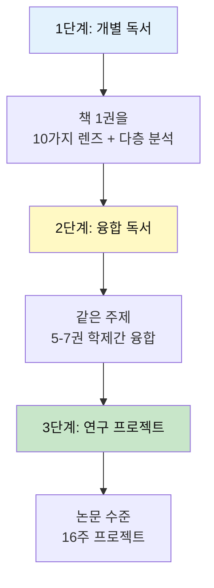

### 5대 주제와 고등학생

| 주제 | 권수 | 핵심 질문 | 프로젝트 예시 |
|------|------|-----------|--------------|
| 💗 **감정** | 5권 (17%) | 심리 메커니즘과 치유는? | 정신건강 솔루션 설계 |
| 💰 **돈** | 7권 (23%) | 경제 시스템과 전략은? | 비즈니스 모델 설계 |
| 🤝 **만남** | 5권 (17%) | 리더십과 조직은? | 조직 혁신 프로젝트 |
| 🧘 **성찰** | 8권 (27%) | 존재와 의미는 무엇인가? | 철학 에세이 + 실천 |
| 🎮 **여가** | 5권 (17%) | 창의적 삶이란? | 문화 콘텐츠 창작 |

**고등학생 특징**: 성찰·돈 최고 (철학적 깊이 + 실용적 전문성)

---

## 📊 고등학생 지식 생태계

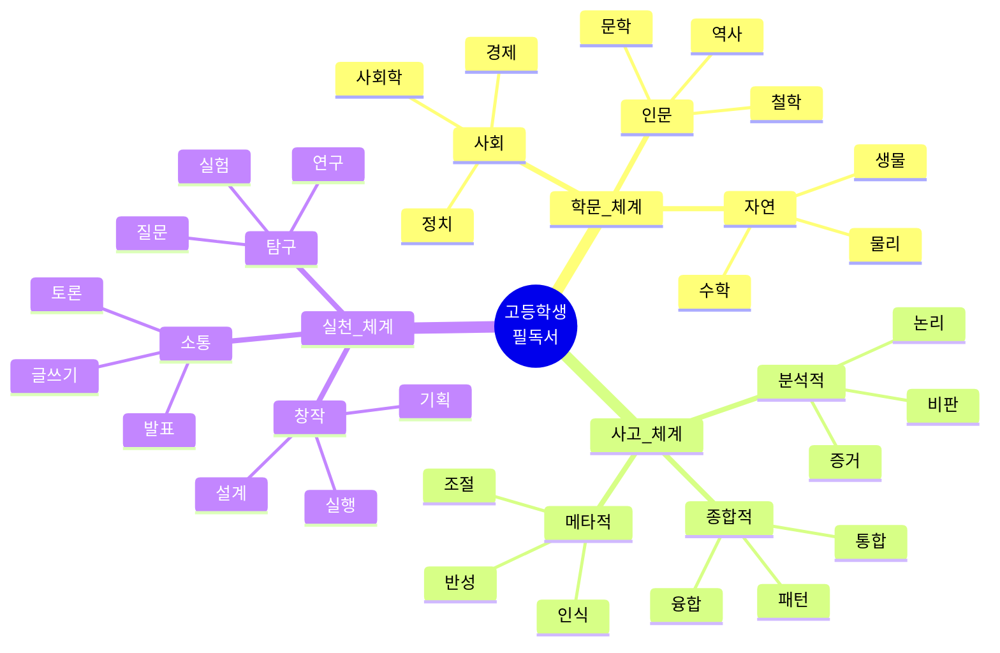

---

## 🎯 난이도 × 분야 × 사고체계 매트릭스

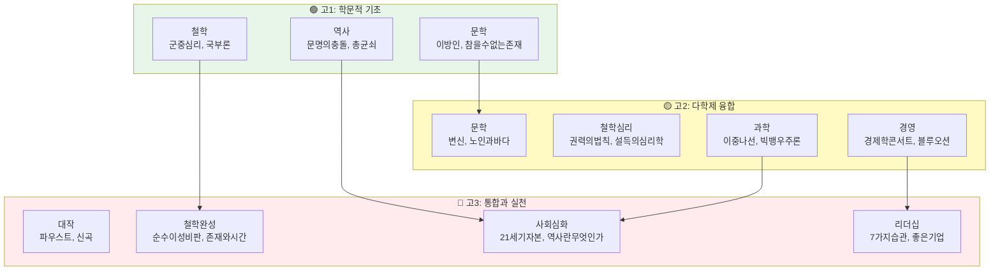

---

## 📚 융합 독서 클러스터

### 🔵 클러스터 1: 실존과 자유

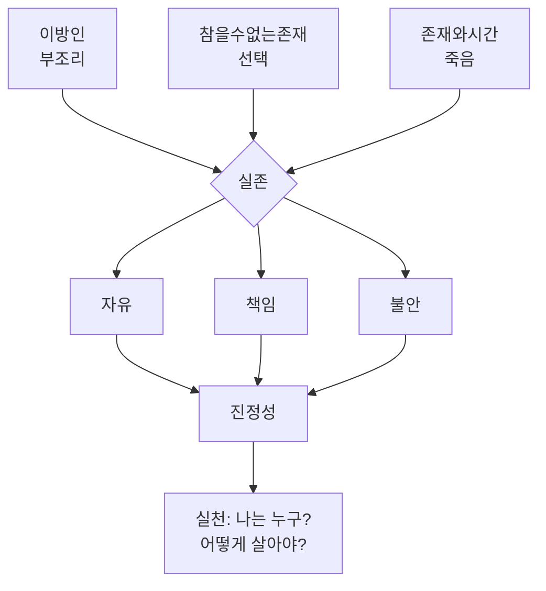

#### 📖 1. 이방인 - 알베르 카뮈

**부조리 3단 분석**
```
Level 1: 뫼르소는 왜 어머니 장례에서 울지 않았나?
    → 사회적 기대에 무감각
    
Level 2: 왜 아랍인을 죽였나?
    → 우연, 태양, 부조리
    
Level 3: 부조리란 무엇인가?
    → 의미를 찾는 인간 vs 무의미한 세계
```

**핵심 개념 쪼개기**
1. **부조리**: 의미 추구 ≠ 의미 없는 세계
2. **이방인**: 사회 규범의 바깥자
3. **진정성**: 거짓 없이 살기
4. **반항**: 부조리 인정하고 살아가기

**다층 관점**
| 관점 | 해석 |
|------|------|
| 실존주의 | 본질 없이 존재하는 인간 |
| 사회학 | 규범에서 벗어난 자의 처벌 |
| 심리학 | 감정 표현 불능증? |
| 철학 | 삶의 의미는 어디서? |

**융합 프로젝트**
```
이방인 + 1984 + 동물농장
= "사회는 어떻게 '정상'을 강요하는가"

연구 주제:
1. 사회 규범의 형성 과정
2. 일탈의 정의와 처벌
3. 개인 vs 사회
```

---

#### 📖 2. 참을 수 없는 존재의 가벼움 - 밀란 쿤데라

**가벼움 vs 무거움 변증법**
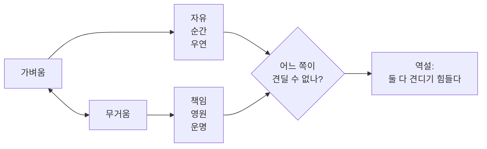

**4명의 인물 = 4가지 삶의 태도**
| 인물 | 태도 | 선택 |
|------|------|------|
| 토마시 | 가벼움 → 무거움 | 자유 → 사랑의 책임 |
| 테레자 | 무거움 | 운명, 질투, 사랑 |
| 사비나 | 가벼움 | 배신, 자유, 고독 |
| 프란츠 | 무거움 | 이상, 헌신, 착각 |

**융합 질문**
- 참을수없는존재 + 데미안 = "자기 되기의 무게"
- 참을수없는존재 + 연금술사 = "선택과 운명"

---

### 🟣 클러스터 2: 권력과 사회

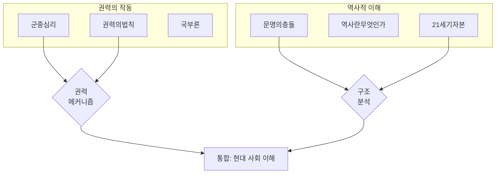

#### 📖 3. 군중심리 - 귀스타브 르봉

**집단 역학 분석**
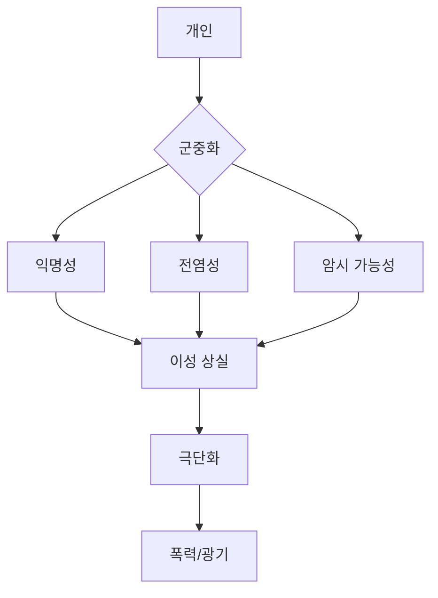

**5가지 군중 법칙**
1. **단순화**: 복잡한 것 → 단순 구호
2. **감정 우선**: 이성 < 감정
3. **반복의 힘**: 같은 메시지 반복 = 진실
4. **카리스마**: 지도자에 대한 맹종
5. **환상**: 현실보다 이미지

**현대 적용**
| 과거 | 현재 | 분석 |
|------|------|------|
| 광장 집회 | SNS 해시태그 | 디지털 군중심리 |
| 선동가 | 인플루언서 | 영향력 메커니즘 |
| 소문 | 가짜뉴스 | 빠른 전파 |

**융합 프로젝트**
```
군중심리 + 넛지 + 설득의심리학
= "대중을 움직이는 심리 기제"

프로젝트:
1. SNS 바이럴 분석
2. 정치 캠페인 연구
3. 광고 전략 해부
```

---

#### 📖 4. 국부론 - 애덤 스미스

**경제 시스템 사고**
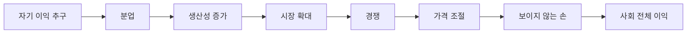

**핵심 개념 3가지**
1. **보이지 않는 손**: 개인 이익 → 사회 이익 (조건부!)
2. **분업**: 생산성의 원천
3. **자유 시장**: 정부 개입 최소화

**비판적 질문**
- 보이지 않는 손은 항상 작동하나?
- 시장 실패는?
- 불평등 문제는?

**융합 분석**
```
국부론 + 21세기 자본 + 괴짜경제학
= "자본주의의 진화와 한계"

주제:
1. 시장 메커니즘의 작동
2. 불평등의 구조적 원인
3. 인센티브 설계의 중요성
```

---

### 🟠 클러스터 3: 과학적 세계관

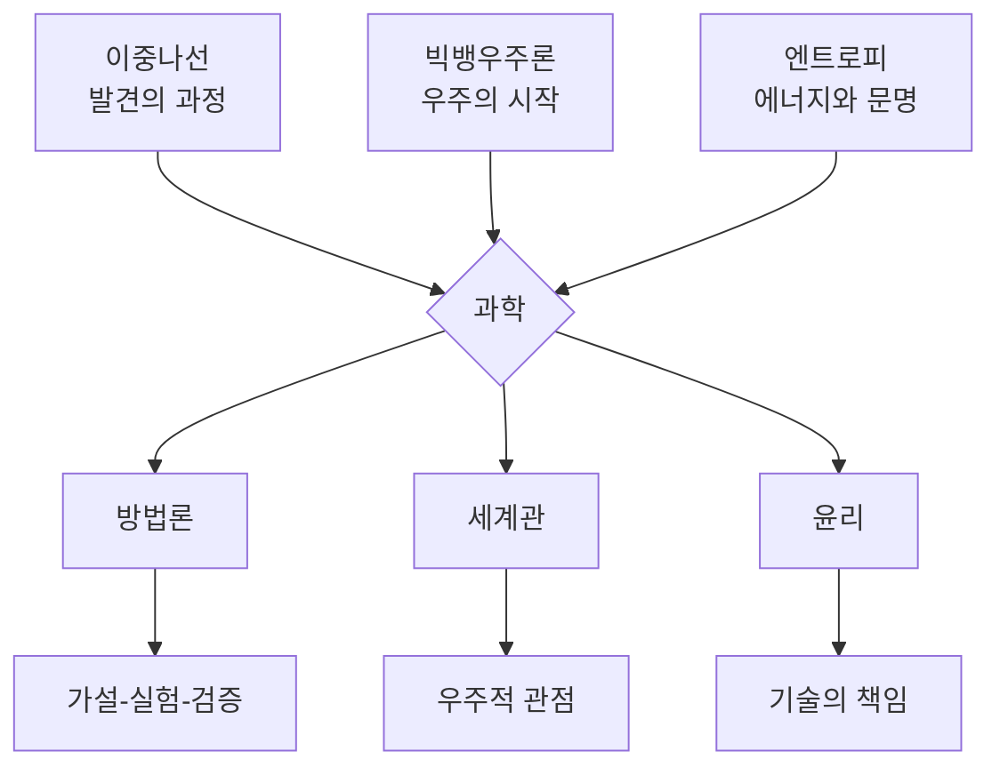

#### 📖 5. 이중나선 - 제임스 왓슨

**과학 발견의 이면**
```
교과서: 논리적 단계별 발견
    ↓
현실: 경쟁, 우연, 직관, 정치
```

**5가지 통찰**
1. **경쟁**: 동료 = 라이벌 (로절린드 프랭클린)
2. **우연**: X선 사진의 우연한 목격
3. **직관**: 이중나선 구조 직감
4. **협업**: 크릭과의 시너지
5. **윤리**: 데이터 무단 사용 논란

**메타 학습**
- 과학도 인간이 한다 → 완벽하지 않다
- 과정 = 혼란 + 우연 + 집착
- 윤리 vs 발견의 딜레마

---

### 🟡 클러스터 4: 경영과 전략

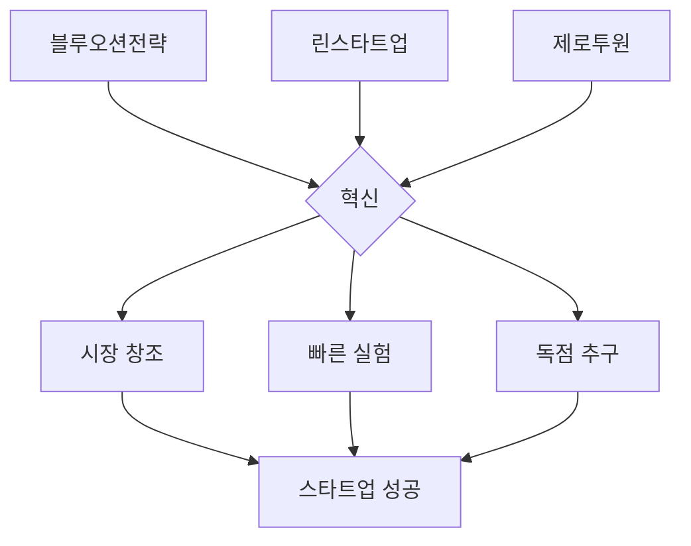

#### 📖 6. 블루오션 전략 - 김위찬

**전략 캔버스**
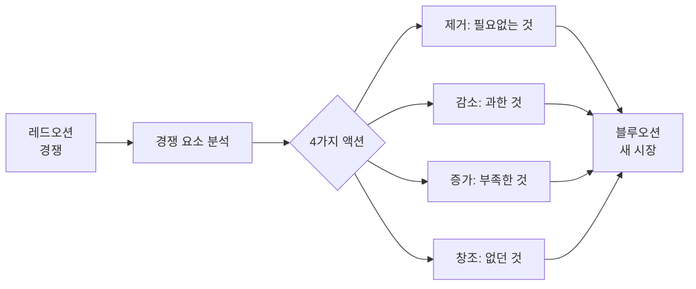

**사례 분석**
| 기업 | 제거 | 감소 | 증가 | 창조 |
|------|------|------|------|------|
| 닌텐도 Wii | 고성능 그래픽 | 복잡한 조작 | 직관성 | 모션 컨트롤 |
| 시르크 뒤 솔레이유 | 동물 쇼 | 스타 공연자 | 예술성 | 스토리 |

**실전 프로젝트**
```
주제: 우리 학교 매점 블루오션 전략

1. 현재 경쟁 요소 파악
2. 4가지 액션 프레임워크 적용
3. 새로운 가치 곡선 제시
4. 파일럿 테스트 설계
```

---

## 🔗 5대 주제별 융합 독서 프로젝트

### 💗 주제 1: 감정 - 심리 메커니즘과 인간 본성

**📚 융합 독서 리스트 (5권)**
1. 참을 수 없는 존재의 가벼움 - 감정과 선택
2. 죄와 벌 - 죄책감의 심리
3. 예술의 위로 - 예술과 치유
4. 설득의 심리학 - 감정 트리거
5. 생각에 관한 생각 - 감정 vs 이성

**🔍 융합 분석**
```
공통 통찰:
1. 감정은 이성보다 강력하다
2. 감정을 이해하면 인간을 이해한다
3. 감정은 설계할 수 있다

다학제 통합:
• 문학: 감정의 깊이 (참을수없는존재, 죄와벌)
• 철학: 감정의 의미 (예술의위로)
• 심리학: 감정의 메커니즘 (설득의심리학, 생각에관한생각)
```

**🚀 통합 프로젝트: 정신건강 솔루션 플랫폼 (16주)**
```
Week 1-4: 리서치 (학제간)
• 문헌 조사: 5권 + 논문 20편
• 청소년 정신건강 실태 (통계)
• 전문가 인터뷰 5명
• 사용자 인터뷰 50명

Week 5-8: 솔루션 설계
• 5권의 통찰 통합 적용
  - 참을수없는존재: 선택의 무게 → 의사결정 지원
  - 죄와벌: 죄책감 해소 → 자기용서 워크시트
  - 예술의위로: 예술 치유 → 창작 활동 추천
  - 설득의심리학: 행동 변화 → 습관 설계
  - 생각에관한생각: 인지 왜곡 → 편향 체크

• 프레임워크: 진단 → 이해 → 치유 → 성장

Week 9-12: MVP 개발
• 감정 상태 진단 AI
• 맞춤형 콘텐츠 추천
• 전문가 매칭
• 커뮤니티 (익명)

Week 13-14: 베타 테스트
• 100명 테스트
• 효과 측정 (PHQ-9 등)
• 피드백 반영

Week 15-16: 발표
• 연구 논문 (10,000자)
• 피칭 (VC 대상 가능)
• 포트폴리오
```

---

### 💰 주제 2: 돈 - 경제 전략과 혁신

**📚 융합 독서 리스트 (7권)**
1. 국부론 - 경제의 기초
2. 21세기 자본 - 불평등의 구조
3. 블루오션 전략 - 새 시장 창조
4. 경쟁 전략 - 경쟁 우위
5. 린 스타트업 - 빠른 검증
6. 괴짜경제학 - 숨은 인센티브
7. 넛지 - 행동 설계

**🔍 융합 분석**
```
공통 통찰:
1. 경제는 인센티브의 과학이다
2. 전략은 선택과 포기다
3. 혁신은 새로운 시장을 만든다

다학제 통합:
• 거시경제: 시스템 이해 (국부론, 21세기자본)
• 경영전략: 경쟁과 혁신 (블루오션, 경쟁전략)
• 실행방법론: 검증과 설계 (린스타트업, 넛지)
• 행동경제: 심리와 선택 (괴짜경제학)
```

**🚀 통합 프로젝트: 지역 소상공인 컨설팅 (16주)**
```
Week 1-3: 클라이언트 선정 & 분석
• 소상공인 3곳 선정
• 7권 완독 + 노트
• 산업 분석 (5 Forces)
• 재무 분석

Week 4-7: 전략 수립
• 7권의 통찰 통합 적용
  - 국부론: 분업과 효율성 → 운영 개선
  - 21세기자본: 소득 구조 → 가격 전략
  - 블루오션: 4가지 액션 → 차별화
  - 경쟁전략: 포지셔닝 → 타깃 재설정
  - 린스타트업: MVP → 신메뉴 테스트
  - 괴짜경제학: 인센티브 → 프로모션
  - 넛지: 동선 설계 → 매장 레이아웃

Week 8-12: 실행 지원
• 전략 실행 (파일럿)
• 주간 모니터링
• 데이터 수집 (매출, 만족도)
• 지속 개선

Week 13-16: 평가 & 보고서
• 성과 분석 (증감률)
• 컨설팅 보고서 (80페이지)
• 클라이언트 발표
• 케이스 스터디 논문
• 추천서 확보
```

---

### 🤝 주제 3: 만남 - 리더십과 조직 혁신

**📚 융합 독서 리스트 (5권)**
1. 권력의 법칙 - 영향력의 기술
2. 설득의 심리학 - 6가지 원리
3. 팀 오브 팀 - 조직 혁신
4. 실리콘밸리의 팀장들 - 피드백 문화
5. 멀티플라이어 - 리더십 배가

**🔍 융합 분석**
```
공통 통찰:
1. 리더십은 관계의 기술이다
2. 조직은 구조가 아니라 문화다
3. 최고의 리더는 팀을 강하게 만든다

다학제 통합:
• 권력 이론: 영향력 메커니즘 (권력의법칙)
• 심리학: 설득의 과학 (설득의심리학)
• 조직론: 적응형 구조 (팀오브팀)
• 경영실무: 피드백 문화 (실리콘밸리의팀장들)
• 리더십: 임파워먼트 (멀티플라이어)
```

**🚀 통합 프로젝트: 동아리 조직 혁신 (16주)**
```
Week 1-2: 현황 진단
• 5권 완독
• 동아리 문제 파악
• 구성원 인터뷰

Week 3-6: 혁신 설계
• 5권의 통찰 통합 적용
  - 권력의법칙: 영향력 전략
  - 설득의심리학: 참여 유도 설계
  - 팀오브팀: 네트워크 조직 구조
  - 실리콘밸리: Radical Candor 문화
  - 멀티플라이어: 권한 위임 시스템

• 혁신 계획서 작성

Week 7-14: 실행
• 새 조직 문화 도입
• 주간 회고
• 프로젝트 성과 측정
• 참여율, 만족도 추적

Week 15-16: 평가 & 확산
• 정량/정성 평가
• 성공 사례집
• 다른 동아리 공유
• 학교 혁신 제안
```

---

### 🧘 주제 4: 성찰 - 존재와 의미의 탐구

**📚 융합 독서 리스트 (8권)**
1. 이방인 - 부조리와 진정성
2. 참을 수 없는 존재의 가벼움 - 선택과 책임
3. 존재와 시간 - 죽음과 존재
4. 순수이성비판 - 인식의 한계
5. 파우스트 - 끊임없는 추구
6. 사피엔스 - 인류의 본질
7. 호모 데우스 - 미래의 인간
8. 정의란 무엇인가 - 윤리적 판단

**🔍 융합 분석**
```
공통 통찰:
1. 존재의 의미는 만들어가는 것
2. 자유와 책임은 동전의 양면
3. 인간은 허구를 믿는 존재

다학제 통합:
• 실존철학: 부조리, 자유, 책임 (이방인, 참을수없는존재, 존재와시간)
• 인식론: 인간의 사고 한계 (순수이성비판)
• 문학: 인간의 욕망과 추구 (파우스트)
• 인류학: 인간의 본질과 미래 (사피엔스, 호모데우스)
• 윤리학: 가치 판단의 기준 (정의란무엇인가)
```

**🚀 통합 프로젝트: 철학 에세이 + 실천 프로젝트 (16주)**
```
Week 1-6: 문헌 연구
• 8권 완독 + 노트
• 논문 30편 읽기
• 철학자들 대화 (가상)
• 개인 철학 초안

Week 7-10: 에세이 작성
• 연구 질문 정립
  예: "인공지능 시대의 자유와 책임"
  
• 8권의 통찰 통합
  - 이방인: 사회 규범 vs 진정성
  - 참을수없는존재: 선택의 무게
  - 존재와시간: 죽음 앞의 존재
  - 사피엔스: 허구의 힘
  - 호모데우스: 기술과 인간
  - 정의론: 윤리적 기준
  
• 12,000자 철학 에세이

Week 11-14: 실천 프로젝트
• 철학 개념을 현실에 적용
  예: "진정성 있는 삶" 30일 실험
  
• 매일 저널링
• 의미 있는 선택 기록
• 변화 관찰

Week 15-16: 발표 & 출판
• 학내 철학 세미나 발표
• 교지/온라인 출판
• 포트폴리오 (대입용)
```

---

### 🎮 주제 5: 여가 - 창의적 삶과 예술

**📚 융합 독서 리스트 (5권)**
1. 백년의 고독 - 마법적 리얼리즘
2. 예술의 위로 - 예술의 힘
3. 생각의 탄생 - 13가지 사고 도구
4. 오리지널스 - 독창성
5. 디자인 씽킹 - 창조 프로세스

**🔍 융합 분석**
```
공통 통찰:
1. 창의성은 학습 가능한 기술
2. 예술은 삶을 치유한다
3. 독창성은 용기가 필요하다

다학제 통합:
• 문학: 상상력의 극치 (백년의고독)
• 예술론: 예술의 사회적 역할 (예술의위로)
• 인지과학: 창의적 사고 (생각의탄생)
• 혁신론: 비순응과 독창성 (오리지널스)
• 실행방법: 창작 프로세스 (디자인씽킹)
```

**🚀 통합 프로젝트: 문화 콘텐츠 창작 (16주)**
```
Week 1-4: 장르 선택 & 기획
• 5권 완독
• 장르 선택 (웹툰/소설/영상/게임)
• 스토리 아이디어 50개
• 최종 기획안 1개

Week 5-8: 창작
• 5권의 통찰 적용
  - 백년의고독: 마법적 상상력 → 독특한 세계관
  - 예술의위로: 치유의 메시지 → 주제 설정
  - 생각의탄생: 13가지 도구 → 창작 기법
  - 오리지널스: 독창성 → 차별화 포인트
  - 디자인씽킹: 프로세스 → 제작 단계

• 프로토타입 완성 (1화 or 1편)

Week 9-12: 제작 & 연재
• 본격 제작 (총 10화 or 5만자)
• 플랫폼 연재 (웹툰: 네이버, 소설: 브런치)
• 독자 피드백 수집

Week 13-16: 성장 & 마케팅
• 바이럴 전략
• 팬덤 형성 (SNS)
• 조회수/구독자 목표
• 포트폴리오 완성
• 문예창작과/디자인과 입시 활용
```

---

## 🌈 융합 메가 프로젝트 (5대 주제 통합)

### 프로젝트: 사회 문제 해결 연구 프로젝트 (6개월)

**5대 주제 통합 접근**
```
💗 감정: 문제로 고통받는 사람들 (공감)
💰 돈: 지속가능한 비즈니스 모델
🤝 만남: 이해관계자 협력
🧘 성찰: 사회적 가치와 철학
🎮 여가: 창의적 솔루션
```

**Phase 1 (Month 1-2): 문제 정의 & 리서치**
- 30권의 책에서 사회 문제 발견
- 5대 영역별 분석
- 문헌 조사 (책 50권 + 논문 100편)
- 실태 조사 (설문, 인터뷰)

**Phase 2 (Month 3-4): 이론적 프레임워크**
- 30권의 통찰 통합
- 다학제 이론 구축
- 가설 수립
- 솔루션 아이디어 10개

**Phase 3 (Month 5): 파일럿 실행**
- MVP 제작 및 테스트
- 데이터 수집
- 정량/정성 분석

**Phase 4 (Month 6): 논문 & 발표**
- 연구 논문 (15,000-20,000자)
- 학회 발표 (가능 시)
- 학내 세미나
- 대입 포트폴리오
- 창업 or NGO 설립 (선택)

---

## 🔗 학제간 융합 프로젝트

### 프로젝트 A: 3책 3관점 융합

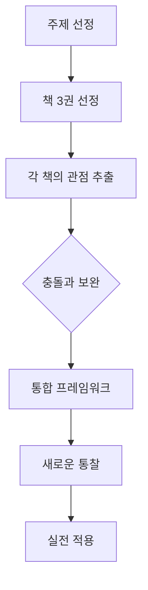

**예시 1: "행복이란 무엇인가"**
```
[철학] 참을 수 없는 존재의 가벼움
→ 행복 = 선택의 진정성

[경제] 괴짜경제학
→ 행복 = 인센티브 충족

[심리] 생각에 관한 생각
→ 행복 = 인지 편향 극복

통합: 행복 = 진정한 선택 + 합리적 판단 + 의미 발견
```

**예시 2: "리더십의 본질"**
```
[역사] 파우스트
→ 끝없는 추구와 책임

[경영] 좋은 기업을 넘어 위대한 기업으로
→ Level 5 리더십

[심리] 권력의 법칙
→ 영향력의 기술

통합: 리더십 = 비전 + 겸손 + 전략적 사고
```

---

### 프로젝트 B: 시대별 대화

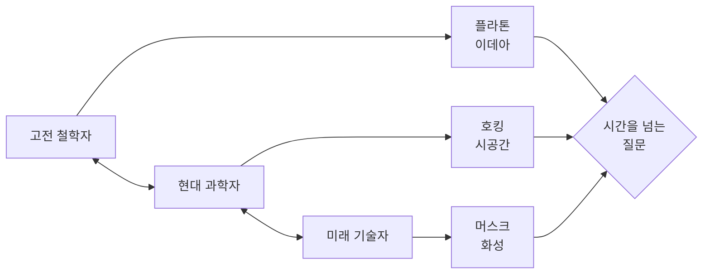

**주제: "인간이란 무엇인가"**
| 시대 | 책 | 답변 |
|------|-----|------|
| 고대 | 소피의 세계 | 이성적 동물 |
| 근대 | 순수이성비판 | 경험을 인식하는 주체 |
| 현대 | 사피엔스 | 허구를 믿는 동물 |
| 미래 | 호모 데우스 | 신이 되려는 존재 |

---

### 프로젝트 C: 현실 문제 해결 (캡스톤)

**6개월 프로젝트**
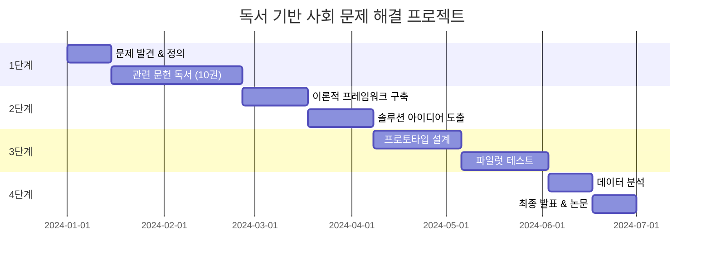

**프로젝트 예시**
```
문제: 청소년 정치 무관심

독서 리스트:
1. 사회계약론 (정치 참여의 철학)
2. 군중심리 (집단 동원 메커니즘)
3. 넛지 (행동 변화 설계)
4. 정의란 무엇인가 (공정성 인식)
5. 동물농장 (권력 비판 의식)

솔루션:
- 게이미피케이션 정치 교육 앱
- 넛지 기반 투표 참여 캠페인
- 학교 모의 민주주의 시스템

실행:
- 학교 시범 운영 (3개월)
- 참여율, 만족도 측정
- 개선안 도출
```

---

## 📖 학년별 심화 전략

```mermaid
journey
    title 고등학생 지적 성장 여정
    section 고1: 학문의 맛보기
      다양한 분야 탐색: 5
      사고 체계 구축: 4
      독서 습관 확립: 5
    section 고2: 융합의 시작
      학제간 연결: 5
      프로젝트 수행: 4
      비판적 글쓰기: 4
    section 고3: 통합과 완성
      전공 방향 정립: 5
      대학 수준 사고: 5
      연구 프로젝트: 5
```

### 🟢 고1: 지적 호기심 폭발

**목표**: 넓게 읽고, 깊게 생각하기

**독서 전략**
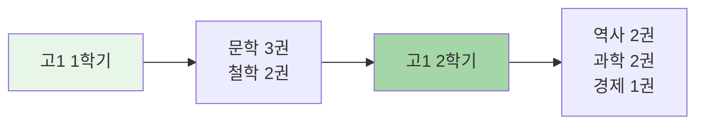

**활동**
- 📝 독서 일기 (주 1회)
- 💬 독서 모임 (월 2회)
- 🎤 짧은 발표 (학기당 3회)

---

### 🟡 고2: 융합적 사고력

**목표**: 연결하고, 융합하고, 창조하기

**융합 독서법**
```
동시에 3권 읽기

예:
- 월화: 노인과 바다 (문학)
- 수목: 설득의 심리학 (심리)
- 금토: 블루오션 전략 (경영)
- 일: 3권 연결 노트 작성

→ "끈기와 전략의 심리학" 에세이
```

**활동**
- 📚 융합 에세이 (월 1편)
- 🔬 미니 프로젝트 (학기당 2개)
- 📊 연구 발표 (학기당 1회)

---

### 🔴 고3: 독립적 탐구

**목표**: 자기만의 질문, 자기만의 답

**심화 연구 프로젝트**
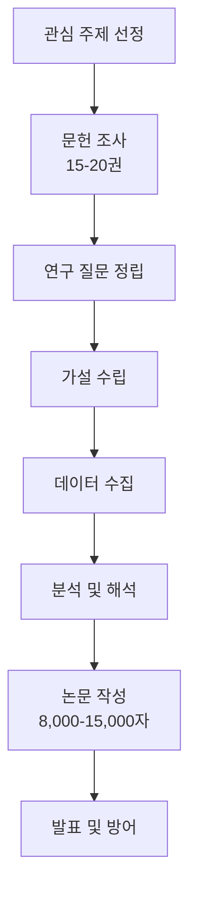

**활동**
- 📄 연구 논문 (1편)
- 🎓 대학 특강 참여
- 📚 전공 서적 읽기
- 🌐 온라인 강의 수강

---

## 🎨 고급 독서 사고 기법

### 1. 제텔카스텐 (Zettelkasten) 시스템

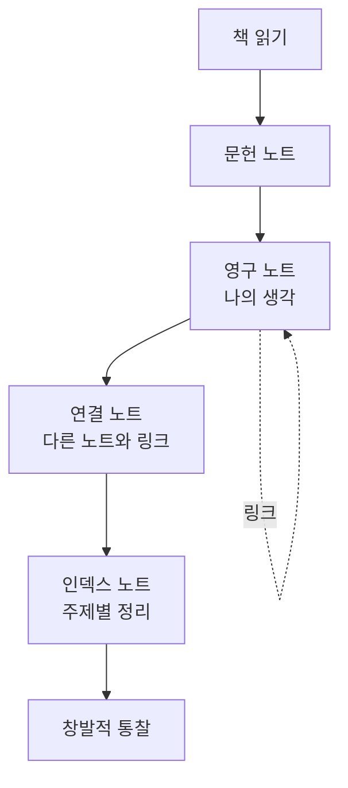

**실제 적용**
```
노트 1: [[이방인]]의 부조리 개념
  → 의미 없는 세계 vs 의미 추구하는 인간
  
노트 2: [[참을수없는존재]]의 가벼움
  → 의미 없음 = 자유? 두려움?
  
노트 3: 부조리와 가벼움의 관계 (융합)
  → 의미 없음을 인정하는 두 가지 태도
  → 카뮈: 반항하며 살기
  → 쿤데라: 가벼움을 견디기
  
→ 새로운 에세이 주제 발견!
```

---

### 2. 개념 네트워크 구축

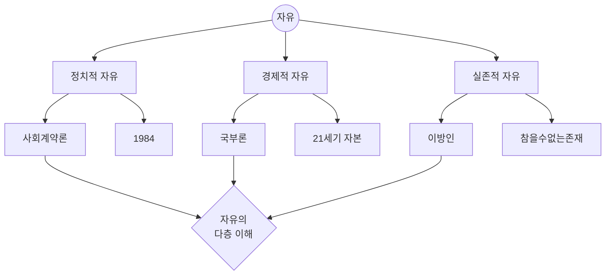

---

### 3. 시대별 관점 비교

**주제: "정의란 무엇인가"**

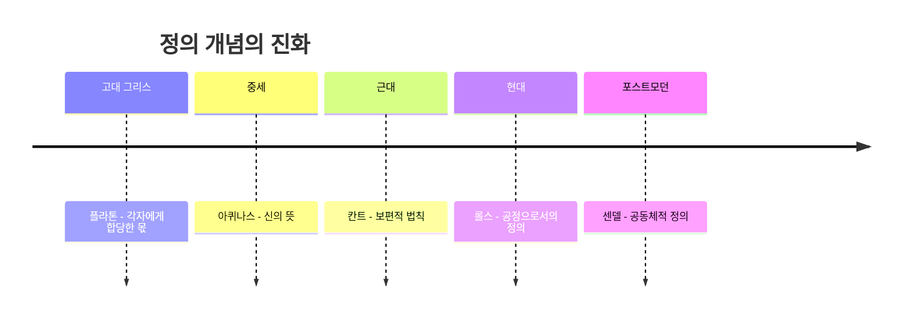

---

### 4. 대립 개념 변증법

```
테제: 이방인 (부조리)
  → 세계는 의미 없다
  
안티테제: 연금술사 (운명)
  → 우주가 도와준다
  
진테제: 융합 통찰
  → 의미는 만들어가는 것
  → 부조리 인정 + 의미 창조
```

---

## 📚 추가 필독서 (21-30권) - 전문성 심화

### 🌍 현대 사회/글로벌 (4권)

**21. 21세기를 위한 21가지 제언** - 유발 하라리
- **주제**: 현대 이슈, 미래 과제
- **핵심 통찰**: "기술, 정치, 종교가 만드는 21세기 도전"
- **기획력 연결**: 미래 전망, 사회 문제 해결

**22. 호모 데우스** - 유발 하라리
- **주제**: 미래 인류, 기술과 인간
- **핵심 통찰**: "인간은 신이 되려 한다"
- **기획력 연결**: 미래 시나리오, 기술 영향 분석

**23. 맥베스** - 윌리엄 셰익스피어
- **주제**: 권력, 야망, 비극
- **핵심 통찰**: "권력 욕망이 가져오는 파멸"
- **기획력 연결**: 권력 구조, 의사결정의 결과

**24. 햄릿** - 윌리엄 셰익스피어
- **주제**: 복수, 고뇌, 선택
- **핵심 통찰**: "죽느냐 사느냐, 그것이 문제로다"
- **기획력 연결**: 의사결정, 윤리적 딜레마

---

### 💼 리더십/경영 (3권)

**25. 넛지** - 리처드 탈러
- **주제**: 행동경제학, 선택 설계
- **핵심 통찰**: "작은 개입이 큰 변화를 만든다"
- **기획력 연결**: 행동 설계, UX 디자인

**26. 팀 오브 팀** - 스탠리 맥크리스탈
- **주제**: 조직 혁신, 적응
- **핵심 통찰**: "복잡한 세상에는 새로운 조직이 필요하다"
- **기획력 연결**: 조직 설계, 민첩성

**27. 오리지널스** - 애덤 그랜트
- **주제**: 창의성, 비순응
- **핵심 통찰**: "독창성은 만들어지는 것"
- **기획력 연결**: 혁신 전략, 창의적 문화

---

### 🎨 예술/창작 (2권)

**28. 백년의 고독** - 가브리엘 가르시아 마르케스
- **주제**: 마법적 리얼리즘, 역사의 순환
- **핵심 통찰**: "역사는 반복되고, 고독은 대물림된다"
- **기획력 연결**: 서사 구조, 상징 활용

**29. 예술의 위로** - 알랭 드 보통
- **주제**: 예술, 삶, 치유
- **핵심 통찰**: "예술은 우리의 문제를 위로한다"
- **기획력 연결**: 감성 디자인, 스토리텔링

---

### 💻 기술/미래 (1권)

**30. 사이버네틱스** - 노버트 위너
- **주제**: 정보, 통신, 제어
- **핵심 통찰**: "인간과 기계의 통신"
- **기획력 연결**: 시스템 설계, 피드백 루프

---

## 💡 진로별 맞춤 독서

### 인문계열

```mermaid
graph LR
    A[필수] --> A1[소피의 세계<br/>정의란 무엇인가<br/>사피엔스]
    B[심화] --> B1[순수이성비판<br/>존재와 시간<br/>역사란 무엇인가]
    C[융합] --> C1[생각에 관한 생각<br/>설득의 심리학]
```

**프로젝트**: 철학 에세이 경진대회, 인문학 세미나 기획

---

### 사회계열

```mermaid
graph LR
    A[필수] --> A1[국부론<br/>21세기 자본<br/>문명의 충돌]
    B[심화] --> B1[자본론<br/>사회계약론]
    C[융합] --> C1[괴짜경제학<br/>넛지<br/>군중심리]
```

**프로젝트**: 사회 문제 리서치, 정책 제안서

---

### 경영/경제

```mermaid
graph LR
    A[필수] --> A1[국부론<br/>블루오션 전략<br/>린 스타트업]
    B[심화] --> B1[경쟁 전략<br/>좋은 기업]
    C[융합] --> C1[설득의 심리학<br/>권력의 법칙]
```

**프로젝트**: 창업 아이디어, 비즈니스 플랜

---

### 이공계열

```mermaid
graph LR
    A[필수] --> A1[코스모스<br/>이중나선<br/>엔트로피]
    B[심화] --> B1[빅뱅 우주론<br/>다윈의 위험한 생각]
    C[융합] --> C1[생각의 탄생<br/>사피엔스]
```

**프로젝트**: 과학 실험, 연구 논문

---

### 예체능계열

```mermaid
graph LR
    A[필수] --> A1[생각의 탄생<br/>백년의 고독<br/>오리지널스]
    B[심화] --> B1[예술 철학서<br/>창작론]
    C[융합] --> C1[설득의 심리학<br/>블루오션 전략]
```

**프로젝트**: 창작 포트폴리오, 전시/공연 기획

---

## 🌟 최종 목표: 독립적 사고자

```mermaid
graph TD
    A[고등학교 입학] --> B[다양한 분야 탐색]
    B --> C[자신의 관심사 발견]
    C --> D[깊이 있는 독서]
    D --> E[비판적 사고 발달]
    E --> F[융합적 통찰]
    F --> G[독립적 프로젝트]
    G --> H[자기만의 세계관]
    
    H --> I[대학: 전문성]
    H --> J[사회: 실천력]
    
    style H fill:#4caf50,color:#fff
```

---

**마지막 조언** 🚀

고등학교는 **지적 독립**을 완성하는 시기입니다.

### ⭐ 핵심 원칙

**1. 한 권은 10가지 렌즈 + 다층 분석**
```
❌ 책 1권 → 내용 이해
✅ 책 1권 → 10가지 렌즈 → 다층 분석 → 비판적 통찰
```

**2. 여러 권은 학제간 융합으로**
```
❌ 책 7권 → 개별적으로 읽기
✅ 책 7권 → 다학제 융합 → 통합 프레임워크 → 독립적 사고
```

**3. 주제별 연구 프로젝트로**
```
❌ 독후감 or 서평
✅ 주제별 5-7권 융합 → 16주 연구 프로젝트
   (논문, 컨설팅, 창업 기획, 실험 등)
```

### 💡 미네르바 스쿨이 추구하는 것

> "독립적으로 생각하고, 창의적으로 문제를 해결하며,  
> 효과적으로 소통하고, 협력적으로 실천하는 인재"

### 실천 가이드

1. 📚 **비판적 수용**: 모든 책을 의심하고 검증하라
2. 🔍 **다층 분석**: 표면 → 중층 → 심층까지 파고들라
3. 🔗 **학제간 융합**: 경계를 넘나들며 통합하라
4. 🎯 **실천적 통찰**: 아는 것을 연구와 실천으로 옮겨라

책을 읽되, **책에 갇히지 말고**  
생각하되, **생각에 머물지 말고**  
연구하고 행동하라! 💪✨

📚 → 🔍 (10가지 렌즈 + 다층) → 🔗 (5-7권 융합) → 📝 (16주 연구)

대학은 이미 끝난 배움이 아니라, 새로운 시작입니다.
