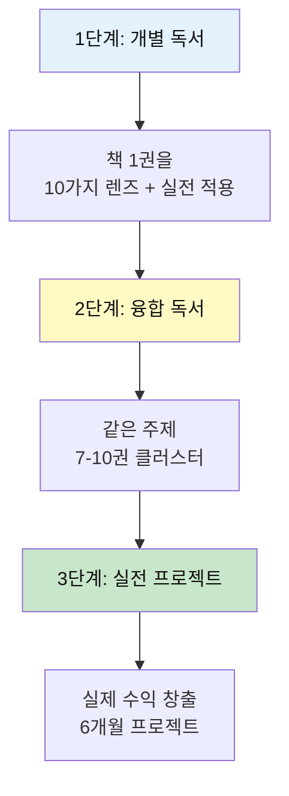

# 대학생 필독서 가이드

> **목적**: 전문성 구축, 실전 기획력, 독창적 통찰력, 리더십 완성  
> **접근법**: 5대 주제 중심 전문성 심화 + 실전 창업
> 
> **핵심 원칙**: 📚 한 권은 10가지 렌즈로 → 🔗 같은 주제 7-10권 융합 → 🚀 실제 창업!

---

## 🎯 5대 주제 독서 시스템



### 5대 주제와 대학생

| 주제 | 권수 | 핵심 질문 | 프로젝트 예시 |
|------|------|-----------|--------------|
| 💗 **감정** | 4권 (13%) | 사용자 경험과 행동 설계는? | UX 최적화 제품 |
| 💰 **돈** | 8권 (27%) | 수익 모델과 성장 전략은? | 실제 창업 (PMF 달성) |
| 🤝 **만남** | 5권 (17%) | 팀과 조직 운영은? | 커뮤니티 플랫폼 구축 |
| 🧘 **성찰** | 8권 (27%) | 시스템과 습관은? | 개인 성장 시스템 |
| 🎮 **여가** | 5권 (17%) | 창의적 산업은? | 콘텐츠 사업 |

**대학생 특징**: 돈·성찰 최고 (실행력 + 전문성 + 철학)

---

## 📚 난이도별 & 시기별 분류

### 🟢 1학년: 대학 생활 적응 & 기초 확립

#### 📖 자기계발/대학 생활
1. **최고의 공부** - 켄 베인
   - **주제**: 학습법, 사고법, 성장
   - **배울 수 있는 역량**: 효과적 학습 전략, 깊이 있는 사고
   - **통찰 포인트**: 최고의 학생들은 어떻게 배우는가
   - **기획력 연결**: 학습 설계, 자기 주도 학습 시스템

2. **대학의 가장 완벽한 순간** - 오노 가즈모토
   - **주제**: 대학 생활, 자아 탐색
   - **배울 수 있는 역량**: 대학 활용법, 경험 설계
   - **통찰 포인트**: 대학은 자신을 발견하는 시간
   - **기획력 연결**: 경험 디자인, 커리어 포트폴리오

3. **어떻게 원하는 것을 얻는가** - 스튜어트 다이아몬드
   - **주제**: 협상, 커뮤니케이션
   - **배울 수 있는 역량**: 협상 기술, 인간관계
   - **통찰 포인트**: 모든 것은 협상이다
   - **기획력 연결**: 이해관계자 관리, Win-Win 전략

#### 🧠 사고력/철학
4. **총, 균, 쇠** (재독/심화) - 재러드 다이아몬드
   - **주제**: 문명사, 환경 결정론
   - **배울 수 있는 역량**: 거시적 분석, 구조적 사고
   - **통찰 포인트**: 환경이 역사를 만든다 (대학 수준 재해석)
   - **기획력 연결**: 외부 환경 분석, 제약 조건 활용

5. **생각의 탄생** - 미셸 루트번스타인
   - **주제**: 창의성, 천재들의 사고법
   - **배울 수 있는 역량**: 13가지 사고 도구, 창의적 문제 해결
   - **통찰 포인트**: 창의성은 학습 가능하다
   - **기획력 연결**: 아이디어 발상, 융합적 사고

#### 💼 커리어/미래
6. **호모 데우스** - 유발 하라리
   - **주제**: 미래 사회, 기술과 인간
   - **배울 수 있는 역량**: 미래 예측, 변화 대응
   - **통찰 포인트**: 인간은 신이 되려 한다
   - **기획력 연결**: 미래 시나리오, 신기술 활용

---

### 🟡 2학년: 전공 심화 & 실전 준비

#### 📖 전문 지식 (분야별)

##### 💼 경영/창업
7. **린 스타트업** - 에릭 리스
   - **주제**: 스타트업, 애자일, 실험
   - **배울 수 있는 역량**: MVP 개발, 빠른 검증
   - **통찰 포인트**: Build-Measure-Learn 사이클
   - **기획력 연결**: 제품 개발, 시장 검증, 피벗 전략

8. **제로 투 원** - 피터 틸
   - **주제**: 스타트업, 혁신, 독점
   - **배울 수 있는 역량**: 독창성, 경쟁 회피 전략
   - **통찰 포인트**: 0에서 1을 만드는 것이 진정한 혁신
   - **기획력 연결**: 독점 시장 창출, 차별화 전략

9. **하드씽** - 벤 호로위츠
   - **주제**: 경영 현실, 어려운 결정
   - **배울 수 있는 역량**: 위기 관리, 리더십
   - **통찰 포인트**: 쉬운 것은 없다 - 현실적 경영
   - **기획력 연결**: 리스크 관리, 최악 시나리오 대비

##### 🎨 디자인/UX
10. **디자인에 집중하라** - 도널드 노먼
    - **주제**: 사용자 중심 디자인, UX
    - **배울 수 있는 역량**: 인간 중심 설계, 어포던스
    - **통찰 포인트**: 좋은 디자인은 보이지 않는다
    - **기획력 연결**: UX 기획, 사용성 테스트

11. **인사이트** - 김종훈
    - **주제**: 기획, 통찰, 문제 발견
    - **배울 수 있는 역량**: 본질 파악, 문제 재정의
    - **통찰 포인트**: 좋은 질문이 좋은 답을 만든다
    - **기획력 연결**: 문제 정의, 인사이트 도출

##### 📊 데이터/분석
12. **빅데이터가 만드는 세상** - 빅터 마이어 쇤베르거
    - **주제**: 빅데이터, 데이터 과학
    - **배울 수 있는 역량**: 데이터 사고, 예측 분석
    - **통찰 포인트**: 데이터는 21세기 석유
    - **기획력 연결**: 데이터 기반 의사결정, 지표 설정

13. **신호와 소음** - 네이트 실버
    - **주제**: 예측, 통계, 불확실성
    - **배울 수 있는 역량**: 확률적 사고, 예측 모델
    - **통찰 포인트**: 신호를 소음에서 구분하라
    - **기획력 연결**: 트렌드 분석, 예측 모델링

##### 💻 기술/프로그래밍
14. **클린 코드** - 로버트 마틴
    - **주제**: 프로그래밍, 코드 품질
    - **배울 수 있는 역량**: 좋은 코드 작성, 리팩토링
    - **통찰 포인트**: 읽기 좋은 코드가 좋은 코드
    - **기획력 연결**: 시스템 설계, 유지보수성

15. **실리콘밸리의 팀장들** - 킴 스콧
    - **주제**: 관리, 피드백, 팀 빌딩
    - **배울 수 있는 역량**: 팀 리딩, 효과적 피드백
    - **통찰 포인트**: Radical Candor - 직접적이면서 배려하기
    - **기획력 연결**: 팀 관리, 프로젝트 매니지먼트

##### 🎯 마케팅/브랜딩
16. **포지셔닝** - 알 리스, 잭 트라우트
    - **주제**: 브랜딩, 마케팅 전략
    - **배울 수 있는 역량**: 포지셔닝, 차별화
    - **통찰 포인트**: 시장이 아닌 마음속을 차지하라
    - **기획력 연결**: 브랜드 전략, 시장 포지셔닝

17. **보랏빛 소가 온다** - 세스 고딘
    - **주제**: 마케팅, 주목성
    - **배울 수 있는 역량**: 돋보이는 제품 만들기
    - **통찰 포인트**: 평범한 것은 무시당한다
    - **기획력 연결**: 차별화 포인트, 바이럴 전략

#### 🌍 사회/트렌드
18. **90년생이 온다** - 임홍택
    - **주제**: 세대론, 소비 트렌드
    - **배울 수 있는 역량**: 세대 이해, 트렌드 파악
    - **통찰 포인트**: 세대는 다른 가치관을 가진다
    - **기획력 연결**: 타겟 분석, 세대별 전략

19. **트렌드 코리아 20XX** - 김난도 외
    - **주제**: 연간 트렌드, 소비 문화
    - **배울 수 있는 역량**: 트렌드 읽기, 예측
    - **통찰 포인트**: 작은 변화가 큰 트렌드로
    - **기획력 연결**: 시장 조사, 타이밍 전략

---

### 🔴 3-4학년: 전문성 완성 & 실전 투입

#### 📖 전문 심화 (진로별)

##### 💼 경영/전략 (심화)
20. **경쟁 전략** - 마이클 포터
    - **주제**: 경영 전략, 경쟁 우위
    - **배울 수 있는 역량**: 5 Forces 분석, 가치사슬
    - **통찰 포인트**: 경쟁 우위의 원천을 찾아라
    - **기획력 연결**: 산업 분석, 경쟁 전략 수립

21. **OKR** - 존 도어
    - **주제**: 목표 관리, 조직 운영
    - **배울 수 있는 역량**: 목표 설정, 성과 관리
    - **통찰 포인트**: 측정할 수 없으면 관리할 수 없다
    - **기획력 연결**: KPI 설정, 성과 측정

22. **플랫폼 레볼루션** - 제프리 파커 외
    - **주제**: 플랫폼 비즈니스, 네트워크 효과
    - **배울 수 있는 역량**: 플랫폼 설계, 양면 시장
    - **통찰 포인트**: 21세기는 플랫폼의 시대
    - **기획력 연결**: 플랫폼 기획, 성장 전략

##### 🎨 디자인/혁신 (심화)
23. **디자인 씽킹** - 팀 브라운
    - **주제**: 디자인 사고, 혁신 프로세스
    - **배울 수 있는 역량**: 인간 중심 혁신, 프로토타이핑
    - **통찰 포인트**: 공감-정의-아이디어-프로토타입-테스트
    - **기획력 연결**: 혁신 프로세스, 사용자 리서치

24. **훅** - 니르 이얄
    - **주제**: 습관 형성, 제품 설계
    - **배울 수 있는 역량**: 중독성 제품 설계, 행동 디자인
    - **통찰 포인트**: 트리거-행동-보상-투자 사이클
    - **기획력 연결**: 사용자 리텐션, 습관 설계

##### 📊 데이터/AI (심화)
25. **마스터 알고리즘** - 페드로 도밍고스
    - **주제**: 머신러닝, AI
    - **배울 수 있는 역량**: AI 원리, 알고리즘 이해
    - **통찰 포인트**: 모든 것을 학습하는 궁극의 알고리즘
    - **기획력 연결**: AI 활용, 자동화 전략

26. **데이터 과학 입문** - 조엘 그루스
    - **주제**: 데이터 분석, 파이썬
    - **배울 수 있는 역량**: 실전 데이터 분석, 코딩
    - **통찰 포인트**: 데이터로 말하게 하라
    - **기획력 연결**: 데이터 분석 기획, 인사이트 도출

##### 🎯 마케팅/성장 (심화)
27. **그로스 해킹** - 숀 엘리스, 모건 브라운
    - **주제**: 성장 전략, 실험 문화
    - **배울 수 있는 역량**: 빠른 성장, AARRR 지표
    - **통찰 포인트**: 제품이 마케팅이다
    - **기획력 연결**: 성장 실험, 바이럴 루프 설계

28. **컨테이져스** - 조나 버거
    - **주제**: 바이럴, 입소문
    - **배울 수 있는 역량**: 전파 메커니즘, STEPPS 프레임워크
    - **통찰 포인트**: 입소문은 우연이 아니다
    - **기획력 연결**: 바이럴 전략, 공유 유도

##### 💡 리더십/조직 (심화)
29. **팀 오브 팀** - 스탠리 맥크리스탈
    - **주제**: 조직 혁신, 협업
    - **배울 수 있는 역량**: 복잡계 조직 관리, 정보 공유
    - **통찰 포인트**: 예측 불가능한 시대의 조직 운영
    - **기획력 연결**: 조직 설계, 협업 시스템

30. **멀티플라이어** - 리즈 와이즈먼
    - **주제**: 리더십, 팀 역량 배가
    - **배울 수 있는 역량**: 구성원 역량 극대화
    - **통찰 포인트**: 최고의 리더는 팀을 2배 강하게 만든다
    - **기획력 연결**: 팀 빌딩, 권한 위임

#### 🌍 글로벌/미래
31. **21세기를 위한 21가지 제언** - 유발 하라리
    - **주제**: 현대 이슈, 미래 과제
    - **배울 수 있는 역량**: 거시적 관점, 문제 인식
    - **통찰 포인트**: 21세기가 직면한 도전들
    - **기획력 연결**: 사회 문제 해결, 소셜 벤처

32. **팩트풀니스** - 한스 로슬링
    - **주제**: 편견, 사실, 데이터
    - **배울 수 있는 역량**: 객관적 사고, 인지 편향 극복
    - **통찰 포인트**: 세상은 생각보다 나아지고 있다
    - **기획력 연결**: 객관적 분석, 데이터 해석

---

## 🎯 전공/진로별 추천 로드맵

### 💼 경영/경제/창업
```
1학년: 린 스타트업 → 제로 투 원 → 블루오션 전략
2학년: 경쟁 전략 → 플랫폼 레볼루션 → 그로스 해킹
3학년: OKR → 하드씽 → 좋은 기업을 넘어 위대한 기업으로
4학년: 실전 창업 or 취업 준비 + 케이스 스터디
```
**핵심 역량**: 전략 수립, 비즈니스 모델, 성장 전략

---

### 🎨 디자인/기획/UX
```
1학년: 인사이트 → 디자인에 집중하라 → 생각의 탄생
2학년: 디자인 씽킹 → 훅 → 넛지
3학년: 사용자 리서치 → 프로토타이핑 → 사용성 테스트
4학년: 포트폴리오 프로젝트 + 실무 인턴십
```
**핵심 역량**: 사용자 중심 설계, 프로토타이핑, 문제 해결

---

### 📊 데이터/AI/개발
```
1학년: 빅데이터가 만드는 세상 → 신호와 소음
2학년: 데이터 과학 입문 → 마스터 알고리즘 → 클린 코드
3학년: 실전 프로젝트 → 알고리즘 공부 → 캐글 참여
4학년: 논문 리딩 + 개인 프로젝트 + 오픈소스 기여
```
**핵심 역량**: 데이터 분석, 알고리즘, 문제 해결 코딩

---

### 🎯 마케팅/브랜딩/커뮤니케이션
```
1학년: 포지셔닝 → 보랏빛 소가 온다 → 설득의 심리학
2학년: 컨테이져스 → 그로스 해킹 → 트렌드 코리아
3학년: 실전 캠페인 기획 → SNS 마케팅 → 콘텐츠 제작
4학년: 포트폴리오 + 공모전 + 인턴십
```
**핵심 역량**: 브랜딩, 캠페인 기획, 바이럴 전략

---

### 💻 IT/스타트업/프로덕트 매니저
```
1학년: 린 스타트업 → 제로 투 원 → 클린 코드
2학년: 플랫폼 레볼루션 → 훅 → 그로스 해킹
3학년: 실리콘밸리의 팀장들 → OKR → 디자인 씽킹
4학년: 사이드 프로젝트 런칭 + 인턴십 + 네트워킹
```
**핵심 역량**: 제품 개발, 성장 전략, 팀 협업

---

### 🌍 사회혁신/소셜벤처/NGO
```
1학년: 사피엔스 → 21세기를 위한 21가지 제언 → 팩트풀니스
2학년: 제로 투 원 → 린 스타트업 → 디자인 씽킹
3학년: 사회 문제 리서치 → 솔루션 기획 → 파일럿 실행
4학년: 소셜 벤처 런칭 or 임팩트 조직 취업
```
**핵심 역량**: 사회 문제 해결, 임팩트 측정, 지속가능성

---

## 🔗 5대 주제별 융합 독서 프로젝트

### 💗 주제 1: 감정 - 사용자 경험과 행동 설계

**📚 융합 독서 리스트 (4권)**
1. 훅 - 습관 형성 메커니즘
2. 설득의 심리학 - 6가지 트리거
3. 디자인에 집중하라 - UX 디자인
4. 인사이트 - 본질 파악

**🔍 융합 분석**
```
공통 통찰:
1. 사용자 행동은 설계할 수 있다
2. 감정이 제품 성공을 결정한다
3. 본질을 파악해야 문제를 해결한다

다학제 통합:
• 행동심리: 습관 형성 (훅)
• 인지심리: 설득 메커니즘 (설득의심리학)
• 디자인: 사용자 중심 (디자인에집중하라)
• 기획: 본질 파악 (인사이트)
```

**🚀 통합 프로젝트: 습관 형성 앱 창업 (6개월)**
```
Month 1-2: 리서치 & 기획
• 4권 완독 + 실무서 10권
• 타깃 사용자 100명 인터뷰
• 고통 포인트 10개 발견
• PMF 가설 수립

• 4권의 통찰 통합 적용
  - 훅: 트리거-행동-보상-투자 사이클
  - 설득의심리학: 6가지 원칙 임베딩
  - 디자인: 직관적 UX/UI
  - 인사이트: 핵심 문제 재정의

Month 3-4: MVP 개발
• 프로토타입 (Figma)
• 개발 (직접 or 아웃소싱)
• 핵심 기능: 습관 트래킹 + 보상 + 커뮤니티
• 베타 런칭 (100명)

Month 5: 그로스
• AARRR 지표 설정
• 실험 10개 (A/B 테스트)
• 바이럴 루프 설계
• 사용자 1,000명 달성

Month 6: 수익화 & 투자 유치
• Freemium 모델 도입
• 월 수익 50만원 목표
• 피칭 덱 제작
• 엑셀러레이터/VC 피칭
• 사업자 등록
```

---

### 💰 주제 2: 돈 - 비즈니스 모델과 성장 전략

**📚 융합 독서 리스트 (8권)**
1. 린 스타트업 - 빠른 검증
2. 제로 투 원 - 독점 시장
3. 블루오션 전략 - 새 시장 창조
4. 경쟁 전략 - 경쟁 우위
5. 플랫폼 레볼루션 - 네트워크 효과
6. 그로스 해킹 - 성장 실험
7. OKR - 목표 관리
8. 하드씽 - 현실적 경영

**🔍 융합 분석**
```
공통 통찰:
1. 빠르게 검증하고 피벗하라
2. 독점 시장을 만들어라
3. 데이터로 성장을 실험하라
4. 실행이 전부다

전략 레이어:
• 시장 전략: 어디서 싸울 것인가 (블루오션, 경쟁전략, 제로투원)
• 제품 전략: 무엇을 만들 것인가 (린스타트업, 플랫폼레볼루션)
• 성장 전략: 어떻게 성장할 것인가 (그로스해킹, OKR)
• 경영 현실: 어려움을 어떻게 극복할 것인가 (하드씽)
```

**🚀 통합 프로젝트: SaaS 스타트업 창업 (6개월)**
```
Month 1: 시장 & 문제 발견
• 8권 완독 (주 2권)
• 시장 조사 (TAM, SAM, SOM)
• 5 Forces 분석
• 100개 아이디어 → 10개 → 1개

• 8권의 통찰 통합
  - 제로투원: 독점 가능한 니치 시장
  - 블루오션: 4가지 액션으로 차별화
  - 경쟁전략: 진입장벽 설계

Month 2-3: MVP 개발 & 검증
• 린스타트업: Build-Measure-Learn
• 랜딩 페이지 + 결제
• 10명 파일럿 고객
• 피벗 여부 결정

Month 4-5: 성장 실험
• 그로스해킹: AARRR 최적화
• OKR: 주간 목표 설정
• 플랫폼레볼루션: 네트워크 효과 설계
• 월 수익 200만원 목표

Month 6: 스케일 & 투자
• 하드씽: 어려운 결정들
• 팀 빌딩 (공동창업자, 직원)
• 시리즈 A 준비
• 연 매출 3,000만원 목표
```

---

### 🤝 주제 3: 만남 - 팀과 조직 운영

**📚 융합 독서 리스트 (5권)**
1. 실리콘밸리의 팀장들 - Radical Candor
2. 멀티플라이어 - 리더십 배가
3. OKR - 목표 정렬
4. 팀 오브 팀 - 네트워크 조직
5. 어떻게 원하는 것을 얻는가 - 협상

**🔍 융합 분석**
```
공통 통찰:
1. 최고의 리더는 팀을 강하게 만든다
2. 투명한 소통이 조직을 강하게 한다
3. 목표 정렬이 성과를 만든다

조직 레벨:
• 개인: 1:1 관리 (실리콘밸리의팀장들)
• 팀: 임파워먼트 (멀티플라이어)
• 조직: 목표 정렬 (OKR)
• 네트워크: 적응형 구조 (팀오브팀)
• 외부: 협상 (어떻게원하는것을얻는가)
```

**🚀 통합 프로젝트: 커뮤니티 플랫폼 구축 (6개월)**
```
Month 1-2: 커뮤니티 기획
• 5권 완독
• 타깃: 대학생 창업가 커뮤니티
• 핵심 가치: 지식 공유 + 협업 + 네트워킹

• 5권의 통찰 적용
  - 실리콘밸리: 피드백 문화 설계
  - 멀티플라이어: 임파워먼트 시스템
  - OKR: 커뮤니티 목표 정렬
  - 팀오브팀: 분산된 운영진 구조

Month 3-4: 커뮤니티 런칭
• 초기 100명 확보 (공동창업자, 친구)
• 주간 온라인 모임
• 월간 오프라인 밋업
• Slack/Discord 운영

Month 5-6: 확장 & 수익화
• 1,000명 목표
• 프리미엄 멤버십 (월 10만원)
• 기업 스폰서십
• 컨퍼런스 개최 (300명)
```

---

### 🧘 주제 4: 성찰 - 개인 성장 시스템

**📚 융합 독서 리스트 (8권)**
1. 7가지 습관 - 원칙 중심
2. 아토믹 해빗 - 1% 개선
3. Deep Work - 몰입
4. 호모 데우스 - 미래 인간
5. 생각의 탄생 - 창의적 사고
6. 팩트풀니스 - 객관적 사고
7. 21세기를 위한 21가지 제언 - 현대 이슈
8. 총균쇠 (재독) - 구조적 사고

**🔍 융합 분석**
```
공통 통찰:
1. 시스템이 의지보다 강하다
2. 작은 습관이 복리로 쌓인다
3. 깊은 사고가 가치를 만든다

성장 레벨:
• 습관: 일상 시스템 (7가지습관, 아토믹해빗)
• 집중: 깊은 작업 (Deep Work)
• 사고: 창의성 & 객관성 (생각의탄생, 팩트풀니스)
• 통찰: 거시적 관점 (호모데우스, 21세기, 총균쇠)
```

**🚀 통합 프로젝트: 개인 성장 시스템 + 코칭 사업 (6개월)**
```
Month 1-2: 자기 실험
• 8권 완독 + 적용
• 나만의 성장 시스템 설계

• 8권의 통찰 통합
  - 7가지습관: 주도성, 목표, 우선순위
  - 아토믹해빗: 습관 스택, 환경 설계
  - Deep Work: 시간 블록킹, 디지털 미니멀리즘
  - 생각의탄생: 13가지 사고 도구

• 3개월 자기 실험
  - 매일 기록
  - 생산성 3배 목표

Month 3-4: 시스템 문서화
• 성장 시스템 매뉴얼 (100페이지)
• 워크북 제작
• 온라인 강의 (20강)

Month 5-6: 코칭 사업 런칭
• 1:1 코칭 (10명, 월 50만원)
• 그룹 코칭 (30명, 월 20만원)
• 온라인 강의 판매
• 월 수익 300만원 목표
```

---

### 🎮 주제 5: 여가 - 창의적 콘텐츠 산업

**📚 융합 독서 리스트 (5권)**
1. 디자인 씽킹 - 창작 프로세스
2. 오리지널스 - 독창성
3. 창의성의 기원 - 창의적 사고
4. 컨테이져스 - 바이럴
5. 그로스 해킹 (재독) - 콘텐츠 성장

**🔍 융합 분석**
```
공통 통찰:
1. 창의성은 프로세스다
2. 독창성은 용기가 필요하다
3. 전파는 설계할 수 있다

콘텐츠 레벨:
• 창작: 아이디어 → 작품 (디자인씽킹, 오리지널스)
• 차별화: 독특한 관점 (창의성의기원)
• 확산: 바이럴 메커니즘 (컨테이져스, 그로스해킹)
```

**🚀 통합 프로젝트: 크리에이터 비즈니스 (6개월)**
```
Month 1-2: 콘텐츠 기획
• 5권 완독
• 장르 선택 (유튜브/인스타/틱톡/블로그)
• 니치 시장 발견
• 콘텐츠 전략 수립

• 5권의 통찰 적용
  - 디자인씽킹: 공감-정의-아이디어-프로토타입
  - 오리지널스: 독특한 관점 발견
  - 창의성의기원: 창의적 루틴 구축
  - 컨테이져스: STEPPS 프레임워크

Month 3-4: 콘텐츠 제작 & 런칭
• 주 3회 업로드 (총 24개)
• 품질 vs 양: 균형 찾기
• 피드백 반영

Month 5-6: 성장 & 수익화
• 그로스해킹: 구독자 1만명 목표
• 수익화: 광고, 후원, 제품 판매
• 브랜드 협찬 유치
• 월 수익 100만원 목표
```

---

## 🌈 융합 메가 프로젝트 (5대 주제 통합)

### 프로젝트: 소셜 벤처 창업 (6개월 → 지속)

**5대 주제 통합 접근**
```
💗 감정: 사회적 고통 공감 (사용자 이해)
💰 돈: 지속가능한 비즈니스 모델 (수익 구조)
🤝 만남: 팀 빌딩 & 파트너십 (조직 운영)
🧘 성찰: 사회적 미션과 가치 (철학)
🎮 여가: 창의적 솔루션 (혁신)
```

**Phase 1 (Month 1-2): 문제 & 기회 발견**
```
30권의 통찰 활용:
• 💗 감정 4권: 사용자 페인 포인트
• 💰 돈 8권: 시장 분석 & 전략
• 🤝 만남 5권: 이해관계자 분석
• 🧘 성찰 8권: 사회적 가치 정의
• 🎮 여가 5권: 창의적 아이디어

구체적 활동:
• 사회 문제 10개 리스트
• 각 문제당 50명 인터뷰
• 5대 영역 통합 분석
• 최종 문제 선정
```

**Phase 2 (Month 3-4): 솔루션 & MVP**
```
30권의 실행 프레임워크:
• 린스타트업: 빠른 검증
• 디자인씽킹: 공감 기반 설계
• 블루오션: 새로운 접근
• 훅: 행동 설계
• OKR: 목표 설정

MVP 개발:
• 2주 스프린트
• 베타 사용자 100명
• 임팩트 측정 지표
```

**Phase 3 (Month 5-6): 스케일 & 임팩트**
```
성장 전략:
• 그로스해킹: 사용자 1만명
• 플랫폼레볼루션: 네트워크 효과
• 팀 오브 팀: 조직 확장

수익화:
• 사회적 기업 인증
• 정부 지원금
• 임팩트 투자 유치
• 연 매출 1억 목표

임팩트 측정:
• 정량: 수혜자 수, 비용 절감
• 정성: 삶의 질 개선
• SROI 계산
```

**지속 성장 (Month 7+):**
- 팀 확장 (10명)
- 전국 확산
- 해외 진출 검토
- 소셜 임팩트 보고서

---

## 🎨 대학생 실전 독서 프로젝트

### 프로젝트 1: 창업 부트캠프 (6개월)
**목표**: 책으로 배우고 실전으로 검증하는 린 스타트업

**독서 리스트**:
- 1주차: 『린 스타트업』
- 2주차: 『제로 투 원』
- 3주차: 『블루오션 전략』
- 4주차: 『디자인 씽킹』
- 5-6주차: 『그로스 해킹』

**실전 과제**:
- Week 1-2: 문제 발견 및 고객 인터뷰 (30명)
- Week 3-4: 솔루션 아이디어 및 MVP 설계
- Week 5-8: MVP 개발 (노코드 도구 활용)
- Week 9-12: 베타 테스트 (100명)
- Week 13-16: 피벗 or 스케일업 결정
- Week 17-24: 성장 실험 및 PMF 찾기

**결과물**:
- 실제 런칭된 제품/서비스
- 사용자 피드백 데이터
- 피칭 덱
- 창업 경진대회 출전

---

### 프로젝트 2: 기업 컨설팅 프로젝트
**목표**: 실제 기업의 문제를 해결하는 전략 컨설팅

**독서 리스트**:
- 『경쟁 전략』 - 산업 분석
- 『OKR』 - 목표 수립
- 『그로스 해킹』 - 성장 전략
- 『팩트풀니스』 - 데이터 분석
- 해당 산업 전문 서적 3-5권

**프로세스**:
1. **클라이언트 선정**: 지역 소상공인, 스타트업, NGO
2. **현황 분석**: 3C, SWOT, 5 Forces
3. **문제 정의**: 핵심 이슈 파악
4. **솔루션 도출**: 3가지 전략 옵션
5. **실행 계획**: 로드맵 및 KPI
6. **발표 및 피드백**: 경영진 대상 프레젠테이션

**결과물**:
- 전략 보고서 (50-100 페이지)
- 프레젠테이션 (30-40 슬라이드)
- 실행 가이드
- 추천서 (포트폴리오용)

---

### 프로젝트 3: 논문 수준 리서치
**목표**: 학술적 깊이의 독서 기반 연구

**단계**:
1. **연구 주제 선정**: 관심 분야의 미해결 질문
2. **문헌 조사**: 관련 도서 20-30권, 논문 50-100편
3. **이론적 프레임워크**: 기존 이론 정리 및 통합
4. **데이터 수집**: 설문, 인터뷰, 실험 등
5. **분석**: 정량/정성 분석
6. **논문 작성**: 학술지 형식
7. **발표**: 학회 or 학내 세미나

**주제 예시**:
- "Z세대의 소비 패턴과 가치관 변화"
- "플랫폼 비즈니스의 네트워크 효과 분석"
- "디자인 씽킹이 기업 혁신에 미치는 영향"
- "그로스 해킹 기법의 효과성 실증 연구"

**결과물**:
- 학술 논문 (8,000-12,000 단어)
- 학회 발표
- 학술지 투고 (가능 시)

---

### 프로젝트 4: 책 쓰기 프로젝트
**목표**: 독서를 통한 지식을 체계화하여 책 집필

**과정**:
1. **주제 선정**: 전문성 + 대중성
2. **독서 마라톤**: 주제 관련 50-100권
3. **아웃라인**: 목차 및 구성
4. **초고**: 일일 1,000-2,000 단어
5. **편집**: 3-5회 전면 수정
6. **베타 리더**: 10-20명 피드백
7. **출판**: 자가출판 or 출판사 투고

**책 형식 옵션**:
- 📚 **실용서**: "대학생을 위한 XX 가이드"
- 📖 **에세이**: "나의 독서 여정"
- 📊 **분석서**: "XX 산업 분석 리포트"
- 💡 **자기계발**: "20대가 알아야 할 XX"

**결과물**:
- 완성된 원고 (5-10만 자)
- 전자책 or 종이책 출간
- 독서 이력서

---

### 프로젝트 5: 글로벌 챌린지
**목표**: 책으로 배운 것을 글로벌 무대에서 검증

**옵션**:
1. **해외 컨퍼런스 발표**
   - 독서 기반 리서치 → 영어 논문 → 해외 학회 발표
   
2. **국제 공모전 참가**
   - Hult Prize (소셜 벤처)
   - Imagine Cup (기술 혁신)
   - UN SDGs 공모전

3. **해외 인턴십/교환학생**
   - 해당 국가 문화/비즈니스 서적 20권 사전 독서
   - 현지에서 배운 것 블로그/유튜브 정리

4. **글로벌 네트워킹**
   - 책 저자에게 이메일 → 미팅 → 멘토링
   - 링크드인으로 해외 전문가 네트워킹

---

## 📝 대학생 독서 노트 시스템

### 전문가 수준 독서 노트

```markdown
# 📚 [책 제목] - 전문 분석 노트

## 📋 기본 정보
- **저자**: 
- **출판 연도**: 
- **카테고리**: 
- **읽은 기간**: 
- **재독 여부**: 

## 🎯 독서 목적
- [ ] 전공 지식 습득
- [ ] 프로젝트 적용
- [ ] 논문/리포트 작성
- [ ] 창업 아이디어
- [ ] 취업 준비
- [ ] 교양 확장

## 📊 책 구조 분석
```
Part 1: [제목]
  - Chapter 1: 핵심 내용
  - Chapter 2: 핵심 내용
Part 2: [제목]
  ...
```

## 💡 핵심 개념 (Top 10)
1. **개념명**: 설명 + 예시
2. **개념명**: 설명 + 예시
...

## 🔬 이론/프레임워크
### [프레임워크 이름]
- **정의**: 
- **구성 요소**: 
- **적용 방법**: 
- **한계점**: 

## 📈 데이터/사례 분석
- **사례 1**: 기업명, 상황, 적용, 결과
- **사례 2**: ...
- **패턴 발견**: 공통점과 차이점

## 🤔 비판적 분석
### 강점
- 
### 약점
- 
### 의문점
- 

### 반론/대안
- 

## 🔗 연결 (Inter-textual)
### 다른 책과의 관계
- **『책A』**: 공통점/차이점
- **『책B』**: 보완 관계

### 이론 간 충돌
- X이론 vs Y이론: 어떤 상황에서 어떤 것이 유효한가?

## 🎯 실전 적용
### 프로젝트 적용 아이디어
1. [프로젝트명]: 어떻게 적용할 것인가
2. ...

### 실험 설계
- **가설**: 
- **실험 방법**: 
- **측정 지표**: 
- **예상 결과**: 

## ✍️ 인용 (Academic)
> "직접 인용문" (저자, 연도, 페이지)

## 📝 요약 (Executive Summary)
[200-300 단어로 핵심 요약]

## 📚 참고문헌 (Further Reading)
- 이 책을 더 깊이 이해하기 위한 책
- 반대 관점의 책
- 최신 연구/논문

## ✅ 액션 아이템
- [ ] 단기 (이번 주)
- [ ] 중기 (이번 달)
- [ ] 장기 (이번 학기)

## 🌟 개인 평가
- **별점**: ⭐⭐⭐⭐⭐
- **추천 대상**: 
- **재독 가치**: 
- **한 줄 평**: 
```

---

### 제텔카스텐 (Zettelkasten) 대학생 버전

**디지털 도구**: Obsidian, Roam Research, Notion

**노트 유형**:
1. **문헌 노트** (Literature Note): 책 요약
2. **영구 노트** (Permanent Note): 나의 생각
3. **프로젝트 노트** (Project Note): 실전 적용
4. **인덱스 노트** (Index Note): 주제별 정리

**링크 전략**:
```
[[린 스타트업]] 
  ↓ 관련 개념
[[MVP]] ← → [[프로토타입]]
  ↓ 적용 사례
[[프로젝트A]] ← → [[프로젝트B]]
  ↓ 학습
[[실패 분석]] → [[개선 방향]]
```

---

## 🌟 독서 습관 & 시간 관리

### 학기 중 독서 루틴

#### 📅 주간 루틴
- **월**: 새 책 시작 (30분)
- **화/목**: 아침 독서 (30분) + 전공 서적
- **수/금**: 저녁 독서 (30분) + 실용서
- **토**: 집중 독서 (2-3시간) + 노트 정리
- **일**: 복습 및 적용 (1-2시간)

**주당 독서량**: 1-2권 (분량에 따라)

---

#### 📆 학기별 목표
- **학기 초 (3월/9월)**: 
  - 전공 기초서 2권
  - 교양서 1권
  
- **학기 중 (4-5월/10-11월)**:
  - 전공 심화서 3-4권
  - 프로젝트 관련서 2-3권
  
- **학기 말 (6월/12월)**:
  - 다음 학기 준비 독서
  - 방학 독서 리스트 작성

**학기당 목표**: 10-15권

---

#### 🏖️ 방학 집중 독서
- **1-2주차**: 밀린 책 정리, 재독
- **3-4주차**: 새 분야 탐험 (5-8권)
- **5-6주차**: 프로젝트 집중 독서
- **7-8주차**: 독서 노트 정리, 블로그 작성

**방학 목표**: 15-20권

---

### 독서와 학점 관리 균형

**우선순위 매트릭스**:
```
        중요함
          |
  학점 │ 독서(전공)
 ─────┼─────  → 긴급함
  취미 │ 독서(교양)
```

**전략**:
1. **전공 연계**: 과제/프로젝트와 독서 연결
2. **학점 기간**: 시험 2주 전부터 독서 감소
3. **방학 활용**: 학기 중 못한 독서를 방학에

---

## 💬 동기/선후배와 함께 읽기

### 독서 모임 운영

#### 📚 북클럽 구성
- **인원**: 5-8명 (토론 적정 규모)
- **주기**: 2주에 1번
- **장소**: 카페, 도서관 스터디룸
- **시간**: 2-3시간

#### 📋 진행 방식
1. **책 선정** (투표)
2. **개별 독서** (2주)
3. **발표자 순환** (매번 2명)
   - A: 책 요약 및 핵심 개념
   - B: 비판 및 적용 방안
4. **자유 토론** (1-1.5시간)
5. **액션 플랜** (함께 적용할 프로젝트)

---

### 학년별 북클럽 추천 주제

#### 1-2학년: 탐색 북클럽
- **주제**: 다양한 분야 경험
- **책**: 경영, 디자인, 기술, 마케팅 등 섞어서
- **목표**: 관심 분야 발견

#### 3-4학년: 전문 북클럽
- **주제**: 진로/전공 관련
- **책**: 심화 전문서
- **목표**: 전문성 구축

#### 창업 북클럽
- **주제**: 스타트업, 비즈니스
- **활동**: 독서 + 실제 사이드 프로젝트
- **목표**: 함께 창업하기

---

## 📚 추가 리소스

### 온라인 플랫폼
- **Coursera**: 저자 직강 온라인 강의
- **YouTube**: Book Summary 채널
- **Podcast**: 저자 인터뷰, 책 리뷰
- **Medium**: 전문가들의 서평 및 응용

### 오프라인 활동
- **저자 강연**: 교보문고, 예스24 문화센터
- **북 콘서트**: 대형 서점, 대학 행사
- **독서 토론회**: 지역 도서관, 독립 서점
- **컨퍼런스**: 관련 산업 컨퍼런스 참석

### 독서 지원
- **도서관**: 대학 도서관 희망 도서 신청
- **전자책**: 밀리의 서재, 리디북스 학생 할인
- **중고서점**: 알라딘, 예스24 중고샵
- **도서 지원**: 장학금, 독서 장려 프로그램

---

## 🎓 취업/진로 연계 독서 전략

### 이력서/자기소개서 활용

#### 독서 이력서 작성
```markdown
## 📚 독서 포트폴리오

### 전공 심화 (XX 권)
- 『경쟁 전략』: 마이클 포터의 5 Forces 분석법을 
  XX 프로젝트에 적용하여 시장 분석 수행
- 『린 스타트업』: MVP 방법론을 활용하여 
  XX 서비스 3개월 만에 런칭, 사용자 500명 확보
  
### 실전 적용 (XX 건)
- 독서 기반 프로젝트 1: 
- 독서 기반 프로젝트 2: 
```

#### 자소서 연결
**질문**: "지원 동기와 준비 과정을 서술하시오"
**답변 예시**:
> "XX 산업에 관심을 가지게 된 계기는 『제로 투 원』을 
> 읽으면서였습니다. 피터 틸의 '독점 시장 창출' 개념에 
> 감명받아, 실제로 XX 프로젝트를 기획·실행하였고, 
> 이 과정에서 배운 것을 『린 스타트업』, 『그로스 해킹』 
> 등의 책으로 보완하며 전문성을 쌓았습니다..."

---

### 면접 준비

#### 독서 기반 답변
- **지원 동기**: 관련 책 → 감명 → 프로젝트 → 지원
- **문제 해결**: 책의 프레임워크 활용 사례
- **전문성**: 최신 트렌드 (독서로 습득)
- **성장**: 독서 → 적용 → 피드백 → 성장 사이클

#### 역질문 준비
- "최근 읽은 『XX』 책에서 YY 개념을 봤는데, 
  귀사에서는 어떻게 적용하고 계신가요?"
- "업계 필독서로 추천해 주실 만한 책이 있나요?"

---

## 📚 추가 필독서 (21-30권) - 실전 역량 강화

### 💼 추가 경영/전략 (4권)

**21. 실리콘밸리의 팀장들** - 킴 스콧
- **주제**: 관리, 피드백, 팀 문화
- **핵심 통찰**: "Radical Candor - 직접적이면서 배려하는 피드백"
- **실전 적용**: 팀 관리, 1:1 미팅, 피드백 문화

**22. OKR** - 존 도어
- **주제**: 목표 관리, 성과 측정
- **핵심 통찰**: "측정할 수 없으면 관리할 수 없다"
- **실전 적용**: 목표 설정, KPI 설계, 성과 관리

**23. 스프린트** - 제이크 냅
- **주제**: 5일 디자인 스프린트
- **핵심 통찰**: "일주일에 아이디어를 검증하라"
- **실전 적용**: 빠른 프로토타이핑, 사용자 테스트

**24. 리워크** - 제이슨 프라이드
- **주제**: 일하는 방식, 생산성, 원격근무
- **핵심 통찰**: "더 적게 일하고 더 많이 이루기"
- **실전 적용**: 효율적 업무, 원격 협업

---

### 🎨 추가 디자인/제품 (3권)

**25. 인스파이어드** - 마티 케이건
- **주제**: 제품 관리, PM 역량
- **핵심 통찰**: "고객이 사랑하는 제품 만들기"
- **실전 적용**: 제품 전략, 로드맵, 우선순위

**26. 멀티플라이어** - 리즈 와이즈먼
- **주제**: 리더십, 팀 역량 배가
- **핵심 통찰**: "최고의 리더는 팀을 2배 강하게 만든다"
- **실전 적용**: 권한 위임, 팀 임파워먼트

**27. 애자일 혁명** - 제프 서덜랜드
- **주제**: 스크럼, 애자일, 생산성
- **핵심 통찰**: "빠르게 실패하고, 빠르게 배우라"
- **실전 적용**: 스프린트, 회고, 반복 개선

---

### 📊 추가 데이터/분석 (2권)

**28. 린 분석** - 알리스테어 크롤
- **주제**: 스타트업 지표, 데이터 분석
- **핵심 통찰**: "올바른 지표를 추적하라"
- **실전 적용**: 지표 선정, 데이터 기반 피벗

**29. 데이터 기반 의사결정** - 로니 코하비
- **주제**: A/B 테스트, 실험 설계
- **핵심 통찰**: "직관이 아닌 데이터로 결정하라"
- **실전 적용**: 실험 설계, 통계 분석

---

### 💡 추가 자기계발/습관 (1권)

**30. 아토믹 해빗** - 제임스 클리어
- **주제**: 습관, 시스템, 변화
- **핵심 통찰**: "1% 개선이 복리로 쌓인다"
- **실전 적용**: 습관 설계, 시스템 구축, 환경 디자인

---

## 🌍 글로벌 독서

### 영어 원서 읽기 전략

#### 단계별 접근
1. **입문 (1-2학년)**: 쉬운 비즈니스서 (150-200 페이지)
   - 예: 『The Lean Startup』, 『Start with Why』
   
2. **중급 (2-3학년)**: 중간 수준 전문서
   - 예: 『Zero to One』, 『Hooked』
   
3. **고급 (3-4학년)**: 학술서, 철학서
   - 예: 『Thinking, Fast and Slow』, 학술 논문

#### 읽기 팁
- **번역본 먼저**: 개념 파악 후 원서 재독
- **오디오북 병행**: 발음 + 속도 향상
- **독서 노트 영어로**: 영작 연습 + 전문 용어 습득
- **온라인 토론**: Goodreads 등 영어 커뮤니티 참여

---

### 추천 영어 원서

#### 비즈니스/스타트업
- 『The Lean Startup』 - Eric Ries
- 『Zero to One』 - Peter Thiel
- 『The Hard Thing About Hard Things』 - Ben Horowitz
- 『High Output Management』 - Andy Grove

#### 디자인/제품
- 『The Design of Everyday Things』 - Don Norman
- 『Hooked』 - Nir Eyal
- 『Sprint』 - Jake Knapp

#### 자기계발/사고
- 『Thinking, Fast and Slow』 - Daniel Kahneman
- 『Atomic Habits』 - James Clear
- 『Deep Work』 - Cal Newport

---

## 💡 독서를 넘어서

### 독서 → 글쓰기
- **블로그**: 주 1회 서평/독후감
- **미디엄**: 영어로 에세이 작성
- **브런치**: 연재 형식 독서 에세이
- **학술지**: 독서 기반 논문 투고

### 독서 → 발표
- **TED 스타일**: 15분 책 요약 발표
- **북 큐레이션**: 주제별 책 추천 발표
- **독서 워크숍**: 후배들 대상 독서법 강의

### 독서 → 행동
- **프로젝트**: 책 한 권당 하나의 실행
- **습관**: 책에서 배운 습관 30일 챌린지
- **창업**: 독서 기반 사이드 프로젝트

---

**마지막 조언**:

대학 4년은 인생에서 가장 자유롭게 책을 읽을 수 있는 시간입니다. 

### ⭐ 핵심 원칙

**1. 한 권은 10가지 렌즈 + 실전 적용**
```
❌ 책 1권 → 요약 노트
✅ 책 1권 → 10가지 렌즈 → 실무 프레임워크 → 즉시 적용
```

**2. 여러 권은 클러스터 융합으로**
```
❌ 책 7권 → 개별적으로 읽기
✅ 책 7-10권 → 주제별 클러스터 → 전문성 구축 → 실전 적용
```

**3. 주제별 실전 창업/프로젝트**
```
❌ 독후감 or 리뷰
✅ 주제별 7-10권 융합 → 6개월 실전 창업
   (실제 수익, 사용자, 포트폴리오)
```

### 💡 실천 가이드

1. 📚 **전략적 독서**: 목적을 가지고 읽기
2. 🔍 **10가지 렌즈**: 다차원 분석
3. 🔗 **클러스터 융합**: 7-10권 주제별 통합
4. 🎯 **실전 적용**: 읽은 것을 반드시 실행하기
5. 🚀 **수익 창출**: 실제 비즈니스로 전환
6. 🤝 **함께 읽기**: 혼자보다 함께, 토론으로 확장
7. 🌍 **글로벌 관점**: 영어 원서로 세계와 연결
8. ✍️ **기록과 공유**: 독서 노트, 블로그, 발표

### 🎯 대학생 독서의 진짜 가치

- 전공 지식을 넘어선 **폭넓은 사고**
- 취업 시장에서의 **차별화된 경쟁력**
- 평생 이어질 **독서 습관의 완성**
- 사회 진출 전 **시행착오를 책으로 대신**
- **실제 수익을 창출**하는 프로젝트 포트폴리오

### 🏆 목표

대학을 졸업할 때:
- "나는 **100권을 깊이 읽고**"
- "**10개의 주제 클러스터**로 융합했으며"
- "**5개의 실전 프로젝트**에 적용했고"
- "그 중 **2개로 실제 수익**을 창출했다"

이것은 어떤 스펙보다 강력한 자산입니다. 

지금 시작하세요! 📚🚀✨

📚 → 🔍 (10가지 렌즈) → 🔗 (7-10권 클러스터) → 🚀 (6개월 창업)
