# 중학생 필독서 가이드 (중1-3)

> **목적**: 비판적 사고, 융합적 통찰, 다층적 관점 개발  
> **접근법**: 5대 주제 중심 융합 독서 + 실전 프로젝트
> 
> **핵심 원칙**: 📚 한 권은 10가지 렌즈로 → 🔗 같은 주제 5권 융합 → 🚀 통합 프로젝트!

---

## 🎯 5대 주제 독서 시스템

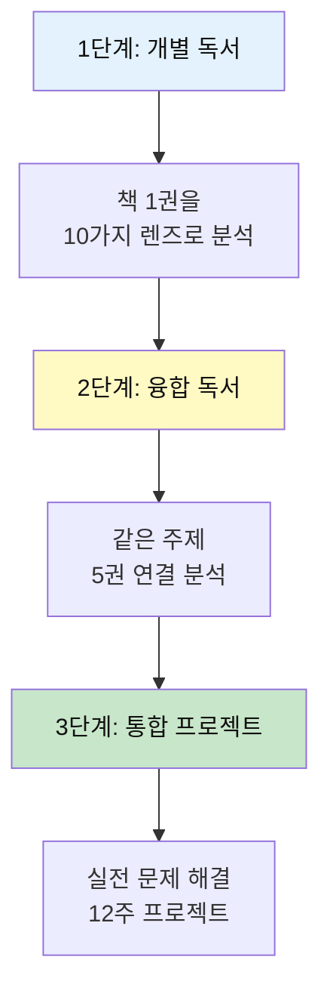

### 5대 주제와 중학생

| 주제 | 권수 | 핵심 질문 | 프로젝트 예시 |
|------|------|-----------|--------------|
| 💗 **감정** | 6권 (20%) | 어떻게 공감하고 치유할까? | 공감 능력 향상 앱 |
| 💰 **돈** | 5권 (17%) | 경제는 어떻게 작동하나? | 학교 매점 개선 제안 |
| 🤝 **만남** | 6권 (20%) | 어떻게 소통하고 협업할까? | 학급 소통 문화 혁신 |
| 🧘 **성찰** | 7권 (23%) | 나는 누구이고 어떻게 살아야 하나? | 가치관 워크숍 운영 |
| 🎮 **여가** | 6권 (20%) | 어떻게 창의적으로 즐길까? | 문화 체험 기획 |

**중학생 특징**: 성찰 비중 증가 (정체성 탐구의 시기)

---

## 📊 전체 30권 도서 구조

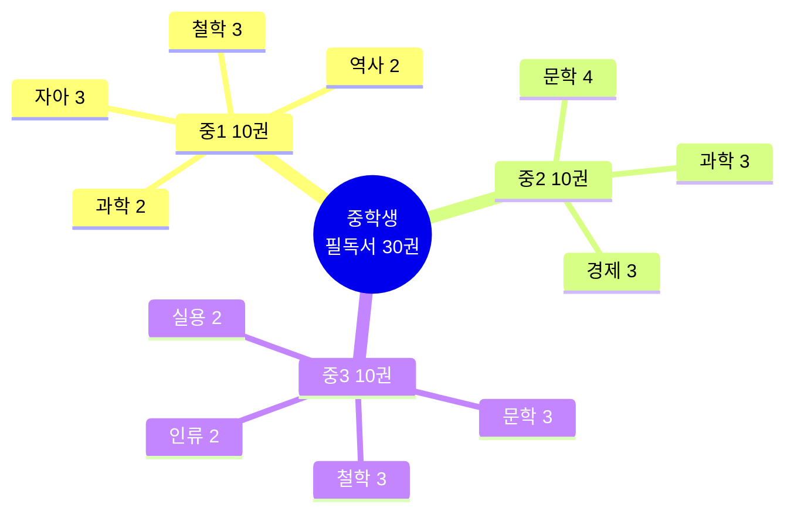

---

## 📊 미네르바 스쿨 사고 체계

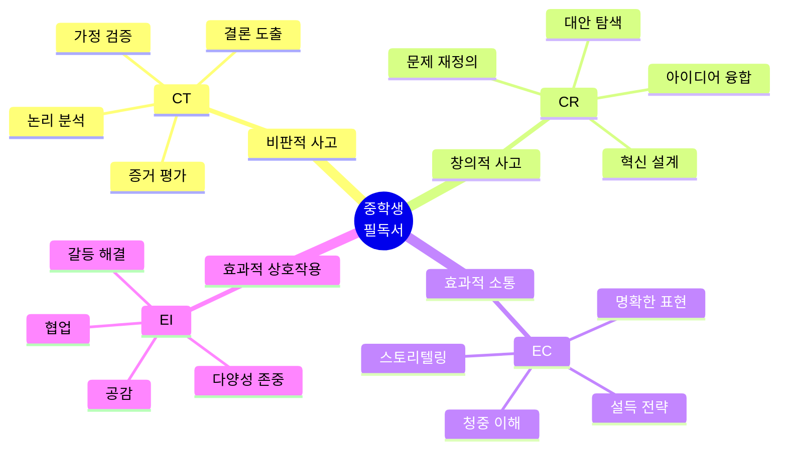

---

## 🎯 전체 구조: 난이도 × 주제 × 사고체계

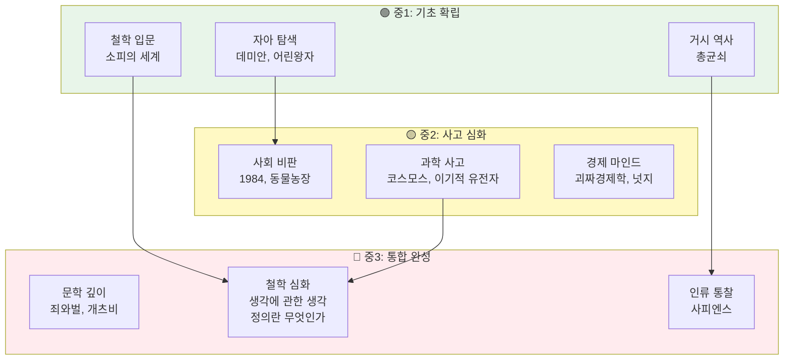

---

## 📚 도서별 사고 체계 매핑

### 🟢 중1 레벨: 사고의 기초 다지기

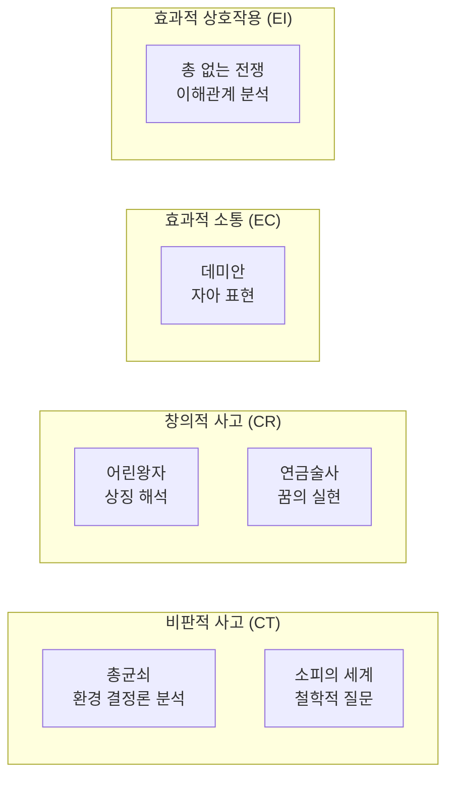

#### 📖 1. 데미안 - 헤르만 헤세

**[CT] 비판적 사고 포인트**
```
가정: "착한 세계 vs 나쁜 세계"
질문: 이 이분법이 타당한가?
분석: 선과 악은 절대적인가, 상대적인가?
결론: 통합된 자아 = 양면성 인정
```

**[CR] 창의적 재해석**
- 알을 깨고 나온다 = 기존 틀 깨기 = 혁신
- 아브락사스 = 통합의 신 = 융합 사고
- 데미안 = 멘토 = 새로운 관점 제공자

**3가지 통찰 조각**
1. 🥚 **알 깨기**: 성장 = 고통스러운 변화
2. 🦅 **자기 되기**: 타인의 기대 ≠ 내 진로
3. 🌓 **빛과 어둠**: 양면성 수용 = 성숙

**융합 질문**
- 데미안 + 어린왕자 = "진정한 자아 vs 본질적 관계"
- 데미안 + 1984 = "개인의 자유 vs 사회의 통제"

---

#### 📖 2. 소피의 세계 - 요슈타인 가아더

**철학사 사고 지도**
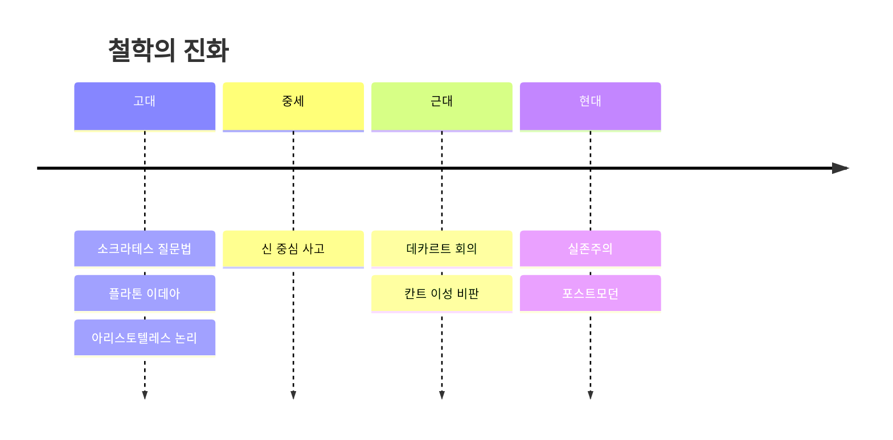

**5가지 핵심 질문 (CT)**
1. "너는 누구니?" (정체성)
2. "세계는 어디서 왔니?" (존재론)
3. "무엇이 옳은가?" (윤리학)
4. "우리는 어떻게 아는가?" (인식론)
5. "아름다움이란?" (미학)

**창의적 적용 (CR)**
- 소크라테스 대화법 → 디자인 씽킹 질문
- 플라톤 동굴 비유 → 가상현실 vs 현실
- 칸트 정언명령 → 윤리적 AI 설계

---

#### 📖 3. 총, 균, 쇠 - 재러드 다이아몬드

**구조적 사고 훈련 (CT)**
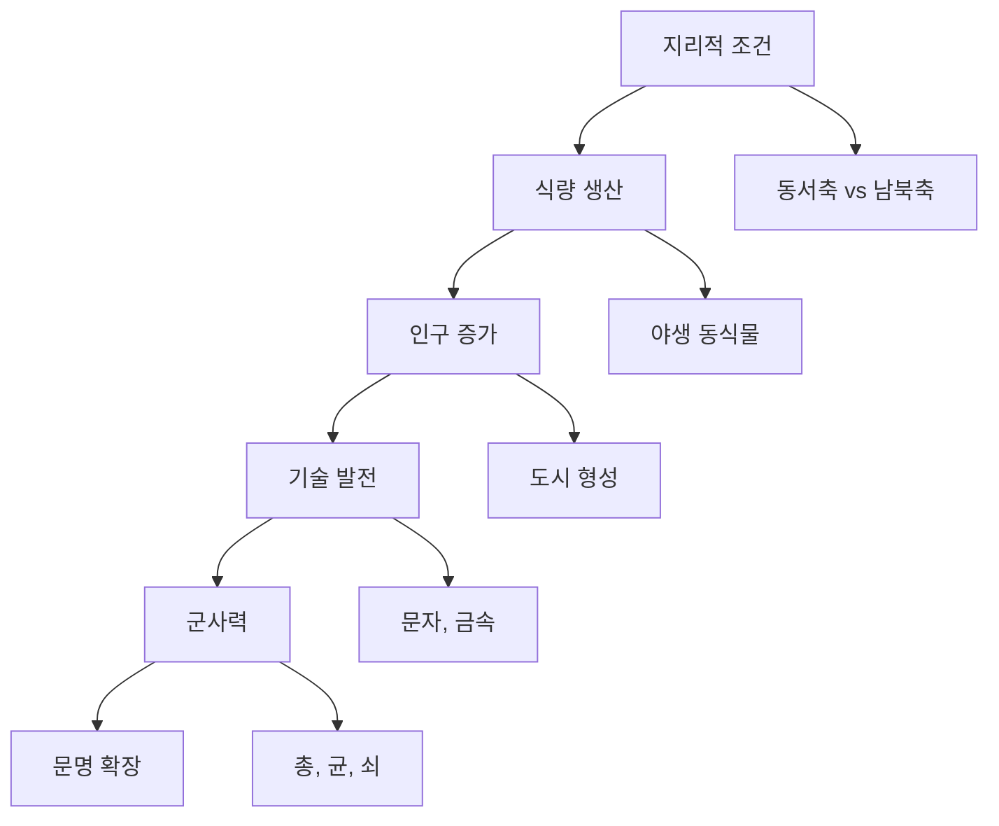

**3가지 사고 레벨**
1. **Level 1 (표면)**: 유럽이 강했다
2. **Level 2 (원인)**: 기술이 발달했다
3. **Level 3 (구조)**: 지리적 조건이 결정했다

**융합 프로젝트**
- 총균쇠 + 사피엔스 = "환경 vs 허구의 힘"
- 총균쇠 + 괴짜경제학 = "구조적 인센티브"

---

### 🟡 중2 레벨: 다층적 분석

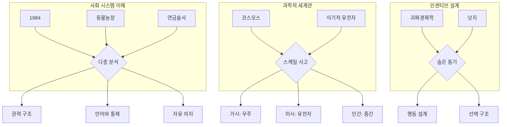

#### 📖 4. 1984 - 조지 오웰

**3층 비판 분석 (CT)**
```
Layer 1 [표층]: 디스토피아 소설
    ↓
Layer 2 [중층]: 전체주의 비판
    ↓
Layer 3 [심층]: 언어와 사고의 관계
```

**핵심 개념 쪼개기**
1. **빅 브라더** = 감시 사회 = 프라이버시 문제
2. **신어(Newspeak)** = 언어 통제 = 사고 통제
3. **2+2=5** = 진실 왜곡 = 탈진실 시대
4. **사상경찰** = 내면 통제 = 자율성 상실
5. **이중사고** = 모순 수용 = 비판 불능

**현대 연결 (융합)**
| 1984 개념 | 현대 사례 | 통찰 |
|-----------|----------|------|
| 빅 브라더 | CCTV, 데이터 수집 | 편의 vs 감시 |
| 신어 | 필터 버블, 알고리즘 | 정보 통제 |
| 이중사고 | 가짜 뉴스 | 진실의 위기 |

**다층 질문**
- 개인: 나는 얼마나 감시받고 있나?
- 사회: 안전과 자유 중 무엇이 우선?
- 철학: 자유 의지는 가능한가?

---

#### 📖 5. 동물농장 - 조지 오웰

**권력 구조 분석 (CT + EI)**
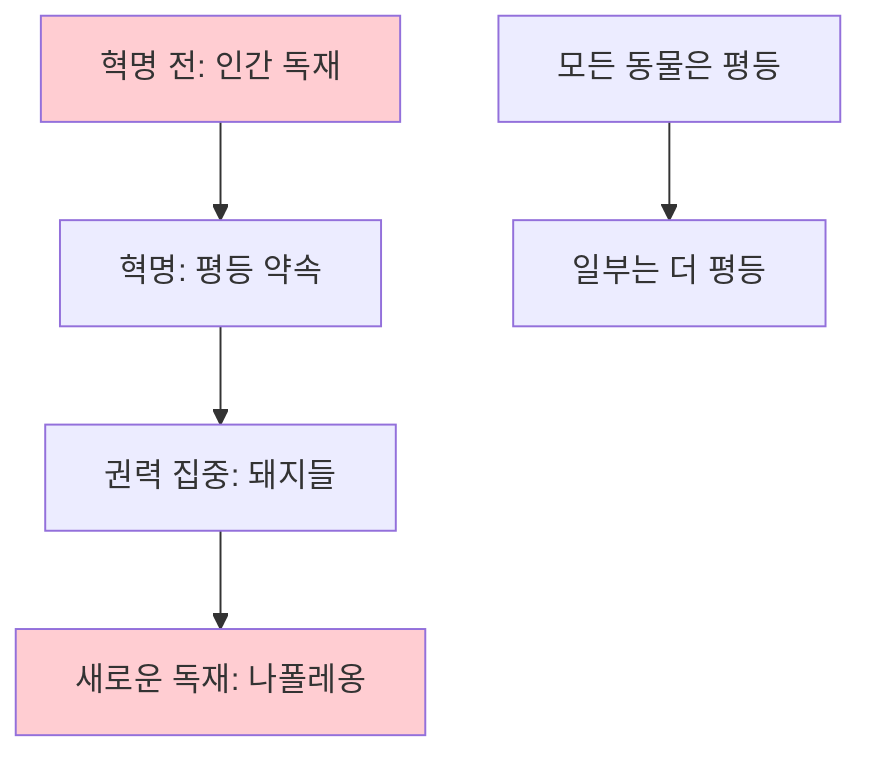

**풍자 읽기 (EC)**
- 동물 = 계급
- 농장 = 사회
- 반란 = 혁명
- 돼지 = 권력층

**변화 관리 실패 분석**
1. **초기**: 공동 목표 (인간 타도)
2. **중기**: 권력 분산 실패
3. **말기**: 독재 재생산

**융합 프로젝트**
- 동물농장 + 정의란 무엇인가 = "평등의 역설"
- 동물농장 + 넛지 = "권력의 넛지"

---

#### 📖 6. 코스모스 - 칼 세이건

**스케일 사고 (CT + CR)**
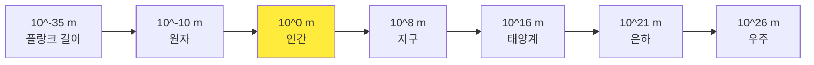

**3가지 관점 전환**
1. **시간**: 우주 달력 (138억 년 → 1년)
   - 1월 1일: 빅뱅
   - 12월 31일 23시 59분 50초: 인류 등장
   
2. **공간**: "창백한 푸른 점"
   - 지구 = 우주 먼지
   - 인간 = 별의 물질
   
3. **존재**: "우리는 우주가 자신을 인식하는 방법"

**융합 통찰**
- 코스모스 + 이기적 유전자 = "생명의 우주적 의미"
- 코스모스 + 사피엔스 = "인류의 위치"

---

#### 📖 7. 이기적 유전자 - 리처드 도킨스

**패러다임 전환 (CT)**
```
기존: 생명체가 생존한다
  ↓
전환: 유전자가 생존 기계(생명체)를 만든다
```

**핵심 개념 분해**
1. **유전자 관점**: 생명 = 유전자 운반체
2. **이기적**: 유전자는 자신만 복제
3. **이타성 설명**: 친족 선택, 상호 이타성
4. **밈(Meme)**: 문화적 유전자

**기획력 연결**
- 유전자적 사고 = 인센티브 설계
- 복제 메커니즘 = 바이럴 전략
- 진화 = 반복적 개선

---

#### 📖 8. 괴짜 경제학 / 9. 넛지

**숨은 인센티브 찾기 (CT + EI)**
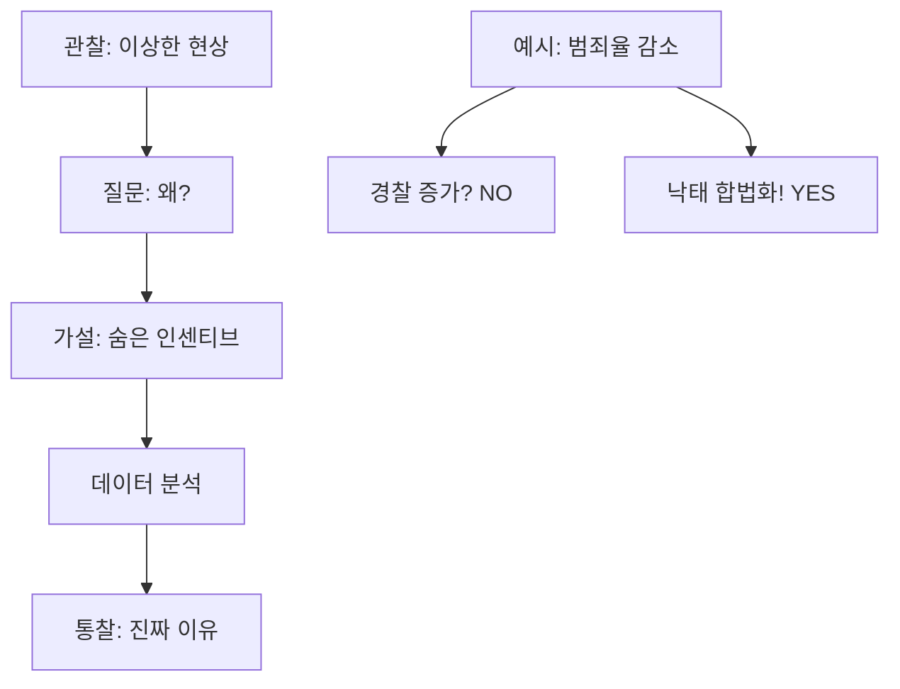

**넛지 설계 원리 (CR)**
1. **디폴트**: 기본 설정의 힘
2. **프레이밍**: 표현 방식의 영향
3. **사회적 증거**: "다른 사람들은..."
4. **적시성**: 타이밍의 중요성
5. **현저성**: 눈에 띄게 하기

**실전 프로젝트**
- 학교 쓰레기 분리수거 개선
- 동아리 참여율 높이기
- 독서실 이용 질서 만들기

---

### 🔴 중3 레벨: 통합과 완성

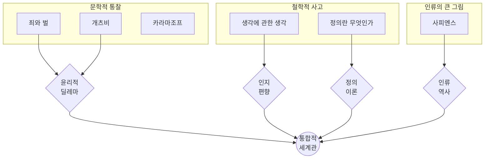

#### 📖 10. 죄와 벌 - 도스토예프스키

**윤리적 딜레마 3단 분석 (CT)**
```
Level 1: 라스콜니코프는 왜 살인했나?
    → 비범인 이론 (목적이 수단을 정당화?)
    
Level 2: 목적이 수단을 정당화하는가?
    → 공리주의 vs 의무론
    
Level 3: 죄의 본질은 무엇인가?
    → 행위 자체 vs 양심의 고통
```

**4가지 관점 충돌**
| 관점 | 주장 | 대표 인물 |
|------|------|-----------|
| 공리주의 | 다수의 행복 | 라스콜니코프 |
| 의무론 | 절대적 도덕 | 소냐 |
| 실존주의 | 자유와 책임 | 라스콜니코프 후반 |
| 허무주의 | 모든 것이 허용 | 스비드리가일로프 |

**융합 질문**
- 죄와 벌 + 정의란 무엇인가 = "처벌의 정당성"
- 죄와 벌 + 생각에 관한 생각 = "합리화의 심리"

---

#### 📖 11. 위대한 개츠비 - 스콧 피츠제럴드

**상징 해석 (EC + CR)**
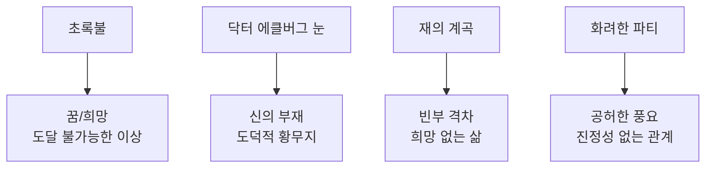

**3층 읽기**
1. **표층**: 사랑 이야기
2. **중층**: 아메리칸 드림 비판
3. **심층**: 과거로 회귀 불가능

**현대 연결**
- 개츠비 = 인플루언서 (이미지 vs 실체)
- 파티 = SNS (수많은 팔로워, 진짜 친구 없음)
- 초록불 = 성공의 환상

---

#### 📖 12. 생각에 관한 생각 - 다니엘 카너먼

**이중 시스템 (CT 핵심)**
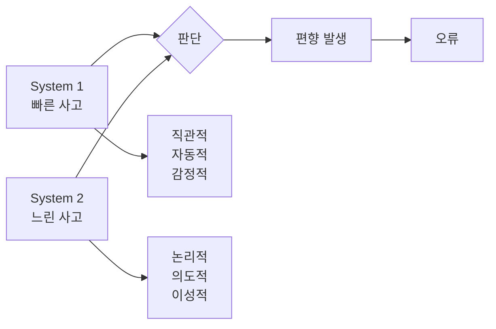

**10가지 인지 편향 쪼개기**
1. **확증 편향**: 믿고 싶은 것만 보기
2. **가용성 편향**: 쉽게 떠오르는 것 과대평가
3. **앵커링**: 첫 정보에 의존
4. **손실 회피**: 손해에 2배 더 민감
5. **프레이밍 효과**: 표현에 따라 판단 변화
6. **후광 효과**: 한 가지로 전체 판단
7. **현상 유지 편향**: 변화 회피
8. **집단 사고**: 다수 의견 따르기
9. **후견 편향**: "그럴 줄 알았어"
10. **계획 오류**: 낙관적 예측

**실전 적용**
- 의사결정 전 체크리스트
- 편향 감지 훈련
- 실험 설계 (A/B 테스트)

---

#### 📖 13. 정의란 무엇인가 - 마이클 샌델

**3가지 정의론 비교 (CT + EI)**
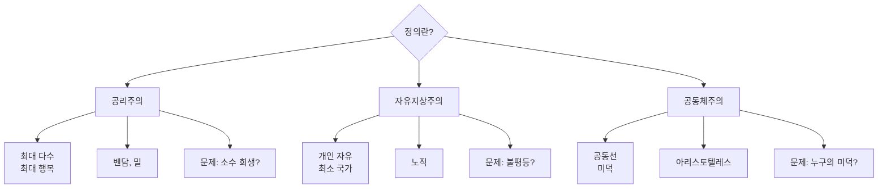

**딜레마 사고 훈련**

**딜레마 1: 트롤리 문제**
```
상황: 폭주 기차, 5명 vs 1명
행동주의: 1명 희생 → 5명 구함
의도주의: 의도적 살인 = 부도덕

→ 목적론 vs 의무론
```

**딜레마 2: 능력주의**
```
질문: 능력에 따른 보상은 정당한가?
긍정: 노력의 대가 (자유지상주의)
부정: 능력도 운 (공동체주의)

→ 개인 책임 vs 사회 책임
```

**융합 프로젝트**
- 학교 규칙 재설계 (정의 관점)
- 입시 제도 평가 (3가지 정의론)
- 사회 이슈 토론 (다층 관점)

---

#### 📖 14. 사피엔스 - 유발 하라리

**3대 혁명 구조 (CT)**
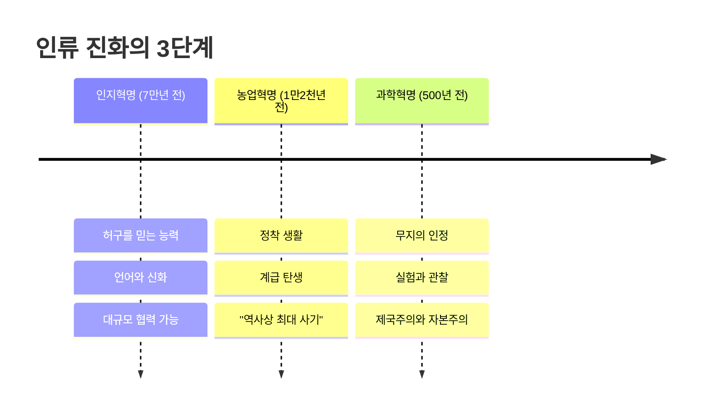

**핵심 통찰: 허구의 힘 (CR)**
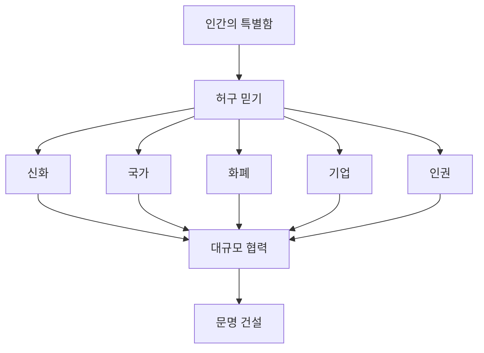

**4가지 관점 융합**
1. **생물학**: 호모 사피엔스는 하나의 동물
2. **인류학**: 허구가 특별함을 만듦
3. **역사학**: 우연이 역사를 만듦
4. **미래학**: 호모 데우스로 진화?

**거대 질문**
- 행복: 더 많이 가졌지만 더 행복한가?
- 의미: 허구인 줄 알면서도 믿어야 하나?
- 미래: 인간은 어디로 가는가?

---

## 🔗 5대 주제별 융합 독서 프로젝트

### 💗 주제 1: 감정 - 공감과 치유의 힘

**📚 융합 독서 리스트 (5권)**
1. 데미안 - 내면의 감정 발견
2. 아몬드 - 감정 장애와 공감
3. 언어의 온도 - 따뜻한 말의 힘
4. 연금술사 - 꿈을 향한 열정
5. 아몬드 - 다름의 이해

**🔍 융합 분석**
```
공통 통찰:
1. 감정은 학습하고 훈련할 수 있다
2. 공감 능력 = 관계의 핵심
3. 말과 글로 감정을 치유할 수 있다

패턴 발견:
• 감정 인식 → 표현 → 공감 → 치유
• 내면의 목소리를 듣는 것이 시작
```

**🚀 통합 프로젝트: 공감 능력 향상 앱 (12주)**
```
Week 1-2: 사용자 리서치
• 청소년 30명 인터뷰
• 공감 능력 측정 설문

Week 3-5: 솔루션 설계
• 5권의 통찰 적용
  - 데미안: 자기 이해 워크시트
  - 아몬드: 감정 훈련 게임
  - 언어의 온도: 따뜻한 표현 추천
  - 연금술사: 목표 공유 커뮤니티

Week 6-9: MVP 개발 (Figma + 노코드)
• 매일 감정 일기
• 공감 대화 연습
• 칭찬 미션
• 감정 카드 게임

Week 10-11: 베타 테스트 (50명)
• 피드백 수집 및 개선
• 공감 점수 30% 향상 목표

Week 12: 발표
• Demo Day 피칭
• 포트폴리오 완성
```

---

### 💰 주제 2: 돈 - 경제 원리와 인센티브

**📚 융합 독서 리스트 (5권)**
1. 괴짜경제학 - 숨은 인센티브
2. 넛지 - 선택 설계
3. 총 없는 전쟁 - 경제 구조
4. 경제학 콘서트 - 시장 원리
5. 국부론 (발췌) - 경제의 기초

**🔍 융합 분석**
```
공통 통찰:
1. 인센티브가 행동을 결정한다
2. 작은 설계가 큰 변화를 만든다
3. 경제는 복잡한 시스템이다

패턴 발견:
• 동기 → 선택 → 행동 → 결과
• 개인의 합리적 선택 ≠ 사회 최선
```

**🚀 통합 프로젝트: 학교 매점 개선 제안 (12주)**
```
Week 1-3: 문제 분석
• 매점 운영 현황 조사
• 학생 불만 사항 수집 (100명)
• 5 Forces 분석

Week 4-6: 솔루션 설계
• 5권의 통찰 적용
  - 괴짜경제학: 숨은 문제 발견
  - 넛지: 디폴트 변경, 동선 설계
  - 경제학 콘서트: 수요-공급 최적화
  - 국부론: 분업과 효율성

Week 7-9: 파일럿 테스트
• 학교 협의
• 한 달 실험 운영
• 데이터 수집 (매출, 만족도)

Week 10-12: 최종 제안
• 개선 보고서 작성
• 학교 측 공식 발표
• 전교 확대 추진
```

---

### 🤝 주제 3: 만남 - 소통과 협업

**📚 융합 독서 리스트 (5권)**
1. 어떻게 원하는 것을 얻는가 - 협상 기술
2. 정의란 무엇인가 - 공정성 이해
3. 언어의 온도 - 소통의 기술
4. 1984 - 언어와 권력 (반면교사)
5. 동물농장 - 평등의 이상과 현실

**🔍 융합 분석**
```
공통 통찰:
1. 소통은 기술이다 (학습 가능)
2. 공정함이 협업의 기초
3. 언어는 힘이다

패턴 발견:
• 경청 → 공감 → 협상 → Win-Win
• 권력 불균형이 소통을 왜곡
```

**🚀 통합 프로젝트: 학급 소통 문화 혁신 (12주)**
```
Week 1-3: 현황 진단
• 학급 분위기 설문
• 갈등 사례 수집
• 소통 문제 파악

Week 4-6: 문화 설계
• 5권의 통찰 적용
  - 협상 기술: 갈등 해결 매뉴얼
  - 정의론: 공정한 규칙
  - 언어의 온도: 칭찬 문화
  - 1984 반면교사: 투명한 소통

Week 7-9: 실험 운영
• 주간 학급 회의
• 감사 메시지 보드
• 갈등 조정 시스템

Week 10-12: 평가 & 확산
• 만족도 조사
• 다른 학급에 공유
• 학교 축제 발표
```

---

### 🧘 주제 4: 성찰 - 자기 이해와 가치관

**📚 융합 독서 리스트 (7권)**
1. 데미안 - 자기 되기
2. 소피의 세계 - 철학적 질문
3. 생각에 관한 생각 - 인지 편향 인식
4. 죄와 벌 - 윤리적 딜레마
5. 사피엔스 - 인간의 본질
6. 이방인 - 진정성
7. 정의란 무엇인가 - 가치 판단

**🔍 융합 분석**
```
공통 통찰:
1. 자아는 발견하는 것이 아니라 만드는 것
2. 질문이 답보다 중요하다
3. 가치관은 선택의 기준이다

패턴 발견:
• 질문 → 성찰 → 가치관 → 행동
• 외부 기대 vs 내면의 소리
```

**🚀 통합 프로젝트: 가치관 워크숍 운영 (12주)**
```
Week 1-4: 자기 탐구
• 7권 완독 + 노트 정리
• 나는 누구? 질문 100개
• 가치관 우선순위 정하기

Week 5-8: 워크숍 설계
• 7권의 통찰 통합
  - 데미안: 자기 되기 워크시트
  - 소피의 세계: 철학 질문 카드
  - 생각에 관한 생각: 편향 체크리스트
  - 죄와 벌: 딜레마 토론
  - 정의론: 가치 우선순위

Week 9-11: 워크숍 운영
• 또래 10명 초대
• 3시간 × 4회
• 퍼실리테이터 역할

Week 12: 성과 정리
• 참가자 변화 인터뷰
• 워크숍 매뉴얼 제작
• 학교에 제안
```

---

### 🎮 주제 5: 여가 - 창의적 라이프스타일

**📚 융합 독서 리스트 (6권)**
1. 모모 - 시간의 가치
2. 그리스인 조르바 - 삶의 열정
3. 호밀밭의 파수꾼 - 순수함 지키기
4. 백년의 고독 - 상상력의 힘
5. 생각의 탄생 - 창의적 사고
6. 오리지널스 - 독창성 훈련

**🔍 융합 분석**
```
공통 통찰:
1. 진짜 시간은 마음으로 쓰는 것
2. 열정이 삶을 풍요롭게 만든다
3. 창의성은 훈련할 수 있다

패턴 발견:
• 여유 → 관찰 → 상상 → 창조
• 효율성 vs 의미 있는 시간
```

**🚀 통합 프로젝트: 문화 체험 기획 (12주)**
```
Week 1-3: 문화 탐색
• 6권에서 배운 창의성
• 지역 문화 자원 조사
• 청소년 니즈 파악

Week 4-6: 체험 프로그램 설계
• 6권의 통찰 적용
  - 모모: 느리게 살기 워크숍
  - 조르바: 열정 발견 세션
  - 생각의 탄생: 창의력 게임
  - 오리지널스: 독창성 챌린지

Week 7-10: 실행
• 월 1회 체험 (총 4회)
• 청소년 20명 참여
• SNS 기록

Week 11-12: 평가 & 확산
• 참가자 만족도
• 지역 도서관/주민센터 제안
• 정기 프로그램화
```

---

## 🌈 융합 메가 프로젝트 (5대 주제 통합)

### 프로젝트: 청소년 소셜 벤처 창업 (16주)

**5대 주제 통합 접근**
```
💗 감정: 청소년의 고민과 아픔 (공감)
💰 돈: 지속가능한 비즈니스 모델
🤝 만남: 팀 빌딩과 협업
🧘 성찰: 사회적 가치와 사명감
🎮 여가: 창의적 솔루션
```

**Phase 1 (Week 1-4): 문제 발견**
- 5대 영역에서 각 5개 = 25개 아이디어
- 청소년 100명 설문
- 최종 문제 선정 (투표)

**Phase 2 (Week 5-8): 솔루션 설계**
- 30권의 통찰 통합 적용
- 비즈니스 모델 캔버스
- 팀 구성 (5명)

**Phase 3 (Week 9-12): MVP 개발**
- 노코드 개발 or 오프라인 서비스
- 베타 테스트 50명
- 피드백 반영

**Phase 4 (Week 13-16): 런칭 & 측정**
- 공식 런칭
- 임팩트 측정 (정량+정성)
- 창업 경진대회 출전
- 포트폴리오 완성
```

---

## 🎨 미네르바 스쿨 방식 독서 프로젝트

### 프로젝트 1: 4C 통합 프로젝트

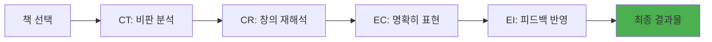

**단계별 활동**
1. **CT (Critical Thinking)**
   - 저자 주장 분해
   - 가정 찾기
   - 증거 평가
   - 논리 검증

2. **CR (Creative Thinking)**
   - 다른 관점 상상
   - 개념 융합
   - 새로운 적용
   - 대안 제시

3. **EC (Effective Communication)**
   - 핵심 3문장 요약
   - 5분 발표 준비
   - 시각화 (인포그래픽)
   - 스토리텔링

4. **EI (Effective Interaction)**
   - 동료 피드백
   - 질문 대응
   - 관점 통합
   - 개선안 반영

---

### 프로젝트 2: 책 3권 융합 프로젝트

**템플릿**
```
[책 A] + [책 B] + [책 C] = [새로운 통찰]

예시:
1984 + 넛지 + 생각에 관한 생각
= "권력은 어떻게 생각을 조종하는가"

구성:
1. 각 책의 핵심 개념 (3가지씩)
2. 연결점 찾기 (3가지)
3. 융합 통찰 (1가지)
4. 실제 적용 (사례 3가지)
5. 프로젝트 제안 (1가지)
```

**추천 조합**
| 조합 | 주제 | 결과물 |
|------|------|--------|
| 죄와벌 + 정의론 + 넛지 | 윤리적 행동 설계 | 선한 선택 유도 시스템 |
| 사피엔스 + 이기적 유전자 + 코스모스 | 인간의 위치 | 생명의 의미 에세이 |
| 1984 + 동물농장 + 개츠비 | 허상과 진실 | SNS 시대 정체성 |

---

### 프로젝트 3: 현실 문제 해결

**4단계 프로세스**
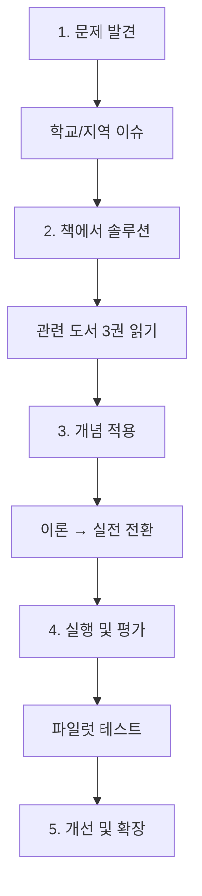

**예시**
- **문제**: 학교 쓰레기 분리수거 잘 안 됨
- **도서**: 넛지, 괴짜경제학, 생각에 관한 생각
- **솔루션**: 
  1. 디폴트 설계 (쓰레기통 위치 최적화)
  2. 인센티브 (반별 경쟁)
  3. 사회적 증거 ("우리 학년 90% 참여")
- **실행**: 한 달 실험
- **평가**: 데이터 분석 및 개선

---

## 📖 학년별 사고 발달 로드맵

```mermaid
journey
    title 중학생 사고력 성장 여정
    section 중1: 기초
      질문하기: 5: 소피의세계
      연결하기: 4: 총균쇠
      자아탐색: 5: 데미안
    section 중2: 심화
      비판하기: 5: 1984
      분석하기: 4: 괴짜경제학
      창의적사고: 4: 연금술사
    section 중3: 통합
      윤리판단: 5: 죄와벌
      인지편향인식: 5: 생각에관한생각
      통합적세계관: 5: 사피엔스
```

---

## 🌟 학년별 핵심 역량 & 방법

```mermaid
graph TB
    subgraph 중1 ["중1: 사고의 틀 만들기"]
        A1[질문 습관]
        A2[다층 읽기]
        A3[개념 연결]
    end
    
    subgraph 중2 ["중2: 비판과 창의"]
        B1[가정 검증]
        B2[관점 전환]
        B3[아이디어 융합]
    end
    
    subgraph 중3 ["중3: 통합과 적용"]
        C1[다학제 통합]
        C2[실전 프로젝트]
        C3[메타 인지]
    end
    
    A1 & A2 & A3 --> B1
    B1 & B2 & B3 --> C1
    C1 & C2 & C3 --> D[고등학교 준비]
    
    style 중1 fill:#e8f5e9
    style 중2 fill:#fff9c4
    style 중3 fill:#ffebee
    style D fill:#e1bee7
```

### 중1: 사고의 기초 체계 만들기
- **목표**: 단순 이해 → 분석적 독서
- **방법**: 
  - ✅ 3단계 질문 (무엇? 왜? 만약?)
  - ✅ 마인드맵으로 구조화
  - ✅ 다른 책과 연결하기

### 중2: 비판과 창의 균형
- **목표**: 수동적 수용 → 능동적 재해석
- **방법**:
  - ✅ 저자와 논쟁하기
  - ✅ 대안 제시하기
  - ✅ 개념 융합 실험

### 중3: 통합적 사고 완성
- **목표**: 개별 지식 → 통합 세계관
- **방법**:
  - ✅ 여러 책 동시 읽기
  - ✅ 현실 문제 적용
  - ✅ 프로젝트 완수

---

## 📚 추가 필독서 (21-30권) - 다양성 확장

### 🌍 글로벌 이슈 & 사회 (4권)

**21. 팩트풀니스** - 한스 로슬링
- **주제**: 데이터, 편견, 사실
- **핵심 통찰**: "세상은 우리 생각보다 나아지고 있다"
- **10가지 본능**: 간극 본능, 부정 본능, 직선 본능 등
- **기획력 연결**: 데이터 기반 의사결정, 편견 극복

**22. 침묵의 봄** - 레이철 카슨
- **주제**: 환경, 생태계, 책임
- **핵심 통찰**: "인간 행동이 자연을 파괴한다"
- **기획력 연결**: 지속가능성, 환경 영향 평가

**23. 82년생 김지영** - 조남주
- **주제**: 성평등, 여성, 사회 구조
- **핵심 통찰**: "평범한 여성의 삶을 통해 본 구조적 차별"
- **기획력 연결**: 사회 구조 분석, 포용적 설계

**24. 아몬드** - 손원평 (신간)
- **주제**: 감정, 차이, 공감
- **핵심 통찰**: "다름을 이해하고 받아들이기"
- **기획력 연결**: 다양성 존중, 사용자 이해

---

### 📖 추가 문학 (3권)

**25. 호밀밭의 파수꾼** - 제롬 데이비드 샐린저
- **주제**: 반항, 성장, 진정성
- **핵심 통찰**: "어른 세계에 대한 저항과 순수함 지키기"
- **기획력 연결**: 청소년 문화 이해, 타깃 분석

**26. 난장이가 쏘아 올린 작은 공** - 조세희
- **주제**: 빈곤, 불평등, 경제 성장
- **핵심 통찰**: "경제 발전 속 소외된 사람들"
- **기획력 연결**: 사회 문제 발견, 공정성 설계

**27. 열여섯 살의 인생론** - 최승호
- **주제**: 성찰, 인생, 자아
- **핵심 통찰**: "청소년도 인생을 깊이 성찰할 수 있다"
- **기획력 연결**: 자기 이해, 가치관 정립

---

### 🔬 과학/기술 (2권)

**28. 미래의 속도** - 김대식
- **주제**: AI, 기술, 미래 사회
- **핵심 통찰**: "기술이 바꾸는 인간과 사회"
- **기획력 연결**: 기술 트렌드, 디지털 전환

**29. 오리진** - 댄 브라운
- **주제**: 과학 vs 종교, 진화, 미래
- **핵심 통찰**: "우리는 어디서 왔고 어디로 가는가"
- **기획력 연결**: 미래 예측, 윤리적 고민

---

### 💬 소통/실용 (1권)

**30. 언어의 온도** - 이기주
- **주제**: 언어, 감정, 소통
- **핵심 통찰**: "말에는 온도가 있다 - 따뜻한 말의 힘"
- **기획력 연결**: 효과적 소통, 공감 디자인, 브랜드 톤앤매너

---

## 💡 통찰력 키우는 5가지 독서 기법

### 1. 레이어 읽기 (다층 분석)
```
Layer 1: 무슨 이야기? (줄거리)
    ↓
Layer 2: 무슨 의미? (주제)
    ↓
Layer 3: 왜 이렇게? (저자 의도)
    ↓
Layer 4: 지금 어떻게? (현대 적용)
    ↓
Layer 5: 나는 어떻게? (자기 삶 연결)
```

### 2. 개념 쪼개기 (분해와 재조합)
```
큰 개념 → 작은 조각들 → 새로운 조합

예: "자유"
  → 신체의 자유
  → 선택의 자유
  → 사고의 자유
  → 경제적 자유
  
  재조합: 진정한 자유 = 선택 + 책임
```

### 3. 관점 바꾸기 (다중 렌즈)
```mermaid
graph TD
    A[사건/개념] --> B[주인공 관점]
    A --> C[반대편 관점]
    A --> D[제3자 관점]
    A --> E[나의 관점]
    A --> F[미래 관점]
    
    B & C & D & E & F --> G{통합 이해}
```

### 4. 시간선 사고 (과거-현재-미래)
```
이 책이 쓰인 시대:
  - 어떤 상황?
  - 왜 이 주제?

지금 시대:
  - 여전히 유효?
  - 무엇이 변했?

미래:
  - 어떻게 변할?
  - 대비해야 할 것?
```

### 5. 실험 설계 (가설 검증)
```mermaid
graph LR
    A[책의 주장] --> B[나의 가설]
    B --> C[실험 설계]
    C --> D[데이터 수집]
    D --> E[결과 분석]
    E --> F[검증/반증]
```

---

## 💬 독서 토론 촉진 질문

### 소크라테스식 질문법
```mermaid
mindmap
  root((질문 기법))
    명확화
      정확히 무슨 뜻이야?
      예를 들어줄래?
    가정 탐색
      어떤 가정을 했어?
      반드시 그럴까?
    증거 요구
      어떻게 알아?
      증거가 있어?
    관점 전환
      다른 사람은 어떻게 볼까?
      반대로 생각하면?
    결과 예측
      그러면 어떻게 될까?
      장기적으로는?
    질문 되돌리기
      왜 그걸 물었어?
      진짜 궁금한 건 뭐야?
```

---

**마지막 조언** 🚀

중학교는 **사고의 근육**을 키우는 결정적 시기입니다.

### ⭐ 핵심 원칙

**1. 한 권은 10가지 렌즈로**
```
❌ 책 1권 → 줄거리 요약
✅ 책 1권 → 10가지 렌즈 분석 → 다층적 이해
```

**2. 여러 권은 융합으로**
```
❌ 책 5권 → 개별적으로 읽기
✅ 책 5권 → 주제별 융합 → 패턴 발견 → 통합 통찰
```

**3. 주제별 통합 프로젝트로**
```
❌ 독후감 5개
✅ 주제별 5권 융합 → 12주 실전 프로젝트
   (앱 개발, 제안서, 캠페인, 연구 등)
```

### 💡 미네르바 스쿨 정신

> "What you know matters less than what you can do with what you know."
> 
> 무엇을 아는가보다, 아는 것으로 무엇을 할 수 있는가가 중요하다.

### 실천 가이드

1. 📚 **의심하며 읽기**: 저자도 틀릴 수 있다
2. 🔍 **10가지 렌즈로**: 다층적으로 분석한다
3. 🔗 **융합하며 읽기**: 책들의 패턴을 찾는다
4. 🚀 **프로젝트로**: 실제 문제를 해결한다

책을 읽고 → 융합 분석하고 → 실전 프로젝트하라! 💪✨

📚 → 🔍 (10가지 렌즈) → 🔗 (5권 융합) → 🚀 (12주 프로젝트)
