# 초등학생 필독서 가이드 (1-6학년)

> **목적**: 기획력, 창의력, 통찰력의 기초 다지기  
> **접근법**: 5대 주제 중심 융합 독서 + 프로젝트
> 
> **핵심 원칙**: 📚 한 권은 렌즈로 → 🔗 여러 권은 융합으로 → 🚀 주제별 프로젝트로!

---

## 🎯 5대 주제 독서 시스템

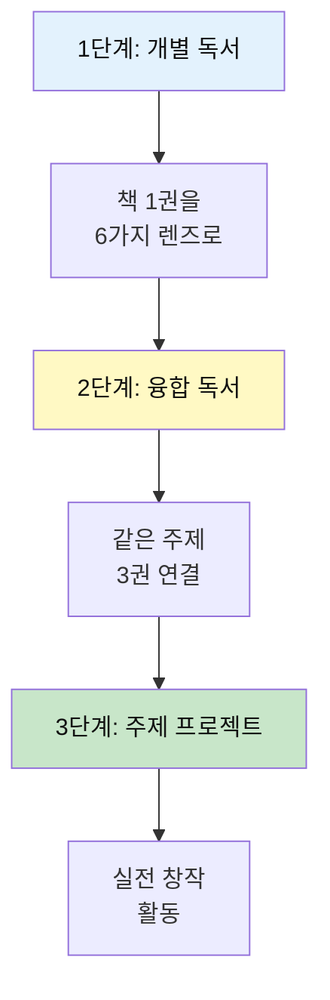

### 5대 주제와 초등학생

| 주제 | 권수 | 핵심 질문 | 프로젝트 예시 |
|------|------|-----------|--------------|
| 💗 **감정** | 8권 (27%) | 어떤 기분? 왜? | 감정 그림책, 위로 편지 |
| 💰 **돈** | 3권 (10%) | 돈이란 뭘까? | 용돈 관리 보드게임 |
| 🤝 **만남** | 7권 (23%) | 친구란? 가족이란? | 우정 스토리북 |
| 🧘 **성찰** | 4권 (13%) | 나는 누구? | 나의 꿈 발표 |
| 🎮 **여가** | 8권 (27%) | 무엇이 재밌어? | 상상 놀이터 만들기 |

**초등학생 특징**: 감정·여가 중심 (상상력, 공감 키우기)

---

## 🎓 미네르바 세미나 활용법

### 왜 미네르바 방식인가?

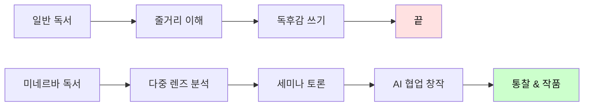

### 초등학생용 간단 렌즈 (6가지)

> 10가지는 어려우니 초등학생은 6가지로 시작!

| 렌즈 | 질문 | 예시 (《마당을 나온 암탉》) |
|------|------|---------------------------|
| **😊 감정** | 어떤 기분이 들었어? | 잎싹이 불쌍했어요 |
| **🤔 도덕** | 잘한 거야? 나쁜 거야? | 자유를 선택한 건 용기 있어요 |
| **👨‍👩‍👧 관계** | 친구/가족과 어떤 관계? | 초록이를 키우는 엄마 역할 |
| **🎯 목표** | 무엇을 원했어? | 자유롭게 살고 싶었어요 |
| **🌱 변화** | 어떻게 변했어? | 겁쟁이 → 용감한 엄마 |
| **💡 배움** | 나는 무엇을 배웠어? | 진짜 사랑은 희생이에요 |

### 5단계 학습 사이클 (초등학생용)

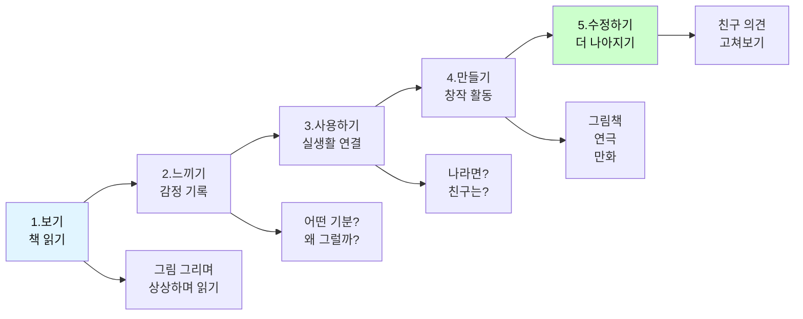

### 독서 후 활동 가이드

#### 개인 활동 (혼자서)

```markdown
📚 책을 다 읽고 나서 (30분)

[1단계: 보기 완료!]
━━━━━━━━━━━━━━━━━━━━━━━━
✅ 책 다 읽음

[2단계: 느끼기 (10분)]
━━━━━━━━━━━━━━━━━━━━━━━━
6가지 렌즈로 생각하기:

😊 감정: ________________________
🤔 도덕: ________________________
👨‍👩‍👧 관계: ________________________
🎯 목표: ________________________
🌱 변화: ________________________
💡 배움: ________________________

[3단계: 사용하기 (10분)]
━━━━━━━━━━━━━━━━━━━━━━━━
• 나의 경험과 연결:
  _____________________________

• 나라면 어떻게 했을까?
  _____________________________

[4단계: 만들기 계획 (10분)]
━━━━━━━━━━━━━━━━━━━━━━━━
뭘 만들고 싶어?
□ 그림 그리기
□ 만화 그리기
□ 속편 이야기
□ 인형극
□ 기타: __________
```

#### 세미나 활동 (친구들과)

```markdown
👥 세미나 시간 (60분)

[체크인 (10분)]
━━━━━━━━━━━━━━━━━━━━━━━━
돌아가며 한마디:
"이 책에서 가장 기억에 남는 장면은?"

[6가지 렌즈 토론 (30분)]
━━━━━━━━━━━━━━━━━━━━━━━━
선생님이 질문하면 손들고 대답:

1. 감정 렌즈 (5분)
   "어떤 장면에서 슬펐어/기뻤어?"
   
2. 도덕 렌즈 (5분)
   "○○가 한 행동, 좋은 거야 나쁜 거야?"
   
3. 관계 렌즈 (5분)
   "○○와 ○○는 어떤 관계였어?"
   
... (6가지 모두)

[만들기 시간 (20분)]
━━━━━━━━━━━━━━━━━━━━━━━━
• 각자 또는 팀으로
• 그림/만화/연극 등
• 친구들과 협력

[발표 & 피드백 (10분)]
━━━━━━━━━━━━━━━━━━━━━━━━
• 만든 것 보여주기
• 친구들이 좋아한 점 말하기
• 더 나아질 점 이야기하기
```

### AI와 함께 책 읽기 (초등학생용)

```markdown
🤖 ChatGPT와 대화하기

[질문 예시]
━━━━━━━━━━━━━━━━━━━━━━━━
1. "《마당을 나온 암탉》에서 
   잎싹이 느꼈을 감정을 
   10가지 말해줘"

2. "만약 잎싹이 마당을 안 나왔다면
   어떻게 됐을까?
   3가지 시나리오를 만들어줘"

3. "이 책의 교훈을 
   초등학교 3학년이 이해할 수 있게
   쉽게 설명해줘"

4. "잎싹처럼 용감했던 
   다른 동화 속 주인공을
   5명 알려줘"

[AI와 창작하기]
━━━━━━━━━━━━━━━━━━━━━━━━
1. "《마당을 나온 암탉》의 
   속편 아이디어 10개 제안해줘"
   
2. "잎싹이 주인공인 
   새로운 모험 이야기를 만들어줘"
   
3. "이 책을 연극으로 만들려면
   어떤 장면이 필요할까?"
```

### 학부모/선생님 가이드

```markdown
✨ 미네르바 방식으로 독서 지도하기

[DO: 해야 할 것]
━━━━━━━━━━━━━━━━━━━━━━━━
✅ 질문하기: "왜 그렇게 생각해?"
✅ 경청하기: 아이 말을 끝까지 듣기
✅ 연결하기: "○○이도 비슷한 말 했는데..."
✅ 격려하기: "좋은 생각이야!"
✅ 다양성: "다른 생각은 없어?"

[DON'T: 하지 말아야 할 것]
━━━━━━━━━━━━━━━━━━━━━━━━
❌ 정답 말하기: "정답은 ○○야"
❌ 비교하기: "○○는 더 잘했는데"
❌ 판단하기: "그건 틀렸어"
❌ 끼어들기: 아이 말 중간에 자르기
❌ 강요하기: "이렇게 생각해야 해"

[효과적인 질문법]
━━━━━━━━━━━━━━━━━━━━━━━━
1. 오픈형 질문
   "어떻게 생각해?" (O)
   "좋았어?" (X)

2. 왜 질문
   "왜 그렇게 생각해?"
   "왜 그런 감정이 들었어?"

3. 만약 질문
   "만약 네가 주인공이라면?"
   "만약 다른 선택을 했다면?"

4. 연결 질문
   "이것과 비슷한 경험 있어?"
   "이전에 읽은 책과 비슷한가?"
```

---

## 📊 전체 구조 한눈에 보기

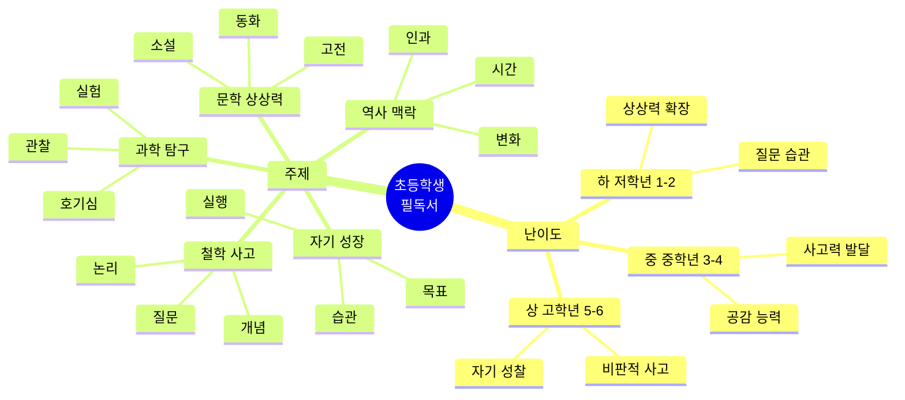

---

## 🎯 난이도별 × 주제별 매트릭스

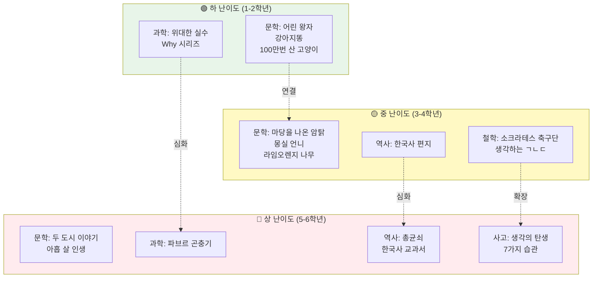

---

## 📚 5대 주제별 도서 분류 (총 30권)

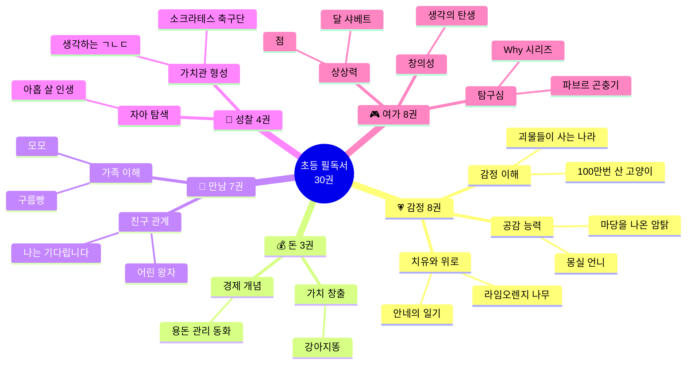

---

## 📚 도서 목록 & 통찰력 연결

### 🟢 하 난이도 (1-2학년) - 기초 쌓기 10권

#### 📖 문학: 상상력의 씨앗 (5권)

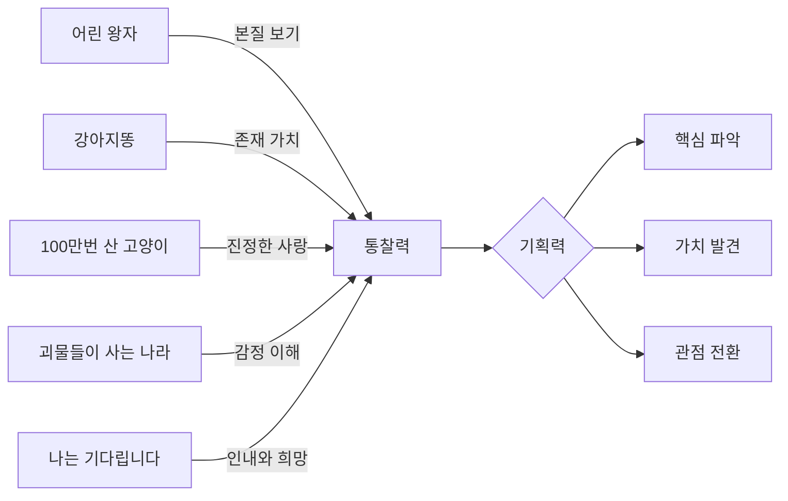

**1. 어린 왕자** - 생텍쥐페리
- **주제**: 본질, 관계, 사랑
- **핵심 통찰**: "정말 중요한 것은 눈에 보이지 않아"
- **3가지 생각 조각**:
  1. 🌹 길들임 = 관계 만들기 = 책임
  2. 🦊 보이지 않는 것의 가치
  3. 🌟 어른의 숫자 vs 아이의 본질
- **연결 질문**: 왜 장미는 특별할까? 여우는 왕자에게 무엇을 가르쳤을까?

**2. 강아지똥** - 권정생
- **주제**: 자존감, 존재 의미
- **핵심 통찰**: "모든 존재는 고유한 가치가 있다"
- **3가지 생각 조각**:
  1. 💩 약한 존재도 가치 있음
  2. 🌼 기다림의 의미
  3. ✨ 변화와 성장

**3. 100만 번 산 고양이** - 사노 요코
- **주제**: 사랑, 삶의 의미
- **핵심 통찰**: "진정한 사랑을 만나면 영원도 필요 없다"
- **3가지 생각 조각**:
  1. 🐱 100만 번 vs 단 한 번
  2. 💕 자기애 → 타인 사랑
  3. 🕊️ 자유로운 선택

**4. 괴물들이 사는 나라** - 모리스 샌닥
- **주제**: 감정, 상상력, 귀환
- **핵심 통찰**: "화가 나도 집(사랑)으로 돌아올 수 있다"
- **3가지 생각 조각**:
  1. 😡 감정 표현의 중요성
  2. 🌴 상상 여행 = 감정 해소
  3. 🏠 안전한 귀환 = 무조건적 사랑

**5. 나는 기다립니다** - 다비드 칼리
- **주제**: 인내, 시간, 희망
- **핵심 통찰**: "기다림에도 아름다움이 있다"
- **3가지 생각 조각**:
  1. ⏰ 시간의 흐름
  2. 🌱 기다림 = 성장
  3. 💫 희망의 힘

---

#### 🔬 과학: 질문의 시작 (3권)

**6. 세상을 바꾼 위대한 실수** - 솔레다드 로메로 마리뇨
- **주제**: 실패, 우연, 발견
- **핵심 통찰**: "실수는 새로운 시작"
- **3가지 생각 조각**:
  1. 🔬 실수 → 관찰 → 발견
  2. 🧪 예상 밖의 결과 = 기회
  3. 🎯 실패를 두려워하지 않기

**7. Why? 시리즈** (대표 3권 선택)
- **주제**: 호기심, 지식, 탐구
- **핵심 통찰**: "좋은 질문이 좋은 답을 만든다"
- **질문 연습**: 왜 하늘은 파랗지? 왜 공룡은 사라졌지?

**8. 달 샤베트** - 백희나
- **주제**: 상상, 과학, 우정
- **핵심 통찰**: "과학적 호기심을 재미있게"
- **3가지 생각 조각**:
  1. 🌙 달이 녹는다면?
  2. 🧊 상상력 + 과학
  3. 👫 나눔의 기쁨

---

#### 🎨 예술/창의 (2권)

**9. 점** - 피터 레이놀즈
- **주제**: 창의성, 자신감, 시작
- **핵심 통찰**: "작은 시작이 큰 변화를 만든다"
- **3가지 생각 조각**:
  1. • 점 하나 = 시작의 용기
  2. 🎨 표현의 자유
  3. 💪 자신감 회복

**10. 구름빵** - 백희나
- **주제**: 상상, 가족, 나눔
- **핵심 통찰**: "상상이 현실이 되는 마법"
- **3가지 생각 조각**:
  1. ☁️ 구름 = 상상력의 재료
  2. 🍞 나눔의 가치
  3. 👨‍👩‍👧‍👦 가족의 사랑

---

### 🟡 중 난이도 (3-4학년) - 사고 확장 10권

#### 📖 문학: 깊이 있는 이야기 (4권)

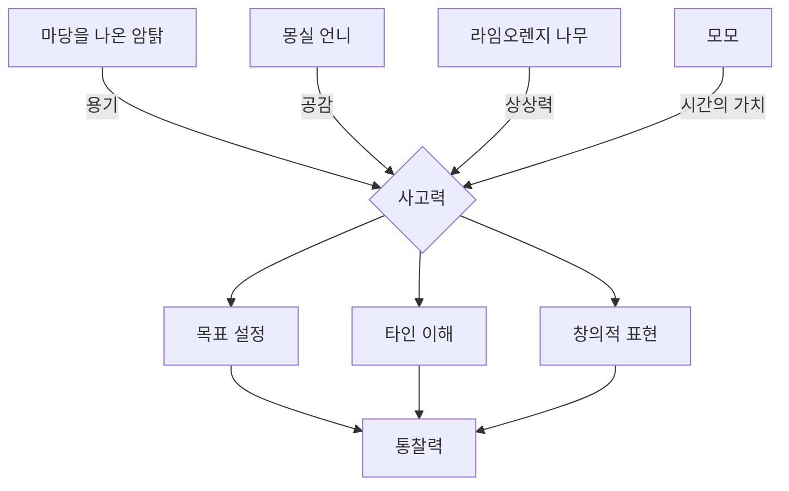

**11. 마당을 나온 암탉** - 황선미
- **주제**: 자유, 모성, 선택
- **핵심 통찰**: "진정한 자유는 스스로 선택하는 것"
- **3가지 생각 조각**:
  1. 🥚 양계장 vs 마당 = 안전 vs 자유
  2. 🦆 선택한 가족 = 진정한 사랑
  3. 💀 희생의 의미 = 자기실현
- **융합**: 마당+어린왕자 = "선택의 무게와 책임"

**12. 몽실 언니** - 권정생
- **주제**: 역사, 인권, 가족
- **핵심 통찰**: "역사 속 개인의 고통을 기억하기"
- **3가지 생각 조각**:
  1. ⏰ 시대적 고통
  2. 👨‍👩‍👧 가족의 의미
  3. 💪 희망 찾기

**13. 나의 라임오렌지 나무** - 바스콘셀로스
- **주제**: 상상력, 빈곤, 성장
- **핵심 통찰**: "상상력은 고통을 이기는 힘"
- **3가지 생각 조각**:
  1. 🌳 나무와의 대화 = 상상력
  2. 💰 가난 속 희망
  3. 👴 이해와 사랑의 힘

**14. 모모** - 미하엘 엔데
- **주제**: 시간, 경청, 우정
- **핵심 통찰**: "진짜 시간은 마음으로 쓰는 것"
- **3가지 생각 조각**:
  1. ⏰ 시간 도둑 = 현대 사회 비판
  2. 👂 경청의 힘 = 진정한 소통
  3. 🌸 마음의 시간 vs 시계의 시간

---

#### 🧠 철학/사고 (2권)

**15. 소크라테스 아저씨네 축구단** - 이상민
- **주제**: 철학, 질문, 사고
- **핵심 통찰**: "답보다 질문이 중요하다"
- **5가지 질문 기법**:
  1. 왜? (이유 찾기)
  2. 정말? (진실 확인)
  3. 만약? (상상하기)
  4. 그래서? (결과 예측)
  5. 다르게? (대안 찾기)

**16. 생각하는 ㄱㄴㄷ** - 장 프랑수아 뒤몽
- **주제**: 추상 개념, 철학 입문
- **핵심 통찰**: "어려운 개념도 쉽게 생각할 수 있다"
- **개념 연습**: 자유, 평등, 정의, 행복, 우정

---

#### 🌍 역사/사회 (2권)

**17. 한국사 편지** - 박은봉
- **주제**: 한국사, 문화, 정체성
- **핵심 통찰**: "과거는 현재와 연결되어 있다"
- **시간선 사고**: 고조선 → 삼국 → 고려 → 조선 → 현대
- **융합**: 역사 + 나의 가족사

**18. 난민 소년** - 벤자민 체
- **주제**: 난민, 전쟁, 인권
- **핵심 통찰**: "다름을 이해하고 공감하기"
- **3가지 생각 조각**:
  1. 🌍 전쟁의 현실
  2. 🤝 공감과 연대
  3. 🏠 집의 의미

---

#### 🔬 과학/자연 (2권)

**19. 로지가 들려주는 우주 이야기** - 루시 & 스티븐 호킹
- **주제**: 우주, 과학, 모험
- **핵심 통찰**: "우주는 상상보다 신비롭다"
- **3가지 생각 조각**:
  1. 🌌 우주의 크기
  2. 🔭 과학적 탐구
  3. 🚀 호기심의 힘

**20. 꿀벌 이야기** - 키르스텐 홀
- **주제**: 생태계, 공생, 환경
- **핵심 통찰**: "작은 생명이 세상을 연결한다"
- **3가지 생각 조각**:
  1. 🐝 꿀벌 = 생태계 핵심
  2. 🌸 상호 의존
  3. 🌍 환경 보호의 중요성

---

#### 🧠 철학: 질문하는 법 배우기

**9. 소크라테스 아저씨네 축구단** - 이상민
- **주제**: 철학, 질문, 사고
- **핵심 통찰**: "답보다 질문이 중요하다"
- **5가지 질문 기법**:
  1. 왜? (이유 찾기)
  2. 정말? (진실 확인)
  3. 만약? (상상하기)
  4. 그래서? (결과 예측)
  5. 다르게? (대안 찾기)
- **기획 연결**: 문제 정의 = 좋은 질문

**10. 생각하는 ㄱㄴㄷ** - 장 프랑수아 뒤몽
- **주제**: 추상 개념, 철학 입문
- **핵심 통찰**: "어려운 개념도 쉽게 생각할 수 있다"
- **개념 연습**: 자유, 평등, 정의, 행복...

---

#### 🌍 역사: 시간과 변화 이해하기

**11. 한국사 편지** - 박은봉
- **주제**: 한국사, 문화, 정체성
- **핵심 통찰**: "과거는 현재와 연결되어 있다"
- **시간선 사고**:
  ```mermaid
  timeline
      title 한국사 흐름
      고조선 : 건국 신화
      삼국시대 : 경쟁과 문화
      고려 : 외침과 극복
      조선 : 문화 발전
      근현대 : 격변기
  ```

---

### 🔴 상 난이도 (5-6학년) - 통찰력 완성 10권

#### 📖 문학/고전 (3권)

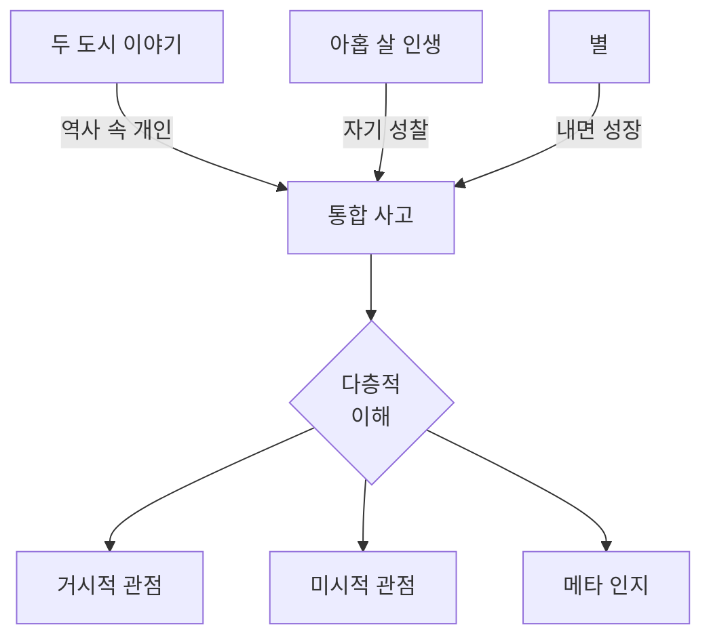

**21. 두 도시 이야기** - 찰스 디킨스 (아동용)
- **주제**: 역사, 희생, 사랑
- **핵심 통찰**: "개인의 선택이 역사를 만든다"
- **3가지 시각**: 프랑스 혁명(거시) + 개인 선택(미시) + 희생(본질)

**22. 아홉 살 인생** - 위기철
- **주제**: 성장, 인생, 철학
- **핵심 통찰**: "어릴 때부터 인생을 성찰할 수 있다"
- **성찰 연습**: 나는 누구? 무엇을 원해? 어떻게 살아야 해?

**23. 별** - 알퐁소 데 생텍쥐페리 (어린 왕자 작가의 다른 작품)
- **주제**: 고독, 우정, 내면 성장
- **핵심 통찰**: "진짜 친구는 마음으로 만난다"
- **3가지 생각 조각**:
  1. 🌟 고독 속 발견
  2. 💎 내면의 빛
  3. 🤝 진정한 연결

---

#### 🌍 역사/사회 심화 (3권)

**24. 총, 균, 쇠** (청소년판) - 재러드 다이아몬드
- **주제**: 문명, 역사, 환경
- **핵심 통찰**: "환경이 역사의 흐름을 만든다"
- **구조적 사고**: 지리 → 농업 → 기술 → 문명

**25. 살아있는 한국사 교과서** - 전국역사교사모임
- **주제**: 한국사, 현재와 연결
- **핵심 통찰**: "역사는 과거가 아닌 현재의 질문"
- **연결**: 역사적 사건 → 현재 사회 이슈

**26. 안네의 일기** - 안네 프랑크
- **주제**: 전쟁, 인권, 희망
- **핵심 통찰**: "어둠 속에서도 희망을 잃지 않기"
- **3가지 생각 조각**:
  1. 📖 일기 = 내면의 자유
  2. 🕊️ 어둠 속 희망
  3. 💪 인간의 존엄성

---

#### 🔬 과학/탐구 (2권)

**27. 파브르 곤충기** - 장 앙리 파브르
- **주제**: 관찰, 탐구, 끈기
- **핵심 통찰**: "작은 것을 깊게 보면 우주가 보인다"
- **과학적 방법**: 관찰 → 질문 → 가설 → 실험 → 결론

**28. 코스모스 (청소년판)** - 칼 세이건
- **주제**: 우주, 과학, 경이
- **핵심 통찰**: "우리는 별의 물질로 만들어졌다"
- **3가지 생각 조각**:
  1. 🌌 우주의 크기 = 겸손
  2. ⭐ 별의 일생 = 모든 것의 연결
  3. 🌍 창백한 푸른 점 = 지구의 소중함

---

#### 💡 자기계발/성장 (2권)

**29. 생각의 탄생** (청소년판) - 미셸 루트번스타인
- **주제**: 창의성, 사고 도구
- **핵심 통찰**: "창의성은 학습 가능한 기술"
- **13가지 사고 도구**: 관찰, 형상화, 패턴 인식, 유추, 감정이입 등

**30. 어린이를 위한 7가지 습관** - 숀 코비
- **주제**: 습관, 자기관리, 목표
- **핵심 통찰**: "좋은 습관이 인생을 바꾼다"
- **7가지 습관**:
  1. 주도적이 되기
  2. 목표 세우기
  3. 중요한 것 먼저
  4. Win-Win 사고
  5. 경청하기
  6. 시너지
  7. 심신 단련
- **주제**: 관찰, 탐구, 끈기
- **핵심 통찰**: "작은 것을 깊게 보면 우주가 보인다"
- **과학적 사고**:
  ```mermaid
  graph LR
      A[관찰] --> B[질문]
      B --> C[가설]
      C --> D[실험]
      D --> E[결론]
      E --> A
  ```

---

#### 🌍 역사/사회: 큰 그림 보기

**15. 총, 균, 쇠** (청소년판) - 재러드 다이아몬드
- **주제**: 문명, 환경, 역사
- **핵심 통찰**: "환경이 역사의 흐름을 만든다"
- **구조적 사고**: 지리 → 농업 → 기술 → 문명

**16. 살아있는 한국사 교과서**
- **주제**: 한국사, 현재와의 연결
- **핵심 통찰**: "역사는 과거가 아닌 현재의 질문"

---

#### 💡 자기계발: 실행력 키우기

**17. 생각의 탄생** (청소년판) - 미셸 루트번스타인
- **주제**: 창의성, 천재의 사고법
- **핵심 통찰**: "창의성은 학습 가능한 기술"
- **13가지 사고 도구**:
  1. 관찰
  2. 형상화
  3. 추상화
  4. 패턴 인식
  5. 유추
  6. 몸으로 생각하기
  7. 감정이입
  8. 차원적 사고
  9. 모델 만들기
  10. 놀이
  11. 변형
  12. 통합
  13. 통찰

**18. 어린이를 위한 7가지 습관** - 숀 코비
- **주제**: 습관, 자기관리, 목표
- **핵심 통찰**: "좋은 습관 = 자동화된 성장"
- **7가지 습관**:
  ```mermaid
  graph TD
      A[1. 주도적이 되기] --> D[개인 성공]
      B[2. 목표 세우기] --> D
      C[3. 중요한 것 먼저] --> D
      
      D --> G[4. Win-Win 사고]
      G --> H[5. 경청하기]
      H --> I[6. 시너지]
      I --> J[7. 심신 단련]
      
      style D fill:#ffeb3b
      style I fill:#4caf50
  ```

---

## 🔗 5대 주제별 융합 독서 프로젝트

### 💗 주제 1: 감정 - 마음을 이해하고 표현하기

**📚 융합 독서 리스트 (3권)**
1. 100만 번 산 고양이 - 진정한 사랑
2. 괴물들이 사는 나라 - 감정 표현
3. 마당을 나온 암탉 - 모성애

**🔍 융합 질문**
- 3권에서 공통으로 나타나는 감정은?
- 주인공들은 어떻게 감정을 표현했나?
- 나는 감정을 어떻게 표현하나?

**🎨 통합 프로젝트 (4주)**
```
Week 1-2: 감정 그림 일기
• 3권 읽으면서 내 감정 그리기
• 감정 단어 30개 모으기

Week 3-4: 감정 그림책 만들기
• 나의 감정 이야기 (8장)
• 친구들과 발표회
```

---

### 💰 주제 2: 돈 - 경제의 기초 이해하기

**📚 융합 독서 리스트 (3권)**
1. 강아지똥 - 가치의 발견
2. 경제 그림책 - 돈의 역할
3. 어린 왕자 - 진짜 가치

**🔍 융합 질문**
- 돈으로 살 수 있는 것 vs 살 수 없는 것?
- 가치는 어떻게 생기나?
- 나에게 소중한 것은?

**🎨 통합 프로젝트 (4주)**
```
Week 1-2: 용돈 관리 보드게임 설계
• 게임 규칙 만들기
• 돈 벌기, 쓰기, 저축하기

Week 3-4: 실제 게임 제작
• 보드판 그리기
• 친구들과 플레이 테스트
```

---

### 🤝 주제 3: 만남 - 관계의 소중함

**📚 융합 독서 리스트 (3권)**
1. 어린 왕자 - 길들임과 책임
2. 나는 기다립니다 - 인내와 기다림
3. 모모 - 경청의 힘

**🔍 융합 질문**
- 좋은 친구란 무엇일까?
- 가족은 왜 소중할까?
- 나는 좋은 친구인가?

**🎨 통합 프로젝트 (4주)**
```
Week 1-2: 우정 스토리북
• 나와 친구의 이야기
• 그림과 글로 표현

Week 3-4: 감사 편지 쓰기
• 가족, 친구에게
• 낭독회 열기
```

---

### 🧘 주제 4: 성찰 - 나는 누구인가?

**📚 융합 독서 리스트 (3권)**
1. 아홉 살 인생 - 인생 질문
2. 소크라테스 축구단 - 철학적 사고
3. 생각하는 ㄱㄴㄷ - 추상 개념

**🔍 융합 질문**
- 나는 누구인가?
- 나는 무엇을 좋아하나?
- 나의 꿈은 무엇인가?

**🎨 통합 프로젝트 (4주)**
```
Week 1-2: 나의 꿈 발표
• 10년 후 나의 모습
• 그림, 글, 발표

Week 3-4: 꿈 달력 만들기
• 매일 할 일
• 습관 체크
```

---

### 🎮 주제 5: 여가 - 상상하고 창조하기

**📚 융합 독서 리스트 (3권)**
1. 점 - 시작의 용기
2. 생각의 탄생 - 창의적 사고
3. 파브르 곤충기 - 관찰의 재미

**🔍 융합 질문**
- 상상력은 어떻게 키울까?
- 창의성이란 무엇일까?
- 나만의 놀이는?

**🎨 통합 프로젝트 (4주)**
```
Week 1-2: 상상 놀이터 설계
• 나만의 놀이터 그리기
• 어떤 놀이를 할까?

Week 3-4: 미니어처 제작
• 종이, 상자로 만들기
• 친구들 초대해서 놀기
```

---

## 🌈 융합 메가 프로젝트 (5대 주제 통합)

### 프로젝트: 우리 동네 문제 해결하기 (8주)

**5대 주제로 문제 보기**
```
💗 감정: 외로운 할머니, 할아버지
💰 돈: 작은 가게가 문 닫아요
🤝 만남: 친구들이 만날 곳이 없어요
🧘 성찰: 나는 어떻게 도울 수 있을까?
🎮 여가: 재미있는 놀이가 없어요
```

**Week 1-2: 문제 발견**
- 동네 탐험하기
- 사람들 인터뷰 (10명)
- 문제 5개 찾기

**Week 3-4: 솔루션 아이디어**
- 책에서 배운 것 적용
- 아이디어 그림 그리기
- 친구들과 토론

**Week 5-6: 미니 프로젝트**
- 작은 것부터 시작
- 예: 할머니께 편지, 가게 포스터

**Week 7-8: 발표회**
- 무엇을 했나?
- 어떤 변화가 있었나?
- 더 하고 싶은 것은?

---

## 📖 학년별 독서 여정

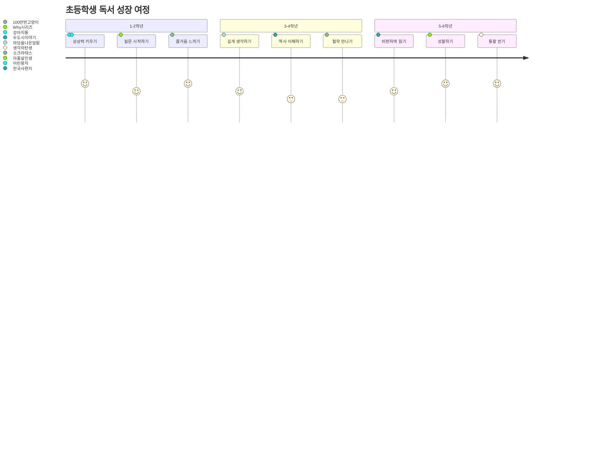

---

## 🎨 통찰력 키우는 독서 활동

### 1. 3-2-1 브리지 (연결하기)

```
읽기 전:
- 3가지 생각/이미지
- 2가지 질문
- 1가지 비유

읽기 후:
- 3가지 새로운 생각
- 2가지 답/새 질문
- 1가지 변화된 비유

연결: 무엇이 변했나?
```

### 2. 관점 쪼개기 (다층 사고)

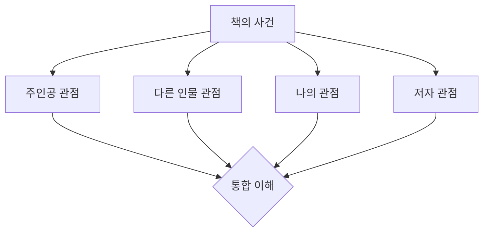

### 3. 개념 융합하기

| 책 A | 책 B | 융합 아이디어 |
|------|------|--------------|
| 어린 왕자 (본질) | 마당을 나온 암탉 (선택) | "본질을 보고 선택하기" |
| 파브르 곤충기 (관찰) | 생각의 탄생 (창의성) | "관찰이 창의의 시작" |
| 한국사 편지 (과거) | 총균쇠 (구조) | "역사의 큰 흐름 이해" |

### 4. 질문 나무 키우기

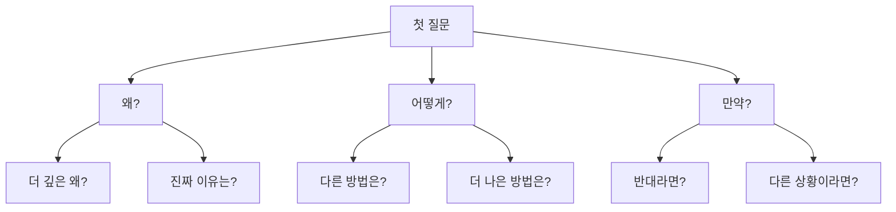

---

## 🌟 학년별 핵심 역량 목표

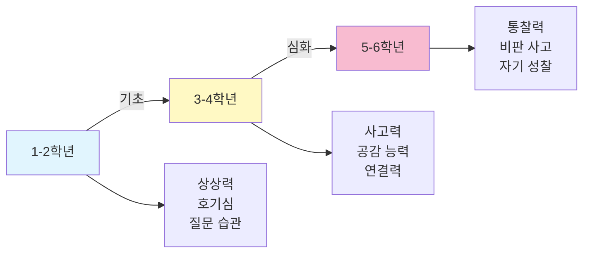

### 1-2학년: 씨앗 심기 🌱
- **목표**: 책 읽기가 즐거운 경험이 되기
- **핵심**: 상상하고, 질문하고, 표현하기
- **방법**: 소리 내어 읽기, 그림 그리기, 이야기하기

### 3-4학년: 뿌리 내리기 🌿
- **목표**: 깊게 생각하는 습관 만들기
- **핵심**: 연결하고, 비교하고, 분석하기
- **방법**: 질문 노트, 마인드맵, 토론하기

### 5-6학년: 꽃 피우기 🌸
- **목표**: 자기만의 생각 갖기
- **핵심**: 비판하고, 성찰하고, 창조하기
- **방법**: 에세이, 프로젝트, 발표하기

---

## 💬 학부모/교사 가이드

### 통찰력 키우는 5가지 질문

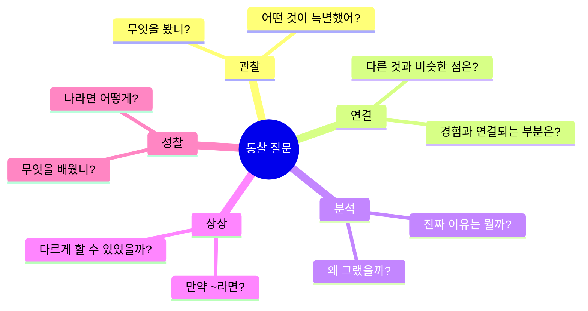

### 독서 환경 만들기

1. **시간**: 하루 20-30분, 같은 시간
2. **공간**: 편안하고 조용한 독서 코너
3. **선택**: 아이가 고르게 하기 (안내는 하되 강요 X)
4. **대화**: 읽은 후 함께 이야기하기
5. **표현**: 다양한 방식으로 표현 격려

---

**마지막 조언** 🌈

초등학교 독서는 **속도가 아닌 깊이**, **양이 아닌 질**이 중요합니다.

### ⭐ 핵심 원칙

**1. 한 권은 렌즈로**
```
❌ 책 1권 → 독후감 1개
✅ 책 1권 → 6가지 렌즈 → 다양한 생각
```

**2. 여러 권은 융합으로**
```
❌ 책 3권 → 개별적으로 읽기
✅ 책 3권 → 연결하여 융합 → 새로운 통찰
```

**3. 주제별 프로젝트로**
```
❌ 독후감 쓰기
✅ 주제별 3권 읽고 → 창작 프로젝트
   (그림책, 보드게임, 연극, 발표 등)
```

### 💡 실천 가이드

한 권을 읽더라도:
- 🔍 6가지 렌즈로 깊게 생각하고
- 🔗 다른 책과 연결하고
- 💬 친구들과 이야기 나누고
- 🎨 프로젝트로 표현하기

이것이 평생의 독서 습관과 창의적 사고력을 만듭니다!

📚 → 🔍 (6가지 렌즈) → 🔗 (융합) → 🎨 (프로젝트)
