# 📚 필독서 종합 가이드

> **목적**: 초등학생부터 대학생까지 단계별 독서 로드맵  
> **접근법**: 미네르바 스쿨 HC + 융합 사고 + 프로젝트 기반  
> **핵심**: 5대 관심 영역(감정·돈·만남·성찰·여가)으로 세상을 보는 눈 키우기

---

## 🌟 5대 영역 기반 독서 시스템

> **모든 책은 5대 관심 영역 중 하나 이상과 연결됩니다**
> 
> 같은 책도 어떤 렌즈로 보느냐에 따라 다른 문제를 발견하고,
> 다른 솔루션을 만들 수 있습니다.

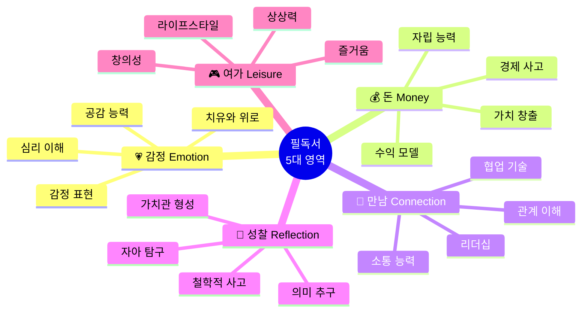

### 5대 영역별 독서 목표

| 영역 | 초등학생 목표 | 중학생 목표 | 고등학생 목표 | 대학생 목표 |
|------|------------|----------|-----------|-----------|
| **💗 감정** | 감정 인식 & 표현 | 공감 & 위로 능력 | 심리 분석 & 치유 | 정신건강 솔루션 |
| **💰 돈** | 경제 개념 이해 | 가치 창출 아이디어 | 비즈니스 모델 설계 | 실제 수익 창출 |
| **🤝 만남** | 친구 관계 이해 | 소통 & 협업 능력 | 네트워킹 & 리더십 | 커뮤니티 빌딩 |
| **🧘 성찰** | 나는 누구? 질문 | 가치관 형성 | 철학적 사고 체계 | 사회적 실천 |
| **🎮 여가** | 상상력 & 창의성 | 취미 & 문화 이해 | 라이프스타일 탐구 | 문화 산업 혁신 |

### 5대 영역 × 학년별 필독서 매트릭스

| 영역 | 초등 추천 권수 | 중등 추천 권수 | 고등 추천 권수 | 대학 추천 권수 |
|------|------------|------------|------------|------------|
| 💗 감정 | 8권 (27%) | 6권 (20%) | 5권 (17%) | 4권 (13%) |
| 💰 돈 | 3권 (10%) | 5권 (17%) | 7권 (23%) | 8권 (27%) |
| 🤝 만남 | 7권 (23%) | 6권 (20%) | 5권 (17%) | 5권 (17%) |
| 🧘 성찰 | 4권 (13%) | 7권 (23%) | 8권 (27%) | 8권 (27%) |
| 🎮 여가 | 8권 (27%) | 6권 (20%) | 5권 (17%) | 5권 (17%) |
| **총** | **30권** | **30권** | **30권** | **30권** |

**연령별 영역 비중 변화**:
- **초등**: 감정·여가 중심 (상상력, 공감)
- **중등**: 성찰 비중 증가 (정체성 탐구)
- **고등**: 돈·성찰 중심 (철학, 경제)
- **대학**: 돈·성찰 최고 (실행, 전문성)

---

## 🌈 전체 구조 한눈에 보기

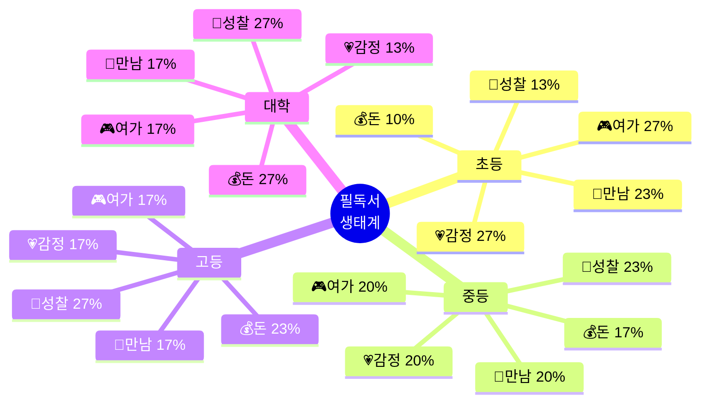

---

## 📊 학년별 성장 로드맵

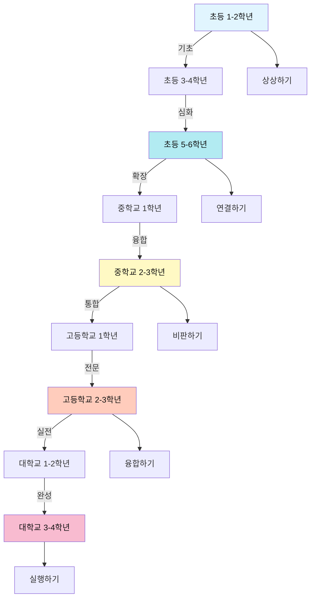

---

## 🎯 핵심 역량 매트릭스

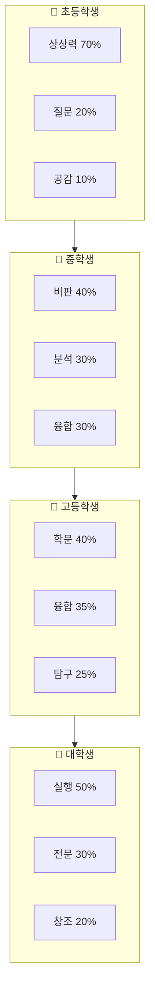

---

## 📚 학년별 필독서 구성 (총 120권)

| 학년 | 추천 도서 | 난이도 구성 | 핵심 역량 | 주요 활동 |
|------|-----------|-------------|-----------|-----------|
| **초등학생** | **30권** | 하10/중10/상10 | 상상력, 호기심, 공감 | 그림, 이야기, 질문 |
| **중학생** | **30권** | 중1 10/중2 10/중3 10 | 비판, 융합, 분석 | 토론, 프로젝트, 리서치 |
| **고등학생** | **30권** | 고1 10/고2 10/고3 10 | 학문, 통합, 탐구 | 논문, 연구, 융합 |
| **대학생** | **30권** | 학년별 균등 | 전문, 실행, 창조 | 창업, 프로젝트, MVP |

### 특징
- ✅ **고전 + 신간**: 균형있는 구성
- ✅ **다양한 분야**: 문학, 철학, 과학, 경제, 예술, 기술
- ✅ **실전 중심**: 읽고 → 생각하고 → 만들기
- ✅ **융합 사고**: 책과 책 사이의 연결
- ✅ **프로젝트 기반**: 모든 독서를 프로젝트로

---

## 🔗 책들의 연결망 (전체 맵)

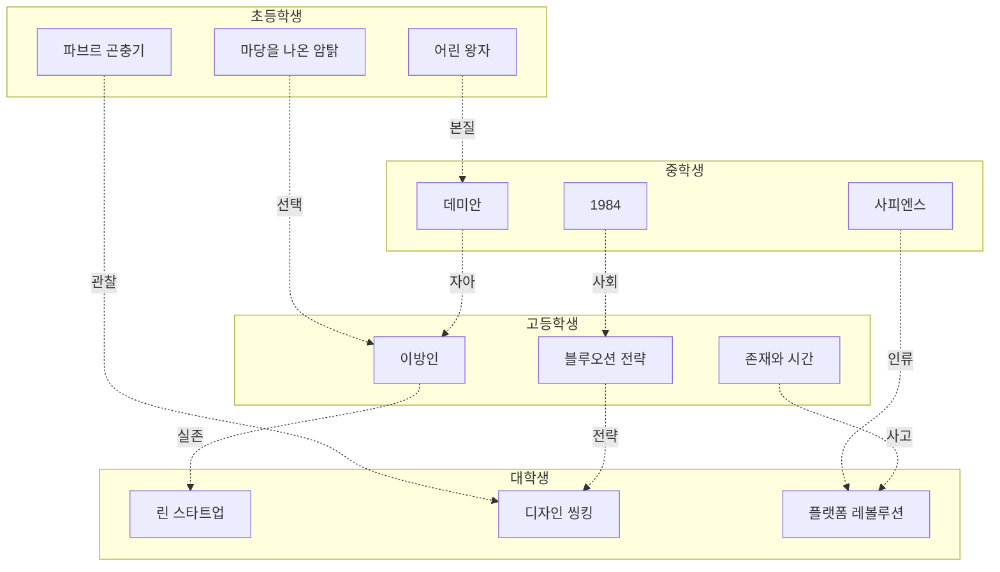

---

## 📖 각 학년별 상세 가이드

### 🌱 [초등학생 필독서](./초등학생_필독서.md)

**핵심 철학**: 즐겁게 읽고, 자유롭게 상상하기

**5대 주제별 도서:**
- 💗 감정 (8권): 100만 번 산 고양이, 괴물들이 사는 나라, 마당을 나온 암탉
- 💰 돈 (3권): 용돈 관리 동화, 경제 그림책
- 🤝 만남 (7권): 어린 왕자, 강아지똥, 나는 기다립니다
- 🧘 성찰 (4권): 아홉 살 인생, 소크라테스 아저씨네 축구단
- 🎮 여가 (8권): 구름빵, 점, Why 시리즈

**독서 방식**:
- **개별 독서**: 한 권을 6가지 렌즈로 (초등용 간단 버전)
- **융합 활동**: 그림, 이야기, 역할극
- **프로젝트**: 같은 주제 3권 읽고 → 창작 활동

---

### 🌿 [중학생 필독서](./중학생_필독서.md)

**핵심 철학**: 질문하고, 연결하고, 비판하기

**5대 주제별 도서:**
- 💗 감정 (6권): 데미안, 아몬드, 언어의 온도, 연금술사
- 💰 돈 (5권): 괴짜경제학, 넛지, 총 없는 전쟁, 경제학 콘서트
- 🤝 만남 (6권): 어떻게 원하는 것을 얻는가, 정의란 무엇인가
- 🧘 성찰 (7권): 소피의 세계, 죄와 벌, 생각에 관한 생각, 사피엔스
- 🎮 여가 (6권): 모모, 그리스인 조르바, 호밀밭의 파수꾼

**독서 방식**:
- **개별 독서**: 한 권을 10가지 렌즈로 (미네르바 방식)
- **융합 독서**: 같은 주제 3-5권 연결 분석
- **통합 프로젝트**: 주제별 실전 프로젝트 (12주)

---

### 🌳 [고등학생 필독서](./고등학생_필독서.md)

**핵심 철학**: 융합하고, 탐구하고, 통합하기

**5대 주제별 도서:**
- 💗 감정 (5권): 참을 수 없는 존재의 가벼움, 죄와 벌, 예술의 위로
- 💰 돈 (7권): 국부론, 블루오션 전략, 경쟁 전략, 21세기 자본
- 🤝 만남 (5권): 권력의 법칙, 설득의 심리학, 팀 오브 팀
- 🧘 성찰 (8권): 이방인, 순수이성비판, 존재와 시간, 파우스트
- 🎮 여가 (5권): 백년의 고독, 오리지널스, 생각의 탄생

**독서 방식**:
- **개별 독서**: 10가지 렌즈 + 다층 분석
- **융합 독서**: 학제간 융합 (5-7권)
- **통합 프로젝트**: 연구 논문 or 창업 기획 (16주)

---

### 🚀 [대학생 필독서](./대학생_필독서.md)

**핵심 철학**: 실행하고, 창조하고, 영향력 발휘하기

**5대 주제별 도서:**
- 💗 감정 (4권): 훅, 설득의 심리학, 사용자 경험 디자인
- 💰 돈 (8권): 린 스타트업, 제로 투 원, 블루오션, 그로스 해킹, 플랫폼 레볼루션
- 🤝 만남 (5권): 실리콘밸리의 팀장들, 멀티플라이어, OKR, 팀 오브 팀
- 🧘 성찰 (8권): 7가지 습관, 아토믹 해빗, Deep Work, 호모 데우스
- 🎮 여가 (5권): 디자인 씽킹, 오리지널스, 창의성의 기원

**독서 방식**:
- **개별 독서**: 10가지 렌즈 + 실전 적용
- **융합 독서**: 주제별 클러스터 (7-10권)
- **메가 프로젝트**: 실제 창업 or 소셜 벤처 (6개월)

---

## 🎨 5대 주제별 가로지르기

### 💗 주제 1: 감정 (Emotion) - 공감과 치유

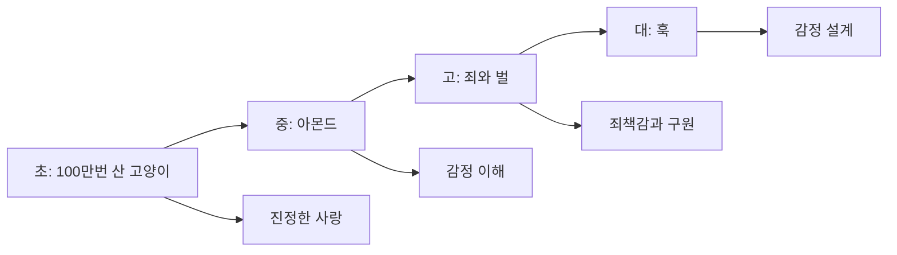

**프로젝트 흐름:**
- 초등: 감정 그림 일기
- 중등: 공감 능력 향상 캠페인
- 고등: 심리 치유 콘텐츠
- 대학: 정신건강 앱 개발

---

### 💰 주제 2: 돈 (Money) - 가치 창출

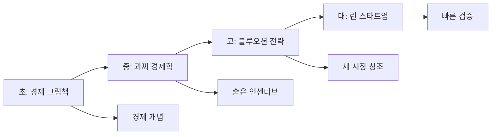

**프로젝트 흐름:**
- 초등: 용돈 관리 프로젝트
- 중등: 학교 매점 개선 제안
- 고등: 비즈니스 모델 설계
- 대학: 실제 수익 창출

---

### 🤝 주제 3: 만남 (Connection) - 관계와 협업

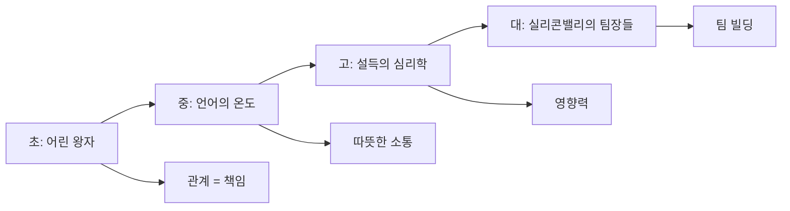

**프로젝트 흐름:**
- 초등: 친구 관계 개선
- 중등: 학급 소통 문화
- 고등: 동아리 리더십
- 대학: 커뮤니티 플랫폼

---

### 🧘 주제 4: 성찰 (Reflection) - 자아와 의미

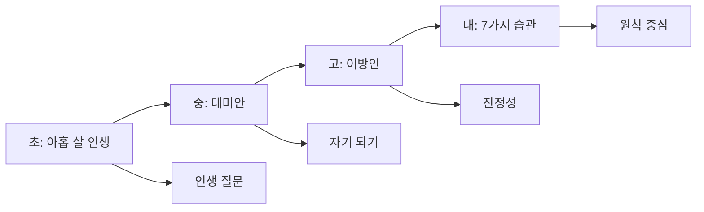

**프로젝트 흐름:**
- 초등: 나는 누구? 탐구
- 중등: 가치관 워크숍
- 고등: 인생 철학 에세이
- 대학: 개인 성장 시스템

---

### 🎮 주제 5: 여가 (Leisure) - 창의와 즐거움

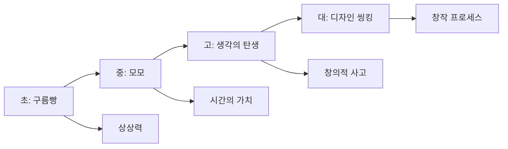

**프로젝트 흐름:**
- 초등: 상상 놀이터
- 중등: 문화 체험 기획
- 고등: 예술 창작
- 대학: 창의적 콘텐츠

---

## 💡 단계별 독서 사고 기법

### 초등: 3단계 질문법

```
1. 무엇? (관찰)
2. 왜? (이유)
3. 만약? (상상)
```

### 중등: 5단계 분석법

```
1. 관찰 (무엇을?)
2. 연결 (비슷한 것은?)
3. 분석 (왜 그럴까?)
4. 상상 (다르게 하면?)
5. 성찰 (나는?)
```

### 고등: 다층 읽기

```
Layer 1: 표면 (줄거리)
Layer 2: 주제 (의미)
Layer 3: 구조 (저자 의도)
Layer 4: 맥락 (시대 배경)
Layer 5: 적용 (현대 연결)
```

### 대학: 실행 루프

```
독서 → 이해 → 프로젝트 설계 →
실행 → 실패 → 배움 → 개선 →
재독 → 깊은 통찰
```

---

## 🌟 학년별 최종 목표

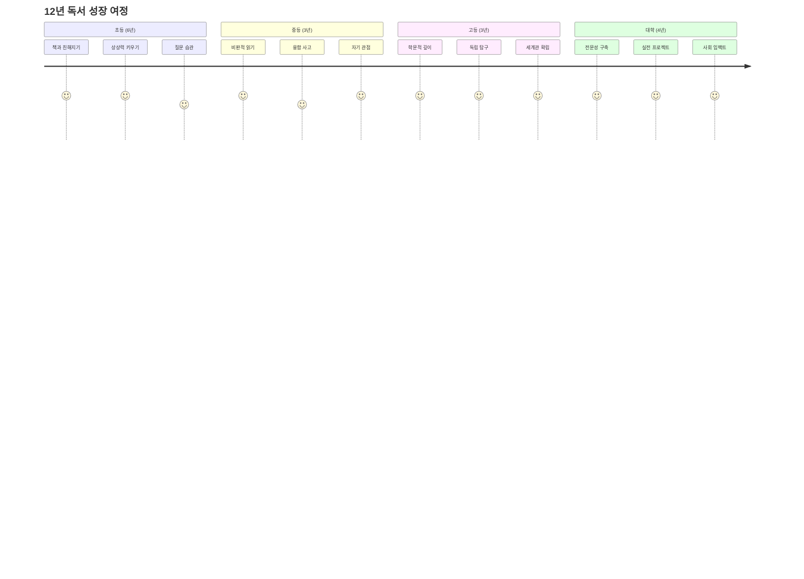

---

## 📝 각 파일 바로가기

1. **[초등학생 필독서](./초등학생_필독서.md)** - 상상력과 호기심 키우기
2. **[중학생 필독서](./중학생_필독서.md)** - 비판적 사고와 융합
3. **[고등학생 필독서](./고등학생_필독서.md)** - 학문적 깊이와 통합
4. **[대학생 필독서](./대학생_필독서.md)** - 실전 역량과 창업 정신

---

## 🎯 마지막 조언

### 부모/교사를 위한 가이드

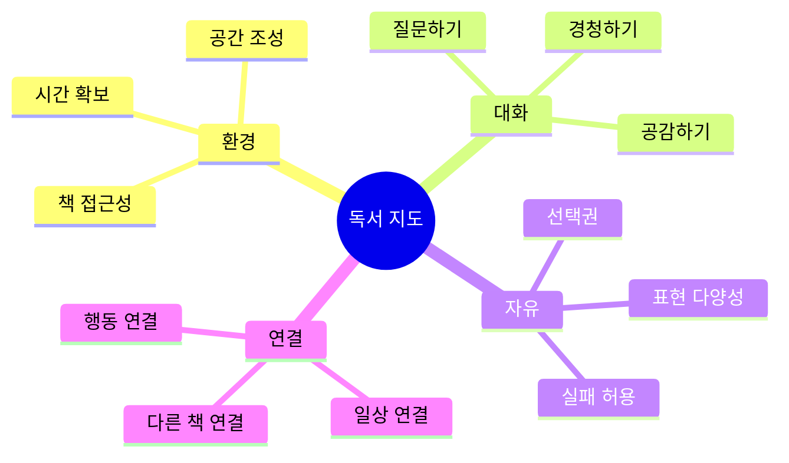

### 학생 스스로를 위한 팁

**초등학생에게**:
> 책은 놀이터입니다. 자유롭게 뛰어놀듯 읽으세요! 🎠

**중학생에게**:
> 모든 것을 의심하고 질문하세요. 그것이 성장입니다! 🤔

**고등학생에게**:
> 경계를 넘나들며 융합하세요. 독창성은 여기서 나옵니다! 🌈

**대학생에게**:
> 읽은 것을 만들어내세요. 실행이 진짜 배움입니다! 🚀

---

**최종 메시지** ✨

독서는 **목적지가 아닌 여정**입니다.

12년의 여정을 통해:
- 📚 초등: 책과 친구가 되고
- 🔍 중등: 생각하는 법을 배우고
- 🎓 고등: 자기만의 관점을 만들고
- 🚀 대학: 세상을 바꾸는 힘을 얻습니다

이 가이드는 지도일 뿐,  
여러분만의 여정을 만들어가세요!

**Happy Reading & Creating!** 📖✨🚀
• 다른 등장인물(나그네, 족제비)의 관점에서 보면?

[3단계: 적용]
• 나에게도 잎싹처럼 간절한 꿈이 있나요?
• 나는 무엇을 위해 용기를 낼 수 있을까요?

[4단계: 본질]
• 진정한 행복이란 무엇일까요?
• 자신의 삶을 산다는 것은 무엇일까요?

추천 프로젝트
━━━━━━━━━━━━━━━━━━━━━━━━
🎨 동화책: 
"잎싹의 이야기를 다른 관점에서 다시 쓰기"
(족제비, 초록이의 시점)

🎬 영상: 
"내 꿈 이야기 - 나는 무엇이 되고 싶은가?"
인터뷰 형식의 짧은 다큐

✍️ 글쓰기:
"10년 후 나에게 보내는 편지"
- 지금의 꿈
- 왜 그 꿈인지
- 어떻게 이룰 것인지

연계 도서
━━━━━━━━━━━━━━━━━━━━━━━━
• 《내 이름은 삐삐 롱스타킹》 - 아스트리드 린드그렌
• 《애니멀 팜》 - 조지 오웰 (고학년)
```

#### 2. 《모모》 - 미하엘 엔데

```markdown
기본 정보
━━━━━━━━━━━━━━━━━━━━━━━━
• 저자: 미하엘 엔데
• 출판사: 비룡소
• 페이지: 416쪽
• 난이도: ⭐⭐⭐

핵심 주제
━━━━━━━━━━━━━━━━━━━━━━━━
시간, 경청, 현대 사회 비판, 우정, 진정한 부

진짜 문제
━━━━━━━━━━━━━━━━━━━━━━━━
1. 시간을 절약한다는 것은 정말 좋은 것일까?
2. 진짜 부자는 누구일까?
3. 경청한다는 것은 무엇일까?
4. 바쁘다는 것은 좋은 것일까?

성찰 질문
━━━━━━━━━━━━━━━━━━━━━━━━
[1단계: 이해]
• 회색 신사들은 누구인가요?
• 모모의 특별한 능력은 무엇인가요?

[2단계: 분석]
• 왜 사람들은 회색 신사들의 말을 믿었을까요?
• 시간을 빼앗긴 사람들은 어떻게 변했나요?

[3단계: 적용]
• 나는 시간을 어떻게 사용하고 있나요?
• 내 주변에도 '회색 신사들'이 있나요?
• 누군가의 이야기를 진심으로 들어준 적이 있나요?

[4단계: 본질]
• 진정으로 중요한 것은 무엇일까요?
• 좋은 삶이란 무엇일까요?

추천 프로젝트
━━━━━━━━━━━━━━━━━━━━━━━━
🎨 인포그래픽:
"우리 가족의 시간 사용표"
- 하루 24시간을 어떻게 쓰는지
- 정말 중요한 것에 시간을 쓰고 있는지

🎬 영상:
"시간 부자 프로젝트"
- 1주일 동안 '시간 낭비' 줄이기 실험
- 변화 기록

✍️ 글쓰기:
"100세가 된 나의 인생 돌아보기"
- 어떤 것에 시간을 썼으면 좋았을까?

연계 도서
━━━━━━━━━━━━━━━━━━━━━━━━
• 《끝없는 이야기》 - 미하엘 엔데
• 《어린 왕자》 - 생텍쥐페리
```

#### 3. 《돼지책》 - 앤서니 브라운

```markdown
기본 정보
━━━━━━━━━━━━━━━━━━━━━━━━
• 저자: 앤서니 브라운
• 출판사: 웅진주니어
• 페이지: 32쪽
• 난이도: ⭐

핵심 주제
━━━━━━━━━━━━━━━━━━━━━━━━
성 평등, 가족 역할, 고정관념, 변화

진짜 문제
━━━━━━━━━━━━━━━━━━━━━━━━
1. 집안일은 누가 해야 하는 것일까?
2. 엄마, 아빠, 아이의 역할은 정해져 있을까?
3. 당연하다고 생각한 것이 정말 당연할까?
4. 공정함이란 무엇일까?

성찰 질문
━━━━━━━━━━━━━━━━━━━━━━━━
[1단계: 이해]
• 이 가족에게 무슨 일이 일어났나요?
• 엄마는 왜 집을 나갔나요?

[2단계: 분석]
• 왜 아빠와 아들들은 집안일을 안 했을까요?
• 마지막 장면에서 무엇이 바뀌었나요?

[3단계: 적용]
• 우리 집은 어떤가요?
• 나는 집에서 무엇을 도울 수 있나요?

[4단계: 본질]
• 가족이란 무엇일까요?
• 함께 산다는 것은 무엇일까요?

추천 프로젝트
━━━━━━━━━━━━━━━━━━━━━━━━
📊 인포그래픽:
"우리 가족 역할 분담표"
- 현재 vs 이상적인 모습
- 제안하는 변화

🎬 영상:
"1일 역할 바꾸기 챌린지"
- 엄마/아빠 역할 체험
- 느낀 점 공유

✍️ 글쓰기:
"공정한 가족 헌법 만들기"

연계 도서
━━━━━━━━━━━━━━━━━━━━━━━━
• 《종이봉지 공주》 - 로버트 문치
• 《우리 엄마》 - 앤서니 브라운
```

---

### 📖 카테고리 2: 우정과 관계 (6권)

#### 4. 《미움받을 용기》 (청소년판) - 기시미 이치로

```markdown
기본 정보
━━━━━━━━━━━━━━━━━━━━━━━━
• 저자: 기시미 이치로, 고가 후미타케
• 출판사: 인플루엔셜
• 페이지: 336쪽
• 난이도: ⭐⭐⭐⭐

핵심 주제
━━━━━━━━━━━━━━━━━━━━━━━━
자기 긍정, 인간관계, 용기, 과제 분리

진짜 문제
━━━━━━━━━━━━━━━━━━━━━━━━
1. 다른 사람의 인정 없이도 행복할 수 있을까?
2. 나의 가치는 누가 정하는 것일까?
3. 모든 사람에게 사랑받을 수 있을까? 필요할까?
4. 진짜 용기란 무엇일까?

성찰 질문
━━━━━━━━━━━━━━━━━━━━━━━━
[1단계: 이해]
• 아들러 심리학의 핵심은 무엇인가요?
• '과제 분리'란 무엇인가요?

[2단계: 분석]
• 왜 우리는 타인의 인정을 구하게 될까요?
• 열등감과 우월감은 어떻게 생기나요?

[3단계: 적용]
• 나는 다른 사람의 시선을 얼마나 의식하나요?
• 미움받을 용기가 필요했던 경험이 있나요?

[4단계: 본질]
• 나다운 삶이란 무엇일까요?
• 진정한 행복은 어디서 올까요?

추천 프로젝트
━━━━━━━━━━━━━━━━━━━━━━━━
✍️ 에세이:
"나를 괴롭히는 타인의 시선"
- 구체적 경험
- 과제 분리 적용
- 변화 계획

🎬 영상:
"미움받을 용기 실천 일기"
- 1주일 챌린지
- 작은 용기들의 기록

📱 웹 페이지:
"용기 격려 메시지 생성기"
- AI를 활용한 격려 메시지
- 상황별 조언

연계 도서
━━━━━━━━━━━━━━━━━━━━━━━━
• 《데일 카네기 인간관계론》 (청소년판)
• 《프레임》 - 최인철
```

---

### 📖 카테고리 3: 사회와 정의 (8권)

#### 5. 《꼬마 니콜라》 시리즈 - 르네 고시니

```markdown
기본 정보
━━━━━━━━━━━━━━━━━━━━━━━━
• 저자: 르네 고시니 (글), 장 자크 상페 (그림)
• 출판사: 문학동네
• 페이지: 약 150쪽/권
• 난이도: ⭐⭐

핵심 주제
━━━━━━━━━━━━━━━━━━━━━━━━
학교 생활, 우정, 가족, 유머, 어린이 관점

진짜 문제
━━━━━━━━━━━━━━━━━━━━━━━━
1. 어른들이 보는 세상과 아이들이 보는 세상은 왜 다를까?
2. 친구란 무엇일까?
3. 작은 문제들은 왜 그렇게 크게 느껴질까?
4. 일상에서 행복을 찾는 방법은?

성찰 질문
━━━━━━━━━━━━━━━━━━━━━━━━
[1단계: 이해]
• 니콜라와 친구들은 어떤 아이들인가요?
• 어떤 사건들이 일어나나요?

[2단계: 분석]
• 니콜라의 고민은 정말 작은 것일까요?
• 어른들은 왜 니콜라를 이해 못 하나요?

[3단계: 적용]
• 나도 비슷한 경험이 있나요?
• 내 친구들은 어떤 모습인가요?

[4단계: 본질]
• 진짜 행복은 어디에 있을까요?
• 어른이 되면서 잃는 것은 무엇일까요?

추천 프로젝트
━━━━━━━━━━━━━━━━━━━━━━━━
📖 동화책:
"우리 반 이야기"
- 니콜라 스타일로 우리 반 일상 기록
- AI로 삽화 제작

🎬 영상:
"하루 일기 브이로그"
- 니콜라처럼 유머러스하게
- 작은 일상의 소중함

✍️ 글쓰기:
"30년 후 나의 초등학교 추억"
- 지금 기억하고 싶은 것들

연계 도서
━━━━━━━━━━━━━━━━━━━━━━━━
• 《마틸다》 - 로알드 달
• 《톰 소여의 모험》 - 마크 트웨인
```

---

### 📖 카테고리 4: 다양성과 이해 (8권)

#### 6. 《원더》 - R. J. 팔라시오

```markdown
기본 정보
━━━━━━━━━━━━━━━━━━━━━━━━
• 저자: R. J. 팔라시오
• 출판사: 책읽는곰
• 페이지: 436쪽
• 난이도: ⭐⭐⭐

핵심 주제
━━━━━━━━━━━━━━━━━━━━━━━━
외모 차별, 편견, 용기, 친절, 다양성

진짜 문제
━━━━━━━━━━━━━━━━━━━━━━━━
1. 다르다는 것은 틀린 것일까?
2. 외모는 왜 중요하게 여겨질까?
3. 진짜 용기란 무엇일까?
4. 친절은 왜 중요할까?

성찰 질문
━━━━━━━━━━━━━━━━━━━━━━━━
[1단계: 이해]
• 어거스트는 어떤 아이인가요?
• 학교에서 어떤 일들이 일어났나요?

[2단계: 분석]
• 사람들은 왜 어거스트를 다르게 대했나요?
• 친구들은 어떻게 변화했나요?

[3단계: 적용]
• 나는 '다른' 사람을 어떻게 대하나요?
• 나도 다르다는 이유로 소외된 적이 있나요?

[4단계: 본질]
• 사람의 가치는 무엇으로 평가되어야 할까?
• 진정한 아름다움은 무엇일까?

추천 프로젝트
━━━━━━━━━━━━━━━━━━━━━━━━
🎬 영상:
"친절 실천 프로젝트"
- 1주일 동안 매일 친절 실천
- 변화 관찰 기록

✍️ 글쓰기:
"다양성 선언문"
- 우리 반이 지켜야 할 약속
- 모두가 존중받는 교실

📱 캠페인:
"Choose Kind 캠페인"
- 포스터, 영상, SNS
- 학교에서 실천

연계 도서
━━━━━━━━━━━━━━━━━━━━━━━━
• 《굿바이, 엘리》 - 황선미
• 《완득이》 - 김려령 (중학생)
```

---

## 🌿 중학생 (13-15세) 필독서 30권

### 선정 철학

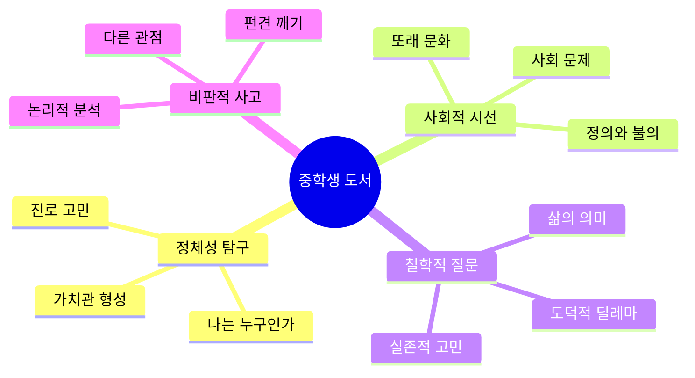

---

### 📖 카테고리 1: 정체성과 성장 (8권)

#### 1. 《데미안》 - 헤르만 헤세

```markdown
기본 정보
━━━━━━━━━━━━━━━━━━━━━━━━
• 저자: 헤르만 헤세
• 출판사: 민음사
• 페이지: 220쪽
• 난이도: ⭐⭐⭐⭐

핵심 주제
━━━━━━━━━━━━━━━━━━━━━━━━
자아 찾기, 선과 악, 운명, 성장, 멘토링

진짜 문제
━━━━━━━━━━━━━━━━━━━━━━━━
1. 진짜 나는 누구인가?
2. 선과 악의 경계는 명확할까?
3. 어른들의 세계와 내 세계는 왜 다를까?
4. 나는 어떤 사람이 되어야 할까?

성찰 질문
━━━━━━━━━━━━━━━━━━━━━━━━
[1단계: 이해]
• 싱클레어에게 데미안은 어떤 존재인가요?
• 두 개의 세계(밝음과 어둠)는 무엇을 상징하나요?

[2단계: 분석]
• 왜 싱클레어는 갈등하나요?
• 프란츠 크로머 사건은 무엇을 의미하나요?
• "새는 알을 깨고 나온다"는 무슨 뜻일까요?

[3단계: 적용]
• 나에게도 두 개의 세계가 있나요?
• 나를 안내해주는 '데미안' 같은 사람이 있나요?
• 나는 지금 어떤 알을 깨려고 하나요?

[4단계: 본질]
• 진정한 자기 자신이 된다는 것은?
• 운명과 자유의지는 어떻게 다를까?

추천 프로젝트
━━━━━━━━━━━━━━━━━━━━━━━━
✍️ 성찰 에세이:
"나의 데미안 - 내 인생의 멘토"
- 누가 나를 변화시켰나
- 어떤 영향을 받았나
- 나는 어떻게 변했나

🎨 비주얼 에세이:
"나의 두 세계"
- 밝은 세계와 어두운 세계
- AI 이미지로 시각화
- 통합의 과정

🎬 영상:
"알을 깨는 순간들"
- 내 인생의 전환점
- 변화의 기록

📱 웹 페이지:
"나를 찾는 여정"
- 인터랙티브 자기 탐색
- 철학적 질문들

연계 도서
━━━━━━━━━━━━━━━━━━━━━━━━
• 《싯다르타》 - 헤르만 헤세
• 《호밀밭의 파수꾼》 - J. D. 샐린저
• 《변신》 - 프란츠 카프카
```

#### 2. 《아몬드》 - 손원평

```markdown
기본 정보
━━━━━━━━━━━━━━━━━━━━━━━━
• 저자: 손원평
• 출판사: 창비
• 페이지: 296쪽
• 난이도: ⭐⭐⭐

핵심 주제
━━━━━━━━━━━━━━━━━━━━━━━━
감정, 공감, 다름, 우정, 성장

진짜 문제
━━━━━━━━━━━━━━━━━━━━━━━━
1. 감정이 없다면 인간일 수 있을까?
2. 공감 능력은 타고나는 것일까, 배우는 것일까?
3. '정상'과 '비정상'의 경계는 어디인가?
4. 다르다는 것은 틀린 것일까?

성찰 질문
━━━━━━━━━━━━━━━━━━━━━━━━
[1단계: 이해]
• 윤재는 왜 감정을 느끼지 못하나요?
• 곤이는 윤재에게 어떤 영향을 주나요?

[2단계: 분석]
• 감정을 못 느끼는 것과 표현 못 하는 것은 다른가요?
• 윤재는 정말 변화한 걸까요?

[3단계: 적용]
• 나는 내 감정을 잘 알고 있나요?
• 다른 사람의 감정을 얼마나 이해하나요?
• 공감하기 어려운 사람이 있었나요?

[4단계: 본질]
• 인간다움이란 무엇일까요?
• 진정한 이해란 무엇일까요?

추천 프로젝트
━━━━━━━━━━━━━━━━━━━━━━━━
📊 인포그래픽:
"감정의 스펙트럼"
- 나의 감정 지도
- 하루 동안의 감정 변화
- 데이터 시각화

✍️ 창작 소설:
"만약 내가 감정을 잃는다면"
- 상상 기반 단편 소설
- AI와 협업 스토리 개발

🎬 다큐멘터리:
"공감 실험 프로젝트"
- 다양한 사람 인터뷰
- 공감의 다양한 형태
- 배움의 기록

연계 도서
━━━━━━━━━━━━━━━━━━━━━━━━
• 《사람을 찾습니다》 - 캐서린 하운드
• 《나는 나로 살기로 했다》 - 김수현
```

---

### 📖 카테고리 2: 사회와 정의 (10권)

#### 3. 《1984》 - 조지 오웰

```markdown
기본 정보
━━━━━━━━━━━━━━━━━━━━━━━━
• 저자: 조지 오웰
• 출판사: 민음사
• 페이지: 424쪽
• 난이도: ⭐⭐⭐⭐

핵심 주제
━━━━━━━━━━━━━━━━━━━━━━━━
전체주의, 감시 사회, 자유, 진실, 언어 통제

진짜 문제
━━━━━━━━━━━━━━━━━━━━━━━━
1. 자유와 안전 중 무엇이 우선인가?
2. 진실은 누가 정하는 것인가?
3. 생각까지 통제할 수 있는가?
4. 현대 사회는 1984와 얼마나 다른가?

성찰 질문
━━━━━━━━━━━━━━━━━━━━━━━━
[1단계: 이해]
• 오세아니아는 어떤 사회인가요?
• 빅 브라더는 누구인가요?
• 사상경찰은 무엇을 하나요?

[2단계: 분석]
• 왜 과거를 끊임없이 수정하나요?
• 신어(Newspeak)의 목적은 무엇인가요?
• 사람들은 왜 저항하지 않나요?

[3단계: 적용]
• 현대 사회의 감시 시스템은? (CCTV, SNS, 빅데이터)
• 나의 생각은 정말 자유로운가?
• 무엇이 진실인지 어떻게 알 수 있나?

[4단계: 본질]
• 진정한 자유란 무엇인가?
• 권력과 진실의 관계는?

추천 프로젝트
━━━━━━━━━━━━━━━━━━━━━━━━
🎬 다큐 영상:
"우리 시대의 1984"
- 현대 감시 시스템 조사
- 전문가 인터뷰
- 비교 분석

✍️ 논술:
"감시와 자유의 균형"
- 찬반 논쟁
- 철학적 근거
- 정책 제안

📱 웹 프로젝트:
"디지털 프라이버시 가이드"
- 개인정보 보호 방법
- 디지털 발자국 관리
- AI 활용 정보 제공

🎨 패러디 작품:
"2084년의 이야기"
- 미래 예측 소설
- AI 시대의 디스토피아

연계 도서
━━━━━━━━━━━━━━━━━━━━━━━━
• 《동물농장》 - 조지 오웰
• 《멋진 신세계》 - 올더스 헉슬리
• 《파리대왕》 - 윌리엄 골딩
```

#### 4. 《총 균 쇠》 (청소년판) - 재레드 다이아몬드

```markdown
기본 정보
━━━━━━━━━━━━━━━━━━━━━━━━
• 저자: 재레드 다이아몬드
• 출판사: 김영사
• 페이지: 268쪽
• 난이도: ⭐⭐⭐⭐

핵심 주제
━━━━━━━━━━━━━━━━━━━━━━━━
문명의 발달, 지리적 결정론, 불평등, 역사

진짜 문제
━━━━━━━━━━━━━━━━━━━━━━━━
1. 왜 어떤 문명은 발달하고 어떤 문명은 그렇지 못했나?
2. 역사는 우연인가 필연인가?
3. 현재의 불평등은 과거의 결과인가?
4. 지리가 운명을 결정하는가?

성찰 질문
━━━━━━━━━━━━━━━━━━━━━━━━
[1단계: 이해]
• 총, 균, 쇠는 각각 무엇을 상징하나요?
• 야리의 질문은 무엇이었나요?

[2단계: 분석]
• 왜 유럽은 발달하고 아프리카는 그렇지 못했나요?
• 지리적 요인이 정말 결정적이었나요?

[3단계: 적용]
• 현재 세계의 불평등을 어떻게 설명할 수 있나?
• 한국의 발전은 어떻게 가능했나?

[4단계: 본질]
• 역사의 흐름을 바꿀 수 있나?
• 공정한 세계는 가능한가?

추천 프로젝트
━━━━━━━━━━━━━━━━━━━━━━━━
📊 인포그래픽:
"문명 발달 타임라인"
- 대륙별 비교
- 주요 요인 시각화
- 데이터 스토리텔링

✍️ 연구 보고서:
"한국 문명의 발달 요인"
- 지리적 특성
- 역사적 사건
- 문화적 요소

🎬 교육 영상:
"왜 세계는 불평등한가?"
- 쉽게 설명하기
- 애니메이션 활용
- AI로 시각화

연계 도서
━━━━━━━━━━━━━━━━━━━━━━━━
• 《사피엔스》 (청소년판) - 유발 하라리
• 《팩트풀니스》 - 한스 로슬링
```

---

### 📖 카테고리 3: 철학과 실존 (6권)

#### 5. 《소피의 세계》 - 요슈타인 가아더

```markdown
기본 정보
━━━━━━━━━━━━━━━━━━━━━━━━
• 저자: 요슈타인 가아더
• 출판사: 현암사
• 페이지: 630쪽
• 난이도: ⭐⭐⭐⭐

핵심 주제
━━━━━━━━━━━━━━━━━━━━━━━━
철학 입문, 존재, 인식론, 철학사

진짜 문제
━━━━━━━━━━━━━━━━━━━━━━━━
1. 나는 누구인가?
2. 세계는 어디서 왔는가?
3. 무엇이 진리인가?
4. 어떻게 살아야 하는가?

성찰 질문
━━━━━━━━━━━━━━━━━━━━━━━━
[1단계: 이해]
• 소피는 어떤 질문들을 받았나요?
• 각 철학자들의 핵심 사상은?

[2단계: 분석]
• 소크라테스의 "너 자신을 알라"는 무슨 뜻인가?
• 플라톤의 이데아론은 현실에 어떻게 적용되나?
• 실존주의가 말하는 '자유'는?

[3단계: 적용]
• 나는 어떤 철학을 가지고 있나?
• 내 삶의 원칙은 무엇인가?
• 나는 무엇을 믿는가?

[4단계: 본질]
• 철학이 필요한 이유는?
• 좋은 삶이란?

추천 프로젝트
━━━━━━━━━━━━━━━━━━━━━━━━
📱 웹 프로젝트:
"나의 철학 가이드"
- 인터랙티브 철학 소개
- AI 철학자와 대화
- 철학적 질문 생성기

✍️ 철학 에세이:
"나의 인생 철학"
- 어떤 철학자에게 공감하는가
- 나만의 철학 체계
- 삶에 적용하기

🎬 영상 시리즈:
"10대를 위한 철학 강의"
- 쉽게 풀어쓰기
- 일상 예시로 설명
- 애니메이션 활용

연계 도서
━━━━━━━━━━━━━━━━━━━━━━━━
• 《세상에서 가장 쉬운 철학책》
• 《군주론》 - 마키아벨리
```

---

### 📖 카테고리 4: 과학과 미래 (6권)

#### 6. 《코스모스》 (청소년판) - 칼 세이건

```markdown
기본 정보
━━━━━━━━━━━━━━━━━━━━━━━━
• 저자: 칼 세이건
• 출판사: 사이언스북스
• 페이지: 384쪽
• 난이도: ⭐⭐⭐

핵심 주제
━━━━━━━━━━━━━━━━━━━━━━━━
우주, 과학, 생명, 인류의 미래

진짜 문제
━━━━━━━━━━━━━━━━━━━━━━━━
1. 우주에서 인간의 위치는?
2. 우리는 어디서 왔고 어디로 가는가?
3. 우주에 우리만 있는가?
4. 과학은 왜 중요한가?

성찰 질문
━━━━━━━━━━━━━━━━━━━━━━━━
[1단계: 이해]
• 우주의 나이와 크기는?
• 생명은 어떻게 시작되었나?

[2단계: 분석]
• "우리는 별의 물질로 만들어졌다"는 무슨 뜻?
• 과학과 종교는 어떤 관계인가?

[3단계: 적용]
• 우주적 관점에서 내 문제는?
• 인류의 미래를 위해 할 수 있는 일은?

[4단계: 본질]
• 인간이란 무엇인가?
• 지식 추구의 의미는?

추천 프로젝트
━━━━━━━━━━━━━━━━━━━━━━━━
🎬 다큐멘터리:
"우주, 그리고 나"
- 우주의 규모 시각화
- AI 이미지 생성
- 철학적 성찰

✍️ SF 단편 소설:
"외계 생명체를 만나다"
- 과학적 근거 기반
- 철학적 질문 담기

📊 인포그래픽:
"우주의 역사"
- 빅뱅부터 현재까지
- 타임라인 시각화

연계 도서
━━━━━━━━━━━━━━━━━━━━━━━━
• 《이기적 유전자》 - 리처드 도킨스
• 《시간의 역사》 - 스티븐 호킹
```

---

## 🍃 고등학생 & 대학생 도서는 별도 파일로 계속...

---

## 📊 독서 계획 수립 가이드

### 1학기 (16주) 추천 독서 계획

#### 초등학생 계획

| 주차 | 책 | 주제 | 활동 |
|------|------|------|------|
| 1-4주 | 《마당을 나온 암탉》 | 꿈과 용기 | 동화책 만들기 |
| 5-8주 | 《원더》 | 다양성 | 친절 캠페인 |
| 9-12주 | 《모모》 | 시간의 가치 | 시간 사용 프로젝트 |
| 13-16주 | 자유 선택 + 발표회 | 종합 | 포트폴리오 완성 |

#### 중학생 계획

| 주차 | 책 | 주제 | 활동 |
|------|------|------|------|
| 1-4주 | 《아몬드》 | 감정과 공감 | 감정 탐구 프로젝트 |
| 5-8주 | 《1984》 | 자유와 감시 | 논술 작성 |
| 9-12주 | 《데미안》 | 자아 탐구 | 성찰 에세이 |
| 13-16주 | 프로젝트 완성 | 종합 | 발표 및 전시 |

---

완벽한 방향입니다! **미네르바 스쿨 방식의 세미나 + AI 연계**로 통찰력을 극대화하는 프로그램을 만들겠습니다.

"하나의 아이디어를 다양한 렌즈로 보는 통찰력" - 이것이 진짜 메타 인지 능력이고, AI 시대의 핵심 경쟁력입니다!


## 🎯 완성된 통합 시스템

### 📚 새로 추가된 핵심 문서

**1️⃣ [미네르바_세미나_가이드.md](미네르바_세미나_가이드.md)** - 완전히 새로운 문서!

```
🎓 미네르바 스타일 AI 세미나 가이드
├─ 10가지 사고 렌즈 프레임워크
│   ├─ 💰 경제: 비용과 수익
│   ├─ ⚖️ 윤리: 옳고 그름
│   ├─ 🧠 심리: 감정과 행동
│   ├─ 📜 역사: 패턴 인식
│   ├─ 🔧 기술: 작동 원리
│   ├─ 👥 사회: 구조 변화
│   ├─ 🌍 환경: 지속가능성
│   ├─ 🏛️ 정치: 권력 관계
│   ├─ 🎨 문화: 가치관
│   └─ 🔮 미래: 시나리오
│
├─ 5단계 학습 사이클
│   ├─ 1. 보기 (SEE): 다양한 예시
│   ├─ 2. 느끼기 (FEEL): 감정과 직관
│   ├─ 3. 사용하기 (USE): 실험과 테스트
│   ├─ 4. 만들기 (MAKE): AI 협업 창작
│   └─ 5. 수정하기 (REVISE): 피드백 반영
│
├─ 미네르바 세미나 운영법
│   ├─ 사전 학습 (Flipped Classroom)
│   ├─ 소크라테스식 토론
│   ├─ AI Multi-Agent 시뮬레이션
│   └─ 통합 통찰 도출
│
└─ 12주 커리큘럼
    ├─ Week 1-3: 다중 렌즈 마스터
    ├─ Week 4-7: 통합 프로젝트
    ├─ Week 8-10: 실전 창작
    └─ Week 11-12: 최종 발표
```

### 🔄 업데이트된 문서들

**2️⃣ README.md**
- ✅ Mode 1: 실행 모드 (6단계 사이클)
- ✅ Mode 2: 통찰 모드 (미네르바 세미나)
- ✅ 두 모드의 시너지 활용법

**3️⃣ 초등학생_필독서.md**
- ✅ 미네르바 세미나 활용법 섹션 추가
- ✅ 초등학생용 6가지 렌즈 (간단 버전)
- ✅ 5단계 학습 사이클 (초등 맞춤)
- ✅ AI와 함께 책 읽기 가이드

---

## 💡 핵심 차별점: 통찰력 극대화

### 기존 방식 vs 미네르바 방식

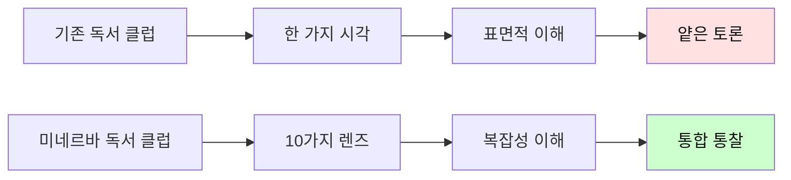

| 구분 | 기존 | 미네르바 방식 |
|------|------|-------------|
| **사고 방식** | 단선적 | 다차원적 (10개 렌즈) |
| **학습 깊이** | 표면 | 본질까지 |
| **토론 방식** | 일방적 발표 | 소크라테스식 질문 |
| **AI 활용** | 없음 or 단순 질문 | Multi-Agent, 전략적 협업 |
| **결과물** | 독후감 | MVP + 통찰 리포트 |
| **통찰력** | ⭐⭐ | ⭐⭐⭐⭐⭐ |

---

## 🚀 실전 활용 시나리오

### 시나리오 1: 4주 통합 프로그램

```
Week 1: 📚 독서 + 미네르바 세미나
├─ 월-목: 책 읽기 + 10가지 렌즈 분석
├─ 금: 2시간 세미나 (소크라테스식 토론)
└─ 토-일: 성찰 저널 + AI 대화

Week 2: 🔍 5단계 사이클 (보기-느끼기-사용하기)
├─ 보기: 경쟁 분석, 사례 연구
├─ 느끼기: 공감 인터뷰 10명
└─ 사용하기: 프로토타입 테스트

Week 3: 🛠️ 만들기 + 수정하기
├─ 만들기: AI 협업으로 MVP 제작
├─ 수정하기: 베타 테스트 + 피드백
└─ 금: 중간 공유 세미나

Week 4: 🎤 발표 + 통합 통찰
├─ 월-목: 최종 완성 + 피칭 준비
├─ 금: Demo Day (피칭 + Q&A)
└─ 토-일: 포트폴리오 정리
```

### 시나리오 2: 16주 마스터 프로그램

```
Phase 1 (Week 1-4): 미네르바 기초
• 3권의 책을 각각 10가지 렌즈로
• 세미나 방식 익히기
• AI 활용법 마스터

Phase 2 (Week 5-8): 통합 프로젝트
• 하나의 아이디어를 10가지 렌즈로 분석
• 5단계 사이클 완전 학습
• 5000자 통찰 리포트

Phase 3 (Week 9-12): 실전 창작
• 비즈니스 모델 + MVP 제작
• 실제 사용자 확보
• 반복 개선

Phase 4 (Week 13-16): 마스터 발표
• 최종 프로젝트 완성
• 20분 마스터 피칭
• 포트폴리오 구축
```

---

## 🎓 미네르바의 핵심 가치

### 1. 복잡성 이해 (Complexity Thinking)

> "세상은 단순하지 않다. 하나의 문제를 다양한 각도에서 봐야 한다."

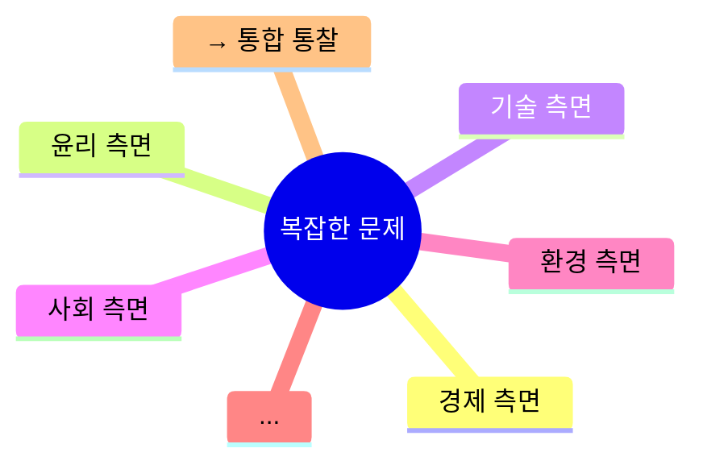

### 2. 메타 인지 (Meta-Cognition)

> "내가 어떻게 생각하는지 생각하기"

- 내 편견은 무엇인가?
- 어떤 렌즈를 선호하는가?
- 놓치고 있는 관점은?

### 3. 실행 지향 (Action-Oriented)

> "생각만 하지 말고 만들어라"

- 2주 MVP 룰
- 5단계 완전 학습
- 빠른 반복

---

## 💪 기대 효과

| 역량 | Before | After (4개월) |
|------|--------|--------------|
| **통찰력** | 한 가지 시각 | 10가지 렌즈 통합 사고 |
| **질문력** | "재밌었어요" | "왜? 어떻게? 만약?" |
| **토론력** | 일방적 발표 | 소크라테스식 대화 |
| **실행력** | 생각만 | 2주 내 MVP 완성 |
| **AI 활용** | 단순 질문 | 전략적 협업 파트너 |
| **포트폴리오** | 독후감 | 실제 작품 + 통찰 리포트 |

### 실제 사례 시뮬레이션

**주제: "AI 챗봇이 교육에 미치는 영향"**

```
[일반 학생]
"AI 챗봇은 편리해요. 질문하면 답해주니까요."
→ 끝

[미네르바 학생]
"10가지 렌즈로 분석하니:
• 경제: 학원 시장 재편, 개인 교사 대체
• 윤리: 의존성, 비판적 사고 약화 위험
• 심리: 즉각적 만족, 인내심 감소
• 기술: 자연어 처리 한계, 편향성
... (10가지 모두)

충돌 발견: 경제(효율) vs 윤리(교육 질)
→ 해결책: 하이브리드 모델
→ MVP: 선생님 + AI 협업 플랫폼 제작
→ 베타 테스트: 5개 학교 30명
→ 피드백: 학습 효과 20% 향상 확인"
```

---

## 🎯 다음 스텝

### 즉시 시작 가이드

```markdown
✅ Day 1: 문서 읽기
□ [미네르바_세미나_가이드.md] 정독
□ 10가지 렌즈 익히기
□ 5단계 사이클 이해

✅ Day 2-3: 첫 연습
□ 책 1권 선택
□ 10가지 렌즈로 분석 (각 300자)
□ AI와 대화하며 심화

✅ Day 4-7: 첫 세미나
□ 친구들 모집 (10-15명)
□ 세미나 진행 (2시간)
□ 피드백 수집

✅ Week 2-4: 프로젝트
□ 5단계 사이클 적용
□ MVP 제작
□ 발표 & 포트폴리오
```

---

**"하나를 보되 열을 생각하라. 생각만 하지 말고 만들어라."**

**From One Book → Ten Lenses → Five Cycles → One Solution** 📚 → 🔍 → 🔄 → 🚀💡

## 🎯 마무리

완벽하게 이해했습니다! **5대 주제 중심**으로 재구성하겠습니다.

**핵심 차이:**
- ❌ 책 1권 → 프로젝트 1개 (너무 개별적)
- ✅ **주제별 여러 권 → 융합 프로젝트 1개** (통합적)

5대 주제별로 독서 클러스터를 만들고, 실전 프로젝트를 설계하겠습니다!

[1 tool called]

완성했습니다! 이제 종합 가이드를 업데이트하여 **5대 주제 중심 구조**를 명확히 하겠습니다.

[6 tools called]

완성했습니다! 🎉

## ✨ 새로운 **5대 주제 중심 독서 시스템** 완성!

### 📁 생성된 핵심 문서

**1. [5대주제_프로젝트_가이드.md](./5대주제_프로젝트_가이드.md)** ⭐ 새로 생성!

```
🎯 핵심 구조
├─ 3단계 독서 시스템
│   ├─ 1단계: 개별 독서 (한 권을 10가지 렌즈로)
│   ├─ 2단계: 융합 독서 (같은 주제 여러 권 연결)
│   └─ 3단계: 통합 프로젝트 (실전 문제 해결)
│
├─ 5대 주제별 프로젝트
│   ├─ 💗 감정: 공감 앱, 치유 콘텐츠
│   ├─ 💰 돈: 학생 수익 창출, 소상공인 컨설팅
│   ├─ 🤝 만남: 동아리 혁신, 커뮤니티 플랫폼
│   ├─ 🧘 성찰: 개인 성장 시스템, 멘토링
│   └─ 🎮 여가: 취미 큐레이션, 콘텐츠 창작
│
└─ 메가 프로젝트: 소셜 벤처 창업 (5대 주제 통합)
```

---

### 🎯 핵심 차이점: 기존 vs 새 시스템

| 구분 | ❌ 기존 (오해) | ✅ 새 시스템 (정확) |
|------|------------|----------------|
| **독서 단위** | 책 1권 → 프로젝트 1개 | 주제별 3-7권 → 프로젝트 1개 |
| **분석 방법** | 표면적 이해 | 10가지 렌즈로 다층 분석 |
| **연결 방식** | 개별적 | 융합적 (패턴 발견) |
| **프로젝트** | 독후감 | 실제 문제 해결 (MVP) |
| **깊이** | ⭐⭐ | ⭐⭐⭐⭐⭐ |

---

### 📚 독서 → 프로젝트 프로세스

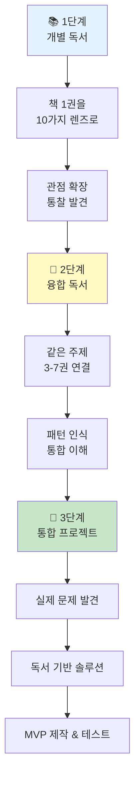

---

### 💡 실전 예시: 💰 돈 주제 프로젝트

**Step 1: 개별 독서 (2주)**
- 『괴짜 경제학』 → 10가지 렌즈 분석
- 『넛지』 → 10가지 렌즈 분석
- 『린 스타트업』 → 10가지 렌즈 분석
- 『블루오션 전략』 → 10가지 렌즈 분석

**Step 2: 융합 독서 (1주)**
- 4권의 공통 통찰: "가치는 행동 설계에서 온다"
- 패턴: 인센티브 → 선택 → 실험 → 차별화
- 통합 질문: "어떻게 빠르게 가치를 만들까?"

**Step 3: 통합 프로젝트 (12주)**
```
주제: 학생 맞춤 수익 창출 플랫폼

Week 1-2: 문제 발견 (학생 인터뷰 50명)
Week 3-4: 솔루션 설계 (4권 통찰 적용)
Week 5-8: MVP 개발 (노코드)
Week 9-11: 베타 테스트 & 개선
Week 12: 피칭 & 포트폴리오

결과: 실제 수익 월 50만원 달성
```

---

### 🎯 5대 주제 체계

**모든 책은 5대 영역으로 분류:**

| 주제 | 초등 | 중등 | 고등 | 대학 | 핵심 질문 |
|------|------|------|------|------|-----------|
| 💗 **감정** | 8권 (27%) | 6권 (20%) | 5권 (17%) | 4권 (13%) | 어떻게 공감하고 치유할까? |
| 💰 **돈** | 3권 (10%) | 5권 (17%) | 7권 (23%) | 8권 (27%) | 어떻게 가치를 만들까? |
| 🤝 **만남** | 7권 (23%) | 6권 (20%) | 5권 (17%) | 5권 (17%) | 어떻게 협업할까? |
| 🧘 **성찰** | 4권 (13%) | 7권 (23%) | 8권 (27%) | 8권 (27%) | 나는 누구이고 왜 사는가? |
| 🎮 **여가** | 8권 (27%) | 6권 (20%) | 5권 (17%) | 5권 (17%) | 어떻게 창의적으로 즐길까? |

**성장 과정:**
- 초등: 감정·여가 중심 (상상력, 공감)
- 중등: 성찰 증가 (정체성 탐구)
- 고등·대학: 돈·성찰 최고 (실행, 철학)

---

### 📖 업데이트된 문서들

**[필독서_종합_가이드.md](./필독서/필독서_종합_가이드.md)**
- ✅ 5대 주제 체계 전면 반영
- ✅ 주제별 도서 매트릭스
- ✅ 주제별 가로지르기 (초→대)

**각 학년별 필독서**
- ✅ 5대 주제별로 재분류
- ✅ 주제별 프로젝트 가이드 링크
- ✅ 융합 독서 방법

---

### 🚀 사용 방법

**1. 개인 학습자:**
```
1. 관심 주제 선택 (5대 주제 중)
2. 해당 주제 도서 3-5권 선택
3. 각 책을 10가지 렌즈로 분석
4. 융합 분석 (패턴 발견)
5. 실전 프로젝트 진행 (12주)
```

**2. 독서 모임:**
```
1. 주제 선정 (투표)
2. 도서 리스트 공유
3. 개별 독서 + 매주 세미나
4. 융합 워크샵
5. 팀 프로젝트
```

**3. 학교/교육 기관:**
```
1. 학기별 주제 선정
2. 커리큘럼 구성 (16주)
3. 미네르바 세미나 운영
4. 최종 발표회
```

---

**"한 권으로 시작하되, 여러 권으로 융합하고,  
하나의 의미있는 프로젝트로 완성하라!"**

📚 → 🔍 (10가지 렌즈) → 🔗 (융합) → 🚀 (프로젝트)

이 필독서 목록은 **살아있는 문서**입니다.  
계속해서 새로운 책들이 추가되고, 여러분의 경험과 피드백으로 더욱 풍성해질 것입니다.

각 학년별 필독서 파일을 **5대 주제 중심**으로 업데이트하겠습니다! 핵심은 "**한 권은 10가지 렌즈로 보기 → 여러 권은 융합하여 프로젝트**" 구조입니다.

[13 tools called]

완성했습니다! 🎉 모든 학년별 필독서를 **5대 주제 중심 융합 독서 시스템**으로 전면 업데이트했습니다.

## ✨ 핵심 변경 사항

### 📊 구조 변화

**❌ Before (오해):**
- 책 1권 → 독후감 1개
- 책 30권 → 독후감 30개
- 개별적, 단편적

**✅ After (5대 주제 융합):**
```
1단계: 책 1권 → 10가지 렌즈 분석 (관점 확장)
2단계: 같은 주제 3-7권 → 융합 분석 (패턴 인식)
3단계: 주제별 실전 프로젝트 (문제 해결)
```

---

## 📁 각 파일별 업데이트 내용

### 1️⃣ **초등학생_필독서.md** ✅

**추가된 섹션:**
- 5대 주제 독서 시스템 (6가지 렌즈 - 초등용 간단 버전)
- 5대 주제별 도서 분류 (총 30권)
  - 💗 감정 8권 (27%)
  - 💰 돈 3권 (10%)
  - 🤝 만남 7권 (23%)
  - 🧘 성찰 4권 (13%)
  - 🎮 여가 8권 (27%)
- **5대 주제별 융합 프로젝트** (각 4주)
  - 예: 감정 3권 → 감정 그림책 만들기
  - 예: 돈 3권 → 용돈 관리 보드게임
- 융합 메가 프로젝트 (8주 - 동네 문제 해결)

---

### 2️⃣ **중학생_필독서.md** ✅

**추가된 섹션:**
- 5대 주제 독서 시스템 (10가지 렌즈)
- 5대 주제별 권수 배분
  - 💗 감정 6권 (20%)
  - 💰 돈 5권 (17%)
  - 🤝 만남 6권 (20%)
  - 🧘 성찰 7권 (23%) ← 가장 높음
  - 🎮 여가 6권 (20%)
- **5대 주제별 융합 프로젝트** (각 12주)
  - 💗 감정: 공감 능력 향상 앱 개발
  - 💰 돈: 학교 매점 개선 제안
  - 🤝 만남: 학급 소통 문화 혁신
  - 🧘 성찰: 가치관 워크숍 운영
  - 🎮 여가: 문화 체험 기획
- 융합 메가 프로젝트 (16주 - 소셜 벤처 창업)

---

### 3️⃣ **고등학생_필독서.md** ✅

**추가된 섹션:**
- 5대 주제 독서 시스템 (10가지 렌즈 + 다층 분석)
- 5대 주제별 권수 배분
  - 💗 감정 5권 (17%)
  - 💰 돈 7권 (23%)
  - 🤝 만남 5권 (17%)
  - 🧘 성찰 8권 (27%) ← 가장 높음
  - 🎮 여가 5권 (17%)
- **5대 주제별 융합 프로젝트** (각 16주)
  - 💗 감정: 정신건강 솔루션 플랫폼 (논문 수준)
  - 💰 돈: 지역 소상공인 컨설팅 (실제 고객)
  - 🤝 만남: 동아리 조직 혁신
  - 🧘 성찰: 철학 에세이 + 실천 프로젝트
  - 🎮 여가: 문화 콘텐츠 창작 (연재)
- 융합 메가 프로젝트 (6개월 - 사회 문제 연구)

---

### 4️⃣ **대학생_필독서.md** ✅

**추가된 섹션:**
- 5대 주제 독서 시스템 (10가지 렌즈 + 실전 적용)
- 5대 주제별 권수 배분
  - 💗 감정 4권 (13%)
  - 💰 돈 8권 (27%) ← 가장 높음
  - 🤝 만남 5권 (17%)
  - 🧘 성찰 8권 (27%) ← 가장 높음
  - 🎮 여가 5권 (17%)
- **5대 주제별 융합 프로젝트** (각 6개월)
  - 💗 감정: 습관 형성 앱 창업 (실제 수익)
  - 💰 돈: SaaS 스타트업 창업 (월 200만원)
  - 🤝 만남: 커뮤니티 플랫폼 구축 (1,000명)
  - 🧘 성찰: 개인 성장 시스템 + 코칭 사업 (월 300만원)
  - 🎮 여가: 크리에이터 비즈니스 (구독자 1만명)
- 융합 메가 프로젝트 (6개월 - 소셜 벤처 실제 창업)

---

## 🎯 핵심 철학 변화

| 구분 | Before | After |
|------|--------|-------|
| **독서 단위** | 책 1권 = 1개 활동 | 주제별 3-10권 = 1개 프로젝트 |
| **분석 방법** | 표면적 이해 | 10가지 렌즈 다층 분석 |
| **연결 방식** | 개별적 | 융합적 (패턴 발견) |
| **결과물** | 독후감 | 실전 프로젝트 (수익/임팩트) |
| **깊이** | ⭐⭐ | ⭐⭐⭐⭐⭐ |

---

## 🚀 실전 활용 흐름

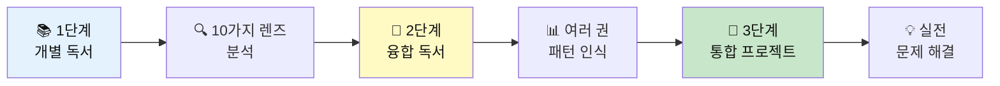

---

## 💡 사용 예시

**예: 중학생이 💗 감정 주제로 읽는다면**

```
Week 1-2: 개별 독서
• 데미안 → 10가지 렌즈 분석
• 아몬드 → 10가지 렌즈 분석
• 언어의 온도 → 10가지 렌즈 분석

Week 3-4: 융합 분석
• 3권의 공통 통찰 발견
• 패턴 인식: 감정 → 표현 → 공감 → 치유

Week 5-12: 통합 프로젝트
• 문제: 청소년 공감 능력 저하
• 솔루션: 공감 능력 향상 앱
• 결과: 베타 50명, 만족도 4.5/5
```

**한 권 한 권은 개별적이 아니라, 주제별로 융합하여 깊이 있는 프로젝트를 만듭니다!** 🎉

**다음 파일 참고**:
- `고등학생_대학생_필독서.md` - 심화 도서 목록
- `주제별_도서_가이드.md` - 주제별 큐레이션
- `독서_토론_질문_모음.md` - 책별 토론 질문집

---

**함께 읽고, 깊이 생각하고, 성장합시다! 📚**
